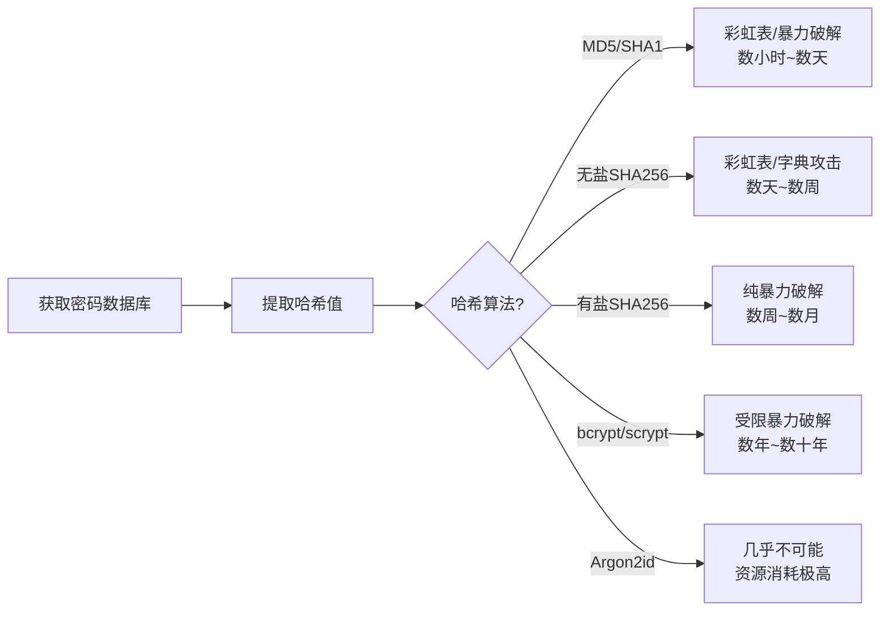
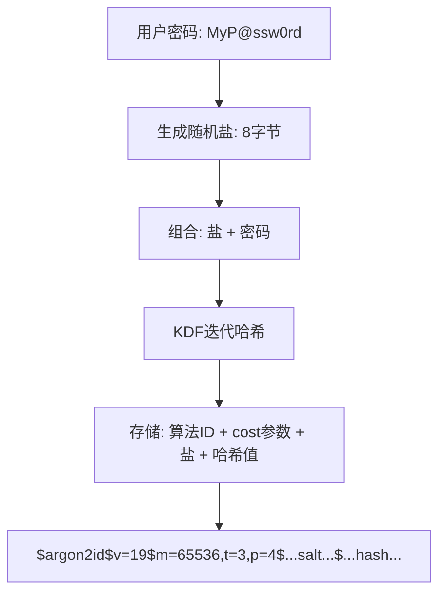
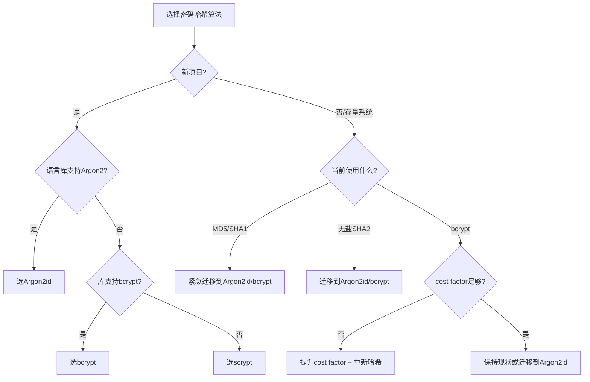

## 技巧二：密码存储最佳实践

> "密码哈希不是你发明加密算法的地方，而是你正确使用已有算法的地方。"

密码存储是整个身份认证体系的基石。一个系统可以有完美的网络隔离、严密的访问控制、精密的入侵检测，但如果密码存储方式存在缺陷，攻击者一旦获取数据库就能在数小时内批量破解大量用户密码。2012年LinkedIn泄露的6500万密码、2016年Dropbox泄露的6800万密码，均因使用了不安全的哈希算法而被大规模破解。本技巧将系统性地讲解密码存储从理论到实践的完整知识体系。

---

### 1. 为什么密码存储如此关键

#### 1.1 攻击模型：离线暴力破解

密码存储的安全性直接决定了数据库泄露后的损失边界。攻击者获取密码数据库后的典型攻击路径如下：



安全密码存储的核心目标是：**即使数据库完全泄露，攻击者也无法在合理时间内恢复明文密码。** 这意味着哈希算法必须具备两个关键特性——抗彩虹表攻击（通过加盐）和抗暴力破解（通过计算代价）。

#### 1.2 历史教训：从明文到现代KDF

密码存储技术的演进本身就是一部安全攻防史：

| 时代 | 方案 | 问题 |
|------|------|------|
| 1970s-1990s | 明文存储 | 数据库泄露=密码全泄露 |
| 1990s-2000s | 单次MD5/SHA1 | 彩虹表可在数秒内完成查表破解 |
| 2000s | 加盐MD5/SHA1 | 无计算代价，GPU暴力破解速度快达每秒数十亿次 |
| 2000s-2010s | bcrypt | 引入计算代价，但GPU优化攻击仍然有效 |
| 2010s | scrypt | 内存硬函数，显著提高GPU攻击成本 |
| 2015至今 | Argon2 | 密码哈希竞赛冠军，同时硬CPU+内存+多线程 |

每一代方案的升级都源于前一代被攻破。理解这个演进脉络，才能真正理解为什么某些做法是"最佳实践"，而不仅仅是"约定俗成"。

---

### 2. 密码哈希的核心原理

#### 2.1 哈希 vs 加密：不可混淆

密码存储的第一条铁律：**密码应该被哈希（hash），而不是被加密（encrypt）。**

| 特性 | 哈希 (Hash) | 加密 (Encrypt) |
|------|------------|----------------|
| 可逆性 | 不可逆（单向） | 可逆（需要密钥） |
| 输出长度 | 固定长度 | 与输入成正比 |
| 密钥需求 | 不需要 | 需要密钥管理 |
| 适用场景 | 密码验证 | 数据传输/存储 |
| 泄露风险 | 原文无法恢复 | 密钥泄露=原文可恢复 |

加密方案的问题在于：你必须安全地管理加密密钥。密钥存储在服务器上，攻击者入侵服务器就能获取密钥并解密所有密码。而哈希是单向函数，即使攻击者获取了哈希值和算法参数，也只能通过暴力尝试来逆推原文。

#### 2.2 单向函数的工作原理

哈希函数将任意长度的输入映射为固定长度的输出，且满足：

- **确定性**：相同输入永远产生相同输出
- **高效性**：正向计算速度快（微秒级）
- **抗原像性**：给定输出H，无法找到输入M使得hash(M)=H
- **抗碰撞性**：很难找到两个不同的输入M1、M2使得hash(M1)=hash(M2)

但普通哈希函数（如SHA-256）设计用于快速计算——这恰恰是密码存储的致命弱点。现代GPU每秒可计算数十亿次SHA-256，使得暴力破解成为可能。

#### 2.3 为什么需要"慢"哈希

密码哈希函数（Password Hashing Function, PHF）刻意被设计为**慢**的。这不是缺陷，而是特性。关键参数是**工作因子（Work Factor）**——控制哈希计算的时间和资源成本。

以bcrypt为例：

```python
# cost_factor=10 → 2^10 = 1024次迭代
hash1 = bcrypt.hashpw(password, bcrypt.gensalt(rounds=10))
# 耗时约100ms

# cost_factor=12 → 2^12 = 4096次迭代
hash2 = bcrypt.hashpw(password, bcrypt.gensalt(rounds=12))
# 耗时约400ms

# cost_factor=14 → 2^14 = 16384次迭代
hash3 = bcrypt.hashpw(password, bcrypt.gensalt(rounds=14))
# 耗时约1.6秒
```

每增加1个cost factor，计算时间翻倍。对于合法用户，每次登录多等几百毫秒毫无感知；但对于攻击者，每秒能尝试的密码数量减少一半。这就是**不对称延迟**——合法用户的微小代价转化为攻击者的巨大成本。

#### 2.4 盐（Salt）的作用

盐是一串随机数据，与密码组合后再进行哈希：



盐解决了两个关键问题：

1. **防彩虹表**：彩虹表是预计算的"密码→哈希"查找表。加盐后，攻击者必须为每个盐值单独构建彩虹表，这使得预计算攻击完全失效。
2. **防批量破解**：无盐时，相同密码产生相同哈希，攻击者破解一个就破解了所有相同密码的用户。加盐后，每个用户的盐值不同，必须逐个破解。

盐的关键要求：

- **必须随机**：使用密码学安全随机数生成器（CSPRNG），如`os.urandom(16)`或`secrets.token_bytes(16)`
- **必须唯一**：每个用户、每次密码修改都应生成新的盐
- **无需保密**：盐与哈希值一起存储在数据库中。盐的目的是增加攻击成本，而不是隐藏信息

#### 2.5 胡椒（Pepper）：可选的额外保护

胡椒是在盐之外的另一个秘密值，通常存储在应用配置或硬件安全模块（HSM）中，而不是数据库中：

```python
# 胡椒存在应用服务器配置中，不在数据库中
PEPPER = os.environ['PASSWORD_PEPPER']  # 从环境变量或HSM获取

def hash_password(password: str, salt: bytes) -> str:
    peppered = password.encode() + PEPPER.encode()
    return argon2.hash(peppered, salt=salt)
```

胡椒的价值在于：即使攻击者获取了完整的密码数据库（包括盐和哈希值），如果没有胡椒，仍然无法开始暴力破解。这实现了**安全分层**——数据库泄露不再是致命事件。

但胡椒也有局限：如果应用服务器被入侵，攻击者同样能获取胡椒。因此胡椒是纵深防御的一环，而非银弹。

---

### 3. 算法选择：从淘汰到推荐

#### 3.1 已淘汰的算法（绝对禁止）

以下算法**绝不能**用于密码存储，无论是否加盐：

| 算法 | 类型 | 为何淘汰 | 暴力破解速度（RTX 4090） |
|------|------|----------|------------------------|
| MD5 | 快速哈希 | 128位输出太短，碰撞攻击已实用化 | ~1700亿次/秒 |
| SHA-1 | 快速哈希 | 160位输出，Google已实现碰撞攻击 | ~600亿次/秒 |
| SHA-256（无迭代） | 快速哈希 | 设计目标是速度，非密码存储 | ~230亿次/秒 |
| SHA-512（无迭代） | 快速哈希 | 同上 | ~80亿次/秒 |
| LANMAN | 传统哈希 | DES-based，仅取14字符，密码分两段独立哈希 | 极快 |
| NTLM | 传统哈希 | MD4-based，无盐，单次哈希 | 极快 |

即使是加盐的MD5，也不是安全的选择——因为缺少工作因子，攻击者可以用GPU以极高速度进行暴力破解。

#### 3.2 当前推荐的算法（按优先级排序）

**第一梯队：Argon2（推荐首选）**

Argon2是2015年密码哈希竞赛（PHC）的冠军，有三个变体：

- **Argon2d**：数据依赖内存访问，抗GPU/ASIC攻击最强，但容易受侧信道攻击
- **Argon2i**：数据独立内存访问，抗侧信道攻击，但GPU抵抗力稍弱
- **Argon2id**：混合模式（先Argon2i再Argon2d），兼顾两者优势，是**推荐选择**

```python
import argon2

hasher = argon2.PasswordHasher(
    time_cost=3,        # 迭代次数（影响CPU时间）
    memory_cost=65536,  # 内存使用量，单位KB（64MB）
    parallelism=4,      # 并行线程数
    hash_len=32,        # 输出哈希长度（字节）
    salt_len=16         # 盐长度（字节）
)

# 哈希密码
hash_value = hasher.hash("MyP@ssw0rd")

# 验证密码（会自动提取盐值）
try:
    hasher.verify(hash_value, "MyP@ssw0rd")
    print("验证成功")
except argon2.exceptions.VerifyMismatchError:
    print("密码错误")
```

Argon2id的推荐参数（OWASP 2024建议）：

| 参数 | 最低要求 | 推荐值 |
|------|---------|--------|
| time_cost | 1 | 3 |
| memory_cost | 4096 KB | 65536 KB (64MB) |
| parallelism | 1 | 4 |

**第二梯队：bcrypt（成熟可靠）**

bcrypt基于Blowfish密码，是经过充分实战检验的选择。最大优点是生态成熟、库支持广泛：

```python
import bcrypt

# 生成哈希（cost factor=12）
password = b"MyP@ssw0rd"
salt = bcrypt.gensalt(rounds=12)
hashed = bcrypt.hashpw(password, salt)
# b'$2b$12$...'格式存储

# 验证密码
if bcrypt.checkpw(password, hashed):
    print("验证成功")

# 迁移：检测旧哈希是否需要升级
def needs_rehash(hashed: bytes) -> bool:
    """当cost factor过低时返回True"""
    # bcrypt格式: $2b$XX$...，XX是cost factor
    cost_str = hashed[4:6]
    current_cost = int(cost_str)
    return current_cost < 12  # 低于推荐值则需要重新哈希
```

bcrypt的限制：

- 最大输入密码长度72字节（超出部分被忽略）
- salt长度固定22字符（128位）
- cost factor最大31

**第三梯队：scrypt（内存硬函数）**

scrypt通过大量内存使用来抵抗硬件加速攻击：

```python
import hashlib

password = b"MyP@ssw0rd"
salt = os.urandom(16)

# N=2^14=16384, r=8, p=1
# 内存使用量 ≈ 128 * N * r 字节 = 16MB
hashed = hashlib.scrypt(
    password, 
    salt=salt, 
    n=16384,    # CPU/内存开销参数（2的幂次）
    r=8,        # 块大小
    p=1,        # 并行度
    dklen=32    # 输出长度
)
```

scrypt的主要缺点是没有内置的参数格式标准化，需要自行管理盐和参数的存储。

#### 3.3 算法选择决策树



---

### 4. 完整实现指南

#### 4.1 数据库Schema设计

密码哈希值需要足够的存储空间，并且应该支持存储算法元数据：

```sql
-- 推荐的用户表结构
CREATE TABLE users (
    id              BIGINT PRIMARY KEY AUTO_INCREMENT,
    username        VARCHAR(64) NOT NULL UNIQUE,
    email           VARCHAR(255) NOT NULL UNIQUE,
    
    -- 密码存储字段
    password_hash   VARCHAR(255) NOT NULL,  -- 完整的哈希字符串（含算法ID+参数+盐+哈希）
    password_algo   VARCHAR(32)  NOT NULL,  -- 'argon2id', 'bcrypt', 'scrypt'
    password_cost   VARCHAR(32)  NOT NULL,  -- 成本参数，如argon2id的'm=65536,t=3,p=4'
    password_changed_at TIMESTAMP NOT NULL DEFAULT CURRENT_TIMESTAMP,
    
    -- 安全相关字段
    failed_attempts    INT NOT NULL DEFAULT 0,
    lockout_until      TIMESTAMP NULL,
    last_login_at      TIMESTAMP NULL,
    password_version   INT NOT NULL DEFAULT 1,  -- 密码版本号，用于强制重置
    
    INDEX idx_email (email)
) ENGINE=InnoDB;
```

`password_hash`字段使用VARCHAR(255)而非固定长度的原因是：Argon2的完整哈希字符串通常在100-200字符之间，bcrypt为60字符，且未来算法可能需要更多空间。存储完整的哈希字符串（包含算法标识、参数、盐值）是最安全的做法，因为它让密码验证代码无需从其他字段拼接参数。

#### 4.2 安全的密码验证流程

密码验证不仅仅是"比较哈希值"。一个安全的实现需要考虑多个环节：

```python
import argon2
import secrets
import time
from datetime import datetime, timedelta

class PasswordManager:
    """密码管理器：哈希、验证、迁移"""
    
    # 推荐参数
    ARGON2_TIME_COST = 3
    ARGON2_MEMORY_COST = 65536  # 64MB
    ARGON2_PARALLELISM = 4
    MAX_FAILED_ATTEMPTS = 5
    LOCKOUT_DURATION = timedelta(minutes=15)
    
    def __init__(self, pepper: str = None):
        self.hasher = argon2.PasswordHasher(
            time_cost=self.ARGON2_TIME_COST,
            memory_cost=self.ARGON2_MEMORY_COST,
            parallelism=self.ARGON2_PARALLELISM,
        )
        self.pepper = pepper  # 可选的胡椒值
    
    def _apply_pepper(self, password: str) -> bytes:
        """应用胡椒（如果配置了）"""
        if self.pepper:
            return (password + self.pepper).encode('utf-8')
        return password.encode('utf-8')
    
    def hash_password(self, password: str) -> str:
        """哈希密码，返回Argon2完整哈希字符串"""
        peppered = self._apply_pepper(password)
        return self.hasher.hash(peppered)
    
    def verify_password(self, password: str, stored_hash: str, 
                        failed_attempts: int = 0, 
                        lockout_until: datetime = None) -> dict:
        """
        验证密码，返回验证结果和状态
        返回: {"success": bool, "message": str, "needs_rehash": bool}
        """
        # 1. 检查账户锁定
        if lockout_until and lockout_until > datetime.utcnow():
            remaining = (lockout_until - datetime.utcnow()).seconds
            return {
                "success": False,
                "message": f"账户已锁定，请{remaining}秒后重试",
                "needs_rehash": False
            }
        
        # 2. 防时序攻击：用固定时间比较
        # argon2.verify本身已经处理了时序攻击，这里额外加一层保险
        peppered = self._apply_pepper(password)
        try:
            self.hasher.verify(stored_hash, peppered)
            # 验证通过
            return {
                "success": True,
                "message": "验证成功",
                "needs_rehash": self.hasher.check_needs_rehash(stored_hash)
            }
        except argon2.exceptions.VerifyMismatchError:
            # 密码错误
            return {
                "success": False,
                "message": "密码错误",
                "needs_rehash": False
            }
        except argon2.exceptions.InvalidHashError:
            # 哈希格式损坏
            return {
                "success": False,
                "message": "认证系统错误",
                "needs_rehash": False
            }
```

#### 4.3 安全的密码修改流程

密码修改不只是"生成新哈希"那么简单：

```python
def change_password(user_id: int, old_password: str, new_password: str):
    """安全的密码修改流程"""
    
    # 1. 验证旧密码
    user = db.get_user(user_id)
    result = password_manager.verify_password(
        old_password, 
        user['password_hash'],
        user['failed_attempts'],
        user['lockout_until']
    )
    if not result['success']:
        record_failed_attempt(user_id)
        raise AuthError(result['message'])
    
    # 2. 密码强度检查（详见下方小节）
    strength = check_password_strength(new_password)
    if strength['score'] < 3:
        raise ValidationError(f"密码强度不足：{strength['suggestion']}")
    
    # 3. 检查新密码是否与最近使用过的密码重复
    if is_password_reused(user_id, new_password):
        raise ValidationError("不能使用最近使用过的密码")
    
    # 4. 生成新哈希
    new_hash = password_manager.hash_password(new_password)
    
    # 5. 更新数据库（使用事务）
    with db.transaction():
        db.update_password(user_id, new_hash)
        db.reset_failed_attempts(user_id)
        db.increment_password_version(user_id)
    
    # 6. 使所有其他会话失效
    invalidate_all_sessions(user_id)
    
    # 7. 发送通知（可选但推荐）
    send_password_changed_notification(user_id)
```

#### 4.4 从旧算法迁移

迁移到新哈希算法必须采用**渐进式**策略——在用户下次登录时逐步迁移：

```python
def login_with_migration(username: str, password: str):
    """带渐进迁移的登录流程"""
    
    user = db.get_user_by_username(username)
    if not user:
        # 防止用户名枚举：即使用户不存在也执行一次哈希
        password_manager.hash_password(password)
        raise AuthError("用户名或密码错误")
    
    # 检测当前哈希算法
    current_algo = user['password_algo']
    
    if current_algo == 'argon2id':
        # 已是最新算法，正常验证
        result = password_manager.verify_password(
            password, user['password_hash']
        )
        if not result['success']:
            handle_failed_login(user)
            raise AuthError("用户名或密码错误")
        
        # 检查是否需要重新哈希（参数升级）
        if result['needs_rehash']:
            new_hash = password_manager.hash_password(password)
            db.update_password(user['id'], new_hash)
        
        return user
    
    elif current_algo == 'md5':
        # 旧算法：用md5验证，成功后用argon2id重新哈希
        if verify_md5_legacy(password, user['password_hash']):
            # 验证成功，立即用新算法重新哈希
            new_hash = password_manager.hash_password(password)
            db.update_password_with_algo(user['id'], new_hash, 'argon2id')
            handle_failed_login_reset(user)
            return user
        else:
            handle_failed_login(user)
            raise AuthError("用户名或密码错误")
    
    elif current_algo == 'bcrypt':
        # 旧bcrypt：验证后检查cost是否需要升级
        if bcrypt.checkpw(password.encode(), user['password_hash'].encode()):
            if needs_rehash_bcrypt(user['password_hash']):
                new_hash = password_manager.hash_password(password)
                db.update_password(user['id'], new_hash)
            handle_failed_login_reset(user)
            return user
        else:
            handle_failed_login(user)
            raise AuthError("用户名或密码错误")
```

这种"登录时迁移"策略的关键优势：

- **零停机时间**：不需要维护窗口或用户强制重置密码
- **用户体验友好**：用户感知不到后台的算法升级
- **风险可控**：只有成功登录的用户才会迁移，不会因为迁移bug导致用户锁定
- **渐进推进**：活跃用户几天内迁移完成，不活跃用户可以设定截止日期后强制重置

---

### 5. 常见误区与纠正

#### 5.1 误区一：用SHA-256+盐就够了

**为什么是错的**：SHA-256设计目标是快速计算（每秒数十亿次），即使加盐也缺乏工作因子。GPU上每秒可尝试数十亿种密码组合。

**正确做法**：使用专门的密码哈希函数（Argon2id/bcrypt/scrypt），它们内置了可调节的工作因子。

#### 5.2 误区二：多次SHA-256哈希等于慢哈希

```python
# ❌ 错误：自创的"多次哈希"
def bad_hash(password, salt):
    h = password.encode()
    for i in range(100000):
        h = hashlib.sha256(h + salt).digest()
    return h
```

**为什么是错的**：

- 缺乏标准化的参数格式，升级迭代次数时无法区分新旧哈希
- 没有内存硬特性，GPU/ASIC优化攻击仍然有效
- 自制密码哈希是密码学大忌——你几乎一定会引入微妙的安全漏洞

**正确做法**：使用经过同行评审的、标准化的密码哈希函数。Argon2id的参数格式（`$argon2id$v=19$m=65536,t=3,p=4$...salt...$...hash...`）已经被所有主流库支持。

#### 5.3 误区三：密码加密存储（使用AES等对称加密）

**为什么是错的**：加密需要密钥。密钥必须存储在某个地方（服务器配置、环境变量、密钥管理服务）。如果攻击者能读取数据库，通常也能读取这些配置——此时加密形同虚设。

**正确做法**：哈希是单向函数，不需要密钥管理。密钥管理是密码存储安全中最脆弱的环节，能避免就避免。

#### 5.4 误区四：固定盐值（所有用户共用一个盐）

**为什么是错的**：固定的盐值使得攻击者可以为这个盐预计算一次彩虹表，然后批量破解所有用户。这完全丧失了加盐的意义。

**正确做法**：每个用户、每次密码修改都应生成独立的随机盐值。

#### 5.5 误区五：密码长度限制不重要

**为什么是错的**：某些算法有硬性的最大输入长度（如bcrypt为72字节）。如果用户输入了200字符的密码但只有前72字符参与哈希，那么该密码的实际安全性被大幅降低。

**正确做法**：在应用层对密码进行预处理。OWASP推荐的方案是先对长密码进行SHA-256哈希（作为预处理），再将结果输入密码哈希函数：

```python
import hashlib

def normalize_password(password: str, max_length: int = 72) -> bytes:
    """
    预处理密码，避免长密码被截断。
    对于bcrypt等有长度限制的算法，先哈希再加盐。
    """
    if len(password.encode('utf-8')) <= max_length:
        return password.encode('utf-8')
    # 长密码先SHA-256哈希，再输入bcrypt
    return hashlib.sha256(password.encode('utf-8')).hexdigest().encode('utf-8')
```

Argon2没有硬性密码长度限制（但建议不超过128KB），这是它优于bcrypt的另一个方面。

---

### 6. 进阶实践

#### 6.1 密码策略：服务端验证

密码策略应该在服务端强制执行，而不是仅依赖客户端：

```python
import re

def check_password_strength(password: str) -> dict:
    """
    密码强度评估（服务端）
    返回: {"score": int(0-5), "issues": list, "suggestion": str}
    """
    issues = []
    
    # 长度检查（最低要求12字符）
    if len(password) < 12:
        issues.append("密码长度至少12个字符")
    
    # 最大长度（防止DoS：限制哈希计算的输入大小）
    if len(password) > 128:
        issues.append("密码长度不超过128个字符")
    
    # 字符多样性
    has_upper = bool(re.search(r'[A-Z]', password))
    has_lower = bool(re.search(r'[a-z]', password))
    has_digit = bool(re.search(r'\d', password))
    has_special = bool(re.search(r'[!@#$%^&amp;*(),.?":{}|<>]', password))
    
    diversity = sum([has_upper, has_lower, has_digit, has_special])
    if diversity < 3:
        issues.append("建议混合使用大写字母、小写字母、数字和特殊字符")
    
    # 常见密码检查（使用Have I Been Pwned的密码API）
    if is_common_password(password):
        issues.append("此密码已在数据泄露中出现过，请更换")
    
    # 重复字符检查
    if re.search(r'(.)\1{3,}', password):
        issues.append("避免连续重复4次以上的字符")
    
    # 键盘序列检查
    keyboard_patterns = ['qwerty', 'asdfgh', 'zxcvbn', '123456', 'abcdef']
    if any(p in password.lower() for p in keyboard_patterns):
        issues.append("避免使用键盘序列或简单递增模式")
    
    # 评分
    score = 5 - len(issues)
    score = max(0, min(5, score))
    
    return {
        "score": score,
        "issues": issues,
        "suggestion": "；".join(issues) if issues else "密码强度良好"
    }
```

**重要提醒**：密码最大长度应设置为128字符——太短会限制用户选择强密码（如密码管理器生成的长密码），太长则可能被用于拒绝服务攻击（攻击者发送极长密码消耗服务器CPU进行哈希计算）。

#### 6.2 防暴力破解：限速与锁定

```python
import time
from collections import defaultdict

class RateLimiter:
    """基于滑动窗口的密码尝试限速"""
    
    def __init__(self):
        self.attempts = defaultdict(list)  # user_id -> [timestamp, ...]
        self.MAX_ATTEMPTS_PER_MINUTE = 5
        self.MAX_ATTEMPTS_PER_HOUR = 20
        self.LOCKOUT_THRESHOLD = 10  # 连续失败10次锁定
        self.LOCKOUT_DURATION = 1800  # 30分钟
    
    def record_attempt(self, user_id: int, success: bool) -> dict:
        """记录一次尝试，返回是否应阻止"""
        now = time.time()
        
        if not success:
            self.attempts[user_id].append(now)
        
        # 清理过期记录
        self.attempts[user_id] = [
            t for t in self.attempts[user_id] 
            if now - t < 3600  # 保留1小时内的记录
        ]
        
        recent_1min = sum(1 for t in self.attempts[user_id] if now - t < 60)
        recent_1hour = len(self.attempts[user_id])
        
        # 检查是否应阻止
        if recent_1min >= self.MAX_ATTEMPTS_PER_MINUTE:
            return {"blocked": True, "reason": "每分钟尝试次数过多，请1分钟后再试"}
        
        if recent_1hour >= self.LOCKOUT_THRESHOLD:
            return {"blocked": True, "reason": "连续失败次数过多，请30分钟后再试"}
        
        return {"blocked": False}
```

#### 6.3 监控与告警

密码哈希系统的健康监控需要关注几个关键指标：

```bash
# 监控密码哈希的平均耗时（通过应用日志或APM）
# 如果平均哈希时间显著下降，可能意味着cost factor被意外降低

# 监控异常的登录失败率
# 失败率突增可能意味着撞库攻击
```

建议监控的核心指标：

| 指标 | 正常范围 | 告警阈值 | 可能原因 |
|------|---------|---------|---------|
| 密码哈希平均耗时 | 100-500ms | <50ms或>2s | cost factor被修改或系统过载 |
| 登录失败率 | <5% | >15% | 撞库攻击或密码过期潮 |
| 账户锁定频率 | <0.1%/天 | >1%/天 | 撞库攻击或用户忘记密码 |
| 迁移进度（旧算法） | 递减趋势 | 停滞不变 | 迁移流程存在bug |

#### 6.4 多因素认证（MFA）：密码的必要补充

无论密码哈希方案多安全，密码本身仍然是单因素认证。强烈建议部署MFA：

- **TOTP（时间一次性密码）**：Google Authenticator、Authy等
- **WebAuthn/FIDO2**：硬件安全密钥（YubiKey）或平台认证器（Touch ID、Windows Hello）
- **备份码**：在用户丢失第二因素时的恢复手段

MFA不替代安全的密码存储，而是作为纵深防御的关键一环。即使密码被破解，攻击者仍需第二因素。

---

### 7. 各语言实现参考

#### 7.1 Node.js（使用argon2库）

```javascript
const argon2 = require('argon2');

// 哈希密码
async function hashPassword(password) {
    return await argon2.hash(password, {
        type: argon2.argon2id,
        memoryCost: 65536,    // 64MB
        timeCost: 3,
        parallelism: 4,
        saltLength: 16,
        hashLength: 32,
    });
}

// 验证密码
async function verifyPassword(storedHash, password) {
    try {
        const valid = await argon2.verify(storedHash, password);
        return { success: valid, needsRehash: argon2.needsRehash(storedHash) };
    } catch (err) {
        return { success: false, needsRehash: false };
    }
}
```

#### 7.2 Java（使用Spring Security的BCryptPasswordEncoder + 建议迁移到Argon2）

```java
import org.springframework.security.crypto.argon2.Argon2PasswordEncoder;

// 推荐：使用Spring Security的Argon2支持
Argon2PasswordEncoder encoder = Argon2PasswordEncoder.defaultsForSpringSecurity_v5_8();

// 哈希密码
String hash = encoder.encode("MyP@ssw0rd");

// 验证密码
boolean matches = encoder.matches("MyP@ssw0rd", hash);
```

#### 7.3 Go（使用golang.org/x/crypto）

```go
package auth

import (
    "golang.org/x/crypto/argon2"
    "crypto/rand"
    "encoding/hex"
)

func HashPassword(password string) (string, error) {
    salt := make([]byte, 16)
    if _, err := rand.Read(salt); err != nil {
        return "", err
    }
    
    // Argon2id: time=3, memory=64MB, threads=4
    hash := argon2.IDKey([]byte(password), salt, 3, 64*1024, 4, 32)
    
    // 存储格式: argon2id$时间$内存$线程$盐$哈希
    return fmt.Sprintf("argon2id$%d$%d$%d$%s$%s",
        3, 64*1024, 4,
        hex.EncodeToString(salt),
        hex.EncodeToString(hash),
    ), nil
}
```

---

### 8. 速查表

#### 8.1 算法选择速查

| 场景 | 推荐算法 | 参数建议 | 适用条件 |
|------|---------|---------|---------|
| 新项目首选 | Argon2id | m=65536, t=3, p=4 | 库支持好 |
| 成熟系统 | bcrypt | rounds=12 | 需要最广泛的兼容性 |
| 内存受限环境 | scrypt | N=16384, r=8, p=1 | 嵌入式/IoT |
| 已使用SHA系列 | 尽快迁移 | — | 紧急安全修复 |

#### 8.2 检查清单

- [ ] 使用Argon2id或bcrypt，而非SHA系列
- [ ] 每个用户使用独立的随机盐
- [ ] 盐使用CSPRNG生成（`secrets`或`os.urandom`）
- [ ] cost factor/工作因子设置在推荐范围内
- [ ] 代码中没有任何自创的哈希逻辑
- [ ] 密码最大长度限制在128字符
- [ ] 验证逻辑抵抗时序攻击
- [ ] 实施了登录失败限速
- [ ] 部署了MFA作为第二因素
- [ ] 旧算法的迁移计划已制定并执行
- [ ] 密码哈希相关的监控和告警已配置
- [ ] 定期审查并更新cost factor（随硬件性能提升）

---

### 9. 总结

密码存储最佳实践的核心要点可以归纳为三条原则：

1. **使用对的工具**：选择经过同行评审的密码哈希函数（首选Argon2id），绝不要自创加密逻辑
2. **设置对的参数**：cost factor必须足够高——在用户可接受的延迟范围内取最大值，并随硬件性能定期提升
3. **建立纵深防御**：安全密码存储只是基础，还需要限速、账户锁定、MFA、监控告警等多层保护

记住：密码存储安全是一个持续的过程，不是一次性配置。硬件在进步，攻击手段在演进，你的防护措施也必须持续更新。
