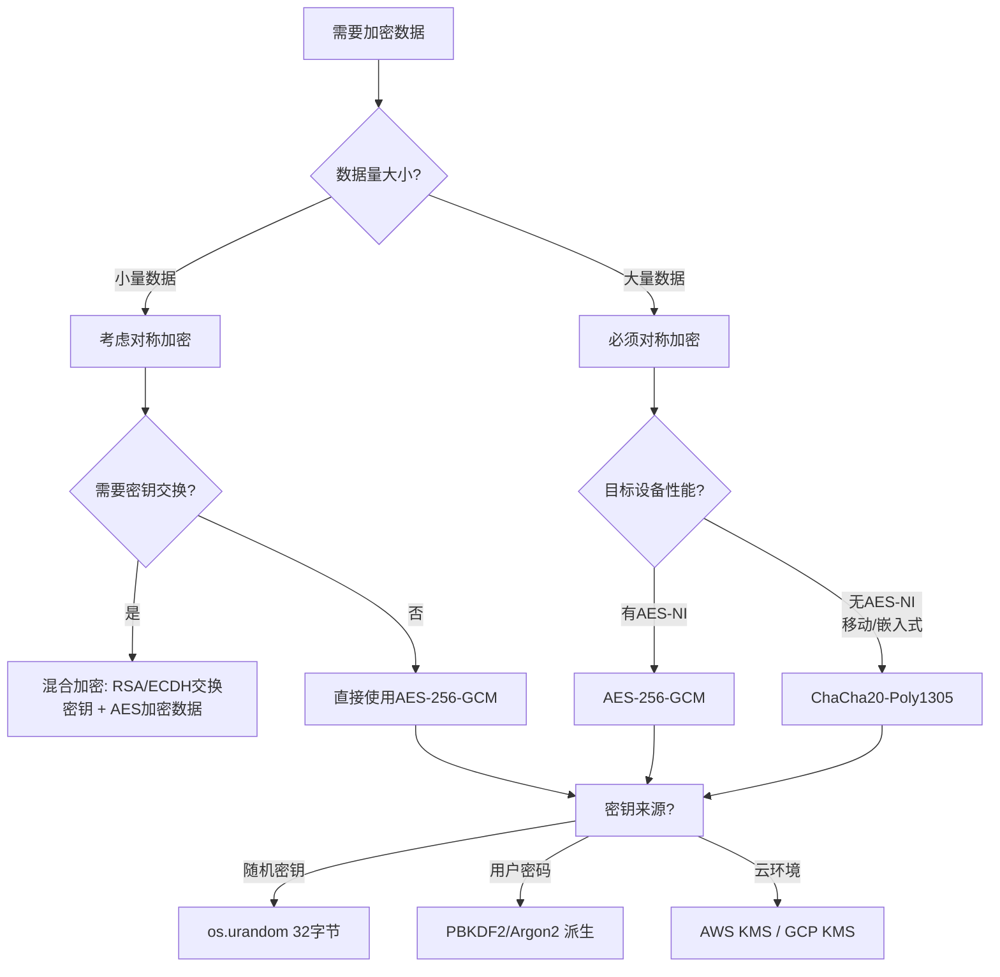

## 一、什么是对称加密

对称加密（Symmetric Encryption）是指加密和解密使用**同一把密钥**的加密方式。发送方用密钥将明文转换为密文，接收方用相同的密钥将密文还原为明文。这就像一把钥匙既能锁门也能开门——钥匙就是那把共享的密钥。

与之对应的非对称加密（公钥加密）使用一对密钥：公钥加密、私钥解密。对称加密的核心优势在于**速度**——AES 加密速度通常比 RSA 快 100-1000 倍，因此对称加密是处理大量数据的首选方案。


### 1.1 对称加密的核心特征

| 特征 | 说明 |
|------|------|
| 密钥对称性 | 加密和解密使用相同的密钥 |
| 速度快 | 适合加密大体量数据（文件、数据库、磁盘） |
| 密钥分发难题 | 双方必须安全地共享同一把密钥 |
| 扩展性差 | N 个用户互通需要 N(N-1)/2 把密钥 |
| 无数字签名 | 无法证明消息来源（需配合 MAC 或非对称加密） |

### 1.2 对称加密的两大分类

对称加密算法分为两大类：

- **分组密码（Block Cipher）**：将明文分成固定大小的块（如 128 位），逐块加密。代表算法：AES、DES、3DES、Blowfish、Twofish。
- **流密码（Stream Cipher）**：将明文逐位（或逐字节）与密钥流进行异或运算，逐流加密。代表算法：ChaCha20、RC4（已不安全）、Salsa20。

| 对比维度 | 分组密码 | 流密码 |
|----------|----------|--------|
| 加密单位 | 固定大小的块（通常 128 位） | 逐位或逐字节 |
| 加密长度 | 必须是块大小的整数倍（需要填充） | 任意长度，无需填充 |
| 并行处理 | 部分模式可并行（CTR、GCM） | 天然支持流式处理 |
| 典型算法 | AES-128/192/256 | ChaCha20 |
| 典型场景 | 磁盘加密、文件加密、数据库加密 | TLS 1.3、VPN 流量加密 |

---

## 二、AES：现代对称加密的基石

AES（Advanced Encryption Standard，高级加密标准）由美国国家标准与技术研究院（NIST）于 2001 年选定，替代了老旧的 DES 算法。它源自比利时密码学家 Joan Daemen 和 Vincent Rijmen 设计的 Rijndael 算法。

### 2.1 AES 的设计原理

AES 是一种**替代-置换网络（Substitution-Permutation Network, SPN）**结构的分组密码。它将 128 位（16 字节）的明文块视为一个 4×4 的字节矩阵（称为**状态矩阵 State**），通过多轮迭代变换完成加密。

每一轮包含四个操作：

1. **字节替换（SubBytes）**：每个字节通过 S-Box 替换表进行非线性替换，这是 AES 唯一的非线性操作，提供**混淆（Confusion）**特性。
2. **行移位（ShiftRows）**：状态矩阵的每一行循环左移不同的偏移量（第 0 行不移，第 1 行移 1 位，第 2 行移 2 位，第 3 行移 3 位），提供**扩散（Diffusion）**特性。
3. **列混合（MixColumns）**：对每一列进行矩阵乘法运算（在 GF(2^8) 有限域上），将单个字节的影响扩散到整列，进一步增强扩散性。
4. **轮密钥加（AddRoundKey）**：将当前状态与该轮的子密钥进行异或运算，引入密钥材料。

```plaintext
┌─────────────────────────────────────────────────────┐
│                  AES 加密流程                         │
│                                                      │
│  明文(128bit)                                        │
│       │                                              │
│       ▼                                              │
│  [初始轮密钥加]                                       │
│       │                                              │
│       ▼                                              │
│  ┌─→ [字节替换 SubBytes]                             │
│  │     │                                             │
│  │     ▼                                             │
│  │   [行移位 ShiftRows]                              │
│  │     │                                             │
│  │     ▼                                             │
│  │   [列混合 MixColumns]  ← 仅前N-1轮                 │
│  │     │                                             │
│  │     ▼                                             │
│  └─ [轮密钥加 AddRoundKey]                           │
│       │                                              │
│       │  重复 N 轮                                    │
│       ▼                                              │
│  密文(128bit)                                        │
└─────────────────────────────────────────────────────┘
```

### 2.2 密钥长度与安全性

AES 支持三种密钥长度，对应不同的安全级别和性能表现：

| 密钥长度 | 分组大小 | 轮数 | 密钥空间 | 安全等级 | 性能对比 |
|----------|----------|------|----------|----------|----------|
| AES-128 | 128 位 | 10 轮 | 2^128 ≈ 3.4×10^38 | 128 位安全 | 最快（基准） |
| AES-192 | 128 位 | 12 轮 | 2^192 ≈ 6.3×10^57 | 192 位安全 | 慢约 20% |
| AES-256 | 128 位 | 14 轮 | 2^256 ≈ 1.2×10^77 | 256 位安全 | 慢约 40% |

**如何选择密钥长度？**

- **AES-128**：足以应对绝大多数商业和政府场景。以当前计算能力，暴力破解需要的能量超过太阳输出的总能量。
- **AES-192**：适用于需要更高安全边际的场景，如长期数据保护。
- **AES-256**：美国政府 TOP SECRET 级别要求使用 AES-256。考虑到量子计算机的潜在威胁（Grover 算法可将有效安全强度减半），AES-256 在后量子时代仍提供 128 位安全强度。

> **关键认知**：没有已知的实用攻击能有效破解全轮 AES。AES 的安全性经过全球密码学界 20 多年的严格审查，是目前最值得信赖的对称加密算法。

### 2.3 AES 的四种标准操作模式

AES 作为分组密码，每次只能加密一个 128 位的块。要加密更长的数据，需要定义**工作模式（Block Cipher Mode of Operation）**。不同的工作模式在安全性、并行性、错误传播等方面有显著差异。

#### ECB 模式（电子密码本）

明文块1 ─→ [AES-K] ─→ 密文块1
明文块2 ─→ [AES-K] ─→ 密文块2
明文块3 ─→ [AES-K] ─→ 密文块3

ECB 是最简单的模式：每个块独立加密，相同的明文块总是产生相同的密文块。**这导致严重的安全问题**——攻击者可以通过观察密文的重复模式推断明文结构。经典的"ECB 企鹅"图片就展示了这一缺陷：加密后的图片仍能辨认出企鹅的轮廓。

**结论：ECB 仅适用于加密单个块的数据，永远不要用于多块数据加密。**

#### CBC 模式（密码分组链接）

         IV
          │
          ▼
明文块1 ──⊕──→ [AES-K] ─→ 密文块1
              ↓
明文块2 ──⊕──→ [AES-K] ─→ 密文块2
              ↓
明文块3 ──⊕──→ [AES-K] ─→ 密文块3

CBC 模式通过将每个明文块与前一个密文块进行异或来引入随机性。第一个块与一个随机的**初始化向量（IV）**异或。这确保了即使相同的明文，只要 IV 不同，密文就会完全不同。

**优点**：消除了 ECB 的模式暴露问题；支持随机读取（解密时需要前一个密文块）。

**缺点**：加密必须串行进行（后一个块依赖前一个密文）；需要填充（PKCS#7 等）；存在**填充预言机攻击（Padding Oracle Attack）**风险。

#### CTR 模式（计数器模式）

计数器1 ─→ [AES-K] ─→ 密钥流1 ──⊕──→ 密文块1
计数器2 ─→ [AES-K] ─→ 密钥流2 ──⊕──→ 密文块2
计数器3 ─→ [AES-K] ─→ 密钥流3 ──⊕──→ 密文块3

CTR 模式将分组密码转换为**流密码**：对递增的计数器值进行加密生成密钥流，然后与明文异或。计数器通常由 nonce + 块编号构成。

**优点**：完全可并行化（加密和解密均可）；支持随机访问（可以直接解密第 N 块）；无需填充。

**缺点**：**相同的 nonce+key 组合绝对不能重复使用**——否则密钥流相同，两次密文异或就能还原两次明文的异或值，攻击者可利用统计分析恢复明文。

#### GCM 模式（Galois/Counter 模式）

计数器1 ─→ [AES-K] ─→ 密钥流1 ──⊕──→ 密文块1 ─┐
                                          │      │
计数器2 ─→ [AES-K] ─→ 密钥流2 ──⊕──→ 密文块2 ─┤
                                          │      │
                                          ▼      ▼
                                    [GHASH 认证标签]

GCM 是 CTR 模式的增强版，在加密的同时计算**认证标签（Authentication Tag）**，实现**认证加密（Authenticated Encryption, AE）**。它不仅保证机密性，还保证数据的完整性和真实性——任何篡改都会导致认证标签验证失败。

**GCM 是目前推荐的默认加密模式**，被 TLS 1.3、IPsec、WireGuard 等主流协议采用。

#### 四种模式全面对比

| 特性 | ECB | CBC | CTR | GCM |
|------|-----|-----|-----|-----|
| 随机 IV/Nonce | 不需要 | 需要 | 需要 | 需要 |
| 认证完整性 | ❌ | ❌ | ❌ | ✅ |
| 可并行加密 | ✅ | ❌ | ✅ | ✅ |
| 可并行解密 | ✅ | ❌ | ✅ | ✅ |
| 随机访问 | ✅ | ❌ | ✅ | ✅ |
| 需要填充 | ✅ | ✅ | ❌ | ❌ |
| 填充预言机风险 | — | ⚠️ | — | — |
| 错误传播 | 无 | 1 块 | 无 | 无（但标签失效） |
| 推荐程度 | ❌ 禁用 | ⚠️ 慎用 | ✅ 可用 | ✅✅ 首选 |

### 2.4 AES 的安全性分析

**已知攻击方式及 AES 的防御状况：**

| 攻击方式 | AES-128 | AES-192 | AES-256 | 说明 |
|----------|---------|---------|---------|------|
| 暴力搜索 | 2^128 次 | 2^192 次 | 2^256 次 | 均不可行 |
| 相关密钥攻击 | 理论存在 | 理论存在 | 理论存在 | 需要特殊条件，实际不可行 |
| 侧信道攻击 | ⚠️ 可能 | ⚠️ 可能 | ⚠️ 可能 | 需要物理接触设备，需常数时间实现 |
| 量子 Grover 算法 | 2^64 有效强度 | 2^96 有效强度 | 2^128 有效强度 | 量子计算机尚不成熟 |
| 大量子计算机 | 仍需 2^64 运算 | 仍需 2^96 运算 | 仍需 2^128 运算 | 远超现有计算能力 |

**核心结论**：AES 算法本身目前没有有效的密码学攻击。实际安全威胁主要来自侧信道攻击（时序攻击、功耗分析等）和密钥管理不当，而非算法缺陷。

---

## 三、ChaCha20-Poly1305：移动端的首选

### 3.1 为什么需要 ChaCha20

AES 虽然强大，但它依赖**硬件加速指令集（AES-NI）**来实现高性能。在没有 AES-NI 的设备上（如许多 ARM 处理器的手机和平板），AES 的纯软件实现性能较差。

ChaCha20 是由 Daniel J. Bernstein 设计的流密码，基于 ARX（加法-旋转-异或）运算，这些操作在所有处理器上都能高效执行。Google 在 2014 年将 ChaCha20-Poly1305 引入 TLS，以改善 Android 设备的加密性能和安全性。

### 3.2 ChaCha20-Poly1305 的结构

ChaCha20-Poly1305 是一个**认证加密（AEAD）**方案，由两部分组成：

- **ChaCha20**：流密码，负责加密。使用 256 位密钥、96 位 nonce、64 位计数器。内部核心是 20 轮的"四分之一轮（Quarter Round）"操作。
- **Poly1305**：消息认证码（MAC），负责完整性验证。基于多项式哈希，提供 128 位认证强度。

### 3.3 ChaCha20-Poly1305 的优势

| 优势 | 说明 |
|------|------|
| 纯软件高效 | 不依赖硬件指令，在所有平台上性能稳定 |
| 抗侧信道 | ARX 运算天然具有一定的时序恒定特性 |
| 认证加密 | 同时提供机密性和完整性保护 |
| nonce 容忍 | 支持 2^64 个消息使用同一密钥（远超 AES-GCM 的 2^32 限制） |
| TLS 1.3 标准 | 被 TLS 1.3 列为与 AES-GCM 并列的首选算法 |

### 3.4 性能对比

在支持 AES-NI 的现代 x86 处理器上：

| 算法 | 吞吐量（GB/s） | 说明 |
|------|----------------|------|
| AES-256-GCM（硬件加速） | ~5-10 GB/s | 最快 |
| ChaCha20-Poly1305（软件） | ~2-4 GB/s | 次快 |
| AES-256-GCM（纯软件） | ~0.3-0.5 GB/s | 最慢 |

在没有 AES-NI 的 ARM 设备上，ChaCha20-Poly1305 通常比 AES-GCM 快 2-3 倍。

---

## 四、实战：Python 密码学编程

### 4.1 AES-256-GCM 加密（推荐方案）

AES-256-GCM 是目前最推荐的对称加密方案，同时提供加密和认证。

```python
from cryptography.hazmat.primitives.ciphers.aead import AESGCM
import os

def aes_gcm_encrypt(key: bytes, plaintext: bytes, aad: bytes = b"") -> tuple[bytes, bytes]:
    """
    AES-256-GCM 加密
    
    Args:
        key: 256 位密钥（32 字节）
        plaintext: 明文数据
        aad: 附加认证数据（Additional Authenticated Data），不加密但参与认证
    
    Returns:
        (nonce, ciphertext_with_tag): nonce 和带认证标签的密文
    """
    nonce = os.urandom(12)  # 96 位随机 nonce
    aesgcm = AESGCM(key)
    # ciphertext 包含 16 字节的认证标签
    ciphertext = aesgcm.encrypt(nonce, plaintext, aad)
    return nonce, ciphertext

def aes_gcm_decrypt(key: bytes, nonce: bytes, ciphertext: bytes, aad: bytes = b"") -> bytes:
    """
    AES-256-GCM 解密
    
    如果密文被篡改或密钥错误，会抛出 InvalidTag 异常
    """
    aesgcm = AESGCM(key)
    return aesgcm.decrypt(nonce, ciphertext, aad)

# 使用示例
key = AESGCM.generate_key(bit_length=256)
plaintext = b"这是一段需要加密的敏感数据"

# 加密（附带 AAD 作为上下文绑定）
aad = b"user_id:12345"  # 附加认证数据：不加密但必须完整匹配
nonce, ciphertext = aes_gcm_encrypt(key, plaintext, aad)
print(f"密文长度: {len(ciphertext)} 字节（含 16 字节标签）")

# 解密
decrypted = aes_gcm_decrypt(key, nonce, ciphertext, aad)
assert decrypted == plaintext

# 篡改检测：修改密文的任意一个字节
tampered = bytearray(ciphertext)
tampered[0] ^= 0x01
try:
    aes_gcm_decrypt(key, nonce, bytes(tampered), aad)
except Exception as e:
    print(f"篡改检测成功: {type(e).__name__}")
```

### 4.2 ChaCha20-Poly1305 加密

```python
from cryptography.hazmat.primitives.ciphers.aead import ChaCha20Poly1305
import os

# 生成密钥
key = ChaCha20Poly1305.generate_key()  # 256 位

# 加密
nonce = os.urandom(12)
aad = b"additional context"
plaintext = b"Hello, ChaCha20!"

ciphertext = ChaCha20Poly1305(key).encrypt(nonce, plaintext, aad)
print(f"明文 {len(plaintext)} 字节 → 密文 {len(ciphertext)} 字节")

# 解密
decrypted = ChaCha20Poly1305(key).decrypt(nonce, ciphertext, aad)
assert decrypted == plaintext
```

### 4.3 文件加密实战

在实际应用中，加密大文件需要分块处理，同时保证安全性。

```python
import os
import json
from cryptography.hazmat.primitives.ciphers.aead import AESGCM

CHUNK_SIZE = 64 * 1024  # 64KB 分块

def encrypt_file(input_path: str, output_path: str, key: bytes):
    """加密文件：使用 AES-256-GCM 分块加密"""
    aesgcm = AESGCM(key)
    
    # 为整个文件生成一个 nonce
    nonce = os.urandom(12)
    
    with open(input_path, 'rb') as fin, open(output_path, 'wb') as fout:
        # 写入 nonce（12 字节）供解密时使用
        fout.write(nonce)
        
        aad = b""  # 可以将文件名等元数据作为 AAD
        chunk_num = 0
        
        while True:
            chunk = fin.read(CHUNK_SIZE)
            if not chunk:
                break
            
            # 每个分块使用递增的 nonce 子值（nonce_counter）
            # 这样即使每个分块独立加密，nonce 也绝不重复
            chunk_nonce = nonce + chunk_num.to_bytes(4, 'big')
            encrypted = aesgcm.encrypt(chunk_nonce, chunk, aad)
            fout.write(len(encrypted).to_bytes(4, 'big'))  # 写入密文长度
            fout.write(encrypted)
            chunk_num += 1
    
    print(f"加密完成: {input_path} → {output_path}")

def decrypt_file(input_path: str, output_path: str, key: bytes):
    """解密文件"""
    aesgcm = AESGCM(key)
    
    with open(input_path, 'rb') as fin, open(output_path, 'wb') as fout:
        nonce = fin.read(12)
        chunk_num = 0
        
        while True:
            len_bytes = fin.read(4)
            if not len_bytes:
                break
            enc_len = int.from_bytes(len_bytes, 'big')
            encrypted = fin.read(enc_len)
            
            chunk_nonce = nonce + chunk_num.to_bytes(4, 'big')
            chunk = aesgcm.decrypt(chunk_nonce, encrypted, b"")
            fout.write(chunk)
            chunk_num += 1
    
    print(f"解密完成: {input_path} → {output_path}")

# 使用
key = AESGCM.generate_key(bit_length=256)
encrypt_file("secret.pdf", "secret.pdf.enc", key)
decrypt_file("secret.pdf.enc", "secret_decrypted.pdf", key)
```

### 4.4 安全密钥派生

直接使用 `os.urandom(32)` 生成密钥适合随机密钥场景。但如果密钥来源于密码，必须使用**密钥派生函数（KDF）**将密码转换为加密密钥：

```python
from cryptography.hazmat.primitives.kdf.pbkdf2 import PBKDF2HMAC
from cryptography.hazmat.primitives import hashes
import os

def derive_key_from_password(password: str, salt: bytes = None) -> tuple[bytes, bytes]:
    """
    从密码派生 AES-256 密钥
    
    PBKDF2 至少执行 600,000 次迭代（OWASP 2023 建议）
    """
    if salt is None:
        salt = os.urandom(16)  # 128 位盐
    
    kdf = PBKDF2HMAC(
        algorithm=hashes.SHA256(),
        length=32,          # 派生 256 位密钥
        salt=salt,
        iterations=600_000,  # OWASP 2023 最低建议值
    )
    key = kdf.derive(password.encode('utf-8'))
    return key, salt

# 使用
password = "MyStr0ng!P@ssw0rd"
key, salt = derive_key_from_password(password)

# 加密时保存 salt，解密时用 salt + 密码重新派生密钥
print(f"派生密钥: {key.hex()}")
print(f"盐值: {salt.hex()}")
```

---

## 五、密钥管理：对称加密的命脉

对称加密的安全性完全依赖密钥的安全。密钥管理不当是加密系统被攻破的最常见原因。

### 5.1 密钥管理的核心原则

| 原则 | 说明 | 违反的后果 |
|------|------|-----------|
| 密钥隔离 | 密钥不应与加密数据存储在同一位置 | 数据泄露 = 密钥泄露 |
| 最小权限 | 每个用户/服务只持有需要的密钥 | 横向移动攻击 |
| 定期轮换 | 密钥应定期更换 | 长期暴露增加被破解风险 |
| 安全传输 | 密钥传输必须使用安全通道 | 中间人窃取密钥 |
| 安全销毁 | 废弃密钥应安全擦除 | 残留密钥被恢复 |

### 5.2 Nonce 管理：容易被忽视的关键

对于 CTR 和 GCM 模式，**nonce 的唯一性至关重要**：

- **绝对禁止**：同一密钥下重复使用相同的 nonce。
- **推荐做法**：使用 `os.urandom(12)` 生成随机 nonce（碰撞概率极低）。
- **计数器 nonce**：对于需要确定性 nonce 的场景，使用递增计数器（确保不溢出）。

**nonce 重用的灾难性后果**：

```plaintext
密文1 = AES(key, nonce) ⊕ 明文1
密文2 = AES(key, nonce) ⊕ 明文2
密文1 ⊕ 密文2 = 明文1 ⊕ 明文2   ← 明文异或值直接暴露！
```

攻击者获得明文的异或值后，利用自然语言的统计特性（字母频率、常见词组等），可以在几分钟内还原出大部分明文。

### 5.3 常见密钥存储方案

| 方案 | 适用场景 | 安全等级 | 实现复杂度 |
|------|----------|----------|------------|
| 环境变量 | 开发环境 | ⭐⭐ | 低 |
| 配置文件（加密） | 生产环境 | ⭐⭐⭐ | 中 |
| HashiCorp Vault | 企业级 | ⭐⭐⭐⭐⭐ | 高 |
| AWS KMS / GCP KMS | 云环境 | ⭐⭐⭐⭐⭐ | 中 |
| 硬件安全模块（HSM） | 最高安全需求 | ⭐⭐⭐⭐⭐ | 高 |
| 操作系统密钥链 | 桌面/移动端应用 | ⭐⭐⭐⭐ | 中 |

---

## 六、常见误区与最佳实践

### 6.1 十大常见误区

| 误区 | 正确做法 | 后果 |
|------|----------|------|
| 使用 ECB 模式 | 始终使用 GCM 或 CTR | 密文暴露明文模式 |
| 硬编码密钥在代码中 | 使用密钥管理服务或环境变量 | 密钥随代码泄露 |
| 重复使用 nonce | 每次加密生成新 nonce 或用计数器 | 明文异或泄露 |
| 自己发明加密算法 | 只使用经过验证的标准算法 | 无法预料的安全漏洞 |
| 忽略认证完整性 | 使用 AEAD 模式（GCM/Poly1305） | 密文可被篡改 |
| 密钥和数据一起备份 | 分离存储，独立保护 | 备份泄露 = 数据泄露 |
| 使用 MD5/SHA1 做密钥哈希 | 使用 PBKDF2/Argon2 做密钥派生 | 彩虹表攻击 |
| 解密后密文立即删除 | 妥善保留密文（需要重新解密） | 无法恢复数据 |
| 忽略侧信道防护 | 使用常数时间比较和加密库 | 时序攻击泄露密钥 |
| 将密码直接作为密钥 | 用 KDF 从密码派生密钥 | 密钥空间太小，暴力破解 |

### 6.2 加密库选择指南

| 库 | 语言 | 推荐度 | 说明 |
|----|------|--------|------|
| `cryptography` | Python | ✅✅✅ | Python 标准加密库，底层使用 OpenSSL |
| `pycryptodome` | Python | ✅✅✅ | 纯 Python 实现，无 OpenSSL 依赖 |
| `libsodium` | C/多语言 | ✅✅✅ | 现代加密库，API 简洁安全 |
| `OpenSSL` | C | ✅✅ | 底层引擎，API 复杂但功能全面 |
| `Bouncy Castle` | Java/C# | ✅✅ | Java 生态最全面的加密库 |
| `Web Crypto API` | JavaScript | ✅✅✅ | 浏览器原生，安全可靠 |

### 6.3 加密决策流程图



---

## 七、总结

对称加密是现代密码学的基石，AES-256-GCM 和 ChaCha20-Poly1305 是当前两大推荐算法。掌握对称加密需要关注三个层面：

1. **算法层**：理解 AES 和 ChaCha20 的原理、特点和适用场景，根据硬件条件选择最合适的算法。
2. **模式层**：始终使用认证加密模式（GCM 或 Poly1305），永远不要使用 ECB 模式，谨慎使用 CBC。
3. **工程层**：密钥管理是安全的生命线——安全生成、安全存储、安全传输、定期轮换、安全销毁。

记住：加密不等于安全。再强的算法，如果密钥管理不当、nonce 重复使用、或者使用了错误的工作模式，安全体系就会崩溃。
