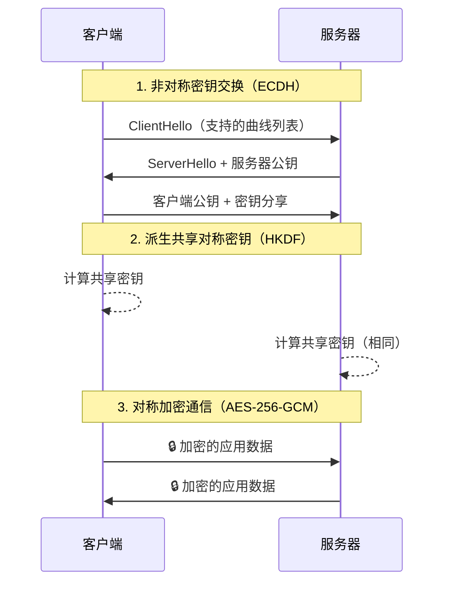

## 二、非对称加密

非对称加密（Asymmetric Cryptography），又称公钥密码学（Public-Key Cryptography），是现代密码学的基石。与对称加密使用同一把密钥不同，非对称加密使用一对数学上相关联的密钥——**公钥（Public Key）**和**私钥（Private Key）**。公钥可以公开分发，私钥严格保密。用公钥加密的数据只有对应的私钥能解密，反之亦然。

这一特性从根本上解决了对称加密的**密钥分发难题**：通信双方无需事先共享秘密，就能建立安全通道。

### 2.1 历史背景与核心原理

#### 2.1.1 密钥分发的困境

对称加密（如AES）要求通信双方持有相同的密钥。在一个有 N 个用户的网络中，需要 N×(N-1)/2 个密钥对。当 N=1000 时，密钥数量达到 499,500——且每对用户都需要安全地交换密钥。这就是著名的**密钥分发问题（Key Distribution Problem）**。

1976年，Whitfield Diffie 和 Martin Hellman 发表了划时代论文 *"New Directions in Cryptography"*，提出了公钥密码学的概念，从根本上改变了这一局面。

#### 2.1.2 单向函数——非对称加密的数学基础

非对称加密的安全性建立在**单向函数（One-Way Function）**之上：正向计算容易，逆向求解极其困难。常见的数学难题包括：

| 数学难题 | 代表算法 | 复杂度 | 目前最佳攻击 |
|----------|----------|--------|-------------|
| 大整数分解（Integer Factorization） | RSA | O(e^(n^(1/3))) | 通用数域筛选法（GNFS） |
| 离散对数（Discrete Logarithm） | Diffie-Hellman, DSA | O(√p) | 指数演算法 |
| 椭圆曲线离散对数（ECDLP） | ECC, ECDSA, EdDSA | O(√n) | Pollard rho 算法 |
| 格上最短向量（SVP/CVP） | Lattice-based（后量子） | 2^O(n) | LLL 算法 |

#### 2.1.3 一个类比理解公钥密码

想象一个**邮筒**：任何人都可以往里面塞信（公钥加密），但只有持有钥匙的邮递员才能打开取信（私钥解密）。反过来，如果邮递员在信上盖了私人印章（私钥签名），任何人都可以验证这个印章确实属于他（公钥验证），但没有人能伪造这个印章。

### 2.2 RSA算法

RSA（Rivest–Shamir–Adleman）是1978年由 Ron Rivest、Adi Shamir 和 Leonard Adleman 提出的公钥加密算法，也是第一个广泛实用的非对称加密方案，至今仍在 TLS、SSH、PGP 等协议中广泛使用。

#### 2.2.1 数学原理

RSA 的安全性基于**大整数分解的困难性**：将两个大素数相乘很容易，但将乘积分解回两个素数在计算上不可行。

**密钥生成步骤：**

1. **选择两个大素数** p 和 q（通常各 1024 位）
2. **计算模数** n = p × q（2048 位）
3. **计算欧拉函数** φ(n) = (p-1)(q-1)
4. **选择公钥指数** e，满足 1 < e < φ(n)，且 gcd(e, φ(n)) = 1（实践中通常取 65537）
5. **计算私钥指数** d ≡ e⁻¹ (mod φ(n))，即 e × d ≡ 1 (mod φ(n))

结果：**公钥为 (n, e)，私钥为 (n, d)**。

**加密与解密：**

- 加密：c = m^e mod n（m 为明文，c 为密文）
- 解密：m = c^d mod n

**为什么安全？** 攻击者知道 n 和 e（公钥是公开的），要恢复私钥 d，需要先分解 n 得到 p 和 q。对于 2048 位的 n，使用目前最强大的计算资源，分解一次需要数十亿年。

#### 2.2.2 填充方案——不填充就是裸奔

RSA 的数学运算（教科书 RSA）存在严重的安全问题：它是确定性的（相同明文总是产生相同密文），且容易受到选择密文攻击。因此实际使用时**必须配合填充方案**：

| 填充方案 | 用途 | 安全性 | 推荐度 |
|----------|------|--------|--------|
| **OAEP**（最优非对称加密填充） | 加密 | IND-CCA2 安全 | ✅ 首选 |
| PKCS#1 v1.5 | 加密/签名 | 存在 Bleichenbacher 攻击风险 | ⚠️ 仅兼容旧系统 |
| PSS（概率签名方案） | 签名 | EUF-CMA 安全 | ✅ 签名首选 |
| 无填充（教科书 RSA） | 教学 | 不安全 | ❌ 禁止使用 |

> ⚠️ **实战警告：** Bleichenbacher 攻击（1998年）可以利用 PKCS#1 v1.5 填充的泄漏恢复明文。2017年的 ROBOT 攻击影响了包括 F5、Cisco 在内的大量企业设备。**永远使用 OAEP 填充**。

#### 2.2.3 Python 实现

```python
from cryptography.hazmat.primitives.asymmetric import rsa, padding
from cryptography.hazmat.primitives import hashes, serialization
from cryptography.hazmat.backends import default_backend

# ===== 密钥生成 =====
private_key = rsa.generate_private_key(
    public_exponent=65537,  # 标准选择，是素数 2^16+1
    key_size=2048,          # 当前推荐最小值
    backend=default_backend()
)
public_key = private_key.public_key()

# ===== 加密（公钥加密，OAEP填充） =====
plaintext = b"Top secret: the missile launch code is 0000"
ciphertext = public_key.encrypt(
    plaintext,
    padding.OAEP(
        mgf=padding.MGF1(algorithm=hashes.SHA256()),
        algorithm=hashes.SHA256(),
        label=None
    )
)
print(f"密文长度: {len(ciphertext)} 字节")  # 256 字节（2048位）

# ===== 解密（私钥解密） =====
decrypted = private_key.decrypt(
    ciphertext,
    padding.OAEP(
        mgf=padding.MGF1(algorithm=hashes.SHA256()),
        algorithm=hashes.SHA256(),
        label=None
    )
)
assert decrypted == plaintext

# ===== 序列化密钥（PEM格式） =====
pem_private = private_key.private_bytes(
    encoding=serialization.Encoding.PEM,
    format=serialization.PrivateFormat.PKCS8,
    encryption_algorithm=serialization.BestAvailableEncryption(b"my-passphrase")
)
pem_public = public_key.public_bytes(
    encoding=serialization.Encoding.PEM,
    format=serialization.PublicFormat.SubjectPublicKeyInfo
)
```

#### 2.2.4 RSA 的性能局限

RSA 的运算速度远慢于对称加密：

| 操作 | RSA-2048 | AES-256-GCM | 倍数差距 |
|------|----------|-------------|---------|
| 加密吞吐量 | ~0.5 MB/s | ~1 GB/s | ~2000x |
| 解密吞吐量 | ~0.05 MB/s | ~1 GB/s | ~20000x |
| 密钥长度 | 2048 位 | 256 位 | 8x |

因此，RSA **从不直接加密大量数据**。实际应用中采用**混合加密（Hybrid Encryption）**模式：用 RSA 加密一个对称密钥（如 AES 密钥），再用该对称密钥加密实际数据。TLS 握手就是这种模式的典型实现。

#### 2.2.5 RSA 密钥长度选择

随着计算能力提升和算法改进，RSA 密钥长度需要持续增长：

| 密钥长度 | 安全级别（等效对称） | 推荐状态 |
|----------|---------------------|---------|
| 1024 位 | ~80 位 | ❌ 已废弃（2013年NIST建议淘汰） |
| 2048 位 | ~112 位 | ✅ 当前最低要求（至2030年） |
| 3072 位 | ~128 位 | ✅ 推荐（长期安全） |
| 4096 位 | ~140 位 | ✅ 高安全场景 |
| 15360 位 | ~256 位 | 超高安全/国家机密级别 |

### 2.3 ECC椭圆曲线密码学

ECC（Elliptic Curve Cryptography）基于椭圆曲线离散对数问题（ECDLP），以**更短的密钥长度**提供同等甚至更高的安全性。

#### 2.3.1 为什么椭圆曲线更"硬"？

大整数分解和离散对数问题都有亚指数时间复杂度的攻击算法（如数域筛选法），而 ECDLP **目前只有全指数时间复杂度的攻击**。这意味着 ECC 的密钥长度增长带来的安全增益远高于 RSA。

等效安全级别的密钥长度对比：

| 安全级别 | RSA 密钥 | ECC 密钥 | 密钥长度比 |
|----------|----------|----------|-----------|
| 80 位 | 1024 位 | 160 位（ECP-160） | 6.4:1 |
| 112 位 | 2048 位 | 224 位（P-224） | 9.1:1 |
| 128 位 | 3072 位 | 256 位（P-256） | 12:1 |
| 192 位 | 7680 位 | 384 位（P-384） | 20:1 |
| 256 位 | 15360 位 | 521 位（P-521） | 29.4:1 |

更短的密钥意味着：更少的计算量、更低的带宽消耗、更快的握手速度。这在移动端和 IoT 设备上尤为关键。

#### 2.3.2 常见椭圆曲线

不同的曲线有不同的特性：

| 曲线 | 位数 | 类型 | 特点 | 使用场景 |
|------|------|------|------|---------|
| **P-256（secp256r1）** | 256 | 素数域 | NIST 标准，广泛支持 | TLS, WebCrypto |
| **P-384（secp384r1）** | 384 | 素数域 | 高安全，政府合规 | 高安全 TLS |
| **P-521（secp521r1）** | 521 | 素数域 | 最高安全级别 | 特殊场景 |
| **secp256k1** | 256 | 素数域 | Bitcoin 专用 | 加密货币 |
| **Curve25519（X25519）** | 256 | 蒙哥马利曲线 | 高速、抗侧信道 | Signal, WireGuard, SSH |
| **Ed25519** | 256 | 爱德华兹曲线 | EdDSA 签名，确定性 | SSH 密钥, Signal |
| **secp256k1 vs P-256** | — | — | P-256 更通用；secp256k1 被 Bitcoin/Ethereum 采用 | — |

> 💡 **趋势：** Curve25519 和 Ed25519 正在快速取代 NIST 曲线。原因：NIST P-256 的种子常数来源不透明（Dual_EC_DRBG 后门丑闻），而 Curve25519 的参数完全透明可验证。

#### 2.3.3 Python 实现

```python
from cryptography.hazmat.primitives.asymmetric import ec
from cryptography.hazmat.primitives import hashes

# ===== 密钥生成（P-256曲线） =====
private_key = ec.generate_private_key(ec.SECP256R1())
public_key = private_key.public_key()

# ===== 签名 =====
message = b"Transfer 1000 BTC to Alice"
signature = private_key.sign(
    message,
    ec.ECDSA(hashes.SHA256())
)
print(f"签名长度: {len(signature)} 字节")  # ~72 字节（DER编码）

# ===== 验签 =====
try:
    public_key.verify(signature, message, ec.ECDSA(hashes.SHA256()))
    print("签名验证通过")
except Exception:
    print("签名无效！")

# ===== ECDH 密钥交换 =====
# Alice 的密钥对
alice_private = ec.generate_private_key(ec.SECP256R1())
alice_public = alice_private.public_key()

# Bob 的密钥对
bob_private = ec.generate_private_key(ec.SECP256R1())
bob_public = bob_private.public_key()

# 双方各自计算共享密钥
alice_shared = alice_private.exchange(ec.ECDH(), bob_public)
bob_shared = bob_private.exchange(ec.ECDH(), alice_public)

assert alice_shared == bob_shared  # 完全相同！
# 共享密钥可用于派生 AES 密钥进行对称加密
```

### 2.4 其他非对称加密算法

#### 2.4.1 Diffie-Hellman 密钥交换

Diffie-Hellman（DH）是最早的公钥密码方案（1976年），专门用于**密钥交换**而非加密。它让双方在不安全的信道上协商出共享密钥。

**原理：** 利用离散对数问题的困难性。

公开参数: 大素数 p, 生成元 g
Alice 选择私密随机数 a, 计算 A = g^a mod p, 发送 A 给 Bob
Bob   选择私密随机数 b, 计算 B = g^b mod p, 发送 B 给 Alice
Alice 计算共享密钥: K = B^a mod p = g^(ab) mod p
Bob   计算共享密钥: K = A^b mod p = g^(ab) mod p

```python
from cryptography.hazmat.primitives.asymmetric import dh

# 生成 DH 参数（实际中应预计算或使用标准参数）
parameters = dh.generate_parameters(generator=2, key_size=2048)

# 双方各自生成密钥
alice_private = parameters.generate_private_key()
bob_private = parameters.generate_private_key()

# 密钥交换
alice_shared = alice_private.exchange(bob_private.public_key())
bob_shared = bob_private.exchange(alice_private.public_key())
assert alice_shared == bob_shared
```

> ⚠️ **注意：** 传统 DH 容易受到**中间人攻击（MITM）**。需要配合数字签名（如 DSA/ECDSA）或证书体系来验证身份。现代应用中，DH 通常以 **ECDH**（椭圆曲线版本）的形式出现，如 X25519。

#### 2.4.2 ElGamal 加密

ElGamal（1985年）基于离散对数问题，是 DH 协议的加密变体。它的特点是**密文膨胀**：密文长度是明文的 2 倍。

```python
from cryptography.hazmat.primitives.asymmetric import elgamal
from cryptography.hazmat.primitives import hashes

# 生成密钥
private_key = elgamal.generate_key(key_size=2048)
public_key = private_key.public_key()

# 加密
ciphertext = public_key.encrypt(b"message", padding=None)

# 解密
plaintext = private_key.decrypt(ciphertext)
```

> ElGamal 在直接加密中使用较少，但其变体 **DSA（Digital Signature Algorithm）** 和 **ECDSA** 被广泛用于数字签名。

#### 2.4.3 后量子密码学（Post-Quantum Cryptography）

量子计算机的 Shor 算法可以在多项式时间内破解 RSA、ECC 和 DH。为此，NIST 于 2024 年正式发布了首批后量子密码标准：

| 算法 | 类型 | 用途 | 标准化状态 |
|------|------|------|-----------|
| **ML-KEM**（CRYSTALS-Kyber） | 格基（Lattice） | 密钥封装 | FIPS 203 ✅ |
| **ML-DSA**（CRYSTALS-Dilithium） | 格基 | 数字签名 | FIPS 204 ✅ |
| **SLH-DSA**（SPHINCS+） | 哈希基 | 数字签名 | FIPS 205 ✅ |
| **FN-DSA**（FALCON） | 格基 | 数字签名 | FIPS 206 ✅ |

# CRYSTALS-Kyber 密钥封装示例（使用 liboqs）
from oqs import KeyEncapsulation

kem = KeyEncapsulation("Kyber512")
public_key = kem.generate_keypair()
# 封装
ciphertext, shared_secret = encapsulate(public_key)
# 解封装
recovered_secret = kem.decap_secret(ciphertext)

> 💡 **迁移建议：** 不必恐慌。量子计算机距实用级别还有 10-20 年。但"先存储后解密（Harvest Now, Decrypt Later）"攻击意味着今天传输的加密数据可能在未来被破解。**现在就应该开始评估后量子方案的迁移路径**，优先保护生命周期超过 10 年的敏感数据。

### 2.5 算法选择指南

| 场景 | 推荐算法 | 原因 |
|------|---------|------|
| TLS 网页加密 | X25519 + AES-256-GCM | 速度快、安全性高、浏览器广泛支持 |
| SSH 远程登录 | Ed25519 密钥 | 确定性签名、高性能 |
| 数字证书/代码签名 | RSA-3072 或 ECDSA P-256 | 兼容性、行业标准 |
| 移动端/IoT | ECC（P-256 或 Ed25519） | 短密钥、低功耗 |
| 长期敏感数据存储 | RSA-4096 + ML-KEM（后量子） | 双重保护 |
| 密钥交换 | X25519 | 最快的 ECDH 实现 |
| 加密货币 | secp256k1 | Bitcoin/Ethereum 标准 |

### 2.6 常见误区与陷阱

**误区 1：密钥越长越安全**

RSA-4096 并非 RSA-2048 的两倍安全。从 2048 到 4096，安全级别从 112 位提升到约 140 位——增长有限，但计算开销增加约 7 倍。如果需要更高安全级别，切换到 ECC 往往是更好的选择。

**误区 2：非对称加密可以替代对称加密**

非对称加密太慢（RSA 加密速度约为 AES 的 1/2000），无法直接用于大数据加密。正确做法是**混合加密**：用非对称加密交换对称密钥，用对称加密处理数据。

**误区 3：RSA 和 ECC 可以互换使用**

它们的密钥不互通。RSA 密钥不能用于 ECC 操作，反之亦然。在需要兼容性的场景（如混合环境）要格外注意。

**误区 4：生成一次密钥就万事大吉**

密钥需要定期轮换。RSA 和 ECC 密钥的建议有效期：
- RSA：3-5 年（或根据计算能力增长缩短）
- ECC：5-10 年（密钥空间更大）
- 后量子算法：待标准稳定后确定

**误区 5：自定义密码算法**

永远不要自己发明加密算法。使用经过充分审查的标准库（如 OpenSSL、libsodium、cryptography.io）。"自己的加密 = 没有加密"是密码学界的基本共识。

### 2.7 实战：混合加密完整流程

以下是一个完整的混合加密示例：用 RSA 交换 AES 密钥，然后用 AES-GCM 加密实际数据。

```python
import os
from cryptography.hazmat.primitives.asymmetric import rsa, padding
from cryptography.hazmat.primitives import hashes, serialization
from cryptography.hazmat.primitives.ciphers.aead import AESGCM

# ===== 生成 RSA 密钥对 =====
private_key = rsa.generate_private_key(public_exponent=65537, key_size=2048)
public_key = private_key.public_key()

# ===== 发送方：混合加密 =====
# 1. 生成随机 AES-256 密钥
aes_key = AESGCM.generate_key(bit_length=256)  # 32 字节

# 2. 用 RSA-OAEP 加密 AES 密钥（密钥封装）
encrypted_key = public_key.encrypt(
    aes_key,
    padding.OAEP(
        mgf=padding.MGF1(algorithm=hashes.SHA256()),
        algorithm=hashes.SHA256(),
        label=None
    )
)

# 3. 用 AES-GCM 加密实际数据（含认证）
plaintext = b"这是一条需要安全传输的重要消息"
nonce = os.urandom(12)  # 96 位随机 nonce
aesgcm = AESGCM(aes_key)
ciphertext = aesgcm.encrypt(nonce, plaintext, None)  # 含 16 字节认证标签

# 4. 发送：encrypted_key + nonce + ciphertext
message = encrypted_key + nonce + ciphertext

# ===== 接收方：混合解密 =====
# 1. 拆分消息
key_len = private_key.key_size // 8  # 256 字节
enc_key = message[:key_len]
recv_nonce = message[key_len:key_len + 12]
recv_cipher = message[key_len + 12:]

# 2. 用 RSA 私钥解密 AES 密钥
aes_key_recovered = private_key.decrypt(
    enc_key,
    padding.OAEP(
        mgf=padding.MGF1(algorithm=hashes.SHA256()),
        algorithm=hashes.SHA256(),
        label=None
    )
)

# 3. 用 AES-GCM 解密数据（附带完整性验证）
aesgcm_recv = AESGCM(aes_key_recovered)
decrypted = aesgcm_recv.decrypt(recv_nonce, recv_cipher, None)
assert decrypted == plaintext
print("解密成功:", decrypted.decode())
```

这个模式正是 **TLS 1.3** 握手过程的核心思想：



### 2.8 性能基准对比

以下数据基于 OpenSSL 3.0，在 Intel i7-12700K 上的单线程性能：

| 操作 | RSA-2048 | RSA-4096 | ECDSA P-256 | Ed25519 |
|------|----------|----------|-------------|---------|
| 密钥生成 | ~150 ms | ~2000 ms | ~0.02 ms | ~0.01 ms |
| 签名 | ~0.5 ms | ~3 ms | ~0.03 ms | ~0.02 ms |
| 验签 | ~0.02 ms | ~0.08 ms | ~0.08 ms | ~0.06 ms |
| 加密 | ~0.3 ms | ~2 ms | 不适用 | 不适用 |
| 解密 | ~15 ms | ~120 ms | 不适用 | 不适用 |

**关键洞察：** Ed25519 在密钥生成和签名速度上碾压 RSA，同时提供 128 位安全级别。这也是它被 SSH 和 Signal 等对性能敏感的应用广泛采用的原因。
