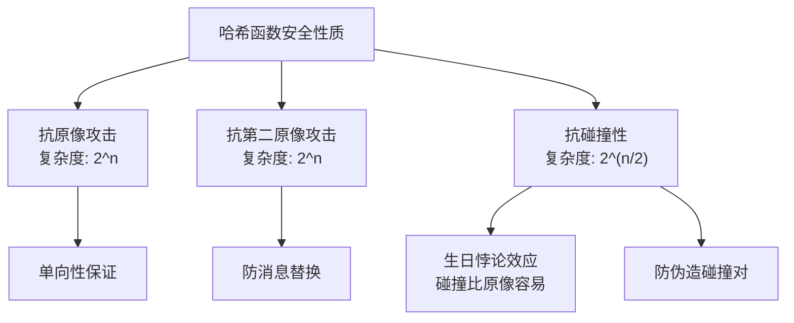
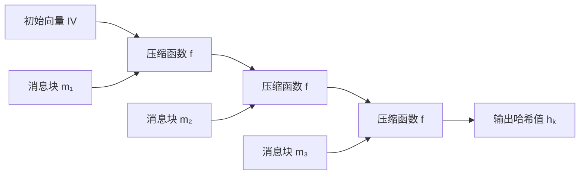
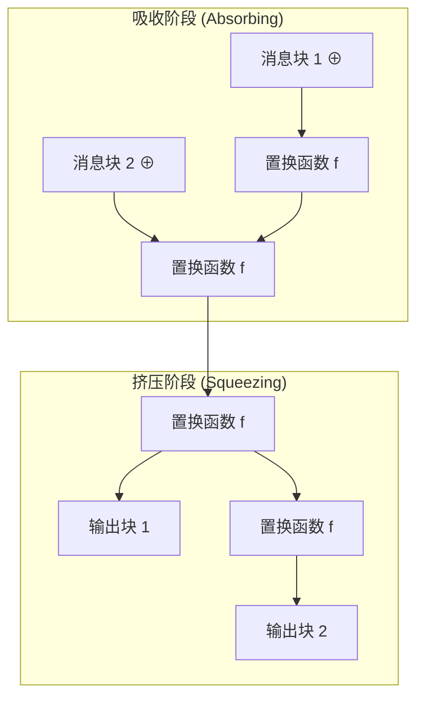
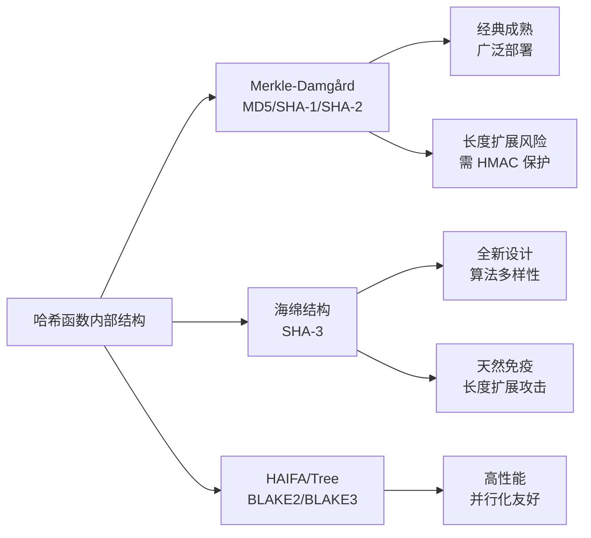
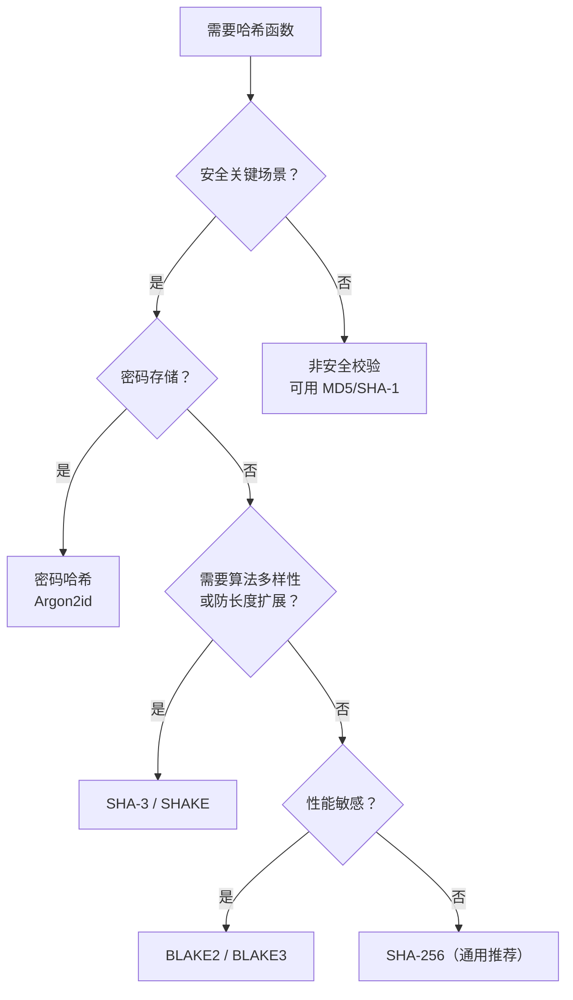
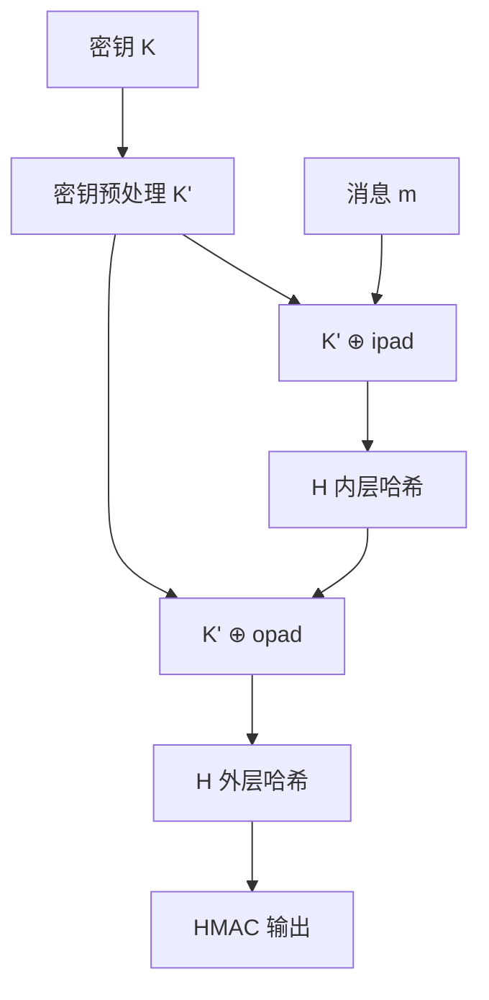
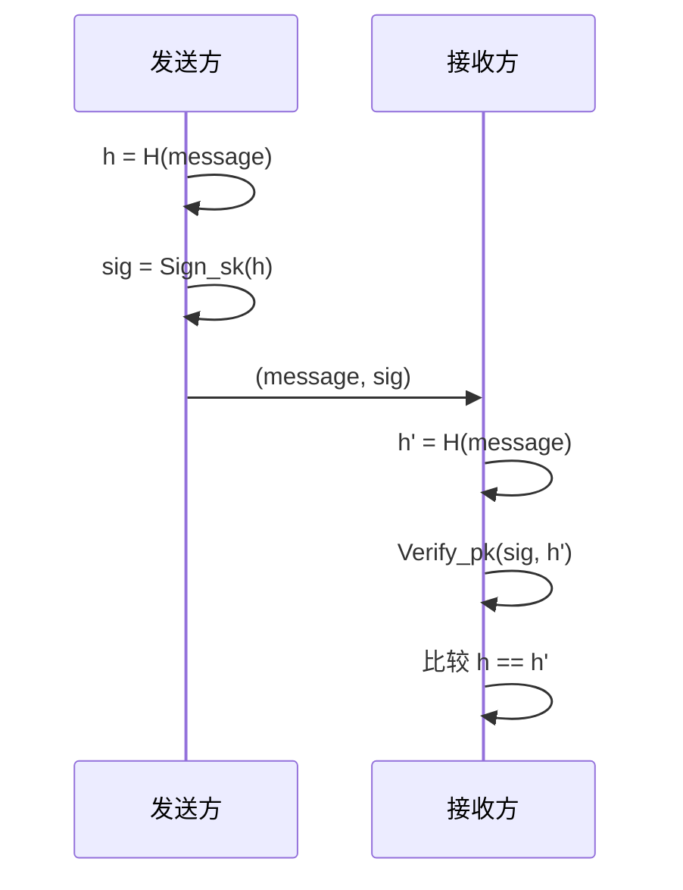

## 三、哈希函数

### 1. 概述与背景

哈希函数（Hash Function）是密码学中最基础、应用最广泛的密码原语之一。它将任意长度的输入消息映射为固定长度的输出摘要（也称为哈希值、指纹或散列值），是数字签名、消息认证、密码存储、区块链、数据完整性校验等安全机制的基石。对工程师而言，正确理解和使用哈希函数，直接关系到系统的安全性、性能和可靠性。

从历史演进看，哈希函数经历了从简单到复杂、从脆弱到健壮的发展过程：

| 时期 | 代表算法 | 输出长度 | 状态 | 关键事件 |
|------|---------|---------|------|---------|
| 1990年代初 | MD4、MD5 | 128 位 | 已破解 | 王小云团队 2004 年展示 MD5 碰撞 |
| 1990年代中 | SHA-0、SHA-1 | 160 位 | 已不安全 | Google 2017 年实际碰撞（SHAttered） |
| 2000年代 | SHA-2 家族 | 224-512 位 | 安全 | 至今无实际攻击 |
| 2010年代 | BLAKE2 | 最高 512 位 | 安全 | 速度超越 MD5，安全性比肩 SHA-2 |
| 2015-2020 | SHA-3、BLAKE3 | 可变 | 安全 | 海绵结构/Merkle 树结构 |

**哈希函数与其他密码原语的关系**：在密码学原语体系中，哈希函数与对称加密、非对称加密并列为三大基石。对称加密提供机密性，非对称加密解决密钥分发问题，而哈希函数提供完整性与单向性。这三者的组合构成了数字签名（非对称加密 + 哈希）、消息认证码（对称密钥 + 哈希）、密钥派生（密码 + 哈希）等复合机制。理解哈希函数是掌握数字签名和密钥管理的前置知识。

本节将从密码学原理出发，系统讲解哈希函数的安全性质、内部结构、主流算法、攻击方法和工程实践，帮助工程师建立完整的哈希函数知识体系。

### 2. 密码学安全哈希函数的性质

一个密码学安全的哈希函数 $H$ 将任意长度的消息 $m$ 映射为固定长度的摘要 $h = H(m)$，必须同时满足以下五个性质：

| 性质 | 数学定义 | 工程含义 | 安全等级 |
|------|---------|---------|---------|
| 确定性 | $m_1 = m_2 \Rightarrow H(m_1) = H(m_2)$ | 相同输入永远产生相同输出 | 基本要求 |
| 高效性 | 计算 $H(m)$ 的时间复杂度 $O(\|m\|)$ | 任意输入都能快速计算 | 基本要求 |
| 抗原像攻击 | 给定 $y$，难以找到 $m$ 使得 $H(m) = y$ | 知道哈希值无法反推原文 | 单向性 |
| 抗第二原像攻击 | 给定 $m_1$，难以找到 $m_2 \neq m_1$ 使得 $H(m_1) = H(m_2)$ | 无法伪造同哈希的不同消息 | 防伪造 |
| 抗碰撞性 | 难以找到任意 $m_1 \neq m_2$ 使得 $H(m_1) = H(m_2)$ | 无法找到任意两个哈希相同的输入 | 最强安全 |

#### 2.1 三种安全性质的区别

初学者最容易混淆的是后三种安全性质。用一个类比来说明：

- **抗原像攻击**（Preimage Resistance）：给你一个哈希值 `a1b2c3...`，你找不到任何一个能产生这个哈希值的输入。这是单向性的直接体现——哈希是"不可逆"的。类比：给你一滩灰烬，你无法还原出原始木头。
- **抗第二原像攻击**（Second Preimage Resistance）：给你一个具体的消息 $m_1$，你找不到另一个不同的消息 $m_2$ 使它们的哈希值相同。这保证了攻击者无法对已知消息进行替换。类比：给你一本特定的书，你无法找到另一本不同内容但页数和字数完全相同的书。
- **抗碰撞性**（Collision Resistance）：你能找到任意两个不同的输入碰撞即可，不需要指定其中一个。这是最强的要求。类比：你可以在房间里找到两个生日相同的人（但不需要指定是哪个人）。

三者的安全强度关系：**抗碰撞性 > 抗第二原像攻击 > 抗原像攻击**。如果满足抗碰撞性，则自动满足抗第二原像攻击（但不自动满足抗原像攻击）。

#### 2.2 安全强度的数学基础

对于输出长度为 $n$ 位的哈希函数：

| 攻击类型 | 最优攻击复杂度 | 含义 |
|---------|--------------|------|
| 寻找原像 | $\approx 2^n$ | 穷举所有可能输入 |
| 寻找第二原像 | $\approx 2^n$ | 对特定消息穷举 |
| 寻找碰撞 | $\approx 2^{n/2}$ | 利用生日悖论 |



**生日悖论（Birthday Paradox）**：在一个 23 人的房间里，至少有两人生日相同的概率超过 50%——远超直觉。推广到哈希函数：对于 $n$ 位输出，约需 $2^{n/2}$ 次哈希计算就能以高概率找到碰撞：

$$\text{所需样本数} \approx \sqrt{\frac{\pi}{2} \times 2^n} \approx 1.177 \times 2^{n/2}$$

这意味着一个 128 位哈希函数的抗碰撞性只有 64 位安全强度——这也是 MD5 在碰撞攻击面前迅速沦陷的根本原因。

| 哈希函数 | 输出长度 | 生日攻击复杂度 | 实际安全状态 |
|---------|---------|--------------|------------|
| MD5 | 128 位 | $2^{64}$ | 已被实际攻破（远低于理论值） |
| SHA-1 | 160 位 | $2^{80}$ | 已被实际攻破（$2^{63}$） |
| SHA-256 | 256 位 | $2^{128}$ | 安全 |
| SHA-512 | 512 位 | $2^{256}$ | 安全 |

### 3. 哈希函数的内部结构

理解哈希函数的内部结构，对于评估其安全特性和选择合适的算法至关重要。

#### 3.1 Merkle-Damgård 结构

大多数经典哈希函数（MD5、SHA-1、SHA-2）都基于 Merkle-Damgård（MD）结构。其工作流程如下：



具体步骤：

1. **消息填充**：将输入消息填充到块大小的整数倍。填充规则包括：附加一个 `1` 位、若干 `0` 位、以及原始消息的 64 位长度值
2. **分块处理**：将填充后的消息分割为固定大小的块 $m_1, m_2, \dots, m_k$
3. **迭代压缩**：使用压缩函数 $f$ 逐块更新内部状态 $h_i = f(h_{i-1}, m_i)$
4. **输出**：最终状态 $h_k$ 即为哈希值

初始向量（IV）是算法规定的固定常量，作为 $h_0$ 的值。

MD 结构的安全性依赖于一个关键定理（Merkle-Damgård 定理）：**如果压缩函数 $f$ 是抗碰撞的，那么基于 MD 结构的哈希函数也是抗碰撞的。** 但这个安全性传递是有条件的——它假设压缩函数是理想的安全黑盒，实际中压缩函数可能存在尚未发现的弱点。

```python
# 模拟 Merkle-Damgård 结构的核心逻辑（伪代码，非实际哈希实现）
def merkle_damgard(message_blocks, iv, compress_func):
    state = iv
    for block in message_blocks:
        state = compress_func(state, block)
    return state
```

**MD 结构的固有缺陷——长度扩展攻击**：

基于 MD 结构的哈希函数都存在长度扩展攻击（Length Extension Attack）。攻击场景如下：假设攻击者知道 $H(m)$ 和消息 $m$ 的长度（但不知道 $m$ 的内容），就可以计算 $H(m \| \text{padding} \| m')$，其中 $m'$ 是攻击者选择的附加数据——**无需知道 $m$ 的内容**。

攻击原理：MD 结构的输出直接暴露了内部状态 $h_k$。攻击者将这个状态作为新的初始值，继续哈希附加数据，就能得到扩展后的正确哈希值。这使得 `H(secret || message)` 这种朴素 MAC 构造完全不安全。

```python
# 长度扩展攻击原理演示（仅作理解用途）
import hashlib
import struct

def demonstrate_length_extension():
    """
    展示长度扩展攻击的原理：
    已知 H(secret || message) 和 message 长度，
    可以计算 H(secret || message || padding || evil_data)
    """
    # 模拟服务器端
    secret = b"super_secret"
    message = b"transfer=100&amp;to=alice"
    original_hash = hashlib.sha256(secret + message).hexdigest()
    print(f"原始消息哈希: {original_hash}")

    # 攻击者不需要知道 secret
    # 只需要原始哈希值和消息长度
    msg_len = len(secret) + len(message)
    evil_data = b"&amp;to=bob"

    # 构造扩展后的哈希（内部状态已知）
    # 这使得攻击者可以伪造合法的 MAC
    print(f"消息总长度: {msg_len} 字节")
    print("攻击者可以在不知道 secret 的情况下构造扩展消息")

demonstrate_length_extension()
```

**受影响的算法**：MD5、SHA-1、SHA-256、SHA-512（所有 MD 结构的哈希函数）

**不受影响的算法**：SHA-3（海绵结构）、BLAKE2（HAIFA 结构）、HMAC（双重嵌套结构）

#### 3.2 海绵结构（Sponge Construction）

SHA-3 采用了完全不同的 Keccak 海绵结构，由两个阶段组成：



1. **吸收阶段（Absorbing）**：消息块依次与内部状态进行 XOR，然后通过置换函数 $f$ 更新状态
2. **挤压阶段（Squeezing）**：从状态中依次提取输出块，每提取一块就再应用一次置换函数 $f$

内部状态被分为两部分：
- **速率**（rate，$r$ 位）：每次吸收/挤压的数据量
- **容量**（capacity，$c$ 位）：隐藏的内部状态

其中 $r + c$ 是状态总宽度。安全性取决于容量 $c$：抗碰撞强度为 $c/2$ 位。以 SHA3-256 为例：状态宽度 1600 位，速率 $r = 1088$ 位，容量 $c = 512$ 位，抗碰撞强度 $c/2 = 256$ 位。

**海绵结构相比 MD 结构的优势**：

| 特性 | Merkle-Damgård | 海绵结构 |
|------|---------------|---------|
| 长度扩展攻击 | 易受攻击 | 天然免疫 |
| 输出长度 | 固定 | 可变（可扩展输出） |
| 功能扩展 | 仅哈希 | 哈希、MAC、流密码、PRNG 统一框架 |
| 安全证明 | 依赖压缩函数抗碰撞性 | 依赖置换函数的安全性 |
| 状态泄露 | 输出=内部状态 | 输出≠完整内部状态 |

#### 3.3 两种结构的对比总结



### 4. 主流哈希算法详解

#### 4.1 MD5（Message Digest 5）

| 参数 | 值 |
|------|-----|
| 设计者 | Ronald Rivest |
| 发布年份 | 1991 年 |
| 输出长度 | 128 位（16 字节） |
| 块大小 | 512 位 |
| 轮数 | 4 轮 × 16 步 = 64 步 |
| 内部结构 | Merkle-Damgård |
| 安全状态 | **已彻底破解** ❌ |

MD5 的安全崩溃历程：

- **2004 年**：王小云教授团队在中国密码学年会上展示了 MD5 的实际碰撞攻击，可在普通计算机上数秒内找到碰撞对
- **2005 年**：Lenstra 等人利用 MD5 碰撞构造了两个内容不同但 X.509 证书相同的文件
- **2008 年**：研究人员利用 MD5 碰撞伪造了合法的 SSL 证书，证明了实际威胁
- **2012 年**：Flame 恶意软件利用 MD5 碰撞伪造微软代码签名证书——这是已知最大规模的密码学攻击实战案例。Flame 通过伪造 MD5 碰撞生成了一个看起来合法的微软代码签名证书，使得恶意软件能够通过 Windows Update 分发，感染了数千台伊朗政府相关计算机

**MD5 仍可用于**：非安全场景的校验和（如检测文件传输中的意外损坏、软件下载校验）。**绝不能用于**：防篡改、数字签名、密码存储、TLS 证书等任何安全用途。

#### 4.2 SHA-1（Secure Hash Algorithm 1）

| 参数 | 值 |
|------|-----|
| 设计者 | NSA |
| 发布年份 | 1995 年 |
| 输出长度 | 160 位（20 字节） |
| 块大小 | 512 位 |
| 轮数 | 80 步 |
| 内部结构 | Merkle-Damgård |
| 安全状态 | **已不安全** ❌ |

理论上 160 位输出应提供 80 位抗碰撞强度，但密码分析进展远超预期：

- **2005 年**：王小云等人展示了理论碰撞攻击，复杂度约 $2^{69}$
- **2017 年**：Google 与 CWI Amsterdam 合作完成 **SHAttered 攻击**，实际构造了两个不同的 PDF 文件具有相同的 SHA-1 值，总计算量约 $2^{63}$ 次 SHA-1 压缩（远低于理论的 $2^{80}$）。攻击耗时约 6500 年 CPU 时间（但通过 GPU 集群在数月内完成）
- **2020 年**：CWI Amsterdam 进一步降低了攻击成本，仅需约 $2^{63.1}$ 次计算

**SHA-1 废弃时间线**：Google 2014 年开始在 Chrome 中标记 SHA-1 证书不安全 → 2017 年 SHAttered → NIST 正式废弃 → 2020 年所有主流浏览器停止信任 SHA-1 证书。Git 项目也从 2022 年起在 `git merge` 时检测 SHA-1 碰撞风险。

#### 4.3 SHA-2 家族

SHA-2 由 NSA 设计，2001 年发布，包含多个变体：

| 变体 | 输出长度 | 块大小 | 安全强度 | 轮数 | 典型应用 |
|------|---------|--------|---------|------|---------|
| SHA-224 | 224 位 | 512 位 | 112 位 | 64 | 资源受限场景 |
| SHA-256 | 256 位 | 512 位 | 128 位 | 64 | 比特币、TLS、数字证书 |
| SHA-384 | 384 位 | 1024 位 | 192 位 | 80 | 高安全需求 |
| SHA-512 | 512 位 | 1024 位 | 256 位 | 80 | 最高安全需求 |
| SHA-512/256 | 256 位 | 1024 位 | 128 位 | 80 | SHA-256 的 64 位优化替代 |

**SHA-256 是目前使用最广泛的哈希算法**。比特币的工作量证明（PoW）要求矿工找到一个 nonce 使得区块头的 SHA-256 双哈希值小于目标值，这一过程消耗的算力构成了比特币的安全基础。

SHA-2 与 SHA-1 内部结构相似但更保守：更多的轮数、更大的消息字、更复杂的轮函数。截至目前，SHA-2 没有任何已知的实际攻击。

**SHA-512 vs SHA-256 的性能差异**：在 64 位平台上，SHA-512 的计算速度通常比 SHA-256 快 30-50%，因为 SHA-512 使用 64 位字运算而 SHA-256 使用 32 位字运算。对于大文件哈希，SHA-512/256（输出 256 位但使用 SHA-512 的内部结构）是更好的选择。

```bash
# 各平台 SHA-256 计算
# Linux/macOS
echo -n "Hello, World!" | sha256sum
# 输出: dffd6021bb2bd5b0af676290809ec3a53191dd81c7f70a4b28688a362182986f

# OpenSSL
echo -n "Hello, World!" | openssl dgst -sha256

# Windows PowerShell
Get-FileHash -Algorithm SHA256 -InputStream ([System.IO.MemoryStream]::new([System.Text.Encoding]::UTF8.GetBytes("Hello, World!")))
```

#### 4.4 SHA-3（Keccak）

| 参数 | 值 |
|------|-----|
| 发布年份 | 2015 年（FIPS 202 标准化） |
| 输出长度 | 可变（224/256/384/512 位） |
| 状态宽度 | 1600 位（5 × 5 × 64 位矩阵） |
| 轮数 | 24 轮 |
| 内部结构 | 海绵结构 |
| 安全状态 | **安全** ✅ |

SHA-3 源自 Keccak 算法在 NIST 哈希函数竞赛中胜出。它与 SHA-2 设计完全不同，提供了**算法多样性**——即使 SHA-2 未来被攻破，SHA-3 仍可能安全，因为攻击手法不太可能同时适用于两种完全不同的结构。

**SHA-3 的可扩展输出功能（SHAKE128/SHAKE256）** 特别有价值，可以生成任意长度的输出：

```python
import hashlib

# SHAKE256 生成任意长度输出
shake = hashlib.shake_256(b"key material")
key_32 = shake.hexdigest(32)   # 256 位密钥
key_64 = shake.hexdigest(64)   # 512 位密钥

# 适用场景：密钥派生、随机数生成、一次性密码本
```

**SHA-3 的 Keccak-f 置换**：SHA-3 的核心是 Keccak-f[1600] 置换，它作用于 5×5×64 的三维比特矩阵。每一轮包含 5 个步骤：θ（列奇偶校验）、ρ（行旋转）、π（平面置换）、χ（非线性 S 盒）、ι（轮常量异或）。这种高度非线性的设计使得差分分析和线性分析极其困难。

#### 4.5 BLAKE2 和 BLAKE3

BLAKE2 是 2012 年发布的哈希函数，源自 SHA-3 竞赛决赛入围算法 BLAKE，在保持高安全性的同时，速度比 SHA-256 快约 3 倍，甚至比 MD5 更快。

| 变体 | 输出长度 | 优化目标 | 特点 |
|------|---------|---------|------|
| BLAKE2b | 最高 512 位 | 64 位平台 | 通用哈希，性能最佳 |
| BLAKE2s | 最高 256 位 | 32 位平台 | 嵌入式场景 |
| BLAKE2bp | 512 位 | 多核并行 | BLAKE2b 的并行版本 |
| BLAKE2sp | 256 位 | 多核并行 | BLAKE2s 的并行版本 |

**BLAKE3（2020 年）** 更进一步，采用 Merkle 树结构实现高度并行化：

| 算法 | 单线程速度（相对 SHA-256） | 多核并行加速 | 内置功能 |
|------|--------------------------|------------|---------|
| SHA-256 | 1x（基准） | 不支持 | 基本哈希 |
| BLAKE2b | ~3x | 有限（bp/sp变体） | 哈希、MAC、KDF |
| BLAKE3 | ~14x | 线性扩展 | 哈希、MAC、KDF、流式 |

BLAKE3 的 Merkle 树结构允许将输入分块后并行处理，多核环境下性能近线性扩展——16 核 CPU 可以达到单核 10 倍以上的吞吐量。

```python
# BLAKE2b 哈希计算
import hashlib

# Python 标准库直接支持
h = hashlib.blake2b(b"Hello, World!", digest_size=32)
print(f"BLAKE2b-256: {h.hexdigest()}")

# BLAKE2 带密钥（HMAC 功能内置）
key = b"secret_key_32_bytes_long!!!!!!!!"
h = hashlib.blake2b(b"message", key=key)
print(f"Keyed BLAKE2b: {h.hexdigest()}")
```

#### 4.6 算法选择决策指南



### 5. 密码哈希函数：专门为密码存储设计

普通哈希函数（SHA-256 等）速度极快——这恰恰是密码存储场景中的致命弱点。攻击者使用 GPU 或 ASIC 可以每秒尝试数十亿次 SHA-256 计算，暴力破解密码。因此，密码存储需要专门设计的**慢速哈希函数**，通过可控的计算成本和内存消耗来抵御暴力破解。

#### 5.1 bcrypt

```bash
# 使用 htpasswd 生成 bcrypt 密码哈希
htpasswd -nbBC 12 username MyPassword
# 输出: username:$2y$12$...(60 字符)
```

bcrypt 的技术特点：
- 基于 Blowfish 密码的密钥扩展算法
- 成本因子（cost factor）可调，范围 4-31，每增加 1 计算量翻倍
- 自动包含随机盐值（salt）
- 输出固定 60 字符（含算法标识 `$2y$`、成本因子、盐、哈希）
- 推荐成本因子：12（2024 年基准，约 250ms 计算时间）

**bcrypt 的局限性**：密码最大长度 72 字节（Blowfish 块大小限制），超过部分被截断。虽然有 2024 年的增强变性（yescrypt 后端）缓解此问题，但 Argon2 从根本上不受此限制。

#### 5.2 scrypt

```python
import hashlib

# Python 3.6+ 内置支持
dk = hashlib.scrypt(
    password=b'my_password',
    salt=b'random_salt_16b',
    n=16384,      # CPU/内存成本参数（必须是2的幂）
    r=8,          # 块大小
    p=1,          # 并行度
    dklen=32      # 输出长度
)
```

scrypt 的核心优势是**内存硬**（memory-hard），需要大量 RAM 才能高效计算。这使得 GPU 和 ASIC 攻击的成本大幅提高——GPU 的显存带宽成为瓶颈。2009 年由 Colin Percival 设计，最初用于 Tarsnap 备份系统。

**scrypt 的参数含义**：`N` 控制内存和 CPU 成本（内存用量 $\approx 128 \times N \times r$ 字节），`r` 控制块大小影响缓存性能，`p` 控制并行计算次数。调参建议：`N=16384, r=8` 可提供约 64MB 内存消耗和中等安全性。

#### 5.3 Argon2（当前推荐）

Argon2 是 2015 年密码哈希竞赛（PHC）的获胜者，**当前最推荐的密码哈希算法**。

```python
# 安装: pip install argon2-cffi
from argon2 import PasswordHasher
from argon2.exceptions import VerifyMismatchError

# 创建哈希器
ph = PasswordHasher(
    time_cost=3,        # 迭代次数
    memory_cost=65536,  # 内存使用量（KB），此处为 64MB
    parallelism=4,      # 并行线程数
    hash_len=32,        # 输出长度
    salt_len=16         # 盐长度
)

# 哈希密码
hash_value = ph.hash("my_secure_password")
# 输出: $argon2id$v=19$m=65536,t=3,p=4$...(完整哈希)

# 验证密码
try:
    ph.verify(hash_value, "my_secure_password")
    print("密码正确")
except VerifyMismatchError:
    print("密码错误")

# 检查是否需要重新哈希（参数升级后）
if ph.check_needs_rehash(hash_value):
    hash_value = ph.hash("my_secure_password")  # 用新参数重新哈希
```

Argon2 有三个变体，各有侧重：

| 变体 | 内存访问模式 | 抗 GPU/ASIC | 抗侧信道 | 适用场景 |
|------|------------|------------|---------|---------|
| Argon2d | 数据依赖 | 更强 | 较弱 | 防离线破解（区块链、加密货币） |
| Argon2i | 数据独立 | 较弱 | 更强 | 防侧信道攻击（服务器端密码存储） |
| Argon2id | 先 i 后 d 混合 | 平衡 | 平衡 | **通用推荐**（兼顾两者优势） |

#### 5.4 密码哈希函数对比总结

| 特性 | bcrypt | scrypt | Argon2id |
|------|--------|--------|----------|
| 设计年份 | 1999 | 2009 | 2015 |
| 内存硬性 | 弱 | 强 | 强 |
| GPU 抗性 | 中等 | 高 | 高 |
| ASIC 抗性 | 中等 | 高 | 高 |
| 可调参数 | cost factor | N, r, p | time, memory, parallelism |
| 盐值处理 | 内置 | 手动 | 内置 |
| 推荐场景 | 遗留系统兼容 | 需要内存硬特性 | **Web 应用首选** |
| Python 库 | `bcrypt` | `hashlib` 内置 | `argon2-cffi` |

**密码哈希参数调优指南**：

| 场景 | 推荐算法 | 参数建议 | 验证时间目标 |
|------|---------|---------|------------|
| Web 应用密码存储 | Argon2id | m=65536, t=3, p=4 | 250-500ms |
| 移动端密码验证 | Argon2id | m=32768, t=2, p=2 | 100-250ms |
| 嵌入式/低内存环境 | bcrypt | cost=12 | 250ms |
| 遗留系统兼容 | bcrypt | cost≥10 | 200ms+ |
| 离线数据加密密钥 | scrypt | N=16384, r=8, p=1 | 1-3s |

### 6. 消息认证码（MAC）

消息认证码结合了哈希函数与密钥，用于同时验证消息的**完整性**和**真实性**——不仅消息没有被篡改，而且确实来自持有正确密钥的发送方。

#### 6.1 HMAC 构造

HMAC（Hash-based MAC）是使用最广泛的 MAC 构造方式，定义于 RFC 2104：

$$\text{HMAC}(K, m) = H((K' \oplus \text{opad}) \| H((K' \oplus \text{ipad}) \| m))$$

其中：
- $K'$ 是密钥 $K$ 经过处理后的值（短于块大小则填充零，长于块大小则先哈希）
- `ipad` = `0x36` 重复块大小次
- `opad` = `0x5C` 重复块大小次
- $H$ 是底层哈希函数



这种双重嵌套结构的安全性已被严格证明：**只要底层哈希函数满足抗原像攻击（弱于抗碰撞性的要求），HMAC 就是安全的 MAC。**

```python
import hmac
import hashlib

key = b'super_secret_key_32bytes!!!!!'
message = b'Transfer $1000 to Alice'

# 计算 HMAC-SHA256
mac = hmac.new(key, message, hashlib.sha256).hexdigest()
print(f"HMAC: {mac}")

# 验证 —— 必须使用恒定时间比较！
expected_mac = hmac.new(key, message, hashlib.sha256).hexdigest()
is_valid = hmac.compare_digest(mac, expected_mac)  # 恒定时间比较
print(f"验证: {'通过' if is_valid else '失败'}")
```

**为什么 `hmac.compare_digest()` 比 `==` 更安全？**

普通字符串比较会在第一个不匹配字节处提前返回，泄露时间信息（时序攻击）。攻击者可以通过精确测量响应时间，逐字节猜测正确的 MAC 值。`compare_digest` 执行恒定时间比较，无论是否匹配都花费相同时间。

```python
# ❌ 不安全：普通比较，存在时序攻击
if computed_mac == received_mac:
    process_message()

# ✅ 安全：恒定时间比较
if hmac.compare_digest(computed_mac, received_mac):
    process_message()
```

#### 6.2 其他 MAC 构造

| MAC 构造 | 基础算法 | 特点 | 应用场景 |
|---------|---------|------|---------|
| HMAC | 哈希函数 | 最广泛使用，安全证明完善 | TLS、JWT、API 认证 |
| KMAC | SHA-3 (Keccak) | 原生支持可变输出长度 | SHA-3 生态系统 |
| GMAC | AES-GCM | 与加密结合的 AEAD | TLS 1.2/1.3、IPSec |
| Poly1305 | 模运算 | 极高速度 | ChaCha20-Poly1305 |
| CMAC | 分组密码 | 基于 CBC 模式 | 资源受限环境 |

### 7. 哈希函数的攻击方法

了解攻击方法不是为了攻击，而是为了理解防御的必要性和正确使用方式。

#### 7.1 生日攻击（Birthday Attack）

生日攻击利用生日悖论，将碰撞搜索复杂度从 $2^n$ 降低到 $2^{n/2}$。这是哈希函数碰撞攻击的理论下限。

```python
import random
import math

def birthday_attack_simulation(hash_bits):
    """
    模拟生日攻击，展示碰撞概率与样本数的关系
    """
    space_size = 2 ** hash_bits
    collision_threshold = math.sqrt(math.pi / 2 * space_size)

    seen = set()
    for i in range(int(collision_threshold * 1.5)):
        value = random.randint(0, space_size - 1)
        if value in seen:
            print(f"在第 {i+1} 次尝试时找到碰撞（理论期望: {int(collision_threshold)}）")
            return i + 1
        seen.add(value)
    return -1

# 演示：16 位哈希（65536 种可能）
birthday_attack_simulation(16)
```

#### 7.2 长度扩展攻击（Length Extension Attack）

这是 MD 结构哈希函数的固有缺陷。攻击场景：

假设你有 $H(\text{secret} \| \text{message})$ 和消息长度，但不知道 secret 的内容。你可以计算 $H(\text{secret} \| \text{message} \| \text{padding} \| \text{evil\_data})$——**无需知道 secret**。

```text
# ❌ 不安全的 MAC 构造
MAC = H(secret || message)        # 易受长度扩展攻击！

# 攻击者已知 MAC 和 message 长度
# 可以计算 H(secret || message || padding || evil_data)
# 而无需知道 secret
```

**防御方法**：
1. 使用 HMAC 而非 `H(key || message)` 朴素构造
2. 使用 SHA-3 或 BLAKE2（不受此攻击影响）
3. 始终验证 MAC 后再处理消息

#### 7.3 彩虹表攻击（Rainbow Table Attack）

彩虹表是针对密码哈希的预计算攻击工具：


| 彩虹表规模 | 覆盖范围 | 存储空间 |
|-----------|---------|---------|
| LM 哈希 | 所有 7 字符 ASCII | ~64 GB |
| NTLM 哈希 | 所有 1-9 字符 ASCII | ~300 GB |
| SHA-1 | 所有 1-10 字符 | ~TB 级 |

**防御彩虹表的核心方法——加盐（Salting）**：

```python
import os
import hashlib

def hash_password_bad(password):
    """❌ 不安全：无盐，易受彩虹表攻击"""
    return hashlib.sha256(password.encode()).hexdigest()

def hash_password_good(password):
    """✅ 安全：每个密码独立的随机盐"""
    salt = os.urandom(32)  # 256 位随机盐
    hash_val = hashlib.pbkdf2_hmac('sha256', password.encode(), salt, 600000)
    return salt.hex() + ':' + hash_val.hex()

def verify_password(stored, password):
    """验证密码"""
    salt_hex, hash_hex = stored.split(':')
    salt = bytes.fromhex(salt_hex)
    hash_val = hashlib.pbkdf2_hmac('sha256', password.encode(), salt, 600000)
    return hash_val.hex() == hash_hex
```

**盐值的正确使用规则**：
- 相同密码产生不同的哈希值（每个用户唯一的盐）
- 彩虹表需要针对每个盐值重新计算，成本等同于暴力破解
- 盐必须是密码学安全的随机数（`os.urandom`），长度至少 128 位
- 盐不需要保密，可以和哈希值一起存储

#### 7.4 多碰撞攻击（Multicollision Attack）

Joux（2004 年）证明，对于基于 MD 结构的 $k$ 轮哈希函数，找到 $2^k$ 个多碰撞（$2^k$ 个消息全部碰撞）的复杂度仅为 $k \times 2^{n/2}$，而非预期的 $2^{(k-1) \times n/2}$。

**工程启示**：级联多个哈希函数（如 `H1(x) || H2(x)`）并不能成倍增加安全性。这种做法在密码学上是危险的假安全感。

#### 7.5 攻击方法对照总结

| 攻击类型 | 目标性质 | 适用算法 | 防御措施 |
|---------|---------|---------|---------|
| 生日攻击 | 碰撞性 | 所有哈希函数 | 增加输出长度（≥256 位） |
| 长度扩展攻击 | MAC 安全性 | MD 结构（MD5/SHA-1/SHA-2） | HMAC 或改用 SHA-3 |
| 彩虹表攻击 | 密码存储 | 无盐哈希 | 加盐 + 慢速哈希 |
| 多碰撞攻击 | 碰撞性 | MD 结构 | 不级联哈希函数 |
| 原像攻击 | 单向性 | 所有哈希函数 | 增加输出长度 |

### 8. 哈希函数的工程应用场景

#### 8.1 文件完整性校验

```bash
# Linux 下计算各种哈希值
md5sum    file.iso      # 仅非安全校验
sha1sum   file.iso      # 仅非安全校验
sha256sum file.iso      # 安全校验（推荐）
sha512sum file.iso      # 高安全校验
b2sum     file.iso      # 高性能安全校验

# 验证下载文件的完整性
echo "expected_sha256_hash  filename.zip" | sha256sum -c -

# 递归计算目录中所有文件的哈希
find /path/to/dir -type f -exec sha256sum {} \; > checksums.txt
sha256sum -c checksums.txt  # 批量验证

# 使用 BLAKE3（更快）
b3sum file.iso
```

#### 8.2 数字签名中的哈希

数字签名的标准流程中，哈希函数扮演关键角色：



**为什么签名哈希值而非消息本身？**
- **效率**：RSA 签名速度很慢，签名 32 字节的哈希值远快于签名 1GB 的文件
- **安全性**：基于哈希的签名方案不依赖底层签名算法的抗碰撞性
- **兼容性**：RSA 等算法对输入长度有限制

#### 8.3 区块链与工作量证明

比特币使用双重 SHA-256（SHA256d）：

```python
import hashlib

def sha256d(data):
    """比特币使用的双重 SHA-256"""
    return hashlib.sha256(hashlib.sha256(data).digest()).digest()

# 区块头结构（80 字节）
# version(4) + prev_block(32) + merkle_root(32) + timestamp(4) + bits(4) + nonce(4)
```

Merkle 树是区块链的核心数据结构，利用哈希函数将所有交易组织为二叉树：

```text
           Root Hash
          /         \
      Hash(AB)    Hash(CD)
      /    \      /    \
    H(A)  H(B) H(C)  H(D)
     |     |     |     |
    Tx_A  Tx_B  Tx_C  Tx_D
```

任何一笔交易的修改都会导致根哈希变化，从而被网络检测到。Merkle 树还支持简洁证明（SPV）：只需提供从叶节点到根节点的哈希路径（O(log n) 个哈希值），即可证明某笔交易是否包含在区块中。

**以太坊的状态树**：以太坊使用 Modified Merkle Patricia Trie（MPT），将哈希树与前缀树结合，支持高效的键值存储、状态证明和轻客户端验证。以太坊的 Merkle 树实际上是三棵树：交易树、收据树和状态树。

#### 8.4 密钥派生函数（KDF）

从密码或主密钥派生子密钥是哈希函数的重要应用：

```python
import hashlib
import os

# PBKDF2 - 基于密码的密钥派生（OWASP 2024 推荐 600,000 次迭代）
password = b"user_password"
salt = os.urandom(16)
iterations = 600000
key = hashlib.pbkdf2_hmac('sha256', password, salt, iterations, dklen=32)
print(f"PBKDF2 派生密钥: {key.hex()}")

# HKDF - 基于已有高熵密钥的密钥派生（RFC 5869）
from cryptography.hazmat.primitives import hashes
from cryptography.hazmat.primitives.kdf.hkdf import HKDF

master_key = os.urandom(32)
derived_key = HKDF(
    algorithm=hashes.SHA256(),
    length=32,
    salt=None,
    info=b"encryption_key",
).derive(master_key)
print(f"HKDF 派生密钥: {derived_key.hex()}")
```

**PBKDF2 vs HKDF 的区别**：

| 特性 | PBKDF2 | HKDF |
|------|--------|------|
| 输入 | 低熵密码 | 高熵密钥材料 |
| 目的 | 抵抗暴力破解 | 密钥扩展/分离 |
| 迭代次数 | 600,000+ | 1 次（已足够安全） |
| 盐值 | 必须有 | 可选 |
| 典型应用 | 密码存储、密码加密 | TLS 密钥派生、加密密钥分离 |

#### 8.5 承诺方案（Commitment Scheme）

在零知识证明和安全多方计算中，哈希函数用于构建承诺方案：

```python
import hashlib
import os

def commit(value):
    """生成承诺和解承诺信息"""
    randomness = os.urandom(32)  # 随机数防止暴力枚举
    commitment = hashlib.sha256(value.encode() + randomness).hexdigest()
    return commitment, randomness  # 发送 commitment，保留 randomness

def verify(commitment, value, randomness):
    """验证承诺"""
    expected = hashlib.sha256(value.encode() + randomness).hexdigest()
    return commitment == expected

# 使用示例
commitment, rand = commit("答案是42")
# 公开 commitment...
# 后期揭示
print(verify(commitment, "答案是42", rand))   # True
print(verify(commitment, "答案是0", rand))    # False
```

### 9. 代码实战

#### 9.1 Python 标准库

```python
import hashlib
import hmac

data = b"Hello, cryptography!"

# ===== 基本哈希计算 =====
# SHA-256
h = hashlib.sha256(data)
print(f"SHA-256: {h.hexdigest()}")
print(f"摘要长度: {h.digest_size * 8} 位")

# SHA-3-256（Python 3.6+）
h3 = hashlib.sha3_256(data)
print(f"SHA3-256: {h3.hexdigest()}")

# BLAKE2b（Python 3.6+）
b2 = hashlib.blake2b(data, digest_size=32)
print(f"BLAKE2b-256: {b2.hexdigest()}")

# ===== 大文件哈希（分块读取避免内存溢出）=====
def file_hash(filepath, algorithm='sha256'):
    h = hashlib.new(algorithm)
    with open(filepath, 'rb') as f:
        while chunk := f.read(8192):
            h.update(chunk)
    return h.hexdigest()

# ===== HMAC =====
key = b'my_secret_key'
msg = b'message to authenticate'
mac = hmac.new(key, msg, hashlib.sha256).hexdigest()

# ===== 增量哈希（处理流式数据）=====
h = hashlib.sha256()
h.update(b"First chunk ")
h.update(b"Second chunk ")
print(f"增量哈希: {h.hexdigest()}")
# 等价于 hashlib.sha256(b"First chunk Second chunk ")
```

#### 9.2 Go 语言

```go
package main

import (
    "crypto/hmac"
    "crypto/sha256"
    "encoding/hex"
    "fmt"
)

func main() {
    data := []byte("Hello, cryptography!")

    // SHA-256
    hash := sha256.Sum256(data)
    fmt.Printf("SHA-256: %x\n", hash)

    // HMAC-SHA256
    key := []byte("secret_key")
    mac := hmac.New(sha256.New, key)
    mac.Write(data)
    fmt.Printf("HMAC: %s\n", hex.EncodeToString(mac.Sum(nil)))
}
```

#### 9.3 OpenSSL 命令行

```bash
# 计算哈希
echo -n "Hello" | openssl dgst -sha256
echo -n "Hello" | openssl dgst -sha3-256
echo -n "Hello" | openssl dgst -blake2b256

# HMAC
echo -n "message" | openssl dgst -sha256 -hmac "secret_key"

# PBKDF2 密钥派生
openssl kdf -keylen 32 -kdfopt digest:SHA256 -kdfopt pass:mypassword \
    -kdfopt salt:randomsalt -kdfopt iter:600000 PBKDF2

# 验证文件完整性
openssl sha256 -r download.tar.gz
```

#### 9.4 Java 语言

```java
import java.security.MessageDigest;
import java.security.NoSuchAlgorithmException;
import javax.crypto.Mac;
import javax.crypto.spec.SecretKeySpec;

public class HashDemo {
    public static void main(String[] args) throws Exception {
        byte[] data = "Hello, cryptography!".getBytes();

        // SHA-256
        MessageDigest digest = MessageDigest.getInstance("SHA-256");
        byte[] hash = digest.digest(data);
        System.out.printf("SHA-256: %s%n", bytesToHex(hash));

        // HMAC-SHA256
        SecretKeySpec keySpec = new SecretKeySpec("secret_key".getBytes(), "HmacSHA256");
        Mac mac = Mac.getInstance("HmacSHA256");
        mac.init(keySpec);
        byte[] macResult = mac.doFinal(data);
        System.out.printf("HMAC: %s%n", bytesToHex(macResult));
    }

    private static String bytesToHex(byte[] bytes) {
        StringBuilder sb = new StringBuilder();
        for (byte b : bytes) sb.append(String.format("%02x", b));
        return sb.toString();
    }
}
```

### 10. 常见误区与最佳实践

#### 误区一：用 SHA-256 直接存储密码

```python
# ❌ 极度不安全
password_hash = hashlib.sha256(password.encode()).hexdigest()

# ❌ 加盐但仍然不安全（GPU 每秒数十亿次）
salt = os.urandom(16)
password_hash = hashlib.sha256(salt + password.encode()).hexdigest()

# ✅ 正确：使用专用密码哈希函数
from argon2 import PasswordHasher
ph = PasswordHasher()
password_hash = ph.hash(password)
```

SHA-256 设计目标是快速计算，这在密码存储场景中是致命缺陷。

#### 误区二：自己实现哈希函数

```python
# ❌ 永远不要自己实现密码学哈希
def my_hash(data):
    result = 0
    for byte in data:
        result = (result * 31 + byte) % (2**256)
    return result

# ✅ 使用经过审计的标准库
hashlib.sha256(data).hexdigest()
```

即使是专业密码学家设计的算法也需要多年的公开分析才能获得信任。自实现的哈希函数几乎必然存在密码学弱点。

#### 误区三：MD5/SHA-1 用于安全场景

```python
# ❌ MD5 用于防篡改
file_hash = hashlib.md5(file_data).hexdigest()

# ❌ SHA-1 用于数字签名
signature_hash = hashlib.sha1(document).digest()

# ✅ 至少使用 SHA-256
file_hash = hashlib.sha256(file_data).hexdigest()
```

#### 误区四：使用 `==` 比较 MAC/HMAC

```python
# ❌ 时序攻击风险
if computed_mac == received_mac:
    process_message()

# ✅ 恒定时间比较
if hmac.compare_digest(computed_mac, received_mac):
    process_message()
```

#### 误区五：盐值过短或复用

```python
# ❌ 全局固定盐（等于没有盐）
GLOBAL_SALT = b"myapp_salt"
hash_val = hashlib.sha256(GLOBAL_SALT + password.encode()).hexdigest()

# ❌ 盐值太短（8 字节）
salt = os.urandom(8)

# ✅ 每个用户独立的随机盐，至少 16 字节
salt = os.urandom(16)
```

#### 误区六：忽略 HMAC 密钥长度要求

HMAC 的密钥长度不应低于底层哈希函数的输出长度。例如 HMAC-SHA256 的密钥至少 32 字节。过短的密钥直接降低安全强度。

#### 误区七：哈希值未加盐用于完整性校验

```python
# ❌ 不安全：攻击者可以构造相同的哈希
expected_hash = compute_hash(file_data)

# ✅ 安全：使用 HMAC 保护哈希过程
expected_mac = hmac.new(key, file_data, hashlib.sha256).hexdigest()
```

### 11. 算法安全强度总览

| 算法 | 输出长度 | 抗原像 | 抗碰撞 | 安全状态 | 适用场景 |
|------|---------|--------|--------|---------|---------|
| MD5 | 128 位 | ~$2^{126}$（已削弱） | **已破解** | ❌ 禁用 | 仅非安全校验和 |
| SHA-1 | 160 位 | ~$2^{159}$ | **已破解** ($2^{63}$) | ❌ 禁用 | 仅遗留兼容 |
| SHA-256 | 256 位 | $2^{256}$ | $2^{128}$ | ✅ 安全 | 通用推荐 |
| SHA-384 | 384 位 | $2^{384}$ | $2^{192}$ | ✅ 安全 | 高安全需求 |
| SHA-512 | 512 位 | $2^{512}$ | $2^{256}$ | ✅ 安全 | 最高安全需求 |
| SHA3-256 | 256 位 | $2^{256}$ | $2^{128}$ | ✅ 安全 | 算法多样性需求 |
| BLAKE2b-256 | 256 位 | $2^{256}$ | $2^{128}$ | ✅ 安全 | 高性能场景 |
| BLAKE3 | 256 位 | $2^{256}$ | $2^{128}$ | ✅ 安全 | 极致性能需求 |
| Argon2id | 可变 | 内存硬性保护 | N/A | ✅ 安全 | 密码存储 |
| bcrypt | 可变 | 成本因子保护 | N/A | ✅ 安全 | 密码存储（兼容） |

### 12. 进阶话题

#### 12.1 量子计算对哈希函数的影响

量子计算对哈希函数的威胁与对公钥加密的威胁有本质区别。

**Grover 算法**是目前对哈希函数最主要的量子威胁。该算法可以在 $O(\sqrt{N})$ 时间内搜索无序数据库，将原像攻击的复杂度从 $2^n$ 降低到 $2^{n/2}$。但需要注意：

- **对原像攻击的影响**：$2^n \rightarrow 2^{n/2}$，相当于安全强度减半
- **对碰撞攻击的影响**：$2^{n/2} \rightarrow 2^{n/3}$，改善幅度有限（BCJL2 算法）
- **实际威胁程度**：Grover 算法需要量子计算机具备足够的量子比特数和纠错能力，目前最先进的量子计算机（IBM 1121 量子比特 Condor）距离破解 SHA-256 所需的数千个逻辑量子比特还有很大差距

**量子时代的算法选择建议**：

| 算法 | 当前安全强度 | 量子后安全强度 | 建议 |
|------|------------|--------------|------|
| SHA-256 | 128 位（碰撞） | ~85 位（量子碰撞） | 仍安全，NIST 推荐 |
| SHA-384 | 192 位（碰撞） | ~128 位（量子碰撞） | 高安全首选 |
| SHA-512 | 256 位（碰撞） | ~170 位（量子碰撞） | 最高安全 |
| SHA3-256 | 128 位（碰撞） | ~85 位（量子碰撞） | 算法多样性 |

NIST 在后量子密码标准化项目中明确指出：**SHA-256 和 SHA-3 在量子计算时代仍然安全**，无需替换。256 位哈希在量子攻击下仍有约 128 位安全强度，远超实际需求。但建议将安全等级要求提升至 256 位以上的新系统考虑使用 SHA-384 或 SHA-512。

#### 12.2 可变输出长度哈希（XOF）

SHAKE128 和 SHAKE256 是 SHA-3 标准中的可扩展输出函数（eXtendable-output Function），可以生成任意长度的输出：

```python
import hashlib

# SHAKE256 生成任意长度输出
shake = hashlib.shake_256(b"input data")
output_64 = shake.hexdigest(64)   # 512 位
output_128 = shake.hexdigest(128)  # 1024 位

# 适用场景：密钥派生、随机数生成、一次性密码本、密钥扩展
```

XOF 与固定输出哈希的关键区别：

| 特性 | 固定输出哈希 | XOF |
|------|------------|-----|
| 输出长度 | 固定（如 256 位） | 任意指定 |
| 安全强度 | $\min(\text{输出长度}, \text{容量})$ | 由容量参数决定 |
| 典型应用 | 签名、校验和 | KDF、随机数、PRNG |
| 截断安全性 | 输出截断后安全强度降低 | 由底层容量参数保证 |

#### 12.3 哈希链与时间锁

哈希链通过反复哈希构建时间延迟：

```python
import hashlib

def hash_chain(seed, steps, algorithm='sha256'):
    """生成哈希链：seed -> H(seed) -> H(H(seed)) -> ..."""
    h = hashlib.new(algorithm)
    h.update(seed)
    current = h.digest()
    chain = [seed.hex(), current.hex()]
    for _ in range(steps - 1):
        h = hashlib.new(algorithm)
        h.update(current)
        current = h.digest()
        chain.append(current.hex())
    return chain

# 用途：时间锁谜题（Timelock Puzzle）、VDF（可验证延迟函数）
# 区块链中的时间锁机制
chain = hash_chain(b"seed", 100)
print(f"哈希链最终值: {chain[-1]}")
```

**时间锁谜题（Timelock Puzzle）**：利用哈希链的串行性（无法并行加速）构造时间延迟承诺。Rivest, Shamir 和 Wagner 在 1996 年提出此概念。以太坊 2.0 的 VDF（可验证延迟函数）就是基于连续哈希的变种，用于随机数生成中的不可预测性保证。

#### 12.4 Merkle 树的工程实现

Merkle 树在分布式系统中广泛用于高效验证数据一致性：

```python
import hashlib
from typing import List

def merkle_root(data_blocks: List[bytes]) -> bytes:
    """计算 Merkle 树根哈希"""
    if not data_blocks:
        return b''

    # 叶节点哈希
    current_level = [hashlib.sha256(block).digest() for block in data_blocks]

    while len(current_level) > 1:
        next_level = []
        for i in range(0, len(current_level), 2):
            left = current_level[i]
            right = current_level[i + 1] if i + 1 < len(current_level) else left
            parent = hashlib.sha256(left + right).digest()
            next_level.append(parent)
        current_level = next_level

    return current_level[0]

# 使用示例
blocks = [b"transaction_1", b"transaction_2", b"transaction_3", b"transaction_4"]
root = merkle_root(blocks)
print(f"Merkle 根: {root.hex()}")

# 任何一笔交易的修改都会导致根哈希变化
# 可以高效地证明某笔交易是否包含在集合中（O(log n) 复杂度）
```

#### 12.5 哈希函数在分布式系统中的应用

| 应用场景 | 哈希函数角色 | 典型算法 |
|---------|------------|---------|
| 一致性哈希 | 节点和数据映射到环上 | MurmurHash3、xxHash |
| 数据分片 | 确定数据存储位置 | CityHash、FarmHash |
| 布隆过滤器 | 集合成员判断 | 多个独立哈希函数 |
| 负载均衡 | 请求路由 | FNV、MurmurHash |
| 缓存键生成 | 快速查找 | xxHash、SipHash |
| 数据校验 | 完整性验证 | SHA-256、BLAKE2 |

```python
# 一致性哈希简化实现
import hashlib
import bisect

class ConsistentHash:
    def __init__(self, nodes, replicas=150):
        self.replicas = replicas
        self.ring = {}
        self.sorted_keys = []
        for node in nodes:
            for i in range(replicas):
                key = self._hash(f"{node}:{i}")
                self.ring[key] = node
                self.sorted_keys.append(key)
        self.sorted_keys.sort()

    def _hash(self, key):
        return int.from_bytes(
            hashlib.md5(key.encode()).digest(), 'big'
        )

    def get_node(self, data_key):
        h = self._hash(data_key)
        idx = bisect.bisect_right(self.sorted_keys, h)
        if idx == len(self.sorted_keys):
            idx = 0
        return self.ring[self.sorted_keys[idx]]

# 使用
ch = ConsistentHash(["node_a", "node_b", "node_c"])
print(ch.get_node("user:12345"))  # 确定性路由
```

#### 12.6 哈希函数在 TLS 1.3 中的角色

TLS 1.3 对哈希函数的使用进行了重大简化和加固：

| 协议环节 | 哈希函数用途 | 具体算法 |
|---------|------------|---------|
| 密钥交换 | HKDF-SHA256/384 派生会话密钥 | SHA-256、SHA-384 |
| 证书验证 | 签名算法中的哈希 | SHA-256、SHA-384 |
| Finished 消息 | HMAC 验证握手完整性 | SHA-256、SHA-384 |
| PSK 模式 | 预共享密钥的身份验证 | SHA-256 |
| 0-RTT 数据 | 防重放的哈希绑定 | SHA-256 |

TLS 1.3 明确禁止了 MD5 和 SHA-1 的所有使用，只允许 SHA-256 和 SHA-384。密钥派生统一使用 HKDF（基于 HMAC 的密钥派生函数），通过 extract-then-expand 两步实现安全的密钥分离。

### 13. 哈希函数迁移指南

当系统需要从已废弃算法迁移到安全算法时，应遵循以下策略：

**迁移策略**：

1. **识别范围**：扫描代码库，找出所有使用 MD5/SHA-1 的位置。工具推荐：`grep -r "md5\|sha1" --include="*.py"` 或 IDE 全局搜索
2. **分类处理**：
   - 安全用途（签名、MAC、密码哈希）→ **立即迁移到 SHA-256/SHA-3/Argon2id**
   - 非安全用途（校验和、缓存键）→ **可计划性迁移**
3. **双写过渡期**：新旧算法并行输出，验证一致性后切换读取端，最后停止旧算法输出
4. **哈希存储格式升级**：密码哈希迁移到 Argon2id 时，利用用户下次登录时的机会重新哈希（`check_needs_rehash` 模式）

**密码哈希迁移的特殊考虑**：从 bcrypt 迁移到 Argon2id 时，不能批量转换——密码哈希必须在用户提交密码时重新计算。应在登录验证流程中加入逻辑：验证旧哈希成功后，用 Argon2id 重新哈希并更新存储。

### 14. 总结

哈希函数是密码学和现代软件工程的基石。正确理解和使用哈希函数，需要掌握以下核心要点：

1. **选择正确的算法**：安全场景用 SHA-256/SHA-3/BLAKE2；密码存储用 Argon2id（首选）或 bcrypt
2. **理解安全强度**：生日攻击决定了抗碰撞性的安全强度为输出长度的一半——128 位输出只有 64 位抗碰撞强度
3. **理解结构缺陷**：长度扩展攻击影响所有 Merkle-Damgård 结构的哈希函数，SHA-3 和 BLAKE2 天然免疫
4. **密码存储三原则**：必须加盐、必须用慢速哈希、每个用户独立随机盐
5. **MAC 必须用 HMAC**：不要用 `H(key || message)` 朴素构造
6. **恒定时间比较**：验证 MAC/签名时必须使用 `hmac.compare_digest()`
7. **弃用已破解算法**：MD5 和 SHA-1 不再用于任何安全用途
8. **不级联哈希函数**：`H1(x) || H2(x)` 不能成倍增加安全性（多碰撞攻击）
9. **量子安全前瞻**：SHA-256 和 SHA-3 在量子计算时代仍安全，但高安全需求系统建议使用 SHA-384/SHA-512

哈希函数看似简单，实则细节决定安全。工程师在日常开发中应当始终使用标准库提供的密码学哈希函数，遵循最佳实践，避免自创方案，才能构建真正安全可靠的系统。
