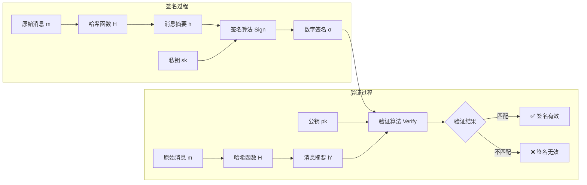
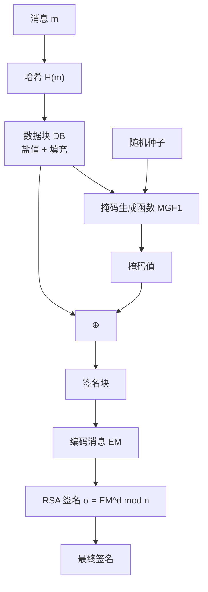
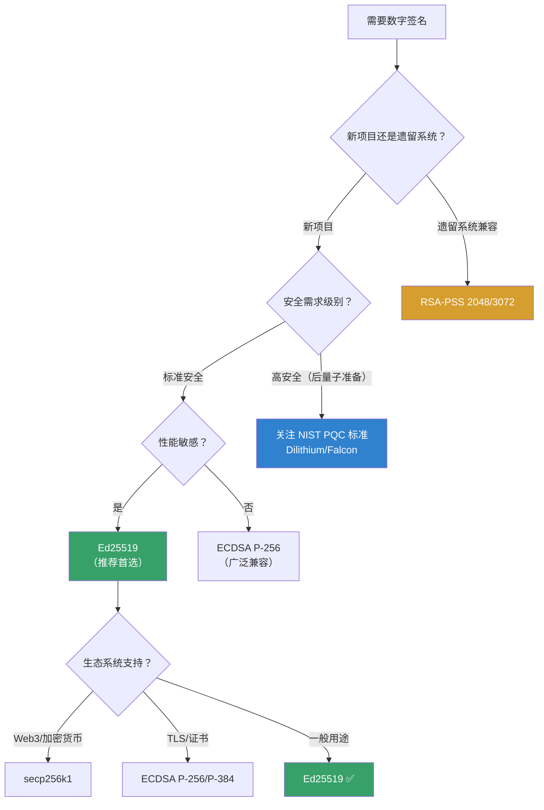
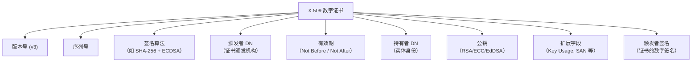
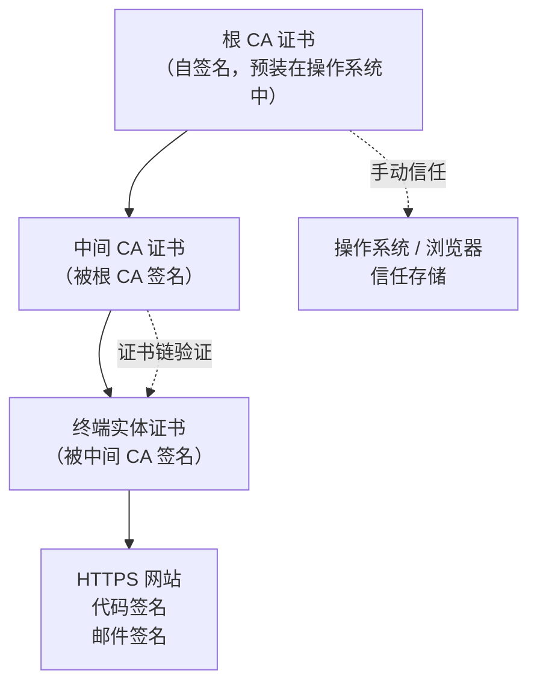
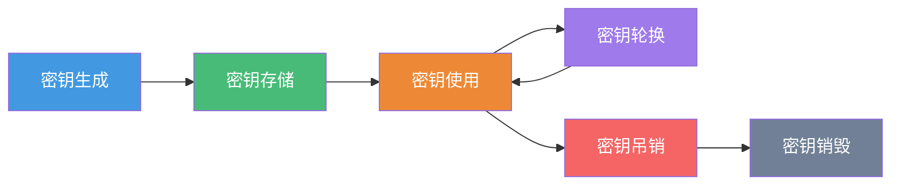
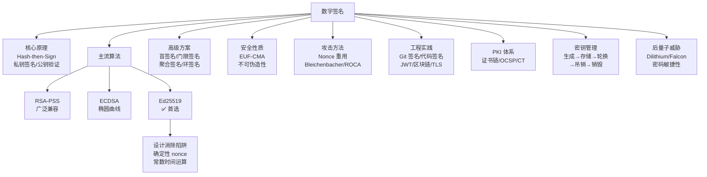

## 四、数字签名

### 1. 概述与背景

数字签名（Digital Signature）是密码学中实现**完整性、认证性和不可否认性**的核心机制。如果说加密解决了"谁能看"的问题，数字签名则解决了"谁说的"和"有没有被改过"的问题。在电子商务、软件分发、区块链、电子合同、法律文书等场景中，数字签名是不可或缺的基础设施。

从历史演进看，数字签名经历了从概念提出到标准化、从 RSA 垄断到多元算法并存的发展过程：

| 时期 | 里程碑 | 意义 |
|------|--------|------|
| 1976 年 | Diffie & Hellman 提出数字签名概念 | 理论奠基——首次在论文中描述公钥签名方案 |
| 1977 年 | RSA 算法发表（Rivest, Shamir, Adleman） | 首个实用的数字签名算法 |
| 1983 年 | David Chaum 提出盲签名（Blind Signature） | 隐私保护签名的理论基础，为电子投票和匿名支付铺路 |
| 1991 年 | DSA（Digital Signature Algorithm）标准化（NIST FIPS 186） | 美国政府标准，从 RSA 走向算法多元化 |
| 1994 年 | DSS（Digital Signature Standard）发布 | DSA 正式成为美国联邦标准 |
| 2000 年 | ECDSA 纳入 FIPS 186-2 | 椭圆曲线签名进入标准化，密钥更短、性能更优 |
| 2008 年 | Bernstein 提出 Ed25519（EdDSA） | 设计哲学转向"安全且易用"，消除实现陷阱 |
| 2011 年 | RFC 6979：确定性 ECDSA | 解决 ECDSA nonce 泄露导致私钥暴露的经典漏洞 |
| 2015 年 | RFC 8032：Ed25519/Ed448 标准化 | EdDSA 成为 IETF 标准 |
| 2020 年 | 门限签名（Threshold Signature）在区块链中大规模应用 | 分布式密钥管理走向实用化 |
| 2022 年 | NIST 后量子签名标准（FIPS 204/205/206） | Dilithium、Falcon、SPHINCS+ 进入后量子时代 |

本节将从密码学原理出发，系统讲解数字签名的安全性质、主流算法（RSA-PSS、ECDSA、EdDSA）、高级签名方案、密钥管理、签名方案设计、攻击方法和工程实践，帮助工程师建立完整的数字签名知识体系。

### 2. 核心原理

#### 2.1 数字签名的基本模型

数字签名的核心思想是：**用私钥签名，用公钥验证**。这一过程与手写签名的直觉相反——手写签名任何人都能辨认，但无法由他人复制；数字签名则依赖数学难题，只有私钥持有者能生成，但任何人都能用公钥验证。



**签名与验证的形式化定义：**

- **密钥生成**：`KeyGen() → (pk, sk)` — 生成公私钥对
- **签名**：`Sign(sk, m) → σ` — 用私钥对消息 $m$ 生成签名 $\sigma$
- **验证**：`Verify(pk, m, σ) → {true, false}` — 用公钥验证签名的正确性

正确性要求：对任意消息 $m$，`Verify(pk, m, Sign(sk, m)) = true`

#### 2.2 Hash-then-Sign：先哈希再签名

现代数字签名几乎都采用 **Hash-then-Sign** 范式：先对消息计算哈希摘要，再对摘要进行签名。这比直接对原始消息签名有三个关键优势：

1. **效率提升**：非对称密码运算极其耗时（RSA 签名比 SHA-256 慢 1000 倍以上）。对固定长度的哈希值（如 256 位）签名，比对任意长度的消息签名快得多
2. **安全性增强**：直接对消息签名存在安全性缺陷（如 RSA 的同态乘法特性——$Sign(m_1) \times Sign(m_2) = Sign(m_1 \times m_2)$）。先哈希破坏了代数结构
3. **标准化处理**：哈希函数将任意长度输入映射为固定长度输出，简化了签名算法的内部处理

```python
# Hash-then-Sign 的概念性流程
from cryptography.hazmat.primitives import hashes
from cryptography.hazmat.primitives.asymmetric import rsa, padding

# 生成密钥对
private_key = rsa.generate_private_key(public_exponent=65537, key_size=2048)
public_key = private_key.public_key()

message = b"Transfer 1000 USD to Alice"

# 签名：内部先哈希（SHA-256）再用 RSA 签名
signature = private_key.sign(
    message,
    padding.PSS(
        mgf=padding.MGF1(hashes.SHA256()),
        salt_length=padding.PSS.MAX_LENGTH
    ),
    hashes.SHA256()  # 指定哈希算法
)

# 验证：同样的哈希-签名流程
try:
    public_key.verify(
        signature,
        message,
        padding.PSS(
            mgf=padding.MGF1(hashes.SHA256()),
            salt_length=padding.PSS.MAX_LENGTH
        ),
        hashes.SHA256()
    )
    print("签名验证通过")
except Exception:
    print("签名验证失败")
```

#### 2.3 四大安全性质

一个安全的数字签名方案必须满足以下性质：

| 性质 | 含义 | 重要性 | 对应安全模型 |
|------|------|--------|------------|
| **不可伪造性**（Unforgeability） | 任何攻击者（即使知道公钥）都无法伪造有效签名 | 核心安全目标 | EUF-CMA（存在性不可伪造-选择消息攻击） |
| **不可否认性**（Non-repudiation） | 签名者事后无法否认自己签过的消息 | 法律和商业场景的核心需求 | 与公钥绑定的身份证明 |
| **完整性**（Integrity） | 任何对消息的篡改都会导致签名验证失败 | 确保消息未被篡改 | 哈希函数的抗碰撞性保证 |
| **可公开验证**（Public Verifiability） | 任何人都能用签名者的公钥验证签名 | 无需私钥参与即可验证 | 公钥密码学的固有属性 |

**不可伪造性的三个安全等级：**

| 等级 | 名称 | 攻击者能力 | 安全强度 |
|------|------|-----------|---------|
| EUF-CMA | 存在性不可伪造-选择消息攻击 | 可获取任意消息的签名，但无法为新消息生成签名 | 标准安全要求 |
| SUF-CMA | 强存在性不可伪造-选择消息攻击 | 无法为已签名的消息生成新的有效签名（即使消息相同） | 更强，防止签名复用攻击 |
| AUF-CPA | 安全性不可伪造-选择明文攻击 | 仅能获取公钥 | 最弱，实际中不充分 |

**EUF-CMA 的直觉理解**：攻击者可以向签名预言机（拥有私钥的服务器）提交任意消息并获取签名，但攻击者无法找到一个**新的**消息 $m^*$（未提交给预言机的消息），使得它能输出一个有效的签名 $\sigma^*$。这是数字签名的"及格线"——任何实用的签名方案都必须达到这个安全级别。

### 3. 主流签名算法详解

#### 3.1 RSA 签名

RSA 签名是最早的实用数字签名方案，基于大整数分解问题的困难性。

**RSA 签名的数学定义：**

- **密钥生成**：选择两个大素数 $p, q$，计算 $n = pq$，$\lambda(n) = \text{lcm}(p-1, q-1)$。选择公钥指数 $e$（通常 $e = 65537$），计算私钥指数 $d \equiv e^{-1} \pmod{\lambda(n)}$
- **签名**：$\sigma = m^d \bmod n$（原始签名，实际使用需填充方案）
- **验证**：$m = \sigma^e \bmod n$，检查 $m$ 是否与原始消息匹配

**RSA 签名填充方案演进：**

| 填充方案 | 标准 | 安全性 | 状态 |
|---------|------|--------|------|
| PKCS#1 v1.5 | RFC 8017 | 存在 Bleichenbacher 攻击风险 | ⚠️ 不推荐新项目使用 |
| RSA-PSS | RFC 8017 (v2.2) | 可证明安全（在 RSA 假设下） | ✅ 推荐使用 |
| RSA-OAEP | 主要用于加密 | 加密填充，不应用于签名 | ❌ 不适用于签名 |

**RSA-PSS（Probabilistic Signature Scheme）** 是当前推荐的 RSA 签名方案，核心改进在于引入了**随机盐值**，使得同一消息每次签名产生不同结果（概率性签名），同时安全性可以归约到 RSA 问题的困难性。



```python
from cryptography.hazmat.primitives.asymmetric import rsa, padding
from cryptography.hazmat.primitives import hashes

# 生成 2048 位 RSA 密钥对
private_key = rsa.generate_private_key(
    public_exponent=65537,
    key_size=2048
)

message = b"Important document content"

# 使用 RSA-PSS 签名（推荐）
signature_pss = private_key.sign(
    message,
    padding.PSS(
        mgf=padding.MGF1(hashes.SHA256()),
        salt_length=padding.PSS.MAX_LENGTH  # 使用最大盐值长度
    ),
    hashes.SHA256()
)

# ⚠️ 不推荐：使用 PKCS#1 v1.5 签名
signature_pkcs1 = private_key.sign(
    message,
    padding.PKCS1v15(),  # 存在已知攻击
    hashes.SHA256()
)

# RSA 密钥长度与安全强度对应关系
# | 密钥长度 | 对称安全强度 | 退役时间建议 |
# |---------|-------------|------------|
# | 1024 位 | ~80 位 | 2010 年已退役 |
# | 2048 位 | ~112 位 | 2030 年前安全 |
# | 3072 位 | ~128 位 | 2030 年后仍安全 |
# | 4096 位 | ~140 位 | 最高安全需求 |
```

**RSA 签名的局限性：**

1. **密钥长度大**：2048 位 RSA 的安全强度仅相当于 112 位对称加密，而 ECC 256 位即可达到 128 位安全强度
2. **签名长度长**：RSA 签名长度等于密钥长度（2048 位 = 256 字节），而 ECDSA 签名仅约 64 字节
3. **计算速度慢**：RSA 私钥操作（签名）涉及大数模幂运算，比 Ed25519 慢一个数量级
4. **实现复杂**：RSA 签名的正确实现需要严格遵守填充方案（PSS），否则存在严重安全风险

#### 3.2 DSA 与 ECDSA

**DSA（Digital Signature Algorithm）** 由 NSA 设计，于 1991 年发布，是第一个不基于 RSA 的签名标准。DSA 本身使用有限域上的离散对数问题，但实践中已被其椭圆曲线变体 **ECDSA** 完全取代。

**ECDSA（Elliptic Curve Digital Signature Algorithm）** 基于椭圆曲线离散对数问题（ECDLP），在相同安全强度下密钥更短、计算更快。

**ECDSA 的工作原理：**

密钥生成：
  选择椭圆曲线参数 (p, a, b, G, n, h)
  选择私钥 d ∈ [1, n-1]
  计算公钥 Q = d·G（椭圆曲线点乘）

签名（对消息 m）：
  1. 计算 e = H(m)
  2. 选择随机数 k ∈ [1, n-1]（这是安全的关键！）
  3. 计算 (x₁, y₁) = k·G
  4. 计算 r = x₁ mod n（若 r = 0，重新选择 k）
  5. 计算 s = k⁻¹(e + dr) mod n（若 s = 0，重新选择 k）
  签名 = (r, s)

验证：
  1. 计算 e = H(m)
  2. 计算 w = s⁻¹ mod n
  3. 计算 u₁ = ew mod n, u₂ = rw mod n
  4. 计算 (x₁, y₁) = u₁·G + u₂·Q
  5. 验证 r ≡ x₁ (mod n)

**常见椭圆曲线及其安全级别：**

| 曲线 | 密钥长度 | 安全强度 | 特点 | 推荐状态 |
|------|---------|---------|------|---------|
| secp256k1 | 256 位 | 128 位 | 比特币使用 | 加密货币专用 |
| secp256r1 (P-256) | 256 位 | 128 位 | NIST 标准，广泛部署 | ✅ 安全可用 |
| secp384r1 (P-384) | 384 位 | 192 位 | 高安全需求 | ✅ 安全可用 |
| secp521r1 (P-521) | 521 位 | 260 位 | 最高安全 | ✅ 安全可用 |

```python
from cryptography.hazmat.primitives.asymmetric import ec
from cryptography.hazmat.primitives import hashes

# 生成 ECDSA 密钥对（P-256 曲线）
private_key = ec.generate_private_key(ec.SECP256R1())
public_key = private_key.public_key()

message = b"Contract agreement terms"

# ECDSA 签名
signature = private_key.sign(message, ec.ECDSA(hashes.SHA256()))

# 验证签名
try:
    public_key.verify(signature, message, ec.ECDSA(hashes.SHA256()))
    print("签名有效")
except Exception:
    print("签名无效")

# 签名数据结构：ASN.1 DER 编码的 (r, s) 对
# 典型长度：约 70-72 字节（P-256）
print(f"签名长度: {len(signature)} 字节")
```

**ECDSA 的致命陷阱——nonce 重用：**

ECDSA 签名中随机数 $k$ 的选择至关重要。如果两个不同的消息使用了相同的 $k$ 值，攻击者可以**直接计算出私钥**：

$$d = \frac{s_1 - s_2}{r \cdot (e_2 - e_1)} \bmod n$$

**真实案例：**

- **2010 年 PlayStation 3 事件**：索尼在 ECDSA 实现中使用了常量 $k$（而非随机生成），导致黑客 George Hotz 成功提取了索尼的签名私钥，使 PS3 完全被破解，后续催生了著名的 fail0verflow 团队的进一步研究
- **2013 年 Android Bitcoin 钱包漏洞**：由于 Android Java SecureRandom 的缺陷，多个比特币钱包的 ECDSA nonce 被预测，导致约 55 BTC 被盗
- **2019 年 Tesla 车辆密钥泄露**：研究人员发现特斯拉 Model S 的密钥卡片使用了不安全的 ECDSA nonce 生成方式，可在几分钟内克隆车辆密钥

**防御措施：**

| 措施 | 原理 | 推荐程度 |
|------|------|---------|
| RFC 6979 确定性签名 | $k = H(sk \| m)$，从私钥和消息派生 $k$，消除随机性 | ✅ 强烈推荐 |
| 确保随机数生成器质量 | 使用 CSPRNG（`/dev/urandom`） | ✅ 必须 |
| 监控签名 nonce 重复 | 签名系统中检测并告警 nonce 重用 | ✅ 生产环境必备 |

**RFC 6979 确定性 nonce 的内部机制：**

输入：私钥 sk, 消息 m, 随机哈希函数 H
输出：确定性 nonce k

1. x = int(sk)                          // 私钥转整数
2. h = H(m)                             // 对消息哈希
3. V = 0x01 × 32（全 1 字节串）           // 初始化 V
4. K = 0x00 × 32（全 0 字节串）           // 初始化 K
5. K = HMAC_K(V || 0x00 || x || h)       // 用 HMAC 更新 K
6. V = HMAC_K(V)                          // 用 HMAC 更新 V
7. K = HMAC_K(V || 0x01 || x || h)       // 再次更新 K
8. V = HMAC_K(V)                          // 再次更新 V
9. 循环：
   T = 空字节串
   while len(T) < qlen:                  // qlen 为群阶的位长
     V = HMAC_K(V)
     T = T || V
   k = int(T) mod (n - 1) + 1           // 确保 k ∈ [1, n-1]
   if k 有效：返回 k
   否则：K = HMAC_K(V || 0x00), V = HMAC_K(V)，继续循环

这种方法的关键优势在于：**签名过程不需要随机源**——即使系统的随机数生成器存在缺陷，确定性 nonce 也能保证安全性。代价是同一消息每次签名结果相同（这对某些需要随机性的场景可能有影响）。

#### 3.3 EdDSA（Edwards-curve Digital Signature Algorithm）

EdDSA 是由 Daniel J. Bernstein 等人设计的签名方案，于 2015 年通过 RFC 8032 标准化。EdDSA 的设计哲学是**安全优先、消除实现陷阱**——与 ECDSA 的各种安全陷阱不同，EdDSA 从设计上避免了最常见的实现错误。

**EdDSA 的核心变体：**

| 变体 | 曲线 | 密钥长度 | 签名长度 | 安全强度 | 特点 |
|------|------|---------|---------|---------|------|
| Ed25519 | Curve25519 | 32 字节 | 64 字节 | 128 位 | 最广泛使用，性能极佳 |
| Ed448 | Curve448-Goldilocks | 57 字节 | 114 字节 | 224 位 | 高安全需求 |

**Ed25519 与 ECDSA 的关键区别：**

| 特性 | ECDSA | Ed25519 (EdDSA) |
|------|-------|-----------------|
| 随机数 $k$ | 必须随机生成（泄露即崩） | 确定性派生，无需随机源 |
| 签名过程 | 多次模逆运算，效率低 | 无模逆，纯点乘和加法 |
| 签名验证 | 多次标量乘法，较慢 | 双标量乘法，速度快 |
| 侧信道 | 需要常数时间实现（否则泄露 $k$） | 内置常数时间保证 |
| 实现复杂度 | 高（需注意 EC 坐标、$k$ 生成、时序） | 低（设计上消除了大部分陷阱） |
| 签名大小 | ~70-72 字节（P-256） | 64 字节 |
| 可分辨性 | ASN.1 DER 编码（长度可变） | 固定 64 字节（恒定长度） |

```python
from cryptography.hazmat.primitives.asymmetric.ed25519 import Ed25519PrivateKey

# 生成 Ed25519 密钥对——三行代码完成
private_key = Ed25519PrivateKey.generate()
public_key = private_key.public_key()

message = b"Sign this important message"

# 签名——极简 API，没有额外参数
signature = private_key.sign(message)

# 验证——同样极简
try:
    public_key.verify(signature, message)
    print("签名有效")
except Exception:
    print("签名无效")

print(f"公钥长度: {len(public_key.public_bytes_raw())} 字节")  # 32
print(f"签名长度: {len(signature)} 字节")  # 64
```

**Ed25519 内部工作流程：**

密钥生成：
  1. 随机生成 32 字节种子 seed
  2. h = SHA-512(seed)  // 64 字节哈希
  3. 取 h 前 32 字节，进行标量裁剪和位操作得到私钥标量 a
  4. 公钥 A = a·B（B 是曲线基点）

签名（对消息 M）：
  1. r = SHA-512(seed ‖ M)  // 确定性 nonce，不依赖随机源
  2. R = r·B
  3. k = SHA-512(R ‖ A ‖ M)  // 严格域哈希
  4. S = (r + k·a) mod ℓ  // ℓ 是基点群的阶
  签名 = R ‖ S（各 32 字节，共 64 字节）

验证：
  1. k = SHA-512(R ‖ A ‖ M)
  2. 检查 S·B == R + k·A
  （利用扭曲爱德华兹曲线的代数性质，可优化为单次多标量乘法）

**Ed25519 为什么更安全——设计层面的安全保证：**

1. **无 nonce 泄露风险**：nonce $r$ 由私钥种子和消息确定性派生，即使随机数源有缺陷也不影响安全性
2. **内置常数时间**：所有运算（点乘、加法、哈希）都是常数时间的，无需额外防护侧信道攻击
3. **避免坐标选择问题**：ECDSA 需要选择仿射坐标或投影坐标，实现不当会导致时序泄漏；Ed25519 在曲线上进行所有运算，无此问题
4. **短且恒定的签名长度**：64 字节，固定不变，简化了协议设计（不需要 ASN.1 解码）
5. **统一的哈希函数**：内部统一使用 SHA-512，不给实现者留下选择哈希函数的余地（选择错误的哈希函数是常见实现错误）

#### 3.4 高级签名方案

除了上述主流算法，密码学领域还发展出了多种针对特定场景的高级签名方案：

**盲签名（Blind Signature）：**

盲签名由 David Chaum 于 1983 年提出，允许签名者在**看不到消息内容**的情况下对消息签名。核心思想是签名者对"盲化"后的消息签名，签名者撤销盲化后得到对原始消息的有效签名。

协议流程：
  1. Alice（请求者）对消息 m 进行盲化：m' = blind(m, r)
  2. Bob（签名者）对 m' 签名：σ' = Sign(sk, m')
  3. Alice 撤销盲化：σ = unblind(σ', r)
  4. 验证者验证 σ 是对 m 的有效签名

盲签名的核心价值在于**隐私保护**——签名者无法将签名与具体消息关联。典型应用包括：
- **电子现金**：银行对货币签名但不知道具体消费记录
- **电子投票**：选票签名者不知道投票内容
- **匿名凭证**：颁发者签发凭证但不知道持有者身份

**门限签名（Threshold Signature）：**

门限签名将签名密钥分散到 $n$ 个参与者中，任何 $t$ 个参与者（$t \leq n$）可以协作生成有效签名，但少于 $t$ 个参与者无法签名。这是分布式密钥管理的核心技术。

(n, t) 门限签名方案：
  - 密钥生成：通过分布式密钥生成协议（DKG），n 个参与者各自获得一个密钥份额
  - 签名：至少 t 个参与者使用自己的份额生成部分签名，合并为完整签名
  - 单点故障：任何单个参与者被攻破不会泄露完整私钥
  - 容错性：最多 n-t 个参与者离线或被攻破，签名仍可完成

**典型应用：**
- **区块链共识**：多个验证者协作签名区块，避免单点信任
- **企业密钥管理**：防止内部人员单独伪造签名
- **高可用签名服务**：多节点部署，任一节点故障不影响签名能力

**聚合签名（Aggregate Signature）：**

聚合签名允许将多个独立签名压缩为一个短签名，验证者可以一次性验证所有签名。典型方案包括 BLS 聚合签名（基于双线性配对）。

聚合流程：
  - n 个参与者各自签名消息 mᵢ，得到签名 σᵢ
  - 聚合者计算：σ_agg = σ₁ × σ₂ × ... × σₙ（椭圆曲线点加）
  - 验证者检查：e(σ_agg, G) = e(H(m₁), pk₁) × e(H(m₂), pk₂) × ... × e(H(mₙ), pkₙ)

**应用场景**：区块链出块签名聚合（以太坊 2.0 使用 BLS 聚合签名减少验证开销）、证书链压缩。

**环签名（Ring Signature）：**

环签名允许签名者以一组成员中**任意一人**的身份签名，验证者只能确认签名来自该组中的某个人，但无法确定具体是谁。与群签名不同，环签名无需组管理员，也无需注册过程。

**应用场景**：门罗币（Monero）的隐私交易——发送者将自己的公钥与其他用户的公钥混合，矿工只能确认交易来自该组中的某人，但无法追踪具体发送者。

#### 3.5 算法选择决策指南



**综合对比表：**

| 特性 | RSA-PSS (2048) | RSA-PSS (3072) | ECDSA (P-256) | Ed25519 | Ed448 |
|------|---------------|---------------|---------------|---------|-------|
| 密钥长度 | 256 字节 | 384 字节 | 32 字节 | 32 字节 | 57 字节 |
| 签名长度 | 256 字节 | 384 字节 | ~72 字节 | 64 字节 | 114 字节 |
| 安全强度 | 112 位 | 128 位 | 128 位 | 128 位 | 224 位 |
| 签名速度（相对） | 1x | 0.5x | 5x | **15x** | 8x |
| 验证速度（相对） | 15x | 10x | 8x | **20x** | 6x |
| 确定性签名 | ❌（需盐值） | ❌（需盐值） | ❌（需随机 $k$） | ✅ 内置 | ✅ 内置 |
| 实现复杂度 | 中 | 中 | 高 | **低** | 低 |
| 生态系统 | 极广泛 | 广泛 | 广泛 | 快速增长 | 较新 |
| 推荐场景 | 遗留兼容 | 高安全 RSA | 广泛兼容 | **首选** | 最高安全 |

### 4. 签名方案的安全性分析

#### 4.1 存在性不可伪造（EUF-CMA）

EUF-CMA（Existential Unforgeability under Chosen Message Attack）是数字签名的核心安全定义，由 Goldwasser、Micali 和 Rivest 在 1988 年形式化。

**安全游戏模型：**

1. 挑战者运行 KeyGen()，将公钥 pk 给攻击者
2. 攻击者可以向签名预言机查询任意消息 mᵢ，获得 σᵢ = Sign(sk, mᵢ)
3. 攻击者输出 (m*, σ*)，其中 m* 从未被查询过
4. 攻击者获胜条件：Verify(pk, m*, σ*) = true
如果任何多项式时间攻击者获胜的概率可忽略（negligible），则方案满足 EUF-CMA

**各算法的安全性归约：**

| 算法 | EUF-CMA 安全性假设 | 归约强度 |
|------|-------------------|---------|
| RSA-PSS | RSA 假设（大数分解困难） | 可证明安全（紧致归约） |
| ECDSA | ECDLP（椭圆曲线离散对数困难） | 可证明安全（需随机预言机模型） |
| Ed25519 | ECDLP + 随机预言机模型 | 可证明安全 |

#### 4.2 签名方案的常见攻击

**攻击分类与防御：**

| 攻击类型 | 描述 | 目标算法 | 防御措施 |
|---------|------|---------|---------|
| **Nonce 重用攻击** | 两个签名使用相同 $k$，直接恢复私钥 | ECDSA, DSA | 使用 RFC 6979 确定性签名 |
| **Bleichenbacher 攻击** | 利用 PKCS#1 v1.5 填充的弱点伪造签名 | RSA (v1.5) | 使用 RSA-PSS |
| **ROCA 漏洞** | Infineon 芯片生成的 RSA 密钥存在结构弱点，可被快速分解 | RSA (特定硬件) | 检测并替换受影响密钥 |
| **故障注入攻击** | 通过电压毛刺、激光注入等物理手段干扰签名过程，泄露私钥位信息 | 所有 | 常数时间实现 + 故障检测 + 签名验证 |
| **时序攻击** | 通过测量签名时间推断私钥信息 | RSA, ECDSA | 常数时间实现 |
| **量子攻击** | Shor 算法可在量子计算机上破解 RSA/ECDLP | 所有当前算法 | 迁移到后量子签名 |
| **选择消息攻击** | 攻击者获取特定消息的签名后伪造新签名 | 所有 | 达到 EUF-CMA 安全 |

**ROCA 漏洞详解（2017 年发现）：**

ROCA（Return of Coppersmith's Attack）影响了 Infineon Technologies 芯片生成的 RSA 密钥。受影响的密钥在生成时使用了有缺陷的密钥生成库，导致密钥具有可检测的数学特征。攻击者可以仅凭公钥判断密钥是否受影响，然后用优化的 Coppersmith 方法在数小时内分解 2048 位 RSA 密钥。

**影响范围**：约 75 万张捷克共和国身份证、大量 YubiKey 4 硬件安全模块、部分 SSH 密钥和 TLS 证书。

**检测方法**：检查 RSA 公钥模数 $n$ 的 Fingerprint 前几个字节是否匹配已知的 ROCA 指纹模式。

#### 4.3 量子计算威胁与后量子签名

Shor 算法可以在多项式时间内分解大整数和求解离散对数问题，对 RSA、DSA、ECDSA、EdDSA 构成**根本性威胁**。量子密码学（Post-Quantum Cryptography, PQC）正在积极应对此挑战。

**NIST 后量子签名标准（2024 年发布）：**

| 算法 | 类型 | 签名大小 | 公钥大小 | 安全假设 | 状态 |
|------|------|---------|---------|---------|------|
| ML-DSA（原 Dilithium） | 格密码（Module Lattice） | 2.4-4.6 KB | 1.3-2.6 KB | Module-LWE/Module-SIS | ✅ FIPS 204 标准化 |
| SLH-DSA（原 SPHINCS+） | 哈希签名 | 7.8-49 KB | 32-64 KB | 哈希函数安全性 | ✅ FIPS 205 标准化 |
| FN-DSA（原 Falcon） | 格密码（NTRU Lattice） | 0.7-1.3 KB | 0.9-1.8 KB | NTRU/格上的 SVP | ✅ FIPS 206 标准化 |

**后量子签名的工程挑战：**

- **签名体积大幅增加**：从 64 字节（Ed25519）到 2.4-49 KB（PQC），对带宽和存储有显著影响
- **密钥大小增加**：公钥从 32 字节到 0.9-2.6 KB
- **验证速度可能更快**：部分格密码签名的验证速度优于 RSA
- **需要密码敏捷性**：系统应能同时支持经典和后量子签名算法，便于平滑迁移

**"先收集，后解密"（Harvest Now, Decrypt Later）威胁：**

当前最大的量子威胁不是即时的，而是"先收集，后解密"——攻击者现在截获并存储加密通信，等待未来量子计算机成熟后解密。对于需要保密 10 年以上的数据（政府机密、医疗档案、长期商业合同），现在就应该开始规划后量子迁移。数字签名面临类似威胁：攻击者可能现在收集签名数据，未来尝试伪造——不过由于签名不涉及保密性，"先收集后伪造"的威胁相对较小，但仍需关注密钥长期安全性。

**密码敏捷性（Crypto Agility）架构设计原则：**

密码敏捷性 = 系统能在不修改整体架构的前提下切换密码算法

实现要点：
  1. 算法与协议解耦：签名算法作为可配置参数，而非硬编码
  2. 多算法并行支持：系统能同时验证经典签名和 PQC 签名
  3. 密钥标识机制：每个密钥/签名携带算法标识，验证时自动选择
  4. 渐进式迁移：支持混合签名（经典 + PQC），确保过渡期安全
  5. 回退机制：PQC 算法出现漏洞时能快速回退到经典算法

### 5. 数字证书与公钥基础设施（PKI）

数字签名解决的是"消息是否被正确签名"的问题，但不解决"公钥属于谁"的问题。**数字证书**将公钥与身份绑定，**PKI（Public Key Infrastructure）** 则提供了完整的信任体系。

#### 5.1 数字证书结构

X.509 v3 数字证书是互联网上最广泛使用的证书格式，其核心字段：



**证书关键扩展字段：**

| 扩展 | 含义 | 作用 |
|------|------|------|
| Key Usage | 密钥用途约束 | 标记密钥是否可用于数字签名、加密等 |
| Extended Key Usage | 扩展用途 | 标记证书是否可用于 TLS 服务器/客户端认证 |
| Subject Alternative Name (SAN) | 替代名称 | 证书可保护的域名列表 |
| Basic Constraints | 基本约束 | 标记证书是否为 CA 证书（可签发子证书） |
| CRL Distribution Points | 吊销列表分发点 | 指向证书吊销列表的位置 |
| Authority Information Access | 颁发者信息访问 | 包含 OCSP 响应者 URL 等信息 |

#### 5.2 证书信任链



**证书链验证过程：**

1. 从终端实体证书开始，获取其颁发者的签名
2. 向上找到中间 CA 的公钥，验证终端实体证书的签名
3. 继续向上，用根 CA 的公钥验证中间 CA 的签名
4. 确认根 CA 在本地信任存储中
5. 检查每张证书的有效期、吊销状态（CRL/OCSP）

#### 5.3 证书吊销：CRL 与 OCSP

证书可能在有效期之内被吊销（私钥泄露、员工离职、CA 误签发），需要机制来通知验证方。

**CRL（Certificate Revocation List）：**

CRL 是由 CA 定期签发的已吊销证书列表：
  - CA 对列表进行数字签名，防止篡改
  - 验证者下载 CRL 并检查目标证书是否在列表中
  - 缺点：列表随时间增长，每次验证都需下载完整列表
  - 更新频率：通常每小时到每天

**OCSP（Online Certificate Status Protocol）：**

OCSP 是实时查询证书状态的协议：
  1. 验证者向 OCSP 响应者发送查询：证书 X 是否有效？
  2. OCSP 响应者返回签名响应：good / revoked / unknown
  - 优点：实时性强，无需下载大列表
  - 缺点：增加延迟，OCSP 响应者可能成为单点故障和隐私泄露源

**OCSP Stapling（OCSP 装订）：**

OCSP Stapling 是对 OCSP 的优化——由服务器定期查询自己的证书状态，将签名的 OCSP 响应"装订"到 TLS 握手中，客户端无需额外查询：

传统 OCSP 流程（3 次网络往返）：
  客户端 → 服务器：请求证书
  服务器 → 客户端：返回证书
  客户端 → OCSP 响应者：查询证书状态
  OCSP 响应者 → 客户端：返回签名响应

OCSP Stapling 流程（1 次网络往返）：
  服务器 → OCSP 响应者：预查询证书状态
  客户端 → 服务器：请求证书
  服务器 → 客户端：返回证书 + 装订的 OCSP 响应

OCSP Stapling 既提升了验证速度，又保护了用户隐私（OCSP 响应者看不到谁在访问哪个网站）。现代 Web 服务器（Nginx、Apache、Caddy）均支持 OCSP Stapling。

#### 5.4 证书透明度（Certificate Transparency）

证书透明度（CT）是 Google 于 2012 年提出的审计框架，旨在检测错误签发或恶意签发的证书。

**CT 的核心机制：**

- 所有签发的证书必须提交到**日志服务器**（公开可验证的 Merkle 树）
- 网站运营者可以监控日志，发现未授权的证书签发
- 浏览器要求 TLS 证书包含 SCT（Signed Certificate Timestamp）证明

这一机制直接依赖数字签名——日志服务器对提交记录进行签名，确保日志的不可篡改性。

**CT 的实际安全影响**：2011 年 DigiNotar CA 被入侵，攻击者签发了约 500 张伪造证书（包括 Google 的通配符证书），用于对伊朗用户实施中间人攻击。CT 的推出使类似攻击更难隐藏——任何异常签发的证书都会被公开日志记录。

#### 5.5 证书固定（Certificate Pinning）

证书固定是一种额外的安全措施——应用程序预先记住（固定）目标服务器的公钥或证书指纹，即使攻击者持有合法 CA 签发的伪造证书，也无法通过验证。

固定方式：
  1. 公钥固定：记住服务器公钥的 SPKI 哈希（推荐）
  2. 证书固定：记住整个证书的哈希（不灵活，证书轮换时需更新）
  3. CA 固定：只信任特定 CA 签发的证书（折中方案）

⚠️ 注意事项：
  - 固定过于严格会导致证书轮换失败
  - 建议设置备用固定项（backup pins），防止主固定项丢失
  - 移动应用推荐使用，网站建议优先使用 CT 而非固定

### 6. 数字签名的密钥管理

密钥管理是数字签名安全性的根基——算法再安全，密钥管理不当也会导致全面崩溃。

#### 6.1 密钥生命周期



**密钥生成：**

- 使用密码学安全伪随机数生成器（CSPRNG）——`/dev/urandom`（Linux）、`BCryptGenRandom`（Windows）
- 避免在虚拟机快照恢复后生成密钥（熵池状态可能重复）
- 关键密钥应在 HSM（硬件安全模块）中生成，私钥永远不离开硬件

**密钥存储方式对比：**

| 存储方式 | 安全性 | 适用场景 | 成本 |
|---------|--------|---------|------|
| HSM（硬件安全模块） | 最高——私钥无法导出 | 企业 CA、支付系统、高价值签名 | 高 |
| TPM（可信平台模块） | 高——绑定硬件 | 服务器、设备认证 | 中 |
| 操作系统密钥链 | 中等——依赖 OS 安全 | 桌面应用、个人使用 | 低 |
| 加密文件存储 | 中等——依赖密码强度 | 开发环境、低安全需求 | 低 |
| 内存中（运行时） | 取决于进程隔离 | 短期使用，签名后立即清除 | 无 |
| 硬编码在源码中 | **极低——绝不允许** | 无 | 无 |

**密钥轮换策略：**

密钥轮换是定期更换密钥的操作，即使密钥被泄露，影响范围也被限制在轮换周期内：

- **RSA 密钥**：建议每 1-2 年轮换（NIST SP 800-57 建议）
- **ECDSA/Ed25519 密钥**：建议每 2-3 年轮换
- **短期证书**：Let's Encrypt 推动的 90 天证书有效期，强制频繁轮换
- **自动轮换**：生产系统应实现自动化密钥轮换，避免人为疏忽

密钥轮换最佳实践：
  1. 提前生成新密钥对（旧证书到期前 30 天）
  2. 逐步迁移——新旧密钥并行运行一段时间
  3. 监控验证失败率——确认新密钥被广泛接受
  4. 安全清除旧私钥
  5. 记录轮换日志（时间、原因、操作者）

**密钥吊销：**

当私钥可能已泄露或持有者不再有签名权限时，必须吊销密钥：
- 向 CA 申请吊销证书（提交 CSR）
- CA 将证书加入 CRL 并更新 OCSP 响应
- 吊销是**不可逆**的——即使后续确认私钥未泄露，也应重新签发新证书

**密钥销毁：**

- 软销毁：安全删除密钥文件（多次覆写）
- 硬销毁：HSM 中的密钥通过安全擦除命令销毁
- 确保所有备份副本一并销毁

### 7. 实战场景与工程实践

#### 7.1 Git 提交签名

Git 支持对提交（commit）和标签（tag）进行 GPG/SSH/SMIME 签名，验证代码来源的真实性：

```bash
# 使用 SSH 密钥签名 Git 提交
git config --global gpg.format ssh
git config --global user.signingkey ~/.ssh/id_ed25519.pub

# 签名提交
git commit -S -m "feat: implement secure key rotation"

# 签名标签
git tag -s v1.0.0 -m "Release version 1.0.0"

# 验证提交签名
git log --show-signature -1

# 验证标签签名
git verify-tag v1.0.0

# 在 GitHub 上显示已验证签名
# Settings → SSH and GPG keys → 添加签名密钥
```

**GPG 密钥生成（使用 Ed25519）：**

```bash
# 生成 Ed25519 签名密钥
gpg --full-generate-key
# 选择：Ed25519 (签名和认证)
# 选择：256 位 ECC（无需设置过期时间的场景可跳过）

# 导出公钥供 GitHub 使用
gpg --armor --export <key-id>
```

#### 7.2 代码签名

代码签名确保软件包在分发过程中未被篡改，且来源可信。操作系统的包管理器（apt、yum）、移动应用商店（App Store、Google Play）和软件更新机制都依赖代码签名。

```python
# 使用 PyCryptodome 进行代码签名演示
from Crypto.PublicKey import RSA
from Crypto.Signature import pkcs1_15
from Crypto.Hash import SHA256

# 生成密钥对（实际中密钥应存储在 HSM 中）
key = RSA.generate(2048)

# 待签名的代码内容
code = b"#!/usr/bin/env python3\nprint('Hello, Secure World!')"

# 创建签名
h = SHA256.new(code)
signature = pkcs1_15.new(key).sign(h)

# 验证签名
try:
    pkcs1_15.new(key.publickey()).verify(h, signature)
    print("代码签名验证通过")
except (ValueError, TypeError):
    print("代码签名验证失败——代码可能被篡改")
```

**代码签名的工程最佳实践：**

| 实践 | 说明 |
|------|------|
| 密钥存储在 HSM 中 | 私钥不应暴露在构建服务器的文件系统中 |
| 使用时间戳 | 签名包含时间戳，确保证书过期后签名仍可验证 |
| 自动化签名流程 | 在 CI/CD 管道中集成签名步骤，避免人为遗漏 |
| 支持密钥轮换 | 证书过期前生成新密钥对，逐步迁移 |
| 提供撤销机制 | 被入侵时能快速吊销签名密钥 |
| 双重签名 | 同时使用两种算法签名，防止单一算法被攻破 |

#### 7.3 区块链中的数字签名

区块链是数字签名的典型应用场景——每个交易都由发送者用私钥签名，矿工/验证者用公钥验证签名和所有权。

```python
# 比特币交易签名的概念模型（简化）
import hashlib
import ecdsa  # pip install ecdsa

# 生成 secp256k1 密钥对（比特币使用此曲线）
private_key = ecdsa.SigningKey.generate(curve=ecdsa.SECP256k1)
public_key = private_key.get_verifying_key()

# 模拟交易数据
tx_data = b"from:alice to:bob amount:1 BTC"

# 对交易哈希签名
tx_hash = hashlib.sha256(tx_data).digest()
signature = private_key.sign_digest(tx_hash, sigencode=ecdsa.util.sigencode_string)

# 验证：任何人都能用公钥验证此交易确实由 Alice 发起
assert public_key.verify_digest(signature, tx_hash)

# 这个签名机制实现了：
# 1. 认证性：只有 Alice 的私钥能生成此签名
# 2. 完整性：交易数据的任何改动都会导致验证失败
# 3. 不可否认性：Alice 无法否认她发起过此交易
```

#### 7.4 JWT（JSON Web Token）中的签名

JWT 广泛用于 Web 认证（OAuth 2.0、OpenID Connect），其第三部分就是数字签名：

```python
import jwt  # pip install PyJWT
import datetime

# 使用 Ed25519 签名 JWT（推荐）
from cryptography.hazmat.primitives.asymmetric.ed25519 import Ed25519PrivateKey

# 生成密钥
private_key = Ed25519PrivateKey.generate()
public_key = private_key.public_key()

# 编码私钥为 PEM 格式（用于 PyJWT）
private_pem = private_key.private_bytes(
    encoding=__import__('cryptography').serialization.Encoding.PEM,
    format=__import__('cryptography').serialization.PrivateFormat.PKCS8,
    encryption_algorithm=__import__('cryptography').serialization.NoEncryption()
)
public_pem = public_key.public_bytes(
    encoding=__import__('cryptography').serialization.Encoding.PEM,
    format=__import__('cryptography').serialization.PublicFormat.SubjectPublicKeyInfo
)

# 创建 JWT
payload = {
    "sub": "user-12345",
    "name": "Alice",
    "role": "admin",
    "iat": datetime.datetime.utcnow(),
    "exp": datetime.datetime.utcnow() + datetime.timedelta(hours=1)
}

# 使用 EdDSA（Ed25519）签名
token = jwt.encode(payload, private_pem, algorithm="EdDSA")
print(f"JWT: {token[:50]}...")

# 验证 JWT
decoded = jwt.decode(token, public_pem, algorithms=["EdDSA"])
print(f"验证通过: {decoded['name']}")

# ⚠️ 危险：绝不要使用 "none" 算法
# 恶意用户可能将 alg 改为 "none" 绕过签名验证
# 永远在服务端显式指定允许的算法列表
```

**JWT 签名算法选择：**

| 算法 | 推荐程度 | 适用场景 |
|------|---------|---------|
| EdDSA (Ed25519) | ✅ 强烈推荐 | 新项目首选 |
| ES256/ES384 (ECDSA) | ✅ 推荐 | 需要广泛兼容 |
| RS256/RS384 (RSA) | ⚠️ 可用 | 遗留系统兼容 |
| HS256 (HMAC) | ⚠️ 受限 | 对称场景，密钥共享 |
| none | ❌ 绝对禁止 | 安全灾难 |

#### 7.5 TLS 握手中的数字签名

TLS（Transport Layer Security）是互联网安全通信的基石，数字签名在 TLS 握手中扮演核心角色——服务器用私钥签名来证明自己拥有证书对应的私钥，客户端用公钥验证来确认服务器身份。

**TLS 1.3 握手中的签名使用：**

TLS 1.3 完整握手流程（简化）：

客户端 → 服务器：ClientHello（支持的密码套件、密钥共享参数）
服务器 → 客户端：ServerHello + 证书 + CertificateVerify
                   ↑
                   CertificateVerify 就是对整个握手哈希的签名
                   服务器用自己的私钥对握手消息的哈希签名
                   客户端用服务器证书中的公钥验证此签名

客户端 → 服务器：Finished（客户端握手签名）
服务器 → 客户端：Finished（服务器握手签名）

TLS 1.3 中 CertificateVerify 签名的签名算法由服务器在密码套件中指定。常见的组合包括：
- `ecdsa_secp256r1_sha256`：ECDSA + P-256 + SHA-256
- `ed25519`：Ed25519（TLS 1.3 新增支持）
- `rsa_pss_rsae_sha256`：RSA-PSS + SHA-256

**值得注意的是**：TLS 1.3 已完全禁止 RSA PKCS#1 v1.5 签名，强制使用 RSA-PSS 或椭圆曲线签名，这是对历史漏洞的彻底修复。

#### 7.6 数字签名时间戳

数字签名本身不包含时间信息——验证者无法判断签名是何时创建的。**时间戳**为签名提供了时间证明，在法律和合规场景中至关重要。

时间戳协议（RFC 3161）工作流程：
  1. 签名者对消息签名，得到签名 σ
  2. 签名者将 σ 提交给时间戳机构（TSA）
  3. TSA 对 σ 和当前时间戳签名，得到时间戳令牌
  4. 时间戳令牌作为签名有效性的证明

时间戳证明了：在 TSA 签名的时刻，签名 σ 已经存在
这防止了签名者事后声称"签名是伪造的"

**应用场景**：
- **代码签名**：证书过期后，时间戳证明签名在证书有效期内创建
- **电子合同**：法律上证明合同签署时间
- **长期验证（LTV）**：确保证书吊销后签名仍可验证

### 8. 常见误区与安全陷阱

#### 8.1 误区一：签名即加密

很多人混淆数字签名和加密。它们虽然都使用公钥密码学，但方向完全相反：

| 特性 | 加密 | 数字签名 |
|------|------|---------|
| 目标 | 机密性（保密） | 认证性（证明身份） |
| 操作方向 | 公钥加密 → 私钥解密 | 私钥签名 → 公钥验证 |
| 保护对象 | 数据内容 | 数据来源和完整性 |
| 使用的密钥 | 接收者的公钥 | 发送者的私钥 |
| 典型场景 | 安全传输 | 代码签名、合同签署 |

#### 8.2 误区二：RSA 密钥可以同时用于加密和签名

**绝不应该**将同一个 RSA 密钥对同时用于加密和签名。原因：

1. **安全模型不同**：加密要求 IND-CPA/IND-CCA2 安全，签名要求 EUF-CMA 安全，两者的安全定义不兼容
2. **填充方案冲突**：加密使用 OAEP 填充，签名使用 PSS 填充，混用会导致安全缺陷
3. **合规要求**：NIST SP 800-57 明确要求签名密钥和加密密钥必须独立

❌ 错误：同一个 RSA 密钥既加密又签名
✅ 正确：为加密和签名分别生成独立的密钥对

#### 8.3 误区三：ECDSA nonce 只要"随机"就安全

**ECDSA 中随机数 $k$ 的生成是整个签名方案中最危险的环节。** 很多"看起来随机"的来源实际上不满足密码学安全要求：

| 错误做法 | 风险 | 后果 |
|---------|------|------|
| `Math.random()` | JavaScript 伪随机，可预测 | 私钥可被恢复 |
| `rand()` (C 标准库) | 线性同余，种子有限 | 私钥可被恢复 |
| 时间戳做种子 | 熵值过低 | 暴力穷举可行 |
| 系统刚启动时生成 | 熵池未充分填充 | 多个签名可能使用相同 $k$ |
| 复制虚拟机 | 私钥相同 → nonce 相同 | 私钥可被恢复 |

**最佳实践**：使用 RFC 6979 确定性 ECDSA，或直接使用 Ed25519（从设计上消除了此问题）。

#### 8.4 误区四：更长的密钥一定更安全

RSA 密钥从 1024 位加到 4096 位确实能提升安全性，但同时：

- 签名速度下降约 **8 倍**（4096 vs 2048）
- 签名长度增加 **2 倍**
- 验证速度下降约 **2 倍**

相比之下，Ed25519 用 32 字节的密钥提供 128 位安全强度，签名仅 64 字节，速度比 RSA-2048 快一个数量级。在选择密钥长度时，应考虑**安全需求与性能需求的平衡**，而非盲目追求更长密钥。

#### 8.5 误区五：数字签名可以保证消息内容的机密性

数字签名只保证**完整性、认证性和不可否认性**，不保证机密性。签名后的消息仍然是明文的。如果需要同时保证机密性和认证性，必须将**签名与加密结合使用**：

```python
# 正确的组合：先签名再加密（Sign-then-Encrypt）
# 签名提供认证性，加密提供机密性

from cryptography.hazmat.primitives.asymmetric import padding
from cryptography.hazmat.primitives import hashes, serialization
from cryptography.hazmat.primitives.asymmetric import rsa

# 步骤 1：发送者对消息签名
sender_private_key = rsa.generate_private_key(65537, 2048)
message = b"Confidential: Wire transfer approved"
signature = sender_private_key.sign(message, padding.PSS(
    mgf=padding.MGF1(hashes.SHA256()), salt_length=padding.PSS.MAX_LENGTH
), hashes.SHA256())

# 步骤 2：将消息和签名一起用接收者公钥加密
recipient_public_key = ...  # 获取接收者公钥
combined = message + b"\n---SIGNATURE---\n" + signature
encrypted = recipient_public_key.encrypt(combined, padding.OAEP(
    mgf=padding.MGF1(hashes.SHA256()), algorithm=hashes.SHA256(), label=None
))
# 现在消息既有机密性又有认证性
```

#### 8.6 误区六：数字签名等同于法律效力

数字签名提供了**技术上的不可否认性**，但法律效力取决于司法管辖区的法律框架。不同国家和地区对数字签名的法律认可程度不同：

| 法律框架 | 地区 | 关键要求 | 与技术签名的关系 |
|---------|------|---------|----------------|
| eIDAS 规范 | 欧盟 | 高级电子签名需基于合格证书 | 技术签名 + 合格证书 + 可信时间戳 |
| ESIGN Act | 美国 | 不要求特定技术，但需证明签名意图 | 技术签名可满足，但需额外证据 |
| 电子签名法 | 中国 | 可靠电子签名与手写签名同等效力 | 需通过第三方认证机构 |
| IT Act | 印度 | 数字签名必须使用政府认可的 CA | 特定算法和 CA 要求 |

这意味着在实际商业和法律场景中，不能仅依赖技术签名——还需要确保签名流程符合当地法规要求，包括身份验证、证书管理和审计记录。

### 9. 性能基准与优化

#### 9.1 各算法性能对比

以下数据基于 Python `cryptography` 库在标准服务器上的测量（仅供参考，实际性能因硬件而异）：

| 操作 | RSA-2048 | RSA-3072 | ECDSA P-256 | Ed25519 | Ed448 |
|------|---------|---------|-------------|---------|-------|
| 密钥生成 | ~150 ms | ~400 ms | ~2 ms | **<1 ms** | ~5 ms |
| 签名 | ~1.5 ms | ~4 ms | ~0.3 ms | **~0.05 ms** | ~0.2 ms |
| 验证 | ~0.05 ms | ~0.1 ms | ~0.8 ms | **~0.05 ms** | ~0.1 ms |
| 密钥大小 | 256 B | 384 B | 32 B | **32 B** | 57 B |
| 签名大小 | 256 B | 384 B | ~72 B | **64 B** | 114 B |

#### 9.2 高吞吐签名优化策略

| 策略 | 适用场景 | 原理 |
|------|---------|------|
| **批量验证** | TLS 服务器、证书验证 | 多个签名合并验证，减少椭圆曲线运算次数 |
| **预计算** | 固定消息模式 | 预先计算签名中的常量部分 |
| **HSM 卸载** | 高安全 + 高吞吐 | 签名操作在专用硬件中执行，不占用 CPU |
| **密钥缓存** | TLS 握手 | 缓存已解析的密钥对象，避免重复 PEM 解析 |
| **并行签名** | 批量文件签名 | 多核并行处理独立文件的签名 |

```python
# 批量验证优化示例
from cryptography.hazmat.primitives.asymmetric.ed25519 import Ed25519PublicKey

# 预加载公钥对象（避免重复解析）
public_key = Ed25519PublicKey.from_public_bytes(public_key_bytes)

# 批量验证多个签名
messages_and_signatures = [
    (msg1, sig1), (msg2, sig2), (msg3, sig3), ...
]

valid_count = 0
for msg, sig in messages_and_signatures:
    try:
        public_key.verify(sig, msg)
        valid_count += 1
    except Exception:
        pass  # 无效签名

print(f"验证通过: {valid_count}/{len(messages_and_signatures)}")
```

### 10. 本节小结

数字签名是密码学中实现认证性、完整性和不可否认性的核心机制。本节从理论到实践，覆盖了以下关键知识点：



**核心要点回顾：**

1. **首选 Ed25519**：新项目应优先选择 Ed25519——安全性高、实现简单、性能优异、无 nonce 泄露风险
2. **RSA 留作兼容**：仅在需要兼容遗留系统（TLS 证书、老旧协议）时使用 RSA-PSS
3. **ECDSA 需谨慎**：如果使用 ECDSA，必须配合 RFC 6979 确定性签名，严格管理 nonce
4. **Hash-then-Sign 是标准**：永远不要直接对原始消息签名，先哈希再签名
5. **密钥必须独立**：签名密钥和加密密钥绝不能复用
6. **密钥管理是根基**：生成、存储、轮换、吊销、销毁——每个环节都不能马虎
7. **PKI 解决信任问题**：数字签名解决"是不是你签的"，PKI 解决"公钥是不是你的"
8. **准备后量子迁移**：关注 NIST PQC 标准（Dilithium、Falcon、SPHINCS+），为密码敏捷性做好架构准备

***

*软件工程核心知识体系 · 第33章 · 理论基础*
