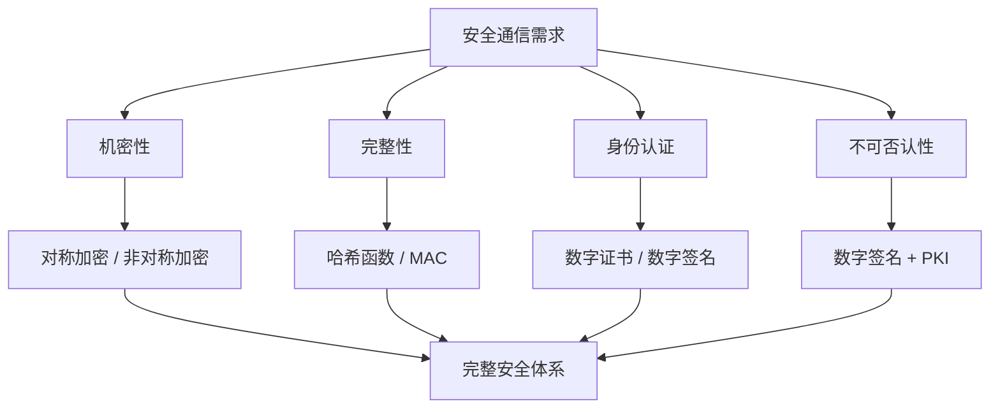
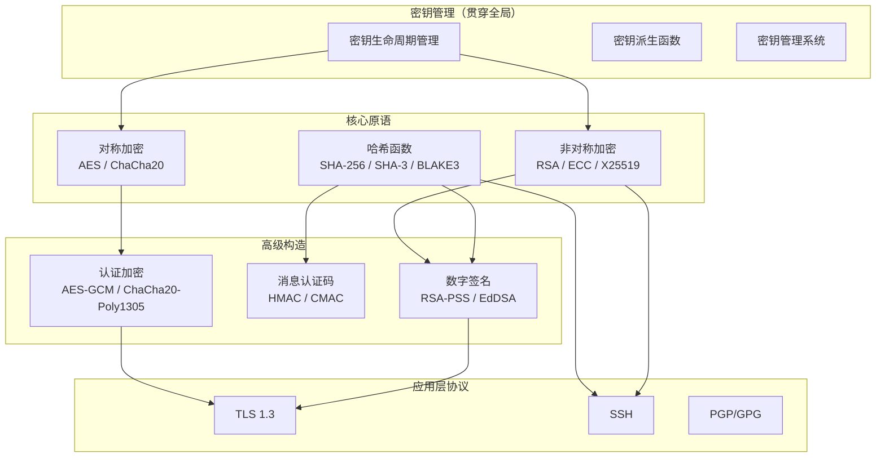
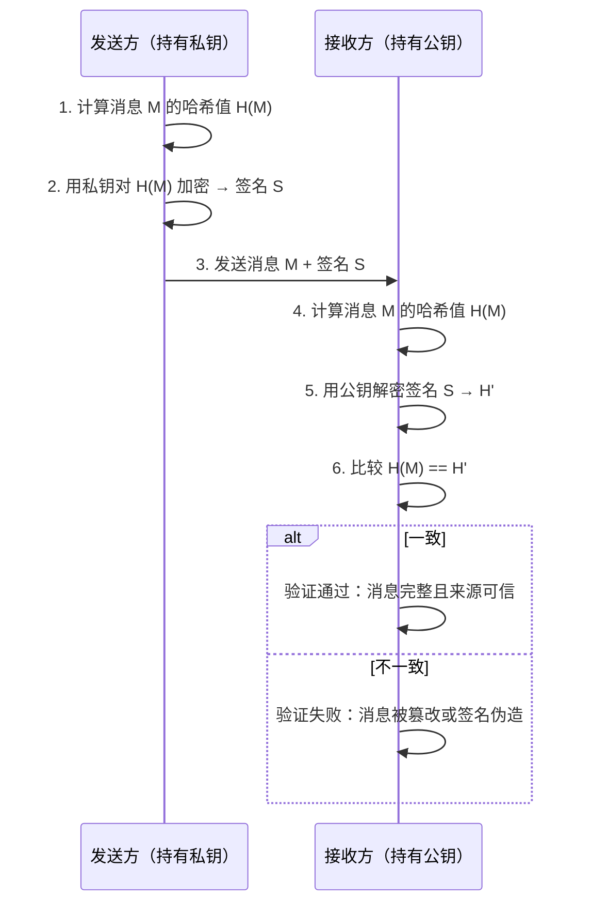
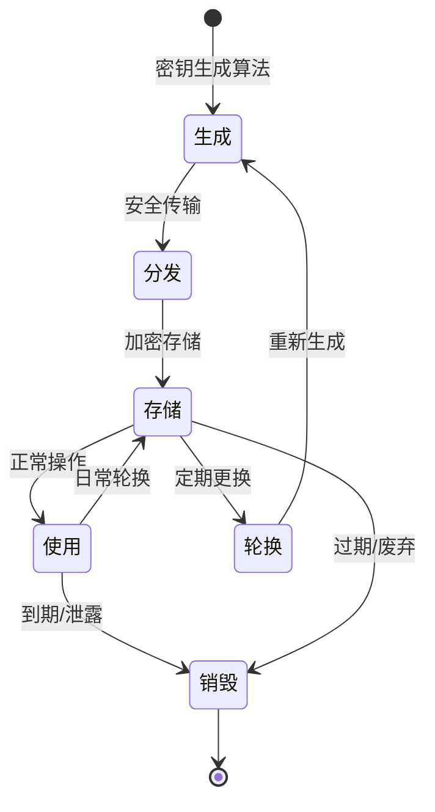

# 密码学理论基础

密码学是信息安全的根基。无论是日常使用的 HTTPS 连接、手机支付、企业 VPN，还是国家层面的军事通信，底层都依赖密码学提供的机密性、完整性、身份认证和不可否认性四大安全属性。不理解密码学的基本理论，就无法正确地使用密码学工具——而不正确地使用密码学工具，往往比不使用更加危险。

本节系统梳理密码学的五大理论支柱：**对称加密、非对称加密、哈希函数、数字签名、密钥管理**。每一部分都从原理出发，逐步深入到算法选择、安全边界和工程实践中的关键考量。

---

## 密码学的目标模型

在深入具体技术之前，先明确密码学要解决的核心问题。现代密码学的安全目标可以用四个属性来概括：

| 属性 | 英文 | 含义 | 典型场景 |
|------|------|------|----------|
| **机密性** | Confidentiality | 确保信息只对授权方可见 | 数据加密传输与存储 |
| **完整性** | Integrity | 确保信息未被篡改 | 文件哈希校验、消息认证码 |
| **身份认证** | Authentication | 确认通信对方的身份 | 证书验证、数字签名 |
| **不可否认性** | Non-repudiation | 发送方事后无法否认发送过该消息 | 电子合同签名、审计日志 |

这四大属性并非独立存在，而是相互配合、层层递进。例如：

- 要实现安全通信，首先需要**机密性**（加密内容），还需要**完整性**（防止篡改），还需要**身份认证**（确认对方是谁）
- 要实现电子签名，需要**完整性**（签名绑定内容）、**身份认证**（确认签名者身份）和**不可否认性**（签名者事后无法抵赖）

密码学的理论基础正是围绕这四大属性展开，每一项核心技术都有明确的归属和分工。

---

## 知识体系全景图

五大理论支柱之间的关系如下图所示。理解它们的层次关系是学习密码学的第一步：

核心原语（对称加密、非对称加密、哈希函数）是砖块，高级构造（数字签名、MAC、AEAD）是用砖块砌成的墙，应用层协议（TLS、SSH、PGP）是完整的建筑。而密钥管理则像基础设施——贯穿整个体系，决定了所有上层构造的安全性上限。

---

## 五大理论支柱概览

以下简要介绍每个方向的核心思想，每个方向的详细内容请参阅对应的子章节。

### 1. 对称加密

**核心思想**：加密和解密使用同一个密钥。这是最古老、也是至今使用最广泛的加密方式。

**代表算法**：

| 算法 | 密钥长度 | 分组长度 | 状态 | 说明 |
|------|---------|---------|------|------|
| DES | 56 bit | 64 bit | **已废弃** | 1977年标准，密钥太短 |
| 3DES | 112/168 bit | 64 bit | **已废弃** | 三次DES叠加，性能差 |
| AES | 128/192/256 bit | 128 bit | **现行标准** | 2001年至今，全球标准 |
| ChaCha20 | 256 bit | 流密码 | **推荐** | 设计简洁，抵抗侧信道攻击 |
| ARIA | 128/192/256 bit | 128 bit | **韩国标准** | 类AES结构，东亚地区常用 |

**工作模式**：单个AES算法只能加密固定长度的数据块（128 bit）。要加密任意长度的数据，需要选择一种"工作模式"。

| 模式 | 缩写 | 并行化 | 需要填充 | 安全性 | 推荐度 |
|------|------|--------|---------|--------|--------|
| 电子密码本 | ECB | 完全并行 | 是 | **不安全**，相同明文产生相同密文 | ⛔ 禁止使用 |
| 密码块链接 | CBC | 解密可并行 | 是 | 需要随机IV，对填充预言攻击敏感 | ⚠️ 需谨慎 |
| 计数器 | CTR | 完全并行 | 否 | 安全，需保证Nonce不重复 | ✅ 可用 |
| 认证加密 | GCM | 完全并行 | 否 | 加密+认证一体，目前最佳实践 | ✅✅ 强烈推荐 |

**对称加密的局限性**：密钥分发问题——通信双方如何安全地共享同一个密钥？在互联网环境下，两个从未见过面的用户不可能提前协商一个密钥。这个问题催生了非对称加密。

> **详细内容请参阅**：[一对称加密](../01-一对称加密.md)

### 2. 非对称加密

**核心思想**：使用一对数学上关联的密钥——公钥（public key）可以公开分发，私钥（private key）由持有者严格保密。用公钥加密的数据只有对应的私钥能解密，反之亦然。

**代表算法与密钥强度对比**：

| 算法 | 基于问题 | 推荐密钥长度 | 对应对称密钥强度 | 性能 |
|------|---------|-------------|----------------|------|
| RSA | 大整数分解 | 2048-4096 bit | 112-152 bit | 较慢 |
| ECC (P-256) | 椭圆曲线离散对数 | 256 bit | 128 bit | 快 |
| X25519 / Ed25519 | Curve25519 | 256 bit | 128 bit | 最快 |
| Ed448 | Curve448 | 448 bit | 224 bit | 快 |
| Dilithium | 格问题（后量子） | 公钥~1.3KB | 128-256 bit | 中等 |

**非对称加密的核心应用场景**：

1. **密钥交换**：双方通过非对称加密安全地协商出一个对称密钥（如 Diffie-Hellman 密钥交换），之后用对称加密进行高效通信
2. **数字签名**：用私钥对消息摘要签名，任何人用公钥即可验证签名的真实性
3. **身份认证**：证书体系（PKI）中，CA 用私钥签发证书，用户用公钥验证证书

**ECC vs RSA 的选择**：在现代系统中，椭圆曲线密码学（ECC）几乎全面取代了 RSA。同样安全强度下，ECC 的密钥更短、计算更快、带宽占用更少。256 bit ECC 密钥 ≈ 3072 bit RSA 密钥的安全强度，而前者速度快一个数量级。

> **详细内容请参阅**：[二非对称加密](../02-二非对称加密.md)

### 3. 哈希函数

**核心思想**：将任意长度的输入映射为固定长度的输出（称为"摘要"或"指纹"），具有三个关键性质：

- **抗碰撞性**（Collision Resistance）：找到两个不同的输入产生相同输出，在计算上不可行
- **抗原像性**（Pre-image Resistance）：给定输出，无法找到对应的原始输入
- **抗第二原像性**（Second Pre-image Resistance）：给定一个输入，无法找到另一个不同的输入产生相同输出

**代表算法对比**：

| 算法 | 输出长度 | 安全强度 | 性能 | 状态 |
|------|---------|---------|------|------|
| MD5 | 128 bit | **已破解** | 最快 | ⛔ 禁止用于安全用途 |
| SHA-1 | 160 bit | **已破解** | 快 | ⛔ 禁止用于安全用途 |
| SHA-256 | 256 bit | 128 bit | 中等 | ✅ 现行标准 |
| SHA-3 | 224/256/384/512 bit | 可变 | 中等 | ✅ 备选标准 |
| BLAKE3 | 256 bit | 128 bit | 最快 | ✅ 推荐 |
| SHAKE128/256 | 可变长度 | 可变 | 中等 | ✅ SHA-3 扩展 |

**哈希函数的关键应用场景**：

- **密码存储**：存储密码的哈希值而非明文（绝不可用裸哈希，必须加盐并使用慢哈希函数如 Argon2、bcrypt）
- **数据完整性校验**：文件下载后验证 SHA-256 摘要是否与官方公布的一致
- **数字签名**：对消息的哈希值签名而非原始消息（签名运算量大，哈希可将任意长度压缩为固定长度）
- **区块链/工作量证明**：比特币使用 SHA-256 进行挖矿和区块链接
- **哈希表/布隆过滤器**：数据结构中用于快速查找和存在性检验

**常见陷阱**：MD5 和 SHA-1 虽然在性能测试、唯一标识等非安全场景中仍可使用，但绝不能用于安全场景。Google 在 2017 年成功构造了 SHA-1 碰撞（SHAttered 攻击），证明 SHA-1 在实际中已不安全。

> **详细内容请参阅**：[三哈希函数](../03-三哈希函数.md)

### 4. 数字签名

**核心思想**：数字签名 = 哈希函数 + 非对称加密。发送方用私钥对消息的哈希值进行签名，接收方用公钥验证签名，从而同时实现完整性、身份认证和不可否认性。

**工作流程**：

**主流数字签名算法**：

| 算法 | 基于 | 签名大小 | 验证速度 | 典型应用 |
|------|------|---------|---------|---------|
| RSA-PSS | RSA | 256 byte（2048 bit密钥） | 中等 | TLS 1.2、传统系统 |
| ECDSA (P-256) | 椭圆曲线 | 64 byte | 快 | TLS 1.3、比特币 |
| EdDSA (Ed25519) | Twisted Edwards曲线 | 64 byte | 最快 | SSH、Signal、现代系统 |
| Dilithium | 格密码 | 2-4 KB | 中等 | 后量子时代（NIST标准） |

**EdDSA 的优势**：Ed25519 是目前最推荐的签名算法。相比 ECDSA，它没有随机数生成的安全隐患（ECDSA 如果随机数泄露或重复，会暴露私钥），实现简单，性能优异，已广泛应用于 SSH、Signal 协议、WireGuard VPN 等现代系统。

> **详细内容请参阅**：[四数字签名](../04-四数字签名.md)

### 5. 密钥管理

**核心思想**：密码系统的安全性不取决于算法的保密，而取决于密钥的保密。这被称为 Kerckhoffs 原则（1883年提出）。密钥管理是密码学中最容易被忽视但最为关键的环节。

**密钥生命周期**：

**密钥管理的关键原则**：

1. **最小权限原则**：每个密钥只拥有完成其任务所需的最小权限
2. **密钥分离原则**：不同用途使用不同密钥（加密密钥 ≠ 签名密钥）
3. **定期轮换**：设定密钥有效期，过期后强制更换
4. **安全存储**：密钥绝不能以明文存储在代码、配置文件或日志中
5. **安全销毁**：密钥过期后彻底删除，确保无法恢复

**密钥派生函数（KDF）**：从主密钥派生出多个子密钥，避免多次使用同一个密钥：

| KDF | 用途 | 推荐度 |
|-----|------|--------|
| PBKDF2 | 密码派生（NIST推荐） | ✅ 可用 |
| scrypt | 密码派生（抵抗GPU/ASIC攻击） | ✅ 可用 |
| Argon2 | 密码派生（2015年密码哈希竞赛冠军） | ✅✅ 强烈推荐 |
| HKDF | 从主密钥派生多个子密钥 | ✅ TLS/协议层使用 |
| bcrypt | 密码存储（广泛部署） | ✅ 可用 |

**密钥管理服务（KMS）**：企业级应用中，密钥不应由应用程序直接管理，而应通过专业的 KMS 系统：

- **云服务**：AWS KMS、Azure Key Vault、Google Cloud KMS、阿里云 KMS
- **开源方案**：HashiCorp Vault、Mozilla SOPS、Sealed Secrets
- **硬件方案**：HSM（硬件安全模块）、TPM（可信平台模块）

> **详细内容请参阅**：[五密钥管理](../05-五密钥管理.md)

---

## 五大支柱的协作关系

理解五大支柱如何协作，是构建安全系统的关键。以下是一个典型的 TLS 1.3 连接建立过程中各组件的协作：

| 步骤 | 操作 | 涉及的密码学技术 | 目的 |
|------|------|-----------------|------|
| 1 | 客户端发送支持的加密套件列表 | 对称加密算法协商 | 选择通信算法 |
| 2 | 服务端返回证书和签名 | 非对称加密 + 数字签名 | 身份认证 |
| 3 | 双方通过 ECDHE 交换密钥 | 非对称加密（密钥交换） | 协商对称密钥 |
| 4 | 使用协商的密钥加密通信 | 对称加密（AES-GCM/ChaCha20-Poly1305） | 机密性 + 完整性 |
| 5 | 会话密钥定期更新 | 密钥管理（轮换） | 前向安全性 |

在这个流程中，五大支柱缺一不可：非对称加密解决密钥交换和身份认证，对称加密保障通信效率，哈希函数提供完整性校验，数字签名验证身份，密钥管理确保整个生命周期的安全。

---

## 后量子密码学：未来的挑战

当前广泛使用的公钥密码算法（RSA、ECC、DH）都基于数论问题（大整数分解、离散对数），而量子计算机一旦成熟，Shor 算法可以在多项式时间内破解这些问题。这意味着所有现有的公钥基础设施都将被颠覆。

NIST 已于 2024 年正式发布了首批后量子密码标准：

| 算法 | 类型 | 用途 | 密钥大小 | 状态 |
|------|------|------|---------|------|
| ML-KEM (Kyber) | 格密码 | 密钥封装 | 公钥 ~1.3 KB | ✅ 已标准化 |
| ML-DSA (Dilithium) | 格密码 | 数字签名 | 公钥 ~1.3 KB | ✅ 已标准化 |
| SLH-DSA (SPHINCS+) | 哈希 | 数字签名 | 公钥 ~32-64 KB | ✅ 已标准化 |
| FN-DSA (Falcon) | 格密码 | 数字签名 | 公钥 ~1.8 KB | ⏳ 即将标准化 |

**当前建议**：

1. **开始评估迁移路径**：梳理系统中所有使用 RSA/ECC 的位置
2. **关注算法敏捷性**：设计系统时预留算法切换能力，避免硬编码特定算法
3. **优先部署混合模式**：同时使用经典算法和后量子算法，"双重保护"
4. **关注 TLS 1.3 + 各大浏览器的后量子支持进展**

> 这一前沿话题将在后续章节中深入探讨。

---

## 本节学习路线

建议按照以下顺序阅读本节的子章节，每一节都建立在前一节的基础之上：

1. **[对称加密](../01-一对称加密.md)** — 从最基础的加密概念开始，理解对称加密的原理、算法选择和工作模式
2. **[非对称加密](../02-二非对称加密.md)** — 解决密钥分发难题，理解公私钥体系和密钥交换
3. **[哈希函数](../03-三哈希函数.md)** — 理解单向函数的概念及其在完整性校验和密码存储中的应用
4. **[数字签名](../04-四数字签名.md)** — 将哈希函数与非对称加密组合，实现身份认证和不可否认性
5. **[密钥管理](../05-五密钥管理.md)** — 贯穿全局的运维视角，确保密码系统长期安全运行

每节包含理论原理、算法对比、代码示例和常见误区。建议在阅读时动手实践，使用 OpenSSL 或 Python 的 `cryptography` 库进行实际操作，理论与实践结合才能真正掌握。

---

## 常见学习误区

| 误区 | 纠正 |
|------|------|
| "密码学就是加密" | 加密只是密码学的一部分。哈希、签名、密钥交换、认证码同样重要 |
| "算法越复杂越安全" | 安全性来自正确的使用而非复杂性。AES 比许多"自行设计"的算法都安全 |
| "MD5/SHA-1 够用了" | 已被实际攻破，只能用于非安全场景（如去重、缓存键） |
| "自己实现密码算法很酷" | **绝对不要**自行发明或实现密码算法。使用经过审计的库 |
| "密钥长度越长越好" | 超过安全所需的密钥长度只增加计算开销，不会增加安全性 |
| "开源算法不安全" | 相反，密码学界的共识是：公开的算法经过广泛审查才更可信赖（Kerckhoffs 原则） |
