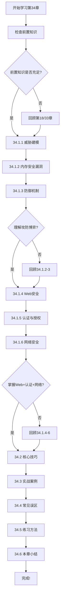
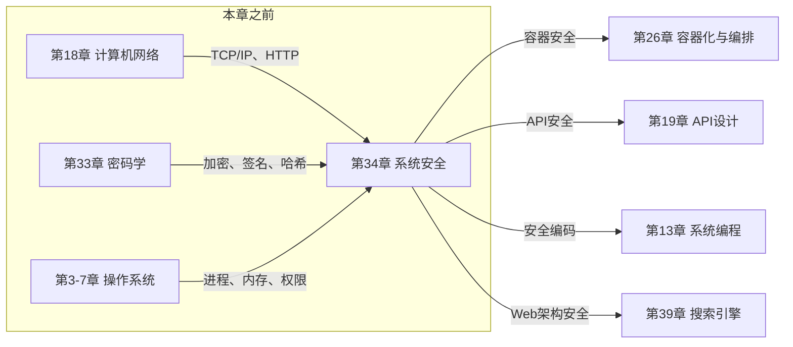

# 第34章 系统安全 — 章节概览

## 本章定位与价值

系统安全是保护计算机系统免受攻击、确保数据和资源机密性（Confidentiality）、完整性（Integrity）、可用性（Availability）——即 CIA 三元组——的综合性实践。它不是某一类技术，而是一套贯穿系统设计、开发、部署、运维全生命周期的方法论与工程体系。

**为什么要学系统安全？**

从现实威胁来看，2023 年 IBM《数据泄露成本报告》显示，全球数据泄露平均成本达到 445 万美元，同比增长 15%。在中国，国家互联网应急中心（CNCERT）2023 年监测发现的网络安全事件中，Web 应用攻击、数据泄露和勒索软件位居前三。系统安全能力不再是"锦上添花"，而是软件工程师的必备素养。

| 威胁类型 | 真实案例 | 影响规模 | 本章对应的防御知识 |
|----------|---------|---------|-------------------|
| 内存安全漏洞 | Heartbleed（OpenSSL） | 全球 66% 的 Web 服务器受影响 | 34.2 内存安全漏洞 + 34.3 防御机制 |
| Web 注入攻击 | Equifax 数据泄露（SQL 注入） | 1.47 亿用户信息泄露 | 34.4 Web 安全 |
| 认证绕过 | Colonial Pipeline 事件 | 美国东海岸燃油供应中断 | 34.5 认证与授权 |
| 供应链攻击 | SolarWinds 后门 | 约 18,000 家企业受影响 | 34.7 安全开发生命周期 |
| 零日漏洞利用 | Log4Shell（Log4j） | 全球数百万应用受影响 | 34.1 威胁建模 + 34.8 容器安全 |

本章从威胁建模、漏洞分析、防御机制、Web 安全、认证授权、网络安全、安全开发生命周期、容器安全、零信任架构等维度，系统性地构建系统安全的完整知识体系。完成本章后，读者将具备从"知道系统有风险"到"能设计、实施、审计一个安全系统"的完整能力。

## 核心学习目标

完成本章学习后，读者应达到以下能力水平：

### 知识层面

1. **掌握威胁建模方法**：能使用 STRIDE 模型系统性识别安全威胁，用 DREAD 模型评估风险等级，完成从数据流图绘制到缓解措施确定的完整威胁建模流程
2. **理解内存安全漏洞原理**：深入理解缓冲区溢出（栈溢出/堆溢出）、ROP 利用、格式化字符串漏洞、Use-After-Free、整数溢出等经典漏洞的攻击原理和利用方式
3. **掌握现代防御机制**：理解 ASLR、DEP/NX、Stack Canary、CFI、Shadow Stack 等多层防御技术的工作原理和组合策略
4. **具备 Web 安全攻防能力**：能识别和防御 XSS、CSRF、SQL 注入、SSRF、XXE 等 OWASP Top 10 中的主流 Web 攻击类型
5. **理解认证授权体系**：掌握 OAuth 2.0 授权流程、JWT 安全要点、RBAC/ABAC 访问控制模型的设计与实现
6. **掌握网络安全防御**：理解中间人攻击、DDoS 攻击的原理和防御策略，掌握 TLS/HTTPS、HSTS、证书固定等关键技术
7. **理解安全开发生命周期**：掌握 SDL 各阶段的安全实践，了解 OWASP Top 10 2021 的关键风险
8. **理解容器与零信任安全**：掌握 Linux 安全机制（SELinux、seccomp、Capabilities）、容器安全隔离、零信任架构的核心原则

### 技能层面

9. **安全编码能力**：能编写安全的代码，避免常见安全陷阱，实施输入验证、输出编码、参数化查询等防御措施
10. **安全配置能力**：能正确配置 HTTP 安全头部（CSP、HSTS、X-Frame-Options 等）、密钥轮换策略、TLS 证书管理
11. **安全审计能力**：能使用自动化扫描工具（SAST/DAST/SCA）进行安全审计，识别代码和配置中的安全隐患
12. **安全事件响应能力**：能分析安全事件的根因，制定应急响应流程，实施事后复盘和改进

## 前置知识

本章假设读者已具备以下基础知识。如果某些领域感到生疏，建议先回顾对应章节：

| 知识领域 | 具体要求 | 参考章节 | 重要程度 |
|---------|---------|---------|---------|
| 编程基础 | 理解 C/Python 语言基础，了解内存管理（指针、堆栈） | 第1-2章 | ★★★★★ |
| 操作系统 | 理解进程/线程模型、系统调用、文件系统权限 | 第3-7章 | ★★★★☆ |
| 计算机网络 | 理解 TCP/IP 协议栈、HTTP 协议、DNS 解析 | 第18章 | ★★★★★ |
| 密码学基础 | 了解对称/非对称加密、哈希函数、数字签名的基本概念 | 第33章 | ★★★★☆ |
| 数据库基础 | 了解 SQL 查询、数据库连接管理 | 第13-16章 | ★★★☆☆ |

> **特别提示**：第33章（密码学）是本章的直接前置。如果对加密算法（AES/RSA/ECC）、哈希函数（SHA-256）、数字签名的原理还不够清晰，请务必先回顾后再学习本章。密码学是安全系统的基石——没有密码学的正确应用，本章讨论的所有防御机制都会失效。

## 知识体系总览

本章的知识体系按照"道→法→术→器"的逻辑层层递进，从底层威胁原理到上层工程实践形成完整的知识链路：

```mermaid
graph TD
    subgraph 道（原理层）
        A[威胁建模体系] --> A1[STRIDE 威胁分类]
        A --> A2[DREAD 风险评估]
        A --> A3[攻击面分析]
        
        B[漏洞原理] --> B1[内存安全漏洞]
        B --> B2[Web 应用漏洞]
        B --> B3[网络层漏洞]
    end

    subgraph 法（方法层）
        C[防御机制] --> C1[ASLR/DEP/Canary]
        C --> C2[CFI/Shadow Stack]
        C --> C3[沙箱与隔离]
        
        D[认证授权] --> D1[OAuth 2.0 授权流程]
        D --> D2[JWT 安全机制]
        D --> D3[RBAC/ABAC 访问控制]
        
        E[安全架构] --> E1[零信任架构]
        E --> E2[纵深防御]
        E --> E3[最小权限原则]
    end

    subgraph 术（技术层）
        F[Web 安全技术] --> F1[XSS/CSRF 防御]
        F --> F2[SQL 注入防御]
        F --> F3[SSRF/XXE 防御]
        F --> F4[HTTP 安全头部]
        
        G[运维安全] --> G1[容器安全]
        G --> G2[密钥管理与轮换]
        G --> G3[安全扫描自动化]
    end

    subgraph 器（工程层）
        H[安全开发实践] --> H1[SDL 安全开发生命周期]
        H --> H2[OWASP Top 10]
        H --> H3[安全编码规范]
        
        I[安全运营] --> I1[漏洞管理]
        I --> I2[安全监控与审计]
        I --> I3[应急响应]
    end

    A --> C
    A --> D
    B --> C
    B --> F
    C --> G
    D --> G
    E --> H
    F --> H
    G --> I
    H --> I
```

## 章节结构详解

本章分为六大模块，每个模块的学习目标、核心内容和预计用时如下：

### 34.1 理论基础（预计 12-15 小时）

理论基础是本章的根基，分为六个子节。建议按顺序学习，因为后续小节依赖前面的知识。

#### 34.1.1 安全威胁模型

威胁建模是系统安全的起点——你无法防御你不知道的威胁。本节讲解微软 STRIDE 模型和 DREAD 风险评估框架。

| 威胁类型 | 英文 | 安全属性 | 典型攻击示例 |
|----------|------|----------|-------------|
| 仿冒（Spoofing） | Spoofing | 认证性 | 冒充合法用户登录、伪造邮件来源 |
| 篡改（Tampering） | Tampering | 完整性 | 修改传输中的数据、篡改日志记录 |
| 抵赖（Repudiation） | Repudiation | 不可否认性 | 否认执行过的敏感操作 |
| 信息泄露（Information Disclosure） | Information Disclosure | 机密性 | 数据库泄露、内存信息泄露 |
| 权限提升（Elevation of Privilege） | Elevation of Privilege | 授权 | 普通用户获取管理员权限 |
| 拒绝服务（Denial of Service） | Denial of Service | 可用性 | DDoS 攻击、资源耗尽攻击 |

**学习要点**：不仅要记住 STRIDE 的六种威胁类型，更要掌握威胁建模的完整流程：绘制数据流图（DFD）→ 对每个元素应用 STRIDE 分析 → 评估威胁严重程度（DREAD/CVSS）→ 确定缓解措施 → 验证有效性。威胁建模不是一次性活动，而是贯穿系统生命周期的持续过程。

#### 34.1.2 内存安全漏洞

内存安全漏洞是最经典、危害最大的安全漏洞类型。本节深入讲解缓冲区溢出、ROP、格式化字符串漏洞、Use-After-Free、整数溢出等漏洞的攻击原理。

栈帧结构（高地址→低地址）：
┌─────────────────┐
│   参数n         │
├─────────────────┤
│   参数1         │
├─────────────────┤
│   返回地址       │ ← 攻击目标：覆盖此地址劫持控制流
├─────────────────┤
│   保存的EBP     │
├─────────────────┤
│   buffer[63]    │
│   ...           │
│   buffer[0]     │ ← 溢出起点
└─────────────────┘
低地址

**学习要点**：理解漏洞原理的关键在于理解内存布局——栈帧如何组织、堆如何分配、函数调用如何工作。只有理解了"正常状态"，才能理解"被攻击后的异常状态"。现代利用技术（如 ROP）的复杂性远超传统的 shellcode 注入，需要深入理解。

#### 34.1.3 内存安全防御机制

防御机制是攻防博弈的产物。每一种防御技术都是针对特定攻击手段设计的，同时每一种防御也存在已知的绕过技术。

多层防御体系：
┌─────────────────────────────────────┐
│  1. ASLR + PIE    → 随机化地址空间   │
│  2. DEP/NX        → 禁止执行数据     │
│  3. Stack Canary  → 检测栈溢出       │
│  4. CFI           → 保护控制流完整性  │
│  5. Shadow Stack  → 硬件级返回保护    │
│  6. Sandboxing    → 限制系统调用      │
└─────────────────────────────────────┘

**学习要点**：理解"纵深防御"（Defense in Depth）的核心思想——没有任何单一防御机制是完美的，但多层防御的组合使得攻击成本大幅提高。同时要理解每种防御的局限性：ASLR 可被信息泄露绕过，Stack Canary 可被泄露或覆盖，CFI 有性能开销。

#### 34.1.4 Web 安全攻防

Web 应用是当前最常见的攻击面。本节覆盖 OWASP Top 10 中的核心 Web 攻击类型及其防御方法。

| 攻击类型 | 攻击原理 | 危害等级 | 核心防御手段 |
|---------|---------|---------|-------------|
| XSS（跨站脚本） | 将恶意脚本注入网页 | 高 | 输出编码 + CSP + HttpOnly Cookie |
| CSRF（跨站请求伪造） | 利用用户已认证状态执行非预期操作 | 中-高 | CSRF Token + SameSite Cookie |
| SQL 注入 | 在 SQL 查询中注入恶意代码 | 极高 | 参数化查询 + ORM |
| SSRF（服务器端请求伪造） | 利用服务器发起请求访问内部资源 | 高 | 白名单验证 + 禁止访问内网 |
| XXE（XML 外部实体注入） | 通过 XML 解析器读取服务器文件 | 高 | 禁用外部实体解析 |

**学习要点**：Web 安全的核心原则是"永远不要信任用户输入"。每一种 Web 攻击的本质都是用户输入被错误地解释为代码执行。理解这一点后，防御方法就变得清晰：输入验证、输出编码、最小权限、纵深防御。

#### 34.1.5 认证与授权

认证（Authentication）解决"你是谁"，授权（Authorization）解决"你能做什么"。两者共同构成访问控制的完整体系。

OAuth 2.0 授权码流程：
┌──────────┐     ┌──────────────┐     ┌──────────┐
│  Client   │────→│ Authorization │────→│ Resource  │
│  App      │←────│    Server     │←────│  Owner   │
└──────────┘     └──────────────┘     └──────────┘
      │                                     │
      └────────────→ Resource Server ←──────┘

流程：
1. 客户端重定向用户到授权服务器
2. 用户授权后，授权服务器返回授权码
3. 客户端用授权码换取访问令牌
4. 使用访问令牌访问资源

**学习要点**：OAuth 2.0 的授权码流程是最安全的授权方式，隐式流程（Implicit Flow）因安全风险已不推荐。JWT 的安全要点包括：验证签名算法（防止算法混淆攻击）、检查过期时间、验证 issuer 和 audience。RBAC 适合简单的角色-权限映射，ABAC 适合需要细粒度上下文判断的复杂场景。

#### 34.1.6 网络攻击与防御

网络层是攻击者的重要入口。本节讲解中间人攻击、DDoS 攻击等网络攻击的原理和防御策略。

**学习要点**：理解网络攻击的本质是利用协议设计的弱点或网络基础设施的不可靠性。HTTPS/TLS 是防御中间人攻击的基础，但需要正确配置（HSTS、证书固定）才能真正有效。DDoS 防御是一个多层次的问题，需要从网络层（Anycast、CDN）、传输层（SYN Cookie）、应用层（速率限制、WAF）多个维度入手。

### 34.2 核心技巧（预计 4-6 小时）

聚焦工程实践中的三大关键安全技巧：

1. **安全头部配置**：HTTP 安全头部是防御 Web 攻击的第一道防线。CSP（Content Security Policy）防御 XSS，HSTS 强制 HTTPS，X-Frame-Options 防止点击劫持，X-Content-Type-Options 防止 MIME 类型嗅探，Referrer-Policy 控制信息泄露
2. **密钥轮换**：密钥的生命周期管理是安全运维的核心环节。密钥生成（长度、算法选择）、安全存储（环境变量 vs Vault vs KMS）、自动轮换（定期更换 + 事件触发）、泄露处理（即时吊销 + 影响评估）
3. **安全扫描自动化**：SAST（静态应用安全测试）在代码层面发现漏洞，DAST（动态应用安全测试）在运行时模拟攻击，SCA（软件成分分析）检测第三方库的已知漏洞。三者互补，构成完整的安全扫描体系

### 34.3 实战案例（预计 3-4 小时）

通过真实场景检验理论知识的工程落地能力：

1. **漏洞利用与防御演示**：亲手搭建存在已知漏洞的靶场环境（如 DVWA、WebGoat），实践 SQL 注入、XSS 等攻击手法，然后实施防御措施验证效果
2. **安全事件分析**：分析真实的安全事件报告，理解攻击链（Kill Chain）的完整过程，学习如何从日志和监控数据中还原攻击轨迹
3. **安全审计实践**：对一个实际项目进行安全审计，识别代码中的安全隐患，评估配置的安全性，输出审计报告和改进建议

### 34.4 常见误区（预计 1-2 小时）

纠正常见的安全认知偏差和工程决策错误：

- **"我们的系统太小，不会被攻击"**：自动化扫描工具 7×24 小时扫描全网，大小系统一视同仁。被攻击不取决于你的规模，而取决于你的暴露面
- **"安全是运维的事"**：安全必须融入开发流程（DevSecOps），代码层面的安全问题只有开发者能在编码阶段修复
- **"密码复杂就够了"**：多因素认证（MFA）的安全性远超复杂密码。即使是最复杂的密码，也可能被钓鱼攻击窃取
- **"用了 HTTPS 就安全了"**：HTTPS 只保证传输安全，不防御应用层攻击。XSS、SQL 注入、CSRF 等攻击与 HTTPS 无关
- **"安全和性能不可兼得"**：现代安全机制（如 ASLR、Canary）的性能开销通常在 1-5%，远低于大多数人的直觉预期
- **"第三方库是别人写的，出了问题找他们"**：你的应用对第三方库的安全问题负全责。Log4Shell 事件证明，一个依赖库的漏洞可以影响整个应用栈

### 34.5 练习方法（预计 6-8 小时）

系统化的学习路径，从理论到实践：

1. **CTF 挑战入门**：通过 Capture The Flag 比赛练习漏洞利用和防御。推荐平台：Hack The Box、TryHackMe、OverTheWire（Bandit/Natas 系列）
2. **靶场环境搭建**：部署 DVWA（Damn Vulnerable Web Application）、WebGoat、OWASP Juice Shop 等靶场，在安全环境中练习攻击和防御
3. **安全编码实践**：在自己的项目中应用本章学到的安全编码实践，进行代码安全审查
4. **工具实操**：掌握 Burp Suite（Web 安全测试）、Nmap（网络扫描）、OWASP ZAP（DAST）等核心安全工具的使用
5. **安全事件响应模拟**：模拟安全事件场景，练习事件检测、响应、恢复的完整流程

### 34.6 本章小结（预计 0.5 小时）

关键要点回顾、决策框架、延伸阅读路径。

## 学习路径



## 预计学习时间

| 学习阶段 | 内容 | 预计时间 | 难度 |
|---------|------|---------|------|
| 威胁建模 | STRIDE/DREAD/攻击面分析 | 2-3 小时 | ★★★☆☆ |
| 内存安全 | 漏洞原理 + 防御机制 | 3-4 小时 | ★★★★★ |
| Web 安全 | XSS/CSRF/注入/SSRF/XXE | 3-4 小时 | ★★★★☆ |
| 认证授权 | OAuth 2.0/JWT/RBAC/ABAC | 2-3 小时 | ★★★☆☆ |
| 网络安全 | MITM/DDoS/TLS | 2-3 小时 | ★★★☆☆ |
| 核心技巧 | 安全头部/密钥轮换/扫描自动化 | 4-6 小时 | ★★★★☆ |
| 实战案例 | 漏洞利用/事件分析/安全审计 | 3-4 小时 | ★★★★★ |
| 常见误区 | 安全认知纠偏 | 1-2 小时 | ★★☆☆☆ |
| 练习巩固 | CTF/靶场/工具实操 | 6-8 小时 | ★★★★★ |
| **总计** | | **26-37 小时** | |

> **说明**：以上时间基于"有编程基础和网络知识"的读者估算。如果是初次接触安全领域，建议预留额外 10-15 小时用于补充密码学基础和操作系统知识。内存安全部分（漏洞原理+防御机制）对 C 语言不熟悉的读者可能需要额外时间。

## 核心问题清单

学完本章后，你应该能清晰回答以下问题：

### 基础理解题

1. STRIDE 模型的六种威胁类型分别对应哪些安全属性？如何对一个系统进行完整的威胁建模？
2. 栈溢出攻击的原理是什么？攻击者如何通过覆盖返回地址劫持程序执行流？
3. XSS 攻击有哪几种类型？每种类型的特点和防御方法是什么？
4. OAuth 2.0 的授权码流程为什么比隐式流程更安全？JWT 的签名算法选择有哪些安全考量？

### 原理分析题

5. ASLR 防御机制的工作原理是什么？为什么它需要与 PIE（位置无关可执行文件）配合使用？有哪些已知的绕过技术？
6. ROP 攻击是如何绕过 DEP/NX 防御的？为什么说 ROP 是现代漏洞利用的核心技术？
7. CSRF 攻击利用了 Web 应用的什么特性？SameSite Cookie 是如何防御 CSRF 的？
8. 零信任架构的核心原则是什么？它与传统边界安全模型的根本区别在哪里？

### 工程实践题

9. 如何设计一个安全的密码存储方案？为什么不应该直接存储密码哈希，而应该使用 bcrypt/scrypt/Argon2？
10. 在微服务架构中，如何实现服务间的安全认证？mTLS 和 JWT 各有什么优劣？
11. 如何配置一个生产级别的 HTTP 安全头部集合？每个头部的作用和最佳实践值是什么？
12. 如何设计一个密钥轮换策略？在轮换过程中如何保证服务的连续性？

### 设计决策题

13. 如果要为一个面向公众的 Web 应用设计安全架构，你会如何组合本章学到的各种防御机制？请给出分层防御的设计方案。
14. 在容器化部署环境中，如何实现从镜像构建到运行时的全链路安全？需要考虑哪些安全层面？
15. 一个安全团队应该如何平衡安全投入和业务效率？如何确定安全建设的优先级？

## 与其他章节的关联



| 前置章节 | 与本章的关系 | 你需要从中学到什么 |
|---------|-------------|-------------------|
| 第3-7章 操作系统 | 理解内存管理、进程隔离、文件权限 | 本章的内存安全漏洞和操作系统安全依赖这些基础 |
| 第18章 计算机网络 | 理解 TCP/IP 协议栈、HTTP 协议 | 网络攻击和 TLS/HTTPS 防御的网络基础 |
| 第33章 密码学 | 理解加密算法、数字签名、哈希函数 | JWT、TLS、密钥管理的安全基础 |

| 后续章节 | 与本章的关系 | 本章为你准备了什么 |
|---------|-------------|-------------------|
| 第19章 API设计 | API 安全设计的最佳实践 | 认证授权、输入验证、速率限制 |
| 第26章 容器化与编排 | 容器和 Kubernetes 安全 | 容器隔离、镜像安全、运行时保护 |
| 第39章 搜索引擎 | Web 应用的整体安全架构 | 安全头部、WAF、安全审计 |

## 核心概念速查

以下是本章涉及的核心概念及其一句话解释，供快速查阅：

| 概念 | 一句话解释 | 详见小节 |
|------|-----------|---------|
| STRIDE | 微软威胁建模框架，六类威胁：仿冒/篡改/抵赖/泄露/拒绝服务/提权 | 34.1.1 |
| DREAD | 风险评估模型：损害/复现/利用/影响/发现五因子评分 | 34.1.1 |
| 攻击面 | 系统所有可被攻击者访问的入口点的集合 | 34.1.1 |
| 缓冲区溢出 | 写入数据超出缓冲区边界，覆盖相邻内存的漏洞 | 34.1.2 |
| ROP | 复用程序已有代码片段构造攻击链的利用技术 | 34.1.2 |
| ASLR | 随机化进程内存布局，使攻击者无法预测目标地址 | 34.1.3 |
| DEP/NX | 标记数据区域为不可执行，防止执行注入的代码 | 34.1.3 |
| Stack Canary | 在返回地址前插入随机值，检测栈溢出攻击 | 34.1.3 |
| CFI | 控制流完整性，确保程序执行流只能沿合法路径进行 | 34.1.3 |
| XSS | 将恶意脚本注入网页，在其他用户浏览器上执行 | 34.1.4 |
| CSRF | 利用用户已认证状态，诱导执行非预期操作 | 34.1.4 |
| SQL 注入 | 在 SQL 查询中注入恶意代码，窃取或破坏数据 | 34.1.4 |
| SSRF | 利用服务器发起请求，访问内部网络资源 | 34.1.4 |
| OAuth 2.0 | 授权框架，允许第三方应用在用户授权下访问资源 | 34.1.5 |
| JWT | JSON Web Token，用于安全传输声明的紧凑令牌格式 | 34.1.5 |
| RBAC | 基于角色的访问控制，用户→角色→权限的映射模型 | 34.1.5 |
| ABAC | 基于属性的访问控制，根据用户/资源/环境属性做决策 | 34.1.5 |
| HSTS | HTTP 严格传输安全，强制浏览器只使用 HTTPS | 34.2 |
| CSP | 内容安全策略，限制网页可加载的资源来源 | 34.2 |
| SAST | 静态应用安全测试，在代码层面分析安全漏洞 | 34.2 |
| DAST | 动态应用安全测试，在运行时模拟攻击检测漏洞 | 34.2 |
| SDL | 安全开发生命周期，将安全融入软件开发各阶段 | 34.7 |
| 零信任 | 永不信任、始终验证的安全架构原则 | 34.8 |

## 推荐阅读顺序

对于时间有限的读者，以下是按优先级排列的精读路径：

| 优先级 | 内容 | 时间 | 适合谁 |
|-------|------|------|--------|
| ★★★★★ | 34.1.4 Web安全 + 34.1.5 认证授权 | 5-7h | 所有开发者（最实用的安全知识） |
| ★★★★☆ | 34.1.1 威胁建模 + 34.2 核心技巧 | 6-9h | 需要系统性安全思维的工程师 |
| ★★★☆☆ | 34.1.2 内存安全 + 34.1.3 防御机制 | 3-4h | 系统编程和安全研究方向 |
| ★★★☆☆ | 34.1.6 网络安全 + 34.3 实战案例 | 3-4h | 运维和安全运营方向 |
| ★★☆☆☆ | 34.4 常见误区 + 34.5 练习方法 | 1-2h | 所有读者（快速避坑） |

## 阅读路径建议

**如果你是应用开发者**（主要做 Web/移动端开发）：重点阅读 34.1.4（Web 安全）和 34.1.5（认证授权），这两部分直接关系到你日常开发的安全性。34.2 的安全头部配置和密钥轮换是立刻能用到的实用技巧。

**如果你是系统工程师**（主要做底层系统和基础设施）：重点阅读 34.1.2（内存安全漏洞）和 34.1.3（防御机制），理解 C/C++ 程序的安全边界。34.8 的容器安全和零信任架构对基础设施安全设计至关重要。

**如果你是技术负责人/架构师**：从 34.1.1（威胁建模）开始，建立系统性的安全思维。34.7 的 SDL 和 OWASP Top 10 是制定团队安全策略的基础框架。

***

*软件工程核心知识体系 · 第34章*
