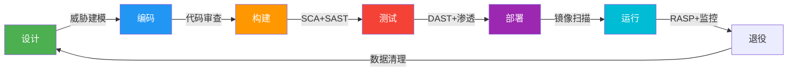

# 系统安全：常见误区与纠正

## 引言

安全领域有句话："最危险的安全策略是自以为安全。"在实际工程实践中，开发者和运维人员常常因为认知偏差、经验不足或过度自信而陷入安全误区。这些误区不仅无法提供真正的安全防护，反而可能制造一种虚假的安全感，使系统在真正的攻击面前不堪一击。

本章系统性地梳理系统安全中最常见的十大误区，逐一剖析其错误根源，给出正确的实践方法，并提供可执行的检查清单。

---

## 误区一：防火墙等于一切安全

### 错误认知

许多团队认为部署了防火墙（无论是硬件防火墙还是 iptables/nftables）就万事大吉。"我们有防火墙"成了安全审计时最常见的回答。

### 为什么这是错的

防火墙本质上只是一种**网络层访问控制机制**，它能做的是：
- 基于IP/端口/协议过滤流量
- 控制内外网之间的访问路径
- 记录网络层日志

但防火墙**无法防御**的攻击类型极其广泛：

| 攻击类型 | 防火墙能否防御 | 原因 |
|----------|--------------|------|
| SQL注入 | ✗ | 攻击通过合法HTTP端口发起 |
| XSS跨站脚本 | ✗ | 攻击隐藏在正常Web请求中 |
| 零日漏洞利用 | ✗ | 无法识别未知攻击模式 |
| 内部威胁 | ✗ | 内网流量通常不经过防火墙 |
| 钓鱼攻击 | ✗ | 攻击发生在用户浏览器端 |
| 加密流量中的恶意内容 | ✗（传统防火墙） | 无法解密分析TLS内容 |

### 正确实践：纵深防御

安全应采用**纵深防御（Defense in Depth）**策略，防火墙只是其中一层：

┌─────────────────────────────────────────────┐
│              安全防护层次                      │
├─────────────────────────────────────────────┤
│  第1层：网络边界  → 防火墙 + IDS/IPS          │
│  第2层：主机安全  → SELinux + seccomp + 最小权限│
│  第3层：应用安全  → 输入校验 + 参数化查询 + CSP  │
│  第4层：数据安全  → 加密 + 脱敏 + 访问控制       │
│  第5层：监控审计  → 日志 + SIEM + 告警          │
│  第6层：安全流程  → SDL + 代码审计 + 渗透测试    │
└─────────────────────────────────────────────┘

**具体措施：**

1. **启用 WAF（Web应用防火墙）**：部署 ModSecurity 或云厂商 WAF，配置 OWASP CRS 规则集
2. **部署 IDS/IPS**：使用 Suricata 或 Snort 进行深度包检测
3. **零信任架构**：不信任任何网络边界，每次访问都进行身份验证和授权
4. **网络微分段**：使用 Kubernetes NetworkPolicy 或 Calico 将服务间通信隔离

```yaml
# Kubernetes NetworkPolicy 示例：只允许同 namespace 内的 Pod 互相访问
apiVersion: networking.k8s.io/v1
kind: NetworkPolicy
metadata:
  name: deny-all-ingress
spec:
  podSelector: {}
  policyTypes:
    - Ingress
  ingress:
    - from:
        - podSelector: {}
```

---

## 误区二：加密能解决一切安全问题

### 错误认知

"数据已经加密了，所以是安全的。"这是开发者最常见的安全幻觉之一。

### 为什么这是错的

加密是安全的重要工具，但**不是万能药**。常见的加密误用包括：

**误用场景一：加密了但密钥管理混乱**
```python
# 错误做法：密钥硬编码在代码中
API_KEY = "sk-a1b2c3d4e5f6g7h8i9j0"
DATABASE_PASSWORD = "super_secret_123"

# 攻击者只需读取源代码即可获取密钥
# 即使代码在私有仓库中，泄露风险依然存在
```

**误用场景二：加密了但传输通道不安全**
# 错误：用加密的 JSON 通过 HTTP 传输
POST http://api.example.com/data
Content-Type: application/json

{
  "payload": "U2FsdGVkX1+..."  // AES加密的数据
}
# 数据在传输过程中可被截获和篡改

**误用场景三：加密了但忽略了其他攻击面**
# 数据库字段加密了，但 API 接口未做认证
# 攻击者不需要解密数据库，直接调用 API 即可

### 正确实践：全链路安全设计

┌──────────┐    TLS 1.3    ┌──────────┐    mTLS     ┌──────────┐
│  客户端   │ ───────────→ │  API网关  │ ─────────→ │  后端服务  │
└──────────┘              └──────────┘             └──────────┘
      │                         │                        │
      │  HTTPS Only             │  服务间 mTLS            │  DB字段加密
      │  HSTS Header            │  证书轮换               │  密钥管理(HSM/KMS)

**密钥管理黄金法则：**
1. **永远不要硬编码密钥**：使用环境变量、Vault、KMS
2. **密钥轮换**：定期更换密钥，设置过期时间
3. **最小权限**：每个服务只能访问它需要的密钥
4. **审计日志**：记录所有密钥访问行为

```bash
# 正确做法：使用 HashiCorp Vault 管理密钥
vault kv put secret/myapp/db password="actual_password"

# 应用启动时动态获取
DB_PASS=$(vault kv get -field=password secret/myapp/db)
```

---

## 误区三：HTTPS = 安全的数据传输

### 错误认知

"我们用了 HTTPS，数据传输就是安全的。"很多开发者把 HTTPS 当成安全的终点，而忽略了更多传输层之上的安全问题。

### 为什么这是错的

HTTPS（TLS）只能保证：
- **传输加密**：防止中间人窃听
- **身份验证**：确认服务器身份（单向 TLS）或双方身份（双向 mTLS）
- **完整性**：防止传输中被篡改

HTTPS **不能保证**的：
- 应用层逻辑安全（SQL注入、XSS 仍然可以发生）
- 客户端安全（XSS 可以在 HTTPS 页面上执行）
- 数据存储安全（数据到了服务器后，HTTPS 的保护就结束了）

### 正确实践：传输安全加固清单

| 检查项 | 配置方法 | 验证命令 |
|--------|---------|---------|
| 强制 HTTPS | 301 重定向 + HSTS | `curl -I http://example.com` |
| HSTS 预加载 | 添加 `Strict-Transport-Security` 头 | `curl -sI https://example.com \| grep -i strict` |
| TLS 版本 | 禁用 TLS 1.0/1.1，只用 TLS 1.2+ | `nmap --script ssl-enum-ciphers -p 443 example.com` |
| 证书管理 | 自动续期 + OCSP Stapling | `openssl s_client -connect example.com:443` |
| CSP 头 | 配置 Content-Security-Policy | `curl -sI https://example.com \| grep -i content-security` |

**Nginx 安全配置示例：**
```nginx
server {
    listen 443 ssl http2;
    server_name example.com;

    # TLS 配置
    ssl_protocols TLSv1.2 TLSv1.3;
    ssl_ciphers ECDHE-ECDSA-AES128-GCM-SHA256:ECDHE-RSA-AES128-GCM-SHA256;
    ssl_prefer_server_ciphers on;
    ssl_session_timeout 1d;
    ssl_session_cache shared:SSL:10m;

    # 安全头
    add_header Strict-Transport-Security "max-age=31536000; includeSubDomains; preload" always;
    add_header X-Content-Type-Options "nosniff" always;
    add_header X-Frame-Options "DENY" always;
    add_header X-XSS-Protection "1; mode=block" always;
    add_header Content-Security-Policy "default-src 'self'; script-src 'self'" always;
    add_header Referrer-Policy "strict-origin-when-cross-origin" always;
    add_header Permissions-Policy "camera=(), microphone=(), geolocation=()" always;
}
```

---

## 误区四：复杂的密码策略等于强安全

### 错误认知

"密码必须包含大小写字母、数字、特殊字符，长度至少16位，每30天必须更换。"——这种过于复杂的密码策略反而会**降低**安全性。

### 为什么这是错的

NIST SP 800-63B（美国国家标准与技术研究院数字身份指南）明确指出：

- **强制定期更换密码**会导致用户选择更弱的密码（如 Password1 → Password2 → Password3）
- **过于复杂的规则**导致用户将密码写在便签上
- **密码过长过复杂**导致用户在多个系统间复用密码

**实际数据佐证：**
微软2019年的研究表明，强制每60天更换密码的策略下，用户密码被破解的概率反而**高出33%**。

### 正确实践：现代密码策略

| 策略维度 | 旧做法（不推荐） | 新做法（推荐） | 依据 |
|---------|----------------|--------------|------|
| 密码长度 | 最少8位 | **最少12位**（推荐15+） | NIST SP 800-63B |
| 复杂度 | 强制混合字符 | 不强制复杂度 | NIST 明确不推荐 |
| 更换周期 | 90天强制更换 | **仅在泄露时更换** | NIST 明确不推荐 |
| 密码黑名单 | 无 | **禁止常见弱密码** | 防止密码字典攻击 |
| 多因素认证 | 可选 | **强制开启** | 最关键的安全措施 |
| 密码存储 | MD5/SHA1 | **Argon2id/bcrypt/scrypt** | 抗GPU暴力破解 |

**密码哈希的正确配置：**
```python
# 使用 argon2-cffi（推荐）
from argon2 import PasswordHasher

ph = PasswordHasher(
    time_cost=3,        # 迭代次数
    memory_cost=65536,  # 内存消耗 64MB
    parallelism=4       # 并行线程数
)

# 存储密码
hashed = ph.hash("user_password")

# 验证密码
try:
    ph.verify(hashed, "user_password")
    # 验证成功
except Exception:
    # 验证失败
    pass
```

**启用多因素认证的优先级：**
安全效果排序（从高到低）：
1. FIDO2/WebAuthn 硬件密钥（如 YubiKey）
2. 认证器应用 TOTP（如 Google Authenticator）
3. 短信验证码（仅在无其他选项时使用）
4. 邮箱验证码（最弱的 MFA 方式）

---

## 误区五：安全只是运维团队的事

### 错误认知

"安全由运维/SRE团队负责，开发者只需要写好业务逻辑。"这种认知在很多组织中根深蒂固。

### 为什么这是错的

安全漏洞的产生源头往往是**开发阶段**。OWASP 的统计数据表明：

- **75% 的安全漏洞**存在于应用层
- **最常见的漏洞**（注入、XSS、认证缺陷）都是编码阶段引入的
- 安全漏洞在**开发阶段修复**的成本是**部署后修复**的 **30-100倍**

### 正确实践：安全左移（Shift Left Security）

传统安全模式：
  开发 → 测试 → 运维 → 安全团队审查（发现问题已晚）

安全左移模式：
  设计阶段 ─── 威胁建模
  编码阶段 ─── SAST静态扫描 + 安全编码规范
  构建阶段 ─── SCA依赖扫描 + 密钥检测
  测试阶段 ─── DAST动态扫描 + 渗透测试
  部署阶段 ─── 镜像扫描 + 合规检查
  运行阶段 ─── RASP运行时保护 + 监控告警

**每个开发者都应该掌握的安全技能：**

1. **安全编码意识**：了解 OWASP Top 10，知道什么是注入、XSS、CSRF
2. **输入验证**：对所有外部输入进行校验（绝不信任用户输入）
3. **参数化查询**：永远使用参数化 SQL，不拼接字符串
4. **错误处理**：不向用户暴露内部错误信息和堆栈跟踪
5. **依赖管理**：定期检查第三方库的已知漏洞

```bash
# 在 CI/CD 中集成安全扫描
# 1. 静态代码分析（SAST）
semgrep --config auto --error .

# 2. 依赖漏洞扫描（SCA）
pip-audit  # Python
npm audit   # Node.js
trivy fs .  # 通用

# 3. 密钥泄露检测
gitleaks detect --source . -v

# 4. 容器镜像扫描
trivy image myapp:latest
```

---

## 误区六：补丁更新会破坏系统，能不打就不打

### 错误认知

"系统运行得好好的，打了补丁万一出问题怎么办？先观望一段时间。"这种心态是导致大规模安全事件的主要原因之一。

### 为什么这是错的

安全补丁的延迟是攻击者最依赖的窗口期。典型数据：

- **Log4Shell（CVE-2021-44228）**：漏洞披露后，未在 **72小时内** 打补丁的系统有 **60%以上** 被扫描探测
- **WannaCry（2017）**：利用的漏洞补丁在漏洞被利用前 **2个月** 就已发布
- 平均漏洞利用时间（从补丁发布到被大规模利用）：**19天**（Mandiant 2023报告）

### 正确实践：建立补丁管理流程

**补丁分级响应机制：**

| 严重等级 | CVSS 分数 | 响应时间 | 测试要求 | 部署窗口 |
|---------|-----------|---------|---------|---------|
| 紧急（Critical） | 9.0-10.0 | 24小时内 | 冒烟测试 | 立即热修复 |
| 高危（High） | 7.0-8.9 | 7天内 | 回归测试 | 当前维护窗口 |
| 中危（Medium） | 4.0-6.9 | 30天内 | 标准测试 | 下个维护窗口 |
| 低危（Low） | 0.1-3.9 | 90天内 | 常规测试 | 计划内更新 |

**安全补丁测试流程：**
1. 评估影响范围（哪些系统受影响）
2. 在预发环境测试补丁
3. 验证核心业务功能
4. 准备回滚方案
5. 选择低峰期部署
6. 部署后持续监控
7. 确认补丁生效

**自动化补丁管理工具：**
- **Linux**：`unattended-upgrades`（Debian/Ubuntu）、`dnf-automatic`（RHEL/Fedora）
- **Docker**：定期重建基础镜像（`FROM` 使用最新标签或自动化更新）
- **Kubernetes**：使用 `System Upgrade Controller` 自动化节点补丁

```bash
# Ubuntu 自动安全更新配置
sudo apt install unattended-upgrades
sudo dpkg-reconfigure -plow unattended-upgrades

# 配置自动应用安全更新
cat /etc/apt/apt.conf.d/50unattended-upgrades
# 确保包含：
# Unattended-Upgrade::Allowed-Origins {
#     "${distro_id}:${distro_codename}-security";
# };
```

---

## 误区七：日志记录 = 安全监控

### 错误认知

"我们记录了所有日志，出了问题可以查。"——记录日志和有效监控是两回事。

### 为什么这是错的

单纯记录日志而不做分析，就像装了监控摄像头却从不看录像。常见问题：

| 问题 | 表现 | 后果 |
|------|------|------|
| 只记不看 | 日志量太大，无人分析 | 攻击发生数月后才发现 |
| 日志不全 | 只记了应用日志，缺少访问日志 | 无法追踪完整攻击链 |
| 格式不一 | 各服务日志格式不同 | 无法集中分析 |
| 日志被删 | 攻击者入侵后清除日志 | 无法取证 |
| 缺少告警 | 有日志但无实时告警 | 无法及时响应 |

### 正确实践：建立有效的安全监控体系

**安全监控架构：**

应用/系统日志
      ↓
┌─────────────┐
│  日志收集    │ ← Fluentd / Filebeat / Vector
│  (Agent)    │
└──────┬──────┘
       ↓
┌─────────────┐
│  日志存储    │ ← Elasticsearch / Loki / ClickHouse
│  (集中存储)  │
└──────┬──────┘
       ↓
┌─────────────┐     ┌─────────────┐
│  日志分析    │ ←── │  规则引擎    │
│  (SIEM)     │     │  告警规则    │
└──────┬──────┘     └─────────────┘
       ↓
┌─────────────┐
│  可视化告警   │ ← Grafana / Kibana / 告警系统
│  (Dashboard) │
└─────────────┘

**必须监控的安全事件（Top 10）：**

1. **暴力破解**：同一IP在短时间内多次登录失败
2. **异常登录**：非工作时间/异常地理位置的登录
3. **权限变更**：用户权限提升、新管理员创建
4. **敏感数据访问**：大量数据导出、敏感API调用
5. **系统配置变更**：防火墙规则修改、用户创建
6. **异常网络流量**：大量外连、DNS隧道
7. **进程异常**：未知进程启动、异常CPU/内存使用
8. **文件完整性**：关键系统文件被修改
9. **容器异常**：特权容器创建、镜像变更
10. **API异常**：异常调用频率、未授权访问尝试

**关键告警规则示例（伪代码）：**
```yaml
# 暴力破解检测
- name: brute_force_detection
  condition: |
    count(failed_login_events) by (source_ip) > 10 in 5 minutes
  severity: high
  action: |
    1. 封禁来源 IP（临时）
    2. 通知安全团队
    3. 记录到安全事件日志

# 异常数据导出检测
- name: data_exfiltration
  condition: |
    sum(bytes_out) by (user) > 100MB in 1 hour
  severity: critical
  action: |
    1. 立即阻断该用户网络连接
    2. 通知安全团队和数据保护官
    3. 保留完整会话日志
```

---

## 误区八：开发环境和生产环境用相同配置

### 错误认知

"开发环境和生产环境用同样的配置，测试结果更可靠。"——这种做法在安全方面会带来严重后果。

### 为什么这是错的

开发环境通常包含以下安全隐患：
- **调试端口开放**：如 Flask Debug、Django Debug Toolbar
- **默认凭据**：admin/admin、root/root 等
- **宽松的 CORS 策略**：`Access-Control-Allow-Origin: *`
- **详细的错误信息**：堆栈跟踪、数据库查询暴露
- **测试用户权限过高**：开发人员拥有生产环境管理员权限

**真实案例**：2017年某知名云服务商的生产数据库被入侵，原因是开发者在生产环境保留了一个调试用的 Redis 实例，且未设置密码。

### 正确实践：环境隔离与安全配置

**环境配置对比：**

| 配置项 | 开发环境 | 测试环境 | 预发环境 | 生产环境 |
|--------|---------|---------|---------|---------|
| 调试模式 | 开启 | 关闭 | 关闭 | 关闭 |
| 详细错误 | 显示 | 显示 | 部分显示 | 隐藏 |
| 日志级别 | DEBUG | INFO | INFO | WARN |
| CORS策略 | * | 指定域名 | 指定域名 | 严格限制 |
| 数据库凭据 | 本地密码 | 测试密码 | 类生产密码 | KMS/Vault |
| API限流 | 无 | 宽松 | 类生产 | 严格 |
| MFA | 可选 | 可选 | 必须 | 必须 |

**环境配置管理最佳实践：**

```python
# 使用环境变量 + 配置文件分级管理
import os
from pathlib import Path

class Config:
    """基础配置"""
    SECRET_KEY = os.environ.get('SECRET_KEY')  # 必须从环境变量获取
    DEBUG = False
    SQLALCHEMY_TRACK_MODIFICATIONS = False

class DevelopmentConfig(Config):
    DEBUG = True
    SQLALCHEMY_DATABASE_URI = os.environ.get('DEV_DATABASE_URL')

class ProductionConfig(Config):
    DEBUG = False
    SQLALCHEMY_DATABASE_URI = os.environ.get('DATABASE_URL')  # 必须设置
    # 生产环境必须的额外配置
    SESSION_COOKIE_SECURE = True
    SESSION_COOKIE_HTTPONLY = True
    PREFERRED_URL_SCHEME = 'https'
```

**密钥管理分离：**
开发环境：.env 文件（本地，不提交到 Git）
测试环境：CI/CD 平台 secrets
预发环境：KMS 密钥管理
生产环境：HashiCorp Vault + 自动轮换

---

## 误区九：第三方库/组件无需关注安全

### 错误认知

"我们用的是知名开源库，社区活跃，应该没问题。"——供应链攻击已成为 2024-2025年增长最快的安全威胁。

### 为什么这是错的

现代软件的依赖关系极其复杂：
- 一个典型的 Node.js 应用平均依赖 **数百个** 直接和间接包
- 一个 Python 应用可能有 **数十万行** 来自第三方库的代码

**真实供应链攻击案例：**

| 事件 | 年份 | 影响 | 手法 |
|------|------|------|------|
| event-stream | 2018 | 数百万用户 | 恶意维护者注入后门 |
| ua-parser-js | 2021 | 800万+周下载 | 账号被劫持，发布恶意版本 |
| colors.js/faker.js | 2022 | 大量CI/CD中断 | 恶意维护者故意破坏 |
| xz-utils | 2024 | 多个Linux发行版 | 长期潜伏的后门注入 |

### 正确实践：软件供应链安全

**依赖安全检查流程：**

1. 选择依赖前
   ├── 检查项目活跃度（最后更新时间、维护者数量）
   ├── 检查已知漏洞（CVE数据库）
   ├── 检查许可证兼容性
   └── 检查依赖数量（越少越好）

2. 引入依赖后
   ├── 锁定版本（lock文件）
   ├── 启用自动漏洞扫描
   ├── 定期更新依赖
   └── 监控安全公告

3. 构建时验证
   ├── 校验包完整性（checksum）
   ├── 扫描已知漏洞
   ├── 检查恶意代码模式
   └── 使用私有镜像仓库

**自动化依赖安全扫描：**

```bash
# npm 依赖审计
npm audit
npm audit fix

# Python 依赖漏洞扫描
pip-audit
safety check

# 通用依赖扫描（支持多种语言）
trivy fs --scanners vuln .
grype dir:.

# SBOM（软件物料清单）生成
syft dir:. -o spdx-json > sbom.json
```

**SBOM 生成与管理：**
```bash
# 使用 Syft 生成 SBOM
syft myapp:latest -o spdx-json > sbom.json

# 使用 Grype 基于 SBOM 扫描漏洞
grype sbom:sbom.json

# 在 CI/CD 中集成
# .github/workflows/security.yml
# - name: Generate SBOM
#   run: syft . -o spdx-json > sbom.json
# - name: Vulnerability Scan
#   run: grype sbom:sbom.json --fail-on high
```

---

## 误区十：安全测试只在上线前做一次

### 错误认知

"上线前做一次渗透测试/安全扫描就够了。"——安全是一个**持续过程**，不是一次性活动。

### 为什么这是错的

系统安全状态是动态变化的：
- **新的漏洞**每天都在被发现（CVE 数据库每年新增 2万+条）
- **新的攻击技术**不断涌现
- **代码变更**可能引入新的安全问题
- **配置变更**可能破坏安全策略
- **依赖更新**可能引入新的漏洞

仅在上线前做一次安全测试，就像只在入学时做一次体检，之后几年都不再检查。

### 正确实践：持续安全验证

**安全测试在开发生命周期中的分布：**



**持续安全验证的实践方法：**

| 活动 | 频率 | 工具 | 负责团队 |
|------|------|------|---------|
| SAST（静态分析） | 每次提交 | Semgrep, CodeQL | 开发团队 |
| SCA（依赖扫描） | 每次构建 | Trivy, Grype | 开发团队 |
| DAST（动态扫描） | 每次部署 | OWASP ZAP, Nuclei | 安全团队 |
| 密钥泄露检测 | 每次提交 | Gitleaks, TruffleHog | 开发团队 |
| 渗透测试 | 每季度 | 人工 + 自动化工具 | 安全团队/外部 |
| 红队演练 | 每年 | 模拟攻击 | 安全团队 |
| 合规审计 | 每年 | 合规框架 | 审计团队 |

**CI/CD 安全门禁示例：**
```yaml
# GitHub Actions 安全扫描
name: Security Gate
on: [push, pull_request]

jobs:
  security:
    runs-on: ubuntu-latest
    steps:
      - uses: actions/checkout@v4
      
      - name: SAST Scan
        uses: returntocorp/semgrep-action@v1
        with:
          config: p/default
      
      - name: Dependency Scan
        uses: aquasecurity/trivy-action@master
        with:
          scan-type: 'fs'
          severity: 'HIGH,CRITICAL'
          exit-code: '1'
      
      - name: Secret Detection
        uses: gitleaks/gitleaks-action@v2
      
      - name: Container Scan
        uses: aquasecurity/trivy-action@master
        with:
          image-ref: 'myapp:latest'
          severity: 'HIGH,CRITICAL'
          exit-code: '1'
```

---

## 误区总览与自检清单

### 十大误区速查表

| 编号 | 误区 | 错误根源 | 正确做法 | 关键指标 |
|------|------|---------|---------|---------|
| 1 | 防火墙=一切安全 | 过度依赖单一防护 | 纵深防御 | 防护层数 ≥ 5 |
| 2 | 加密解决一切 | 混淆工具和目标 | 全链路安全设计 | 密钥管理合规率100% |
| 3 | HTTPS=传输安全 | 忽略应用层安全 | 传输+应用层双重防护 | 安全头覆盖率100% |
| 4 | 复杂密码=强安全 | 过时的密码策略 | 现代密码策略+NIST标准 | MFA开启率≥95% |
| 5 | 安全是运维的事 | 安全责任割裂 | 安全左移，全员参与 | 开发者安全培训率100% |
| 6 | 补丁能不打就不打 | 短期思维 | 建立补丁管理流程 | 紧急补丁72小时覆盖率≥99% |
| 7 | 日志=监控 | 记录≠分析 | SIEM+实时告警 | 安全事件平均响应时间<1小时 |
| 8 | 环境配置相同 | 缺乏环境隔离 | 环境分级配置管理 | 生产环境调试功能关闭率100% |
| 9 | 三方库无需关注 | 供应链安全盲区 | SBOM+持续扫描 | 已知高危漏洞修复率100% |
| 10 | 安全测试一次性 | 安全是静态思维 | 持续安全验证 | 每次部署安全扫描通过率100% |

### 安全自检清单

**基础安全（每个项目必须）：**
- [ ] 所有密码/密钥未硬编码在代码中
- [ ] SQL 查询使用参数化方式
- [ ] 所有用户输入都经过验证和清理
- [ ] HTTP 响应包含安全头（HSTS/CSP/X-Frame-Options）
- [ ] 错误处理不暴露内部信息
- [ ] 第三方依赖无已知高危漏洞
- [ ] 代码已通过 SAST 扫描
- [ ] 生产环境关闭调试模式

**进阶安全（推荐实施）：**
- [ ] 实施零信任网络架构
- [ ] 启用 WAF 并配置规则集
- [ ] 建立 SIEM 安全监控
- [ ] 实施 SBOM 管理
- [ ] 定期渗透测试
- [ ] 建立安全事件响应流程
- [ ] 开展安全培训和钓鱼演练

---

## 本节小结

安全误区的本质是**认知偏差**——用简单的规则替代深度的安全思考。真正的系统安全需要：

1. **思维转变**：安全不是一次性任务，而是持续的过程
2. **纵深防御**：不依赖单一防护措施，多层互补
3. **全员参与**：安全是每个工程师的责任，不只是安全团队
4. **持续验证**：定期测试和验证安全措施的有效性
5. **拥抱标准**：遵循 NIST、OWASP 等权威标准，不凭经验主义行事

> **核心理念**：安全的本质不是消除所有风险（这不可能），而是将风险控制在可接受的范围内。理解自身的安全态势，知道哪些风险已被接受、哪些需要优先处理，这才是成熟的安全实践。
