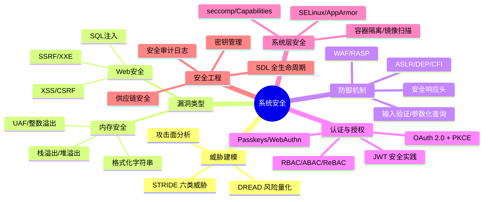

## 第34章 系统安全 · 本章小结

系统安全是软件工程中最需要"道法术器"贯通的领域——道是安全思维（威胁建模、纵深防御），法是安全标准与协议（OAuth 2.0、JWT、OWASP），术是编码实践与配置技巧，器是扫描工具与监控平台。本章从理论到实践完整覆盖了系统安全的核心知识体系，以下是对全章内容的系统性回顾与提炼。

---

## 一、核心知识体系总览

---

## 二、九大核心主题精要

### 1. 安全威胁建模

威胁建模是安全工作的起点，核心问题是"系统面临哪些威胁？"。

**STRIDE模型**——系统性识别六类威胁：

| 威胁 | 英文 | 破坏的安全属性 | 典型攻击 |
|------|------|---------------|---------|
| 仿冒 | Spoofing | 认证性 | 冒充合法用户登录 |
| 篡改 | Tampering | 完整性 | 修改传输中的数据 |
| 抵赖 | Repudiation | 不可否认性 | 否认执行过的操作 |
| 信息泄露 | Information Disclosure | 机密性 | 数据库泄露 |
| 拒绝服务 | Denial of Service | 可用性 | DDoS攻击 |
| 权限提升 | Elevation of Privilege | 授权 | 普通用户获取管理员权限 |

**DREAD风险评估**：对每个威胁从损害程度（Damage）、可复现性（Reproducibility）、可利用性（Exploitability）、受影响用户（Affected Users）、可发现性（Discoverability）五个维度打分（1-5），取平均值作为风险等级。

**攻击面分析要点**：系统所有可被攻击者访问的入口点都是攻击面——网络端口、API端点、输入字段、文件解析、第三方库、人为因素、物理接口。减少攻击面是成本最低的防御手段。

### 2. 内存安全漏洞

内存安全漏洞是最经典也最具破坏力的安全问题，理解其原理是系统安全的基本功。

| 漏洞类型 | 原理 | 典型利用方式 | 防御机制 |
|----------|------|-------------|---------|
| 栈溢出 | 缓冲区写入超出栈帧边界，覆盖返回地址 | 控制EIP/RIP，劫持执行流 | Stack Canary + ASLR |
| 堆溢出 | 覆盖堆管理元数据（如malloc chunk头） | 任意写入，伪造函数指针 | ASLR + Safe Linking |
| 格式化字符串 | printf等函数的格式化参数被攻击者控制 | `%x`泄露栈数据，`%n`任意写入 | 使用固定格式字符串 |
| Use-After-Free | 释放后继续使用悬挂指针 | 控制重新分配的对象，劫持虚函数表 | 引用计数 + UAF检测器 |
| 整数溢出 | 算术运算溢出导致分配/拷贝大小错误 | 间接导致缓冲区溢出 | 范围检查 + 安全算术库 |

**ROP（Return-Oriented Programming）**：在DEP/NX阻止直接执行栈代码后，攻击者复用程序中已有的代码片段（gadgets），通过控制返回地址序列串联gadgets执行任意操作。这是现代内存漏洞利用的核心技术。

### 3. 现代防御机制

防御机制形成多层次纵深防御体系，每一层都增加攻击成本：

攻击者需要同时绕过的防御层次：

第1层：ASLR + PIE     → 地址空间随机化，无法预测目标地址
第2层：DEP/NX         → 栈/堆不可执行，阻止shellcode注入
第3层：Stack Canary   → 栈保护金丝雀值，检测溢出
第4层：CFI            → 控制流完整性，阻止ROP/JOP
第5层：Shadow Stack    → 硬件级返回地址保护
第6层：Sandboxing     → seccomp/AppArmor限制系统调用

关键原则：**没有单一银弹，多层防御才是正道**。每一层独立存在价值——即使ASLR被绕过，还有DEP；即使DEP被绕过（ROP），还有CFI。

### 4. Web安全攻防

Web安全是应用层最常见、最活跃的攻防领域。OWASP Top 10（2021）是核心参考。

**五类核心Web攻击及防御：**

| 攻击类型 | 攻击原理 | 防御措施 | 关键要点 |
|----------|---------|---------|---------|
| XSS（跨站脚本） | 恶意脚本注入网页，在用户浏览器执行 | 输出编码 + CSP头 + HttpOnly Cookie | 反射型/存储型/DOM型三种变体 |
| CSRF（跨站请求伪造） | 诱导已认证用户执行非预期操作 | CSRF Token + SameSite Cookie + Origin验证 | 关键：CSRF Token必须不可预测 |
| SQL注入 | 恶意SQL语句通过输入字段注入 | 参数化查询 + ORM + 最小权限DB用户 | 永远不要拼接SQL字符串 |
| SSRF（服务器端请求伪造） | 利用服务器访问内部资源 | URL白名单 + 禁止内网地址 + IMDSv2 | 云环境尤其危险（元数据服务） |
| XXE（XML外部实体注入） | 通过XML解析器读取本地文件 | 禁用外部实体解析 + 使用JSON替代XML | 多数现代框架已默认禁用 |

**安全响应头配置清单**（所有Web应用必备）：

X-Content-Type-Options: nosniff          # 防止MIME类型嗅探
X-Frame-Options: DENY                     # 防止点击劫持
Strict-Transport-Security: max-age=63072000; includeSubDomains  # 强制HTTPS
Content-Security-Policy: default-src 'self'; script-src 'self'  # 防止XSS
Referrer-Policy: strict-origin-when-cross-origin                # 控制Referer泄露
Permissions-Policy: camera=(), microphone=(), geolocation=()    # 禁用不必要的API

### 5. 认证与授权

认证解决"你是谁"，授权解决"你能做什么"。两者是访问控制的完整体系。

**认证核心知识链：**

密码存储安全等级（由低到高）：
  MD5 → SHA-256 → 加盐SHA-256 → bcrypt → scrypt → Argon2id（推荐）

认证方式演进：
  单因素密码 → 多因素认证(MFA) → 无密码认证(Passkeys)

**OAuth 2.0授权模式选择：**

| 客户端类型 | 推荐模式 | 原因 |
|-----------|---------|------|
| Web应用（有后端） | 授权码 + PKCE | 最安全，token不暴露在前端 |
| 单页应用（SPA） | 授权码 + PKCE | 已取代隐式模式 |
| 移动应用 | 授权码 + PKCE | 使用系统浏览器 |
| 服务间调用 | 客户端凭证 | 无需用户参与 |
| 第一方CLI工具 | 授权码 + PKCE | 使用localhost回调 |

**JWT安全要点速查：**
- 使用非对称签名（EdDSA > ES256 > RS256），避免HS256
- 必须在验证时显式指定`algorithms`参数（防算法混淆攻击）
- Access Token有效期15-60分钟，Refresh Token 7-30天
- 不要在Payload中存放敏感信息（JWT只签名不加密）
- 使用`jti`字段支持令牌黑名单

**授权模型对比：**

| 模型 | 灵活性 | 复杂度 | 适用场景 |
|------|--------|--------|---------|
| DAC | 低 | 低 | 文件系统权限 |
| MAC | 低 | 高 | 军事/政府机密系统 |
| RBAC | 中 | 低 | 企业应用主流 |
| ABAC | 高 | 高 | 云原生、细粒度动态策略 |
| ReBAC | 高 | 中 | 社交/协作场景 |

### 6. 操作系统安全

操作系统层的安全控制是纵深防御的根基：

- **SELinux/AppArmor（MAC）**：由系统策略统一管控，即使root也不能越权。适用于高安全等级环境
- **seccomp**：通过BPF过滤器限制进程可使用的系统调用。Docker/K8s默认使用`RuntimeDefault`配置
- **Linux Capabilities**：将root权限拆分为独立能力（如`CAP_NET_BIND_SERVICE`绑定低端口），遵循最小权限原则

### 7. 容器安全

容器共享宿主机内核，隔离性弱于虚拟机，安全需要额外关注：

**容器安全基线：**
- 使用最小基础镜像（distroless、scratch），减少攻击面
- 以非root用户运行（`USER nonroot:nonroot`）
- 只读文件系统（`readOnlyRootFilesystem: true`）
- 移除所有capabilities后只添加必要项（`cap_drop: ALL` + `cap_add: NET_BIND_SERVICE`）
- 镜像漏洞扫描（Trivy、Snyk）集成CI/CD
- 使用digest而非tag引用镜像（防供应链攻击）
- 不使用特权模式（`privileged: false`）

### 8. 安全开发生命周期（SDL）

安全不是测试阶段才做的事，而是贯穿整个开发周期：

需求阶段      → 设计阶段      → 实现阶段      → 测试阶段      → 发布阶段      → 响应阶段
  │              │              │              │              │              │
安全需求分析    威胁建模        安全编码        安全测试        安全审查        应急响应
隐私评估        架构评审        SAST静态扫描    DAST动态扫描    配置审计        漏洞修复
              攻击面分析      代码审计        渗透测试        SBOM生成       事后复盘

**关键实践：**
- **依赖管理**：使用SCA工具（Dependabot/Renovate）自动更新依赖，定期运行`pip-audit`/`npm audit`
- **密钥管理**：不使用环境变量存储密钥，使用HashiCorp Vault或云KMS
- **安全日志**：记录认证事件、权限拒绝、异常操作，不记录密码/令牌等敏感信息

### 9. 供应链安全

SolarWinds事件揭示了供应链攻击的严重性：

- **SBOM（软件物料清单）**：维护所有依赖的完整清单
- **代码签名**：对构建产物进行签名验证
- **SLSA框架**：软件供应链完整性保障等级
- **零信任更新**：不盲目信任第三方更新包

---

## 三、关键思维模型

### 纵深防御（Defense in Depth）

安全不是一个点，而是一层层叠加的面：

  物理层    → 门禁、监控、机柜锁
  网络层    → 防火墙、VPN、网络分段
  主机层    → SELinux、seccomp、最小权限
  应用层    → 输入验证、认证授权、加密传输
  数据层    → 加密存储、脱敏、访问审计
  人员层    → 安全培训、社会工程防御

### 最小权限原则

每个组件（用户、进程、容器、服务）只应拥有完成其功能所必需的最少权限。权限应该默认拒绝、显式授予、定期审计。

### 攻击面最小化

减少暴露给攻击者的入口点：关闭不必要的端口和服务、禁用不必要的功能、限制API暴露范围、最小化容器capabilities。

---

## 四、速查表

### OWASP Top 10（2021）

| 排名 | 风险 | 核心防御 |
|------|------|---------|
| A01 | 访问控制失效 | RBAC/ABAC + 服务端权限校验 |
| A02 | 加密失败 | TLS 1.3 + AES-256 + Argon2id |
| A03 | 注入 | 参数化查询 + 输入验证 + ORM |
| A04 | 不安全设计 | 威胁建模 + 安全架构评审 |
| A05 | 安全配置错误 | 最小安装 + 安全基线 + 自动化配置管理 |
| A06 | 脆弱过时组件 | SCA工具 + 自动化更新 + SBOM |
| A07 | 身份认证失败 | MFA + Passkeys + 速率限制 |
| A08 | 软件和数据完整性失败 | 代码签名 + CI/CD管道安全 |
| A09 | 安全日志和监控失败 | SIEM + 告警 + 日志审计 |
| A10 | 服务器端请求伪造 | URL白名单 + 禁止内网访问 |

### 密码存储安全等级

不安全          →        →        →        →        安全
MD5  SHA-256  加盐SHA  bcrypt  scrypt  Argon2id
 ✗     ✗      △       ✓      ✓✓     ✓✓✓

### 认证方案安全等级

弱          →        →        →        →        强
短信OTP  TOTP  推送通知  硬件密钥  生物识别  Passkeys
  ✗      ✓      ✓✓      ✓✓✓     ✓✓✓     ✓✓✓

---

## 五、核心公式与度量

| 概念 | 公式/度量 | 说明 |
|------|----------|------|
| 风险等级 | DREAD = (D+R+E+A+D) / 5 | 威胁风险量化评分（1-5分） |
| SLA可用性 | SLA = 正常时间 / 总时间 | 99.9% = 年停机8.76小时 |
| 密码破解难度 | 穷举空间 = 字符集大小^密码长度 | 8位全字符集约6.1×10^15种组合 |
| Argon2id安全参数 | time_cost=3, memory=64MB, parallelism=4 | 推荐起步参数，可根据硬件调整 |
| JWT有效期 | Access Token 15-60min, Refresh Token 7-30天 | 短期令牌+轮换策略 |
| 登录限速 | IP: 10次/分钟, 用户: 100次/小时 | 防暴力破解的基础阈值 |

---

## 六、常见面试问题与标准答案

**Q1: 什么是STRIDE模型？如何应用？**
STRIDE是微软的威胁建模框架，将安全威胁分为六类：仿冒（Spoofing）、篡改（Tampering）、抵赖（Repudiation）、信息泄露（Information Disclosure）、拒绝服务（Denial of Service）、权限提升（Elevation of Privilege）。应用步骤：绘制数据流图 → 对每个元素逐一应用STRIDE → 用DREAD评估风险 → 确定缓解措施。

**Q2: XSS的三种类型有什么区别？如何防御？**
反射型XSS：恶意脚本通过URL参数传入，服务器原样返回（如搜索框）；存储型XSS：恶意脚本存储在数据库中，所有访问者都会执行（如论坛帖子）；DOM型XSS：在客户端JavaScript中触发，不经过服务器。防御三板斧：输出编码（HTML/JS/URL上下文分别编码）、Content-Security-Policy头、HttpOnly Cookie。

**Q3: 如何防御SQL注入？为什么参数化查询有效？**
参数化查询将SQL结构与数据分离——SQL模板预编译后，用户输入永远被当作数据值而非SQL代码处理。即使输入包含`' OR '1'='1`，也只是被当作字符串值匹配。额外防御：ORM框架、最小权限数据库用户、输入验证、WAF规则。

**Q4: 什么是ROP攻击？为什么ASLR+DEP还不够？**
ROP（Return-Oriented Programming）复用程序中已有的代码片段（gadgets），通过控制返回地址序列串联gadgets。DEP阻止执行栈上的代码，但gadgets在代码段中是合法可执行的；ASLR随机化地址，但可以被信息泄露或侧信道攻击绕过。所以需要CFI（控制流完整性）和Shadow Stack来防御ROP。

**Q5: 容器安全的最佳实践？**
最小基础镜像（distroless/scratch）、非root运行、只读文件系统、capabilities限制（cap_drop ALL + 最小添加）、seccomp系统调用过滤、镜像漏洞扫描集成CI/CD、使用digest引用镜像、不使用特权模式、网络策略限制pod间通信。

**Q6: OAuth 2.0授权码模式+PKCE的安全原理？**
两步设计：先获取授权码，再用授权码换token，确保token不暴露在浏览器。PKCE在授权请求时发送code_challenge（code_verifier的SHA-256哈希），换取token时发送原始code_verifier——即使授权码被截获，没有code_verifier也无法换取token。state参数防CSRF，严格匹配redirect_uri防开放重定向。

---

## 七、自查清单

完成本章学习后，对照检查以下能力：

**理论理解**
- [ ] 能用STRIDE模型对一个系统进行完整的威胁建模
- [ ] 能解释缓冲区溢出、ROP、UAF的原理和利用方式
- [ ] 能说清ASLR、DEP、CFI各自防御什么、如何被绕过
- [ ] 理解OAuth 2.0四种授权模式的区别和适用场景
- [ ] 能区分RBAC和ABAC的优劣及适用场景

**编码实践**
- [ ] 所有SQL查询使用参数化/ORM
- [ ] 所有用户输入都经过验证和编码
- [ ] 密码使用Argon2id哈希存储
- [ ] JWT验证时显式指定algorithms参数
- [ ] 安全响应头配置完整

**运维安全**
- [ ] 容器以非root运行，使用最小镜像
- [ ] 密钥使用Vault/KMS管理，不在环境变量中硬编码
- [ ] 依赖库有自动化更新和漏洞扫描
- [ ] 安全审计日志覆盖认证、授权、异常事件
- [ ] 有完善的应急响应流程

---

## 八、进阶学习路线

**深入方向：**

1. **漏洞挖掘与利用**
   - 学习C语言和汇编语言，理解内存模型
   - 在CTF平台上练习PWN题目（picoCTF、OverTheWire）
   - 阅读CVE报告，分析真实漏洞的利用链

2. **渗透测试**
   - 获取OSCP/OSCE等专业认证
   - 使用Metasploit、Burp Suite、SQLMap等工具
   - 在合法授权下对系统进行渗透测试

3. **安全架构设计**
   - 研究零信任架构（BeyondCorp、SASE）
   - 学习mTLS、SPIFFE/SPIRE服务间认证
   - 掌握微分段和网络策略

4. **安全合规**
   - 了解GDPR、等保2.0、PCI-DSS等合规要求
   - 学习ISO 27001信息安全管理体系
   - 掌握安全审计流程

**推荐资源：**

| 类别 | 资源 | 说明 |
|------|------|------|
| 综合 | OWASP Testing Guide | Web安全测试标准方法论 |
| 综合 | NIST SP 800-53 | 安全与隐私控制标准 |
| 攻防 | MITRE ATT&CK | 攻击技术知识库 |
| 攻防 | HackTheBox / TryHackMe | 在线渗透测试实验室 |
| 认证 | PortSwigger Web Security Academy | 免费Web安全学习平台 |
| 编码 | CERT C/Coding Standard | 安全编码标准 |
| 容器 | CIS Docker/Kubernetes Benchmark | 安全配置基线 |
| 工具 | Semgrep / CodeQL | 静态代码安全分析 |

**实战项目建议：**

| 项目 | 难度 | 收获 |
|------|------|------|
| 对自己的Web应用做STRIDE威胁建模 | ★★☆ | 掌握安全设计思维 |
| 搭建DVWA并完成所有安全模块 | ★★☆ | 理解Web攻防全貌 |
| 使用Semgrep扫描开源项目找漏洞 | ★★★ | 代码审计能力 |
| 为团队编写安全编码规范 | ★★★ | 安全标准落地能力 |
| 参加CTF比赛（Web/PWN方向） | ★★★★ | 综合实战能力 |

---

## 九、全章思维导图总结

系统安全
├── 道：安全思维
│   ├── 威胁建模（STRIDE/DREAD）
│   ├── 纵深防御
│   ├── 最小权限
│   └── 零信任
├── 法：标准与协议
│   ├── OWASP Top 10
│   ├── OAuth 2.0 + OIDC
│   ├── JWT / JWE
│   └── SDL 安全开发生命周期
├── 术：编码与配置
│   ├── 输入验证 + 输出编码
│   ├── 参数化查询
│   ├── 安全响应头
│   ├── 容器安全配置
│   └── SELinux / seccomp
└── 器：工具与平台
    ├── 静态分析：Semgrep / CodeQL / Bandit
    ├── 动态扫描：OWASP ZAP / Burp Suite
    ├── 镜像扫描：Trivy / Snyk
    ├── 密钥管理：Vault / KMS
    └── 监控告警：SIEM / WAF / RASP

---

*软件工程核心知识体系 · 第34章 · 本章小结*
