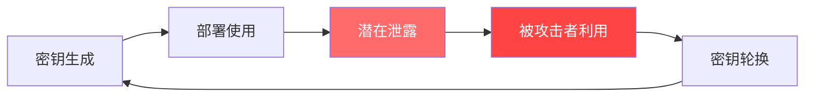
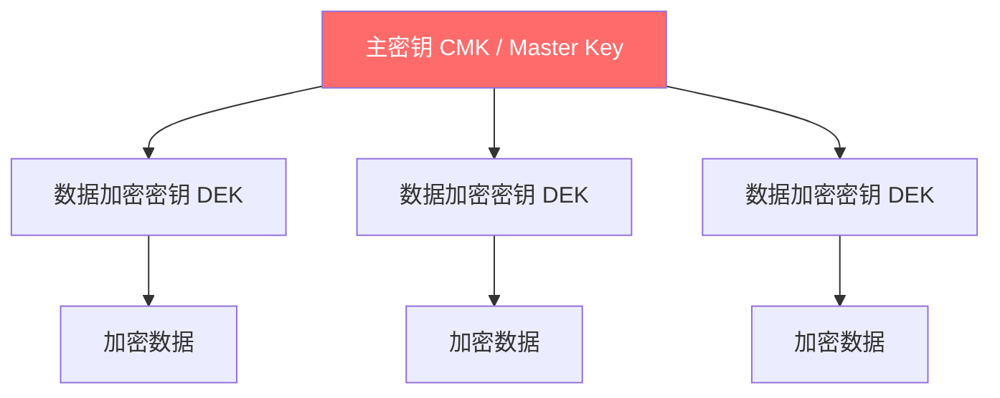
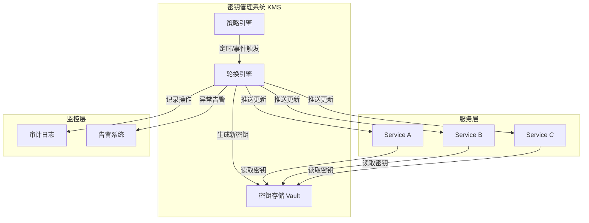
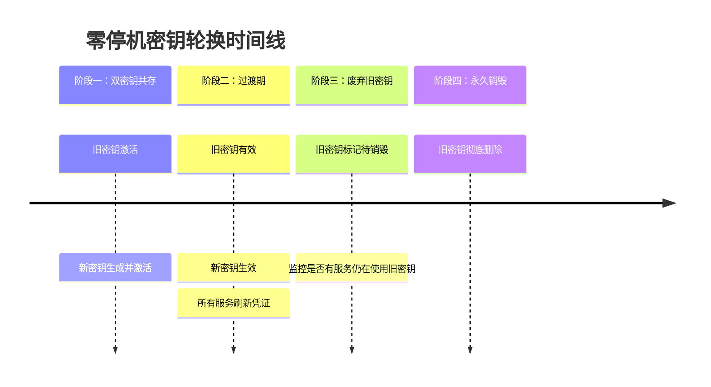
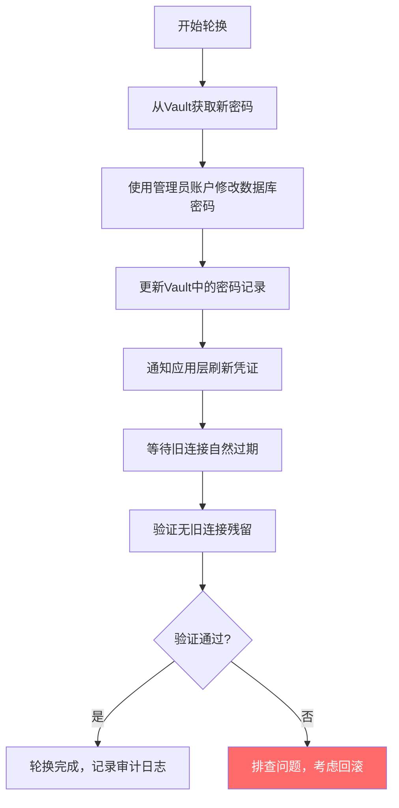
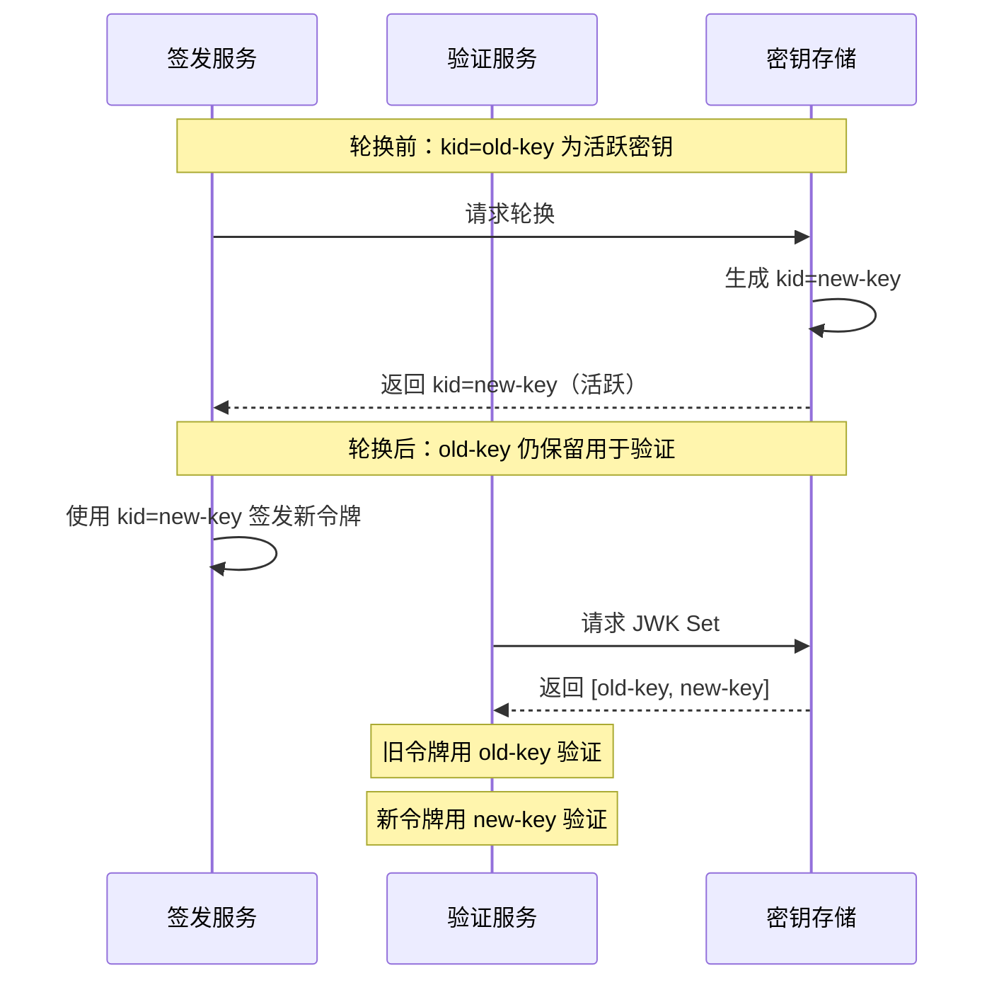
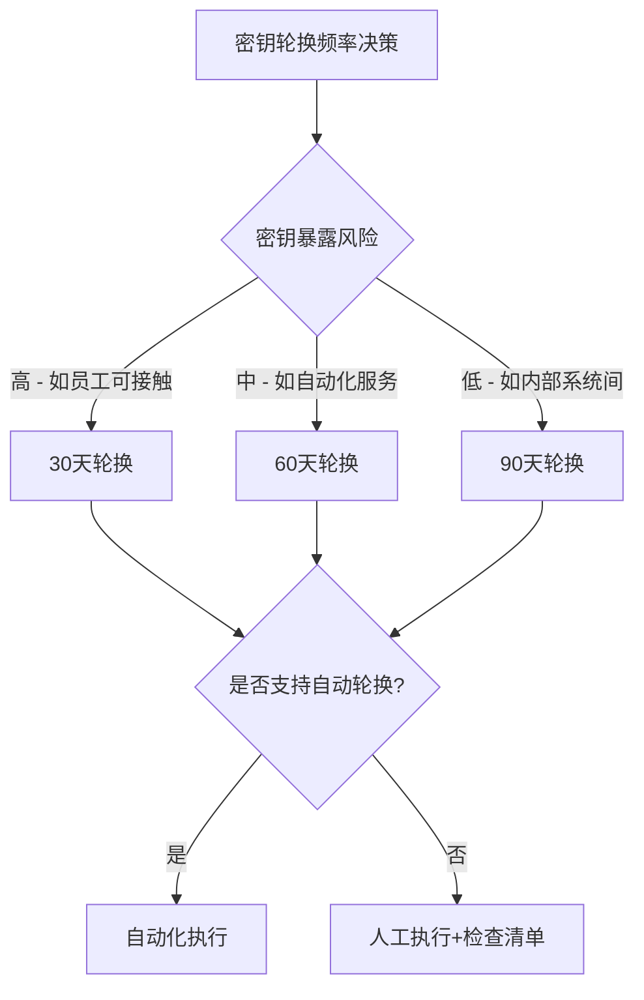
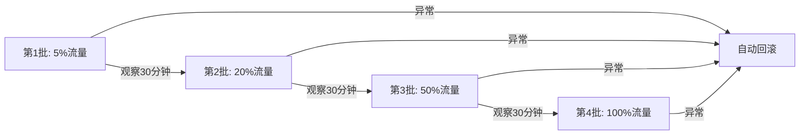

# 技巧二：密钥轮换（Secret Key Rotation）

## 引言：没有轮换的密钥，就是定时炸弹

2023年9月，Uber遭遇数据泄露——攻击者利用前员工遗留的有效API密钥，横穿整个AWS云基础设施，访问了Vault中的600万条用户记录和7.7万份司机信息。2022年1月，Okta因未及时轮换被Lapsus$组织窃取的员工凭证，导致100多家企业客户数据暴露，Okta自身股价暴跌近10%。2021年，Codecov的Bash Uploader脚本被篡改，攻击者借此提取了数千家公司的CI/CD环境变量和密钥，泄露持续两个月才被发现。

这些震惊业界的安全事件有一个共同根因：**密钥没有被轮换，或者轮换机制形同虚设**。NIST在SP 800-57中明确指出，密钥应有明确的生命周期管理——创建、分发、激活、轮换、撤销、销毁，每个阶段都不可或缺。

密钥轮换（Key Rotation）是指按照预定策略，定期或触发式地替换正在使用的加密密钥、API令牌、证书等凭证的过程。它的核心目标是**缩小凭证泄露的攻击窗口**——即使密钥被窃取，其有效时间也被严格限制。

> **核心原则：任何凭证都不应该"永久有效"。密钥的有效期越短，攻击者可利用的窗口就越小。**

---

## 密钥轮换的理论基础

### 攻击窗口模型

密钥从生成到销毁的整个生命周期中，存在一个"暴露风险窗口"：



密钥轮换的本质是**缩短从"泄露"到"失效"的时间间隔**。在安全领域，这个时间被称为**暴露时间窗口（Exposure Window）**——从密钥被泄露到攻击者实际利用之间的时间，以及从攻击者利用到我们发现并完成轮换的时间。

**关键指标体系：**

| 指标 | 英文名 | 含义 | 目标值 |
|------|--------|------|--------|
| 密钥有效期 | Key Lifetime | 单个密钥从创建到销毁的时长 | 根据场景，1天~90天 |
| 轮换周期 | Rotation Interval | 两次轮换之间的时间间隔 | ≤ 密钥有效期 |
| 传播延迟 | Propagation Delay | 新密钥在所有服务间同步完成的时间 | < 5分钟 |
| 失效延迟 | Revocation Delay | 旧密钥被完全拒绝的时间 | < 10分钟 |
| 检测时间 | Detection Time | 发现密钥泄露的平均时间 | < 24小时 |

> **NIST SP 800-57 Part 1 建议**：对于一般用途的对称密钥，2^32次加密操作后应轮换；对于高安全性场景（如金融交易），轮换周期应缩短至1/4的密钥生命周期。

### 密钥层级结构（Key Hierarchy）

密钥轮换并非"所有密钥一视同仁"。成熟的密钥管理采用**层级结构**，不同层级的密钥有不同的轮换策略：



| 层级 | 名称 | 用途 | 轮换频率 | 轮换方式 |
|------|------|------|----------|----------|
| 第一层 | 主密钥（CMK） | 加密/解密下层密钥 | 年度或更长 | 通过KMS自动重新加密DEK |
| 第二层 | 数据加密密钥（DEK） | 加密实际数据 | 30-90天 | 自动生成新DEK，用CMK重新加密 |
| 第三层 | 临时密钥（Ephemeral） | 单次会话或请求 | 每次/每会话 | 自动生成，用完即弃 |

> **信封加密（Envelope Encryption）**是业界标准模式：用上层密钥加密下层密钥，下层密钥加密数据。轮换上层密钥时，只需重新加密下层密钥，无需重新加密数据，极大降低轮换成本。

### 对称密钥 vs 非对称密钥的轮换差异

| 特性 | 对称密钥（AES、HMAC） | 非对称密钥（RSA、ECC、EdDSA） | API密钥/令牌 |
|------|----------------------|------------------------------|-------------|
| 泄露影响 | 通信双方都受影响 | 仅持有私钥方受影响 | 单一方受影响 |
| 轮换复杂度 | 需要双方同步更新 | 只需更新私钥持有方 | 需要客户端重新配置 |
| 零停机轮换 | 需要重叠期（overlap window） | 可通过CA自动签发 | 通常通过双令牌过渡 |
| 推荐算法 | AES-256-GCM、ChaCha20-Poly1305 | Ed25519（首选）、ECDSA P-256 | HMAC-SHA256 |
| 频率建议 | 30-90天 | 证书90天，签名密钥1年 | 30-90天 |

> **现代建议**：对于新系统，优先选择Ed25519（EdDSA）而非RSA——它密钥更短（32字节 vs 2048位）、签名更快、安全性更高。

---

## 密钥轮换的三大策略

### 策略一：定期轮换（Time-Based Rotation）

最基础也最常用的策略——无论密钥是否泄露，按固定周期强制更换。这是所有凭证类型的**基线安全策略**，即使无法实现全自动化，也应至少做到手动定期轮换。

**实现要点：**

轮换触发条件：定时器到期（如每30天）
轮换方式：生成新密钥 → 双密钥共存期 → 下线旧密钥
回退策略：若新密钥部署失败，保留旧密钥继续服务（记录告警）
审计要求：每次轮换必须记录时间、操作人、影响范围

**典型轮换周期建议：**

| 凭证类型 | 推荐周期 | 最大容忍期 | 法规要求示例 |
|----------|---------|-----------|------------|
| 数据库密码 | 30天 | 90天 | PCI DSS要求每季度轮换 |
| API密钥 | 60天 | 180天 | SOC2要求有轮换记录 |
| TLS证书 | 60-90天 | 90天 | Let's Encrypt最长90天有效期 |
| JWT签名密钥 | 30天 | 90天 | — |
| SSH密钥 | 90天 | 180天 | NIST SP 800-53建议 |
| 加密数据密钥（DEK） | 7-30天 | — | — |
| OAuth2客户端密钥 | 90天 | 180天 | — |
| KMS主密钥（CMK） | 365天 | — | AWS默认无到期限制 |
| 服务网格mTLS证书 | 24小时-7天 | 30天 | Istio默认1小时 |
| HSM根密钥 | 不轮换 | — | 通过密钥分段（Key Splitting）保护 |

### 策略二：事件驱动轮换（Event-Triggered Rotation）

当特定安全事件发生时立即触发轮换，而非等待定时器。这种策略是对定期轮换的**重要补充**——定期轮换预防"慢泄漏"，事件驱动轮换应对"急事件"。

**触发条件与响应：**

| 事件 | 响应动作 | 紧急程度 | 最大响应时间 |
|------|---------|---------|------------|
| 员工离职（尤其接触过生产密钥） | 立即撤销其所有凭证 | P0-紧急 | 1小时内 |
| 安全团队确认密钥泄露 | 立即轮换相关密钥并通知所有依赖方 | P0-紧急 | 15分钟内 |
| 第三方安全公告（如CVE影响加密算法） | 评估影响范围，48小时内完成轮换 | P1-高 | 48小时 |
| 权限变更（如岗位调整） | 24小时内轮换其可达的凭证 | P2-中 | 24小时 |
| 审计发现未使用密钥 | 7天内废弃或轮换 | P3-低 | 7天 |
| 共享密钥的第三方发生安全事件 | 评估是否使用相同密钥，必要时轮换 | P2-中 | 24小时 |

**事件驱动轮换的关键要求：**

- **自动化检测**：实时监控登录异常、权限变更、外部漏洞公告（订阅NVD、安全厂商博客）
- **一键撤销**：支持通过管理界面或API立即使密钥失效
- **级联通知**：自动通知所有使用该密钥的下游服务（通过Webhook、内部消息队列）
- **审计日志**：完整记录触发原因、操作时间、影响范围、执行人
- **沙盒验证**：紧急轮换后立即在灰度环境验证，避免"修复安全漏洞却引发服务中断"

### 策略三：自动轮换（Automated Rotation）

通过基础设施自动完成密钥生成、分发、激活、废弃的全生命周期管理，无需人工干预。**这是生产环境的最佳实践**，但需要完善的基础设施支撑。

自动轮换的核心组件：

| 组件 | 功能 | 典型实现 |
|------|------|---------|
| 密钥存储 | 安全存储密钥，支持版本管理 | Vault、云厂商KMS |
| 轮换引擎 | 按策略自动生成新密钥 | Vault数据库插件、Lambda |
| 策略引擎 | 定义轮换规则（周期、条件、优先级） | Vault策略、OPA |
| 分发机制 | 将新密钥推送到所有依赖方 | Sidecar、API推送、环境变量注入 |
| 监控告警 | 检测轮换失败、密钥即将过期 | Prometheus + Grafana |

---

## 自动化密钥轮换的实现架构

### 整体架构



### 零停机轮换的关键：重叠期（Overlap Window）

零停机轮换的核心挑战是：**新密钥部署后，旧连接可能仍在使用旧密钥**。解决方案是设置一个重叠期，在此期间新旧密钥同时有效：



**重叠期时长建议：**

| 服务规模 | 推荐重叠期 | 说明 |
|----------|-----------|------|
| < 10个服务 | 5-10分钟 | 服务少，同步快 |
| 10-50个服务 | 15-30分钟 | 需考虑滚动更新时间 |
| > 50个服务 | 1-4小时 | 大规模集群需要更长传播时间 |
| 跨区域部署 | 4-24小时 | 需考虑网络延迟和时区差异 |
| 使用服务网格 | 1-5分钟 | Sidecar自动注入，传播快 |

### 实现示例：基于HashiCorp Vault的自动轮换

**Step 1：配置Vault密钥引擎**

```bash
# 启用KV v2密钥引擎（支持版本管理，是轮换的基础）
vault secrets enable -path=secret kv-v2

# 配置数据库密钥轮换（以MySQL为例）
# Vault会自动为app-role生成临时用户名和密码
vault secrets enable database

vault write database/config/mysql \
    plugin_name=mysql-database-plugin \
    connection_url="{{username}}:{{password}}@tcp(db.example.com:3306)/" \
    allowed_roles="app-role" \
    username="vault_admin" \
    password="initial_password"

# 设置自动轮换周期：默认TTL 1小时，最大24小时
# TTL到期后Vault自动废弃旧凭证并生成新凭证
vault write database/roles/app-role \
    db_name=mysql \
    default_ttl="1h" \
    max_ttl="24h"

# 验证：获取一次动态凭证
vault read database/creds/app-role
# 输出中会包含临时的 username 和 password，1小时后自动失效
```

**Step 2：在应用中读取凭证（带自动续期）**

```python
import hvac
import time
import logging
from typing import Optional

logger = logging.getLogger(__name__)

class VaultSecretRotator:
    """基于Vault的密钥自动轮换客户端。

    核心特性：
    - 租约到期前自动续期
    - 支持强制轮换（适用于紧急事件）
    - 完整的审计日志
    """

    def __init__(
        self,
        vault_addr: str,
        vault_token: str,
        secret_path: str,
        refresh_buffer_seconds: int = 30
    ):
        self.client = hvac.Client(url=vault_addr, token=vault_token)
        self.secret_path = secret_path
        self.refresh_buffer = refresh_buffer_seconds
        self._current_secret: Optional[dict] = None
        self._lease_id: Optional[str] = None
        self._expiry: float = 0

    def get_secret(self) -> dict:
        """获取密钥，过期前自动续租。

        Returns:
            当前有效的密钥字典
        Raises:
            ConnectionError: 无法连接Vault
            ValueError: 密钥获取失败
        """
        if self._is_expired():
            self._refresh_secret()
        return self._current_secret

    def _is_expired(self) -> bool:
        """检查当前密钥是否即将过期（提前30秒刷新）"""
        return time.time() >= (self._expiry - self.refresh_buffer)

    def _refresh_secret(self):
        """刷新密钥：读取新密钥，续租旧密钥。"""
        # 读取密钥
        secret = self.client.secrets.kv.v2.read_secret_version(
            path=self.secret_path,
            raise_on_deleted_version=True
        )
        self._current_secret = secret['data']['data']

        # 获取租约信息并续租
        if self._lease_id:
            try:
                lease = self.client.sys.read_lease(lease_id=self._lease_id)
                self._expiry = lease['data']['expire_time']
            except Exception as e:
                logger.warning(f"续租失败，将重新获取: {e}")
                self._expiry = 0  # 强制下次重新获取

        logger.info(
            f"密钥已刷新，过期时间: {time.ctime(self._expiry)}"
        )

    def force_rotate(self):
        """强制轮换密钥（适用于安全事件）。

        流程：撤销旧租约 → 读取新密钥 → 记录审计日志
        """
        logger.warning("执行强制密钥轮换...")

        # 1. 撤销旧租约
        if self._lease_id:
            try:
                self.client.sys.revoke_lease(lease_id=self._lease_id)
                logger.info(f"旧租约 {self._lease_id} 已撤销")
            except Exception as e:
                logger.error(f"撤销旧租约失败: {e}")

        # 2. 读取新密钥
        self._refresh_secret()
        logger.warning("强制轮换完成")


# 使用示例
rotator = VaultSecretRotator(
    vault_addr="https://vault.example.com:8200",
    vault_token="s.xxxxx",
    secret_path="database/creds/app-role"
)

# 在应用主循环中使用
while True:
    creds = rotator.get_secret()
    db = connect_db(creds['username'], creds['password'])
    # ... 业务逻辑
    time.sleep(60)
```

**Step 3：监控与告警**

```bash
#!/bin/bash
# key-rotation-monitor.sh — 密钥轮换状态监控脚本
# 用法：*/5 * * * * /opt/scripts/key-rotation-monitor.sh

VAULT_ADDR="https://vault.example.com:8200"
VAULT_TOKEN=$(cat /etc/vault/token)
ALERT_WEBHOOK="https://hooks.slack.com/services/xxx"
METRICS_FILE="/var/lib/node_exporter/textfile/key_rotation.prom"

# 检查即将过期的密钥
check_expiring_keys() {
    local threshold_hours=${1:-24}

    # 查询所有活跃租约
    leases=$(curl -s -H "X-Vault-Token: $VAULT_TOKEN" \
        "$VAULT_ADDR/v1/sys/leases/lookup" \
        -d '{"lease_id":""}' | jq -r '.data.keys[]')

    expiring_count=0
    for lease in $leases; do
        ttl=$(curl -s -H "X-Vault-Token: $VAULT_TOKEN" \
            "$VAULT_ADDR/v1/sys/leases/lookup" \
            -d "{\"lease_id\":\"$lease\"}" | jq -r '.data.ttl')

        if [ "$ttl" -lt $((threshold_hours * 3600)) ]; then
            expiring_count=$((expiring_count + 1))
            echo "[WARNING] 租约 $lease 将在 ${ttl}秒内过期"
        fi
    done

    # 输出Prometheus指标
    echo "vault_expiring_leases_count $expiring_count" > "$METRICS_FILE"

    if [ "$expiring_count" -gt 0 ]; then
        curl -s -X POST "$ALERT_WEBHOOK" \
            -H 'Content-type: application/json' \
            -d "{\"text\":\"[密钥轮换告警] $expiring_count 个密钥将在${threshold_hours}小时内过期\"}"
    fi
}

# 检查轮换失败记录
check_rotation_failures() {
    local failures=$(curl -s -H "X-Vault-Token: $VAULT_TOKEN" \
        "$VAULT_ADDR/v1/sys/audit/file-audit" \
        | jq '[.data | to_entries[] | select(.value.type == "rotation_failed")] | length')

    if [ "$failures" -gt 0 ]; then
        echo "[CRITICAL] 检测到 $failures 次轮换失败"
        curl -s -X POST "$ALERT_WEBHOOK" \
            -H 'Content-type: application/json' \
            -d "{\"text\":\"[密钥轮换] ⚠️ 检测到 $failures 次轮换失败，请立即排查\"}"
    fi
}

# 检查是否有永远未轮换的"僵尸密钥"
check_zombie_keys() {
    # 查找超过180天未更新的密钥
    local zombie_count=$(curl -s -H "X-Vault-Token: $VAULT_TOKEN" \
        "$VAULT_ADDR/v1/secret/metadata/app" \
        | jq '[.data.versions | to_entries[] | select(
            (.value.created_time | fromdateiso8601) < (now - 15552000)
        )] | length')

    if [ "$zombie_count" -gt 0 ]; then
        echo "[WARNING] 发现 $zombie_count 个超过180天未轮换的密钥"
    fi
}

check_expiring_keys 24
check_rotation_failures
check_zombie_keys
```

---

## 各场景密钥轮换实战

### 场景一：数据库密码轮换

数据库密码轮换是最常见也最容易出错的场景。核心难点在于：**数据库连接池中的旧连接必须优雅关闭**。直接修改密码会导致使用旧密码的活跃连接立即报错，引发连锁故障。

**完整轮换流程：**



**PostgreSQL零停机密码轮换实现：**

```python
import psycopg2
import threading
import time
import hashlib
import logging
from typing import Optional

logger = logging.getLogger(__name__)

class DBPasswordRotator:
    """PostgreSQL密码轮换器（支持零停机）。

    核心设计：
    1. 使用管理员账户修改密码（不影响应用账户）
    2. 修改后立即更新应用层缓存
    3. 依赖连接池 max_lifetime 配置自动回收旧连接
    4. 完整的审计日志（不记录明文密码）
    """

    def __init__(self, dsn: dict, vault_client):
        self.dsn = dsn
        self.vault = vault_client
        self._lock = threading.RLock()
        self._current_password: Optional[str] = None
        self._last_rotation: Optional[float] = None

    def rotate_password(self) -> bool:
        """执行密码轮换（零停机）。

        Returns:
            True 轮换成功，False 轮换失败
        """
        with self._lock:
            old_password = self._current_password

            try:
                # Step 1: 从Vault获取新密码
                new_creds = self.vault.read('secret/db/prod')
                new_password = new_creds['data']['password']

                # Step 2: 使用管理员账户修改密码（旧密码仍有效）
                admin_conn = psycopg2.connect(
                    host=self.dsn['host'],
                    port=self.dsn['port'],
                    dbname=self.dsn['dbname'],
                    user='db_admin',
                    password=old_password
                )
                admin_conn.autocommit = True
                cur = admin_conn.cursor()
                cur.execute(
                    f"ALTER ROLE app_user WITH PASSWORD '{new_password}'"
                )
                cur.close()
                admin_conn.close()

                # Step 3: 立即更新应用内缓存的密码
                # 后续新连接将使用新密码
                self._current_password = new_password
                self._last_rotation = time.time()
                logger.info("密码已更新")

                # Step 4: 等待所有旧连接自然过期
                # （连接池配置了 max_lifetime，旧连接会自动回收）
                # 关键配置：pool_recycle=300 (5分钟) 确保旧连接及时回收

                # Step 5: 在Vault中更新密码记录
                self.vault.write('secret/db/prod', password=new_password)

                # Step 6: 审计日志
                self._log_rotation(old_password, new_password)
                return True

            except Exception as e:
                logger.error(f"密码轮换失败: {e}")
                return False

    def _log_rotation(self, old_pw: str, new_pw: str):
        """记录轮换审计日志（不记录明文密码）"""
        logger.info(f"密码轮换完成")
        logger.info(f"  旧密码哈希: {hashlib.sha256(old_pw.encode()).hexdigest()[:16]}...")
        logger.info(f"  新密码哈希: {hashlib.sha256(new_pw.encode()).hexdigest()[:16]}...")
        logger.info(f"  时间: {time.strftime('%Y-%m-%d %H:%M:%S')}")

    def validate_rotation(self) -> bool:
        """验证轮换是否成功：确认无旧连接残留"""
        conn = psycopg2.connect(**self.dsn)
        cur = conn.cursor()
        cur.execute("""
            SELECT pid, usename, client_addr, state_change
            FROM pg_stat_activity
            WHERE usename = 'app_user'
        """)
        connections = cur.fetchall()
        cur.close()
        conn.close()

        old_threshold = self._last_rotation - 60 if self._last_rotation else 0
        stale = [c for c in connections if c[3].timestamp() < old_threshold]

        if stale:
            logger.warning(f"仍有 {len(stale)} 个旧连接未回收")
            return False
        return True
```

### 场景二：TLS证书自动续期

Let's Encrypt + Certbot是最流行的免费TLS证书方案，支持90天自动续期。对于使用云厂商托管证书的场景，AWS ACM和Azure Key Vault也支持自动续期。

**使用Certbot自动续期（适用于自建Nginx/Caddy）：**

```bash
#!/bin/bash
# tls-auto-renew.sh — TLS证书自动续期与热加载
# 用法：0 2 * * * /opt/scripts/tls-auto-renew.sh renew

DOMAIN="api.example.com"
CERT_DIR="/etc/letsencrypt/live/$DOMAIN"
WEBHOOK="https://hooks.slack.com/services/xxx"

# 使用certbot自动续期
renew_certificate() {
    echo "[TLS] 开始续期证书 $DOMAIN..."

    certbot renew \
        --cert-name "$DOMAIN" \
        --deploy-hook "reload_nginx" \
        --quiet \
        --no-self-upgrade

    if [ $? -eq 0 ]; then
        echo "[TLS] 证书续期成功"

        # 验证新证书有效期
        expiry=$(openssl x509 -enddate -noout \
            -in "$CERT_DIR/fullchain.pem" | cut -d= -f2)
        echo "[TLS] 新证书过期时间: $expiry"

        # 通知
        curl -s -X POST "$WEBHOOK" \
            -d "{\"text\":\"[TLS] $DOMAIN 证书已续期，新过期时间: $expiry\"}"
    else
        echo "[TLS] 证书续期失败！"
        curl -s -X POST "$WEBHOOK" \
            -d "{\"text\":\"[TLS] ⚠️ $DOMAIN 证书续期失败，请立即处理\"}"
    fi
}

# 热加载Nginx（不中断服务）
reload_nginx() {
    echo "[TLS] 热加载Nginx配置..."

    # 测试配置
    nginx -t 2>/dev/null
    if [ $? -ne 0 ]; then
        echo "[TLS] Nginx配置检测失败，跳过重载"
        return 1
    fi

    # 发送reload信号实现优雅重载
    nginx -s reload
    echo "[TLS] Nginx已重载"

    # 验证新证书是否生效
    sleep 2
    echo | openssl s_client -connect "$DOMAIN:443" 2>/dev/null \
        | openssl x509 -noout -dates
}

# 检查证书剩余有效期（用于监控告警）
check_cert_expiry() {
    local warning_days=${1:-14}
    local cert_file="$CERT_DIR/fullchain.pem"

    if [ ! -f "$cert_file" ]; then
        echo "[TLS] 证书文件不存在: $cert_file"
        return 1
    fi

    expiry_date=$(openssl x509 -enddate -noout -in "$cert_file" | cut -d= -f2)
    expiry_epoch=$(date -d "$expiry_date" +%s)
    now_epoch=$(date +%s)
    days_left=$(( (expiry_epoch - now_epoch) / 86400 ))

    if [ "$days_left" -lt "$warning_days" ]; then
        echo "[TLS] ⚠️ 证书将在 ${days_left} 天后过期！"
        curl -s -X POST "$WEBHOOK" \
            -d "{\"text\":\"[TLS] ⚠️ $DOMAIN 证书将在 ${days_left} 天后过期\"}"
    else
        echo "[TLS] 证书剩余有效期: ${days_left} 天"
    fi
}

# 设置certbot续期定时任务
setup_cron() {
    # 每天凌晨2点检查是否需要续期
    (crontab -l 2>/dev/null; echo "0 2 * * * /usr/bin/certbot renew --quiet --deploy-hook '/opt/scripts/reload_nginx.sh'") \
        | sort -u | crontab -
    echo "[TLS] Certbot定时任务已配置"
}

# 主流程
case "$1" in
    renew)  renew_certificate ;;
    reload) reload_nginx ;;
    check)  check_cert_expiry "${2:-14}" ;;
    setup)  setup_cron ;;
    *)      echo "用法: $0 {renew|reload|check|setup}" ;;
esac
```

### 场景三：JWT签名密钥轮换

JWT密钥轮换的挑战在于：必须支持多个密钥共存（通过JWK Set），确保已签发的令牌在过期前仍可验证。这是OAuth2和微服务认证中的常见需求。

**核心流程：**



**完整实现：**

```python
import jwt
import time
import json
import base64
import logging
from typing import Optional
from cryptography.hazmat.primitives.asymmetric import rsa, ed25519

logger = logging.getLogger(__name__)

class JWTKeyRotator:
    """JWT签名密钥轮换管理器（支持JWK Set）。

    支持RSA和Ed25519两种算法。
    Ed25519是现代推荐方案：密钥更短、签名更快、安全性更高。
    """

    def __init__(self, vault_client, algorithm: str = "RS256"):
        """
        Args:
            vault_client: Vault客户端实例
            algorithm: 签名算法，支持 RS256/RS384/RS512/EdDSA
        """
        self.vault = vault_client
        self.algorithm = algorithm
        self._keys: dict = {}  # kid -> {private_key, public_key, created_at}
        self._active_kid: Optional[str] = None

    def get_current_key(self) -> tuple:
        """获取当前活跃的签名密钥。

        Returns:
            (kid, private_key) 元组
        """
        if self._active_kid and self._active_kid in self._keys:
            return self._active_kid, self._keys[self._active_kid]['private_key']
        self._rotate()
        return self._active_kid, self._keys[self._active_kid]['private_key']

    def rotate(self):
        """执行密钥轮换。"""
        self._rotate()

    def _rotate(self):
        """生成新密钥，保留旧密钥用于验证。"""
        if self.algorithm.startswith("EdDSA"):
            private_key = ed25519.Ed25519PrivateKey.generate()
            kid = f"ed25519-{int(time.time())}"
        else:
            key_size = 2048 if self.algorithm == "RS256" else 4096
            private_key = rsa.generate_private_key(
                public_exponent=65537,
                key_size=key_size
            )
            kid = f"rsa-{int(time.time())}"

        self._keys[kid] = {
            'private_key': private_key,
            'public_key': private_key.public_key(),
            'created_at': time.time()
        }

        self._active_kid = kid
        logger.info(f"新签名密钥已激活: {kid}")

        # 定期清理超过24小时的旧密钥
        self._cleanup_old_keys(max_age=86400)

    def _cleanup_old_keys(self, max_age: int = 86400):
        """清理过期的旧密钥。"""
        now = time.time()
        to_remove = [
            kid for kid, info in self._keys.items()
            if kid != self._active_kid and (now - info['created_at']) > max_age
        ]
        for kid in to_remove:
            del self._keys[kid]
            logger.info(f"已清理过期密钥: {kid}")

    def get_jwks(self) -> dict:
        """导出JWK Set（供外部服务验证令牌）。

        Returns:
            标准JWK Set格式：{"keys": [...]}
        """
        keys = []
        for kid, info in self._keys.items():
            if self.algorithm.startswith("EdDSA"):
                public_numbers = info['public_key'].public_bytes(
                    encoding=base64.urlsafe_b64serialize,
                    format=base64.Raw
                )
                keys.append({
                    "kty": "OKP",
                    "kid": kid,
                    "use": "sig",
                    "crv": "Ed25519",
                    "x": self._bytes_to_base64url(public_numbers),
                    "alg": "EdDSA"
                })
            else:
                public_numbers = info['public_key'].public_numbers()
                keys.append({
                    "kty": "RSA",
                    "kid": kid,
                    "use": "sig",
                    "n": self._int_to_base64url(public_numbers.n),
                    "e": self._int_to_base64url(public_numbers.e),
                    "alg": self.algorithm
                })
        return {"keys": keys}

    def verify_token(self, token: str) -> dict:
        """验证JWT令牌（自动尝试所有已知密钥）。

        Args:
            token: JWT令牌字符串

        Returns:
            解码后的payload字典

        Raises:
            ValueError: 无法用任何已知密钥验证令牌
        """
        # 解码头部获取kid
        header = jwt.get_unverified_header(token)
        kid = header.get('kid')

        # 优先使用kid匹配的密钥
        if kid and kid in self._keys:
            public_key = self._keys[kid]['public_key']
            return jwt.decode(token, public_key, algorithms=[self.algorithm])

        # 尝试所有密钥（kid可能来自已过期的轮换周期）
        for k, info in self._keys.items():
            try:
                return jwt.decode(token, info['public_key'], algorithms=[self.algorithm])
            except jwt.InvalidSignatureError:
                continue

        raise ValueError("无法用任何已知密钥验证令牌")

    @staticmethod
    def _int_to_base64url(n: int) -> str:
        """将整数转换为Base64URL编码（用于RSA JWK）"""
        byte_length = (n.bit_length() + 7) // 8
        return base64.urlsafe_b64encode(
            n.to_bytes(byte_length, byteorder='big')
        ).rstrip(b'=').decode('ascii')

    @staticmethod
    def _bytes_to_base64url(data: bytes) -> str:
        """将字节串转换为Base64URL编码（用于EdDSA JWK）"""
        return base64.urlsafe_b64encode(data).rstrip(b'=').decode('ascii')
```

### 场景四：Kubernetes Secret自动轮换

Kubernetes中的Secret是Pod访问敏感配置的主要方式，但原生Secret不支持自动轮换。以下是几种解决方案：

**方案一：使用External Secrets Operator + Vault**

```yaml
# external-secret.yaml — 将Vault中的密钥同步到K8s Secret
apiVersion: external-secrets.io/v1beta1
kind: ExternalSecret
metadata:
  name: app-database-creds
  namespace: production
spec:
  refreshInterval: 1h  # 每小时从Vault同步一次
  secretStoreRef:
    name: vault-backend
    kind: SecretStore
  target:
    name: database-creds  # 生成的K8s Secret名称
    creationPolicy: Owner
  data:
    - secretKey: password  # K8s Secret中的key名
      remoteRef:
        key: secret/db/prod  # Vault中的路径
        property: password
```

**方案二：使用Reloader监听变更自动滚动更新**

```yaml
# deployment.yaml — 配合Reloader自动感知Secret变更
apiVersion: apps/v1
kind: Deployment
metadata:
  name: app
  annotations:
    # Reloader会在Secret变更时自动触发滚动更新
    reloader.stakater.com/auto: "true"
spec:
  replicas: 3
  template:
    spec:
      containers:
        - name: app
          envFrom:
            - secretRef:
                name: database-creds
```

### 场景五：云厂商密钥管理服务轮换

**AWS Secrets Manager + Lambda自动轮换（以RDS MySQL为例）：**

```python
# lambda-rotation-handler.py
# AWS Secrets Manager的轮换Lambda函数
# 每次轮换由Secrets Manager自动触发

import boto3
import json
import mysql.connector
import random
import string

def lambda_handler(event, context):
    """Secrets Manager轮换Lambda函数。

    轮换流程：createSecret → setSecret → testSecret → finishSecret
    """
    secret_arn = event['SecretId']
    token = event['ClientRequestToken']
    step = event['Step']

    service_client = boto3.client('secretsmanager')

    if step == "createSecret":
        # 生成新的随机密码
        new_password = ''.join(
            random.choices(
                string.ascii_letters + string.digits + "!@#$%^&amp;*",
                k=32
            )
        )

        # 存储新密码（尚未生效）
        service_client.put_secret_value(
            SecretId=secret_arn,
            ClientRequestToken=token,
            SecretString=json.dumps({
                'username': 'app_user',
                'password': new_password
            }),
            VersionStages=['AWSPENDING']
        )

    elif step == "setSecret":
        # 在RDS中实际修改密码
        current = service_client.get_secret_value(
            SecretId=secret_arn, VersionStage="AWSCURRENT"
        )
        current_dict = json.loads(current['SecretString'])
        pending = service_client.get_secret_value(
            SecretId=secret_arn, VersionStage="AWSPENDING"
        )
        pending_dict = json.loads(pending['SecretString'])

        conn = mysql.connector.connect(
            host=current_dict['host'],
            user=current_dict['username'],
            password=current_dict['password']
        )
        cursor = conn.cursor()
        cursor.execute(
            f"ALTER USER '{pending_dict['username']}'@'%' "
            f"IDENTIFIED BY '{pending_dict['password']}'"
        )
        conn.commit()
        cursor.close()
        conn.close()

    elif step == "testSecret":
        # 用新密码验证连接
        pending = service_client.get_secret_value(
            SecretId=secret_arn, VersionStage="AWSPENDING"
        )
        pending_dict = json.loads(pending['SecretString'])

        conn = mysql.connector.connect(
            host=pending_dict['host'],
            user=pending_dict['username'],
            password=pending_dict['password'],
            connect_timeout=5
        )
        conn.close()

    elif step == "finishSecret":
        # 标记新密码为当前版本
        metadata = service_client.describe_secret(SecretId=secret_arn)
        current_version = None
        for version, stages in metadata['VersionIdsToStages'].items():
            if "AWSCURRENT" in stages:
                current_version = version
                break

        service_client.update_secret_version_stage(
            SecretId=secret_arn,
            VersionStage="AWSCURRENT",
            MoveToVersionId=token,
            RemoveFromVersionId=current_version
        )

    return {"statusCode": 200}
```

---

## 常见误区与纠正

### 误区一：密钥轮换 = 改个密码

**错误认知：** 只要改了数据库密码就算完成轮换。

**正确做法：** 密钥轮换是一个完整的生命周期管理流程：

| 步骤 | 说明 | 常被忽略的风险 |
|------|------|---------|
| 1. 生成新密钥 | 使用安全的随机数生成器（CSPRNG） | 使用弱随机数或伪随机数 |
| 2. 部署新密钥 | 所有依赖方同时更新 | 只更新了部分服务，遗漏了监控/CI系统 |
| 3. 验证新密钥 | 确认所有服务使用新密钥正常工作 | 跳过验证直接删除旧密钥 |
| 4. 废弃旧密钥 | 旧密钥标记为失效 | 旧密钥仍在系统中，攻击者仍可利用 |
| 5. 审计记录 | 记录轮换时间、操作人、影响范围 | 没有任何日志，无法追溯 |
| 6. 清理备份 | 删除旧密钥的备份副本 | 旧密码写在wiki/文档中仍可被查到 |

### 误区二：轮换越频繁越安全

**问题：** 过于频繁的轮换会导致运维负担激增，反而增加配置错误和故障的概率。Google在2019年的研究中发现，过于频繁的密码轮换（如强制每30天）导致用户倾向于选择弱密码，安全性反而下降。美国NIST也在SP 800-63B中明确**不推荐**强制定期更改密码。

**建议：** 根据密钥类型和风险等级确定合理周期：



### 误区三：轮换后旧密钥立即失效

**问题：** 如果没有重叠期，正在使用旧密钥的请求会立即失败。

**正确做法：** 设置重叠期（Overlap Window），新旧密钥同时有效一段时间，确保所有客户端完成切换。具体时长参见上文"零停机轮换"章节。

**典型错误场景：**
- 无重叠期直接删除旧密钥 → 所有活跃连接立即断开
- 重叠期太短（<1分钟）→ 还没同步完就删除了旧密钥
- 重叠期太长（>7天）→ 攻击者有更多时间利用旧密钥

### 误区四：密钥硬编码在配置文件中

**危害：** 密钥写死在代码或配置文件中，轮换时需要重新部署整个应用。更严重的是，密钥会被提交到Git仓库，永久留在历史记录中。

```python
# ❌ 错误：硬编码密钥
DATABASE_PASSWORD = "super_secret_123"
API_KEY = "sk-1234567890abcdef"

# ❌ 错误：通过.env文件（仍可能被提交到Git）
DATABASE_PASSWORD = os.environ.get("DATABASE_PASSWORD", "default_password")

# ✅ 正确：从环境变量读取（无默认值，启动时缺失立即报错）
DATABASE_PASSWORD = os.environ["DATABASE_PASSWORD"]

# ✅ 更好：从密钥管理服务动态获取（自带租约和自动续期）
def get_secret(path: str) -> dict:
    """从Vault动态获取密钥，自带租约和自动续期"""
    secret = vault_client.secrets.kv.v2.read_secret_version(path=path)
    return secret['data']['data']

# ✅ 最佳：使用短期动态凭证（Vault数据库引擎，每小时自动轮换）
def get_dynamic_db_creds() -> tuple:
    """获取动态数据库凭证（1小时有效，自动过期）"""
    creds = vault_client.read('database/creds/app-role')
    return creds['username'], creds['password']
```

### 误区五：只轮换密钥内容，不更新相关配置

**遗漏项清单：** 很多团队在轮换密钥时忘记同步更新以下位置：

| 遗漏位置 | 发现方式 | 后果 |
|----------|---------|------|
| CI/CD流水线中的凭证 | 部署失败 | 新版本无法上线 |
| 监控系统的认证配置 | 监控中断 | 告警失效 |
| 日志聚合系统的API密钥 | 日志丢失 | 出问题时无法排查 |
| 第三方集成的Webhook密钥 | 集成功能异常 | 业务中断 |
| 开发/测试环境的凭证 | 开发环境报错 | 开发效率受影响 |
| Docker镜像中的环境变量 | 重新构建后失效 | 容器重启后报错 |
| 旧文档/Wiki中的密码记录 | 信息泄露风险 | 旧密码仍可被使用 |

### 误区六：忽视密钥轮换的回滚能力

**问题：** 轮换失败后没有回滚方案，导致服务中断。

**正确做法：** 每次轮换前备份当前密钥，制定明确的回滚步骤：

```python
class RotationWithRollback:
    """带自动回滚的密钥轮换"""

    def rotate(self, key_path: str):
        # 1. 备份当前密钥
        old_secret = self.vault.read(key_path)
        backup_path = f"{key_path}/backup/{int(time.time())}"
        self.vault.write(backup_path, **old_secret)

        try:
            # 2. 执行轮换
            new_secret = self._generate_new_secret()
            self.vault.write(key_path, **new_secret)

            # 3. 验证新密钥
            if not self._validate(new_secret):
                raise ValueError("新密钥验证失败")

            # 4. 灰度验证
            self._canary_test(new_secret)

        except Exception as e:
            # 5. 回滚到旧密钥
            logger.error(f"轮换失败，回滚中: {e}")
            self.vault.write(key_path, **old_secret)
            self._notify_ops("密钥轮换失败，已自动回滚")
            raise
```

---

## 密钥轮换自动化平台选型

### 主流方案对比

| 特性 | HashiCorp Vault | AWS Secrets Manager | Azure Key Vault | GCP Secret Manager | Doppler |
|------|----------------|---------------------|-----------------|-------------------|---------|
| 自动轮换 | ✅ 原生支持 | ✅ Lambda函数 | ✅ Key Vault自动 | ✅ 有限支持 | ✅ 原生支持 |
| 动态密钥 | ✅ 数据库/云凭证 | ❌ | ❌ | ❌ | ❌ |
| 多云支持 | ✅ | ❌ AWS专属 | ❌ Azure专属 | ❌ GCP专属 | ✅ |
| 审计日志 | ✅ 完善 | ✅ CloudTrail | ✅ 事件日志 | ✅ Audit日志 | ✅ 基础 |
| 开源版本 | ✅ 开源核心 | ❌ | ❌ | ❌ | ❌ |
| 部署方式 | 自托管/托管 | 托管 | 托管 | 托管 | 托管 |
| 学习曲线 | 高 | 中 | 中 | 低 | 低 |
| 适合场景 | 复杂/混合云 | AWS为主 | Azure为主 | GCP为主 | 中小团队 |
| 价格 | 开源免费，企业版按节点 | $0.40/密钥/月 | $0.03/密钥/月 | $0.06/密钥/月 | 免费起步 |

### 选型建议

**初创公司/小团队：** Doppler或云厂商原生方案——快速上手，功能够用。Doppler的优势在于多云支持和简洁的开发者体验。

**中型企业：** 云厂商Secrets Manager + 自定义轮换Lambda——利用云平台能力，减少运维负担。Lambda函数的维护成本远低于自建Vault集群。

**大型企业/合规要求高：** HashiCorp Vault——最强的策略引擎、审计能力和多云支持。Vault支持精细化的ACL策略、完整的审计日志和多种认证方式（LDAP、OIDC、AppRole）。

**混合云/多云场景：** HashiCorp Vault是唯一能统一管理所有云厂商密钥的方案。如果已有Vault投资，不要为了"云原生"而切换到单一云厂商方案。

---

## 合规要求与审计

密钥轮换不仅是技术需求，更是合规要求。不同法规对密钥管理有明确规定：

| 法规/标准 | 密钥轮换要求 | 审计要求 |
|-----------|-------------|---------|
| PCI DSS v4.0 | 要求9.4.4：每年至少轮换一次加密密钥 | 需记录所有密钥访问和轮换操作 |
| SOC 2 Type II | 要求有密钥轮换策略并执行 | 需证明策略已有效执行 |
| HIPAA | 要求实施适当的加密密钥管理 | 需记录密钥管理操作 |
| GDPR | Art.32：实施适当的技术措施 | 需能证明密钥管理措施有效 |
| NIST SP 800-53 | SC-12：密钥管理要求 | 需完整的密钥生命周期审计 |
| ISO 27001 | A.10.1.2：密钥管理 | 需文档化的密钥管理流程 |

**审计日志应包含：**

```json
{
  "event": "key_rotation",
  "timestamp": "2024-01-15T10:30:00Z",
  "operator": "automated-vault-engine",
  "key_id": "key-1705312200",
  "key_type": "database_password",
  "target_service": "app-mysql-prod",
  "old_key_fingerprint": "sha256:a1b2c3...",
  "new_key_fingerprint": "sha256:d4e5f6...",
  "rotation_reason": "scheduled",
  "duration_seconds": 45,
  "affected_services": ["app-api", "app-worker", "app-scheduler"],
  "rollback_triggered": false,
  "verification_status": "passed"
}
```

---

## 密钥轮换的检查清单

### 轮换前检查

- [ ] 确认所有依赖该密钥的服务清单（包括监控、CI/CD、日志系统）
- [ ] 确认轮换窗口（业务低峰期）
- [ ] 确认回滚方案（如果新密钥有问题）
- [ ] 通知相关团队（运维、开发、SRE）
- [ ] 备份当前密钥（加密存储，仅用于回滚）
- [ ] 确认重叠期时长是否足够
- [ ] 确认监控告警已配置

### 轮换中执行

- [ ] 生成新密钥（使用CSPRNG）
- [ ] 更新密钥管理系统中的记录
- [ ] 逐步部署新密钥到各服务
- [ ] 验证所有服务使用新密钥正常工作
- [ ] 确认旧密钥仍可被需要的服务使用（重叠期）
- [ ] 监控错误率是否有异常飙升

### 轮换后验证

- [ ] 检查是否有服务仍在使用旧密钥
- [ ] 废弃旧密钥（但保留审计记录）
- [ ] 清理旧密钥的备份副本
- [ ] 记录审计日志（轮换时间、操作人、影响范围）
- [ ] 更新文档中的密钥过期时间
- [ ] 确认下一次轮换的定时任务已设置
- [ ] 更新依赖该密钥的所有配置文件

---

## 进阶：大规模密钥轮换策略

### 分批轮换（Canary Rotation）

对于拥有数百个服务的大型系统，一次性轮换所有密钥风险极高。分批轮换的策略是：**先在小范围验证，再逐步扩大**。



**分批轮换的关键指标监控：**
- 错误率：如果轮换批次的错误率超过基线的2%，立即回滚
- 延迟：如果P99延迟增加超过50%，暂停轮换并排查
- 连接池：检查数据库连接池的活跃连接数是否有异常

### 跨区域密钥同步

在多区域部署的系统中，密钥轮换需要考虑：

- **时区差异**：确保所有区域在同一时间窗口内完成轮换（建议使用UTC统一调度）
- **网络延迟**：密钥传播到边缘节点需要时间（跨区域同步可能需要数分钟）
- **区域故障**：如果某个区域轮换失败，不应影响其他区域（设计降级策略）
- **一致性**：确保所有区域使用相同的密钥版本（使用版本号而非时间戳标识密钥）
- **主从模式**：主区域先轮换，验证成功后复制到从区域（避免同时失败）

### 密钥轮换与混沌工程

将密钥轮换纳入混沌工程实践，定期模拟密钥泄露场景，验证轮换流程的有效性：

```bash
#!/bin/bash
# chaos-key-rotation.sh — 模拟密钥泄露演练
# 建议频率：每季度一次

echo "[混沌] 开始密钥轮换演练..."
echo "[混沌] 目标：验证检测→轮换→恢复的完整流程"

# 1. 模拟密钥泄露（创建一个"已泄露"的蜜罐密钥）
VAULT_ADDR="https://vault.example.com:8200"
HONEYPOT_KEY="leaked-key-$(date +%s)"
curl -s -X POST "$VAULT_ADDR/v1/secret/data/honeypot" \
    -H "X-Vault-Token: $VAULT_TOKEN" \
    -d "{\"data\":{\"key\":\"$HONEYPOT_KEY\"}}"

echo "[混沌] 蜜罐密钥已部署，等待检测系统捕获异常访问..."

# 2. 记录演练开始时间
START_TIME=$(date +%s)

# 3. 等待蜜罐被触发（实际使用中，蜜罐密钥的访问会触发告警）
read -p "确认检测到告警? (y/n) " -n 1 -r
echo

if [[ $REPLY =~ ^[Yy]$ ]]; then
    DETECT_TIME=$(date +%s)
    DETECTION_SECONDS=$((DETECT_TIME - START_TIME))
    echo "[混沌] 检测耗时: ${DETECTION_SECONDS}秒"

    # 4. 执行模拟轮换
    /opt/scripts/rotate-all-keys.sh --dry-run

    END_TIME=$(date +%s)
    TOTAL_SECONDS=$((END_TIME - START_TIME))
    echo "[混沌] 总演练耗时: ${TOTAL_SECONDS}秒"
    echo "[混沌] 演练完成"
else
    echo "[混沌] ⚠️ 检测系统未捕获到蜜罐访问，请检查告警配置"
fi

# 5. 清理蜜罐密钥
curl -s -X DELETE "$VAULT_ADDR/v1/secret/data/honeypot" \
    -H "X-Vault-Token: $VAULT_TOKEN"
echo "[混沌] 蜜罐密钥已清理"
```

### 从零开始的密钥轮换迁移指南

如果团队目前没有任何密钥轮换机制，不要试图一步到位实现全自动化。以下是渐进式迁移路径：

| 阶段 | 目标 | 具体动作 | 预期耗时 |
|------|------|---------|---------|
| 阶段一：盘点 | 了解现有密钥 | 列出所有密钥、凭证、证书及其位置 | 1-2周 |
| 阶段二：基线 | 实现手动轮换 | 制定轮换策略文档，安排每月手动轮换 | 2-4周 |
| 阶段三：半自动 | 关键密钥自动轮换 | 部署Vault或云厂商方案，覆盖数据库密码和TLS证书 | 1-2月 |
| 阶段四：全自动 | 全面自动轮换 | 覆盖所有密钥类型，接入监控告警 | 2-3月 |
| 阶段五：成熟 | 持续改进 | 混沌演练、合规审计、分批轮换 | 持续 |

---

## 本节小结

密钥轮换不是一个孤立的操作，而是系统安全体系中的**持续性过程**。它的成功实施需要三个支柱：

| 支柱 | 关键要素 | 常见失败原因 |
|------|---------|------------|
| **技术实现** | 自动化、零停机、重叠期、CSPRNG | 手动操作、缺乏自动化 |
| **流程规范** | 审计日志、检查清单、回滚方案、通知机制 | 流程缺失、执行不一致 |
| **监控告警** | 过期预警、异常检测、失败告警、僵尸密钥清理 | 监控盲区、告警疲劳 |

**三个关键原则：**

1. **密钥有生命周期**：从生成到销毁，每个阶段都需要管理。不要让密钥"永远有效"。
2. **自动化优先**：手动轮换是权宜之计，不是长久之策。投资自动化基础设施，回报远超成本。
3. **可审计可追溯**：每次轮换都必须有完整的审计日志——谁、什么时间、做了什么、影响了什么。

记住一个简单原则：**如果你无法回答"这个密钥上次轮换是什么时候"，那它可能已经轮换了太久了。**
