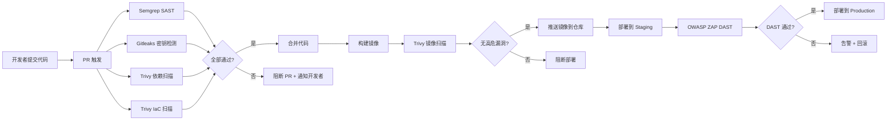
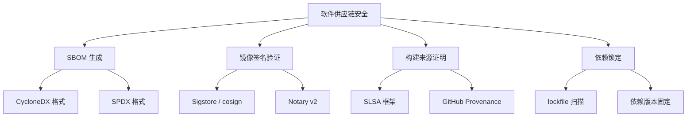

## 技巧三：安全扫描自动化

### 为什么安全扫描必须自动化

在现代软件交付流程中，代码从提交到上线的周期从数周缩短到数小时甚至数分钟。DevOps 和 CI/CD 的普及让部署频率呈指数级增长——DORA 研究报告显示，顶级团队每年部署超过 1000 次。在这种节奏下，如果安全检查仍然依赖人工——让安全工程师手动运行扫描工具、逐条审查报告、再手动回复开发团队——那么安全检查就会成为交付流程中的瓶颈，最终被"优化"掉。

安全扫描自动化的核心驱动力来自三个维度：

**经济维度：漏洞修复成本的指数级增长。** IBM Systems Sciences Institute 的经典研究表明，在生产环境修复一个安全漏洞的平均成本是在设计阶段修复的 100 倍，在编码阶段修复的 30 倍。一个在 PR 阶段就能被 Semgrep 拦截的 SQL 注入问题，修复成本可能只需 10 分钟的开发时间；而同一个漏洞流入生产环境后，可能引发数据泄露事件，带来数百万美元的损失、监管罚款和品牌声誉损害。自动化扫描的核心价值在于将安全检查左移（Shift Left），在代码编写、构建、部署的每个阶段自动拦截问题，把漏洞消灭在成本最低的环节。

**合规维度：监管要求驱动自动化。** 越来越多的行业标准和法规明确要求软件开发生命周期中嵌入安全检查。PCI-DSS 6.5.1 要求定期进行应用安全测试，SOC 2 的 CC7.1 控制点要求对基础设施进行持续监控，美国政府的 Executive Order 14028 要求联邦项目生成软件物料清单（SBOM），欧盟的 Cyber Resilience Act（CRA）要求在产品整个生命周期内进行漏洞管理。手动执行这些合规要求几乎不可能，自动化是唯一的可行路径。

**效率维度：开发者生产力保护。** 安全团队人手永远不够。一个 50 人开发团队可能只有 2-3 名安全工程师。如果每次扫描都要安全工程师手动触发和审查，扫描频率和覆盖范围必然受限。自动化让安全检查变成"默认开启"的基础设施能力，安全工程师可以把精力集中在架构级安全设计、复杂漏洞分析和安全工具链优化上，而不是重复性的扫描触发和报告转发。

安全扫描自动化不仅仅是"写个脚本定时跑扫描"。它是一套完整的工程体系，涵盖扫描策略设计、工具链选型、流水线集成、结果处理、误报管理和持续改进。本节将从理论到实操，系统地讲解如何构建企业级的安全扫描自动化体系。

### 安全扫描的分类体系

不同类型的漏洞需要不同的检测方法。理解扫描分类是设计自动化策略的基础。

```mermaid
graph TD
    A[安全扫描自动化] --> B[静态应用安全测试 SAST]
    A --> C[动态应用安全测试 DAST]
    A --> D[交互式应用安全测试 IAST]
    A --> E[软件成分分析 SCA]
    A --> F[容器与镜像扫描]
    A --> G[基础设施即代码 IaC 扫描]
    A --> H[密钥与凭证检测]
    A --> I[网络漏洞扫描]
    A --> J[云安全态势管理 CSPM]
    A --> K[软件物料清单 SBOM]

    B --> B1[源代码级别]
    B --> B2[字节码/二进制级别]
    C --> C1[黑盒测试]
    C --> C2[灰盒测试]
    D --> D1[运行时插桩]
    E --> E1[开源组件 CVE]
    E --> E2[许可证合规]
    F --> F1[OS 层漏洞]
    F --> F2[应用依赖漏洞]
    G --> G1[Terraform/CloudFormation]
    G --> G2[Kubernetes manifests]
    H --> H1[Git 历史扫描]
    H --> H2[CI/CD 运行时检测]
    I --> I1[端口/服务发现]
    I --> I2[协议漏洞检测]
    J --> J1[云资源配置审计]
    J --> J2[合规基线检查]
    K --> K1[依赖清单生成]
    K --> K2[漏洞关联查询]
```



| 扫描类型 | 检测对象 | 执行时机 | 优势 | 局限 | 代表工具 |
|---------|---------|---------|------|------|---------|
| SAST | 源代码逻辑缺陷 | 编码/构建阶段 | 不需要运行环境，反馈快 | 误报率较高，无法检测运行时问题 | Semgrep, CodeQL, SonarQube |
| DAST | 运行时应用行为 | 测试/部署阶段 | 真实环境检测，误报率低 | 需要运行环境，覆盖有限 | OWASP ZAP, Burp Suite |
| IAST | 运行时+代码级关联 | 测试阶段 | 精确定位漏洞代码行 | 需要代理注入，性能开销 | Contrast Security |
| SCA | 第三方依赖漏洞 | 构建/部署阶段 | 自动化程度高，覆盖面广 | 仅检测已知漏洞 | Trivy, OWASP Dep-Check, Snyk |
| 容器扫描 | 镜像 OS + 依赖 | 构建/推送阶段 | 全面覆盖容器栈 | 镜像层数多时速度慢 | Trivy, Grype, Snyk Container |
| IaC 扫描 | 基础设施配置 | 编码/PR 阶段 | 防止云上 misconfiguration | 规则覆盖有限 | Checkov, tfsec, KICS |
| 密钥检测 | 硬编码凭证 | 全生命周期 | 防止凭证泄露 | 容易产生误报 | Gitleaks, TruffleHog, detect-secrets |
| 网络扫描 | 端口/服务/配置 | 运行时 | 发现网络层暴露面 | 需要网络权限 | Nmap, Nuclei, Masscan |
| CSPM | 云资源配置 | 持续监控 | 全面覆盖云安全态势 | 依赖云 API 权限 | Prowler, ScoutSuite, Steampipe |
| SBOM | 依赖清单 | 构建/发布阶段 | 法规合规+漏洞关联 | 生成本身不检测漏洞 | Syft, CycloneDX, SPDX |

### 核心工具链详解

#### SAST 工具：Semgrep

Semgrep 是目前最受欢迎的开源 SAST 工具之一，支持 30+ 种语言，规则可定制，且误报率相对较低。它的核心优势在于基于 AST（抽象语法树）的模式匹配，比传统正则匹配更精准。Semgrep 的规则语言简单直观，安全工程师不需要深入理解 AST 内部结构就能编写高质量的检测规则。

**安装与基础使用：**

```bash
# 安装
pip install semgrep

# 扫描整个项目（使用官方规则集）
semgrep scan --config auto .

# 针对特定语言扫描
semgrep scan --config p/python /path/to/project

# 输出 JSON 格式（便于 CI/CD 集成）
semgrep scan --config auto --json --output semgrep-results.json .

# 输出 SARIF 格式（GitHub Security / DefectDojo 标准格式）
semgrep scan --config auto --sarif --output semgrep-results.sarif .

# 限制扫描范围（仅扫描改动文件，PR 场景下加速）
semgrep ci --diff-includes '*.py,*.js' --config auto
```

**SARIF 格式简介：** SARIF（Static Analysis Results Interchange Format）是 OASIS 标准的静态分析结果交换格式，已成为 GitHub Security、Azure DevOps、DefectDojo 等平台的通用数据格式。使用 SARIF 格式输出可以实现不同扫描工具结果的统一聚合和展示。GitHub 的 Code Scanning 功能原生支持 SARIF 上传，扫描结果会直接出现在仓库的 Security 标签页中。

**自定义规则示例——检测硬编码密码：**

```yaml
# .semgrep/rules/detect-hardcoded-password.yaml
rules:
  - id: hardcoded-password
    patterns:
      - pattern-either:
          - pattern: $VAR = "..."
          - pattern: $VAR = '...'
      - metavariable-regex:
          metavariable: $VAR
          regex: (password|passwd|pwd|secret|api_key|apikey)
    message: "检测到疑似硬编码凭证 '$VAR'，请使用环境变量或密钥管理服务"
    languages: [python, javascript, java, go]
    severity: ERROR
    metadata:
      category: security
      technology: [general]
      confidence: HIGH
```

**自定义规则示例——检测不安全的 JWT 配置：**

```yaml
# .semgrep/rules/insecure-jwt.yaml
rules:
  - id: insecure-jwt-none-algorithm
    pattern-either:
      - pattern: |
          jwt.encode(..., algorithm="none")
      - pattern: |
          jwt.encode(..., algorithms=["none"])
      - pattern: |
          jwt.decode(..., options={..., "verify_signature": False, ...})
    message: "JWT 使用了不安全的 none 算法或禁用了签名验证，可能导致身份伪造"
    languages: [python]
    severity: ERROR
    metadata:
      category: security
      cwe:
        - "CWE-347: Improper Verification of Cryptographic Signature"
```

**IDE 集成——让开发者在编码阶段获得即时反馈：**

```bash
# VSCode 用户：安装 semgrep 扩展
# 搜索并安装 "Semgrep" 扩展，配置 settings.json:
# {
#   "semgrep.settings.additionalSemgrepRules": [".semgrep/rules/"],
#   "semgrep.settings.scanOnSave": true
# }

# JetBrains IDE（IntelliJ/PyCharm）：安装 Semgrep 插件
# Settings > Plugins > 搜索 "Semgrep" > Install

# 命令行实时监控（类似 linter）
semgrep scan --config auto --error --autofix .
```

IDE 集成是 Shift Left 的最后一公里。当开发者在编写代码时就能看到安全问题提示，修复成本最低、反馈闭环最快。据统计，IDE 阶段修复安全问题的成本仅为 PR 阶段的 1/5。

**在 CI/CD 中集成（GitHub Actions 示例）：**

```yaml
# .github/workflows/semgrep.yml
name: Semgrep SAST Scan
on:
  push:
    branches: [main, develop]
  pull_request:
    branches: [main]

jobs:
  semgrep:
    runs-on: ubuntu-latest
    container:
      image: semgrep/semgrep
    steps:
      - uses: actions/checkout@v4
      - name: Run Semgrep
        run: semgrep ci --json --output results.json
        env:
          SEMGREP_RULES: >-
            p/default
            p/owasp-top-ten
            p/security-audit
            p/secrets
      - name: Upload Results
        if: always()
        uses: actions/upload-artifact@v4
        with:
          name: semgrep-results
          path: results.json
      - name: Upload SARIF to GitHub Security
        if: always()
        uses: github/codeql-action/upload-sarif@v3
        with:
          sarif_file: semgrep.sarif
          category: semgrep
```

#### SCA 工具：Trivy（软件成分分析 + 容器扫描 + IaC 扫描）

Trivy 是 Aqua Security 开源的全栈安全扫描工具，能同时处理依赖漏洞、容器镜像、IaC 配置和密钥检测，是目前覆盖面最广的单一扫描工具。其核心优势在于：

- **单一工具覆盖多个扫描类型**，减少工具链复杂度
- **漏洞数据库更新频繁**（集成 NVD、GitHub Advisory Database、OSV 等多个数据源）
- **原生支持 SARIF 输出**，与 GitHub、DefectDojo 等平台无缝集成
- **Client-Server 模式**，CI/CD 中可以复用缓存的漏洞数据库，大幅提升扫描速度

**安装：**

```bash
# Debian/Ubuntu
sudo apt-get install trivy

# 或使用官方脚本安装最新版
curl -sfL https://raw.githubusercontent.com/aquasecurity/trivy/main/contrib/install.sh | sh -s -- -b /usr/local/bin

# macOS
brew install trivy
```

**扫描软件依赖（SCA）：**

```bash
# 扫描项目依赖漏洞
trivy fs --scanners vuln,secret,misconfig /path/to/project

# 仅扫描漏洞，输出格式为 SARIF（GitHub 可直接解析）
trivy fs --format sarif --output trivy-results.sarif --scanners vuln /path/to/project

# 只显示高危和严重漏洞
trivy fs --severity HIGH,CRITICAL --scanners vuln /path/to/project

# 忽略特定 CVE（在 .trivyignore 中配置）
trivy fs --ignore-unfixed --scanners vuln /path/to/project

# 忽略未修复的漏洞（减少噪音，只关注可操作的修复）
trivy fs --ignore-unfixed --scanners vuln /path/to/project

# Client-Server 模式：预启动 Trivy Server，CI/CD 扫描时复用缓存
# 启动服务（通常以 K8s Deployment 或 Docker Compose 部署）
trivy server --listen 0.0.0.0:8080

# CI 中使用 Client 模式（无需每次更新数据库，速度提升 5-10 倍）
trivy fs --server http://trivy-server:8080 --scanners vuln /path/to/project
```

**扫描容器镜像：**

```bash
# 扫描本地镜像
trivy image myapp:latest

# 扫描远程镜像（通过 Trivy Server）
trivy image --server http://trivy-server:8080 registry.example.com/myapp:v1.2.3

# 扫描并仅输出严重漏洞
trivy image --severity CRITICAL --exit-code 1 myapp:latest
# exit-code 1 表示发现漏洞时返回非零退出码，可直接用于 CI 卡点

# 生成 SBOM（CycloneDX 格式）
trivy image --format cyclonedx --output sbom.json myapp:latest

# 生成 SBOM（SPDX 格式）
trivy image --format spdx-json --output sbom.spdx.json myapp:latest
```

**扫描 Kubernetes 配置：**

```bash
# 扫描 K8s manifest 文件
trivy config --scanners misconfig /path/to/k8s-manifests/

# 扫描 Helm chart
trivy config --scanners misconfig /path/to/helm-chart/

# 扫描正在运行的集群
trivy k8s --report summary cluster

# 扫描特定 namespace
trivy k8s --report all -n production cluster
```

**CI/CD 集成（GitLab CI 示例）：**

```yaml
# .gitlab-ci.yml
stages:
  - security

trivy-scan:
  stage: security
  image: aquasec/trivy:latest
  script:
    # 扫描文件系统
    - trivy fs --exit-code 1 --severity HIGH,CRITICAL --scanners vuln,secret .
    # 扫描构建的镜像
    - trivy image --exit-code 1 --severity HIGH,CRITICAL ${CI_REGISTRY_IMAGE}:${CI_COMMIT_SHA}
  artifacts:
    when: always
    paths:
      - trivy-results.sarif
    reports:
      container_scanning: gl-container-scanning-report.json
```

#### DAST 工具：OWASP ZAP

ZAP（Zed Attack Proxy）是 OWASP 旗舰开源 DAST 工具，能自动发现 Web 应用中的 OWASP Top 10 漏洞。与 SAST 的代码级分析不同，ZAP 从外部视角测试运行中的应用，能发现 SAST 无法检测的运行时漏洞（如认证绕过、会话管理缺陷、业务逻辑漏洞）。

ZAP 提供三种扫描模式，适用于不同场景：

| 模式 | 说明 | 耗时 | 适用场景 |
|------|------|------|---------|
| Baseline Scan | 被动扫描，不发送攻击性请求 | 1-2 分钟 | PR 快速检查、生产环境监控 |
| Full Scan | 主动扫描，发送攻击性请求探测漏洞 | 30-60 分钟 | Staging 深度测试 |
| API Scan | 基于 OpenAPI/Swagger 定义扫描 API | 10-30 分钟 | API 专项安全测试 |

**Docker 方式运行快速扫描：**

```bash
# 基线扫描（被动，安全无副作用）
docker run --rm -t ghcr.io/zaproxy/zaproxy:stable zap-baseline.py \
  -t https://target.example.com \
  -r zap-report.html

# 完整扫描（主动，会发送攻击性请求）
docker run --rm -t ghcr.io/zaproxy/zaproxy:stable zap-full-scan.py \
  -t https://target.example.com \
  -r zap-full-report.html \
  -J zap-report.json

# API 扫描（针对 REST/OpenAPI）
docker run --rm -t -v $(pwd)/api-schema.json:/zap/wrk/api-schema.json \
  ghcr.io/zaproxy/zaproxy:stable zap-api-scan.py \
  -t https://target.example.com/openapi.json \
  -f openapi \
  -r zap-api-report.html

# 使用 Context 文件预配置认证（扫描需要登录的页面）
docker run --rm -t \
  -v $(pwd)/context.context:/zap/wrk/context.context \
  -v $(pwd)/session.session:/zap/wrk/session.session \
  ghcr.io/zaproxy/zaproxy:stable zap-full-scan.py \
  -t https://target.example.com \
  -r zap-report.html \
  -c context.context
```

**CI/CD 集成（GitHub Actions）：**

```yaml
# .github/workflows/zap-scan.yml
name: OWASP ZAP DAST Scan
on:
  workflow_run:
    workflows: ["Deploy to Staging"]
    types: [completed]

jobs:
  zap-scan:
    runs-on: ubuntu-latest
    steps:
      - name: ZAP Baseline Scan
        uses: zaproxy/action-baseline@v0.12.0
        with:
          target: https://staging.example.com
          rules_file_name: '.zap/rules.tsv'
          cmd_options: '-a'
      - name: ZAP Full Scan
        uses: zaproxy/action-full-scan@v0.10.0
        if: github.event.workflow_run.conclusion == 'success'
        with:
          target: https://staging.example.com
          fail_action: true
```

#### 密钥检测工具：Gitleaks 与 TruffleHog

密钥泄露是现代软件开发中最常见也最危险的安全问题之一。GitHub 安全实验室的研究表明，每 1000 个公共仓库中就有超过 1 个包含有效的 API 密钥或令牌。一旦密钥被推送到公共仓库，即使立即删除，也可能在几分钟内被自动化爬虫捕获（如 GitHub 泄露事件中著名的 truffleHog）。

**Gitleaks** 专门用于检测 Git 仓库中的硬编码密钥、密码和敏感信息。它扫描整个 Git 历史（不仅仅是当前代码），能发现已被删除但曾存在于历史提交中的凭证。

```bash
# 安装
brew install gitleaks  # macOS
# 或
docker pull ghcr.io/gitleaks/gitleaks:latest

# 扫描当前仓库（含历史）
gitleaks detect --source . --report-path gitleaks-report.json

# 扫描特定提交范围
gitleaks detect --source . --log-opts="--since=2025-01-01" --report-path report.json

# 在 pre-commit hook 中运行（阻止含密钥的提交）
gitleaks protect --staged --verbose

# 使用自定义规则
gitleaks detect --source . --config .gitleaks.toml
```

**TruffleHog** 是另一个强力密钥检测工具，额外支持实时验证（确认泄露的密钥是否仍然有效）：

```bash
# 安装
pip install trufflehog3
# 或使用官方二进制
curl -sSfL https://raw.githubusercontent.com/trufflesecurity/trufflehog/main/scripts/install.sh | sh -s -- -b /usr/local/bin

# 扫描 GitHub 仓库（含历史）
trufflehog github --repo https://github.com/owner/repo

# 扫描本地 Git 仓库，验证发现的密钥是否仍然有效
trufflehog git file://./repo --only-verified

# 扫描 S3 存储桶
trufflehog filesystem /path/to/dump/
```

**自定义 Gitleaks 规则示例：**

```toml
# .gitleaks.toml
title = "Custom Gitleaks Rules"

[[rules]]
id = "internal-api-key"
description = "检测内部 API 密钥"
regex = '''(?i)internal[_-]?api[_-]?key\s*[:=]\s*['\"]([a-zA-Z0-9]{32,})['\"]'''
tags = ["key", "api"]

[[rules]]
id = "database-url"
description = "检测数据库连接字符串"
regex = '''(?i)(mysql|postgres|mongodb|redis)://[^\s'"]+'''
tags = ["database", "credential"]

[[rules]]
id = "aws-access-key"
description = "检测 AWS Access Key"
regex = '''(?i)(?:aws[_-]?access[_-]?key[_-]?id|AKIA)[A-Z0-9]{16}'''
tags = ["aws", "cloud"]

# 忽略测试文件中的误报
[allowlist]
description = "Global Allowlist"
paths = [
    '''(.*)test(.*)''',
    '''(.*)mock(.*)''',
    '''(.*)\.example\.''',
]
```

#### 网络漏洞扫描：Nmap + Nuclei

**Nmap** 是网络发现和端口扫描的事实标准工具：

```bash
# 快速扫描目标开放端口
nmap -sV -sC --top-ports 1000 target.example.com

# 全端口扫描 + 脚本漏洞检测
nmap -p- -sV --script vuln target.example.com

# 输出 XML 报告（便于自动化处理）
nmap -oX nmap-results.xml -sV -sC target.example.com

# 扫描网段
nmap -sn 192.168.1.0/24  # 主机发现
nmap -sV 192.168.1.0/24  # 服务识别
```

**Nuclei** 是基于模板的快速漏洞扫描器，由 ProjectDiscovery 社区维护了数千个检测模板，覆盖 CVE、misconfiguration、exposed panels、default-credentials 等场景：

```bash
# 安装
go install -v github.com/projectdiscovery/nuclei/v3/cmd/nuclei@latest

# 更新模板库（首次使用前必做）
nuclei -ut

# 使用默认模板扫描
nuclei -u https://target.example.com

# 使用特定模板
nuclei -u https://target.example.com -t http/cves/

# 批量扫描多个目标
nuclei -l urls.txt -t http/ -severity critical,high

# 输出 JSON + HTML 报告
nuclei -u https://target.example.com -json -html -o nuclei-results.json

# 配合 Nmap 结果使用
nmap -p80,443 -oX scan.xml target.example.com
nuclei -l scan.xml -t http/
```

#### 云安全态势管理：Prowler

云环境的 misconfiguration 是数据泄露的第一大原因。Prowler 是 AWS/Azure/GCP 云安全审计工具，能自动检查云资源是否符合 CIS Benchmark、PCI-DSS、HIPAA 等安全标准：

```bash
# 安装
pip install prowler

# 扫描 AWS 账号的安全态势
prowler aws --compliance cis_2.0_aws

# 扫描特定服务
prowler aws --services s3 ec2 iam

# 输出 HTML 报告
prowler aws --output-format html --output-folder ./reports

# 生成符合 CIS Benchmark 的合规报告
prowler aws --compliance cis_2.0_aws --output-format csv
```

#### 依赖自动更新：Dependabot 与 Renovate

漏洞扫描发现问题后，手动更新依赖既耗时又容易遗漏。自动化依赖更新工具可以持续监控依赖版本，在新版本发布时自动创建更新 PR：

**GitHub Dependabot（内置，零配置）：**

```yaml
# .github/dependabot.yml
version: 2
updates:
  - package-ecosystem: "npm"
    directory: "/"
    schedule:
      interval: "daily"
    open-pull-requests-limit: 10
    labels: ["dependencies", "security"]
    # 自动为安全更新添加标签
    groups:
      dev-dependencies:
        dependency-type: "development"
        update-types: ["minor", "patch"]

  - package-ecosystem: "docker"
    directory: "/"
    schedule:
      interval: "weekly"

  - package-ecosystem: "github-actions"
    directory: "/"
    schedule:
      interval: "weekly"
```

**Renovate（功能更强，支持更多平台）：**

```json
// renovate.json
{
  "$schema": "https://docs.renovatebot.com/renovate-schema.json",
  "extends": ["config:recommended", ":securityFixes"],
  "vulnerabilityAlerts": {
    "enabled": true,
    "labels": ["security"]
  },
  "packageRules": [
    {
      "matchUpdateTypes": ["minor", "patch"],
      "automerge": true
    }
  ]
}
```

### CI/CD 流水线安全扫描全集成

单独运行各工具只是第一步，真正的自动化是将所有扫描集成到 CI/CD 流水线中，形成分层防御。



**完整的 GitHub Actions 流水线示例：**

```yaml
# .github/workflows/security-scan.yml
name: Security Scanning Pipeline
on:
  push:
    branches: [main]
  pull_request:
    branches: [main]

env:
  IMAGE_NAME: myapp
  REGISTRY: ghcr.io

jobs:
  # ===== 阶段 1：PR 阶段快速扫描（< 5 分钟）=====
  pr-security-gate:
    if: github.event_name == 'pull_request'
    runs-on: ubuntu-latest
    permissions:
      contents: read
      security-events: write
    steps:
      - uses: actions/checkout@v4
        with:
          fetch-depth: 0  # Gitleaks 需要完整历史

      # SAST 扫描
      - name: Semgrep SAST
        uses: semgrep/semgrep-action@v1
        with:
          config: >-
            p/default
            p/owasp-top-ten
            p/secrets
            .semgrep/rules/
          generateSarif: true
        env:
          SEMGREP_APP_TOKEN: ${{ secrets.SEMGREP_APP_TOKEN }}

      # 密钥检测
      - name: Gitleaks Secret Scan
        uses: gitleaks/gitleaks-action@v2
        env:
          GITHUB_TOKEN: ${{ secrets.GITHUB_TOKEN }}

      # 依赖漏洞扫描
      - name: Trivy Dependency Scan
        uses: aquasecurity/trivy-action@master
        with:
          scan-type: 'fs'
          scan-ref: '.'
          severity: 'HIGH,CRITICAL'
          exit-code: '1'
          format: 'sarif'
          output: 'trivy-fs.sarif'

      # IaC 配置扫描
      - name: Trivy IaC Scan
        uses: aquasecurity/trivy-action@master
        with:
          scan-type: 'config'
          scan-ref: '.'
          severity: 'HIGH,CRITICAL'
          exit-code: '1'
          format: 'table'

      # 上传所有 SARIF 结果到 GitHub Security
      - name: Upload SARIF to GitHub
        if: always()
        uses: github/codeql-action/upload-sarif@v3
        with:
          sarif_file: semgrep.sarif
          category: semgrep

  # ===== 阶段 2：合并后构建 + 镜像扫描 =====
  build-and-scan:
    if: github.event_name == 'push' &amp;&amp; github.ref == 'refs/heads/main'
    runs-on: ubuntu-latest
    needs: []
    steps:
      - uses: actions/checkout@v4

      - name: Build Docker Image
        run: |
          docker build -t ${{ env.REGISTRY }}/${{ env.IMAGE_NAME }}:${{ github.sha }} .

      # 镜像漏洞扫描
      - name: Trivy Image Scan
        uses: aquasecurity/trivy-action@master
        with:
          image-ref: '${{ env.REGISTRY }}/${{ env.IMAGE_NAME }}:${{ github.sha }}'
          severity: 'HIGH,CRITICAL'
          exit-code: '1'
          format: 'table'
          ignore-unfixed: true

      # 镜像密钥扫描
      - name: Trivy Secret Scan
        uses: aquasecurity/trivy-action@master
        with:
          image-ref: '${{ env.REGISTRY }}/${{ env.IMAGE_NAME }}:${{ github.sha }}'
          scan-type: 'image'
          scanners: 'secret'
          exit-code: '1'

      # 生成 SBOM
      - name: Generate SBOM
        uses: aquasecurity/trivy-action@master
        with:
          image-ref: '${{ env.REGISTRY }}/${{ env.IMAGE_NAME }}:${{ github.sha }}'
          format: 'cyclonedx'
          output: 'sbom.json'

      # 上传 SBOM 作为构建产物
      - name: Upload SBOM
        uses: actions/upload-artifact@v4
        with:
          name: sbom
          path: sbom.json

      # 推送通过扫描的镜像
      - name: Push Image
        if: success()
        run: |
          echo "${{ secrets.GITHUB_TOKEN }}" | docker login ${{ env.REGISTRY }} -u ${{ github.actor }} --password-stdin
          docker push ${{ env.REGISTRY }}/${{ env.IMAGE_NAME }}:${{ github.sha }}
          docker tag ${{ env.REGISTRY }}/${{ env.IMAGE_NAME }}:${{ github.sha }} ${{ env.REGISTRY }}/${{ env.IMAGE_NAME }}:latest
          docker push ${{ env.REGISTRY }}/${{ env.IMAGE_NAME }}:latest

  # ===== 阶段 3：Staging 部署后 DAST 扫描 =====
  dast-scan:
    if: github.event_name == 'push'
    runs-on: ubuntu-latest
    needs: build-and-scan
    steps:
      - name: Deploy to Staging
        run: |
          # 部署到 Staging 环境的脚本
          ./scripts/deploy.sh staging ${{ github.sha }}

      - name: Wait for Deployment
        run: sleep 30  # 等待服务就绪

      - name: OWASP ZAP Baseline Scan
        uses: zaproxy/action-baseline@v0.12.0
        with:
          target: ${{ secrets.STAGING_URL }}
          rules_file_name: '.zap/rules.tsv'
          fail_action: false  # 基线扫描不阻断

      - name: OWASP ZAP Full Scan
        uses: zaproxy/action-full-scan@v0.10.0
        with:
          target: ${{ secrets.STAGING_URL }}
          fail_action: true   # 完整扫描发现高危则阻断
          cmd_options: '-a -j'
```

### 扫描策略设计

不同阶段需要不同强度的扫描，平衡安全性和开发效率。核心原则是"越早发现，越快反馈；越晚阻断，越要慎重"。

| 阶段 | 触发条件 | 扫描类型 | 耗时预算 | 失败策略 | 阻断阈值 |
|------|---------|---------|---------|---------|---------|
| 编码 | IDE 保存 | Semgrep 本地规则 | < 5s | 静默提示（不阻断） | 所有发现 |
| Pre-commit | git commit | Gitleaks + 基础 SAST | < 10s | 阻断提交 | CRITICAL |
| PR 检查 | Pull Request | SAST + SCA + IaC + 密钥 | < 5min | 阻断合并 | HIGH+ |
| 构建 | merge 到 main | 镜像扫描 + 完整 SAST | < 10min | 阻断构建 | HIGH+ |
| Staging | 部署后 | DAST 基线扫描 | < 15min | 告警（不阻断） | CRITICAL |
| 定期 | 每周/每日 | 全量 DAST + 网络扫描 | < 60min | 告警 + 工单 | CRITICAL |

**分层策略的设计原则：**

- **PR 阶段追求速度**：开发者等不起。所有 PR 阶段的扫描应在 5 分钟内完成。如果全量扫描太慢，只扫描改动文件（diff scan）。Semgrep 的 `--diff-includes` 和 Trivy 的 `--scanners vuln` 都支持范围限制。
- **构建阶段追求深度**：代码已合并，可以承受更长的扫描时间。运行完整的规则集和镜像扫描。
- **Staging 阶段追求真实**：DAST 在真实环境中运行，检测 SAST 无法发现的运行时漏洞。基线扫描每次部署自动运行，完整扫描每周执行。
- **生产阶段追求持续**：定期对生产环境做主动扫描（网络扫描、证书检查、配置审计），而不是被动等待攻击暴露。

### 误报管理

安全扫描最大的痛点不是"找不到问题"，而是"找到太多问题但大部分是误报"。长期不处理误报会导致开发者无视所有告警（alert fatigue），真正危险的漏洞反而被淹没。Gartner 估计，传统 SAST 工具的误报率可高达 40-70%。

**误报处理策略：**

```bash
# Semgrep: 使用 .semgrepignore 忽略已确认的误报
# .semgrepignore
tests/
mocks/
# 已审核确认为误报的规则
src/legacy/payment.py  # Semgrep rule hardcoded-password
```

```yaml
# Semgrep: 针对特定文件禁用特定规则
# 在源文件顶部添加
# nosemgrep: python.django.security.injection.sql-injection
def get_user(user_input):
    # 该函数已使用 ORM 参数化查询，此处为误报
    return User.objects.filter(name=user_input)
```

```bash
# Trivy: 使用 .trivyignore 忽略已评估的 CVE
# .trivyignore
# 已评估 - 该 CVE 仅影响 Windows，我们的服务运行在 Linux
CVE-2024-12345
# 已评估 - 该漏洞在我们的使用场景下无法触发
CVE-2024-67890
```

**建立误报反馈闭环：**

发现疑似误报
    ↓
在代码中添加抑制注释 + 记录到团队 Wiki（含抑制理由和评估日期）
    ↓
定期（每月）审查所有抑制规则
    ↓
移除不再适用的抑制（工具升级后可能不再是误报）
    ↓
向工具社区提交误报 issue（帮助改善全局规则）

**误报管理的关键指标：**

| 指标 | 健康范围 | 说明 |
|------|---------|------|
| 误报率 | < 20% | 总发现中被标记为误报的比例 |
| 抑制规则数趋势 | 逐月下降 | 规则越成熟，误报越少 |
| 开发者忽略率 | < 5% | 被开发者直接关闭的安全发现比例 |
| 误报审查覆盖率 | > 90% | 所有抑制规则中有定期审查记录的比例 |

### SBOM 与软件供应链安全

软件供应链攻击（如 SolarWinds 事件、Log4Shell）催生了对软件供应链安全的重视。SBOM（Software Bill of Materials，软件物料清单）是供应链安全的基础——它记录了软件包含的所有组件、版本和依赖关系，使得在新漏洞披露时能快速定位受影响的项目。



**使用 Syft 生成 SBOM：**

```bash
# 安装 Syft（ SPDX 和 CycloneDX 格式的 SBOM 生成器）
curl -sSfL https://raw.githubusercontent.com/anchore/syft/main/install.sh | sh -s -- -b /usr/local/bin

# 为 Docker 镜像生成 SBOM（CycloneDX JSON）
syft myapp:latest -o cyclonedx-json > sbom-cdx.json

# 为 Docker 镜像生成 SBOM（SPDX JSON）
syft myapp:latest -o spdx-json > sbom-spdx.json

# 为项目目录生成 SBOM
syft dir:/path/to/project -o cyclonedx-json > sbom.json

# 使用 Trivy 生成 SBOM（一体化方案）
trivy image --format cyclonedx --output sbom.json myapp:latest
```

**使用 cosign 签名容器镜像：**

```bash
# 安装 cosign
go install github.com/sigstore/cosign/v2/cmd/cosign@latest

# 生成密钥对（首次）
cosign generate-key-pair

# 签名镜像
cosign sign --key cosign.key ghcr.io/myorg/myapp:latest

# 验证签名
cosign verify --key cosign.pub ghcr.io/myorg/myapp:latest

# 在 CI/CD 中自动签名（使用 Keyless 模式，基于 OIDC）
cosign sign ghcr.io/myorg/myapp:latest
# 无需管理密钥，签名证书绑定到 GitHub Actions 的 OIDC 身份
```

### 定期扫描与告警体系

自动化不只是 CI/CD 集成，还包括对已部署系统的持续监控。

**使用 Cron 定期扫描：**

```bash
#!/bin/bash
# /opt/scripts/periodic-security-scan.sh
# 每日凌晨 2 点执行的安全扫描脚本

SCAN_DIR="/var/log/security-scans/$(date +%Y-%m-%d)"
mkdir -p "$SCAN_DIR"

# 1. 扫描生产服务器已安装软件的已知漏洞
trivy rootfs --severity HIGH,CRITICAL \
  --format json --output "$SCAN_DIR/os-vulns.json" /

# 2. 扫描所有运行容器的镜像
docker ps --format '{{.Image}}' | sort -u | while read image; do
  safe_name=$(echo "$image" | tr '/:' '_')
  trivy image --severity HIGH,CRITICAL \
    --format json --output "$SCAN_DIR/${safe_name}.json" "$image"
done

# 3. 检查 SSL 证书过期
for domain in example.com api.example.com admin.example.com; do
  expiry=$(echo | openssl s_client -servername "$domain" \
    -connect "$domain":443 2>/dev/null | openssl x509 -noout -enddate 2>/dev/null)
  echo "$domain: $expiry" >> "$SCAN_DIR/cert-expiry.txt"
done

# 4. 生成 SBOM 并检查新增依赖
trivy image --format cyclonedx --output "$SCAN_DIR/sbom.json" myapp:latest

# 5. 汇总报告
python3 /opt/scripts/scan-aggregator.py "$SCAN_DIR"

# 6. 如有高危发现，发送告警
if grep -q '"CRITICAL"' "$SCAN_DIR"/os-vulns.json 2>/dev/null; then
  curl -X POST "$SLACK_WEBHOOK" \
    -H 'Content-Type: application/json' \
    -d "{\"text\": \"🚨 安全扫描发现 CRITICAL 漏洞，请立即检查: $SCAN_DIR\"}"
fi
```

**使用 Prometheus + Grafana 可视化扫描结果：**

```python
# /opt/scripts/scan-metrics-exporter.py
# 将扫描结果转化为 Prometheus 指标

from prometheus_client import Gauge, start_http_server
import json, glob, subprocess, time

# 定义指标
vuln_total = Gauge('security_vulnerabilities_total',
    'Total vulnerabilities by severity',
    ['severity', 'scan_type'])
last_scan_time = Gauge('security_scan_last_timestamp_seconds',
    'Unix timestamp of last scan',
    ['scan_type'])
cert_expiry_days = Gauge('ssl_cert_expiry_days',
    'Days until SSL certificate expires',
    ['domain'])

def collect_metrics():
    """收集扫描指标"""
    for f in glob.glob('/var/log/security-scans/latest/*-vulns.json'):
        with open(f) as fh:
            data = json.load(fh)
            for result in data.get('Results', []):
                for vuln in result.get('Vulnerabilities', []):
                    sev = vuln.get('Severity', 'UNKNOWN').lower()
                    vuln_total.labels(severity=sev, scan_type='container').inc()

    last_scan_time.labels(scan_type='daily').set(time.time())

if __name__ == '__main__':
    start_http_server(9119)
    while True:
        collect_metrics()
        time.sleep(3600)  # 每小时更新一次
```

**Grafana 仪表盘关键面板建议：**

| 面板 | 指标 | 告警阈值 |
|------|------|---------|
| CRITICAL 漏洞数 | security_vulnerabilities_total{severity="critical"} | > 0 立即告警 |
| HIGH 漏洞趋势 | 7 天移动平均 | 持续上升告警 |
| SSL 证书到期 | ssl_cert_expiry_days | < 30 天告警 |
| 扫描覆盖率 | 扫描项目数 / 总项目数 | < 80% 告警 |
| 漏洞修复时效 | 从发现到关闭的天数 | CRITICAL > 7 天告警 |

### 安全扫描平台化：DefectDojo

当扫描工具增多、项目增多时，零散的扫描报告难以管理。DefectDojo 是一个开源漏洞管理平台，能统一聚合所有扫描工具的结果，提供漏洞的全生命周期管理。

**DefectDojo 核心功能：**

- **统一聚合**：支持 20+ 种扫描工具的报告格式（Semgrep、Trivy、ZAP、Gitleaks、Nuclei 等）
- **去重与关联**：自动合并来自不同工具的重复发现
- **漏洞生命周期管理**：从发现 → 确认 → 分配 → 修复 → 验证的完整工作流
- **SLA 追踪**：定义并监控漏洞修复时限
- **仪表盘与报告**：可视化漏洞趋势、团队效率、合规状态
- **API 自动化**：完整的 REST API，支持与 CI/CD 和工单系统集成

**快速部署：**

```bash
# Docker Compose 快速部署 DefectDojo
git clone https://github.com/DefectDojo/django-DefectDojo.git
cd django-DefectDojo

# 启动
docker compose up -d

# 默认访问地址: http://localhost:8080
# 默认账号: admin / admin（首次登录后强制修改密码）

# 初始化数据库
docker compose exec uwsgi python manage.py initialize_data
docker compose exec uwsgi python manage.py loaddata product_type
```

**通过 API 自动导入扫描结果：**

```python
#!/usr/bin/env python3
"""将 Trivy 扫描结果自动导入 DefectDojo"""

import requests
import json
import subprocess
import os
import tempfile

DOJOSERVER = os.environ.get("DOJOSERVER", "http://localhost:8080")
APIKEY = os.environ.get("DOJO_API_KEY")
PRODUCT_ID = 1
ENGAGEMENT_ID = 1

def run_trivy_scan(image_name):
    """运行 Trivy 扫描并返回 JSON 结果"""
    result = subprocess.run(
        ["trivy", "image", "--format", "json", image_name],
        capture_output=True, text=True
    )
    return json.loads(result.stdout)

def import_to_defectdojo(scan_result, image_name):
    """将扫描结果导入 DefectDojo"""
    with tempfile.NamedTemporaryFile(mode='w', suffix='.json', delete=False) as f:
        json.dump(scan_result, f)
        tmpfile = f.name

    with open(tmpfile, 'rb') as f:
        response = requests.post(
            f"{DOJOSERVER}/api/v2/import-scan/",
            headers={"Authorization": f"Token {APIKEY}"},
            files={"file": (f"{image_name}-trivy.json", f)},
            data={
                "product_name": f"Container: {image_name}",
                "engagement_name": "Automated Scan",
                "scan_type": "Trivy Scan",
                "close_old_findings": "true",
                "verified": "false",
                "minimum_severity": "High",
                "auto_create_context": "true",
            }
        )

    os.unlink(tmpfile)
    print(f"Import status: {response.status_code}")
    return response.json()

# 主流程
images = ["myapp:latest", "nginx:1.25", "redis:7.2"]
for image in images:
    print(f"Scanning {image}...")
    result = run_trivy_scan(image)
    import_to_defectdojo(result, image)
```

### 性能优化：大规模代码库的扫描加速

当代码库规模达到数十万行、微服务数量达到数十个时，扫描性能成为关键瓶颈。以下是经过实践验证的优化策略：

**并行扫描：**

```bash
# 使用 GNU parallel 并行扫描多个项目
find /opt/projects -maxdepth 1 -mindepth 1 -type d | \
  parallel -j 4 'echo "Scanning {}..."; semgrep scan --config auto --json --output /tmp/semgrep-{/}.json {}'

# Docker Compose 中并行启动多个扫描容器
docker compose run --rm semgrep semgrep scan --config auto .
docker compose run --rm gitleaks gitleaks detect --source .
docker compose run --rm trivy trivy fs --scanners vuln .
# 注意：以上三个命令并行执行需要外层脚本处理
```

**增量扫描（只扫描变更文件）：**

```bash
# CI/CD 中只扫描 PR 改动的文件
CHANGED_FILES=$(git diff --name-only origin/main...HEAD)
echo "$CHANGED_FILES" | xargs semgrep scan --config auto

# GitLab CI 中使用 diff 基线
git diff origin/main --name-only | grep -E '\.(py|js|ts|go|java)$' | \
  xargs semgrep scan --config auto
```

**Trivy 缓存优化：**

```bash
# 在 CI/CD 中使用 Trivy Server + 持久化卷缓存漏洞数据库
# Docker Compose 配置
# trivy-server:
#   image: aquasec/trivy:latest
#   command: server --listen 0.0.0.0:8080
#   volumes:
#     - trivy-cache:/root/.cache/trivy

# CI Job 中连接到缓存的 Server
trivy fs --server http://trivy-server:8080 --scanners vuln .
# 首次扫描约 3-5 分钟（下载数据库），后续扫描 < 30 秒
```

### 进阶：自定义扫描编排框架

当团队规模和项目数量增长，需要一个统一的扫描编排层来管理扫描策略、收集结果和驱动响应。

```python
#!/usr/bin/env python3
"""
安全扫描编排框架
统一调度多个扫描工具，聚合结果，驱动告警和工单
"""

import subprocess
import json
import hashlib
import os
import time
from datetime import datetime
from pathlib import Path
from concurrent.futures import ThreadPoolExecutor, as_completed


class SecurityScanner:
    def __init__(self, output_dir="/var/log/security-scans"):
        self.output_dir = Path(output_dir) / datetime.now().strftime("%Y-%m-%d")
        self.output_dir.mkdir(parents=True, exist_ok=True)
        self.results = []

    def run_trivy_fs(self, path, severity="HIGH,CRITICAL"):
        """SCA + 密钥 + IaC 扫描"""
        output_file = self.output_dir / "trivy-fs.json"
        subprocess.run([
            "trivy", "fs",
            "--format", "json",
            "--output", str(output_file),
            "--severity", severity,
            "--scanners", "vuln,secret,misconfig",
            path
        ], check=True)
        self._parse_and_store(output_file, "trivy-fs")
        return output_file

    def run_trivy_image(self, image, severity="HIGH,CRITICAL"):
        """容器镜像扫描"""
        safe_name = image.replace("/", "_").replace(":", "_")
        output_file = self.output_dir / f"trivy-image-{safe_name}.json"
        subprocess.run([
            "trivy", "image",
            "--format", "json",
            "--output", str(output_file),
            "--severity", severity,
            image
        ], check=True)
        self._parse_and_store(output_file, "trivy-image")
        return output_file

    def run_semgrep(self, path, configs=None):
        """SAST 扫描"""
        if configs is None:
            configs = ["p/default", "p/owasp-top-ten", "p/secrets"]
        output_file = self.output_dir / "semgrep.json"
        cmd = ["semgrep", "scan", "--json", "--output", str(output_file)]
        for config in configs:
            cmd.extend(["--config", config])
        cmd.append(path)
        subprocess.run(cmd, check=True)
        self._parse_and_store(output_file, "semgrep")
        return output_file

    def run_gitleaks(self, path):
        """密钥历史扫描"""
        output_file = self.output_dir / "gitleaks.json"
        subprocess.run([
            "gitleaks", "detect",
            "--source", path,
            "--report-path", str(output_file),
            "--report-format", "json"
        ], check=False)  # 发现密钥返回非零
        self._parse_and_store(output_file, "gitleaks")
        return output_file

    def run_parallel(self, path, image=None):
        """并行运行所有扫描"""
        tasks = {
            "trivy-fs": lambda: self.run_trivy_fs(path),
            "semgrep": lambda: self.run_semgrep(path),
            "gitleaks": lambda: self.run_gitleaks(path),
        }
        if image:
            tasks["trivy-image"] = lambda: self.run_trivy_image(image)

        with ThreadPoolExecutor(max_workers=4) as executor:
            futures = {executor.submit(fn): name for name, fn in tasks.items()}
            for future in as_completed(futures):
                name = futures[future]
                try:
                    future.result()
                    print(f"  [✓] {name} 完成")
                except Exception as e:
                    print(f"  [✗] {name} 失败: {e}")

    def _parse_and_store(self, filepath, scanner):
        """解析扫描结果并存储摘要"""
        if not filepath.exists():
            return
        with open(filepath) as f:
            data = json.load(f)

        # 提取漏洞计数
        if "Results" in data:  # Trivy 格式
            counts = {"CRITICAL": 0, "HIGH": 0, "MEDIUM": 0}
            for result in data.get("Results", []):
                for vuln in result.get("Vulnerabilities", []):
                    sev = vuln.get("Severity", "")
                    if sev in counts:
                        counts[sev] += 1
            self.results.append({
                "scanner": scanner,
                "file": str(filepath),
                "counts": counts,
                "total": sum(counts.values())
            })
        elif "results" in data:  # Semgrep 格式
            by_severity = {}
            for r in data.get("results", []):
                sev = r.get("extra", {}).get("severity", "INFO")
                by_severity[sev] = by_severity.get(sev, 0) + 1
            self.results.append({
                "scanner": scanner,
                "file": str(filepath),
                "counts": by_severity,
                "total": sum(by_severity.values())
            })

    def generate_report(self):
        """生成扫描汇总报告"""
        report = {
            "scan_time": datetime.now().isoformat(),
            "scanners_run": len(self.results),
            "results": self.results,
            "total_findings": sum(r["total"] for r in self.results),
            "critical_findings": sum(
                r["counts"].get("CRITICAL", 0) + r["counts"].get("error", 0)
                for r in self.results
            )
        }

        report_path = self.output_dir / "summary.json"
        with open(report_path, "w") as f:
            json.dump(report, f, indent=2)

        return report


# 使用示例
if __name__ == "__main__":
    scanner = SecurityScanner()

    print("[*] 并行运行所有扫描...")
    scanner.run_parallel("/opt/myapp", image="myapp:latest")

    report = scanner.generate_report()
    print(f"\n[✓] 扫描完成: {report['total_findings']} 个发现")
    print(f"    CRITICAL: {report['critical_findings']}")

    if report["critical_findings"] > 0:
        print("[!] 存在 CRITICAL 级别发现，触发告警...")
        # 接入告警逻辑（Slack/PagerDuty/飞书等）
```

### 常见误区与纠正

| 误区 | 正确做法 |
|------|---------|
| "扫描工具越多越安全" | 工具不在多，在于覆盖全面且误报率可控。选择 3-5 个互补工具深度集成，比 10 个浅尝辄止效果好 |
| "扫描发现了漏洞就一定要修" | 区分真实风险和理论风险。评估 CVSS 分数、可利用性、影响范围。不是所有高危漏洞在你的场景下都是高危的 |
| "CI 卡点用严格模式太影响效率" | 分层策略：PR 阶段只卡 CRITICAL，全量扫描在合并后运行。给开发者快速反馈，避免长时间等待 |
| "扫描报告生成后就没人看" | 建立 SLA：Critical 漏洞 24h 内修复，High 7 天，Medium 30 天。纳入团队 OKR |
| "容器镜像只要基础镜像安全就行" | 构建过程中安装的每一层依赖都可能引入漏洞。必须扫描最终镜像，不仅仅是 base image |
| "只扫描代码不扫描配置" | 云上 misconfiguration 是数据泄露的第一大原因。IaC 扫描和 CSPM 不可省略 |
| "密钥检测只需要当前代码" | 已删除但存在于 Git 历史中的密钥仍然有效。必须扫描完整历史（如 Gitleaks） |
| "生产环境不需要扫描" | 定期对生产环境做主动扫描（网络扫描、证书检查、配置审计），不依赖被动等待攻击暴露 |
| "SBOM 只是合规要求" | SBOM 是供应链安全的基础，在新漏洞披露时能快速定位受影响的项目，是应急响应的关键能力 |
| "依赖自动更新太激进" | Dependabot/Renovate 可以配置为仅自动合并 patch 更新，minor/major 更新需要人工审批 |

### 安全扫描自动化检查清单

在部署安全扫描自动化之前，逐项确认：

□ SAST 工具已集成到 PR 检查流程
□ SAST 规则集已根据项目技术栈定制（非仅用默认规则）
□ IDE 安全插件已推荐给开发者（VSCode/JetBrains）
□ SCA 工具覆盖所有项目依赖（package.json, requirements.txt, go.mod, pom.xml 等）
□ 依赖自动更新已配置（Dependabot/Renovate）
□ 容器镜像在构建后自动扫描
□ 密钥检测覆盖 Git 完整历史
□ IaC 扫描覆盖 Terraform/CloudFormation/Kubernetes manifests
□ DAST 在 Staging 环境自动运行
□ SBOM 已在构建流程中自动生成并归档
□ 容器镜像签名已启用（cosign/Notary）
□ 扫描结果统一收集到漏洞管理平台（DefectDojo 或类似工具）
□ 误报抑制流程已建立（.semgrepignore, .trivyignore 等）
□ 漏洞修复 SLA 已定义并纳入团队流程
□ 定期扫描脚本已部署（每日/每周）
□ 扫描告警通知链路已配置（Slack/飞书/邮件）
□ 扫描结果仪表盘已搭建（Grafana/DefectDojo）
□ 所有开发者了解扫描流程和误报处理方式
□ 安全扫描工具版本定期更新（至少每季度一次）
□ 扫描覆盖率指标已建立（多少项目接入、多少规则集启用）
□ Trivy Server 缓存已部署（加速 CI/CD 扫描）
□ 安全门禁策略已文档化（哪些扫描失败阻断、哪些仅告警）

### 本节小结

安全扫描自动化的本质是将安全检查从"人工、被动、后置"转变为"自动、主动、前置"。核心要点：

1. **工具选型讲互补**：SAST + SCA + DAST + 容器扫描 + 密钥检测 + CSPM，各有侧重，缺一不可
2. **CI/CD 集成分层**：PR 阶段快扫保效率，合并后深度扫保安全，Staging DAST 做最终验证
3. **误报管理是持久战**：建立抑制规则 + 定期审查 + 向社区反馈，三管齐下
4. **供应链安全不可忽视**：SBOM 生成 + 镜像签名 + 依赖锁定，构建可信赖的软件交付链
5. **平台化统一管理**：用 DefectDojo 等平台聚合所有扫描结果，建立可见性和 SLA
6. **性能优化不可省**：Trivy Server 缓存 + 并行扫描 + 增量扫描，让安全不成为瓶颈
7. **持续演进**：规则集定期更新，扫描范围持续扩大，告警闭环不断完善
