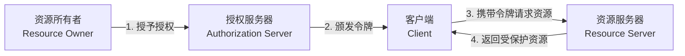
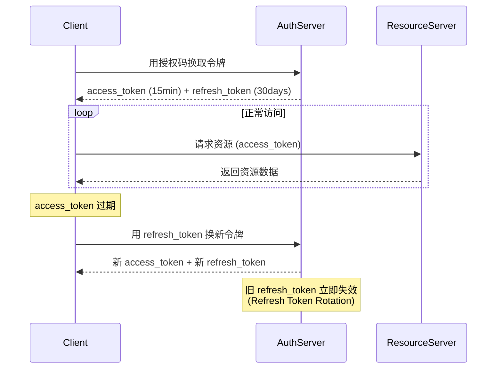
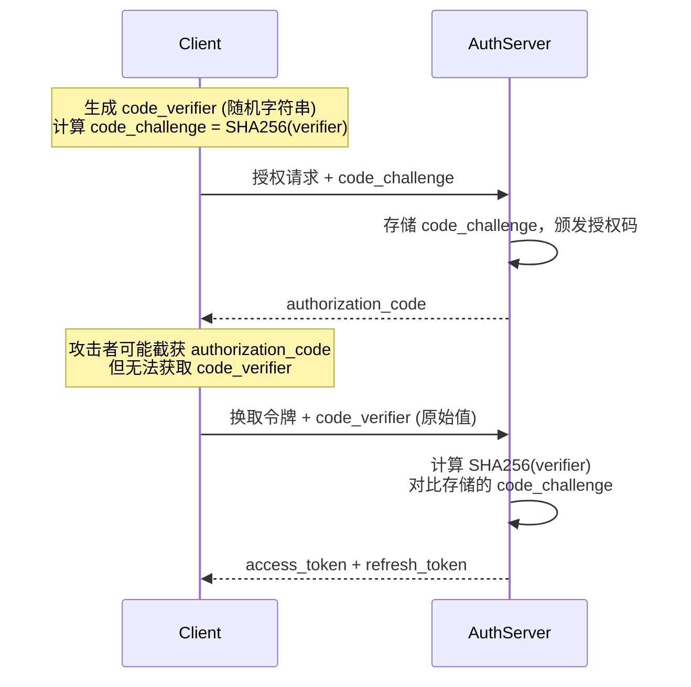
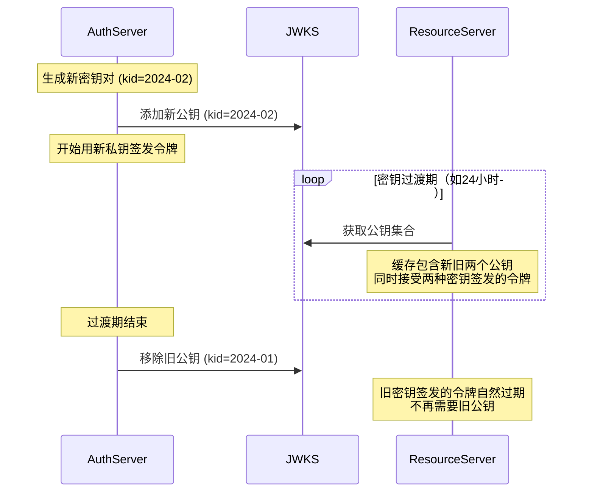

## 二、OAuth 2.0 授权框架与 JWT 令牌

### 2.1 OAuth 2.0 概述

OAuth 2.0 是一个**授权框架**（Authorization Framework），而非认证协议。它解决的核心问题是：**如何让第三方应用在不获取用户密码的前提下，获取对用户资源的有限访问权限**。

想象你使用"微信登录"来注册一个新应用——你并不需要把微信密码交给这个应用，而是通过微信的授权页面同意授权后，应用就获得了你头像、昵称等信息的访问权限。这背后就是 OAuth 2.0 在工作。

**OAuth 1.0 与 2.0 的关键区别：**

| 对比维度 | OAuth 1.0 | OAuth 2.0 |
|---------|-----------|-----------|
| 签名机制 | 每个请求都需要 HMAC-SHA1 签名 | 依赖 TLS 传输层安全，不再要求请求签名 |
| 授权流程 | 单一流程，获取 request_token | 多种授权模式，灵活适配不同场景 |
| 令牌类型 | 一种令牌（同时用于授权和访问） | 分离的 access_token 和 refresh_token |
| 客户端类型 | 无明确区分 | 区分公开客户端（Public）和机密客户端（Confidential） |
| 错误处理 | 不统一 | 标准化的错误响应格式 |
| 适用范围 | 仅授权 | 授权 + OIDC（身份认证） |

**OAuth 2.0 与传统认证方案的对比：**

在理解 OAuth 2.0 之前，有必要了解它与传统认证方案的区别和适用场景：

| 方案 | 核心机制 | 适用场景 | 优点 | 缺点 |
|------|---------|---------|------|------|
| Session Cookie | 服务端存储会话状态 | 传统 Web 应用 | 实现简单，可即时吊销 | 跨域困难，服务端存储压力 |
| API Key | 静态密钥标识调用者 | 服务间调用、简单 API | 实现最简单 | 无标准撤销机制，安全性低 |
| OAuth 2.0 | 授权码/令牌交换 | 第三方授权、开放平台 | 标准化，细粒度控制 | 实现复杂，学习成本高 |
| OIDC | OAuth 2.0 + 身份层 | 用户登录、SSO | 认证+授权一体化 | 需要额外的 id_token |
| JWT + Session | JWT 存储在 Cookie 中 | 单体应用、微前端 | 无状态，可跨服务 | 无法即时吊销 |

### 2.2 四大核心角色

OAuth 2.0 定义了四个参与方，理解它们的职责是掌握整个框架的基础：

| 角色 | 英文 | 职责 | 实例 |
|------|------|------|------|
| 资源所有者 | Resource Owner | 拥有受保护资源的实体，通常是终端用户 | 登录微信的你 |
| 客户端 | Client | 代表资源所有者请求受保护资源的应用 | 你的第三方应用 |
| 授权服务器 | Authorization Server | 验证资源所有者身份、颁发令牌 | 微信开放平台 |
| 资源服务器 | Resource Server | 托管受保护资源的服务器，验证并响应令牌 | 微信 API 服务器 |



**客户端类型的安全分类：**

| 客户端类型 | 能否安全存储密钥 | 代表场景 | 推荐授权模式 |
|-----------|----------------|---------|-------------|
| 机密客户端（Confidential） | ✅ 能（有后端服务器） | Web 应用、服务间调用 | 授权码 + client_secret |
| 公开客户端（Public） | ❌ 不能（密钥可被用户提取） | SPA、移动应用、桌面应用 | 授权码 + PKCE（无 client_secret） |

这种分类决定了客户端能否安全保存 `client_secret`，进而影响授权模式的选择。公开客户端（如运行在用户浏览器中的 SPA）的代码完全暴露，无法安全存储任何密钥，因此必须依赖 PKCE 这种动态挑战-响应机制来保证安全。

### 2.3 四种授权模式（Grant Types）

OAuth 2.0 提供了四种授权模式，每种模式针对不同的客户端类型和安全需求。选择正确的授权模式是 OAuth 2.0 安全实施的第一步。

#### 2.3.1 授权码模式（Authorization Code Grant）

授权码模式是**最安全、推荐使用**的模式，适用于有自己服务器后端的 Web 应用。流程分为两步：先获取授权码，再用授权码换取令牌。这种两步设计确保了 access_token 不会暴露在浏览器中。

┌──────────┐     ①授权请求          ┌──────────┐
│          │ ──────────────────────→ │          │
│  Client  │     (client_id,        │ Auth     │
│  (Web    │      redirect_uri,     │ Server   │
│  Server) │      scope, state)     │          │
│          │ ←────────────────────── │          │
│          │     ②授权码              │          │
└────┬─────┘     (code, state)      └──────────┘
     │                                       │
     │ ③用授权码换Token                       │
     │ ─────────────────────────────────────→│
     │   (code, client_id,                   │
     │    client_secret,                     │
     │    redirect_uri)                      │
     │ ←─────────────────────────────────────│
     │ ④返回Access Token                     │
     │   (access_token,                      │
     │    refresh_token,                     │
     │    expires_in)                        │
     │                                       │
     │ ⑤用Token访问资源                       │
     │ ─────────────────────────────────────→│ Resource
     │   Authorization: Bearer ***       │ Server
     │ ←─────────────────────────────────────│
     │ ⑥返回资源数据                          │

**各步骤详解：**

| 步骤 | 方向 | 请求参数 | 响应/说明 |
|------|------|---------|----------|
| ① 授权请求 | 客户端 → 授权服务器 | client_id, redirect_uri, response_type=code, scope, state | 用户被重定向到授权页面 |
| ② 返回授权码 | 授权服务器 → 客户端 | code, state | 授权码有效期通常很短（1-10分钟） |
| ③ 换取令牌 | 客户端 → 授权服务器 | code, client_id, client_secret, redirect_uri | 使用 POST 请求，必须后端发起 |
| ④ 返回令牌 | 授权服务器 → 客户端 | access_token, token_type, expires_in, refresh_token | access_token 有效期通常 15-60 分钟 |
| ⑤ 访问资源 | 客户端 → 资源服务器 | Authorization: Bearer *** | 放在 HTTP Header 中 |
| ⑥ 返回数据 | 资源服务器 → 客户端 | 受保护的资源数据 | JSON 格式 |

**state 参数的关键作用**：防止 CSRF 攻击。客户端生成一个随机 state 值并存入 session，授权服务器回传时携带同样的 state，客户端验证一致性。如果攻击者伪造了一个授权响应，它无法知道正确的 state 值。

**授权码的安全约束：**
- **一次性使用**：授权码只能用一次，用后立即失效。如果同一授权码被使用两次，说明可能被攻击者拦截，应吊销所有已颁发的令牌
- **有效期极短**：通常 1-10 分钟，减少被拦截后利用的时间窗口
- **绑定客户端**：授权码必须与 client_id 和 redirect_uri 一起使用，防止在不同上下文中重放

#### 2.3.2 隐式模式（Implicit Grant）— 已弃用

隐式模式将 access_token 直接放在 URL fragment（`#`后面）中返回，跳过了授权码换取令牌的步骤。它最初设计给纯前端的单页应用（SPA），因为这类应用无法安全存储 client_secret。

# 授权响应直接返回 token
https://app.example.com/callback#access_token=eyJhbGc...&token_type=Bearer&expires_in=3600

**为什么被弃用：**
- Token 暴露在浏览器地址栏和历史记录中
- Token 可能通过 Referer 头泄露给第三方网站
- 无法使用 refresh_token（refresh_token 不能暴露在前端）
- 无法使用 PKCE 保护

**推荐替代方案**：即使对于 SPA，现在也推荐使用授权码模式 + PKCE。现代浏览器对 SPA 的安全支持已经足够好（如 SameSite Cookie、CORS 等），不再需要隐式模式的"便利"。

#### 2.3.3 密码模式（Resource Owner Password Credentials Grant）

资源所有者直接将用户名和密码交给客户端，客户端用这些凭证换取令牌。这是 OAuth 2.0 中**最不推荐**的模式，因为它违背了 OAuth 的核心理念——"不向第三方暴露密码"。

适用场景：仅限高度信任的第一方应用（如官方移动应用）
          且无法使用授权码模式时的最后手段

```python
# 密码模式请求示例（仅用于理解，不推荐使用）
import requests

response = requests.post("https://auth.example.com/token", data={
    "grant_type": "password",
    "username": "user@example.com",
    "password": "user_password",
    "client_id": "app_client_id",
    "client_secret": "app_client_secret",
    "scope": "read write"
})
token = response.json()  # {"access_token": "...", "token_type": "Bearer", ...}
```

**安全风险**：客户端接触了用户的明文密码，如果客户端被攻破，密码就泄露了。同时，这种模式无法支持多因素认证。

#### 2.3.4 客户端凭证模式（Client Credentials Grant）

适用于**机器对机器（M2M）**通信，不涉及终端用户。典型场景包括：微服务间调用、后台定时任务访问 API、CI/CD 流水线访问仓库等。

```python
# 客户端凭证模式：服务A调用服务B
import requests

response = requests.post("https://auth.example.com/token", data={
    "grant_type": "client_credentials",
    "client_id": "service_a_id",
    "client_secret": "service_a_secret",
    "scope": "service_b:read service_b:write"
})
access_token = response.json()["access_token"]

# 使用令牌访问服务B
resp = requests.get("https://api.service-b.com/data",
    headers={"Authorization": f"Bearer {access_token}"})
```

**与 API Key 的区别**：

| 维度 | 客户端凭证 + OAuth 2.0 | API Key |
|------|----------------------|---------|
| 令牌有效期 | 短期（可设置过期时间） | 通常长期有效 |
| 撤销能力 | 可即时吊销 | 需要轮换密钥 |
| 权限范围 | 通过 scope 细粒度控制 | 通常只有全有或全无 |
| 审计追踪 | 有标准化的令牌使用日志 | 依赖自定义日志 |
| 标准化 | OAuth 2.0 标准，跨平台互通 | 各平台实现不同 |

#### 2.3.5 刷新令牌（Refresh Token）

Refresh Token 不是一种独立的授权模式，而是授权码模式和密码模式的**补充机制**。它解决的核心问题是：access_token 有效期短（安全考虑），但频繁要求用户重新授权体验很差。



**Refresh Token Rotation（轮换策略）**：每次使用 refresh_token 换取新令牌时，旧的 refresh_token 立即失效，返回一对全新的 access_token + refresh_token。如果攻击者窃取了一个 refresh_token 并使用它，合法用户下次使用时就会发现旧 token 失效，从而触发安全告警。

**Refresh Token 的安全增强：**
- **绑定客户端**：refresh_token 应绑定到颁发时的 client_id，防止跨客户端使用
- **绑定用户上下文**：检测到密码修改、角色变更时，应吊销所有 refresh_token
- **使用检测**：记录每次使用的时间和 IP，异常时触发安全告警
- **绝对过期时间**：除了空闲超时（如 30 天未使用），还应设置绝对过期时间（如 90 天），即使一直活跃使用也会过期

### 2.4 授权模式选择指南

| 客户端类型 | 推荐模式 | 原因 |
|-----------|---------|------|
| Web 应用（有后端） | 授权码 + PKCE | 最安全，token 不暴露在前端 |
| 单页应用（SPA） | 授权码 + PKCE | 已取代隐式模式，安全性更好 |
| 移动应用（原生） | 授权码 + PKCE | 使用系统浏览器/ASWebAuthenticationSession |
| 服务间调用 | 客户端凭证 | 无需用户参与，纯机器通信 |
| 第一方 CLI 工具 | 授权码 + PKCE | 使用 localhost 回调 |
| 高信任第一方应用 | 密码模式（仅最后手段） | 迁移旧系统时可考虑 |

**不同客户端类型的 PKCE 实现差异：**

| 客户端类型 | code_verifier 存储位置 | 授权请求发起方式 | 令牌存储位置 |
|-----------|----------------------|-----------------|-------------|
| Web 应用（后端） | 服务器 session | 后端生成，重定向到授权页 | 服务器内存/数据库 |
| SPA | 浏览器内存 | 前端生成，跳转到授权页 | 内存（优先）或 HttpOnly Cookie |
| 移动应用 | 安全存储（Keychain/Keystore） | 系统浏览器 / ASWebAuthenticationSession | 安全存储 |
| CLI 工具 | 内存（临时变量） | 打开系统浏览器，监听 localhost 回调 | 内存 |

### 2.5 PKCE：授权码模式的安全加固

PKCE（Proof Key for Code Exchange，读作"pixy"）是 OAuth 2.0 的安全扩展，定义在 RFC 7636 中。它最初为公开客户端（如移动应用、SPA）设计，但现在**推荐所有客户端类型都使用**。

**核心原理**：在授权请求时附带一个随机生成的 code_verifier（43-128 字符的高熵字符串），同时将其 SHA-256 哈希值 code_challenge 发送给授权服务器。换取令牌时，客户端发送原始 code_verifier，授权服务器验证其哈希值是否匹配。

```python
import hashlib, base64, secrets

# 1. 生成 code_verifier（43-128字符的随机字符串）
code_verifier = secrets.token_urlsafe(32)  # 43 字符

# 2. 计算 code_challenge（SHA-256 哈希）
code_challenge = base64.urlsafe_b64encode(
    hashlib.sha256(code_verifier.encode()).digest()
).rstrip(b'=').decode()

print(f"code_verifier: {code_verifier}")
print(f"code_challenge: {code_challenge}")

# 3. 授权请求时携带 code_challenge
auth_url = (
    f"https://auth.example.com/authorize"
    f"?response_type=code"
    f"&amp;client_id=app_id"
    f"&amp;redirect_uri=https://app.example.com/callback"
    f"&amp;scope=openid profile"
    f"&amp;state={secrets.token_urlsafe(16)}"
    f"&amp;code_challenge={code_challenge}"
    f"&amp;code_challenge_method=S256"  # 推荐 S256，不要用 plain
)

# 4. 换取令牌时携带 code_verifier
token_response = requests.post("https://auth.example.com/token", data={
    "grant_type": "authorization_code",
    "code": received_authorization_code,
    "redirect_uri": "https://app.example.com/callback",
    "client_id": "app_id",
    "code_verifier": code_verifier  # 原始值，非哈希
})
```

**PKCE 防御的攻击场景**：如果没有 PKCE，攻击者可以截获授权码（通过恶意应用注册了相同的自定义 scheme，或通过日志泄露），然后在自己的服务器上用截获的授权码换取令牌。有了 PKCE，即使攻击者拿到了授权码，没有 code_verifier 也无法换取令牌。

**PKCE 的安全原理（挑战-响应）**：



**code_challenge_method 选择：**

| 方法 | 安全性 | 适用场景 |
|------|--------|---------|
| S256 | 高（SHA-256 哈希） | **推荐所有场景使用** |
| plain | 低（明文传输） | 仅在客户端不支持 SHA-256 时使用（极少见） |

**关于 plain 方法**：虽然 RFC 7636 允许 plain 方法（即 code_challenge = code_verifier），但它不提供任何安全增强。授权码在 URL 中传输时仍然暴露，攻击者可以直接获取 code_verifier。只有在 TLS 足够强且无法使用 S256 的极端场景下才考虑 plain。

### 2.6 OAuth 2.0 安全最佳实践

#### 2.6.1 必须遵守的安全规则

| 实践 | 说明 | 违反后果 |
|------|------|---------|
| 始终使用 HTTPS | 所有 OAuth 端点必须使用 TLS | 令牌在传输中被窃取 |
| 验证 state 参数 | 防止 CSRF 攻击 | 攻击者可劫持授权流程 |
| 使用 PKCE | 防止授权码拦截 | 公开客户端的令牌被盗 |
| 严格匹配 redirect_uri | 禁止通配符或部分匹配 | 开放重定向导致令牌泄露 |
| 最小 scope 原则 | 只请求需要的权限 | 权限过大增加攻击面 |
| 验证 token audience | 确认令牌是颁发给自己的 | 跨应用令牌误用 |
| 使用 EdDSA/ES256 签名 | 避免 RS256 的密钥混淆攻击 | JWT 签名被伪造 |

#### 2.6.2 redirect_uri 验证的常见陷阱

```python
# ❌ 危险：通配符匹配
# 攻击者可以注册 evil.example.com，同样匹配 *.example.com
redirect_uri = "https://evil.example.com/callback"

# ❌ 危险：忽略路径差异
# 注册: https://app.example.com/callback
# 授权: https://app.example.com/callback?evil=true
# 部分服务器实现会忽略 query 参数

# ❌ 危险：忽略大小写
# 注册: https://App.Example.com/Callback
# 授权: https://app.example.com/callback

# ✅ 正确：精确匹配（推荐）
# 注册和授权时的 redirect_uri 必须完全一致（包括协议、主机、端口、路径、查询参数）
```

**redirect_uri 安全验证清单：**
1. 完全匹配注册的 URI（字符串比较，不是 URL 解析后比较）
2. 禁止通配符（`*`）
3. 禁止使用自定义 scheme（除非是原生应用且已注册）
4. 授权请求中的 redirect_uri 必须与注册时完全一致
5. 拒绝 HTTP 协议（除非 localhost 开发环境）

#### 2.6.3 Token 生命周期管理

Token 策略矩阵：

┌──────────────┬──────────────┬────────────────────────────────┐
│ 令牌类型      │ 推荐有效期    │ 存储方式                        │
├──────────────┼──────────────┼────────────────────────────────┤
│ access_token │ 15-60 分钟    │ 内存中，不持久化                 │
│ refresh_token│ 7-30 天       │ 加密存储（后端/安全存储）          │
│ 授权码        │ 1-10 分钟     │ 一次性使用，用后即弃              │
└──────────────┴──────────────┴────────────────────────────────┘

吊销策略：
- 用户主动登出 → 吊销当前 refresh_token
- 检测到异常 → 吊销该用户所有 token
- 密码修改 → 吊销所有 refresh_token
- 角色变更 → 重新颁发，确保新权限生效

#### 2.6.4 Token Revocation（令牌吊销）

OAuth 2.0 标准定义了令牌吊销协议（RFC 7009），允许客户端或授权服务器主动使令牌失效。这对于安全场景至关重要：用户登出、检测到泄露、密码修改等情况下，必须能够立即终止令牌的使用。

```python
# 令牌吊销请求示例（RFC 7009）
import requests

# 客户端主动吊销 token
response = requests.post(
    "https://auth.example.com/revoke",
    data={
        "token": "access_token_to_revoke",
        "token_type_hint": "access_token"  # 可选，帮助授权服务器快速定位
    },
    auth=("client_id", "client_secret")  # 使用 HTTP Basic Auth
)

# RFC 7009 规定：吊销请求成功时返回 HTTP 200（空 body）
# 无论 token 是否存在都返回 200，防止攻击者探测有效 token
if response.status_code == 200:
    print("吊销请求已处理")
```

**吊销场景与策略：**

| 场景 | 吊销范围 | 实现方式 |
|------|---------|---------|
| 用户登出 | 当前会话的 access_token + refresh_token | 客户端清除 + 服务端吊销 refresh_token |
| 检测到泄露 | 该用户的所有 token | 按用户 ID 查询并批量吊销 |
| 密码修改 | 所有 refresh_token（access_token 短期自然过期） | 清除该用户所有 refresh_token |
| 角色变更 | 所有 token | 重新颁发含新权限的 token |
| 客户端下线 | 该客户端的所有 token | 按 client_id 批量吊销 |

#### 2.6.5 Token Introspection（令牌自省）

对于自包含的 JWT 令牌，资源服务器可以本地验证。但在某些场景下，需要在线查询令牌的有效性——例如吊销后的 JWT 在过期前仍然有效。Token Introspection 协议（RFC 7662）提供了标准化的在线验证机制。

```python
# 令牌自省请求示例（RFC 7662）
import requests

response = requests.post(
    "https://auth.example.com/introspect",
    data={
        "token": "eyJhbGc...",
        "token_type_hint": "access_token"
    },
    auth=("client_id", "client_secret")  # 资源服务器作为客户端认证
)

# 自省响应
{
    "active": true,           # 令牌是否有效
    "scope": "read write",    # 令牌权限
    "client_id": "web_app",   # 颁发给哪个客户端
    "username": "alice",      # 用户名
    "token_type": "Bearer",   # 令牌类型
    "exp": 1700000000,        # 过期时间
    "iat": 1699996400,        # 签发时间
    "sub": "user123",         # 主体
    "aud": "https://api.example.com",  # 受众
    "iss": "https://auth.example.com"  # 签发者
}

# 如果令牌已被吊销或无效：
{
    "active": false  # 仅返回 active: false，不泄露其他信息
}
```

**Introspection vs 本地验证的选择：**

| 维度 | 本地验证（JWT 签名验证） | Token Introspection |
|------|------------------------|---------------------|
| 性能 | 快（无需网络请求） | 慢（需要 HTTP 调用） |
| 实时性 | 无法检测吊销 | 可实时检测吊销 |
| 适用场景 | 高并发 API、内部服务 | 安全敏感操作、管理后台 |
| 推荐做法 | 默认使用，配合短有效期 | 作为补充，关键操作时调用 |

### 2.7 JWT（JSON Web Token）详解

JWT 是 OAuth 2.0 中最常用的 access_token 格式。它是一种**自包含（Self-contained）**的令牌——服务器不需要查询数据库就能从令牌本身获取用户信息和权限声明。

#### 2.7.1 JWT 的三段结构

JWT 由三部分用 `.` 连接组成：`Header.Payload.Signature`

eyJhbG...MDB9.签名值

| 部分 | 内容 | 编码方式 | 说明 |
|------|------|---------|------|
| Header | 算法和令牌类型 | Base64URL | 声明签名算法（alg）和令牌类型（typ） |
| Payload | 载荷声明 | Base64URL | 包含用户信息、权限、过期时间等 |
| Signature | 签名 | 加密运算 | 确保令牌未被篡改 |

**重要提醒**：Base64URL 编码**不是加密**！任何人都可以解码 Header 和 Payload。不要在 JWT 中存放密码、密钥等敏感信息。

```python
# 解码 JWT 的 Header 和 Payload（不需要密钥）
import base64, json

def decode_jwt_payload(token: str) -> dict:
    """解码JWT的payload部分（仅用于调试）"""
    # JWT 格式: header.payload.signature
    parts = token.split(".")
    if len(parts) != 3:
        raise ValueError("无效的JWT格式")

    # Base64URL解码 payload
    payload_b64 = parts[1]
    # 补齐 padding
    padding = 4 - len(payload_b64) % 4
    if padding != 4:
        payload_b64 += "=" * padding

    payload = json.loads(base64.urlsafe_b64decode(payload_b64))
    return payload
```

#### 2.7.2 JWT Payload 中的标准声明（Claims）

| 声明 | 全称 | 类型 | 说明 | 示例 |
|------|------|------|------|------|
| sub | Subject | String | 令牌主体（通常是用户ID） | "user123" |
| iss | Issuer | String | 签发者 | "https://auth.example.com" |
| aud | Audience | String/Array | 接收者 | "https://api.example.com" |
| exp | Expiration Time | NumericDate | 过期时间（Unix时间戳） | 1700000000 |
| nbf | Not Before | NumericDate | 生效时间 | 1699996400 |
| iat | Issued At | NumericDate | 签发时间 | 1699996400 |
| jti | JWT ID | String | 令牌唯一标识（用于黑名单） | "unique-id-123" |
| scope | Scope | String | 权限范围 | "read write admin" |

```python
import jwt
from datetime import datetime, timedelta

# ==================== 生成 JWT ====================
# RS256（RSA非对称签名）— 生产环境推荐
from cryptography.hazmat.primitives import serialization
from cryptography.hazmat.primitives.asymmetric import rsa

# 生成 RSA 密钥对（实际使用中密钥应安全存储）
private_key = rsa.generate_private_key(public_exponent=65537, key_size=2048)
public_key = private_key.public_key()

# 序列化密钥为 PEM 格式
private_pem = private_key.private_bytes(
    encoding=serialization.Encoding.PEM,
    format=serialization.PrivateFormat.PKCS8,
    encryption_algorithm=serialization.NoEncryption()
)
public_pem = public_key.public_bytes(
    encoding=serialization.Encoding.PEM,
    format=serialization.PublicFormat.SubjectPublicKeyInfo
)

payload = {
    "sub": "user123",
    "iss": "https://auth.example.com",
    "aud": "https://api.example.com",
    "name": "Alice",
    "roles": ["admin", "editor"],
    "scope": "read write delete",
    "exp": datetime.utcnow() + timedelta(hours=1),
    "iat": datetime.utcnow(),
    "jti": "unique-token-id-abc123"
}

# 使用 RS256 签名（私钥签名，公钥验证）
token = jwt.encode(payload, private_pem, algorithm="RS256")
print(f"生成的JWT: {token[:80]}...")

# ==================== 验证 JWT ====================
try:
    decoded = jwt.decode(
        token,
        public_pem,           # 使用公钥验证
        algorithms=["RS256"], # 明确指定允许的算法（必须！）
        issuer="https://auth.example.com",
        audience="https://api.example.com"
    )
    print(f"用户: {decoded['name']}, 角色: {decoded['roles']}")

except jwt.ExpiredSignatureError:
    print("❌ Token 已过期，需要刷新")
except jwt.InvalidIssuerError:
    print("❌ 签发者不匹配，可能遭受了令牌混淆攻击")
except jwt.InvalidAudienceError:
    print("❌ 受众不匹配，此令牌不是颁发给当前服务的")
except jwt.InvalidTokenError as e:
    print(f"❌ Token 无效: {e}")
```

#### 2.7.3 JWT 签名算法对比

| 算法 | 类型 | 密钥长度 | 性能 | 安全性 | 适用场景 |
|------|------|---------|------|--------|---------|
| HS256 | 对称 | 256 bit+ | 最快 | 中 | 单服务器、内部系统 |
| RS256 | 非对称 | 2048 bit+ | 较慢 | 高 | 多服务、公开验证 |
| ES256 | 非对称 | 256 bit | 快 | 高 | 移动端、高并发 |
| EdDSA | 非对称 | 256 bit | 快 | 最高 | 现代系统首选 |

**对称 vs 非对称的选择**：
- **HS256（对称）**：签名和验证使用同一个密钥。问题在于所有需要验证令牌的服务都必须持有密钥，密钥暴露的风险随服务数量增加。
- **RS256/ES256/EdDSA（非对称）**：私钥仅在授权服务器持有，其他服务只持有公钥。即使公钥泄露，攻击者也无法伪造令牌。

**RS256 密钥混淆攻击**：如果授权服务器支持 RS256，攻击者可以将自己的密钥对中的公钥上传到 JWKS 端点（`/.well-known/jwks.json`），然后用私钥伪造令牌并声称使用了 HS256 算法。防御方法：服务端**必须**在验证时显式指定允许的算法列表。

#### 2.7.4 JWT 的安全陷阱与防御

```python
# ==================== 常见攻击与防御 ====================

# 1. 算法混淆攻击（Algorithm Confusion）
# 攻击：将 Header 中的 alg 改为 "none"，移除签名
# 防御：验证时强制指定 algorithms 参数
decoded = jwt.decode(token, key, algorithms=["RS256"])  # ✅ 明确指定
decoded = jwt.decode(token, key)                        # ❌ 危险！可能接受任何算法

# 2. 空密钥签名
# 攻击：使用空密钥 + HS256 签名
# 防御：不允许 alg="none"，验证密钥非空

# 3. 时效性攻击
# 攻击：使用已过期的 token（服务器时钟不一致）
# 防御：服务端设置合理的时钟偏移容忍度（通常30秒-5分钟）
# 额外：检查 nbf（Not Before）声明

# 4. 令牌泄露后无法立即吊销
# JWT 是自包含的，颁发后到过期前一直有效
# 解决方案：
#   a) 使用短有效期 + refresh_token 轮换
#   b) 维护 token 黑名单（jti 字段）
#   c) 使用 Token Introspection 端点（RFC 7662）

# JWT 黑名单示例（简单实现）
class JWTBlacklist:
    """基于 Redis 的 JWT 黑名单"""
    def __init__(self, redis_client):
        self.redis = redis_client

    def revoke(self, jti: str, exp_timestamp: int):
        """吊销令牌，TTL 设为 token 剩余有效期"""
        ttl = max(exp_timestamp - int(datetime.utcnow().timestamp()), 0)
        self.redis.setex(f"jwt_blacklist:{jti}", ttl, "revoked")

    def is_revoked(self, jti: str) -> bool:
        """检查令牌是否已被吊销"""
        return self.redis.exists(f"jwt_blacklist:{jti}") > 0
```

### 2.8 JWK（JSON Web Key）与 JWKS

JWK（JSON Web Key，定义在 RFC 7517）是 JWT 生态中的关键基础设施。它定义了一种标准格式来表示加密密钥，使得授权服务器可以将公钥公开发布，供资源服务器下载和验证令牌。

#### 2.8.1 JWK 格式示例

```json
{
  "kty": "RSA",
  "use": "sig",
  "key_ops": ["verify"],
  "alg": "RS256",
  "kid": "2024-01-key",
  "n": "0vx7agoebGcQSuu...(Base64URL 编码的模数)",
  "e": "AQAB"
}
```

| 字段 | 说明 |
|------|------|
| kty | 密钥类型（RSA、EC、oct、OKP） |
| use | 密钥用途（sig=签名，enc=加密） |
| alg | 算法（RS256、ES256、EdDSA） |
| kid | 密钥 ID（用于多密钥场景下选择正确的密钥） |
| n/e | RSA 公钥参数（模数和指数） |
| x/y | EC 公钥参数（坐标点） |

#### 2.8.2 JWKS 端点

授权服务器通过 JWKS 端点（JSON Web Key Set）公开发布所有有效公钥。资源服务器在验证 JWT 时，先通过 kid 从 JWT Header 中获取密钥 ID，然后从 JWKS 端点下载对应的公钥。

```python
# 从 JWKS 端点获取公钥并验证 JWT
import requests
from jose import jwt, jwk, jws
from jose.utils import long_to_base64

def get_signing_key(token: str) -> dict:
    """从 JWKS 端点获取用于验证 JWT 的密钥"""
    # 1. 获取 JWKS
    jwks_url = "https://auth.example.com/.well-known/jwks.json"
    jwks = requests.get(jwks_url).json()

    # 2. 从 JWT Header 中提取 kid 和 alg
    unverified_header = jwt.get_unverified_header(token)
    kid = unverified_header.get("kid")
    alg = unverified_header.get("alg")

    # 3. 在 JWKS 中找到匹配的密钥
    for key_data in jwks.get("keys", []):
        if key_data.get("kid") == kid:
            return jwk.construct(key_data)

    raise ValueError(f"未找到 kid={kid} 对应的密钥")

# 验证 JWT
key = get_signing_key(token)
decoded = jwt.decode(token, key, algorithms=["RS256", "ES256"])
```

**JWKS 缓存策略：**
- 资源服务器应缓存 JWKS 响应，避免每次验证都请求
- 推荐缓存时间：5-60 分钟（根据密钥轮换频率调整）
- 缓存失效时自动重新获取
- 密钥轮换时，旧密钥会从 JWKS 中移除，但应保留足够长的缓存期以验证已颁发的令牌

#### 2.8.3 密钥轮换

生产环境中应定期轮换签名密钥，降低密钥泄露的影响：



### 2.9 OpenID Connect（OIDC）：在 OAuth 2.0 之上构建身份认证

OAuth 2.0 本身只解决**授权**问题（"你能访问什么"），不解决**认证**问题（"你是谁"）。OpenID Connect（OIDC）在 OAuth 2.0 基础上增加了一层身份认证协议。

**OAuth 2.0 vs OIDC：**

| 维度 | OAuth 2.0 | OIDC |
|------|-----------|------|
| 核心目的 | 授权（获取资源访问权限） | 认证（确认用户身份） |
| 令牌 | access_token | id_token（新增）+ access_token |
| 标准 Scope | 自定义 | openid（必须）、profile、email 等 |
| 用户信息 | 无标准方式 | UserInfo 端点返回标准化用户信息 |
| 发现机制 | 无 | .well-known/openid-configuration |

#### 2.9.1 OIDC 核心流程

```python
# OIDC 授权码流程（带 PKCE）
import hashlib, base64, secrets

# 生成 PKCE
code_verifier = secrets.token_urlsafe(32)
code_challenge = base64.urlsafe_b64encode(
    hashlib.sha256(code_verifier.encode()).digest()
).rstrip(b'=').decode()

# 授权请求（注意 scope 包含 openid）
auth_url = (
    "https://accounts.google.com/o/oauth2/v2/auth"
    "?response_type=code"
    "&amp;client_id=YOUR_CLIENT_ID"
    "&amp;redirect_uri=https://your-app.com/callback"
    "&amp;scope=openid email profile"        # openid 是 OIDC 必需的
    "&amp;state=" + secrets.token_urlsafe(16)
    "&amp;code_challenge=" + code_challenge
    "&amp;code_challenge_method=S256"
    "&amp;nonce=" + secrets.token_urlsafe(16)  # 防重放攻击
)

# Token 响应包含 id_token
# {
#   "access_token": "ya29.xxx...",
#   "token_type": "Bearer",
#   "expires_in": 3600,
#   "refresh_token": "1//xxx...",
#   "id_token": "eyJhbGci..."   # ← OIDC 新增的 ID 令牌
# }

# id_token 是一个 JWT，解码后包含用户身份信息：
# {
#   "iss": "https://accounts.google.com",
#   "sub": "1234567890",
#   "aud": "YOUR_CLIENT_ID",
#   "email": "user@example.com",
#   "name": "Alice",
#   "picture": "https://...",
#   "email_verified": true,
#   "exp": 1700000000
# }
```

#### 2.9.2 OIDC id_token 验证

id_token 是一个 JWT，验证时需要特别注意以下几点：

```python
# id_token 验证清单
def verify_id_token(id_token: str, client_id: str, issuer: str) -> dict:
    """验证 OIDC id_token 的完整流程"""
    # 1. 验证 JWT 签名（使用授权服务器的公钥）
    # 2. 验证 iss 声明必须匹配授权服务器的 issuer
    # 3. 验证 aud 声明必须包含当前 client_id
    # 4. 验证 exp 声明确保令牌未过期
    # 5. 验证 iat 声明确保签发时间合理
    # 6. 验证 nonce 声明与授权请求中发送的一致（防重放）
    # 7. 如果有 azp（Authorized Party）声明，验证其值
    pass
```

**id_token 的 nonce 机制**：

在授权请求中生成一个随机 nonce 并存入 session，OIDC 响应中的 id_token 必须包含相同的 nonce。这防止了 id_token 被重放到其他应用中使用。

#### 2.9.3 OIDC Discovery 机制

OIDC 定义了标准化的服务发现机制（RFC 8414），客户端只需知道授权服务器的基础 URL，就能自动获取所有端点信息：

```json
// GET https://accounts.google.com/.well-known/openid-configuration
{
  "issuer": "https://accounts.google.com",
  "authorization_endpoint": "https://accounts.google.com/o/oauth2/v2/auth",
  "token_endpoint": "https://oauth2.googleapis.com/token",
  "userinfo_endpoint": "https://oauth2.googleapis.com/userinfo",
  "jwks_uri": "https://oauth2.googleapis.com/certs",
  "revocation_endpoint": "https://oauth2.googleapis.com/revoke",
  "introspection_endpoint": "https://oauth2.googleapis.com/introspect",
  "response_types_supported": ["code", "token"],
  "grant_types_supported": ["authorization_code", "refresh_token"],
  "subject_types_supported": ["public"],
  "id_token_signing_alg_values_supported": ["RS256"],
  "code_challenge_methods_supported": ["S256"]
}
```

这使得 OIDC 客户端可以完全动态配置，无需硬编码端点 URL。

#### 2.9.4 OIDC 标准 Scope 与 UserInfo

| Scope | 返回的用户信息 | 用途 |
|-------|-------------|------|
| openid | sub（用户标识） | 必需，声明这是 OIDC 请求 |
| profile | name, family_name, given_name, picture, locale | 基本身份信息 |
| email | email, email_verified | 邮箱地址 |
| address | address（结构化地址） | 物理地址 |
| phone | phone_number, phone_number_verified | 电话号码 |

```python
# 获取用户信息（UserInfo 端点）
import requests

response = requests.get(
    "https://oauth2.googleapis.com/userinfo",
    headers={"Authorization": f"Bearer {access_token}"}
)

# 标准化用户信息
{
    "sub": "1234567890",
    "name": "Alice Smith",
    "given_name": "Alice",
    "family_name": "Smith",
    "picture": "https://lh3.googleusercontent.com/...",
    "email": "alice@example.com",
    "email_verified": true,
    "locale": "en",
    "hd": "example.com"  # Google 特有的域名字段
}
```

**OIDC 在实际开发中的应用：**
- **Google 登录**：通过 Google 的 OIDC 端点获取用户身份
- **微信/支付宝登录**：本质上是 OAuth 2.0 授权 + 各自定义的用户信息接口（非标准 OIDC，但思路一致）
- **企业 SSO**：Azure AD、Okta、Auth0 等企业身份平台均基于 OIDC
- **微服务认证**：通过 id_token 在服务间传递用户身份

### 2.10 主流 OAuth 2.0 提供商对比

在实际开发中，选择 OAuth 2.0 提供商需要考虑标准化程度、SDK 支持、用户覆盖等因素：

| 提供商 | 标准化 | 主要 Scope | 特殊说明 |
|-------|--------|-----------|---------|
| Google | 完全 OIDC | openid, profile, email | JWKS 端点稳定，文档完善 |
| GitHub | OAuth 2.0（非标准 OIDC） | read:user, user:email | 用户信息通过 /user API 获取 |
| Microsoft/Azure AD | 完全 OIDC | openid, profile, email | 支持多租户，企业场景首选 |
| Auth0 | 完全 OIDC | 标准 scope | 商业服务，适合快速集成 |
| Keycloak | 完全 OIDC | 标准 scope | 开源自托管，适合私有部署 |
| 微信 | OAuth 2.0（自定义） | snsapi_login | 需要微信开放平台账号 |

**选择建议：**
- **面向消费者**：Google + 微信（覆盖国内外用户）
- **企业应用**：Azure AD / Okta（支持 SAML + OIDC 混合）
- **自托管需求**：Keycloak（开源，功能完整）
- **快速原型**：Auth0（托管服务，开箱即用）

### 2.11 OAuth 2.0 库与框架选型

在实际项目中，不建议从零实现 OAuth 2.0，而应使用成熟的库和框架：

| 语言 | 库/框架 | 特点 | 推荐场景 |
|------|---------|------|---------|
| Python | Authlib | 支持 OAuth 1.0/2.0、OIDC、JWT | Web 应用、API 服务 |
| Python | python-jose | JWT/JWK/JWE 处理 | 纯 JWT 操作 |
| Python | PyJWT | 轻量 JWT 处理 | 简单 JWT 需求 |
| Node.js | Passport.js | 中间件架构，200+ 策略 | Express 应用 |
| Node.js | jose | 纯 JWT/JWK 处理 | 现代 Node.js |
| Java | Spring Security OAuth | Spring 生态深度集成 | Spring Boot 应用 |
| Go | go-oidc | OIDC 客户端库 | Go 微服务 |
| 前端 | oidc-client-js | SPA OIDC 客户端 | 单页应用 |
| 前端 | next-auth | Next.js 认证方案 | Next.js 应用 |

**选型原则：**
1. **优先选择支持 OIDC 的库**：OAuth 2.0 + OIDC 是现代标准
2. **验证算法支持**：确保支持 EdDSA/ES256 等现代算法
3. **关注维护活跃度**：选择最近有更新的库
4. **社区生态**：丰富的文档和示例

### 2.12 实战：构建完整的 OAuth 2.0 + JWT 认证系统

以下是使用 Flask 搭建 OAuth 2.0 授权服务器的核心实现：

```python
from flask import Flask, request, jsonify, redirect, session
from urllib.parse import urlencode
import jwt
import secrets
import hashlib
import base64
from datetime import datetime, timedelta
from functools import wraps

app = Flask(__name__)
app.secret_key = secrets.token_hex(32)

# ==================== 模拟数据存储 ====================
# 实际使用中应使用数据库
CLIENTS = {
    "web_app": {
        "client_secret": "app_secret_123",
        "redirect_uris": ["https://app.example.com/callback"],
        "allowed_scopes": ["openid", "profile", "email"],
        "grant_types": ["authorization_code"],
        "is_public": False
    },
    "mobile_app": {
        "client_secret": None,  # 公开客户端
        "redirect_uris": ["com.myapp://callback"],
        "allowed_scopes": ["openid", "profile"],
        "grant_types": ["authorization_code"],
        "is_public": True
    }
}

USERS = {
    "alice": {"password": "hashed_pwd", "name": "Alice", "email": "alice@example.com", "role": "admin"},
    "bob": {"password": "hashed_pwd", "name": "Bob", "email": "bob@example.com", "role": "user"}
}

# 授权码存储（应使用 Redis 或数据库）
auth_codes = {}
# Refresh Token 存储
refresh_tokens = {}

# ==================== 授权端点 ====================

@app.route("/authorize")
def authorize():
    """授权端点：验证参数并展示授权页面"""
    # 1. 验证必要参数
    client_id = request.args.get("client_id")
    redirect_uri = request.args.get("redirect_uri")
    response_type = request.args.get("response_type")
    scope = request.args.get("scope", "")
    state = request.args.get("state")
    code_challenge = request.args.get("code_challenge")
    code_challenge_method = request.args.get("code_challenge_method", "S256")

    # 验证客户端
    if client_id not in CLIENTS:
        return jsonify({"error": "invalid_client"}), 400

    client = CLIENTS[client_id]

    # 严格匹配 redirect_uri
    if redirect_uri not in client["redirect_uris"]:
        return jsonify({"error": "invalid_redirect_uri"}), 400

    # 验证 response_type
    if response_type != "code":
        return jsonify({"error": "unsupported_response_type"}), 400

    # 验证 PKCE 参数（推荐强制要求）
    if not code_challenge or code_challenge_method != "S256":
        return jsonify({"error": "invalid_request", "message": "PKCE is required"}), 400

    # 2. 存储授权请求参数到 session
    session["auth_request"] = {
        "client_id": client_id,
        "redirect_uri": redirect_uri,
        "scope": scope,
        "state": state,
        "code_challenge": code_challenge,
        "code_challenge_method": code_challenge_method
    }

    # 3. 展示授权页面（实际应用中这里应该是 HTML 页面）
    return jsonify({
        "message": "用户授权页面",
        "client_id": client_id,
        "scope": scope
    })


@app.route("/authorize/confirm", methods=["POST"])
def authorize_confirm():
    """用户确认授权"""
    auth_request = session.get("auth_request")
    if not auth_request:
        return jsonify({"error": "invalid_request"}), 400

    # 用户同意授权
    username = request.form.get("username")

    # 4. 生成授权码
    auth_code = secrets.token_urlsafe(32)
    auth_codes[auth_code] = {
        "client_id": auth_request["client_id"],
        "redirect_uri": auth_request["redirect_uri"],
        "username": username,
        "scope": auth_request["scope"],
        "code_challenge": auth_request["code_challenge"],
        "code_challenge_method": auth_request["code_challenge_method"],
        "expires_at": datetime.utcnow() + timedelta(minutes=5),
        "used": False  # 授权码只能使用一次！
    }

    # 5. 重定向回客户端，携带授权码
    callback_url = auth_request["redirect_uri"] + "?" + urlencode({
        "code": auth_code,
        "state": auth_request["state"]
    })

    return redirect(callback_url)


@app.route("/token", methods=["POST"])
def token_endpoint():
    """令牌端点：用授权码换取 access_token"""
    grant_type = request.form.get("grant_type")
    code = request.form.get("code")
    client_id = request.form.get("client_id")
    client_secret = request.form.get("client_secret")
    redirect_uri = request.form.get("redirect_uri")
    code_verifier = request.form.get("code_verifier")

    if grant_type == "authorization_code":
        # 验证授权码
        if code not in auth_codes:
            return jsonify({"error": "invalid_grant"}), 400

        auth_code_data = auth_codes[code]

        # 检查是否已使用（重放攻击）
        if auth_code_data["used"]:
            # 授权码被重用，吊销所有相关令牌！
            del auth_codes[code]
            return jsonify({"error": "invalid_grant", "message": "Authorization code replay detected"}), 400

        # 标记为已使用
        auth_code_data["used"] = True

        # 验证过期
        if datetime.utcnow() > auth_code_data["expires_at"]:
            return jsonify({"error": "invalid_grant", "message": "Code expired"}), 400

        # 验证 client_id 匹配
        if client_id != auth_code_data["client_id"]:
            return jsonify({"error": "invalid_grant"}), 400

        # 验证 redirect_uri（防止授权码在不同 redirect_uri 上使用）
        if redirect_uri != auth_code_data["redirect_uri"]:
            return jsonify({"error": "invalid_grant"}), 400

        # 验证 PKCE
        expected_challenge = auth_code_data["code_challenge"]
        actual_challenge = base64.urlsafe_b64encode(
            hashlib.sha256(code_verifier.encode()).digest()
        ).rstrip(b'=').decode()

        if actual_challenge != expected_challenge:
            return jsonify({"error": "invalid_grant", "message": "PKCE verification failed"}), 400

        # 非公开客户端还需验证 client_secret
        client = CLIENTS[client_id]
        if not client["is_public"] and client_secret != client["client_secret"]:
            return jsonify({"error": "invalid_client"}), 401

        # 6. 颁发令牌
        username = auth_code_data["username"]
        scopes = auth_code_data["scope"].split()

        now = datetime.utcnow()
        access_token_payload = {
            "sub": username,
            "iss": "https://auth.example.com",
            "aud": client_id,
            "scope": auth_code_data["scope"],
            "exp": now + timedelta(minutes=15),
            "iat": now,
            "jti": secrets.token_urlsafe(16)
        }
        access_token = jwt.encode(access_token_payload, app.secret_key, algorithm="HS256")

        # 生成 refresh_token
        refresh_token = secrets.token_urlsafe(64)
        refresh_tokens[refresh_token] = {
            "client_id": client_id,
            "username": username,
            "scope": auth_code_data["scope"],
            "expires_at": now + timedelta(days=30),
            "revoked": False
        }

        return jsonify({
            "access_token": access_token,
            "token_type": "Bearer",
            "expires_in": 900,
            "refresh_token": refresh_token,
            "scope": auth_code_data["scope"]
        })

    elif grant_type == "refresh_token":
        # 刷新令牌流程
        refresh_token = request.form.get("refresh_token")

        if refresh_token not in refresh_tokens:
            return jsonify({"error": "invalid_grant"}), 400

        rt_data = refresh_tokens[refresh_token]
        if rt_data["revoked"] or datetime.utcnow() > rt_data["expires_at"]:
            return jsonify({"error": "invalid_grant"}), 400

        # Token Rotation：吊销旧的 refresh_token
        rt_data["revoked"] = True

        # 颁发新的 access_token + refresh_token
        new_refresh_token = secrets.token_urlsafe(64)
        refresh_tokens[new_refresh_token] = {
            "client_id": rt_data["client_id"],
            "username": rt_data["username"],
            "scope": rt_data["scope"],
            "expires_at": datetime.utcnow() + timedelta(days=30),
            "revoked": False
        }

        now = datetime.utcnow()
        new_access_token = jwt.encode({
            "sub": rt_data["username"],
            "iss": "https://auth.example.com",
            "aud": rt_data["client_id"],
            "scope": rt_data["scope"],
            "exp": now + timedelta(minutes=15),
            "iat": now,
            "jti": secrets.token_urlsafe(16)
        }, app.secret_key, algorithm="HS256")

        return jsonify({
            "access_token": new_access_token,
            "token_type": "Bearer",
            "expires_in": 900,
            "refresh_token": new_refresh_token,
            "scope": rt_data["scope"]
        })

    return jsonify({"error": "unsupported_grant_type"}), 400


# ==================== 令牌吊销端点 ====================

@app.route("/revoke", methods=["POST"])
def revoke_token():
    """RFC 7009 令牌吊销端点"""
    token = request.form.get("token")
    token_type_hint = request.form.get("token_type_hint")

    if token in refresh_tokens:
        refresh_tokens[token]["revoked"] = True

    # RFC 7009 要求：无论 token 是否存在都返回 200
    return "", 200


# ==================== 资源端点 ====================

def require_auth(f):
    """认证中间件：验证 JWT 并提取用户信息"""
    @wraps(f)
    def decorated(*args, **kwargs):
        auth_header = request.headers.get("Authorization", "")
        if not auth_header.startswith("Bearer "):
            return jsonify({"error": "missing_token"}), 401

        token = auth_header[7:]
        try:
            payload = jwt.decode(token, app.secret_key, algorithms=["HS256"])
            request.user = payload
        except jwt.ExpiredSignatureError:
            return jsonify({"error": "token_expired"}), 401
        except jwt.InvalidTokenError:
            return jsonify({"error": "invalid_token"}), 401

        return f(*args, **kwargs)
    return decorated


@app.route("/api/profile")
@require_auth
def get_profile():
    """受保护的资源端点"""
    username = request.user["sub"]
    user = USERS.get(username, {})
    return jsonify({
        "name": user.get("name"),
        "email": user.get("email"),
        "role": user.get("role")
    })


@app.route("/api/admin/users")
@require_auth
def admin_users():
    """需要 admin 权限的资源端点"""
    # 验证 scope
    allowed_scopes = request.user.get("scope", "").split()
    if "admin" not in allowed_scopes:
        return jsonify({"error": "insufficient_scope"}), 403

    # 返回用户列表
    users_list = [{"name": u["name"], "email": u["email"]} for u in USERS.values()]
    return jsonify({"users": users_list})
```

### 2.13 常见误区与纠正

| 误区 | 风险 | 正确做法 |
|------|------|---------|
| JWT 的 payload 是加密的 | 以为 payload 安全，实际只是 Base64 编码，敏感信息泄露 | 不在 JWT 中存放密码、身份证号等敏感数据 |
| access_token 永不过期 | 被盗后永久可用 | 设置短期有效期（15-60分钟） |
| 用 HS256 但密钥存在前端 | 密钥暴露，任何人可伪造 JWT | 使用非对称签名（RS256/ES256/EdDSA） |
| 不验证 audience | A 服务的 token 被 B 服务接受 | 始终验证 aud 声明 |
| redirect_uri 用通配符 | 攻击者注册恶意域名匹配通配符 | 精确匹配，禁止通配符 |
| 忘记验证 state 参数 | CSRF 攻击劫持授权流程 | 每次生成并验证随机 state |
| 在 URL 中传递 token | Token 出现在日志、Referer 头中 | 始终通过 HTTP Header 传递 |
| token 存在 localStorage | 易受 XSS 攻击窃取 | Web 应用优先用 HttpOnly Cookie |
| refresh_token 不做 rotation | 泄露后无法检测和吊销 | 每次使用后轮换并吊销旧 token |
| 不验证 token 的签名算法 | 接受 alg=none 或 HS256 伪造 | 强制指定允许的算法列表 |
| JWKS 不缓存 | 每次验证都请求授权服务器，性能差 | 缓存 JWKS，定期刷新（5-60分钟） |
| 颁发 token 不验证 redirect_uri | 授权码在不同 redirect_uri 上使用 | 令牌端点严格匹配 redirect_uri |

### 2.14 OAuth 2.0 相关的 RFC 标准

| RFC 编号 | 标准名称 | 用途 |
|---------|---------|------|
| RFC 6749 | OAuth 2.0 授权框架 | 核心规范 |
| RFC 6750 | Bearer Token 使用 | Token 传递方式 |
| RFC 7636 | PKCE | 授权码保护 |
| RFC 7009 | Token Revocation | 令牌吊销 |
| RFC 7662 | Token Introspection | 令牌自省 |
| RFC 8414 | OAuth 2.0 授权服务器元数据 | 自动发现 |
| RFC 7519 | JWT | 令牌格式 |
| RFC 7517 | JWK | 密钥格式 |
| RFC 8628 | OAuth 2.0 Device Authorization Grant | 设备授权流程 |
| RFC 9449 | DPoP (Demonstrating Proof-of-Possession) | 令牌绑定 |
| OpenID Connect Core 1.0 | OIDC 核心规范 | 身份认证层 |

***

**进阶阅读推荐：**
- OAuth 2.0 Security Best Current Practice（draft-ietf-oauth-security-topics）
- OAuth 2.0 for Browser-Based Applications（draft-ietf-oauth-browser-based-apps）
- Token Binding（draft-ietf-oauth-token-binding）
- Sender-Constrained Tokens（RFC 9449 DPoP）
