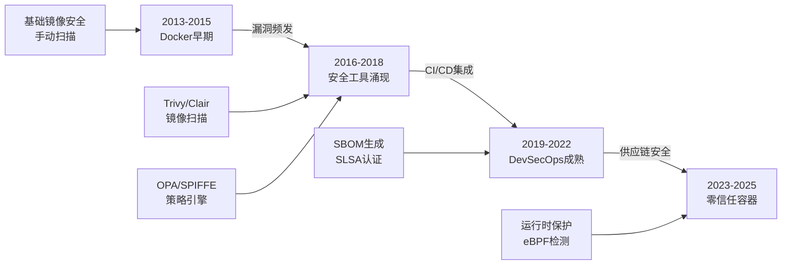
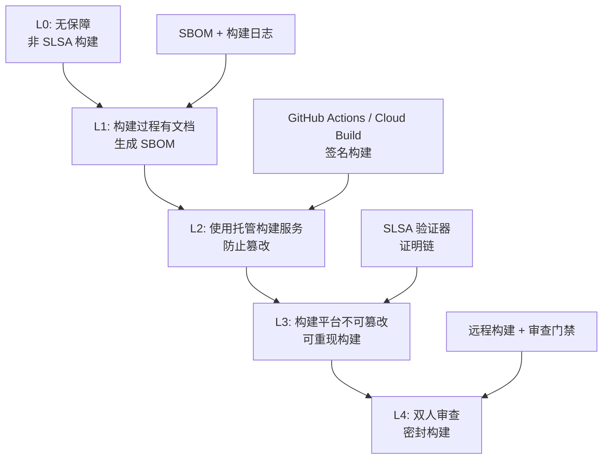
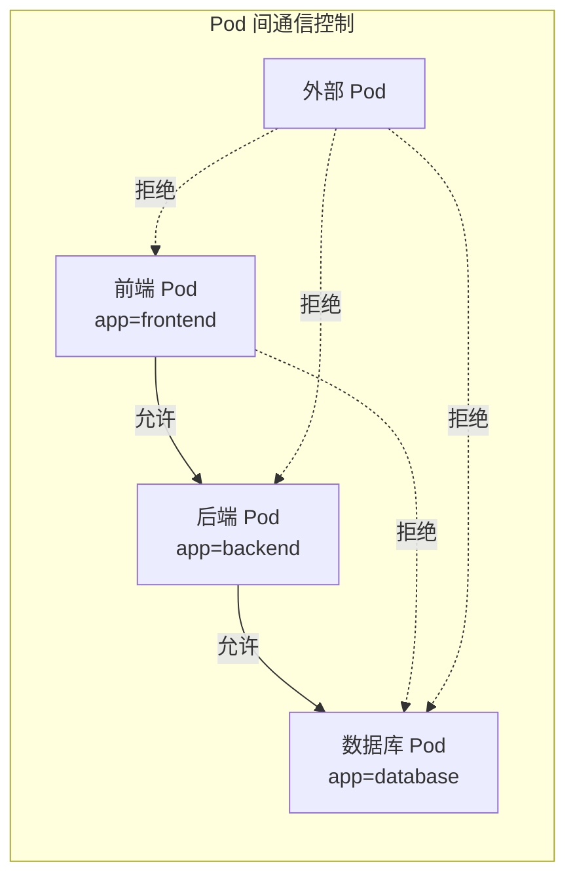
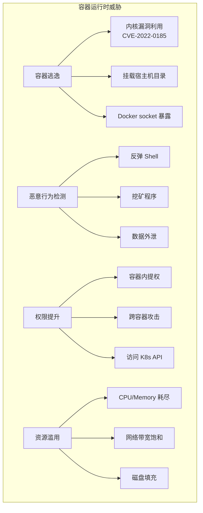
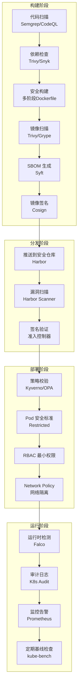

# 四、容器安全

## 1. 概述与背景

### 1.1 为什么容器安全如此重要

容器技术自 Docker 在 2013 年发布以来，彻底改变了软件交付模式。据 CNCF 2024 年度调查，全球已有超过 92% 的企业在生产环境使用容器，Kubernetes 成为容器编排的事实标准。然而，容器在带来轻量化、可移植性和快速交付优势的同时，也引入了全新的攻击面。

与传统虚拟机不同，容器共享宿主机内核，这意味着：

- **内核逃逸风险**：容器漏洞可能直接导致宿主机被攻破
- **逃逸攻击链更短**：从容器突破到控制宿主机，有时只需一步
- **大规模暴露面**：一个被攻破的镜像可能被部署到成百上千个容器中
- **供应链攻击**：恶意依赖可通过镜像层层传递

2024 年 Syrise 的研究报告显示，超过 75% 的容器镜像存在至少一个已知高危漏洞，而平均漏洞修复时间长达 126 天。这意味着大量运行中的容器长期暴露在已知攻击之下。

### 1.2 容器安全的演进



早期的容器安全主要依赖基础镜像选择和手动漏洞扫描；随着 DevOps 理念的普及，安全左移成为趋势，镜像扫描被集成到 CI/CD 流水线中；当前阶段，容器安全已演进为覆盖构建、分发、部署、运行全生命周期的纵深防御体系。

### 1.3 容器安全的核心原则

**最小权限原则（Least Privilege）**：容器及其内部进程只应拥有完成工作所需的最小权限。不必要的 root 权限、Linux capabilities、网络访问都应该被移除。

**纵深防御原则（Defense in Depth）**：不依赖单一安全措施，而是在镜像构建、分发、部署、运行的每个环节都设置安全控制点。

**不可变基础设施原则（Immutable Infrastructure）**：运行中的容器不应被修改。更新应通过部署新镜像实现，而非进入容器修改文件系统。

**零信任原则（Zero Trust）**：容器间通信、容器与外部服务的通信都应经过身份验证和授权，不因处于同一网络而默认信任。

---

## 2. 容器技术原理与安全基础

### 2.1 容器的核心技术

容器并非虚拟机，它本质上是利用 Linux 内核的隔离机制实现的进程级隔离。理解容器安全，必须先理解其底层技术。

| 技术 | 作用 | 安全影响 |
|------|------|----------|
| **Namespace** | 隔离进程视图（PID、Network、Mount 等） | 逃逸后可看到宿主机进程和资源 |
| **Cgroups** | 限制 CPU、内存、IO 等资源使用 | 未限制的容器可耗尽宿主机资源 |
| **Capabilities** | 细粒度权限控制 | 过多 capability 增大攻击面 |
| **Seccomp** | 限制容器可调用的系统调用 | 未启用时容器可调用全部 syscall |
| **AppArmor/SELinux** | 强制访问控制（MAC） | 限制容器对文件和设备的访问 |
| **OverlayFS** | 分层文件系统 | 层间权限继承可能引入隐患 |

**Namespace 隔离详解**：

Linux Namespace 提供 8 种隔离机制：

```bash
# 查看容器的 namespace 隔离情况
docker inspect --format='{{.State.Pid}}' <container_id>
# 用 nsenter 进入容器的 namespace
nsenter -t <PID> -n -p -- sh
# -n: 网络 namespace
# -p: PID namespace

# 查看容器使用的 namespace
ls -la /proc/<PID>/ns/
# lrwxrwxrwx cgroup -> 'cgroup:[4026532xxxx]'
# lrwxrwxrwx ipc -> 'ipc:[4026532xxxx]'
# lrwxrwxrwx mnt -> 'mnt:[4026532xxxx]'
# lrwxrwxrwx net -> 'net:[4026532xxxx]'
# lrwxrwxrwx pid -> 'pid:[4026532xxxx]'
# lrwxrwxrwx uts -> 'uts:[4026532xxxx]'
```

- **PID namespace**：容器只能看到自身进程，PID 1 对应容器的主进程
- **Network namespace**：容器拥有独立的网络栈、IP 地址、端口空间
- **Mount namespace**：容器有独立的文件系统挂载点
- **User namespace**：容器内的 root (UID 0) 可映射为宿主机的普通用户
- **UTS namespace**：容器可独立设置 hostname
- **IPC namespace**：隔离进程间通信资源
- **Cgroup namespace**：隔离 cgroup 视图
- **Time namespace**：隔离系统时钟

**Cgroups 资源限制**：

```bash
# 查看容器的 cgroup 限制
docker inspect --format='{{.HostConfig.Memory}}' <container_id>
# 内存限制（字节），0 表示无限制

# 通过 cgroup 文件系统查看实际限制
cat /sys/fs/cgroup/memory/docker/<container_id>/memory.limit_in_bytes

# 正确设置资源限制
docker run -d \
  --memory=512m \
  --memory-swap=512m \    # 禁止 swap
  --cpus=1.5 \             # 限制 CPU 核心数
  --pids-limit=100 \       # 限制进程数
  --device-read-bps=/dev/sda:10mb \  # 限制磁盘读速率
  --ulimit nofile=1024:1024 \       # 限制文件描述符
  nginx:alpine
```

> **安全要点**：未设置内存限制的容器可能触发 OOM Killer 影响宿主机；未限制 PID 数量的容器可能通过 fork bomb 耗尽系统资源。

### 2.2 容器与虚拟机的安全对比

| 对比维度 | 容器 | 虚拟机 |
|----------|------|--------|
| **隔离层级** | 进程级（共享内核） | 硬件级（独立内核） |
| **内核共享** | 所有容器共享宿主机内核 | 每个 VM 有独立内核 |
| **逃逸风险** | 利用内核漏洞可直接逃逸 | 需突破 Hypervisor + Guest |
| **攻击面** | 内核 syscall 接口 | Hypervisor 接口 |
| **启动速度** | 毫秒级 | 分钟级 |
| **资源开销** | 极小（无额外内核） | 较大（每个 VM 运行完整 OS） |
| **镜像大小** | 通常 10-500MB | 通常 1-10GB |
| **安全基线** | 需主动加固 | 默认较安全 |

**关键认知**：容器的安全隔离性天然弱于虚拟机。这意味着容器环境需要更主动、更全面的安全加固措施。

---

## 3. 镜像安全

### 3.1 安全基础镜像选择

镜像是容器的起点，选择安全的基础镜像是容器安全的第一道防线。

**常用基础镜像安全对比**：

| 基础镜像 | 大小 | 包管理器 | 已知漏洞 | 推荐场景 |
|----------|------|----------|----------|----------|
| `alpine:3.20` | ~7MB | apk | 极少 | 微服务、简单应用 |
| `distroless` | ~20MB | 无 | 极少 | 生产环境首选 |
| `debian:bookworm-slim` | ~80MB | apt | 较少 | 需要更多系统工具 |
| `ubuntu:24.04` | ~78MB | apt | 中等 | 开发调试 |
| `centos:stream9` | ~150MB | dnf | 中等 | 企业级应用 |
| `scratch` | 0MB | 无 | 无 | 静态编译的 Go/Rust |

**Alpine 与 Distroless 的选择策略**：

```dockerfile
# === 方案一：Alpine ===
# 适合需要 apk 包管理器的场景
FROM alpine:3.20
RUN apk add --no-cache \
    python3 \
    py3-pip \
    &amp;&amp; adduser -D -u 1000 appuser
USER appuser
ENTRYPOINT ["python3", "app.py"]

# === 方案二：Distroless ===
# 适合不需要 shell 的生产镜像（Google 推荐）
FROM gcr.io/distroless/python3-debian12:nonroot
COPY --chown=nonroot:nonroot app.py /app/
ENTRYPOINT ["python3", "/app/app.py"]

# === 方案三：多阶段构建（最佳实践）===
# 编译阶段使用完整镜像，运行阶段使用极简镜像
FROM golang:1.22 AS builder
WORKDIR /src
COPY . .
RUN CGO_ENABLED=0 go build -ldflags="-s -w" -o /app .

FROM scratch
COPY --from=builder /app /app
ENTRYPOINT ["/app"]
```

> **核心原则**：生产环境镜像应尽可能小、尽可能无 shell。Distroless 镜像没有 shell 和包管理器，攻击者即使进入容器也无法执行命令。

### 3.2 Dockerfile 安全编写规范

```dockerfile
# === 安全的 Dockerfile 示例 ===

# 1. 固定基础镜像版本（避免隐式拉取最新版）
FROM node:20.11.1-alpine3.19 AS builder

# 2. 设置构建参数（非敏感信息）
ARG NODE_ENV=production
ENV NODE_ENV=${NODE_ENV}

# 3. 设置工作目录
WORKDIR /app

# 4. 先复制依赖文件（利用 Docker 层缓存）
COPY package.json package-lock.json ./
RUN npm ci --omit=dev &amp;&amp; npm cache clean --force

# 5. 复制应用代码
COPY . .

# 6. 构建应用
RUN npm run build

# === 运行阶段 ===
FROM node:20.11.1-alpine3.19

# 7. 安装安全更新
RUN apk upgrade --no-cache

# 8. 创建非 root 用户
RUN addgroup -g 1001 -S appgroup &amp;&amp; \
    adduser -u 1001 -S appuser -G appgroup

# 9. 从构建阶段复制产物
COPY --from=builder /app/dist /app/dist
COPY --from=builder /app/node_modules /app/node_modules
COPY --from=builder /app/package.json /app/

# 10. 切换到非 root 用户
USER 1001:1001

# 11. 声明暴露端口（文档目的）
EXPOSE 3000

# 12. 设置只读文件系统提示
VOLUME ["/tmp"]

# 13. 健康检查
HEALTHCHECK --interval=30s --timeout=3s --start-period=5s --retries=3 \
    CMD wget -qO- http://localhost:3000/health || exit 1

# 14. 使用 exec 形式的 ENTRYPOINT
ENTRYPOINT ["node", "dist/server.js"]
```

**Dockerfile 安全检查清单**：

| 检查项 | 安全做法 | 风险做法 |
|--------|----------|----------|
| 基础镜像 | 固定版本 + digest | 使用 `latest` 标签 |
| 用户 | 非 root 用户运行 | 默认 root |
| COPY vs ADD | 优先使用 COPY | 使用 ADD 自动解压 |
| 依赖安装 | `npm ci --omit=dev` | `npm install` |
| 密钥管理 | BuildKit secrets | ENV 或 COPY 明文 |
| 多阶段构建 | 编译与运行分离 | 单阶段构建 |
| .dockerignore | 排除敏感文件 | 不使用，包含所有文件 |

### 3.3 镜像漏洞扫描

**Trivy（推荐的开源扫描工具）**：

```bash
# 安装 Trivy
curl -sfL https://raw.githubusercontent.com/aquasecurity/trivy/main/contrib/install.sh | sh -s -- -b /usr/local/bin

# 扫描镜像漏洞
trivy image nginx:1.25

# 只显示高危和严重漏洞
trivy image --severity HIGH,CRITICAL nginx:1.25

# 以 JSON 格式输出（适合 CI/CD 集成）
trivy image -f json -o report.json nginx:1.25

# 扫描并只显示有漏洞的包
trivy image --vuln-type os,library nginx:1.25

# 在 CI/CD 中使用（发现 CRITICAL 漏洞则失败）
trivy image --exit-code 1 --severity CRITICAL nginx:1.25
```

**扫描工具对比**：

| 工具 | 开源 | 扫描速度 | 漏洞库 | 集成能力 | 推荐场景 |
|------|------|----------|--------|----------|----------|
| Trivy | ✅ | 快 | NVD + 多源 | GitHub/GitLab/Jenkins | 通用首选 |
| Clair | ✅ | 中 | NVD + RHSA | Quay 集成 | Quay 仓库 |
| Grype | ✅ | 快 | NVD + 多源 | Syft SBOM | SBOM 工作流 |
| Snyk | 部分 | 中 | 专有库 | 多平台 | 企业级 |
| Docker Scout | ✅ | 中 | 专有库 | Docker Hub | Docker 原生 |

### 3.4 SBOM（软件物料清单）

SBOM 是容器安全的重要组成部分，它详细列出镜像中包含的所有组件和依赖，为漏洞追踪和合规审计提供基础。

```bash
# 使用 Syft 生成 SBOM
syft nginx:1.25 -o spdx-json > sbom.json

# 使用 Trivy 生成 SBOM
trivy image --format spdx-json nginx:1.25 > sbom.json

# 使用 Docker 原生生成 SBOM
docker sbom nginx:1.25
```

**SBOM 包含的关键信息**：

```json
{
  "spdxVersion": "SPDX-2.3",
  "name": "nginx:1.25",
  "packages": [
    {
      "name": "openssl",
      "version": "3.1.4",
      "supplier": "OpenSSL Project",
      "downloadLocation": "https://github.com/openssl/openssl",
      "licenseConcluded": "Apache-2.0"
    },
    {
      "name": "nginx",
      "version": "1.25.3",
      "supplier": "Nginx Inc.",
      "downloadLocation": "https://nginx.org"
    }
  ],
  "relationships": [
    {
      "spdxElementId": "nginx",
      "relationshipType": "DEPENDS_ON",
      "relatedSpdxElement": "openssl"
    }
  ]
}
```

---

## 4. 镜像仓库与供应链安全

### 4.1 镜像签名与验证

镜像签名确保你拉取的镜像确实来自可信的发布者，未被篡改。

**Cosign（Sigstore 项目的一部分）**：

```bash
# 安装 cosign
go install github.com/sigstore/cosign/v2/cmd/cosign@latest

# 生成密钥对（首次使用）
cosign generate-key-pair

# 签名镜像
cosign sign --key cosign.key myregistry.io/myapp:v1.2.3

# 验证签名
cosign verify --key cosign.pub myregistry.io/myapp:v1.2.3

# 无密钥签名（基于 OIDC 身份，适合 CI/CD）
cosign sign myregistry.io/myapp:v1.2.3
cosign verify \
  --certificate-identity=ci-pipeline@myproject.iam.gserviceaccount.com \
  --certificate-oidc-issuer=https://token.actions.githubusercontent.com \
  myregistry.io/myapp:v1.2.3
```

**使用 cosign 验证策略（结合 Kyverno）**：

```yaml
# Kyverno 策略：只允许已签名的镜像
apiVersion: kyverno.io/v1
kind: ClusterPolicy
metadata:
  name: require-image-signature
spec:
  validationFailureAction: Enforce
  background: false
  rules:
    - name: check-image-signature
      match:
        any:
          - resources:
              kinds:
                - Pod
      verifyImages:
        - imageReferences:
            - "myregistry.io/*"
          attestors:
            - entries:
                - keys:
                    publicKeys: |-
                      -----BEGIN PUBLIC KEY-----
                      MFkwEwYHKoZIzj0CAQYIKoZIzj0DAQcDQgAE...
                      -----END PUBLIC KEY-----
```

### 4.2 私有镜像仓库安全

```yaml
# Harbor 部署配置（开源企业级镜像仓库）
# docker-compose.yml 核心配置
services:
  registry:
    image: goharbor/registry-photon:v2.10.0
  
  core:
    image: goharbor/harbor-core:v2.10.0
    environment:
      # 启用漏洞扫描
      CLAIR_ENABLED: "true"
      # 启用内容信任
      CONTENT_TRUST_ENABLED: "true"
      # 强制漏洞扫描（不允许高危镜像部署）
      PROJECT_CREATION_RESTRICTION: "adminonly"
  
  trivy-adapter:
    image: goharbor/trivy-adapter-photon:v2.10.0
```

**Harbor 安全策略配置**：

| 策略 | 说明 | 推荐值 |
|------|------|--------|
| 项目创建限制 | 谁可以创建项目 | 仅管理员 |
| 镜像标签不可变 | 防止标签覆盖 | 启用 |
| 自动扫描 | 上传时自动扫描漏洞 | 启用 |
| 漏洞阻止 | 阻止部署有高危漏洞的镜像 | 高危 + 严重 |
| Webhook 通知 | 漏洞发现时通知 | 启用 |
| 垃圾回收 | 清理无用层和未引用 blob | 定期执行 |

### 4.3 供应链安全框架 SLSA

SLSA（Supply-chain Levels for Software Artifacts）是 Google 提出的供应链安全框架，定义了从源码到部署的 4 个安全等级：



---

## 5. Kubernetes 安全

### 5.1 Pod 安全标准（Pod Security Standards）

Kubernetes 1.25+ 使用 Pod Security Standards 替代了已废弃的 PodSecurityPolicy。

**三个安全级别**：

| 级别 | 权限 | 适用场景 |
|------|------|----------|
| **Privileged** | 不受限，可访问宿主机资源 | 系统级组件（如 CNI 插件） |
| **Baseline** | 最小限制，阻止已知提权 | 大多数应用工作负载 |
| **Restricted** | 严格限制，遵循安全最佳实践 | 安全敏感型应用 |

```yaml
# 为命名空间启用 Pod Security Standards
apiVersion: v1
kind: Namespace
metadata:
  name: production
  labels:
    pod-security.kubernetes.io/enforce: restricted
    pod-security.kubernetes.io/audit: restricted
    pod-security.kubernetes.io/warn: restricted
```

**Restricted 级别的 Pod 示例**：

```yaml
apiVersion: v1
kind: Pod
metadata:
  name: secure-app
  namespace: production
spec:
  # 禁止特权容器
  securityContext:
    runAsNonRoot: true
    runAsUser: 1001
    runAsGroup: 1001
    fsGroup: 1001
    seccompProfile:
      type: RuntimeDefault
  
  containers:
    - name: app
      image: myregistry.io/secure-app:v1.2.3
      securityContext:
        allowPrivilegeEscalation: false
        readOnlyRootFilesystem: true
        capabilities:
          drop:
            - ALL
        # 禁止提权
        privileged: false
      resources:
        limits:
          cpu: "500m"
          memory: "256Mi"
        requests:
          cpu: "100m"
          memory: "128Mi"
      volumeMounts:
        - name: tmp
          mountPath: /tmp
      ports:
        - containerPort: 8080
  volumes:
    - name: tmp
      emptyDir: {}
```

### 5.2 RBAC 最小权限配置

```yaml
# ServiceAccount —— 只允许读取特定 ConfigMap
apiVersion: v1
kind: ServiceAccount
metadata:
  name: app-reader
  namespace: production
automountServiceAccountToken: false  # 不自动挂载 token

---
apiVersion: rbac.authorization.k8s.io/v1
kind: Role
metadata:
  name: configmap-reader
  namespace: production
rules:
  - apiGroups: [""]
    resources: ["configmaps"]
    resourceNames: ["app-config", "feature-flags"]  # 限定具体资源
    verbs: ["get", "watch"]  # 只允许读取

---
apiVersion: rbac.authorization.k8s.io/v1
kind: RoleBinding
metadata:
  name: read-app-config
  namespace: production
subjects:
  - kind: ServiceAccount
    name: app-reader
roleRef:
  kind: Role
  name: configmap-reader
  apiGroup: rbac.authorization.k8s.io
```

**RBAC 常见错误**：

| 错误配置 | 风险 | 正确做法 |
|----------|------|----------|
| `verbs: ["*"]` | 允许所有操作 | 明确列出需要的动词 |
| `resources: ["*"]` | 允许访问所有资源 | 限定具体资源类型 |
| `apiGroups: ["*"]` | 允许所有 API 组 | 限定具体 API 组 |
| 绑定到 default SA | 所有 Pod 共享权限 | 为每个应用创建专用 SA |
| 集群级 RoleBinding | 跨命名空间权限 | 优先使用 Role（命名空间级） |

### 5.3 Network Policy（网络策略）

默认情况下，Kubernetes 集群中所有 Pod 可以互相通信。Network Policy 用于实现 Pod 间的网络隔离。

```yaml
# 默认拒绝所有入站流量
apiVersion: networking.k8s.io/v1
kind: NetworkPolicy
metadata:
  name: default-deny-ingress
  namespace: production
spec:
  podSelector: {}
  policyTypes:
    - Ingress

---
# 允许前端 Pod 访问后端 Pod
apiVersion: networking.k8s.io/v1
kind: NetworkPolicy
metadata:
  name: allow-frontend-to-backend
  namespace: production
spec:
  podSelector:
    matchLabels:
      app: backend
  policyTypes:
    - Ingress
  ingress:
    - from:
        - podSelector:
            matchLabels:
              app: frontend
      ports:
        - port: 8080
          protocol: TCP

---
# 允许后端 Pod 访问数据库
apiVersion: networking.k8s.io/v1
kind: NetworkPolicy
metadata:
  name: allow-backend-to-db
  namespace: production
spec:
  podSelector:
    matchLabels:
      app: database
  policyTypes:
    - Ingress
  ingress:
    - from:
        - podSelector:
            matchLabels:
              app: backend
      ports:
        - port: 5432
          protocol: TCP
```



### 5.4 安全上下文约束（PSC）

```yaml
# Pod Security Context 最佳实践
apiVersion: v1
kind: Pod
metadata:
  name: hardened-pod
spec:
  securityContext:
    # 以非 root 用户运行
    runAsNonRoot: true
    runAsUser: 65534    # nobody 用户
    runAsGroup: 65534
    fsGroup: 65534
    # seccomp: 限制系统调用
    seccompProfile:
      type: RuntimeDefault
  
  containers:
    - name: app
      image: myregistry.io/app:v1
      securityContext:
        # 禁止提权
        allowPrivilegeEscalation: false
        # 只读根文件系统
        readOnlyRootFilesystem: true
        # 禁止特权模式
        privileged: false
        # 移除所有 capabilities
        capabilities:
          drop: ["ALL"]
          # 如需特定 capability，逐个添加
          # add: ["NET_BIND_SERVICE"]
      
      # 只挂载必要的卷
      volumeMounts:
        - name: tmp
          mountPath: /tmp
        - name: app-data
          mountPath: /app/data
      
      # 资源限制
      resources:
        requests:
          cpu: "100m"
          memory: "128Mi"
        limits:
          cpu: "500m"
          memory: "512Mi"
      
      # 禁止通过环境变量传递敏感信息
      # 使用 Secret 挂载代替
      
      # 启动探针（防止容器启动失败后无限重启）
      startupProbe:
        httpGet:
          path: /healthz
          port: 8080
        failureThreshold: 30
        periodSeconds: 2
  
  volumes:
    - name: tmp
      emptyDir:
        medium: Memory   # 内存盘，更快
        sizeLimit: "64Mi"
    - name: app-data
      emptyDir: {}
```

---

## 6. 运行时安全

### 6.1 运行时威胁模型

容器运行时面临的主要安全威胁：



### 6.2 容器逃逸防御

**常见逃逸向量与防御**：

```bash
# 危险：挂载 Docker socket
# 攻击者可通过 socket 在宿主机上创建特权容器，实现逃逸
docker run -v /var/run/docker.sock:/var/run/docker.sock alpine
# 防御：永远不要挂载 Docker socket（除 CI/CD 构建器外）

# 危险：特权容器 + 挂载宿主机文件系统
docker run --privileged -v /:/host alpine
# 攻击者可直接读写宿主机所有文件

# 危险：CAP_SYS_ADMIN capability
docker run --cap-add SYS_ADMIN alpine
# 可用于挂载宿主机文件系统

# 安全检查脚本
#!/bin/bash
echo "=== 容器安全检查 ==="
for cid in $(docker ps -q); do
    name=$(docker inspect --format='{{.Name}}' $cid)
    echo "--- $name ---"
    
    # 检查是否为特权容器
    privileged=$(docker inspect --format='{{.HostConfig.Privileged}}' $cid)
    [ "$privileged" = "true" ] &amp;&amp; echo "  ⚠️  警告: 特权容器!"
    
    # 检查是否为 root 用户运行
    user=$(docker inspect --format='{{.Config.User}}' $cid)
    [ -z "$user" ] &amp;&amp; echo "  ⚠️  警告: 以 root 用户运行!"
    
    # 检查是否挂载 Docker socket
    mounts=$(docker inspect --format='{{range .Mounts}}{{.Source}}:{{.Destination}} {{end}}' $cid)
    echo "$mounts" | grep -q "docker.sock" &amp;&amp; echo "  ⚠️  警告: Docker socket 已挂载!"
    
    # 检查是否挂载敏感路径
    echo "$mounts" | grep -qE "(/etc|/proc|/sys|/var/run)" &amp;&amp; echo "  ⚠️  警告: 敏感路径已挂载!"
    
    # 检查网络模式
    network=$(docker inspect --format='{{.HostConfig.NetworkMode}}' $cid)
    [ "$network" = "host" ] &amp;&amp; echo "  ⚠️  警告: 使用 host 网络模式!"
    
    # 检查 capabilities
    caps=$(docker inspect --format='{{.HostConfig.CapAdd}}' $cid)
    [ "$caps" != "[]" ] &amp;&amp; [ "$caps" != "<nil>" ] &amp;&amp; echo "  ⚠️  警告: 额外 capabilities: $caps"
done
```

### 6.3 运行时检测工具

**Falco（CNCF 开源运行时检测）**：

```yaml
# Falco 自定义规则示例
- rule: Detect Crypto Mining
  desc: 检测加密货币挖矿行为
  condition: >
    spawned_process and container and
    proc.name in (xmrig, minerd, minergate, cpuminer, cgminer, bfgminer)
  output: >
    检测到挖矿进程 (user=%user.name command=%proc.cmdline container=%container.name
    image=%container.image.repository)
  priority: CRITICAL

- rule: Detect Reverse Shell
  desc: 检测反弹 Shell
  condition: >
    spawned_process and container and
    (proc.name in (bash, sh, zsh, python, perl, ruby, php) and
     proc.cmdline contains "bash -i" or
     proc.cmdline contains "/dev/tcp/" or
     proc.cmdline contains "nc -e" or
     proc.cmdline contains "ncat")
  output: >
    可能的反弹 Shell (user=%user.name command=%proc.cmdline container=%container.name)
  priority: CRITICAL

- rule: Sensitive File Read in Container
  desc: 检测容器内读取敏感文件
  condition: >
    open_read and container and
    (fd.name startswith /etc/shadow or
     fd.name startswith /etc/passwd or
     fd.name startswith /proc/self/environ)
  output: >
    容器内读取敏感文件 (file=%fd.name container=%container.name command=%proc.cmdline)
  priority: WARNING
```

**部署 Falco**：

```bash
# 使用 Helm 安装 Falco
helm repo add falcosecurity https://falcosecurity.github.io/charts
helm repo update

helm install falco falcosecurity/falco \
  --namespace falco \
  --create-namespace \
  --set falcosidekick.enabled=true \
  --set falcosidekick.config.slack.webhookurl="https://hooks.slack.com/xxx"
```

---

## 7. 容器安全扫描自动化

### 7.1 CI/CD 安全集成

```yaml
# GitHub Actions 安全流水线
name: Container Security Pipeline

on:
  push:
    branches: [main]
  pull_request:
    branches: [main]

jobs:
  security-scan:
    runs-on: ubuntu-latest
    steps:
      - uses: actions/checkout@v4

      # 构建镜像
      - name: Build Docker Image
        run: docker build -t myapp:${{ github.sha }} .

      # 镜像漏洞扫描
      - name: Trivy Vulnerability Scan
        uses: aquasecurity/trivy-action@master
        with:
          image-ref: myapp:${{ github.sha }}
          format: sarif
          output: trivy-results.sarif
          severity: CRITICAL,HIGH
          exit-code: "1"  # 发现高危漏洞则失败

      # 镜像配置检查
      - name: Dockle Security Lint
        uses: goodwithtech/dockle-action@main
        with:
          image: myapp:${{ github.sha }}
          exit-code: "1"
          exit-level: warn

      # SBOM 生成
      - name: Generate SBOM
        uses: anchore/sbom-action@v0
        with:
          image: myapp:${{ github.sha }}
          format: spdx-json

      # 镜像签名（需要 Cosign 密钥）
      - name: Sign Image
        if: github.ref == 'refs/heads/main'
        run: |
          echo "${{ secrets.COSIGN_KEY }}" > cosign.key
          cosign sign --key cosign.key myapp:${{ github.sha }}

      # 推送镜像到私有仓库
      - name: Push Image
        if: github.ref == 'refs/heads/main'
        run: |
          docker tag myapp:${{ github.sha }} myregistry.io/myapp:${{ github.sha }}
          docker push myregistry.io/myapp:${{ github.sha }}
```

### 7.2 OPA/Gatekeeper 策略即代码

```yaml
# Gatekeeper 约束模板：只允许使用已批准的基础镜像
apiVersion: templates.gatekeeper.sh/v1
kind: ConstraintTemplate
metadata:
  name: k8sallowedregistries
spec:
  crd:
    spec:
      names:
        kind: K8sAllowedRegistries
      validation:
        openAPIV3Schema:
          type: object
          properties:
            registries:
              type: array
              items:
                type: string
  targets:
    - target: admission.k8s.gatekeeper.sh
      rego: |
        package k8sallowedregistries
        
        violation[{"msg": msg}] {
          container := input.review.object.spec.containers[_]
          not startswith(container.image, input.parameters.registries[_])
          msg := sprintf("容器 '%v' 使用了未批准的镜像仓库: %v", [container.name, container.image])
        }

        violation[{"msg": msg}] {
          container := input.review.object.spec.initContainers[_]
          not startswith(container.image, input.parameters.registries[_])
          msg := sprintf("初始化容器 '%v' 使用了未批准的镜像仓库: %v", [container.name, container.image])
        }

---
# 约束实例
apiVersion: constraints.gatekeeper.sh/v1beta1
kind: K8sAllowedRegistries
metadata:
  name: require-approved-registries
spec:
  enforcementAction: deny
  match:
    kinds:
      - apiGroups: [""]
        kinds: ["Pod"]
    namespaces: ["production", "staging"]
  parameters:
    registries:
      - "myregistry.io/"
      - "gcr.io/myproject/"
      - "docker.io/library/"
```

### 7.3 Kubebench（CIS 基线检查）

```bash
# 使用 kube-bench 检查 Kubernetes 安全基线
# CIS Benchmark 覆盖：API Server、Controller Manager、Scheduler、etcd、节点安全

# 在 Kubernetes 集群中运行
kubectl run kube-bench --image=aquasec/kube-bench:latest --rm -it -- \
    kube-bench run --targets master,node,policies

# 本地检查
kube-bench run --targets master
kube-bench run --targets node
kube-bench run --targets policies  # Pod 安全策略检查
```

---

## 8. 供应链攻击防御

### 8.1 典型供应链攻击案例

**案例一：恶意基础镜像**

2020 年发现多个 Docker Hub 上的恶意镜像，伪装成常用的 `python`、`nginx` 镜像，内含挖矿程序。受害者拉取后，容器自动开始挖矿，消耗 CPU 资源。

**防御措施**：
- 只从官方或经过验证的镜像仓库拉取
- 使用镜像签名验证来源
- 定期扫描已部署的镜像

**案例二：依赖混淆攻击（Dependency Confusion）**

2021 年安全研究员 Alex Birsan 通过在公共包管理器发布与企业内部包同名的恶意包，成功入侵了 Apple、Microsoft、PayPal 等公司的构建系统。

**防御措施**：
- 使用 namespace/package scope（如 `@myorg/pkg-name`）
- 私有包优先从内部仓库解析
- 在 CI/CD 中验证依赖来源

**案例三：构建过程投毒**

攻击者篡改 CI/CD 配置，在构建过程中注入后门代码。由于构建产物直接被部署到生产环境，后门代码随之上线。

**防御措施**：
- 保护 CI/CD 配置文件的访问权限
- 使用构建过程签名（SLSA L3+）
- 启用构建日志审计

### 8.2 编排器安全加固

```yaml
# Kubernetes API Server 安全配置
# /etc/kubernetes/manifests/kube-apiserver.yaml 安全参数
apiVersion: v1
kind: Pod
metadata:
  name: kube-apiserver
spec:
  containers:
    - name: kube-apiserver
      command:
        - kube-apiserver
        # 禁用匿名认证
        - --anonymous-auth=false
        # 禁用基本认证（使用证书认证）
        - --basic-auth-file=""
        # 启用审计日志
        - --audit-log-path=/var/log/kubernetes/audit.log
        - --audit-log-maxage=30
        - --audit-log-maxbackup=10
        - --audit-log-maxsize=100
        # 加密 etcd 数据
        - --encryption-provider-config=/etc/kubernetes/encryption-config.yaml
        # 限制 API 速率
        - --max-requests-inflight=400
        - --max-mutating-requests-inflight=200
        # 启用准入控制器
        - --enable-admission-plugins=NodeRestriction,PodSecurity
        # 禁用 insecure 端口
        - --secure-port=6443
```

**etcd 数据加密配置**：

```yaml
# /etc/kubernetes/encryption-config.yaml
apiVersion: apiserver.config.k8s.io/v1
kind: EncryptionConfiguration
resources:
  - resources:
      - secrets
    providers:
      - aescbc:
          keys:
            - name: key1
              secret: <base64-encoded-32-byte-key>
      - identity: {}  # 用于读取未加密的旧数据
```

---

## 9. 常见误区与纠正

### 误区一："容器是隔离的，所以是安全的"

**事实**：容器的隔离性远弱于虚拟机。所有容器共享宿主机内核，内核漏洞可导致逃逸。

**纠正**：将容器视为"受限的进程"而非"轻量虚拟机"。采用纵深防御策略，在每个层面都设置安全控制。

### 误区二："使用非 root 用户运行就够了"

**事实**：非 root 用户只是最小权限的一部分。还需考虑 capabilities、seccomp、AppArmor、网络策略等。

**纠正**：非 root + 无 capabilities + seccomp + 只读文件系统 + 资源限制 = 完整的运行时安全配置。

### 误区三："镜像扫描通过了就是安全的"

**事实**：镜像扫描只能发现已知漏洞。零日漏洞、配置错误、业务逻辑缺陷无法通过扫描发现。

**纠正**：扫描是必要的但不充分的。还需要运行时检测、网络策略、RBAC、监控告警等多层防护。

### 误区四："只在开发环境考虑安全"

**事实**：安全左移是现代安全的核心理念。越早发现问题，修复成本越低。

**纠正**：在 CI/CD 中集成安全扫描，在 PR 阶段就阻止不安全的代码合并。

---

## 10. 容器安全工具生态

### 10.1 工具选型指南

| 安全领域 | 开源工具 | 商业工具 | 推荐 |
|----------|----------|----------|------|
| **镜像扫描** | Trivy, Grype, Clair | Snyk, Prisma Cloud | Trivy（通用） |
| **配置检查** | Dockle, Hadolint | Checkov | Trivy + Hadolint |
| **运行时检测** | Falco, Tracee, Sysdig | Aqua Runtime Protection | Falco（CNCF 标准） |
| **策略引擎** | OPA/Gatekeeper, Kyverno | - | Kyverno（K8s 原生） |
| **网络策略** | Calico, Cilium, Weave | - | Cilium（eBPF 性能优） |
| **SBOM** | Syft, SPDX | - | Syft |
| **签名验证** | Cosign, Notary | - | Cosign（Sigstore 生态） |
| **基线检查** | kube-bench, kube-hunter | - | kube-bench（CIS 标准） |
| **镜像仓库** | Harbor, ECR | ACR, GCR | Harbor（私有部署） |

### 10.2 端到端安全流程



---

## 11. 实战：企业级容器安全基线

### 11.1 Docker 守护进程安全配置

```json
// /etc/docker/daemon.json
{
  "icc": false,                    // 禁止容器间直接通信
  "no-new-privileges": true,       // 禁止容器获取新特权
  "userns-remap": "default",       // 启用 User Namespace
  "live-restore": true,            // 守护进程重启时保持容器运行
  "log-driver": "json-file",
  "log-opts": {
    "max-size": "10m",
    "max-file": "3"
  },
  "storage-driver": "overlay2",
  "default-ulimits": {
    "nofile": { "Name": "nofile", "Hard": 65535, "Soft": 65535 },
    "nproc": { "Name": "nproc", "Hard": 4096, "Soft": 4096 }
  },
  "seccomp-profile": "/etc/docker/seccomp-default.json",
  "default-cgroupns-mode": "private"
}
```

### 11.2 Docker Bench 自动化检查

```bash
# 运行 Docker Bench Security（基于 CIS Docker Benchmark）
docker run --rm --net host --pid host --userns host --cap-add audit_control \
    -e DOCKER_CONTENT_TRUST=$DOCKER_CONTENT_TRUST \
    -v /var/lib:/var/lib:ro \
    -v /var/run/docker.sock:/var/run/docker.sock:ro \
    -v /etc:/etc:ro \
    --label docker_bench_security \
    docker/docker-bench-security
```

### 11.3 Kubernetes 安全审计配置

```yaml
# Kubernetes 审计策略
apiVersion: audit.k8s.io/v1
kind: Policy
rules:
  # 不记录健康检查和监控指标请求
  - level: None
    nonResourceURLs:
      - /healthz*
      - /version
      - /metrics

  # Pod 创建/删除 —— 高敏感操作
  - level: Metadata
    resources:
      - group: ""
        resources: ["pods"]
    verbs: ["create", "delete", "deletecollection"]

  # Secret 访问 —— 最高敏感级别
  - level: RequestResponse
    resources:
      - group: ""
        resources: ["secrets"]
    verbs: ["get", "create", "update", "patch"]

  # RBAC 变更 —— 高敏感操作
  - level: RequestResponse
    resources:
      - group: "rbac.authorization.k8s.io"
        resources: ["roles", "rolebindings", "clusterroles", "clusterrolebindings"]
    verbs: ["create", "update", "patch", "delete"]

  # 其他操作记录元数据
  - level: Metadata
    omitStages:
      - "RequestReceived"
```

---

## 12. 容器安全进阶

### 12.1 eBPF 驱动的安全监控

Cilium 利用 eBPF 技术实现了高性能的网络策略和运行时监控，是 Kubernetes 安全网络的事实标准。

```yaml
# Cilium NetworkPolicy —— 基于 L7 的细粒度控制
apiVersion: cilium.io/v2
kind: CiliumNetworkPolicy
metadata:
  name: l7-policy
spec:
  endpointSelector:
    matchLabels:
      app: backend
  ingress:
    - fromEndpoints:
        - matchLabels:
            app: frontend
      toPorts:
        - ports:
            - port: "8080"
              protocol: TCP
          rules:
            http:
              - method: GET
                path: "/api/.*"
              - method: POST
                path: "/api/data"
                headers:
                  - 'Content-Type: application/json'
```

### 12.2 机密信息管理

```yaml
# 使用 External Secrets Operator 从外部密钥管理器同步
apiVersion: external-secrets.io/v1beta1
kind: ExternalSecret
metadata:
  name: app-secrets
  namespace: production
spec:
  refreshInterval: 1h
  secretStoreRef:
    name: vault-backend
    kind: SecretStore
  target:
    name: app-credentials
  data:
    - secretKey: db-password
      remoteRef:
        key: secret/data/production/db
        property: password
    - secretKey: api-key
      remoteRef:
        key: secret/data/production/api
        property: key

---
# 不要在 Pod 中使用 env 传递 Secret
# 使用 Volume 挂载（更安全）
apiVersion: v1
kind: Pod
spec:
  containers:
    - name: app
      env:
        # ❌ 不安全：Secret 会出现在 Pod spec 和日志中
        # - name: DB_PASSWORD
        #   valueFrom:
        #     secretKeyRef: { name: db-creds, key: password }
      
      volumeMounts:
        # ✅ 安全：Secret 挂载为文件，不暴露在 Pod spec
        - name: db-creds
          mountPath: /etc/secrets
          readOnly: true
          subPath: password
  volumes:
    - name: db-creds
      secret:
        secretName: db-creds
```

### 12.3 容器安全成熟度模型

| 成熟度等级 | 能力 | 关键措施 |
|------------|------|----------|
| **L1: 基础** | 镜像安全 | 基础镜像选择、漏洞扫描、非 root 运行 |
| **L2: 标准** | 构建安全 | CI/CD 安全集成、SBOM、Dockerfile 规范 |
| **L3: 高级** | 运行时安全 | Falco 运行时检测、网络策略、PSS enforced |
| **L4: 卓越** | 供应链安全 | 镜像签名、SLSA L3+、eBPF 监控、审计分析 |

---

## 13. 本节小结

容器安全是一个贯穿软件全生命周期的系统工程。核心要点：

1. **镜像安全是起点**：选择最小化基础镜像、编写安全的 Dockerfile、扫描漏洞、生成 SBOM、签名验证
2. **编排器安全是基础**：Pod Security Standards、最小化 RBAC、Network Policy、审计日志
3. **运行时安全是防线**：非 root 运行、capabilities 限制、seccomp、运行时检测（Falco）
4. **供应链安全是全局**：从源码到部署的每个环节都需要信任验证（SLSA + Cosign）
5. **自动化是关键**：安全检查必须集成到 CI/CD 中，人工审查无法规模化

容器安全不是一次性的工作，而是一个持续改进的过程。从基础的镜像扫描和非 root 运行开始，逐步推进到运行时检测和供应链安全，最终建立完整的纵深防御体系。
