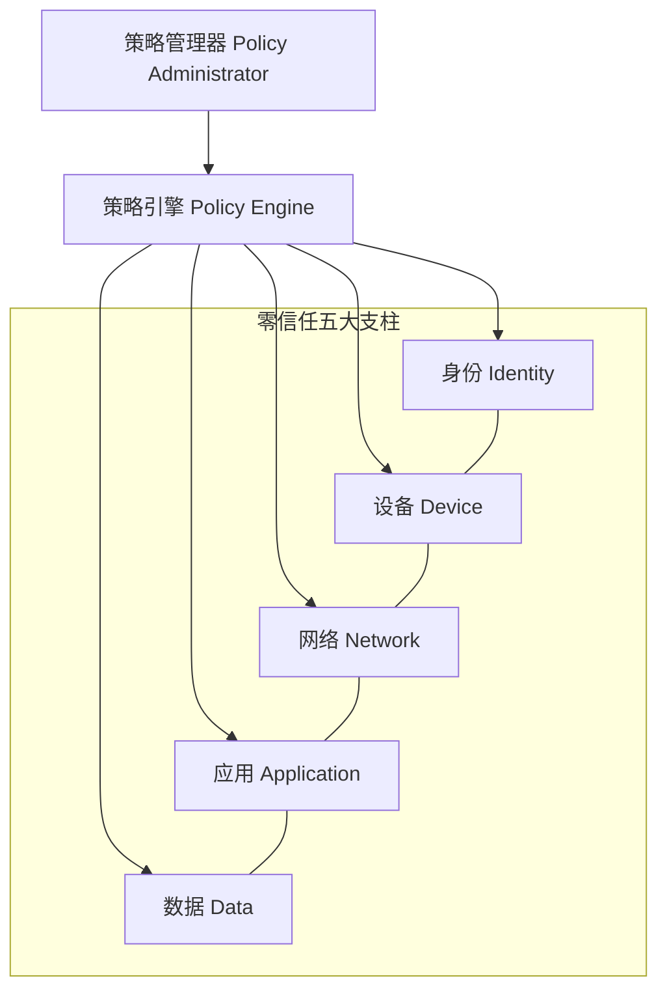
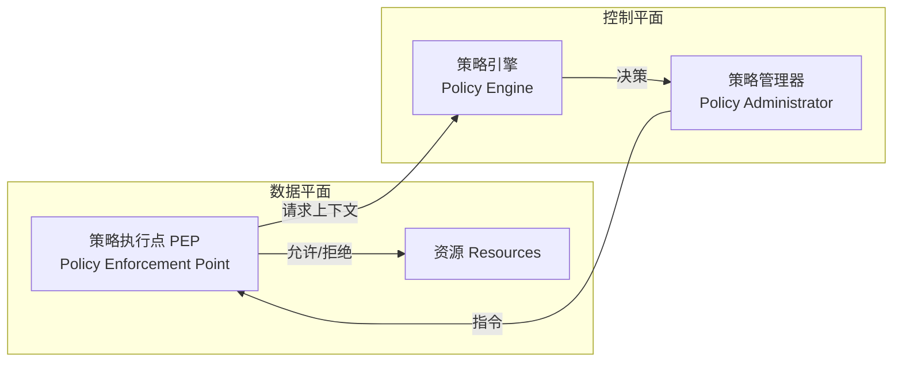
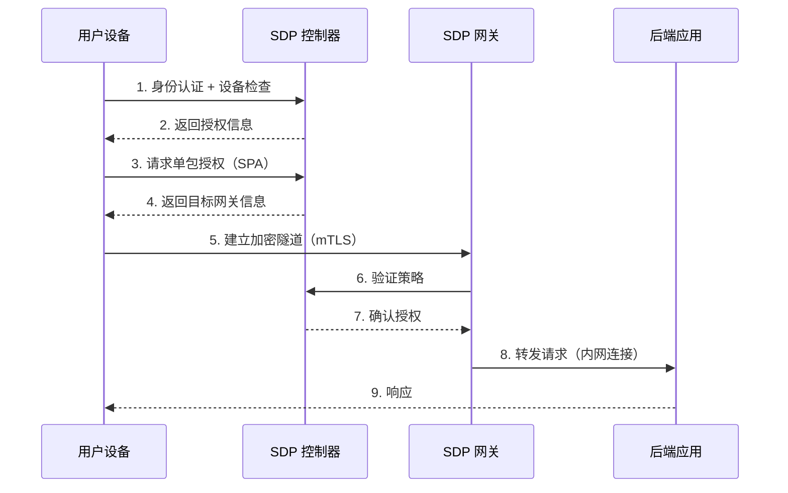
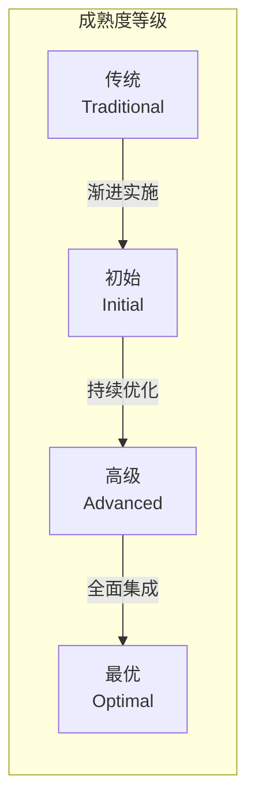
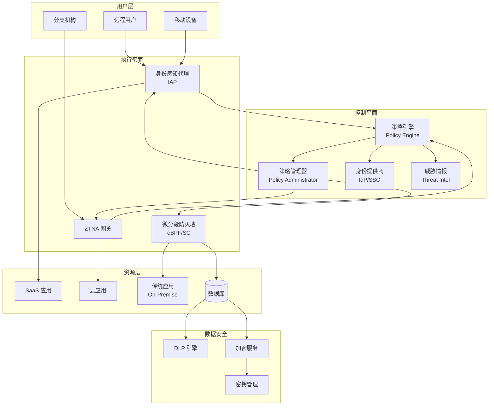

## 零信任架构

### 1. 概述与背景

#### 1.1 什么是零信任架构

零信任架构（Zero Trust Architecture, ZTA）是一种以"永不信任，始终验证"（Never Trust, Always Verify）为核心原则的安全框架。它摒弃了传统安全模型中"内网可信、外网不可信"的二元划分，要求对每一次访问请求——无论来自网络内部还是外部——都进行身份验证、授权和持续评估。

零信任的核心思想可以概括为三条：

- **永不信任**：任何用户、设备、网络都不被默认信任，即使是企业内部员工和内网设备
- **始终验证**：每次访问都需要经过身份认证和授权检查，并基于上下文（设备状态、位置、行为模式）动态调整权限
- **假设已被攻破**：安全设计的前提是攻击者可能已经在网络内部，因此需要最小化爆炸半径（Blast Radius）

#### 1.2 历史演进

零信任架构的诞生源于对传统"城堡护城河"（Castle-and-Moat）安全模型失败的反思。

| 时间 | 里程碑 | 意义 |
|------|--------|------|
| 2004 | Jericho Forum 提出去边界化（De-perimeterization）概念 | 首次质疑网络边界的可靠性 |
| 2010 | Forrester 分析师 John Kindervag 提出"Zero Trust"术语 | 零信任概念正式诞生 |
| 2011 | Google 启动 BeyondCorp 项目 | 大规模零信任实践的先驱 |
| 2014 | NIST 发布 SP 800-207 草案 | 零信任获得权威标准化定义 |
| 2020 | 美国总统行政令 14028 要求联邦机构采用零信任 | 零信任成为国家级安全战略 |
| 2021 | NIST 正式发布 SP 800-207 | 零信任架构的权威参考框架 |
| 2022 | CISA 发布零信任成熟度模型 | 提供渐进式实施路径 |
| 2023-2025 | SASE/SSE 架构融合零信任成为主流 | 零信任从理念走向标准化产品 |

#### 1.3 为什么需要零信任

传统安全模型面临以下根本性挑战：

**挑战一：边界消融**
云计算、移动办公、BYOD（自带设备）、远程办公使得传统的网络边界变得模糊。员工可能在家、咖啡厅、酒店等任何地方访问企业资源，VPN 不再是可靠的安全边界。

**挑战二：内部威胁**
Verizon《数据泄露调查报告》（DBIR）连续多年数据显示，超过 30% 的数据泄露涉及内部威胁或合法凭据被盗用。攻击者一旦获得合法凭据，传统边界安全形同虚设。

**挑战三：横向移动**
传统网络一旦被突破，攻击者可以在内网自由横向移动。2013 年 Target 数据泄露事件中，攻击者通过 HVAC 供应商的凭据渗透内网，最终导致 4000 万张信用卡信息泄露。

**挑战四：合规驱动**
GDPR、等保 2.0、PCI DSS、HIPAA 等法规对数据保护提出了更严格的要求，零信任架构提供了一种系统化的合规实现路径。

### 2. 核心原理与原则

#### 2.1 NIST 零信任原则

NIST SP 800-207 定义了零信任架构的三大核心原则：

**原则一：所有数据源和计算服务都被视为资源**
无论是在本地数据中心、云环境还是 SaaS 平台，所有系统都被统一视为需要保护的资源。安全策略不再因部署位置不同而区别对待。

**原则二：无论网络位置如何，所有通信都被视为不安全**
不因请求来自内网就降低安全要求。所有通信都必须加密，所有访问都必须验证。内网和外网采用相同的安全标准。

**原则三：对单次会话的访问授予最小权限**
每次访问仅授予完成当前任务所需的最小权限。权限是临时的、有范围的，并在会话结束后自动回收。

#### 2.2 零信任的五大支柱

零信任架构涵盖五大安全支柱，每个支柱都是一个独立的安全域，同时需要协同工作：



**支柱一：身份（Identity）**
身份是零信任的首要控制点。每次访问请求都必须经过强身份认证（Strong Authentication），通常要求多因素认证（MFA）。身份验证需要考虑：

- 用户身份：通过 IAM（身份和访问管理）系统验证
- 服务身份：通过证书、SPIFFE/SPIRE 或 OAuth 2.0 客户端凭据验证
- 设备身份：通过设备证书、MDM（移动设备管理）注册状态验证
- 身份生命周期管理：创建、认证、授权、审计、撤销的完整闭环

**支柱二：设备（Device）**
设备健康状态是访问决策的重要上下文因素。零信任要求对所有访问设备进行合规检查：

- 设备是否已注册并处于管理状态
- 操作系统版本和补丁是否最新
- 是否安装了必要的安全软件（EDR、DLP）
- 设备是否有越狱/Root 等风险行为
- 设备的网络环境（是否在高风险网络中）

**支柱三：网络（Network）**
零信任网络采用微分段（Micro-segmentation）策略，将大平面网络划分为细粒度的安全区域：

- 东西向流量（服务器间通信）与南北向流量（用户到服务器）同等对待
- 每个工作负载独立的防火墙策略
- 基于身份而非 IP 地址的访问控制
- 所有流量加密（mTLS/IPSec）

**支柱四：应用（Application）**
应用层安全需要保护应用本身的运行时安全和 API 安全：

- 应用级别的访问控制（不同于网络层）
- API 网关实施认证、授权、限流
- 运行时应用自保护（RASP）
- 安全编码实践和依赖项扫描

**支柱五：数据（Data）**
数据是最终需要保护的核心资产：

- 数据分类分级（公开、内部、机密、绝密）
- 数据加密（传输中 + 静态）
- 数据丢失防护（DLP）
- 数据访问审计和异常检测
- 数据脱敏和标记化

#### 2.3 控制平面与数据平面

NIST SP 800-207 将零信任架构抽象为三个关键逻辑组件：



**策略执行点（PEP）**：位于资源前方的网关或代理，负责拦截所有访问请求，将上下文信息发送给策略引擎，并执行策略引擎的决策（允许、拒绝或要求额外验证）。

**策略引擎（PE）**：零信任的"大脑"，基于多维度上下文信息（身份、设备状态、行为风险、数据敏感度等）做出访问决策。策略引擎通常结合：

- 信任评分算法（Trust Score）
- 风险自适应引擎（Risk-based Authentication）
- 机器学习异常检测
- 威胁情报集成

**策略管理器（PA）**：将策略引擎的决策转化为具体的访问控制指令，例如签发短期访问令牌、配置防火墙规则、建立 mTLS 连接等。

### 3. 核心技术与实现

#### 3.1 身份认证与访问控制

零信任架构对身份认证的要求远超传统 IAM 系统：

**强认证（Strong Authentication）**

多因素认证（MFA）是零信任的基线要求。理想情况下应采用无密码认证（Passwordless Authentication）：

| 认证因素 | 传统方式 | 零信任推荐 | 安全等级 |
|----------|----------|------------|----------|
| 知识因素 | 密码 | 无密码（FIDO2） | 低 → 高 |
| 持有因素 | 硬件令牌 | 手机推送/Passkey | 中 → 高 |
| 生物因素 | 指纹/人脸 | WebAuthn 生物识别 | 高 |
| 上下文因素 | IP 白名单 | 行为分析+风险评分 | 动态 |

**持续自适应风险评估（CRAA）**

零信任不仅在登录时验证，还在整个会话期间持续评估风险：

```python
class ZeroTrustAccessController:
    """零信任访问控制器 - 持续自适应风险评估"""

    def __init__(self, policy_engine, threat_intel, ml_detector):
        self.policy_engine = policy_engine
        self.threat_intel = threat_intel
        self.ml_detector = ml_detector

    def evaluate_access(self, request_context):
        """评估访问请求的综合风险"""
        # 1. 基础身份验证
        identity_score = self.verify_identity(request_context)

        # 2. 设备合规检查
        device_score = self.check_device_compliance(request_context.device)

        # 3. 网络环境评估
        network_score = self.assess_network_risk(request_context.network)

        # 4. 行为分析（基线对比）
        behavior_score = self.ml_detector.analyze_behavior(
            user_id=request_context.user_id,
            current_action=request_context.action,
            historical_baseline=self.get_baseline(request_context.user_id)
        )

        # 5. 威胁情报查询
        threat_score = self.threat_intel.check(
            ip=request_context.source_ip,
            device_fingerprint=request_context.device.fingerprint
        )

        # 6. 综合信任评分
        trust_score = self.calculate_trust_score(
            identity=identity_score,
            device=device_score,
            network=network_score,
            behavior=behavior_score,
            threat=threat_score
        )

        # 7. 基于信任评分决定访问策略
        decision = self.policy_engine.decide(
            trust_score=trust_score,
            resource_sensitivity=request_context.resource.sensitivity_level,
            action=request_context.action
        )

        return AccessDecision(
            allowed=decision.allow,
            trust_score=trust_score,
            required_steps=decision.step_up_auth,  # 可能要求额外验证
            session_ttl=decision.session_lifetime,
            audit_log=self.generate_audit_log(request_context, decision)
        )

    def check_device_compliance(self, device):
        """设备合规性检查"""
        checks = {
            'registered': device.is_registered,
            'os_patched': device.os_version >= self.min_os_version,
            'edr_active': device.edr_status == 'active',
            'disk_encrypted': device.disk_encryption_enabled,
            'not_jailbroken': not device.is_jailbroken,
            'certificate_valid': self.verify_device_cert(device.cert),
        }
        return sum(checks.values()) / len(checks)

    def calculate_trust_score(self, **scores):
        """加权计算综合信任评分 (0-100)"""
        weights = {
            'identity': 0.35,    # 身份权重最高
            'device': 0.20,
            'network': 0.15,
            'behavior': 0.20,
            'threat': 0.10,
        }
        total = sum(scores[k] * weights[k] for k in weights)
        return min(100, max(0, total * 100))
```

**最小权限原则（Principle of Least Privilege）**

零信任要求实施极其严格的最小权限策略：

- Just-In-Time（JIT）权限：权限按需申请，使用后立即回收
- Just-Enough-Access（JEA）：仅授予完成特定任务所需的最小权限集
- 时间限制：所有权限都有明确的过期时间
- 范围限制：权限绑定到特定资源、特定操作、特定时间窗口

#### 3.2 微分段（Micro-segmentation）

微分段是零信任网络层的核心技术，将传统的大平面网络分割成细粒度的安全区域：

**传统分段 vs 微分段**

| 维度 | 传统网络分段 | 微分段 |
|------|------------|--------|
| 粒度 | 子网/VLAN 级别 | 单个工作负载/容器级别 |
| 管理方式 | 基于网络拓扑静态配置 | 基于身份和策略动态配置 |
| 东西向流量 | 通常不控制 | 严格控制每一对工作负载间的通信 |
| 部署模型 | 硬件防火墙 | 软件定义（主机/容器防火墙） |
| 适应性 | 变更慢，需要重新规划网络 | 随应用自动调整，支持 DevOps |

**微分段实现方案**

```mermaid
graph TB
    subgraph 传统平面网络
        A1[Web Server] --- B1[App Server]
        A1 --- C1[DB Server]
        B1 --- C1
        B1 --- D1[Cache Server]
        C1 --- D1
        D1 -.->|任何流量都放行| A1
    end

    subgraph 微分段网络
        A2[Web Server]
        B2[App Server]
        C2[DB Server]
        D2[Cache Server]

        A2 -->|HTTPS:443 only| B2
        B2 -->|TCP:3306 only| C2
        B2 -->|TCP:6379 only| D2
        C2 -.x|BLOCKED| A2
        D2 -.x|BLOCKED| A2
    end
```

主流微分段实现方案包括：

- **主机层**：iptables/nftables 规则 + 安全组（适用于传统 VM）
- **容器层**：Kubernetes NetworkPolicy + Cilium（eBPF）/Calico
- **云原生**：云厂商安全组 + 服务网格（Istio mTLS + AuthorizationPolicy）
- **独立产品**：Illumio、Guardicore（Akamai）、 VMware NSX

#### 3.3 软件定义边界（SDP）

SDP（Software-Defined Perimeter）是零信任网络接入的核心实现，也称为零信任网络访问（ZTNA）：



SDP 的关键特性：

- **单包授权（SPA）**：所有未认证的包都被丢弃，端口对未授权用户"不可见"
- **隐匿性（Dark Cloud）**：资源对互联网完全不可见，消除了扫描和探测攻击面
- **身份驱动**：连接基于用户身份而非网络位置
- **持续验证**：连接建立后持续监控会话状态

#### 3.4 数据安全

零信任架构下的数据安全策略：

**数据分类与标记**

| 安全等级 | 标记颜色 | 访问控制 | 加密要求 | 审计要求 |
|----------|----------|----------|----------|----------|
| 公开（Public） | 绿色 | 认证即可 | TLS 传输 | 基础日志 |
| 内部（Internal） | 蓝色 | 部门级授权 | TLS + 存储加密 | 详细日志 |
| 机密（Confidential） | 橙色 | 审批授权 | 强加密 + 密钥管理 | 实时监控 |
| 绝密（Secret） | 红色 | 多级审批 | 量子安全加密 | 全链路审计 |

**数据保护技术栈**

- **传输加密**：TLS 1.3 + mTLS（服务间通信）
- **存储加密**：AES-256-GCM + 密钥轮换
- **密钥管理**：HSM（硬件安全模块）+ 金库（HashiCorp Vault / AWS KMS）
- **数据脱敏**：动态脱敏（查询时）+ 静态脱敏（测试环境）
- **DLP**：终端 DLP + 网络 DLP + 云 DLP
- **令牌化**：敏感数据替换为不可逆令牌（如支付卡号 → Token）

### 4. 参考架构与实施框架

#### 4.1 Google BeyondCorp

Google BeyondCorp 是零信任架构的标杆实践。2011 年启动，2014 年首次对外公开，是全球最大规模的零信任部署之一。

**BeyondCorp 的核心组件**

| 组件 | 功能 | 技术实现 |
|------|------|----------|
| 设备清单数据库 | 追踪所有设备的注册状态和合规性 | 自研设备注册服务 |
| 设备信任引擎 | 评估设备健康状态和信任等级 | 基于策略的评分系统 |
| 用户/设备证书 | 设备和用户的 mTLS 身份 | 内部 CA 签发 |
| 访问代理 | PEP，拦截并转发请求 | GFE（Google Frontend）变体 |
| 访问控制数据库 | 策略引擎，决定访问权限 | 集中策略存储 |
| 单点登录 | 统一身份认证 | Google 身份平台 |

**BeyondCorp 的设计哲学**

- 所有应用通过反向代理访问，用户永远不直接连接到应用服务器
- 设备信任等级分为 0（未知）到 5（完全管理），不同信任等级可访问不同资源
- 网络位置不影响信任等级（在家和在办公室等价）

#### 4.2 NIST SP 800-207 逻辑架构

NIST 定义的零信任逻辑架构包含三种部署模式：

**模式一：增强身份治理（Enhanced Identity Governance）**
所有访问都通过身份代理（Identity-Aware Proxy），策略完全基于身份和访问策略。适用于 SaaS 应用和 Web 应用场景。

**模式二：软件定义边界（SDP）**
通过 SDP 控制器和网关实现，适用于需要隐匿性和强网络隔离的场景。

**模式三：微分段（Micro-segmentation）**
在网络层实施微分段，适用于传统应用和需要网络级隔离的场景。

实际部署中，大多数企业会混合使用多种模式。

#### 4.3 CISA 零信任成熟度模型

美国网络安全和基础设施安全局（CISA）发布了零信任成熟度模型，将零信任实施分为四个等级：



每个等级在五大支柱上的特征：

| 支柱 | 传统 | 初始 | 高级 | 最优 |
|------|------|------|------|------|
| 身份 | 密码认证，静态权限 | MFA，基于角色的访问 | 持续验证，动态权限 | 完全无密码，AI 驱动自适应 |
| 设备 | 防病毒，手动注册 | 设备注册，基础合规 | 持续监控，自动修复 | 全面实时评估，自动隔离 |
| 网络 | 基于 IP 的防火墙 | VLAN 分段，VPN | 微分段，加密通信 | 完全微分段，零信任网络 |
| 应用 | 本地部署，手动配置 | API 网关，基础认证 | 运行时保护，CI/CD 安全 | 完全容器化，服务网格 |
| 数据 | 文件级权限，基础加密 | 数据分类，DLP | 动态脱敏，加密密钥管理 | 全面数据安全，自动化治理 |

#### 4.4 零信任参考架构图



### 5. 实际应用场景与案例

#### 5.1 场景一：远程办公安全

**问题**：COVID-19 后远程办公成为常态，传统 VPN 无法满足弹性需求，且存在安全风险（VPN 一旦接入即可访问内网大量资源）。

**零信任方案**

- 部署 ZTNA 替代 VPN：用户通过身份认证和设备合规检查后，仅获得特定应用的访问权限
- 实施无密码认证：FIDO2/WebAuthn 替代密码 + OTP
- 设备信任评估：检查设备是否安装 EDR、OS 版本、磁盘加密状态
- 持续会话监控：检测异常行为（如大量数据下载、非工作时间访问）

**效果参考**：Google 在 BeyondCorp 实施后，将所有应用暴露在互联网上，通过 ZTNA 提供安全访问，彻底消除了对 VPN 的依赖。员工可以在任何网络环境下安全工作。

#### 5.2 场景二：混合云安全

**问题**：企业在多个云（AWS/Azure/GCP）和本地数据中心部署工作负载，需要统一的安全策略。

**零信任方案**

- 统一身份平台：集成企业 IdP（如 Okta、Azure AD）与云平台 IAM
- 跨云微分段：使用服务网格（Istio）或云原生方案实现跨云工作负载的微分段
- 一致的设备策略：通过 MDM/UEM 统一管理所有云上的设备合规
- 数据安全策略：跨云的数据分类分级和 DLP 策略

#### 5.3 场景三：DevSecOps 中的零信任

**问题**：CI/CD 流水线中的秘密管理、访问控制和供应链安全。

**零信任方案**

- **CI/CD 身份**：每个流水线运行时使用短期、最小权限的凭据
- **秘密管理**：使用 Vault/AWS Secrets Manager 动态注入秘密，不硬编码
- **代码签名**：所有构建产物经过签名验证（Sigstore/Cosign）
- **依赖项安全**：SBOM（软件物料清单）+ 依赖项签名验证
- **运行时保护**：容器使用只读文件系统、非 root 用户运行、网络策略限制

#### 5.4 场景四：工业控制系统（ICS/OT）安全

**问题**：OT 网络通常使用遗留协议（Modbus、OPC），难以直接应用传统零信任技术。

**零信任方案**

- 网络分层：在 IT/OT 之间建立数据二极管（Data Diode）或工业 DMZ
- 协议深度检测：工业协议感知的 IDS/IPS（如 Claroty、Nozomi）
- 身份代理：为遗留设备创建数字身份代理
- 行为基线：建立 OT 设备通信基线，检测异常行为

### 6. 零信任与传统安全的对比

| 维度 | 传统边界安全 | 零信任架构 |
|------|------------|-----------|
| 信任模型 | 内网可信，外网不可信 | 任何位置都不默认信任 |
| 安全边界 | 网络边界（防火墙/VPN） | 每个资源都是边界 |
| 认证频率 | 登录时认证一次 | 持续自适应认证 |
| 授权方式 | 基于角色的静态授权 | 基于上下文的动态授权 |
| 网络结构 | 大平面网络 | 微分段 |
| 横向移动 | 一旦进入可自由移动 | 严格限制，每个跳转需重新认证 |
| 数据保护 | 边界加密 | 端到端加密 + 数据级保护 |
| 适用场景 | 固定办公环境 | 混合办公、云原生、多云 |
| 实施复杂度 | 低 | 高（需要系统化规划） |
| 运维成本 | 前期低，后期高 | 前期高，后期低（自动化） |

### 7. 主流工具与技术栈

#### 7.1 身份与访问管理

| 工具/平台 | 类型 | 核心能力 | 适用场景 |
|-----------|------|----------|----------|
| Okta | 商业 SaaS | SSO、MFA、生命周期管理 | 企业级 IAM |
| Azure AD / Entra ID | 云服务 | 深度集成 Microsoft 365 | 微软生态 |
| Keycloak | 开源 | SSO、OIDC/SAML、用户联邦 | 自托管 |
| Authelia | 开源 | 2FA、SSO、Web 应用保护 | 中小规模 |
| SPIFFE/SPIRE | 开源 | 工作负载身份（X.509/SVID） | 微服务/K8s |

#### 7.2 零信任网络接入（ZTNA）

| 工具/平台 | 类型 | 特点 |
|-----------|------|------|
| Google BeyondCorp Enterprise | 商业 SaaS | 标杆实践，与 Chrome 深度集成 |
| Cloudflare Access | 商业 SaaS | 性价比高，部署简单 |
| Zscaler Private Access | 商业 SaaS | 全球网络，DLP 集成 |
| Tailscale | 商业+开源 | WireGuard 基础，部署极简 |
| Pomerium | 开源 | 身份感知反向代理 |
| Teleport | 开源 | SSH/K8s/数据库访问管理 |

#### 7.3 微分段

| 工具/平台 | 层级 | 特点 |
|-----------|------|------|
| Cilium | 容器/K8s | eBPF 高性能，L3-L7 策略 |
| Calico | 容器/K8s | 支持多种数据面（iptables/eBPF） |
| Illumio | 跨平台 | 可视化依赖关系，策略自动推荐 |
| Guardicore (Akamai) | 跨平台 | 应用级微分段 + 异常检测 |
| NSX (VMware) | 虚拟化 | 深度集成 vSphere |

#### 7.4 安全运营

| 工具/平台 | 类型 | 用途 |
|-----------|------|------|
| Splunk Enterprise Security | 商业 SIEM | 日志分析 + 威胁检测 |
| Wazuh | 开源 XDR | 入侵检测 + 合规 + 漏洞管理 |
| CrowdStrike Falcon | 商业 EDR | 终端检测与响应 |
| SentinelOne | 商业 XDR | AI 驱动的端点防护 |
| Vault (HashiCorp) | 开源 | 秘密管理 + 动态凭据 |

### 8. 实施策略与路线图

#### 8.1 分阶段实施建议

零信任不可能一步到位，需要渐进式推进。以下是经过验证的三阶段实施路径：

**第一阶段：身份强化（0-6 个月）**

目标：建立统一身份平台，实现强认证

1. 部署企业级 IdP（如 Okta/Azure AD/Keycloak）
2. 全面启用 MFA（优先 FIDO2/Passkey，其次 TOTP）
3. 实施 SSO，消除密码蔓延
4. 建立用户生命周期管理（入职/转岗/离职自动触发权限变更）
5. 实施特权账户管理（PAM），消除共享账号

里程碑：所有关键系统通过统一 IdP + MFA 访问

**第二阶段：设备与网络（6-18 个月）**

目标：实现设备信任评估和网络微分段

1. 部署 MDM/UEM，统一管理所有终端设备
2. 建立设备合规基线（OS 版本、加密、EDR 状态）
3. 评估并选择微分段方案
4. 从关键应用开始实施微分段（先东西向，再南北向）
5. 替换 VPN 为 ZTNA（从非关键应用开始）
6. 实施 API 网关，统一 API 认证和授权

里程碑：核心应用通过 ZTNA 访问，关键工作负载实现微分段

**第三阶段：数据与持续优化（18-36 个月）**

目标：实现数据级安全和持续自适应

1. 建立数据分类分级体系
2. 部署 DLP（终端 + 网络 + 云）
3. 实施数据加密和密钥管理
4. 构建持续自适应风险评估引擎
5. 集成 SIEM/XDR，实现统一安全运营
6. 建立零信任度量指标体系
7. 持续红蓝对抗验证

里程碑：数据全生命周期安全可控，安全事件自动响应时间 < 15 分钟

#### 8.2 常见误区与纠正

**误区一："零信任 = 零设备"**

零信任不是消除信任，而是用验证替代盲目信任。它承认信任是必要的，但要求信任是经过验证的、有范围的、有时效的。

**误区二："零信任是一个产品"**

零信任是一个架构理念和实施框架，不是某个具体的产品或解决方案。市面上标榜"零信任"的产品通常只是零信任架构中的一个组件。完整的零信任需要多个组件协同工作。

**误区三："先部署零信任产品，再调整流程"**

零信任实施应该从战略和流程开始，而非从产品采购开始。先明确需要保护的资源、制定访问策略、设计身份流程，再选择合适的技术工具。

**误区四："零信任实施影响用户体验"**

设计良好的零信任反而能改善用户体验。通过 SSO 减少密码输入次数，通过无密码认证消除忘记密码的烦恼，通过自适应认证减少不必要的 MFA 挑战。

**误区五："传统系统无法纳入零信任"**

通过身份代理（Identity-Aware Proxy）和设备信任代理，遗留系统可以逐步纳入零信任架构。不需要重写所有应用才能实现零信任。

#### 8.3 关键成功因素

- **高层支持**：零信任涉及组织文化变革，需要 CISO 甚至 CEO 级别的支持
- **渐进推进**：从最紧迫的痛点开始，小步快跑，逐步扩大覆盖范围
- **度量驱动**：建立量化的安全指标（MTTR、覆盖率、信任评分分布），持续跟踪进展
- **用户体验优先**：安全措施不能以牺牲用户体验为代价，否则会被绕过
- **红蓝对抗验证**：定期通过红队评估零信任实施的有效性

### 9. 未来趋势

#### 9.1 AI 驱动的零信任

人工智能正在深刻改变零信任的实施方式：

- **自适应策略引擎**：ML 模型实时分析访问模式，自动调整策略，无需人工干预
- **异常检测**：基于行为分析的异常检测替代基于规则的检测
- **自动化响应**：SOAR（安全编排自动化响应）与零信任集成，实现秒级自动处置
- **自然语言策略**：使用自然语言描述安全策略，AI 自动转换为技术配置

#### 9.2 零信任与 SASE/SSE 融合

Gartner 预测到 2025 年，超过 85% 的企业将采用零信任网络访问（ZTNA）作为 VPN 的替代方案。SASE（安全访问服务边缘）和 SSE（安全服务边缘）架构天然融合了零信任理念：

- **ZTNA** 提供身份驱动的网络访问
- **SWG**（安全 Web 网关）保护 Web 流量
- **CASB**（云访问安全代理）保护 SaaS 应用
- **DLP** 贯穿所有流量

这四者共同构成零信任网络层的完整技术栈。

#### 9.3 后量子时代的零信任

量子计算对现有加密算法构成威胁，零信任架构需要提前规划：

- 密钥交换（DH/ECDH）和签名（RSA/ECDSA）面临量子计算威胁
- NIST 已发布后量子密码标准（CRYSTALS-Kyber、CRYSTALS-Dilithium）
- 零信任架构中的 mTLS、加密存储、签名验证都需要向后量子算法迁移
- "先存储，后解密"（Harvest Now, Decrypt Later）攻击使得今天的加密数据在未来可能被破解

### 10. 本章小结

零信任架构是现代系统安全的基石。其核心思想——"永不信任，始终验证"——看似简单，但实施涉及身份、设备、网络、应用、数据五大支柱的全面变革。

**关键要点回顾**：

1. 零信任不是一个产品，而是一个需要系统化实施的安全架构理念
2. NIST SP 800-207 是零信任的权威参考框架，定义了三大原则和逻辑架构
3. 身份是零信任的首要控制点，强认证（MFA/无密码）是基线要求
4. 微分段将大平面网络分割为细粒度安全区域，是网络层零信任的核心技术
5. 分阶段实施是成功的关键：身份强化 → 设备与网络 → 数据与持续优化
6. 零信任需要在安全性和用户体验之间取得平衡
7. AI、SASE/SSE、后量子密码正在塑造零信任的未来

掌握零信任架构不仅是系统安全从业者的必备技能，也是理解现代 IT 基础设施安全演进方向的关键。随着云计算、远程办公、AI 的普及，零信任将从"最佳实践"变为"行业标准"，从"可选项"变为"必选项"。
