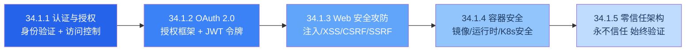
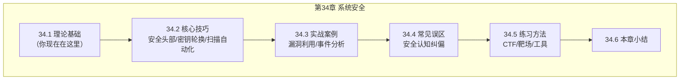

# 34.1 理论基础

理论基础是第34章「系统安全」的根基。本节按照"道→法→术→器"的递进逻辑，从安全威胁的本质认知出发，逐步深入到攻防原理、防御机制、工程实践和架构设计，构建完整的系统安全知识体系。

学习本节前，建议已具备以下前置知识：C/Python 编程基础、操作系统进程/内存管理概念、TCP/IP 协议栈基础、密码学基本概念（加密/哈希/签名）。特别是第33章（密码学）的内容，是理解本节认证授权和加密防御的直接前提。

---

## 知识体系总览

本节五个子主题构成了从"认知威胁"到"架构防御"的完整链路：

五个主题的逻辑关系如下：

- **认证与授权**（34.1.1）是安全体系的起点——搞清楚"你是谁"和"你能做什么"
- **OAuth 2.0**（34.1.2）是认证授权在分布式系统中的工程化落地——解决第三方应用安全访问资源的问题
- **Web安全攻防**（34.1.3）聚焦最常见的攻击面——Web应用层的攻防技术
- **容器安全**（34.1.4）深入基础设施层——从镜像到运行时的全链路安全
- **零信任架构**（34.1.5）是安全设计的终极范式——将前四节的所有能力整合为统一的安全架构

---

## 各节内容概览与学习建议

### 34.1.1 认证与授权

**核心内容**：认证（Authentication）解决"你是谁"，授权（Authorization）解决"你能做什么"。本节从认证因素分类出发，覆盖多因素认证（MFA）、密码安全存储（Argon2id）、令牌认证（JWT）、会话管理、单点登录（SSO）、无密码认证（Passkeys），以及五大授权模型（DAC/MAC/RBAC/ABAC/ReBAC）的原理与实现。

**关键知识点**：

| 主题 | 要点 | 工程价值 |
|------|------|---------|
| 认证因素 | 知识/持有/固有/行为/位置/设备六因素 | 理解MFA的安全本质——不同类型因素的组合 |
| 密码存储 | MD5→SHA256→加盐→bcrypt→scrypt→Argon2id 演进 | 直接决定用户密码数据库被拖库后的损失程度 |
| JWT安全 | 签名算法选择、过期策略、黑名单机制 | Web/API系统最常用的令牌格式，配置错误即致命 |
| RBAC | 角色层级、职责分离、NIST标准四级模型 | 企业应用最广泛使用的授权模型 |
| ABAC | PEP/PDP/PIP/PAP 架构、多维属性策略 | 细粒度动态授权，云原生环境首选 |

**适用读者**：所有开发者。认证授权是任何系统的安全底线，无论做前端、后端还是移动端都需要掌握。

**预计学习时间**：2-3 小时

---

### 34.1.2 OAuth 2.0 授权框架与 JWT 令牌

**核心内容**：OAuth 2.0 是现代应用生态中最重要的授权框架。本节从四大核心角色出发，详细讲解四种授权模式（授权码/隐式/密码/客户端凭证）的原理与适用场景，深入剖析 PKCE 安全加固机制，全面分析 JWT 的结构、签名算法选择和安全陷阱，最后介绍 OpenID Connect（OIDC）在 OAuth 2.0 之上构建身份认证的标准方案。

**关键知识点**：

| 主题 | 要点 | 工程价值 |
|------|------|---------|
| 四种授权模式 | 每种模式的原理、参数和安全特性 | 选错授权模式是OAuth安全问题的第一大根源 |
| PKCE | code_verifier + code_challenge 机制 | 防止授权码拦截，推荐所有客户端类型使用 |
| Refresh Token轮换 | 每次刷新生成新token，旧token立即失效 | 防止refresh token被窃取后的持续利用 |
| JWT签名算法 | HS256/RS256/ES256/EdDSA 对比与选择 | 算法混淆攻击是最常见的JWT漏洞 |
| OIDC | id_token + UserInfo端点 + 发现机制 | 标准化的身份认证层，取代自建登录系统 |

**适用读者**：后端工程师、全栈开发者、API设计者。几乎所有涉及"第三方登录"或"微服务间认证"的系统都需要OAuth 2.0。

**预计学习时间**：2-3 小时

**前置要求**：建议先完成 34.1.1（认证与授权），本节在此基础上展开OAuth的工程化实践。

---

### 34.1.3 Web安全攻防

**核心内容**：Web应用是当前最大的攻击面。本节系统覆盖 OWASP Top 10 2021 中最核心的五大攻击类型：SQL注入、XSS跨站脚本、CSRF跨站请求伪造、SSRF服务端请求伪造，以及安全头部配置（CSP/HSTS/X-Frame-Options 等）。每个攻击类型都从原理出发，给出具体的攻击示例和防御代码。

**关键知识点**：

| 攻击类型 | 危害等级 | 核心防御 |
|---------|---------|---------|
| SQL注入 | 极高 | 参数化查询 + ORM + 最小数据库权限 |
| XSS（反射/存储/DOM） | 高 | 输出编码 + CSP + HttpOnly Cookie |
| CSRF | 中-高 | CSRF Token + SameSite Cookie |
| SSRF | 高 | URL白名单 + 禁止访问内网 + DNS重绑定防护 |
| 安全头部 | — | CSP + HSTS + X-Frame-Options + X-Content-Type-Options |

**适用读者**：所有Web开发者。Web安全漏洞的利用门槛低、影响面广，是安全实战中投入产出比最高的领域。

**预计学习时间**：3-4 小时

**实践建议**：强烈建议配合靶场环境（DVWA、OWASP Juice Shop）动手练习，仅看理论无法建立真正的攻防直觉。

---

### 34.1.4 容器安全

**核心内容**：容器技术改变了软件交付模式，也带来了全新的安全挑战。本节从Linux内核安全机制（Namespace/Cgroup/SELinux/seccomp/Capabilities）出发，覆盖容器镜像安全（构建扫描供应链）、容器运行时安全（最小权限/网络策略/只读文件系统）、Kubernetes安全（RBAC/Pod安全/NetworkPolicy/Secret管理），以及容器安全工具链（Trivy/Falco/OPA Gatekeeper）的实战配置。

**关键知识点**：

| 层面 | 核心技术 | 工程价值 |
|------|---------|---------|
| 内核隔离 | Namespace（6种）+ Cgroup（资源限制） | 理解容器"隔离"的真实边界——共享内核 |
| 强制访问控制 | SELinux/AppArmor + seccomp + Capabilities | 限制容器逃逸后的横向移动能力 |
| 镜像安全 | 多阶段构建 + 漏洞扫描 + 签名验证 + 最小基础镜像 | 75%的容器镜像存在高危漏洞，构建阶段是第一道防线 |
| K8s安全 | RBAC + Pod Security Standards + NetworkPolicy + Secret加密 | Kubernetes集群安全的四大支柱 |
| 运行时监控 | Falco + 审计日志 + 异常检测 | 检测容器逃逸、异常syscall、横向移动 |

**适用读者**：DevOps工程师、平台工程师、使用容器化部署的后端开发者。

**预计学习时间**：2-3 小时

**前置要求**：建议先完成第26章（容器化与编排）的基础知识，本节聚焦安全维度。

---

### 34.1.5 零信任架构

**核心内容**：零信任是现代安全架构的指导范式。本节从传统"城堡护城河"模型的失败出发，讲解零信任架构的三大核心原则（永不信任/始终验证/假设已被攻破），介绍NIST SP 800-207标准架构（PDP/PEP/PCE/PSE），深入分析Google BeyondCorp、Microsoft Zero Trust等业界标杆实践，最后给出从传统架构迁移到零信任的分步路线图。

**关键知识点**：

| 概念 | 要点 | 工程价值 |
|------|------|---------|
| 三大原则 | 永不信任 + 始终验证 + 假设已被攻破 | 安全设计的根本范式转变 |
| NIST SP 800-207 | PDP/PEP/PCE/PSE/IDP 五大组件 | 零信任架构的权威参考实现 |
| BeyondCorp | 设备信任 + 身份感知代理 + 访问代理 | Google 15万+员工验证的大规模实践 |
| 微分段 | 每个工作负载独立安全边界 | 限制爆炸半径，阻止横向移动 |
| 持续验证 | 会话中的动态风险评估 | 登录≠安全，运行时持续评估才是 |

**适用读者**：架构师、安全工程师、技术负责人。零信任是安全架构的顶层设计，需要前四节的知识作为基础。

**预计学习时间**：2-3 小时

**前置要求**：建议完成 34.1.1-34.1.4 的全部内容，零信任架构是对前四节安全能力的整合与升华。

---

## 学习路径

根据你的角色和需求，选择最适合的学习路径：

### 路径一：应用开发者（推荐）

认证与授权 → OAuth 2.0 → Web安全攻防

这三节覆盖了日常开发中最常见的安全场景：用户登录、第三方授权、Web攻击防御。预计总时间 7-10 小时，性价比最高。

### 路径二：DevOps / 平台工程师

认证与授权 → 容器安全 → 零信任架构

聚焦基础设施安全：身份认证 → 容器隔离 → 零信任网络。预计总时间 7-9 小时。

### 路径三：全面掌握（推荐有充足时间的读者）

认证与授权 → OAuth 2.0 → Web安全攻防 → 容器安全 → 零信任架构

按顺序完整学习，建立从应用层到基础设施层的纵深安全能力。预计总时间 12-15 小时。

---

## 理论基础在整章中的位置

理论基础为后续所有模块提供知识支撑：

| 后续模块 | 依赖的理论基础内容 |
|---------|------------------|
| 34.2 核心技巧 | 34.1.3 的安全头部配置方法论 → 技巧一；34.1.1 的密钥管理 → 技巧二 |
| 34.3 实战案例 | 34.1.3 的攻击原理 → 漏洞利用演示；34.1.4 的容器安全 → 靶场搭建 |
| 34.4 常见误区 | 34.1.5 的零信任原则 → 纠正"内网可信"误区；34.1.1 的认证 → 纠正"密码复杂就够了" |
| 34.5 练习方法 | 34.1.3 的攻击技术 → CTF挑战；34.1.2 的OAuth → API安全测试 |

---

## 与本书其他章节的关联

| 关联章节 | 关联内容 | 学习建议 |
|---------|---------|---------|
| 第33章 密码学 | 加密算法/哈希/数字签名 | 本节前置，必须先掌握 |
| 第13章 系统编程 | 内存管理/指针/堆栈 | 34.1.1 中密码存储和内存安全的理解基础 |
| 第18章 计算机网络 | TCP/IP/HTTP/DNS | 34.1.3 Web安全和 34.1.4 容器网络的前置知识 |
| 第19章 API设计 | RESTful/GraphQL设计 | 34.1.2 OAuth和34.1.3 SSRF的API安全视角 |
| 第26章 容器化与编排 | Docker/Kubernetes基础 | 34.1.4 容器安全的直接前置 |
| 第39章 搜索引擎 | Web架构/索引/爬虫 | 34.1.3 安全头部在大型Web应用中的实践 |

---

## 常见问题

**Q: 我只做前端开发，需要学容器安全和零信任吗？**

A: 34.1.1（认证与授权）、34.1.2（OAuth 2.0）和 34.1.3（Web安全攻防）是所有Web开发者的必修课。容器安全（34.1.4）和零信任（34.1.5）对前端开发者不是必须的，但了解这些概念有助于理解整体安全架构，在与后端/运维协作时能更有效地沟通安全需求。

**Q: 理论基础和核心技巧（34.2）有什么区别？**

A: 理论基础讲的是"为什么"——威胁模型、漏洞原理、防御机制的设计思想。核心技巧讲的是"怎么做"——具体的安全头部配置步骤、密钥轮换操作流程、扫描工具的使用方法。建议先学理论再学技巧，知其然更要知其所以然。

**Q: 五个子主题一定要按顺序学吗？**

A: 强烈建议按顺序学。认证与授权是基础，OAuth 2.0 建立在其之上，Web安全攻防需要认证授权的背景知识，容器安全涉及认证和网络安全部分，零信任是对前四节的整合。打乱顺序容易出现知识断层。

**Q: 学完理论基础能应付实际工作中的安全问题吗？**

A: 理论基础提供了安全思维和知识框架，但真正的安全能力需要结合实战。建议学完理论后，完成34.3（实战案例）和34.5（练习方法），通过靶场环境和CTF挑战将理论转化为技能。安全是一项实践性极强的能力——光看不练等于没学。

---

*软件工程核心知识体系 · 第34章 · 理论基础*
