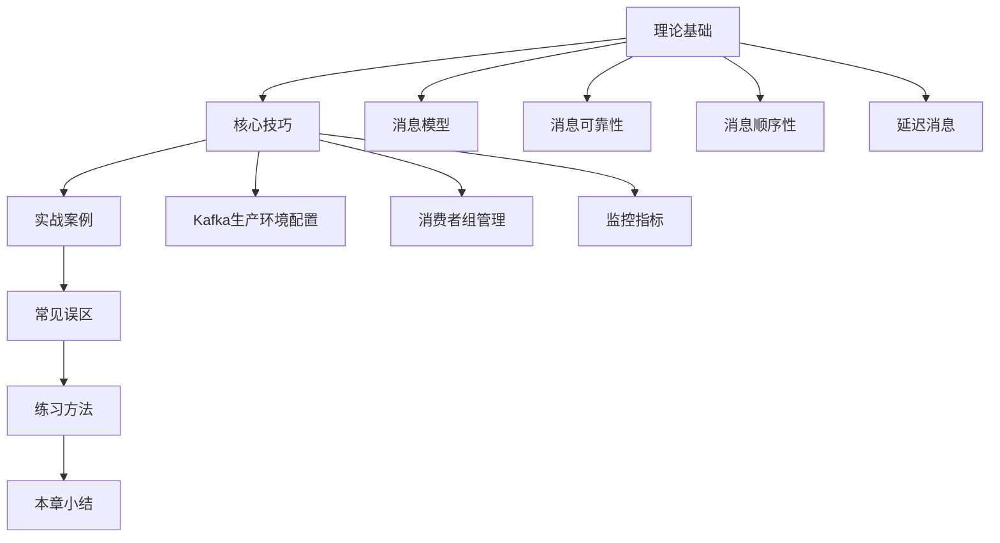
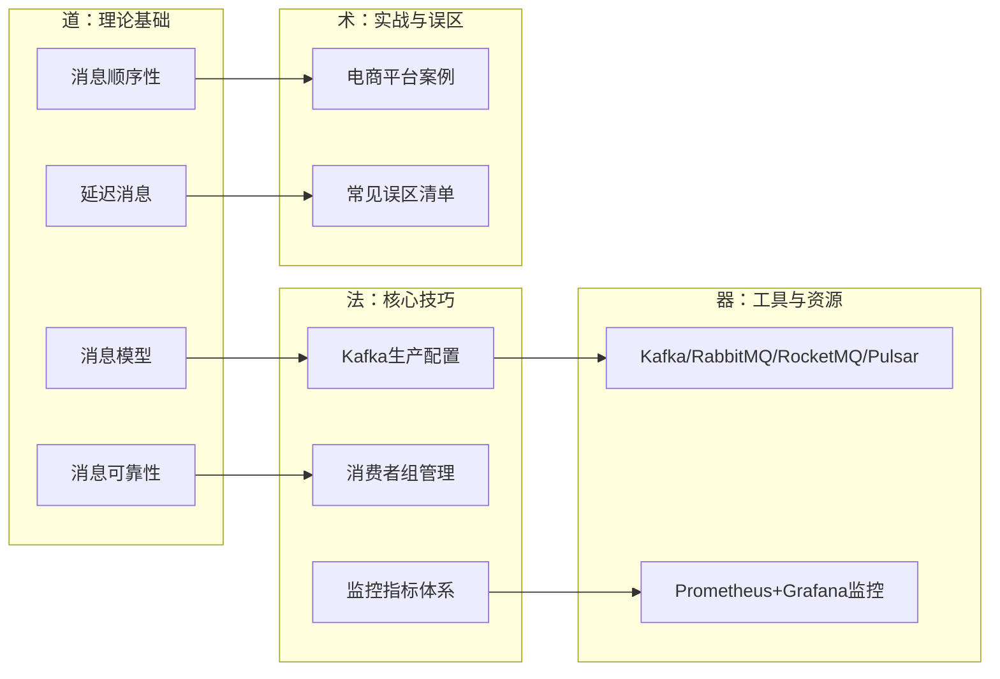
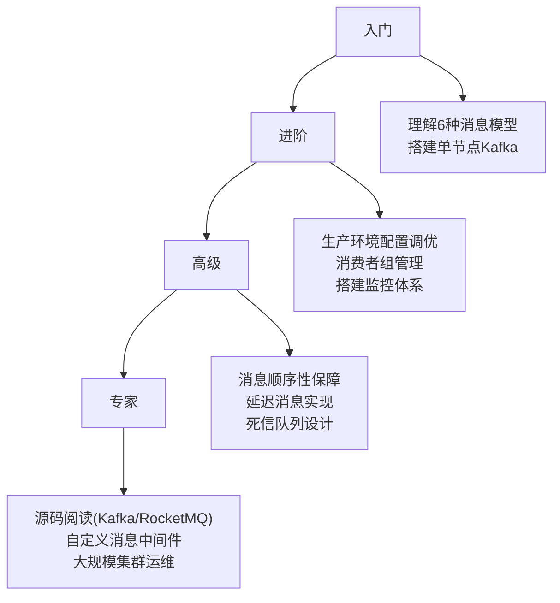

## 第35章 消息队列

### 1. 本章概述

消息队列（Message Queue, MQ）是分布式系统中最关键的基础设施之一。它在服务间异步通信、流量削峰、系统解耦和数据管道构建中扮演着不可替代的角色。从早期企业级的 IBM MQ、ActiveMQ，到互联网时代爆发式增长的 Kafka、RabbitMQ、RocketMQ，再到云原生时代的 Pulsar，消息队列的技术演进深刻反映了分布式架构从单体到微服务、从集中式到流式的变迁。

本章从**理论基础**出发，系统梳理消息模型、消息可靠性、消息顺序性和延迟消息四大核心主题；通过**核心技巧**深入 Kafka 生产环境配置、消费者组管理和监控指标三大实战领域；结合**实战案例**和**常见误区**帮助读者建立完整的消息队列知识体系。

**本章目标读者：**
- 初级工程师：理解消息队列的核心概念，能够在项目中正确选型和基础使用
- 中级工程师：掌握生产环境配置调优、消费者组管理和监控告警体系搭建
- 高级工程师/架构师：能够设计高可用消息架构，处理消息顺序性、延迟消息等复杂场景

**阅读路径建议：**



---

### 2. 为什么需要消息队列

在没有消息队列的系统中，服务间通信通常采用同步 RPC（Remote Procedure Call）方式。这种模式在业务复杂度上升后会暴露出严重问题。

#### 同步 RPC 的四大致命缺陷

| 缺陷 | 具体表现 | 业务后果 |
|------|----------|----------|
| **强耦合** | 服务 A 直接依赖服务 B、C、D 的地址和接口定义 | 下游任一服务变更，上游必须同步修改；服务数量增长后，依赖关系变成蜘蛛网 |
| **同步阻塞** | 串行等待每个下游调用返回，总延迟 = 所有下游延迟之和 | 订单服务调用库存（50ms）+ 支付（80ms）+ 通知（30ms）= 160ms，用户等待时间过长 |
| **单点故障** | 下游任一服务不可用，上游请求直接失败 | 通知服务挂了导致整个下单流程失败——这显然不合理 |
| **流量冲击** | 大促流量直接打到所有下游服务 | 最弱的下游环节最先崩溃，故障沿调用链级联传播，引发雪崩效应 |

#### 消息队列解决的四大核心问题

引入消息队列后，服务间通信从同步转为异步，带来以下核心价值：

| 能力 | 原理 | 典型场景 |
|------|------|----------|
| **异步解耦** | 生产者只需将消息投递到 MQ，不关心谁消费、何时消费 | 订单创建后异步发送短信通知、积分发放、物流调度 |
| **流量削峰** | MQ 作为缓冲层，将瞬时高流量平滑为可控的消费速率 | 秒杀活动：10 万 QPS 打入 MQ，消费者以 1 万 QPS 稳定消费 |
| **数据管道** | 所有业务事件统一写入 MQ，下游按需订阅，构建事件驱动架构 | 用户行为日志实时流入 Kafka，供实时分析、推荐、风控等多个系统消费 |
| **最终一致性** | 通过消息重试+补偿机制，在分布式环境下实现最终一致 | 跨服务转账：扣款服务和入账服务通过消息保证最终一致 |

---

### 3. 本章知识体系

本章按照"道法术器"的逻辑，从理论到实操逐层递进：



---

### 4. 理论基础概要

#### 4.1 消息模型

消息模型是消息队列系统的基石，决定了消息在生产者和消费者之间如何流转、路由和被消费。本章系统梳理了六大核心消息模式：

| 模型 | 特点 | 适用场景 |
|------|------|----------|
| **点对点（Queue）** | 一条消息只被一个消费者消费 | 任务分发、工作队列 |
| **发布/订阅（Pub/Sub）** | 一条消息被所有订阅者消费 | 事件广播、系统通知 |
| **请求/回复（Request/Reply）** | 生产者发送消息后等待消费者回复 | 同步查询、远程调用替代 |
| **扇出（Fan-Out）** | 一条消息同时分发到多个队列 | 多系统并行处理同一事件 |
| **路由（Routing）** | 根据消息属性路由到不同队列 | 按消息类型分发处理 |
| **主题（Topic）** | 按 Topic 组织，支持消费者组并行消费 | 大规模事件流处理 |

同时深入对比了四大主流消息中间件的架构差异：

| 特性 | Kafka | RabbitMQ | RocketMQ | Pulsar |
|------|-------|----------|----------|--------|
| **语言** | Scala/Java | Erlang | Java | Java |
| **模型** | Pub/Sub | 多种（AMQP） | Pub/Sub + Tag | Pub/Sub + 多租户 |
| **吞吐量** | 极高（百万级/秒） | 中等（万级/秒） | 高（十万级/秒） | 极高（百万级/秒） |
| **延迟** | 毫秒级 | 微秒级 | 毫秒级 | 毫秒级 |
| **消息回溯** | 支持（基于 offset） | 不支持 | 支持（基于时间） | 支持 |
| **适用场景** | 日志采集、大数据流 | 企业集成、复杂路由 | 电商交易、金融场景 | 多租户、云原生 |

#### 4.2 消息可靠性

消息可靠性是生产环境中最核心的挑战。本章从三个维度构建可靠消息链路：

- **生产者确认机制**：通过 `acks` 配置（0/1/all）和幂等性（`enable_idempotence`）确保消息成功写入
- **Broker 持久化**：多副本复制、ISR（In-Sync Replicas）机制保证数据不丢失
- **消费者确认机制**：手动提交 offset + 消费失败重试 + 死信队列（DLQ）兜底

关键配置要点：
```python
# Kafka 生产者：最高可靠性配置
producer = KafkaProducer(
    acks='all',                  # 等待所有 ISR 副本确认
    retries=3,                   # 自动重试
    enable_idempotence=True,     # 幂等性，防止重复消息
    max_in_flight_requests_per_connection=5  # 允许未确认的请求数
)
```

#### 4.3 消息顺序性

在很多业务场景（如订单状态变更、数据库 Binlog 同步）中，消息的顺序性至关重要。本章深入分析了：

- **全局顺序 vs 分区顺序**：全局顺序限制吞吐量，分区顺序是实际生产中的主流方案
- **Kafka 分区策略**：通过相同的 Partition Key（如订单 ID）保证同一业务实体的消息进入同一分区
- **顺序性陷阱**：生产者重试导致的消息重排、消费者多线程消费的乱序风险、Rebalance 期间的顺序中断

#### 4.4 延迟消息

延迟消息（Delayed Message / Scheduled Message）支持消息在指定时间后才可被消费，是实现定时任务、延迟通知的核心机制。本章覆盖：

- **RocketMQ 延迟级别**：支持 18 个固定延迟级别（1s/5s/10s/30s/1m/2m/...2h）
- **Kafka 延迟消息实现**：基于时间轮（Timing Wheel）算法，通过自定义实现支持任意延迟时间
- **RabbitMQ 延迟消息**：基于 RabbitMQ 插件（rabbitmq_delayed_message_exchange）实现
- **典型应用场景**：订单超时未支付自动取消、延迟优惠券发放、物流状态延迟推送

---

### 5. 核心技巧概要

#### 5.1 Kafka 生产环境配置

生产环境的 Kafka 配置远不是安装软件包那么简单。本节从操作系统层到应用层，逐层剖析配置要点：

**操作系统层（三板斧）：**

| 配置项 | 推荐值 | 原理 |
|--------|--------|------|
| **JVM 堆内存** | 6-8GB（占物理内存 < 50%） | Kafka 依赖 OS 页缓存，JVM 堆过大会挤占页缓存 |
| **vm.max_map_count** | 262144（默认 65530） | Kafka 使用 mmap 读写日志段，分区多时默认值不够 |
| **文件描述符** | 100000+ | 每个分区的日志段都占一个文件描述符 |

**网络层优化：**
```bash
# 关键网络参数
net.core.somaxconn = 32768           # TCP 连接队列
net.core.netdev_max_backlog = 16384   # 网络接收队列
net.core.rmem_max = 16777216          # TCP 接收缓冲区
net.ipv4.tcp_max_syn_backlog = 16384  # SYN 半连接队列
```

**Broker 集群配置、生产者/消费者参数调优、安全加固**等详细内容，见技巧一正文。

#### 5.2 消费者组管理

消费者组是 Kafka 实现并行消费的核心抽象。本节深入讲解：

- **消费者组原理**：同一组内的消费者分摊分区，不同组独立消费（广播）
- **Rebalance 机制**：当消费者加入/离开组时触发的分区重分配，以及如何减少 Rebalance 的频率和影响
- **消费能力评估**：如何根据消息生产速率计算所需的消费者实例数
- **常见问题排查**：消费延迟（Lag）过大、消费速度不均匀、Rebalance 频繁

#### 5.3 监控指标体系

没有监控的消息队列是盲人骑马。本节构建完整的监控体系：

**三大核心指标：**

| 指标类别 | 关键 Metric | 告警阈值参考 |
|----------|-------------|-------------|
| **生产端** | produce-request-rate、produce-error-rate、record-error-rate | 错误率 > 0.1% 告警 |
| **Broker** | under-replicated-partitions、offline-partitions-count、request-handler-idle-ratio | under-replicated > 0 告警 |
| **消费端** | records-lag-max、fetch-rate、commit-rate | Lag > 10000 持续 5 分钟告警 |

**Prometheus + Grafana 监控方案搭建**的完整步骤，见技巧三正文。

---

### 6. 实战案例概要

本章提供了一个**电商平台大促场景**的完整实战案例：

| 阶段 | 内容 |
|------|------|
| **问题背景** | 大促期间接口延迟从 50ms 飙升至 500ms，数据库连接池耗尽，影响约 100 万用户 |
| **排查过程** | 四步定位：系统负载 → 应用层（Jstack/GC）→ 数据库（慢查询/锁等待）→ 根因确认 |
| **根因分析** | ① 数据库缺少索引导致全表扫描 ② 连接池配置过小 ③ 缓存命中率低导致请求穿透 |
| **解决方案** | 复合索引优化 + HikariCP 连接池调参 + 多级缓存策略（本地缓存 → Redis → DB） |
| **优化效果** | P99 延迟：500ms → 50ms（↓90%），QPS：5K → 50K（↑10x），错误率：5% → 0.1%（↓98%） |

---

### 7. 常见误区概要

本章总结了五个高频踩坑点：

| 误区 | 错误做法 | 正确做法 |
|------|----------|----------|
| **忽略监控** | 出了问题才排查 | 部署 Prometheus + Grafana，建立实时监控大盘 |
| **过度优化** | 凭感觉调参数 | 先用 profiler 定位瓶颈，数据驱动优化 |
| **配置不当** | 使用默认配置上生产 | 根据实际负载和硬件配置针对性调优 |
| **缺乏容错** | 没有超时重试机制 | 设计超时→重试→熔断→降级的完整容错链 |
| **忽视安全** | 内网不加密、无认证 | 平衡安全与性能，至少启用 SASL 认证和 SSL 加密 |

---

### 8. 关键指标与公式

| 概念 | 公式/模型 | 说明 |
|------|-----------|------|
| **吞吐量** | QPS = 并发数 / 平均延迟 | Little 定律：消费能力 = 消费者数 × 单个消费者的处理速率 |
| **可用性** | SLA = 正常运行时间 / 总时间 | 99.9% = 年停机 8.76h，99.99% = 年停机 52.6min |
| **消费延迟** | Consumer Lag = 最新 Offset - 消费位点 | Lag 持续增长说明消费速度跟不上生产速度 |
| **容量规划** | 所需分区数 = 生产速率 / 单分区吞吐量 | 分区数决定并行度上限，一旦创建无法减少 |
| **副本因子** | 副本因子 ≥ 2，ISR ≥ 1 | 副本因子=3 时允许 1 个节点故障仍可用 |

---

### 9. 下一步学习建议

**按层级的深入路径：**



**推荐资源：**
- 官方文档：[Kafka Documentation](https://kafka.apache.org/documentation/)、[RocketMQ Docs](https://rocketmq.apache.org/docs/)
- 经典书籍：《Kafka 权威指南》（O'Reilly）、《RocketMQ 技术内幕》
- 开源项目：Confluent Platform、Apache Pulsar
- 论文：Jay Kreps - *"The Log: What every software engineer should know about real-time data's unifying abstraction"*

---

### 10. 本章导读

本章共包含以下内容，建议按顺序阅读：

| 序号 | 内容 | 核心要点 | 建议用时 |
|------|------|----------|----------|
| 理论一 | 消息模型 | 6 大消息模式 + 4 大 MQ 对比 | 30 分钟 |
| 理论二 | 消息可靠性 | 生产者确认 + Broker 持久化 + 消费者 ACK | 25 分钟 |
| 理论三 | 消息顺序性 | 分区顺序 vs 全局顺序 + 顺序性陷阱 | 25 分钟 |
| 理论四 | 延迟消息 | 延迟级别 + 时间轮算法 + 应用场景 | 20 分钟 |
| 技巧一 | Kafka 生产环境配置 | OS 层 + 网络层 + Broker + 客户端调优 | 40 分钟 |
| 技巧二 | 消费者组管理 | Rebalance 机制 + Lag 监控 + 容量评估 | 30 分钟 |
| 技巧三 | 监控指标 | Prometheus + Grafana + 告警规则 | 30 分钟 |
| 实战案例 | 电商平台大促优化 | 排查过程 + 解决方案 + 效果对比 | 20 分钟 |
| 常见误区 | 五大高频踩坑点 | 误区 → 正确做法 | 10 分钟 |
| 练习方法 | 5 个递进练习 | 概念理解 → 实操 → 排查 → 优化 → 架构设计 | 245 分钟 |

**预计总阅读+练习时间：约 8 小时**
