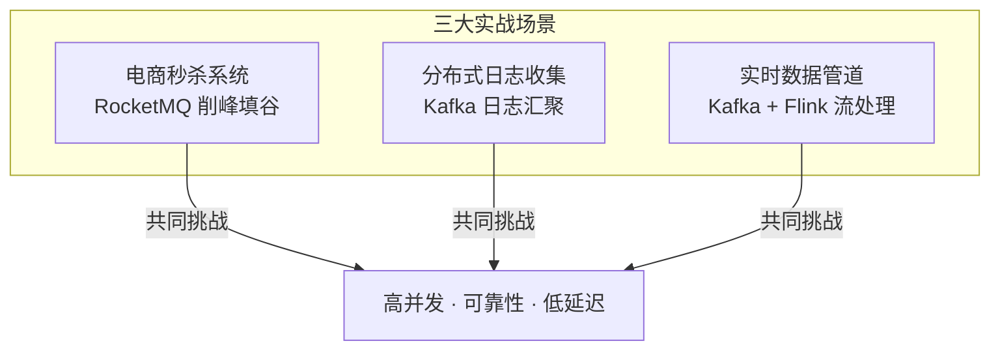
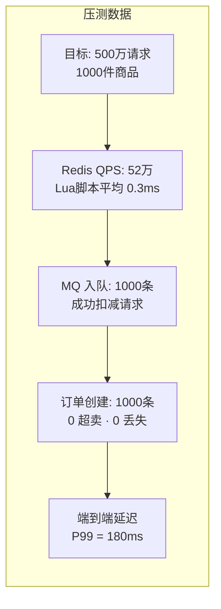
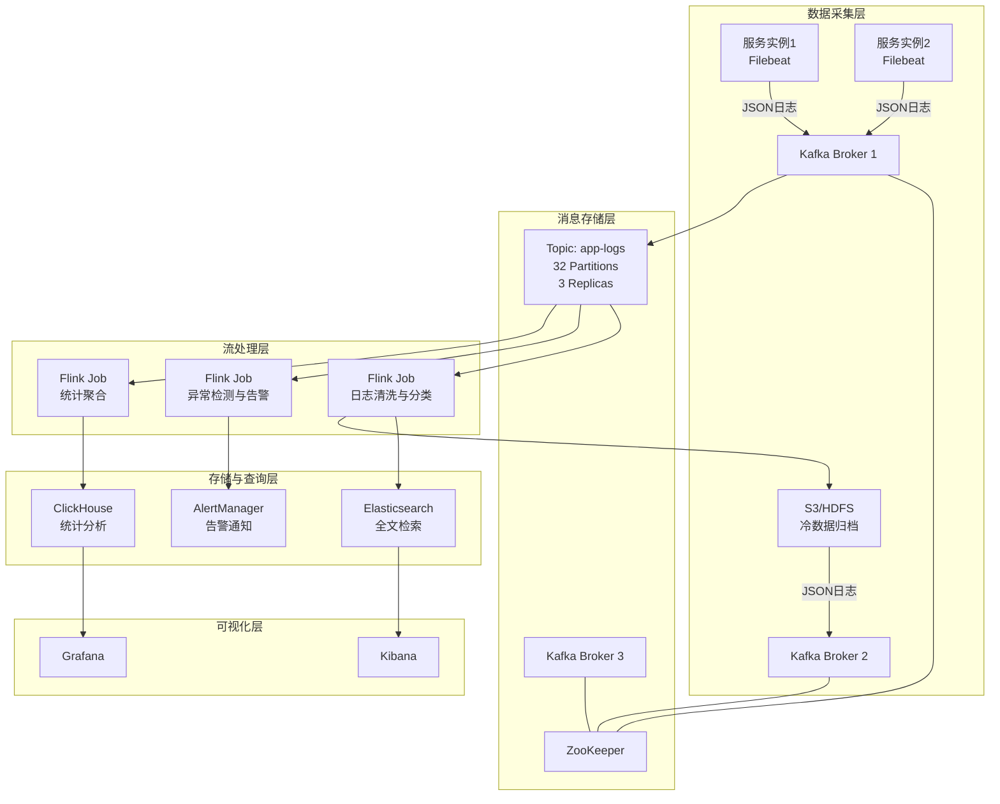
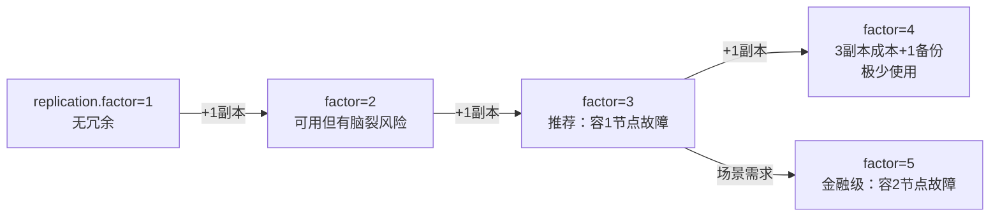
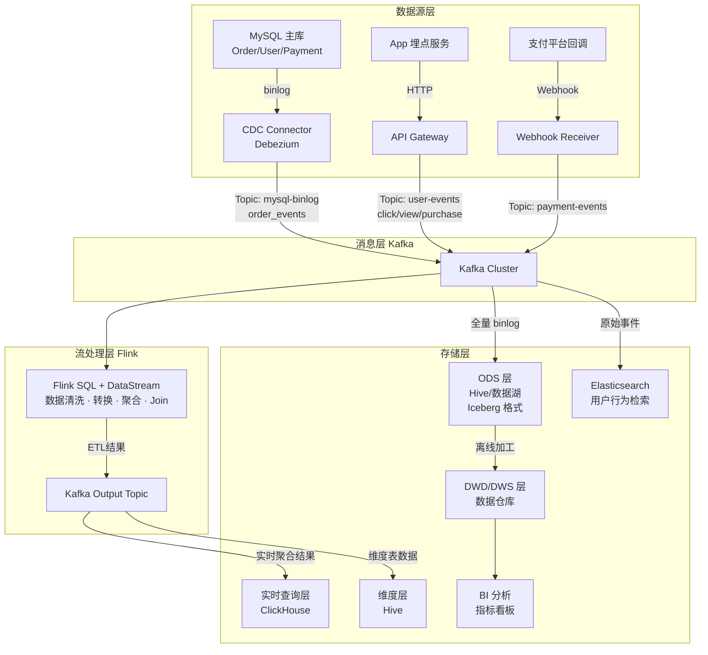
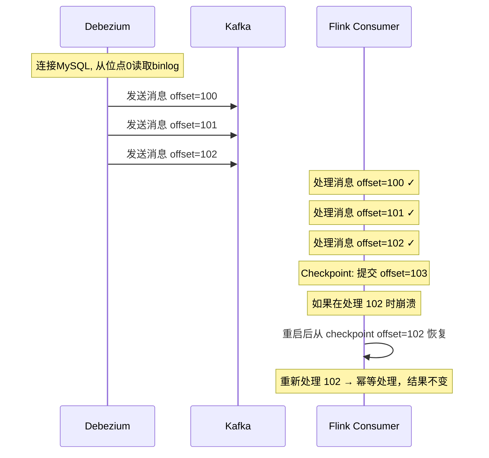
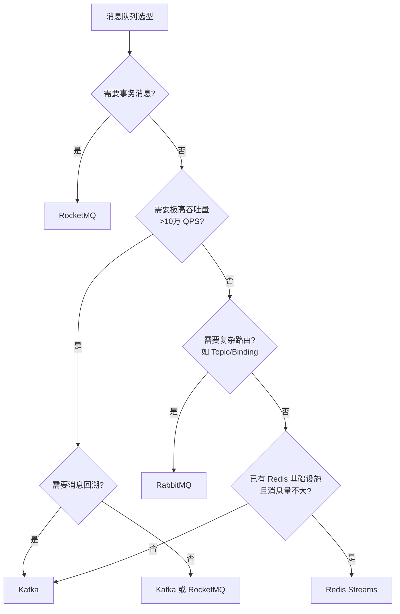

# 实战案例

理论终归是纸上谈兵，消息队列的真正价值要在生产环境中才能体现。本章选取三个来自真实生产环境的典型案例——**电商秒杀系统**、**分布式日志收集平台**、**实时数据管道**——从问题背景、架构设计、代码实现到性能调优，完整还原消息队列从选型到落地的全过程。



---

## 案例一：电商秒杀系统——用 RocketMQ 实现流量削峰

### 1.1 业务背景与核心挑战

某电商平台计划举办一场限时秒杀活动，预计有 500 万用户同时抢购 1000 件商品。系统面临的核心矛盾是：

- **瞬间流量远超数据库承受能力**：500 万请求如果直接打到数据库，MySQL 单实例的写入 QPS 上限约 5000-8000，差距高达 600-1000 倍
- **库存扣减的并发安全**：超卖是秒杀系统的致命缺陷，但过度加锁又会严重影响性能
- **响应时间要求苛刻**：用户期望在 1 秒内得到结果（抢到或售罄），而非长时间等待后超时

如果不引入消息队列，系统在流量洪峰到来时的表现如下：

| 指标 | 无 MQ 保护 | 有 MQ 保护 |
|------|-----------|-----------|
| 峰值 QPS | 直接打 DB | MQ 缓冲 50 万 QPS |
| 数据库连接数 | 2000+（连接池耗尽） | 稳定在 200（连接池内） |
| 平均响应时间 | 3000ms+（排队等待） | 200ms（立即返回） |
| 错误率 | 40%+（超时/熔断） | <0.1% |
| 超卖风险 | 高（乐观锁竞争激烈） | 低（串行消费扣减） |

### 1.2 架构设计

整个秒杀系统采用三层缓冲架构，核心思路是**将流量从 Web 层逐层削峰，最终让数据库只处理真正的成交请求**：

```mermaid
graph TB
    subgraph 前端层
        A[用户请求 500万] --> B{前端限流}
        B -->|未通过| B1[直接返回"活动结束"]
        B -->|通过| B2[发送请求]
    end
    
    subgraph 网关层
        B2 --> C{Nginx 限流<br/>令牌桶算法}
        C -->|超限| C1[返回 429]
        C -->|通过| D[秒杀服务]
    end
    
    subgraph 服务层
        D --> E{库存预判<br/>Redis 原子扣减}
        E -->|库存不足| E1[返回"已售罄"]
        E -->|扣减成功| F[发送消息到 RocketMQ]
    end
    
    subgraph 消息层
        F --> G[RocketMQ Topic<br/>order-created]
        G --> H[消费者组<br/>订单服务]
        G --> I[消费者组<br/>库存服务]
        G --> J[消费者组<br/>通知服务]
    end
    
    subgraph 数据层
        H --> K[(MySQL 订单表)]
        I --> L[(MySQL 库存表)]
    end
```

**各层职责说明：**

1. **前端层**：通过按钮防抖、Token 预校验、验证码等方式过滤无效请求。用户在活动开始前获取一个一次性 Token，秒杀时携带 Token 请求，前端 JS 立即禁用按钮防止重复提交
2. **Nginx 网关层**：使用 `limit_req` 模块实施令牌桶限流，例如限制每秒 10 万次请求，超过的直接返回 429 状态码。这一层就把 500 万请求削到 100 万以内
3. **服务层（Redis 预扣减）**：使用 Redis 的 Lua 脚本实现原子性的库存检查与扣减。这是最关键的削峰环节——只有在 Redis 中扣减成功的请求才会进入消息队列，其余直接返回"售罄"
4. **消息层**：将扣减成功的订单信息发送到 RocketMQ，由下游消费者异步处理订单创建、库存同步、消息通知等逻辑

### 1.3 Redis 原子扣减实现

Redis 预扣减是整个方案的关键环节，必须保证原子性，避免并发下的超卖问题：

```lua
-- Lua 脚本：Redis 原子库存扣减
-- KEYS[1] = 库存键 (stock:product_id)
-- KEYS[2] = 已售键 (sold:product_id)
-- KEYS[3] = 用户限购键 (limit:product_id:user_id)
-- ARGV[1] = 商品ID, ARGV[2] = 用户ID, ARGV[3] = 限购数量

-- 1. 检查用户是否已达到限购
local userLimit = redis.call('GET', KEYS[3] .. ':' .. ARGV[2])
if userLimit and tonumber(userLimit) >= tonumber(ARGV[3]) then
    return -2  -- 已达限购
end

-- 2. 检查并扣减库存
local stock = tonumber(redis.call('GET', KEYS[1]) or '0')
if stock <= 0 then
    return -1  -- 库存不足
end

redis.call('DECR', KEYS[1])        -- 扣减库存
redis.call('INCR', KEYS[2])        -- 增加已售
redis.call('INCR', KEYS[3] .. ':' .. ARGV[2])  -- 用户限购计数
redis.call('EXPIRE', KEYS[3] .. ':' .. ARGV[2], 3600)  -- 1小时过期

return 1  -- 扣减成功
```

**对应的服务端代码：**

```java
@Service
public class SeckillService {
    
    @Autowired
    private StringRedisTemplate redisTemplate;
    @Autowired
    private RocketMQTemplate rocketMQTemplate;
    
    // 加载 Lua 脚本
    private static final DefaultRedisScript<Long> DEDUCT_SCRIPT;
    static {
        DEDUCT_SCRIPT = new DefaultRedisScript<>();
        DEDUCT_SCRIPT.setLocation(new ClassPathResource("lua/stock_deduct.lua"));
        DEDUCT_SCRIPT.setResultType(Long.class);
    }
    
    /**
     * 秒杀入口
     * @return 0=成功, -1=库存不足, -2=超过限购
     */
    public long seckill(String productId, String userId) {
        String stockKey = "stock:" + productId;
        String soldKey = "sold:" + productId;
        String limitKey = "limit:" + productId;
        
        Long result = redisTemplate.execute(
            DEDUCT_SCRIPT,
            Arrays.asList(stockKey, soldKey, limitKey),
            productId, userId, "1"  // 限购1件
        );
        
        if (result == 1) {
            // 扣减成功，发送订单消息到 RocketMQ
            OrderMessage orderMsg = new OrderMessage();
            orderMsg.setProductId(productId);
            orderMsg.setUserId(userId);
            orderMsg.setOrderId(generateOrderId());
            orderMsg.setTimestamp(System.currentTimeMillis());
            
            rocketMQTemplate.syncSend(
                "order-created",  // Topic
                MessageBuilder.withPayload(orderMsg)
                    .setHeader("KEYS", orderMsg.getOrderId())
                    .build()
            );
            return 0;  // 秒杀成功
        }
        
        return result;  // -1 库存不足, -2 超过限购
    }
}
```

### 1.4 RocketMQ 消费端设计

消费端承担真正的订单创建和库存持久化职责。由于 RocketMQ 的消费是串行的（同一个 Queue 内的消息按顺序被单个消费者处理），天然避免了并发库存扣减的超卖问题。

```java
@Component
@RocketMQMessageListener(
    topic = "order-created",
    consumerGroup = "order-consumer-group",
    consumeMode = ConsumeMode.ORDERLY,  // 顺序消费，保证同一商品的订单串行处理
    maxReconsumeTimes = 3               // 最大重试次数
)
public class OrderConsumer implements RocketMQListener<OrderMessage> {
    
    @Autowired
    private OrderRepository orderRepo;
    @Autowired
    private InventoryRepository inventoryRepo;
    
    @Override
    public void onMessage(OrderMessage msg) {
        try {
            // 1. 幂等性检查：防止消息重复投递导致重复下单
            if (orderRepo.existsByOrderId(msg.getOrderId())) {
                log.warn("重复订单，跳过: {}", msg.getOrderId());
                return;
            }
            
            // 2. 创建订单
            Order order = new Order();
            order.setOrderId(msg.getOrderId());
            order.setProductId(msg.getProductId());
            order.setUserId(msg.getUserId());
            order.setStatus(OrderStatus.CREATED);
            order.setCreatedAt(LocalDateTime.now());
            orderRepo.save(order);
            
            // 3. 持久化库存扣减（从 Redis 预扣减同步到 MySQL）
            inventoryRepo.deductStock(msg.getProductId(), 1);
            
            // 4. 发送订单创建事件（通知服务监听）
            log.info("订单创建成功: {}", msg.getOrderId());
            
        } catch (DuplicateKeyException e) {
            // 数据库唯一约束兜底，防超卖
            log.warn("数据库层面拦截重复: {}", msg.getOrderId());
        } catch (Exception e) {
            log.error("订单处理异常: {}", msg.getOrderId(), e);
            throw e;  // 抛异常触发 RocketMQ 重试
        }
    }
}
```

**幂等性设计要点：**

RocketMQ 本身不保证 Exactly-Once，可能出现消息重复投递。在订单创建场景中，幂等性通过**三层防护**实现：

| 防护层 | 机制 | 作用 |
|--------|------|------|
| 第一层 | `orderId` 数据库唯一索引 | 兜底，即使代码逻辑出错也不会重复插入 |
| 第二层 | `existsByOrderId` 查询 | 预防，处理前检查是否已存在 |
| 第三层 | Redis 分布式锁 | 可选，对极端高并发场景进一步保护 |

### 1.5 压测结果与调优

系统上线前进行了全链路压测，以下是关键数据：



**核心调优参数：**

| 参数 | 初始值 | 调优后值 | 调优原因 |
|------|--------|---------|---------|
| RocketMQ Broker 堆内存 | 4G | 8G | 消息堆积时需要更多内存做页缓存 |
| Consumer 线程数 | 20 | 64 | 提高消费吞吐量，匹配订单写入 QPS |
| Consumer 批量消费大小 | 1 | 16 | 批量消费减少网络往返，提升吞吐 |
| sendMsgTimeout | 3000ms | 1000ms | 秒杀场景超时要快速失败 |
| retryTimesWhenSendFailed | 2 | 1 | 秒杀不需要过多重试，超时即放弃 |

---

## 案例二：分布式日志收集平台——用 Kafka 构建日志汇聚系统

### 2.1 业务背景与核心挑战

某互联网公司拥有 200+ 微服务实例，部署在 3 个机房。随着业务增长，日志管理面临以下困境：

- **日志分散**：每台服务器上的日志文件（应用日志、访问日志、错误日志）各自为政，排查跨服务问题需要逐一登录服务器
- **日志量巨大**：峰值每秒产生约 50 万条日志记录（约 200MB/s），传统的 `rsyslog` + `logrotate` 方案无法承载
- **实时性要求**：运维团队需要实时监控异常日志并在 1 分钟内告警，而传统的定时文件收集方案延迟高达 5-15 分钟
- **数据保留**：合规要求日志保留 180 天，但本地磁盘最多只能保留 7 天

### 2.2 架构设计

日志收集系统采用经典的 **Agent → Broker → Storage → Query** 四层架构：



**为什么选择 Kafka 而不是其他 MQ？**

| 对比维度 | Kafka | RabbitMQ | RocketMQ |
|---------|-------|----------|----------|
| 持久化能力 | 原生磁盘持久化，支持 TB 级堆积 | 内存优先，堆积影响性能 | 支持持久化，但性能不如 Kafka |
| 消息回溯 | 支持按 offset 和时间戳回溯 | 不支持（消费即删除） | 支持 |
| 吞吐量 | 百万级/秒 | 万级/秒 | 十万级/秒 |
| 与大数据生态集成 | 原生支持 Spark/Flink/Hadoop | 需要适配 | 需要适配 |
| 消费模型 | Pull（消费者主动拉取） | Push（Broker 推送） | Pull |

日志场景的特点是**写入量大、消费者按自己的速度读取、需要消息保留和回溯**，这恰好是 Kafka 的设计优势。

### 2.3 Kafka 集群配置

生产环境的 Kafka 集群配置是整个系统的基石，以下是经过调优的关键配置：

```properties
# kafka-server.properties — 生产环境配置

# ===== 基础配置 =====
broker.id=1
listeners=PLAINTEXT://0.0.0.0:9092
advertised.listeners=PLAINTEXT://kafka1.company.com:9092

# ===== 日志存储 =====
log.dirs=/data1/kafka-logs,/data2/kafka-logs    # 多块磁盘并行写入
log.retention.hours=4320                          # 保留180天
log.retention.bytes=107374182400                  # 单Partition最大100GB
log.segment.bytes=1073741824                      # Segment大小1GB
log.cleanup.policy=delete                         # 保留期满后删除

# ===== 副本与可靠性 =====
default.replication.factor=3                      # 3副本
min.insync.replicas=2                             # 至少2个ISR确认
unclean.leader.election.enable=false              # 禁止非ISR选主
acks=all                                          # 生产者等待所有ISR确认

# ===== 性能调优 =====
num.network.threads=8                             # 网络线程数
num.io.threads=16                                 # IO线程数
num.partitions=32                                 # 默认分区数
message.max.bytes=10485760                        # 最大消息10MB
replica.fetch.max.bytes=10485760                  # 副本同步最大消息

# ===== ZooKeeper =====
zookeeper.connect=zk1:2181,zk2:2181,zk3:2181/kafka
```

**副本因子选择的权衡：**



### 2.4 Filebeat 日志采集配置

在每台服务器上部署 Filebeat 作为日志采集 Agent，负责将本地日志文件实时发送到 Kafka：

```yaml
# filebeat.yml
filebeat.inputs:
  # 应用日志
  - type: log
    enabled: true
    paths:
      - /var/log/app/*.log
    fields:
      log_type: application
      env: production
    multiline.pattern: '^\d{4}-\d{2}-\d{2}'  # 多行日志合并
    multiline.negate: true
    multiline.match: after
    fields_under_root: true

  # Nginx 访问日志
  - type: log
    enabled: true
    paths:
      - /var/log/nginx/access.log
    fields:
      log_type: access
      env: production
    fields_under_root: true

  # 错误日志（实时告警用）
  - type: log
    enabled: true
    paths:
      - /var/log/app/error*.log
    fields:
      log_type: error
      env: production
      alert: true
    fields_under_root: true

# 输出到 Kafka
output.kafka:
  hosts: ["kafka1:9092", "kafka2:9092", "kafka3:9092"]
  topic: "app-logs"
  partition.round_robin:
    reachable_only: true
  required_acks: 1          # 生产者级不需要太强的一致性，Broker端保证
  compression: lz4           # 压缩，减少网络带宽
  max_message_bytes: 10485760

# 处理器：添加主机名、时间戳
processors:
  - add_host_metadata:
      when.not.contains.tags: forwarded
  - add_cloud_metadata: ~
  - timestamp:
      field: "@timestamp"
      layouts:
        - '2006-01-02T15:04:05.000Z'
      test:
        - '2023-01-01T00:00:00.000Z'
```

**多行日志处理是常见痛点：** Java 的 StackTrace 会自动换行，如果不在 Filebeat 层合并，一条异常日志会被拆成多条消息，导致后续解析困难。`multiline` 配置通过正则匹配日志开头（如时间戳格式 `YYYY-MM-DD`），将不以时间戳开头的行合并到上一条消息。

### 2.5 Flink 日志清洗与异常检测

从 Kafka 消费的日志原始数据需要经过清洗、解析、分类后才能写入 Elasticsearch 和 ClickHouse：

```java
public class LogProcessingJob {
    public static void main(String[] args) throws Exception {
        StreamExecutionEnvironment env = StreamExecutionEnvironment.getExecutionEnvironment();
        env.setParallelism(8);
        
        // 从 Kafka 消费日志
        KafkaSource<String> kafkaSource = KafkaSource.<String>builder()
            .setBootstrapServers("kafka1:9092,kafka2:9092,kafka3:9092")
            .setTopics("app-logs")
            .setGroupId("log-processor")
            .setStartingOffsets(OffsetsInitializer.latest())
            .setValueOnlyDeserializer(new SimpleStringSchema())
            .build();
        
        DataStream<String> rawLogs = env.fromSource(
            kafkaSource, WatermarkStrategy.noWatermarks(), "Kafka Source"
        );
        
        // 1. 日志解析与清洗
        DataStream<LogEntry> parsedLogs = rawLogs
            .filter(line -> !line.isEmpty())
            .map(new LogParser())                    // JSON → LogEntry
            .filter(entry -> entry != null)          // 过滤解析失败的
            .filter(entry -> entry.getTimestamp() > System.currentTimeMillis() - 600000);  // 过滤超过10分钟的旧日志
        
        // 2. 实时异常检测（滑动窗口）
        DataStream<Alert> alerts = parsedLogs
            .filter(entry -> "ERROR".equals(entry.getLevel()) || "FATAL".equals(entry.getLevel()))
            .keyBy(LogEntry::getServiceName)
            .window(SlidingEventTimeWindows.of(Time.minutes(5), Time.minutes(1)))
            .process(new ErrorRateDetector(threshold: 100));  // 5分钟内错误超过100次触发告警
        
        // 3. 统计聚合（Tumbling 窗口，每分钟）
        DataStream<LogStats> stats = parsedLogs
            .keyBy(entry -> entry.getServiceName() + ":" + entry.getLevel())
            .window(TumblingEventTimeWindows.of(Time.minutes(1)))
            .aggregate(new LogStatsAggregator());
        
        // 输出到各存储
        parsedLogs.addSink(new ElasticsearchSink<>(...));   // 全量日志 → ES
        alerts.addSink(new AlertSink());                     // 告警 → AlertManager
        stats.addSink(new ClickHouseSink());                 // 聚合统计 → ClickHouse
        
        env.execute("Log Processing Pipeline");
    }
}

// 异常检测 ProcessFunction
public class ErrorRateDetector extends ProcessWindowFunction<LogEntry, Alert, String, TimeWindow> {
    private final int threshold;
    
    @Override
    public void process(String serviceName, Context ctx, Iterable<LogEntry> elements, Collector<Alert> out) {
        long count = 0;
        String lastError = "";
        for (LogEntry entry : elements) {
            count++;
            lastError = entry.getMessage();
        }
        if (count > threshold) {
            out.collect(new Alert(
                serviceName,
                String.format("5分钟内错误率异常: %d次/5min, 阈值: %d", count, threshold),
                AlertLevel.HIGH,
                System.currentTimeMillis()
            ));
        }
    }
}
```

### 2.6 监控与运维

日志管道的监控需要覆盖 Kafka、Filebeat、Flink 三个层面：

**Kafka 核心监控指标（Prometheus + Grafana）：**

| 指标 | 含义 | 告警阈值 |
|------|------|---------|
| `kafka_server_BrokerTopicMetrics_MessagesInPerSec` | 消息写入速率 | 突增 200% |
| `kafka_server_BrokerTopicMetrics_BytesInPerSec` | 字节写入速率 | 突增 200% |
| `kafka_server_ReplicaManager_UnderReplicatedPartitions` | 未同步副本数 | > 0 持续 5 分钟 |
| `kafka_server_ConsumerGroupMetrics_rebalances_total` | Rebalance 次数 | 1 小时 > 10 次 |
| `kafka_server_ReplicaManager_OfflineReplicaCount` | 离线副本数 | > 0 |

**关键运维命令：**

```bash
# 查看 Topic 消息堆积情况
kafka-consumer-groups.sh --bootstrap-server kafka1:9092 \
    --group log-processor --describe

# 输出示例:
# TOPIC      PARTITION  CURRENT-OFFSET  LOG-END-OFFSET  LAG
# app-logs   0          15234567       15289012        54445    ← 堆积5万条
# app-logs   1          14892031       14892031        0        ← 无堆积

# 查看各 Partition 的消费延迟
kafka-consumer-groups.sh --bootstrap-server kafka1:9092 \
    --describe --state log-processor

# 重置消费者 offset（运维常用）
kafka-consumer-groups.sh --bootstrap-server kafka1:9092 \
    --group log-processor --topic app-logs \
    --reset-offsets --to-earliest --execute
```

---

## 案例三：实时数据管道——用 Kafka + Flink 构建实时数据湖

### 3.1 业务背景与核心挑战

某数据驱动型公司需要构建一个实时数据管道，将分散在各个业务系统中的数据汇聚到数据湖，供实时分析和离线训练使用。核心需求：

- **多源异构数据汇聚**：MySQL binlog（订单变更）、用户行为埋点（App/Web 事件）、第三方 API 回调（支付通知），三种完全不同的数据源
- **实时性要求**：关键业务数据的端到端延迟不超过 5 秒（从数据产生到可查询）
- **数据一致性**：MySQL binlog 必须保证不丢不重（Exactly-Once），否则财务对账会出错
- **Schema 演进**：业务字段会频繁调整，管道必须支持 Schema 的平滑升级而不中断服务

### 3.2 架构设计



### 3.3 CDC 数据采集：Debezium + Kafka Connect

CDC（Change Data Capture）是实时数据管道的核心入口。Debezium 通过解析 MySQL binlog 来捕获数据变更，避免了对业务库的侵入性查询：

```json
// Debezium MySQL Connector 配置
{
  "name": "mysql-cdc-connector",
  "config": {
    "connector.class": "io.debezium.connector.mysql.MySqlConnector",
    "database.hostname": "mysql-master",
    "database.port": "3306",
    "database.user": "debezium",
    "database.password": "${secrets:db-password}",
    "database.server.id": "1",
    "database.server.name": "production",
    "database.include.list": "order_db,user_db",
    "table.include.list": "order_db.orders,order_db.payments,user_db.users",
    
    "topic.prefix": "mysql-binlog",
    "topic.creation.enable": "true",
    "topic.creation.default.replication.factor": "3",
    "topic.creation.default.partitions": "12",
    
    "key.converter": "io.confluent.connect.avro.AvroConverter",
    "value.converter": "io.confluent.connect.avro.AvroConverter",
    "schema.registry.url": "http://schema-registry:8081",
    
    "snapshot.mode": "initial",
    "snapshot.locking.mode": "none",
    
    "transforms": "unwrap",
    "transforms.unwrap.type": "io.debezium.transforms.ExtractNewRecordState",
    "transforms.unwrap.add.fields": "op,ts_ms,source.ts_ms"
  }
}
```

**binlog 位点管理——保证不丢不重的关键：**



### 3.4 Flink 实时处理实现

Flink 任务负责将原始数据流加工为可供分析的结构化数据：

```java
public class RealtimeDataPipeline {
    public static void main(String[] args) throws Exception {
        StreamExecutionEnvironment env = StreamExecutionEnvironment.getExecutionEnvironment();
        
        // 开启 Checkpoint，Exactly-Once 语义
        env.enableCheckpointing(60000, CheckpointingMode.EXACTLY_ONCE);
        env.getCheckpointConfig().setCheckpointStorage("s3://checkpoints/flink/");
        env.getCheckpointConfig().setMinPauseBetweenCheckpoints(30000);
        env.getCheckpointConfig().setTolerableCheckpointFailureNumber(3);
        
        env.setRestartStrategy(RestartStrategies.fixedDelayRestart(3, Time.seconds(10)));
        
        // ===== 数据源1：MySQL Binlog =====
        KafkaSource<String> binlogSource = KafkaSource.<String>builder()
            .setBootstrapServers("kafka1:9092,kafka2:9092,kafka3:9092")
            .setTopics("mysql-binlog.order_db.orders")
            .setGroupId("flink-cdc-consumer")
            .setStartingOffsets(OffsetsInitializer.committedOffsets(OffsetResetStrategy.EARLIEST))
            .setValueOnlyDeserializer(new SimpleStringSchema())
            .build();
        
        DataStream<OrderEvent> orderEvents = env.fromSource(
            binlogSource, WatermarkStrategy.noWatermarks(), "MySQL Binlog"
        ).map(new OrderEventParser());  // Avro → OrderEvent POJO
        
        // ===== 数据源2：用户行为事件 =====
        KafkaSource<String> eventSource = KafkaSource.<String>builder()
            .setBootstrapServers("kafka1:9092,kafka2:9092,kafka3:9092")
            .setTopics("user-events")
            .setGroupId("flink-event-consumer")
            .setStartingOffsets(OffsetsInitializer.latest())
            .setValueOnlyDeserializer(new SimpleStringSchema())
            .build();
        
        DataStream<UserEvent> userEvents = env.fromSource(
            eventSource, WatermarkStrategy
                .<String>forBoundedOutOfOrderness(Duration.ofSeconds(5))
                .withTimestampAssigner((event, ts) -> extractTimestamp(event)),
            "User Events"
        ).map(new UserEventParser());
        
        // ===== 实时订单统计：每分钟的 GMV =====
        DataStream<OrderStats> gmvStats = orderEvents
            .filter(e -> "INSERT".equals(e.getOp()) || "UPDATE".equals(e.getOp()))
            .filter(e -> "PAID".equals(e.getStatus()))
            .assignTimestampsAndWatermarks(
                WatermarkStrategy.<OrderEvent>forBoundedOutOfOrderness(Duration.ofSeconds(5))
                    .withTimestampAssigner((e, ts) -> e.getPaidAt())
            )
            .keyBy(e -> e.getShopId())
            .window(TumblingEventTimeWindows.of(Time.minutes(1)))
            .aggregate(new GmvAggregator(), new GmvWindowFunction());
        
        // ===== 用户行为序列：10分钟窗口内的行为路径 =====
        DataStream<UserPath> userPaths = userEvents
            .keyBy(UserEvent::getUserId)
            .window(SlidingEventTimeWindows.of(Time.minutes(10), Time.minutes(1)))
            .process(new UserPathCollector());
        
        // ===== 实时风控：订单金额异常检测 =====
        DataStream<RiskAlert> riskAlerts = orderEvents
            .keyBy(e -> e.getUserId())
            .window(SlidingEventTimeWindows.of(Time.hours(1), Time.minutes(5)))
            .process(new RiskDetectionFunction(
                maxAmountPerHour: 50000.0,   // 每小时最大消费金额
                maxOrderCountPerHour: 20      // 每小时最大订单数
            ));
        
        // 输出
        gmvStats.addSink(new ClickHouseSink<>("order_stats"));
        userPaths.addSink(new KafkaSink<>("user-paths"));
        riskAlerts.addSink(new AlertSink());
        
        env.execute("Realtime Data Pipeline");
    }
}
```

**Checkpoint 配置是 Exactly-Once 的生命线。** 没有可靠的 Checkpoint，Flink 任务在故障恢复时可能丢失数据或重复处理。关键原则：

- **Checkpoint 间隔**：60 秒是常见选择，太短会增加存储压力，太长会增加故障恢复时间
- **Checkpoint 模式**：`EXACTLY_ONCE` 保证每条消息只被处理一次，代价是增加端到端延迟约 100-500ms
- **失败容忍**：`tolerableCheckpointFailureNumber=3` 允许偶尔的 Checkpoint 失败而不重启任务
- **存储后端**：生产环境使用 S3 或 HDFS，避免本地磁盘成为单点故障

### 3.5 Schema 演进策略

数据管道运行过程中，上游业务系统的数据结构会随需求变化。例如 `orders` 表新增了一个 `discount_amount` 字段。如果管道不能平滑处理 Schema 变更，每次加字段都需要重新上线 Flink 任务，这在生产环境中是不可接受的。

```java
/**
 * 容错的 Schema 解析器
 * 使用 Jackson 的 @JsonAnySetter 吸收未知字段，
 * 遇到缺失字段用默认值填充，确保 Schema 变更不影响处理逻辑。
 */
public class OrderEventParser implements MapFunction<String, OrderEvent> {
    private static final ObjectMapper mapper = new ObjectMapper()
        .configure(DeserializationFeature.FAIL_ON_UNKNOWN_PROPERTIES, false)
        .configure(DeserializationFeature.FAIL_ON_MISSING_EXTERNAL_PROPERTIES, false);
    
    @Override
    public OrderEvent map(String value) {
        try {
            JsonNode node = mapper.readTree(value);
            OrderEvent event = new OrderEvent();
            event.setOrderId(node.path("order_id").asText());
            event.setUserId(node.path("user_id").asLong());
            event.setAmount(node.path("amount").asDouble());
            event.setStatus(node.path("status").asText());
            event.setShopId(node.path("shop_id").asText());
            
            // 容错处理：新字段可选读取，不强制要求
            if (node.has("discount_amount")) {
                event.setDiscountAmount(node.path("discount_amount").asDouble());
            }
            // 未来新增字段继续在这里安全扩展
            
            return event;
        } catch (Exception e) {
            // 解析失败的消息发送到死信 Topic，不阻断管道
            log.error("日志解析失败: {}", value, e);
            return null;
        }
    }
}
```

**Schema 演进最佳实践：**

| 实践 | 原因 |
|------|------|
| 使用 Avro + Schema Registry | 强类型 Schema，支持向前/向后兼容，字段变更可审计 |
| 消费端用 `FAIL_ON_UNKNOWN_PROPERTIES=false` | 未知字段不报错，新增字段可安全忽略 |
| 新字段设为可选（nullable） | 旧数据没有该字段时不会 NPE |
| 死信队列兜底 | 解析失败的消息不丢失，可事后排查修复 |
| Schema 变更走 CI/CD | Schema 变更需要 review，防止破坏性修改上线 |

---

## 三个案例的共性经验

### 消息队列选型决策树

在实际项目中选择消息队列时，可以按照以下决策路径：



### 生产环境必做的五件事

| 事项 | 具体措施 | 忽略的后果 |
|------|---------|-----------|
| **监控告警** | 监控消费延迟、Broker 负载、磁盘使用率，设置合理阈值 | 堆积到磁盘写满才发现，业务中断数小时 |
| **幂等消费** | 所有消费者实现幂等性（唯一键、状态机、去重表） | 消息重复投递导致数据不一致、重复扣款 |
| **容量规划** | 根据业务增长预估消息量，提前扩容 Broker 和 Partition | 大促时 Partition 不够，消费者无法水平扩展 |
| **死信队列** | 配置 `maxReconsumeTimes`，超过重试次数的消息进入死信队列 | 处理失败的消息无限重试，阻塞后续消息消费 |
| **容灾演练** | 定期模拟 Broker 宕机、网络分区、磁盘故障 | 真正故障时才发现副本配置错误或备份流程有漏洞 |

### 常见坑与解决方案

**坑一：消费能力不足导致消息堆积**

当消费者的处理速度跟不上生产者的发送速度时，消息会在 Kafka 中堆积。堆积本身不是问题（Kafka 的磁盘顺序读写性能足以支撑 TB 级堆积），但如果堆积导致磁盘写满就会引发 Broker 故障。

解决方案：监控 `Consumer Lag`（堆积量），当超过阈值时自动触发 Consumer 水平扩容。同时设置磁盘使用率告警（80%），在磁盘写满前采取措施。

**坑二：Rebalance 导致的消费停顿**

Kafka 的 Consumer Group 在成员变化时会触发 Rebalance，期间所有消费者暂停消费。频繁的 Rebalance 会导致消费延迟持续上升。

解决方案：增大 `session.timeout.ms`（建议 30s）和 `max.poll.interval.ms`（建议 300s），减少因网络抖动或短暂 GC 导致的误判。使用静态成员分配（`group.instance.id`）减少不必要的 Rebalance。

**坑三：消息顺序性的误解**

Kafka 只保证单个 Partition 内的消息有序，不保证跨 Partition 有序。很多开发者错误地认为全局有序，导致业务逻辑出错。

解决方案：对需要顺序处理的消息（如同一用户的订单操作），使用相同的消息 Key，Kafka 会将相同 Key 的消息路由到同一个 Partition，从而保证这些消息的顺序性。
