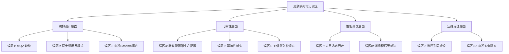

## 常见误区

消息队列是分布式系统的"瑞士军刀"，但正如任何强大工具一样，使用不当反而会引入新的复杂性和故障。本节梳理生产环境中最高频的十大误区，每个误区都从"症状→根因→纠正"三步剖析，帮助读者建立正确的认知框架。



---

### 误区一：消息队列万能论——"所有问题都能用MQ解决"

#### 典型症状

团队遇到任何解耦、缓冲、异步化需求时，第一反应都是"加个消息队列"。结果系统中出现了十几个 Topic、几十个消费者组，架构复杂度急剧上升，排查问题时要跨越多个中间件跳板。

#### 根因分析

消息队列的三大核心价值是**异步化**、**解耦**、**流量削峰**。但并非所有场景都需要引入MQ：

| 场景 | 是否需要MQ | 更好的方案 |
|------|-----------|-----------|
| 两个服务间实时请求-响应 | ❌ 不需要 | 直接 RPC / HTTP 调用 |
| 数据库变更通知下游 | ✅ 适合 | CDC（Debezium）+ MQ |
| 大促流量削峰 | ✅ 适合 | MQ 缓冲 + 限流 |
| 配置中心下发配置 | ❌ 不需要 | 专用配置中心（Nacos/Apollo） |
| 实时日志采集 | ⚠️ 看规模 | 小规模用 Filebeat，大规模用 Kafka |
| 文件上传后处理 | ✅ 适合 | MQ 异步触发转码/审核 |
| 同步返回处理结果给调用方 | ❌ 反模式 | 同步 RPC 或 Request-Reply Queue |

**核心判断标准**：

需要引入MQ的信号：
  1. 调用方不需要立即拿到结果（可异步）
  2. 生产者和消费者的生命周期/部署节奏不同
  3. 流量存在明显的峰谷差，需要削峰填谷
  4. 下游消费者有多个，且未来可能继续增加

不需要引入MQ的信号：
  1. 调用方必须同步等待结果
  2. 系统只有单一消费者
  3. 延迟要求 < 10ms
  4. 业务逻辑本身已经足够复杂，不宜再加中间层

#### 纠正方法

采用"**先问三个问题**"的决策框架：

1. **同步还是异步？** 如果必须同步，MQ不是正确选择。
2. **需要解耦几个系统？** 仅两个系统直连即可，三个以上才值得引入MQ。
3. **流量是否有峰谷？** 平稳流量不需要削峰，除非有解耦需求。

```python
# 反例：用MQ做同步调用，调用方轮询等待结果
producer.send('request-topic', request_data)
# ... 轮询 response-topic 等结果，最大等30秒
# 问题：延迟高、资源浪费、链路复杂

# 正例：同步场景用RPC，异步场景才用MQ
# 同步调用
result = http_client.post("http://service-a/api", data=request_data)

# 异步场景：订单创建后异步通知库存、物流、营销
producer.send('order-created-topic', order_data)
# 各消费者独立处理，互不影响
```

---

### 误区二：把MQ当同步RPC用——Request-Reply反模式

#### 典型症状

生产者发送消息后，立即轮询（polling）一个"回复Topic"等待消费者处理结果。或者在消费者处理完后，要求消费者回调生产者的接口。系统延迟飙升，链路变得脆弱。

#### 根因分析

消息队列的本质是**单向异步通信**。将其改造为双向同步通信，违背了MQ的设计初衷：

❌ Request-Reply 反模式：

Producer ──发送请求──→ [Request Topic] ──→ Consumer
Producer ←──轮询等─── [Response Topic] ←── Consumer

问题：
  1. 延迟 = MQ传输延迟 + 消费者处理 + 再次MQ传输
  2. Response Topic 的消息可能丢失或延迟，导致轮询超时
  3. 消费者处理失败时，生产者难以感知
  4. 如果消费者需要回滚，无有效的通知机制

#### 纠正方法

根据实际需求选择正确的通信模式：

通信模式选择矩阵：

┌─────────────────────┬──────────────────┬──────────────────────┐
│     需求            │    推荐方案       │    不推荐方案         │
├─────────────────────┼──────────────────┼──────────────────────┤
│ 同步调用+即时响应    │ gRPC / HTTP      │ MQ + 轮询             │
│ 异步处理+无需结果    │ MQ 单向通信      │ RPC + 回调            │
│ 异步处理+最终通知    │ MQ + Webhook/回调 │ MQ + 轮询             │
│ 批量处理+汇总结果    │ 汇总Topic+定时消费│ 逐条轮询              │
└─────────────────────┴──────────────────┴──────────────────────┘

**当确实需要"异步处理+最终通知"时**，正确做法是：

```python
# 生产者：发送任务 + 监听回调Topic
producer.send('task-topic', {
    'task_id': 'xxx',
    'callback_topic': 'task-result-xxx',  # 专用回调Topic
    'payload': data
})

# 消费者：处理完毕后发送结果到回调Topic
def process_task(message):
    result = do_work(message['payload'])
    # 发送结果到生产者指定的回调Topic
    producer.send(message['callback_topic'], {
        'task_id': message['task_id'],
        'status': 'completed',
        'result': result
    })
```

这比轮询好得多，但仍然不如直接使用 RPC + 异步任务模式（如 Celery/Temporal）。

---

### 误区三：忽略消息Schema演进——"改个字段就炸了"

#### 典型症状

上游生产者修改了消息格式（加字段、删字段、改类型），下游消费者解析失败，开始大量报错。更隐蔽的情况是：新字段缺失时用了默认值，导致业务逻辑静默出错。

#### 根因分析

消息队列中，生产者和消费者是**独立部署、独立演进**的。如果没有统一的 Schema 管理，消息格式变更就是定时炸弹：

时间线灾难场景：

Day 1:  生产者发送 {"user_id": 123, "action": "buy"}
Day 30: 生产者升级，发送 {"user_id": 123, "action": "buy", "amount": 99.9}
Day 60: 老消费者还在运行，期望只有2个字段 → 可能解析异常
Day 90: 生产者删除 "action" 字段 → 所有消费者全部崩溃

#### 纠正方法

**（1）采用 Schema Registry 管理消息格式**

```python
# 使用 Confluent Schema Registry + Avro
from confluent_kafka import avro
from confluent_kafka.avro import AvroProducer

# 定义 Schema（带版本号）
schema_v1 = avro.loads('''
{
    "type": "record",
    "name": "Order",
    "fields": [
        {"name": "user_id", "type": "long"},
        {"name": "action", "type": "string"}
    ]
}''')

schema_v2 = avro.loads('''
{
    "type": "record",
    "name": "Order",
    "fields": [
        {"name": "user_id", "type": "long"},
        {"name": "action", "type": "string"},
        {"name": "amount", "type": ["null", "double"], "default": null}
    ]
}''')
```

**（2）遵循兼容性规则**

| 变更类型 | 向前兼容 | 向后兼容 | 安全性 |
|---------|---------|---------|--------|
| 新增可选字段 | ✅ | ✅ | 安全 |
| 新增必填字段 | ❌ | ❌ | 危险 |
| 删除可选字段 | ✅ | ⚠️ | 需确认无消费者依赖 |
| 删除必填字段 | ❌ | ❌ | 危险 |
| 修改字段类型 | ❌ | ❌ | 危险 |
| 重命名字段 | ❌ | ❌ | 危险（先加后删） |

**黄金规则**：只做向后兼容的变更。新增字段用 `default` 值，删除字段先标记 `@Deprecated` 一个发布周期后再删。

```python
# ✅ 安全的 Schema 演进：新增可选字段，带默认值
schema_v2 = avro.loads('''
{
    "type": "record",
    "name": "Order",
    "fields": [
        {"name": "user_id", "type": "long"},
        {"name": "action", "type": "string"},
        {"name": "amount", "type": ["null", "double"], "default": null}
    ]
}''')

# ❌ 危险的 Schema 演进：直接改类型
# {"name": "user_id", "type": "string"}  ← 从 long 改成 string，解析崩溃
```

---

### 误区四：默认配置直上生产——"先跑起来再说"

#### 典型症状

开发者在本地用 Docker Compose 搭了一套 Kafka/RabbitMQ，使用默认配置通过了功能测试，然后直接把相同配置部署到生产环境。上线后出现消息丢失、消费延迟飙升、连接数爆炸等问题。

#### 根因分析

消息队列的默认配置是为**开发/测试场景**设计的，与生产环境的要求差距巨大：

默认配置 vs 生产配置的典型差距：

Kafka 默认配置的隐患：
  acks=1          → 只等 Leader 确认，Follower 未同步就返回成功 → 消息可能丢失
  replication.factor=1 → 无副本，Leader 宕机即数据丢失
  auto.offset.reset=latest → 消费者重启后丢失之前的未消费消息
  batch.size=16KB  → 小批量，高吞吐场景下网络效率低下
  linger.ms=0      → 不等待，每条消息单独发送，延迟高但吞吐低

RabbitMQ 默认配置的隐患：
  durability=non-durable → 队列不持久化，Broker 重启即丢失
  prefetch_count=unlimited → 消费者堆积大量未确认消息，内存溢出
  heartbeat=60s     → 网络抖动时连接不及时断开，僵尸连接占用资源

#### 纠正方法

**Kafka 生产环境配置清单**：

```yaml
# producer 关键配置
producer:
  acks: all                    # 等待所有ISR副本确认
  retries: 3                   # 失败重试
  enable.idempotence: true     # 开启幂等，防止重复消息
  max.in.flight.requests.per.connection: 5  # 幂等下允许5个并发
  linger.ms: 5                 # 批量发送等待时间
  batch.size: 32768            # 批量大小32KB
  compression.type: lz4        # 压缩算法
  buffer.memory: 67108864      # 发送缓冲区64MB

# consumer 关键配置
consumer:
  enable.auto.commit: false    # 手动提交offset
  auto.offset.reset: earliest  # 从最早消息开始消费
  max.poll.records: 500        # 单次拉取最大记录数
  session.timeout.ms: 30000    # 会话超时
  heartbeat.interval.ms: 10000 # 心跳间隔

# topic 关键配置
topic:
  replication.factor: 3        # 至少3副本
  min.insync.replicas: 2       # 至少2个ISR同步
  cleanup.policy: delete       # 或 compact，取决于业务
  retention.ms: 604800000      # 消息保留7天
```

**RabbitMQ 生产环境配置清单**：

```python
# 生产级队列声明
channel.queue_declare(
    queue='order-queue',
    durable=True,              # 持久化队列
    arguments={
        'x-message-ttl': 3600000,       # 消息TTL 1小时
        'x-dead-letter-exchange': '',   # 死信交换机
        'x-dead-letter-routing-key': 'order-dlq',
        'x-max-length': 100000,         # 最大消息数
        'x-overflow': 'reject-publish'  # 超限时拒绝新消息
    }
)

# 消费者 prefetch 设置
channel.basic_qos(prefetch_count=50)  # 每次最多预取50条
```

---

### 误区五：忽略消费者幂等性——"重复消费不会发生吧？"

#### 典型症状

生产环境偶尔出现重复扣款、重复发货、重复发优惠券等业务异常。排查发现是同一条消息被消费了多次。

#### 根因分析

消息重复是分布式系统的**常态**，不是异常。以下是必然导致重复消费的场景：

重复消费的常见触发场景：

1. Consumer 处理完业务逻辑但提交 offset 前崩溃
   → 重启后从上次提交的 offset 重新消费 → 同一条消息处理两次

2. Consumer Group 发生 Rebalance
   → Partition 被重新分配给其他 Consumer
   → 之前未提交的 offset 对应的消息被重新消费

3. 网络抖动导致 offset 提交失败
   → Consumer 认为已提交，Broker 未收到 → 重启后重复消费

4. Producer 开启重试但未开启幂等
   → 同一条消息被发送多次（Broker 收到多份）

5. Kafka 的 at-least-once 语义（默认）
   → 保证消息不丢，但可能重复

**关键认知**：在分布式系统中，at-most-once（最多一次）= 可能丢消息，at-least-once（至少一次）= 可能重复消息，exactly-once（恰好一次）= 需要端到端事务支持。大多数场景下，**at-least-once + 消费端幂等**是最佳实践。

#### 纠正方法

**（1）基于唯一ID的幂等表**

```python
import hashlib

def process_with_idempotency(message):
    msg_id = message.headers.get('message_id') or \
             hashlib.md5(message.value).hexdigest()
    
    # 检查是否已处理
    if db.execute("SELECT 1 FROM processed_messages WHERE msg_id = %s", [msg_id]).fetchone():
        log.info(f"消息 {msg_id} 已处理，跳过")
        return
    
    try:
        # 执行业务逻辑
        process(message.value)
        
        # 在同一事务中记录已处理的ID + 提交业务结果
        db.execute("INSERT INTO processed_messages (msg_id, processed_at) VALUES (%s, NOW())", [msg_id])
        db.commit()
    except Exception as e:
        db.rollback()
        raise
```

**（2）基于Redis的幂等（高性能场景）**

```python
import redis

r = redis.Redis()

def process_with_redis_idempotency(message):
    msg_id = message.headers.get('message_id')
    
    # SET NX：仅当key不存在时设置成功（原子操作）
    if not r.set(f"msg:processed:{msg_id}", "1", nx=True, ex=86400):
        log.info(f"消息 {msg_id} 已处理，跳过")
        return
    
    try:
        process(message.value)
    except Exception:
        # 处理失败，删除标记以便重试
        r.delete(f"msg:processed:{msg_id}")
        raise
```

**（3）基于业务字段的幂等（天然幂等设计）**

```python
# 最优雅的方案：让业务本身幂等
# 例：订单状态机更新
def update_order_status(order_id, target_status):
    # UPDATE WHERE status < target_status（状态只能前进）
    affected = db.execute("""
        UPDATE orders 
        SET status = %s, updated_at = NOW() 
        WHERE id = %s AND status < %s
    """, [target_status, order_id, target_status])
    
    if affected.rowcount == 0:
        # 状态已经到达或超过目标状态，幂等跳过
        return
    # 更新成功，继续后续逻辑
```

**幂等方案选择指南**：

| 方案 | 适用场景 | 优点 | 缺点 |
|------|---------|------|------|
| 幂等表 | 通用场景 | 可靠，支持审计 | 需要额外存储，有DB压力 |
| Redis SET NX | 高吞吐场景 | 性能高，无DB压力 | 过期后重复标记消失 |
| 业务天然幂等 | 状态机/幂等操作 | 无额外开销 | 不适用于所有业务 |
| 版本号乐观锁 | 并发更新场景 | 简单，无需额外表 | 需要业务表支持版本字段 |

---

### 误区六：死信队列成了"垃圾场"——放置不管

#### 典型症状

系统运行几个月后，死信队列（DLQ）中积累了数十万条消息，无人关注。直到下游业务出现数据缺失，才开始排查——发现大量本应处理的消息被"扔进了垃圾堆"。

#### 根因分析

死信队列的本意是**兜底 + 可观测**，不是"丢弃队列"。很多团队设置了DLQ但没有配套的监控、告警和处理流程：

死信队列失控的典型路径：

1. 消费者处理失败 → 消息进入DLQ → 无人查看
2. DLQ 消息持续堆积 → 磁盘占满 → 影响Broker性能
3. 业务数据开始缺失 → 财务对账不平 → 紧急排查
4. 发现DLQ中有3个月的数据 → 重新消费 → 大量业务异常（数据过期）

#### 纠正方法

**（1）建立 DLQ 处理流程**

```python
# 死信队列消费者：分类处理
def process_dlq(message):
    original_topic = message.headers.get('original_topic')
    retry_count = message.headers.get('retry_count', 0)
    error_reason = message.headers.get('error_reason')
    
    # 分类处理策略
    if error_reason == 'PARSE_ERROR':
        # 消息格式错误 → 告警 + 人工检查
        alert_ops(f"DLQ: 消息格式错误, topic={original_topic}, msg={message.value[:200]}")
        store_for_manual_review(message)
        
    elif error_reason == 'BUSINESS_ERROR':
        if retry_count < 5:
            # 业务处理失败但未达上限 → 重新投递到原Topic（带退避延迟）
            delay = min(retry_count * 30, 300)  # 30s, 60s, 90s... 最大300s
            schedule_retry(message, delay_seconds=delay)
        else:
            # 超过重试上限 → 人工介入
            alert_ops(f"DLQ: 重试{retry_count}次仍失败, 需人工处理")
            store_for_manual_review(message)
            
    elif error_reason == 'TIMEOUT':
        # 超时消息 → 重新投递
        schedule_retry(message, delay_seconds=10)
```

**（2）DLQ 监控告警**

```yaml
# Prometheus 告警规则
groups:
  - name: dlq_alerts
    rules:
      - alert: DLQMessageCountHigh
        expr: kafka_consumer_group_lag{topic=~".*DLQ.*"} > 100
        for: 5m
        labels:
          severity: warning
        annotations:
          summary: "死信队列消息数超过100条"
          
      - alert: DLQMessageCountCritical
        expr: kafka_consumer_group_lag{topic=~".*DLQ.*"} > 1000
        for: 2m
        labels:
          severity: critical
        annotations:
          summary: "死信队列消息数超过1000条，需立即处理"
```

**（3）DLQ 消息生命周期管理**

| 阶段 | 处理方式 | 超时 |
|------|---------|------|
| 刚进入DLQ | 自动重试投递到原Topic | 立即 |
| 重试3次仍失败 | 告警 + 进入待人工处理队列 | — |
| 人工处理 | 检查数据 → 手动修复/丢弃/补偿 | 7天 |
| 超过7天未处理 | 归档到冷存储 + 标记为过期 | 90天后删除 |

---

### 误区七：盲目追求高吞吐——"吞吐量越高越好"

#### 典型症状

为了追求极限吞吐，将批量大小（batch.size）设得很大、 linger.ms 设得很长、消费者开启大量并行线程。结果吞吐量确实上去了，但消息延迟从几毫秒飙升到几秒甚至几十秒，下游业务投诉"数据不及时"。

#### 根因分析

吞吐量和延迟是**天然矛盾**的两个指标：

吞吐量 vs 延迟的权衡关系：

                高延迟
                  ↑
    大 batch     |     极致吞吐
    长 linger    |     (但延迟高)
    压缩传输     |
                  |
    ←─────────────┼─────────────→ 高吞吐
                  |
    小 batch     |     极致低延迟
    短 linger    |     (但吞吐低)
    无压缩       |
                  ↓
                低延迟

**关键参数对延迟的影响**：

| 参数 | 增大效果 | 延迟影响 | 吞吐影响 |
|------|---------|---------|---------|
| batch.size | 更多消息攒批发送 | +linger.ms 时间 | ↑ 提升 |
| linger.ms | 等待更久再发送 | +linger.ms 时间 | ↑ 提升 |
| compression.type | 启用压缩 | +CPU 开销，~1-5ms | ↑↑ 显著提升 |
| acks | acks=all 比 acks=1 | +数十ms（等副本同步） | ↓ 降低 |
| fetch.min.bytes | 消费者攒更多再返回 | +等待时间 | ↑ 提升 |
| max.poll.records | 单次处理更多消息 | ↑ 处理耗时 | ↑ 提升 |

#### 纠正方法

**根据业务场景选择合适的平衡点**：

```python
# 场景一：实时交易（延迟优先）
producer = KafkaProducer(
    acks='all',
    batch.size=16384,        # 16KB 小批量
    linger.ms=0,             # 不等待，立即发送
    compression.type=None,   # 不压缩，避免CPU开销
    buffer.memory=33554432   # 32MB 缓冲
)
# 预期：延迟 < 5ms，吞吐 ~50K msg/s

# 场景二：日志采集（吞吐优先）
producer = KafkaProducer(
    acks=1,                  # 只等Leader确认
    batch.size=1048576,      # 1MB 大批量
    linger.ms=100,           # 等100ms攒批
    compression.type='lz4',  # LZ4压缩，速度快
    buffer.memory=134217728  # 128MB 缓冲
)
# 预期：延迟 ~100ms，吞吐 ~500K msg/s

# 场景三：业务消息（均衡配置）
producer = KafkaProducer(
    acks='all',
    batch.size=65536,        # 64KB
    linger.ms=10,            # 等10ms
    compression.type='lz4',
    buffer.memory=67108864   # 64MB 缓冲
)
# 预期：延迟 < 15ms，吞吐 ~200K msg/s
```

---

### 误区八：消息积压无感知——"等积压了再处理"

#### 典型症状

系统正常运行时一切良好，某天突然发现下游数据延迟了几小时。排查发现消费者早就跟不上生产者的速度了，但没有及时发现。等到积压了几百万条消息才告警，此时处理积压又需要很长时间。

#### 根因分析

消息积压是**渐进性问题**——从"刚好跟上"到"严重落后"可能只需要几分钟的流量突增。如果没有实时监控消费 Lag，等业务感知到问题时，积压已经很严重了：

消息积压的典型时间线：

T+0min:  生产者流量突增3倍（大促开始/上游故障恢复）
T+2min:  消费者开始跟不上，Lag从0增长到几千
T+5min:  Lag达到数万，无告警触发
T+15min: Lag达到百万级，下游数据延迟15分钟
T+30min: 业务方投诉"数据不对"
T+60min: 排查定位 + 紧急扩容 + 消费积压

#### 纠正方法

**（1）监控 Consumer Lag（最关键指标）**

```bash
# Kafka 命令行查看 Lag
kafka-consumer-groups.sh --bootstrap-server localhost:9092 \
  --describe --group order-processor

# 输出示例：
# GROUP           TOPIC      PARTITION  CURRENT-OFFSET  LOG-END-OFFSET  LAG
# order-processor order-topic  0        123456          123460          4
# order-processor order-topic  1        78901           78901           0
# order-processor order-topic  2        45678           56789           11111  ← 这个Partition积压了
```

**（2）基于 Lag 的分级告警**

```python
# Prometheus + Alertmanager 告警配置
ALERT_RULES = {
    # 黄色告警：Lag > 1万 或延迟 > 1分钟
    'warning': {
        'condition': 'lag > 10000 or lag_seconds > 60',
        'action': '飞书/钉钉通知',
        'auto_action': None
    },
    # 橙色告警：Lag > 10万 或延迟 > 5分钟
    'critical': {
        'condition': 'lag > 100000 or lag_seconds > 300',
        'action': '电话告警 + 自动扩容',
        'auto_action': 'scale_consumer_group --replicas +2'
    },
    # 红色告警：Lag > 100万 或延迟 > 30分钟
    'emergency': {
        'condition': 'lag > 1000000 or lag_seconds > 1800',
        'action': '全部oncall + 紧急扩容 + 限流上游',
        'auto_action': 'emergency_scale --replicas +5 &amp;&amp; throttle_producer --rate 50%'
    }
}
```

**（3）自动扩容策略**

```python
# KPA（Kafka Pod Autoscaler）配置示例
# 基于 Consumer Lag 的自动扩缩容
apiVersion: autoscaling/v2
kind: HorizontalPodAutoscaler
metadata:
  name: consumer-hpa
spec:
  scaleTargetRef:
    apiVersion: apps/v1
    kind: Deployment
    name: order-consumer
  minReplicas: 3
  maxReplicas: 20
  metrics:
  - type: Pods
    pods:
      metric:
        name: kafka_consumer_lag
      target:
        type: AverageValue
        averageValue: "1000"  # 每个Pod平均Lag超过1000就扩容
```

**（4）紧急积压处理方案**

当积压已经发生时的处理流程：

1. 先止血：限流上游生产者
2. 快速扩容：增加消费者实例数
3. 并行度检查：确认 Partition 数 >= 消费者数
   （如果 Partition 只有3个但消费者扩到10个，多出的7个消费者空转）
4. 消费者逻辑优化：如果业务允许，跳过非关键处理
5. 临时方案：将积压消息转存到新的Topic，用批量消费者处理
6. 处理完毕后恢复限流，观察Lag是否回到正常水位

---

### 误区九：监控形同虚设——"装了Prometheus就万事大吉"

#### 典型症状

部署了 Prometheus + Grafana 大盘，上面有几十个面板，但面板上的数据从没被真正看过。告警规则要么没有、要么全是 Info 级别被忽略了。出问题时还是靠"用户投诉"才发现。

#### 根因分析

监控体系有三个层次，很多团队只做到了第一层就停了：

监控成熟度模型：

Level 1 - 有数据（大多数团队停在这里）
  ✅ 部署了 Prometheus
  ✅ 有 Grafana 大盘
  ❌ 没有告警规则
  ❌ 没有人看大盘

Level 2 - 能告警（少数团队达到）
  ✅ 配置了基础告警
  ✅ 告警发到群里
  ❌ 告警噪音太多，被忽略
  ❌ 没有告警分级

Level 3 - 可行动（优秀团队的目标）
  ✅ 告警分级明确（P0/P1/P2）
  ✅ 每个告警有对应的 Runbook
  ✅ 自动化应急响应（自动扩容/限流/切换）
  ✅ 定期演练告警流程

#### 纠正方法

**（1）消息队列必监控的六大指标**

| 指标 | 含义 | 告警阈值（参考） | 监控方式 |
|------|------|----------------|---------|
| Consumer Lag | 消费者落后量 | >1万 warning, >10万 critical | kafka-consumer-groups |
| 生产者发送失败率 | 发送失败比例 | >0.1% warning, >1% critical | Producer metrics |
| Broker 磁盘使用率 | 磁盘空间占比 | >70% warning, >85% critical | node_exporter |
| ISR 副本数 | 同步副本是否充足 | min.isr 不满足 critical | kafka metrics |
| 消费者重平衡频率 | Rebalance 次数 | >3次/小时 warning | Consumer metrics |
| 消息延迟（端到端） | 从生产到消费的时间 | >1秒 warning, >5秒 critical | 自定义埋点 |

**（2）建立 Runbook 体系**

```markdown
# Runbook: Consumer Lag 超过 10万

## 触发条件
- kafka_consumer_group_lag > 100000 持续 5 分钟

## 排查步骤
1. 确认是整体积压还是单个Partition积压
   - 整体：消费者实例数不足
   - 单个：可能存在数据倾斜

2. 检查消费者日志
   - grep "ERROR" /var/log/consumer.log | tail -50
   - 关注：数据库连接超时、下游API异常、OOM

3. 检查消费者实例状态
   - kubectl get pods -l app=consumer
   - 确认没有 CrashLoopBackOff

## 处理步骤
1. 如果是实例不足 → 扩容
2. 如果是数据倾斜 → 检查Partition Key分布
3. 如果是下游异常 → 临时跳过或降级处理
4. 如果是OOM → 增加内存或减少prefetch_count

## 事后复盘
- 记录积压峰值和持续时间
- 评估是否需要调整告警阈值
- 评估是否需要自动扩容
```

**（3）Grafana 核心大盘模板**

消息队列监控大盘布局（推荐）：

第一行（全局概览）：
  [Producer 发送速率] [Consumer 消费速率] [整体 Lag 趋势]

第二行（健康状态）：
  [Broker 节点状态] [ISR 副本数] [磁盘使用率]

第三行（消费者详情）：
  [各 Consumer Group Lag] [Rebalance 频率] [消费延迟分布]

第四行（告警与事件）：
  [最近告警列表] [近期 Rebalance 事件] [Broker 重启事件]

---

### 误区十：忽视安全隔离——"内网环境不用管安全"

#### 典型症状

开发环境的 Kafka/RabbitMQ 没有设置认证和权限控制，所有服务共享同一个集群。测试人员直接用工具连上生产集群读取/发送消息。某个服务的 Bug 导致它向错误的 Topic 写入了大量垃圾数据，污染了整个队列。

#### 根因分析

"内网环境不需要安全"是危险的假设：

MQ 安全风险清单：

1. 未授权访问
   - 任何能访问内网的进程都可以连接Broker
   - 微服务A的Bug可能写入微服务B的Topic

2. 数据泄露
   - 消息中可能包含用户手机号、身份证号、支付信息
   - 未加密传输 = 内网中间人可嗅探

3. 恶意投毒
   - 某个被入侵的服务向队列投递恶意消息
   - 下游消费者处理恶意消息 → 执行恶意代码/RCE

4. 资源耗尽攻击
   - 恶意或Bug服务疯狂生产消息
   - Broker 磁盘/内存被耗尽，影响所有业务

#### 纠正方法

**（1）Kafka ACL 权限控制**

```bash
# 创建用户
kafka-configs.sh --bootstrap-server localhost:9092 \
  --alter --add-config 'SCRAM-SHA-256=[password=order-service-pwd]' \
  --entity-type users --entity-name order-service

# 授权：order-service 只能读写 order-topic
kafka-acls.sh --bootstrap-server localhost:9092 \
  --add --allow-principal User:order-service \
  --operation Read --operation Write \
  --topic order-topic

# 授权：order-service 只能从 order-group 消费
kafka-acls.sh --bootstrap-server localhost:9092 \
  --add --allow-principal User:order-service \
  --operation Read \
  --group order-group

# 拒绝：order-service 不能访问 payment-topic
kafka-acls.sh --bootstrap-server localhost:9092 \
  --add --deny-principal User:order-service \
  --operation Read --operation Write \
  --topic payment-topic
```

**（2）环境隔离策略**

多环境MQ隔离方案：

开发环境（Dev）
  ├── Broker: dev-kafka.internal:9092
  ├── 认证: 无（方便开发）
  ├── 数据: 测试数据，可随时重置
  └── Topic: 任何服务可创建/删除

测试环境（Staging）
  ├── Broker: staging-kafka.internal:9092
  ├── 认证: SCRAM-SHA-256
  ├── 数据: 脱敏后的生产数据子集
  └── Topic: 基础ACL，模拟生产权限

生产环境（Production）
  ├── Broker: prod-kafka.internal:9093（非默认端口）
  ├── 认证: SCRAM-SHA-512 + TLS 加密
  ├── 数据: 真实数据，严格保护
  └── Topic: 严格ACL，最小权限原则

**（3）消息内容加密**

```python
from cryptography.fernet import Fernet

# 敏感消息加密后再发送
cipher = Fernet(ENCRYPTION_KEY)

def send_sensitive_message(producer, topic, sensitive_data):
    # 加密
    encrypted = cipher.encrypt(json.dumps(sensitive_data).encode())
    producer.send(topic, encrypted)

def consume_sensitive_message(message):
    # 解密
    decrypted = cipher.decrypt(message.value)
    data = json.loads(decrypted)
    return data
```

---

### 误区速查表

下表汇总十大误区的快速对照：

| # | 误区 | 一句话描述 | 核心纠正措施 |
|---|------|-----------|-------------|
| 1 | MQ万能论 | 不是所有场景都适合用MQ | 先问三个问题：同步/异步、解耦数、流量形态 |
| 2 | 当同步RPC用 | MQ的本质是单向异步通信 | 同步场景用RPC，异步通知用Webhook/回调Topic |
| 3 | 忽视Schema演进 | 消息格式变更导致下游崩溃 | Schema Registry + 向后兼容变更 |
| 4 | 默认配置上生产 | 开发配置和生产配置差距巨大 | 按照生产配置清单逐项检查 |
| 5 | 幂等性缺失 | 消息重复是常态不是异常 | 幂等表/Redis NX/业务天然幂等 |
| 6 | DLQ放置不管 | 死信队列不是垃圾场 | 分类处理 + 监控告警 + 生命周期管理 |
| 7 | 盲目追求吞吐 | 吞吐和延迟天然矛盾 | 根据业务场景选择平衡点 |
| 8 | 积压无感知 | 等业务投诉才发现就晚了 | 实时监控Lag + 分级告警 + 自动扩容 |
| 9 | 监控形同虚设 | 装了不看等于没装 | 告警分级 + Runbook + 定期演练 |
| 10 | 忽视安全隔离 | 内网不等于安全 | ACL认证 + 环境隔离 + 敏感数据加密 |

---

### 建立反误区检查清单

在每次消息队列相关的架构评审或代码审查中，使用以下检查清单：

□ 1. 这个场景真的需要MQ吗？有没有更简单的方案？
□ 2. 生产者配置是否已调整为生产级别？（acks、replication、幂等）
□ 3. 消费者是否有幂等处理？消息重复时业务是否正确？
□ 4. 消息Schema是否有版本管理？变更是否向后兼容？
□ 5. 是否配置了死信队列？DLQ是否有监控和处理流程？
□ 6. Consumer Lag 是否有实时监控和分级告警？
□ 7. 吞吐量和延迟的平衡是否符合业务SLA？
□ 8. 是否有自动扩容机制应对流量突增？
□ 9. ACL权限是否遵循最小权限原则？
□ 10. 监控大盘是否有人定期Review？告警是否有Runbook？

---

### 总结

消息队列的误区本质上可以归结为三类：

1. **认知误区**：不了解MQ的适用边界和设计初衷（误区1、2）
2. **工程误区**：低估了分布式系统的复杂性（误区3、4、5、6）
3. **运维误区**：重建设轻运营，缺乏持续治理（误区7、8、9、10）

避免这些误区的核心方法论：

- **先设计后实施**：不要急着"跑起来"，先花时间做好Schema设计、权限规划、监控方案
- **以终为始**：从生产环境的要求倒推开发和测试的配置
- **假设一切都会出错**：消息会重复、会丢失、会积压、格式会变——在设计阶段就考虑这些
- **监控不是可选项**：没有监控的MQ就像没有仪表盘的飞机，迟早出事
