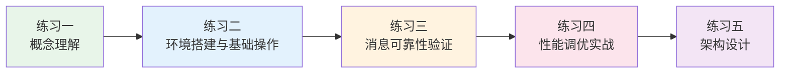

## 练习方法

本章提供了五个递进式练习，覆盖从概念理解到架构设计的完整学习路径。每个练习都基于本章理论基础和核心技巧中的真实场景，读者可以独立动手验证。

建议按顺序完成：先建立概念框架，再动手实操，逐步进入排查、优化和架构设计的深水区。总预计耗时约 4 小时（不含环境搭建的额外时间）。



---

### 练习一：消息队列核心概念理解（预计 30 分钟）

**目标**：深入理解消息模型、投递语义和消费者组三大核心概念，能用自己的语言向他人讲解，并能画出完整架构图。

**步骤**：

**1. 对比四大消息队列的架构差异（10 分钟）**

阅读本章"主流消息队列架构"和"选型对比"部分，然后完成下表（先遮住答案，凭记忆填写）：

| 维度 | Kafka | RabbitMQ | RocketMQ | Pulsar |
|------|-------|----------|----------|--------|
| 存储模型 | | | | |
| 消费模式 | | | | |
| 消息可靠性机制 | | | | |
| 事务消息支持 | | | | |
| 延迟消息实现 | | | | |

重点理解以下问题：
- Kafka 的 Partition 和 RabbitMQ 的 Queue 有什么本质区别？为什么 Kafka 的消费者数不能超过 Partition 数？
- 为什么 RocketMQ 要用 CommitLog + ConsumeQueue 双层结构，而不是像 Kafka 那样按 Topic 分文件存储？
- Pulsar 的计算存储分离架构带来了什么好处，又引入了什么复杂度？

**2. 画出三种投递语义的时序图（10 分钟）**

用 Mermaid 或手绘的方式，分别画出 At-Most-Once、At-Least-Once、Exactly-Once 三种语义的消息流转过程。标注每个时序图中 ACK 的时机、可能出错的节点、以及对应的消息丢失/重复风险。

重点标注：
- At-Most-Once：ACK 在处理之前 → 崩溃后消息丢失
- At-Least-Once：ACK 在处理之后 → 崩溃后消息重复
- Exactly-Once：幂等生产者 + 事务提交偏移量 → 无丢失无重复，但有性能代价

**3. 消费者组原理可视化（10 分钟）**

画出以下场景的消费者组分配图：
- Topic 有 6 个 Partition，消费者组 A 有 3 个消费者 → 每个消费者分到 2 个 Partition
- 新增 2 个消费者加入组 → 触发 Rebalance，重新分配
- 1 个消费者宕机 → 触发 Rebalance，剩余 4 个消费者接管

标注每种情况下 Offset 的消费位点和 Lag 的变化。

**检查标准**：
- [ ] 能用口头语言解释 Kafka Partition 与 RabbitMQ Queue 的本质区别
- [ ] 能准确画出三种投递语义的时序图，并指出每种的适用场景
- [ ] 能描述 Rebalance 的触发条件和分区重分配逻辑
- [ ] 理解 At-Least-Once + 消费端幂等是生产环境的最佳实践

---

### 练习二：Kafka 环境搭建与基础操作（预计 60 分钟）

**目标**：独立搭建单节点 Kafka 环境，完成 Topic 创建、消息生产和消费的完整链路，理解 Kafka 的基本工作流程。

**步骤**：

**1. 环境搭建（20 分钟）**

使用 Docker Compose 快速搭建 Kafka + Zookeeper 环境：

```yaml
# docker-compose.yml
version: '3.8'
services:
  zookeeper:
    image: confluentinc/cp-zookeeper:7.5.0
    container_name: zookeeper
    environment:
      ZOOKEEPER_CLIENT_PORT: 2181
      ZOOKEEPER_TICK_TIME: 2000
    ports:
      - "2181:2181"

  kafka:
    image: confluentinc/cp-kafka:7.5.0
    container_name: kafka
    depends_on:
      - zookeeper
    ports:
      - "9092:9092"
    environment:
      KAFKA_BROKER_ID: 1
      KAFKA_ZOOKEEPER_CONNECT: zookeeper:2181
      KAFKA_ADVERTISED_LISTENERS: PLAINTEXT://localhost:9092
      KAFKA_OFFSETS_TOPIC_REPLICATION_FACTOR: 1
      KAFKA_TRANSACTION_STATE_LOG_MIN_ISR: 1
      KAFKA_TRANSACTION_STATE_LOG_REPLICATION_FACTOR: 1
```

```bash
# 启动环境
docker compose up -d

# 验证 Kafka 启动成功
docker compose logs kafka | grep "started"

# 进入 Kafka 容器执行后续命令
docker compose exec kafka bash
```

**2. Topic 管理操作（15 分钟）**

```bash
# 创建 Topic：6 个分区，3 副本（单节点环境下设为 1）
kafka-topics --create \
  --bootstrap-server localhost:9092 \
  --topic order-events \
  --partitions 6 \
  --replication-factor 1 \
  --config retention.ms=86400000 \
  --config segment.ms=3600000

# 查看 Topic 详情
kafka-topics --describe --bootstrap-server localhost:9092 --topic order-events

# 创建一个带死信队列的 Topic（用于练习三）
kafka-topics --create \
  --bootstrap-server localhost:9092 \
  --topic order-events-dlq \
  --partitions 3 \
  --replication-factor 1

# 列出所有 Topic
kafka-topics --list --bootstrap-server localhost:9092
```

**3. 消息生产与消费（15 分钟）**

```bash
# 启动生产者（交互模式，手动输入消息）
kafka-console-producer \
  --bootstrap-server localhost:9092 \
  --topic order-events \
  --property parse.key=true \
  --property key.separator=:

# 在生产者中输入以下消息（每行一条，回车发送）：
# order-001:{"user_id": 1001, "action": "created", "amount": 99.9}
# order-002:{"user_id": 1002, "action": "created", "amount": 199.0}
# order-003:{"user_id": 1001, "action": "paid", "amount": 99.9}

# 另开终端，启动消费者（从最早消息开始消费）
kafka-console-consumer \
  --bootstrap-server localhost:9092 \
  --topic order-events \
  --from-beginning \
  --group test-consumer-group
```

**4. 消费者组与 Offset 管理（10 分钟）**

```bash
# 查看消费者组列表
kafka-consumer-groups --bootstrap-server localhost:9092 --list

# 查看消费者组详情（重点关注 Lag）
kafka-consumer-groups --bootstrap-server localhost:9092 \
  --group test-consumer-group \
  --describe

# 重置 Offset（将消费者组的 Offset 重置到最早）
kafka-consumer-groups --bootstrap-server localhost:9092 \
  --group test-consumer-group \
  --topic order-events \
  --reset-offsets --to-earliest --execute

# 注意：重置 Offset 前必须先停止该消费者组的所有消费者
```

**检查标准**：
- [ ] Docker Compose 环境启动成功，Kafka 正常监听 9092 端口
- [ ] Topic 创建成功，能看到分区分布和副本信息
- [ ] 消费者能从最早位置消费到生产者发送的所有消息
- [ ] 能通过 consumer-groups 命令查看 Lag 并理解其含义
- [ ] 能手动重置 Offset 并验证消费者重新消费了指定位置的消息

---

### 练习三：消息可靠性验证实验（预计 60 分钟）

**目标**：通过模拟故障场景，深入理解消息可靠性机制（生产者确认、Broker 持久化、消费者 ACK），亲手验证"消息不丢失"和"消息不重复"的实现条件。

**步骤**：

**1. 模拟生产者消息丢失场景（15 分钟）**

使用 Python kafka-python 库编写生产者脚本，对比不同 `acks` 配置下的行为：

```python
# producer_ack_test.py
from kafka import KafkaProducer
import time, json

def create_producer(acks_value):
    """创建不同 acks 配置的生产者"""
    return KafkaProducer(
        bootstrap_servers='localhost:9092',
        key_serializer=lambda k: k.encode('utf-8'),
        value_serializer=lambda v: json.dumps(v).encode('utf-8'),
        acks=acks_value,
        retries=3,
        enable_idempotence=False  # 关闭幂等，便于观察重试行为
    )

def send_test_messages(producer, topic, count):
    """发送测试消息并记录成功/失败数"""
    success, failure = 0, 0
    for i in range(count):
        try:
            future = producer.send(topic, key=f'key-{i}', value={'seq': i, 'ts': time.time()})
            future.get(timeout=10)  # 同步等待确认
            success += 1
        except Exception as e:
            failure += 1
            print(f"消息 {i} 发送失败: {e}")
    producer.flush()
    return success, failure

# 测试三种 acks 配置
for acks in ['0', '1', 'all']:
    producer = create_producer(acks)
    s, f = send_test_messages(producer, 'order-events', 100)
    print(f"acks={acks}: 成功={s}, 失败={f}")
    producer.close()
```

**实验操作**：
1. 先运行上述脚本，观察三种 `acks` 配置的发送结果
2. 然后在 Docker 中模拟 Broker 短暂不可用（`docker compose stop kafka` 2 秒后 `docker compose start kafka`），再次运行脚本
3. 对比 `acks=0`（可能丢失但不阻塞）和 `acks=all`（等待确认但可能阻塞）的行为差异

**2. 模拟消费者重复消费场景（15 分钟）**

编写消费者脚本，演示 offset 提交时机对重复消费的影响：

```python
# consumer_replay_test.py
from kafka import KafkaConsumer
import time

# 场景一：先处理后提交 offset（At-Least-Once）
consumer_auto = KafkaConsumer(
    'order-events',
    bootstrap_servers=['localhost:9092'],
    group_id='auto-commit-group',
    enable_auto_commit=True,       # 自动提交
    auto_commit_interval_ms=1000,  # 每秒自动提交一次
    auto_offset_reset='earliest'
)

print("=== 场景一：自动提交 offset ===")
processed = 0
for msg in consumer_auto:
    print(f"处理消息: partition={msg.partition}, offset={msg.offset}, key={msg.key}")
    processed += 1
    if processed >= 5:
        break
    # 模拟处理耗时
    time.sleep(0.2)

consumer_auto.close()

# 场景二：手动提交 offset（可控制提交时机）
consumer_manual = KafkaConsumer(
    'order-events',
    bootstrap_servers=['localhost:9092'],
    group_id='manual-commit-group',
    enable_auto_commit=False,
    auto_offset_reset='earliest'
)

print("\n=== 场景二：手动提交 offset ===")
for msg in consumer_manual:
    print(f"处理消息: partition={msg.partition}, offset={msg.offset}")
    # 先处理，再提交（At-Least-Once 的标准做法）
    # 如果处理完成后、commit 前崩溃，重启后会重复消费
    consumer_manual.commit()
    processed += 1
    if processed >= 5:
        break

consumer_manual.close()
```

**实验操作**：
1. 先用场景一发送 10 条消息，观察自动提交的行为
2. 用两个不同的 group_id 分别消费，验证每组独立消费
3. 思考：如果消费者在 `process()` 之后、`commit()` 之前崩溃，会发生什么？

**3. 模拟死信队列流程（15 分钟）**

用 Python 实现一个带重试和死信队列的消费者：

```python
# dlq_consumer.py
from kafka import KafkaConsumer, KafkaProducer
import json, time

MAX_RETRIES = 3

def should_fail(message):
    """模拟：消息中包含 'fail' 关键字时消费失败"""
    return b'fail' in message.value

producer = KafkaProducer(
    bootstrap_servers='localhost:9092',
    value_serializer=lambda v: json.dumps(v).encode('utf-8')
)

consumer = KafkaConsumer(
    'order-events',
    bootstrap_servers=['localhost:9092'],
    group_id='dlq-test-group',
    enable_auto_commit=False,
    auto_offset_reset='earliest'
)

print("=== 消费者启动，开始处理消息 ===")
for msg in consumer:
    try:
        if should_fail(msg):
            raise ValueError("业务处理失败：订单数据异常")
        
        print(f"✅ 处理成功: partition={msg.partition}, offset={msg.offset}")
        consumer.commit()
        
    except Exception as e:
        retry_count = 0
        headers = dict(msg.headers) if msg.headers else {}
        retry_count = int(headers.get(b'retry_count', b'0'))
        
        if retry_count < MAX_RETRIES:
            # 重试：发送回原 Topic，带退避延迟
            retry_count += 1
            delay = retry_count * 5  # 5s, 10s, 15s
            print(f"⚠️ 处理失败，第 {retry_count} 次重试（延迟 {delay}s）")
            # 实际项目中应使用延迟消息或定时任务实现延迟重投
            producer.send(
                'order-events',
                key=msg.key,
                value=msg.value,
                headers=[('retry_count', str(retry_count).encode())]
            )
        else:
            # 超过重试上限，进入死信队列
            print(f"❌ 进入死信队列: {msg.value}")
            producer.send(
                'order-events-dlq',
                key=msg.key,
                value=msg.value,
                headers=[
                    ('original_topic', b'order-events'),
                    ('error_reason', str(e).encode()),
                    ('retry_count', str(retry_count).encode())
                ]
            )
        producer.flush()
        consumer.commit()

consumer.close()
```

**检查标准**：
- [ ] 能通过 `acks` 参数的调整，观察到不同配置对消息可靠性的影响
- [ ] 理解自动提交 vs 手动提交 offset 的区别，能说明何时可能重复消费
- [ ] 能实现完整的重试 → 死信队列流程，并理解每一步的设计意图
- [ ] 能解释为什么 At-Least-Once + 幂等是生产环境的推荐组合

---

### 练习四：消费者组管理与性能调优（预计 60 分钟）

**目标**：掌握消费者组 Rebalance 机制、消费 Lag 监控方法，以及 Kafka 生产者和消费者的性能调优策略。

**步骤**：

**1. Rebalance 行为观察实验（20 分钟）**

```bash
# 准备工作：创建一个有 6 个分区的 Topic
kafka-topics --create --bootstrap-server localhost:9092 \
  --topic rebalance-test --partitions 6 --replication-factor 1

# 启动 3 个消费者实例（同一消费者组）
# 终端 1
kafka-console-consumer \
  --bootstrap-server localhost:9092 \
  --topic rebalance-test \
  --group rebalance-group \
  --consumer-property client.id=consumer-1

# 终端 2
kafka-console-consumer \
  --bootstrap-server localhost:9092 \
  --topic rebalance-test \
  --group rebalance-group \
  --consumer-property client.id=consumer-2

# 终端 3
kafka-console-consumer \
  --bootstrap-server localhost:9092 \
  --topic rebalance-test \
  --group rebalance-group \
  --consumer-property client.id=consumer-3
```

```bash
# 观察 1：查看分区分配情况
kafka-consumer-groups --bootstrap-server localhost:9092 \
  --group rebalance-group --describe

# 观察 2：停掉终端 3 的消费者，观察 Rebalance
# Ctrl+C 停掉终端 3 后，等待 30 秒（session.timeout.ms）
kafka-consumer-groups --bootstrap-server localhost:9092 \
  --group rebalance-group --describe

# 观察 3：重新启动终端 3 的消费者，再次观察
```

**记录观察结果**：

| 时间点 | 消费者数量 | Partition 分配 | Rebalance 耗时 |
|--------|-----------|---------------|----------------|
| 初始状态 | 3 | | |
| 停掉 1 个后 | 2 | | |
| 恢复后 | 3 | | |

**2. 消费 Lag 监控与告警模拟（20 分钟）**

```bash
# 发送大量消息制造 Lag
for i in $(seq 1 10000); do
  echo "message-$i:$(date +%s)" | kafka-console-producer \
    --bootstrap-server localhost:9092 \
    --topic order-events 2>/dev/null
done

# 立即查看 Lag（此时消费者可能还没来得及消费）
kafka-consumer-groups --bootstrap-server localhost:9092 \
  --group test-consumer-group --describe

# 用 watch 命令持续监控 Lag 变化（每 2 秒刷新一次）
watch -n 2 "kafka-consumer-groups --bootstrap-server localhost:9092 \
  --group test-consumer-group --describe"
```

**关键指标理解**：
- `CURRENT-OFFSET`：消费者组当前消费到的 Offset 位置
- `LOG-END-OFFSET`：Partition 中最新消息的 Offset 位置
- `LAG`：两者之差，表示积压的消息数量
- `LAG` 持续增长 = 消费速度跟不上生产速度，需要增加消费者或优化消费逻辑

**3. 生产者性能调优（20 分钟）**

使用 Kafka 自带的性能测试工具：

```bash
# 生产者基准测试：100KB 消息，持续 30 秒
kafka-producer-perf-test \
  --topic order-events \
  --num-records 100000 \
  --record-size 1024 \
  --throughput -1 \
  --producer-props \
    bootstrap.servers=localhost:9092 \
    acks=all \
    batch.size=65536 \
    linger.ms=10 \
    compression.type=lz4 \
    buffer.memory=67108864

# 对比：关闭批量和压缩的基准测试
kafka-producer-perf-test \
  --topic order-events \
  --num-records 100000 \
  --record-size 1024 \
  --throughput -1 \
  --producer-props \
    bootstrap.servers=localhost:9092 \
    acks=all \
    batch.size=16384 \
    linger.ms=0 \
    compression.type=none
```

**记录对比数据**：

| 配置 | 吞吐量 (MB/s) | 延迟 (ms) | 备注 |
|------|-------------|----------|------|
| batch.size=64KB, linger=10ms, lz4 | | | |
| batch.size=16KB, linger=0ms, none | | | |

```bash
# 消费者基准测试
kafka-consumer-perf-test \
  --topic order-events \
  --messages 100000 \
  --group perf-test-group \
  --bootstrap-server localhost:9092 \
  --print-metrics
```

**检查标准**：
- [ ] 能观察到 Rebalance 过程中分区重新分配的行为
- [ ] 能用 `kafka-consumer-groups --describe` 命令实时监控 Lag
- [ ] 能通过生产者性能测试工具量化 batch.size、linger.ms、compression.type 对吞吐量的影响
- [ ] 能根据 Lag 指标判断是否需要增加消费者实例

---

### 练习五：消息队列架构设计（预计 90 分钟）

**目标**：根据具体业务场景，设计完整的消息队列架构方案，包括 Topic 规划、消费者组设计、可靠性保障、监控告警和故障应急预案。

**业务场景**：电商平台订单系统

**需求说明**：
- 日均订单量：50 万单，大促峰值：10 万 QPS
- 订单创建后需要：扣减库存、发送通知、更新积分、物流调度
- 需要保证同一订单的状态变更消息顺序性
- 需要支持订单超时 30 分钟未支付自动取消
- 需要完整的监控告警体系

**步骤**：

**1. 需求分析与技术选型（15 分钟）**

回答以下问题：

- 为什么这个场景适合用 RocketMQ 而不是 Kafka 或 RabbitMQ？（提示：事务消息 + 延迟消息）
- 如果要用 Kafka 实现同样的功能，哪些能力需要额外组件支撑？
- 选择 RocketMQ 后，Topic 和 Tag 如何划分？

**2. Topic 与消息路由设计（25 分钟）**

设计以下内容：

Topic 规划方案：

Topic: order-topic
  Tag: order-created    → 库存服务、通知服务消费
  Tag: order-paid       → 积分服务、物流服务消费
  Tag: order-cancelled  → 库存回滚、通知服务消费
  MessageKey: {order_id} → 保证同一订单消息路由到同一 Queue（顺序性）

Topic: order-delay-topic
  延迟时间: 30 分钟
  用途: 订单超时自动取消

Topic: order-dlq
  用途: 消费失败的消息兜底
  
死信队列策略: 重试 3 次 → 进入 DLQ → 人工介入

**3. 可靠性方案设计（25 分钟）**

画出以下保障措施的实施细节：

**生产者端**：
- 发送半消息（Half Message）执行本地事务
- 本地事务成功 → 提交消息；失败 → 回滚消息
- 事务回查机制：最多回查 3 次，仍不确定则告警

**消费者端**：
- 消费失败重试：重试间隔 5s → 10s → 30s → 1m → 5m（RocketMQ 默认重试 16 次）
- 超过重试次数 → 进入死信队列
- 消费者实现幂等：基于订单 ID + 状态机（UPDATE WHERE status < target_status）

**4. 监控告警方案设计（15 分钟）**

设计 Prometheus + Grafana 监控方案，列出需要采集的核心指标：

| 监控维度 | 关键指标 | 告警阈值 | 告警级别 |
|---------|---------|---------|---------|
| 生产端 | send-rate / error-rate | | |
| Broker | under-replicated / offline-partitions | | |
| 消费端 | consumer-lag / consume-rate | | |
| DLQ | dlq-message-count | | |

**5. 故障应急预案（10 分钟）**

写出以下故障场景的处理预案：

| 故障场景 | 影响范围 | 检测方式 | 应急措施 | 恢复步骤 |
|---------|---------|---------|---------|---------|
| Broker 宕机 | | | | |
| 消费者组 Rebalance 风暴 | | | | |
| 消息积压超过阈值 | | | | |
| 死信队列大量堆积 | | | | |

**检查标准**：
- [ ] 能根据业务需求选择合适的消息队列，并给出充分理由
- [ ] Topic 和 Tag 的划分逻辑清晰，能解释每个设计决策
- [ ] 可靠性方案覆盖生产者确认、Broker 持久化、消费者重试和死信队列
- [ ] 监控告警方案覆盖三大核心维度（生产、Broker、消费），阈值合理
- [ ] 故障预案覆盖至少 4 种常见故障，有明确的检测和恢复步骤

---

### 练习总结与进阶路径

完成五个练习后，你应该能够：

| 层级 | 能力要求 | 对应练习 |
|------|---------|---------|
| 入门 | 理解消息模型和投递语义，能搭建基础环境 | 练习一、二 |
| 中级 | 能实现可靠消息链路，能监控消费 Lag | 练习三、四 |
| 高级 | 能设计完整的消息架构，能制定故障预案 | 练习五 |

**进阶学习建议**：

1. **阅读 Kafka 源码**：从 `KafkaProducer.send()` 入口开始，追踪消息从发送到持久化的完整链路，理解 Partition 分配策略（RoundRobin、Sticky、CooperativeSticky）的实现
2. **搭建多节点集群**：将单节点扩展为 3 节点集群，模拟节点故障（`docker compose stop kafka-2`），观察 ISR 变化和 Leader 选举过程
3. **实现 Exactly-Once**：使用 Kafka 事务 API（`initTransactions` + `beginTransaction` + `commitTransaction`），实现"消费 A Topic → 处理 → 写入 B Topic + 提交 Offset"的原子操作
4. **消息中间件选型实战**：针对一个你正在参与的项目，用本章的选型对比框架（吞吐量、延迟、可靠性、事务支持、运维成本）做一次正式的技术选型评审
5. **关注 Apache Pulsar**：作为云原生时代的消息中间件代表，Pulsar 的计算存储分离、多租户、分层存储等特性代表了消息队列的未来演进方向
