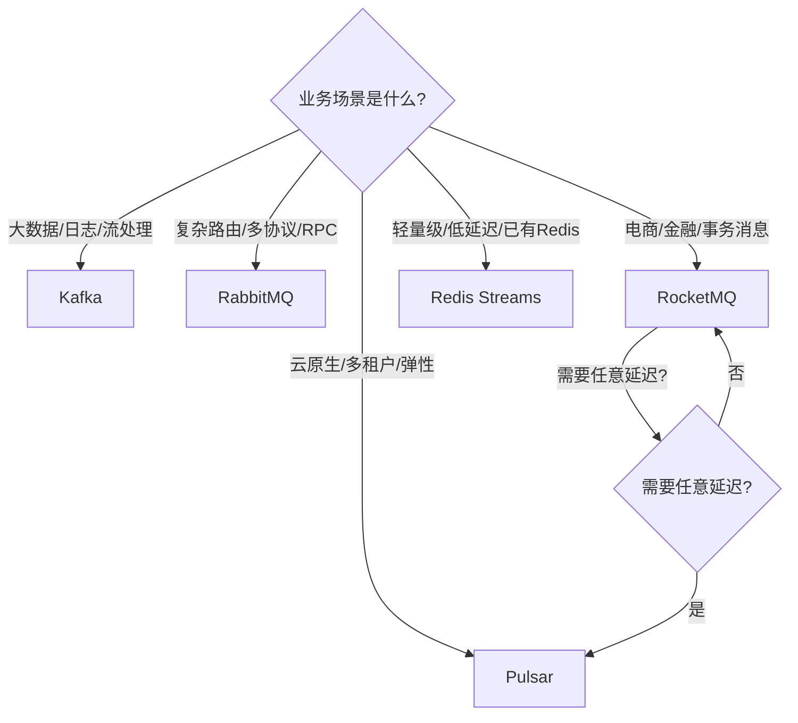

## 本章小结

### 核心知识回顾

本章从消息队列的本质出发，系统性地覆盖了消息模型、主流中间件架构、投递语义、存储机制、高级特性和工程实践。以下是需要牢固掌握的核心知识脉络：

#### 1. 消息模型：理解通信范式

消息队列的两种基本模型——点对点（Queue）和发布订阅（Topic）——是所有上层特性的基石。

| 模型 | 核心机制 | 消费语义 | 代表实现 |
|------|---------|---------|---------|
| 点对点 | 竞争消费：多消费者争夺同一队列的消息，每条消息只被一个消费者处理 | 负载均衡 | RabbitMQ Queue |
| 发布订阅 | 广播消费：多个消费者组各自独立消费全量消息 | 消息广播 | Kafka Topic + Consumer Group |

**关键理解**：现代消息队列通常将两种模型融合。Kafka 的 Topic + Consumer Group 机制中，同一组内是点对点竞争消费，不同组之间是发布订阅广播。RabbitMQ 通过 Exchange 的四种类型（Direct / Fanout / Topic / Headers）在单一 Queue 之上实现了灵活的路由语义，本质上也是两种模型的组合。

#### 2. 主流消息队列：架构差异与选型

四大消息队列在架构设计上各有侧重，选型必须匹配业务场景的核心诉求：

| 维度 | Kafka | RabbitMQ | RocketMQ | Pulsar |
|------|-------|----------|----------|--------|
| 核心优势 | 百万级吞吐量 | 微秒级延迟 + 灵活路由 | 事务消息 + 电商场景 | 计算存储分离 + 多租户 |
| 存储模型 | 分段日志 + 顺序追加 | 内存队列 + 持久化 | CommitLog + ConsumeQueue | BookKeeper 分布式日志 |
| 扩展方式 | 增加 Partition + Broker | 增加节点（镜像队列） | 增加 Broker + Queue | 独立扩缩计算/存储节点 |
| 协议支持 | 自定义协议 | AMQP / MQTT / STOMP | 自定义协议 | 自定义协议 |
| 典型吞吐 | 百万条/秒 | 万级/秒 | 十万级/秒 | 百万级/秒 |
| 最佳场景 | 日志收集、大数据流处理 | 业务解耦、复杂路由 | 电商秒杀、金融交易 | 云原生多租户、弹性扩缩 |

**选型决策树**：

#### 3. 投递语义：可靠性保障的三级模型

消息投递语义是消息队列可靠性的核心。三种语义代表了不同的可靠性-复杂度权衡：

| 语义 | 保证 | 代价 | 适用场景 |
|------|------|------|---------|
| At-Most-Once | 消息最多投递一次，可能丢失，绝不重复 | 消费前ACK，崩溃即丢失 | 日志收集、监控上报 |
| At-Least-Once | 消息至少投递一次，绝不丢失，可能重复 | 处理后ACK，需消费端幂等 | **工程首选**，绝大多数业务场景 |
| Exactly-Once | 消息恰好投递一次，既不丢失也不重复 | 幂等生产者 + 事务机制，吞吐量下降 | 资金交易、库存扣减等强一致性场景 |

**核心实践**：At-Least-Once + 消费端幂等性是工程中最实用的方案。幂等性实现手段包括：

- **消息ID去重**：在 Redis 或数据库中记录已处理的 msgId，重复消息直接跳过
- **数据库唯一约束**：将 msgId 作为表的唯一索引，重复插入自动失败
- **乐观锁/版本号**：更新时校验版本号，版本不匹配则跳过
- **状态机检查**：根据业务状态流转判断消息是否应被处理

#### 4. 消息存储：性能的根基

消息队列的存储设计直接决定了系统的吞吐上限。核心原则是**利用磁盘顺序写入性能**：

**Kafka 分段日志存储**：每个 Partition 被划分为多个 Segment，每个 Segment 包含日志文件（.log）和索引文件（.index）。消息以追加方式写入当前活跃 Segment，通过零拷贝（sendfile）和页缓存实现高效读写。索引采用稀疏索引设计，先二分定位再顺序扫描。

**RocketMQ 双层存储**：所有 Topic 的消息顺序写入同一个 CommitLog（利用磁盘顺序写性能），通过 ConsumeQueue（逻辑队列，存储 CommitLog 偏移量）支持按 Topic/Queue 的快速查找。这种设计在写入性能和读取灵活性之间取得了平衡。

**RabbitMQ 内存 + 持久化**：消息优先存储在内存中以获得极低延迟，通过持久化队列（durable）和消息持久化（delivery_mode=2）将消息写入磁盘。适合消息量适中但对延迟敏感的场景。

#### 5. 高级特性：解决实际工程问题

本章深入讲解了五个关键高级特性，每个特性解决一类特定的工程挑战：

| 特性 | 解决的问题 | 实现原理 | 关键注意事项 |
|------|-----------|---------|-------------|
| 顺序消息 | 金融交易、库存操作等需要严格顺序的场景 | 分区路由（同分区同顺序）+ 单线程消费 | 全局有序会严重影响吞吐量，通常只需保证分区有序 |
| 延迟消息 | 订单超时取消、定时提醒、延迟通知 | RocketMQ 18级固定延迟 / 任意延迟需自建或用 Pulsar | Kafka 需要自行实现（定时轮询 + 时间轮算法） |
| 死信队列 | 消费失败的"毒丸"消息处理 | 消费重试超过阈值后转入死信队列 | 必须有死信队列的监控和告警，避免消息积压无人处理 |
| Rebalance | 消费者组内负载均衡和故障转移 | Kafka: Range / RoundRobin / Sticky 分配策略 | 消费者数量变化会触发 Rebalance，期间消费暂停 |
| 背压（Backpressure） | 消费者处理速度跟不上生产速度 | 流控（Credit-based）、拉取模式限速 | RocketMQ 用 Pull 模式天然支持；Kafka 通过 `max.poll.records` 控制 |

#### 6. 可靠性保障：端到端的消息不丢失

消息不丢失需要在生产端、Broker 端和消费端三个环节分别保障：

**生产端**：
- 使用带回调的异步发送，确认 Broker 收到消息
- Kafka 配置 `acks=all`，确保所有 ISR 副本同步成功
- 启用幂等生产者（`enable.idempotence=true`）防止网络重试导致的重复

**Broker 端**：
- 副本机制：Kafka ISR、RabbitMQ 镜像队列、RocketMQ 同步双写
- 持久化：消息落盘后再返回 ACK
- 刷盘策略：同步刷盘（`flush.disk=SYNC`）保证强可靠，异步刷盘追求高吞吐

**消费端**：
- 关闭自动提交（`enable.auto.commit=false`），处理成功后手动提交偏移量
- 实现消费幂等性，应对重复投递
- 消费失败进入重试队列，超过重试次数进入死信队列

### 关键公式与性能模型

| 概念 | 公式/模型 | 工程含义 |
|------|-----------|---------|
| 吞吐量 | QPS = 并发数 / 平均延迟（Little 定律） | 增加消费者并发数或降低单条消息处理延迟都能提升吞吐 |
| 系统可用性 | SLA = 正常运行时间 / 总时间 | 99.9% = 年停机 8.76h；99.99% = 年停机 52.6min |
| 尾延迟 | P99 = 排序后第 99 百分位值 | P99 比平均延迟更能反映用户体验，是容量规划的关键指标 |
| 容量规划 | 总资源 = 峰值 QPS × 单次请求资源 × 冗余系数 | 消息队列容量规划必须考虑 2-3 倍的峰值冗余 |
| 延迟消息精度 | 精度 = max(调度间隔, 调度抖动) | RocketMQ 18级延迟最短 1s，最长 2h；精确到秒级 |
| 消费者吞吐 | Topic 吞吐 = min(Partition数, Consumer数) × 单分区消费速率 | Partition 数是消费并行度的上限 |

### 全链路监控体系

消息队列的生产环境运维离不开完善的可观测性。一个成熟的监控体系应覆盖以下三个维度：

**Broker 层监控**：

| 指标 | 含义 | 告警阈值（参考） | 对应工具 |
|------|------|----------------|---------|
| Under Replicated Partitions | 未同步完成的分区数 | > 0 持续 5min | Kafka Exporter + Prometheus |
| ISR Shrink/Expand Rate | ISR 收缩/扩展频率 | 短时间内频繁波动 | Kafka JMX Metrics |
| Consumer Lag | 消费者堆积的消息数量 | > 10000 持续 10min | Burrow / kafka-consumer-groups |
| Broker Disk Usage | 磁盘使用率 | > 75% | Node Exporter |
| Request Latency (P99) | 请求处理延迟 | > 500ms | Kafka Metrics Reporter |

**生产者层监控**：

| 指标 | 含义 | 告警阈值（参考） |
|------|------|----------------|
| Producer Error Rate | 发送失败率 | > 0.1% |
| Batch Size | 批量发送大小 | 持续远小于 batch.size 配置 |
| Record Send Rate | 消息发送速率 | 与预期流量模型偏差 > 30% |
| Compression Rate | 压缩比 | 异常下降可能意味着消息格式问题 |

**消费者层监控**：

| 指标 | 含义 | 告警阈值（参考） |
|------|------|----------------|
| Consumer Lag | 消费堆积量 | > 阈值持续增长 |
| Consumption Rate | 消费速率 | 突然下降可能意味着消费阻塞 |
| Rebalance Count | Rebalance 次数 | 频繁 Rebalance 影响消费稳定性 |
| Dead Letter Queue Size | 死信队列消息数量 | > 0 持续增长 |

**推荐技术栈**：Prometheus（指标采集） + Grafana（可视化） + Kafka Exporter / JMX Exporter（Broker 指标暴露） + Burrow（消费者 Lag 分析） + ELK / Loki（日志聚合）。

### 最佳实践清单

**设计阶段**：

- [ ] 明确消息队列在系统中的定位（解耦 / 异步 / 削峰 / 数据管道）
- [ ] 根据业务场景完成技术选型（参考选型决策树）
- [ ] 确定投递语义要求（At-Least-Once / Exactly-Once）
- [ ] 设计 Topic / Queue 的分区策略（Partition 数量影响并行度上限）
- [ ] 制定消息格式规范（统一的 schema、版本管理、序列化协议）
- [ ] 设计容错和降级方案（生产端重试、消费端重试 + 死信队列）

**实现阶段**：

- [ ] 生产端：配置 acks=all + 幂等生产者 + 回调确认
- [ ] 消费端：关闭自动提交 + 手动提交偏移量 + 幂等性处理
- [ ] 消息序列化：使用 Protobuf / Avro / JSON Schema 等强类型格式
- [ ] 错误处理：区分可重试错误和不可重试错误，设置合理的重试次数
- [ ] 日志记录：每条消息的处理过程可追踪（msgId + 处理时间 + 结果）

**部署阶段**：

- [ ] 集群规模：至少 3 个 Broker 节点，副本因子设为 3
- [ ] 监控告警：部署 Prometheus + Grafana，配置关键指标告警
- [ ] 容量规划：按峰值流量的 2-3 倍规划集群容量
- [ ] 压力测试：使用生产环境镜像数据进行压测，验证吞吐和延迟
- [ ] 回滚方案：记录当前配置快照，准备回滚脚本

**运维阶段**：

- [ ] 定期巡检：检查 Broker 状态、磁盘使用率、ISR 健康度
- [ ] 消费者 Lag 监控：设置告警，Lag 持续增长时及时扩容或排查
- [ ] 日志清理策略：配置合理的 retention 策略，避免磁盘写满
- [ ] 版本升级：灰度升级，先升级 Follower 再升级 Leader
- [ ] 故障演练：定期模拟 Broker 故障、网络分区，验证高可用机制

### 常见误区与纠正

| 误区 | 正确做法 | 说明 |
|------|---------|------|
| Partition 越多越好 | 根据消费者数量和吞吐需求合理设置 | Partition 过多会增加 Broker 负担，增加 Rebalance 时间，浪费文件句柄 |
| 忽视消费端幂等性 | At-Least-Once 必须配合同等幂等性处理 | 消费失败重试 + 网络抖动都会导致重复消费 |
| 过度追求 Exactly-Once | 大多数场景 At-Least-Once + 幂等性已足够 | Exactly-Once 增加系统复杂度，吞吐量下降，且有适用范围限制 |
| 消息堆积 = 系统故障 | 区分正常堆积和异常堆积 | 削峰场景下堆积是正常行为，关键看堆积是否持续增长 |
| 忽视消息大小限制 | 控制单条消息大小，大数据走外部存储 | Kafka 默认 max.message.bytes=1MB，RabbitMQ 默认 max_message_size=128KB |
| 所有消息都走消息队列 | 同步调用适合强一致性、低延迟的场景 | 消息队列引入了异步复杂性，简单同步调用不需要绕道 MQ |
| 只关注 Broker 监控 | 生产者和消费者同样需要监控 | 生产者发送失败、消费者 Lag 堆积往往比 Broker 问题更常见 |

### 关键公式速查

| 指标 | 计算公式 | 应用场景 |
|------|---------|---------|
| Little 定律 | L = λ × W（系统中平均消息数 = 消息到达速率 × 平均处理时间） | 估算消费者 Lag 上限和所需容量 |
| 吞吐量 | Throughput = batch_size × 1000 / linger_ms | 调优 Producer 批量发送参数 |
| 可用性 | 年可用性 = (8760 - 年停机小时) / 8760 × 100% | 评估集群 SLA 等级 |
| 尾延迟放大 | P99_latency = max(individual_P99) × parallelism_factor | 多分区并行消费时的延迟上限估算 |
| 磁盘写入带宽 | Disk_Throughput = Block_Size × IOPS | 评估 Broker 磁盘是否满足写入需求 |

### 进阶学习路径

**阶段一：深入原理（1-2 周）**

1. **源码阅读**：从 KafkaProducer.send() 入口开始，追踪消息从发送到写入磁盘的完整路径
   - 推荐起点：kafka/clients/src/main/java/org/apache/kafka/clients/producer/
   - 关键类：KafkaProducer、NetworkClient、Sender、LogManager

2. **协议分析**：使用 Wireshark 或 tcpdump 抓取 Kafka 协议包，理解二进制协议格式
   - Kafka 协议定义：kafka/clients/src/main/resources/common/message/

**阶段二：工程实践（2-4 周）**

3. **搭建生产级集群**：在本地或云环境中部署 3 节点 Kafka 集群，模拟以下场景：
   - Broker 节点故障时的 Leader 选举
   - 消费者组成员变化时的 Rebalance
   - 网络分区下的 ISR 变化

4. **构建完整监控**：搭建 Prometheus + Grafana + Kafka Exporter，配置以下告警：
   - Consumer Lag 持续增长
   - Under Replicated Partitions > 0
   - Broker 磁盘使用率 > 75%

**阶段三：架构设计（长期）**

5. **论文研读**：
   - Kafka 论文：*"Kafka: a Distributed Messaging System for Log Processing"*（2011）
   - Raft 共识论文：*"In Search of an Understandable Consensus Algorithm"*（Raft，用于理解 Leader 选举）
   - Google Dataflow 论文：*"The Dataflow Model"*（理解流处理统一模型）

6. **开源项目研究**：
   - Kafka 源码：[github.com/apache/kafka](https://github.com/apache/kafka)
   - RocketMQ 源码：[github.com/apache/rocketmq](https://github.com/apache/rocketmq)
   - Pulsar 源码：[github.com/apache/pulsar](https://github.com/apache/pulsar)

7. **推荐书籍与资源**：
   - 《Kafka: The Definitive Guide》（O'Reilly）—— Kafka 权威指南
   - 《RabbitMQ in Action》—— RabbitMQ 实战
   - 《RocketMQ 技术内幕》—— 深入 RocketMQ 源码与设计
   - Confluent 博客：[confluent.io/blog](https://confluent.io/blog/) —— Kafka 生态最佳实践
   - Apache Pulsar 官方文档：[pulsar.apache.org](https://pulsar.apache.org/)

### 思考题

1. **架构选型**：你的团队要为一个日均消息量 5 亿条的电商平台设计消息架构，包含订单、库存、支付、物流四个核心业务域。请说明你会如何选型和设计 Topic 结构，并解释选择理由。

2. **可靠性分析**：在 At-Least-Once 语义下，如果消费者处理完消息后、提交偏移量前崩溃，会发生什么？消息会被重复消费还是丢失？请画出时序图分析。

3. **性能调优**：一个 Kafka Topic 的 P99 消费延迟突然从 10ms 上升到 500ms，但 CPU 和内存使用率正常。请列出至少 5 个可能的根因和对应的排查步骤。

4. **顺序性保证**：如何在保证吞吐量的前提下实现订单状态变更的顺序消费？如果必须全局有序，系统吞吐量会受到怎样的影响？请给出定量分析。

5. **容错设计**：设计一个方案，当消息队列集群完全不可用时，系统仍然能提供降级服务（允许部分功能暂时不可用，但核心链路不受影响）。请说明降级策略和恢复机制。
