# 第35章 消息队列

消息队列是现代分布式系统架构中不可或缺的核心组件，它在系统解耦、异步处理、流量削峰等方面发挥着关键作用。本章将从理论基础出发，深入剖析消息队列的设计原理、实现机制和工程实践，帮助读者建立对消息中间件的系统性认知。无论你是正在设计微服务架构的工程师，还是负责构建高吞吐数据管道的数据工程师，消息队列都是你必须掌握的核心技术之一。当前主流的消息队列系统（Kafka、RabbitMQ、RocketMQ）每秒可处理数万到数百万条消息，支撑着从电商交易到实时数据分析等各类关键业务场景。

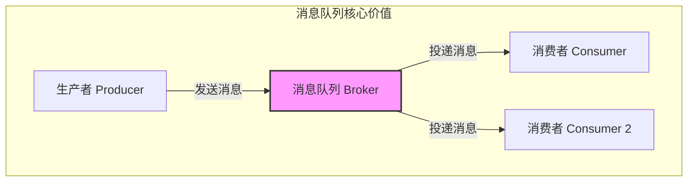

***

## 本章结构

本章共分为八个部分，按照从理论到实践的递进顺序展开：

| 部分 | 内容概要 | 核心知识点 |
|------|----------|-----------|
| 理论基础 | 消息模型、可靠性机制、存储设计、序列化、高可用 | 点对点/发布订阅、三种投递语义、Schema 管理、HA 架构 |
| 核心技巧 | 顺序消息、事务消息、延迟消息、死信队列、Rebalance、Offset 管理、幂等性 | 高级特性实现原理与工程方案 |
| 实战案例 | 电商秒杀、日志收集、实时数据管道、微服务异步通信 | 真实场景的架构设计与代码实现 |
| 可观测性 | 监控指标、Prometheus 方案、消息追踪、告警策略 | 可观测性体系建设与告警最佳实践 |
| 安全与运维 | 认证授权、数据加密、集群运维、容量规划 | 安全加固与生产运维要点 |
| 常见误区 | 五类典型错误与纠正方法 | 避坑指南与最佳实践 |
| 练习方法 | 三级递进练习 | 从环境搭建到分布式系统设计 |
| 本章小结 | 知识回顾与延伸阅读 | 核心概念总结与推荐资源 |

***

## 学习目标

完成本章学习后，读者应当能够：

- 理解消息队列的核心架构模型和设计哲学，区分点对点与发布订阅的本质差异
- 掌握 Kafka、RabbitMQ、RocketMQ、Pulsar 的架构差异和适用场景
- 深入理解 At-Most-Once、At-Least-Once、Exactly-Once 三种投递语义的实现原理和代价
- 掌握消息序列化格式的选择与 Schema 演化策略
- 设计和实现顺序消息、事务消息、延迟消息等高级特性
- 掌握消费者 Offset 管理和消息幂等性设计的工程方案
- 构建完整的消息队列可观测性体系（监控、告警、追踪）
- 理解消息队列的安全机制和运维最佳实践
- 在实际项目中进行消息队列选型，识别和避免常见陷阱

***

## 前置知识

学习本章需要具备以下基础知识：

- **分布式系统基础**：CAP 定理、一致性模型、分区容错
- **网络编程**：TCP 连接、RPC 调用、网络分区概念
- **数据库事务**：ACID 属性、两阶段提交协议
- **操作系统**：进程间通信、磁盘 IO 模型、内存映射文件

如果读者已经学习了本书前面关于分布式理论和网络架构的章节，将能够更好地理解本章内容。

***

## 理论基础

本节从消息队列的本质出发，系统介绍消息模型、主流架构、投递语义、存储设计以及序列化与高可用等核心理论。

***

### 消息队列的本质与价值

消息队列（Message Queue，简称 MQ）的本质是一种异步通信机制，它在消息的生产者和消费者之间引入了一个中间存储层。这个看似简单的架构变化，却带来了系统设计上的根本性转变。

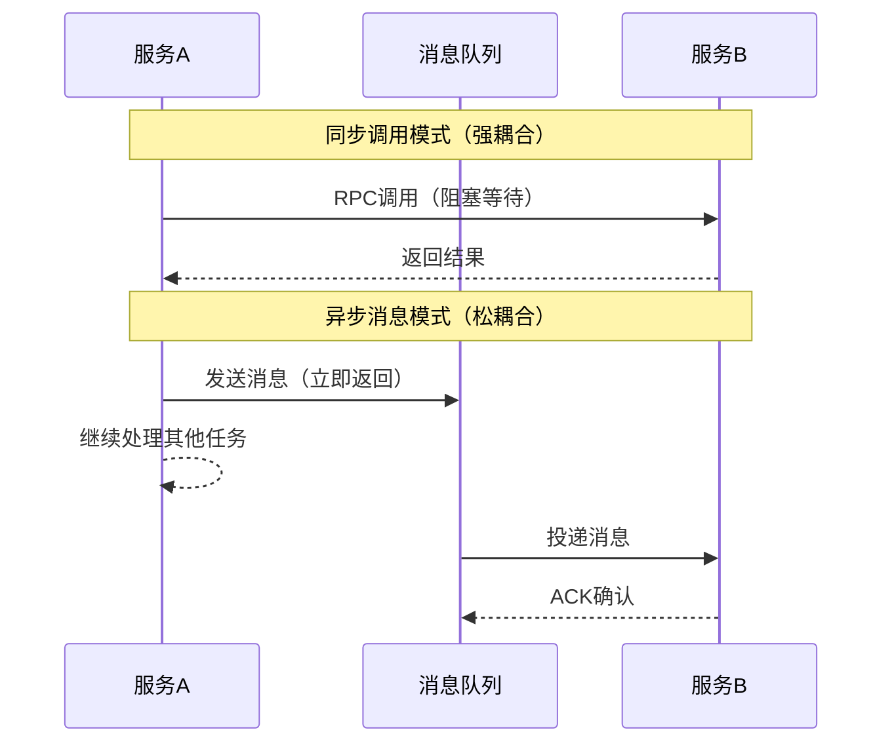

在同步调用模式下，服务 A 调用服务 B 时必须等待 B 的响应才能继续执行，这导致了服务之间的强耦合。而消息队列的引入，使得生产者只需要将消息发送到队列中即可返回，消费者按照自己的节奏从队列中读取和处理消息，从而实现了服务之间的松耦合。

从系统架构的角度来看，消息队列解决了三个核心问题：

**系统解耦**：生产者和消费者不需要知道彼此的存在，它们只需要与消息队列交互即可。新增消费者不需要修改生产者代码，移除消费者也不会影响生产者。这种松耦合使得系统各组件可以独立演进和部署。

**异步处理**：生产者发送消息后无需等待消费者处理完成，这大大提高了系统的响应速度。例如在用户注册场景中，注册服务只需要写入数据库并发送消息，而不需要同步等待发送验证邮件、初始化积分、创建默认配置等一系列异步操作完成。

**流量削峰**：在高并发场景下，消息队列可以作为缓冲区，将突发的流量峰值平滑为消费者能够承受的处理速率。秒杀活动瞬间涌入的十万请求，可以被队列缓冲为订单服务每秒处理一千条的稳定速率。

消息队列的核心数据结构是一个有序的序列，消息按照发送的顺序被追加到队列的末尾，消费者按照先进先出（FIFO）的顺序读取消息。但在分布式环境下，这个简单的模型被扩展为更复杂的分区（Partition）模型，每个分区内部保持顺序，但分区之间不保证顺序。这种设计在吞吐量和顺序性之间取得了平衡。

***

### 消息模型

消息队列的消息模型决定了消息如何在生产者和消费者之间传递。理解两种基本消息模型的差异，是正确选择和使用消息队列的基础。

#### 点对点模型

点对点模型（Point-to-Point）是最基本的消息传递模型。在这个模型中，消息被发送到一个特定的队列（Queue），并且只能被一个消费者消费。一旦消息被成功消费，它就会从队列中移除，其他消费者无法再获取这条消息。

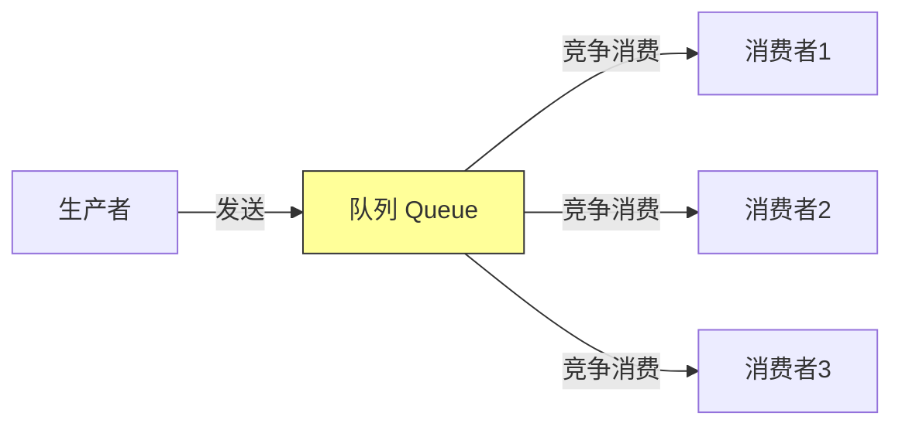

点对点模型的核心特性在于消息的竞争消费。多个消费者可以连接到同一个队列，但每条消息只会被其中一个消费者处理。消息队列负责在消费者之间进行负载均衡，确保消息被均匀分配。这种机制天然支持水平扩展，只需要增加消费者数量就能提高系统的处理能力。

在实现层面，点对点模型通常采用拉取（Pull）模式，消费者主动从队列中拉取消息。这种模式给了消费者更多的控制权，消费者可以根据自己的处理能力决定何时拉取以及拉取多少条消息。RabbitMQ 是点对点模型的典型代表，它的 Queue 概念直接对应了这种模型。

#### 发布订阅模型

发布订阅模型（Publish-Subscribe，简称 Pub-Sub）是对点对点模型的扩展。在这个模型中，消息被发送到一个主题（Topic），所有订阅了这个主题的消费者都会收到消息的副本。这与点对点模型的关键区别在于，一条消息可以被多个消费者同时消费，实现了消息的广播。

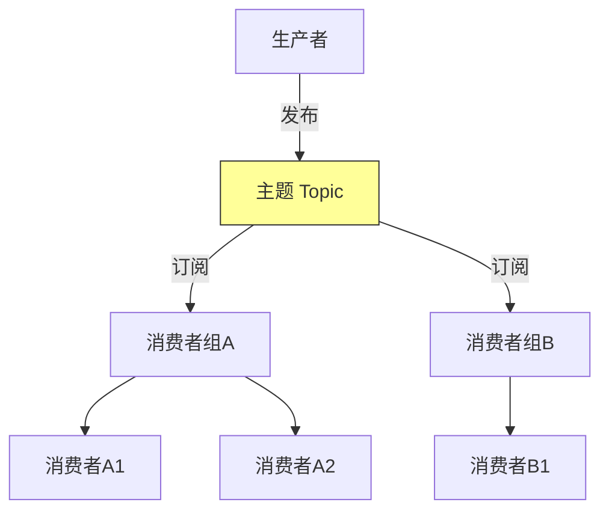

发布订阅模型的核心在于主题的抽象。生产者将消息发布到主题，而不需要知道有多少消费者在监听。消费者订阅感兴趣的主题，而不需要知道消息来自哪个生产者。这种完全的解耦使得系统具有极高的灵活性，可以随时添加或移除消费者而不需要修改生产者的代码。

在分布式环境下，发布订阅模型通常与消费者组（Consumer Group）结合使用。同一个消费者组内的多个消费者共同消费一个主题的消息，每条消息只会被组内的一个消费者处理。不同消费者组之间则独立消费，每条消息都会被所有消费者组各自消费一次。这种设计既支持了负载均衡，又支持了消息广播。

Kafka 的架构是发布订阅模型与消费者组结合的典型实现。一个 Topic 被划分为多个 Partition，每个 Partition 只能被同一个消费者组内的一个消费者消费。通过增加 Partition 的数量，可以实现消费的并行化，从而提高消费吞吐量。Kafka 在典型配置下可轻松达到每秒百万级消息的吞吐量。

#### 两种模型的对比

| 特性 | 点对点模型 | 发布订阅模型 |
|------|-----------|-------------|
| 消息消费 | 每条消息只被一个消费者消费 | 每条消息可被多个消费者组各自消费 |
| 耦合程度 | 生产者需指定队列 | 生产者只需指定主题 |
| 扩展方式 | 增加消费者（竞争消费） | 增加消费者组（广播）或组内消费者（并行） |
| 典型场景 | 任务分发、工作队列 | 事件通知、日志广播、数据分发 |
| 代表实现 | RabbitMQ Queue | Kafka Topic、RocketMQ Topic |

***

### 主流消息队列架构

当前消息队列领域的三大主流系统——Kafka、RabbitMQ 和 RocketMQ——各有其独特的设计哲学和架构特点。理解它们的架构差异是进行技术选型的前提。

#### Kafka 架构

Apache Kafka 最初由 LinkedIn 开发，是一个分布式的流处理平台。Kafka 的核心设计理念是高吞吐量和水平扩展能力，这使得它特别适合处理大规模的日志数据和实时数据流。Kafka 在典型硬件配置下可以达到每秒数百万条消息的吞吐量，单集群可管理 PB 级别的数据。

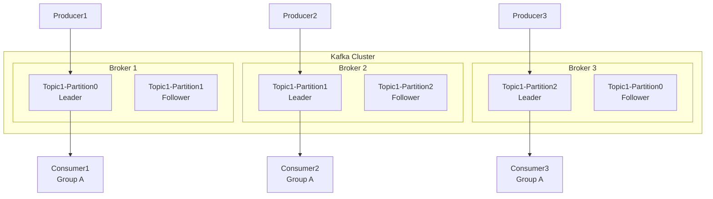

Kafka 的架构由三个核心组件组成：Producer（生产者）、Broker（代理服务器）和 Consumer（消费者）。Producer 负责将消息发送到指定的 Topic，Broker 负责存储和转发消息，Consumer 负责从 Topic 中读取消息。Kafka 集群由多个 Broker 组成，每个 Broker 负责管理一部分 Topic 的 Partition。

**Topic 与 Partition**：Topic 是 Kafka 中的逻辑概念，每个 Topic 被划分为多个 Partition。Partition 是 Kafka 的基本存储单元，每个 Partition 是一个有序的、不可变的消息序列。消息被追加到 Partition 的末尾，每条消息都有一个唯一的偏移量（Offset）。Partition 的设计使得 Kafka 能够实现水平扩展，通过增加 Partition 数量可以提高 Topic 的吞吐量。

**副本与 ISR**：每个 Partition 可以有多个副本（Replica），其中一个被选举为 Leader，其余为 Follower。所有的读写操作都通过 Leader 进行，Follower 负责从 Leader 同步数据。当 Leader 故障时，Kafka 会从 ISR（In-Sync Replicas）中选举一个新的 Leader。ISR 是一组与 Leader 保持同步的副本集合，只有 ISR 中的副本才有资格被选举为 Leader。

**高性能存储**：Kafka 的存储机制是其高性能的关键。Kafka 使用顺序追加写入的方式将消息写入磁盘，并通过内存映射文件（Memory Mapped File）来提高读取性能。每个 Partition 被划分为多个 Segment，每个 Segment 对应一个日志文件和一个索引文件。这种设计使得 Kafka 能够利用操作系统的页缓存来加速读写操作。

**KRaft 模式（未来方向）**：从 Kafka 3.0 开始，Kafka 引入了 KRaft（Kafka Raft）模式来替代传统的 ZooKeeper 元数据管理。在 KRaft 模式下，集群的 Controller 节点通过 Raft 共识协议进行 Leader 选举和元数据同步，不再依赖外部的 ZooKeeper 集群。Kafka 3.3 版本已宣布 KRaft 生产就绪，KRaft 模式带来了更快的控制器故障转移（从分钟级降低到秒级）、更简单的运维（减少一个外部依赖）、以及更好的可扩展性（支持百万级 Partition）。预计 Kafka 4.0 将完全移除 ZooKeeper 支持。

```java
// Kafka Producer 配置示例
Properties props = new Properties();
props.put("bootstrap.servers", "kafka1:9092,kafka2:9092,kafka3:9092");
props.put("key.serializer", "org.apache.kafka.common.serialization.StringSerializer");
props.put("value.serializer", "org.apache.kafka.common.serialization.StringSerializer");
props.put("acks", "all");  // 等待所有ISR副本确认
props.put("retries", 3);
props.put("batch.size", 16384);       // 批量发送大小：16KB
props.put("linger.ms", 1);            // 等待1ms凑批
props.put("buffer.memory", 33554432); // 发送缓冲区：32MB

KafkaProducer<String, String> producer = new KafkaProducer<>(props);
ProducerRecord<String, String> record = new ProducerRecord<>("my-topic", "key", "value");
producer.send(record, (metadata, exception) -> {
    if (exception == null) {
        System.out.printf("消息发送成功: partition=%d, offset=%d%n",
            metadata.partition(), metadata.offset());
    } else {
        exception.printStackTrace();
    }
});
```

#### RabbitMQ 架构

RabbitMQ 是基于 AMQP（Advanced Message Queuing Protocol）协议实现的消息队列系统。与 Kafka 专注于高吞吐量不同，RabbitMQ 更注重消息的可靠性和灵活性，提供了丰富的路由规则和消息确认机制。RabbitMQ 的典型吞吐量在每秒万级到十万级之间，延迟可以达到微秒级别。

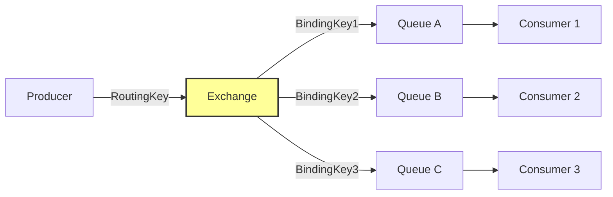

RabbitMQ 的架构核心是 Exchange 和 Queue。Producer 不直接将消息发送到 Queue，而是发送到 Exchange。Exchange 根据预定义的绑定规则（Binding）将消息路由到一个或多个 Queue。这种设计实现了消息路由的灵活性，Producer 只需要指定消息的 Exchange 和路由键（Routing Key），而不需要知道消息最终会被发送到哪个 Queue。

**四种 Exchange 类型**：

| Exchange 类型 | 路由规则 | 典型场景 |
|---------------|---------|---------|
| Direct | Routing Key 精确匹配 | 点对点任务分发、按业务键路由 |
| Fanout | 广播到所有绑定的 Queue，忽略 Routing Key | 事件广播、日志分发 |
| Topic | 通配符匹配（`*` 匹配一个词，`#` 匹配零或多个词） | 灵活的日志级别过滤、多维度事件订阅 |
| Headers | 根据消息 Header 属性匹配 | 基于元数据的复杂路由 |

```python
# RabbitMQ Producer 示例
import pika

connection = pika.BlockingConnection(pika.ConnectionParameters('localhost'))
channel = connection.channel()

# 声明 Exchange（Topic 类型，支持通配符路由）
channel.exchange_declare(exchange='order_exchange', exchange_type='topic', durable=True)

# 声明 Queue
channel.queue_declare(queue='order_queue', durable=True)
channel.queue_declare(queue='order_archive', durable=True)

# 绑定 Queue 到 Exchange
channel.queue_bind(exchange='order_exchange', queue='order_queue', routing_key='order.created')
channel.queue_bind(exchange='order_exchange', queue='order_queue', routing_key='order.paid')
channel.queue_bind(exchange='order_exchange', queue='order_archive', routing_key='order.*')

# 发送消息
channel.basic_publish(
    exchange='order_exchange',
    routing_key='order.created',
    body=json.dumps({"order_id": "12345", "amount": 99.9}),
    properties=pika.BasicProperties(
        delivery_mode=2,  # 消息持久化
        content_type='application/json'
    )
)
```

RabbitMQ 的消息确认机制是其可靠性保证的核心。消费者在处理完消息后需要发送 ACK（确认）给 Broker，Broker 收到 ACK 后才会将消息从 Queue 中移除。如果消费者在发送 ACK 之前崩溃，Broker 会将消息重新投递给其他消费者。这种机制确保了消息不会因为消费者的故障而丢失。

**Quorum Queues（仲裁队列）**：从 RabbitMQ 3.8 版本开始，Quorum Queues 成为替代传统镜像队列（Mirrored Queues）的推荐方案。Quorum Queues 基于 Raft 共识协议实现数据复制，消息写入时需要多数节点（Quorum）确认才算成功，从而保证了数据的强一致性。与镜像队列相比，Quorum Queues 在网络分区时表现更稳定、数据一致性更强、性能开销更低。对于需要持久化和高可靠性的场景，建议使用 Quorum Queues 而非镜像队列。传统镜像队列已在 RabbitMQ 3.12 中被标记为过时（Deprecated）。

**RabbitMQ Streams**：RabbitMQ 3.9 引入了 Streams 特性，这是一种仅追加（Append-Only）的日志数据结构，类似于 Kafka 的 Topic。Stream 支持多消费者独立消费同一条消息，适合日志类、事件溯源类的场景。对于需要"日志型消费"（多个消费者各自从头或任意位置读取同一份数据）的场景，Streams 比传统的队列更加高效，因为消息不会在消费后被删除。

#### RocketMQ 架构

RocketMQ 是阿里巴巴开源的分布式消息中间件，它在设计上兼顾了高吞吐量和高可靠性，特别适合电商和金融领域的应用。RocketMQ 的核心特性包括事务消息、延迟消息和顺序消息。RocketMQ 可以达到每秒十万级的消息吞吐量，在阿里内部支撑了双十一等大规模交易场景。

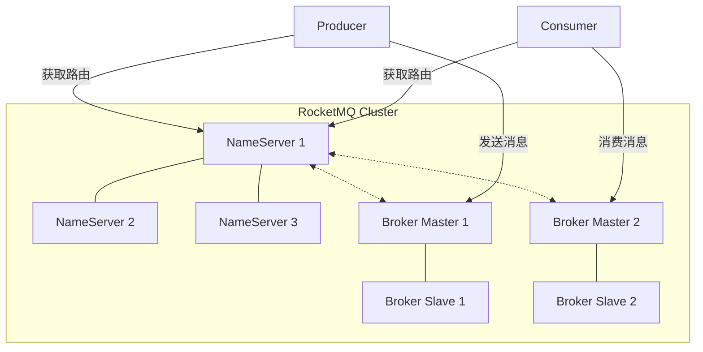

RocketMQ 的架构由四个组件组成：NameServer、Broker、Producer 和 Consumer。NameServer 是轻量级的注册中心，负责维护 Broker 的路由信息。Broker 负责存储和转发消息，每个 Broker 可以管理多个 Topic 和 Queue。Producer 和 Consumer 通过 NameServer 获取 Broker 的路由信息，然后直接与 Broker 通信。

**双层存储结构**：RocketMQ 的消息存储采用了 CommitLog 加 ConsumeQueue 的双层结构。所有 Topic 的消息都顺序写入同一个 CommitLog 文件，这充分利用了磁盘的顺序写入性能。ConsumeQueue 是消息的逻辑队列，每个 Topic 的每个 Queue 对应一个 ConsumeQueue 文件，它存储了消息在 CommitLog 中的偏移量。这种设计使得 RocketMQ 能够在保证高吞吐量的同时支持消息的快速查找。

**RocketMQ 5.0 新特性**：RocketMQ 5.0 带来了多项重要升级。首先是引入了 gRPC 协议替代自定义的 Remoting 协议，提升了跨语言支持能力和协议标准化程度。其次是引入了 Pop 消费模式，作为 Push 和 Pull 模式的替代方案，Pop 模式通过 Broker 端主动推送的方式实现了更灵活的消费控制，减少了 Consumer Rebalance 的频率。第三是引入了分层存储（Tiered Storage），支持将冷数据自动卸载到 S3 等对象存储中，大幅降低了存储成本。此外，5.0 还改进了事务消息的实现，提供了更完善的事务回查机制。

```java
// RocketMQ 事务消息完整示例
public class OrderTransactionListener implements TransactionListener {
    @Override
    public LocalTransactionState executeLocalTransaction(Message msg, Object arg) {
        String orderId = msg.getProperty("orderId");
        try {
            // 第一阶段：半消息已发送，执行本地事务
            db.beginTransaction();
            orderDao.insert(new Order(orderId, OrderStatus.CREATED));
            inventoryDao.deduct(msg.getProperty("productId"), 1);
            db.commit();
            return LocalTransactionState.COMMIT_MESSAGE;
        } catch (Exception e) {
            db.rollback();
            return LocalTransactionState.ROLLBACK_MESSAGE;
        }
    }

    @Override
    public LocalTransactionState checkLocalTransaction(MessageExt msg) {
        String orderId = msg.getProperty("orderId");
        Order order = orderDao.findById(orderId);
        if (order == null) {
            return LocalTransactionState.UNKNOW; // 待下次回查
        }
        return LocalTransactionState.COMMIT_MESSAGE;
    }
}
```

#### Pulsar 与 Redis Streams

除了三大经典消息队列，近年来涌现了一些值得关注的现代替代方案：

**Apache Pulsar** 采用计算存储分离架构，Broker 无状态，存储交给 BookKeeper。这种架构带来了天然的弹性扩缩容能力——可以独立扩缩计算节点和存储节点。Pulsar 原生支持多租户（Tenant/Namespace/Topic 三级隔离）、分层存储（冷数据自动卸载到 S3/HDFS）、以及 Geo-Replication（跨机房复制）。Pulsar 还内置了流（Stream）和队列（Queue）两种消费模式：Exclusive/Failover/Shared/Make-Exclusive，统一了 Kafka 和 RabbitMQ 的使用场景。

**Redis Streams** 是 Redis 5.0 引入的数据结构，提供了一个持久化的、支持消费者组的消息日志。Streams 使用 Radix Tree 和 Listpack 存储消息，支持消息 ID 的自动分配（时间戳-序号格式）、XREAD/XREADGROUP 阻塞读取、ACK 确认（XACK）、以及 Pending Entry List（PEL）用于消息追踪。Redis Streams 适合消息量适中（日均百万级以下）、对延迟极其敏感（微秒级）、且已使用 Redis 生态的场景。它的局限在于不支持消息的磁盘持久化（依赖 RDB/AOF），不支持消息的多副本复制保证高可用。

***

### 三大消息队列选型对比

| 维度 | Kafka | RabbitMQ | RocketMQ | Pulsar |
|------|-------|----------|----------|--------|
| 开发语言 | Scala/Java | Erlang | Java | Java |
| 协议 | 自定义协议 | AMQP/MQTT/STOMP | 自定义协议 | 自定义协议 |
| 吞吐量 | 百万级/秒 | 万级/秒 | 十万级/秒 | 百万级/秒 |
| 延迟 | 毫秒级 | 微秒级 | 毫秒级 | 毫秒级 |
| 消息可靠性 | 高（ISR副本） | 高（Quorum Queues） | 高（同步双写） | 高（BookKeeper） |
| 事务消息 | 支持（0.11+） | 不原生支持 | 支持（特色功能） | 支持 |
| 延迟消息 | 不原生支持 | 插件支持 | 支持（18级固定，5.0支持任意延迟） | 支持（任意延迟） |
| 消息回溯 | 支持（按offset/时间） | 不支持 | 支持 | 支持 |
| 适用场景 | 日志收集、大数据流 | 业务解耦、复杂路由 | 电商、金融、事务 | 多租户、云原生 |

选型建议：如果是大数据生态（Spark/Flink/Hadoop），首选 Kafka；如果需要复杂路由和灵活的协议支持，选择 RabbitMQ；如果是电商或金融场景且需要事务消息，选择 RocketMQ；如果是云原生多租户环境且需要弹性扩缩，考虑 Pulsar。

***

### 消息投递语义

消息投递语义（Delivery Semantics）定义了消息在生产者和消费者之间传递时的可靠性保证。理解三种投递语义的区别和代价，是设计可靠消息系统的基础。

#### At-Most-Once

At-Most-Once 是最简单的消息投递语义，它保证消息最多被投递一次。在这种语义下，消息可能会丢失，但绝对不会被重复投递。实现 At-Most-Once 的方式是消费者在处理消息之前就发送 ACK，这样即使消费者在处理过程中崩溃，消息也不会被重新投递。

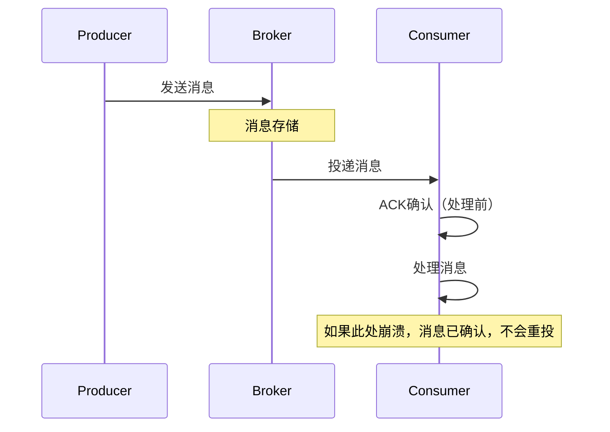

At-Most-Once 适用于对消息丢失不敏感的场景，例如日志收集和监控指标上报。在这些场景中，丢失少量数据不会对业务产生显著影响，但重复数据可能导致统计错误。实现 At-Most-Once 的关键是将 ACK 的时机提前到消息处理之前。

在具体实现中，RabbitMQ 可以将 `autoAck` 设置为 `true`，消费者在收到消息后立即自动确认。Kafka 可以将 `enable.auto.commit` 设置为 `true`，消费者会定期自动提交偏移量。

#### At-Least-Once

At-Least-Once 保证消息至少被投递一次，但可能会被重复投递。在这种语义下，消息绝对不会丢失，但消费者可能会收到重复的消息。实现 At-Least-Once 的方式是消费者在处理完消息之后才发送 ACK，如果消费者在处理过程中崩溃，由于没有发送 ACK，消息会被重新投递。

At-Least-Once 是工程中最常用的投递语义，因为它在可靠性和实现复杂度之间取得了良好的平衡。消息不会丢失保证了业务的正确性，而重复投递的问题可以通过消费端的幂等性处理来解决。

```python
# Kafka At-Least-Once 消费示例
from kafka import KafkaConsumer

consumer = KafkaConsumer(
    'my-topic',
    bootstrap_servers=['kafka1:9092', 'kafka2:9092'],
    group_id='my-group',
    enable_auto_commit=False,  # 关闭自动提交
    auto_offset_reset='earliest'
)

for message in consumer:
    try:
        # 处理消息
        process_message(message.value)
        # 处理成功后手动提交偏移量
        consumer.commit()
    except Exception as e:
        # 处理失败，不提交偏移量，消息会被重新投递
        logger.error(f"消息处理失败: {e}")
```

在 At-Least-Once 语义下，消费端的幂等性处理至关重要。常见的幂等性方案包括：

| 幂等性方案 | 实现原理 | 适用场景 | 性能影响 |
|-----------|---------|---------|---------|
| 消息ID去重 | 在 Redis/DB 中记录已处理的 msgId，重复消息直接跳过 | 通用场景 | 低（Redis SET 查询） |
| 数据库唯一约束 | 将 msgId 作为表的唯一索引，插入重复记录时自动失败 | 写入数据库的场景 | 低（利用DB索引） |
| 乐观锁/版本号 | 更新时检查版本号，版本不匹配则跳过 | 更新操作 | 低 |
| 状态机检查 | 根据业务状态判断消息是否应被处理 | 有明确状态流转的业务 | 取决于查询复杂度 |

#### Exactly-Once

Exactly-Once 是最理想的投递语义，它保证消息恰好被投递一次，既不会丢失也不会重复。然而在分布式系统中实现真正的 Exactly-Once 是非常困难的，因为网络分区、节点故障等因素都可能导致消息的重复投递或丢失。

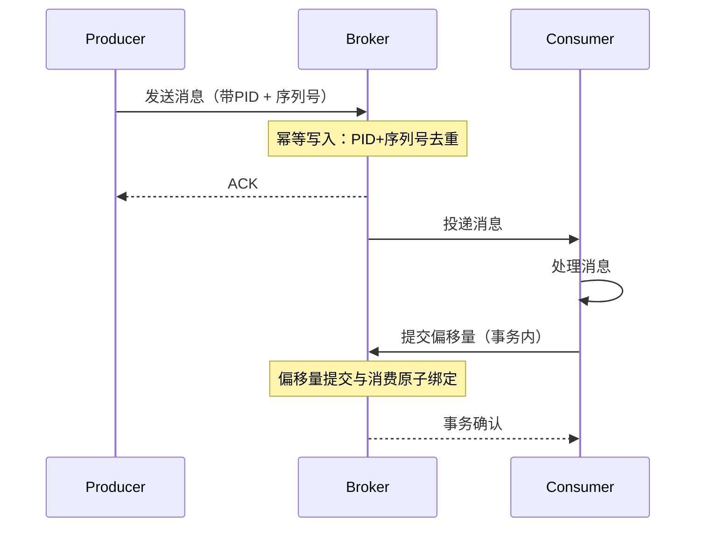

Kafka 在 0.11 版本引入了幂等生产者（Idempotent Producer）和事务（Transaction）机制来实现端到端的 Exactly-Once 语义。幂等生产者通过为每个 Producer 分配一个唯一的 PID（Producer ID），并为每条消息分配一个序列号（Sequence Number），来保证同一条消息不会被重复写入。事务机制则允许多个消息的发送和偏移量的提交作为原子操作来执行。

```java
// Kafka Exactly-Once 事务示例
Properties props = new Properties();
props.put("transactional.id", "order-transaction-1"); // 事务ID，全局唯一
props.put("enable.idempotence", true);                 // 启用幂等

KafkaProducer<String, String> producer = new KafkaProducer<>(props);
producer.initTransactions();

try {
    producer.beginTransaction();
    // 在事务内消费+处理+生产
    for (ConsumerRecord<String, String> record : consumer.poll(Duration.ofMillis(100))) {
        String result = processRecord(record);
        producer.send(new ProducerRecord<>("output-topic", record.key(), result));
    }
    // 在事务内提交消费位移
    producer.sendOffsetsToTransaction(offsets, consumerGroupId);
    producer.commitTransaction();
} catch (Exception e) {
    producer.abortTransaction();
}
```

需要特别注意的是，Exactly-Once 语义的实现是有代价的：它增加了系统的复杂性，降低了系统的吞吐量，并且可能引入额外的延迟。在大多数场景下，At-Least-Once 加消费端幂等性的方案是更实用的选择。

***

### 消息存储与索引

消息队列的存储设计直接影响其性能和可靠性。不同的消息队列采用了不同的存储策略，但它们都遵循一个共同的原则：利用磁盘的顺序写入性能来提高吞吐量。

#### Kafka 的分段日志存储

Kafka 的存储设计是最具特色的。每个 Partition 被划分为多个 Segment，每个 Segment 包含一个日志文件（.log）和一个索引文件（.index）。日志文件存储消息的原始数据，索引文件存储消息偏移量到文件位置的映射。消息以追加的方式写入当前活跃的 Segment，当 Segment 达到一定大小后会被关闭，新的消息写入新的 Segment。

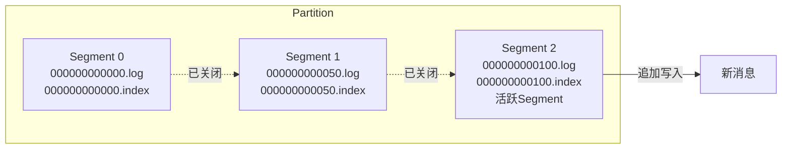

索引文件采用了稀疏索引（Sparse Index）的设计，不是每条消息都在索引中有一个条目，而是每隔一定数量的消息才创建一个索引条目。这种设计在索引文件大小和查找性能之间取得了平衡。查找消息时，先在索引文件中二分查找最近的索引条目，然后在日志文件中顺序扫描找到目标消息。

```python
# Kafka 存储结构的概念性表示
class KafkaSegment:
    def __init__(self, base_offset):
        self.base_offset = base_offset
        self.log_file = f"{base_offset}.log"
        self.index_file = f"{base_offset}.index"
        self.time_index_file = f"{base_offset}.timeindex"

    def append(self, offset, message):
        """追加消息到日志文件"""
        position = self.log_file.size()
        self.log_file.write(serialize(message))
        # 稀疏索引：每隔 INDEX_INTERVAL 条消息写一条索引
        if offset % INDEX_INTERVAL == 0:
            self.index_file.write(offset, position)

    def read(self, offset):
        """根据偏移量读取消息"""
        # 1. 在索引中二分查找最接近的条目
        position = self.index_file.binary_search(offset)
        # 2. 在日志文件中从 position 开始顺序扫描
        return self.log_file.read_from(position, offset)
```

#### RabbitMQ 的存储设计

RabbitMQ 的存储设计更注重消息的持久化和确认机制。消息在发送到 Queue 后会被写入磁盘，同时在内存中维护一个消息索引。消费者确认消息后，消息才会从存储中删除。为了提高性能，RabbitMQ 使用了延迟写入的策略，消息首先写入内存缓冲区，然后批量刷入磁盘。

RabbitMQ 3.8 引入了惰性队列（Lazy Queue）模式，消息直接写入磁盘而不缓存在内存中，适合消息堆积量大的场景。对于需要日志型消费（多个消费者独立读取同一份数据）的场景，建议使用 RabbitMQ 3.9 引入的 Streams 特性，它提供了类似于 Kafka 的仅追加日志结构，支持多消费者独立消费，消息不会在消费后删除。

#### RocketMQ 的双层存储结构

RocketMQ 采用了 CommitLog + IndexFile 的存储架构。所有消息统一写入 CommitLog（顺序写），然后通过异步线程构建 ConsumeQueue（逻辑队列索引）和 IndexFile（消息 ID 索引）。这种设计将写入性能最大化，同时通过索引文件支持按 Queue 消费和按消息 ID 查询。

#### 数据过期与清理

消息队列的存储还需要考虑数据的过期清理。Kafka 通过基于时间（`log.retention.hours`）或基于大小（`log.retention.bytes`）的保留策略来清理过期的数据。RabbitMQ 通过消息的 TTL（Time To Live）和队列的最大长度来控制消息的生命周期。这些机制确保存储空间不会无限增长。

在生产环境中，建议同时配置时间保留和大小保留的上限，防止磁盘被撑满。例如：`log.retention.hours=168`（7天）配合 `log.retention.bytes=-1`（不限大小），或者根据磁盘容量设置合理的大小上限。

***

### 消息序列化与 Schema 管理

消息的序列化格式直接影响传输效率、存储开销和跨语言兼容性。在大规模消息系统中，Schema 的管理和演化策略尤为重要——它决定了生产者和消费者能否在不中断服务的情况下独立升级数据格式。

**主流序列化格式对比**：

| 维度 | JSON | Avro | Protobuf（Protocol Buffers） |
|------|------|------|------------------------------|
| 可读性 | 高（纯文本） | 低（二进制） | 低（二进制） |
| 序列化大小 | 大 | 小 | 小 |
| 序列化速度 | 慢 | 快 | 快 |
| Schema 演化 | 无原生支持 | 强（内置兼容性） | 强（字段编号） |
| Schema Registry | 不需要 | Confluent Schema Registry | 不需要 |
| 跨语言支持 | 通用 | 多语言代码生成 | 多语言代码生成 |
| 适用场景 | 调试、低吞吐 | Kafka 生态首选 | gRPC、跨语言 |

**Avro 与 Schema Registry**：在 Kafka 生态中，Avro 是最推荐的序列化格式。Avro 使用 JSON 定义 Schema，数据以紧凑的二进制格式存储。Confluent Schema Registry 提供了 Schema 的集中管理、版本控制和兼容性检查功能。生产者在发送消息前向 Schema Registry 注册 Schema，消费者在读取消息时根据 Schema ID 获取对应的 Schema 进行反序列化。

```bash
# 启动 Confluent Schema Registry
docker run -d --name schema-registry \
  -p 8081:8081 \
  -e SCHEMA_REGISTRY_HOST_NAME=localhost \
  -e SCHEMA_REGISTRY_KAFKASTORE_BOOTSTRAP_SERVERS=kafka:9092 \
  confluentinc/cp-schema-registry:7.5.0
```

```python
# 使用 Avro + Schema Registry 的 Kafka 生产者
from confluent_kafka import avro
from confluent_kafka.avro import AvroProducer

# 定义 Avro Schema
value_schema = avro.loads('''
{
    "type": "record",
    "name": "Order",
    "namespace": "com.example",
    "fields": [
        {"name": "order_id", "type": "string"},
        {"name": "amount", "type": "double"},
        {"name": "status", "type": {"type": "enum", "name": "OrderStatus",
            "symbols": ["CREATED", "PAID", "SHIPPED"]}}
    ]
}
''')

# 创建生产者，配置 Schema Registry 地址
producer = AvroProducer({
    'bootstrap.servers': 'kafka:9092',
    'schema.registry.url': 'http://schema-registry:8081'
})

# 发送带 Schema 的消息
order = {"order_id": "12345", "amount": 99.9, "status": "CREATED"}
producer.produce(topic='orders', value=order, value_schema=value_schema)
producer.flush()
```

**Schema 演化策略**：Schema Registry 支持三种兼容性模式：

- **Backward Compatibility（向后兼容）**：新 Schema 可以读取旧数据。删除字段或添加带默认值的字段是安全的。消费者升级后仍能读取生产者发送的旧格式数据。
- **Forward Compatibility（向前兼容）**：旧 Schema 可以读取新数据。添加字段是安全的，删除字段时必须有默认值。生产者升级后，旧消费者仍能读取新格式的数据。
- **Full Compatibility（完全兼容）**：同时满足向后和向前兼容。字段的添加和删除都必须有默认值。这是最安全的策略，推荐在生产环境中使用。

```bash
# 设置 Schema Registry 的兼容性模式为 FULL
curl -X PUT http://schema-registry:8081/config -H "Content-Type: application/json" \
  -d '{"compatibility": "FULL"}'
```

Schema 演化的最佳实践是：优先使用 Avro 或 Protobuf 而非 JSON（获得类型安全和压缩）；在生产环境中始终配置 Schema 兼容性检查；避免删除字段，改用标记废弃的方式逐步淘汰旧字段；在 Schema 中为所有新添加的字段提供默认值。

***

### 消息队列的高可用架构

高可用（High Availability）是消息队列在生产环境中的核心要求。不同的消息队列系统采用了不同的高可用方案，但核心思路都是一致的：通过数据复制保证数据不丢失，通过故障检测和自动切换保证服务可用。

**各消息队列高可用架构对比**：

| 维度 | Kafka | RabbitMQ | RocketMQ |
|------|-------|----------|----------|
| 高可用方案 | ISR 副本同步 + Controller 选举 | Quorum Queues（Raft） | 主从同步 + DLedger（Raft） |
| 数据复制 | Follower 拉取 Leader 数据 | Quorum 多数派确认 | 同步双写到 Slave |
| 故障切换 | Controller 从 ISR 自动选举新 Leader | Raft 自动选主 | DLedger Raft 自动切换 / 手动切换 |
| 切换时间 | 秒级 | 秒级 | 秒级（DLedger）/ 分钟级（传统主从） |
| CAP 倾向 | AP（可配置为 CP） | CP | AP（DLedger 模式为 CP） |

**Kafka 的高可用**：Kafka 通过 ISR（In-Sync Replicas）机制实现高可用。每个 Partition 有多个副本，其中 Leader 处理所有读写，Follower 从 Leader 同步数据。ISR 是与 Leader 保持同步的副本集合，只有 ISR 中的副本才有资格成为新 Leader。当 Leader 故障时，Controller（集群中负责管理 Partition 的节点）从 ISR 中选择一个 Follower 提升为新 Leader。Kafka 的 `acks=all` 配置确保消息写入所有 ISR 副本后才返回成功，从而保证数据不丢失。在 KRaft 模式下，Controller 自身通过 Raft 协议实现高可用，消除了对 ZooKeeper 的依赖。

**RabbitMQ 的高可用**：传统的镜像队列（Mirror Queue）通过将 Queue 的消息同步到多个节点来实现高可用，但它在网络分区时可能出现数据不一致。RabbitMQ 3.8+ 推荐使用 Quorum Queues 替代镜像队列。Quorum Queues 基于 Raft 协议实现，消息写入时需要多数节点确认，保证了强一致性。Quorum Queues 还支持节点自动恢复——当故障节点恢复后，会自动同步缺失的数据。

**RocketMQ 的高可用**：RocketMQ 的传统高可用方案是主从（Master-Slave）模式，Master 和 Slave 之间通过同步或异步复制保持数据一致。从 RocketMQ 4.5 开始，引入了 DLedger 模式，基于 Raft 协议实现自动的 Leader 选举和故障切换。DLedger 模式下，多个 Broker 节点组成一个 Raft Group，数据写入时需要多数节点确认，Leader 故障时自动选举新 Leader。这大大减少了运维成本，提升了 RocketMQ 的可用性。

```yaml
# RocketMQ DLedger 模式配置示例
# broker-a.conf
enableDLedgerCommitLog=true
dLedgerGroup=dlLedgerGroup
dLedgerSelfId=n0
dLedgerPeers=n0://broker-a:40911;n1://broker-b:40911;n2://broker-c:40911
dLedgerStorePathParentDir=/opt/rocketmq/store
```

***

## 核心技巧

本节深入介绍消息队列的高级特性和工程实践技巧，包括顺序消息、事务消息、延迟消息、死信队列、Rebalance、Offset 管理、背压处理和幂等性设计。

***

### 顺序消息

在分布式消息系统中，保证消息的全局顺序是非常困难的，因为多个 Partition 之间无法保证顺序。但在实际业务中，我们通常只需要保证局部顺序，即同一个业务实体的消息按照发送顺序被消费。例如，同一个订单的创建、支付、发货消息必须按照顺序被处理。

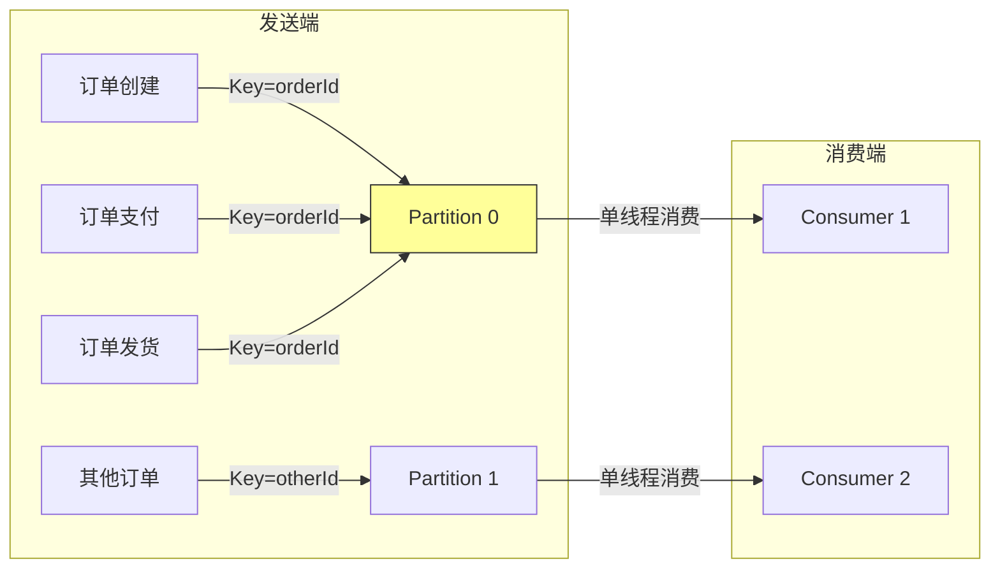

实现顺序消息的核心技巧是将需要保证顺序的消息路由到同一个 Partition。在 Kafka 中，可以通过指定消息的 Key 来实现，相同 Key 的消息会被路由到同一个 Partition。在 RocketMQ 中，可以使用 `MessageQueueSelector` 来选择具体的 Queue。

```java
// Kafka 顺序消息实现
producer.send(new ProducerRecord<>("order-topic", orderId, orderMessage));
// orderId 相同的订单消息会进入同一个 Partition

// RocketMQ 顺序消息实现
SendResult sendResult = producer.send(msg, new MessageQueueSelector() {
    @Override
    public MessageQueue select(List<MessageQueue> mqs, Message msg, Object arg) {
        int orderId = (Integer) arg;
        int index = orderId % mqs.size();
        return mqs.get(index);
    }
}, orderId);
```

在消费端，顺序消息需要保证同一个 Partition 的消息被单线程消费。Kafka 的消费者默认就是单线程消费单个 Partition 的，所以天然支持顺序消费。如果需要多线程消费，可以在消费者内部维护一个按 Key 分区的线程池，确保相同 Key 的消息被同一个线程处理。

```java
// Kafka 多线程顺序消费
public class OrderedConsumer {
    private final Map<String, ExecutorService> keyExecutors = new ConcurrentHashMap<>();
    private final int poolSize = 16;

    public void process(KafkaConsumerRecord record) {
        String key = record.key();
        int executorIndex = Math.abs(key.hashCode()) % poolSize;
        ExecutorService executor = keyExecutors.computeIfAbsent(
            key, k -> Executors.newSingleThreadExecutor());
        executor.submit(() -> processMessage(record));
    }
}
```

顺序消息的消费失败处理是一个难点。如果某条消息消费失败，后续的消息不应该被消费，否则会破坏顺序性。常见的做法是将消费失败的消息放入重试队列，等待修复后重新消费，或者使用死信队列来处理无法消费的消息。需要注意的是，重试期间该 Key 的后续消息会被阻塞，这是顺序性保证的必要代价。

***

### 事务消息

事务消息是 RocketMQ 的特色功能，它解决的是分布式事务中"本地事务执行成功但消息发送失败"或"消息发送成功但本地事务执行失败"的问题。事务消息的核心思想是将消息的发送和本地事务的执行绑定为一个原子操作。

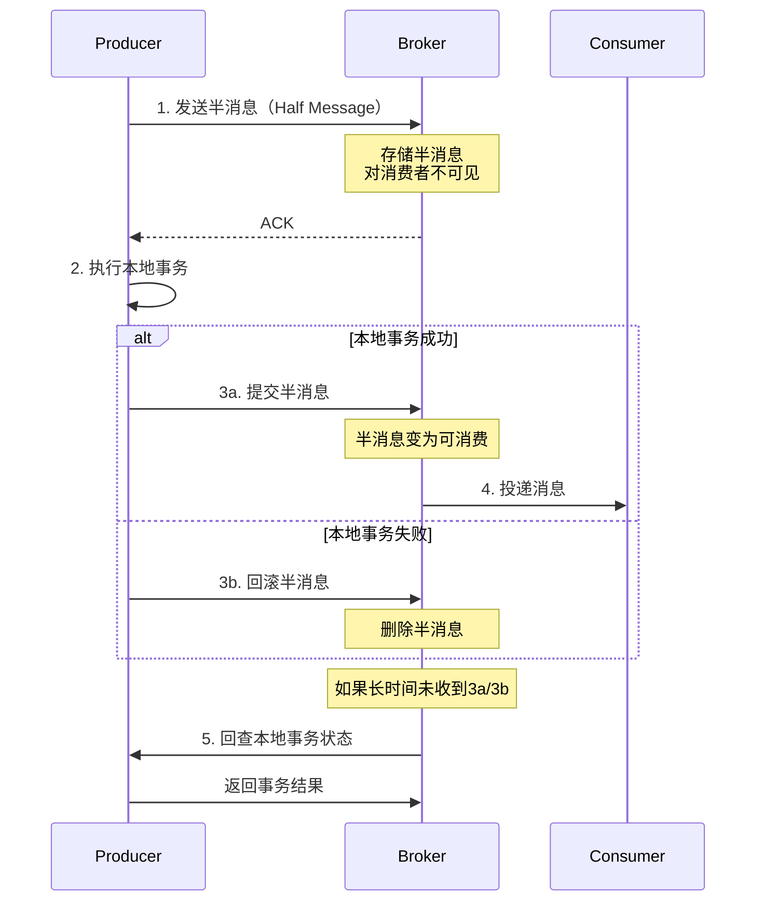

事务消息采用两阶段提交的方式实现。第一阶段，Producer 发送一条"半消息"（Half Message）到 Broker，这条消息对消费者不可见。第二阶段，Producer 执行本地事务，根据本地事务的执行结果决定是提交还是回滚半消息。如果提交，Broker 将半消息标记为可消费；如果回滚，Broker 删除半消息。

```java
// RocketMQ 事务消息完整示例
public class OrderTransactionListener implements TransactionListener {
    @Override
    public LocalTransactionState executeLocalTransaction(Message msg, Object arg) {
        String orderId = msg.getProperty("orderId");
        try {
            // 第一阶段：半消息已发送，执行本地事务
            db.beginTransaction();
            orderDao.insert(new Order(orderId, OrderStatus.CREATED));
            inventoryDao.deduct(msg.getProperty("productId"), 1);
            db.commit();
            return LocalTransactionState.COMMIT_MESSAGE;
        } catch (Exception e) {
            db.rollback();
            return LocalTransactionState.ROLLBACK_MESSAGE;
        }
    }

    @Override
    public LocalTransactionState checkLocalTransaction(MessageExt msg) {
        String orderId = msg.getProperty("orderId");
        Order order = orderDao.findById(orderId);
        if (order == null) {
            return LocalTransactionState.UNKNOW; // 待下次回查
        }
        return LocalTransactionState.COMMIT_MESSAGE;
    }
}
```

事务消息的回查机制是其可靠性保证的关键。如果 Broker 在一定时间内没有收到 Producer 的提交或回滚指令，它会主动回查 Producer 的本地事务状态。回查次数（默认15次）和间隔（默认60秒）可以在 Broker 端配置。这种机制确保了即使 Producer 在执行本地事务后崩溃，消息的最终状态也能被正确处理。

需要注意的是，事务消息的回查依赖于本地事务状态的可查询性。设计本地事务时，必须保证能够根据消息中的业务键查询到事务的执行结果。如果查询不到，回查将返回 UNKNOW，Broker 会继续重试回查。

***

### 延迟消息

延迟消息是指消息在发送后不会立即被消费者消费，而是在指定的延迟时间后才可见。延迟消息在电商超时取消订单、定时任务调度、延迟通知等场景中有广泛应用。

RocketMQ 内置了延迟消息功能，支持 18 个固定的延迟级别，从 1 秒到 2 小时。消息在发送时指定延迟级别，Broker 收到消息后不会立即投递，而是将消息存储到延迟队列中，到期后再投递到目标队列。RocketMQ 5.0 进一步支持了任意时间精度的延迟消息。

延迟消息的实现通常基于时间轮（Timing Wheel）算法。时间轮是一个环形数组，每个槽位代表一个时间间隔。消息被放到对应的槽位中，时间轮每转动一格，就处理当前槽位中的消息。这种算法的时间复杂度是 O(1)，非常适合处理大量定时任务。

```mermaid
graph LR
    subgraph 时间轮（4个槽位，每格1秒）
        S0[槽位0<br/>无任务]
        S1[槽位1<br/>Task A]
        S2[槽位2<br/>Task B<br/>Task C]
        S3[槽位3<br/>无任务]
    end
    CUR[当前指针] --> S0
    style S2 fill:#f96,stroke:#333
```

```go
// Go 语言实现简单的时间轮
type TimingWheel struct {
    interval    time.Duration
    ticker      *time.Ticker
    slots       [][]*Task
    currentPos  int
    slotNum     int
}

func NewTimingWheel(interval time.Duration, slotNum int) *TimingWheel {
    return &amp;TimingWheel{
        interval: interval,
        ticker:   time.NewTicker(interval),
        slots:    make([][]*Task, slotNum),
        slotNum:  slotNum,
    }
}

func (tw *TimingWheel) AddTask(delay time.Duration, task *Task) {
    ticks := int(delay / tw.interval)
    pos := (tw.currentPos + ticks) % tw.slotNum
    tw.slots[pos] = append(tw.slots[pos], task)
}

func (tw *TimingWheel) Start() {
    for range tw.ticker.C {
        tw.currentPos = (tw.currentPos + 1) % tw.slotNum
        tasks := tw.slots[tw.currentPos]
        tw.slots[tw.currentPos] = nil
        for _, task := range tasks {
            go task.Execute()
        }
    }
}
```

如果需要更灵活的延迟时间，可以使用 Redis 的 Sorted Set 来实现延迟队列。消息的延迟时间作为 Score，消费端通过轮询 Sorted Set 来获取到期的消息。

```python
# Redis 实现延迟队列
import redis
import time
import json

class DelayQueue:
    def __init__(self, redis_client, queue_name):
        self.redis = redis_client
        self.queue_name = queue_name

    def delay(self, message, delay_seconds):
        """将消息加入延迟队列"""
        execute_at = time.time() + delay_seconds
        self.redis.zadd(self.queue_name, {json.dumps(message): execute_at})

    def poll(self):
        """轮询获取到期消息"""
        now = time.time()
        messages = self.redis.zrangebyscore(self.queue_name, 0, now, start=0, num=10)
        for msg_bytes in messages:
            # 原子性删除：只有成功删除的消费者才能处理
            if self.redis.zrem(self.queue_name, msg_bytes):
                yield json.loads(msg_bytes)

    def delay_order_cancel(self, order_id, timeout_seconds=1800):
        """订单超时取消：30分钟后未支付自动取消"""
        message = {"order_id": order_id, "action": "CANCEL_ORDER"}
        self.delay(message, timeout_seconds)
```

使用 Redis Sorted Set 实现延迟队列时，需要注意几个问题：`ZRANGEBYSCORE` + `ZREM` 必须保证原子性（可以使用 Lua 脚本），防止多个消费者重复消费同一条消息；轮询间隔需要合理设置，过短会增加 Redis 压力，过长会增加延迟；对于大规模延迟任务，建议使用专门的延迟消息中间件而非 Redis。

***

### 死信队列

死信队列（Dead Letter Queue，DLQ）是处理无法正常消费的消息的机制。当消息消费失败达到最大重试次数后，消息会被发送到死信队列，而不是被丢弃。死信队列为这些"毒消息"提供了一个隔离的存储空间，运维人员可以对死信队列中的消息进行分析和手动处理。

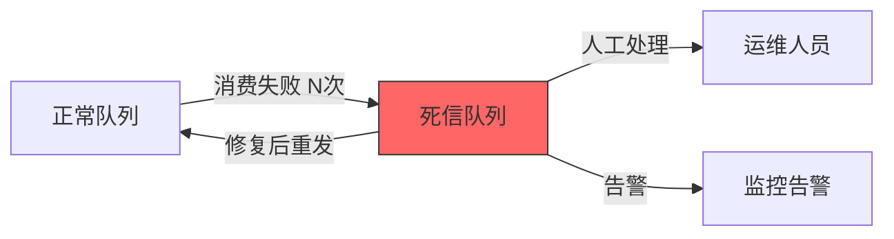

死信队列的触发条件通常包括：

- **消费失败达到最大重试次数**：消费者处理消息时抛出异常，重试 N 次后仍失败
- **消息过期**：消息的 TTL 到期，消费者未能在过期前消费
- **消息被拒绝**：消费者主动发送 reject/nack 且 `requeue=false`

不同的消息队列对死信队列的支持方式有所不同。RabbitMQ 通过设置 `x-dead-letter-exchange` 和 `x-dead-letter-routing-key` 来配置死信队列。RocketMQ 会自动创建死信 Topic（`%DLQ%consumer_group`），消费失败的消息在重试次数用尽后会被投递到死信 Topic。

```java
// RocketMQ 死信队列处理
DefaultMQPushConsumer consumer = new DefaultMQPushConsumer("consumer_group");
consumer.subscribe("OrderTopic", "*");

// 设置最大重试次数
consumer.setMaxReconsumeTimes(3);

// 订阅死信 Topic 进行监控
consumer.subscribe("%DLQ%consumer_group", "*", (msgs, context) -> {
    for (MessageExt msg : msgs) {
        // 记录死信消息详情
        log.error("死信消息: topic={}, msgId={}, body={}, retryCount={}",
            msg.getTopic(), msg.getMsgId(),
            new String(msg.getBody()), msg.getReconsumeTimes());
        // 发送告警通知
        alertService.sendAlert("死信消息告警", msg);
        // 存储到数据库便于后续分析
        deadLetterDao.insert(msg);
    }
    return ConsumeConcurrentlyStatus.CONSUME_SUCCESS;
});
```

死信队列的最佳实践：为每个消费者组配置独立的死信 Topic，避免混淆；为死信消息附加原始 Topic、原始消息体、失败原因等元数据，便于问题定位；建立死信消息的监控告警机制，确保死信消息被及时处理；定期清理死信队列中的历史消息，防止存储浪费。

***

### 消费者组与 Rebalance

消费者组是 Kafka 和 RocketMQ 中的核心概念，它实现了消息的负载均衡消费。同一个消费者组内的多个消费者共同消费一个 Topic 的消息，每条消息只会被组内的一个消费者消费。当消费者组中的消费者数量发生变化时，需要进行 Rebalance，重新分配 Partition 和消费者的对应关系。

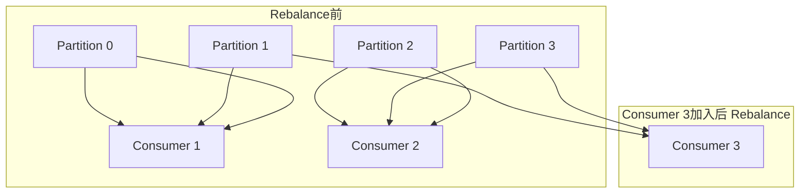

Rebalance 的触发条件包括：消费者加入或离开消费者组、Topic 的 Partition 数量发生变化、消费者定期发送心跳超时（`session.timeout.ms`）。Rebalance 期间，所有的消费者都会停止消费，这会导致短暂的消费停顿（STW，Stop-The-World）。因此，减少 Rebalance 的发生频率是提高消费稳定性的重要手段。

**Rebalance 策略对比**：

| 策略 | 分配方式 | 优点 | 缺点 |
|------|---------|------|------|
| RangeAssignor | 按 Topic 的 Partition 范围分配 | 实现简单 | 各 Topic 分布不均时可能倾斜 |
| RoundRobinAssignor | 所有 Topic 的 Partition 轮询分配 | 均匀分配 | 需要所有消费者订阅相同 Topic |
| CooperativeStickyAssignor | 粘性分配+增量Rebalance | 最小化迁移 | 实现较复杂 |

**CooperativeStickyAssignor 增量 Rebalance 详解**：Kafka 从 2.4 版本开始引入 CooperativeStickyAssignor 作为推荐的分配策略。与传统的 Eager Rebalance（全量重分配）不同，CooperativeStickyAssignor 采用增量 Rebalance 机制。当消费者加入或离开组时，它只会重新分配受影响的 Partition，已经分配好的 Partition 不会受到影响。具体流程分为两个阶段：第一阶段（Prepare Rebalance），Coordinator 标记需要迁移的 Partition，通知相关消费者释放这些 Partition 的消费权；第二阶段（Sync Rebalance），Coordinator 将释放的 Partition 分配给需要的消费者。这种方式使得大部分消费者在整个 Rebalance 过程中不需要暂停消费，只有涉及 Partition 迁移的消费者才会短暂中断。

Kafka 从 0.11 版本开始引入了增量 Rebalance（Incremental Rebalance）机制，只重新分配受影响的 Partition，而不是全部重新分配。从 2.4 版本开始，Kafka 引入了静态成员（Static Membership）机制，消费者在重启时可以保持相同的成员 ID，避免触发不必要的 Rebalance。这两个特性显著减少了 Rebalance 的影响范围和频率。

```java
// Kafka 静态成员 + 协作粘性分配配置
Properties props = new Properties();
props.put("group.instance.id", "consumer-host-1");  // 静态成员ID
props.put("session.timeout.ms", "300000");          // 较长的会话超时（5分钟）
props.put("heartbeat.interval.ms", "10000");        // 心跳间隔（10秒）
props.put("partition.assignment.strategy",
    "org.apache.kafka.clients.consumer.CooperativeStickyAssignor");
```

Rebalance 的最佳实践：使用 `CooperativeStickyAssignor` 减少 Rebalance 影响范围；合理设置 `session.timeout.ms`（建议 30s-300s），避免因网络抖动误判消费者离线；开启静态成员（`group.instance.id`），避免消费者滚动重启触发 Rebalance；消费者启动时延迟加入组（`group.initial.rebalance.delay.ms`），等待所有消费者就绪后再分配。

***

### Consumer Offset 管理

Consumer Offset（消费者偏移量）是消息队列中最关键的状态之一，它记录了消费者在每个 Partition 上的消费进度。正确管理 Offset 直接关系到消息的可靠消费和系统的容错能力。

**Offset 存储机制**：在 Kafka 中，消费者提交的 Offset 存储在内部 Topic `__consumer_offsets` 中（默认 50 个 Partition）。这个 Topic 使用压缩（Log Compaction）策略，只保留每个（group, topic, partition）的最新 Offset。Kafka 3.0 之前还支持将 Offset 存储在 ZooKeeper 中，但已不推荐使用。在 RocketMQ 中，Offset 存储在 Broker 端的 `ConsumeOffset` 文件中。

**自动提交 vs 手动提交**：

```java
// 方式一：自动提交（At-Most-Once 语义）
props.put("enable.auto.commit", "true");
props.put("auto.commit.interval.ms", "5000");  // 每5秒自动提交
// 注意：自动提交可能在消息处理完成前就提交了Offset，导致消息丢失

// 方式二：手动同步提交（强一致性）
props.put("enable.auto.commit", "false");
// 在消费循环中：
try {
    processMessage(record);
    consumer.commitSync();  // 同步提交，阻塞直到提交成功
} catch (Exception e) {
    // 不提交Offset，下次重新消费
}

// 方式三：手动异步提交（推荐）
try {
    processMessage(record);
    consumer.commitAsync((offsets, exception) -> {
        if (exception != null) {
            log.error("Offset 提交失败: {}", offsets, exception);
        }
    });
} catch (Exception e) {
    log.error("消息处理失败", e);
}
// 在消费者关闭时，使用 commitSync 作为兜底
consumer.commitSync();
```

**Offset Reset 策略**：当消费者首次加入组或提交的 Offset 无效（已被删除）时，Kafka 根据 `auto.offset.reset` 配置决定从哪里开始消费：

| 策略 | 行为 | 适用场景 |
|------|------|---------|
| `earliest` | 从 Topic 的最早消息开始消费 | 不想丢失任何消息 |
| `latest` | 从最新的消息开始消费（跳过历史） | 只关心实时数据 |
| `none` | 抛出异常 | 要求 Offset 必须有效 |

**Offset 保留期**：`offsets.retention.minutes`（默认 7 天）控制 Offset 的保留时间。如果消费者组在超过保留期后没有活跃成员，其 Offset 会被删除。下次消费时将根据 `auto.offset.reset` 策略重新定位。

**消费积压（Consumer Lag）计算**：消费积压是最核心的监控指标，计算公式为：

Lag = Log End Offset - Committed Offset

其中 Log End Offset 是 Partition 中最新消息的 Offset，Committed Offset 是消费者组最后提交的 Offset。Lag 持续增长说明消费能力不足，需要扩容消费者或优化消费逻辑。

```bash
# 查看 Kafka 消费者组的 Lag
kafka-consumer-groups.sh --bootstrap-server localhost:9092 \
  --describe --group my-consumer-group

# 输出示例：
# GROUP           TOPIC    PARTITION  CURRENT-OFFSET  LOG-END-OFFSET  LAG
# my-group        orders   0          15678           16000           322
# my-group        orders   1          14500           14500           0
```

***

### 背压处理

当生产者的发送速率超过消费者的处理速率时，消息会在队列中积压，这就是背压问题。如果不加以控制，队列可能会耗尽存储空间，或者消费者处理延迟会不断增加。

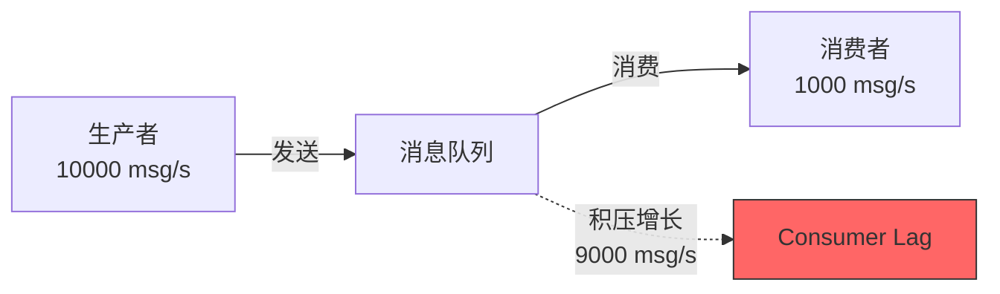

**方案一：限流（Rate Limiting）**

在生产端，可以通过令牌桶或漏桶算法限制发送速率，防止消息过快积压。在消费端，可以通过控制同时处理的消息数量来限制消费速率。Kafka 的 `max.poll.records` 参数可以控制每次 poll 返回的最大消息数量，`max.poll.interval.ms` 控制两次 poll 之间的最大间隔。

```python
# 消费端限流示例
consumer = KafkaConsumer(
    'my-topic',
    max_poll_records=500,       # 每次最多拉取500条
    max_poll_interval_ms=300000 # 处理超时5分钟
)

# 自适应限流：根据处理耗时动态调整batch大小
batch_size = 500
for message in consumer:
    start = time.time()
    process_message(message.value)
    elapsed = time.time() - start
    if elapsed > 1.0:  # 单条处理超过1秒
        batch_size = max(10, batch_size // 2)
    elif elapsed < 0.01:  # 单条处理不到10ms
        batch_size = min(1000, batch_size * 2)
```

**方案二：动态扩缩容**

通过监控队列的积压程度（Consumer Lag），动态调整消费者的数量。当积压超过阈值时增加消费者，当积压降低到阈值以下时减少消费者。Kubernetes 的 HPA（Horizontal Pod Autoscaler）可以根据自定义指标（如 Consumer Lag）来自动扩缩 Pod 数量。

```yaml
# Kubernetes HPA 基于 Consumer Lag 自动扩缩
apiVersion: autoscaling/v2
kind: HorizontalPodAutoscaler
metadata:
  name: kafka-consumer-hpa
spec:
  scaleTargetRef:
    apiVersion: apps/v1
    kind: Deployment
    name: kafka-consumer
  minReplicas: 2
  maxReplicas: 20
  metrics:
  - type: Pods
    pods:
      metric:
        name: kafka_consumer_lag
      target:
        type: AverageValue
        averageValue: "1000"  # 每个Pod积压超过1000条时扩容
```

**方案三：降级处理**

当队列积压严重时，可以跳过非关键消息的处理，只处理关键消息。例如，在日志收集场景中，当积压严重时可以丢弃 DEBUG 级别的日志，只保留 ERROR 级别的日志。在订单处理场景中，可以优先处理高优先级订单，低优先级订单延迟处理。

**方案四：横向扩展消费者**

Kafka 的消费并行度取决于 Partition 数量。如果消费者数量超过 Partition 数量，多余的消费者将处于空闲状态。因此，在设计 Topic 时就要预估未来的消费并行度需求，合理设置 Partition 数量。扩容 Partition 比扩容消费者更根本，但需要注意 Partition 数量的增加不会减少已有 Partition 中的消息（新 Partition 是空的）。

***

### 消息幂等性设计

幂等性（Idempotency）是指同一个操作执行一次和执行多次产生的效果相同。在消息消费场景中，由于网络抖动、消费者重启等原因，同一条消息可能被投递多次。如果消费端没有幂等性保证，就可能导致重复扣款、重复下单等严重业务问题。

**幂等性设计模式对比**：

| 模式 | 实现原理 | 优点 | 缺点 | 适用场景 |
|------|---------|------|------|---------|
| 消息 ID 去重（Redis） | Redis SETNX 记录已处理的 msgId | 性能高，实现简单 | 需要额外的 Redis 依赖 | 通用场景，高吞吐 |
| 消息 ID 去重（DB） | 数据库表记录已处理的 msgId | 无需额外组件 | 性能较低 | 低吞吐场景 |
| 数据库唯一约束 | 利用唯一索引自动去重 | 无需额外逻辑 | 仅适用于写入场景 | 写入数据库的场景 |
| 乐观锁/版本号 | 更新时检查版本号 | 无额外存储开销 | 仅适用于更新场景 | 更新操作 |
| 状态机检查 | 根据业务状态判断 | 天然幂等 | 需要明确的状态流转 | 有状态流转的业务 |
| 分布式锁 | 锁定业务实体进行去重 | 适用面广 | 增加复杂度和延迟 | 复杂业务场景 |

```java
// 多层幂等性保障示例
public class IdempotentMessageHandler {

    @Autowired
    private StringRedisTemplate redisTemplate;
    @Autowired
    private OrderDao orderDao;

    public void handleMessage(MessageExt message) {
        String msgId = message.getMsgId();

        // 第一层：Redis 快速去重（防重，性能最优）
        Boolean isNew = redisTemplate.opsForValue()
            .setIfAbsent("msg:processed:" + msgId, "1", 24, TimeUnit.HOURS);
        if (!isNew) {
            log.info("消息已处理，跳过: {}", msgId);
            return;
        }

        try {
            // 第二层：数据库唯一约束兜底
            Order order = buildOrder(message);
            orderDao.insertWithMsgId(order, msgId);
        } catch (DuplicateKeyException e) {
            // Redis 标记存在但 DB 已有记录（极端情况：Redis 标记过期后消息重发）
            log.warn("重复消息，数据库已存在: {}", msgId);
        }
    }
}
```

**幂等性设计的关键原则**：

1. **唯一业务键**：每条消息携带唯一的业务标识（如订单号+操作类型），作为幂等判断的依据
2. **先查后写**：在执行业务操作前先检查是否已处理过，避免竞态条件
3. **原子操作**：去重检查和业务执行必须是原子的，否则在高并发下仍可能出现重复
4. **过期策略**：去重记录需要设置合理的过期时间，避免存储无限增长
5. **监控告警**：对重复消息进行统计和告警，及时发现消息重发的根因

***

## 实战案例

本节通过四个真实的业务场景，展示消息队列在实际系统中的应用方式和架构设计。

***

### 电商秒杀系统的消息队列应用

秒杀系统是消息队列最经典的应用场景之一。在秒杀活动中，瞬间会有大量用户同时请求下单，这远远超出了数据库的承受能力。消息队列在这里起到了流量削峰的关键作用。

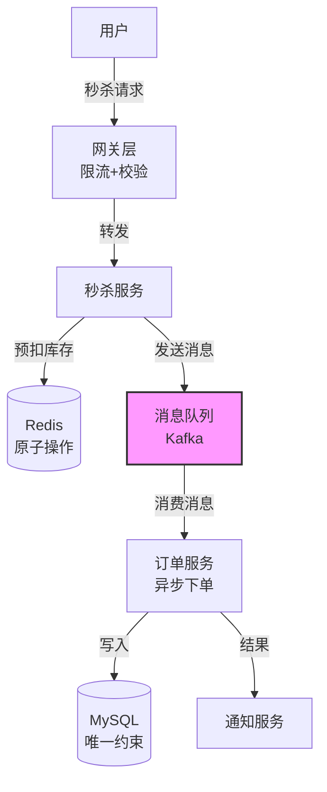

秒杀系统的架构设计如下：用户的秒杀请求首先到达网关层，网关层进行基本的参数校验和限流后，将请求转发到秒杀服务。秒杀服务检查库存是否充足（使用 Redis 原子递减操作），如果充足则生成一条秒杀订单消息发送到消息队列，然后立即返回用户"排队中"的响应。后端的订单处理服务从消息队列中消费消息，执行真正的下单和扣减库存操作。

```java
// 秒杀服务 - 发送消息
@RestController
public class SeckillController {
    @Autowired
    private KafkaTemplate<String, String> kafkaTemplate;
    @Autowired
    private RedisTemplate<String, String> redisTemplate;

    @PostMapping("/seckill/{itemId}")
    public Result seckill(@PathVariable String itemId, @RequestParam String userId) {
        // 1. 幂等性检查：防止同一用户重复下单
        String userKey = "seckill:" + itemId + ":" + userId;
        Boolean isNew = redisTemplate.opsForValue()
            .setIfAbsent(userKey, "1", 30, TimeUnit.MINUTES);
        if (!isNew) {
            return Result.fail("请勿重复提交");
        }

        // 2. 使用Redis原子递减预扣减库存
        Long stock = redisTemplate.opsForValue().decrement("stock:" + itemId);
        if (stock < 0) {
            redisTemplate.opsForValue().increment("stock:" + itemId);
            return Result.fail("已售罄");
        }

        // 3. 发送消息到队列（Key=itemId保证同一商品顺序消费）
        SeckillMessage message = new SeckillMessage(itemId, userId, System.currentTimeMillis());
        kafkaTemplate.send("seckill-topic", itemId, JSON.toJSONString(message));

        return Result.success("排队中，请等待结果通知");
    }
}

// 订单处理服务 - 消费消息
@KafkaListener(topics = "seckill-topic", groupId = "order-group")
public void handleSeckillMessage(ConsumerRecord<String, String> record) {
    SeckillMessage message = JSON.parseObject(record.value(), SeckillMessage.class);

    try {
        orderService.createSeckillOrder(message.getItemId(), message.getUserId());
    } catch (DuplicateKeyException e) {
        log.warn("重复订单，跳过: {}", message);
    } catch (InsufficientStockException e) {
        log.warn("库存不足（Redis预扣减后DB实际不足）: {}", message);
        // 回补Redis库存
        redisTemplate.opsForValue().increment("stock:" + message.getItemId());
    }
}
```

在这个架构中，有几个关键的设计要点：

1. **库存预扣减**：使用 Redis 的原子递减操作在缓存层进行库存扣减，避免了所有请求都打到数据库。预扣减失败（库存不足）时立即返回，不会产生消息。
2. **消息 Key 设计**：消息的 Key 设置为 itemId，保证了同一个商品的秒杀消息会被发送到同一个 Partition，从而保证了顺序消费。
3. **消费端幂等性**：通过数据库的唯一约束（userId + itemId）来防止重复下单。
4. **库存回补**：当消费端实际扣减库存失败时（DB层库存不足），需要回补 Redis 的预扣减库存。

***

### 日志收集与分析平台

日志收集是 Kafka 最典型的应用场景。在一个大规模分布式系统中，每天会产生数 TB 的日志数据，这些日志需要被收集、存储和分析。

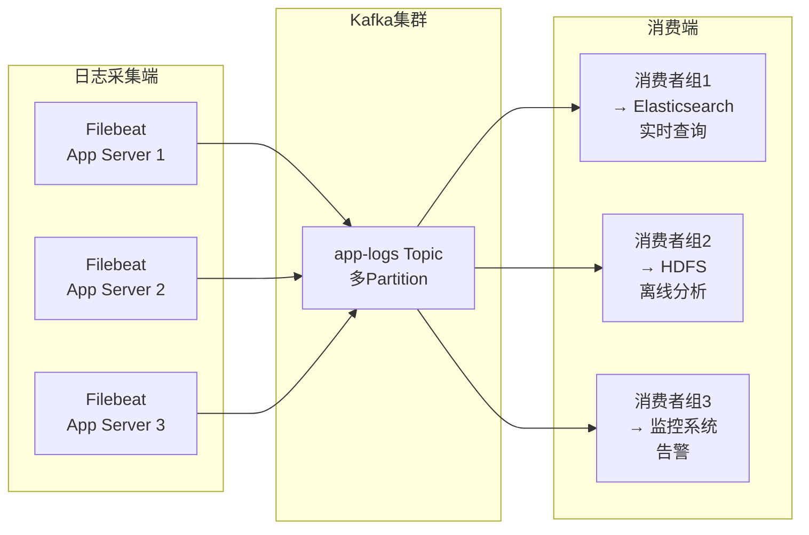

典型的日志收集架构由三部分组成：日志采集端（如 Filebeat、Fluentd）、消息队列（Kafka）和日志消费端（如 Elasticsearch、HDFS）。Kafka 的多消费者组特性使得同一份日志可以被多个不同的系统消费。

```yaml
# Filebeat 配置 - 日志采集
filebeat.inputs:
  - type: log
    paths:
      - /var/log/app/*.log
    fields:
      service: order-service
      env: production
    multiline.pattern: '^\d{4}-\d{2}-\d{2}'
    multiline.negate: true
    multiline.match: after

output.kafka:
  hosts: ["kafka1:9092", "kafka2:9092", "kafka3:9092"]
  topic: "app-logs"
  partition.round_robin:
    reachable_only: false
  required_acks: 1
  compression: gzip
  max_message_bytes: 1048576
```

日志消息的格式设计也很重要。建议使用统一的 JSON 格式，包含以下字段：时间戳（`@timestamp`）、日志级别（`level`）、服务名称（`service`）、主机名（`host`）、Trace ID（`trace_id`，用于链路追踪关联）、请求ID（`request_id`）。这样便于后续的日志解析和关联分析。

```json
{
    "@timestamp": "2025-01-15T10:30:00.123Z",
    "level": "ERROR",
    "service": "order-service",
    "host": "order-pod-1",
    "trace_id": "abc123def456",
    "request_id": "req-789",
    "message": "Failed to create order: insufficient stock",
    "stack_trace": "..."
}
```

***

### 实时数据管道（CDC）

实时数据管道是将数据从源系统实时传输到目标系统的架构。与传统的 ETL（Extract-Transform-Load）相比，实时数据管道具有更低的延迟（秒级），能够支持实时分析和实时决策。

一个典型的实时数据管道场景是将 MySQL 的变更数据实时同步到 Elasticsearch。这个过程使用 CDC（Change Data Capture）技术来捕获 MySQL 的 binlog，然后通过 Kafka 传输到消费者，消费者将变更数据写入 Elasticsearch。

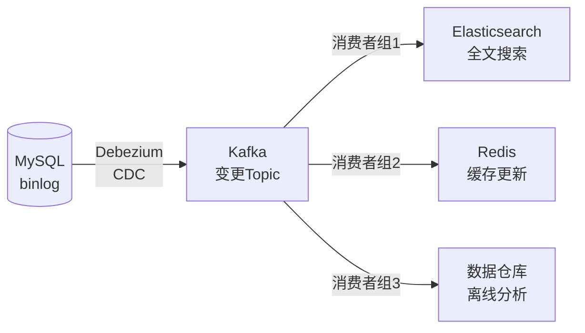

```json
// Debezium CDC 配置 - 捕获 MySQL 变更
{
    "name": "mysql-source-connector",
    "config": {
        "connector.class": "io.debezium.connector.mysql.MySqlConnector",
        "database.hostname": "mysql-host",
        "database.port": "3306",
        "database.user": "debezium",
        "database.password": "password",
        "database.server.id": "1",
        "database.server.name": "dbserver1",
        "database.include.list": "order_db",
        "table.include.list": "order_db.orders,order_db.order_items",
        "database.history.kafka.bootstrap.servers": "kafka:9092",
        "database.history.kafka.topic": "schema-changes.order_db"
    }
}
```

在数据管道中，数据的序列化格式对性能有重要影响。Avro 是一种常用的序列化格式，它支持 Schema 演化，可以在不破坏兼容性的情况下修改数据结构。Confluent Schema Registry 提供了 Avro Schema 的集中管理功能，生产者和消费者可以通过 Schema Registry 获取最新的 Schema 定义。

实时数据管道还需要考虑数据的一致性和完整性。Kafka 的事务机制可以保证数据管道的端到端一致性，确保每条变更要么完全传输成功，要么完全失败，不会出现部分传输的情况。

***

### 微服务异步通信

在微服务架构中，服务之间的通信方式从同步的 REST/gRPC 调用演进到基于消息队列的异步通信，是实现高可用和高弹性的关键一步。事件驱动架构（Event-Driven Architecture，EDA）将消息队列作为微服务间通信的核心基础设施。

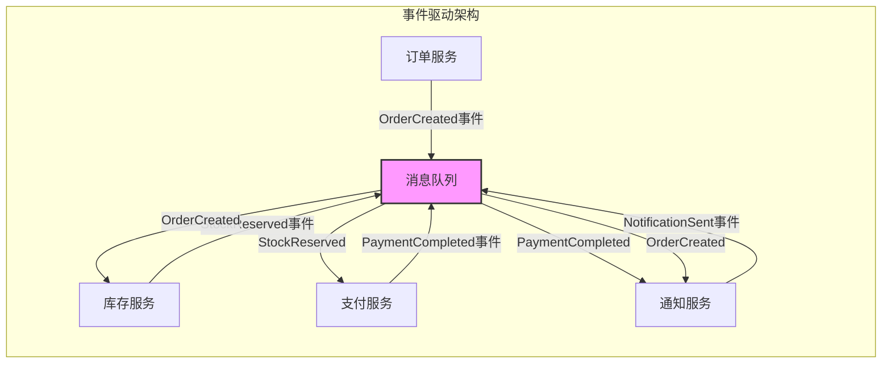

**Saga 模式**：在微服务架构中，一个业务操作往往需要跨越多个服务协同完成。Saga 模式通过将分布式事务拆分为一系列本地事务，并通过消息队列进行协调，避免了两阶段提交（2PC）的性能瓶颈。

Saga 有两种实现方式：

- **编排式（Choreography）**：每个服务监听相关事件并发布自己的事件，通过事件链驱动业务流程。优点是去中心化、松耦合；缺点是流程难以追踪和维护。
- **编排式（Orchestration）**：由一个中心协调器（Orchestrator）负责指挥各个服务的执行顺序。优点是流程清晰、易于维护；缺点是引入了中心节点。

```java
// Saga 编排器示例
public class OrderSagaOrchestrator {

    public void createOrder(OrderCommand command) {
        // 步骤1：创建订单
        try {
            orderService.createOrder(command);
        } catch (Exception e) {
            return; // 失败，终止Saga
        }

        // 步骤2：扣减库存
        try {
            inventoryService.deductStock(command.getItemId(), command.getQuantity());
        } catch (Exception e) {
            // 补偿操作：取消订单
            orderService.cancelOrder(command.getOrderId());
            return;
        }

        // 步骤3：扣款
        try {
            paymentService.charge(command.getUserId(), command.getAmount());
        } catch (Exception e) {
            // 补偿操作：回补库存 + 取消订单
            inventoryService.restoreStock(command.getItemId(), command.getQuantity());
            orderService.cancelOrder(command.getOrderId());
            return;
        }

        // 所有步骤成功，Saga 完成
    }
}
```

**事件溯源（Event Sourcing）**：事件溯源是一种将系统状态变化记录为不可变事件序列的设计模式。每次状态变更都作为一条事件写入消息队列（或事件存储），系统通过重放事件来重建当前状态。事件溯源的优势在于完整的历史记录、可审计性和时间旅行能力，但代价是查询复杂度增加和存储开销增大。

在实践中，事件驱动架构需要特别注意：事件的 Schema 必须严格管理，避免上下游不兼容；需要建立完善的事件追踪机制，确保事件链的可观察性；补偿操作必须保证幂等性，因为重试是常态；监控消费者的 Lag 和处理延迟，确保事件处理的及时性。

***

## 可观测性

消息队列的可观测性是生产环境中最容易被忽视但又极其重要的环节。一个缺乏监控的消息系统就像一个没有仪表盘的飞机——你不知道它什么时候会出问题。

***

### 核心监控指标

#### 生产端指标

| 指标 | 含义 | 告警阈值建议 |
|------|------|-------------|
| `producer-send-rate` | 消息发送速率（msg/s） | 相对基线波动 >50% |
| `producer-send-errors` | 发送失败次数 | >0 持续告警 |
| `producer-request-latency-avg` | 发送请求平均延迟 | >500ms |
| `producer-batch-size-avg` | 批量发送平均大小 | 反映吞吐效率 |

#### 消费端指标

| 指标 | 含义 | 告警阈值建议 |
|------|------|-------------|
| `consumer-lag` | 消费积压（消息数） | >10000 持续告警 |
| `consumer-fetch-rate` | 消费速率（msg/s） | 相对基线下降 >30% |
| `consumer-commit-latency` | 提交偏移量延迟 | >1000ms |
| `consumer-rebalance-rate` | Rebalance 频率 | >1次/小时 |

#### Broker 端指标

| 指标 | 含义 | 告警阈值建议 |
|------|------|-------------|
| `under-replicated-partitions` | 副本不足的Partition数 | >0 立即告警 |
| `active-controller-count` | 活跃控制器数量 | ≠1 立即告警 |
| `log-disk-usage` | 日志磁盘使用率 | >80% |
| `request-handler-idle-ratio` | 请求处理器空闲率 | <0.3 |

***

### Prometheus + Grafana 监控方案

Kafka Exporter 是将 Kafka 指标暴露给 Prometheus 的标准方案。部署 Kafka Exporter 后，Prometheus 可以采集 Kafka 的各项指标，并通过 Grafana 进行可视化展示和告警。

```yaml
# docker-compose.yml - Kafka Exporter + Prometheus
version: '3'
services:
  kafka-exporter:
    image: danielqsj/kafka-exporter:latest
    command:
      - --kafka.server=kafka:9092
      - --kafka.version=3.5.1
    ports:
      - "9308:9308"

  prometheus:
    image: prom/prometheus:latest
    volumes:
      - ./prometheus.yml:/etc/prometheus/prometheus.yml
    ports:
      - "9090:9090"

  grafana:
    image: grafana/grafana:latest
    ports:
      - "3000:3000"
    environment:
      - GF_SECURITY_ADMIN_PASSWORD=admin
```

```yaml
# prometheus.yml
global:
  scrape_interval: 15s

scrape_configs:
  - job_name: 'kafka-exporter'
    static_configs:
      - targets: ['kafka-exporter:9308']
```

***

### 消息追踪

在分布式系统中，一条消息从产生到消费可能经过多个服务。消息追踪（Message Tracing）通过为每条消息附加唯一的 Trace ID，使得运维人员能够追踪消息在整个链路中的流转过程。Apache SkyWalking 和 Jaeger 都支持 Kafka 的消息追踪集成。

消息追踪的实现通常包括以下步骤：

1. 生产者在发送消息时生成唯一的 Trace ID，并写入消息的 Header 或属性中
2. 消费者在消费消息时提取 Trace ID，并在处理过程中传播
3. 追踪系统收集各环节的 Span 信息，构建完整的调用链路

```java
// 在 Kafka 消息中注入 Trace ID
ProducerRecord<String, String> record = new ProducerRecord<>("my-topic", key, value);
// 将 Trace ID 写入消息 Header
record.headers().add("trace-id", SpanContext.current().traceId().getBytes());
producer.send(record);

// 消费者端提取 Trace ID
for (ConsumerRecord<String, String> record : consumer.poll(Duration.ofMillis(100))) {
    String traceId = new String(record.headers().lastHeader("trace-id").value());
    // 关联到当前的追踪上下文
    Tracer.SpanBuilder span = tracer.buildSpan("consume-message")
        .asChildOf(tracer.extract(Format.Builtin.TEXT_MAP, new TextMapAdapter(traceId)))
        .start();
}
```

***

### 告警策略与最佳实践

告警策略是可观测性的最后一道防线，合理的告警配置能够在问题影响用户之前及时发现并处理。消息队列的告警应遵循分级（Tiered）策略：

**告警分级与阈值**：

| 级别 | 含义 | 响应时间 | 通知方式 | 示例 |
|------|------|---------|---------|------|
| INFO | 信息通知 | 工作时间处理 | 邮件/钉钉 | Consumer Lag 超过 5000 |
| WARNING | 需关注 | 4 小时内处理 | 钉钉/企微 | Consumer Lag 超过 10000，磁盘使用率 >70% |
| CRITICAL | 紧急 | 30 分钟内响应 | 电话/短信 | Broker 宕机，Under-replicated Partitions >0，磁盘使用率 >90% |

**核心告警规则**：

```yaml
# Prometheus 告警规则示例
groups:
  - name: kafka-alerts
    rules:
      # 消费积压告警
      - alert: KafkaConsumerLagHigh
        expr: kafka_consumergroup_lag_sum > 10000
        for: 5m
        labels:
          severity: warning
        annotations:
          summary: "消费者组 {{ $labels.consumergroup }} 积压过高"
          description: "Topic {{ $labels.topic }} 当前积压 {{ $value }} 条消息"

      # Broker 不可用告警
      - alert: KafkaBrokerDown
        expr: up{job="kafka-exporter"} == 0
        for: 1m
        labels:
          severity: critical
        annotations:
          summary: "Kafka Broker {{ $labels.instance }} 不可达"
          description: "Broker 已宕机超过1分钟，请立即检查"

      # 副本不足告警
      - alert: KafkaUnderReplicatedPartitions
        expr: kafka_topic_under_replicated_partition > 0
        for: 2m
        labels:
          severity: critical
        annotations:
          summary: "Topic {{ $labels.topic }} 存在副本不足的分区"
          description: "{{ $value }} 个分区副本不足，存在数据丢失风险"

      # 磁盘使用率告警
      - alert: KafkaDiskUsageHigh
        expr: kafka_log_disk_usage_bytes / kafka_log_disk_total_bytes > 0.8
        for: 10m
        labels:
          severity: warning
        annotations:
          summary: "Kafka 磁盘使用率过高"
          description: "磁盘使用率已超过 {{ $value | humanizePercentage }}"
```

**常见故障处理手册（Runbook）**：

1. **Consumer Lag 突增**：首先检查消费者是否存活（心跳正常），然后检查是否有 Rebalance 发生（查看日志），确认消费逻辑是否有异常（数据库慢查询、下游服务超时），最后考虑临时扩容消费者。
2. **Broker 宕机**：检查 Broker 进程和系统日志，确认是 OOM、磁盘满还是网络问题；如果是 ISR 副本不足，优先恢复 Broker 而非重启；检查是否有数据丢失风险。
3. **磁盘满**：紧急清理过期数据（调整 `log.retention.hours`），检查是否有异常的 Topic 或 Partition 占用过多空间，考虑临时扩容磁盘或迁移数据到其他节点。

***

## 安全与运维

消息队列作为系统的核心基础设施，其安全性和运维质量直接影响整个系统的稳定性和数据安全。本节介绍消息队列在认证授权、数据加密、集群运维和容量规划方面的最佳实践。

***

### 认证与授权

消息队列的认证（Authentication）和授权（Authorization）是保护消息系统安全的第一道防线。不同的消息队列提供了不同的安全机制：

**Kafka 安全机制**：Kafka 支持多种认证方式，包括 SASL/PLAIN（用户名密码）、SASL/SCRAM（加盐认证）、SASL/GSSAPI（Kerberos）和 mTLS（双向 TLS）。授权方面，Kafka 提供了 ACL（Access Control List）机制，可以精细控制每个用户对 Topic、Consumer Group、Cluster 的操作权限。

```properties
# Kafka Broker 安全配置
# 启用 SASL/SCRAM 认证
listeners=SASL_PLAINTEXT://0.0.0.0:9092
security.inter.broker.protocol=SASL_PLAINTEXT
sasl.mechanism.inter.broker.protocol=SCRAM-SHA-256
sasl.enabled.mechanisms=SCRAM-SHA-256

# 启用 SSL 加密
listeners=SSL://0.0.0.0:9093
ssl.keystore.location=/path/to/kafka.server.keystore.jks
ssl.keystore.password=changeit
ssl.truststore.location=/path/to/kafka.server.truststore.jks
ssl.truststore.password=changeit
ssl.client.auth=required  # 双向 TLS
```

```bash
# 创建 Kafka SCRAM 用户
kafka-configs.sh --bootstrap-server localhost:9092 \
  --alter --add-config 'SCRAM-SHA-256=[password=secret]' \
  --entity-type users --entity-name app-producer

# 设置 ACL 权限：允许 app-producer 写入 orders Topic
kafka-acls.sh --bootstrap-server localhost:9092 \
  --add --allow-principal User:app-producer \
  --operation Write --topic orders

# 允许 app-consumer 从 orders Topic 消费
kafka-acls.sh --bootstrap-server localhost:9092 \
  --add --allow-principal User:app-consumer \
  --operation Read --topic orders \
  --operation Read --group my-consumer-group
```

**RabbitMQ 安全机制**：RabbitMQ 内置了用户管理系统，支持通过 Management UI 或 CLI 创建用户、设置密码和分配权限。RabbitMQ 支持 vhost（虚拟主机）进行逻辑隔离，不同 vhost 之间的队列和交换器完全独立。TLS 加密可以通过配置 `listeners.ssl` 来启用。

```bash
# RabbitMQ 用户管理
rabbitmqctl add_user app-user secure_password
rabbitmqctl set_user_tags app-user monitoring
rabbitmqctl set_permissions -p /vhost orders app-user ".*" ".*" ".*"
rabbitmqctl set_permissions -p /vhost logs app-user ".*" ".*" ".*"
```

**RocketMQ 安全机制**：RocketMQ 5.0 引入了 ACL（Access Control List）模块，支持基于身份的认证和细粒度的资源授权。通过配置 `acl.yml` 文件，可以定义用户凭证和 Topic 级别的读写权限。

```yaml
# RocketMQ ACL 配置
globalWhiteRemoteAddresses:
  - 10.0.0.0/16

accounts:
  - accessKey: app-producer
    secretKey: producer_secret
    whiteRemoteAddress:
      - 10.0.0.0/16
    topicPerms:
      - orders=PUA  # P=发布(produce), U=订阅(subscribe), A=管理(admin)
    groupPerms:
      - order-group=UA

  - accessKey: app-consumer
    secretKey: consumer_secret
    topicPerms:
      - orders=UA
    groupPerms:
      - order-group=PUA
```

***

### 数据加密

数据加密保护消息内容在传输和存储过程中的安全性，防止敏感信息泄露。

**传输加密（In Transit）**：通过 TLS/SSL 对消息传输通道进行加密，防止消息在传输过程中被窃听或篡改。Kafka 支持在客户端和 Broker 之间、Broker 和 Broker 之间启用 TLS 加密。RabbitMQ 通过配置 SSL Listener 实现传输加密。建议在生产环境中始终启用 TLS 加密，特别是在跨网络或跨数据中心的场景下。

**静态加密（At Rest）**：对于存储在磁盘上的消息数据，可以使用磁盘级别的加密（如 LUKS、dm-crypt）或应用级别的加密。Kafka 可以通过配置 Broker 的磁盘加密来保护静态数据。对于敏感数据，建议在应用层进行加密后再发送到消息队列，这样即使磁盘被窃取，数据也不会泄露。

***

### 集群运维要点

消息队列集群的日常运维是保证系统稳定运行的关键。以下是一些重要的运维要点：

**滚动升级**：消息队列集群的升级应采用滚动升级（Rolling Upgrade）策略，逐个节点进行升级而非同时升级所有节点，以保证服务不中断。Kafka 的滚动升级流程为：先升级 Broker 到新版本（保持兼容旧版本协议），确认所有 Broker 升级完成后，再升级客户端。升级前务必检查新版本的兼容性说明和已知问题。

**分区再分配**：随着集群规模的变化，可能需要重新分配 Partition 到不同的 Broker，以平衡各节点的负载。Kafka 提供了 `kafka-reassign-partitions.sh` 工具来完成分区再分配。建议使用 CMAK（Cluster Manager for Apache Kafka）等工具来自动化这个过程。

```bash
# 生成分区再分配计划
kafka-reassign-partitions.sh --bootstrap-server localhost:9092 \
  --generate --topics-to-move-json-file topics.json \
  --broker-list "0,1,2"

# 执行分区再分配
kafka-reassign-partitions.sh --bootstrap-server localhost:9092 \
  --execute --reassignment-json-file reassignment.json

# 验证再分配完成
kafka-reassign-partitions.sh --bootstrap-server localhost:9092 \
  --verify --reassignment-json-file reassignment.json
```

**Topic 迁移**：在需要将 Topic 从一个集群迁移到另一个集群时（如跨机房迁移），可以使用 MirrorMaker 2（MM2）或 Confluent Replicator 进行在线迁移。迁移过程中需要确保消费者能够平滑切换到新集群。

**磁盘管理**：消息队列的磁盘使用率是最需要关注的运维指标之一。建议设置磁盘使用率告警阈值为 80%（WARNING）和 90%（CRITICAL）。定期检查各 Partition 的大小分布，避免出现数据倾斜（某些 Partition 远大于其他 Partition）。

**日志清理**：合理配置消息保留策略，根据业务需求和磁盘容量设置 `log.retention.hours` 和 `log.retention.bytes`。对于已确认不再需要的 Topic，应及时删除以释放存储空间。

***

### 容量规划与性能调优

合理的容量规划和性能调优能够确保消息队列在满足业务需求的同时保持高效运行。

**吞吐量估算**：消息队列的吞吐量需求取决于业务场景。以下是常见场景的参考数据：

| 场景 | 消息大小 | 消息速率 | 带宽需求 | 磁盘 IOPS |
|------|---------|---------|---------|----------|
| 日志收集 | 1-10 KB | 10万/秒 | 1-10 Gbps | 中等 |
| 电商交易 | 0.1-1 KB | 1万/秒 | 100-500 Mbps | 高 |
| IoT 数据上报 | 0.01-0.1 KB | 100万/秒 | 100-500 Mbps | 中等 |
| 实时分析 | 1-10 KB | 5万/秒 | 500 Mbps-5 Gbps | 高 |

**存储计算**：消息队列的存储需求取决于消息保留时间、消息大小和消息速率。存储估算公式：

存储需求 = 消息速率 × 消息大小 × 保留时间 × 副本数 × 压缩比倒数

例如：10万条/秒 × 1KB × 24小时 × 3副本 × 2（假设 50% 压缩率）= 约 50TB

**性能调优要点**：

```properties
# Kafka Producer 性能调优
batch.size=65536              # 增大批量大小到 64KB，提高吞吐量
linger.ms=5                   # 等待 5ms 凑批，平衡延迟和吞吐
compression.type=lz4          # 使用 LZ4 压缩，减少网络和磁盘开销
buffer.memory=67108864        # 发送缓冲区 64MB
max.in.flight.requests.per.connection=5  # 允许 5 个未确认请求并行

# Kafka Consumer 性能调优
fetch.min.bytes=1024          # 最小拉取字节数，减少空拉取
fetch.max.wait.ms=500         # 最大等待时间
max.poll.records=1000         # 每次拉取最大消息数
fetch.max.bytes=52428800      # 单次最大拉取 50MB
```

```properties
# Kafka Broker 性能调优
num.io.threads=16             # IO 线程数，建议 CPU 核心数
num.network.threads=8         # 网络线程数
log.flush.interval.messages=10000  # 每 10000 条消息刷盘一次
log.flush.interval.ms=1000    # 每 1 秒刷盘一次
num.partitions=6              # 默认分区数
log.segment.bytes=1073741824  # Segment 大小 1GB
```

**性能调优的最佳实践**：Producer 端通过批量发送（batch.size + linger.ms）和压缩（compression.type）来提高吞吐量；Consumer 端通过增大 poll 批量（max.poll.records）和并行消费（多实例或线程池）来提高消费能力；Broker 端通过增加副本数提升可靠性，通过增加 Partition 数提升并行度，通过合理的磁盘和网络配置提升 I/O 性能。在进行性能调优时，应该先建立基线指标，再逐步调整参数并观察效果，避免一次性修改过多参数。

***

## 常见误区

在消息队列的使用过程中，开发者经常陷入一些误区。了解这些误区并掌握正确的做法，可以帮助我们避免不必要的问题。

### 误区一：盲目追求消息零丢失

很多开发者在设计消息系统时，会将"消息零丢失"作为首要目标，过度配置消息的持久化和确认机制。实际上，消息零丢失是一个极端的目标，实现它的代价是非常高的。每个 ACK 确认都会增加消息投递的延迟，每条消息的持久化都会增加磁盘 IO 的开销。

正确的做法是根据业务场景选择合适的投递语义。对于日志收集、监控指标等非关键数据，At-Most-Once 语义就足够了。对于订单、支付等关键数据，使用 At-Least-Once 加消费端幂等性是更实际的方案。只有在金融交易等极端场景下，才需要考虑 Exactly-Once 语义。

### 误区二：忽视消费幂等性

许多开发者在使用 At-Least-Once 语义时，忽视了消费端幂等性的重要性。At-Least-Once 保证消息至少被投递一次，但在网络抖动、消费者重启等情况下，消息可能会被重复投递。如果消费端没有做幂等性处理，就可能导致重复扣款、重复下单等严重问题。

```java
// 消费端幂等性处理（双重保障）
public void consumeMessage(Message message) {
    String msgId = message.getMsgId();

    // 第一层：Redis 快速去重
    Boolean isNew = redisTemplate.opsForValue()
        .setIfAbsent("processed:" + msgId, "1", 24, TimeUnit.HOURS);
    if (!isNew) {
        log.warn("消息已处理，跳过: {}", msgId);
        return;
    }

    try {
        // 第二层：数据库唯一约束兜底
        orderDao.insertWithMsgId(new Order(message, msgId));
    } catch (DuplicateKeyException e) {
        log.warn("重复消息，数据库已存在: {}", msgId);
        // Redis中的标记需要清理（或依赖TTL自动过期）
    }
}
```

### 误区三：消息队列不是万能的

有些开发者将消息队列视为解决所有架构问题的银弹，在不需要消息队列的场景下也强行引入。消息队列的引入会带来系统复杂性的增加：消息的序列化和反序列化、消息的可靠性保证、消费者的管理、消息积压的监控等。

在以下场景中，消息队列并不是最佳选择：

- **简单的同步请求-响应**：业务逻辑简单且对实时性要求高时，同步调用比异步消息更简单直接
- **小数据量场景**：数据量很小且增长缓慢时，消息队列的运维成本不值得
- **严格请求响应模式**：需要即时响应的场景，消息队列无法提供实时反馈

### 误区四：忽略消息积压的监控

消息积压是消息队列使用中最常见的问题之一。当消费者的处理速度跟不上生产者的发送速度时，消息就会在队列中积压，导致消费延迟不断增加。如果不及时发现和处理，积压的消息可能占用大量磁盘空间，甚至导致消息过期丢失。

Kafka 的 Consumer Lag 是最重要的监控指标，它表示消费者当前的消费位置与最新消息之间的差距。建议在以下维度建立监控：

1. **积压量监控**：Consumer Lag 的绝对值，超过阈值告警
2. **积压趋势监控**：Consumer Lag 的变化率，持续增长说明消费能力不足
3. **消费延迟监控**：最新消息时间与当前消费位置时间的差值
4. **消费者健康监控**：消费者存活状态、心跳状态、Rebalance 频率

### 误区五：混淆消息顺序和消息可靠性

有些开发者认为保证了消息顺序就保证了消息可靠性，或者认为保证了消息可靠性就保证了消息顺序。实际上，消息顺序和消息可靠性是两个独立的概念，需要分别处理。

消息顺序是指消息被消费的顺序与发送的顺序一致。消息可靠性是指消息不会丢失且不会被重复消费。在分布式系统中，同时保证两者是非常困难的。例如，当一条消息消费失败需要重试时，后续的消息是等待重试成功还是继续消费，这是一个需要根据业务场景权衡的问题。

建议优先保证消息可靠性，然后在此基础上尽量保证消息顺序。如果消息顺序性要求很高，可以考虑将需要保证顺序的消息路由到同一个 Partition，并使用单线程消费。

***

## 练习方法

通过循序渐进的练习，读者可以加深对消息队列的理解和掌握。

***

### 基础练习

第一个练习是在本地环境中搭建消息队列集群，理解消息队列的基本操作。

#### Docker Compose 一键部署

```yaml
# docker-compose.yml - Kafka + RabbitMQ + RocketMQ 本地环境
version: '3'
services:
  # === Kafka 集群 ===
  zookeeper:
    image: confluentinc/cp-zookeeper:7.5.0
    environment:
      ZOOKEEPER_CLIENT_PORT: 2181

  kafka-broker-1:
    image: confluentinc/cp-kafka:7.5.0
    depends_on: [zookeeper]
    ports: ["9092:9092"]
    environment:
      KAFKA_BROKER_ID: 1
      KAFKA_ZOOKEEPER_CONNECT: zookeeper:2181
      KAFKA_ADVERTISED_LISTENERS: PLAINTEXT://localhost:9092
      KAFKA_NUM_PARTITIONS: 4
      KAFKA_DEFAULT_REPLICATION_FACTOR: 1
      KAFKA_OFFSETS_TOPIC_REPLICATION_FACTOR: 1

  kafka-broker-2:
    image: confluentinc/cp-kafka:7.5.0
    depends_on: [zookeeper]
    ports: ["9093:9093"]
    environment:
      KAFKA_BROKER_ID: 2
      KAFKA_ZOOKEEPER_CONNECT: zookeeper:2181
      KAFKA_ADVERTISED_LISTENERS: PLAINTEXT://localhost:9093
      KAFKA_OFFSETS_TOPIC_REPLICATION_FACTOR: 1

  # === RabbitMQ ===
  rabbitmq:
    image: rabbitmq:3-management
    ports: ["5672:5672", "15672:15672"]
    environment:
      RABBITMQ_DEFAULT_USER: guest
      RABBITMQ_DEFAULT_PASS: guest
```

启动后执行以下操作：

```bash
# 1. 创建 Kafka Topic
docker exec kafka-broker-1 kafka-topics --create \
  --topic test-topic --partitions 3 --replication-factor 1 \
  --bootstrap-server localhost:9092

# 2. 发送测试消息
docker exec -it kafka-broker-1 kafka-console-producer \
  --topic test-topic --bootstrap-server localhost:9092

# 3. 消费测试消息
docker exec -it kafka-broker-1 kafka-console-consumer \
  --topic test-topic --from-beginning --bootstrap-server localhost:9092

# 4. 查看消费者组状态
docker exec kafka-broker-1 kafka-consumer-groups \
  --bootstrap-server localhost:9092 --describe --group test-group

# 5. RabbitMQ 管理界面
# 浏览器访问 http://localhost:15672 (guest/guest)
```

通过这个练习，读者可以直观地理解消息队列的基本概念和操作流程。

***

### 中级练习

第二个练习是实现一个模拟的订单消息系统，包含订单创建、支付通知、库存扣减等环节。这个练习的目标是理解消息的可靠投递和消费幂等性。

```python
# 练习代码框架 - 三个微服务通过消息队列协作
class OrderService:
    def __init__(self, kafka_producer, db):
        self.kafka = kafka_producer
        self.db = db

    def create_order(self, order_data):
        # 1. 幂等性检查
        existing = self.db.find_by_client_id(order_data['client_id'])
        if existing:
            return existing['order_id']

        # 2. 保存订单到数据库
        order_id = self.db.insert_order(order_data)

        # 3. 发送订单创建消息
        message = {"order_id": order_id, "event": "ORDER_CREATED"}
        self.kafka.send("order-events", key=order_id, value=message)
        return order_id


class PaymentService:
    def __init__(self, kafka_producer, db):
        self.kafka = kafka_producer
        self.db = db

    def on_order_created(self, message):
        order_id = message['order_id']

        # 幂等性检查
        if self.db.payment_exists(order_id):
            return

        # 处理支付
        payment_result = self.process_payment(order_id)

        # 发送支付完成消息
        self.kafka.send("order-events", key=order_id,
            value={"order_id": order_id, "event": "PAYMENT_COMPLETED"})
```

在实现过程中，需要处理以下问题：

1. **消息发送失败**：实现发送重试机制（指数退避），并考虑发送缓冲区满时的降级策略
2. **消费失败重试**：实现重试队列（RocketMQ 自带，Kafka 需手动实现），失败 N 次后进入死信队列
3. **消费端幂等性**：使用消息 ID + 数据库唯一约束双重保障
4. **消息顺序性**：将同一订单的所有事件使用相同的 Key

***

### 高级练习

第三个练习是设计和实现一个分布式延迟任务系统。这个系统需要支持任务的延迟执行、任务的重试、任务的超时处理等功能。

系统的核心设计如下：

1. 使用 Redis 的 Sorted Set 作为延迟队列，任务的执行时间作为 Score
2. 编写一个任务调度器，定期从 Sorted Set 中获取到期的任务并执行
3. 使用 Kafka 作为任务的执行队列，将到期的任务发送到 Kafka，由 Worker 消费并执行
4. 实现任务的状态机管理：`PENDING → DELAYED → READY → PROCESSING → COMPLETED/FAILED`
5. 实现任务的重试策略：支持固定间隔、指数退避、自定义策略
6. 实现任务的超时检测：使用 Kafka 的 `max.poll.interval.ms` 或独立的超时检测器

这个练习的挑战在于如何保证任务的可靠执行、如何处理 Worker 的故障、如何实现任务的幂等性、如何支持大规模任务的调度（百万级/天）。通过这个练习，读者可以深入理解消息队列在分布式任务调度中的应用。

***

## 本章小结

本章系统地介绍了消息队列的核心概念、架构设计和工程实践。从理论基础到高级特性，从实战案例到运维安全，帮助读者建立了对消息队列技术栈的完整认知。

### 核心概念回顾

**本质与价值**：消息队列的本质是一种异步通信机制，它在生产者和消费者之间引入了中间存储层，实现了系统解耦、异步处理和流量削峰三大核心价值。

**消息模型**：两种基本模型——点对点模型适用于任务分发，发布订阅模型适用于消息广播。在分布式环境下，发布订阅模型通常与消费者组结合使用，实现了负载均衡和消息广播的统一。

**选型对比**：

| 维度 | Kafka | RabbitMQ | RocketMQ | Pulsar |
|------|-------|----------|----------|--------|
| 核心优势 | 高吞吐 | 灵活路由 | 事务消息 | 弹性扩展 |
| 最佳场景 | 大数据流 | 业务解耦 | 电商金融 | 云原生 |

### 关键技术总结

**投递语义**：At-Most-Once（可能丢消息）适用于非关键数据；At-Least-Once（可能重复）是工程中最常用的方案，需配合消费端幂等性；Exactly-Once（不丢不重）实现复杂且有性能代价，通常通过 At-Least-Once 加幂等性来近似实现。

**高级特性**：顺序消息通过将消息路由到同一个 Partition 来保证局部顺序；事务消息通过两阶段提交保证消息发送和本地事务的原子性；延迟消息通过时间轮算法实现消息的延迟投递；死信队列为无法正常消费的消息提供了隔离存储。

**消费者管理**：Rebalance 是分布式消费的关键机制。使用 CooperativeStickyAssignor 减少影响范围，设置合理的 session.timeout.ms 避免误判，开启静态成员避免滚动重启触发 Rebalance。Consumer Offset 的正确管理（手动提交、合理的 reset 策略）是可靠消费的基础。

**幂等性设计**：消息 ID 去重 + 数据库唯一约束是双重保障的标准方案。根据业务场景选择合适的幂等性模式，保证先查后写的原子性。

### 实践要点

1. 根据业务场景选择合适的投递语义，不要盲目追求消息零丢失
2. 消费端必须实现幂等性处理，防止消息重复消费导致的业务问题
3. 建立完善的监控告警机制（Consumer Lag、Broker 健康、磁盘使用率），及时发现和处理消息积压
4. 合理设置消息的过期时间和队列的最大长度，防止存储空间无限增长
5. 消息队列不是万能的——评估团队运维能力和业务实际需求后再决定是否引入
6. 在安全方面，始终启用认证和传输加密，实施最小权限原则
7. 定期进行容量规划和性能评估，根据业务增长提前扩容

### 延伸阅读

推荐以下资料作为本章的延伸阅读：

- 《Kafka权威指南》（O'Reilly）：深入介绍了 Kafka 的架构设计和最佳实践
- 《RabbitMQ实战》（Manning）：详细讲解了 RabbitMQ 的使用方法和高级特性
- Apache RocketMQ 官方文档（rocketmq.apache.org）：RocketMQ 的完整使用指南
- 《企业集成模式》（Addison-Wesley）：系统地介绍了消息传递系统的设计模式
- Confluent Blog（confluent.io/blog）：Kafka 的最新技术动态和最佳实践
- Jay Kreps 的博文 "I ♥ Logs"：对事件日志和流处理的深度思考
- 《Streaming Systems》（O'Reilly）：深入理解流处理系统的设计原理
- Martin Kleppmann 的 "Designing Data-Intensive Applications"：分布式系统设计的经典著作
