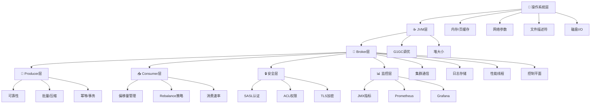
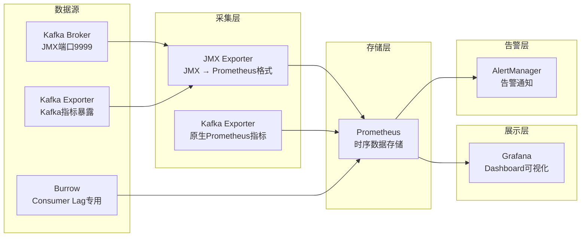

## 技巧一 Kafka生产环境配置

在生产环境中部署和配置Kafka集群，远不是安装一个软件包那么简单。它涉及操作系统内核调优、JVM参数设置、Broker集群配置、生产者和消费者参数调优、安全加固以及监控体系搭建等多个层面。一个配置不当的Kafka集群，轻则性能低下、频繁告警，重则数据丢失、服务中断。

本节将从操作系统底层到应用层，逐层剖析Kafka生产环境配置的核心要点和最佳实践。



### 操作系统层配置

Kafka对操作系统有明确的要求和偏好。理解这些要求背后的原理，是配置出高性能集群的基础。

#### 内存配置

Kafka严重依赖操作系统的页缓存（Page Cache）来加速读写。当消费者读取消息时，Kafka不需要自己管理缓存，而是直接利用操作系统已经缓存在内存中的数据页。这就是为什么Kafka能在廉价磁盘上实现接近内存的读取速度。

**原理：** 操作系统会将最近访问过的磁盘数据缓存在内存中（即页缓存）。Kafka写入数据时，数据先写入页缓存，然后由OS异步刷盘；消费者读取数据时，如果数据在页缓存中命中，就无需磁盘I/O，延迟可低至微秒级。这就是为什么Kafka分配给Broker的JVM堆内存不需要太大——通常6-8GB就足够了——剩余的物理内存应该留给操作系统作为页缓存使用。

一个典型的配置原则是：**JVM堆内存占物理内存的50%以下，其余留给OS页缓存**。例如一台64GB内存的机器，JVM堆设置为8-12GB，剩余50GB+全部作为页缓存，可以让Kafka的读性能接近内存速度。

```bash
# 查看当前机器的物理内存
free -g

# 查看页缓存使用情况
cat /proc/meminfo | grep -E "Cached|Buffers"

# 在Kafka启动脚本中设置JVM堆大小
export KAFKA_HEAP_OPTS="-Xms8g -Xmx8g"
```

**页缓存命中率的监控：** 通过`/proc/meminfo`中的`Cached`字段可以观察页缓存使用量。一个健康运行的Kafka Broker，其页缓存使用量应占可用内存的60%以上。如果页缓存使用率持续偏低，说明物理内存不足以支撑当前的分区和数据规模，需要扩容内存。

还需要注意一个容易被忽略的参数：`vm.max_map_count`。Kafka使用内存映射文件（mmap）来读写日志段，每个分区的日志文件都会映射到进程的虚拟地址空间。当分区数量很多时，默认的`vm.max_map_count`值（通常是65530）可能不够用，导致`OutOfMemoryError`或mmap失败。错误日志中会出现类似`Too many map segments`的提示。

```bash
# 将vm.max_map_count设置为262144（默认65530的4倍）
echo "vm.max_map_count=262144" | sudo tee -a /etc/sysctl.conf
sudo sysctl -p

# 验证设置
sysctl vm.max_map_count

# 估算所需的mmap数量：每个日志段文件需要一个mmap
# 估算公式：分区数 × (1个活跃段 + 1-2个历史段) = 所需mmap数量
# 例如：1000个分区 × 3 ≈ 3000，远低于默认值，无需调整
# 但如果有数万个分区，则必须调大
```

#### 网络配置

Kafka作为高吞吐量的消息系统，网络参数的调优直接影响消息的传输效率。以下是必须调整的核心参数：

```bash
# /etc/sysctl.conf 网络优化配置

# 增大TCP连接队列长度，支持更多并发连接
# 当大量Producer/Consumer同时连接时，队列过小会导致连接被拒绝
net.core.somaxconn = 32768

# 增大网络设备接收队列长度
# 高吞吐场景下，内核需要更大的缓冲队列来暂存到达的数据包
net.core.netdev_max_backlog = 16384

# TCP缓冲区大小（min/default/max，单位字节）
# 这些值影响TCP窗口大小，对大吞吐量传输至关重要
# 发送缓冲区：控制发送端的数据积压能力
net.core.rmem_max = 16777216
net.core.wmem_max = 16777216
net.core.rmem_default = 1048576
net.core.wmem_default = 1048576

# TCP内存管理（min/pressure/max，单位页，1页=4KB）
# 控制TCP协议栈的内存使用上限，避免OOM
net.ipv4.tcp_mem = 786432 1048576 26777216
net.ipv4.tcp_rmem = 4096 1048576 16777216
net.ipv4.tcp_wmem = 4096 65536 16777216

# 启用TCP的窗口缩放和时间戳
# 窗口缩放允许TCP窗口超过64KB限制，对高带宽长距离传输至关重要
net.ipv4.tcp_window_scaling = 1
net.ipv4.tcp_timestamps = 1

# 增大本地端口范围（默认32768-60999，扩大到更多端口）
# 每个对外连接需要一个临时端口，高连接数场景需要更多端口
net.ipv4.ip_local_port_range = 1024 65535

# 启用TCP Fast Open（减少TCP握手延迟）
# 值：0=禁用, 1=仅客户端, 2=仅服务端, 3=客户端+服务端
net.ipv4.tcp_fastopen = 3

# 启用TCP keepalive，及早发现死连接
net.ipv4.tcp_keepalive_time = 600
net.ipv4.tcp_keepalive_intvl = 30
net.ipv4.tcp_keepalive_probes = 3
```

应用配置：

```bash
sudo sysctl -p
```

#### 文件描述符与磁盘I/O

Kafka每个日志段文件都需要一个文件描述符，加上每个分区的索引文件、TimeIndex文件，一个分区大约需要3-4个文件描述符。分区数量多时文件描述符消耗巨大。Linux默认的`ulimit -n`通常是1024，远远不够。

```bash
# /etc/security/limits.conf
# 为kafka用户设置文件描述符限制
kafka soft nofile 100000
kafka hard nofile 100000

# 或者对所有用户设置（注意安全风险，生产环境建议按用户设置）
* soft nofile 100000
* hard nofile 100000

# systemd管理的Kafka服务需要在service文件中设置
# [Service]
# LimitNOFILE=100000
```

**估算文件描述符使用量：** 假设一个Broker管理2000个分区，每个分区3个段文件（活跃段+2个历史段），加上索引和时间索引文件，总共约`2000 × 3 × 3 = 18000`个文件描述符。加上网络连接、日志文件等开销，一个中等规模的Broker需要2-5万个文件描述符。

磁盘I/O方面，Kafka的写入模式是顺序追加写入，因此：

```bash
# 对于XFS文件系统（推荐用于Kafka，性能优于ext4）
sudo mkfs.xfs -f /dev/sdb
sudo mkdir -p /data/kafka
sudo mount -o noatime,nodiratime /dev/sdb /data/kafka

# 对于ext4文件系统
sudo mkfs.ext4 -F /dev/sdb
sudo mount -o noatime,nodiratime,commit=60 /dev/sdb /data/kafka

# noatime：不更新文件访问时间戳，减少一次写操作
# nodiratime：不更新目录访问时间戳
# commit=60（ext4）：将ext4的日志提交间隔从默认5秒延长到60秒
# 减少元数据刷盘频率，提升顺序写入吞吐量，但宕机时可能丢失最多60秒的元数据

# 禁用交换分区（避免GC停顿期间被换出）
sudo swapoff -a
# 或者降低交换倾向（仅在内存确实紧张时才交换）
echo 10 | sudo tee /proc/sys/vm/swappiness
# swappiness范围0-100，10表示极少交换，0表示从不交换（Linux 3.5+）
```

对于多磁盘部署，可以将多个磁盘路径配置到`log.dirs`中，Kafka会将不同分区分布到不同磁盘上，利用多磁盘并行I/O提升吞吐量。Kafka采用轮询（round-robin）方式将新分区分配到磁盘上，尽量保证各磁盘负载均衡。

#### 关键文件系统参数

```bash
# 增大系统级文件描述符限制
echo "fs.file-max = 2097152" | sudo tee -a /etc/sysctl.conf
sudo sysctl -p

# 查看当前文件描述符使用情况
cat /proc/sys/fs/file-nr
# 输出: 已分配  已使用  最大值
# 已分配但未使用的fd + 已使用的fd = 已分配总量
# 当已分配量接近最大值时需要警惕

# 查看Kafka进程的文件描述符使用情况
ls -la /proc/$(pidof kafka.Kafka)/fd | wc -l

# 查看各进程的fd使用排名（用于排查哪个进程消耗最多）
for pid in $(pgrep java); do
  echo "$(ls /proc/$pid/fd 2>/dev/null | wc -l) $pid $(cat /proc/$pid/cmdline 2>/dev/null | tr '\0' ' ' | head -c 80)"
done | sort -rn | head -10
```

#### 磁盘健康监控

```bash
# 查看磁盘I/O统计
iostat -x 1 5

# 关注指标：
# %util：磁盘使用率，持续>80%说明I/O成为瓶颈
# await：平均I/O等待时间，>10ms需要关注
# svctm：平均服务时间，>5ms说明磁盘性能不足

# 查看磁盘SMART健康状态
sudo smartctl -a /dev/sdb

# Kafka日志目录空间监控（建议设置cron定期检查）
du -sh /data/kafka/
```

### JVM配置

Kafka Broker运行在JVM上，JVM参数的配置直接影响Broker的稳定性和性能。Kafka官方推荐使用G1垃圾回收器，因为它在大堆内存场景下能提供可预测的停顿时间。

```bash
# KAFKA_HEAP_OPTS（在kafka-server-start.sh或环境变量中设置）
export KAFKA_HEAP_OPTS="-Xms8g -Xmx8g"

# 完整的JVM参数示例
export KAFKA_JVM_PERFORMANCE_OPTS="
-XX:+UseG1GC
-XX:MaxGCPauseMillis=20
-XX:InitiatingHeapOccupancyPercent=35
-XX:+ExplicitGCInvokesConcurrent
-XX:G1HeapRegionSize=16M
-XX:MetaspaceSize=96m
-XX:MinMetaspaceFreeRatio=50
-XX:MaxMetaspaceFreeRatio=80
-XX:+HeapDumpOnOutOfMemoryError
-XX:HeapDumpPath=/var/log/kafka/heapdump.hprof
-XX:+AlwaysPreTouch
-Djava.awt.headless=true
"
```

**各参数详解：**

| 参数 | 作用 | 推荐值 | 详解 |
|------|------|--------|------|
| `-Xms` / `-Xmx` | JVM堆初始大小/最大大小 | 6-8GB（不超过物理内存50%） | 设为相同值避免堆扩展缩容的开销。G1GC会在扩展和缩容时触发Full GC |
| `-XX:+UseG1GC` | 使用G1垃圾回收器 | 必须启用 | G1是目前最适合Kafka场景的GC算法，兼顾吞吐量和低延迟 |
| `-XX:MaxGCPauseMillis` | G1目标最大停顿时间 | 20ms（默认200ms太大） | G1会根据此目标调整回收策略，值越小GC越频繁但停顿更短 |
| `-XX:InitiatingHeapOccupancyPercent` | 堆使用率达到此百分比时触发并发标记 | 35（默认45偏高） | 过早触发可减少Full GC风险，但会增加CPU消耗 |
| `-XX:G1HeapRegionSize` | G1 Region大小 | 16MB（8GB堆时） | Region越大，Region数量越少，GC开销越小。8GB堆建议16MB，4GB堆建议8MB |
| `-XX:MetaspaceSize` | 元空间初始大小 | 96MB | 避免启动时多次扩展。Kafka加载大量类，Metaspace需求较高 |
| `-XX:+HeapDumpOnOutOfMemoryError` | OOM时自动dump堆 | 必须启用 | 便于事后分析OOM根因，否则只能看日志猜测 |
| `-XX:+AlwaysPreTouch` | 启动时预触摸所有堆内存页 | 建议启用 | 将所有内存页提前分配到物理内存，避免运行时才分配导致的延迟抖动 |
| `-XX:+ExplicitGCInvokesConcurrent` | 将System.gc()转为并发GC | 建议启用 | 避免某些依赖库调用System.gc()时触发Stop-the-World的Full GC |

**不要使用的JVM参数：**
- `-XX:+UseConcMarkSweepGC`（CMS已在Java 9中废弃，Java 14中移除）
- `-XX:+UseParallelGC`（停顿时间不可控，不适合需要低延迟的Broker）
- `-XX:NewSize` / `-XX:MaxNewSize`（G1会自动管理，手动设置反而限制灵活性）
- `-XX:PretenureSizeThreshold`（G1没有这个参数概念）

**GC日志配置（强烈建议开启）：**

```bash
# Java 11+的GC日志配置
-Xlog:gc*:file=/var/log/kafka/gc.log:time,tags:filecount=10,filesize=100M

# Java 8的GC日志配置
-verbose:gc -XX:+PrintGCDetails -XX:+PrintGCDateStamps
-XX:+PrintGCTimeStamps -XX:+PrintHeapAtGC
-Xloggc:/var/log/kafka/gc.log
-XX:+UseGCLogFileRotation -XX:NumberOfGCLogFiles=10 -XX:GCLogFileSize=100M
```

GC日志是排查Broker卡顿、停顿过长等问题的第一手资料。通过`GCViewer`或`GCEasy`工具可以可视化分析GC日志。

### Broker核心配置

`server.properties`是Kafka Broker的核心配置文件，以下按重要性逐项讲解。

#### Broker标识与集群通信

```properties
# Broker唯一标识，在集群中必须唯一
broker.id=0

# 监听器配置：协议://主机名:端口
# 生产环境建议绑定具体IP而非0.0.0.0，减少安全隐患
listeners=PLAINTEXT://192.168.1.101:9092

# 广播地址：其他Broker和客户端用来连接此Broker的地址
advertised.listeners=PLAINTEXT://192.168.1.101:9092

# 机架感知：将Broker映射到物理机架，副本分配时会跨机架分布
# 避免同一机架故障导致数据丢失
broker.rack=/rack-1

# 受控关闭：允许Broker在关闭前将Leader迁移到其他Broker
# 关闭Broker时触发controlled.shutdown，避免分区短暂不可用
controlled.shutdown.enable=true
# 关闭超时：如果Leader迁移在超时时间内未完成，强制关闭
controlled.shutdown.max.retries=3

# 控制平面监听器（Kafka 2.5+用于Broker间内部通信）
# 将控制平面和数据平面分离，避免元数据操作影响数据传输
control.plane.listener.name=CONTROLLER

# 连接限制：防止单个IP占用过多连接
# 生产环境建议设置，防止异常客户端耗尽连接资源
max.connections.per.ip=256
# 超过限制的IP会被拒绝连接，日志中会出现"Too many connections"警告
```

`listeners`和`advertised.listeners`的区别是生产环境中最常踩的坑之一。`listeners`是Broker实际绑定的地址（即Socket绑定的IP和端口），`advertised.listeners`是告诉客户端和其他Broker用来连接的地址（通过元数据响应返回）。在容器化部署、NAT网络、多网卡环境中，两者往往不同。

**典型场景示例：** 在Docker中，Broker内部监听`0.0.0.0:9092`，但宿主机上的客户端需要通过`localhost:9093`（端口映射）连接，此时：

```properties
listeners=PLAINTEXT://0.0.0.0:9092
advertised.listeners=PLAINTEXT://192.168.1.100:9093
```

如果配置错误，客户端可能连上Broker后收到一个无法访问的地址，导致连接失败。典型错误日志为`org.apache.kafka.common.errors.TimeoutException: Failed to update metadata after 30000 ms`。

#### 日志存储与清理

```properties
# 日志存储目录，多个目录用逗号分隔（实现多磁盘并行I/O）
log.dirs=/data/kafka-1,/data/kafka-2,/data/kafka-3

# 每个分区的副本数（生产环境建议3，至少2）
default.replication.factor=3

# ISR最小数量：当ISR副本数低于此值时，Producer的ack=all会收到异常
min.insync.replicas=2

# ==================== 日志保留策略 ====================

# 按时间保留（默认7天）
log.retention.hours=168
# 也可以用毫秒指定，更灵活
# log.retention.ms=604800000

# 按大小限制（-1表示不限制，仅按时间清理）
log.retention.bytes=-1

# 日志段文件大小：1GB
# 一个段文件写满后会滚动创建新段，旧段根据保留策略清理
log.segment.bytes=1073741824

# 检查过期段的间隔：5分钟
# 此间隔越小，空间回收越及时，但IO开销越大
log.retention.check.interval.ms=300000

# 段文件滚动时间（可选，默认7天或直到写满）
# 设置为1天意味着即使段文件未满，也会每天滚动一次
# 这有利于减少保留策略检查的计算量
log.roll.hours=168

# 日志清理策略：delete（删除过期）或 compact（保留每个Key最新值）
log.cleanup.policy=delete

# ==================== 日志压缩（compact模式专用） ====================

# 清洁器触发的最小脏数据比例
# 脏数据（未压缩的比例）超过此值时触发压缩
min.cleanable.dirty.ratio=0.5

# 清洁器线程数
log.cleaner.threads=1

# 压缩段的最大时间间隔
log.cleaner.max.cleanable.dirty.ratio=0.8

# 消息删除延迟（delete模式下消息在retention时间后多久被物理删除）
log.delete.delay.ms=60000

# ==================== 消息大小限制 ====================

# 单条消息最大大小（Broker端）
# 与Producer端的max.request.size和Consumer端的max.partition.fetch.bytes配合
message.max.bytes=10485760     # 10MB
```

**`min.insync.replicas`的深层含义：** 当Producer设置`acks=all`时，它要求所有ISR副本都确认写入。如果ISR中的副本数降到了`min.insync.replicas`以下，Broker会拒绝写入并抛出`NotEnoughReplicasException`。这是一个保护机制——在副本数不足时暂停写入，避免数据丢失风险。

生产环境推荐`replication.factor=3` + `min.insync.replicas=2`的组合，容忍单个Broker故障的同时保证数据安全。当某个Broker宕机后，该Broker上的分区副本会从ISR中移除，此时ISR数量从3降为2，刚好等于`min.insync.replicas`，写入不会被拒绝。只有当第二个Broker也故障时（ISR降为1），写入才会被拒绝。

#### 性能相关配置

```properties
# 网络线程数：处理客户端请求的线程（接收请求、发送响应）
num.network.threads=8           # 建议值：CPU核数

# I/O线程数：处理磁盘读写和请求完成的线程
num.io.threads=16               # 建议值：CPU核数的2倍

# 副本拉取线程数：用于Follower副本从Leader拉取数据
num.replica.fetchers=1          # 建议值：CPU核数/4（如果副本同步延迟高，可适当增大）

# 副本拉取的最小字节数（控制批量拉取）
replica.fetch.min.bytes=1
# 副本拉取的最大等待时间
replica.fetch.wait.max.ms=500

# Socket缓冲区大小
socket.send.buffer.bytes=102400     # 发送缓冲区：100KB
socket.receive.buffer.bytes=102400  # 接收缓冲区：100KB
socket.request.max.bytes=104857600  # 单个请求最大大小：100MB
# 此值应 >= Producer端的 max.request.size + 开销

# 允许自动创建Topic（生产环境必须禁用）
auto.create.topics.enable=false

# 默认分区数量
num.partitions=6

# ==================== 请求队列 ====================

# 请求处理线程的队列大小
queued.max.requests=500
# 如果此队列持续满，说明io.threads不够，需要增大

# ==================== 线程池调优指南 ====================

# num.network.threads 调优：
# - 此线程处理网络I/O（读请求、写响应），不涉及磁盘操作
# - 如果此值过小，客户端请求会在Socket层面排队
# - 监控 kafka.network:type=SocketServer,name=NetworkProcessorAvgIdlePercent
#   如果持续 < 0.3，说明网络线程不够

# num.io.threads 调优：
# - 此线程处理实际的日志读写操作（磁盘I/O）
# - 如果此值过小，已解析的请求会在RequestHandler队列排队
# - 监控 kafka.server:type=KafkaServer,name=RequestHandlerAvgIdlePercent
#   如果持续 < 0.3，说明I/O线程不够
```

`num.network.threads`和`num.io.threads`的设置原则是：网络线程负责接收请求和发送响应，I/O线程负责实际的日志读写操作。如果`num.io.threads`设置过小，当磁盘I/O较慢时会成为瓶颈；设置过大则会增加线程切换开销。通常设为CPU核数的1-2倍是一个合理的起点，然后通过监控`RequestHandlerAvgIdlePercent`指标来微调——如果该值持续低于0.3，说明I/O线程不够用。

#### 控制平面与安全

```properties
# 会话超时：Broker判定Consumer死亡的时间
group.min.session.timeout.ms=6000
group.max.session.timeout.ms=1800000

# Quorum（KRaft模式配置，Kafka 3.3+推荐）
# process.roles=broker,controller
# node.id=1
# controller.quorum.voters=1@controller1:9093,2@controller2:9093,3@controller3:9093
```

#### Quota限流配置

在多租户环境中，需要通过Quota限制单个客户端的资源使用，防止某个异常客户端影响整个集群：

```properties
# Producer端：限制每秒写入字节数（默认-1不限制）
quota.producer.default=10485760    # 10MB/s

# Consumer端：限制每秒读取字节数（默认-1不限制）
quota.consumer.default=20971520    # 20MB/s

# 动态调整（无需重启Broker）
# 限制特定客户端ID的写入速率
kafka-configs.sh --bootstrap-server kafka1:9092 \
  --alter --add-config 'producer_byte_rate=5242880' \
  --entity-type clients --entity-name my-producer-app

# 限制特定用户的所有操作
kafka-configs.sh --bootstrap-server kafka1:9092 \
  --alter --add-config 'request_percentage=25' \
  --entity-type users --entity-name my-user

# 查看当前Quota配置
kafka-configs.sh --bootstrap-server kafka1:9092 \
  --describe --entity-type clients --entity-name my-producer-app
```

### Producer配置详解

生产者配置决定了消息发送的可靠性、性能和容错行为。

#### Java客户端配置

```java
import org.apache.kafka.clients.producer.*;
import java.util.Properties;

Properties props = new Properties();

// === 集群连接 ===
props.put("bootstrap.servers", "kafka1:9092,kafka2:9092,kafka3:9092");

// === 序列化 ===
props.put("key.serializer", "org.apache.kafka.common.serialization.StringSerializer");
props.put("value.serializer", "org.apache.kafka.common.serialization.StringSerializer");

// === 可靠性配置 ===
props.put("acks", "all");                     // 等待所有ISR副本确认
props.put("retries", Integer.MAX_VALUE);       // 无限重试（配合delivery.timeout.ms使用）
props.put("delivery.timeout.ms", 120000);      // 投递超时：2分钟
props.put("retry.backoff.ms", 100);            // 重试退避间隔

// === 幂等性（推荐开启） ===
props.put("enable.idempotence", true);         // 启用幂等Producer
props.put("max.in.flight.requests.per.connection", 5);  // 幂等模式下允许的最大值

// === 事务（需要exactly-once语义时启用） ===
props.put("transactional.id", "order-producer-001");  // 事务ID，必须在集群内唯一
props.put("transaction.timeout.ms", 60000);           // 事务超时

// === 批量发送（提升吞吐量） ===
props.put("batch.size", 32768);                // 批次大小：32KB（默认16KB）
props.put("linger.ms", 5);                     // 等待时间：最多等5ms凑批
props.put("buffer.memory", 67108864);          // 发送缓冲区：64MB

// === 压缩（减少网络和磁盘开销） ===
props.put("compression.type", "lz4");          // 使用LZ4压缩

// === 序列化器自定义 ===
props.put("max.request.size", 10485760);       // 单次请求最大大小：10MB
// 与Broker端的 message.max.bytes 保持一致或更小

KafkaProducer<String, String> producer = new KafkaProducer<>(props);

// 使用事务
producer.initTransactions();
try {
    producer.beginTransaction();
    for (Message msg : messages) {
        producer.send(new ProducerRecord<>("order-events", msg.getKey(), msg.getValue()));
    }
    producer.commitTransaction();  // 原子提交：要么全部成功，要么全部回滚
} catch (Exception e) {
    producer.abortTransaction();
}
```

#### Python客户端配置

```python
from kafka import KafkaProducer
import json

producer = KafkaProducer(
    # === 集群连接 ===
    bootstrap_servers=['kafka1:9092', 'kafka2:9092', 'kafka3:9092'],

    # === 序列化 ===
    key_serializer=lambda k: k.encode('utf-8') if k else None,
    value_serializer=lambda v: json.dumps(v).encode('utf-8'),

    # === 可靠性配置 ===
    acks='all',                    # 等待所有ISR副本确认（最安全）
    retries=2147483647,            # 无限重试（配合delivery.timeout.ms使用）
    delivery_timeout_ms=120000,    # 投递超时：2分钟

    # === 幂等性（推荐开启） ===
    enable_idempotence=True,       # 启用幂等Producer，防止消息重复
    max_in_flight_requests_per_connection=5,  # 幂等模式下允许的最大值

    # === 批量发送（提升吞吐量） ===
    batch_size=32768,              # 批次大小：32KB（默认16KB）
    linger_ms=5,                   # 等待时间：最多等5ms凑批
    buffer_memory=67108864,        # 发送缓冲区：64MB

    # === 压缩（减少网络和磁盘开销） ===
    compression_type='lz4',        # 使用LZ4压缩（推荐：压缩比和速度的最佳平衡）

    # === 请求大小 ===
    max_request_size=10485760,     # 10MB，与Broker端message.max.bytes一致
)
```

#### 幂等性与事务的深层原理

**幂等Producer（Exactly-Once语义的基础）：** 当`enable.idempotence=true`时，Producer会为每条消息分配一个序列号（sequence number），Broker端根据`<producerId, partition, sequenceNumber>`去重。即使Producer因网络抖动重试发送同一条消息，Broker也能识别并丢弃重复消息。

**局限性：** 幂等Producer只能保证单个Producer实例到单个分区的消息不重复。如果Producer崩溃后重启，获得了新的producerId，之前未确认的消息可能会重新发送。要实现跨Producer、跨分区的Exactly-Once语义，需要使用事务（transactional.id）。

**事务：** 通过`transactional.id`可以实现跨分区的原子写入。事务中的所有消息要么全部可见，要么全部不可见。典型使用场景：读取Input Topic → 处理 → 写入Output Topic + 提交偏移量，这三步需要原子完成。

#### `acks`参数的选择逻辑

| acks值 | 含义 | 消息丢失风险 | 性能 | 适用场景 |
|--------|------|-------------|------|---------| 
| `0` | 不等待确认 | 高（网络抖动/Leader故障即丢失） | 最高 | 日志采集等允许丢失的场景 |
| `1` | Leader写入即确认 | 中（Leader故障但Follower未同步时丢失） | 中 | 对丢失有一定容忍度的业务 |
| `all` | 所有ISR副本确认 | 最低 | 最低 | 金融、订单等不能丢消息的场景 |

**性能影响实测：** 在3副本集群中，`acks=all`相比`acks=1`通常会增加20-40%的延迟（取决于网络带宽和磁盘速度）。但通过批量发送（增大`batch.size`和`linger.ms`）可以显著摊薄这个开销。

#### `compression_type`对比

| 算法 | 压缩比 | CPU开销 | 延迟 | 推荐场景 |
|------|--------|---------|------|---------| 
| `none` | 1:1 | 无 | 最低 | CPU极度紧张时 |
| `gzip` | 最高（~3:1+） | 高 | 高 | 存储空间紧张、消息量小 |
| `snappy` | 中等（~2:1） | 低 | 低 | 延迟敏感、吞吐量中等 |
| `lz4` | 中等偏高（~2.5:1） | 低 | 低 | **通用推荐**：最佳平衡 |
| `zstd` | 高（~3:1+） | 中 | 中 | Kafka 2.1+，高压缩比需求 |

**压缩的层级：** Kafka支持Producer端压缩（Producer压缩 → Broker存储压缩数据 → Consumer解压）和Broker端压缩（Producer未压缩 → Broker压缩存储 → Consumer解压）。推荐在Producer端压缩，这样Broker无需额外CPU开销，且网络传输的数据量已经减小。Kafka 2.1+支持在Broker间副本同步时保持压缩状态（`compression.type=producer`），避免解压再压缩的开销。

### Consumer配置详解

消费者配置关注的是消费可靠性、消费速率和资源控制。

#### Java客户端配置

```java
Properties props = new Properties();
props.put("bootstrap.servers", "kafka1:9092,kafka2:9092,kafka3:9092");
props.put("group.id", "order-processing-group");
props.put("auto.offset.reset", "earliest");

// === 手动提交偏移量 ===
props.put("enable.auto.commit", false);

// === 消费控制 ===
props.put("max.poll.records", 500);
props.put("max.poll.interval.ms", 300000);

// === 会话管理 ===
props.put("session.timeout.ms", 30000);
props.put("heartbeat.interval.ms", 10000);

// === 拉取配置 ===
props.put("fetch.min.bytes", 1);
props.put("fetch.max.wait.ms", 500);
props.put("fetch.max.bytes", 52428800);  // 50MB

// === 分区分配策略（推荐使用CooperativeSticky） ===
props.put("partition.assignment.strategy",
    "org.apache.kafka.clients.consumer.CooperativeStickyAssignor");

KafkaConsumer<String, String> consumer = new KafkaConsumer<>(props);
consumer.subscribe(Arrays.asList("order-events"));

try {
    while (true) {
        ConsumerRecords<String, String> records = consumer.poll(Duration.ofMillis(1000));
        for (ConsumerRecord<String, String> record : records) {
            processMessage(record.value());
        }
        // 处理完一批后提交偏移量
        if (!records.isEmpty()) {
            consumer.commitSync();  // 同步提交，确保偏移量持久化
        }
    }
} finally {
    consumer.close();
}
```

#### Python客户端配置

```python
from kafka import KafkaConsumer
import json

consumer = KafkaConsumer(
    # === 集群连接 ===
    bootstrap_servers=['kafka1:9092', 'kafka2:9092', 'kafka3:9092'],

    # === 消费者组 ===
    group_id='order-processing-group',

    # === 消费起始位置 ===
    auto_offset_reset='earliest',  # 无偏移量时从最早消息开始消费

    # === 手动提交偏移量（推荐） ===
    enable_auto_commit=False,      # 关闭自动提交

    # === 消费控制 ===
    max_poll_records=500,          # 每次poll最大返回500条
    max_poll_interval_ms=300000,   # 两次poll之间的最大间隔：5分钟
    # 超过此间隔，Broker会将此Consumer移出消费者组，触发Rebalance

    # === 会话管理 ===
    session_timeout_ms=30000,      # 会话超时：30秒
    heartbeat_interval_ms=10000,   # 心跳间隔：10秒（应小于session_timeout/3）

    # === 拉取配置 ===
    fetch_min_bytes=1,             # 最小拉取字节数
    fetch_max_wait_ms=500,         # 最大等待时间
    fetch_max_bytes=52428800,      # 单次最大拉取：50MB
)

# 手动提交偏移量的正确姿势
try:
    while True:
        messages = consumer.poll(timeout_ms=1000)
        for topic_partition, records in messages.items():
            for record in records:
                try:
                    process_message(record.value)
                except Exception as e:
                    # 处理失败：记录日志，发送到死信队列
                    send_to_dlq(record, e)
            # 一批处理完后提交偏移量（按分区提交更精确）
            consumer.commit()
except KeyboardInterrupt:
    consumer.close()
```

#### Rebalance策略详解

Rebalance是Kafka消费组中分区重新分配的过程，直接影响消费的连续性和性能。

| 策略 | 工作方式 | 优点 | 缺点 | 推荐场景 |
|------|---------|------|------|---------|
| `RangeAssignor` | 按Topic分区号连续分配给Consumer | 简单、分区连续 | 可能导致分区不均 | 单Topic消费 |
| `RoundRobinAssignor` | 所有分区轮询分配给所有Consumer | 均匀分配 | 跨Topic时可能有性能问题 | 多Topic消费 |
| `StickyAssignor` | 尽量保持上一次分配不变 | 减少数据迁移 | 偶尔可能不够均匀 | 一般推荐 |
| **`CooperativeStickyAssignor`** | 增量式Rebalance | **最小化中断** | 需要Kafka 2.4+ | **生产环境首选** |

**CooperativeStickyAssignor（增量Rebalance）的优势：** 传统的Eager Rebalance在触发时，所有Consumer会先释放所有分区的消费权（停止消费），然后重新分配。这意味着即使某个Consumer只需要增加一个分区，所有Consumer都会被中断。CooperativeStickyAssignor只迁移需要调整的分区，其他Consumer继续消费，大幅减少Rebalance对消费延迟的影响。

#### `max.poll.interval_ms`与`max.poll.records`的联动关系

如果单条消息处理时间较长（比如涉及数据库事务），需要确保 `max.poll.records × 单条处理时间 < max.poll.interval_ms`。否则Consumer在处理消息时超时，Broker会将其踢出消费者组，导致Rebalance风暴。

**计算示例：**

| 单条处理时间 | max.poll.interval_ms | 建议max.poll.records |
|-------------|---------------------|---------------------|
| 10ms | 300000 (5分钟) | ≤30000 |
| 50ms | 300000 (5分钟) | ≤6000 |
| 100ms | 300000 (5分钟) | ≤3000 |
| 500ms | 300000 (5分钟) | ≤600 |
| 1s | 300000 (5分钟) | ≤300 |

**实际建议：** 留出20%的安全余量，即 `max.poll.records ≤ max.poll.interval_ms / (单条处理时间 × 1.2)`。

#### 死信队列（Dead Letter Queue）

消费失败的消息不应被无限重试或直接丢弃，而应该发送到死信队列等待后续人工处理：

```python
import json
from kafka import KafkaProducer

dlq_producer = KafkaProducer(
    bootstrap_servers=['kafka1:9092'],
    value_serializer=lambda v: json.dumps(v).encode('utf-8'),
)

MAX_RETRIES = 3

def process_with_dlq(consumer, record):
    retry_key = f"{record.topic}-{record.partition}-{record.offset}"
    retry_count = get_retry_count(retry_key)

    try:
        process_message(record.value)
        consumer.commit()  # 成功才提交
    except Exception as e:
        if retry_count < MAX_RETRIES:
            increment_retry_count(retry_key)
            # 重新放回Topic（发送到原分区）等待重试
            # 注意：这种方式可能导致消息顺序变化
        else:
            # 超过重试次数，发送到死信队列
            dlq_producer.send(
                topic=f"{record.topic}.dlq",
                key=record.key,
                value={
                    "original_topic": record.topic,
                    "original_partition": record.partition,
                    "original_offset": record.offset,
                    "error": str(e),
                    "value": record.value.decode('utf-8'),
                }
            )
            consumer.commit()  # 标记已处理（移入DLQ）
            increment_retry_count(retry_key, reset=True)
```

### 多Broker集群部署

单Broker的Kafka没有实际意义，生产环境至少部署3个Broker以保证高可用。3个Broker可以容忍1个Broker故障而不影响服务——Leader分区会自动迁移到存活的Broker上。

#### Docker Compose示例（KRaft模式）

```yaml
version: '3.8'
services:
  kafka-broker-1:
    image: confluentinc/cp-kafka:7.6.0
    hostname: kafka-broker-1
    container_name: kafka-broker-1
    ports:
      - "9092:9092"
    environment:
      KAFKA_NODE_ID: 1
      KAFKA_PROCESS_ROLES: broker,controller
      KAFKA_LISTENERS: PLAINTEXT://0.0.0.0:9092,CONTROLLER://0.0.0.0:9093
      KAFKA_ADVERTISED_LISTENERS: PLAINTEXT://kafka-broker-1:9092
      KAFKA_CONTROLLER_LISTENER_NAMES: CONTROLLER
      KAFKA_LISTENER_SECURITY_PROTOCOL_MAP: CONTROLLER:PLAINTEXT,PLAINTEXT:PLAINTEXT
      KAFKA_CONTROLLER_QUORUM_VOTERS: 1@kafka-broker-1:9093,2@kafka-broker-2:9093,3@kafka-broker-3:9093
      KAFKA_INTER_BROKER_LISTENER_NAME: PLAINTEXT
      KAFKA_OFFSETS_TOPIC_REPLICATION_FACTOR: 3
      KAFKA_DEFAULT_REPLICATION_FACTOR: 3
      KAFKA_MIN_INSYNC_REPLICAS: 2
      KAFKA_NUM_PARTITIONS: 6
      KAFKA_LOG_RETENTION_HOURS: 168
      KAFKA_LOG_SEGMENT_BYTES: 1073741824
      KAFKA_AUTO_CREATE_TOPICS_ENABLE: "false"
      KAFKA_CONTROLLED_SHUTDOWN_ENABLE: "true"
      KAFKA_MAX_CONNECTIONS_PER_IP: 256
      KAFKA_QUOTA_PRODUCER_DEFAULT: 10485760
      KAFKA_QUOTA_CONSUMER_DEFAULT: 20971520
      KAFKA_JMX_PORT: 9999
      KAFKA_JMX_HOSTNAME: kafka-broker-1
      CLUSTER_ID: 'MkU3OEVBNTcwNTJENDM2Qk'
    volumes:
      - kafka-data-1:/var/lib/kafka/data
    networks:
      - kafka-network
    deploy:
      resources:
        limits:
          memory: 12G
          cpus: '4'
    ulimits:
      nofile:
        soft: 100000
        hard: 100000
    healthcheck:
      test: kafka-broker-api-versions --bootstrap-server localhost:9092
      interval: 30s
      timeout: 10s
      retries: 5
      start_period: 60s

  kafka-broker-2:
    image: confluentinc/cp-kafka:7.6.0
    hostname: kafka-broker-2
    container_name: kafka-broker-2
    ports:
      - "9093:9092"
    environment:
      KAFKA_NODE_ID: 2
      KAFKA_PROCESS_ROLES: broker,controller
      KAFKA_LISTENERS: PLAINTEXT://0.0.0.0:9092,CONTROLLER://0.0.0.0:9093
      KAFKA_ADVERTISED_LISTENERS: PLAINTEXT://kafka-broker-2:9092
      KAFKA_CONTROLLER_LISTENER_NAMES: CONTROLLER
      KAFKA_LISTENER_SECURITY_PROTOCOL_MAP: CONTROLLER:PLAINTEXT,PLAINTEXT:PLAINTEXT
      KAFKA_CONTROLLER_QUORUM_VOTERS: 1@kafka-broker-1:9093,2@kafka-broker-2:9093,3@kafka-broker-3:9093
      KAFKA_INTER_BROKER_LISTENER_NAME: PLAINTEXT
      KAFKA_OFFSETS_TOPIC_REPLICATION_FACTOR: 3
      KAFKA_DEFAULT_REPLICATION_FACTOR: 3
      KAFKA_MIN_INSYNC_REPLICAS: 2
      KAFKA_NUM_PARTITIONS: 6
      KAFKA_LOG_RETENTION_HOURS: 168
      KAFKA_LOG_SEGMENT_BYTES: 1073741824
      KAFKA_AUTO_CREATE_TOPICS_ENABLE: "false"
      KAFKA_CONTROLLED_SHUTDOWN_ENABLE: "true"
      KAFKA_MAX_CONNECTIONS_PER_IP: 256
      KAFKA_JMX_PORT: 9999
      KAFKA_JMX_HOSTNAME: kafka-broker-2
      CLUSTER_ID: 'MkU3OEVBNTcwNTJENDM2Qk'
    volumes:
      - kafka-data-2:/var/lib/kafka/data
    networks:
      - kafka-network
    deploy:
      resources:
        limits:
          memory: 12G
          cpus: '4'
    ulimits:
      nofile:
        soft: 100000
        hard: 100000
    healthcheck:
      test: kafka-broker-api-versions --bootstrap-server localhost:9092
      interval: 30s
      timeout: 10s
      retries: 5
      start_period: 60s

  kafka-broker-3:
    image: confluentinc/cp-kafka:7.6.0
    hostname: kafka-broker-3
    container_name: kafka-broker-3
    ports:
      - "9094:9092"
    environment:
      KAFKA_NODE_ID: 3
      KAFKA_PROCESS_ROLES: broker,controller
      KAFKA_LISTENERS: PLAINTEXT://0.0.0.0:9092,CONTROLLER://0.0.0.0:9093
      KAFKA_ADVERTISED_LISTENERS: PLAINTEXT://kafka-broker-3:9092
      KAFKA_CONTROLLER_LISTENER_NAMES: CONTROLLER
      KAFKA_LISTENER_SECURITY_PROTOCOL_MAP: CONTROLLER:PLAINTEXT,PLAINTEXT:PLAINTEXT
      KAFKA_CONTROLLER_QUORUM_VOTERS: 1@kafka-broker-1:9093,2@kafka-broker-2:9093,3@kafka-broker-3:9093
      KAFKA_INTER_BROKER_LISTENER_NAME: PLAINTEXT
      KAFKA_OFFSETS_TOPIC_REPLICATION_FACTOR: 3
      KAFKA_DEFAULT_REPLICATION_FACTOR: 3
      KAFKA_MIN_INSYNC_REPLICAS: 2
      KAFKA_NUM_PARTITIONS: 6
      KAFKA_LOG_RETENTION_HOURS: 168
      KAFKA_LOG_SEGMENT_BYTES: 1073741824
      KAFKA_AUTO_CREATE_TOPICS_ENABLE: "false"
      KAFKA_CONTROLLED_SHUTDOWN_ENABLE: "true"
      KAFKA_MAX_CONNECTIONS_PER_IP: 256
      KAFKA_JMX_PORT: 9999
      KAFKA_JMX_HOSTNAME: kafka-broker-3
      CLUSTER_ID: 'MkU3OEVBNTcwNTJENDM2Qk'
    volumes:
      - kafka-data-3:/var/lib/kafka/data
    networks:
      - kafka-network
    deploy:
      resources:
        limits:
          memory: 12G
          cpus: '4'
    ulimits:
      nofile:
        soft: 100000
        hard: 100000
    healthcheck:
      test: kafka-broker-api-versions --bootstrap-server localhost:9092
      interval: 30s
      timeout: 10s
      retries: 5
      start_period: 60s

volumes:
  kafka-data-1:
  kafka-data-2:
  kafka-data-3:

networks:
  kafka-network:
    driver: bridge
```

#### KRaft模式说明

从Kafka 3.3开始，KRaft（Kafka Raft）模式被标记为生产就绪。KRaft模式用内置的Raft共识协议替代了外部的ZooKeeper，简化了集群部署和运维。上面的Docker Compose示例已经采用了KRaft模式。

如果你使用的是旧版Kafka（< 3.3），则需要额外部署ZooKeeper集群：

```properties
# ZooKeeper模式下的server.properties需要配置
zookeeper.connect=zk1:2181,zk2:2181,zk3:2181/kafka
zookeeper.connection.timeout.ms=18000
# ZooKeeper session超时时间（默认18秒）
zookeeper.session.timeout.ms=18000
# ZooKeeper请求超时
zookeeper.request.timeout.ms=20000
```

KRaft模式相比ZooKeeper模式的优势：

| 特性 | ZooKeeper模式 | KRaft模式 |
|------|--------------|-----------|
| 外部依赖 | 需要独立的ZK集群（通常3-5节点） | 无外部依赖 |
| 控制平面延迟 | 较高（ZK通信开销，每次Leader选举需多次ZK往返） | 低（内置Raft，单次投票完成） |
| 可支持分区数 | ~20万（ZK内存瓶颈） | ~200万（10倍提升） |
| 集群启停 | 复杂（必须先启动ZK，顺序依赖） | 简单（统一启停，无顺序依赖） |
| 元数据备份 | 复杂（需要ZK数据导出） | 内置快照机制，自动持久化 |
| 运维复杂度 | 高（需同时维护两套集群） | 低（单一集群管理） |

#### Broker滚动重启流程

生产环境中更新Broker配置或升级版本时，需要使用滚动重启策略，确保集群始终可用：

```bash
#!/bin/bash
# rolling-restart.sh - Kafka Broker滚动重启脚本

BROKERS=("kafka-broker-1" "kafka-broker-2" "kafka-broker-3")
WAIT_RECOVERY=60  # 等待Broker恢复的时间（秒）

for broker in "${BROKERS[@]}"; do
    echo "=== 重启 $broker ==="

    # 1. 受控关闭：先迁移Leader再关闭
    docker exec $broker kafka-server-stop
    sleep 5

    # 2. 验证Leader已迁移（UnderReplicatedPartitions应为0）
    echo "等待UnderReplicatedPartitions恢复..."
    for i in $(seq 1 $WAIT_RECOVERY); do
        UNDER=$(docker exec kafka-broker-1 kafka-run-class kafka.tools.AdminClient \
            --bootstrap-server kafka-broker-1:9092 \
            --describe --entity-type brokers 2>/dev/null | grep UnderReplicatedPartitions || echo "N/A")
        if [ "$UNDER" = "UnderReplicatedPartitions=0" ]; then
            echo "集群健康，继续"
            break
        fi
        sleep 1
    done

    # 3. 重启Broker
    docker start $broker

    # 4. 等待Broker完全启动
    echo "等待 $broker 启动..."
    sleep 30

    # 5. 验证Broker已加入集群
    docker exec kafka-broker-1 kafka-metadata.sh \
        --bootstrap-server kafka-broker-1:9092 list 2>/dev/null

    echo "$broker 重启完成"
    echo "---"
done

echo "滚动重启完成"
```

### 安全配置

生产环境的Kafka必须启用安全机制，防止未授权访问和数据泄露。Kafka支持三种安全机制，可以单独使用也可以组合使用。

#### SASL/PLAINTEXT认证

```properties
# server.properties
listeners=SASL_PLAINTEXT://0.0.0.0:9092
advertised.listeners=SASL_PLAINTEXT://kafka1:9092
security.inter.broker.protocol=SASL_PLAINTEXT
sasl.mechanism.inter.broker.protocol=PLAIN
sasl.enabled.mechanisms=PLAIN
```

```bash
# 创建kafka_server_jaas.conf
cat > /etc/kafka/kafka_server_jaas.conf << 'EOF'
KafkaServer {
    org.apache.kafka.common.security.plain.PlainLoginModule required
    username="admin"
    password="admin-secret"
    user_admin="admin-secret"
    user_producer="producer-secret"
    user_consumer="consumer-secret"
};
EOF

# 启动时指定JAAS配置
export KAFKA_OPTS="-Djava.security.auth.login.config=/etc/kafka/kafka_server_jaas.conf"
```

**各SASL机制对比：**

| 机制 | 安全性 | 复杂度 | 性能影响 | 推荐场景 |
|------|--------|--------|---------|---------|
| `PLAIN` | 中（明文传输密码，需配合TLS） | 低 | 低 | 内网环境，快速启用认证 |
| `SCRAM-SHA-256` | 中高（密码哈希传输） | 中 | 中 | 需要避免明文密码但不想用TLS |
| `SCRAM-SHA-512` | 高（更长的哈希） | 中 | 中 | 更高安全要求 |
| `GSSAPI` (Kerberos) | 高 | 高（需Kerberos基础设施） | 中 | 企业级环境，已有Kerberos |

#### ACL权限控制

```bash
# 创建Topic时指定ACL
kafka-acls --bootstrap-server kafka1:9092 \
  --add --allow-principal User:producer \
  --operation Write --topic order-events

# 允许消费者组读取
kafka-acls --bootstrap-server kafka1:9092 \
  --add --allow-principal User:consumer \
  --operation Read --topic order-events \
  --group order-processing-group

# 拒绝某个用户的所有操作（黑名单模式）
kafka-acls --bootstrap-server kafka1:9092 \
  --add --deny-principal User:suspicious-app \
  --operation All --topic '*' --group '*'

# 查看某个Topic的ACL
kafka-acls --bootstrap-server kafka1:9092 \
  --list --topic order-events

# 查看所有ACL
kafka-acls --bootstrap-server kafka1:9092 --list

# 删除ACL
kafka-acls --bootstrap-server kafka1:9092 \
  --remove --allow-principal User:consumer \
  --operation Read --topic order-events \
  --group order-processing-group
```

**ACL设计原则：** 遵循最小权限原则——Producer只授予Write权限，Consumer只授予Read+Group权限，Admin只授予必要的管理操作权限。避免使用`--topic '*'`这种通配符，除非确实需要。

#### TLS加密传输

对于对数据安全要求极高的场景（如金融行业），必须启用TLS加密。TLS不仅加密数据传输，还提供身份验证（通过证书）。

```properties
# server.properties
listeners=SSL://0.0.0.0:9093
advertised.listeners=SSL://kafka1:9093
ssl.keystore.location=/etc/kafka/ssl/kafka.server.keystore.jks
ssl.keystore.password=keystore-password
ssl.key.password=key-password
ssl.truststore.location=/etc/kafka/ssl/kafka.server.truststore.jks
ssl.truststore.password=truststore-password
ssl.client.auth=required          # 要求客户端提供证书（双向TLS）
ssl.endpoint.identification.algorithm=https  # 启用主机名验证
ssl.enabled.protocols=TLSv1.2,TLSv1.3       # 禁用不安全的旧版本
ssl.cipher.suites=TLS_ECDHE_RSA_WITH_AES_256_GCM_SHA384  # 指定安全套件
```

```bash
# 生成服务端证书和密钥库
keytool -genkey -alias kafka-server \
  -keyalg RSA -keysize 2048 \
  -keystore kafka.server.keystore.jks \
  -dname "CN=kafka1,OU=Engineering,O=MyCompany" \
  -storepass keystore-password -keypass key-password

# 导出证书
keytool -export -alias kafka-server \
  -keystore kafka.server.keystore.jks \
  -file kafka-server.cer

# 导入到信任库
keytool -import -alias kafka-server \
  -file kafka-server.cer \
  -keystore kafka.server.truststore.jks \
  -storepass truststore-password -noprompt
```

**TLS性能影响：** TLS会增加约10-20%的CPU开销和1-3ms的延迟。对于延迟敏感的场景，可以考虑：
- 使用TLS 1.3（比TLS 1.2握手更快）
- 启用TLS Session Resumption减少握手次数
- 使用硬件加速（AES-NI指令集）

### 跨数据中心复制

当Kafka集群分布在多个数据中心时，需要使用MirrorMaker 2（MM2）进行跨集群的数据同步。

```properties
# mm2.properties - MirrorMaker 2配置
clusters=cluster-a,cluster-b

# 集群连接信息
cluster-a.bootstrap.servers=kafka-a1:9092,kafka-a2:9092,kafka-a3:9092
cluster-b.bootstrap.servers=kafka-b1:9092,kafka-b2:9092,kafka-b3:9092

# 从cluster-a复制到cluster-b
cluster-a->cluster-b.enabled=true
cluster-a->cluster-b.topics=order-events,payment-events

# 复制模式
# 同步复制：延迟高但数据一致性强
# 异步复制：延迟低但可能有短暂不一致
sync.topic.configs.enabled=false

# 连接集群的认证
cluster-a.security.protocol=SASL_PLAINTEXT
cluster-b.security.protocol=SASL_PLAINTEXT

# 复制带宽限制（防止影响源集群）
replication.policy.class=org.apache.kafka.connect.mirror.IdentityReplicationPolicy

# 偏移量转换（跨集群消费时需要）
offset-syncs.topic.location=source
```

**MM2 vs 原版MirrorMaker：**

| 特性 | 原版MirrorMaker | MirrorMaker 2 |
|------|----------------|---------------|
| 配置复杂度 | 高 | 低（声明式） |
| Topic配置同步 | 不支持 | 自动同步 |
| 偏移量转换 | 不支持 | 内置支持 |
| Exactly-Once | 不支持 | 支持（配合Transactions） |
| Topic过滤 | 复杂的Whitelist | 声明式topics配置 |

### 监控体系搭建

没有监控的生产环境就是盲人骑马。Kafka的监控需要覆盖Broker、Producer、Consumer三个维度，任何一个维度的异常都可能影响整体服务。



#### JMX指标暴露

Kafka默认通过JMX暴露监控指标，在启动脚本中配置：

```bash
export KAFKA_JMX_OPTS="-Dcom.sun.management.jmxremote \
  -Dcom.sun.management.jmxremote.authenticate=false \
  -Dcom.sun.management.jmxremote.ssl=false \
  -Dcom.sun.management.jmxremote.port=9999 \
  -Dcom.sun.management.jmxremote.rmi.port=9999 \
  -Djava.rmi.server.hostname=kafka1"
```

**安全提醒：** 生产环境中应启用JMX认证（`authenticate=true`），并将JMX端口绑定到内部网络IP而非`0.0.0.0`，避免暴露在公网。

#### 核心监控指标

| 指标类别 | 指标名 | 含义 | 告警阈值 | 影响 |
|---------|--------|------|---------|------|
| **Broker** | `UnderReplicatedPartitions` | 副本不足的分区数 | > 0 持续5分钟 | 数据冗余降低，故障风险增大 |
| **Broker** | `ActiveControllerCount` | 活跃Controller数量 | != 1 | 多Controller脑裂或无Controller |
| **Broker** | `OfflinePartitionsCount` | 离线分区数 | > 0 | 对应分区的读写完全不可用 |
| **Broker** | `RequestHandlerAvgIdlePercent` | 请求处理线程平均空闲率 | < 0.3 | Broker处理能力接近饱和 |
| **Broker** | `LogFlushRateAndLatencyMs` | 日志刷盘延迟 | P99 > 100ms | 写入延迟增大，影响Producer |
| **Broker** | `BytesInPerSec` / `BytesOutPerSec` | 网络吞吐量 | 超过网卡带宽80% | 网络成为瓶颈 |
| **Broker** | `ActiveBrokerCount` | 活跃Broker数量 | < 集群总数 | 有Broker宕机或不可达 |
| **Producer** | `record-error-rate` | 发送错误率 | > 0 持续1分钟 | 消息发送失败 |
| **Producer** | `record-send-rate` | 发送速率 | 基线对比突变 | 流量异常 |
| **Producer** | `record-queue-time-ms` | 消息在队列中的等待时间 | P99 > 1000ms | Producer端排队严重 |
| **Consumer** | `records-lag-max` | 最大消费延迟（Consumer Lag） | > 10000 持续10分钟 | 消费积压，数据处理延迟 |
| **Consumer** | `records-consumed-rate` | 消费速率 | 骤降50%以上 | 消费者异常 |
| **Consumer** | `commit-rate` | 偏移量提交频率 | 骤降至0 | 消费者可能已停止工作 |

#### Consumer Lag监控工具选型

| 工具 | 功能 | 优势 | 劣势 | 推荐场景 |
|------|------|------|------|---------|
| `kafka-consumer-groups.sh` | 命令行查看Lag | 无需额外部署 | 无历史趋势 | 临时排查 |
| **Burrow** | Consumer Lag专业监控 | 自动评估Lag健康状态 | 仅关注Lag | Consumer监控 |
| Kafka Exporter | Prometheus格式暴露 | 与Prometheus集成 | 指标较基础 | 基础监控 |
| Confluent Control Center | 全功能管理界面 | 功能全面 | 收费（企业版） | Confluent用户 |

**Burrow的优势：** Burrow不仅显示Lag数值，还能自动评估Consumer的"健康状态"（OK/WARNING/ERROR/STOP/REWRITE），基于Lag的变化趋势判断消费是否在追赶。这比简单的阈值告警更智能。

#### 基于Prometheus + Grafana的监控栈

```yaml
# docker-compose.monitoring.yml
version: '3.8'
services:
  jmx-exporter:
    image: prom/jmx-exporter:0.20.0
    container_name: jmx-exporter
    ports:
      - "9404:9404"
    volumes:
      - ./jmx-exporter-config.yml:/etc/jmx-exporter/config.yml
    command:
      - "9404"
      - "/etc/jmx-exporter/config.yml"

  kafka-exporter:
    image: danielqsj/kafka-exporter:latest
    container_name: kafka-exporter
    ports:
      - "9308:9308"
    command:
      - "--kafka.server=kafka-broker-1:9092"
      - "--kafka.server=kafka-broker-2:9092"
      - "--kafka.server=kafka-broker-3:9092"

  burrow:
    image: linkedin/burrow:latest
    container_name: burrow
    ports:
      - "8000:8000"
    volumes:
      - ./burrow-config.yml:/etc/burrow/burrow-config.yml

  prometheus:
    image: prom/prometheus:latest
    container_name: prometheus
    ports:
      - "9090:9090"
    volumes:
      - ./prometheus.yml:/etc/prometheus/prometheus.yml
      - prometheus-data:/prometheus

  grafana:
    image: grafana/grafana:latest
    container_name: grafana
    ports:
      - "3000:3000"
    environment:
      - GF_SECURITY_ADMIN_PASSWORD=admin
    volumes:
      - grafana-data:/var/lib/grafana
      - ./grafana-dashboards:/etc/grafana/provisioning/dashboards

  alertmanager:
    image: prom/alertmanager:latest
    container_name: alertmanager
    ports:
      - "9093:9093"
    volumes:
      - ./alertmanager.yml:/etc/alertmanager/alertmanager.yml

volumes:
  prometheus-data:
  grafana-data:
```

jmx-exporter配置文件：

```yaml
# jmx-exporter-config.yml
hostPort: kafka1:9999
lowercaseOutputName: true
rules:
  # Broker级别指标
  - pattern: kafka.server<type=BrokerTopicMetrics, name=MessagesInPerSec><>Count
    name: kafka_server_messages_in_per_sec
    type: COUNTER
  - pattern: kafka.server<type=ReplicaManager, name=UnderReplicatedPartitions><>Value
    name: kafka_server_under_replicated_partitions
    type: GAUGE
  - pattern: kafka.server<type=ReplicaManager, name=ActiveControllerCount><>Value
    name: kafka_server_active_controller_count
    type: GAUGE
  - pattern: kafka.server<type=ReplicaManager, name=OfflinePartitionsCount><>Value
    name: kafka_server_offline_partitions_count
    type: GAUGE
  - pattern: kafka.server<type=KafkaServer, name=RequestHandlerAvgIdlePercent><>MeanRate
    name: kafka_server_request_handler_idle_percent
    type: GAUGE
  # 网络吞吐
  - pattern: kafka.server<type=BrokerTopicMetrics, name=BytesInPerSec><>Count
    name: kafka_server_bytes_in_per_sec
    type: COUNTER
  - pattern: kafka.server<type=BrokerTopicMetrics, name=BytesOutPerSec><>Count
    name: kafka_server_bytes_out_per_sec
    type: COUNTER
  # Producer端指标
  - pattern: kafka.producer<type=producer-metrics, client-id=(.+)><>record-error-rate
    name: kafka_producer_record_error_rate
    labels:
      client_id: "$1"
    type: GAUGE
  # Consumer Lag
  - pattern: kafka.server<type=group-coordinator-metrics, name=group-size><>Value
    name: kafka_server_group_size
    type: GAUGE
```

#### Prometheus告警规则

```yaml
# prometheus-rules.yml
groups:
  - name: kafka-alerts
    rules:
      # UnderReplicatedPartitions不为0
      - alert: KafkaUnderReplicatedPartitions
        expr: kafka_server_under_replicated_partitions > 0
        for: 5m
        labels:
          severity: critical
        annotations:
          summary: "Kafka副本不足分区数 > 0"
          description: "有 {{ $value }} 个分区副本不足，可能有Broker宕机或网络问题"

      # Controller数量异常
      - alert: KafkaControllerNotAvailable
        expr: kafka_server_active_controller_count != 1
        for: 1m
        labels:
          severity: critical
        annotations:
          summary: "Kafka Controller数量异常"
          description: "当前Controller数量为 {{ $value }}，应为1"

      # 离线分区
      - alert: KafkaOfflinePartitions
        expr: kafka_server_offline_partitions_count > 0
        for: 1m
        labels:
          severity: critical
        annotations:
          summary: "Kafka存在离线分区"
          description: "{{ $value }} 个分区处于离线状态，读写不可用"

      # Consumer Lag过高
      - alert: KafkaConsumerLagHigh
        expr: kafka_server_group_lag > 10000
        for: 10m
        labels:
          severity: warning
        annotations:
          summary: "Consumer Lag过高"
          description: "消费者组 {{ $labels.consumergroup }} 在主题 {{ $labels.topic }} 分区 {{ $labels.partition }} 的Lag为 {{ $value }}"

      # 请求处理线程空闲率低
      - alert: KafkaRequestHandlerBusy
        expr: kafka_server_request_handler_idle_percent < 0.3
        for: 5m
        labels:
          severity: warning
        annotations:
          summary: "Kafka请求处理线程忙碌"
          description: "请求处理线程空闲率仅为 {{ $value | humanizePercentage }}，Broker可能即将过载"
```

#### 关键Grafana Dashboard推荐

| Dashboard | ID | 内容 |
|-----------|-----|------|
| Kafka Overview | 7589 | Broker整体概览：吞吐量、副本状态、Controller |
| Kafka Consumer Group | 7590 | 消费者组详细监控：Lag趋势、消费速率 |
| Kafka Exporter | 13079 | Kafka Exporter提供的指标全览 |
| JVM Metrics | 4701 | Kafka Broker的JVM GC、堆内存、线程监控 |

### 部署验证清单

完成部署后，按照以下清单逐项验证：

```bash
# 1. 检查集群状态
kafka-broker-api-versions.sh --bootstrap-server kafka1:9092
# 应该返回所有Broker的API版本信息

# 2. 验证KRaft集群元数据
kafka-metadata.sh --snapshot /var/lib/kafka/meta.properties --cluster-id <cluster-id> 2>/dev/null

# 3. 创建测试Topic
kafka-topics.sh --bootstrap-server kafka1:9092 \
  --create --topic test-topic \
  --partitions 6 \
  --replication-factor 3

# 4. 验证Topic创建成功
kafka-topics.sh --bootstrap-server kafka1:9092 --describe --topic test-topic
# 应该看到3个副本，Leader均匀分布在不同Broker上
# 每个分区应该有3个副本，ISR数量为3

# 5. 验证ISR同步状态
kafka-topics.sh --bootstrap-server kafka1:9092 --describe --topic test-topic | grep "Isr"
# 所有分区的ISR应该包含所有3个副本

# 6. 生产测试消息
for i in $(seq 1 1000); do
  echo "test-message-$i" | kafka-console-producer.sh \
    --bootstrap-server kafka1:9092 --topic test-topic
done

# 7. 消费测试消息
kafka-console-consumer.sh --bootstrap-server kafka1:9092 \
  --topic test-topic --from-beginning --group test-consumer
# 应该消费到1000条消息

# 8. 验证多磁盘均衡
kafka-log-dirs.sh --bootstrap-server kafka1:9092 --describe --broker-ids 0
# 检查各磁盘上的分区分布是否均匀

# 9. 压力测试
kafka-producer-perf-test.sh \
  --topic test-topic \
  --num-records 1000000 \
  --record-size 1024 \
  --throughput -1 \
  --producer-props bootstrap.servers=kafka1:9092 \
  acks=all batch.size=32768 compression.type=lz4
# 记录吞吐量数据作为基线

# 10. 验证消费者组
kafka-consumer-groups.sh --bootstrap-server kafka1:9092 --list
kafka-consumer-groups.sh --bootstrap-server kafka1:9092 \
  --describe --group test-consumer
# 确认消费偏移量与最新偏移量一致（Lag=0）

# 11. 验证故障恢复
# 暂停一个Broker，观察UnderReplicatedPartitions是否短暂增加后恢复
docker stop kafka-broker-3
sleep 10
kafka-topics.sh --bootstrap-server kafka1:9092 --describe --topic test-topic | grep -c "Isr"
# 应该看到ISR从3变为2
docker start kafka-broker-3
sleep 30
kafka-topics.sh --bootstrap-server kafka1:9092 --describe --topic test-topic | grep -c "Isr"
# 应该恢复到ISR=3

# 12. 验证ACL（如果启用了安全）
kafka-acls --bootstrap-server kafka1:9092 --list
# 检查ACL规则是否正确

# 13. 清理测试Topic
kafka-topics.sh --bootstrap-server kafka1:9092 \
  --delete --topic test-topic
```

### 常见配置误区

**误区一：JVM堆内存设得越大越好。**

Kafka的核心性能优势来自OS页缓存而非JVM堆。过大的JVM堆会导致更长的GC停顿时间——当堆为32GB时，一次Full GC可能暂停数十秒，期间Broker完全无法处理请求。推荐6-8GB，剩余内存留给页缓存。实测表明，8GB堆的Kafka在相同硬件上比32GB堆的Kafka吞吐量更高、延迟更低。

**误区二：`acks=1`就够安全了。**

`acks=1`只等待Leader确认。如果Leader在写入后、Follower同步前崩溃，这条消息就丢了。更危险的是，这种丢失是静默的——Producer不会收到任何错误提示。对于不能丢消息的业务，必须使用`acks=all`配合`min.insync.replicas=2`。

**误区三：开启自动提交偏移量。**

`enable.auto.commit=true`在Consumer崩溃时可能导致消息丢失——偏移量已提交但消息尚未处理完成。典型场景：Consumer从Kafka拉取了10条消息（偏移量100-109），自动提交了偏移量110，然后在处理第5条消息时崩溃。重启后从偏移量110开始消费，第0-4条消息就丢了。生产环境应该使用手动提交，并在消息处理成功后才提交。

**误区四：不分场景一律追求高吞吐量。**

低延迟和高吞吐量是天然矛盾的。`linger.ms`越大吞吐量越高但延迟也越大。应该根据业务场景选择合适的平衡点——实时交易系统需要`linger.ms=0`，日志收集系统可以设到50-100ms。同样，`compression.type`也不是越高压缩比越好——zstd压缩比最高但CPU开销也最大，如果CPU资源紧张，lz4可能是更好的选择。

**误区五：不监控Consumer Lag。**

Consumer Lag是最重要的消费侧指标。Lag持续增大意味着消费速度跟不上生产速度，如果不及时发现和处理，最终可能导致消息过期被清理，数据永久丢失。正确的做法是：设置Lag告警阈值，同时监控Lag的**变化趋势**——Lag在增长比Lag的绝对值更重要。

**误区六：生产环境允许自动创建Topic。**

`auto.create.topics.enable=true`在开发环境很方便，但生产环境中应该禁用。自动创建的Topic使用默认的分区数和副本数，不符合生产级别的可靠性要求。更严重的是，某些消息队列客户端库在连接时会自动发送元数据请求，触发Broker自动创建Topic。应该通过IaC（Infrastructure as Code）工具统一管理Topic的创建。

**误区七：忽视Broker受控关闭。**

关闭Broker时如果没有启用`controlled.shutdown.enable=true`，Broker会直接退出。此时Leader需要等`session.timeout.ms`超时后才会被其他Broker接管，期间该分区的读写不可用。启用受控关闭后，Broker会先将自己持有的Leader分区迁移到其他Broker，然后再退出，整个过程平滑无中断。

**误区八：所有Topic使用相同的配置。**

不同业务Topic对可靠性和性能的需求不同。例如，日志类Topic可以`replication.factor=2` + 保留1天 + `acks=1`；而订单类Topic需要`replication.factor=3` + 保留7天 + `acks=all`。Kafka支持Topic级别的配置覆盖：

```bash
# 覆盖特定Topic的日志保留策略
kafka-configs.sh --bootstrap-server kafka1:9092 \
  --entity-type topics --entity-name order-events \
  --alter --add-config \
  retention.ms=604800000,replication.factor=3,min.insync.replicas=2

# 查看Topic级别的配置
kafka-configs.sh --bootstrap-server kafka1:9092 \
  --entity-type topics --entity-name order-events \
  --describe
```

### 配置参数速查表

以下是生产环境最常用参数的速查表，便于快速查阅和调优：

| 分类 | 参数 | 推荐值 | 说明 |
|------|------|--------|------|
| **JVM** | `-Xms` / `-Xmx` | 6-8GB | 不超过物理内存50% |
| **JVM** | `MaxGCPauseMillis` | 20ms | G1目标停顿时间 |
| **JVM** | `InitiatingHeapOccupancyPercent` | 35 | 过早触发并发标记 |
| **Broker** | `num.network.threads` | CPU核数 | 网络处理线程 |
| **Broker** | `num.io.threads` | CPU核数×2 | 磁盘I/O线程 |
| **Broker** | `default.replication.factor` | 3 | 副本数 |
| **Broker** | `min.insync.replicas` | 2 | 最小ISR |
| **Broker** | `log.retention.hours` | 168 | 保留7天 |
| **Broker** | `auto.create.topics.enable` | false | 禁用自动创建 |
| **Broker** | `controlled.shutdown.enable` | true | 受控关闭 |
| **Producer** | `acks` | all | 所有ISR确认 |
| **Producer** | `enable.idempotence` | true | 幂等Producer |
| **Producer** | `compression.type` | lz4 | 压缩算法 |
| **Producer** | `batch.size` | 32768 | 批次32KB |
| **Producer** | `linger.ms` | 5 | 凑批等待5ms |
| **Consumer** | `enable.auto.commit` | false | 手动提交 |
| **Consumer** | `auto.offset.reset` | earliest | 无偏移量从头消费 |
| **Consumer** | `max.poll.records` | 500 | 每次poll最大条数 |
| **Consumer** | `max.poll.interval.ms` | 300000 | 最大处理时间5分钟 |
| **Consumer** | `session.timeout.ms` | 30000 | 会话超时30秒 |
| **Consumer** | `heartbeat.interval.ms` | 10000 | 心跳间隔10秒 |
| **OS** | `vm.max_map_count` | 262144 | mmap映射数 |
| **OS** | `fs.file-max` | 2097152 | 系统最大fd数 |
| **OS** | `somaxconn` | 32768 | TCP连接队列 |
| **OS** | `ulimit -n` | 100000 | 进程fd限制 |

### 本节小结

Kafka生产环境配置是一个从操作系统到应用层的系统工程，涉及数百个参数。本节从操作系统层、JVM层、Broker层、Producer/Consumer层、安全层、监控层六个维度，系统性地梳理了生产环境配置的核心要点。核心原则可以归纳为以下几点：

**可靠性优先：** `acks=all` + `min.insync.replicas=2` + 手动提交偏移量 + 副本数≥3，这四个配置构成了数据安全的底线。在此基础上，启用幂等Producer防止消息重复，配置死信队列处理消费失败的消息。

**性能靠页缓存：** JVM堆内存不要超过物理内存的50%，把内存留给操作系统页缓存；使用LZ4压缩减少网络传输；合理设置批量参数（`batch.size` + `linger.ms`）；多磁盘部署提升I/O并行度。

**监控不能缺：** UnderReplicatedPartitions、ActiveControllerCount、Consumer Lag是最关键的三个指标，任何一个异常都需要立即响应。基于Prometheus + Grafana的监控栈是业界标准方案。

**安全不能忘：** 生产环境必须启用认证（SASL）+ 授权（ACL），数据敏感场景还需要TLS加密。同时通过`max.connections.per.ip`和Quota限制防止资源滥用。

Kafka的配置参数有数百个，但真正决定生产环境稳定性的就是上述核心参数。把这几个参数配对了，集群就稳了一大半。剩余的参数可以在运行过程中根据监控数据逐步调优，不需要一步到位。记住：**配置不是一次性的工程，而是持续优化的过程**。
