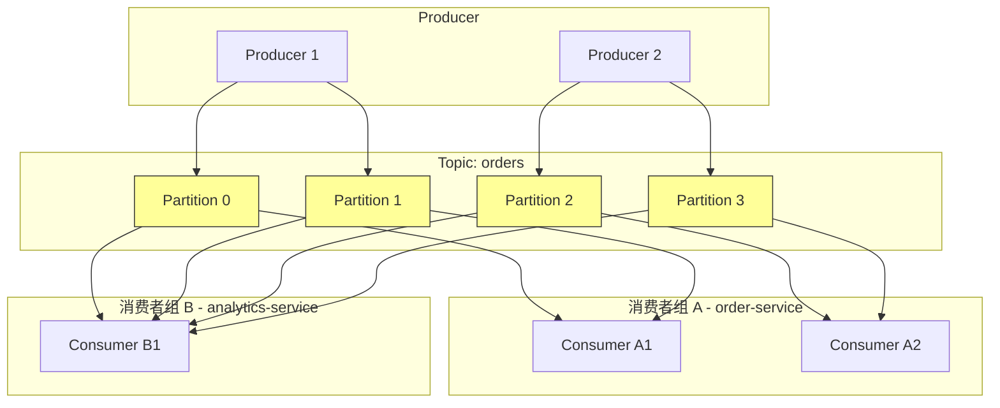
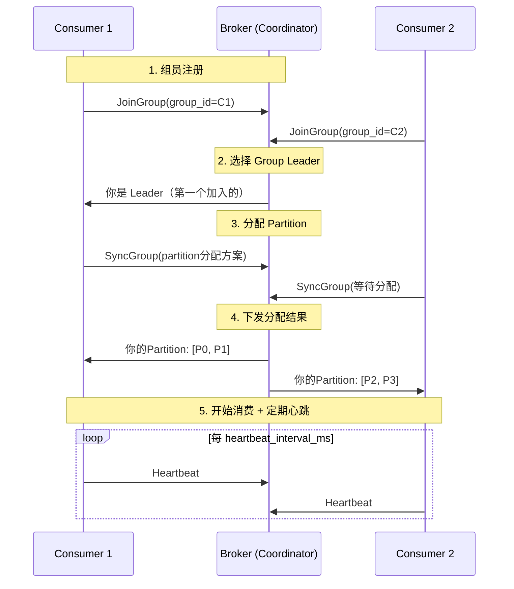
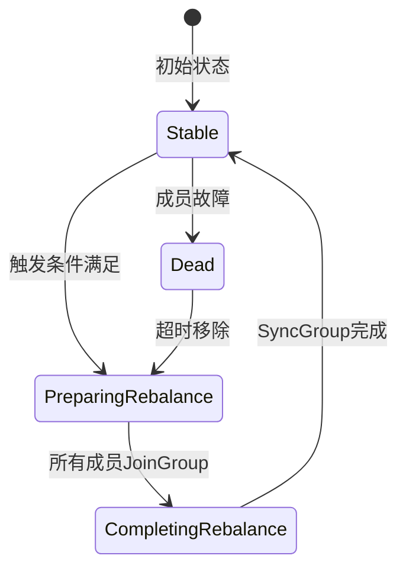

## 技巧二 消费者组管理

消费者组（Consumer Group）是消息队列中最核心的并发消费抽象——它将「点对点」的竞争消费和「发布订阅」的广播消费统一在一个概念之下。一个设计合理的消费者组，可以让消息队列在吞吐量、可靠性和运维灵活性之间取得最佳平衡；而一个管理不当的消费者组，则会引发 Rebalance 风暴、消费延迟飙升、甚至消息丢失等严重问题。本节将从消费者组的底层原理出发，深入讲解分区分配策略、Rebalance 机制、偏移量管理、动态扩缩容以及生产环境中的最佳实践。



如上图所示：Topic `orders` 有 4 个 Partition，消费者组 A（order-service）有两个消费者各负责 2 个 Partition，消费者组 B（analytics-service）只有一个消费者负责全部 4 个 Partition。**同组内的 Partition 不会被重复消费（负载均衡），不同组之间各自独立消费全部 Partition（广播）**——这就是消费者组的双重语义。

***

## 消费者组的核心概念

### 什么是消费者组

消费者组是 Kafka 中最核心的消费抽象。一个消费者组由一个唯一的 `group.id` 标识，组内的多个消费者共同订阅一个或多个 Topic。Kafka Broker 会将 Topic 的 Partition 分配给组内的消费者，每个 Partition 在同一时刻只能被组内的一个消费者消费。

这个设计的关键价值在于：

- **水平扩展**：当消费能力不足时，增加组内消费者数量即可提升消费吞吐量（前提是 Partition 数量足够）
- **故障转移**：当某个消费者宕机时，Broker 会自动将其负责的 Partition 重新分配给组内其他消费者
- **广播能力**：不同消费者组之间独立消费，同一条消息可以被多个组分别处理

### 消费者组与 Partition 的关系

消费者组的核心约束是：**同一组内，Partition 数量决定了消费并行度的上限**。

| 消费者数 vs Partition数 | 效果 | 资源利用 |
|--------------------------|------|----------|
| 消费者数 = Partition数 | 每个消费者负责 1 个 Partition | 最优 |
| 消费者数 < Partition数 | 部分消费者负责多个 Partition | 正常，可扩容 |
| 消费者数 > Partition数 | 多余消费者空闲，不消费任何 Partition | 浪费，需警惕 |
| 消费者数 = 1 | 单消费者处理所有 Partition | 低吞吐但保证顺序 |

**生产建议**：Partition 数量应预留至少 2-3 倍的扩展空间。例如预期峰值需要 6 个消费者并行处理，则 Topic 至少配置 6 个 Partition，理想情况配置 12-18 个以应对未来增长和容错需求。需要注意的是，Kafka 只允许增加 Partition 数量，不允许减少，因此初始规划要留有余量。

### Group Coordinator：消费者组的协调者

每个消费者组在 Kafka 集群中都有一个 Group Coordinator 负责协调工作。Group Coordinator 是某个 Broker 节点，它通过 `__consumer_offsets` 这个内部 Topic 来管理消费者组的元数据。



Group Coordinator 的核心职责包括：
- **成员管理**：跟踪组内所有活跃的消费者实例
- **Rebalance 触发与执行**：当成员变化时发起 Rebalance
- **偏移量存储**：管理每个消费者的消费偏移量（存储在 `__consumer_offsets` Topic 中）

***

## 分区分配策略

分区分配策略决定了 Rebalance 时 Partition 如何在消费者之间分配。Kafka 提供了四种内置策略，各有优劣。

### Range 策略（默认）

Range 策略按 Topic 逐一分配：将每个 Topic 的 Partition 按编号排序后，尽可能均匀地分配给消费者。如果不能整除，前面的消费者会多分一个。

**分配逻辑**：假设有 10 个 Partition（P0-P9）和 3 个消费者（C1, C2, C3）：

C1: P0, P1, P2, P3     (4个)
C2: P4, P5, P6         (3个)
C3: P7, P8, P9         (3个)

**优点**：简单可预测，同一 Topic 内相邻 Partition 分配给同一消费者，有利于顺序消费场景。

**缺点**：当消费者订阅多个 Topic 时，可能产生不均衡。例如同时订阅 Topic-A（10个Partition）和 Topic-B（2个Partition），C1 可能分到 A 的 P0-P3 + B 的 P0，而 C3 只分到 A 的 P7-P9，负载差异明显。

```python
from kafka import KafkaConsumer

consumer = KafkaConsumer(
    'my-topic',
    bootstrap_servers=['kafka1:9092'],
    group_id='my-group',
    partition_assignment_strategy=['org.apache.kafka.clients.consumer.RangeAssignor']
)
```

### RoundRobin 策略

RoundRobin 将所有 Topic 的所有 Partition 统一排序后，以轮询方式分配给消费者。

**分配逻辑**：假设有 Topic-A（P0, P1, P2）和 Topic-B（P0, P1），3 个消费者：

统一排序: A-P0, A-P1, A-P2, B-P0, B-P1
轮询分配:
C1: A-P0, A-P2, B-P1
C2: A-P1, B-P0
C3: (空闲)

**优点**：多 Topic 场景下负载更均衡。

**缺点**：可能破坏同一 Topic 内的顺序消费语义。只有在所有消费者订阅完全相同的 Topic 集合时才能正常工作。

### Sticky 策略

Sticky 策略在 RoundRobin 的基础上增加了"粘性"——在 Rebalance 时尽可能保持原有的分配不变，只移动必要的 Partition。这大大减少了 Rebalance 的开销。

**核心原则**：
1. 尽量均匀分配（与 RoundRobin 相同）
2. 在满足均匀性的前提下，尽量少地移动 Partition

**举例**：假设原有分配为 C1: [P0, P1]，C2: [P2, P3]，C3: [P4, P5]。C3 下线后，Sticky 策略会将 P4 分给 C1，P5 分给 C2，而不是将所有 Partition 重新分配。这样 C1 和 C2 的消费连接不需要重建。

### CooperativeSticky 策略（推荐）

CooperativeSticky 是 Kafka 2.4+ 引入的增量 Rebalance 策略，也是目前生产环境的推荐策略。与传统 Rebalance（Eager 模式）不同，它不需要所有消费者停止消费、重新加入组，而是只迁移需要变更的 Partition。

**Eager Rebalance vs Cooperative Rebalance 对比**：

| 特性 | Eager Rebalance | Cooperative Rebalance |
|------|-----------------|----------------------|
| 全局停顿 | 所有消费者暂停消费 | 只有受影响的消费者暂停 |
| 影响范围 | 整个消费者组 | 仅涉及变更的 Partition |
| 消费延迟 | 高（可能秒级到分钟级） | 低（毫秒级） |
| 适用场景 | Partition 分配稳定 | 频繁扩缩容 |
| Kafka版本 | 所有版本 | 2.4+ |

```python
from kafka import KafkaConsumer

# 推荐配置：CooperativeSticky + 手动提交
consumer = KafkaConsumer(
    'order-events',
    bootstrap_servers=['kafka1:9092', 'kafka2:9092', 'kafka3:9092'],
    group_id='order-service-group',
    partition_assignment_strategy=[
        'org.apache.kafka.clients.consumer.CooperativeStickyAssignor'
    ],
    enable_auto_commit=False,
    auto_offset_reset='earliest',
    session_timeout_ms=30000,
    heartbeat_interval_ms=10000,
    max_poll_interval_ms=300000,
    max_poll_records=500,
)
```

### 四种策略的选型指南

| 策略 | 均衡度 | 顺序保持 | Rebalance开销 | 推荐场景 |
|------|--------|---------|---------------|---------|
| Range | 中 | 是（单Topic） | 高（Eager） | 单 Topic、顺序消费 |
| RoundRobin | 高 | 否 | 高（Eager） | 多 Topic 均衡消费 |
| Sticky | 高 | 否 | 中（Eager） | 需要减少 Rebalance 开销 |
| **CooperativeSticky** | **高** | **否** | **低（增量）** | **生产环境首选** |

***

## Rebalance 机制深度解析

Rebalance 是消费者组管理中最复杂、最容易出问题的环节。理解 Rebalance 的触发条件、执行过程和优化手段，是避免生产事故的关键。

### 触发 Rebalance 的条件

以下事件会触发 Rebalance：

1. **消费者加入组**：新的消费者实例启动并加入消费者组
2. **消费者离开组**：消费者主动调用 `close()` 或调用 `unsubscribe()`
3. **消费者被踢出组**：消费者未在 `session.timeout.ms` 内发送心跳，Coordinator 判定其死亡
4. **消费者处理超时**：消费者两次 `poll()` 之间的间隔超过 `max_poll_interval_ms`
5. **订阅的 Topic 发生变化**：消费者调用 `subscribe()` 订阅了新的 Topic 或取消了某些 Topic
6. **Topic Partition 数量变化**：管理员增加了 Topic 的 Partition 数量（不支持减少）

### Rebalance 的执行过程

Eager 模式的 Rebalance 经历以下阶段：



**阶段详解**：

1. **PreparingRebalance**：Coordinator 收集所有消费者的 JoinGroup 请求，等待所有成员响应。此阶段所有消费者停止消费。
2. **CompletingRebalance**：Group Leader 计算出新的 Partition 分配方案，通过 SyncGroup 请求下发给 Coordinator。Coordinator 再将结果分发给每个消费者。
3. **Stable**：所有消费者收到分配结果，开始消费各自的 Partition。

整个过程中，**所有消费者的消费都处于暂停状态**。这就是为什么 Rebalance 的频率和耗时直接影响系统的消费延迟。

### Rebalance 常见问题与调优

#### 问题一：Rebalance 风暴

**症状**：消费者组频繁发生 Rebalance，消费延迟飙升，日志中充满 `Attempt to heartbeat failed` 和 `Member has been removed from group` 等警告。

**常见原因**：
- 消费者处理消息太慢，`max_poll_interval_ms` 设置过小
- 网络抖动导致心跳超时
- 消费者实例频繁重启（如 Kubernetes Pod 重启）
- `session.timeout.ms` 设置过小

**解决方案**：

```python
# 关键超时参数的合理配置
consumer = KafkaConsumer(
    # 心跳间隔：每10秒发一次心跳
    heartbeat_interval_ms=10000,
    # 会话超时：30秒内没收到心跳才判定死亡
    session_timeout_ms=30000,
    # 消费超时：两次poll之间的最大间隔
    max_poll_interval_ms=300000,  # 5分钟
    # 每次poll最大返回消息数
    max_poll_records=500,
)
```

**参数调优原则**：

| 参数 | 推荐值 | 调优逻辑 |
|------|--------|---------|
| `heartbeat_interval_ms` | 3-5秒 | 应小于 `session_timeout/3`，保证正常心跳频率 |
| `session.timeout_ms` | 30-45秒 | 留足够容错空间，避免网络抖动误判 |
| `max_poll_interval_ms` | 300-600秒 | 取决于单条消息处理时间 × 每次拉取条数 |
| `max_poll_records` | 100-500 | 确保 `记录数 × 单条处理时间 < max_poll_interval` |

#### 问题二：单消费者处理过慢

当组内某个消费者的处理速度远慢于其他消费者时，它负责的 Partition 会成为消费瓶颈，导致整体消费延迟被拖慢。

**诊断方法**：

```bash
# 查看各 Partition 的消费延迟
kafka-consumer-groups.sh --bootstrap-server kafka1:9092 \
  --describe --group order-service-group

# 输出示例：
# GROUP           TOPIC      PARTITION  CURRENT-OFFSET  LOG-END-OFFSET  LAG    CONSUMER-ID
# order-service   orders     0          150000          150200          200    consumer-abc
# order-service   orders     1          150100          150150          50     consumer-def
# order-service   orders     2          148000          150300          2300   consumer-ghi  ← LAG高
# order-service   orders     3          150200          150250          50     consumer-jkl
```

**解决方案**：
- 增加 Partition 数量，提升并行度上限
- 优化慢消费者的处理逻辑（批量写数据库、异步化非核心操作）
- 检查是否有数据倾斜（某些 Key 的消息量远大于其他 Key）

#### 问题三：消费者反复加入退出

在 Kubernetes 等容器化环境中，Pod 的滚动更新、OOM 重启、健康检查失败都可能导致消费者频繁进出组。

**解决方案**：

```yaml
# Kubernetes 部署配置优化
apiVersion: apps/v1
kind: Deployment
spec:
  strategy:
    rollingUpdate:
      maxUnavailable: 1  # 每次只更新一个Pod
      maxSurge: 1        # 每次只多启动一个Pod
  template:
    spec:
      terminationGracePeriodSeconds: 60  # 给消费者足够时间完成Rebalance
      containers:
        - name: consumer
          lifecycle:
            preStop:
              exec:
                command: ["/bin/sh", "-c", "sleep 15"]  # 等待Rebalance完成
```

***

## 偏移量管理

偏移量（Offset）管理是消费者组可靠性的基石。偏移量记录了每个 Partition 中消费者已经处理到的位置，正确管理偏移量直接决定了消息是"不丢失"还是"不重复"。

### 自动提交 vs 手动提交

| 特性 | 自动提交 | 手动提交 |
|------|---------|---------|
| 开启方式 | `enable_auto_commit=True` | `enable_auto_commit=False` |
| 提交时机 | 定期自动提交（`auto_commit_interval_ms`） | 代码显式调用 `commit()` |
| 可靠性 | 低：可能丢失已消费的消息 | 高：处理完再提交 |
| 实现复杂度 | 低 | 中 |
| 适用场景 | 日志采集等允许丢失的场景 | 金融、订单等核心业务 |

**生产环境强烈建议使用手动提交**。自动提交的致命问题在于：消费者拉取了消息并正在处理时，如果此时自动提交触发，偏移量被提交了，但消息处理失败了——这条消息就永远丢失了。

### 手动提交的正确实现

```python
from kafka import KafkaConsumer
import json
import logging

logger = logging.getLogger(__name__)

consumer = KafkaConsumer(
    'order-events',
    bootstrap_servers=['kafka1:9092', 'kafka2:9092'],
    group_id='order-service',
    enable_auto_commit=False,       # 关闭自动提交
    auto_offset_reset='earliest',
)

def send_to_dlq(record, error):
    """将处理失败的消息发送到死信队列"""
    dlq_producer.send('order-events-dlq', value=record.value,
                       headers=[('error', str(error).encode())])

try:
    while True:
        messages = consumer.poll(timeout_ms=1000)
        if not messages:
            continue

        for tp, records in messages.items():
            for record in records:
                try:
                    # 处理消息
                    process_order(record.value)
                except TransientError as e:
                    # 瞬时错误：抛出异常，不提交偏移量，等待重试
                    raise
                except PermanentError as e:
                    # 永久错误：发送到死信队列
                    logger.error(f"永久错误，消息移入DLQ: {e}")
                    send_to_dlq(record, e)

            # 按分区提交偏移量（更精确）
            consumer.commit()

except KeyboardInterrupt:
    consumer.close()
```

### 提交粒度的选择

偏移量提交有三种粒度，各有取舍：

| 提交粒度 | 实现方式 | 优点 | 缺点 |
|---------|---------|------|------|
| 按消息提交 | 每处理一条就提交一次 | 丢失范围最小 | 性能极差，频繁写 offset Topic |
| 按批次提交 | 处理完一批后提交 | 平衡性能和可靠性 | 崩溃时整批消息重消费 |
| 按分区提交 | 每个分区处理完后提交 | 精确到分区 | 实现较复杂 |
| **混合策略** | **批量处理 + 按分区提交** | **最佳平衡** | **推荐方案** |

```python
# 按分区精确提交的实现
for tp, records in messages.items():
    last_offset = None
    for record in records:
        process_message(record.value)
        last_offset = record.offset + 1  # 提交的是"下一条要消费的offset"

    # 该分区的所有消息处理完毕后，提交该分区的偏移量
    if last_offset is not None:
        consumer.commit({
            tp: OffsetAndMetadata(last_offset, None)
        })
```

### 偏移量的存储与恢复

Kafka 将消费者组的偏移量存储在内部 Topic `__consumer_offsets` 中（默认 50 个 Partition，3 副本）。这个 Topic 使用日志压缩（Log Compaction），只保留每个 Key 的最新值。

**偏移量重置策略**：

| `auto_offset_reset` 值 | 含义 | 适用场景 |
|------------------------|------|---------|
| `earliest` | 从最早的未消费消息开始 | 新消费者组首次启动 |
| `latest` | 从最新的消息开始 | 实时监控，只关心新消息 |
| `none` | 如果没有已提交偏移量则抛异常 | 要求必须有偏移量记录 |

**偏移量回溯**：当需要重新消费历史消息时，可以使用 `kafka-consumer-groups.sh` 工具重置偏移量：

```bash
# 重置到指定时间点
kafka-consumer-groups.sh --bootstrap-server kafka1:9092 \
  --group order-service \
  --topic orders \
  --reset-datetime "2024-01-15T10:00:00.000" \
  --execute

# 重置到最早的消息
kafka-consumer-groups.sh --bootstrap-server kafka1:9092 \
  --group order-service \
  --topic orders \
  --reset-to-earliest \
  --execute

# 查看可重置的偏移量范围（dry-run模式）
kafka-consumer-groups.sh --bootstrap-server kafka1:9092 \
  --group order-service \
  --topic orders \
  --reset-datetime "2024-01-15T10:00:00.000" \
  --dry-run
```

> **注意**：重置偏移量前必须先停止消费者组中的所有消费者，否则重置可能无效或产生冲突。

***

## 动态扩缩容

消费者组的动态扩缩容是消息队列弹性能力的核心体现。正确执行扩缩容可以无中断地提升或降低消费能力。

### 水平扩容：增加消费者

扩容的前提条件：**Topic 的 Partition 数量必须大于当前消费者数量**。如果 Partition 数量已经是上限，新增的消费者会空闲，不会提升消费能力。

**扩容步骤**：

```bash
# 1. 确认当前 Topic 的 Partition 数量
kafka-topics.sh --bootstrap-server kafka1:9092 \
  --describe --topic orders | head -5

# 2. 如果需要，增加 Partition 数量（不可减少！）
kafka-topics.sh --bootstrap-server kafka1:9092 \
  --alter --topic orders --partitions 12

# 3. 启动新的消费者实例（使用相同的 group_id）
# 新消费者启动后会触发 Rebalance，Partition 被重新分配

# 4. 验证扩容效果
kafka-consumer-groups.sh --bootstrap-server kafka1:9092 \
  --describe --group order-service
```

**扩容时的注意事项**：
- 扩容会触发 Rebalance，使用 CooperativeSticky 策略可以将影响降到最低
- 扩容后检查消费延迟是否下降
- 如果使用了 Kafka Streams，Partition 数量变化会影响内部状态的重新分配

### 水平缩容：减少消费者

缩容时需要注意，被移除的消费者负责的 Partition 需要被组内其他消费者接管。

**安全缩容流程**：

1. **停止消息处理**：确保被移除的消费者不再拉取新消息
2. **提交偏移量**：调用 `consumer.commit()` 确保已处理的消息偏移量已记录
3. **优雅退出**：调用 `consumer.close()`，触发正常 Rebalance
4. **验证**：确认剩余消费者的 Partition 分配正确，消费延迟正常

```python
# 优雅关闭消费者的最佳实践
import signal
import sys

running = True

def signal_handler(sig, frame):
    global running
    print("收到关闭信号，准备优雅退出...")
    running = False

signal.signal(signal.SIGTERM, signal_handler)
signal.signal(signal.SIGINT, signal_handler)

while running:
    messages = consumer.poll(timeout_ms=1000)
    for tp, records in messages.items():
        for record in records:
            process_message(record.value)
        consumer.commit()

# 优雅关闭：提交偏移量 + 触发Rebalance
consumer.close()
print("消费者已安全退出")
```

### Partition 再平衡的性能影响

每次 Rebalance 都涉及以下开销：

| 开销类型 | 耗时范围 | 影响 |
|---------|---------|------|
| 成员发现 | 100ms - 1s | Coordinator 收集 JoinGroup |
| 分配计算 | 10ms - 100ms | Group Leader 执行分配算法 |
| 偏移量同步 | 50ms - 500ms | 各消费者同步本地偏移量到 Coordinator |
| 客户端重建连接 | 100ms - 2s | 消费者与 Broker 重建 Fetch 连接 |
| **总计（Eager）** | **0.5s - 5s** | **期间所有消费者停止消费** |
| **总计（Cooperative）** | **0.1s - 0.5s** | **仅受影响的 Partition 停止** |

***

## 各消息队列的消费者组实现对比

消费者组的概念并非 Kafka 独有，但不同消息队列的实现差异很大：

| 特性 | Kafka | RabbitMQ | RocketMQ | Pulsar |
|------|-------|----------|----------|--------|
| 消费组标识 | group.id | Queue名称 + 消费者标签 | ConsumerGroup | Subscription名称 |
| 分配粒度 | Partition | Message（单条竞争消费） | Queue | Shard |
| Rebalance 协议 | Coordinator协议 | 无（Broker直接路由） | Rebalance服务 | Broker协调 |
| 分区分配策略 | Range/RoundRobin/Sticky | 无（FIFO竞争） | 平均分配/环形/一致性哈希 | Exclusive/Failover/Shared |
| 偏移量管理 | __consumer_offsets | 无（消费即删除） | Broker存储 | Broker存储 |
| 增量Rebalance | 支持（CooperativeSticky） | 不需要 | 不支持 | 支持 |

### RabbitMQ 的"消费者组"模式

RabbitMQ 没有 Kafka 那样的 Consumer Group 概念，但通过多个消费者监听同一个 Queue 可以实现类似效果。RabbitMQ 使用 `prefetch_count`（QoS）来控制每个消费者的消息预取数量，实现负载均衡。

```python
import pika

connection = pika.BlockingConnection(pika.ConnectionParameters('localhost'))
channel = connection.channel()

# 设置预取数量：每个消费者最多持有10条未确认消息
channel.basic_qos(prefetch_count=10)

def callback(ch, method, properties, body):
    try:
        process_message(body)
        ch.basic_ack(delivery_tag=method.delivery_tag)  # 手动确认
    except Exception as e:
        ch.basic_nack(delivery_tag=method.delivery_tag, requeue=True)

# 多个消费者监听同一个Queue，实现竞争消费
channel.basic_consume(queue='order_queue', on_message_callback=callback)
channel.start_consuming()
```

### RocketMQ 的消费者组

RocketMQ 的消费者组与 Kafka 最为相似。每个消费者组有独立的偏移量管理，消费者通过 `allocateMessageQueueStrategy` 来分配 Queue。

```java
DefaultMQPushConsumer consumer = new DefaultMQPushConsumer("order-service-group");
consumer.setNamesrvAddr("192.168.1.100:9876");

// 设置分配策略：平均分配（默认）
consumer.setMessageModel(MessageModel.CLUSTERING);  // 集群模式（类似Kafka消费组）

consumer.subscribe("OrderTopic", "*");
consumer.registerMessageListener((MessageListenerConcurrently) (msgs, context) -> {
    for (MessageExt msg : msgs) {
        processOrder(new String(msg.getBody()));
    }
    return ConsumeConcurrentlyStatus.CONSUME_SUCCESS;
});

consumer.start();
```

RocketMQ 还支持 `BROADCASTING`（广播）模式，每个消费者实例都会收到所有消息，相当于每个实例都是一个独立的消费者组。

***

## 常见误区与避坑指南

### 误区一：消费者数量越多越好

**错误认知**：增加消费者就能提升消费吞吐量。

**事实**：消费者数量超过 Partition 数量后，多余的消费者完全空闲。更严重的是，如果在扩容时增加了 Partition 数量，对于使用了 Key Hash 的场景，可能导致消息路由到不同的 Partition，破坏了顺序性。

**正确做法**：先确认 Partition 数量，再按需增加消费者，确保消费者数 ≤ Partition 数。

### 误区二：自动提交就够了

**错误认知**：默认的自动提交既简单又可靠。

**事实**：自动提交在以下场景会导致消息丢失：
1. 消费者拉取了一批消息
2. 自动提交触发，偏移量被提交
3. 消费者正在处理某条消息时崩溃
4. 重启后从提交的偏移量开始消费
5. 崩溃时未处理完的消息被跳过

**正确做法**：核心业务必须使用手动提交，按分区粒度提交偏移量。

### 误区三：Rebalance 是正常的，不需要优化

**错误认知**：Rebalance 是 Kafka 的正常行为，偶发的 Rebalance 不影响系统。

**事实**：高频 Rebalance 会导致：
- 消费延迟周期性飙升
- Broker 负载增加（处理大量 JoinGroup/SyncGroup 请求）
- 消费者频繁重建连接，浪费资源
- 在极端情况下，Rebalance 风暴可能导致消费完全停滞

**正确做法**：使用 CooperativeSticky 策略、合理配置超时参数、避免消费者频繁重启。

### 误区四：消费失败后直接跳过

**错误认知**：处理失败的消息直接跳过，保证消费进度。

**事实**：跳过失败消息意味着数据丢失。对于金融、订单等核心业务，这是不可接受的。

**正确做法**：建立完善的异常处理机制：
- 瞬时错误：重试（指数退避 + 最大重试次数）
- 永久错误：发送到死信队列（DLQ），人工介入处理
- 关键错误：触发告警，暂停消费，保护数据一致性

### 误区五：`auto_offset_reset=latest` 最安全

**错误认知**：设置为 `latest` 可以避免处理历史数据，更安全。

**事实**：`latest` 意味着新消费者组启动后只能消费启动后的新消息。如果在部署新版本服务时使用了 `latest`，那么部署期间产生的消息会全部丢失。

**正确做法**：核心业务使用 `earliest`，确保不遗漏任何消息。

***

## 生产环境最佳实践

### 消费者组的健康检查清单

```bash
#!/bin/bash
# consumer_group_health_check.sh
# 消费者组健康检查脚本

GROUP="order-service"
BOOTSTRAP="kafka1:9092"

echo "=== 消费者组健康检查: $GROUP ==="

# 1. 检查消费者组状态
echo "--- 组状态 ---"
kafka-consumer-groups.sh --bootstrap-server $BOOTSTRAP \
  --describe --group $GROUP 2>/dev/null | head -1

# 2. 计算总延迟
echo "--- 消费延迟 ---"
TOTAL_LAG=$(kafka-consumer-groups.sh --bootstrap-server $BOOTSTRAP \
  --describe --group $GROUP 2>/dev/null | \
  awk 'NR>1 {sum+=$6} END {print sum}')
echo "总延迟: $TOTAL_LAG 条"

# 3. 检查是否有消费停滞的 Partition
echo "--- 延迟分布 ---"
kafka-consumer-groups.sh --bootstrap-server $BOOTSTRAP \
  --describe --group $GROUP 2>/dev/null | \
  awk 'NR>1 &amp;&amp; $6 > 10000 {print "警告: Partition " $3 " 延迟 " $6 " 条"}'

# 4. 检查活跃消费者数
echo "--- 消费者数量 ---"
ACTIVE=$(kafka-consumer-groups.sh --bootstrap-server $BOOTSTRAP \
  --describe --group $GROUP 2>/dev/null | \
  awk 'NR>1 {print $4}' | sort -u | wc -l)
echo "活跃消费者数: $ACTIVE"
```

### 消费者组的监控指标

| 指标 | 含义 | 告警阈值 |
|------|------|---------|
| `records-lag-max` | 消费延迟（最大值） | > 10000 持续 5 分钟 |
| `records-consumed-rate` | 消费速率（条/秒） | < 预期值的 50% |
| `fetch-rate` | 拉取频率（次/秒） | < 1 持续 3 分钟 |
| `commit-latency-avg` | 偏移量提交延迟平均值 | > 500ms |
| `rebalance-rate-per-hour` | 每小时 Rebalance 次数 | > 3 次 |
| `last-rebalance-seconds-ago` | 上次 Rebalance 距今 | < 60秒 且非计划内 |

### Prometheus + Grafana 监控集成

```yaml
# Kafka Exporter 配置（用于 Prometheus 指标采集）
# docker-compose.yml 片段
kafka-exporter:
  image: danielqsj/kafka-exporter:latest
  ports:
    - "9308:9308"
  command:
    - --kafka.server=kafka-broker-1:9092
    - --kafka.server=kafka-broker-2:9092
    - --kafka.server=kafka-broker-3:9092
    - --kafka.consumer-groups  # 必须启用，否则不暴露消费者组指标
```

关键 Prometheus 指标：

| 指标名 | 类型 | 说明 |
|--------|------|------|
| `kafka_consumergroup_lag` | Gauge | 消费者组在各 Partition 的消费延迟 |
| `kafka_consumergroup_members` | Gauge | 消费者组的成员数量 |
| `kafka_consumergroup_topics` | Gauge | 消费者组订阅的 Topic 数量 |

### 消费者组的设计模式

#### 模式一：独占消费模式

每个消费者实例独占一个 Partition，适用于高吞吐、低延迟的场景。要求 Partition 数量 ≥ 消费者实例数。

Topic(6P) → Consumer Group(6实例) → 每实例1P

#### 模式二：共享消费模式

多个消费者共享所有 Partition，适用于消息处理耗时不确定的场景。每个消费者按自己的速率从任意 Partition 拉取消息。

Topic(6P) → Consumer Group(3实例) → 每实例2P

#### 模式三：广播模式

每个服务使用不同的 `group_id` 订阅同一个 Topic，所有服务都收到所有消息。适用于事件驱动架构中多个下游服务响应同一事件。

Topic → Group A (order-service)     → 全量消费
      → Group B (notification-svc)  → 全量消费
      → Group C (analytics-service) → 全量消费

#### 模式四：优先级消费模式

通过多个 Topic 和消费者组实现优先级队列。高优先级消息发送到单独的 Topic，优先消费。

```python
# 生产者端：根据优先级选择Topic
def send_with_priority(message, priority):
    if priority == 'high':
        producer.send('orders-high-priority', value=message)
    else:
        producer.send('orders-normal', value=message)
    producer.flush()

# 消费者端：优先消费高优先级Topic
high_priority_consumer = KafkaConsumer(
    'orders-high-priority', group_id='order-processor',
    enable_auto_commit=False
)
normal_consumer = KafkaConsumer(
    'orders-normal', group_id='order-processor',
    enable_auto_commit=False
)

# 主循环：先检查高优先级，再处理普通消息
while True:
    # 先消费高优先级
    high_msgs = high_priority_consumer.poll(timeout_ms=500)
    for tp, records in high_msgs.items():
        for record in records:
            process_message(record.value)
        high_priority_consumer.commit()

    # 再消费普通消息
    normal_msgs = normal_consumer.poll(timeout_ms=1000)
    for tp, records in normal_msgs.items():
        for record in records:
            process_message(record.value)
        normal_consumer.commit()
```

***

## 实战案例：电商订单系统的消费者组设计

### 场景描述

电商平台的订单系统需要处理以下事件流：
- 订单创建（平均每秒 500 条，峰值 5000 条/秒）
- 支付回调（平均每秒 200 条）
- 库存扣减（平均每秒 500 条）
- 物流通知（平均每秒 300 条）
- 数据分析（准实时，延迟可容忍到秒级）

### 架构设计

```mermaid
graph TB
    subgraph 订单事件Topic - 12个Partition
        OT[order-events<br/>Partition 0-11]
    end

    subgraph 消费者组1: order-processor - 6个实例
        OP1[实例1: P0, P1]
        OP2[实例2: P2, P3]
        OP3[实例3: P4, P5]
        OP4[实例4: P6, P7]
        OP5[实例5: P8, P9]
        OP6[实例6: P10, P11]
    end

    subgraph 消费者组2: payment-handler - 4个实例
        PH1[实例1: P0-P2]
        PH2[实例2: P3-P5]
        PH3[实例3: P6-P8]
        PH4[实例4: P9-P11]
    end

    subgraph 消费者组3: analytics-collector - 2个实例
        AC1[实例1: P0-P5]
        AC2[实例2: P6-P11]
    end

    OT --> OP1 &amp; OP2 &amp; OP3 &amp; OP4 &amp; OP5 &amp; OP6
    OT --> PH1 &amp; PH2 &amp; PH3 &amp; PH4
    OT --> AC1 &amp; AC2
```

### 核心配置

```python
# 订单处理器 - 高吞吐，需要低延迟
order_consumer = KafkaConsumer(
    'order-events',
    bootstrap_servers=['kafka1:9092', 'kafka2:9092', 'kafka3:9092'],
    group_id='order-processor',
    partition_assignment_strategy=['org.apache.kafka.clients.consumer.CooperativeStickyAssignor'],
    enable_auto_commit=False,
    auto_offset_reset='earliest',
    max_poll_records=200,           # 适中，平衡吞吐和延迟
    max_poll_interval_ms=120000,    # 2分钟，订单处理需要时间
    session_timeout_ms=30000,
    heartbeat_interval_ms=10000,
)

# 数据分析收集器 - 可容忍高延迟，追求高吞吐
analytics_consumer = KafkaConsumer(
    'order-events',
    bootstrap_servers=['kafka1:9092', 'kafka2:9092', 'kafka3:9092'],
    group_id='analytics-collector',
    partition_assignment_strategy=['org.apache.kafka.clients.consumer.CooperativeStickyAssignor'],
    enable_auto_commit=False,
    auto_offset_reset='earliest',
    max_poll_records=1000,          # 大批量拉取，提升吞吐
    max_poll_interval_ms=600000,    # 10分钟，数据分析可能耗时较长
    session_timeout_ms=30000,
    heartbeat_interval_ms=10000,
)
```

### 运维要点

```bash
# 1. 每日巡检脚本
for GROUP in order-processor payment-handler analytics-collector; do
    echo "=== $GROUP ==="
    kafka-consumer-groups.sh --bootstrap-server kafka1:9092 \
      --describe --group $GROUP | \
      awk 'NR==1{print} NR>1 &amp;&amp; $6>10000{print "⚠️ 延迟告警: "$3"="$6}'
done

# 2. 峰值时段扩容（大促前）
# 增加Partition到24个
kafka-topics.sh --bootstrap-server kafka1:9092 \
  --alter --topic order-events --partitions 24

# 然后启动额外的消费者实例，达到12个并发
```

***

## 本节小结

消费者组管理是消息队列运维中最核心的技能之一。掌握以下要点，就能在生产环境中游刃有余：

1. **Partition 数量是并行度的上限**，扩容前先确认 Partition 是否够用
2. **使用 CooperativeSticky 策略**，将 Rebalance 的影响降到最低
3. **必须手动提交偏移量**，按分区粒度提交是最佳实践
4. **合理配置超时参数**，`heartbeat < session_timeout/3`，`poll_records × 处理时间 < max_poll_interval`
5. **建立完善的监控体系**，重点关注消费延迟（Lag）、Rebalance 频率和消费速率
6. **优雅关闭消费者**，处理完当前消息后再提交偏移量并退出
7. **不同业务使用不同消费者组**，同一 Topic 可以被多个组独立消费以实现不同的处理逻辑
