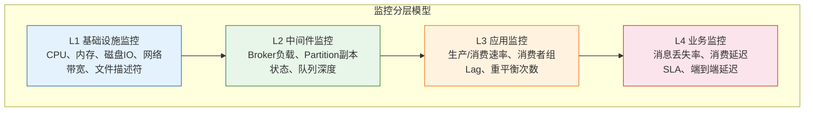
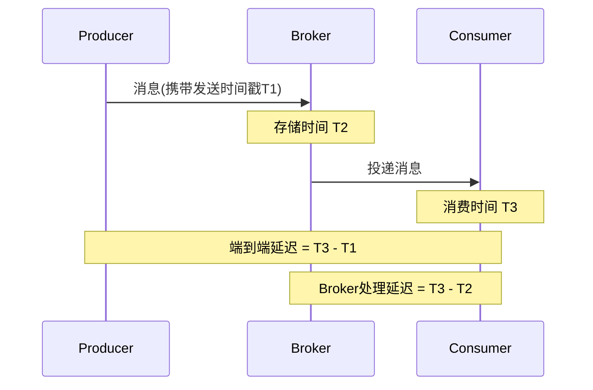

## 技巧三 监控指标

消息队列作为分布式系统的关键基础设施，其健康状况直接影响整个业务链路的稳定性。一个缺乏监控的消息队列集群，就像一辆没有仪表盘的汽车——你不知道它何时会抛锚，只能在故障发生后被动救火。本节将系统性地讲解消息队列监控体系的构建方法，从核心指标定义、采集方案选型、告警规则设计到可视化大盘搭建，帮助读者建立一套可落地的全链路可观测性体系。

### 监控体系全景

在深入具体指标之前，有必要先理解消息队列监控的分层模型。一个完整的监控体系从底层到顶层分为四个层次：



每一层监控都有其特定的关注点和采集方式。基础设施层关注硬件资源是否充足，中间件层关注消息队列自身的运行状态，应用层关注生产和消费的业务逻辑是否正常，业务层关注消息传递是否满足业务SLA。实际运维中，大多数故障最早在L1和L2层暴露，但最终影响体现在L3和L4层。理解这个分层关系，有助于在故障排查时快速定位问题所在的层次。

### 基础设施监控指标

基础设施是消息队列运行的根基。经验表明，超过60%的消息队列故障与底层资源耗尽直接相关。以下是必须重点监控的核心指标：

#### CPU 使用率

消息队列的 Broker 进程通常是 CPU 密集型和 IO 密集型的混合负载。Kafka Broker 在处理请求时需要进行消息压缩/解压缩、SSL/TLS 加密解密、副本同步等操作，这些都会显著消耗 CPU。

**关键子指标**：
- `system`（内核态CPU占比）：持续超过 30% 说明系统调用频繁，可能存在磁盘IO瓶颈或网络中断处理过多
- `user`（用户态CPU占比）：Kafka Broker 的主要开销区域，持续超过 70% 需要关注
- `iowait`（IO等待占比）：持续超过 20% 说明磁盘IO是瓶颈，应检查磁盘健康状况和IO调度策略
- `steal`（虚拟化环境中的CPU抢占）：出现持续的 steal 时间说明宿主机超卖严重

```bash
# 实时监控CPU使用率（每2秒刷新）
mpstat -P ALL 2

# 查看Kafka Broker进程的CPU使用详情
pid=$(jps -l | grep Kafka | awk '{print $1}')
top -p $pid -d 2

# 查看各线程的CPU消耗（定位GC线程或请求处理线程）
top -H -p $pid -d 2
```

**告警阈值参考**：

| 指标 | 警告阈值 | 严重阈值 | 说明 |
|------|---------|---------|------|
| CPU总使用率 | > 70% 持续5分钟 | > 85% 持续5分钟 | 含system+user |
| iowait | > 15% 持续5分钟 | > 30% 持续5分钟 | 磁盘IO瓶颈信号 |
| GC暂停时间 | > 500ms | > 2000ms | 影响请求处理延迟 |
| steal time | > 5% 持续10分钟 | > 15% 持续5分钟 | 虚拟化环境资源争抢 |

#### 内存使用

消息队列对内存的使用分为两部分：JVM堆内存（Broker进程本身）和操作系统页缓存（用于加速消息读写）。两者需要分别监控。

**JVM 内存监控**：
- 堆内存使用率：超过 80% 需要警惕，超过 90% 可能触发频繁 Full GC
- 老年代（Old Gen）内存：持续增长说明可能存在内存泄漏
- GC 暂停时间和频率：Concurrent Mark Sweep 或 G1 GC 的停顿时间应控制在毫秒级

**操作系统内存监控**：
- 页缓存命中率：Kafka 消费者读取最近写入的消息时，如果数据在页缓存中（Cache Hit），性能接近内存读取速度。一旦页缓存不足，消息需要从磁盘读取，性能将下降1-2个数量级
- Swap 使用量：出现 Swap 使用说明物理内存严重不足，必须立即处理

```bash
# 查看JVM内存使用（通过JMX或jstat）
jstat -gcutil $pid 1000

# 查看操作系统页缓存
cat /proc/meminfo | grep -E "Cached|Buffers|SwapCached"

# 查看Swap使用
free -h
vmstat 1 5
```

**页缓存命中率的估算**：Kafka 提供了 `log.cache.hit.bytes` 和 `log.cache.miss.bytes` 两个指标。当命中率低于 90% 时，应考虑增加物理内存或减少每台 Broker 的 Partition 数量。一个实用的经验公式是：每台 Broker 的 Partition 总数 × 消息大小 × 备份系数 不应超过可用页缓存的 50%。

#### 磁盘 IO

消息队列是典型的磁盘 IO 密集型应用。Kafka 使用顺序写入来提升磁盘性能，但日志段滚动、副本同步、日志清理等操作仍然会产生随机 IO。

**核心监控指标**：
- `await`（平均IO等待时间）：SSD 应低于 1ms，HDD 应低于 10ms
- `svctm`（平均服务时间）：反映磁盘本身的处理速度
- `avgqu-sz`（平均队列长度）：持续超过 2 说明磁盘已经过载
- `%util`（磁盘利用率）：SSD 持续超过 80% 或 HDD 持续超过 65% 说明磁盘接近饱和

```bash
# 查看磁盘IO详情（每1秒刷新）
iostat -x 1

# 查看磁盘使用率（日志目录所在分区）
df -h /var/kafka-logs/

# 检查磁盘健康状态
smartctl -a /dev/sda

# 查看IO调度器
cat /sys/block/sda/queue/scheduler
```

**磁盘容量管理**：消息队列的磁盘占用与消息保留策略（retention）直接相关。Kafka 默认保留 7 天的消息，RocketMQ 默认保留 48 小时。应设置磁盘使用率告警：
- 70%：发出警告，开始检查日志清理策略
- 80%：发出严重告警，考虑临时增大保留策略的清理频率
- 85%：触发紧急处理，Kafka 可能进入只读模式，无法接收新消息

#### 网络带宽

消息队列的数据传输量通常很大，网络带宽是容易被忽视的瓶颈。

```bash
# 查看网卡流量（每秒刷新）
sar -n DEV 1

# 查看TCP连接状态分布
ss -s

# 查看各端口的连接数
ss -tnp | grep :9092 | awk '{print $4}' | sort | uniq -c | sort -rn

# 查看网络错误和丢包
netstat -s | grep -E "retransmit|timeout|reset"
```

**关键阈值**：
- 网卡使用率超过 70%：可能导致消息传输延迟增加
- TCP 重传率超过 1%：网络质量下降，影响副本同步和消息投递
- TIME_WAIT 连接超过 10000：可能存在连接未正确关闭的问题

### 消息队列核心业务指标

这些指标直接反映消息队列的运行状态和健康程度，是监控体系的核心。

#### 生产端指标

生产端指标反映消息写入集群的效率和健康状态：

| 指标名称 | 含义 | 采集方式 | 告警阈值 |
|---------|------|---------|---------|
| `message-in-rate` | 每秒写入的消息条数 | JMX / Prometheus | 基线偏离超过50% |
| `byte-in-rate` | 每秒写入的数据量（字节） | JMX / Prometheus | 接近网络带宽上限 |
| `request-latency-avg` | 生产请求平均延迟 | JMX | > 100ms |
| `request-latency-max` | 生产请求最大延迟 | JMX | > 500ms |
| `record-error-rate` | 发送失败的消息速率 | JMX | > 0 |
| `record-retry-rate` | 重试的消息速率 | JMX | 持续上升 |
| `batch-size-avg` | 平均批量大小 | JMX | 异常波动 |
| `compression-rate-avg` | 平均压缩率 | JMX | 压缩率突然下降 |

生产端最常见的问题是**消息堆积**——生产速度持续大于消费速度，导致消息在队列中积压。另一个常见问题是**发送延迟飙升**，通常由 Broker 过载、网络拥塞或 ISR 副本同步变慢引起。

```python
# 使用 kafka-python 采集生产端指标示例
from kafka import KafkaProducer
import time

producer = KafkaProducer(
    bootstrap_servers=['kafka1:9092'],
    metrics_sample_window_ms=30000,
    metrics_num_samples=3
)

# 定期采集指标
while True:
    metrics = producer.metrics()
    # 总体指标
    total = metrics.get('producer-metrics', {})
    print(f"发送速率: {total.get('record-send-rate', 0):.0f} msg/s")
    print(f"平均延迟: {total.get('request-latency-avg', 0):.2f} ms")
    print(f"批量大小: {total.get('batch-size-avg', 0):.0f}")
    # 错误指标
    print(f"错误率: {total.get('record-error-rate', 0):.2f}")
    print(f"重试率: {total.get('record-retry-rate', 0):.2f}")
    time.sleep(30)
```

#### 消费端指标

消费端指标是判断消息是否被及时处理的关键依据：

| 指标名称 | 含义 | 采集方式 | 告警阈值 |
|---------|------|---------|---------|
| `consumer-lag` | 消费者组的消费延迟（未消费消息数） | Consumer Group API / JMX | > 10000 或持续增长 |
| `consume-rate` | 每秒消费的消息条数 | JMX / Prometheus | 持续低于生产速率 |
| `fetch-latency-avg` | 消费者拉取请求平均延迟 | JMX | > 500ms |
| `commit-latency-avg` | 偏移量提交平均延迟 | JMX | > 200ms |
| `rebalance-rate-per-hour` | 每小时重平衡次数 | JMX | > 2次/小时 |
| `join-rate` | 消费者加入组的频率 | JMX | 异常升高 |

**消费延迟（Consumer Lag）**是最关键的消费端指标。它表示每个 Partition 上尚未被消费的消息数量。Lag 持续增长意味着消费速度跟不上生产速度，消息在不断积压。

```bash
# Kafka：查看所有消费者组的消费延迟
kafka-consumer-groups.sh --bootstrap-server kafka1:9092 \
    --describe --all-groups

# 输出示例：
# GROUP           TOPIC      PARTITION  CURRENT-OFFSET  LOG-END-OFFSET  LAG    CONSUMER-ID
# order-group     orders     0          15000           15230           230    consumer-1
# order-group     orders     1          12800           12800           0      consumer-2
# order-group     orders     2          9500            11000           1500   consumer-3

# RabbitMQ：查看队列深度和消费者数
rabbitmqctl list_queues name messages consumers memory

# RocketMQ：查看消费者组的消费延迟
mqadmin consumerProgress -g order-consumer-group
```

**Lag 的合理范围**取决于业务场景。对于实时性要求高的场景（如即时消息），Lag 应控制在百级别以内；对于允许一定延迟的场景（如数据同步），万级别的 Lag 通常可以接受。关键是监控 Lag 的**变化趋势**——即使绝对值很大，如果保持稳定或持续下降，说明系统处于平衡状态；如果持续增长，说明系统出现了消费瓶颈。

#### Broker 核心指标

Broker 是消息队列的核心组件，其运行状态直接决定整个集群的可用性：

**Kafka Broker 关键指标**：

| 指标名称 | 含义 | 告警阈值 |
|---------|------|---------|
| `active.controller.count` | 活跃 Controller 数量 | 不等于 1 |
| `offline-partition-count` | 离线 Partition 数量 | > 0 |
| `under-replicated-partitions` | 副本不足的 Partition 数量 | > 0 |
| `isr-shrink-rate` | ISR 缩小速率 | 持续 > 0 |
| `isr-expand-rate` | ISR 扩展速率 | 持续 > 0 |
| `leader-election-rate` | Leader 选举速率 | 异常升高 |
| `unclean-leader-election-rate` | 非清洁 Leader 选举 | > 0 |
| `request-handler-avg-idle-percent` | 请求处理器空闲率 | < 30% |
| `network-request-rate` | 网络请求速率 | 异常波动 |

```bash
# 通过JMX获取Broker指标
# 使用kafka自带的JMX工具
kafka-run-class.sh kafka.tools.JmxTool \
    --object-name kafka.server:type=BrokerTopicMetrics,name=MessagesInPerSec \
    --jmx-url service:jmx:rmi:///jndi/rmi://localhost:9999/jmxrmi

# 批量采集关键JMX指标
for metric in "MessagesInPerSec" "BytesInPerSec" "BytesOutPerSec" \
              "ProduceRequestQueueSize" "FetchRequestQueueSize"; do
    kafka-run-class.sh kafka.tools.JmxTool \
        --object-name "kafka.server:type=BrokerTopicMetrics,name=$metric" \
        --jmx-url service:jmx:rmi:///jndi/rmi://localhost:9999/jmxrmi \
        --one-shot
done
```

**ISR 状态监控特别说明**：ISR（In-Sync Replicas）是 Kafka 数据一致性的关键保障。正常情况下，所有 Follower 副本都应该与 Leader 保持同步。如果某个副本从 ISR 中被移除，说明它与 Leader 的同步差距超过了 `replica.lag.time.max.ms`（默认 30 秒）。ISR 缩小的常见原因包括：
- Follower 所在 Broker 的磁盘 IO 过高，跟不上 Leader 的写入速度
- Follower 所在 Broker 的网络延迟增大
- Follower 的 JVM 正在 Full GC，暂停时间过长
- `replica.fetch.max.bytes` 设置过小，无法跟上大消息的同步

#### 集群健康指标

除了单个 Broker 的指标，还需要从集群层面整体监控：

```bash
# Kafka：检查集群元数据健康
kafka-metadata.sh --snapshot /var/kafka-logs/__cluster_metadata-0/*.log \
    --cluster-id <cluster-id> 2>/dev/null | head -50

# 检查各Broker的存活状态
kafka-broker-api-versions.sh --bootstrap-server kafka1:9092,kafka2:9092,kafka3:9092

# RabbitMQ：检查集群状态
rabbitmqctl cluster_status

# 检查队列的健康状态（有无alarm触发）
rabbitmqctl status | grep -A 10 alarms
```

### 延迟与端到端监控

单点指标只能告诉你"这个 Broker 是否正常"，但无法回答"消息从生产到消费总共花了多长时间"。端到端延迟监控是连接生产者和消费者的桥梁。

#### 端到端延迟测量方法



**实现端到端延迟监控的常见方案**：

**方案一：消息内嵌时间戳**。在每条消息的 Header 或 Body 中携带生产时间戳，消费者收到消息后计算与当前时间的差值。这种方案实现简单，但需要注意生产者和消费者之间的时钟同步问题。

```python
import time
import json

# 生产者端：嵌入发送时间
def produce_with_timestamp(producer, topic, key, value):
    message = {
        'payload': value,
        'produce_timestamp': int(time.time() * 1000)  # 毫秒级时间戳
    }
    producer.send(topic, key=key, value=json.dumps(message).encode())

# 消费者端：计算端到端延迟
def consume_and_measure(consumer, topic):
    for msg in consumer:
        data = json.loads(msg.value.decode())
        produce_ts = data['produce_timestamp']
        consume_ts = int(time.time() * 1000)
        e2e_latency = consume_ts - produce_ts
        
        # 记录延迟分布
        metrics.histogram('e2e_latency_ms', e2e_latency)
        
        if e2e_latency > 1000:  # 超过1秒告警
            logger.warning(f"端到端延迟过高: {e2e_latency}ms, "
                         f"topic={topic}, partition={msg.partition}")
        
        process_message(data['payload'])
```

**方案二：探针消息（Heartbeat Probe）**。定时发送专门的探针消息到每个 Topic 和 Partition，消费端收到探针后计算延迟。这种方案的优势是不会影响正常业务消息，且可以独立控制采样频率。

**方案三：分布式追踪集成**。将消息队列的生产和消费操作接入 OpenTelemetry 或 Jaeger 等分布式追踪系统，通过 Trace ID 贯穿整条链路。这是最完善的方案，但集成成本也最高。

```python
# OpenTelemetry 集成示例
from opentelemetry import trace
from opentelemetry.sdk.trace import TracerProvider

tracer = trace.get_tracer("mq-producer")

def produce_with_tracing(producer, topic, key, value):
    with tracer.start_as_current_span("mq.produce") as span:
        span.set_attribute("messaging.system", "kafka")
        span.set_attribute("messaging.destination", topic)
        span.set_attribute("messaging.operation", "publish")
        
        # 将 trace context 注入消息 Header
        headers = {}
        trace.inject(span, headers)
        
        producer.send(topic, key=key, value=value, headers=headers)
```

### 告警规则设计

好的告警规则应该在"及时发现问题"和"避免告警疲劳"之间取得平衡。以下是经过实践验证的告警规则设计原则：

#### 告警分级

| 级别 | 含义 | 响应时间 | 通知方式 | 示例场景 |
|------|------|---------|---------|---------|
| P0 紧急 | 服务不可用或数据丢失风险 | 5分钟内 | 电话+短信+IM | 集群 Controller 消失、Offline Partition > 0 |
| P1 严重 | 性能显著下降或即将不可用 | 30分钟内 | 短信+IM | Consumer Lag 持续增长、磁盘 > 80% |
| P2 警告 | 指标异常但暂不影响服务 | 4小时内 | IM | ISR 缩小、CPU > 70% |
| P3 信息 | 需要关注但不紧急 | 下个工作日 | 邮件 | 磁盘趋势预测 7 天后满 |

#### 关键告警规则

```yaml
# Prometheus AlertManager 规则示例
groups:
  - name: kafka_alerts
    rules:
      # P0: Controller 失联
      - alert: KafkaControllerDown
        expr: kafka_controller_active_count == 0
        for: 1m
        labels:
          severity: critical
        annotations:
          summary: "Kafka Controller 失联"
          description: "集群 {{ $labels.instance }} 已超过1分钟没有活跃Controller"

      # P0: 存在离线Partition
      - alert: KafkaOfflinePartitions
        expr: kafka_server_offlinepartitionscount_value > 0
        for: 30s
        labels:
          severity: critical
        annotations:
          summary: "Kafka存在离线Partition"
          description: "{{ $value }} 个Partition处于离线状态"

      # P1: 消费延迟持续增长
      - alert: ConsumerLagGrowing
        expr: |
          (
            kafka_consumergroup_lag_sum - 
            kafka_consumergroup_lag_sum offset 10m
          ) > 10000
        for: 10m
        labels:
          severity: warning
        annotations:
          summary: "消费者组 {{ $labels.consumergroup }} 消费延迟持续增长"
          description: "过去10分钟内消费延迟增长了 {{ $value }} 条消息"

      # P1: ISR 持续缩小
      - alert: KafkaIsrShrinking
        expr: rate(kafka_server_isrshrinkrate_count[5m]) > 0
        for: 5m
        labels:
          severity: warning
        annotations:
          summary: "Kafka ISR 持续缩小"
          description: "ISR缩小速率: {{ $value }}/s，可能存在副本同步问题"

      # P2: 磁盘空间不足
      - alert: KafkaDiskSpaceLow
        expr: |
          (1 - kafka_log_disk_used_bytes / kafka_log_disk_total_bytes) < 0.2
        for: 10m
        labels:
          severity: warning
        annotations:
          summary: "Kafka磁盘空间不足"
          description: "磁盘使用率已超过80%，当前使用 {{ $value | humanizePercentage }}"

      # P2: Broker 请求处理器空闲率过低
      - alert: BrokerOverloaded
        expr: |
          kafka_server_requesthandleravgidlepercent_total < 0.3
        for: 5m
        labels:
          severity: warning
        annotations:
          summary: "Kafka Broker 过载"
          description: "请求处理器空闲率仅 {{ $value | humanizePercentage }}"
```

#### 避免告警疲劳

告警疲劳是监控体系最常见的陷阱。当运维人员每天收到数十条告警时，他们会逐渐麻木，最终在真正的故障面前反应迟钝。以下是避免告警疲劳的关键原则：

1. **只告警可操作的事项**：如果收到告警后没有明确的处理步骤，那这个告警不应该存在。"CPU 80%"是可操作的（需要排查负载来源），"CPU 50%"通常不是（除非有明确的基线对比）。

2. **使用趋势而非绝对值**：Consumer Lag = 50000 本身不一定是问题，但如果过去30分钟从 5000 增长到 50000，那就是明确的问题。优先使用 `rate()` 和 `deriv()` 函数检测趋势变化。

3. **设置合理的持续时间**：避免对瞬时波动告警。使用 `for: 5m` 或更长的持续时间，确保告警在指标持续异常后才触发。

4. **聚合相关告警**：一个 Broker 宕机会同时触发 CPU、内存、网络、副本等多个告警。通过 AlertManager 的 `group_by` 和 `group_wait` 配置，将同一事件的多个告警合并为一条通知。

### 可视化大盘搭建

指标采集和告警是监控的骨架，可视化大盘则是让运维人员直观理解系统状态的眼睛。

#### Grafana 大盘核心面板

一个消息队列监控大盘通常包含以下面板组：

**面板组一：集群概览**
- 集群 Broker 数量和存活状态（状态灯）
- 总消息吞吐量（生产速率 + 消费速率折线图）
- 集群总消息积压量（Consumer Lag 堆积面积图）
- ISR 副本状态（正常/异常 Partition 数量柱状图）

**面板组二：Topic 维度**
- 各 Topic 的生产速率排行（Top 10 条形图）
- 各 Topic 的消费延迟排行（Top 10 条形图）
- 各 Topic 的分区分布和副本状态

**面板组三：Broker 维度**
- 各 Broker 的 CPU、内存、磁盘使用率（仪表盘矩阵）
- 各 Broker 的请求处理延迟（热力图）
- 各 Broker 的网络流量（堆叠面积图）

**面板组四：消费者组维度**
- 各消费者组的消费延迟趋势（多线折线图）
- 各消费者组的消费速率（对比图）
- 重平衡事件时间线（事件标记图）

```json
// Grafana Dashboard JSON 片段：集群概览面板
{
  "title": "Kafka 集群概览",
  "panels": [
    {
      "title": "消息写入速率",
      "type": "timeseries",
      "targets": [
        {
          "expr": "sum(rate(kafka_server_brokertopicmetrics_messagesinpersec_total[1m]))",
          "legendFormat": "消息写入速率 (msg/s)"
        },
        {
          "expr": "sum(rate(kafka_server_brokertopicmetrics_bytesinpersec_total[1m]))",
          "legendFormat": "数据写入速率 (bytes/s)"
        }
      ]
    },
    {
      "title": "消费者延迟",
      "type": "timeseries",
      "targets": [
        {
          "expr": "sum by (consumergroup) (kafka_consumergroup_lag_sum)",
          "legendFormat": "{{ consumergroup }}"
        }
      ]
    }
  ]
}
```

#### Prometheus + Grafana 搭建实践

消息队列监控最常见的技术栈是 Prometheus 采集 + Grafana 展示 + AlertManager 告警。以下是 Kafka 监控的完整搭建方案：

**第一步：启用 Kafka JMX Exporter**

Kafka 通过 JMX（Java Management Extensions）暴露内部指标，但 Prometheus 无法直接抓取 JMX 数据。需要使用 JMX Exporter 将 JMX 指标转换为 Prometheus 格式。

```yaml
# jmx_exporter_config.yml
lowercaseOutputName: true
lowercaseOutputLabelNames: true
rules:
  # Broker 级别指标
  - pattern: kafka.server<type=BrokerTopicMetrics, name=(.+), topic=(.+)><>Count
    name: kafka_server_brokertopicmetrics_$1_total
    labels:
      topic: $2
    type: COUNTER
  - pattern: kafka.server<type=BrokerTopicMetrics, name=(.+), topic=(.+)><>MeanRate
    name: kafka_server_brokertopicmetrics_$1_rate
    labels:
      topic: $2
    type: GAUGE
  
  # 消费者组延迟指标
  - pattern: kafka.server<type=group-coordinator-metrics, name=group-lag, group=(.+), topic=(.+), partition=(.+)><>Value
    name: kafka_server_group_lag_value
    labels:
      group: $1
      topic: $2
      partition: $3
    type: GAUGE
  
  # ISR 相关指标
  - pattern: kafka.server<type=ReplicaManager, name=(.+), topic=(.+)><>Value
    name: kafka_server_replicamanager_$1_value
    labels:
      topic: $2
    type: GAUGE
```

```bash
# 启动 Kafka Broker 时加载 JMX Exporter
export KAFKA_OPTS="-javaagent:/opt/jmx_exporter/jmx_prometheus_javaagent.jar=7071:/opt/jmx_exporter/config.yml"

# 验证指标是否暴露
curl http://localhost:7071/metrics | grep kafka_server
```

**第二步：配置 Prometheus 抓取**

```yaml
# prometheus.yml
scrape_configs:
  - job_name: 'kafka-brokers'
    static_configs:
      - targets:
          - kafka1:7071
          - kafka2:7071
          - kafka3:7071
    scrape_interval: 15s
    
  - job_name: 'kafka-consumer-metrics'
    static_configs:
      - targets:
          - consumer-host1:7071
          - consumer-host2:7071
    scrape_interval: 30s
```

### 各消息队列监控方案对比

不同的消息队列提供了不同的监控能力，了解各自的差异有助于选择合适的监控方案：

| 维度 | Kafka | RabbitMQ | RocketMQ | Pulsar |
|------|-------|----------|----------|--------|
| 指标暴露方式 | JMX | Management Plugin (HTTP) | JMX / 内置Stats | Prometheus / 内置 |
| 内置监控界面 | 无（依赖第三方） | Management UI（内置） | Dashboard（内置） | Manager UI（内置） |
| 推荐监控栈 | Prometheus + Grafana | Prometheus + Grafana | Prometheus + Grafana | Prometheus + Grafana |
| 社区Exporter | JMX Exporter | rabbitmq_exporter | rocketmq_exporter | 原生支持Prometheus |
| 消费延迟指标 | Consumer Group Lag | Queue Depth - Consumers | ConsumerProgress | Subscription Backlog |
| 告警能力 | 需配合AlertManager | 需配合外部工具 | 需配合外部工具 | 原生告警（有限） |

**RabbitMQ 特有指标**：
- `queue.depth`：队列中的消息总数（未消费 + 已投递未确认）
- `queue.consumers`：队列的消费者数量，为 0 说明消息无人消费
- `queue.memory`：队列占用的内存大小，过大会触发内存告警导致队列阻塞
- `channel.prefetch_count`：每个消费者的预取数量，影响消费并行度

```bash
# RabbitMQ：启用Management Plugin获取HTTP API指标
rabbitmq-plugins enable rabbitmq_management

# 通过HTTP API获取队列指标
curl -u guest:guest http://localhost:15672/api/queues | python3 -m json.tool

# RocketMQ：使用内置命令行工具
mqadmin topicStatus -t OrderTopic
mqadmin consumerProgress -g order-consumer-group
mqadmin brokerStatus -b broker1:10911
```

### 监控最佳实践

#### 1. 建立指标基线

在系统稳定运行期间，持续记录各项指标的正常波动范围，作为后续告警的基线。没有基线的告警就像没有参照物的测量——你无法判断 80% 的 CPU 使用率是正常还是异常。

**基线建立方法**：
- 选择业务正常的工作日和周末，分别记录 CPU、内存、网络、消息吞吐量等指标
- 记录工作日的高峰时段（如 10:00-12:00、14:00-17:00）和低谷时段（如 02:00-06:00）的指标值
- 计算每个时段的均值和标准差，作为告警阈值的参考

#### 2. 监控消费 Lag 而非消费速率

消费速率只能告诉你"消费得有多快"，而消费 Lag 才能告诉你"积压了多少未处理的消息"。一个持续稳定在 100 条的 Lag 是健康的，而一个消费速率很高但 Lag 仍在增长的系统是有问题的。

#### 3. 按 Topic 和消费者组分别监控

不同 Topic 的消息量级和延迟要求可能差异巨大。订单 Topic 可能要求秒级延迟，而日志 Topic 可以容忍分钟级延迟。按 Topic 和消费者组分别设置告警阈值，避免"一刀切"导致的误报或漏报。

#### 4. 定期审查告警规则

每个月至少审查一次告警历史：哪些告警被频繁触发但最终都是误报？哪些故障发生时却没有告警覆盖？持续优化告警规则的准确性和覆盖率。

#### 5. 监控消费者组的 Rebalance 频率

Rebalance（重平衡）是消费者组重新分配 Partition 的过程。在 Rebalance 期间，消费者暂停消费，导致消费延迟增加。频繁的 Rebalance 说明消费者组不稳定，可能原因包括：
- 消费者处理超时，超过了 `max.poll.interval.ms`
- 消费者频繁崩溃或重启
- 消费者数量与 Partition 数量不匹配
- 心跳超时（`session.timeout.ms` 设置过短）

```bash
# 监控Rebalance事件
# Kafka日志中搜索Rebalance相关日志
grep -i "rebalance" /var/log/kafka/server.log | tail -20

# 查看消费者组的成员信息和分配状态
kafka-consumer-groups.sh --bootstrap-server kafka1:9092 \
    --describe --group order-consumer-group --verbose
```

### 常见监控误区

#### 误区一：只监控 Broker 不监控客户端

很多团队在 Broker 侧部署了完善的监控，却忽略了生产者和消费者的健康状态。一个配置不当的消费者（如 `fetch.min.bytes` 设置过大、`max.poll.records` 设置不合理）可能导致消费效率低下，即使 Broker 完全正常。**正确的做法是同时监控 Broker 端和客户端的指标**，从两端共同判断系统的健康状况。

#### 误区二：把消息堆积等同于系统故障

Consumer Lag 存在不等于系统有故障。在以下场景中，消息堆积是正常现象：
- 消费者在执行重启或部署，暂时停止消费
- 大促等突发流量场景，生产速度瞬间远大于消费速度
- 日志类 Topic 的消费者按自己的节奏消费，允许一定程度的延迟

判断消息堆积是否为故障，关键看**堆积是否在持续增长且无法自行恢复**。如果堆积在一段时间后能被消化，说明系统有弹性；如果持续增长且没有收敛趋势，才需要介入。

#### 误区三：告警阈值一成不变

系统的负载特征会随着业务增长和架构变化而改变。一个在上线初期设置的 "CPU > 80% 告警"，在业务量增长 10 倍后可能已经过于频繁或过于宽松。**建议每季度审查一次告警阈值**，确保它们与当前的业务基线匹配。

#### 误区四：忽视监控系统自身的可靠性

监控系统也是系统，它同样会宕机、会丢数据。当 Prometheus 或 Grafana 不可用时，你的消息队列就进入了"盲飞"状态。因此需要：
- Prometheus 自身的高可用部署（Thanos 或联邦集群）
- 告警通知的多通道冗余（邮件 + 短信 + IM）
- 关键指标的离线备份（定期导出到长期存储）

### 实战：构建完整的监控方案

以下是一个从零搭建 Kafka 监控体系的完整示例：

```bash
#!/bin/bash
# setup_kafka_monitoring.sh
# 一键部署 Kafka 监控体系（Prometheus + Grafana + JMX Exporter）

set -e

PROMETHEUS_VERSION="2.51.0"
GRAFANA_VERSION="10.4.1"
JMX_EXPORTER_VERSION="0.20.0"

echo "=== Step 1: 安装 JMX Exporter ==="
mkdir -p /opt/jmx_exporter
cd /opt/jmx_exporter
wget -q "https://repo1.maven.org/maven2/io/prometheus/jmx/jmx_prometheus_javaagent/${JMX_EXPORTER_VERSION}/jmx_prometheus_javaagent-${JMX_EXPORTER_VERSION}.jar" \
    -O jmx_prometheus_javaagent.jar

cat > config.yml <<'YAML'
lowercaseOutputName: true
rules:
  - pattern: kafka.server<type=BrokerTopicMetrics, name=(.+), topic=(.+)><>Count
    name: kafka_server_brokertopicmetrics_$1_total
    labels: { topic: "$2" }
    type: COUNTER
  - pattern: kafka.server<type=BrokerTopicMetrics, name=(.+), topic=(.+)><>MeanRate
    name: kafka_server_brokertopicmetrics_$1_rate
    labels: { topic: "$2" }
    type: GAUGE
  - pattern: kafka.network<type=RequestMetrics, name=RequestsPerSec, request=(.+)><>Count
    name: kafka_network_requestmetrics_requests_total
    labels: { request: "$1" }
    type: COUNTER
  - pattern: kafka.network<type=RequestMetrics, name=TotalTimeMs, request=(.+)><>Mean
    name: kafka_network_requestmetrics_latency_ms
    labels: { request: "$1" }
    type: GAUGE
YAML

echo "=== Step 2: 配置 Kafka Broker 启动参数 ==="
# 在每个 Broker 的 kafka-server-start.sh 中添加：
# export KAFKA_OPTS="$KAFKA_OPTS -javaagent:/opt/jmx_exporter/jmx_prometheus_javaagent.jar=7071:/opt/jmx_exporter/config.yml"
echo "请在 Broker 启动脚本中添加 JMX Exporter agent 参数"

echo "=== Step 3: 安装 Prometheus ==="
cd /opt
wget -q "https://github.com/prometheus/prometheus/releases/download/v${PROMETHEUS_VERSION}/prometheus-${PROMETHEUS_VERSION}.linux-amd64.tar.gz"
tar xzf "prometheus-${PROMETHEUS_VERSION}.linux-amd64.tar.gz"
mv "prometheus-${PROMETHEUS_VERSION}.linux-amd64" prometheus

cat > prometheus/prometheus.yml <<'YAML'
global:
  scrape_interval: 15s
  evaluation_interval: 15s

rule_files:
  - "kafka_alerts.yml"

alerting:
  alertmanagers:
    - static_configs:
        - targets: ['localhost:9093']

scrape_configs:
  - job_name: 'kafka'
    static_configs:
      - targets:
          - kafka1:7071
          - kafka2:7071
          - kafka3:7071
YAML

echo "=== Step 4: 安装 Grafana ==="
cd /opt
wget -q "https://dl.grafana.com/oss/release/grafana-${GRAFANA_VERSION}.linux-amd64.tar.gz"
tar xzf "grafana-${GRAFANA_VERSION}.linux-amd64.tar.gz"
mv "grafana-${GRAFANA_VERSION}" grafana

echo "=== 部署完成 ==="
echo "JMX Exporter: http://<broker>:7071/metrics"
echo "Prometheus: http://localhost:9090"
echo "Grafana: http://localhost:3000 (默认 admin/admin)"
echo ""
echo "下一步："
echo "1. 在每个 Broker 上配置 JMX Exporter agent 并重启"
echo "2. 启动 Prometheus 和 Grafana"
echo "3. 在 Grafana 中导入 Kafka Dashboard (ID: 7589)"
```

### 本节小结

消息队列监控不是一次性工程，而是一个持续迭代的过程。从最基础的 CPU、内存、磁盘监控开始，逐步添加消息吞吐量、消费延迟、ISR 状态等业务指标，再配合科学的告警规则和直观的可视化大盘，最终构建出一套能够提前发现问题、快速定位根因、量化影响范围的完整监控体系。

记住三个核心原则：**监控消费 Lag 而非消费速率**——它是最直接的健康信号；**告警必须可操作**——收到告警后必须有明确的处理步骤；**基线是告警的基础**——没有正常值的参考，异常值就没有意义。
