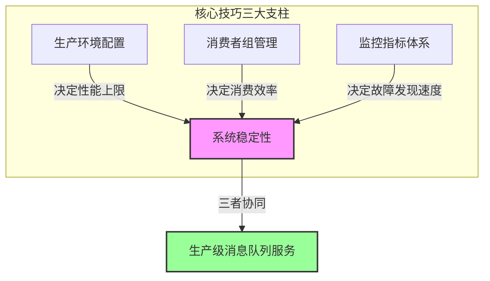
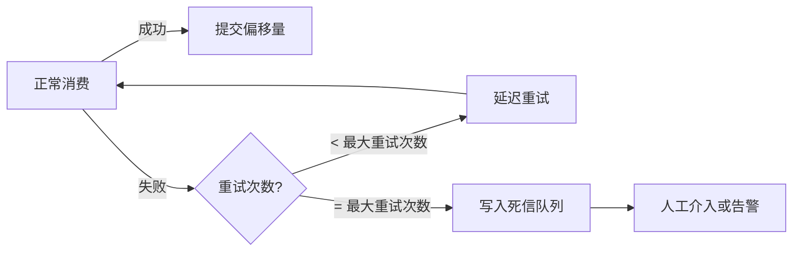
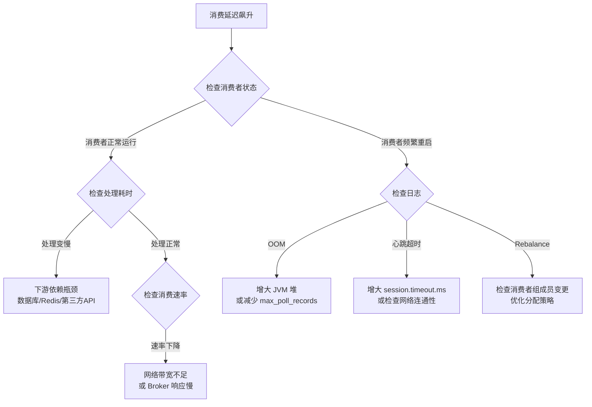
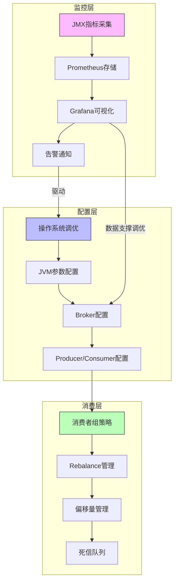

# 核心技巧：从能用到好用的关键跨越

理论基础回答的是"消息队列是什么"和"为什么这样设计"，而核心技巧要解决的是"怎么用好它"。在生产环境中，消息队列的表现往往不是由架构本身决定的，而是由部署配置、消费者管理和运维监控这三根支柱共同决定的。配置不当，再好的中间件也会变成定时炸弹；消费者设计粗糙，再高的吞吐也会被 Rebalance 风暴拖垮；监控缺失，任何故障都只能事后灭火。本节从这三个维度出发，给出经过大规模生产环境验证的工程实践。



## 三大核心技巧概览

| 技巧 | 核心问题 | 关键产出 | 影响范围 |
|------|---------|---------|---------|
| 生产环境配置 | 如何让 Kafka 在生产环境中跑出最佳性能？ | OS调优、JVM参数、Broker/Producer/Consumer全链路配置、集群部署 | 性能上限、稳定性、资源利用率 |
| 消费者组管理 | 如何让消费端高效、可靠地处理消息？ | 分组策略、Rebalance优化、偏移量管理、死信处理 | 消费延迟、消息可靠性、系统吞吐 |
| 监控指标 | 如何及时发现并定位问题？ | JMX指标采集、Grafana看板、告警规则、问题诊断 | 故障发现速度、根因定位效率 |

## 技巧一：Kafka 生产环境配置

生产环境配置是消息队列工程化的第一步，也是最容易被低估的一步。一个"能跑"的 Kafka 集群和一个"跑得好"的 Kafka 集群之间的差距，往往就体现在配置细节上。本节从操作系统层到应用层，逐层拆解配置要点。

### 为什么配置如此重要

Kafka 的设计哲学是"把能交给操作系统的都交给操作系统"。它依赖 OS 页缓存加速读写，依赖操作系统的文件系统管理存储，依赖 JVM 的垃圾回收管理内存。这意味着 Kafka 的性能天花板很大程度上取决于底层基础设施的配置质量。一个 JVM 堆设置过大（比如把 64GB 内存全部分给 JVM）的 Kafka Broker，性能反而不如一个堆只分 8GB 但留足页缓存的 Broker——这就是配置的力量。

### 四层配置体系

本节按照从底层到上层的顺序，覆盖四个关键配置层：

**第一层：操作系统内核调优**

操作系统的内核参数直接决定了 Kafka 能使用多少系统资源。核心调优点包括：

- **内存管理**：`vm.max_map_count`（内存映射区域数量）—— Kafka 使用 mmap 读写日志文件，分区数多时默认值不够用，需要提升到 262144 以上
- **网络栈**：TCP 缓冲区大小、连接队列长度、本地端口范围——影响消息传输吞吐和并发连接数
- **文件描述符**：`ulimit -n`（每个进程的文件描述符上限）—— Kafka 每个日志段文件占一个 fd，分区多时 1024 的默认值远远不够
- **磁盘 I/O**：文件系统选择（XFS 优于 ext4）、挂载参数（noatime 消除访问时间更新的 I/O 开销）、禁用 swap（避免 GC 时内存被换出）

```bash
# 一行命令检查当前系统是否"准备好了"
echo "=== 内存 ===" &amp;&amp; free -g &amp;&amp; \
echo "=== mmap限制 ===" &amp;&amp; sysctl vm.max_map_count &amp;&amp; \
echo "=== 文件描述符 ===" &amp;&amp; ulimit -n &amp;&amp; \
echo "=== Swap ===" &amp;&amp; swapon --show
```

**第二层：JVM 虚拟机配置**

Kafka Broker 是 Java 应用，JVM 的垃圾回收行为直接影响 Broker 的延迟稳定性。核心原则：

- 使用 G1GC（`-XX:+UseG1GC`），将最大停顿目标设为 20ms（`-XX:MaxGCPauseMillis=20`）
- 堆大小设为物理内存的 50% 以下（典型值 6-8GB），其余留给 OS 页缓存
- `-XX:InitiatingHeapOccupancyPercent=35`（比默认 45 更早触发并发标记，降低 Full GC 风险）
- 必须开启 `-XX:+HeapDumpOnOutOfMemoryError`，OOM 时自动导出堆快照用于事后分析

```bash
# 经过验证的 JVM 参数模板
export KAFKA_HEAP_OPTS="-Xms8g -Xmx8g"
export KAFKA_JVM_PERFORMANCE_OPTS="
-XX:+UseG1GC
-XX:MaxGCPauseMillis=20
-XX:InitiatingHeapOccupancyPercent=35
-XX:+ExplicitGCInvokesConcurrent
-XX:G1HeapRegionSize=16M
-XX:MetaspaceSize=96m
-XX:+HeapDumpOnOutOfMemoryError
-XX:HeapDumpPath=/var/log/kafka/heapdump.hprof
"
```

**第三层：Broker 核心配置**

`server.properties` 中的关键参数按优先级排列：

- `min.insync.replicas=2` + `default.replication.factor=3`—— 这是数据安全的底线配置，容忍单个 Broker 故障的同时保证至少两个副本确认写入
- `log.dirs` 多磁盘配置——利用多磁盘并行 I/O 提升吞吐，每个磁盘的 I/O 带宽是独立的
- `num.network.threads` 和 `num.io.threads`——分别处理网络请求和磁盘读写，需要根据 CPU 核数和负载情况调整
- `listeners` vs `advertised.listeners`——生产环境最常见的坑之一：前者是 Broker 绑定的地址，后者是告诉客户端的地址。容器化、NAT、多网卡环境下两者不同，配错会导致客户端连上后收到一个不可达的地址

**第四层：Producer 和 Consumer 配置**

Producer 的核心权衡是可靠性 vs 性能：

- `acks=all` 最安全但最慢，`acks=0` 最快但可能丢消息，`acks=1` 是折中选择
- `enable_idempotence=True` 开启幂等性，防止网络重试导致消息重复
- `compression_type='lz4'` 在压缩比和 CPU 开销之间取得最佳平衡
- `batch.size` 和 `linger_ms` 配合使用：批次越大、等待越久，吞吐越高但延迟也越高

Consumer 的核心挑战是消费速度 vs 消息可靠性：

- `max_poll_records × 单条处理时间 < max.poll_interval_ms`——这是防止 Rebalance 的关键不等式
- 手动提交偏移量（`enable_auto_commit=False`）配合按分区提交（`consumer.commit()`），精确控制消费进度
- `session_timeout_ms` 和 `heartbeat_interval_ms` 的关系：心跳间隔应小于会话超时的 1/3

### 集群部署实战

单 Broker 的 Kafka 没有生产意义。本节提供一个基于 Docker Compose + KRaft 模式的 3 节点集群完整部署示例，涵盖：

- KRaft 无 ZooKeeper 模式（Kafka 3.3+ 推荐）
- JMX 端口暴露（为监控采集做准备）
- 资源限制（CPU 和内存上限）
- 文件描述符限制（ulimits 配置）
- 多磁盘卷挂载

## 技巧二：消费者组管理

消费者组是 Kafka 实现并行消费和消息广播的核心机制。管理好消费者组，本质上就是管理好"谁消费什么、消费到哪里、出了问题怎么办"这三个问题。

### 消费者组的本质

一个消费者组（Consumer Group）内，每个 Partition 只能被一个消费者消费。这意味着：

- **组内消费者数 > Partition 数**：多余的消费者空闲，浪费资源
- **组内消费者数 < Partition 数**：部分消费者需要消费多个 Partition，消费能力不均
- **最优状态**：消费者数 = Partition 数，每个消费者恰好负责一个 Partition

这个关系不是静态的——消费者实例会动态地加入和离开组（扩缩容、故障、重启），Kafka 需要在消费者之间重新分配 Partition，这就是 Rebalance。

### Rebalance 机制深度解析

Rebalance 是消费者组管理中最复杂也最关键的机制。理解 Rebalance 的触发条件和执行过程，是避免"Rebalance 风暴"的前提。

**触发 Rebalance 的三种场景：**

| 触发场景 | 原因 | 影响 |
|---------|------|------|
| 消费者加入 | 新消费者实例启动并加入组 | 所有 Partition 重新分配 |
| 消费者离开 | 消费者主动关闭或心跳超时 | 其他消费者接管其 Partition |
| 订阅变更 | Topic 列表变化（新增/删除） | 按新 Topic 重新分配 |

**Rebalance 的执行过程（Eager 协议）：**

```mermaid
sequenceDiagram
    participant C1 as Consumer 1
    participant C2 as Consumer 2
    participant C3 as Consumer 3
    participant B as Broker (Group Coordinator)

    Note over B: 检测到 Rebalance 触发条件
    B->>C1: REBALANCE_IN_PROGRESS
    B->>C2: REBALANCE_IN_PROGRESS
    B->>C3: REBALANCE_IN_PROGRESS
    Note over C1,C2,C3: 所有消费者停止消费，撤销当前 Partition 分配
    C1->>B: JoinGroup（提交订阅信息）
    C2->>B: JoinGroup
    C3->>B: JoinGroup
    Note over B: 等待所有成员加入（rebalance.timeout.ms）
    B->>B: 选举 Consumer 1 为 Leader
    B-->>C1: SyncGroup（包含分配方案）
    B-->>C2: SyncGroup
    B-->>C3: SyncGroup
    Note over C1,C2,C3: 按新分配方案恢复消费
```

**Rebalance 风暴的成因与对策：**

Rebalance 风暴是指短时间内频繁触发 Rebalance，导致消费端持续处于"停止-重分配-恢复"的循环中，实际消费停滞。常见原因：

1. **`max.poll.interval_ms` 过短**：消费者处理消息耗时超过该阈值，被 Coordinator 判定为死亡。对策：增大该值或减少 `max_poll_records`
2. **`session.timeout.ms` 过短**：网络抖动导致心跳超时。对策：适当增大超时值（15-30秒）
3. **消费者实例频繁重启**：部署更新或 OOM 导致频繁上下线。对策：滚动部署、增加 JVM 堆大小
4. **Topic 分区数变化**：动态扩分区触发全组 Rebalance。对策：提前规划分区数，避免运行时变更

**Cooperative Sticky 协议（Kafka 2.4+）：**

传统的 Eager 协议在 Rebalance 时会让所有消费者撤销所有 Partition，然后重新分配——即使只有一个小变化。Cooperative Sticky 协议只撤销受变化影响的 Partition，其他 Partition 的消费不受中断，大幅减少了 Rebalance 的影响范围。

```python
# 启用 Cooperative Sticky 协议
consumer = KafkaConsumer(
    'my-topic',
    group_id='my-group',
    partition_assignment_strategy=[
        CooperativeStickyAssignor()  # 增量式 Rebalance
    ],
    session_timeout_ms=30000,
    heartbeat_interval_ms=10000,
    max_poll_interval_ms=300000,
)
```

### 偏移量管理策略

偏移量（Offset）是消费者进度的唯一记录。偏移量管理不当，轻则消息重复消费，重则消息永久丢失。

**四种偏移量提交策略对比：**

| 策略 | 实现方式 | 消息丢失风险 | 消息重复风险 | 适用场景 |
|------|---------|------------|------------|---------|
| 自动提交 | `enable_auto_commit=True` | 高（处理前已提交） | 高（崩溃后重投） | 日志采集等允许丢失的场景 |
| 同步手动提交 | `consumer.commit()` 在每条消息处理后 | 低 | 低 | 高可靠性要求、低吞吐 |
| 异步手动提交 | `consumer.commitAsync()` | 低 | 中 | 高吞吐、可容忍少量重复 |
| 按分区提交 | 遍历每个 TopicPartition 单独提交 | 低 | 低 | 多 Topic 消费、精确控制进度 |

**最佳实践：批量处理 + 按分区异步提交**

```python
from kafka import KafkaConsumer
from kafka.errors import CommitFailedError

consumer = KafkaConsumer(
    'orders', 'payments',
    group_id='order-processor',
    enable_auto_commit=False,
    max_poll_records=500,
)

try:
    while True:
        messages = consumer.poll(timeout_ms=1000)
        for topic_partition, records in messages.items():
            # 按分区批量处理
            for record in records:
                process_message(record)
            # 处理完一个分区的所有消息后提交
            try:
                consumer.commitAsync()
            except CommitFailedError as e:
                logger.warning(f"偏移量提交失败: {e}")
                # 重试一次同步提交
                consumer.commit()
except KeyboardInterrupt:
    consumer.close()
```

### 死信队列与异常处理

在消费端，总有一些消息因为格式错误、依赖不可用等原因无法正常处理。如果不做特殊处理，这类消息会反复消费失败，阻塞后续消息。死信队列（Dead Letter Queue, DLQ）是处理这类"毒丸消息"的标准方案。

**死信队列的运作机制：**



**死信队列的实现要点：**

1. **重试次数限制**：通常 3-5 次，过多重试会阻塞消费进度
2. **延迟重试**：对于暂时性错误（如数据库连接超时），使用指数退避延迟重试
3. **错误分类**：区分可重试错误（网络抖动、服务临时不可用）和不可重试错误（格式错误、业务校验失败）
4. **监控告警**：死信队列消息数超过阈值时触发告警，及时人工介入

## 技巧三：监控指标体系

监控是消息队列运维的"眼睛"。没有监控的 Kafka 集群，就像没有仪表盘的飞机——飞行员完全不知道飞行状态，直到撞上山才知道出了问题。

### 为什么监控是核心技巧而非辅助技能

很多团队把监控当作"有了更好"的锦上添花，直到发生以下场景才追悔莫及：

- 某个 Broker 磁盘满了，消息堆积导致消费延迟从毫秒级飙升到小时级，但没人知道
- 消费者组 Rebalance 风暴已经持续了 2 小时，但没有告警，直到业务方投诉
- Producer 发送失败率从 0.01% 悄悄涨到 5%，因为没有监控发送错误码

监控的核心价值不是"看数据"，而是"在用户感知到问题之前发现并解决它"。

### Kafka 核心监控指标体系

Kafka 通过 JMX（Java Management Extensions）暴露了数百个指标。按监控对象，可以分为四个层面：

#### Broker 层指标

| 指标 | 含义 | 告警阈值 | 不达标的后果 |
|------|------|---------|------------|
| `UnderReplicatedPartitions` | 副本数不足的分区数 | > 0 | 数据安全风险，可能丢数据 |
| `ActiveControllerCount` | 当前活跃的 Controller 数 | ≠ 1 | 集群元数据管理异常 |
| `OfflinePartitionsCount` | 不可用的分区数 | > 0 | 部分分区不可读写 |
| `RequestHandlerAvgIdlePercent` | 请求处理线程空闲率 | < 0.3 | I/O 线程成为瓶颈 |
| `LogFlushRateAndTimeMs` | 日志刷盘速率和耗时 | 异常波动 | 磁盘 I/O 瓶颈 |
| `DiskUsage` | 磁盘使用率 | > 80% | 磁盘写满导致服务中断 |

```bash
# 快速检查 Broker 健康状态
kafka-topics.sh --bootstrap-server localhost:9092 --describe --under-replicated-partitions
# 如果输出为空，说明所有分区的副本都正常
```

#### Producer 层指标

| 指标 | 含义 | 告警阈值 | 不达标的后果 |
|------|------|---------|------------|
| `record-error-rate` | 消息发送错误率 | > 0.1% | 消息丢失风险 |
| `record-send-rate` | 消息发送速率 | 异常下降 | Producer 异常或上游流量变化 |
| `batch-size-avg` | 平均批次大小 | 接近 batch.size | 批次积压，吞吐受限 |
| `buffer-available-bytes` | 发送缓冲区可用空间 | 接近 0 | 缓冲区满，新消息被阻塞或丢弃 |
| `request-latency-avg` | 平均请求延迟 | > 100ms | 网络或 Broker 端瓶颈 |

#### Consumer 层指标

| 指标 | 含义 | 告警阈值 | 不达标的后果 |
|------|------|---------|------------|
| `records-lag-max` | 消费延迟（最大落后条数） | 持续增长 | 消息积压，业务数据延迟 |
| `records-consumed-rate` | 消费速率 | 异常下降 | 消费者处理能力不足 |
| `commit-rate` | 偏移量提交频率 | 接近 0 | 消费者可能卡住 |
| `join-rate` | Rebalance 加入频率 | > 1次/分钟 | Rebalance 风暴 |
| `fetch-rate` | 拉取频率 | 异常下降 | 消费者可能卡住 |

#### Topic 层指标

| 指标 | 含义 | 告警阈值 | 不达标的后果 |
|------|------|---------|------------|
| `MessagesInPerSec` | 消息写入速率 | 异常波动 | 流量突变 |
| `BytesInPerSec` / `BytesOutPerSec` | 数据流量 | 接近网络带宽 | 网络成为瓶颈 |
| `EstimatedMaxTimeLag` | 估计最大消费延迟（时间） | > 5分钟 | 消费者严重落后 |
| `NumBrokers` | 集群 Broker 数 | < 预期值 | 集群降级运行 |

### 监控工具链选型

搭建 Kafka 监控体系需要三类工具协同工作：

**指标采集层**

| 工具 | 特点 | 适用场景 |
|------|------|---------|
| JMX Exporter | 将 JMX 指标转为 Prometheus 格式 | 已有 Prometheus 生态 |
| Burrow | LinkedIn 开源的 Consumer Lag 专用监控 | 精准的消费延迟计算 |
| Kafka Exporter | 轻量级 Kafka 指标导出器 | 快速接入 Prometheus |
| Confluent Control Center | Confluent 商业版自带监控 | 使用 Confluent 平台的团队 |

**存储与可视化层**

| 工具 | 特点 | 推荐组合 |
|------|------|---------|
| Prometheus + Grafana | 开源标准，灵活强大 | JMX Exporter + Prometheus + Grafana（最推荐） |
| Datadog | SaaS 全栈监控，开箱即用 | 预算充足、团队小 |
| Elasticsearch + Kibana | 日志与指标统一平台 | 已有 ELK 树 |

**告警层**

| 工具 | 特点 | 适用场景 |
|------|------|---------|
| Prometheus AlertManager | 原生 Prometheus 告警 | 已用 Prometheus |
| PagerDuty / OpsGenie | 商业告警管理 | 需要 on-call 排班 |
| 企业微信 / 钉钉机器人 | 国内团队常用 | 快速接入、低成本 |

### 关键告警规则设计

好的告警规则不是越多越好，而是要在"漏报"和"误报"之间找到平衡。以下是经过实践验证的核心告警规则：

```yaml
# Prometheus AlertManager 告警规则示例
groups:
  - name: kafka-broker
    rules:
      # 磁盘空间告警：使用率超过 80% 触发警告，超过 90% 触发严重告警
      - alert: KafkaDiskUsageHigh
        expr: kafka_log_disk_usage_bytes / kafka_log_disk_total_bytes > 0.8
        for: 5m
        labels:
          severity: warning
        annotations:
          summary: "Kafka Broker {{ $labels.instance }} 磁盘使用率 {{ $value | humanizePercentage }}"

      # 副本不足告警：有 UnderReplicatedPartitions 说明有 Broker 可能挂了
      - alert: KafkaUnderReplicatedPartitions
        expr: kafka_server_replicamanager_underreplicatedpartitions > 0
        for: 2m
        labels:
          severity: critical
        annotations:
          summary: "Kafka 集群存在 {{ $value }} 个副本不足的分区"

      # 消费延迟告警：消费延迟超过 10万条且持续增长
      - alert: KafkaConsumerLagHigh
        expr: kafka_consumer_group_lag_sum > 100000
        for: 10m
        labels:
          severity: warning
        annotations:
          summary: "消费者组 {{ $labels.consumergroup }} 延迟 {{ $value }} 条"

      # 消费者组 Rebalance 风暴
      - alert: KafkaRebalanceStorm
        expr: rate(kafka_consumer_group_rebalance_total[5m]) > 0.2
        for: 5m
        labels:
          severity: critical
        annotations:
          summary: "消费者组 {{ $labels.consumergroup }} 发生 Rebalance 风暴"
```

### 常见问题诊断流程

监控发现问题后，快速定位根因同样重要。以下是三个最常见的问题场景及其诊断路径：

**场景一：消息消费延迟飙升**



**场景二：Broker 磁盘空间不足**

```bash
# 第一步：确认哪个 Topic 占用空间最大
kafka-log-dirs.sh --bootstrap-server localhost:9092 --describe | \
  python3 -c "
import sys, json
data = json.load(sys.stdin)
topic_sizes = {}
for broker in data['brokers']:
    for partition, info in broker['logDirs'].items():
        if info['error'] is None:
            # partition 格式: topic/partition
            topic = partition.split('/')[0]
            topic_sizes[topic] = topic_sizes.get(topic, 0) + info['size']
for topic, size in sorted(topic_sizes.items(), key=lambda x: -x[1]):
    print(f'{topic}: {size/1024/1024:.1f} MB')
"

# 第二步：检查保留策略是否合理
kafka-configs.sh --bootstrap-server localhost:9092 \
  --entity-type topics --entity-name <topic-name> \
  --describe

# 第三步：临时处理——删除最旧的 Segment 或缩短保留时间
kafka-configs.sh --bootstrap-server localhost:9092 \
  --entity-type topics --entity-name <topic-name> \
  --alter --add-config retention.ms=86400000  # 缩短到1天
```

**场景三：Producer 发送失败率上升**

```bash
# 检查 Producer 的错误日志
grep -i "error\|exception" /var/log/kafka/kafka-producer.log | tail -20

# 检查 ISR 副本状态
kafka-topics.sh --bootstrap-server localhost:9092 \
  --describe --topic <topic-name> | grep -E "Isr|Replicas"
# 如果 Isr 数量 < Replicas 数量，说明有副本掉队

# 检查 Broker 负载
kafka-broker-api-versions.sh --bootstrap-server localhost:9092
```

## 三大技巧的协同关系

三大技巧不是孤立的——它们构成了一个相互依赖的整体：

- **配置是基础**：操作系统和 JVM 配置决定了 Broker 的性能天花板；Producer/Consumer 配置决定了客户端的行为边界。配置不当会放大 Rebalance 的影响，也会让监控指标失去参考价值（比如 I/O 线程数不够导致 `RequestHandlerAvgIdlePercent` 持续报警，但实际瓶颈在配置而非业务负载）。
- **消费者组管理是核心**：Rebalance 策略、偏移量管理、死信处理直接影响消费端的稳定性和可靠性。好的消费者组管理配合正确的配置（`max.poll.interval_ms`、`session.timeout_ms`），可以避免 80% 的消费端故障。
- **监控是保障**：配置和消费者组管理决定了"能跑多好"，监控决定了"能不能及时发现问题"。监控指标同时为配置调优提供数据支撑——没有监控数据的调优就是盲人摸象。



## 本节学习建议

1. **从配置开始**：先确保操作系统和 JVM 配置正确，再调整 Broker 和客户端参数。配置的优先级是：先让它"不出错"，再让它"跑得快"
2. **带着问题学消费者组管理**：先了解 Rebalance 是什么，再理解为什么要管理它，最后掌握具体的优化手段
3. **监控先行**：在搭建 Kafka 集群的第一天就部署监控。不需要一开始就做到完美，但至少要有 Broker 健康状态、消费延迟、磁盘使用率这三个核心看板
4. **实践出真知**：每学完一个技巧，就在测试环境中模拟对应的问题（比如人为触发 Rebalance、模拟磁盘写满），观察监控指标的变化，加深理解
