## 一、消息模型

消息模型（Messaging Model）是消息队列系统的基石。它定义了消息在生产者和消费者之间如何流转、如何路由、如何被消费——不同的模型适用于不同的业务场景，选择错误的模型可能导致系统吞吐量不足、消息丢失、顺序混乱甚至架构推倒重来。

本节从消息模型的演进历史出发，系统梳理六大核心消息模式，深入对比主流消息中间件（Kafka、RabbitMQ、RocketMQ、Pulsar）的架构差异，并通过真实电商案例展示多模型组合实践，帮助你建立完整的消息模型知识体系。

---

### 1.1 为什么需要消息队列

在引入消息模型之前，先理解消息队列解决的核心问题。没有 MQ 时，系统间通信通常采用同步 RPC 调用：

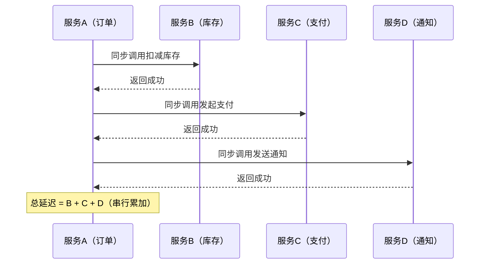

这种同步调用存在四个致命问题：

| 问题 | 表现 | 后果 |
|------|------|------|
| **强耦合** | 服务A直接依赖B、C、D的地址和接口 | 任一下游变更，上游必须跟着改 |
| **同步阻塞** | 串行等待每个调用返回 | 响应延迟 = 所有下游延迟之和 |
| **单点故障** | 下游任一服务不可用，上游请求失败 | 故障沿调用链传播，级联雪崩 |
| **流量冲击** | 大促流量直接打到所有下游服务 | 下游承受能力不一，最弱环节先崩 |

**一个真实的量级对比**：假设订单服务在大促期间峰值 QPS 为 10,000，下游每个服务的 P99 延迟为 50ms。同步调用模式下，订单服务需要在 50ms × 3 = 150ms 内完成所有调用，这意味着它只能承受约 6,666 QPS（10,000/1.5），远低于峰值。引入 MQ 后，订单服务只需写入队列（<5ms），吞吐量提升到 200,000 QPS，是同步模式的 30 倍。

引入消息队列后的异步解耦架构：

```mermaid
sequenceDiagram
    participant A as 服务A（订单）
    participant MQ as 消息队列
    participant B as 服务B（库存）
    participant C as 服务C（支付）
    participant D as 服务D（通知）
    A->>MQ: 发送订单创建消息
    Note over A: 立即返回（毫秒级）
    MQ-->>B: 异步推送消息
    MQ-->>C: 异步推送消息
    MQ-->>D: 异步推送消息
    Note over B,C,D: 各自独立消费，互不影响
```

消息队列带来的四大核心价值：

1. **异步解耦**：生产者不关心谁消费、何时消费，消费者不关心谁生产，双方通过消息中间件间接通信。服务间的依赖关系从 N×M 降为 N+M。
2. **流量削峰**：高并发流量先进入队列排队，消费者按自身处理能力匀速消费，避免瞬间过载。典型的"削峰填谷"效果：10,000 QPS 的峰值流量，消费者可以按 1,000 QPS 匀速处理，10秒内消化完毕。
3. **故障隔离**：下游服务故障不会传播到上游，消息在队列中持久化，待下游恢复后继续消费。消息队列是天然的"故障缓冲区"。
4. **广播分发**：一条消息可以被多个消费者组并行消费，实现一对多的事件通知。例如一条"订单已创建"的消息，可以同时触发库存扣减、物流分配、数据分析、用户通知四个完全独立的处理流程。

---

### 1.2 六大核心消息模式

消息模型按路由方式和消费语义，可以归纳为六大核心模式。理解每种模式的本质特征、适用边界和组合方式，是架构设计的基本功。

#### 模式一：点对点模型（Point-to-Point / Queue）

点对点模型是最基础的消息模式。消息被放入一个队列（Queue），多个消费者从同一个队列中竞争消费，但每条消息只会被一个消费者成功接收和处理。

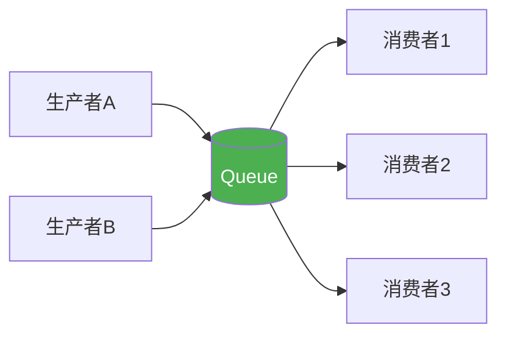

**核心特征：**

- **负载均衡**：消息天然在消费者间负载均衡，无需额外配置。队列自动将下一条消息分配给空闲的消费者。
- **竞争消费**：同一消息只能被一个消费者处理，适合任务分发。消费者之间是互斥关系。
- **消费者数量不敏感**：增加消费者可以提高消费吞吐，但不能广播消息。当消费者数量超过队列数量时，多余的消费者空闲。
- **消息生命周期**：被消费并确认后即从队列删除（或标记为已消费）。消息不保留历史，不支持回溯。
- **FIFO 语义**：消息按照先进先出的顺序被消费（在无优先级的情况下）。

**典型应用场景：**

- **任务队列**：将耗时任务分发给多个 worker 并行处理（图片转码、邮件发送、PDF 生成）
- **订单处理**：订单消息分配给可用的订单处理服务实例，天然实现负载均衡
- **工作流引擎**：步骤化的任务链，每个步骤由对应的 worker 消费处理
- **后台批处理**：定时任务产生的数据处理请求，由 worker 池竞争消费

**代码示例（RabbitMQ 完整的生产者与消费者）：**

```python
import pika
import time
import json

# === 生产者 ===
connection = pika.BlockingConnection(pika.ConnectionParameters('localhost'))
channel = connection.channel()

# 声明持久化队列（durable=True 确保 Broker 重启后队列不丢失）
channel.queue_declare(queue='task_queue', durable=True)

# 发送一条图片转码任务
task = {
    "task_id": 1001,
    "type": "image_resize",
    "url": "img/001.jpg",
    "target_width": 800,
    "target_height": 600
}
channel.basic_publish(
    exchange='',
    routing_key='task_queue',
    body=json.dumps(task),
    properties=pika.BasicProperties(
        delivery_mode=2,  # 消息持久化（写入磁盘）
        content_type='application/json'
    )
)
print(" [x] Task sent")
connection.close()

# === 消费者（Worker） ===
connection = pika.BlockingConnection(pika.ConnectionParameters('localhost'))
channel = connection.channel()

def callback(ch, method, properties, body):
    task = json.loads(body)
    print(f" [x] Processing task {task['task_id']}: {task['type']}")
    # 模拟耗时处理
    time.sleep(2)
    print(f" [x] Done: task {task['task_id']}")
    ch.basic_ack(delivery_tag=method.delivery_tag)  # 手动确认

# prefetch_count=1：每次只取1条，处理完再取下一条
# 避免快消费者空闲、慢消费者堆积的问题
channel.basic_qos(prefetch_count=1)
channel.basic_consume(queue='task_queue', on_message_callback=callback)
print(' [*] Waiting for tasks. To exit press CTRL+C')
channel.start_consuming()
```

> **关键细节：** `prefetch_count=1` 是点对点模型中控制消费节奏的关键参数。若设为较大值（如 10），处理慢的消费者会堆积大量未处理消息，而处理快的消费者却空闲等待，导致负载不均。生产环境中通常设为 CPU 核心数的 1-2 倍。

**点对点模型的局限性：**

- 不支持消息广播——一条消息只能被一个消费者处理
- 消息消费后即丢失，不支持回溯重消费
- 不适合事件驱动架构，因为事件需要被多个系统独立处理

---

#### 模式二：发布订阅模型（Publish / Subscribe / Topic）

发布订阅模型中，消息被发布到一个主题（Topic），所有订阅该主题的消费者都会收到消息的完整副本。这是真正的"广播"模型。

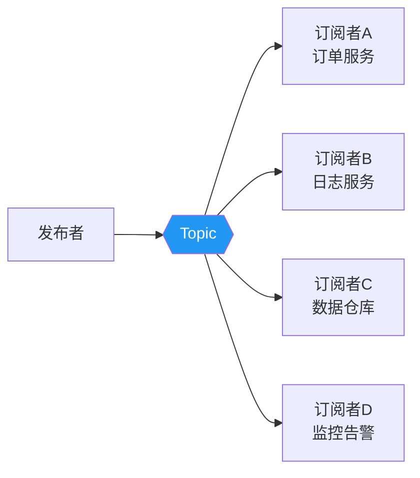

**核心特征：**

- **一对多广播**：一条消息被所有订阅者独立消费，互不影响。每个订阅者看到的是消息的完整副本。
- **订阅者独立**：每个订阅者维护独立的消费进度（offset / delivery tag），一个订阅者的消费行为不影响其他订阅者。
- **新订阅者友好**：新增订阅者不需要修改发布者代码，只需订阅对应的 Topic 即可。这是"开闭原则"在消息架构中的体现。
- **消息保留**：消息需要在 Topic 中保留足够长时间，等待所有订阅者消费完毕。Kafka 中通过 `retention.ms` 控制保留时长。
- **消费解耦**：生产者不需要知道有多少订阅者，订阅者不需要知道消息来自哪个生产者。

**点对点 vs 发布订阅 对比：**

| 维度 | 点对点（Queue） | 发布订阅（Topic） |
|------|----------------|-------------------|
| 消费方式 | 竞争消费，一条消息只被一个消费者处理 | 广播消费，一条消息被所有消费者各自处理 |
| 消费者关系 | 消费者之间互斥 | 消费者之间独立 |
| 负载均衡 | 天然支持，队列自动分配 | 不支持，每个消费者处理全量消息 |
| 扩展消费能力 | 增加消费者 → 线性提升吞吐 | 增加消费者 → 增加总处理量，但不提升单消费者吞吐 |
| 消息保留 | 消费后即删除 | 按策略保留（时间/大小/无限） |
| 消息回溯 | 不支持 | 支持（通过 offset 重置） |
| 适用场景 | 任务分发、负载均衡 | 事件通知、数据同步、多系统联动 |

**代码示例（RabbitMQ Topic Exchange 完整示例）：**

```python
import pika
import json

connection = pika.BlockingConnection(pika.ConnectionParameters('localhost'))
channel = connection.channel()

# 声明 Topic Exchange（支持通配符路由）
channel.exchange_declare(exchange='order_events', exchange_type='topic')

# === 生产者：发布订单事件 ===
event = {"order_id": 2001, "amount": 99.9, "user_id": "U100"}
channel.basic_publish(
    exchange='order_events',
    routing_key='order.created',  # 路由键：order.created
    body=json.dumps(event)
)
print(f" [x] Published: order.created -> {event}")

# === 订阅者A：订单处理服务（只关心订单相关事件） ===
channel.queue_declare(queue='order_processor', durable=True)
channel.queue_bind(
    exchange='order_events',
    queue='order_processor',
    routing_key='order.*'  # 匹配 order.created, order.cancelled, order.refund 等
)

def order_handler(ch, method, properties, body):
    event = json.loads(body)
    print(f" [A] Processing order event: {method.routing_key} -> {event}")
    # 业务逻辑：更新订单状态
    ch.basic_ack(delivery_tag=method.delivery_tag)

channel.basic_consume(queue='order_processor', on_message_callback=order_handler)

# === 订阅者B：支付服务（只关心已支付事件） ===
channel.queue_declare(queue='payment_processor', durable=True)
channel.queue_bind(
    exchange='order_events',
    queue='payment_processor',
    routing_key='*.paid'  # 匹配 order.paid, refund.paid 等
)

def payment_handler(ch, method, properties, body):
    event = json.loads(body)
    print(f" [B] Processing payment event: {method.routing_key} -> {event}")
    # 业务逻辑：触发发货流程
    ch.basic_ack(delivery_tag=method.delivery_tag)

channel.basic_consume(queue='payment_processor', on_message_callback=payment_handler)

print(' [*] Waiting for events. To exit press CTRL+C')
channel.start_consuming()
```

> **路由键通配符规则：** `*` 匹配一个词（如 `order.created`），`#` 匹配零个或多个词（如 `order.#` 匹配 `order`、`order.created`、`order.refund.item`）。注意：词之间用 `.` 分隔。

---

#### 模式三：请求应答模型（Request / Reply）

请求应答模型在消息通信之上增加了"同步等待回复"的能力。生产者发送请求消息后，阻塞等待消费者处理完毕并返回应答消息。

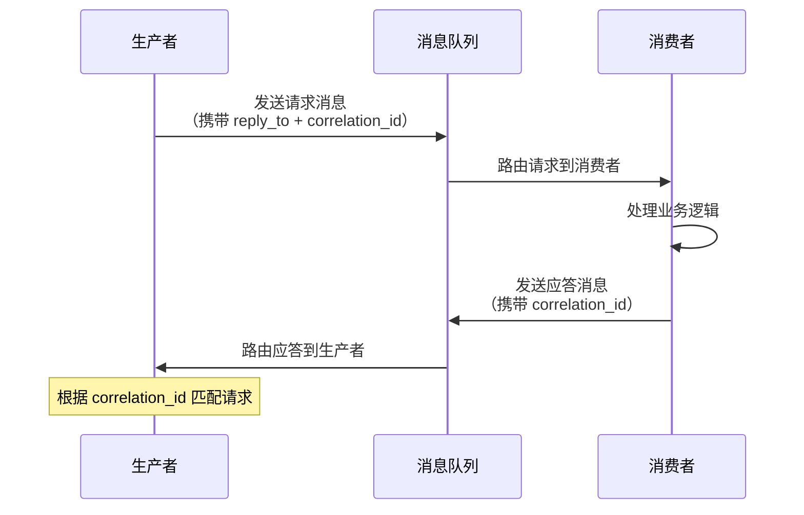

**关键实现细节：**

- **reply_to 队列**：生产者在消息属性中设置自己的应答队列名称。消费者处理完后，将应答发送到这个队列。
- **correlation_id**：全局唯一的请求ID，用于匹配请求和应答。生产者可能同时发出多个请求，每个请求需要独立跟踪其应答。
- **超时控制**：生产者必须设置合理的等待超时（如 30 秒），避免无限阻塞。超时后应有降级策略（返回默认值或触发告警）。
- **应答队列清理**：临时应答队列在使用完毕后应删除，避免队列堆积。

**代码示例（RabbitMQ RPC 完整实现）：**

```python
import pika
import uuid
import json
import threading

class FibonacciRpcClient:
    """基于 RabbitMQ 的 RPC 客户端"""
    def __init__(self):
        self.connection = pika.BlockingConnection(
            pika.ConnectionParameters('localhost')
        )
        self.channel = self.connection.channel()

        # 创建唯一的临时应答队列
        result = self.channel.queue_declare(queue='', exclusive=True)
        self.callback_queue = result.method.queue
        self.channel.basic_consume(
            queue=self.callback_queue,
            on_message_callback=self.on_response,
            auto_ack=True
        )
        self.response = None
        self.corr_id = None

    def on_response(self, ch, method, props, body):
        if self.corr_id == props.correlation_id:
            self.response = json.loads(body)

    def call(self, n, timeout=30):
        self.response = None
        self.corr_id = str(uuid.uuid4())

        self.channel.basic_publish(
            exchange='',
            routing_key='rpc_queue',
            properties=pika.BasicProperties(
                reply_to=self.callback_queue,
                correlation_id=self.corr_id,
                content_type='application/json'
            ),
            body=json.dumps({"number": n})
        )

        # 阻塞等待应答（带超时）
        deadline = time.time() + timeout
        while self.response is None:
            if time.time() > deadline:
                raise TimeoutError(f"RPC call timed out after {timeout}s")
            self.connection.process_data_events(time_limit=1)

        return self.response

# RPC 服务端
def on_request(ch, method, props, body):
    request = json.loads(body)
    n = request["number"]
    print(f" [.] fib({n})")
    result = {"result": fib(n)}  # 计算斐波那契数

    ch.basic_publish(
        exchange='',
        routing_key=props.reply_to,
        properties=pika.BasicProperties(
            correlation_id=props.correlation_id
        ),
        body=json.dumps(result)
    )
    ch.basic_ack(delivery_tag=method.delivery_tag)

def fib(n):
    if n == 0: return 0
    if n == 1: return 1
    return fib(n - 1) + fib(n - 2)
```

**适用场景：**

- **RPC 调用**：将传统 HTTP RPC 改造为基于消息队列的异步 RPC，获得队列的削峰和故障隔离能力
- **跨语言服务通信**：不同技术栈的服务间通信（Python 调 Java 服务），通过消息格式统一协议
- **服务降级**：当同步 RPC 调用失败时，回退到消息队列的请求应答模式，保证最终可用性
- **计算密集型任务**：客户端发送计算请求，服务端异步计算后返回结果（如 AI 推理、图像处理）

> **注意：** 请求应答模型虽然方便，但会丧失消息队列异步解耦的核心优势——生产者被阻塞等待应答，失去了削峰和故障隔离能力。在高吞吐场景中应谨慎使用，优先考虑纯异步架构。建议仅在需要同步结果的场景（如用户下单后需要立即确认）使用此模式。

---

#### 模式四：扇出扇入模型（Fan-Out / Fan-In）

扇出（Fan-Out）是一条消息分发给多个消费者；扇入（Fan-In）是多个生产者的消息汇聚到一个消费者处理。二者常配合使用，是事件驱动架构中最常见的消息路由模式。

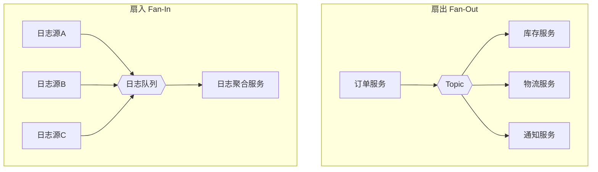

**扇出的典型应用：**

- **事件驱动架构**：一个领域事件触发多个下游处理。例如电商订单系统中，"订单创建"事件扇出到库存服务（扣减库存）、物流服务（准备发货）、通知服务（发送短信）、积分服务（累加积分）、数据分析服务（记录行为）。
- **数据同步**：一份数据变更同步到多个数据源。例如 MySQL binlog 变更扇出到 Elasticsearch（全文索引）、Redis（缓存更新）、数据仓库（离线分析）、搜索索引（实时检索）。
- **多活部署**：同一个事件需要在多个数据中心独立处理，扇出实现跨机房的数据同步。

**扇入的典型应用：**

- **日志收集**：多个服务的日志汇聚到统一的日志处理管道（ELK Stack）。这是扇入模式最经典的应用——数十个微服务产生的日志流汇聚到 Kafka 的一个 Topic，由 Logstash 消费后写入 Elasticsearch。
- **聚合计算**：多个数据源的指标汇聚到统一的监控系统。例如多个服务器的 CPU、内存、磁盘指标汇聚到 Prometheus 进行聚合分析。
- **数据入湖**：多个业务系统数据汇聚到统一的数据湖（Data Lake），供后续的离线分析和机器学习使用。
- **请求合并**：多个客户端的细粒度请求汇聚到服务端，批量处理后返回结果。例如多个用户同时查询推荐列表，服务端合并为一次批量查询。

**扇出扇入的设计要点：**

| 要点 | 扇出（Fan-Out） | 扇入（Fan-In） |
|------|----------------|----------------|
| 消费者独立性 | 每个下游消费者独立处理，互不影响 | 所有上游生产者的写入需要协调 |
| 错误隔离 | 一个消费者失败不影响其他消费者 | 一个生产者失败需要单独处理 |
| 背压处理 | 每个消费者独立控制消费速率 | 聚合点需要处理上游速率差异 |
| 消息顺序 | 扇出后各消费者独立保序 | 扇入后需要考虑多流合并的顺序问题 |
| 监控重点 | 每个消费者组的消费 Lag | 聚合点的处理能力和堆积情况 |

---

#### 模式五：优先级队列模型（Priority Queue）

优先级队列模型允许消息携带优先级标记，高优先级的消息被优先消费，即使它比低优先级消息更晚进入队列。

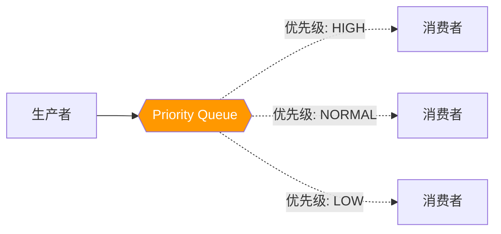

**实现方案对比：**

| 方案 | 实现方式 | 优缺点 |
|------|---------|--------|
| **多队列方案** | 按优先级拆分为多个队列（high/normal/low），消费者按优先级顺序消费 | 简单可靠，但队列数量随优先级线性增长；需要消费者按优先级轮询 |
| **单队列优先级** | 队列内部维护优先级堆（RabbitMQ 支持） | 配置简单，但高优先级积压时性能下降；队列头变成优先级堆的出队操作 |
| **延迟消息方案** | 高优先级设为0延迟，低优先级设为较大延迟 | 间接实现，但精度有限；无法动态调整优先级 |
| **权重方案** | 按优先级分配不同的消费者权重或消费速率 | 灵活但实现复杂；适合流处理场景 |

**代码示例（RabbitMQ 优先级队列）：**

```python
import pika
import json

# === 声明优先级队列 ===
channel.queue_declare(
    queue='priority_tasks',
    durable=True,
    arguments={
        'x-max-priority': 10,  # 最大优先级为 10（越大越优先）
        'x-queue-type': 'classic'  # 经典队列模式
    }
)

# === 生产者：发送不同优先级的消息 ===
messages = [
    {"task": "VIP用户退款", "priority": 10},
    {"task": "普通订单处理", "priority": 5},
    {"task": "批量数据导出", "priority": 1},
]
for msg in messages:
    channel.basic_publish(
        exchange='',
        routing_key='priority_tasks',
        body=json.dumps(msg),
        properties=pika.BasicProperties(
            delivery_mode=2,
            priority=msg['priority']  # 设置消息优先级
        )
    )
```

**适用场景：**

- **VIP 用户请求优先处理**：电商大促期间的 SVIP 订单优先发货，普通订单排队处理
- **告警分级处理**：P0 告警立即响应（如服务宕机），P3 告警批量处理（如磁盘使用率超过 80%）
- **数据库变更同步**：DDL 变更优先于 DML 变更，避免下游依赖错误（先加字段，再插入数据）
- **实时 vs 批处理混合**：实时查询请求优先于批量分析任务

> **注意：** 优先级队列的开销在于需要维护堆结构。当队列中积压大量低优先级消息时，高优先级消息的出队操作需要 O(log n) 的时间。对于吞吐量要求极高的场景（百万级 TPS），优先级队列可能成为瓶颈。

---

#### 模式六：死信队列模型（Dead Letter Queue, DLQ）

死信队列不是一种"正常"的消息模式，而是消息消费失败后的兜底机制。当消息反复消费失败（超过最大重试次数）时，会被路由到死信队列，由专门的程序进行人工排查或告警处理。

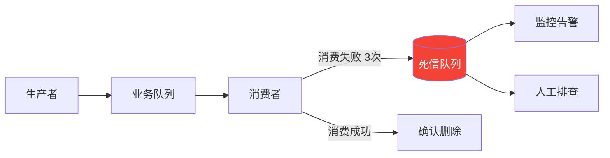

**触发死信的条件（以 RabbitMQ 为例）：**

1. **消费者拒绝**：消息被消费者拒绝（`basic.reject` 或 `basic.nack`）且 `requeue=False`
2. **TTL 到期**：消息的 TTL（存活时间）到期，消息过期后自动进入死信队列
3. **队列溢出**：队列达到最大长度（`x-max-length`），头部消息被丢弃并路由到死信队列

**Kafka 中的死信队列**：Kafka 原生没有死信队列概念，通常通过以下方式实现：
- 消费者消费失败后，将消息重新发送到一个专门的"死信 Topic"（如 `topic.DLQ`）
- 使用 Kafka Streams 或独立消费者监听死信 Topic

**RocketMQ 中的死信队列**：RocketMQ 原生支持死信 Topic，消费失败超过 16 次后自动进入 `%DLQ%ConsumerGroup` 的死信 Topic。

**死信队列的设计要点：**

- **死信队列本身也需要持久化**，避免兜底消息丢失。死信消息是"最后的救命稻草"，一旦丢失就意味着数据丢失。
- **需要配套监控告警**：当死信队列堆积超过阈值时触发告警（如超过 100 条）。堆积意味着有消息无法被正常处理，可能是代码 bug 或下游依赖故障。
- **死信消息应保留完整上下文**：包括原始队列名、重试次数、失败原因、失败时间、原始消息体。没有上下文的死信消息排查起来如同大海捞针。
- **设计修复-重发流程**：不要让消息永远躺在死信队列中。建立人工干预或自动重发机制，定期清理死信队列。

**代码示例（完整的死信处理流程）：**

```python
import pika
import json
import logging
from datetime import datetime

MAX_RETRIES = 3
logger = logging.getLogger(__name__)

def process_with_dlq(channel, method, properties, body):
    """带死信处理的消费者"""
    retry_count = properties.headers.get('x-retry-count', 0) if properties.headers else 0

    if retry_count >= MAX_RETRIES:
        # 超过最大重试次数 → 发送到死信队列
        channel.basic_publish(
            exchange='dlx_exchange',
            routing_key='dead.letter',
            body=body,
            properties=pika.BasicProperties(
                delivery_mode=2,
                headers={
                    'x-original-queue': method.routing_key,
                    'x-retry-count': retry_count,
                    'x-failure-reason': properties.headers.get('x-last-error', 'unknown'),
                    'x-death-time': datetime.now().isoformat(),
                    'x-original-body': body.decode()
                }
            )
        )
        channel.basic_ack(delivery_tag=method.delivery_tag)
        logger.error(f"Message sent to DLQ after {MAX_RETRIES} retries: {body[:100]}")
        # 通知运维团队
        alert_ops_team(
            queue=method.routing_key,
            retry_count=retry_count,
            body_preview=body[:200]
        )
        return

    try:
        handle_business_logic(body)
        channel.basic_ack(delivery_tag=method.delivery_tag)
    except Exception as e:
        logger.warning(f"Processing failed (attempt {retry_count + 1}): {e}")
        # 增加重试计数并重新入队（不立即拒绝，避免消息丢失）
        headers = dict(properties.headers) if properties.headers else {}
        headers['x-retry-count'] = retry_count + 1
        headers['x-last-error'] = str(e)[:200]

        channel.basic_publish(
            exchange='',
            routing_key=method.routing_key,
            body=body,
            properties=pika.BasicProperties(
                delivery_mode=2,
                headers=headers
            )
        )
        channel.basic_ack(delivery_tag=method.delivery_tag)

def alert_ops_team(queue, retry_count, body_preview):
    """通知运维团队（示例：发送告警）"""
    alert = {
        "level": "CRITICAL",
        "message": f"Message in DLQ: queue={queue}, retries={retry_count}",
        "body_preview": body_preview,
        "timestamp": datetime.now().isoformat()
    }
    # 实际项目中发送到 Slack/钉钉/PagerDuty 等
    logger.critical(json.dumps(alert))
```

**死信队列的运维要点：**

| 维度 | 最佳实践 |
|------|---------|
| 监控告警 | 死信消息数 > 0 立即告警；堆积 > 100 条升级为 P1 事件 |
| 消息保留 | 死信队列保留至少 7 天，便于人工排查 |
| 修复流程 | 建立"分析原因 → 修复代码 → 重发消息"的标准 SOP |
| 定期清理 | 设置 TTL 自动清理过期死信，避免无限堆积 |
| 分析工具 | 开发死信消息查看器，支持按队列/时间/错误类型筛选 |

---

### 1.3 主流消息中间件架构对比

不同消息中间件在消息模型的实现上存在显著差异。理解这些差异是选型的关键依据。

#### Kafka 架构

Kafka 采用"分布式提交日志"（Distributed Commit Log）架构，以 Topic 和 Partition 为核心组织方式：

┌─────────────────────────────────────────────────────────────────┐
│                       Kafka Cluster                              │
│                                                                  │
│  ┌──────────────────────────┐  ┌──────────────────────────┐    │
│  │       Broker 1           │  │       Broker 2           │    │
│  │  ┌─────────┐ ┌─────────┐│  │  ┌─────────┐ ┌─────────┐│    │
│  │  │Topic-A  │ │Topic-B  ││  │  │Topic-A  │ │Topic-B  ││    │
│  │  │P0 (L)   │ │P0       ││  │  │P1       │ │P1 (L)   ││    │
│  │  └─────────┘ └─────────┘│  │  └─────────┘ └─────────┘│    │
│  └──────────────────────────┘  └──────────────────────────┘    │
│                                                                  │
│  ┌──────────────────────────┐  (L) = Leader Partition           │
│  │       Broker 3           │                                   │
│  │  ┌─────────┐ ┌─────────┐│  ZooKeeper / KRaft                │
│  │  │Topic-A  │ │Topic-B  ││  (元数据管理与选举)                 │
│  │  │P2       │ │P2       ││                                   │
│  │  └─────────┘ └─────────┘│                                   │
│  └──────────────────────────┘                                   │
└─────────────────────────────────────────────────────────────────┘

**Kafka 核心概念详解：**

| 概念 | 说明 | 关键设计 |
|------|------|---------| 
| **Broker** | Kafka 服务器实例，一个集群由多个 Broker 组成 | 每个 Broker 负责存储部分 Partition 的数据 |
| **Topic** | 消息的逻辑分类，类似数据库中的"表" | 一个 Topic 可以有多个 Partition |
| **Partition** | Topic 的物理分片，是 Kafka 并行度的基本单位 | 每个 Partition 内消息严格有序 |
| **Offset** | 消息在 Partition 中的唯一递增序号 | 消费者通过提交 offset 标记消费进度 |
| **Replica** | Partition 的副本，分布在不同 Broker 上 | 分为 Leader 和 Follower，Follower 只同步不服务读写 |
| **ISR** | In-Sync Replica，与 Leader 保持同步的副本集合 | 生产者等待 ISR 确认才算写入成功 |
| **Consumer Group** | 一组消费者的逻辑集合 | 组内竞争消费（负载均衡），组间广播消费 |
| **Producer** | 消息生产者 | 支持指定 Partition、Round-Robin、Key-Hash 等路由策略 |

**Partition 的消息存储结构：**

Partition 0 的物理存储（磁盘上的段文件）：
Segment 1: [0, 1, 2, 3, 4, 5, 6, 7, 8, 9]    ← 已关闭（不可追加）
Segment 2: [10, 11, 12, 13]                    ← 活跃段（可追加写入）

每个消息的存储格式：
┌──────────────┬──────────┬──────────┬─────────┬─────────────────┐
│ Offset (8B)  │ Size(4B) │CRC32(4B) │ Key     │ Value + Headers │
│              │          │          │ (变长)   │    (变长)        │
└──────────────┴──────────┴──────────┴─────────┴─────────────────┘

每个 Segment 对应两个文件：
- `.log` 文件：存储实际的消息数据
- `.index` 文件：offset 到文件物理偏移量的稀疏索引，用于快速定位消息

Kafka 的消息追加写入（append-only）是其高吞吐量的核心原因——顺序写磁盘的性能可达 600MB/s（机械硬盘），远超随机写入的几十 MB/s。这个性能差距解释了为什么 Kafka 的吞吐量可以达到百万级 TPS。

---

#### RabbitMQ 架构

RabbitMQ 采用 AMQP（Advanced Message Queuing Protocol）协议，以 Exchange + Queue + Binding 为核心：

┌─────────────────────────────────────────────────────┐
│                   RabbitMQ                           │
│                                                      │
│  生产者 → Exchange（路由引擎）→ Binding（绑定规则）→ Queue │
│                                                      │
│  Exchange 类型：                                      │
│  ┌────────────┬──────────────────────────────────┐  │
│  │ Direct     │ 精确匹配 routing_key               │  │
│  │ Fanout     │ 广播到所有绑定的 Queue（忽略key）    │  │
│  │ Topic      │ 通配符匹配（* 一个词，# 零或多个词）  │  │
│  │ Headers    │ 根据消息 Headers 属性匹配            │  │
│  └────────────┴──────────────────────────────────┘  │
└─────────────────────────────────────────────────────┘

**RabbitMQ 与 Kafka 的核心差异：**

| 维度 | RabbitMQ | Kafka |
|------|----------|-------|
| 消息模型 | Exchange + Queue（路由灵活） | Topic + Partition（分区有序） |
| 消息存储 | 内存为主，消费后删除 | 磁盘日志，保留策略可配置 |
| 消息回溯 | 不支持（消费后即删除） | 支持（通过 offset 回溯重消费） |
| 消费语义 | Push 模式（Broker 推送给消费者） | Pull 模式（消费者主动拉取） |
| 吞吐量 | 万级 QPS | 百万级 TPS |
| 延迟 | 微秒级 | 毫秒级 |
| 协议 | AMQP/STOMP/MQTT | 自定义协议 |
| 适用场景 | 复杂路由、低延迟、小消息 | 高吞吐、流处理、日志 |

> **选型建议**：如果你的核心需求是复杂的消息路由（如多种 Exchange 类型组合）、低延迟（微秒级）、小消息量（万级 QPS），选择 RabbitMQ。如果你的核心需求是高吞吐（百万级 TPS）、消息回溯、流处理，选择 Kafka。

---

#### RocketMQ 架构

RocketMQ 是阿里巴巴开源的消息中间件，采用 NameServer + Broker 架构：

┌──────────────────────────────────────────────────────┐
│                   RocketMQ Cluster                    │
│                                                       │
│  NameServer 1（轻量级元数据，无状态，可多实例）           │
│  NameServer 2（Broker 启动时向所有 NameServer 注册）     │
│                                                       │
│  ┌─────────────────┐  ┌─────────────────┐            │
│  │ Broker Master    │  │ Broker Master    │            │
│  │ (读写)           │  │ (读写)           │            │
│  │  └─ Slave (只读) │  │  └─ Slave (只读) │            │
│  └─────────────────┘  └─────────────────┘            │
│                                                       │
│  特有能力：                                            │
│  • 事务消息（半消息 + 事务回查）                         │
│  • 延迟消息（固定级别，如 1s/5s/10s/30s/1m/2h）         │
│  • 消息轨迹（全链路追踪）                                │
│  • 消息过滤（SQL92 表达式）                              │
└──────────────────────────────────────────────────────┘

**RocketMQ 的独特优势——事务消息：**

RocketMQ 支持分布式事务消息，解决"本地事务执行成功但消息发送失败"（或反过来）的原子性问题：

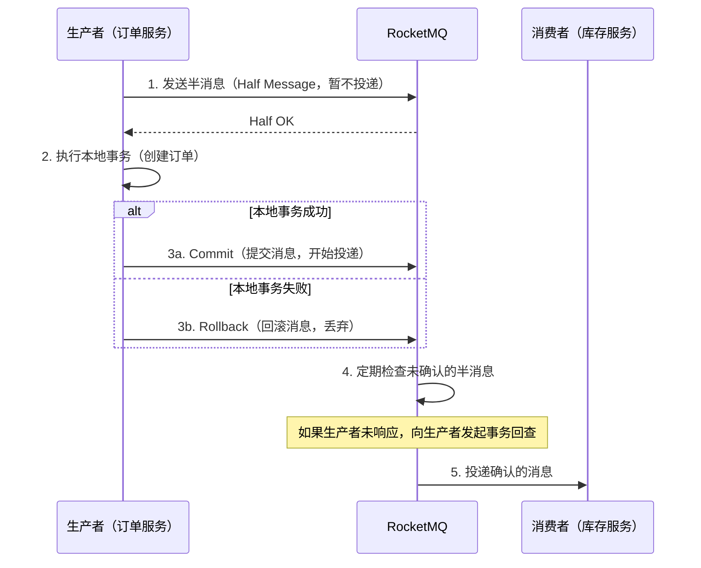

**RocketMQ 事务消息的典型场景：**
- **订单创建**：先在数据库创建订单记录，再发送"订单已创建"消息。如果数据库写入失败，消息也不会发出；如果消息发送失败，事务回查机制会重新检查订单状态。
- **库存扣减**：先扣减库存，再发送库存变更事件。保证库存数据和事件的一致性。
- **积分变更**：先更新积分余额，再发送积分变更通知。避免"积分已变但通知未发"的不一致。

---

#### Apache Pulsar 架构

Pulsar 采用计算存储分离架构，是目前最新的消息中间件设计范式：

┌────────────────────────────────────────────────────────────┐
│                     Apache Pulsar                           │
│                                                             │
│  ┌─────────────┐  ┌─────────────┐  ┌─────────────┐        │
│  │ Broker 1    │  │ Broker 2    │  │ Broker 3    │        │
│  │ (无状态)    │  │ (无状态)    │  │ (无状态)    │        │
│  └──────┬──────┘  └──────┬──────┘  └──────┬──────┘        │
│         │                │                │                 │
│         └────────┬───────┴────────┬───────┘                │
│                  ▼                ▼                          │
│  ┌──────────────────────────────────────────────┐          │
│  │        BookKeeper（存储层）                     │          │
│  │  Bookie 1    Bookie 2    Bookie 3    ...     │          │
│  │  (存储 Entry) (存储 Entry) (存储 Entry)       │          │
│  └──────────────────────────────────────────────┘          │
│                                                             │
│  关键特性：                                                  │
│  • Broker 无状态 → 消费者故障转移秒级完成                     │
│  • 存储计算分离 → 独立扩缩容                                 │
│  • 多租户支持 → 租户/命名空间/Topic 三级隔离                   │
│  • 分层存储 → 冷数据自动卸载到 S3/HDFS                       │
└────────────────────────────────────────────────────────────┘

**Pulsar 的核心创新——分层存储（Tiered Storage）：**

传统 MQ 的消息消费后即删除（RabbitMQ）或按时间/大小删除（Kafka），Pulsar 引入分层存储：热数据存储在 BookKeeper（SSD），冷数据自动下沉到对象存储（S3/GCS/HDFS），实现"无限"消息保留和回溯能力，同时控制存储成本。这一设计使得 Pulsar 特别适合需要长期保留消息的场景（如合规审计、数据湖构建）。

**Pulsar vs Kafka 的关键差异：**

| 维度 | Pulsar | Kafka |
|------|--------|-------|
| 架构 | 计算存储分离（Broker + BookKeeper） | 计算存储耦合（Broker 直接写磁盘） |
| 扩缩容 | Broker 和 Bookie 独立扩缩容 | Broker 扩缩容需要数据迁移（Rebalance） |
| 多租户 | 原生支持（租户/命名空间/Topic） | 需要外部方案（ACL + 配额） |
| 存储成本 | 分层存储，冷数据自动下沉 | 需要手动清理或使用外部存储 |
| 运维复杂度 | 高（需要维护 BookKeeper 集群） | 中（需要维护 ZooKeeper/KRaft） |
| 社区生态 | 快速增长中 | 最成熟（Flink/Spark/Connect 生态） |

---

#### 四大消息中间件选型速查表

| 维度 | Kafka | RabbitMQ | RocketMQ | Pulsar |
|------|-------|----------|----------|--------|
| **定位** | 分布式流处理平台 | 企业级消息代理 | 金融级消息中间件 | 云原生消息流平台 |
| **吞吐量** | 百万级 TPS | 万级 QPS | 十万级 TPS | 百万级 TPS |
| **延迟** | 毫秒级 | 微秒级 | 毫秒级 | 毫秒级 |
| **消息回溯** | ✅ 支持 | ❌ 不支持 | ✅ 支持 | ✅ 支持（无限） |
| **事务消息** | ✅ 支持 | ❌ 不支持 | ✅ 支持（最佳） | ✅ 支持 |
| **延迟消息** | ❌ 需第三方 | ⚠️ 插件支持 | ✅ 原生支持 | ✅ 原生支持 |
| **消息过滤** | Consumer 端 | Exchange 路由 | Broker 端（SQL） | Broker 端 |
| **多租户** | ❌ | ⚠️ 有限 | ❌ | ✅ 原生支持 |
| **消费模型** | Pull | Push | Pull + Long Polling | Pull + Cursor |
| **运维复杂度** | 中（ZooKeeper 依赖） | 低 | 中 | 高（BookKeeper） |
| **生态** | 最丰富（Flink/Spark） | 成熟（Spring） | 国内主流（阿里生态） | 快速增长中 |

**选型决策树：**

需要高吞吐（>10万 TPS）？
├── 是 → 需要流处理（Flink/Spark）？
│   ├── 是 → Kafka
│   └── 否 → 需要多租户？
│       ├── 是 → Pulsar
│       └── 否 → Kafka
└── 否 → 需要复杂路由（多 Exchange）？
    ├── 是 → RabbitMQ
    └── 否 → 需要事务消息？
        ├── 是 → RocketMQ
        └── 否 → RabbitMQ（最简单）

---

### 1.4 消息投递语义

消息投递语义决定了"消息会不会丢、会不会重复"，是消息模型中最核心的可靠性保证。

#### 三种投递语义

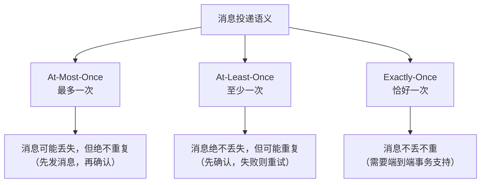

| 语义 | 含义 | 实现方式 | 适用场景 |
|------|------|---------|---------| 
| **At-Most-Once** | 消息最多投递一次，可能丢失但绝不重复 | 先发送消息，后写本地日志；消费端自动提交 offset | 日志采集、监控指标（容忍少量丢失） |
| **At-Least-Once** | 消息至少投递一次，绝不丢失但可能重复 | 先写本地日志，再发送消息；消费端手动提交 offset | 大多数业务场景（配合幂等消费） |
| **Exactly-Once** | 消息恰好投递一次，不丢不重 | 生产者幂等 + 事务 + 消费端幂等 | 金融交易、库存扣减等强一致性场景 |

> **工程实践共识**：At-Least-Once + 消费端幂等性是绝大多数场景的最佳选择。Exactly-Once 的实现代价极高（性能下降 30%-50%），且仅在 Kafka 内部有效，跨系统无法保证。除非是金融级场景，否则不要追求 Exactly-Once。

#### 实现 Exactly-Once 的三条路径

**路径一：生产者幂等（Idempotent Producer）**

Kafka 引入了 Producer ID + Sequence Number 机制：每个 Producer 实例分配一个唯一 PID，每条消息携带递增序号。Broker 为每个 `<PID, Partition>` 维护一个序列号计数器，自动过滤重复消息。

```python
# Kafka 幂等生产者配置
producer = KafkaProducer(
    enable_idempotence=True,    # 启用幂等
    acks='all',                 # 等待所有副本确认
    max_in_flight_requests_per_connection=5  # 允许乱序重试（幂等保证安全）
)
```

> **注意：** 幂等 Producer 只能保证单 Partition 内的 Exactly-Once。跨 Partition 的原子写入需要使用 Kafka Transactions。

**路径二：消费者幂等（Idempotent Consumer）**

消费端通过业务逻辑保证重复消息不会产生副作用：

```python
import hashlib

def idempotent_consume(message):
    # 1. 提取消息唯一ID（业务主键或消息ID）
    msg_id = message.headers['message-id']

    # 2. 检查是否已处理（Redis / 数据库唯一索引）
    if redis.exists(f"processed:{msg_id}"):
        log.info(f"Duplicate message {msg_id}, skip")
        return

    # 3. 执行业务逻辑
    process_order(message.body)

    # 4. 标记已处理（设置过期时间，避免Redis无限增长）
    redis.setex(f"processed:{msg_id}", 86400 * 7, "done")  # 保留7天
```

常见幂等实现方案：

| 方案 | 适用场景 | 实现方式 | 性能影响 | 实现复杂度 |
|------|---------|---------|---------|-----------| 
| 数据库唯一索引 | 订单创建、转账记录 | INSERT 前检查唯一键，重复插入抛异常 | 低 | 低 |
| Redis SETNX | 通用去重 | `SETNX msg_id 1 EX 604800`（7天过期） | 极低 | 低 |
| 乐观锁版本号 | 库存扣减 | `UPDATE goods SET stock=stock-1, version=version+1 WHERE id=X AND version=V` | 低 | 中 |
| 状态机 | 订单状态变更 | 只允许从"待支付"→"已支付"，重复消息命中不到当前状态 | 取决于查询 | 中 |
| 布隆过滤器 | 海量消息去重 | 内存级快速去重，允许极小误判率 | 极低 | 中 |

**路径三：Kafka 事务（Transactional API）**

Kafka 事务可以保证"跨 Partition 原子写入"——生产者在一个事务中发送多条消息到不同 Partition，要么全部成功，要么全部回滚：

```python
from kafka import KafkaProducer
from kafka.errors import KafkaError

producer = KafkaProducer(
    bootstrap_servers='localhost:9092',
    transactional_id='order-service-txn-001'  # 事务ID，必须全局唯一
)

producer.init_transactions()

try:
    producer.begin_transaction()

    # 同一个事务中写多个 Topic/Partition
    producer.send('order_events', b'{"event":"created","id":1001}')
    producer.send('inventory_events', b'{"event":"reserved","sku":"A001"}')
    producer.send('notification_events', b'{"event":"send_email","to":"user@x.com"}')

    producer.commit_transaction()
except KafkaError as e:
    producer.abort_transaction()
    raise
```

> **事务消息的代价**：吞吐量降低 30%-50%，每条消息增加 1-2ms 延迟，需要维护事务日志和 PID 映射。仅在 Kafka 内部有效，跨系统无法保证。工程建议：绝大多数场景使用 At-Least-Once + 幂等消费，金融级场景才引入 Exactly-Once。

---

### 1.5 消费者组与分区策略

消费者组（Consumer Group）是消息模型中最精妙的设计之一——同一个 Topic 的消息在不同消费者组之间广播，在同一消费者组内负载均衡。

#### 消费者组的工作原理

```mermaid
graph TB
    subgraph Topic: orders (3 Partitions)
        P0[Partition 0]
        P1[Partition 1]
        P2[Partition 2]
    end

    subgraph 消费者组A: 订单处理服务
        CA1[Consumer-A1] -->|消费| P0
        CA2[Consumer-A2] -->|消费| P1
        CA3[Consumer-A3] -->|消费| P2
    end

    subgraph 消费者组B: 数据仓库同步
        CB1[Consumer-B1] -->|消费| P0
        CB1 -->|消费| P1
        CB1 -->|消费| P2
    end

    subgraph 消费者组C: 日志服务
        CC1[Consumer-C1] -->|消费| P0
        CC2[Consumer-C2] -->|消费| P1
        CC3[Consumer-C3] -->|消费| P2
    end
```

**关键规则：**

1. **一个 Partition 只能被同一消费者组内的一个消费者消费**（避免重复消费）
2. **一个消费者可以消费多个 Partition**（当消费者数量少于 Partition 数量时）
3. **不同消费者组之间完全独立**（组间是广播关系）
4. **消费者数量超过 Partition 数量时**，多余的消费者空闲（不提升吞吐）

**Partition 分配策略：**

| 策略 | 分配方式 | 适用场景 |
|------|---------|---------| 
| **Range** | 按 Topic 字母顺序，连续分配（Consumer-A: P0,P1; Consumer-B: P2） | Topic 数量少且 Partition 数均匀 |
| **RoundRobin** | 所有 Topic 的所有 Partition 轮询分配 | 多 Topic 场景，负载更均匀 |
| **Sticky** | 尽量保持上次分配不变，仅做最小调整 | 消费者动态扩缩容，减少分区重分配 |
| **CooperativeSticky** | 增量式重分配，不需要全量Stop-The-World | 生产环境推荐，减少重平衡影响 |

#### Rebalance 机制

当消费者组内的成员发生变化（新增/下线/崩溃）时，Kafka 会触发 **Rebalance（重平衡）**，重新分配 Partition：

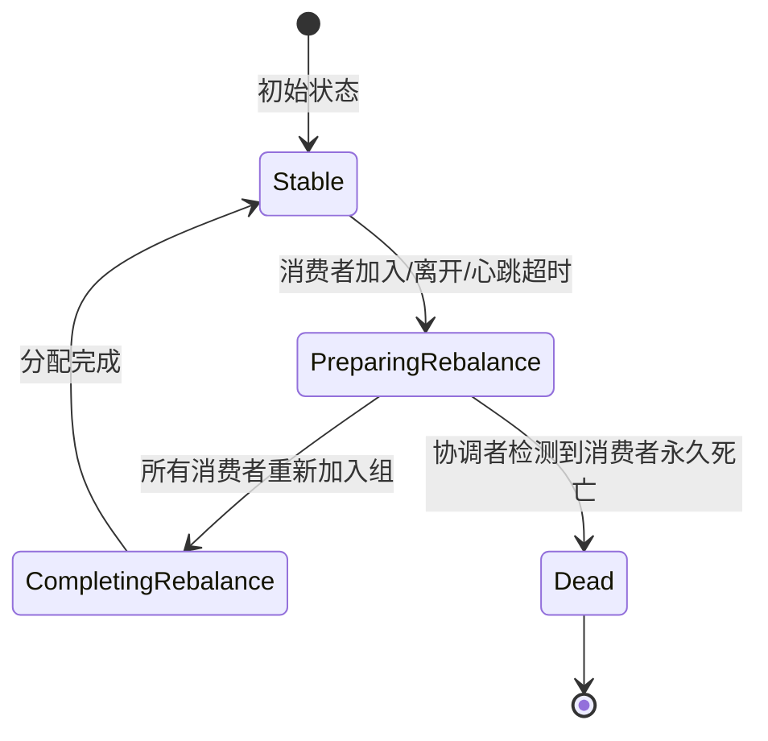

**Rebalance 的触发条件：**

- 消费者加入消费者组（新实例启动）
- 消费者离开消费者组（正常 shutdown 或主动 leave）
- 消费者心跳超时（超过 `session.timeout.ms` 未发送心跳）
- 消费者处理消息超时（超过 `max.poll.interval.ms` 未调用 poll）

**Rebalance 优化建议：**

```python
consumer = KafkaConsumer(
    'topic',
    group_id='my-group',
    session_timeout_ms=30000,          # 会话超时：30秒
    heartbeat_interval_ms=10000,       # 心跳间隔：10秒（应 < session_timeout/3）
    max_poll_interval_ms=300000,       # 最大处理时间：5分钟
    partition_assignment_strategy=[CooperativeStickyAssignor()]  # 推荐增量式
)
```

> **常见陷阱：** `max.poll.interval.ms` 设置过小会导致处理时间长的消费者被踢出组，引发频繁 Rebalance。如果单条消息处理时间较长（如涉及外部 API 调用），应适当增大此值，或在处理逻辑中分批 poll。典型值：如果单条消息处理耗时 5 秒，建议 `max_poll_interval_ms` 设为 300,000（5分钟），留出足够余量。

---

### 1.6 消息路由与过滤

消息路由决定了消息如何从生产者到达正确的消费者。不同 MQ 的路由机制差异很大。

#### 路由策略对比

**Kafka 的分区路由：**

```python
# 策略一：指定 Partition（完全控制）
producer.send('orders', value, partition=0)

# 策略二：Round-Robin（轮询，均匀分布）
producer.send('orders', value)  # 默认，不指定 partition

# 策略三：Key-Hash（按消息键哈希，保证同一键的消息进同一分区）
producer.send('orders', value, key=b'user_123')
# hash('user_123') % num_partitions → 确定 Partition
# 同一个 user 的所有消息保序
```

**RabbitMQ 的 Exchange 路由：**

生产者 → Exchange → Binding Key → Queue → 消费者

四种 Exchange 类型：
1. Direct（直连）：routing_key 精确匹配
   exchange → binding_key="order.created" → queue="order_queue"
   发送 routing_key="order.created" → 匹配 ✓
   发送 routing_key="order.cancelled" → 不匹配 ✗

2. Topic（通配符）：支持 * 和 # 通配符
   binding_key="order.*"   → 匹配 "order.created"，不匹配 "order.refund.item"
   binding_key="order.#"   → 匹配 "order.created"，也匹配 "order.refund.item"

3. Fanout（扇出）：忽略 routing_key，广播到所有绑定队列
   适用于完全广播场景（日志分发）

4. Headers（头匹配）：根据消息 Headers 属性匹配
   x-match=all：所有条件都满足
   x-match=any：任一条件满足

#### 消息过滤方式

| 过滤方式 | 实现层级 | 代表MQ | 优缺点 |
|---------|---------|--------|--------|
| Broker 端过滤 | 消息在 Broker 路由时过滤 | RabbitMQ Exchange、RocketMQ Tag/SQL | 节省网络带宽和消费者资源，但增加 Broker 负担 |
| Consumer 端过滤 | 消费者拉取全部消息后本地过滤 | Kafka（默认） | Broker 简单，但浪费网络带宽 |
| 副本过滤 | 创建专用的过滤消费节点 | Pulsar（Subscription Initial Position） | 介于两者之间，适合特定场景 |

**RocketMQ 的 SQL92 过滤示例：**

RocketMQ 支持在 Broker 端使用 SQL92 表达式过滤消息，这是其独特优势：

```java
// 生产者设置消息属性
Message msg = new Message("order-topic", tags, keys, body);
msg.putUserProperty("amount", "199.9");
msg.putUserProperty("city", "北京");

// 消费者使用 SQL92 过滤
consumer.subscribe("topic",
    MessageSelector.bySql("amount > 100 AND city = '北京'")
);
// 只消费金额 > 100 且城市为北京的消息
```

---

### 1.7 真实案例：电商系统的多模型组合

理论知识需要通过真实场景来融会贯通。以一个典型的电商订单系统为例，展示如何组合使用多种消息模型。

#### 场景描述

用户在电商平台下单后，需要触发以下处理流程：
1. 扣减库存（同步，需要立即确认）
2. 创建支付记录（同步，需要立即确认）
3. 发送订单确认短信（异步，可以延迟）
4. 通知物流系统准备发货（异步，可以延迟）
5. 更新数据仓库的订单统计（异步，允许延迟）
6. 触发用户积分累加（异步，可以延迟）

#### 消息模型组合方案

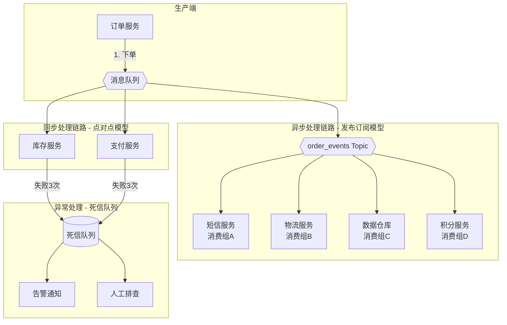

**具体实现：**

| 业务环节 | 消息模型 | 理由 | 技术选型 |
|---------|---------|------|---------|
| 库存扣减 | 点对点（Queue） | 每条消息只处理一次，需要负载均衡 | RabbitMQ Queue |
| 支付记录 | 点对点（Queue） | 同上，需要保证幂等性 | RabbitMQ Queue |
| 短信通知 | 发布订阅（Topic） | 订单事件需要被多个服务独立消费 | Kafka Topic |
| 物流通知 | 发布订阅（Topic） | 同上 | Kafka Topic |
| 数据仓库 | 发布订阅（Topic） | 同上，且需要消息回溯 | Kafka Topic |
| 积分累加 | 发布订阅（Topic） | 同上 | Kafka Topic |
| 消费失败 | 死信队列（DLQ） | 兜底处理异常消息 | RabbitMQ DLX |

**关键设计决策：**

1. **为什么库存扣减用点对点而非发布订阅？** 因为库存扣减是"一个消息处理一次"的场景，用点对点天然支持负载均衡，避免重复扣减。
2. **为什么短信通知用发布订阅？** 因为一条"订单已创建"事件可能被短信服务、物流服务、数据仓库、积分服务等多个消费者组独立消费。
3. **为什么选 Kafka 做发布订阅、RabbitMQ 做点对点？** Kafka 的 Topic + Partition 模型天然适合发布订阅（消息不删除，支持回溯），且吞吐量高。RabbitMQ 的 Exchange + Queue 模型适合复杂路由和低延迟的点对点场景。

---

### 1.8 常见误区与最佳实践

#### 误区一：消息队列可以替代数据库

消息队列不是持久化存储系统。Kafka 虽然可以持久化消息，但其存储模型（只追加、不支持更新/删除）与数据库截然不同。消息队列的核心价值是"传输"而非"存储"——消息被消费后应当删除（或按策略保留短时间）。长期数据存储应使用数据库或数据仓库。

> **正确做法**：消息队列负责"传输"，数据库负责"存储"，数据仓库负责"分析"。三者各司其职，不要试图用一种技术替代另一种。

#### 误区二：消费者越多吞吐量越高

在同一消费者组内，消费者的数量不能超过 Partition 数量。超过部分的消费者将处于空闲状态。提升吞吐量的根本方式是增加 Partition 数量（同时注意 Partition 过多带来的元数据管理和 Rebalance 开销）。

> **经验法则**：Partition 数量 = 峰值吞吐量 / 单 Partition 的最大吞吐量。例如 Kafka 单 Partition 吞吐量约为 10MB/s，峰值需要 100MB/s，则至少需要 10 个 Partition。

#### 误区三：消息发送成功 = 消息不丢失

消息发送成功到 Broker 只是第一步。还需要考虑：

1. Broker 收到消息后同步到磁盘前宕机 → 消息丢失（需配置 `acks=all` + `min.insync.replicas=2`）
2. 消费者收到消息处理成功但提交 offset 前宕机 → 消息重复消费（需幂等消费）
3. Broker 数据保留策略到期删除 → 消息丢失（需合理配置 `retention.ms`）
4. 消费者拉取消息后、处理完成前崩溃 → 消息重新投递（At-Least-Once 语义）

> **正确做法**：消息可靠性需要覆盖"生产端 → 存储端 → 消费端"全链路，每个环节都需要独立配置保证。

#### 误区四：顺序消息 = 全局有序

Kafka 的消息有序性是 **Partition 级别**的，不是全局有序。如果需要全局有序，只能使用单个 Partition（牺牲并行度）。实际业务中，通常只需要保证"同一业务实体的消息有序"——例如同一订单的所有状态变更消息，通过设置相同的 message key 路由到同一 Partition 即可。

> **正确做法**：用 message key 保证业务实体级别的局部顺序（如 `key=orderId`），而不是追求全局顺序。全局顺序是反模式——它会让系统的并行度退化为 1。

#### 误区五：忽略消费者消费能力

只关注生产者吞吐量而忽视消费者处理能力，会导致消息堆积。监控消费者 Lag（`consumer_lag = 最新 offset - 消费者提交的 offset`）是消息队列运维的核心指标。消费 Lag 持续增长意味着消费能力不足，需要扩容消费者或优化消费逻辑。

> **监控告警建议**：
> - Lag < 1000：正常
> - Lag 1000-10000：关注，可能需要扩容
> - Lag > 10000：告警，需要立即处理
> - Lag 持续增长（>1小时）：严重告警，消费者可能故障

#### 误区六：所有场景都追求 Exactly-Once

Exactly-Once 是理想语义，但实现代价极高。Kafka 的 Exactly-Once 需要开启幂等生产者 + 事务，吞吐量下降 30%-50%，延迟增加 1-2ms。更关键的是，Kafka 的 Exactly-Once 仅在 Kafka 内部有效，跨系统（如写入数据库）无法保证。

> **正确做法**：90% 的场景使用 At-Least-Once + 消费端幂等性。只有金融交易、库存扣减等对数据一致性要求极高的场景，才引入 Exactly-Once。幂等消费的实现成本远低于 Exactly-Once 的基础设施成本。

---

### 1.9 本节小结

| 模型 | 核心思想 | 典型场景 | 选择要点 |
|------|---------|---------|---------| 
| 点对点 | 竞争消费，一消息一处理 | 任务分发、负载均衡 | 关注消费并发度 |
| 发布订阅 | 广播消费，一消息多处理 | 事件通知、数据同步 | 关注消息保留时间 |
| 请求应答 | 同步等待回复 | RPC 改造、跨语言通信 | 关注超时和死锁 |
| 扇出扇入 | 多对多分发汇聚 | 事件驱动、日志聚合 | 关注扇出扇入比例 |
| 优先级队列 | 高优先级先消费 | VIP 通道、告警分级 | 关注优先级粒度 |
| 死信队列 | 失败消息兜底 | 异常处理、人工排查 | 关注告警和修复流程 |

消息模型的选择没有"最好"，只有"最适合"。一个成熟的系统往往会组合使用多种模型：

- **核心业务链路**：使用点对点模型保障顺序和吞吐（如订单处理、库存扣减）
- **事件通知**：使用发布订阅模型实现多系统联动（如订单事件广播到多个下游服务）
- **异常兜底**：通过死信队列处理消费失败的消息（保障消息不丢失）
- **优先级处理**：通过优先级队列实现紧急任务优先处理（如 P0 告警优先于 P3 告警）
- **同步确认**：通过请求应答模型实现需要同步结果的场景（如用户下单后需要立即确认）

理解每种模型的适用边界，才能在系统设计中做出正确的取舍。在下一节"消息可靠性"中，我们将深入探讨如何在这些模型之上构建端到端的可靠性保证。
