## 二、消息可靠性

消息可靠性（Message Reliability）是消息队列系统设计中最核心、最具挑战性的课题。它回答一个看似简单实则极其复杂的问题：**一条消息从生产者发出到消费者处理完成，如何保证不丢、不重、不乱？**

在分布式系统中，网络分区、进程崩溃、磁盘故障随时可能发生，"消息丢失"和"消息重复"是每时每刻都在发生的真实风险。一个电商系统每天处理千万级订单消息，哪怕万分之一的丢失率，也意味着每天有一千笔订单凭空消失。理解消息可靠性的完整知识体系，是构建健壮分布式系统的必备能力。

本节将从可靠性的本质定义出发，系统剖析生产者、Broker、消费者三个环节的可靠性机制，深入讲解三种投递语义的实现原理与代价，对比主流消息队列的可靠性方案差异，帮助你建立端到端的消息可靠性知识框架。

---

### 2.1 消息可靠性的本质：全链路视角

一条消息从诞生到被业务消费，要经过三个环节，每个环节都有失败的可能：

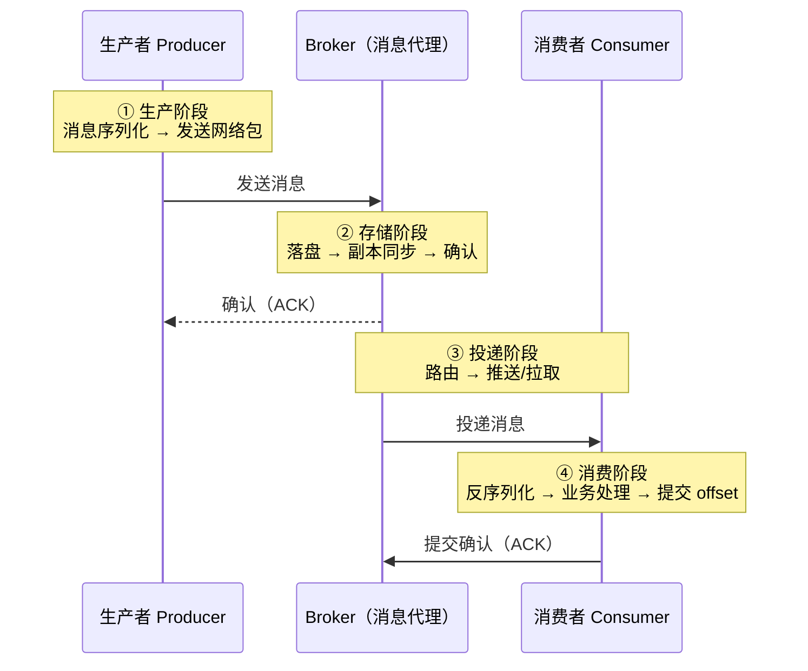

消息在全链路上可能遭遇以下故障：

| 环节 | 故障类型 | 表现 | 后果 |
|------|---------|------|------|
| 生产者 → Broker | 网络超时 | 消息发出但未收到 ACK | 消息丢失（不重试）或重复（重试） |
| Broker 存储 | 磁盘写入失败 | 消息写入内存但未落盘 | Broker 崩溃后消息丢失 |
| Broker → Broker | 副本同步延迟 | Leader 写入成功但 Follower 未同步 | Leader 故障时数据丢失 |
| Broker → 消费者 | 网络超时 | 消息已推送但 ACK 未返回 | 消息重复投递 |
| 消费者处理 | 处理异常 | 消息已消费但未提交 offset | 消息重复消费 |

**消息可靠性的本质是：在每个可能出错的环节，设计相应的保障机制，将丢失率降到业务可接受的范围内。**

---

### 2.2 生产者可靠性机制

生产者是消息的源头。生产者环节的可靠性要回答两个问题：消息有没有成功写入 Broker？写入失败了怎么办？

#### 2.2.1 ACK 确认机制：acks 参数

`acks` 是控制生产者可靠性的最核心参数，它决定了 Producer 在写入消息后需要等待多少个 Broker 副本确认才算"写入成功"：

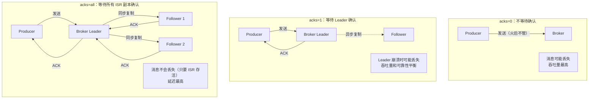

| acks 值 | 含义 | 消息丢失风险 | 延迟影响 | 适用场景 |
|---------|------|-------------|---------|---------|
| `0` | Producer 发送后不等待任何确认 | 高（网络故障/Broker 崩溃即丢失） | 极低 | 日志收集、监控指标等允许丢数据的场景 |
| `1` | 等待 Leader Partition 写入成功 | 中（Leader 崩溃且 Follower 未同步时丢失） | 低 | 一般业务消息，可接受少量丢失 |
| `all` / `-1` | 等待所有 ISR 副本写入成功 | 极低（仅 ISR 全部崩溃时丢失） | 高 | 金融交易、订单处理等关键业务 |

**Kafka 配置示例：**

```python
from kafka import KafkaProducer

# 高可靠性配置
producer = KafkaProducer(
    bootstrap_servers=['kafka1:9092', 'kafka2:9092', 'kafka3:9092'],
    acks='all',                    # 等待所有 ISR 副本确认
    retries=3,                     # 失败重试 3 次
    enable_idempotence=True,       # 开启幂等性
    max_in_flight_requests_per_connection=5,  # 幂等下允许 5 个并发
    delivery_timeout_ms=120000,    # 投递超时 2 分钟
    request_timeout_ms=30000,      # 单次请求超时 30 秒
)
```

**RabbitMQ 配置示例：**

```python
import pika

connection = pika.BlockingConnection(pika.ConnectionParameters('localhost'))
channel = connection.channel()

# 1. 声明持久化队列
channel.queue_declare(queue='reliable_queue', durable=True)

# 2. 发布持久化消息 + Publisher Confirm
channel.confirm_delivery()  # 开启发布确认

try:
    channel.basic_publish(
        exchange='',
        routing_key='reliable_queue',
        body=b'important message',
        properties=pika.BasicProperties(
            delivery_mode=2,  # 持久化消息（写入磁盘）
        ),
        mandatory=True  # 无法路由时返回给生产者
    )
    print("消息发送成功并已确认")
except pika.exceptions.UnroutableError:
    print("消息无法路由到任何队列")
except pika.exceptions.NackError:
    print("消息被 Broker 拒绝")
```

#### 2.2.2 重试与退避策略

当 Producer 发送消息失败时，合理的重试策略可以避免瞬时故障导致的消息丢失，同时防止重试风暴打垮 Broker：

```python
from kafka import KafkaProducer
from kafka.errors import KafkaError
import random

class ReliableProducer:
    def __init__(self, bootstrap_servers):
        self.producer = KafkaProducer(
            bootstrap_servers=bootstrap_servers,
            acks='all',
            retries=5,
            retry_backoff_ms=100,          # 基础退避间隔 100ms
            retry_backoff_max_ms=30000,    # 最大退避间隔 30s
            enable_idempotence=True,
        )
        self.send_counts = {}  # 追踪每条消息的发送次数

    def send_with_retry(self, topic, key, value, max_retries=3):
        """带指数退避的发送逻辑"""
        for attempt in range(max_retries):
            future = self.producer.send(topic, key=key, value=value)
            try:
                metadata = future.get(timeout=10)
                print(f"发送成功: partition={metadata.partition}, offset={metadata.offset}")
                return True
            except KafkaError as e:
                wait_time = min(1000 * (2 ** attempt) + random.randint(0, 1000), 30000)
                print(f"发送失败(第{attempt+1}次): {e}, {wait_time}ms 后重试")
                import time
                time.sleep(wait_time / 1000)

        print(f"发送失败，已重试 {max_retries} 次，消息将被记录到本地")
        self._save_to_local_queue(topic, key, value)
        return False

    def _save_to_local_queue(self, topic, key, value):
        """将发送失败的消息保存到本地，防止丢失"""
        # 实际项目中可写入本地数据库或磁盘文件
        # 等待 Broker 恢复后再重放
        pass
```

**重试策略要点：**

| 策略 | 说明 | 为什么重要 |
|------|------|-----------|
| 指数退避 | 重试间隔指数增长：100ms → 200ms → 400ms → ... | 避免多个 Producer 同时重试造成"惊群效应" |
| 抖动（Jitter） | 在退避时间上加随机偏移 | 打散重试时间点，平滑 Broker 压力 |
| 最大重试次数 | 限制重试上限，避免无限循环 | 防止消息卡在重试中消耗资源 |
| 最大退避上限 | 退避时间不超过 30s | 避免单条消息等待过久 |
| 本地兜底 | 重试耗尽后写入本地存储 | 最后一道防线，防止消息彻底丢失 |

#### 2.2.3 幂等生产者（Idempotent Producer）

**问题**：Producer 发送消息后收到超时错误，它不知道消息是否已写入 Broker。如果重试，同一条消息可能被写入多次。

**解决方案**：Kafka 0.11+ 引入幂等 Producer，通过 PID（Producer ID）+ Sequence Number（序列号）机制，让 Broker 能识别并丢弃重复消息：

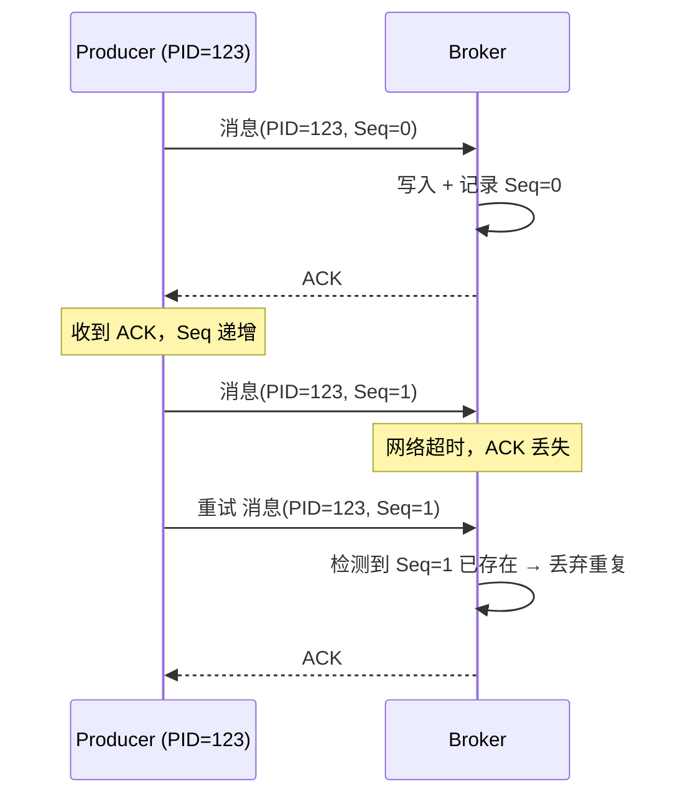

**幂等性的工作原理：**

1. Broker 为每个 Producer 分配唯一的 PID（Producer ID）
2. Producer 为每条消息分配递增的 Sequence Number
3. Broker 为每个 `<PID, Partition>` 组合维护最新的 Sequence Number
4. 收到消息时，如果 Sequence Number == 上次的 + 1，正常写入；如果 <= 上次的，判定为重复消息并丢弃

**配置方式：**

```python
producer = KafkaProducer(
    bootstrap_servers=['localhost:9092'],
    enable_idempotence=True,  # 开启幂等
    # 开启幂等后，以下参数会自动调整：
    # acks 默认变为 'all'
    # retries 默认变为 Integer.MAX_VALUE
    # max.in.flight.requests.per.connection 默认变为 5
)
```

**幂等 Producer 的限制：**
- 仅保证**单个 Partition** 内的幂等性，不保证跨 Partition
- PID 在 Producer 重启后会改变，因此幂等性不跨重启
- 不幂等消息（同一消息发送多次本身就是业务需求）不适用

#### 2.2.4 事务消息（Transactional Message）

幂等 Producer 解决了"单条消息不重复"的问题，但更复杂的场景是"一批操作要么全部成功，要么全部失败"。例如：从 Topic A 消费消息，处理后写入 Topic B，同时提交消费 offset——这三步需要原子性。

**Kafka 事务机制：**

```java
Properties props = new Properties();
props.put("bootstrap.servers", "kafka1:9092,kafka2:9092,kafka3:9092");
props.put("transactional.id", "order-processor-tx-1");  // 全局唯一事务 ID
props.put("enable.idempotence", true);

KafkaProducer<String, String> producer = new KafkaProducer<>(props);
KafkaConsumer<String, String> consumer = new KafkaConsumer<>(consumerProps);

producer.initTransactions();

try {
    while (true) {
        ConsumerRecords<String, String> records = consumer.poll(Duration.ofMillis(100));

        producer.beginTransaction();
        try {
            for (ConsumerRecord<String, String> record : records) {
                // 处理消息
                String result = processRecord(record.value());
                // 写入输出 Topic
                producer.send(new ProducerRecord<>("output-topic", record.key(), result));
            }
            // 在事务内提交消费 offset
            producer.sendOffsetsToTransaction(
                currentOffsets(records), consumer.groupMetadata()
            );
            producer.commitTransaction();
        } catch (Exception e) {
            producer.abortTransaction();
            // offset 不提交，消息会被重新消费
        }
    }
}
```

**RocketMQ 事务消息（半消息模式）：**

RocketMQ 的事务消息采用"半消息 + 事务回查"的两阶段设计，解决"本地事务与消息发送的原子性"问题：

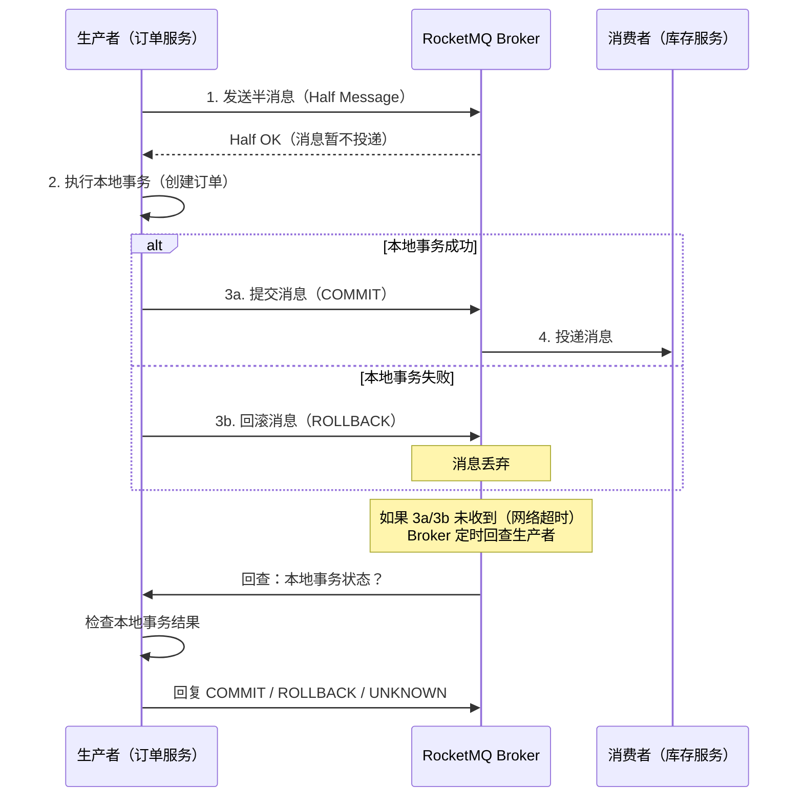

```java
// RocketMQ 事务消息示例
DefaultMQProducer producer = new DefaultMQProducer("tx_producer");
producer.start();

// 1. 发送半消息
Message msg = new Message("OrderTopic", "order_created",
    orderId.getBytes(Remotefields.DEFAULT_CHARSET));
msg.addProperty("orderId", orderId);

// 使用 TransactionMQProducer
TransactionMQProducer txProducer = new TransactionMQProducer("tx_group");
txProducer.setTransactionListener(new TransactionListener() {
    @Override
    public LocalTransactionState executeLocalTransaction(Message msg, Object arg) {
        try {
            // 执行本地事务：创建订单
            orderService.createOrder(orderId);
            return LocalTransactionState.COMMIT_MESSAGE;
        } catch (Exception e) {
            return LocalTransactionState.ROLLBACK_MESSAGE;
        }
    }

    @Override
    public LocalTransactionState checkLocalTransaction(MessageExt msg) {
        // Broker 回查时，检查本地事务状态
        Order order = orderService.getOrder(orderId);
        if (order != null) {
            return LocalTransactionState.COMMIT_MESSAGE;
        }
        return LocalTransactionState.UNKNOW;  // 不确定，等下次回查
    }
});

SendResult result = txProducer.sendMessageInTransaction(msg, null);
```

**Kafka 事务 vs RocketMQ 事务 对比：**

| 维度 | Kafka 事务 | RocketMQ 事务消息 |
|------|-----------|------------------|
| 解决的问题 | 消费→处理→生产的原子性 | 本地事务→消息发送的原子性 |
| 实现方式 | transactional.id + PID | 半消息 + 事务回查 |
| 适用场景 | 流处理（consume-transform-produce） | 订单/库存/支付等业务事务 |
| 隔离性 | 读未提交（可以读到事务中未提交的消息） | 消息在 COMMIT 前不可见 |
| 回查机制 | 无（依赖 transactional.id 的 Fencing） | Broker 定时回查生产者 |

#### 2.2.5 Outbox 模式：数据库与消息的原子性

**问题**：许多业务需要同时"写数据库 + 发消息"，但数据库事务和消息发送无法在同一个 ACID 事务中完成。

**解决方案**：Transactional Outbox（事务性发件箱）模式——将消息写入数据库的 Outbox 表（在同一个本地事务中），然后由后台进程从 Outbox 表读取消息并发送到消息队列。

```python
import json

class OutboxPattern:
    """事务性发件箱模式"""

    def create_order_with_event(self, order_data):
        """在同一个数据库事务中写入业务数据和 Outbox 消息"""
        with self.db.transaction():
            # 1. 写入业务表
            order_id = self.db.execute(
                "INSERT INTO orders (user_id, amount, status) VALUES (?, ?, ?)",
                [order_data['user_id'], order_data['amount'], 'created']
            ).lastrowid

            # 2. 写入 Outbox 表（同一事务！）
            event = json.dumps({
                "event_type": "order_created",
                "order_id": order_id,
                "user_id": order_data['user_id'],
                "amount": order_data['amount'],
                "timestamp": datetime.now().isoformat()
            })
            self.db.execute(
                "INSERT INTO outbox (id, event_type, payload, status, created_at) "
                "VALUES (?, 'order_created', ?, 'pending', NOW())",
                [str(uuid.uuid4()), event]
            )
            # 事务提交：业务数据和 Outbox 消息要么同时成功，要么同时失败

    def poll_and_publish(self):
        """后台进程：轮询 Outbox 表，发送到消息队列"""
        while True:
            events = self.db.execute(
                "SELECT id, payload FROM outbox WHERE status='pending' "
                "ORDER BY created_at LIMIT 100"
            ).fetchall()

            for event in events:
                try:
                    self.producer.send('order-events', value=event['payload'].encode())
                    self.db.execute(
                        "UPDATE outbox SET status='sent' WHERE id=?", [event['id']]
                    )
                except Exception as e:
                    # 发送失败，下次重试
                    log.error(f"Outbox 发送失败: {e}")

            time.sleep(0.5)  # 500ms 轮询间隔
```

**Outbox 模式的变体——CDC（Change Data Capture）：**

与其轮询 Outbox 表，更高效的方式是监听数据库的 binlog（MySQL）或 WAL（PostgreSQL），实时捕获 Outbox 表的变更：

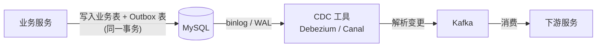

CDC 模式的优势：零轮询延迟、无额外数据库压力、天然保证顺序性。

---

### 2.3 Broker 可靠性机制

Broker 是消息队列的心脏，它的可靠性直接决定了消息是否能在宕机、磁盘故障等场景下存活。

#### 2.3.1 消息持久化

消息持久化是 Broker 可靠性的基础。不同消息队列的持久化策略差异很大：

| 消息队列 | 持久化策略 | 存储介质 | 特点 |
|---------|-----------|---------|------|
| **Kafka** | 顺序追加写入磁盘 + OS Page Cache | 磁盘（SSD/HDD） | 利用顺序写性能（600MB/s），Page Cache 加速读 |
| **RabbitMQ** | 内存 + 磁盘（可配置） | 内存为主，可选磁盘 | 消费后删除，不保留历史 |
| **RocketMQ** | CommitLog（顺序写）+ ConsumeQueue（索引） | 磁盘 | 所有 Topic 共享 CommitLog，利用顺序写 |
| **Pulsar** | BookKeeper（独立存储层） | Bookie 节点磁盘 | 计算存储分离，可独立扩缩 |

**Kafka 的持久化细节：**

消息写入流程：
1. Producer 发送消息到 Leader Partition
2. Leader 将消息追加到内存缓冲区（Records Batch）
3. 一批消息（batch.size 达到或 linger.ms 超时）刷写到 Page Cache
4. Follower 从 Leader 拉取数据，写入自己的 Page Cache
5. OS 异步将 Page Cache 刷写到磁盘（由 flush.ms 控制）

关键参数：
- log.flush.interval.messages: 每 N 条消息强制刷盘
- log.flush.interval.ms: 每 N 毫秒强制刷盘
- default.replication.min.insync.replicas: 最少同步副本数

**RabbitMQ 的持久化三要素：**

```python
# 要保证 RabbitMQ 消息不丢失，需要三个环节都持久化：

# 1. 队列持久化
channel.queue_declare(queue='durable_queue', durable=True)

# 2. 消息持久化
channel.basic_publish(
    exchange='',
    routing_key='durable_queue',
    body=b'message',
    properties=pika.BasicProperties(delivery_mode=2)  # delivery_mode=2 表示持久化
)

# 3. 消费者 ACK（不在持久化环节，但在可靠性中不可或缺）
channel.basic_qos(prefetch_count=1)
channel.basic_consume(queue='durable_queue', on_message_callback=callback)
# callback 中手动调用 ch.basic_ack()
```

> **RabbitMQ 的关键认知**：即使队列和消息都设为持久化，如果消费者设置了 `auto_ack=True`，消息在投递时就被确认并从队列删除，此时消费者崩溃会导致消息丢失。持久化只保证 Broker 重启后消息还在，消费者 ACK 保证消息被正确处理后才删除。

#### 2.3.2 副本复制机制

副本复制是 Broker 高可用和数据可靠性的核心手段。以 Kafka 的 ISR（In-Sync Replicas）机制为例：

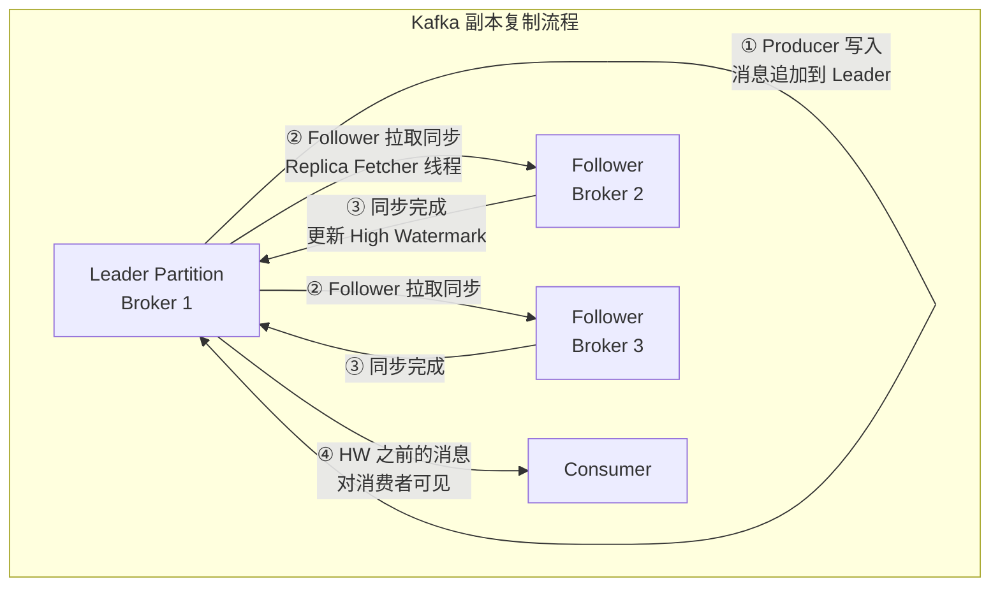

**ISR 机制详解：**

ISR（In-Sync Replicas）是与 Leader 保持同步的副本集合。关键参数：

| 参数 | 默认值 | 说明 |
|------|-------|------|
| `replication.factor` | 1 | 每个 Partition 的副本总数（含 Leader） |
| `min.insync.replicas` | 1 | 最少同步副本数。如果 ISR 中副本数 < 此值，Broker 拒绝写入 |
| `replica.lag.time.max.ms` | 30000 | Follower 超过此时间未同步，被移出 ISR |
| `unclean.leader.election.enable` | false | 是否允许非 ISR 副本竞选 Leader（开启可提高可用性但可能丢数据） |

**高可靠性配置组合：**

# 最高可靠性：acks=all + min.insync.replicas=2 + replication.factor=3
# 含义：至少 2 个副本同步成功才算写入成功，最多允许 1 个副本故障

acks=all
min.insync.replicas=2
replication.factor=3
unclean.leader.election.enable=false

**High Watermark（高水位线）与数据可见性：**

Leader Partition 0:
┌──────┬──────┬──────┬──────┬──────┬──────┬──────┐
│ m[0] │ m[1] │ m[2] │ m[3] │ m[4] │ m[5] │ m[6] │
└──────┴──────┴──────┴──────┴──────┴──────┴──────┘
                                    ↑
                              High Watermark = 5
                    ←── Consumer 可见区域 ──→
                    m[5] 之后的消息对 Consumer 不可见

原因：m[5]、m[6] 尚未被所有 ISR 副本同步
当 Follower 同步到 m[5]，HW 推进到 6

#### 2.3.3 RabbitMQ 的镜像队列与仲裁队列

RabbitMQ 通过两种机制实现 Broker 层面的高可用：

**镜像队列（Mirrored Queues，经典方案）：**

┌─────────────────────────────────────────────┐
│             RabbitMQ Cluster                  │
│                                              │
│  Node 1 (Master)    Node 2 (Mirror)         │
│  ┌──────────────┐   ┌──────────────┐        │
│  │ Queue-A      │ ←→│ Queue-A      │        │
│  │ (Master)     │   │ (Mirror)     │        │
│  └──────────────┘   └──────────────┘        │
│                                              │
│  所有操作先在 Master 执行，再同步到 Mirror     │
│  Master 故障时，Mirror 自动提升为 Master       │
└─────────────────────────────────────────────┘

**仲裁队列（Quorum Queues，推荐方案，RabbitMQ 3.8+）：**

仲裁队列基于 Raft 一致性协议，比镜像队列更可靠、性能更好：

┌─────────────────────────────────────────────┐
│             RabbitMQ Cluster                  │
│                                              │
│  使用 Raft 协议的多数派写入                     │
│                                              │
│  Node 1 ──┐                                 │
│  Node 2 ──┼── Quorum Queue (3 节点)          │
│  Node 3 ──┘                                 │
│                                              │
│  写入需要多数节点确认（2/3）                    │
│  1 个节点故障不影响服务                         │
└─────────────────────────────────────────────┘

```python
# 声明仲裁队列
channel.queue_declare(
    queue='quorum_queue',
    durable=True,
    arguments={
        'x-queue-type': 'quorum',           # 使用仲裁队列
        'x-quorum-initial-group-size': 3,   # 3 个节点
    }
)
```

---

### 2.4 消费者可靠性机制

消费者是消息链路的最后一环。消息到了消费者手里，如果处理不当，前面所有环节的可靠性保证都会功亏一篑。

#### 2.4.1 手动提交 offset

消费者可靠性的第一原则：**永远关闭自动提交，手动控制 offset 提交时机**。

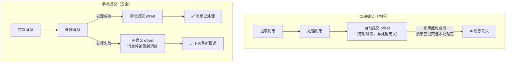

```python
from kafka import KafkaConsumer

consumer = KafkaConsumer(
    'order-topic',
    bootstrap_servers=['kafka1:9092', 'kafka2:9092'],
    group_id='order-processor',
    enable_auto_commit=False,     # 关闭自动提交
    auto_offset_reset='earliest', # 从最早消息开始消费
    max_poll_records=10,          # 每次最多拉取 10 条
    max_poll_interval_ms=300000,  # 消费者处理超时 5 分钟
)

# 方式一：逐条提交（精确，但性能较低）
for message in consumer:
    try:
        process_message(message.value)
        # 单条提交：只提交已成功处理的消息的 offset
        consumer.commit({
            'topic': message.topic,
            'partition': message.partition,
            'offset': message.offset + 1  # 提交的是"下一条待消费"的 offset
        })
    except Exception as e:
        log.error(f"处理失败: {e}, 消息: {message.value}")
        # 不提交 → 下次从这条消息重新消费

# 方式二：批量提交（性能更好，但有重复风险）
while True:
    messages = consumer.poll(timeout_ms=1000)
    for tp, records in messages.items():
        last_record = None
        for record in records:
            try:
                process_message(record.value)
                last_record = record
            except Exception as e:
                log.error(f"处理失败: {e}")
                break  # 跳过后续消息，停止本批次提交

        if last_record:
            consumer.commit({
                'topic': last_record.topic,
                'partition': last_record.partition,
                'offset': last_record.offset + 1
            })
```

**RabbitMQ 的手动确认：**

```python
import pika

def reliable_consume(channel, queue_name):
    """可靠消费模式"""
    channel.basic_qos(prefetch_count=1)  # 每次只取 1 条

    def callback(ch, method, properties, body):
        try:
            # 处理消息
            process_message(body)

            # 处理成功 → 手动 ACK
            ch.basic_ack(delivery_tag=method.delivery_tag)
            print("消息处理成功，已确认")

        except Exception as e:
            print(f"处理失败: {e}")
            # 处理失败 → NACK + 不重新入队（发送到死信队列）
            ch.basic_nack(
                delivery_tag=method.delivery_tag,
                requeue=False  # 不重新入队，交给死信队列处理
            )

    channel.basic_consume(queue=queue_name, on_message_callback=callback)
    channel.start_consuming()
```

**ACK/NACK/Reject 的区别：**

| 方法 | 说明 | 消息去向 | 适用场景 |
|------|------|---------|---------|
| `basic_ack` | 确认消费成功 | 从队列删除 | 正常处理完毕 |
| `basic_nack(requeue=True)` | 拒绝，重新入队 | 回到队列尾部 | 临时处理失败（如资源不足），稍后重试 |
| `basic_nack(requeue=False)` | 拒绝，不重新入队 | 发送到死信队列 | 消息格式错误、超过重试次数 |
| `basic_reject` | 拒绝单条消息 | 同 nack | 旧版 API，功能被 nack 覆盖 |

#### 2.4.2 消费幂等性

在 At-Least-Once 语义下，消息重复消费是必然发生的。消费端必须通过幂等性保证，让重复消息不影响业务正确性。

**六种消费幂等性方案：**

```python
import redis
import hashlib
import json

class IdempotentConsumer:
    """消费端幂等性方案集合"""

    def __init__(self, redis_client, db):
        self.redis = redis_client
        self.db = db

    # 方案一：基于消息 ID 去重（最通用）
    def process_with_msg_id(self, message):
        msg_id = message['msg_id']

        # SETNX 原子性检查+设置
        if not self.redis.set(f"processed:{msg_id}", "1", nx=True, ex=86400 * 7):
            print(f"消息已处理，跳过: {msg_id}")
            return

        # 执行业务逻辑
        self.do_business(message)

    # 方案二：基于数据库唯一约束
    def process_with_unique_constraint(self, message):
        msg_id = message['msg_id']
        try:
            self.db.execute(
                "INSERT INTO processed_messages (msg_id, payload, processed_at) "
                "VALUES (?, ?, NOW())",
                [msg_id, json.dumps(message)]
            )
            # 唯一约束冲突 → 消息已处理
            self.do_business(message)
        except DuplicateKeyError:
            print(f"消息已处理（唯一约束）: {msg_id}")

    # 方案三：基于状态机
    def process_with_state_machine(self, message):
        order_id = message['order_id']
        new_status = message['target_status']

        # 只在状态转换合法时执行
        affected = self.db.execute(
            "UPDATE orders SET status = ? "
            "WHERE id = ? AND status = ?",
            [new_status, order_id, message['current_status']]
        ).rowcount

        if affected == 0:
            print(f"状态不匹配，消息已过期: {order_id}")
            return  # 幂等：状态已经是目标值，无需再处理

    # 方案四：基于乐观锁（版本号）
    def process_with_optimistic_lock(self, message):
        resource_id = message['resource_id']
        expected_version = message['version']

        affected = self.db.execute(
            "UPDATE resources SET balance = balance - ?, version = version + 1 "
            "WHERE id = ? AND version = ?",
            [message['amount'], resource_id, expected_version]
        ).rowcount

        if affected == 0:
            print(f"版本冲突，资源已被修改: {resource_id}")

    # 方案五：基于 Redis INCR（计数器场景）
    def process_with_counter(self, message):
        key = f"counter:{message['user_id']}:{message['date']}"
        count = self.redis.incr(key)
        self.redis.expire(key, 86400 * 30)  # 30 天过期
        print(f"用户 {message['user_id']} 今日访问次数: {count}")

    # 方案六：基于 Token 的预检查
    def process_with_token(self, message):
        """下单前先获取 Token，下单时校验 Token"""
        token = message.get('idempotency_token')
        if token:
            # 删除并返回（原子操作）
            if self.redis.delete(f"token:{token}") == 0:
                print(f"Token 已使用，跳过重复请求")
                return
        self.do_business(message)
```

**幂等方案选择指南：**

| 方案 | 适用场景 | 优点 | 缺点 |
|------|---------|------|------|
| 消息 ID 去重 | 通用 | 实现简单，Redis SETNX 性能高 | 需要存储已处理 ID，有 TTL |
| 数据库唯一约束 | 写数据库场景 | 利用 DB 索引，无需额外存储 | 每次写入都有唯一索引检查 |
| 状态机 | 有明确状态流转的业务 | 天然幂等，无需额外存储 | 仅适用于状态更新类操作 |
| 乐观锁 | 更新操作 | 防止并发覆盖 | 无法防止所有重复 |
| Redis 计数器 | 计数/统计场景 | 极高性能 | 仅适用于计数类操作 |
| Token 预检查 | 创建类操作 | 精确防重 | 需要预分配 Token |

#### 2.4.3 消费失败重试策略

消费失败后如何重试，直接影响消息可靠性和系统稳定性：

```python
import time
import json

class RetryableConsumer:
    """支持指数退避重试的消费者"""

    MAX_RETRIES = 5
    RETRY_DELAYS = [1, 5, 30, 120, 600]  # 秒：1s, 5s, 30s, 2min, 10min

    def process_with_retry(self, message):
        retry_count = self._get_retry_count(message)

        if retry_count >= self.MAX_RETRIES:
            # 超过最大重试次数 → 发送到死信队列
            self._send_to_dlq(message, reason="超过最大重试次数")
            return

        try:
            self.do_business(message)
            # 成功 → 清除重试计数
            self._clear_retry_count(message)
        except TransientError as e:
            # 可恢复的错误（网络超时、资源不足等）→ 延迟重试
            delay = self.RETRY_DELAYS[retry_count]
            print(f"第 {retry_count + 1} 次处理失败，{delay}s 后重试: {e}")
            self._increment_retry_count(message)
            time.sleep(delay)
            self.process_with_retry(message)

        except PermanentError as e:
            # 不可恢复的错误（数据格式错误、业务规则违反等）→ 直接进死信队列
            self._send_to_dlq(message, reason=str(e))

    def _get_retry_count(self, message):
        """从消息 header 获取重试次数"""
        return message.headers.get('x-retry-count', 0)

    def _send_to_dlq(self, message, reason):
        """发送到死信队列"""
        dlq_message = {
            'original_topic': message.topic,
            'original_key': message.key,
            'original_value': message.value,
            'failure_reason': reason,
            'retry_count': self._get_retry_count(message),
            'timestamp': datetime.now().isoformat(),
            'consumer_group': 'order-processor',
        }
        self.producer.send('order-events.DLQ', value=json.dumps(dlq_message).encode())
        print(f"消息已发送到死信队列: {reason}")
```

**错误分类与处理策略：**

| 错误类型 | 特征 | 处理策略 | 示例 |
|---------|------|---------|------|
| 瞬时错误 | 临时性，可恢复 | 指数退避重试 | 网络超时、数据库连接池耗尽 |
| 业务错误 | 消息本身有问题 | 跳过或发送到死信队列 | 数据格式错误、业务规则违反 |
| 系统错误 | 依赖服务不可用 | 重试 + 告警 | 下游服务宕机、配置缺失 |
| 资源错误 | 资源不足 | 限流 + 延迟重试 | 内存不足、磁盘满 |

---

### 2.5 三大投递语义：可靠性与性能的权衡

消息投递语义（Delivery Semantics）是衡量消息队列可靠性的核心框架。三种语义代表了"不丢"和"不重"之间的不同权衡：

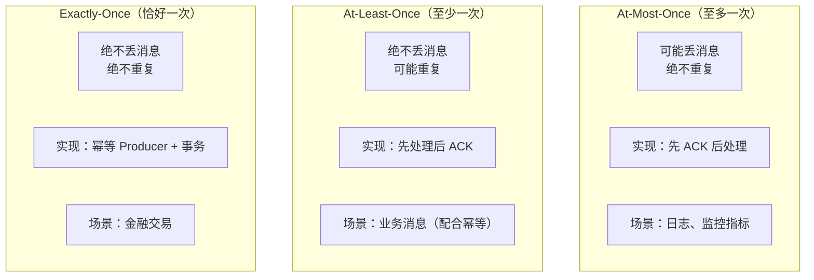

#### 2.5.1 At-Most-Once（至多一次）

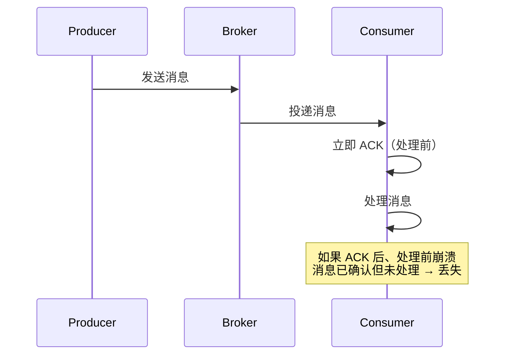

**实现方式：**
- Kafka：`enable.auto.commit=True`，自动提交 offset（可能在处理前就提交了）
- RabbitMQ：`auto_ack=True`，收到消息即确认

**At-Most-Once 的代价：** 消息可能丢失。自动提交的时机不确定——如果在消息处理之前提交了 offset，而消费者随后崩溃，消息就丢了。

```python
# At-Most-Once 的 Kafka 配置（不推荐用于关键业务）
consumer = KafkaConsumer(
    'metrics-topic',
    bootstrap_servers=['localhost:9092'],
    enable_auto_commit=True,    # 自动提交
    auto_commit_interval_ms=1000  # 每秒提交一次
)
```

#### 2.5.2 At-Least-Once（至少一次）

这是**工程中最常用的投递语义**，在可靠性和实现复杂度之间取得了最佳平衡。

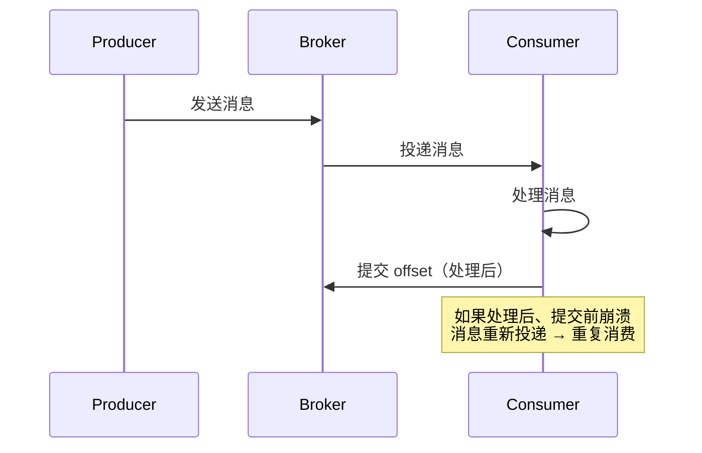

**At-Least-Once 的保证：** 消息绝不丢失，但可能重复。重复消费通过消费端幂等性来解决。

**完整示例（Kafka At-Least-Once + 幂等消费）：**

```python
from kafka import KafkaConsumer
import redis
import json

# 初始化
consumer = KafkaConsumer(
    'order-topic',
    bootstrap_servers=['kafka1:9092'],
    group_id='order-processor',
    enable_auto_commit=False,
    auto_offset_reset='earliest',
)
redis_client = redis.Redis(host='localhost', port=6379, db=0)

for message in consumer:
    msg_id = json.loads(message.value).get('msg_id')

    # 幂等检查：Redis SETNX
    if redis_client.get(f"processed:{msg_id}"):
        consumer.commit()  # 虽然跳过处理，仍需提交 offset
        continue

    try:
        # 处理业务
        process_order(message.value)

        # 处理成功 → 标记已处理 + 提交 offset（原子操作尽量靠近）
        redis_client.setex(f"processed:{msg_id}", 86400 * 7, "1")
        consumer.commit()
        print(f"✅ 消息处理成功: {msg_id}")

    except Exception as e:
        log.error(f"❌ 消息处理失败: {e}")
        # 不提交 offset，消息会被重新投递（At-Least-Once）
```

#### 2.5.3 Exactly-Once（恰好一次）

Exactly-Once 是最理想的语义，但实现代价最高。严格意义上的端到端 Exactly-Once 在分布式系统中是不可能的（受 FLP 不可能定理约束），但可以通过"在特定边界内"实现近似 Exactly-Once。

**Kafka 的 Exactly-Once 实现路径：**

Kafka Exactly-Once = 幂等 Producer（单 Partition 不重复）
                   + 事务（跨 Partition 原子写入）
                   + 事务消费（consume-transform-produce 的原子性）

注意边界：
✅ Producer → Broker：同一条消息不重复写入（单 Partition 内）
✅ 事务消费：消费→处理→生产→提交 offset 作为原子操作
❌ 跨系统：Kafka 事务无法覆盖 Kafka 之外的系统（如数据库写入）

```java
// Kafka 端到端 Exactly-Once 示例（流处理场景）
Properties consumerProps = new Properties();
consumerProps.put("group.id", "exactly-once-group");
consumerProps.put("enable.auto.commit", false);

Properties producerProps = new Properties();
producerProps.put("transactional.id", "eos-processor-v1");
producerProps.put("enable.idempotence", true);

KafkaConsumer<String, String> consumer = new KafkaConsumer<>(consumerProps);
KafkaProducer<String, String> producer = new KafkaProducer<>(producerProps);

consumer.subscribe(Arrays.asList("input-topic"));
producer.initTransactions();

while (true) {
    ConsumerRecords<String, String> records = consumer.poll(Duration.ofMillis(100));
    if (records.isEmpty()) continue;

    producer.beginTransaction();
    try {
        for (ConsumerRecord<String, String> record : records) {
            // 处理并发送到输出 Topic
            String result = transform(record.value());
            producer.send(new ProducerRecord<>("output-topic", record.key(), result));
        }

        // 在事务内提交消费 offset
        Map<TopicPartition, OffsetAndMetadata> offsets = new HashMap<>();
        for (TopicPartition tp : records.partitions()) {
            List<ConsumerRecord<String, String>> partitionRecords = records.records(tp);
            long lastOffset = partitionRecords.get(partitionRecords.size() - 1).offset();
            offsets.put(tp, new OffsetAndMetadata(lastOffset + 1));
        }
        producer.sendOffsetsToTransaction(offsets, consumer.groupMetadata());
        producer.commitTransaction();

    } catch (Exception e) {
        producer.abortTransaction();
    }
}
```

**三种语义综合对比：**

| 维度 | At-Most-Once | At-Least-Once | Exactly-Once |
|------|-------------|---------------|-------------|
| 消息丢失 | ✅ 可能丢失 | ❌ 不会丢失 | ❌ 不会丢失 |
| 消息重复 | ❌ 不会重复 | ✅ 可能重复 | ❌ 不会重复 |
| 实现复杂度 | 低 | 中 | 高 |
| 性能影响 | 最小 | 小 | 大（事务开销） |
| 需要幂等 | 不需要 | 需要（消费端） | 需要（Broker 端） |
| 典型场景 | 日志、指标 | 大多数业务场景 | 金融交易、精确计费 |
| Kafka 配置 | `enable.auto.commit=true` | `enable.auto.commit=false` | 事务 Producer + 消费 |

---

### 2.6 死信队列：可靠性的最后一道防线

死信队列（Dead Letter Queue, DLQ）不是可靠性机制本身，而是可靠性体系中的"安全网"。当消息经过所有重试仍然失败后，DLQ 确保消息不会被悄悄丢弃，而是被保存下来等待人工处理。

#### 2.6.1 死信队列的触发条件

| 触发条件 | Kafka | RabbitMQ | RocketMQ |
|---------|-------|----------|----------|
| 消费失败超过最大重试次数 | 应用层实现 | `basic.nack(requeue=False)` | 消费重试次数超限（默认 16 次） |
| 消息 TTL 过期 | 不原生支持 | `x-message-ttl` 到期 | 消息级别 TTL |
| 队列达到最大长度 | 不原生支持 | `x-max-length` 溢出 | 不原生支持 |
| 消息格式无法解析 | 应用层实现 | 应用层实现 | 应用层实现 |

#### 2.6.2 死信队列的设计模式

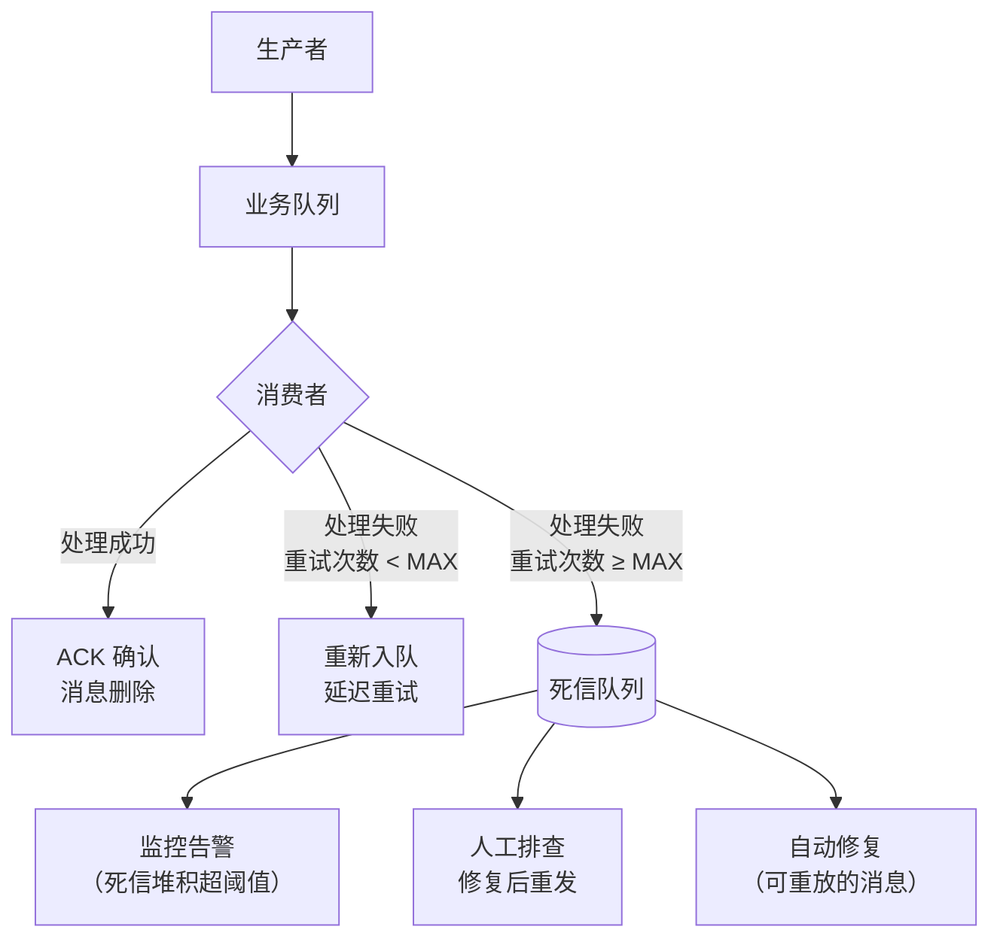

**完整的死信队列实现：**

```python
import json
import time

class DLQEnabledConsumer:
    """带死信队列的可靠消费者"""

    MAX_RETRIES = 3
    RETRY_DELAYS = [5, 30, 120]  # 秒

    def __init__(self, producer, consumer, redis_client):
        self.producer = producer
        self.consumer = consumer
        self.redis = redis_client

    def consume(self, message):
        retry_key = f"retry:{message.topic}:{message.partition}:{message.offset}"
        retry_count = int(self.redis.get(retry_key) or 0)

        try:
            # 执行业务处理
            self.process_business(message.value)

            # 成功 → 清除重试计数
            self.redis.delete(retry_key)
            self.consumer.commit()

        except Exception as e:
            if retry_count >= self.MAX_RETRIES:
                # 超过重试次数 → 进入死信队列
                self._send_to_dlq(message, str(e), retry_count)
                self.redis.delete(retry_key)
                self.consumer.commit()  # 从主队列移除
            else:
                # 未超限 → 记录重试次数，延迟后重新消费
                self.redis.setex(retry_key, 3600, retry_count + 1)
                self.consumer.commit()  # 先提交，由重试逻辑重新发送
                self._schedule_retry(message, self.RETRY_DELAYS[retry_count])

    def _send_to_dlq(self, message, error_reason, retry_count):
        """发送到死信队列"""
        dlq_payload = {
            'original_message': message.value.decode('utf-8'),
            'original_topic': message.topic,
            'original_partition': message.partition,
            'original_offset': message.offset,
            'error_reason': error_reason,
            'retry_count': retry_count,
            'consumer_group': 'my-consumer-group',
            'timestamp': datetime.now().isoformat(),
            'headers': dict(message.headers) if message.headers else {},
        }

        self.producer.send(
            f"{message.topic}.DLQ",
            value=json.dumps(dlq_payload).encode()
        )

        # 触发告警
        if retry_count >= self.MAX_RETRIES:
            self._alert_ops(dlq_payload)

    def _alert_ops(self, dlq_payload):
        """通知运维团队"""
        print(f"⚠️ 死信告警: topic={dlq_payload['original_topic']}, "
              f"reason={dlq_payload['error_reason']}, "
              f"retries={dlq_payload['retry_count']}")
        # 实际项目中：发送到钉钉/企微/Slack/PagerDuty

    def _schedule_retry(self, message, delay_seconds):
        """延迟重试：将消息发送到延迟队列"""
        # 方案1：RocketMQ 延迟消息（推荐）
        # 方案2：Redis Sorted Set + 轮询
        # 方案3：Kafka 延迟队列（自建）
        pass
```

#### 2.6.3 死信消息的处理流程

死信消息不应该"躺"在死信队列里无人问津。设计完善的 DLQ 需要配套的处理流程：

| 步骤 | 动作 | 说明 |
|------|------|------|
| 1. 监控 | 死信队列堆积量监控 | 堆积超过阈值（如 100 条）触发告警 |
| 2. 告警 | 通知相关负责人 | 钉钉/企微/Slack 通知，附带消息详情 |
| 3. 分析 | 查看死信消息内容 | 原始消息、失败原因、重试次数 |
| 4. 修复 | 根据原因采取行动 | 修复代码 bug、修正数据格式、调整配置 |
| 5. 重发 | 修复后重新投递 | 将死信消息重新发送到业务队列 |
| 6. 清理 | 删除已处理的死信消息 | 避免死信队列无限膨胀 |

---

### 2.7 端到端可靠性：全链路 Checklist

将前面所有机制串联，一条消息从生产到消费的完整可靠性链路：

生产者端                           Broker 端                         消费者端
───────────                       ─────────                         ──────────
✅ acks=all                       ✅ 消息持久化到磁盘               ✅ 关闭自动提交
✅ 启用幂等 Producer              ✅ ISR 多副本同步                 ✅ 手动提交 offset
✅ 失败重试 + 指数退避             ✅ min.insync.replicas ≥ 2       ✅ 消费端幂等
✅ 本地兜底（Outbox）              ✅ unclean.leader.election=false  ✅ 失败重试 + 指数退避
✅ 事务消息（原子写入）             ✅ 定期数据校验                   ✅ 死信队列兜底

**按业务等级选择可靠性方案：**

| 业务等级 | 可靠性要求 | 推荐配置 | 代价 |
|---------|-----------|---------|------|
| **S 级（金融/支付）** | 零丢失、零重复 | acks=all + 事务 + 幂等 + Exactly-Once | 延迟高、吞吐低 |
| **A 级（订单/库存）** | 零丢失、允许少量重复 | acks=all + 手动提交 + 幂等消费 | 中等性能开销 |
| **B 级（通知/推荐）** | 可接受极少量丢失 | acks=1 + 手动提交 | 低性能开销 |
| **C 级（日志/指标）** | 允许丢失 | acks=0 / acks=1 + 自动提交 | 最高性能 |

---

### 2.8 主流消息队列可靠性对比

| 可靠性维度 | Kafka | RabbitMQ | RocketMQ | Pulsar |
|-----------|-------|----------|----------|--------|
| **消息持久化** | 磁盘顺序写 + Page Cache | 内存 + 磁盘（可选） | CommitLog 磁盘写入 | BookKeeper 磁盘写入 |
| **副本机制** | ISR（In-Sync Replicas） | 镜像队列 / 仲裁队列 | 同步双写（Master-Slave） | BookKeeper 多副本 |
| **生产者确认** | acks=0/1/all | Publisher Confirm | 同步/异步发送 + 重试 | Ack 确认 |
| **幂等生产者** | ✅ PID + SeqNum | ❌ 不支持 | ✅ 内置 | ✅ 支持 |
| **事务消息** | ✅ 支持 | ❌ 不原生支持 | ✅ 半消息模式（特色功能） | ✅ 支持 |
| **消费确认** | 手动提交 offset | basic_ack/nack | 手动 ACK / 自动重试 | Ack 确认 |
| **死信队列** | 应用层实现 | 原生支持（DLX） | 原生支持（重试超限） | 应用层实现 |
| **消息回溯** | ✅ 按 offset / 时间 | ❌ 消费后删除 | ✅ 按时间回溯 | ✅ 支持 |
| **端到端 Exactly-Once** | ✅ 事务消费 | ❌ | 部分支持 | 部分支持 |

**选型建议：**

- **金融/交易场景**：优先选择 RocketMQ（事务消息是杀手级特性）或 Kafka（Exactly-Once 事务消费）
- **企业级消息（路由复杂）**：RabbitMQ + 仲裁队列（Raft 协议保证副本一致性）
- **大数据/流处理**：Kafka（ISR + 事务 + Exactly-Once 是流处理的标准基础设施）
- **云原生/多租户**：Pulsar（BookKeeper 存储层天然支持多副本）

---

### 2.9 常见误区与避坑指南

| 误区 | 正确做法 | 为什么 |
|------|---------|-------|
| "设了 acks=all 就不会丢消息" | 同时设置 min.insync.replicas ≥ 2 | acks=all 只保证 ISR 内确认，如果 ISR 只有 1 个副本，Leader 故障仍会丢失 |
| "开启了幂等 Producer 就万事大吉" | 幂等只覆盖单 Partition，跨 Partition 需要事务 | 幂等 Producer 的 PID + SeqNum 是 Partition 粒度的 |
| "RabbitMQ 设了 durable=True 消息就不会丢" | 还需要 delivery_mode=2 + 手动 ACK | durable 只保证队列元数据不丢，消息和 ACK 各自需要独立设置 |
| "自动提交 offset 够用了" | 关键业务必须手动提交 | 自动提交的时机与处理结果无关，崩溃时可能丢消息或重复消费 |
| "重试越多越可靠" | 控制重试次数，配合退避和死信队列 | 无限重试会导致消息堆积，延迟越来越大，最终拖垮消费者 |
| "死信队列只是摆设" | 配套监控告警 + 人工处理流程 | 死信队列是可靠性体系的最后一道防线，需要有完整的处理流程 |
| "事务消息 = 数据库事务" | Kafka 事务只覆盖 Kafka 读写，不覆盖外部系统 | 要实现跨系统的原子性，需要 Outbox 模式 + CDC |
| "重复消费无所谓，反正处理了就行" | 重复消费可能导致资金/库存问题，必须幂等 | "处理了就行"在计数、扣款、发邮件等场景下会导致严重问题 |

---

### 2.10 小结

消息可靠性是分布式系统设计中的永恒课题。核心认知：

1. **可靠性是全链路的**：生产者、Broker、消费者三个环节任一出错，消息都可能丢失或重复。只关注某个环节是不够的
2. **没有免费的可靠性**：每提升一级可靠性，都会带来性能/延迟/复杂度的代价。根据业务等级选择合适的方案
3. **At-Least-Once + 幂等 = 最佳实践**：这是大多数业务场景的最优解，兼顾可靠性和实现复杂度
4. **Exactly-Once 有明确边界**：Kafka 事务只在 Kafka 内部有效，跨系统需要 Outbox 模式
5. **死信队列是安全网**：不是所有消息都能被成功处理，死信队列确保失败消息可追踪、可恢复
6. **监控不可少**：可靠性不只靠设计，还需要实时监控 ack 失败率、消费延迟、死信堆积等指标
