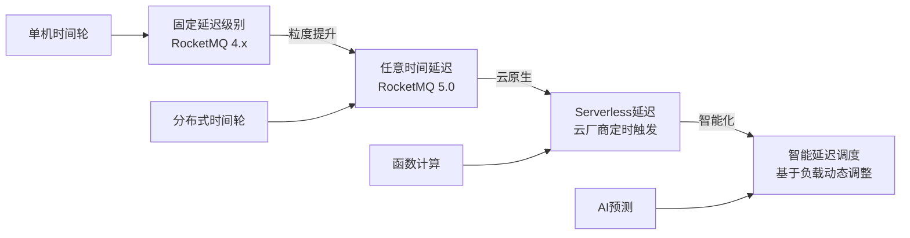

## 四、延迟消息

### 4.1 什么是延迟消息

延迟消息（Delayed Message / Scheduled Message）是指消息在发送到消息队列后，不会立即投递给消费者，而是在指定的延迟时间到达后才变为可见并被消费。延迟消息是消息队列的高级特性之一，它将"时间"维度引入了异步通信模型，使得系统能够以声明式的方式表达"在未来的某个时刻做某件事"。

延迟消息与普通消息的核心区别在于投递时机：

普通消息：
  Producer → [Broker] → Consumer（立即可见）

延迟消息：
  Producer → [Broker: 延迟队列] → Timer/Poller → [目标队列] → Consumer（延迟后可见）

#### 延迟消息的本质

从本质上看，延迟消息解决的是**时间解耦**问题。在没有延迟消息的情况下，开发者需要自己实现定时逻辑——例如在订单服务中启动一个后台线程，定期扫描超时订单。这种做法存在几个关键问题：

- **资源浪费**：轮询线程在大部分时间内处于空闲状态，白白消耗CPU和内存
- **精度受限**：轮询间隔决定了延迟精度，间隔越短系统开销越大
- **可靠性差**：进程重启后需要恢复未到期任务的状态
- **扩展性弱**：单机定时器无法扩展到集群维度

延迟消息将"何时触发"的职责下沉到消息中间件，让业务层只需声明"发送一条30分钟后生效的消息"，由Broker负责到期投递。这种模式本质上是一种**以空间换时间**的策略——Broker通过额外的存储和调度开销，换取业务层的简洁和可靠。

#### 延迟消息的典型应用场景

| 场景 | 延迟时间 | 说明 |
|------|----------|------|
| 电商订单超时取消 | 30分钟 | 用户下单未支付，30分钟后自动取消订单并释放库存 |
| 营销活动定时触发 | 自定义 | 在指定时间推送优惠券、活动提醒 |
| 会议/预约提醒 | 15分钟 | 会议开始前15分钟发送提醒通知 |
| 退订冷静期 | 7天 | 用户申请退订后7天内可撤回 |
| 延迟重试 | 指数退避 | 消费失败后延迟1s/2s/4s/8s...重试 |
| 限流缓冲 | 滑动窗口 | 在固定时间窗口内控制请求频率 |
| 数据同步延迟 | 分钟级 | 同步变更数据到下游系统时做延迟合并，减少写入频率 |
| 订阅续费提醒 | 24小时 | 会员到期前24小时发送续费提醒 |
| 审批流超时自动处理 | 48小时 | 审批人48小时未处理，自动流转到上级 |
| 日报/周报汇总 | 定时 | 到达指定时间后触发数据聚合，生成报告 |

#### 延迟消息与相关概念的辨析

| 概念 | 触发方式 | 精度 | 适用场景 |
|------|----------|------|----------|
| 延迟消息 | 发送时指定延迟时间 | 秒级~毫秒级 | 异步场景：下单后N分钟、失败后N秒重试 |
| 定时任务（Cron） | 固定时间点周期触发 | 秒级~分钟级 | 周期性任务：每天9点生成报告、每月1号结算 |
| 倒计时器 | 给定时间量开始倒数 | 毫秒级 | 实时场景：验证码过期、活动倒计时 |
| 事件驱动触发 | 外部事件触发 | 即时 | 被动响应：用户点击按钮、状态变更 |

三者可以组合使用。例如：用户下单后发送延迟消息（延迟消息），如果30分钟内未支付则触发自动取消（延迟消息到期），取消后通过定时任务在每天凌晨批量清理过期库存预留（定时任务），同时通过倒计时器在前端展示剩余支付时间（倒计时器）。

### 4.2 延迟消息的实现方案对比

不同的消息队列和中间件对延迟消息的支持程度不同，实现方案也有本质区别。以下从原生支持、延迟精度、延迟范围、性能开销四个维度进行对比：

| 方案 | 原生支持 | 延迟精度 | 最大延迟 | 性能开销 | 适用场景 |
|------|----------|----------|----------|----------|----------|
| RocketMQ 延迟级别 | ✅ 内置 | 固定18级 | 2小时 | 低 | 电商订单超时 |
| RocketMQ 5.0 延迟时间 | ✅ 内置 | 秒级 | 40天 | 低 | 精确时间调度 |
| RabbitMQ 插件 | ✅ 插件 | 秒级 | 无限制 | 中 | 需要灵活延迟的场景 |
| Kafka | ❌ 需自行实现 | 取决于方案 | 无限制 | 高 | 需配合其他组件 |
| Redis Sorted Set | 需自行实现 | 毫秒级 | 无限制 | 中 | 轻量级延迟队列 |
| 时间轮算法 | 需自行实现 | 毫秒级 | 取决于轮大小 | 极低 | 内部定时调度 |
| 数据库轮询 | 需自行实现 | 秒级 | 无限制 | 高（数据库压力） | 低吞吐、简单场景 |
| 云厂商服务 | ✅ 托管 | 秒级~分钟级 | 各异 | 低 | Serverless架构 |

#### 选型决策树

在选择延迟消息方案时，可以遵循以下决策路径：

是否使用了RocketMQ？
├── 是 → 需要任意精度延迟？
│   ├── 是 → RocketMQ 5.0（setDeliveryTimestamp）
│   └── 否 → RocketMQ 4.x（setDelayTimeLevel）
├── 否 → 延迟消息量级？
│   ├── < 1万/天 → Redis Sorted Set（实现简单）
│   ├── 1万~100万/天 → 建独立延迟服务（DB/Redis + Kafka）
│   └── > 100万/天 → RocketMQ 或 Kafka + 层级时间轮
└── 是否需要云托管？
    ├── 是 → AWS SQS Delay / 阿里云MNS
    └── 否 → 自建方案

### 4.3 RocketMQ延迟消息

RocketMQ是原生支持延迟消息的典型代表。从4.x版本的固定延迟级别到5.0版本的任意时间延迟，RocketMQ的延迟消息经历了重要演进。

#### 4.3.1 RocketMQ 4.x：固定延迟级别

RocketMQ 4.x支持18个固定的延迟级别，分别为：1s、5s、10s、30s、1m、2m、3m、4m、5m、6m、7m、8m、9m、10m、20m、30m、1h、2h。

```java
// RocketMQ 4.x 延迟消息示例
DefaultMQProducer producer = new DefaultMQProducer("delay_producer");
producer.setNamesrvAddr("localhost:9876");
producer.start();

Message msg = new Message("OrderTopic", "order_timeout",
    orderId.getBytes(Remotefields.DEFAULT_CHARSET));

// 设置延迟级别：第3级 = 10秒
msg.setDelayTimeLevel(3);
SendResult result = producer.send(msg);
System.out.println("延迟消息发送成功: " + result.getMsgId());

producer.shutdown();
```

**核心原理：延迟Level到内部Topic的映射**

RocketMQ 4.x的延迟消息并非真正的"定时"投递，而是通过延迟级别到内部Topic的映射实现的。Broker内部维护了18个延迟Topic（SCHEDULE_TOPIC_XXXX），每个延迟级别对应一个Topic。消息到达Broker后，会被写入对应的延迟Topic，每个延迟Topic有一个专门的消费线程（SCHEDULE_MESSAGE_THREAD），该线程按照固定频率检查消息是否到期，到期后将消息投递到目标Topic。

Producer 发送消息(delayTimeLevel=3, 10s)
        ↓
Broker 收到消息，写入 SCHEDULE_TOPIC_XXXX 的 Queue[2]
        ↓
SCHEDULE_MESSAGE_THREAD_2 每100ms检查一次
        ↓
消息到期后，写入目标 OrderTopic
        ↓
Consumer 从 OrderTopic 消费

**为什么是18个级别而非任意时间？**

这个设计源于RocketMQ早期的实现限制。18个级别使用18个内部Queue来存储待投递的消息，每个Queue由独立的扫描线程处理。如果支持任意时间，就需要为每条消息创建独立的定时器，这在大规模场景下会产生大量线程和上下文切换开销。固定级别的设计虽然牺牲了灵活性，但将扫描线程的数量控制在18个，保证了调度效率。

**RocketMQ 4.x延迟消息的限制**

- 只支持18个固定级别，不支持任意延迟时间
- 18个级别全部小于2小时，无法实现更长延迟
- 每个延迟级别的Queue数量固定为1，存在性能瓶颈
- 修改延迟级别需要重启Broker
- 延迟精度受扫描频率影响，通常有100ms~1s的误差

#### 4.3.2 RocketMQ 5.0：任意时间延迟

RocketMQ 5.0引入了基于时间戳的延迟消息，支持任意精度的延迟时间，最大延迟可达40天。

```java
// RocketMQ 5.0 延迟消息示例
DefaultMQProducer producer = new DefaultMQProducer("delay_producer_v5");
producer.setNamesrvAddr("localhost:9876");
producer.start();

Message msg = new Message("OrderTopic", "order_reminder",
    orderId.getBytes(Remotefields.DEFAULT_CHARSET));

// 指定精确的延迟时间戳
long delayTimestamp = System.currentTimeMillis() + 5 * 60 * 1000; // 5分钟后
msg.setDeliveryTimestamp(delayTimestamp);

SendResult result = producer.send(msg);
System.out.println("延迟消息发送成功，预计投递时间: "
    + new Date(delayTimestamp));

producer.shutdown();
```

**RocketMQ 5.0的架构演进**

RocketMQ 5.0的实现原理从延迟级别映射升级为基于时间戳的分级存储。Broker维护了一个分层的时间索引结构，消息按照延迟到期时间被分配到不同的时间分片中。每个时间分片对应一个独立的存储区域，到期扫描线程按时间推进检查到期消息，将到期消息迁移到目标Topic。

与4.x相比，5.0的关键改进包括：

| 维度 | 4.x | 5.0 |
|------|-----|-----|
| 延迟精度 | 固定18级 | 任意秒级 |
| 最大延迟 | 2小时 | 40天 |
| 存储结构 | 18个固定Queue | 分层时间索引 |
| 并发模型 | 每级1个线程 | 分片级并发扫描 |
| 消息数量限制 | 受Queue容量限制 | 受存储容量限制 |

#### 4.3.3 RocketMQ延迟消息最佳实践

**延迟级别选择策略**：对于4.x版本，当业务需要的延迟时间不在18个级别中时，应选择**大于且最接近**的级别。例如业务需要30分钟延迟，应选择第16级（30m）而非第17级（1h）。原因是过早投递不会导致业务异常，但过晚投递可能错过业务窗口。

**消息属性携带**：延迟消息应携带足够的上下文信息，包括原始发送时间戳、业务ID、延迟原因等，便于消费端判断是否需要处理以及排查问题。

```java
// 好的做法：携带丰富的消息属性
msg.putUserProperty("orderId", orderId);
msg.putUserProperty("sendTime", String.valueOf(System.currentTimeMillis()));
msg.putUserProperty("delayMinutes", "30");
msg.putUserProperty("reason", "order_timeout_cancel");
msg.putUserProperty("traceId", TraceContext.getTraceId());
```

### 4.4 RabbitMQ延迟消息

RabbitMQ原生不支持延迟消息，但通过社区插件`rabbitmq_delayed_message_exchange`可以实现。该插件维护了一个内部的延迟交换机（Delayed Message Exchange），消息到达后不会立即路由到Queue，而是在交换机内部等待指定的延迟时间后才投递。

```python
# RabbitMQ延迟消息（通过插件）
import pika
import json

connection = pika.BlockingConnection(
    pika.ConnectionParameters('localhost'))
channel = connection.channel()

# 声明延迟交换机（需要安装 rabbitmq_delayed_message_exchange 插件）
channel.exchange_declare(
    exchange='delayed_exchange',
    exchange_type='x-delayed-type',
    arguments={
        'x-delayed-type': 'direct',
        'x-delayed-message': True
    }
)

channel.queue_declare(queue='order_timeout_queue')
channel.queue_bind(
    exchange='delayed_exchange',
    queue='order_timeout_queue',
    routing_key='order.timeout'
)

# 发送延迟消息（30分钟后投递）
properties = pika.BasicProperties(
    delivery_mode=2,
    content_type='application/json',
    headers={'x-delay': 1800000}  # 30分钟 = 1800000毫秒
)

channel.basic_publish(
    exchange='delayed_exchange',
    routing_key='order.timeout',
    body=json.dumps({"order_id": "12345"}),
    properties=properties
)

print("延迟消息已发送，将在30分钟后投递")
connection.close()
```

**RabbitMQ延迟消息的存储机制**：插件内部使用ETS表（Erlang Term Storage）或磁盘来存储延迟消息，一个独立的定时器进程定期检查是否有到期消息，到期后调用内部路由逻辑将消息投递到绑定的Queue。

**插件安装**：

```bash
# 下载插件（以3.11版本为例）
rabbitmq-plugins enable rabbitmq_delayed_message_exchange
# 从GitHub下载对应版本的插件jar包放入plugins目录
rabbitmq-plugins restart
```

**RabbitMQ方案的注意事项**：

- 插件使用ETS表时消息存储在内存中，Broker重启可能丢失消息
- 启用磁盘存储（`x-delayed-storage-type: disk`）可提升可靠性，但会增加I/O开销
- 延迟消息过多时会占用大量内存，建议配合消息数量上限使用
- 不支持按时间点投递（如"明天下午3点"），只支持相对延迟（"从现在起30分钟后"）

### 4.5 Kafka延迟消息方案

Kafka不原生支持延迟消息，需要在应用层或中间层自行实现。以下是三种主流方案：

#### 方案一：时间轮 + 本地延迟队列（最常用）

在生产者端维护一个时间轮，消息到期后才真正发送到Kafka。这种方案延迟消息的可靠性取决于生产者进程的稳定性。

```java
// 基于HashedWheelTimer的时间轮延迟方案
import io.netty.util.HashedWheelTimer;
import io.netty.util.Timeout;
import io.netty.util.TimerTask;

public class KafkaDelayProducer {
    private final KafkaProducer<String, String> producer;
    private final HashedWheelTimer timer;

    public KafkaDelayProducer(String bootstrapServers) {
        Properties props = new Properties();
        props.put("bootstrap.servers", bootstrapServers);
        props.put("key.serializer",
            "org.apache.kafka.common.serialization.StringSerializer");
        props.put("value.serializer",
            "org.apache.kafka.common.serialization.StringSerializer");
        this.producer = new KafkaProducer<>(props);
        // 时间轮：5ms精度，每轮512格，共2560ms
        this.timer = new HashedWheelTimer(
            java.util.concurrent.TimeUnit.MILLISECONDS.toMillis(5),
            512, 2560);
    }

    public void sendDelayed(String topic, String key, String value,
                            long delayMs) {
        timer.newTimeout(new TimerTask() {
            @Override
            public void run(Timeout timeout) {
                producer.send(new ProducerRecord<>(topic, key, value),
                    (metadata, exception) -> {
                        if (exception == null) {
                            System.out.printf(
                                "延迟消息已投递: partition=%d, offset=%d%n",
                                metadata.partition(), metadata.offset());
                        } else {
                            exception.printStackTrace();
                        }
                    });
            }
        }, delayMs, java.util.concurrent.TimeUnit.MILLISECONDS);
    }
}
```

**优点**：实现简单，延迟精度高，与Kafka完全兼容
**缺点**：生产者进程重启后，延迟中的消息会丢失（除非持久化到外部存储）

#### 方案二：Redis Sorted Set + 消费者轮询

利用Redis的Sorted Set数据结构实现延迟队列，消费者端轮询检查到期消息。

```python
# Redis延迟队列 + Kafka消费者
import redis
import json
import time
from kafka import KafkaProducer

class RedisKafkaDelayQueue:
    def __init__(self, redis_host, kafka_bootstrap):
        self.redis = redis.Redis(host=redis_host, port=6379, db=0)
        self.producer = KafkaProducer(
            bootstrap_servers=kafka_bootstrap,
            value_serializer=lambda v: json.dumps(v).encode('utf-8'))
        self.delay_key = "delay_queue"

    def send_delayed(self, topic, message, delay_seconds):
        """发送延迟消息到Redis延迟队列"""
        execute_at = time.time() + delay_seconds
        payload = json.dumps({
            "topic": topic,
            "message": message,
            "execute_at": execute_at
        })
        self.redis.zadd(self.delay_key, {payload: execute_at})

    def poll_and_produce(self, batch_size=100):
        """轮询到期消息并发送到Kafka"""
        now = time.time()
        messages = self.redis.zrangebyscore(
            self.delay_key, 0, now, start=0, num=batch_size)

        for msg_bytes in messages:
            # 原子操作：尝试删除并获取
            if self.redis.zrem(self.delay_key, msg_bytes):
                payload = json.loads(msg_bytes)
                self.producer.send(
                    payload["topic"],
                    value=payload["message"])

        self.producer.flush()

    def start_polling(self, interval=0.1):
        """启动轮询线程"""
        print(f"开始轮询Redis延迟队列，间隔: {interval}s")
        while True:
            try:
                self.poll_and_produce()
            except Exception as e:
                print(f"轮询异常: {e}")
            time.sleep(interval)
```

**优点**：延迟时间灵活，持久化可靠，支持集群消费
**缺点**：轮询引入额外延迟和Redis压力，需要保证Redis高可用

**并发消费者抢占问题**：当多个消费者实例同时轮询同一Redis队列时，`ZRANGEBYSCORE + ZREM`的组合可以实现乐观锁效果——多个消费者可能同时获取到同一批消息，但只有第一个执行`ZREM`的消费者能成功删除消息。这是一种**竞争消费**模式，适合水平扩展场景。

#### 方案三：Kafka + 独立延迟服务（企业级方案）

搭建独立的延迟消息服务，接收延迟消息后存储到数据库或Redis，到期后投递到Kafka。这是生产环境中最常见的企业级方案。

Producer → [延迟消息服务] → DB/Redis（按到期时间索引）
                                  ↓
                            定时扫描线程
                                  ↓
                         到期消息 → Kafka Topic → Consumer

**延迟服务的核心组件**：

1. **接收层**：HTTP/RPC接口，接收延迟消息请求并校验参数
2. **存储层**：MySQL/Redis存储待投递消息，按到期时间建立索引
3. **调度层**：定时扫描线程，按时间分片批量扫描到期消息
4. **投递层**：将到期消息写入Kafka，确保至少投递一次
5. **补偿层**：定期检查"已到期但未投递"的消息，进行重试

```java
// 延迟服务的核心扫描逻辑
public class DelayMessageScanner {
    private final DataSource dataSource;
    private final KafkaProducer<String, String> kafkaProducer;
    private static final int BATCH_SIZE = 500;

    @Scheduled(fixedDelay = 100) // 每100ms扫描一次
    public void scanExpiredMessages() {
        long now = System.currentTimeMillis();
        List<DelayMessage> messages = jdbcTemplate.query(
            "SELECT * FROM delay_messages WHERE status = 'PENDING' " +
            "AND execute_at <= ? ORDER BY execute_at LIMIT ?",
            now, BATCH_SIZE,
            (rs, rowNum) -> mapToDelayMessage(rs));

        for (DelayMessage msg : messages) {
            try {
                // 原子更新状态，防止重复投递
                int updated = jdbcTemplate.update(
                    "UPDATE delay_messages SET status = 'DELIVERED' " +
                    "WHERE id = ? AND status = 'PENDING'",
                    msg.getId());
                if (updated > 0) {
                    kafkaProducer.send(new ProducerRecord<>(
                        msg.getTopic(), msg.getKey(), msg.getPayload()));
                }
            } catch (Exception e) {
                log.error("投递延迟消息失败: id={}", msg.getId(), e);
            }
        }
    }
}
```

#### 三种方案的对比

| 维度 | 时间轮 | Redis+Kafka | 独立延迟服务 |
|------|--------|-------------|-------------|
| 实现复杂度 | 低 | 中 | 高 |
| 延迟精度 | 毫秒级 | 100ms级 | 100ms级 |
| 消息可靠性 | 低（进程重启丢失） | 高（Redis持久化） | 极高（DB事务保证） |
| 吞吐量 | 极高 | 高 | 中~高 |
| 运维成本 | 低 | 中 | 高 |
| 水平扩展 | 困难 | 容易 | 容易 |
| 最大延迟 | 取决于时间轮大小 | 无限制 | 无限制 |

### 4.6 时间轮算法详解

时间轮（Timing Wheel）是实现延迟消息的核心数据结构。它由George Varghese和Tony Lauck在1987年提出，广泛应用于操作系统调度、网络协议栈和消息中间件中。

#### 4.6.1 基本时间轮

基本时间轮是一个环形数组，每个槽位（Slot）代表一个固定的时间间隔（tick）。一个指针以固定频率在数组中转动，每转一格就处理当前槽位中的所有任务。

```go
// Go语言实现基本时间轮
type TimingWheel struct {
    tickMs    int64          // 每格代表的毫秒数
    wheelSize int64          // 槽数（通常为2的幂次方，如256）
    interval  int64          // 总周期 = tickMs * wheelSize
    slots     []*Slot        // 槽位数组
    currentMs int64          // 当前指针位置
    startMs   int64          // 启动时间
    addTaskCh chan *Task      // 添加任务的通道
    stopCh    chan struct{}   // 停止信号
}

type Slot struct {
    tasks []*Task
    mu    sync.Mutex
}

type Task struct {
    delay    int64            // 延迟时间（毫秒）
    executeAt int64           // 实际执行时间戳
    callback  func()          // 到期回调
}

func NewTimingWheel(tickMs int64, wheelSize int64) *TimingWheel {
    tw := &amp;TimingWheel{
        tickMs:    tickMs,
        wheelSize: wheelSize,
        interval:  tickMs * wheelSize,
        slots:     make([]*Slot, wheelSize),
        currentMs: time.Now().UnixMilli(),
        startMs:   time.Now().UnixMilli(),
        addTaskCh: make(chan *Task, 1024),
        stopCh:    make(chan struct{}),
    }
    for i := range tw.slots {
        tw.slots[i] = &amp;Slot{}
    }
    return tw
}

// AddTask 添加延迟任务
func (tw *TimingWheel) AddTask(task *Task) {
    task.executeAt = time.Now().UnixMilli() + task.delay
    ticks := task.delay / tw.tickMs
    slotIndex := (tw.currentMs/tw.tickMs + ticks) % tw.wheelSize

    tw.slots[slotIndex].mu.Lock()
    tw.slots[slotIndex].tasks = append(tw.slots[slotIndex].tasks, task)
    tw.slots[slotIndex].mu.Unlock()
}

// Start 启动时间轮
func (tw *TimingWheel) Start() {
    ticker := time.NewTicker(time.Duration(tw.tickMs) * time.Millisecond)
    defer ticker.Stop()

    for {
        select {
        case <-ticker.C:
            tw.advance()
        case task := <-tw.addTaskCh:
            tw.AddTask(task)
        case <-tw.stopCh:
            return
        }
    }
}

func (tw *TimingWheel) advance() {
    tw.currentMs += tw.tickMs
    slotIndex := (tw.currentMs / tw.tickMs) % tw.wheelSize

    tw.slots[slotIndex].mu.Lock()
    tasks := tw.slots[slotIndex].tasks
    tw.slots[slotIndex].tasks = nil
    tw.slots[slotIndex].mu.Unlock()

    now := time.Now().UnixMilli()
    for _, task := range tasks {
        if task.executeAt <= now {
            go task.callback()  // 异步执行到期任务
        } else {
            // 任务跨轮，重新插入
            tw.AddTask(task)
        }
    }
}
```

**时间轮的工作过程**：假设tickMs=100ms，wheelSize=8，总周期=800ms。当延迟1000ms的任务到来时，tick数=1000/100=10，槽位索引=(0+10)%8=2。任务被放入槽位2。当前指针转过10格后到达槽位2，此时任务到期。由于任务跨了一轮（800ms < 1000ms），需要在advance时检查executeAt，重新插入时间轮。

**时间轮的核心特性：**

| 特性 | 说明 |
|------|------|
| 添加任务 | O(1) — 计算槽位索引后直接追加到链表头部 |
| 删除任务 | O(n) — 需要遍历槽位中的链表（通常不支持主动删除） |
| 推进时间 | O(1) — 指针移动一格，处理当前槽位 |
| 空间复杂度 | O(n) — n为槽数 |
| 适用场景 | 大量短时延迟任务 |

#### 4.6.2 层级时间轮（Hierarchical Timing Wheel）

基本时间轮的问题在于：如果需要支持很长的延迟时间（如24小时），而精度又要保持在毫秒级，槽位数量会非常庞大（86400000个槽）。层级时间轮通过多个时间轮嵌套解决这个问题，类似钟表的时-分-秒结构。

```go
// 层级时间轮：秒级、分钟级、小时级
type HierarchicalWheel struct {
    secondWheel  *TimingWheel  // 60格，精度1秒，跨度60秒
    minuteWheel  *TimingWheel  // 60格，精度1分钟，跨度60分钟
    hourWheel    *TimingWheel  // 24格，精度1小时，跨度24小时
    overflowSlot []*Task       // 超过24小时的任务
}

func (hw *HierarchicalWheel) AddTask(task *Task) {
    delay := task.delay
    if delay <= 60*time.Second {
        hw.secondWheel.AddTask(task)
    } else if delay <= 60*time.Minute {
        hw.minuteWheel.AddTask(task)
    } else if delay <= 24*time.Hour {
        hw.hourWheel.AddTask(task)
    } else {
        hw.overflowSlot = append(hw.overflowSlot, task)
    }
}
```

**层级时间轮的工作过程**：当秒级时间轮转满一圈（60秒），将过期任务提升到分钟级时间轮；分钟级时间轮转满一圈（60分钟），将过期任务提升到小时级时间轮。这就像钟表的秒针走完一圈推动分针走一格。

秒级时间轮（60格 × 1秒 = 60秒）
    ↓ 转满一圈
分钟级时间轮（60格 × 1分钟 = 60分钟）
    ↓ 转满一圈
小时级时间轮（24格 × 1小时 = 24小时）
    ↓ 转满一圈
溢出处理（超过24小时的任务）

**实际应用**：Java的`HashedWheelTimer`（Netty）、Kafka的延迟任务调度器、Linux内核的定时器都使用了时间轮或其变种。Kafka的延迟队列（用于消息重试和事务超时）就是层级时间轮的典型应用。

#### 4.6.3 时间轮的性能优势

以处理100万个延迟任务为例对比不同方案：

| 方案 | 添加100万任务 | 检查到期任务 | 内存占用 |
|------|-------------|-------------|---------|
| 基本时间轮 | 100万 × O(1) = O(n) | O(1)（指针推进） | 固定（槽数决定） |
| 有序链表 | 100万 × O(n) = O(n²) | O(1)（取头节点） | O(n) |
| 最小堆 | 100万 × O(log n) | O(log n)（弹出堆顶） | O(n) |
| 数据库扫描 | 100万 × O(1) | O(n)（全表扫描） | 0（存储在DB） |

时间轮在"大量任务 + 快速检查到期"的场景下具有压倒性优势，这也是它成为消息中间件标配的原因。

### 4.7 延迟消息的关键设计问题

#### 4.7.1 消息持久化与可靠性

延迟消息面临的最大可靠性挑战是：在等待延迟期间，消息存储在内存还是磁盘？如果Broker崩溃，延迟中的消息是否会丢失？

| 方案 | 持久化 | 崩溃恢复 | 性能 |
|------|--------|----------|------|
| 纯内存时间轮 | ❌ 不持久化 | 丢失延迟中的消息 | 极高 |
| Redis持久化 | ✅ AOF/RDB | Redis恢复后继续工作 | 高 |
| 数据库持久化 | ✅ 事务保证 | 数据库恢复后可扫描 | 中 |
| RocketMQ内部实现 | ✅ CommitLog | Broker恢复后重新调度 | 高 |

**生产环境建议**：对于涉及资金、订单等关键业务的延迟消息，必须使用持久化方案（RocketMQ内置实现或Redis+数据库双写），不能依赖纯内存方案。

**持久化策略的选择原则**：

- **资金类延迟消息**（支付超时、退款处理）：必须使用数据库持久化 + 事务保证，确保消息不丢不重
- **通知类延迟消息**（活动提醒、推送通知）：Redis AOF持久化即可，偶发丢失可接受
- **统计类延迟消息**（数据同步、日志聚合）：纯内存方案配合重试机制即可

#### 4.7.2 消费幂等性

延迟消息被投递后，可能因为网络抖动、消费者崩溃等原因被重复投递。因此消费端必须保证幂等性。常见的幂等方案：

```python
# 基于Redis的延迟消息幂等消费
import redis
import json

class IdempotentDelayConsumer:
    def __init__(self, redis_host):
        self.redis = redis.Redis(host=redis_host, port=6379, db=0)
        self.processed_key_prefix = "processed_delay_msg:"

    def consume(self, message):
        msg_id = message["msg_id"]

        # 1. 检查是否已处理
        if self.redis.get(f"{self.processed_key_prefix}{msg_id}"):
            print(f"消息已处理，跳过: {msg_id}")
            return

        # 2. 执行业务逻辑
        self.process_business(message)

        # 3. 标记已处理（设置TTL防止无限增长）
        self.redis.setex(
            f"{self.processed_key_prefix}{msg_id}",
            86400 * 7,  # 7天后自动清理
            "1"
        )
        print(f"消息处理完成: {msg_id}")

    def process_business(self, message):
        """业务处理逻辑"""
        order_id = message["order_id"]
        action = message["action"]
        if action == "cancel_unpaid_order":
            # 取消未支付订单
            print(f"取消订单: {order_id}")
```

**幂等方案对比**：

| 方案 | 实现复杂度 | 可靠性 | 适用场景 |
|------|-----------|--------|----------|
| Redis SETNX + TTL | 低 | 高 | 大多数场景 |
| 数据库唯一索引 | 中 | 极高 | 金融级场景 |
| 业务状态机 | 高 | 极高 | 复杂业务流程 |
| 布隆过滤器 | 中 | 有误判 | 大规模去重 |

#### 4.7.3 延迟精度与误差控制

延迟消息的精度受多种因素影响：

- **时间轮精度**：tickMs决定了最小延迟粒度（如5ms）
- **扫描频率**：Redis轮询间隔、RocketMQ检查线程的执行频率
- **网络延迟**：消息从Broker投递到消费者的时间
- **GC停顿**：JVM GC会导致定时器暂停，产生延迟偏差

**典型误差范围**：

| 实现方案 | 正常情况下误差 | 极端情况下误差 |
|----------|---------------|---------------|
| RocketMQ | 100ms - 1s | 1s - 10s（Broker负载高） |
| Redis轮询 | 100ms - 轮询间隔 | 轮询间隔 * 2（Redis阻塞） |
| 内存时间轮 | 1ms - 10ms | 10ms - 100ms（GC停顿） |
| 数据库轮询 | 1s - 轮询间隔 | 轮询间隔 * 5（数据库慢查询） |

**误差控制策略**：

1. **选择合适的基础方案**：对精度要求高的场景（毫秒级），优先使用内存时间轮；对精度要求不高的场景（秒级），使用Redis或数据库轮询即可
2. **监控误差指标**：在消费端记录消息的预期投递时间和实际投递时间，计算误差分布，设置告警阈值
3. **容忍合理误差**：大部分业务场景对1~2秒的误差是可接受的，不必追求极致精度

#### 4.7.4 大量延迟消息的性能优化

当系统中有大量延迟消息时（如百万级订单超时），需要特别注意性能优化：

```python
# Redis批量获取到期消息（避免逐条查询的N+1问题）
class BatchDelayPoller:
    def __init__(self, redis_client, queue_name):
        self.redis = redis_client
        self.queue_name = queue_name

    def poll_batch(self, batch_size=200):
        """批量获取到期消息，使用Lua脚本保证原子性"""
        lua_script = """
        local now = ARGV[1]
        local batch_size = tonumber(ARGV[2])
        local messages = redis.call('ZRANGEBYSCORE', KEYS[1],
                                    0, now, 'LIMIT', 0, batch_size)
        local result = {}
        for _, msg in ipairs(messages) do
            local removed = redis.call('ZREM', KEYS[1], msg)
            if removed == 1 then
                table.insert(result, msg)
            end
        end
        return result
        """
        result = self.redis.eval(
            lua_script, 1,
            self.queue_name,
            time.time(), batch_size)
        return [json.loads(msg) for msg in result]
```

**性能优化策略**：

- **批量处理**：每次轮询获取一批到期消息，而非逐条查询
- **多级轮询**：近期到期的消息用短间隔轮询，远期的用长间隔
- **分区存储**：按时间范围分片存储延迟消息，减少扫描范围
- **预加载**：将即将到期的消息预加载到内存中
- **限流消费**：使用令牌桶或滑动窗口控制消费速率，避免下游系统被冲垮

### 4.8 延迟消息的常见陷阱

#### 陷阱一：延迟消息 ≠ 定时任务

延迟消息是"从现在起延迟N秒执行"，而定时任务是"在某个固定时间点执行"。两者语义不同，混用会导致错误。例如：用户要求"每天早上9点发送报告"，这应该用定时任务（如Cron）而非延迟消息。延迟消息适合"下单后30分钟未支付则取消"这类场景。

**判断标准**：如果延迟时间是相对的（"从现在起30分钟"），用延迟消息；如果是绝对的（"在明天下午3点"），用定时任务。RocketMQ 5.0虽然支持基于时间戳的延迟，但在语义上仍然是延迟消息而非定时任务——它的到期时间是固定的，不会周期性重复执行。

#### 陷阱二：忽略Broker重启的影响

对于非持久化的延迟消息实现（如纯内存时间轮），Broker重启会导致所有延迟中的消息丢失。在生产环境中，必须确认延迟消息的持久化机制，或在重启后有补偿机制。

**补偿机制设计**：即使使用了持久化方案，也建议设计补偿机制。例如在Redis+Kafka方案中，消费者端定期检查是否有"已到期但未被消费"的消息，通过时间窗口判断是否需要重新投递。

#### 陷阱三：延迟消息堆积导致的内存问题

当大量消息在短时间内到期时（如整点活动到期），可能导致瞬间消费压力暴增。需要设计合理的限流和削峰策略：

```java
// 限流消费：控制延迟消息的消费速率
public class RateLimitDelayConsumer {
    private final RateLimiter rateLimiter = RateLimiter.create(1000); // 1000条/秒
    private final BlockingQueue<MessageExt> buffer = new LinkedBlockingQueue<>(5000);

    public void onMessage(MessageExt msg) {
        buffer.offer(msg);
    }

    @Scheduled(fixedRate = 10)  // 每10ms执行一次
    public void consume() {
        MessageExt msg = buffer.poll();
        if (msg != null &amp;&amp; rateLimiter.tryAcquire()) {
            process(msg);
        }
    }
}
```

#### 陷阱四：延迟时间计算错误

延迟时间应该基于消息发送时的服务器时间计算，而非消费者接收到消息后的时间。如果基于消费者时间计算，可能因为消息投递延迟导致实际延迟时间偏差。

```java
// 错误做法：基于当前时间计算延迟
long delay = System.currentTimeMillis() + 30 * 60 * 1000; // 消费端计算

// 正确做法：在发送端指定绝对时间戳
long delay = sendTimestamp + 30 * 60 * 1000; // 发送端计算
```

#### 陷阱五：忽视时区问题

延迟消息的时间戳必须统一使用UTC或服务器本地时区，避免因时区转换导致的延迟计算错误。跨时区的系统（如国际化电商）尤其需要注意。例如：用户在北京时间下午2点下单，设置30分钟超时，如果服务端错误地将UTC时间当作北京时间处理，实际超时时间会变成1小时30分钟。

#### 陷阱六：延迟消息的顺序性问题

延迟消息投递到目标Topic后，由于多条消息可能同时到期，它们的投递顺序可能与发送顺序不同。如果业务依赖消息顺序（如"先创建订单再支付"），需要在消费端通过业务ID和版本号来保证处理顺序。

#### 陷阱七：死信队列与延迟消息的交互

当延迟消息投递到目标Topic后消费失败，会进入重试队列或死信队列。此时需要特别注意：

- 重试队列中的消息是否还需要继续延迟？如果重试N次后仍然失败，是否应该丢弃？
- 死信队列中的延迟消息如何处理？需要人工介入还是自动处理？

### 4.9 实战：订单超时取消系统

以下是一个基于RocketMQ延迟消息的订单超时取消完整实现，涵盖消息发送、消费处理、幂等保证和监控告警。

```java
// ==================== 生产者：发送订单超时延迟消息 ====================
public class OrderTimeoutProducer {
    private final DefaultMQProducer producer;

    public OrderTimeoutProducer() {
        this.producer = new DefaultMQProducer("order_timeout_producer");
        producer.setNamesrvAddr("localhost:9876");
        try {
            producer.start();
        } catch (MQClientException e) {
            throw new RuntimeException("启动Producer失败", e);
        }
    }

    /**
     * 订单创建时发送超时取消延迟消息
     */
    public void sendOrderTimeoutMessage(String orderId, long timeoutMinutes) {
        try {
            Message msg = new Message("OrderTimeoutTopic", "timeout",
                orderId.getBytes(Remotefields.DEFAULT_CHARSET));

            // 设置消息属性，用于消费端处理
            msg.putUserProperty("orderId", orderId);
            msg.putUserProperty("timeoutMinutes",
                String.valueOf(timeoutMinutes));
            msg.putUserProperty("createTimestamp",
                String.valueOf(System.currentTimeMillis()));

            // RocketMQ 4.x: 设置延迟级别（18个固定级别中选择最近的）
            int delayLevel = calculateDelayLevel(timeoutMinutes);
            msg.setDelayTimeLevel(delayLevel);

            SendResult result = producer.send(msg);
            log.info("订单超时消息已发送: orderId={}, delayLevel={}, msgId={}",
                orderId, delayLevel, result.getMsgId());
        } catch (Exception e) {
            log.error("发送订单超时消息失败: orderId={}", orderId, e);
            throw new RuntimeException("发送延迟消息失败", e);
        }
    }

    /**
     * 根据超时时间计算最接近的延迟级别
     * 级别: 1s 5s 10s 30s 1m 2m 3m 4m 5m 6m 7m 8m 9m 10m 20m 30m 1h 2h
     */
    private int calculateDelayLevel(long timeoutMinutes) {
        long timeoutMs = timeoutMinutes * 60 * 1000;
        int[] levelMs = {1000, 5000, 10000, 30000,
            60000, 120000, 180000, 240000, 300000, 360000,
            420000, 480000, 540000, 600000, 1200000,
            1800000, 3600000, 7200000};

        for (int i = 0; i < levelMs.length; i++) {
            if (levelMs[i] >= timeoutMs) {
                return i + 1;  // 延迟级别从1开始
            }
        }
        return levelMs.length;  // 最大级别2小时
    }

    public void shutdown() {
        producer.shutdown();
    }
}

// ==================== 消费者：处理订单超时取消 ====================
public class OrderTimeoutConsumer {
    private final DefaultMQPushConsumer consumer;
    private final OrderService orderService;
    private final RedisService redisService;

    // 幂等处理的Redis Key前缀和过期时间
    private static final String IDEMPOTENT_PREFIX = "order_timeout_processed:";
    private static final int IDEMPOTENT_TTL = 86400 * 7; // 7天

    public OrderTimeoutConsumer(OrderService orderService,
                                 RedisService redisService) {
        this.orderService = orderService;
        this.redisService = redisService;

        this.consumer = new DefaultMQPushConsumer("order_timeout_consumer");
        consumer.setNamesrvAddr("localhost:9876");
        consumer.setConsumeFromMinOffsetEnable(true);
        consumer.registerMessageListener(
            (MessageListenerConcurrently) (msgs, context) -> {
                for (MessageExt msg : msgs) {
                    try {
                        processTimeout(msg);
                    } catch (Exception e) {
                        log.error("处理超时消息失败: msgId={}",
                            msg.getMsgId(), e);
                        return ConsumeConcurrentlyStatus.RECONSUME_LATER;
                    }
                }
                return ConsumeConcurrentlyStatus.CONSUME_SUCCESS;
            });
    }

    private void processTimeout(MessageExt msg) {
        String orderId = msg.getUserProperty("orderId");
        String createTimestamp = msg.getUserProperty("createTimestamp");

        // 幂等检查：防止重复处理
        String idempotentKey = IDEMPOTENT_PREFIX + orderId + ":"
            + msg.getMsgId();
        if (redisService.exists(idempotentKey)) {
            log.info("超时消息已处理，跳过: orderId={}, msgId={}",
                orderId, msg.getMsgId());
            return;
        }

        // 查询订单状态
        Order order = orderService.findById(orderId);
        if (order == null) {
            log.warn("订单不存在: orderId={}", orderId);
            return;
        }

        // 只有未支付的订单才需要取消
        if (order.getStatus() != OrderStatus.CREATED) {
            log.info("订单已支付/已取消，跳过超时处理: orderId={}, status={}",
                orderId, order.getStatus());
            return;
        }

        // 执行订单取消
        boolean cancelled = orderService.cancelOrder(orderId,
            "订单超时未支付，自动取消");
        if (cancelled) {
            log.info("订单已超时取消: orderId={}", orderId);
            // 发送库存恢复消息
            sendInventoryRestoreMessage(order);
        }

        // 标记幂等
        redisService.setex(idempotentKey, IDEMPOTENT_TTL, "1");
    }

    private void sendInventoryRestoreMessage(Order order) {
        // 发送库存恢复消息到库存Topic
        Message msg = new Message("InventoryTopic", "restore",
            order.getProductId().getBytes());
        msg.putUserProperty("orderId", order.getId());
        msg.putUserProperty("quantity",
            String.valueOf(order.getQuantity()));
        producer.send(msg);
    }

    public void start() throws MQClientException {
        consumer.start();
        log.info("订单超时消费者启动成功");
    }
}
```

#### 该实现的关键设计点

1. **延迟级别选择**：`calculateDelayLevel`方法选择"大于且最接近"的级别，确保不会过早取消订单
2. **消息属性丰富**：携带orderId、timeoutMinutes、createTimestamp等信息，便于消费端判断和排查
3. **幂等保证**：使用Redis SETNX + TTL实现幂等，防止重复取消
4. **状态检查**：消费端再次检查订单状态，避免已支付的订单被误取消
5. **库存恢复**：取消订单后发送库存恢复消息，保证库存一致性

### 4.10 延迟消息的监控与运维

延迟消息系统的监控需要关注以下关键指标：

| 指标 | 说明 | 告警阈值 |
|------|------|----------|
| 延迟消息积压量 | 在延迟队列中等待投递的消息数 | > 100,000 |
| 投递延迟误差 | 消息实际投递时间与预期时间的差值 | > 5s |
| 消费延迟 | 消费者处理延迟消息的时间 | > 1s |
| 投递失败率 | 延迟消息投递到目标队列的失败率 | > 0.1% |
| 内存占用 | 延迟队列占用的内存 | > 80% |
| 延迟级别分布 | 各延迟级别的消息数量分布 | 异常集中 |

```python
# 延迟消息监控脚本
import redis
import time
import json

class DelayMessageMonitor:
    def __init__(self, redis_host, queue_name):
        self.redis = redis.Redis(host=redis_host, port=6379, db=0)
        self.queue_name = queue_name

    def get_metrics(self):
        now = time.time()
        # 总消息数
        total = self.redis.zcard(self.queue_name)
        # 已到期消息数
        overdue = self.redis.zcount(self.queue_name, 0, now)
        # 1分钟内到期的消息数
        soon_expire = self.redis.zcount(
            self.queue_name, now, now + 60)
        # 5分钟内到期的消息数
        five_min_expire = self.redis.zcount(
            self.queue_name, now, now + 300)

        return {
            "total_messages": total,
            "overdue_messages": overdue,
            "expire_1min": soon_expire,
            "expire_5min": five_min_expire,
            "timestamp": now
        }

    def check_alerts(self):
        metrics = self.get_metrics()
        alerts = []

        if metrics["total_messages"] > 100000:
            alerts.append(
                f"CRITICAL: 延迟消息积压严重，当前: {metrics['total_messages']}")
        if metrics["overdue_messages"] > 1000:
            alerts.append(
                f"WARNING: 有{metrics['overdue_messages']}条消息已过期但未投递")

        return alerts

if __name__ == "__main__":
    monitor = DelayMessageMonitor("localhost", "order_delay_queue")
    while True:
        metrics = monitor.get_metrics()
        print(json.dumps(metrics, indent=2))

        alerts = monitor.check_alerts()
        for alert in alerts:
            print(f"[ALERT] {alert}")

        time.sleep(10)
```

#### 监控体系的三个层次

1. **基础监控**：消息积压量、内存使用率、CPU占用率——保证系统基本健康运行
2. **业务监控**：投递延迟误差、消费成功率、业务处理时间——保证业务逻辑正确执行
3. **容量规划**：消息增长率、峰值流量预测、存储空间趋势——提前规划扩容

#### 运维最佳实践

- **定期清理**：设置延迟消息的最大保留时间，超时未投递的消息定期清理
- **灰度发布**：修改延迟消息逻辑时，先在少量消息上验证，再全量上线
- **降级方案**：当延迟消息系统异常时，是否有降级策略（如转为同步处理）
- **灾难恢复**：定期备份延迟消息数据，制定恢复流程

### 4.11 技术演进与未来趋势



- **从固定到灵活**：RocketMQ 4.x的18个固定级别 → 5.0的任意时间戳，延迟精度从分钟级提升到秒级
- **从MQ内置到云原生**：AWS SQS的定时消息、阿里云MNS的延迟消息等云服务，将延迟消息能力下沉到基础设施层
- **从单一到复合**：延迟消息 + 死信队列 + 重试策略的组合使用，构建完整的消息生命周期管理
- **从被动到主动**：基于消费者负载的智能延迟调整，当消费压力大时自动延长延迟时间

### 4.12 速查表：延迟消息方案选择

| 场景 | 推荐方案 | 理由 |
|------|----------|------|
| 电商订单超时（RocketMQ生态） | RocketMQ 5.0 setDeliveryTimestamp | 原生支持，可靠，运维简单 |
| 轻量级延迟队列（<1万/天） | Redis Sorted Set | 实现简单，延迟精度高 |
| Kafka生态 + 需要高可靠 | 独立延迟服务（DB + Kafka） | 数据库事务保证，可审计 |
| Kafka生态 + 快速原型 | Netty HashedWheelTimer | 代码量最少，快速验证 |
| 云原生架构 | AWS SQS / 阿里云MNS | 托管服务，免运维 |
| 超高吞吐（>100万/天） | RocketMQ 5.0 或 Kafka + 层级时间轮 | 分布式架构，水平扩展 |
| 低延迟精度要求（分钟级） | 数据库轮询（定时任务扫描） | 最简单，无需额外组件 |

### 4.13 本节小结

延迟消息是消息队列中将"时间"维度引入异步通信的核心能力。理解延迟消息的关键要点：

1. **本质**：延迟消息是"以空间换时间"的策略，将定时调度的职责从应用层下沉到中间件层
2. **选型**：根据延迟精度、吞吐量、可靠性要求选择合适的实现方案，没有万能方案
3. **可靠性**：生产环境必须使用持久化方案，不能依赖纯内存实现
4. **幂等性**：消费端必须保证幂等，防止重复投递导致业务错误
5. **监控**：延迟消息的监控需要覆盖基础、业务、容量三个层次
6. **时间轮**：理解时间轮算法是深入掌握延迟消息实现原理的基础
