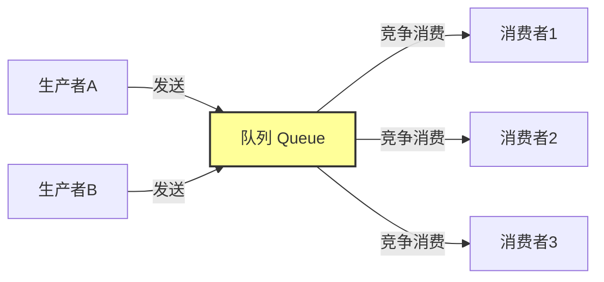
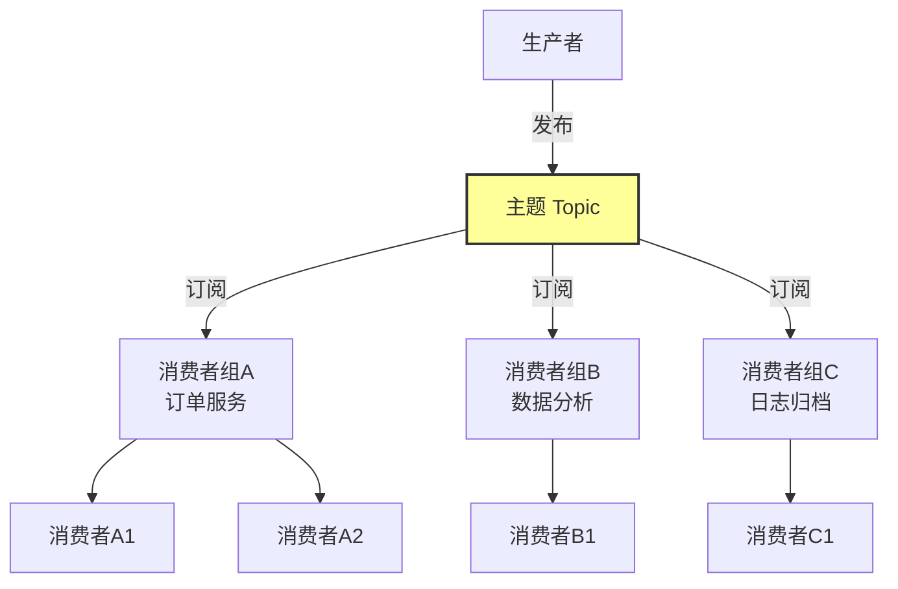
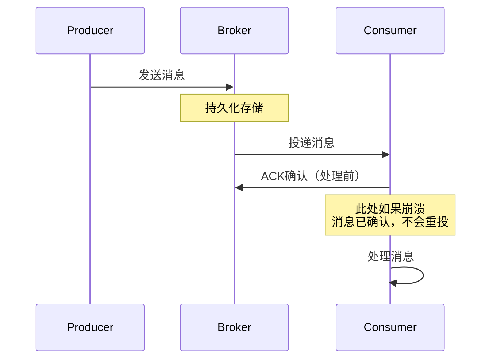
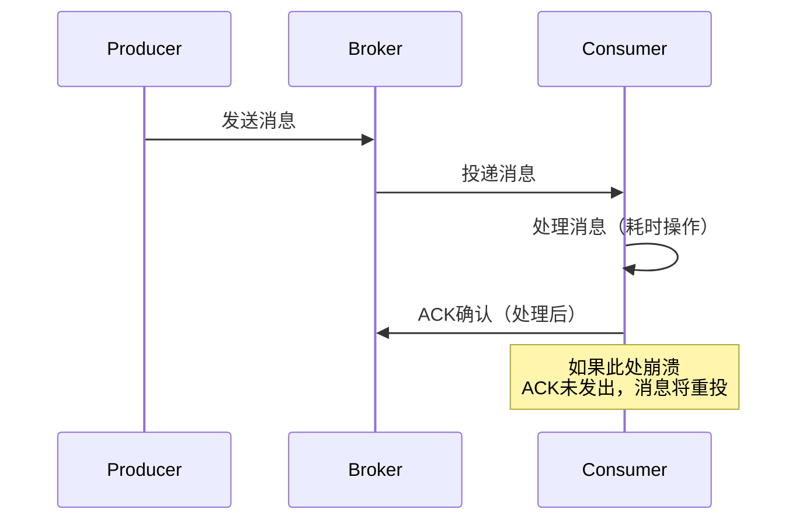
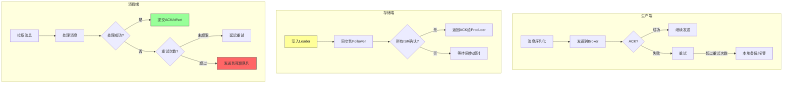

# 理论基础

消息队列的理论基础是理解整个消息中间件体系的根基。本节从四个核心维度展开：消息模型决定了消息如何在生产者与消费者之间流转，消息可靠性保证了消息在分布式环境下的不丢不重，消息顺序性解决了多节点并行场景下的有序处理问题，延迟消息实现了定时/延时投递的能力。掌握这些理论，才能在工程实践中做出正确的架构决策。

***

## 一、消息模型

消息模型是消息队列最基础的抽象，它定义了消息的生产、存储和消费方式。不同的消息模型适用于不同的业务场景，理解它们的本质差异是选型和设计的第一步。

### 1.1 点对点模型（Point-to-Point）

点对点模型是最基本的消息传递模型。消息被发送到一个队列（Queue）中，每条消息只能被一个消费者消费，消费完成后消息从队列中移除。



**核心特性：**

- **竞争消费**：多个消费者连接同一队列时，每条消息只会被其中一个消费者获取。队列负责在消费者之间进行负载均衡，确保消息均匀分配。
- **消息独占**：一条消息被消费后即从队列移除，其他消费者无法再次获取。这天然保证了消息不会被重复处理。
- **拉取模式**：消费者主动从队列拉取消息（Pull），根据自身处理能力决定拉取频率和数量。这给消费者提供了流量控制的主动权。

**适用场景**：任务分发（如订单处理、图片转码）、工作队列（如邮件发送、短信推送）、负载均衡的后台任务。

**典型实现**：RabbitMQ 的 Queue、Amazon SQS、Celery + RabbitMQ。RabbitMQ 的 Queue 概念直接对应点对点模型，消息被推送到 Queue 后由消费者竞争消费。

### 1.2 发布订阅模型（Publish-Subscribe）

发布订阅模型将消息的生产和消费解耦到"主题"（Topic）层面。生产者将消息发布到主题，所有订阅该主题的消费者组都会收到消息的副本。



**核心特性：**

- **广播能力**：同一条消息可以被多个消费者组各自消费一次。例如一条"订单已创建"的消息可以同时被库存服务、通知服务、数据分析服务消费。
- **消费者组内负载均衡**：同一个消费者组内的多个消费者分担消费压力，每条消息只被组内一个消费者处理。
- **完全解耦**：生产者不知道有多少消费者在监听，消费者不知道消息来自哪个生产者。新增或移除消费者不需要修改生产者代码。

**Kafka 中的实现**：Kafka 的 Topic 被划分为多个 Partition，每个 Partition 只能被同一个消费者组内的一个消费者消费。通过增加 Partition 数量可以提高消费并行度。一个 3 分区的 Topic，消费者组内最多 3 个消费者可以并行消费，第 4 个消费者将处于空闲状态。

### 1.3 两种模型的对比

| 特性 | 点对点模型 | 发布订阅模型 |
|------|-----------|-------------|
| 消费方式 | 每条消息只被一个消费者消费 | 每条消息可被多个消费者组各自消费一次 |
| 耦合程度 | 生产者需指定队列名 | 生产者只需指定主题名 |
| 扩展方式 | 增加消费者（竞争消费，提高吞吐） | 增加消费者组（广播）或组内消费者（并行） |
| 消息持久化 | 消费后移除 | 消费后保留（按保留策略清理） |
| 消息回溯 | 不支持 | 支持（按 offset 或时间戳回溯） |
| 典型场景 | 任务分发、工作队列 | 事件驱动、日志广播、数据分发 |
| 代表实现 | RabbitMQ Queue、Amazon SQS | Kafka Topic、RocketMQ Topic |

### 1.4 消息模型的选择原则

**选择点对点模型**：当每条消息只需要被处理一次，且消费逻辑是相同类型的任务时。典型的如后台任务处理：图片压缩、PDF 生成、邮件发送。多个消费者实例竞争消费同一个队列，天然实现了任务的负载均衡。

**选择发布订阅模型**：当同一条消息需要触发多个不同的处理逻辑时。典型的如电商订单系统：订单创建后需要通知库存服务扣减库存、通知积分服务增加积分、通知数据分析服务记录行为、通知物流服务准备发货。每个服务独立订阅订单主题，互不影响。

**混合使用**：在实际系统中，两种模型经常混合使用。例如 RabbitMQ 通过 Exchange + Queue 的组合实现了灵活的消息路由，既有点对点的 Queue 竞争消费，也有 Fanout Exchange 的广播能力。Kafka 通过消费者组实现了发布订阅模型，但在组内仍然是竞争消费的点对点模式。

### 1.5 消息模型的演进：从简单队列到流处理

传统的消息队列模型（ActiveMQ 时代）以队列为中心，消息消费后即删除。现代消息系统（Kafka 时代）以日志（Log）为中心，消息被持久化存储，消费只是移动 offset 指针。这个转变带来了根本性的差异：

- **消息回溯**：Kafka 消费者可以随时重置 offset 到任意位置，重新消费历史消息。这在 bug 修复、数据重算、新消费者上线等场景下极为重要。
- **多消费者组独立消费**：日志模型下消息不因消费而删除，不同消费者组可以按照各自的节奏独立消费，互不干扰。
- **流处理**：基于日志模型，Kafka 可以与 Flink、Spark Streaming 等流处理引擎无缝集成，实现对消息流的实时计算。

***

## 二、消息可靠性

消息可靠性是消息队列在生产环境中最核心的质量属性。它回答的是一个看似简单但实现极其复杂的问题：消息从生产者发出，到被消费者处理完成，整个链路中如何保证不丢失、不重复？

### 2.1 可靠性的三个维度

消息可靠性可以从三个维度来理解：

| 维度 | 含义 | 丢失场景 | 对应机制 |
|------|------|---------|---------|
| 生产端可靠性 | 消息成功发送到 Broker | 网络抖动、Broker 宕机、Producer 崩溃 | 发送确认（ACK）、重试机制 |
| 存储端可靠性 | 消息在 Broker 中持久化存储 | 磁盘故障、节点宕机、数据未同步完成 | 副本同步、持久化策略 |
| 消费端可靠性 | 消息被消费者成功处理 | 消费者崩溃、处理逻辑异常、ACK 丢失 | 消费确认、重试与死信 |

### 2.2 消息投递语义

消息投递语义是衡量消息可靠性的核心指标，分为三种：

#### At-Most-Once（最多一次）

消息可能丢失，但绝不重复。消费者在处理消息**之前**就发送 ACK：



**实现方式**：RabbitMQ 设置 `autoAck=true`；Kafka 设置 `enable.auto.commit=true`。

**适用场景**：日志收集、监控指标上报等对丢失不敏感但对重复敏感的场景。丢失几条日志通常不会影响业务，但重复数据可能导致统计偏差。

**工程价值**：简单、高性能、低延迟。在大规模日志采集中，At-Most-Once 的吞吐量比 At-Least-Once 高 20%-40%，因为省去了 ACK 和重试的开销。

#### At-Least-Once（至少一次）

消息绝不丢失，但可能重复。消费者在处理消息**之后**才发送 ACK：



**实现方式**：Kafka 手动提交 offset（`enable.auto.commit=false` + `consumer.commitSync()`）；RabbitMQ 手动 ACK（`basicAck`）。

**工程实践**：At-Least-Once 是生产环境中最常用的投递语义。它在可靠性和实现复杂度之间取得了最佳平衡。消息不丢失保证了业务正确性，重复投递的问题通过消费端幂等性解决。

```python
# Kafka At-Least-Once 手动提交示例
from kafka import KafkaConsumer

consumer = KafkaConsumer(
    'order-topic',
    bootstrap_servers=['kafka1:9092'],
    group_id='order-processor',
    enable_auto_commit=False,      # 关闭自动提交
    auto_offset_reset='earliest',  # 从最早消息开始消费
    max_poll_records=100           # 每次最多拉取100条
)

for message in consumer:
    try:
        # 处理消息
        process_order(message.value)
        # 处理成功后手动提交 offset
        consumer.commit()
    except TransientException as e:
        # 临时故障，不提交 offset，等待重试
        logger.warning(f"临时故障，稍后重试: {e}")
    except PermanentException as e:
        # 永久故障，发送到死信队列，然后提交 offset 避免无限重试
        send_to_dlq(message)
        consumer.commit()
```

#### Exactly-Once（恰好一次）

消息既不丢失也不重复。这是最理想的语义，但在分布式系统中实现代价极高。

**Kafka 的 Exactly-Once 实现**：Kafka 0.11+ 引入了两个关键机制：

- **幂等生产者（Idempotent Producer）**：为每个 Producer 分配唯一 PID（Producer ID），为每条消息分配序列号（Sequence Number）。Broker 通过 PID + 序列号去重，保证同一条消息不会被重复写入。
- **事务（Transaction）**：将消息的生产和 offset 的提交绑定为原子操作。要么全部成功，要么全部回滚。

```java
// Kafka Exactly-Once 事务示例
Properties props = new Properties();
props.put("transactional.id", "order-tx-001");  // 事务ID，全局唯一
props.put("enable.idempotence", true);            // 启用幂等

KafkaProducer<String, String> producer = new KafkaProducer<>(props);
producer.initTransactions();

try {
    producer.beginTransaction();
    // 在事务内：消费 → 处理 → 生产
    ConsumerRecords<String, String> records = consumer.poll(Duration.ofMillis(100));
    for (ConsumerRecord<String, String> record : records) {
        String result = processRecord(record);
        producer.send(new ProducerRecord<>("output-topic", record.key(), result));
    }
    // 在事务内提交消费 offset
    producer.sendOffsetsToTransaction(offsets, consumerGroupId);
    producer.commitTransaction();
} catch (Exception e) {
    producer.abortTransaction();
}
```

**Exactly-Once 的代价**：

| 代价维度 | 具体影响 |
|---------|---------|
| 性能下降 | 吞吐量降低 30%-50%，因为需要维护 PID 映射和事务日志 |
| 延迟增加 | 每条消息增加 1-2ms 的事务开销 |
| 复杂度上升 | 生产者需要管理事务生命周期，消费者需要配合事务边界 |
| 适用范围受限 | 仅在 Kafka 内部（生产 + 消费）有效，跨系统无法保证 |

**工程建议**：在绝大多数场景下，At-Least-Once + 消费端幂等性是更实用的选择。只有在对数据一致性要求极高的金融、支付等场景中，才值得引入 Exactly-Once 的复杂性。

### 2.3 消费端幂等性设计

At-Least-Once 语义下，消费端幂等性是防止重复处理的最后一道防线。常见的幂等性方案：

| 方案 | 实现原理 | 适用场景 | 性能影响 | 实现复杂度 |
|------|---------|---------|---------|-----------|
| 消息ID去重 | Redis/DB 记录已处理的 msgId，重复消息跳过 | 通用场景 | 低（Redis O(1) 查询） | 低 |
| 数据库唯一约束 | msgId 作为唯一索引，重复插入自动失败 | 写入数据库的场景 | 低（利用DB索引） | 低 |
| 乐观锁/版本号 | UPDATE 时检查版本号，不匹配则跳过 | 更新操作 | 低 | 中 |
| 状态机检查 | 根据业务状态判断消息是否应被处理 | 有明确状态流转的业务 | 取决于查询 | 中 |
| 布隆过滤器 | 内存级别的快速去重，允许极小的误判率 | 海量消息、允许微小误差 | 极低 | 中 |

```python
# 基于 Redis 的消息去重实现
import redis
import json

class IdempotentConsumer:
    def __init__(self, redis_client, ttl_seconds=3600):
        self.redis = redis_client
        self.ttl = ttl_seconds
    
    def process(self, message):
        msg_id = message['msg_id']
        dedup_key = f"processed:{msg_id}"
        
        # SET NX：只有首次设置成功才返回 True
        if not self.redis.set(dedup_key, "1", nx=True, ex=self.ttl):
            logger.info(f"重复消息，跳过: {msg_id}")
            return
        
        try:
            self._do_process(message)
        except Exception as e:
            # 处理失败，删除去重标记，允许重试
            self.redis.delete(dedup_key)
            raise
```

### 2.4 副本同步与数据持久化

存储端的可靠性依赖于副本机制和持久化策略。不同消息队列的实现差异较大：

**Kafka 的 ISR（In-Sync Replicas）机制**：

- 每个 Partition 有多个副本，其中一个是 Leader，其余是 Follower
- 所有读写通过 Leader 进行，Follower 从 Leader 同步数据
- ISR 是与 Leader 保持同步的副本集合，只有 ISR 中的副本才有资格成为新 Leader
- `acks=all` 时，Producer 需要等待所有 ISR 副本确认写入后才收到 ACK

**Kafka 的可靠性配置**：

| 配置项 | 默认值 | 说明 | 生产建议 |
|--------|--------|------|---------|
| `acks` | 1 | 0=不等待确认, 1=Leader确认, all=所有ISR确认 | 生产环境用 `all` |
| `min.insync.replicas` | 1 | 最小同步副本数，低于此数 Producer 报错 | 设为 2 |
| `replication.factor` | 1 | 副本总数 | 设为 3 |
| `unclean.leader.election.enable` | false | 是否允许非ISR副本成为Leader | 保持 false |
| `log.flush.messages` | Long.MAX_VALUE | 刷盘间隔的消息数 | 依赖 OS 缓存 |
| `log.flush.ms` | Long.MAX_VALUE | 刷盘间隔的毫秒数 | 依赖 OS 缓存 |

**RabbitMQ 的可靠性机制**：

- **消息持久化**：发送时设置 `delivery_mode=2`，消息被写入磁盘
- **队列持久化**：声明队列时设置 `durable=True`
- **消费者确认**：手动 ACK 确保消息被处理后才从队列移除
- **镜像队列**：消息同步到多个节点，节点故障时自动切换

**RocketMQ 的同步双写**：

- Broker 收到消息后写入 CommitLog
- 同步模式（`brokerRole=SYNC_MASTER`）下，Master 需要等待 Slave 写入成功后才返回 ACK
- 异步模式（`brokerRole=ASYNC_MASTER`）下，Master 写入后立即返回，异步复制到 Slave

### 2.5 消息可靠性的完整链路

一个完整的消息可靠性保证需要覆盖从生产到消费的全链路：



***

## 三、消息顺序性

在分布式消息系统中，消息顺序性是一个看似简单但实现复杂的问题。全局顺序（所有消息严格按发送顺序被消费）在分布式环境下几乎不可能实现，工程中通常追求的是局部顺序（同一业务实体的消息按序处理）。

### 3.1 顺序性的分类

| 类型 | 定义 | 实现难度 | 适用场景 |
|------|------|---------|---------|
| 全局顺序 | 所有消息严格按发送顺序消费 | 极高（牺牲全部并行度） | 几乎不用 |
| 分区顺序 | 同一 Partition/Queue 内的消息按序消费 | 中等 | 订单状态流转、用户操作序列 |
| 业务顺序 | 同一业务实体（如同一订单ID）的消息按序消费 | 中等 | 电商订单、银行流水 |

### 3.2 全局顺序的代价

全局顺序要求所有消息进入同一个 Partition/Queue，由单个消费者处理。这意味着：

- **吞吐量瓶颈**：所有消息串行处理，系统的并行度退化为 1
- **单点故障**：消费端成为单点，无法水平扩展
- **实际吞吐**：假设单条消息处理耗时 10ms，全局顺序下最大吞吐量仅为 100 msg/s

因此，全局顺序在实际工程中几乎不使用。绝大多数场景只需要保证业务实体级别的局部顺序。

### 3.3 分区顺序的实现原理

分区顺序的核心思想是：将同一业务实体的消息路由到同一个 Partition，利用 Partition 内部的消息有序性来保证业务顺序。

**发送端路由**：通过消息的 Key 来决定 Partition 分配。相同 Key 的消息经过哈希后会分配到同一个 Partition。

```java
// Kafka：通过 Key 保证同一 orderId 进入同一 Partition
producer.send(new ProducerRecord<>(
    "order-topic",        // Topic
    orderId,              // Key（相同Key路由到同一Partition）
    orderMessage          // Value
));
```

```java
// RocketMQ：通过 MessageQueueSelector 选择 Queue
SendResult result = producer.send(msg, (mqs, msg, arg) -> {
    String orderId = (String) arg;
    int index = Math.abs(orderId.hashCode()) % mqs.size();
    return mqs.get(index);
}, orderId);
```

**消费端单线程保证**：Kafka 的消费者默认就是单线程消费单个 Partition 的——一个 Partition 只能被同一个消费者组内的一个消费者消费，而 KafkaConsumer 的 poll 循环是单线程的。这天然保证了 Partition 内的消费顺序。

### 3.4 顺序消费的难点与解决方案

顺序消费最大的难点在于**消费失败的处理**。如果某条消息消费失败，后续消息不应该被消费（否则破坏顺序），但阻塞等待又会影响整体吞吐量。

**方案一：阻塞重试（推荐用于强顺序场景）**

消费失败后暂停消费该 Key 的后续消息，等待重试成功后继续。

```java
// Kafka 顺序消费 + 阻塞重试
public class OrderedConsumer {
    private final Map<String, BlockingQueue<Message>> retryQueues = new ConcurrentHashMap<>();
    private final int maxRetries = 3;
    
    public void consume(ConsumerRecord<String, String> record) {
        String key = record.key();
        for (int retry = 0; retry < maxRetries; retry++) {
            try {
                processMessage(record.value());
                return; // 成功，退出
            } catch (Exception e) {
                logger.warn("消费失败，重试 {}/{}: {}", retry + 1, maxRetries, e.getMessage());
                Thread.sleep(1000 * (retry + 1)); // 指数退避
            }
        }
        // 重试耗尽，发送到死信队列，阻塞后续消息
        sendToDlq(record);
        logger.error("消息进入死信队列，后续消息将继续消费: key={}", key);
    }
}
```

**方案二：异步重试 + 本地顺序表**

消费失败的消息放入本地重试表，后续消息继续消费但跳过失败消息的位置。所有后续消息的处理结果暂时存储在本地顺序表中，等失败消息重试成功后再按序提交。

这种方案适合对延迟敏感但顺序要求不绝对严格的场景，如实时数据管道。

### 3.5 顺序性的陷阱

**陷阱一：消费者组扩容导致 Partition 重分配**

当消费者组内增加消费者时，会触发 Rebalance，Partition 重新分配。虽然 Partition 内的消息顺序不变，但不同 Partition 可能被不同消费者消费，需要确保业务层面的顺序依赖关系不被破坏。

**陷阱二：消费失败后的 Rebalance**

消费者因消费超时被 Coordinator 判定为离线，触发 Rebalance。此时该消费者未消费的消息会被重新分配给其他消费者，可能导致顺序错乱。

**解决方案**：合理设置 `max.poll.interval.ms`（Kafka 默认 5 分钟），确保消费者处理时间不超过该阈值。如果单条消息处理时间过长，应将消息拆分为多条小消息，或使用异步处理。

**陷阱三：Partition 扩容**

Topic 的 Partition 数量增加后，新 Partition 是空的，消息的 Key 哈希路由会重新分配。这可能导致同一 Key 的消息被路由到不同的 Partition，破坏顺序。

**解决方案**：在设计阶段就预估好 Partition 数量，避免后期扩容。如果必须扩容，需要做数据迁移或重新消费历史消息。

### 3.6 顺序消息的监控

顺序消息的健康度需要关注以下指标：

| 监控指标 | 含义 | 告警阈值建议 |
|---------|------|------------|
| Partition 消费延迟 | 各 Partition 的 Lag 差异 | 最大/最小 Lag 差值 > 10000 |
| 消费耗时分布 | 单条消息的处理耗时 P99 | P99 > 5s（影响顺序延迟） |
| 死信消息数 | 进入死信队列的消息数量 | 任何死信消息出现 |
| Rebalance 频率 | 单位时间内 Rebalance 次数 | > 3次/小时 |

***

## 四、延迟消息

延迟消息（Delayed Message）是指消息在发送后不立即投递，而是等待指定时间后才对消费者可见。延迟消息在超时处理、定时任务、延时通知等场景中有广泛应用。

### 4.1 典型应用场景

| 场景 | 延迟时间 | 业务逻辑 |
|------|---------|---------|
| 订单超时取消 | 30分钟 | 用户下单后30分钟未支付，自动取消订单 |
| 延迟通知 | 秒/分钟 | 用户操作后延迟推送通知，避免频繁打扰 |
| 定时任务调度 | 小时/天 | 定期执行数据同步、报表生成等任务 |
| 定重试 | 秒级 | 消息消费失败后延迟重试，避免立即重试造成雪崩 |
| 延迟优惠券 | 天 | 用户注册后N天才发放优惠券，引导回访 |
| 延迟消息聚合 | 秒级 | 将短时间内同一用户的消息聚合后批量处理 |

### 4.2 各消息队列的延迟消息能力

| 消息队列 | 延迟精度 | 实现方式 | 局限性 |
|---------|---------|---------|--------|
| RocketMQ 4.x | 18级固定延迟（1s~2h） | 内置延迟级别，Broker端实现 | 不能自定义延迟时间 |
| RocketMQ 5.x | 任意时间精度 | 基于时间轮的任意延迟 | 新版本，生态成熟度稍低 |
| Kafka | 不原生支持 | 需要自行实现（时间轮/外部调度） | 需要额外开发 |
| RabbitMQ | 插件支持（rabbitmq_delayed_message_exchange） | 延迟交换机插件 | 插件维护，性能一般 |
| Pulsar | 任意时间精度 | 内置延迟投递 | 依赖 BookKeeper |
| Redis Sorted Set | 任意时间精度 | 应用层实现延迟队列 | 无持久化保证，不适合高可靠场景 |

### 4.3 延迟消息的核心算法：时间轮

时间轮（Timing Wheel）是实现延迟消息最常用的算法，由 George Varghese 和 Tony Lauck 在 1987 年提出。它的核心思想是用一个环形数组来表示时间，每个槽位代表一个时间间隔。

```mermaid
graph LR
    subgraph 时间轮（4个槽位，每格1秒）
        S0[槽位0<br/>当前指针]
        S1[槽位1<br/>Task A<br/>delay=1s]
        S2[槽位2<br/>Task B, C<br/>delay=2s]
        S3[槽位3<br/>Task D<br/>delay=3s]
    end
    CUR[▶] --> S0
    style S0 fill:#9f9,stroke:#333
    style S2 fill:#f96,stroke:#333
```

**工作原理**：

1. 时间轮有一个指针，每隔一个时间间隔（tick）向前移动一格
2. 添加任务时，根据延迟时间计算目标槽位：`slot = (currentPos + delay / tickInterval) % slotCount`
3. 指针每移动一格，取出当前槽位中的所有任务并执行
4. 如果延迟时间超过一圈（`delay > slotCount * tickInterval`），使用多层时间轮（类似时钟的秒/分/时）

**时间复杂度分析**：

| 操作 | 时间复杂度 | 说明 |
|------|-----------|------|
| 添加任务 | O(1) | 计算槽位并插入链表 |
| 触发任务 | O(k) | k 为当前槽位的任务数 |
| 删除任务 | O(1) | 从链表中移除 |
| 内存占用 | O(n) | n 为槽位数 |

```go
// Go 语言实现时间轮
type TimingWheel struct {
    interval   time.Duration  // 每格的时间间隔
    slotNum    int            // 槽位数量
    slots      []*Slot        // 环形数组
    currentPos int            // 当前指针位置
    ticker     *time.Ticker
    addChan    chan *Task
    stopChan   chan struct{}
}

type Slot struct {
    mu    sync.Mutex
    tasks map[string]*Task  // taskId -> Task
}

type Task struct {
    Id       string
    Delay    time.Duration
    Execute  func()
    Round    int  // 剩余轮数（用于超长延迟）
}

func NewTimingWheel(interval time.Duration, slotNum int) *TimingWheel {
    tw := &amp;TimingWheel{
        interval: interval,
        slotNum:  slotNum,
        slots:    make([]*Slot, slotNum),
        addChan:  make(chan *Task, 10000),
        stopChan: make(chan struct{}),
    }
    for i := 0; i < slotNum; i++ {
        tw.slots[i] = &amp;Slot{tasks: make(map[string]*Task)}
    }
    return tw
}

func (tw *TimingWheel) Add(task *Task) {
    // 计算目标槽位和轮数
    ticks := int(task.Delay / tw.interval)
    task.Round = ticks / tw.slotNum
    pos := (tw.currentPos + ticks) % tw.slotNum
    tw.slots[pos].Add(task)
}

func (tw *TimingWheel) Start() {
    tw.ticker = time.NewTicker(tw.interval)
    go func() {
        for {
            select {
            case <-tw.ticker.C:
                tw.advance()
            case <-tw.stopChan:
                tw.ticker.Stop()
                return
            }
        }
    }()
}

func (tw *TimingWheel) advance() {
    slot := tw.slots[tw.currentPos]
    tw.currentPos = (tw.currentPos + 1) % tw.slotNum
    
    expired := slot.GetAndClear()
    for _, task := range expired {
        if task.Round <= 0 {
            go task.Execute()  // 到期，执行任务
        } else {
            task.Round--       // 未到期，减少轮数，重新放入
            tw.Add(task)
        }
    }
}
```

### 4.4 基于 Redis Sorted Set 的延迟队列

对于不需要消息队列原生延迟能力的场景，Redis Sorted Set 是一个轻量级的替代方案：

```python
import redis
import json
import time
import uuid

class RedisDelayQueue:
    def __init__(self, redis_client, queue_name):
        self.redis = redis_client
        self.queue_name = queue_name
    
    def delay(self, message, delay_seconds):
        """将消息加入延迟队列"""
        msg_id = str(uuid.uuid4())
        msg_data = json.dumps({"id": msg_id, "body": message, "created_at": time.time()})
        execute_at = time.time() + delay_seconds
        self.redis.zadd(self.queue_name, {msg_data: execute_at})
        return msg_id
    
    def poll(self, batch_size=10):
        """轮询获取到期消息（Lua脚本保证原子性）"""
        lua_script = """
        local messages = redis.call('ZRANGEBYSCORE', KEYS[1], 0, ARGV[1], 'LIMIT', 0, ARGV[2])
        if #messages > 0 then
            for i, msg in ipairs(messages) do
                redis.call('ZREM', KEYS[1], msg)
            end
        end
        return messages
        """
        now = time.time()
        return self.redis.eval(lua_script, 1, self.queue_name, now, batch_size)
    
    def order_timeout(self, order_id, timeout_seconds=1800):
        """订单超时取消"""
        message = {"action": "CANCEL_ORDER", "order_id": order_id}
        return self.delay(message, timeout_seconds)
```

**Redis 方案的注意事项**：

- `ZRANGEBYSCORE` + `ZREM` 必须使用 Lua 脚本保证原子性，防止多个消费者重复消费
- 轮询间隔需要权衡：过短增加 Redis 压力，过长增加延迟
- 不支持消息持久化保证：Redis 重启后消息可能丢失（除非开启 AOF 持久化且配置为 always fsync）
- 适合消息量适中（日均百万级以下）、对延迟极其敏感（微秒级）的场景

### 4.5 延迟消息的工程实践

**实践一：延迟消息 + 重试的组合**

消费失败后的重试不应立即执行，而应使用延迟消息实现退避重试：

```java
// 延迟重试策略：1s → 5s → 30s → 5min → 30min
int[] retryDelays = {1, 5, 30, 300, 1800};  // 秒

public void handleWithRetry(Message message, int retryCount) {
    try {
        processMessage(message);
    } catch (Exception e) {
        if (retryCount < retryDelays.length) {
            // 发送延迟消息实现退避重试
            Message retryMsg = buildRetryMessage(message, retryCount + 1);
            sendDelayed(retryMsg, retryDelays[retryCount], TimeUnit.SECONDS);
        } else {
            // 超过最大重试次数，发送到死信队列
            sendToDeadLetter(message, e);
        }
    }
}
```

**实践二：RocketMQ 延迟消息的固定级别适配**

RocketMQ 4.x 只支持 18 个固定延迟级别。如果业务需要的延迟时间不在预定义级别中，可以通过组合策略解决：

| 需求延迟 | RocketMQ 级别 | 实际延迟 | 误差 |
|---------|--------------|---------|------|
| 5分钟 | 级别6（1分钟）× 5次 | 5分钟 | 0 |
| 1小时 | 级别13（10分钟）× 6次 | 1小时 | 0 |
| 45分钟 | 级别15（30分钟）+ 级别6（1分钟）× 15次 | 45分钟 | 0 |

**实践三：延迟消息的监控与告警**

延迟消息需要额外的监控维度：

| 监控指标 | 含义 | 告警阈值 |
|---------|------|---------|
| 延迟队列深度 | 等待投递的延迟消息数量 | > 10000 |
| 延迟投递延迟 | 消息从到期到实际投递的时间差 | P99 > 5s |
| 延迟消息丢失率 | 到期但未投递的消息比例 | > 0.01% |
| 时间轮处理速度 | 单位时间内处理的到期消息数 | < 生产速率的 50% |

### 4.6 延迟消息的替代方案

并非所有定时任务都适合用延迟消息实现：

| 替代方案 | 适用场景 | 优势 | 劣势 |
|---------|---------|------|------|
| 数据库轮询 | 低频定时任务（分钟级） | 实现简单，数据持久化 | 性能差，不适合高频 |
| Quartz/Scheduler | 单机定时任务 | 成熟稳定，功能丰富 | 不支持分布式 |
| XXL-Job/ElasticJob | 分布式定时任务 | 分片执行，故障转移 | 部署维护成本 |
| 时间轮/延迟消息 | 高频延迟投递（秒级/毫秒级） | 高性能，低延迟 | 实现复杂 |
| 云服务定时器 | 无服务器架构 | 免运维，按量付费 | 供应商锁定 |

**选择原则**：如果延迟消息是消息队列系统的一部分（即消息已经在 MQ 中流转），优先使用 MQ 的延迟消息能力。如果是独立的定时任务调度，使用 XXL-Job 等专业调度平台。避免用延迟消息来替代所有的定时任务——延迟消息的核心价值是与消息处理流程的无缝衔接，而非通用的任务调度。

***

## 本节小结

| 理论主题 | 核心要点 | 工程关键决策 |
|---------|---------|------------|
| 消息模型 | 点对点（竞争消费）vs 发布订阅（广播消费） | 根据消息消费模式选择，混合使用最常见 |
| 消息可靠性 | 三种投递语义 + 幂等性 + 副本同步 | At-Least-Once + 幂等性是最佳平衡点 |
| 消息顺序性 | 分区顺序而非全局顺序 | Key 路由 + 单线程消费 + 失败重试策略 |
| 延迟消息 | 时间轮算法 + Redis 方案 + 原生支持 | 优先用 MQ 原生能力，避免过度设计 |
