## 第36章-高并发技术

> "高并发的本质不是让一台机器做更多的事，而是让有限的资源在单位时间内服务更多的请求。"

高并发（High Concurrency）是现代后端工程中最核心、最具挑战性的技术领域之一。从淘宝双十一峰值58万QPS，到微信单机承载200万长连接，再到5G基站千万级并发——高并发能力直接决定了互联网产品的用户体验和商业价值。本章从操作系统I/O模型出发，逐层递进到连接池、线程模型、限流熔断、背压流控、缓存分层和架构模式，构建一个完整的高并发知识体系。每个技术点都遵循"原理→实现→实战→避坑"的讲解路径，确保读者不仅知道"是什么"，更理解"为什么"和"怎么做"。

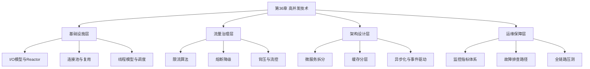

---

### 1. 什么是高并发：从C10K到C1M问题

高并发是指系统在同一时间段内需要处理大量并发请求的能力。当请求量超过系统设计容量时，会出现响应变慢、服务不可用甚至系统崩溃等问题。理解高并发，首先要理解"并发"与"并行"的区别：**并发（Concurrency）**是多个任务交替执行，**并行（Parallelism）**是多个任务同时执行。高并发系统追求的是在有限硬件资源上，通过合理的架构设计最大化并发处理能力。

**C10K问题的由来**

1999年，Dan Kegel提出了著名的C10K问题：当一台服务器需要同时维持10,000个并发连接时，传统的"一个连接一个线程"（thread-per-connection）模型会面临严重瓶颈。原因在于：

- **线程开销**：每个Linux线程约占用1-8MB栈空间，10,000个线程意味着10-80GB内存，远超物理内存容量
- **上下文切换**：操作系统在线程间切换的开销约为1-10微秒，当线程数达到万级时，上下文切换消耗的CPU时间可占总时间的30%以上
- **内核瓶颈**：传统的select/poll系统调用在处理大量文件描述符时性能急剧下降，时间复杂度为O(n)
- **内存管理**：每个连接的读写缓冲区、内核数据结构（如socket buffer）都会占用额外内存，万级连接的内存开销可达数GB

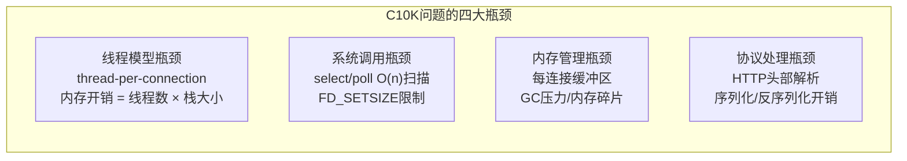

**从C10K到C1M再到C10M的演进**

随着移动互联网和物联网的爆发，系统需要处理的并发连接已从万级跃升到百万级（C1M）甚至千万级。2014年微信公布其服务器单机需处理200万长连接，2020年淘宝双十一峰值QPS超过58万，2023年抖音直播同时在线人数峰值突破1亿。这些场景对高并发技术提出了更高要求：

| 并发级别 | 典型场景 | 连接数 | 核心挑战 | 代表技术 |
|---------|---------|--------|---------|---------|
| C1K | 传统Web服务器 | ~1,000 | 线程模型基本够用 | Apache prefork |
| C10K | 聊天室/游戏服务器 | ~10,000 | 需要异步I/O和事件驱动 | Nginx/Node.js |
| C100K | IM系统/物联网网关 | ~100,000 | 单机优化接近极限 | Netty/Go goroutine |
| C1M | 微信/淘宝/抖音 | ~1,000,000 | 需要分布式架构+内核级优化 | 自研框架+DPDK |
| C10M | 5G基站/CDN边缘节点 | ~10,000,000 | DPDK/用户态协议栈 | SEASTAR/F-Stack |

**高并发的四大衡量维度**

| 维度 | 含义 | 指标 | 优化方向 |
|------|------|------|---------|
| 吞吐量 | 单位时间内处理的请求数 | QPS/TPS | 并行处理、异步化 |
| 延迟 | 单个请求的响应时间 | P50/P99/P999 | 缓存、减少I/O |
| 可用性 | 系统正常服务时间占比 | SLA（99.9%/99.99%） | 冗余、故障转移 |
| 资源效率 | 单位资源提供的服务量 | CPU/内存利用率 | 资源池化、调度优化 |

---

### 2. I/O模型：高并发的基石

操作系统处理网络I/O的方式直接决定了系统的并发上限。理解I/O模型是掌握高并发技术的第一步。网络I/O本质上涉及两个阶段：**等待数据就绪**（数据从网卡到内核缓冲区）和**数据拷贝**（数据从内核缓冲区到用户空间）。不同I/O模型的区别在于这两个阶段的阻塞行为不同。

**五种I/O模型对比**

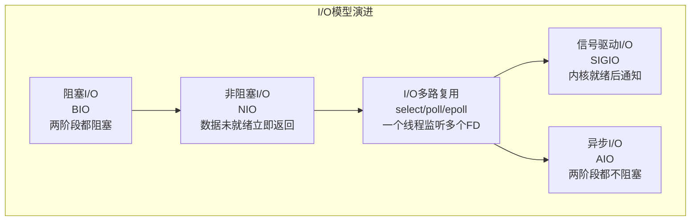

| I/O模型 | 等待数据阶段 | 数据拷贝阶段 | 线程开销 | 编程复杂度 | 并发能力 |
|---------|------------|------------|---------|-----------|---------|
| 阻塞I/O | 阻塞 | 阻塞 | 每连接1线程 | 最简单 | 低（C1K） |
| 非阻塞I/O | 非阻塞（轮询） | 阻塞 | 多连接共享线程 | 中等 | 中（C1K-C10K） |
| I/O多路复用 | 阻塞在select/epoll | 阻塞 | 1线程监听多连接 | 中等 | 高（C10K-C100K） |
| 信号驱动I/O | 非阻塞（信号通知） | 阻塞 | 少量线程 | 高 | 中（C10K） |
| 异步I/O | 非阻塞 | 非阻塞（回调通知） | 极少线程 | 高 | 极高（C100K+） |

**阻塞I/O（BIO）**

最简单的模型：线程调用read()时，如果数据未就绪，线程被挂起直到数据到达。这种模型的问题在于——每个连接都需要一个独占线程，10,000个连接就需要10,000个线程。

```java
// BIO模型：一个连接一个线程
ServerSocket server = new ServerSocket(8080);
while (true) {
    Socket socket = server.accept(); // 阻塞等待连接
    new Thread(() -> handleConnection(socket)).start(); // 每连接一个线程
}
```

**非阻塞I/O（NIO）**

线程调用read()时，如果数据未就绪，立即返回EAGAIN/EWOULDBLOCK错误，不会阻塞。线程可以轮询多个连接，但轮询本身消耗CPU资源（忙等待），在连接数较多时效率低下。

**I/O多路复用：select、poll、epoll**

这是高并发系统的核心技术。通过一个系统调用同时监听多个文件描述符的I/O事件，解决了非阻塞I/O忙等待的问题：

| 特性 | select | poll | epoll | kqueue（macOS/BSD） |
|------|--------|------|-------|-------|
| FD上限 | 1024（FD_SETSIZE） | 无硬限制 | 无硬限制 | 无硬限制 |
| 数据结构 | 位图（bitmap） | 链表 | 红黑树+就绪链表 | 红黑树+变化列表 |
| 时间复杂度 | O(n)全量扫描 | O(n)全量扫描 | O(1)事件通知 | O(1)事件通知 |
| 触发模式 | 仅水平触发(LT) | 仅水平触发(LT) | 支持边缘触发(ET) | 支持边缘触发(ET) |
| 内核拷贝 | 每次调用拷贝全部FD | 每次调用拷贝全部FD | mmap共享内存 | 用户态内存映射 |
| 典型应用 | Windows | 旧版Linux | Linux 2.6+主流 | macOS/Nginx |

**epoll的工作原理**

epoll通过三个核心系统调用实现高效事件驱动：

```c
// 1. 创建epoll实例（在内核中创建红黑树+就绪链表）
int epfd = epoll_create1(0);

// 2. 注册感兴趣的事件（将FD插入红黑树，注册回调函数）
struct epoll_event ev;
ev.events = EPOLLIN | EPOLLET; // 边缘触发读事件
ev.data.fd = client_fd;
epoll_ctl(epfd, EPOLL_CTL_ADD, client_fd, &amp;ev);

// 3. 等待事件就绪（关键：只返回就绪的FD，不需要全量扫描）
int n = epoll_wait(epfd, events, MAX_EVENTS, timeout);
for (int i = 0; i < n; i++) {
    handle_event(events[i]); // 只处理就绪的FD
}
```

epoll的高效在于：当网卡收到数据时，内核通过回调机制将对应FD的节点添加到就绪链表，`epoll_wait`只需检查链表是否为空，避免了O(n)的全量扫描。这就是为什么epoll能轻松处理百万级连接，而select/poll在万级时就性能骤降。

**边缘触发(ET) vs 水平触发(LT)**

- **水平触发(LT)**：只要FD处于就绪状态，每次epoll_wait都会通知。编程简单但可能导致重复通知，性能略低。适合初学者和对性能要求不极端的场景。
- **边缘触发(ET)**：仅在状态变化时通知一次。性能更高但要求开发者一次性读完/写完所有数据，编程复杂度增加。适合高性能服务器。

```c
// ET模式下必须循环读取直到EAGAIN
while (true) {
    ssize_t n = read(fd, buf, sizeof(buf));
    if (n == -1 &amp;&amp; errno == EAGAIN) break; // 数据已读完
    if (n == 0) { handleClose(fd); break; } // 连接关闭
    processData(buf, n);
}
```

> **ET模式的关键陷阱**：如果一次read()没有读完所有数据，后续数据将不会被通知（因为没有新的状态变化），导致数据"饥饿"。生产环境中建议使用ET模式+非阻塞FD+循环读取的组合。

**Reactor模式：事件驱动的架构范式**

基于epoll/kqueue的事件驱动架构，Reactor模式是高并发服务器的标准范式：

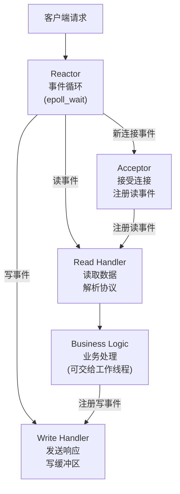

常见的Reactor实现模式：

| 模式 | 线程模型 | 代表产品 | 优点 | 缺点 | 适用场景 |
|------|---------|---------|------|------|---------|
| 单Reactor单线程 | 1个线程处理所有I/O+业务 | Redis 6.0之前 | 简单，无锁竞争 | 无法利用多核，业务阻塞会影响I/O | CPU密集型轻量操作 |
| 单Reactor多线程 | 1个Reactor线程+N个工作线程 | Nginx | I/O和业务分离 | Reactor仍是瓶颈 | Web服务器 |
| 多Reactor多线程 | M个Reactor线程+N个工作线程 | Netty/Muduo | 充分利用多核 | 实现复杂 | 高性能IM/RPC |

> **Redis 6.0的线程模型演进**：Redis 6.0引入了多线程I/O（io-threads），但命令执行仍然是单线程。这是一个务实的选择——既利用了多核处理网络I/O，又避免了多线程执行命令带来的锁竞争和一致性问题。

---

### 3. 连接池与连接复用

频繁创建和销毁TCP连接的开销极大——每次TCP连接需要三次握手（1.5个RTT）、内核数据结构分配（socket buffer、文件描述符等）、可能的TLS握手（额外2-3个RTT）。连接池通过预创建和复用连接来消除这一开销。

**连接建立的开销分析**

| 开销项 | 耗时（同机房） | 耗时（跨地域） | 说明 |
|-------|--------------|--------------|------|
| TCP三次握手 | 0.1-0.5ms | 10-100ms | SYN→SYN-ACK→ACK |
| TLS握手（1.2） | 1-3ms | 20-200ms | 需要额外2个RTT |
| TLS握手（1.3） | 0.5-1.5ms | 10-100ms | 优化为1个RTT |
| 内核资源分配 | 0.01-0.1ms | 0.01-0.1ms | socket buffer、FD等 |
| 连接池获取 | 0.001-0.01ms | 0.001-0.01ms | 从池中取已有连接 |

**连接池的核心参数**

```python
# Python连接池配置示例（以MySQL为例）
pool_config = {
    "min_idle": 5,           # 最小空闲连接数：保持的热连接数
    "max_idle": 20,          # 最大空闲连接数：超出的连接会被回收
    "max_active": 100,       # 最大活跃连接数：并发上限
    "max_wait_ms": 3000,     # 获取连接最大等待时间(ms)
    "validation_query": "SELECT 1",  # 连接健康检查SQL
    "idle_timeout_ms": 60000,        # 空闲连接超时回收
    "eviction_interval_ms": 30000,   # 驱逐检查间隔
    "max_lifetime_ms": 1800000,      # 连接最大存活时间（30分钟）
}
```

**连接池工作流程**

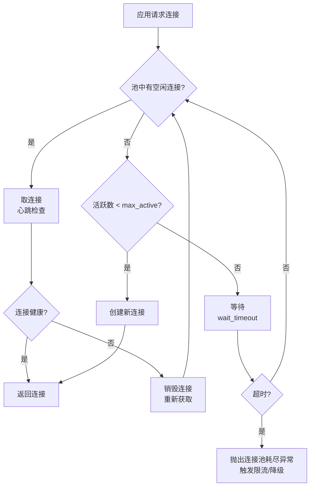

**连接泄漏的排查与预防**

连接泄漏是高并发系统最常见的故障之一。典型表现：连接池逐渐耗尽，最终所有请求都在等待获取连接，系统响应时间飙升。

```java
// ❌ 连接泄漏的常见原因：未在finally中关闭
Connection conn = pool.getConnection();
try {
    executeQuery(conn); // 业务逻辑抛异常
} catch (Exception e) {
    // 忘记关闭连接 → 泄漏！每次异常都会丢失一个连接
}

// ✅ 正确做法：使用try-with-resources确保自动关闭
try (Connection conn = pool.getConnection();
     PreparedStatement ps = conn.prepareStatement(sql)) {
    executeQuery(ps);
} // 无论是否异常，连接都会自动归还
```

预防措施：

- **语言层面**：使用try-with-resources（Java）或context manager（Python）确保自动关闭
- **监控层面**：启用连接池的泄漏检测功能，记录未归还连接的堆栈信息（如HikariCP的leakDetectionThreshold）
- **超时层面**：设置合理的连接超时时间，超时未归还的连接由池强制回收
- **告警层面**：当活跃连接数持续接近max_active时触发告警，提前发现泄漏

---

### 4. 线程模型与任务调度

高并发系统的线程模型决定了CPU资源的利用效率和系统的并发处理能力。线程是操作系统调度的基本单位，但线程并非越多越好——过多的线程会导致上下文切换开销反而降低性能。

**线程池的核心参数**

```java
ThreadPoolExecutor pool = new ThreadPoolExecutor(
    corePoolSize,      // 核心线程数：长期维持的线程数，即使空闲也不回收
    maximumPoolSize,   // 最大线程数：峰值时可扩展到的上限
    keepAliveTime,     // 空闲线程存活时间：非核心线程超过此时间被回收
    TimeUnit.SECONDS,
    workQueue,         // 任务队列：核心线程满时的缓冲区
    threadFactory,     // 线程工厂：自定义线程名称便于排查问题
    rejectionHandler   // 拒绝策略：队列满+线程满时的处理方式
);
```

**任务执行流程与拒绝策略**

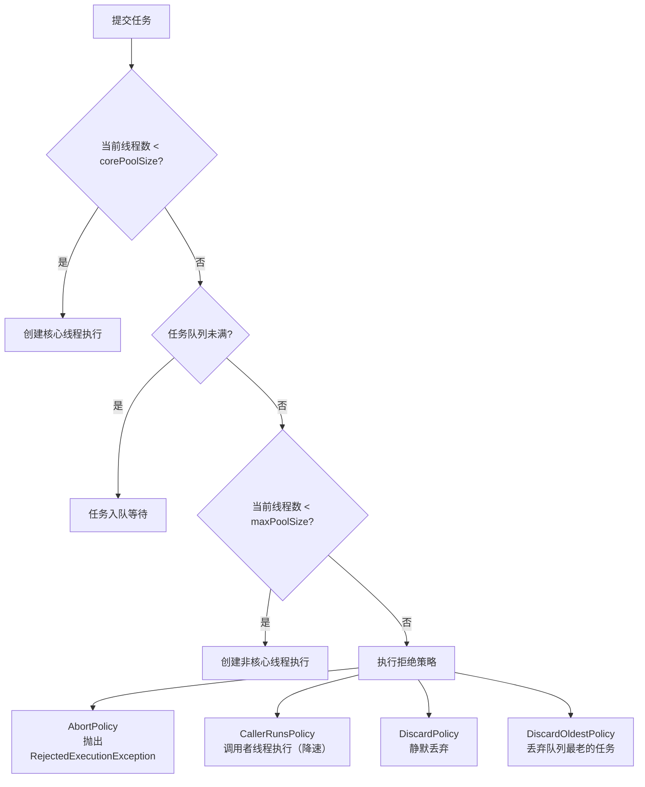

**四种拒绝策略的选择**

| 策略 | 行为 | 适用场景 | 风险 | 推荐度 |
|------|------|---------|------|-------|
| AbortPolicy | 抛出异常 | 要求不能丢任务的关键业务（订单、支付） | 请求直接失败 | ⭐⭐⭐⭐⭐ |
| CallerRunsPolicy | 提交线程自己执行 | 允许降速但不允许丢数据（数据同步） | 提交线程被阻塞 | ⭐⭐⭐⭐ |
| DiscardPolicy | 静默丢弃 | 允许丢弃的非关键任务（日志、监控上报） | 数据丢失无感知 | ⭐⭐ |
| DiscardOldestPolicy | 丢弃队列头 | 需要保留最新状态的场景（实时指标采集） | 历史任务丢失 | ⭐⭐ |

**关键线程数设置经验**

| 场景 | CPU密集型 | I/O密集型 | 混合型 |
|------|----------|----------|--------|
| 核心线程数 | N+1（N=CPU核数） | 2N 或更高 | N×(1+W/C) |
| 公式说明 | 多1个线程补偿偶尔的页缺失 | I/O等待时不占CPU，可开更多线程 | W=等待时间，C=计算时间 |
| 任务队列 | LinkedBlockingQueue（有界） | SynchronousQueue + 弹性max | 根据业务选择 |
| 示例（8核） | 9 | 16-32 | 根据W/C比计算 |

> **为什么要+1**：即使线程数等于CPU核心数，当某个线程因为页缺失（page fault）或调度延迟而暂停时，CPU会空闲。多出的1个线程可以填补这个空闲时间，略微提升CPU利用率。

**协程：轻量级并发的未来**

协程（Coroutine）是用户态的轻量级线程，由运行时而非操作系统调度，切换开销仅为纳秒级（对比线程的微秒级）。Go的goroutine和Kotlin的协程是目前最主流的协程实现：

| 对比项 | 线程（Thread） | goroutine | Kotlin协程 |
|-------|--------------|-----------|-----------|
| 调度方式 | OS内核调度 | Go运行时调度 | JVM调度 |
| 初始栈大小 | 1-8MB | 2KB（可动态增长） | ~数百字节 |
| 切换开销 | 1-10微秒 | ~百纳秒 | ~百纳秒 |
| 创建成本 | 高（系统调用） | 低（用户态） | 低（用户态） |
| 最大数量 | 数千-数万 | 数十万-数百万 | 数十万 |
| 适用语言 | 所有 | Go | Kotlin/Scala等JVM语言 |

---

### 5. 限流算法：系统过载的防护盾

当请求量超过系统处理能力时，限流是保护系统的第一道防线。限流的本质是控制单位时间内通过的请求数量，将负载限制在系统可承受的范围内。没有限流保护的系统就像没有保险丝的电路——过载必然导致烧毁。

**四种经典限流算法**

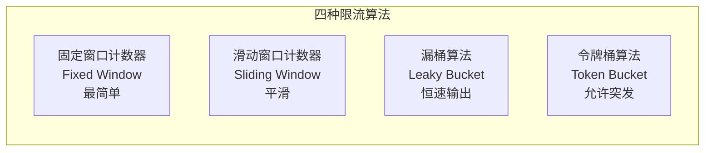

**固定窗口计数器**

最简单的限流实现：将时间划为固定窗口（如每秒），每个窗口维护一个计数器，到达上限则拒绝。

```python
import time

class FixedWindowLimiter:
    def __init__(self, max_requests, window_size=1):
        self.max_requests = max_requests
        self.window_size = window_size
        self.window_start = time.time()
        self.count = 0

    def allow(self):
        now = time.time()
        if now - self.window_start > self.window_size:
            self.window_start = now
            self.count = 0
        if self.count < self.max_requests:
            self.count += 1
            return True
        return False
```

**缺陷**：窗口边界处可能出现突发流量。例如限制每秒100次请求，在第1秒的第999ms来了100个请求，第2秒的第1ms又来了100个请求，实际2ms内通过了200个请求，是限制值的2倍。

**滑动窗口计数器**

将窗口细分为多个小格子（如1秒分为10个100ms的格子），用加权计算解决边界突发问题。

```python
class SlidingWindowLimiter:
    def __init__(self, max_requests, window_size=1, sub_windows=10):
        self.max_requests = max_requests
        self.window_size = window_size
        self.sub_window_size = window_size / sub_windows
        self.sub_windows = [0] * sub_windows
        self.current_index = 0

    def allow(self):
        now = time.time()
        elapsed = now % self.window_size
        current = int(elapsed / self.sub_window_size)
        # 重置过期的子窗口
        if current != self.current_index:
            self.sub_windows[current] = 0
            self.current_index = current
        if sum(self.sub_windows) < self.max_requests:
            self.sub_windows[current] += 1
            return True
        return False
```

**漏桶算法（Leaky Bucket）**

请求进入固定容量的桶中，以固定速率流出处理。超出桶容量的请求被丢弃。核心特征：**输出速率恒定**，平滑突发流量。适用于需要严格控制处理速率的场景。

```python
import time
import threading

class LeakyBucket:
    def __init__(self, capacity, leak_rate):
        self.capacity = capacity        # 桶容量
        self.leak_rate = leak_rate      # 每秒流出的请求数
        self.water = 0                  # 当前水量
        self.last_leak_time = time.time()
        self.lock = threading.Lock()

    def allow(self):
        with self.lock:
            now = time.time()
            # 先漏水：计算从上次到现在流出的水量
            elapsed = now - self.last_leak_time
            leaked = elapsed * self.leak_rate
            self.water = max(0, self.water - leaked)
            self.last_leak_time = now
            # 再加水：检查桶是否有空间
            if self.water < self.capacity:
                self.water += 1
                return True
            return False  # 桶满，丢弃请求
```

**令牌桶算法（Token Bucket）**

以固定速率向桶中放入令牌，请求需要取到令牌才能处理。桶满时令牌丢弃。核心特征：**允许突发流量**（桶中积攒的令牌可被一次性消耗），是目前最广泛使用的限流算法。

```python
import time
import threading

class TokenBucket:
    def __init__(self, capacity, refill_rate):
        self.capacity = capacity        # 桶容量（最大令牌数）
        self.refill_rate = refill_rate  # 每秒补充的令牌数
        self.tokens = capacity          # 当前令牌数
        self.last_refill_time = time.time()
        self.lock = threading.Lock()

    def allow(self):
        with self.lock:
            now = time.time()
            # 先补充令牌：根据时间差计算应补充的令牌数
            elapsed = now - self.last_refill_time
            self.tokens = min(self.capacity,
                              self.tokens + elapsed * self.refill_rate)
            self.last_refill_time = now
            # 再取令牌
            if self.tokens >= 1:
                self.tokens -= 1
                return True
            return False  # 无令牌，拒绝请求
```

**算法选择决策**

| 算法 | 输出速率 | 允许突发 | 内存开销 | 实现复杂度 | 适用场景 |
|------|---------|---------|---------|-----------|---------|
| 固定窗口 | 不平滑 | 是（边界突发） | O(1) | 最简单 | 简单场景粗粒度限流 |
| 滑动窗口 | 较平滑 | 有限突发 | O(n) | 中等 | 接口级别的精细限流 |
| 漏桶 | 恒定 | 不允许 | O(1) | 中等 | API网关、消息队列消费端 |
| 令牌桶 | 恒定 | 允许（桶容量内） | O(1) | 中等 | 微服务限流、网关限流（首选） |

**分布式限流：Redis + Lua**

单机限流在分布式部署时无效——每个实例各自计数，总QPS是单机限制的N倍。分布式限流需要集中式计数器，Redis + Lua是生产环境中最常用的方案：

```lua
-- Redis Lua脚本：滑动窗口限流
local key = KEYS[1]           -- 限流key
local window = tonumber(ARGV[1])  -- 窗口大小（秒）
local limit = tonumber(ARGV[2])   -- 限制次数
local now = tonumber(ARGV[3])     -- 当前时间戳（毫秒）

-- 移除窗口外的请求记录
redis.call('ZREMRANGEBYSCORE', key, 0, now - window * 1000)
-- 统计当前窗口内的请求数
local count = redis.call('ZCARD', key)

if count < limit then
    redis.call('ZADD', key, now, now .. math.random())
    redis.call('EXPIRE', key, window)
    return 1  -- 允许
else
    return 0  -- 拒绝
end
```

---

### 6. 熔断降级：故障传播的防火墙

微服务架构中，一个服务的故障可能通过调用链级联传播，最终导致整个系统雪崩。熔断器（Circuit Breaker）模式通过快速失败和降级来阻止故障扩散。其灵感来源于电路中的保险丝——当电流过大时自动熔断，保护电路不受损坏。

**熔断器状态机**

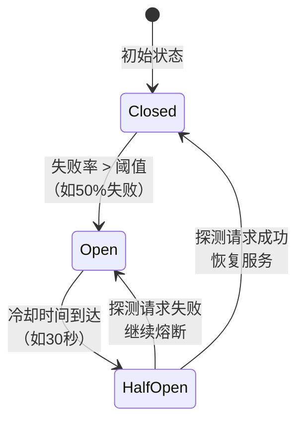

**三种状态详解**

| 状态 | 请求处理 | 检测机制 | 典型配置 | 注意事项 |
|------|---------|---------|---------|---------|
| 关闭(Closed) | 正常放行 | 统计失败率/慢调用率 | 滑动窗口100个请求，失败率>50%触发熔断 | 正常状态，持续监控 |
| 打开(Open) | 直接拒绝/降级 | 不检测（避免对故障服务造成压力） | 熔断持续30秒 | 保护下游服务 |
| 半开(Half-Open) | 放行少量探测请求 | 探测请求是否成功 | 放行10%的请求，成功率>80%则关闭熔断 | 试探性恢复 |

**降级策略**

当熔断打开时，系统需要提供降级响应而非直接报错。降级的核心原则是"有损但可用"：

- **返回缓存数据**：商品详情页返回缓存中的历史数据（数据可能延迟但不会报错）
- **返回默认值**：推荐服务返回默认热门商品列表（不精准但可用）
- **简化流程**：跳过非核心逻辑（如个性化推荐、实时库存检查）
- **异步处理**：同步请求转为异步，先返回"处理中"状态（最终一致性）
- **排队等待**：将请求放入队列，待服务恢复后异步处理

```python
import time

class CircuitBreaker:
    def __init__(self, failure_threshold=5, recovery_timeout=30):
        self.failure_threshold = failure_threshold
        self.recovery_timeout = recovery_timeout
        self.failure_count = 0
        self.state = "CLOSED"
        self.last_failure_time = 0

    def call(self, func, *args, **kwargs):
        if self.state == "OPEN":
            if time.time() - self.last_failure_time > self.recovery_timeout:
                self.state = "HALF_OPEN"
            else:
                return self.fallback(*args, **kwargs)

        try:
            result = func(*args, **kwargs)
            self.on_success()
            return result
        except Exception as e:
            self.on_failure()
            return self.fallback(*args, **kwargs)

    def on_success(self):
        self.failure_count = 0
        self.state = "CLOSED"

    def on_failure(self):
        self.failure_count += 1
        self.last_failure_time = time.time()
        if self.failure_count >= self.failure_threshold:
            self.state = "OPEN"

    def fallback(self, *args, **kwargs):
        return {"status": "degraded", "message": "服务暂时不可用，请稍后重试"}
```

**熔断器的生产级实现**

生产环境中建议使用成熟的熔断器框架，而非自研：

| 框架 | 语言 | 特点 | 适用场景 |
|------|------|------|---------|
| Resilience4j | Java | 轻量级、函数式、支持Spring Boot | Java微服务 |
| Hystrix | Java | Netflix开源（已停更，但设计理念影响深远） | 遗留系统 |
| Sentinel | Java | 阿里开源、支持流控+熔断+系统保护 | Dubbo/Spring Cloud |
| Sentinel-Go | Go | Sentinel的Go语言版本 | Go微服务 |
| Polly | C# | .NET生态最流行的弹性库 | .NET微服务 |
| opossum | Node.js | 基于状态机的熔断器 | Node.js服务 |

---

### 7. 背压与流量控制

当下游处理速度跟不上上游发送速度时，如果没有背压（Backpressure）机制，系统会因内存耗尽而崩溃。背压的核心思想是：**当下游不堪重负时，向上游传递"减速"信号，形成端到端的流量控制**。

背压与限流的区别：限流是站在入口处的"门卫"，控制进入系统的总量；背压是系统内部的"减震器"，在生产者和消费者之间动态调节流量。

**背压的核心思想**

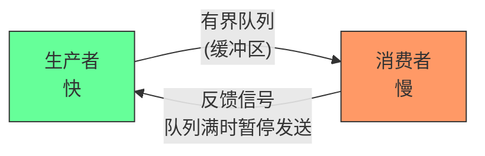

**三种背压策略**

| 策略 | 行为 | 优点 | 缺点 | 适用场景 |
|------|------|------|------|---------|
| 丢弃(OVERFLOW_DROP) | 丢弃超出缓冲区的消息 | 简单快速，不阻塞 | 数据丢失 | 日志采集、监控上报 |
| 阻塞(BACKPRESSURE_BLOCK) | 上游阻塞等待缓冲区空闲 | 不丢数据 | 响应时间不可控 | 数据库写入、文件I/O |
| 丢弃最旧(OVERFLOW_DROP_OLDEST) | 丢弃缓冲区最旧的消息 | 保留最新状态 | 历史数据丢失 | 实时指标、传感器数据 |

**响应式流中的背压**

Reactive Streams（如Project Reactor、RxJava、Flow API）通过`request(n)`机制实现精细化背压：下游主动告诉上游"我还能处理n个元素"，上游据此控制发送速率。这是目前最优雅的背压实现方式。

```java
// Project Reactor 背压示例
Flux.range(1, 1000000)
    .onBackpressureBuffer(256)          // 缓冲256个元素，超出后触发策略
    .concatMap(i -> processSlow(i))      // 慢处理
    .subscribe();

// 背压策略选择
Flux.range(1, 1000000)
    .onBackpressureDrop(i -> log("Dropped: {}", i))     // 丢弃
    .onBackpressureBuffer(256, BufferOverflowStrategy.DROP_OLDEST)  // 丢弃最旧
    .onBackpressureLatest()              // 只保留最新
    .subscribe();
```

**消息队列中的背压**

Kafka、RabbitMQ等消息队列天然支持背压：消费端按自己的速率拉取消息（pull模式），不会被生产端淹没。但如果消费端处理太慢导致消息堆积，需要设置合理的告警阈值和消费者组的并行度。

**TCP层面的背压**

TCP协议本身就是一种背压机制：接收窗口（Receive Window）告诉发送方"我还能接收多少数据"。当接收方处理不过来时，会缩小接收窗口，发送方自动减速。这就是TCP流控（Flow Control）的本质。

---

### 8. 高并发架构模式

**微服务拆分**

将单体应用按业务域拆分为独立服务，每个服务独立扩容。核心原则：

- **按读写分离拆分**：读密集型服务（如商品查询）和写密集型服务（如订单创建）的资源需求完全不同，分开部署便于独立扩缩容
- **按流量模式拆分**：高频低延迟服务（如用户认证）和低频高延迟服务（如报表生成）不应共用资源池
- **避免循环依赖**：服务间调用必须保持单向，循环依赖会导致部署耦合和故障传播
- **边界清晰**：每个微服务有独立的数据库（Database per Service），避免数据层面的耦合

**异步化架构**

同步调用链中，每个调用者都要等待下游响应，整条链路的延迟是各环节延迟之和。异步化通过消息队列解耦调用方和被调方，核心优势：

- **削峰填谷**：突发流量被消息队列缓冲，消费端按自身能力匀速处理
- **故障隔离**：下游服务故障不会直接阻塞上游
- **时间解耦**：调用方不需要等待被调方处理完成

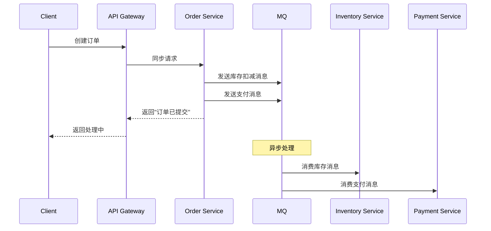

**缓存分层架构**

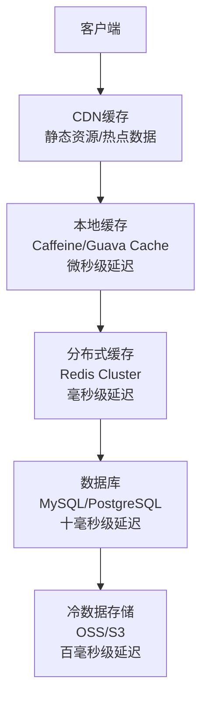

每层缓存的命中率和延迟对比：

| 层级 | 典型延迟 | 典型命中率 | 适用数据 | 缓存失效策略 |
|------|---------|-----------|---------|------------|
| CDN | 1-10ms | 80-95% | 静态资源、热点页面 | TTL + 版本号 |
| 本地缓存 | 0.01-0.1ms | 60-80% | 配置信息、频繁读取的元数据 | LRU/LFU淘汰 |
| Redis | 0.5-2ms | 90-99% | 会话数据、排行榜、计数器 | TTL + 主动失效 |
| 数据库 | 1-100ms | - | 全量持久化数据 | - |

**数据库高并发优化**

数据库往往是高并发系统的最大瓶颈。关键优化手段：

- **读写分离**：主库写、从库读，通过中间件（如ShardingSphere）自动路由
- **分库分表**：水平拆分减少单表数据量（建议单表<2000万行），垂直拆分分离冷热数据
- **连接池调优**：合理设置max_active，避免连接数耗尽
- **SQL优化**：添加合适索引、避免全表扫描、使用覆盖索引
- **批量操作**：将多次单条插入合并为批量插入，减少网络往返

---

### 9. 高并发关键指标

评估系统高并发能力需要关注以下核心指标：

| 指标 | 全称 | 含义 | 典型目标 | 测量工具 |
|------|------|------|---------|---------|
| QPS | Queries Per Second | 每秒查询数（读操作） | 因场景而异 | wrk/ab/jmeter |
| TPS | Transactions Per Second | 每秒事务数（完整业务操作） | 金融场景核心指标 | wrk/jmeter |
| P50延迟 | 50th Percentile Latency | 50%的请求响应时间上限 | < 50ms | Prometheus/Grafana |
| P99延迟 | 99th Percentile Latency | 99%的请求响应时间上限 | < 200ms | Prometheus/Grafana |
| P999延迟 | 99.9th Percentile Latency | 99.9%的请求响应时间上限 | < 1s | Prometheus/Grafana |
| 并发连接数 | Concurrent Connections | 同时维持的活跃连接数 | 因架构而异 | netstat/ss |
| 错误率 | Error Rate | 失败请求占总请求的比例 | < 0.1% | 监控系统 |
| 线程池饱和度 | Thread Pool Saturation | 活跃线程占总线程数的比例 | < 80% | JMX/Actuator |
| CPU使用率 | CPU Utilization | CPU忙碌时间占比 | < 70%（留余量） | top/mpstat |
| 内存使用率 | Memory Utilization | 内存使用占总量的比例 | < 80% | free/meminfo |
| GC暂停时间 | GC Pause Time | 垃圾回收导致的STW时间 | < 50ms（P99） | GC日志/Arthas |

**P99 vs 平均延迟**

平均延迟会掩盖长尾问题。假设100个请求中99个在10ms完成，1个在10秒完成，平均延迟为110ms（看起来不错），但P99为10秒（实际很差）。高并发系统必须关注百分位延迟，而非平均值。

| 指标 | 数值 | 说明 |
|------|------|------|
| 平均延迟 | 110ms | 99%请求10ms + 1%请求10s → 平均值被拉高 |
| P50 | 10ms | 一半请求在10ms内完成 |
| P99 | 10s | 1%的请求需要10秒！ |
| 结论 | - | 平均值110ms看似可用，但1%用户体验极差 |

**SLA与可用性计算**

| SLA等级 | 年度不可用时间 | 月度不可用时间 | 典型代表 |
|---------|-------------|-------------|---------|
| 99% | 3.65天 | 7.31小时 | 一般内部系统 |
| 99.9% | 8.76小时 | 43.8分钟 | 重要业务系统 |
| 99.99% | 52.6分钟 | 4.38分钟 | 核心交易系统 |
| 99.999% | 5.26分钟 | 26.3秒 | 金融/通信核心 |

---

### 10. 真实案例与数据

**案例一：淘宝双十一**

- 2020年双十一峰值QPS：58.3万次/秒
- 核心架构：全链路异步化 + 单元化部署 + 预热机制
- 关键技术：自研TAE容器平台、全链路压测、热点数据探测与散列
- 2023年双十一：峰值QPS超过100万次/秒，全面云原生化

**案例二：微信长连接**

- 单机维护200万+长连接
- 核心架构：自研SvrKit框架（C++实现的Reactor模型）
- 关键优化：连接复用、协议精简（二进制协议而非HTTP）、内存池化
- 消息推送：采用读扩散+写扩散混合模型，平衡读写压力

**案例三：Twitter Timeline**

- 早期用MySQL存储Timeline，读写放大严重
- 后引入Fanout服务：写时扩散（写扩散到所有粉丝的Timeline缓存）
- 最终演变为混合模型：大V使用拉取（pull），普通用户使用推送（push）
- 教训：大V的粉丝数可能过亿，写扩散会导致"写放大"风暴

**案例四：Netflix**

- 日均处理10亿+API请求
- 关键架构：Zuul网关限流 + Hystrix熔断 + Eureka服务发现
- 混沌工程实践：定期注入故障（Chaos Monkey）验证系统韧性
- 从Hystrix迁移到Resilience4j：更轻量、更符合Reactive编程范式

---

### 11. 常见误区与排错指南

**误区一：线程越多越好**

许多开发者遇到性能问题时的第一反应是增加线程数。实际上，线程数超过CPU核心数的2-4倍后，上下文切换开销会吞噬新增的处理能力。正确做法是通过压测找到最优线程数，并配合异步化减少线程等待。

线程数与吞吐量的关系（示意）：

吞吐量
  ^
  |           /\
  |          /  \
  |         /    \         <-- 上下文切换开销 > 新增处理能力
  |        /      \
  |       /        \
  |      /          \______
  |     /
  |    /
  |___/
  +------------------------> 线程数
       最优线程数

**误区二：缓存是万能的**

引入Redis不等于解决了高并发问题。常见的缓存陷阱包括：

| 陷阱 | 现象 | 原因 | 解决方案 |
|------|------|------|---------|
| 缓存穿透 | 请求的数据在缓存和DB中都不存在，每次都穿透到DB | 恶意攻击或ID非法 | 布隆过滤器/空值缓存 |
| 缓存击穿 | 热点key过期瞬间，大量请求同时打到DB | 热点key集中过期 | 互斥锁/singleflight |
| 缓存雪崩 | 大量key同时过期，请求全部涌入DB | 缓存同时失效 | 过期时间加随机偏移 |
| 缓存与DB不一致 | 缓存中是旧数据，DB中是新数据 | 更新策略不当 | 延迟双删/CDC同步 |

**误区三：同步转异步就能提升性能**

异步化减少了线程等待，但增加了系统复杂度。异步链路中的异常排查、消息丢失、顺序性保证都需要额外机制（如分布式链路追踪、消息确认、幂等设计）。**没有免费的午餐——复杂度守恒**。

**误区四：忽视慢查询的影响**

在高并发场景下，一个慢查询会占用连接池资源，导致后续请求全部阻塞。必须设置查询超时（statement timeout）和慢查询日志，及时发现并优化。

**误区五：过度设计**

不是所有系统都需要百万级并发能力。过早引入复杂的分布式架构（如服务网格、事件溯源）会增加开发和运维成本。**先单机优化到极限，再水平扩展**。

**常见故障排查路径**

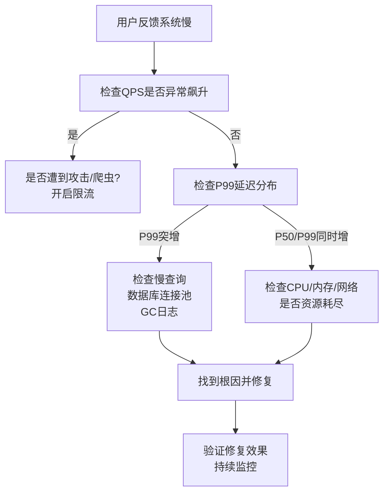

---

### 12. 本章导览与学习路径

本章从高并发的基础理论出发，系统讲解了支撑高并发系统的核心技术。以下是各小节的定位与阅读建议：

| 小节 | 内容 | 适合读者 | 建议阅读时间 |
|------|------|---------|-------------|
| I/O模型与Reactor | epoll/Reactor/事件驱动 | 初中级后端开发 | 2-3小时 |
| 线程池与任务调度 | 线程池参数/拒绝策略/最优线程数 | 初中级后端开发 | 1-2小时 |
| 连接池技术 | 连接池参数/泄漏排查/健康检查 | 初中级后端开发 | 1小时 |
| 限流算法 | 四种限流算法/分布式限流/自适应限流 | 中级后端开发 | 2-3小时 |
| 熔断降级 | 熔断器模式/降级策略/故障注入 | 中高级架构师 | 1-2小时 |
| 背压与流控 | 背压机制/响应式流/流量整形 | 中高级后端开发 | 1-2小时 |
| 高并发架构模式 | 缓存分层/异步化/读写分离/热点散列 | 架构师/技术负责人 | 3-4小时 |
| 实战案例 | 淘宝/微信/Twitter/Netflix的高并发实践 | 所有读者 | 2-3小时 |

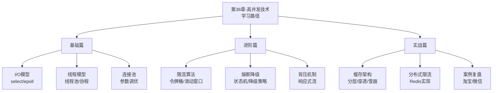

---

### 13. 与其他章节的关系

高并发技术不是孤立的知识点，它与本书多个章节形成紧密的知识网络：

| 关联章节 | 关联点 | 说明 |
|---------|-------|------|
| 第12章 缓存系统 | 缓存分层架构 | 缓存是高并发系统的核心组件，本章的缓存分层架构需要结合缓存系统的深入理解 |
| 第35章 消息队列 | 异步化架构 | 异步化是高并发架构的关键手段，消息队列是实现异步化的基础设施 |
| 第37章 高可用架构 | 可用性保障 | 高并发关注"快"，高可用关注"稳"，两者共同构成系统可靠性的基石 |
| 第50章 数据一致性 | 分布式事务 | 高并发场景下的数据一致性是分布式系统的核心挑战之一 |
| 第51章 读写分离与分库分表 | 数据库扩展 | 数据库层面的高并发解决方案 |
| 第54章 分布式锁 | 并发控制 | 高并发写入场景下的并发控制手段 |
| 第38章 性能优化 | 全链路调优 | 高并发系统的性能优化需要端到端的系统性思维 |

---

> **本章小结**：高并发是一个系统工程，没有银弹。从I/O模型到线程调度，从限流熔断到缓存分层，每一层技术都有其适用场景和局限性。真正的高并发能力来自于对这些技术的深刻理解和灵活组合，而非简单堆砌。记住：**先让系统正确，再让系统快；先单机优化，再水平扩展；先有监控，再谈优化**。
