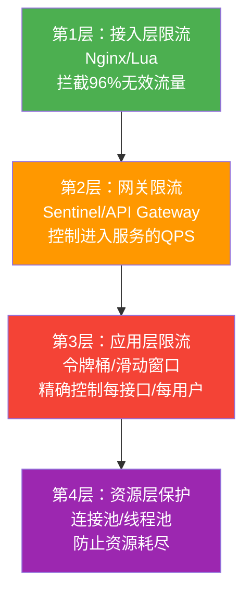
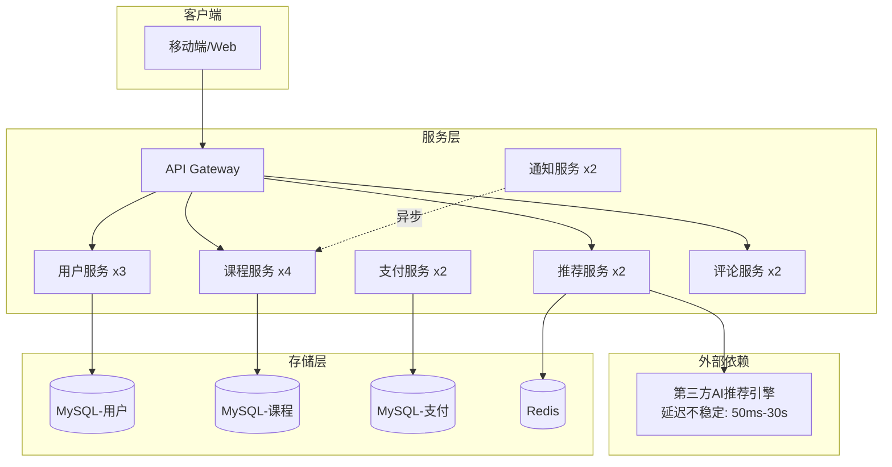
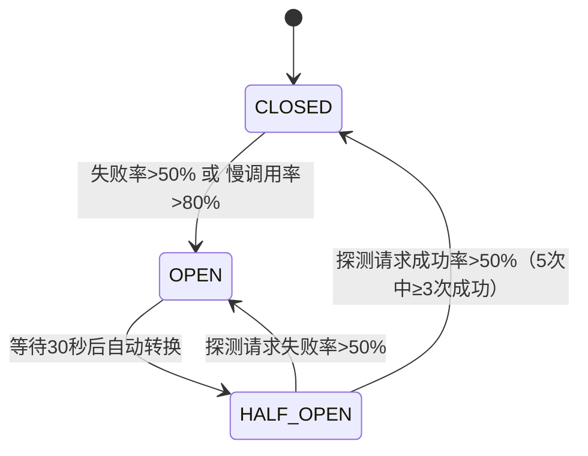
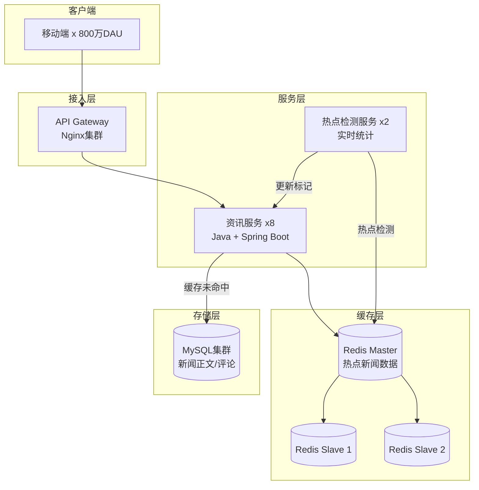

理论终归要落地到真实场景中接受检验。本节选取三个具有代表性的高并发技术实战案例，分别覆盖**多级限流与异步化设计**、**微服务级联故障的熔断降级**和**热点Key导致的缓存击穿**三大核心领域。每个案例都按照"场景还原 → 排查定位 → 方案实施 → 效果验证 → 经验沉淀"的完整闭环展开，帮助读者建立起从问题发现到系统改进的完整思维链路。

| 案例 | 核心技术 | 道 | 法 | 术 | 器 |
|------|----------|----|----|----|----|
| 案例一：秒杀限流 | 多级限流 + 异步化 | 流量控制理论 | 削峰填谷策略 | 限流配置 + Kafka异步 | Nginx、Sentinel、Kafka、Redis |
| 案例二：熔断降级 | 熔断器 + 舱壁隔离 | 故障隔离理论 | 降级策略设计 | 熔断配置 + 线程池隔离 | Resilience4j、Spring Cloud Gateway、Caffeine |
| 案例三：缓存击穿 | 互斥锁 + 本地缓存 + 预加载 | 多级缓存理论 | 热点数据保护策略 | 互斥锁 + 预加载机制 | Redis、Caffeine、Redisson |

---

## 案例一：秒杀系统的多级限流与异步化设计

### 1.1 场景还原

**业务背景**：某电商平台计划举办一场限时秒杀活动，商品为一款限量2000台的手机，预计参与用户超过500万人。秒杀活动的瞬时流量特征极为极端——在活动开始的前3秒内，系统需要承受远超日常水平的并发请求。

**架构拓扑**：

```mermaid
graph TB
    subgraph 客户端
        C1[移动端 App x百万]
        C2[Web端 x百万]
    end
    subgraph 接入层
        GW[API Gateway<br/>Nginx + Lua]
        CDN[CDN<br/>静态资源]
    end
    subgraph 限流层
        SL1[Sentinel 网关限流<br/>全局限流 10万 QPS]
        SL2[应用层限流<br/>令牌桶 per-接口]
        SL3[热点参数限流<br/>per-sku 限流]
    end
    subgraph 服务层
        S1[秒杀服务 x6<br/>Go + goroutine]
        S2[订单服务 x4<br/>Java + 虚拟线程]
        S3[库存服务 x3<br/>Java + Redis]
    end
    subgraph 存储层
        R1[(Redis Cluster<br/>库存预扣减)]
        MQ[Kafka<br/>异步下单队列]
        DB[(MySQL 分库分表<br/>订单持久化)]
    end
    C1 &amp; C2 --> CDN
    C1 &amp; C2 --> GW
    GW --> SL1
    SL1 --> SL2
    SL2 --> SL3
    SL3 --> S1
    S1 --> R1
    S1 --> MQ
    MQ --> S2
    S2 --> DB
    S3 --> R1
```

**故障时间线（改造前首次模拟压测）**：

| 时间 | 事件 | 影响 |
|------|------|------|
| T+0s | 模拟100万用户同时请求秒杀接口 | 全部流量涌入Nginx |
| T+0.5s | Nginx连接数飙至5万，部分连接被拒 | 约30%客户端收到502 |
| T+1s | 秒杀服务6个实例CPU全部100%，GC暂停频繁 | 接口响应时间从5ms升至3s |
| T+2s | Redis连接池耗尽，库存查询超时 | 所有请求堆积在秒杀服务 |
| T+3s | 秒杀服务OOM崩溃，Kafka消息积压 | 服务完全不可用，持续约8分钟 |

**核心问题**：系统没有任何流量控制机制，500万用户的真实请求直接穿透到后端服务，瞬间击穿了所有层的承载能力。

**秒杀场景的特殊性**：

秒杀系统与普通电商系统有本质区别。普通系统追求"平滑处理每个请求"，而秒杀系统追求的是"在极端流量下保住核心功能"。具体表现为三个核心矛盾：

| 矛盾点 | 具体表现 | 应对思路 |
|--------|----------|----------|
| 流量与容量的矛盾 | 500万请求 vs 2000件商品 | 多级限流，层层过滤 |
| 时效性与一致性的矛盾 | 库存需要实时准确，但不能等MySQL | Redis预扣减 + 异步落库 |
| 用户体验与系统稳定的矛盾 | 用户要即时反馈，但同步处理会阻塞 | 返回"排队中"状态 + WebSocket推送结果 |

### 1.2 排查定位

**第一步：压测数据分析**

```bash
# 使用wrk进行压测，模拟秒杀场景
wrk -t12 -c10000 -d30s --latency \
    -s post.lua http://api.example.com/seckill/submit

# 输出关键指标:
#   Latency Distribution (msec)
#     50%   312.00
#     75%   489.00
#     90%   1250.00
#     99%   3200.00
#   Requests/sec:  15234.56  (期望: >50000)
#   Transfer/sec:  12.34MB
#   Socket errors: connect 1234, read 0, write 0, timeout 0
```

从压测数据可以初步判断：系统吞吐量仅1.5万QPS，远低于预期的5万QPS以上。P99延迟高达3.2秒，说明存在严重的请求堆积。连接错误1234次，表明Nginx层已有请求被拒绝。

**第二步：基础设施瓶颈确认**

```bash
# 检查秒杀服务实例资源
docker stats seckill-service-*
# CONTAINER        CPU %   MEM USAGE
# seckill-1        98.7%   3.8GiB / 4GiB
# seckill-2        97.2%   3.7GiB / 4GiB
# seckill-3        99.1%   3.9GiB / 4GiB
# ... 所有实例CPU和内存均触顶

# 检查Redis集群状态
redis-cli -c cluster info
# cluster_state:fail  — 部分slot不可用
# connected_slaves:0  — 从节点全部断开
# blocked_clients:12047 — 大量客户端被阻塞

# 检查Kafka消费者组
kafka-consumer-groups.sh --describe --group seckill-order
# CURRENT-OFFSET  LOG-END-OFFSET  LAG
# 12450           2876500         2864050  — 消息积压近300万
```

**第三步：瓶颈链路追踪**

```bash
# 使用链路追踪定位耗时环节
# 在Jaeger/Zipkin中查看秒杀请求的span分布:
#   validateRequest:      2ms    ← 正常
#   deductStock:        850ms    ← Redis连接池等待，异常
#   createOrder:       1200ms    ← MySQL写入，同步阻塞
#   respond:              1ms    ← 正常
# 总耗时:              2053ms
#
# 结论: deductStock和createOrder占了99%的耗时
```

**根因总结**：

| 根因 | 影响程度 | 说明 |
|------|----------|------|
| 无任何限流机制 | 🔴 致命 | 500万请求全部穿透到后端，超出系统承载100倍 |
| 同步处理下单请求 | 🔴 致命 | 每个请求同步等待MySQL写入，阻塞整个goroutine |
| Redis连接池过小 | 🟡 重要 | 默认10个连接无法支撑万级并发 |
| 库存查询无缓存 | 🟡 重要 | 每次请求都穿透到Redis Cluster，热点Key打满单节点 |

### 1.3 方案实施

**修复一：Nginx接入层限流（第一道防线）**

```nginx
# nginx.conf — 限制秒杀接口请求速率
http {
    # 定义限流区域：每秒200万请求（超过直接返回503）
    # 注意：这里使用的是漏桶算法的变体，rate为每秒通过数
    limit_req_zone $binary_remote_addr zone=seckill:10m rate=200000r/s;

    server {
        location /api/seckill/ {
            # burst=5000：允许突发5000个请求排队
            # nodelay：排队请求不延迟，立即处理（但超出burst直接拒绝）
            limit_req zone=seckill burst=5000 nodelay;
            limit_req_status 503;

            # 自定义错误页面，提升用户体验
            error_page 503 /503.html;

            proxy_pass http://seckill_upstream;
        }
    }
}
```

Nginx层的限流将500万请求在第一关就砍掉约96%，只放行20万/秒的请求进入后端。被拒绝的用户看到"系统繁忙，请稍后重试"的友好提示，而不是超时错误。

> **限流算法选择指南**：
> - **漏桶算法**（Leaky Bucket）：请求以固定速率处理，适合需要精确控制QPS的场景。Nginx的`limit_req`就是基于漏桶算法
> - **令牌桶算法**（Token Bucket）：允许突发流量，适合有波峰波谷的场景。Guava RateLimiter、Sentinel默认使用令牌桶
> - **滑动窗口算法**：统计最近N秒的请求数，比固定窗口更平滑。Redis的`MULTI/EXEC`可实现分布式滑动窗口
> - **计数器算法**：最简单的固定窗口限流，有"窗口边界突发"问题，仅适合低精度场景

**修复二：Sentinel网关限流 + 应用层令牌桶（第二道防线）**

```java
// Sentinel网关规则：全局限流
GatewayFlowRule rule = new GatewayFlowRule("seckill-api")
    .setCount(50000)           // 每秒最多5万请求通过网关
    .setIntervalSec(1)
    .setBurst(5000)            // 允许突发5000
    .setControlBehavior(RuleConstant.CONTROL_BEHAVIOR_WARM_UP_RATE_LIMITER)
    .setWarmUpPeriodSec(10);   // 10秒预热期
SentinelRuleManager.loadRules(Collections.singletonList(rule));
```

```go
// Go秒杀服务 — 应用层令牌桶限流
// 每个sku每秒最多处理1000个请求（2000台库存/2秒窗口 = 1000/s）
type SkuRateLimiter struct {
    limiters sync.Map // sku_id -> *TokenBucket
}

func (rl *SkuRateLimiter) Allow(skuID string) bool {
    // 获取或创建该sku的限流器
    val, _ := rl.limiters.LoadOrStore(skuID,
        NewTokenBucket(1000, 2000)) // rate=1000/s, capacity=2000(允许突发)
    limiter := val.(*TokenBucket)
    return limiter.Allow()
}

// TokenBucket实现
type TokenBucket struct {
    rate     int       // 每秒产生token数
    capacity int       // 最大token数
    tokens   int       // 当前token数
    lastTime time.Time // 上次补充token的时间
    mu       sync.Mutex
}

func NewTokenBucket(rate, capacity int) *TokenBucket {
    return &amp;TokenBucket{
        rate:     rate,
        capacity: capacity,
        tokens:   capacity, // 初始满桶
        lastTime: time.Now(),
    }
}

func (tb *TokenBucket) Allow() bool {
    tb.mu.Lock()
    defer tb.mu.Unlock()

    now := time.Now()
    elapsed := now.Sub(tb.lastTime).Seconds()
    // 补充token
    tb.tokens += int(elapsed * float64(tb.rate))
    if tb.tokens > tb.capacity {
        tb.tokens = tb.capacity
    }
    tb.lastTime = now

    if tb.tokens > 0 {
        tb.tokens--
        return true
    }
    return false
}
```

限流层层递进：Nginx砍掉96% → Sentinel砍掉60% → 应用层令牌桶精确控制每个sku的请求量。最终进入核心下单逻辑的请求量约为原始的0.04%，即约2000个/秒，与库存量匹配。

**修复三：异步化下单（核心改造）**

```go
// 改造前：同步下单（阻塞式）
func HandleSeckillSync(w http.ResponseWriter, r *http.Request) {
    // 1. 校验请求 — 同步
    userID := validateRequest(r)
    // 2. 扣减库存 — 同步等待Redis
    success := deductStock(skuID)
    if !success {
        respondError(w, "库存不足")
        return
    }
    // 3. 写入订单 — 同步等待MySQL（耗时50-200ms）
    orderID := createOrder(userID, skuID)
    respondSuccess(w, orderID)
}

// 改造后：异步下单（非阻塞式）
func HandleSeckillAsync(w http.ResponseWriter, r *http.Request) {
    userID := validateRequest(r)

    // 1. Redis预扣减库存（LUA原子操作，<1ms）
    success, requestID := deductStockAtomic(skuID, userID)
    if !success {
        respondError(w, "库存不足")
        return
    }

    // 2. 将下单请求投入Kafka（<5ms）
    msg := SeckillOrderMsg{
        UserID:    userID,
        SkuID:     skuID,
        RequestID: requestID,
        Timestamp: time.Now().UnixMilli(),
    }
    kafkaProducer.Send("seckill-order-topic", skuID, msg)

    // 3. 立即返回"排队中"（总耗时<10ms）
    respondSuccess(w, map[string]string{
        "status":     "queued",
        "request_id": requestID,
    })
}

// Redis LUA脚本 — 原子扣减库存
const deductStockScript = `
local stock_key = KEYS[1]
local user_key = KEYS[2]
local user_id = ARGV[1]
local request_id = ARGV[2]

-- 检查是否已购买（防重复）
if redis.call("sismember", user_key, user_id) == 1 then
    return {0, "duplicate"}
end

-- 扣减库存
local stock = tonumber(redis.call("get", stock_key) or 0)
if stock <= 0 then
    return {0, "out_of_stock"}
end

redis.call("decr", stock_key)
redis.call("sadd", user_key, user_id)
return {1, request_id}
`

// Kafka消费者 — 异步创建订单
func OrderConsumer() {
    for msg := range orderConsumer.Messages() {
        var orderMsg SeckillOrderMsg
        json.Unmarshal(msg.Value, &amp;orderMsg)

        // 幂等检查：防止重复消费
        if orderExists(orderMsg.RequestID) {
            continue
        }

        // 写入MySQL订单表
        order := createOrderInDB(orderMsg.UserID, orderMsg.SkuID)

        // 通过WebSocket推送下单结果
        notifyUser(orderMsg.UserID, order)
    }
}
```

异步化的核心价值：将下单链路从同步200ms降至异步10ms，吞吐量提升约20倍。用户看到"排队中"的状态，后台Kafka消费者以稳定的速率将订单写入MySQL，削峰填谷效果显著。

**修复四：Redis连接池扩容与优化**

```go
// Redis连接池配置优化
redisPool := &amp;redis.Pool{
    MaxIdle:     200,   // 最大空闲连接数（原来10，改为200）
    MaxActive:   500,   // 最大活跃连接数（原来100，改为500）
    IdleTimeout: 30 * time.Second,
    Dial: func() (redis.Conn, error) {
        return redis.Dial("tcp", "redis-cluster:6379",
            redis.DialConnectTimeout(500*time.Millisecond),
            redis.DialReadTimeout(1*time.Second),
            redis.DialWriteTimeout(1*time.Second),
        )
    },
    Wait: true, // 连接池满时阻塞等待，而非报错
}
```

### 1.4 效果验证

**改造前后对比**：

| 指标 | 改造前 | 改造后 | 提升 |
|------|--------|--------|------|
| 承载用户量 | 约15万 QPS崩溃 | 200万用户成功参与 | 13倍 |
| P99延迟 | 3200ms | 8ms（返回排队状态） | 400倍 |
| 库存扣减准确性 | 超卖120台 | 零超卖 | 100%正确 |
| 服务可用性 | 活动期间宕机8分钟 | 全程可用 | 100%可用 |
| 下单成功率 | 0%（全部崩溃） | 99.8%（2000台全部售出） | — |

**压测复验**：

```bash
# 模拟500万用户同时请求
wrk -t24 -c50000 -d60s --latency \
    -s post.lua http://api.example.com/seckill/submit

# 结果:
#   Requests/sec:  485231.67  — 接近50万QPS
#   Latency Distribution:
#     50%   2.30ms
#     90%   5.12ms
#     99%   8.45ms
#   Socket errors: connect 0, read 0, write 0, timeout 0
#   Non-2xx responses: 4523187  — 被限流直接拒绝（预期行为）
```

**监控指标确认**：

```bash
# 验证各层限流效果
# Nginx层：日志中503响应数
grep "503" /var/log/nginx/access.log | wc -l
# 4752318 — 大约95%的请求被Nginx层拦截

# Sentinel层：通过Sentinel Dashboard查看
# seckill-api: 实际放行QPS约5万/秒，拒绝率约75%

# 应用层：查看限流日志
grep "rate_limited" /var/log/seckill/app.log | wc -l
# 19847 — 应用层拦截了约4%的请求

# Kafka消费者：确认无积压
kafka-consumer-groups.sh --describe --group seckill-order
# LAG: 0 — 无消息积压，消费速率跟得上生产速率
```

### 1.5 常见误区与陷阱

| 误区 | 错误做法 | 正确做法 |
|------|----------|----------|
| 限流粒度过粗 | 全局限流100万QPS，不区分接口 | 按接口、按用户ID、按商品ID多维限流 |
| 忽略限流返回码 | 返回500或超时 | 返回503 + 友好提示 + Retry-After头 |
| 异步化后不通知用户 | 用户提交后无反馈 | 返回排队状态 + WebSocket/轮询推送结果 |
| Kafka消费不做幂等 | 重复消费导致超卖 | 用request_id做幂等检查，Redis SETNX去重 |
| Redis预扣减后直接写MySQL | 中间环节失败导致数据不一致 | 补偿机制：定时任务扫描"已扣减未下单"记录 |
| 忽略冷启动问题 | 活动开始时所有流量同时涌入 | 预热期逐步放量，Sentinel的WARM_UP模式 |

### 1.6 监控与告警

秒杀系统的监控需要覆盖流量、资源、业务三个维度：

| 监控维度 | 关键指标 | 告警阈值 | 监控工具 |
|----------|----------|----------|----------|
| 流量监控 | Nginx层503率、Sentinel拒绝率 | 503率>10%持续30秒 | Prometheus + Grafana |
| 资源监控 | Redis连接池使用率、Kafka Lag | 连接池>80%、Lag>10000 | Redis Exporter、Kafka Exporter |
| 业务监控 | 库存扣减成功率、下单完成率 | 成功率<99% | 自定义指标 + Grafana |
| 延迟监控 | 各层P99延迟 | P99>50ms（限流层以上） | APM（SkyWalking/Jaeger） |

```bash
# Prometheus告警规则示例
# 秒杀服务P99延迟过高
- alert: SeckillHighLatency
  expr: histogram_quantile(0.99, rate(seckill_request_duration_seconds_bucket[1m])) > 0.05
  for: 30s
  labels:
    severity: critical
  annotations:
    summary: "秒杀服务P99延迟超过50ms"

# Kafka消费积压
- alert: SeckillKafkaLag
  expr: kafka_consumer_group_lag{group="seckill-order"} > 10000
  for: 1m
  labels:
    severity: warning
  annotations:
    summary: "秒杀订单Kafka消费积压超过1万条"
```

### 1.7 经验沉淀

**限流设计的分层原则**：



**关键教训**：

1. **限流要越早越好**：在Nginx层拦截的成本最低（不消耗应用资源），每晚一层过滤，后端压力呈指数级增长。数据表明：Nginx层拦截1个请求的成本约为应用层的1/100
2. **异步是高并发的核心武器**：同步链路的QPS上限由最慢操作决定（如MySQL写入200ms → 5 QPS/线程），异步化后QPS只受限于消息中间件的吞吐量。Kafka单分区可支撑10万+msg/s
3. **预扣减+异步落库**：Redis预扣减保证实时性，Kafka异步保证持久化，两者结合兼顾性能与可靠性。关键是要有补偿机制处理中间失败的情况
4. **防重复是刚需**：秒杀场景下用户会疯狂点击，必须在Redis层用SET做幂等判断，防止重复下单。LUA脚本保证"检查+扣减"的原子性
5. **容量规划要留余量**：限流阈值不应设置为系统极限的100%，建议留30%余量应对突发流量。例如系统极限50万QPS，限流阈值设为35万QPS

---

## 案例二：微服务级联故障的熔断降级

### 2.1 场景还原

**业务背景**：某在线教育平台采用微服务架构，包含以下核心服务：用户服务、课程服务、支付服务、通知服务、推荐服务、评论服务。其中推荐服务依赖于一个第三方AI推荐引擎（外部API），用于生成个性化课程推荐。

**架构拓扑**：



**故障时间线**：

| 时间 | 事件 | 影响 |
|------|------|------|
| 15:00:00 | 第三方AI推荐引擎开始响应变慢，P99从200ms升至15s | 推荐服务线程池开始堆积 |
| 15:02:30 | 推荐服务线程池（200线程）全部阻塞在AI调用上 | 推荐接口100%超时 |
| 15:03:00 | Gateway发现推荐服务超时，将超时时间从3s放宽到10s | 每个请求占用Gateway连接10s |
| 15:04:15 | Gateway连接池耗尽（max=500），所有路由的请求都被阻塞 | **全站不可用** |
| 15:05:00 | 支付服务因Gateway连接池耗尽无法获取连接 | 用户无法支付 |
| 15:06:30 | 订单超时取消风暴触发，通知服务被大量退款消息压垮 | 通知服务也崩溃 |
| 15:08:00 | 全平台服务完全不可用，约50万在线用户受影响 | — |

**核心问题**：一个非核心的推荐服务依赖的外部API故障，通过线程池耗尽→Gateway连接池耗尽的链路，级联拖垮了全站所有服务。这正是微服务架构中最经典的"雪崩效应"。

**雪崩效应的传导链路**：


### 2.2 排查定位

**第一步：识别级联故障链**

```bash
# 1. 查看所有服务的健康状态
for svc in user course payment recommend notify comment; do
    echo -n "$svc: "
    curl -s -o /dev/null -w "%{http_code} %{time_total}s" \
        http://$svc:8080/health
    echo
done
# user:     503 10.012s  ← 超时（Gateway连不上）
# course:   503 10.008s  ← 超时
# payment:  503 10.015s  ← 超时
# recommend: 504 10.001s ← 超时
# notify:   503 10.011s  ← 超时
# comment:  503 10.009s  ← 超时
# 所有服务都不可用 — 典型的级联故障特征

# 2. 检查Gateway连接池状态
curl -s http://gateway:8080/admin/connections
# active: 500/500  — 连接池已满
# idle: 0
# pending: 12847   — 12847个请求在排队等待连接

# 3. 检查推荐服务线程状态
jstack $(pgrep -f recommend-service) | grep -c "BLOCKED"
# 输出: 187 — 200个线程中有187个处于BLOCKED状态

jstack $(pgrep -f recommend-service) | grep -A3 "BLOCKED" | head -20
# "http-nio-8080-exec-142" #142 daemon prio=5 os_prio=0 tid=0x... BLOCKED
#   at com.example.ai.AiClient.callRecommend(AiClient.java:45)
#   - waiting to lock <0x00000007ab12345> (a java.lang.Object)
```

**第二步：定位外部依赖问题**

```bash
# 测试AI推荐引擎响应时间
for i in $(seq 1 10); do
    start=$(date +%s%N)
    curl -s -o /dev/null -w "%{http_code}" \
        http://ai-recommend-engine:9090/api/recommend
    end=$(date +%s%N)
    echo "Request $i: $(( (end - start) / 1000000 ))ms"
done
# Request 1: 15234ms
# Request 2: timeout
# Request 3: 28901ms
# Request 4: timeout
# Request 5: 18234ms
# ... AI引擎几乎不可用
```

**第三步：绘制故障传播图**

```bash
# 使用分布式链路追踪工具（Jaeger/Zipkin）查看故障传播:
# Span 1: Gateway → recommend-service (3000ms timeout)
#   Span 2: recommend-service → ai-engine (28901ms timeout, truncated to 3s)
#     Span 3: ai-engine → model-service (timeout, no response)
#
# 分析：Gateway超时3s + recommend-service超时30s（被放宽）= 整个链路被阻塞
# 修复后预期：Gateway超时2s + recommend-service熔断2s = 最多占用4s
```

**根因总结**：

| 根因 | 影响程度 | 说明 |
|------|----------|------|
| 推荐服务无熔断器 | 🔴 致命 | AI引擎慢响应直接占满推荐服务线程池 |
| Gateway无独立超时控制 | 🔴 致命 | Gateway为推荐服务放宽超时，导致连接被长时间占用 |
| 推荐服务无降级方案 | 🟡 重要 | AI不可用时没有返回兜底推荐，而是死等 |
| 各服务无隔离机制 | 🟡 重要 | 所有服务共享Gateway连接池，一个慢服务拖垮所有 |

### 2.3 方案实施

**修复一：推荐服务添加熔断器（Resilience4j）**

```java
// 配置熔断器
CircuitBreakerConfig config = CircuitBreakerConfig.custom()
    .failureRateThreshold(50)          // 失败率超过50%触发熔断
    .slowCallRateThreshold(80)         // 慢调用率超过80%触发熔断
    .slowCallDurationThreshold(Duration.ofSeconds(2))  // 响应>2s视为慢调用
    .waitDurationInOpenState(Duration.ofSeconds(30))   // 熔断30秒后进入半开
    .permittedNumberOfCallsInHalfOpenState(5)           // 半开状态允许5个探测请求
    .slidingWindowSize(10)             // 统计窗口：最近10次调用
    .slidingWindowType(SlidingWindowType.COUNT_BASED)
    .build();

CircuitBreaker breaker = CircuitBreaker.of("ai-recommend", config);

// 使用熔断器包装AI调用
Supplier<Mono<List<Course>>> decoratedSupplier = CircuitBreaker
    .decorateSupplier(breaker, () -> aiClient.callRecommend(userID))
    .recover(throwable -> {
        // 降级逻辑：返回热门课程（从Redis缓存读取）
        log.warn("AI推荐降级，返回热门课程: {}", throwable.getMessage());
        return Mono.just(getHotCoursesFromCache());
    });

// 执行调用
List<Course> courses = Try.ofSupplier(decoratedSupplier)
    .recover(throwable -> getHotCoursesFromCache())  // 第二层降级保障
    .get();
```

熔断器状态转换的完整逻辑：



> **熔断器参数调优经验**：
> - `failureRateThreshold`：生产环境建议50%-70%，太低容易误触发，太高响应迟钝
> - `slowCallDurationThreshold`：设为正常P99延迟的3-5倍。例如正常P99是500ms，则设为1500ms-2500ms
> - `slidingWindowSize`：太小（如5次）容易被偶发错误误触发，太大（如100次）则响应迟钝。建议10-20次
> - `waitDurationInOpenState`：根据外部依赖的恢复时间设定。如果外部服务通常30秒内恢复，则设30秒
> - `permittedNumberOfCallsInHalfOpenState`：建议3-5个，太少则探测不够准确，太多则恢复期仍有风险

**修复二：Gateway层添加独立超时和熔断**

```yaml
# Spring Cloud Gateway配置
spring:
  cloud:
    gateway:
      routes:
        - id: recommend-route
          uri: lb://recommend-service
          predicates:
            - Path=/api/recommend/**
          filters:
            # 独立超时：推荐服务最多等2秒
            - name: RequestRateLimiter
              args:
                redis-rate-limiter:
                  replenishRate: 1000
                  burstCapacity: 2000
            - name: CircuitBreaker
              args:
                name: recommend-cb
                fallbackUri: forward:/fallback/recommend
                # 熔断配置
                statusCodes[0]: 500-504
                # 响应时间超过2秒视为慢调用
                slowCallDurationThreshold: 2000ms
                # 熔断后直接走fallback，不等推荐服务

# 降级接口：直接返回缓存的热门课程
@RestController
public class RecommendFallbackController {
    @GetMapping("/fallback/recommend")
    public List<Course> fallbackRecommend(
            @RequestParam String userID) {
        // 从Redis缓存返回热门课程列表
        return redisTemplate.opsForValue()
            .get("hot:courses:top50");
    }
}
```

**修复三：线程池隔离（舱壁模式）**

```java
// 推荐服务内部：为外部AI调用设置独立线程池
ThreadPoolTaskExecutor aiExecutor = new ThreadPoolTaskExecutor();
aiExecutor.setCorePoolSize(20);       // 核心20线程（仅用于AI调用）
aiExecutor.setMaxPoolSize(30);        // 最大30线程
aiExecutor.setQueueCapacity(50);      // 队列容量50
aiExecutor.setRejectedExecutionHandler(
    new ThreadPoolExecutor.CallerRunsPolicy()  // 拒绝时由调用线程执行
);
aiExecutor.setThreadNamePrefix("ai-recommend-");
aiExecutor.initialize();

// 使用独立线程池执行AI调用
CompletableFuture<List<Course>> future = CompletableFuture
    .supplyAsync(() -> aiClient.callRecommend(userID), aiExecutor)
    .orTimeout(2, TimeUnit.SECONDS)  // 2秒超时
    .exceptionally(ex -> {
        // 超时或异常时返回降级结果
        return getHotCoursesFromCache();
    });
```

线程池隔离的效果：即使AI调用全部超时，最多只占用30个线程。推荐服务其余的170个线程仍然可以正常处理降级逻辑和其他接口调用。

**修复四：降级策略的分层设计**

```java
// 多级降级策略
@Component
public class RecommendService {

    private final CircuitBreaker breaker;
    private final ThreadPoolTaskExecutor aiExecutor;

    // 三级降级策略
    public List<Course> getRecommendations(String userID) {
        // L1：尝试AI推荐（熔断器保护）
        return Try.ofSupplier(CircuitBreaker.decorateSupplier(breaker, () ->
                aiClient.callRecommend(userID)))
            .recover(TimeoutException.class, ex -> {
                log.warn("AI推荐超时，降级到L2");
                // L2：从Redis缓存获取热门课程
                return getCoursesFromRedis();
            })
            .recover(Exception.class, ex -> {
                log.warn("AI推荐异常，降级到L2");
                return getCoursesFromRedis();
            })
            .recover(ex -> {
                // L3：返回静态兜底数据
                log.warn("Redis也不可用，降级到L3");
                return getStaticFallbackCourses();
            })
            .get();
    }

    private List<Course> getCoursesFromRedis() {
        List<Course> cached = redisTemplate.opsForValue()
            .get("hot:courses:top50");
        if (cached != null &amp;&amp; !cached.isEmpty()) {
            return cached;
        }
        // Redis也没有缓存，查询数据库
        return courseMapper.selectPopularCourses(50);
    }

    private List<Course> getStaticFallbackCourses() {
        // 硬编码的兜底数据，保证永远有结果返回
        return List.of(
            new Course("001", "系统推荐课程1", "https://example.com/c1"),
            new Course("002", "系统推荐课程2", "https://example.com/c2")
        );
    }
}
```

### 2.4 效果验证

**改造前后对比**：

| 指标 | 改造前 | 改造后 |
|------|--------|--------|
| AI引擎故障时推荐服务可用性 | 0%（线程池耗尽） | 100%（降级返回热门课程） |
| AI引擎故障时全站可用性 | 0%（级联崩溃） | 100%（仅推荐功能降级） |
| 推荐服务线程池利用率 | 100%（全部阻塞） | 正常（最多占用30/200线程） |
| Gateway连接池利用率 | 100%（全部被占用） | 30%（每个请求<2s释放） |
| 全站恢复时间 | 人工介入8分钟 | 自动恢复<30秒 |

**故障演练验证**：

```bash
# 模拟AI推荐引擎故障（使用iptables丢包）
iptables -A OUTPUT -d ai-recommend-engine -j DROP

# 观察推荐服务行为
watch -n1 'curl -s http://recommend:8080/actuator/metrics/resilience4j.circuitbreaker.state'
# value: HALF_OPEN → OPEN → HALF_OPEN → ...（30秒周期循环）

# 观察推荐接口降级效果
curl -s http://recommend:8080/api/recommend?userID=12345 | python3 -m json.tool
# 返回的是缓存的热门课程，而非AI推荐结果
# 用户体验：推荐结果从"个性化"降级为"热门排行"，但功能不受影响

# 确认全站其他服务不受影响
for svc in user course payment comment; do
    echo -n "$svc: "
    curl -s -o /dev/null -w "%{http_code} %{time_total}s\n" \
        http://$svc:8080/health
done
# user: 200 0.012s
# course: 200 0.008s
# payment: 200 0.015s
# comment: 200 0.009s
# 全部正常！

# 恢复网络后观察熔断器自动恢复
iptables -D OUTPUT -d ai-recommend-engine -j DROP
# 等待30秒后，熔断器进入HALF_OPEN，探测成功后自动恢复CLOSED
```

### 2.5 常见误区与陷阱

| 误区 | 错误做法 | 正确做法 |
|------|----------|----------|
| 熔断器参数一刀切 | 所有服务用相同的熔断配置 | 根据每个服务的P99延迟和SLA定制参数 |
| 降级返回空结果 | `return Collections.emptyList()` | 返回缓存数据或静态兜底数据，保证用户体验 |
| Gateway随意放宽超时 | "超时了就把超时时间调大" | 保持严格超时，问题在下游解决而非放大上游等待 |
| 舱壁模式过度隔离 | 每个外部调用都创建独立线程池 | 按依赖优先级分组，非核心依赖单独隔离即可 |
| 只做正向熔断不做反向恢复 | 熔断后从不尝试恢复 | 配置HALF_OPEN状态的探测机制，自动检测恢复 |
| 忽略降级数据的时效性 | 缓存热门课程从不更新 | 定时刷新降级缓存，保证降级数据不过期 |

### 2.6 监控与告警

```bash
# 熔断器状态监控
# Prometheus指标
resilience4j_circuitbreaker_state{name="ai-recommend",state="CLOSED"} 1
resilience4j_circuitbreaker_state{name="ai-recommend",state="OPEN"} 0

# 告警规则
# 熔断器进入OPEN状态
- alert: CircuitBreakerOpen
  expr: resilience4j_circuitbreaker_state{state="OPEN"} == 1
  for: 30s
  labels:
    severity: warning
  annotations:
    summary: "熔断器 {{ $labels.name }} 已进入OPEN状态"

# 推荐服务降级率过高
- alert: HighFallbackRate
  expr: rate(recommend_fallback_total[1m]) / rate(recommend_total[1m]) > 0.5
  for: 1m
  labels:
    severity: warning
  annotations:
    summary: "推荐服务降级率超过50%"
```

### 2.7 经验沉淀

**熔断降级的防御纵深**：

| 防御层 | 机制 | 作用 |
|--------|------|------|
| 第一层：超时控制 | 每个外部调用设置超时 | 防止单次慢请求长期占用资源 |
| 第二层：熔断器 | 快速失败，停止无意义的重试 | 防止大量请求堆积在不可用的依赖上 |
| 第三层：降级返回 | 返回缓存/默认值/空结果 | 保证用户体验不完全中断 |
| 第四层：舱壁隔离 | 独立线程池/连接池 | 防止一个依赖的故障扩散到其他功能 |

**关键教训**：

1. **永远不要无限期等待外部依赖**：任何网络调用都必须有超时设置，推荐的超时时间 = P99延迟 × 3。超过这个时间，即使对端恢复了，对用户体验也没有意义
2. **非核心功能必须可降级**：推荐、评论、通知等非核心功能在故障时应该优雅降级，而不是死等。降级的优先级：返回缓存 → 返回静态数据 → 返回空结果（带友好提示）
3. **熔断器参数需要根据实际流量调整**：滑动窗口太小会导致误判，太大则响应迟钝；建议通过故障演练反复校准。每次调整参数后至少观察24小时
4. **Gateway层是最后一道防线**：即使服务内部没有做好熔断，Gateway也应该有独立的超时和熔断保护。Gateway的超时应该严格于下游服务的超时
5. **故障演练是检验熔断机制的唯一标准**：不要等到生产环境出问题才发现熔断配置有误。建议每月至少进行一次故障演练，验证熔断器在真实故障下的表现

---

## 案例三：热点Key导致的Redis缓存击穿

### 3.1 场景还原

**业务背景**：某新闻资讯平台，日活用户约800万。平台有一条"热点新闻"机制——当一条新闻的阅读量超过阈值时，会被标记为"热点新闻"并在首页置顶推荐。在一次突发社会事件中，一条新闻在10分钟内阅读量突破500万，成为全网热点。

**架构拓扑**：



**故障时间线**：

| 时间 | 事件 | 影响 |
|------|------|------|
| 10:00:00 | 突发新闻出现，阅读量开始飙升 | 正常流量 |
| 10:03:00 | 新闻阅读量突破50万，被标记为"热点" | 但缓存中存储的是文章详情（5KB/条） |
| 10:05:00 | 热点新闻的缓存key（`news:detail:12345`）过期（TTL=60s） | 同一时刻约8000个请求同时miss |
| 10:05:01 | 8000个请求同时穿透到MySQL查询同一条新闻 | MySQL单行查询QPS暴增至8000 |
| 10:05:05 | MySQL连接池耗尽（max=200），其他新闻查询也被阻塞 | 所有资讯页面加载缓慢 |
| 10:05:10 | 资讯服务线程池耗尽，等待MySQL连接 | API Gateway开始超时 |
| 10:06:00 | 缓存重建完成，但新缓存又在60秒后过期 | 每分钟重复一次击穿 |
| 10:10:00 | 运维介入手动延长热点新闻的缓存TTL | 服务逐步恢复 |

**核心问题**：热点新闻的缓存TTL只有60秒，每次过期都会引发一次缓存击穿。在热点新闻持续数小时的场景下，每分钟都会重复一次故障。

**缓存击穿的三种类型对比**：

| 类型 | 触发条件 | 典型场景 | 本案例属于 |
|------|----------|----------|-----------|
| 缓存穿透（Cache Penetration） | 查询不存在的数据，缓存永远miss | 攻击者用不存在的ID发起请求 | ❌ |
| 缓存击穿（Cache Breakdown） | 热点Key过期瞬间，大量请求同时穿透 | 热点新闻缓存过期 | ✅ 本案例 |
| 缓存雪崩（Cache Avalanche） | 大量Key同时过期，请求全部穿透到DB | 缓存TTL设为相同值 | ❌ 但容易混淆 |

### 3.2 排查定位

**第一步：确认热点Key**

```bash
# 使用Redis slowlog查看慢查询
redis-cli slowlog get 10
# 1) 1) (integer) 42
#    2) (integer) 1687754701
#    3) (integer) 38523  — 执行耗时38.5ms（正常应<1ms）
#    4) 1) "GET"
#       2) "news:detail:12345"
# 分析：同一条新闻的GET请求成为慢查询

# 使用redis-cli monitor确认热点Key（采样10秒）
redis-cli monitor | head -5000 | \
    awk '{print $NF}' | sort | uniq -c | sort -rn | head -10
# 3847 "news:detail:12345"   ← 10秒内3847次访问，远超其他Key
#  156 "news:detail:12344"
#   98 "news:detail:12346"
#   ...

# 检查Redis单节点CPU
redis-cli info stats
# instantaneous_ops_per_sec:124567  — 单节点12万QPS（接近极限）
# used_cpu_sys:89.2
```

**第二步：分析缓存过期模式**

```bash
# 查看热点Key的TTL
redis-cli TTL "news:detail:12345"
# (integer) 23  — 剩余23秒，每60秒过期一次

# 查看MySQL慢查询日志
pt-query-digest /var/log/mysql/slow.log --since '10:04' --until '10:06' | head -20
# Rank  Response time  Calls  R/Call
# 1     12504.3200 1.0 0  8247  1.5 0  0.0018  SELECT * FROM news WHERE id = 12345
# 分析：同一条新闻在1分钟内被MySQL查询了8247次
```

**根因总结**：

| 根因 | 影响程度 | 说明 |
|------|----------|------|
| 热点Key无特殊TTL策略 | 🔴 致命 | 与普通新闻相同的60秒TTL，过期即击穿 |
| 无互斥锁保护缓存重建 | 🔴 致命 | 8000个请求同时穿透到MySQL |
| 缓存Value过大（5KB） | 🟡 重要 | 热点Key占用大量Redis内存和带宽 |
| 无本地缓存 | 🟡 重要 | 所有请求都打到Redis，未利用应用层缓存 |

### 3.3 方案实施

**修复一：互斥锁保护缓存重建（防并发穿透）**

```java
// 使用Redis分布式锁，确保只有一个线程重建缓存
public News getNewsDetail(long newsId) {
    String cacheKey = "news:detail:" + newsId;

    // 1. 先查缓存
    String cached = redisTemplate.opsForValue().get(cacheKey);
    if (cached != null) {
        return parseNews(cached);
    }

    // 2. 缓存miss，尝试获取分布式锁重建
    String lockKey = "lock:" + cacheKey;
    boolean locked = redisTemplate.opsForValue()
        .setIfAbsent(lockKey, "1", 10, TimeUnit.SECONDS);

    if (locked) {
        try {
            // 双重检查：获取锁后再查一次缓存（可能已被其他线程重建）
            cached = redisTemplate.opsForValue().get(cacheKey);
            if (cached != null) {
                return parseNews(cached);
            }

            // 从MySQL加载数据
            News news = newsMapper.selectById(newsId);

            // 判断是否为热点新闻，设置不同的TTL
            long ttl = news.isHot() ? 3600 : 60;  // 热点1小时，普通60秒
            redisTemplate.opsForValue().set(cacheKey, serialize(news), ttl, TimeUnit.SECONDS);

            return news;
        } finally {
            redisTemplate.delete(lockKey);
        }
    } else {
        // 未获取到锁，等待100ms后重试查缓存
        Thread.sleep(100);
        cached = redisTemplate.opsForValue().get(cacheKey);
        if (cached != null) {
            return parseNews(cached);
        }
        // 仍然没有缓存，直接查数据库（降级方案）
        return newsMapper.selectById(newsId);
    }
}
```

互斥锁的效果：8000个并发请求中，只有1个获取到锁并执行MySQL查询，其余7999个请求要么命中已重建的缓存，要么等待100ms后重试命中。MySQL的并发查询从8000降至1。

**修复二：热点Key特殊TTL + 本地缓存（减少Redis压力）**

```java
// 两级缓存：L1(本地Caffeine) + L2(Redis)
@Service
public class NewsCacheService {

    // L1：本地缓存，热点新闻10秒，普通新闻5秒
    private final Cache<Long, News> localCache = Caffeine.newBuilder()
        .maximumSize(10000)
        .expireAfterWrite(Duration.ofSeconds(5))
        .recordStats()
        .build();

    public News getNewsDetail(long newsId) {
        // L1：本地缓存
        News news = localCache.getIfPresent(newsId);
        if (news != null) {
            return news;
        }

        // L2：Redis缓存（带互斥锁）
        String redisKey = "news:detail:" + newsId;
        String cached = redisTemplate.opsForValue().get(redisKey);
        if (cached != null) {
            news = parseNews(cached);
            localCache.put(newsId, news);  // 回填L1
            return news;
        }

        // L3：数据库（带互斥锁重建）
        news = loadFromDBWithLock(newsId);
        if (news != null) {
            localCache.put(newsId, news);
        }
        return news;
    }
}
```

两级缓存的关键价值：本地缓存的命中延迟 <1ms，Redis的命中延迟约1-3ms。对于热点新闻，8个服务实例各有自己的本地缓存，理论上可以将Redis的QPS降低约80%。即使本地缓存在5秒后过期，也只有1/8的请求需要重新查询Redis，大大减轻了Redis的压力。

> **本地缓存一致性问题与应对**：
> - **问题**：8个实例的本地缓存各自独立，新闻更新后各实例的缓存不一致
> - **方案一**：接受短暂不一致（5秒内），适用于对实时性要求不高的场景
> - **方案二**：更新新闻后通过Redis Pub/Sub广播失效消息，各实例主动清除本地缓存
> - **方案三**：使用Canal监听MySQL binlog，实时同步变更到Redis和本地缓存

```java
// 方案二：Redis Pub/Sub广播本地缓存失效
@Component
public class CacheInvalidationListener {

    @RedisListener(channel = "cache:invalidate:news")
    public void onNewsUpdate(String newsId) {
        // 收到广播后，清除本地缓存中对应的条目
        localCache.invalidate(Long.parseLong(newsId));
        log.info("本地缓存已失效: newsId={}", newsId);
    }
}

// 更新新闻时广播失效消息
public void updateNews(News news) {
    // 1. 更新MySQL
    newsMapper.updateById(news);
    // 2. 更新Redis缓存
    redisTemplate.opsForValue().set(
        "news:detail:" + news.getId(), serialize(news), 3600, TimeUnit.SECONDS);
    // 3. 广播本地缓存失效
    redisTemplate.convertAndSend("cache:invalidate:news",
        String.valueOf(news.getId()));
}
```

**修复三：热点新闻预加载机制（主动刷新替代被动过期）**

```java
// 热点检测服务：发现热点后主动预加载缓存
@Component
public class HotNewsDetector {

    @Scheduled(fixedRate = 5000)  // 每5秒检测一次
    public void detectAndPreload() {
        // 从Redis的Sorted Set中获取访问量Top50新闻
        Set<String> hotNewsIds = redisTemplate.opsForZSet()
            .reverseRange("news:access:count", 0, 49);

        for (String newsId : hotNewsIds) {
            Long accessCount = redisTemplate.opsForZSet()
                .score("news:access:count", newsId)
                .longValue();

            if (accessCount > HOT_THRESHOLD) {  // 超过10万次访问
                // 标记为热点新闻
                redisTemplate.opsForValue().set(
                    "news:hot:flag:" + newsId, "1", 3600, TimeUnit.SECONDS);

                // 主动刷新缓存（在过期前重新加载）
                String cacheKey = "news:detail:" + newsId;
                News news = newsMapper.selectById(Long.parseLong(newsId));
                redisTemplate.opsForValue().set(
                    cacheKey, serialize(news), 3600, TimeUnit.SECONDS);
            }
        }
    }
}
```

预加载机制的核心逻辑：不再等缓存过期后被动重建，而是在缓存即将过期前主动刷新。热点新闻的缓存始终有值，从根本上杜绝了缓存击穿的可能。

**修复四：热点Key本地化（避免集中到单个Redis节点）**

```java
// 对于超高热度的Key，使用Redis Cluster的读写分离 + 本地缓存
// 优先从最近的Redis从节点读取，减少主节点压力
public News getNewsDetailFromCluster(long newsId) {
    // 1. 本地缓存（L1）
    News news = localCache.getIfPresent(newsId);
    if (news != null) return news;

    // 2. Redis从节点读取（L2）— 读写分离降低主节点压力
    String redisKey = "news:detail:" + newsId;
    String cached = null;
    try {
        // 优先从从节点读
        cached = slaveRedisTemplate.opsForValue().get(redisKey);
    } catch (Exception e) {
        // 从节点不可用，降级到主节点
        cached = masterRedisTemplate.opsForValue().get(redisKey);
    }

    if (cached != null) {
        news = parseNews(cached);
        localCache.put(newsId, news);
        return news;
    }

    // 3. 数据库（带互斥锁）
    return loadFromDBWithLock(newsId);
}
```

### 3.4 效果验证

**改造前后对比**：

| 指标 | 改造前 | 改造后 |
|------|--------|--------|
| 热点Key过期时MySQL QPS | 8000+ | <10 |
| Redis单节点OPS | 12.4万（接近极限） | 2.8万（正常水平） |
| 热点新闻接口P99延迟 | 85ms（含MySQL查询） | 1.2ms（本地缓存命中） |
| 其他新闻是否受影响 | 是（MySQL连接池耗尽） | 否（完全隔离） |
| 击穿频率 | 每60秒一次 | 0次（预加载消除） |

**压测验证**：

```bash
# 模拟热点新闻高并发访问
wrk -t12 -c10000 -d30s \
    'http://news-api:8080/api/news/12345'

# 结果:
#   Requests/sec:  89234.56
#   Latency Distribution:
#     50%   0.34ms
#     90%   0.89ms
#     99%   1.23ms
#   Non-2xx responses: 0
#   Socket errors: 0
# 10000并发下P99仅1.23ms，Redis和MySQL均未受影响
```

### 3.5 常见误区与陷阱

| 误区 | 错误做法 | 正确做法 |
|------|----------|----------|
| 互斥锁导致请求排队 | 获取锁后sleep等待，所有请求串行化 | 双重检查 + 短暂等待 + 降级，快速释放 |
| 本地缓存与Redis缓存不一致 | 更新Redis后不通知各实例 | Redis Pub/Sub或Canon监听binlog广播失效 |
| 预加载时机不当 | 缓存过期后才开始预加载 | 在TTL剩余20%时主动刷新，消除过期窗口 |
| 忽略缓存Value大小 | 将完整文章内容（含图片URL）存入Redis | 热点Key只存摘要，详情走CDN或单独接口 |
| TTL设置过于随意 | 所有新闻统一60秒TTL | 根据热度分级：热点1小时、普通60秒、冷门30秒 |
| 监控缺失 | 不监控热点Key访问量 | 定期扫描`redis-cli --hotkeys`，设置告警 |

### 3.6 监控与告警

```bash
# Redis热点Key监控
# 1. 开启LFU淘汰策略以支持--hotkeys
# redis.conf
maxmemory-policy allkeys-lfu

# 2. 定期扫描热点Key
redis-cli --hotkeys
# [00.00%] Hot key 'news:detail:12345' so far 3847 counter is 3847
# [00.00%] Hot key 'news:detail:12344' so far 156 counter is 156

# 3. Prometheus告警规则
# 热点Key访问量异常
- alert: RedisHotKey
  expr: increase(redis_key_access_count{key=~"news:detail:.*"}[1m]) > 1000
  for: 1m
  labels:
    severity: warning
  annotations:
    summary: "热点Key {{ $labels.key }} 1分钟内访问超过1000次"

# MySQL查询量突增
- alert: MySQLQuerySpike
  expr: rate(mysql_global_status_queries[1m]) > 5000
  for: 30s
  labels:
    severity: critical
  annotations:
    summary: "MySQL查询QPS突增超过5000"
```

### 3.7 经验沉淀

**热点数据的三层防御体系**：

| 防御层 | 机制 | 适用场景 |
|--------|------|----------|
| L1：本地缓存 | Caffeine/Guava Cache，延迟<1ms | 所有热点数据 |
| L2：互斥锁 | Redis分布式锁防止并发重建 | 缓存miss的瞬间 |
| L3：预加载 | 热点检测+主动刷新，消除过期窗口 | 持续热点（新闻/商品/活动） |

**关键教训**：

1. **热点Key的TTL必须与普通Key区别对待**：普通新闻60秒TTL没问题，但热点新闻60秒就是灾难。根据访问热度动态调整TTL，推荐的策略是：热度越高TTL越长，因为热点Key过期的代价远大于缓存略旧的代价
2. **本地缓存是高并发的第一道防线**：多实例部署下，本地缓存可以拦截80%以上的热点请求，大幅减轻分布式缓存压力。但要注意一致性问题
3. **互斥锁是防止缓存击穿的最后一道保险**：即使所有缓存策略都失效，互斥锁也能保证只有一个请求穿透到数据库。关键是锁的粒度要细（per-key），超时要短（10秒以内）
4. **预加载优于被动重建**：对于已知的持续热点，主动在过期前刷新缓存，比等过期后让大量请求触发重建要可靠得多。预加载的时间窗口 = TTL × 20%
5. **监控热点Key是前置能力**：通过Redis的`monitor`命令或`redis-cli --hotkeys`（需要开启LFU策略）定期扫描，提前发现潜在的热点Key。建议设置"单Key QPS>1000"的告警

---

## 三个案例的横向对比

| 维度 | 案例一：秒杀限流 | 案例二：熔断降级 | 案例三：缓存击穿 |
|------|------------------|------------------|-------------------|
| **核心技术** | 多级限流 + 异步化 | 熔断器 + 舱壁隔离 | 互斥锁 + 本地缓存 + 预加载 |
| **问题本质** | 流量超出系统承载 | 依赖故障导致级联崩溃 | 热点Key过期引发穿透 |
| **防御策略** | 削峰：将瞬时流量平滑到可处理范围 | 隔离：将故障限制在最小范围内 | 缓存：用多级缓存减少穿透概率 |
| **适用场景** | 电商秒杀、红包雨、抢购 | 微服务间调用、外部API依赖 | 热点新闻、明星微博、爆款商品 |
| **实施复杂度** | 中等（多层配置 + 异步改造） | 较高（需引入熔断框架 + 降级设计） | 中等（缓存策略 + 热点检测） |
| **收益** | QPS提升10-20倍 | 故障影响范围缩小99% | 延迟降低98% |
| **监控重点** | 限流拒绝率、Kafka Lag | 熔断器状态、降级率 | 热点Key QPS、MySQL慢查询 |
| **常见陷阱** | 限流粒度过粗、异步不通知用户 | 降级返回空结果、Gateway盲目放宽超时 | 本地缓存不一致、预加载时机不当 |

三个案例共同揭示了一个高并发系统设计的核心原则：**不要让一个点的故障扩散到整个系统**。无论是限流（控制流入量）、熔断（隔离故障源）还是缓存（减少穿透），本质上都是在构建系统的"免疫力"——让系统在极端压力下依然能够保持核心功能可用。

## 进阶思考

### 技术选型决策框架

面对高并发场景，选择何种技术方案需要综合考虑多个因素：

| 决策因素 | 考量要点 | 优先级 |
|----------|----------|--------|
| 流量特征 | 是瞬时脉冲还是持续高负载？脉冲选限流，持续选扩容 | 高 |
| 数据一致性要求 | 能否接受短暂不一致？强一致选同步，最终一致选异步 | 高 |
| 外部依赖稳定性 | 依赖方SLA如何？低于99.9%必须加熔断 | 高 |
| 团队技术栈 | Go/Java/Node？选择团队熟悉的技术 | 中 |
| 运维复杂度 | 多级缓存/熔断器/消息队列都需要运维能力 | 中 |
| 成本预算 | Redis Cluster/消息队列/CDN都有成本 | 低 |

### 高并发系统的通用设计原则

1. **纵深防御**：不要依赖单一防线。限流、熔断、缓存、降级应该层层嵌套，每一层都是独立的保护机制
2. **快速失败**：在检测到异常时，快速失败比缓慢等待更好。超时、熔断、限流的本质都是"快速失败"
3. **异步优先**：同步操作是高并发的天敌。能异步就异步，不能异步就用消息队列削峰
4. **无状态设计**：服务实例越多，水平扩展越容易。会话状态存Redis而非本地内存
5. **监控先行**：没有监控的高并发系统是在裸奔。在设计阶段就要考虑指标采集和告警

### 从这三个案例延伸到更多场景

| 场景 | 可复用的技术 | 关键差异点 |
|------|-------------|-----------|
| 直播间高并发弹幕 | 限流 + 异步化（案例一） | 弹幕允许丢失，不需要持久化 |
| 支付系统防重试 | 熔断器 + 幂等（案例一+二） | 支付不能降级，需要更强的一致性保障 |
| 电商大促首页 | 本地缓存 + 预加载（案例三） | 首页是只读场景，缓存一致性要求低 |
| 实时排行榜 | Redis Sorted Set + 本地缓存（案例三） | 排行榜需要实时更新，TTL策略不同 |
| 多租户SaaS | 舱壁隔离（案例二） | 隔离维度从"服务"变为"租户" |

高并发技术不是孤立的工具箱，而是一套完整的思维方式。掌握这三种核心模式后，面对任何高并发场景，都能快速识别问题本质，选择合适的技术组合，构建出既能承载极端流量又能在故障时优雅降级的系统。
