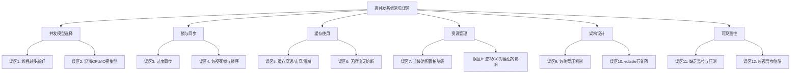
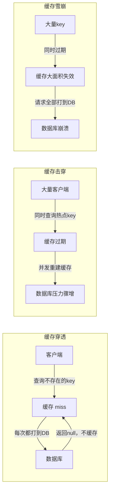
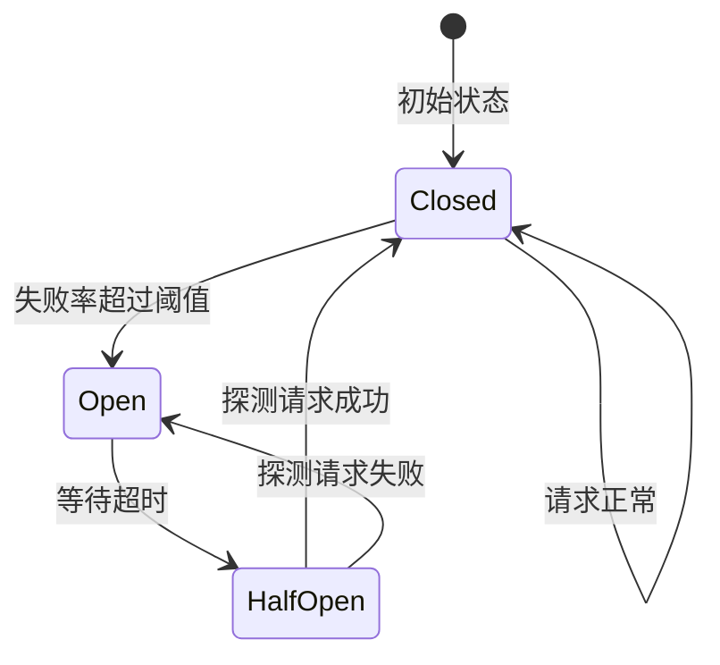
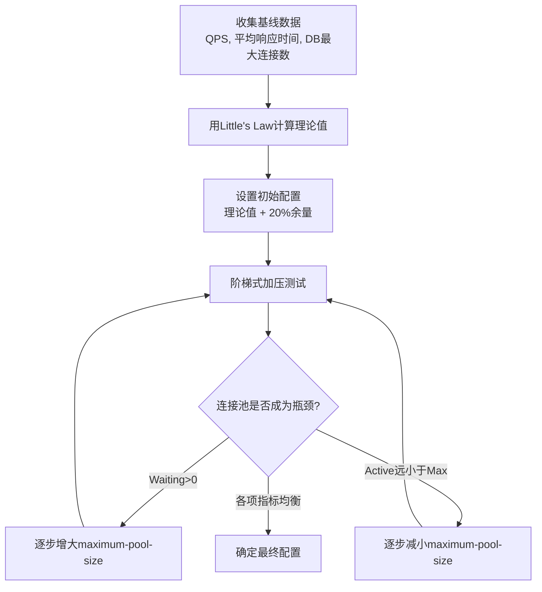

## 常见误区

高并发系统的开发和运维充满了各种陷阱。许多团队在追求高性能的过程中，因为对并发原理理解不深、对工具使用不当、对系统行为误判，反复踏入相同的坑中。本节将系统梳理高并发开发中最常见的十大误区，每个误区都结合真实场景、错误示范和正确做法进行深入剖析，帮助读者建立正确的并发编程直觉。



---

### 误区一：线程越多越好——盲目增加线程数

这是高并发开发中最普遍、危害也最大的误区。很多开发者在系统性能下降时，第一反应就是"加线程"。从几十个线程一路加到几百甚至上千个，结果不仅没有提升性能，反而导致系统更慢甚至崩溃。

**错误认知**

> "10个线程处理不了的请求，加到100个肯定能处理。"

**根本原因**

线程并非免费资源。每个线程在操作系统层面需要分配独立的栈空间（通常 512KB~1MB），创建和销毁线程涉及系统调用和内存分配。更关键的是，当线程数超过 CPU 核心数时，操作系统需要通过时间片轮转来调度线程，这引入了上下文切换（Context Switch）开销。

一次上下文切换的代价约为 1~10 微秒（取决于 CPU 架构和缓存状态），但在高并发场景下，每秒可能发生成千上万次切换，累计开销非常可观。更重要的是，上下文切换会导致 CPU 缓存失效（Cache Thrashing），使得线程切换回来后需要重新加载缓存数据，这个间接开销往往比切换本身更大。

**数据佐证**

| 线程数 | 上下文切换次数/秒 | CPU有效利用率 | 吞吐量(QPS) |
|--------|-------------------|---------------|-------------|
| 4 (CPU核心数) | ~200 | 95% | 12,000 |
| 16 | ~8,000 | 78% | 11,500 |
| 64 | ~45,000 | 42% | 7,200 |
| 256 | ~180,000 | 15% | 3,100 |

上表是一个典型的 CPU 密集型基准测试结果（4核CPU，任务为纯计算）。可以看到，线程数从 4 增加到 256 后，吞吐量反而下降了 74%——这就是著名的"线程数陷阱"。

**不同语言的表现差异**

| 语言/运行时 | 线程模型 | 上限约束 | 推荐最大线程数 |
|------------|----------|----------|---------------|
| Java (JVM) | 1:1映射OS线程 | 每线程1MB栈空间 | 数百~数千 |
| Go | M:N协程模型 | 无硬限制，栈动态伸缩(2KB~1GB) | 数万~数十万 |
| Python (CPython) | 1:1映射OS线程 + GIL | GIL限制并行度 | IO密集: 数百; CPU密集: 1 |
| Node.js | 单线程+事件循环 | libuv线程池默认4线程 | 无需多线程 |

Go 的 goroutine 由于 M:N 调度模型和动态栈，在数量上天然优于 OS 线程，但仍然不能无限增加——过多的 goroutine 会导致调度开销增大和内存占用飙升。

**正确做法**

1. **根据任务类型计算线程数**：
   - CPU 密集型：`线程数 = CPU核心数 + 1`
   - IO 密集型：`线程数 = CPU核心数 × (1 + IO等待时间/CPU计算时间)`
   - 例如 8 核 CPU，IO 等待比例 80%，则线程数 = 8 × (1 + 4) = 40

2. **使用压测确定最优值**：理论公式只是起点，实际最优线程数受硬件配置、操作系统调度策略、GC 压力等多因素影响。应通过逐步增加线程数进行压测，找到吞吐量拐点。

3. **监控线程池关键指标**：

```java
// Java线程池监控示例
ThreadPoolExecutor executor = ...;
ScheduledExecutorService monitor = Executors.newSingleThreadScheduledExecutor();
monitor.scheduleAtFixedRate(() -> {
    log.info("Active: {}, PoolSize: {}, QueueSize: {}, Completed: {}",
        executor.getActiveCount(),      // 正在执行的线程数
        executor.getPoolSize(),         // 当前线程池大小
        executor.getQueue().size(),     // 等待队列长度
        executor.getCompletedTaskCount() // 已完成任务数
    );
}, 5, 5, TimeUnit.SECONDS);
```

```go
// Go goroutine监控示例
import "runtime"

// 获取当前goroutine数量
numGoroutines := runtime.NumGoroutinePattern
fmt.Printf("当前goroutine数量: %d\n", numGoroutines)

// 内存统计
var m runtime.MemStats
runtime.ReadMemStats(&amp;m)
fmt.Printf("内存分配: %d MB\n", m.Alloc/1024/1024)
```

4. **警惕队列堆积**：当 `getQueue().size()` 持续增长时，说明线程处理速度跟不上任务提交速度，此时盲目加线程不如排查瓶颈根因。

**真实案例：某电商平台线程爆炸事件**

2019年某电商平台在促销活动中，因数据库慢查询导致请求处理时间从 50ms 飙升至 5s。运维人员在监控面板看到线程池利用率 100%，立即将线程池上限从 200 调整到 2000。结果：

- 系统从"慢响应"直接变为"无响应"
- 2000个线程 × 1MB栈 = 2GB 纯栈内存，触发频繁 GC
- 上下文切换从 2万/秒暴增到 50万/秒，CPU 全花在调度上
- 最终整个节点崩溃，被负载均衡器摘除

**教训**：先查根因（慢查询），再考虑扩线程。盲目加线程是用新问题掩盖旧问题。

---

### 误区二：混淆 CPU 密集型与 IO 密集型任务

很多开发者笼统地将所有任务都视为同一类，用相同的线程池配置处理不同类型的任务。这种做法会导致 CPU 密集型任务因线程过多而增加切换开销，或 IO 密集型任务因线程不足而无法充分利用等待时间。

**错误做法：一刀切的线程池**

```java
// 错误：用同一个线程池处理所有类型的任务
ExecutorService sharedPool = Executors.newFixedThreadPool(20);

// CPU密集型：图像处理
sharedPool.submit(() -> imageCompress(file));

// IO密集型：HTTP请求
sharedPool.submit(() -> httpClient.get(url));

// 数据库查询
sharedPool.submit(() -> jdbcTemplate.query(sql));
```

**问题分析**

图像压缩是典型的 CPU 密集型任务（计算密集，线程数应接近 CPU 核心数），HTTP 请求是典型的 IO 密集型任务（大部分时间在等待网络响应，线程数可以远大于核心数）。将两者混用同一个线程池，会导致 IO 任务抢占 CPU 密集型任务的时间片，而 CPU 密集型任务又占满了有限的线程，IO 任务无法充分并发。

**如何判断任务类型**

在实际工作中，很多任务并不是纯粹的 CPU 密集型或 IO 密集型，而是混合型。可以通过以下方法判断：

1. **简单测试法**：观察任务执行时的 CPU 使用率和磁盘/网络 IO 使用率。CPU 接近 100% 而 IO 低 → CPU 密集；CPU 低而 IO 高 → IO 密集
2. **工具分析法**：使用 `perf`、`pidstat`、`jstat` 等工具分析任务执行期间的系统资源消耗
3. **经验法则**：
   - CPU 密集型：图像/视频处理、加密解密、数据分析、机器学习推理、压缩解压
   - IO 密集型：文件读写、数据库查询、HTTP 请求、消息队列消费、远程 RPC 调用
   - 混合型：Web 服务（请求处理 + 数据库查询 + 缓存读写）

**正确做法：隔离线程池**

```java
// 正确：为不同类型的任务配置独立线程池
int cpuCores = Runtime.getRuntime().availableProcessors();

// CPU密集型任务池：线程数 = CPU核心数 + 1
ExecutorService cpuPool = new ThreadPoolExecutor(
    cpuCores + 1, cpuCores + 1,
    60L, TimeUnit.SECONDS,
    new LinkedBlockingQueue<>(1000),
    new ThreadFactoryBuilder().setNameFormat("cpu-worker-%d").build()
);

// IO密集型任务池：线程数 = CPU核心数 × 2 ~ 5
ExecutorService ioPool = new ThreadPoolExecutor(
    cpuCores * 2, cpuCores * 5,
    60L, TimeUnit.SECONDS,
    new LinkedBlockingQueue<>(2000),
    new ThreadFactoryBuilder().setNameFormat("io-worker-%d").build()
);

// 数据库查询池：单独隔离，避免慢查询拖垮其他IO任务
ExecutorService dbPool = new ThreadPoolExecutor(
    10, 30,
    60L, TimeUnit.SECONDS,
    new LinkedBlockingQueue<>(500),
    new ThreadFactoryBuilder().setNameFormat("db-worker-%d").build()
);
```

```go
// Go: 用带缓冲的channel隔离任务类型
var cpuTasks = make(chan func(), 100)
var ioTasks = make(chan func(), 1000)

// CPU密集型worker: 数量=CPU核心数+1
for i := 0; i < runtime.NumCPU()+1; i++ {
    go func() {
        for task := range cpuTasks {
            task()
        }
    }()
}

// IO密集型worker: 数量=CPU核心数*5
for i := 0; i < runtime.NumCPU()*5; i++ {
    go func() {
        for task := range ioTasks {
            task()
        }
    }()
}
```

**进阶：动态线程池**

实际生产环境中，任务的 CPU/IO 特征可能随时间变化。动态线程池可以在运行时根据系统负载自动调整线程数：

```java
public class DynamicThreadPool {
    private final ThreadPoolExecutor executor;
    private final int minThreads;
    private final int maxThreads;
    
    // 定期检测系统负载，动态调整
    public void adjustIfNeeded() {
        double cpuUsage = getSystemCpuUsage();
        int activeThreads = executor.getActiveCount();
        
        if (cpuUsage > 0.85 &amp;&amp; executor.getPoolSize() > minThreads) {
            // CPU过高，缩减线程数
            executor.setCorePoolSize(Math.max(minThreads, executor.getCorePoolSize() - 2));
        } else if (cpuUsage < 0.5 &amp;&amp; executor.getPoolSize() < maxThreads) {
            // CPU有余量，扩展线程数
            executor.setCorePoolSize(Math.min(maxThreads, executor.getCorePoolSize() + 2));
        }
    }
}
```

---

### 误区三：过度同步——把 synchronized 当万能药

在并发编程中，数据安全是底线。但很多开发者走向了另一个极端：对所有共享变量都加锁，甚至对只读数据也加 `synchronized`，导致系统吞吐量大幅下降。

**典型错误**

```java
// 错误：对整个方法加粗粒度锁
public class OrderService {
    private final Map<String, Order> orderCache = new HashMap<>();
    
    // 任何读操作都需要获取全局锁
    public synchronized Order getOrder(String orderId) {
        return orderCache.get(orderId);
    }
    
    // 写操作也需要获取同一把锁
    public synchronized void updateOrder(String orderId, Order order) {
        orderCache.put(orderId, order);
    }
}
```

**问题分析**

`synchronized` 修饰实例方法时，锁对象是 `this`。这意味着即使有 100 个线程同时读取不同的订单，也只能串行执行。在读多写少的场景下，这种粗粒度锁会将并发度降至 1。更严重的是，如果锁内有 IO 操作（如序列化、远程调用），线程被阻塞的时间会更长，其他线程的等待时间也相应增加。

**正确做法：分场景选择同步策略**

| 场景 | 推荐方案 | 原因 | 并发度 |
|------|----------|------|--------|
| 读多写少 | `ReadWriteLock` | 读操作可并发，写操作独占 | 读并发 |
| 写多读多，键分散 | `ConcurrentHashMap` | 分段并发，无需全局锁 | 高 |
| 读多写少，偶尔全量写 | `CopyOnWriteArrayList` | 读无锁，写时复制 | 读最高 |
| 高并发计数 | `LongAdder` | 分段累加，避免CAS竞争 | 高 |
| 简单原子操作 | `AtomicXxx` | 无锁CAS，性能最优 | 最高 |
| 跨服务共享状态 | Redis分布式锁 | 跨进程互斥 | 受限 |

```java
// 正确：使用读写锁实现读多写少的缓存
public class OrderCache {
    private final Map<String, Order> cache = new HashMap<>();
    private final ReadWriteLock lock = new ReentrantReadWriteLock();
    
    public Order getOrder(String orderId) {
        lock.readLock().lock();  // 多个读线程可以并发
        try {
            return cache.get(orderId);
        } finally {
            lock.readLock().unlock();
        }
    }
    
    public void updateOrder(String orderId, Order order) {
        lock.writeLock().lock();  // 写操作独占
        try {
            cache.put(orderId, order);
        } finally {
            lock.writeLock().unlock();
        }
    }
}

// 更好：直接使用ConcurrentHashMap（无需手动加锁）
ConcurrentHashMap<String, Order> cache = new ConcurrentHashMap<>();
```

**性能对比**

| 方案 | 读QPS (100线程) | 写QPS (100线程) | 适用场景 |
|------|-----------------|-----------------|----------|
| synchronized (全局锁) | 1,200 | 1,200 | 简单场景，低并发 |
| ReadWriteLock | 45,000 | 3,500 | 读多写少 |
| ConcurrentHashMap | 120,000 | 80,000 | 读写均衡，键分散 |
| AtomicReference | 200,000 | 200,000 | 单值原子操作 |

**关键原则**

- 能用并发容器就不用手动加锁
- 锁的粒度越细越好（分段锁 > 全局锁）
- 只读数据不需要同步（`final` 字段天然线程安全）
- 优先使用 JDK 提供的并发工具类，而非自己实现同步逻辑
- 锁内不要做耗时操作（IO、远程调用、复杂计算）

---

### 误区四：忽视死锁风险与锁序问题

死锁是并发系统中最隐蔽的 bug 之一。它不会在开发和测试环境中稳定复现，往往只在生产环境的高并发下偶发出现，且一旦出现就可能导致整个服务不可用。

**经典死锁场景**

```java
// 两个线程以不同顺序获取两把锁 → 死锁
// 线程A：先锁orderLock，再锁userLock
// 线程B：先锁userLock，再锁orderLock
public void transferOrder(String fromUser, String toUser) {
    synchronized (orderLock) {          // 线程A在这里等待userLock
        synchronized (userLock) {       // 线程B在这里等待orderLock
            // 转移逻辑
        }
    }
}

public void cancelAndReassign(String userId) {
    synchronized (userLock) {           // 线程B在这里等待orderLock
        synchronized (orderLock) {      // 线程A在这里等待userLock
            // 取消并重新分配
        }
    }
}
```

**死锁产生的四个必要条件（Coffman 条件）**

1. **互斥**：资源一次只能被一个线程占用
2. **持有并等待**：线程持有至少一个资源，同时等待获取其他资源
3. **不可抢占**：已获取的资源不能被强制释放
4. **循环等待**：存在线程间的资源获取循环

只要破坏其中任意一个条件，就能预防死锁。但实际操作中，最可靠的策略是"固定锁顺序"和"超时退出"。

**预防策略**

**策略一：固定锁顺序**

所有线程必须以相同的全局顺序获取锁。这是最简单也最有效的死锁预防方法：

```java
// 定义全局锁顺序：userLock < orderLock
// 命名约定：按字母序命名锁对象，获取时始终按名称排序
public void transferOrder(String fromUser, String toUser) {
    synchronized (userLock) {          // 始终先获取序号小的锁
        synchronized (orderLock) {
            // 转移逻辑
        }
    }
}

public void cancelAndReassign(String userId) {
    synchronized (userLock) {          // 同样先获取userLock
        synchronized (orderLock) {
            // 取消并重新分配
        }
    }
}
```

**策略二：使用 tryLock 超时机制**

```java
public void safeTransfer(String fromUser, String toUser) {
    boolean gotOrderLock = orderLock.tryLock(500, TimeUnit.MILLISECONDS);
    boolean gotUserLock = false;
    try {
        if (gotOrderLock) {
            gotUserLock = userLock.tryLock(500, TimeUnit.MILLISECONDS);
            if (gotUserLock) {
                // 两把锁都获取成功，执行业务逻辑
                doTransfer(fromUser, toUser);
            } else {
                log.warn("获取userLock超时，放弃本次操作");
                metrics.recordLockTimeout("userLock");
            }
        } else {
            log.warn("获取orderLock超时，放弃本次操作");
            metrics.recordLockTimeout("orderLock");
        }
    } finally {
        if (gotUserLock) userLock.unlock();
        if (gotOrderLock) orderLock.unlock();
    }
}
```

**策略三：使用 java.util.concurrent 工具避免锁**

```java
// 使用原子操作避免锁
AtomicReference<OrderState> state = new AtomicReference<>(OrderState.INITIAL);

// CAS操作，无需加锁
boolean success = state.compareAndSet(OrderState.INITIAL, OrderState.PROCESSING);
if (success) {
    // 成功获取处理权
    processOrder();
    state.set(OrderState.COMPLETED);
} else {
    // 其他线程已在处理
    log.info("订单已被其他线程处理");
}
```

**策略四：死锁检测与自动恢复**

在生产环境中，仅仅预防是不够的，还需要有检测和恢复机制：

```java
// Java死锁检测：通过JMX获取死锁信息
ThreadMXBean threadMXBean = ManagementFactory.getThreadMXBean();
long[] deadlockedThreads = threadMXBean.findDeadlockedThreads();
if (deadlockedThreads != null) {
    ThreadInfo[] threadInfos = threadMXBean.getThreadInfo(deadlockedThreads, true, true);
    for (ThreadInfo info : threadInfos) {
        log.error("死锁检测: 线程{}等待锁{}, 持有锁{}",
            info.getThreadName(),
            info.getLockName(),
            Arrays.toString(info.getLockedSynchronizers()));
    }
    // 触发告警 + 自动重启服务
    alertService.sendDeadlockAlert(threadInfos);
}
```

```go
// Go: 使用channel代替锁，从根源避免死锁
// channel天然按顺序通信，不存在锁顺序问题
func transferOrder(orderCh chan<- Order, userCh chan<- User) {
    orderCh <- order  // 先发order信号
    userCh <- user    // 再发user信号
}
```

**真实案例：Redis客户端死锁**

某团队使用 Jedis 连接池时，在高并发下出现死锁。原因是两个线程同时需要获取 Redis 连接和本地锁，但获取顺序不一致：

- 线程A：获取连接 → 等待本地锁
- 线程B：获取本地锁 → 等待连接

最终通过统一"先获取连接、后获取本地锁"的顺序解决。

---

### 误区五：缓存三兄弟——穿透、击穿、雪崩

缓存是高并发系统中提升性能的利器，但使用不当反而会成为系统崩溃的导火索。缓存穿透、缓存击穿、缓存雪崩是三个经典的缓存陷阱，很多开发者只知其名，不知其解。



**缓存穿透：查询不存在的数据**

攻击者或异常请求查询数据库中根本不存在的 key，缓存永远 miss，请求每次都打到数据库。在高并发场景下，大量穿透请求可能直接打垮数据库。

```java
// 问题代码：没有对空值做缓存
public User getUser(long userId) {
    // 缓存未命中，查数据库
    User user = db.selectUser(userId);
    if (user != null) {
        redis.setex("user:" + userId, 3600, user);
    }
    // 如果user为null，不会缓存 → 下次查询仍然穿透到数据库
    return user;
}
```

**解决方案：空值缓存 + 布隆过滤器**

```java
public User getUser(long userId) {
    // 方案一：布隆过滤器预判（推荐用于key集合已知的场景）
    if (!bloomFilter.mightContain("user:" + userId)) {
        return null;  // 肯定不存在，直接返回
    }
    
    // 方案二：空值缓存
    String cacheKey = "user:" + userId;
    String cached = redis.get(cacheKey);
    
    if ("NULL".equals(cached)) {
        return null;  // 缓存了空值标记
    }
    if (cached != null) {
        return deserialize(cached);
    }
    
    // 查数据库
    User user = db.selectUser(userId);
    if (user != null) {
        redis.setex(cacheKey, 3600, serialize(user));
    } else {
        redis.setex(cacheKey, 300, "NULL");  // 空值缓存，过期时间较短
    }
    return user;
}
```

**布隆过滤器的权衡**

| 方案 | 优点 | 缺点 | 适用场景 |
|------|------|------|----------|
| 空值缓存 | 实现简单，无额外组件 | 占用Redis内存，短TTL | 小规模，key分散 |
| 布隆过滤器 | 预判快，内存占用小 | 有假阳性，不支持删除 | 大规模，key集合稳定 |
| 接口层校验 | 防御最早，零开销 | 只能防恶意请求 | 有限参数范围 |

**缓存击穿：热点 key 过期瞬间的并发重建**

一个热点 key 过期的瞬间，大量并发请求同时发现缓存 miss，全部打到数据库重建缓存，导致数据库压力骤增。

```java
// 问题代码：没有考虑并发重建
public Product getProduct(String productId) {
    Product product = redis.get("product:" + productId);
    if (product == null) {
        // 多个线程同时到这里，都去查数据库
        product = db.selectProduct(productId);
        redis.setex("product:" + productId, 3600, product);
    }
    return product;
}
```

**解决方案：分布式锁保证单点重建**

```java
public Product getProduct(String productId) {
    String cacheKey = "product:" + productId;
    Product product = redis.get(cacheKey);
    if (product != null) {
        return product;
    }
    
    // 用分布式锁保证只有一个线程重建缓存
    String lockKey = "lock:" + cacheKey;
    try {
        if (redis.setnx(lockKey, "1", 10, TimeUnit.SECONDS)) {
            // 获取锁成功，重建缓存
            product = db.selectProduct(productId);
            if (product != null) {
                redis.setex(cacheKey, 3600, product);
            }
            return product;
        } else {
            // 未获取锁，等待后重试
            Thread.sleep(50);
            return getProduct(productId);  // 重试，此时缓存可能已重建
        }
    } finally {
        redis.del(lockKey);
    }
}
```

**更优方案：逻辑过期 + 异步重建**

对于极高并发的热点 key，可以在 value 中嵌入逻辑过期时间，过期后不立即删除，而是异步重建：

```java
public Product getProduct(String productId) {
    String cacheKey = "product:" + productId;
    CacheEntry<Product> entry = redis.get(cacheKey);
    
    if (entry == null) {
        // 首次加载，加分布式锁
        return loadWithLock(productId, cacheKey);
    }
    
    if (entry.isLogicExpired()) {
        // 逻辑过期，异步重建，立即返回旧数据
        asyncRebuild(productId, cacheKey);
    }
    
    return entry.getValue();  // 即使过期也返回旧数据，保证可用性
}
```

**缓存雪崩：大量 key 同时过期**

大量缓存 key 设置了相同的过期时间，在某一时刻集中过期，导致所有请求同时打到数据库。常见于批量导入数据或系统初始化时。

**解决方案：过期时间随机化 + 多级缓存**

```java
// 过期时间加随机偏移（基础但有效）
int baseTtl = 3600;  // 1小时
int randomOffset = ThreadLocalRandom.current().nextInt(0, 600);  // 0~10分钟随机偏移
redis.setex(cacheKey, baseTtl + randomOffset, value);

// 多级缓存兜底
public Object getWithMultiLevelCache(String key) {
    // L1: 本地缓存（进程内，毫秒级）
    Object value = localCache.getIfPresent(key);
    if (value != null) return value;
    
    // L2: Redis缓存（网络IO，毫秒级）
    value = redis.get(key);
    if (value != null) {
        localCache.put(key, value);
        return value;
    }
    
    // L3: 数据库（可能很慢）
    value = db.query(key);
    if (value != null) {
        int ttl = 3600 + ThreadLocalRandom.current().nextInt(0, 600);
        redis.setex(key, ttl, value);
        localCache.put(key, value);
    }
    return value;
}
```

**Redis缓存预热**

对于核心业务数据，在系统启动或大促前主动加载到缓存中，避免冷启动时的雪崩：

```java
@EventListener(ApplicationReadyEvent.class)
public void warmupCache() {
    log.info("开始缓存预热...");
    List<Product> hotProducts = db.selectHotProducts(1000);  // 加载Top1000商品
    for (Product product : hotProducts) {
        int ttl = 3600 + ThreadLocalRandom.current().nextInt(0, 600);
        redis.setex("product:" + product.getId(), ttl, serialize(product));
    }
    log.info("缓存预热完成，加载{}个商品", hotProducts.size());
}
```

---

### 误区六：无限流无熔断——系统裸奔上线

很多系统在设计时只关注"如何处理请求"，忽略了"如何拒绝请求"。没有限流和熔断的高并发系统就像一辆没有刹车的汽车——正常行驶没问题，一旦遇到突发情况就会失控。

**没有限流的后果**

| 阶段 | 现象 | 影响 |
|------|------|------|
| 流量正常 | 系统运行正常 | 无 |
| 流量突增 | 响应变慢，部分超时 | 用户体验下降 |
| 流量暴涨 | CPU/内存/连接池耗尽 | 全面超时，错误率飙升 |
| 持续过载 | 数据库崩溃，缓存失效 | 级联故障，全站不可用 |

**没有熔断的后果**

当下游服务出现故障时，如果没有熔断器，调用方会不断重试，大量线程被阻塞在等待超时上，最终导致调用方也被拖垮。这种现象被称为**级联故障**（Cascading Failure）。

正常状态：
  服务A → 服务B(正常) → 服务C(正常)
  A处理正常  B响应10ms  C响应5ms

故障传播：
  服务A → 服务B(超时) → 服务C(超时)
  A线程被阻塞   B响应5s(超时)  C响应5s(超时)
  ↓
  A线程池耗尽 → A不可用 → 调用A的所有上游不可用
  ↓
  整条链路雪崩

**限流算法对比**

| 算法 | 原理 | 优点 | 缺点 | 适用场景 |
|------|------|------|------|----------|
| 固定窗口 | 按固定时间窗口计数 | 实现简单 | 窗口边界突发 | 简单场景 |
| 滑动窗口 | 滑动时间窗口计数 | 平滑 | 内存占用较大 | 通用 |
| 令牌桶 | 固定速率放入令牌 | 允许突发 | 实现复杂 | API网关 |
| 漏桶 | 固定速率处理请求 | 绝对平滑 | 无法处理突发 | 流量整形 |

**正确做法**

1. **入口限流**：在网关层使用令牌桶或滑动窗口算法控制进入系统的请求速率
2. **依赖熔断**：对每个外部依赖配置熔断器，故障时快速失败
3. **超时控制**：所有远程调用必须设置超时时间，且超时时间应根据下游服务的 P99 延迟设置
4. **重试策略**：重试必须配合退避算法（指数退避 + 随机抖动），避免重试风暴

```java
// 完整的容错配置示例
@Configuration
public class ResilienceConfig {
    
    // 熔断器配置
    @Bean
    public CircuitBreaker circuitBreaker() {
        CircuitBreakerConfig config = CircuitBreakerConfig.custom()
            .failureRateThreshold(50)           // 失败率超过50%时打开熔断
            .waitDurationInOpenState(Duration.ofSeconds(10))  // 熔断10秒后进入半开
            .slidingWindowSize(100)              // 统计最近100次调用
            .minimumNumberOfCalls(10)            // 至少10次调用才开始统计
            .build();
        return CircuitBreakerRegistry.of(config).circuitBreaker("externalService");
    }
    
    // 超时 + 重试 + 熔断组合
    @Bean
    public DecorateSupplier<String> decoratedSupplier() {
        return DecorateSupplier.ofSupplier(() -> externalService.call())
            .withCircuitBreaker(circuitBreaker())
            .withRetry(Retry.of("retry", RetryConfig.custom()
                .maxAttempts(3)
                .waitDuration(Duration.ofMillis(200))
                .retryOnException(e -> !(e instanceof BusinessException))
                .build()))
            .withTimeout(Timeout.of(Duration.ofSeconds(3)));
    }
}
```

```go
// Go: 使用gobreaker实现熔断
import "github.com/sony/gobreaker/v2"

settings := gobreaker.Settings{
    Name:        "external-service",
    MaxRequests: 3,                    // 半开状态下最多允许3个探测请求
    Interval:    60 * time.Second,     // 状态切换统计周期
    Timeout:     30 * time.Second,     // 熔断持续时间
    ReadyToTrip: func(counts gobreaker.Counts) bool {
        return counts.ConsecutiveFailures > 5  // 连续5次失败触发熔断
    },
}

cb := gobreaker.NewCircuitBreaker[int](settings)

result, err := cb.Execute(func() (int, error) {
    return callExternalService()
})
```

**熔断器状态机**



---

### 误区七：连接池配置拍脑袋——凭感觉设置参数

数据库连接池、Redis 连接池、HTTP 连接池的配置直接影响系统在高并发下的表现。很多团队要么使用默认配置，要么"拍脑袋"设一个数字，缺乏科学的调优依据。

**典型错误配置**

```yaml
# 错误：连接池太小 → 高并发下大量线程等待获取连接
spring:
  datasource:
    hikari:
      maximum-pool-size: 5     # 5个连接处理5000 QPS？根本不够
      minimum-idle: 2
      
# 错误：连接池太大 → 超过数据库最大连接数，反而更慢
spring:
  datasource:
    hikari:
      maximum-pool-size: 500   # 数据库最多支持200连接
      minimum-idle: 100
```

**连接池大小的计算公式**

数据库连接池的最优大小遵循一个经典公式（基于 Little's Law）：

连接数 = QPS × 平均响应时间(秒)

例如：QPS = 1000，平均响应时间 = 10ms = 0.01s，则连接数 = 1000 × 0.01 = 10。

但这只是理论值，实际还需要考虑：
- 数据库最大连接数限制（通常 100~500）
- 连接获取和释放的开销（约 0.1~1ms）
- 连接健康检查的开销
- 突发流量的缓冲（建议预留 20%~50%）
- 连接泄漏的可能性（设置泄漏检测阈值）

**推荐配置模板**

```yaml
# HikariCP推荐配置
spring:
  datasource:
    hikari:
      # 连接池大小：根据公式计算，留20%余量
      maximum-pool-size: 12
      minimum-idle: 4
      
      # 连接超时：获取连接的最大等待时间
      connection-timeout: 3000     # 3秒
      
      # 空闲连接超时：避免维护过多空闲连接
      idle-timeout: 600000         # 10分钟
      
      # 连接最大生命周期：防止数据库主动断连
      max-lifetime: 1800000        # 30分钟
      
      # 连接验证：定期检查连接是否有效
      connection-test-query: SELECT 1
      validation-timeout: 5000     # 5秒
      
      # 泄漏检测：超过此时间未归还连接则告警
      leak-detection-threshold: 60000  # 1分钟
```

**监控连接池状态**

```java
// HikariCP连接池监控
HikariDataSource ds = ...;
HikariPoolMXBean poolMXBean = ds.getHikariPoolMXBean();

// 关键指标
log.info("Active: {}, Idle: {}, Waiting: {}, Total: {}, Timeout: {}",
    poolMXBean.getActiveConnections(),      // 活跃连接数
    poolMXBean.getIdleConnections(),        // 空闲连接数
    poolMXBean.getThreadsAwaitingConnection(),  // 等待获取连接的线程数
    poolMXBean.getTotalConnections(),       // 总连接数
    poolMXBean.getConnectionTimeoutTotal()  // 连接超时总次数
);
```

当 `ThreadsAwaitingConnection` 持续大于 0 时，说明连接池不够用；当 `ActiveConnections` 远小于 `MaximumPoolSize` 时，说明连接池配置过大。

**连接池配置的调优流程**



---

### 误区八：忽视 GC 对并发系统延迟的影响

Java 应用在高并发场景下，GC（垃圾回收）是造成尾延迟（P99/P999）飙高的主要原因之一。很多开发者只关注平均延迟，忽略了 GC 停顿对延迟分布的影响。

**GC 停顿的影响**

即使是低延迟的 G1 GC，在高堆内存下也可能出现数百毫秒甚至秒级的停顿。ZGC 和 Shenandoah 将停顿控制在毫秒级，但它们会占用更多 CPU 资源进行并发标记和整理。

正常请求延迟分布（无GC影响）：
  P50: 5ms    P99: 20ms    P999: 50ms

GC停顿叠加后：
  P50: 5ms    P99: 150ms    P999: 2000ms

用户感知：
  平均体验看起来没变（P50不变）
  但每1000个请求就有1个延迟2秒（P999飙高）
  在高并发下，每秒可能有数百个请求被GC阻塞

**常见问题**

1. **Full GC 频繁**：堆内存不足或内存泄漏，导致 Full GC 频繁触发，每次停顿可达秒级
2. **对象分配速率过高**：高并发下大量临时对象创建（如字符串拼接、JSON 序列化），给 Young GC 带来压力
3. **GC 参数不当**：使用默认 GC 参数或参数配置不合理，导致停顿时间不可控
4. **内存泄漏**：长生命周期对象持有短生命周期对象的引用，导致对象无法被回收

**正确做法**

1. **选择合适的 GC 收集器**：

| GC收集器 | 停顿时间 | 吞吐量 | 堆内存要求 | 适用场景 |
|-----------|----------|--------|-----------|----------|
| G1 | 中等(50~200ms) | 高 | 4G+ | 通用，平衡型 |
| ZGC | 极低(<1ms) | 中 | 8G+ | 延迟敏感，大内存 |
| Shenandoah | 极低(<1ms) | 中 | 8G+ | 延迟敏感 |
| Parallel GC | 高(可达秒级) | 极高 | 不限 | 批处理，吞吐量优先 |
| Epsilon (No-Op) | 无 | 极高 | 不限 | 基准测试，不回收 |

2. **减少对象分配**：使用对象池、复用缓冲区、避免在循环中创建临时对象

```java
// 错误：每次请求都创建大量临时对象
public byte[] process(byte[] data) {
    String str = new String(data);           // 临时String
    JSONObject json = JSON.parseObject(str); // 临时JSON对象
    // ...处理逻辑
    return json.toJSONString().getBytes();   // 又一个临时对象
}

// 正确：复用缓冲区，减少临时对象
private static final ThreadLocal<byte[]> BUFFER = 
    ThreadLocal.withInitial(() -> new byte[8192]);

public void process(byte[] data, OutputStream out) {
    // 复用ThreadLocal缓冲区，避免频繁分配
    byte[] buffer = BUFFER.get();
    // 直接写入输出流，不创建中间String
    // ...
}
```

3. **GC 调优监控**：

```bash
# 打印GC日志（Java 11+统一使用Xlog）
-Xlog:gc*:file=/var/log/gc.log:time,uptime,level,tags

# Java 8及以下
-XX:+PrintGCDetails -XX:+PrintGCDateStamps
-XX:+PrintGCTimeStamps -Xloggc:/var/log/gc.log

# ZGC配置（Java 17+）
-XX:+UseZGC
-XX:+ZGenerational
-XX:SoftMaxHeapSize=4g

# G1 GC调优
-XX:+UseG1GC
-XX:MaxGCPauseMillis=200      # 目标停顿时间
-XX:G1HeapRegionSize=16m      # Region大小
-XX:InitiatingHeapOccupancyPercent=45  # 触发并发标记的堆使用率
```

**GC监控关键指标**

| 指标 | 健康阈值 | 告警阈值 | 含义 |
|------|----------|----------|------|
| Young GC频率 | <1次/秒 | >10次/秒 | 对象分配速率过高 |
| Young GC停顿 | <50ms | >200ms | Young区过小或对象过多 |
| Full GC频率 | 0次/小时 | >1次/小时 | 内存泄漏或堆不足 |
| Full GC停顿 | N/A | >1秒 | 严重性能问题 |
| GC后堆使用率 | <70% | >85% | 可能内存泄漏 |

---

### 误区九：忽视背压机制——上游狂灌，下游淹没

背压（Backpressure）是指当下游处理速度跟不上上游产生速度时，上游感知到这一情况并主动减慢生产速率的机制。很多高并发系统缺乏背压机制，导致数据在中间环节积压，最终内存溢出或系统崩溃。

**没有背压的典型场景**

生产者(10万条/秒) → 消息队列(内存缓冲) → 消费者(1万条/秒)
                      ↑
                   缓冲区不断膨胀 → OOM

时间线：
  T+0s:   队列长度 0
  T+10s:  队列长度 900,000 (差值: 9万/秒 × 10秒)
  T+60s:  队列长度 5,400,000 → 内存占用约540MB（每条100字节）
  T+120s: 队列长度 10,800,000 → OOM

**常见错误模式**

```java
// 错误：无背压的生产者
while (true) {
    Data data = sensor.readData();   // 每秒产生10万条
    queue.offer(data);               // 队列满了就丢弃
    // 没有检查队列状态，不知道消费者是否跟得上
}

// 错误：无限缓冲的消息处理
List<Event> buffer = new ArrayList<>();
eventStream.forEach(event -> {
    buffer.add(event);               // 无限增长
    if (buffer.size() >= 1000) {
        batchProcess(buffer);        // 可能来不及处理，buffer继续增长
        buffer.clear();
    }
});
```

**正确做法：多层背压策略**

```java
// 策略一：有界队列 + 拒绝策略
BlockingQueue<Data> queue = new ArrayBlockingQueue<>(10000);  // 有界队列
if (!queue.offer(data)) {
    // 队列满时的处理：记录指标、告警、降级
    droppedCounter.increment();
    log.warn("队列已满，丢弃数据: {}", data.getId());
}

// 策略二：响应式背压（Reactor/RxJava）
Flux.fromStream(dataStream)
    .onBackpressureBuffer(10000,      // 缓冲区大小
        dropped -> droppedCounter.increment())  // 溢出时的处理
    .flatMap(data -> processAsync(data), 10)    // 并发度限制为10
    .subscribe();

// 策略三：令牌桶限速
RateLimiter limiter = RateLimiter.create(10000);  // 限制为1万/秒
while (true) {
    limiter.acquire();                // 阻塞直到获取令牌
    Data data = sensor.readData();
    queue.offer(data);
}
```

**流式处理中的背压**

```java
// Kafka消费者背压控制
Properties props = new Properties();
props.put("max.poll.records", "500");           // 单次poll最大记录数
props.put("fetch.min.bytes", "1");              // 最小拉取字节数
props.put("fetch.max.wait.ms", "500");          // 最大等待时间

// 处理逻辑中控制速度
while (true) {
    ConsumerRecords<String, String> records = consumer.poll(Duration.ofMillis(100));
    for (ConsumerRecord<String, String> record : records) {
        processWithBackpressure(record);        // 处理时感知下游速度
        if (downstreamLag > THRESHOLD) {
            Thread.sleep(10);                    // 主动降速
        }
    }
    consumer.commitSync();
}
```

```go
// Go: 用带缓冲的channel实现背压
func producer(out chan<- Data, maxBuffer int) {
    for {
        data := readSensor()
        select {
        case out <- data:       // 正常发送
        default:                // channel满时的处理
            droppedCount++
            log.Warn("buffer full, dropping data")
            // 可选：等待一段时间后重试
            time.Sleep(10 * time.Millisecond)
        }
    }
}

func consumer(in <-chan Data) {
    for data := range in {
        process(data)  // 消费速度决定整体吞吐
    }
}

// 启动：buffer大小=10000，超时后producer会感知到背压
ch := make(chan Data, 10000)
go producer(ch, 10000)
go consumer(ch)
```

**背压设计原则**

| 原则 | 说明 | 反面教材 |
|------|------|----------|
| 有界缓冲 | 所有缓冲区必须设上限 | `new ArrayList<>()` 无限增长 |
| 优雅降级 | 缓冲区满时有明确的降级策略 | 直接丢弃无日志无告警 |
| 速率感知 | 生产者能感知消费者的处理速度 | 盲目生产不检查队列状态 |
| 监控可视 | 缓冲区使用率需实时监控 | 缓冲区满了才发现 |

---

### 误区十：volatile 万能药——误解内存可见性

很多开发者在遇到并发问题时，第一个想到的解决方案就是"加 volatile"。这种做法反映了一个常见的误解：认为 volatile 可以解决所有并发问题。实际上，volatile 只保证**可见性**，不保证**原子性**。

**典型错误**

```java
// 错误：用volatile做非原子的复合操作
private volatile int count = 0;

// 以为volatile保证了线程安全
public void increment() {
    count++;  // 这不是原子操作！
    // 实际执行三步：1)读取count 2)count+1 3)写回count
    // 两个线程可能同时读到相同值，导致丢失更新
}
```

**问题分析**

`count++` 看似一步操作，实际上包含三个步骤：读取 → 修改 → 写回。volatile 只保证读取时看到最新值，但无法保证这三步是原子执行的。两个线程可能同时读到 `count=5`，各自加1后写回 `6`，导致一次更新丢失。

**volatile 能做什么和不能做什么**

| 能力 | volatile | synchronized | AtomicXxx |
|------|----------|--------------|-----------|
| 保证可见性 | ✅ | ✅ | ✅ |
| 保证原子性 | ❌ | ✅ | ✅ |
| 禁止指令重排 | ✅ | ✅ | ✅ |
| 性能 | 极高 | 中等 | 高 |
| 适用场景 | 状态标志、一次性安全发布 | 复合操作 | 简单原子操作 |

**正确做法**

```java
// 方案一：使用AtomicXxx（简单计数器）
private final AtomicInteger count = new AtomicInteger(0);

public void increment() {
    count.incrementAndGet();  // 原子操作，线程安全
}

// 方案二：使用synchronized（复合操作）
private int count = 0;

public synchronized void increment() {
    count++;  // 在synchronized块内，保证原子性
}

// 方案三：volatile的正确用法——状态标志
private volatile boolean running = true;

public void stop() {
    running = false;  // 一个线程写
}

public void work() {
    while (running) {  // 另一个线程读，保证看到最新值
        // do work
    }
}

// 方案四：volatile + CAS的组合模式（DCL单例）
public class Singleton {
    private static volatile Singleton instance;
    
    public static Singleton getInstance() {
        if (instance == null) {            // 第一次检查（无锁）
            synchronized (Singleton.class) {
                if (instance == null) {    // 第二次检查（有锁）
                    instance = new Singleton();  // volatile防止指令重排
                }
            }
        }
        return instance;
    }
}
```

**真实案例：volatile误用导致的订单重复处理**

某支付系统中，开发者用 `volatile boolean processed` 标志防止订单重复处理：

```java
// 错误实现
private volatile boolean processed = false;

public void processOrder(Order order) {
    if (!processed) {       // 线程A检查：false
        processed = true;   // 线程A设置：true
        // 线程B此时也检查到false（在A设置之前）
        // 线程B也进入处理逻辑 → 重复处理！
        processPayment(order);
    }
}
```

**修复方案**：使用 `AtomicBoolean.compareAndSet()` 保证原子性：

```java
private final AtomicBoolean processed = new AtomicBoolean(false);

public void processOrder(Order order) {
    if (processed.compareAndSet(false, true)) {  // 原子操作
        processPayment(order);
    }
}
```

---

### 误区十一：缺乏监控与压测——盲人摸象

很多高并发系统是在"没有出事的时候"被认为"运行良好"的。实际上，没有完善的监控和定期压测，你根本不知道系统的真实容量和脆弱点在哪里。

**没有监控的代价**

| 阶段 | 无监控 | 有监控 |
|------|--------|--------|
| 问题发生时 | 用户投诉才知道 | 告警提前发现 |
| 问题定位时 | 猜测+翻日志（小时级） | 看Dashboard定位（分钟级） |
| 问题修复时 | 不确定是否修复 | 验证指标恢复 |
| 容量规划时 | 凭经验估算 | 基于历史数据预测 |

**必须监控的核心指标**

```yaml
# Prometheus监控配置示例
metrics:
  # 应用层指标
  - name: http_request_duration_seconds
    labels: [method, path, status]
    description: HTTP请求延迟分布
    
  - name: thread_pool_active_count
    labels: [pool_name]
    description: 线程池活跃线程数
    
  - name: thread_pool_queue_size
    labels: [pool_name]
    description: 线程池等待队列长度
    
  - name: db_connection_pool_active
    labels: [pool_name]
    description: 数据库连接池活跃连接数
    
  - name: cache_hit_ratio
    labels: [cache_name]
    description: 缓存命中率

  # 系统层指标
  - name: jvm_gc_pause_seconds
    labels: [collector, cause]
    description: JVM GC停顿时间
    
  - name: jvm_memory_used_bytes
    labels: [area]
    description: JVM内存使用量
```

**必须设置的告警规则**

```yaml
# 告警规则
alerts:
  # 延迟告警
  - name: HighLatencyP99
    condition: http_request_duration_seconds{quantile="0.99"} > 500ms
    duration: 2m
    severity: warning
    
  # 错误率告警
  - name: HighErrorRate
    condition: http_request_errors_total / http_request_total > 0.05
    duration: 1m
    severity: critical
    
  # 连接池告警
  - name: ConnectionPoolExhaustion
    condition: db_connection_pool_active / db_connection_pool_max > 0.8
    duration: 30s
    severity: critical
    
  # GC停顿告警
  - name: LongGCPause
    condition: jvm_gc_pause_seconds > 500ms
    duration: 1m
    severity: warning
```

**压测的正确姿势**

压测不是"跑一次就完事"。正确的压测应该是一个持续的流程：

```bash
# 1. 建立性能基线（日常流量下）
wrk -t12 -c100 -d60s http://api.example.com/orders

# 2. 阶梯式加压（找到拐点）
for qps in 1000 2000 5000 10000 20000 50000; do
    echo "=== Testing ${qps} QPS ==="
    wrk -t12 -c${qps} -d120s --rate=${qps} http://api.example.com/orders
    sleep 30  # 冷却期
done

# 3. 峰值压测（模拟大促）
wrk -t24 -c500 -d300s --rate=50000 http://api.example.com/orders

# 4. 持续稳定性压测（验证长时间运行稳定性）
wrk -t12 -c200 -d7200s --rate=10000 http://api.example.com/orders  # 2小时
```

**压测期间必须观察的指标**

- 响应时间分布（P50/P90/P99/P999）
- 错误率和错误类型分布
- CPU、内存、磁盘 IO、网络 IO
- GC 频率和停顿时间
- 连接池使用率
- 线程池队列长度
- 数据库慢查询数量

---

### 误区十二：忽视异步编程的陷阱

异步编程（CompletableFuture、Reactor、RxJava）能显著提升 IO 密集型系统的吞吐量，但如果使用不当，反而会引入更隐蔽的并发问题。

**典型陷阱**

```java
// 陷阱一：异常被吞没
CompletableFuture.supplyAsync(() -> {
    throw new RuntimeException("数据库连接失败");
    return result;
}).thenAccept(result -> {
    // 上面的异常不会传播到这里
    // 也不会被任何catch捕获
    // 静默失败，业务逻辑中断但无任何日志
});

// 陷阱二：回调地狱导致调试困难
serviceA.call()
    .thenCompose(resultA -> serviceB.call(resultA))
    .thenCompose(resultB -> serviceC.call(resultB))
    .thenCompose(resultC -> serviceD.call(resultC))
    .thenAccept(resultD -> {
        // 任何一个环节失败，错误堆栈都很难追踪
    });

// 陷阱三：线程池饥饿
// 所有异步操作共享同一个默认ForkJoinPool
CompletableFuture.runAsync(() -> {
    // 与所有其他异步操作竞争线程
    // 如果默认池被耗尽，所有异步操作都会阻塞
});
```

**正确做法**

```java
// 修复一：添加异常处理
CompletableFuture.supplyAsync(() -> {
    throw new RuntimeException("数据库连接失败");
    return result;
}, customExecutor)
    .exceptionally(ex -> {
        log.error("异步操作失败", ex);
        return defaultValue;  // 降级返回默认值
    })
    .thenAccept(result -> {
        // 此时result一定不为null
    });

// 修复二：使用独立线程池隔离
ExecutorService dbExecutor = Executors.newFixedThreadPool(10);
ExecutorService httpExecutor = Executors.newFixedThreadPool(20);

CompletableFuture.supplyAsync(() -> db.query(), dbExecutor)
    .thenApplyAsync(result -> http.call(result), httpExecutor)
    .exceptionally(ex -> fallback(ex));

// 修复三：添加超时控制
CompletableFuture.supplyAsync(() -> service.call(), executor)
    .orTimeout(3, TimeUnit.SECONDS)  // Java 9+
    .exceptionally(ex -> {
        if (ex instanceof TimeoutException) {
            log.warn("服务调用超时，使用降级方案");
        }
        return fallback();
    });
```

---

### 误区排查速查表

为了帮助读者快速定位和纠正自己的误区，以下是一张总结性的速查表：

| 误区 | 典型症状 | 根因 | 纠正方法 |
|------|----------|------|----------|
| 线程越多越好 | 吞吐量随线程增加反而下降 | 上下文切换开销+缓存失效 | 按公式计算+压测验证 |
| 混淆CPU/IO密集型 | 某类任务延迟异常高 | 同一线程池互相干扰 | 按任务类型隔离线程池 |
| 过度同步 | 并发读也需要等锁 | 粗粒度synchronized | 读写锁/并发容器/CAS |
| 忽视死锁 | 系统偶发卡死无响应 | 锁顺序不一致 | 固定锁序+tryLock超时 |
| 缓存穿透/击穿/雪崩 | 数据库压力骤增 | 缓存策略不完善 | 空值缓存+分布式锁+随机TTL |
| 无限流无熔断 | 突发流量导致全站不可用 | 缺乏流量控制 | 令牌桶+熔断器+超时控制 |
| 连接池配置不当 | 频繁获取连接超时 | 参数未科学计算 | Little's Law计算+监控调优 |
| 忽视GC影响 | P99延迟周期性飙高 | GC停顿+对象分配过多 | 选择低延迟GC+减少对象分配 |
| 无背压机制 | 内存持续增长直至OOM | 生产速度>消费速度 | 有界队列+响应式背压+限速 |
| volatile万能药 | 计数器不准、状态标志竞态 | 只保证可见性不保证原子性 | AtomicXxx+CAS |
| 缺乏监控压测 | 事后才发现问题 | 没有可观测性 | 完善指标+告警+定期压测 |
| 忽视异步陷阱 | 异步操作静默失败 | 异常吞没+线程池饥饿 | 异常处理+线程池隔离+超时 |

---

### 避免误区的系统性方法论

避免上述误区不能靠"记住就行"，而需要建立系统性的工作流程。以下是每个阶段应该做的事情：

**设计阶段**

1. **识别任务类型**：明确每个服务的核心任务是 CPU 密集型还是 IO 密集型
2. **设计隔离策略**：不同任务类型使用独立的线程池和资源池
3. **预设保护机制**：限流、熔断、超时、重试在设计阶段就要考虑
4. **规划监控体系**：确定需要监控的指标、告警阈值、响应流程
5. **选择正确的并发模型**：根据场景选择线程池、协程、事件循环或响应式流

**实现阶段**

1. **选择正确的并发工具**：优先使用 JDK/框架提供的并发工具，而非自己造轮子
2. **遵循锁序规范**：团队统一锁的获取顺序，代码审查时重点检查
3. **配置有界资源**：线程池、连接池、缓冲区都必须设置上限
4. **添加可观测性代码**：关键路径埋点，记录耗时、错误、队列长度
5. **异步操作必须处理异常**：每个 `CompletableFuture` 都要有 `exceptionally` 或 `handle`

**测试阶段**

1. **单元测试并发场景**：使用 JMH、Go benchmark 测试并发代码的正确性和性能
2. **集成测试模拟故障**：使用 Chaos Engineering 工具（如 Chaos Mesh）模拟网络延迟、服务不可用
3. **压力测试验证容量**：阶梯式加压找到系统拐点，验证限流和熔断是否生效
4. **长时间稳定性测试**：验证 GC、内存泄漏、连接泄漏等慢问题
5. **死锁检测测试**：使用 ThreadSanitizer（Go）、FindBugs（Java）检测潜在死锁

**运维阶段**

1. **建立性能基线**：记录日常负载下的各项指标作为基准
2. **定期压测回归**：每次大版本发布前后进行压测，对比基线
3. **分析趋势**：关注指标的变化趋势而非绝对值，在问题出现前预防
4. **复盘改进**：每次故障后进行复盘，将经验沉淀为规范和监控规则
5. **混沌工程常态化**：定期注入故障，验证系统的容错能力是否符合预期
