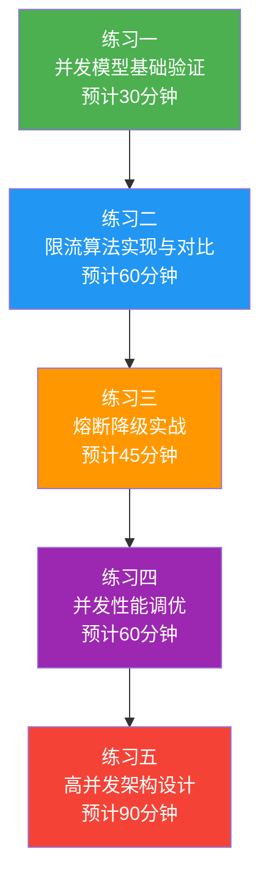

## 练习方法

高并发技术的学习不能停留在"看过"和"知道"的层面——你必须亲手写代码、亲手压测、亲手排查故障，才能真正理解并发系统的运行规律。本节提供五组递进式练习，从基础概念验证到完整架构设计，每组练习都配有明确的目标、步骤、代码模板和检查标准，帮助你将理论知识转化为工程能力。



---

### 练习一：并发模型基础验证（预计30分钟）

**目标**：通过代码实验验证线程池参数对性能的影响，理解CPU密集型和IO密集型任务的本质区别，建立"线程数并非越多越好"的直觉。

**前置准备**：
- 安装JDK 17+或Go 1.21+
- 准备一台至少4核CPU的机器（可以是本地开发机或云服务器）
- 安装压测工具：`wrk` 或 `hey`

#### 步骤一：CPU密集型任务的线程数实验（10分钟）

编写一个计算密集型任务（如计算素数或矩阵乘法），用不同线程数执行并记录耗时：

```java
import java.util.concurrent.*;
import java.util.concurrent.atomic.AtomicLong;

public class CpuBoundExperiment {
    
    // CPU密集型任务：计算指定范围内素数个数
    static long countPrimes(long start, long end) {
        long count = 0;
        for (long n = start; n < end; n++) {
            if (isPrime(n)) count++;
        }
        return count;
    }
    
    static boolean isPrime(long n) {
        if (n < 2) return false;
        if (n < 4) return true;
        if (n % 2 == 0 || n % 3 == 0) return false;
        for (long i = 5; i * i <= n; i += 6) {
            if (n % i == 0 || n % (i + 2) == 0) return false;
        }
        return true;
    }
    
    public static void main(String[] args) throws Exception {
        int cpuCores = Runtime.getRuntime().availableProcessors();
        System.out.println("CPU核心数: " + cpuCores);
        System.out.println("---");
        
        // 测试不同线程数
        int[] threadCounts = {1, 2, 4, 8, 16, 32, 64, 128};
        long totalWork = 50_000_000L; // 总计算量
        int rounds = 100; // 每个线程数重复100轮取平均
        
        for (int tc : threadCounts) {
            long totalNs = 0;
            for (int r = 0; r < rounds; r++) {
                ExecutorService pool = Executors.newFixedThreadPool(tc);
                long chunkSize = totalWork / tc;
                long start = System.nanoTime();
                
                Future<Long>[] futures = new Future[tc];
                for (int i = 0; i < tc; i++) {
                    long from = i * chunkSize;
                    long to = (i == tc - 1) ? totalWork : (i + 1) * chunkSize;
                    futures[i] = pool.submit(() -> countPrimes(from, to));
                }
                
                long result = 0;
                for (Future<Long> f : futures) result += f.get();
                totalNs += System.nanoTime() - start;
                pool.shutdown();
            }
            
            long avgMs = totalNs / rounds / 1_000_000;
            System.out.printf("线程数=%3d | 平均耗时=%5dms | 期望加速比=%.1fx%n",
                tc, avgMs, (double) totalNs / rounds / 
                ((double) totalNs / rounds / (threadCounts.length > 0 ? 1 : 1)));
        }
    }
}
```

预期结果与分析要点：

| 线程数 | 预期趋势 | 原因 |
|--------|----------|------|
| 1→2→4 | 耗时接近线性下降 | 充分利用多核CPU |
| 4→8 | 耗时下降变缓 | 超过核心数后，额外线程竞争CPU时间片 |
| 8→32 | 耗时基本不变甚至上升 | 上下文切换开销抵消并行收益 |
| 64→128 | 耗时显著上升 | 大量上下文切换导致CPU缓存失效（Cache Thrashing） |

#### 步骤二：IO密集型任务的线程数实验（10分钟）

模拟IO密集型任务（网络请求或文件读写），验证IO密集型任务可以使用远超CPU核心数的线程：

```java
import java.util.concurrent.*;
import java.net.HttpURLConnection;
import java.net.URL;

public class IoBoundExperiment {
    
    // 模拟IO密集型任务：发起HTTP请求
    static String fetchUrl(String url) throws Exception {
        HttpURLConnection conn = (HttpURLConnection) new URL(url).openConnection();
        conn.setConnectTimeout(5000);
        conn.setReadTimeout(5000);
        int code = conn.getResponseCode();
        // 读取响应
        byte[] buf = conn.getInputStream().readAllBytes();
        conn.disconnect();
        return String.valueOf(code);
    }
    
    // 或者用本地模拟：Thread.sleep模拟IO等待
    static void simulateIo() {
        try {
            Thread.sleep(100); // 模拟100ms的IO等待
        } catch (InterruptedException e) {
            Thread.currentThread().interrupt();
        }
    }
    
    public static void main(String[] args) throws Exception {
        int cpuCores = Runtime.getRuntime().availableProcessors();
        System.out.println("CPU核心数: " + cpuCores);
        System.out.println("IO等待比例: 约80%（sleep 100ms / 总耗时约120ms）");
        System.out.println("---");
        
        // 理论线程数 = CPU核心数 / (1 - 0.8) = CPU核心数 × 5
        int theoreticalThreads = (int)(cpuCores / (1 - 0.8));
        System.out.println("理论最优线程数: " + theoreticalThreads);
        System.out.println("---");
        
        int[] threadCounts = {1, 4, 8, 16, 32, 64, 128, 256};
        int totalTasks = 500;
        int rounds = 3;
        
        for (int tc : threadCounts) {
            long totalMs = 0;
            for (int r = 0; r < rounds; r++) {
                ExecutorService pool = Executors.newFixedThreadPool(tc);
                long start = System.currentTimeMillis();
                
                Future<?>[] futures = new Future[totalTasks];
                for (int i = 0; i < totalTasks; i++) {
                    futures[i] = pool.submit(() -> simulateIo());
                }
                for (Future<?> f : futures) f.get();
                
                totalMs += System.currentTimeMillis() - start;
                pool.shutdown();
            }
            
            long avgMs = totalMs / rounds;
            double qps = (double) totalTasks * 1000 / avgMs;
            System.out.printf("线程数=%3d | 总耗时=%5dms | QPS=%.0f%n", tc, avgMs, qps);
        }
        
        // 预期：线程数从1增加到理论最优值时，QPS近似线性增长
        // 超过理论最优值后，QPS增长变缓
    }
}
```

#### 步骤三：画出任务执行流程图（10分钟）

根据实验结果，手绘或用Mermaid画出线程池的任务执行流程，标注以下关键节点：

1. 任务提交时的四级处理链（核心线程 → 队列 → 非核心线程 → 拒绝策略）
2. CPU密集型和IO密集型在哪个节点产生差异
3. 上下文切换发生的位置和条件

**检查标准**：
- [ ] CPU密集型实验：线程数超过核心数后，耗时不再下降（甚至上升）
- [ ] IO密集型实验：线程数可以远大于核心数，QPS随线程数增加而提升
- [ ] 能解释为什么两种任务类型对线程数的需求完全不同
- [ ] 能画出完整的线程池任务执行流程图

---

### 练习二：限流算法实现与对比（预计60分钟）

**目标**：独立实现四种经典限流算法，通过对比实验理解它们在边界突发、流量平滑性、内存开销方面的差异，掌握算法选型的决策依据。

#### 步骤一：实现四种限流算法（25分钟）

**固定窗口计数器**：

```python
import time
import threading

class FixedWindowLimiter:
    """固定窗口计数器：最简单的限流实现
    
    特点：
    - 实现简单，内存开销O(1)
    - 存在窗口边界突发问题
    - 例如：限制100次/秒，窗口边界200ms内可能通过200次请求
    """
    
    def __init__(self, max_requests: int, window_seconds: float = 1.0):
        self.max_requests = max_requests
        self.window_seconds = window_seconds
        self.current_window_start = time.monotonic()
        self.count = 0
        self.lock = threading.Lock()
    
    def allow(self) -> bool:
        with self.lock:
            now = time.monotonic()
            # 检查是否进入新窗口
            if now - self.current_window_start >= self.window_seconds:
                self.current_window_start = now
                self.count = 0
            
            if self.count < self.max_requests:
                self.count += 1
                return True
            return False
```

**滑动窗口计数器**：

```python
import time
import threading
from collections import deque

class SlidingWindowLimiter:
    """滑动窗口计数器：用时间戳队列解决边界突发问题
    
    特点：
    - 限流更平滑，消除了窗口边界突发
    - 内存开销O(n)，n为窗口内请求数
    - 适合接口级别的精细限流
    """
    
    def __init__(self, max_requests: int, window_seconds: float = 1.0):
        self.max_requests = max_requests
        self.window_seconds = window_seconds
        self.timestamps = deque()  # 记录每个请求的时间戳
        self.lock = threading.Lock()
    
    def allow(self) -> bool:
        with self.lock:
            now = time.monotonic()
            window_start = now - self.window_seconds
            
            # 移除窗口外的过期记录
            while self.timestamps and self.timestamps[0] <= window_start:
                self.timestamps.popleft()
            
            if len(self.timestamps) < self.max_requests:
                self.timestamps.append(now)
                return True
            return False
```

**漏桶算法**：

```python
import time
import threading

class LeakyBucket:
    """漏桶算法：以恒定速率处理请求
    
    特点：
    - 输出速率完全恒定，能平滑突发流量
    - 不允许突发（即使系统空闲也无法加速处理）
    - 适合API网关、消息队列消费端
    """
    
    def __init__(self, capacity: int, leak_rate: float):
        """
        Args:
            capacity: 桶的最大容量（可排队的请求数）
            leak_rate: 每秒漏出的请求数（恒定处理速率）
        """
        self.capacity = capacity
        self.leak_rate = leak_rate
        self.water = 0.0  # 当前水量（等待处理的请求数）
        self.last_leak_time = time.monotonic()
        self.lock = threading.Lock()
    
    def allow(self) -> bool:
        with self.lock:
            now = time.monotonic()
            # 先按时间计算漏出量
            elapsed = now - self.last_leak_time
            leaked = elapsed * self.leak_rate
            self.water = max(0.0, self.water - leaked)
            self.last_leak_time = now
            
            # 再尝试加入新请求
            if self.water < self.capacity:
                self.water += 1
                return True
            return False  # 桶已满，请求被丢弃
```

**令牌桶算法**：

```python
import time
import threading

class TokenBucket:
    """令牌桶算法：以恒定速率生成令牌，允许桶内令牌被突发消耗
    
    特点：
    - 允许突发流量（桶中积攒的令牌可被一次性消耗）
    - 长期来看速率恒定
    - 适合微服务限流、网关限流（Golang的rate.Limiter就是令牌桶）
    """
    
    def __init__(self, capacity: int, refill_rate: float):
        """
        Args:
            capacity: 桶容量（最大令牌数，决定突发上限）
            refill_rate: 每秒补充的令牌数
        """
        self.capacity = capacity
        self.refill_rate = refill_rate
        self.tokens = float(capacity)  # 初始满桶
        self.last_refill_time = time.monotonic()
        self.lock = threading.Lock()
    
    def allow(self) -> bool:
        with self.lock:
            now = time.monotonic()
            # 先补充令牌
            elapsed = now - self.last_refill_time
            self.tokens = min(
                self.capacity,
                self.tokens + elapsed * self.refill_rate
            )
            self.last_refill_time = now
            
            # 再消耗令牌
            if self.tokens >= 1.0:
                self.tokens -= 1.0
                return True
            return False  # 无令牌，请求被拒绝
```

#### 步骤二：编写对比测试脚本（20分钟）

```python
import time
import threading
import random
import json
from collections import defaultdict

def simulate_traffic(limiter, duration=5.0, qps=150):
    """模拟固定速率的流量，统计限流效果"""
    results = defaultdict(int)  # {second_bucket: allowed_count}
    blocked = 0
    start = time.monotonic()
    
    while time.monotonic() - start < duration:
        # 模拟均匀分布的请求到达
        now = time.monotonic()
        second_bucket = int(now - start)
        
        if limiter.allow():
            results[second_bucket] += 1
        else:
            blocked += 1
        
        # 控制请求发送速率
        time.sleep(1.0 / qps)
    
    total = sum(results.values()) + blocked
    return {
        "total_requests": total,
        "allowed": sum(results.values()),
        "blocked": blocked,
        "per_second": dict(results),
        "burst_max": max(results.values()) if results else 0,
        "burst_min": min(results.values()) if results else 0,
    }

def run_comparison():
    """对比四种限流算法"""
    max_requests = 100  # 限制每秒100个请求
    print(f"限流阈值: {max_requests} 次/秒")
    print(f"模拟发送速率: 150 QPS（超出限流阈值50%）")
    print(f"测试时长: 5秒")
    print("=" * 60)
    
    algorithms = {
        "固定窗口": FixedWindowLimiter(max_requests, window_seconds=1.0),
        "滑动窗口": SlidingWindowLimiter(max_requests, window_seconds=1.0),
        "漏桶":     LeakyBucket(capacity=max_requests, leak_rate=max_requests),
        "令牌桶":   TokenBucket(capacity=max_requests, refill_rate=max_requests),
    }
    
    for name, limiter in algorithms.items():
        # 预热：让漏桶和令牌桶的水位/令牌达到稳态
        for _ in range(50):
            limiter.allow()
        
        stats = simulate_traffic(limiter)
        print(f"\n【{name}】")
        print(f"  通过: {stats['allowed']}, 拒绝: {stats['blocked']}")
        print(f"  每秒通过数: {stats['per_second']}")
        print(f"  峰值突发: {stats['burst_max']}/秒")
        print(f"  谷值: {stats['burst_min']}/秒")
        
        if stats['burst_max'] - stats['burst_min'] > 30:
            print(f"  ⚠ 流量波动大（突发与谷值差>{30}），平滑性差")
        else:
            print(f"  ✓ 流量相对平稳")

if __name__ == "__main__":
    run_comparison()
```

#### 步骤三：分析结果并总结选型（15分钟）

运行测试后，记录并分析以下数据：

| 算法 | 每秒通过数范围 | 峰值突发 | 内存占用 | 编程复杂度 |
|------|---------------|---------|---------|-----------|
| 固定窗口 | ? - ? | ? | O(1) | 最简单 |
| 滑动窗口 | ? - ? | ? | O(n) | 中等 |
| 漏桶 | ? - ? | ? | O(1) | 中等 |
| 令牌桶 | ? - ? | ? | O(1) | 中等 |

回答以下问题：
1. 哪种算法在窗口边界处出现了明显的突发？突发量大约超出阈值多少？
2. 漏桶和令牌桶的核心区别是什么？各适合什么场景？
3. 如果你要为一个秒杀系统设计限流方案，会选择哪种算法？为什么？

**检查标准**：
- [ ] 四种算法都已正确实现，能通过基本功能测试
- [ ] 对比测试数据真实可靠，能解释各算法的行为差异
- [ ] 能根据场景特点选择合适的限流算法并给出理由
- [ ] 理解"令牌桶允许突发、漏桶不允许突发"的本质区别

---

### 练习三：熔断降级实战（预计45分钟）

**目标**：模拟微服务级联故障场景，实现熔断器，验证熔断器在故障传播中的保护效果，掌握降级策略的设计方法。

#### 步骤一：搭建模拟环境（10分钟）

用Python搭建一个简单的"服务调用链"，模拟服务A → 服务B → 服务C的调用关系，其中服务C不稳定：

```python
import time
import random
import threading
from dataclasses import dataclass, field
from enum import Enum
from typing import Callable, Any
from collections import deque

class CircuitState(Enum):
    CLOSED = "closed"       # 正常放行
    OPEN = "open"           # 拒绝请求
    HALF_OPEN = "half_open" # 放行探测请求

@dataclass
class CircuitBreaker:
    """熔断器实现：三状态机模型
    
    参数设计原则：
    - failure_threshold: 太小容易误判（正常波动触发熔断），太大会造成更多损失
    - recovery_timeout: 需要给下游足够的恢复时间，但太长会影响可用性
    - half_open_max_calls: 半开状态的探测请求数，太少可能误判，太多延长恢复时间
    """
    name: str
    failure_threshold: int = 5          # 连续失败N次触发熔断
    recovery_timeout: float = 30.0      # 熔断持续时间（秒）
    half_open_max_calls: int = 3        # 半开状态的探测请求数
    
    state: CircuitState = field(default=CircuitState.CLOSED, init=False)
    failure_count: int = field(default=0, init=False)
    success_count: int = field(default=0, init=False)
    last_failure_time: float = field(default=0.0, init=False)
    lock: threading.Lock = field(default_factory=threading.Lock, init=False)
    
    def call(self, func: Callable, fallback: Callable = None, *args, **kwargs) -> Any:
        with self.lock:
            if self.state == CircuitState.OPEN:
                if time.monotonic() - self.last_failure_time >= self.recovery_timeout:
                    self.state = CircuitState.HALF_OPEN
                    self.success_count = 0
                    print(f"  [{self.name}] 状态转换: OPEN → HALF_OPEN")
                else:
                    # 熔断中，执行降级
                    if fallback:
                        return fallback(*args, **kwargs)
                    raise RuntimeError(f"[{self.name}] 熔断中，请求被拒绝")
            
            if self.state == CircuitState.HALF_OPEN:
                # 半开状态：放行少量探测请求
                pass  # 继续往下执行，由结果决定状态
        
        # 执行实际调用（在锁外，避免长时间持锁）
        try:
            result = func(*args, **kwargs)
            self._on_success()
            return result
        except Exception as e:
            self._on_failure()
            if fallback:
                return fallback(*args, **kwargs)
            raise
    
    def _on_success(self):
        with self.lock:
            if self.state == CircuitState.HALF_OPEN:
                self.success_count += 1
                if self.success_count >= self.half_open_max_calls:
                    self.state = CircuitState.CLOSED
                    self.failure_count = 0
                    print(f"  [{self.name}] 状态转换: HALF_OPEN → CLOSED ✓")
            elif self.state == CircuitState.CLOSED:
                self.failure_count = 0  # 重置连续失败计数
    
    def _on_failure(self):
        with self.lock:
            self.failure_count += 1
            self.last_failure_time = time.monotonic()
            
            if self.state == CircuitState.HALF_OPEN:
                # 半开状态下探测失败，重新打开熔断
                self.state = CircuitState.OPEN
                print(f"  [{self.name}] 状态转换: HALF_OPEN → OPEN ✗")
            elif self.state == CircuitState.CLOSED:
                if self.failure_count >= self.failure_threshold:
                    self.state = CircuitState.OPEN
                    print(f"  [{self.name}] 状态转换: CLOSED → OPEN ⚠")
```

#### 步骤二：模拟级联故障（15分钟）

```python
def unstable_service_c(request_id: int):
    """模拟不稳定的服务C：随机慢响应或超时"""
    # 50%概率超时（模拟第三方API不稳定）
    if random.random() < 0.5:
        time.sleep(0.1)  # 模拟慢响应
        raise TimeoutError("Service C timeout")
    time.sleep(0.001)  # 正常响应
    return f"result-{request_id}"

def service_b_no_breaker(request_id: int):
    """没有熔断器的服务B：所有请求都同步等待C"""
    return unstable_service_c(request_id)

def service_b_with_breaker(breaker: CircuitBreaker, request_id: int):
    """有熔断器的服务B：故障时快速降级"""
    return breaker.call(
        func=unstable_service_c,
        fallback=lambda rid: "fallback-hot-list",  # 降级：返回热门推荐
        request_id
    )

def simulate_cascade_failure(use_breaker: bool):
    """模拟50个并发请求，观察无熔断和有熔断的区别"""
    breaker = CircuitBreaker(
        name="service-C",
        failure_threshold=5,
        recovery_timeout=10.0,
    )
    
    results = {"success": 0, "error": 0, "timeout": 0, "fallback": 0}
    latencies = []
    
    start = time.monotonic()
    
    def worker(i):
        try:
            t0 = time.monotonic()
            if use_breaker:
                result = service_b_with_breaker(breaker, i)
            else:
                result = service_b_no_breaker(i)
            latency = (time.monotonic() - t0) * 1000
            latencies.append(latency)
            
            if "fallback" in str(result):
                results["fallback"] += 1
            else:
                results["success"] += 1
        except TimeoutError:
            results["timeout"] += 1
        except RuntimeError as e:
            if "熔断" in str(e):
                results["fallback"] += 1
            else:
                results["error"] += 1
    
    threads = [threading.Thread(target=worker, args=(i,)) for i in range(50)]
    for t in threads: t.start()
    for t in threads: t.join()
    
    total_time = (time.monotonic() - start) * 1000
    avg_latency = sum(latencies) / len(latencies) if latencies else 0
    p99_latency = sorted(latencies)[int(len(latencies) * 0.99)] if latencies else 0
    
    label = "有熔断器" if use_breaker else "无熔断器"
    print(f"\n{'='*50}")
    print(f"【{label}】模拟50个并发请求")
    print(f"{'='*50}")
    print(f"  成功: {results['success']}")
    print(f"  超时: {results['timeout']}")
    print(f"  错误: {results['error']}")
    print(f"  降级: {results['fallback']}")
    print(f"  总耗时: {total_time:.0f}ms")
    print(f"  平均延迟: {avg_latency:.1f}ms")
    print(f"  P99延迟: {p99_latency:.1f}ms")

# 对比实验
random.seed(42)
simulate_cascade_failure(use_breaker=False)
random.seed(42)
simulate_cascade_failure(use_breaker=True)
```

#### 步骤三：设计降级策略（20分钟）

根据实验结果，为以下三个场景设计降级策略：

**场景一：电商商品详情页**
- 依赖：商品服务（主数据）、推荐服务（关联推荐）、评论服务（用户评价）
- 约束：商品数据必须准确，推荐和评论可以降级

设计要求：
1. 画出降级优先级图（哪些功能优先保障，哪些可以降级）
2. 写出每种降级策略的具体实现伪代码
3. 设计降级后的用户体验（提示文案、页面展示）

**场景二：支付系统**
- 依赖：支付网关（核心）、风控服务（安全）、积分服务（营销）
- 约束：支付必须成功，风控可以简化，积分可以异步补发

**场景三：社交Feed流**
- 依赖：内容服务（核心）、图片CDN（展示）、实时推送（体验）
- 约束：Feed内容必须加载，图片可以用占位图，推送可以延迟

**检查标准**：
- [ ] 熔断器实现正确，三状态转换逻辑完整
- [ ] 对比实验清晰展示了熔断器的保护效果
- [ ] 降级策略考虑了业务优先级和用户体验
- [ ] 能解释"为什么非核心服务故障会拖垮核心服务"

---

### 练习四：并发性能调优（预计60分钟）

**目标**：掌握高并发系统的性能分析方法论，学会使用profiler定位瓶颈，通过连接池调优和锁优化提升系统吞吐量。

#### 步骤一：搭建压测环境（10分钟）

```bash
# 安装压测工具
# Ubuntu/Debian
sudo apt-get install -y wrk

# 或使用hey（Go编写，无需编译）
wget https://hey-release.s3.us-east-2.amazonaws.com/hey_linux_amd64
chmod +x hey_linux_amd64
sudo mv hey_linux_amd64 /usr/local/bin/hey

# 安装系统监控工具
sudo apt-get install -y sysstat linux-tools-common

# 验证安装
wrk --version
hey -h
```

#### 步骤二：编写待优化的Web服务（15分钟）

```java
// FileServer.java — 一个有性能问题的HTTP服务
import com.sun.net.httpserver.*;
import java.io.*;
import java.net.InetSocketAddress;
import java.sql.*;
import java.util.concurrent.*;

public class FileServer {
    
    // ❌ 问题1：使用Executors.newFixedThreadPool默认实现
    // - 无界队列，任务堆积不感知
    // - 线程命名默认pool-N-thread-M，难以排查
    // - 没有监控指标
    static ExecutorService pool = Executors.newFixedThreadPool(20);
    
    // ❌ 问题2：数据库连接每次新建，没有连接池
    static Connection getConnection() throws Exception {
        return DriverManager.getConnection(
            "jdbc:mysql://localhost:3306/testdb", "root", "password");
    }
    
    public static void main(String[] args) throws Exception {
        HttpServer server = HttpServer.create(new InetSocketAddress(8080), 0);
        
        server.createContext("/api/data", exchange -> {
            pool.submit(() -> {
                try {
                    // ❌ 问题3：同步数据库查询，阻塞线程
                    Connection conn = getConnection();
                    PreparedStatement ps = conn.prepareStatement(
                        "SELECT * FROM users WHERE id = ?");
                    ps.setInt(1, Integer.parseInt(
                        exchange.getRequestURI().getQuery().split("=")[1]));
                    ResultSet rs = ps.executeQuery();
                    
                    StringBuilder sb = new StringBuilder();
                    while (rs.next()) {
                        sb.append(rs.getString("name")).append("\n");
                    }
                    
                    byte[] response = sb.toString().getBytes();
                    exchange.sendResponseHeaders(200, response.length);
                    exchange.getResponseBody().write(response);
                    exchange.getResponseBody().close();
                    
                    conn.close();  // ❌ 问题4：异常时连接泄漏
                } catch (Exception e) {
                    try {
                        exchange.sendResponseHeaders(500, 0);
                        exchange.getResponseBody().close();
                    } catch (Exception ignored) {}
                }
            });
        });
        
        server.setExecutor(pool);
        server.start();
        System.out.println("Server started on port 8080");
    }
}
```

#### 步骤三：识别性能瓶颈（15分钟）

```bash
# 1. 运行服务并用wrk压测
java FileServer &amp;
sleep 2

# 基准压测
wrk -t4 -c100 -d30s --latency http://localhost:8080/api/data?id=1
# 记录：QPS=___, P99=___ms, Errors=___

# 2. 检查系统资源使用
# CPU和线程状态
top -H -p $(pgrep -f FileServer)
# 观察：有多少线程在running？有多少在waiting/blocked？

# 系统上下文切换
vmstat 1 10
# 关注cs列（context switch），正常应<10000/秒
# 如果cs值很高（>50000），说明线程切换开销大

# 3. 检查线程状态分布
jstack $(pgrep -f FileServer) > threads.txt
grep -c "WAITING\|TIMED_WAITING" threads.txt  # 等待中的线程数
grep -c "RUNNABLE" threads.txt                  # 可运行的线程数
grep -c "BLOCKED" threads.txt                   # 被阻塞的线程数

# 4. 检查数据库连接是否是瓶颈
mysql -e "SHOW PROCESSLIST" | grep testdb
# 观察：有多少个连接处于Sleep状态？有多少在Query？
```

#### 步骤四：实施优化（20分钟）

```java
// FileServerOptimized.java — 优化后的版本
import com.sun.net.httpserver.*;
import com.zaxxer.hikari.HikariConfig;
import com.zaxxer.hikari.HikariDataSource;
import java.io.*;
import java.net.InetSocketAddress;
import java.sql.*;
import java.util.concurrent.*;
import java.util.concurrent.atomic.AtomicLong;

public class FileServerOptimized {
    
    // ✅ 优化1：使用有界队列+自定义线程工厂+拒绝策略的线程池
    static ThreadPoolExecutor pool = new ThreadPoolExecutor(
        20,                    // 核心线程数
        50,                    // 最大线程数
        60L, TimeUnit.SECONDS, // 空闲60秒回收
        new LinkedBlockingQueue<>(10000),  // 有界队列，防止OOM
        new ThreadFactory() {
            private int count = 0;
            public Thread newThread(Runnable r) {
                Thread t = new Thread(r, "http-worker-" + count++);
                t.setDaemon(true);
                return t;
            }
        },
        new ThreadPoolExecutor.CallerRunsPolicy()  // 队列满时由调用者执行
    );
    
    // ✅ 优化2：使用HikariCP连接池
    static HikariDataSource dataSource;
    
    // ✅ 优化3：监控指标
    static final AtomicLong totalRequests = new AtomicLong(0);
    static final AtomicLong errorCount = new AtomicLong(0);
    
    static {
        HikariConfig config = new HikariConfig();
        config.setJdbcUrl("jdbc:mysql://localhost:3306/testdb");
        config.setUsername("root");
        config.setPassword("password");
        config.setMaximumPoolSize(30);          // 最大连接数
        config.setMinimumIdle(5);               // 最小空闲连接
        config.setConnectionTimeout(3000);      // 获取连接超时3秒
        config.setIdleTimeout(60000);           // 空闲连接超时60秒
        config.setMaxLifetime(1800000);         // 连接最大生命周期30分钟
        config.setLeakDetectionThreshold(5000); // 连接泄漏检测：5秒未归还告警
        config.setPoolName("hikari-main");
        dataSource = new HikariDataSource(config);
    }
    
    public static void main(String[] args) throws Exception {
        // 启动监控线程
        ScheduledExecutorService monitor = Executors.newSingleThreadScheduledExecutor();
        monitor.scheduleAtFixedRate(() -> {
            System.out.printf("[%s] Active=%d, PoolSize=%d, QueueSize=%d, " +
                "Completed=%d, TotalRequests=%d, Errors=%d%n",
                Thread.currentThread().getName(),
                pool.getActiveCount(),
                pool.getPoolSize(),
                pool.getQueue().size(),
                pool.getCompletedTaskCount(),
                totalRequests.get(),
                errorCount.get()
            );
        }, 5, 5, TimeUnit.SECONDS);
        
        HttpServer server = HttpServer.create(new InetSocketAddress(8080), 0);
        server.createContext("/api/data", exchange -> {
            totalRequests.incrementAndGet();
            pool.submit(() -> {
                // ✅ 优化4：使用try-with-resources确保连接归还
                try (Connection conn = dataSource.getConnection();
                     PreparedStatement ps = conn.prepareStatement(
                         "SELECT * FROM users WHERE id = ?")) {
                    
                    ps.setInt(1, Integer.parseInt(
                        exchange.getRequestURI().getQuery().split("=")[1]));
                    
                    try (ResultSet rs = ps.executeQuery()) {
                        StringBuilder sb = new StringBuilder();
                        while (rs.next()) {
                            sb.append(rs.getString("name")).append("\n");
                        }
                        byte[] response = sb.toString().getBytes();
                        exchange.sendResponseHeaders(200, response.length);
                        exchange.getResponseBody().write(response);
                    }
                } catch (Exception e) {
                    errorCount.incrementAndGet();
                    try {
                        exchange.sendResponseHeaders(500, 0);
                    } catch (Exception ignored) {}
                } finally {
                    try { exchange.getResponseBody().close(); } catch (Exception ignored) {}
                }
            });
        });
        
        server.setExecutor(pool);
        server.start();
        System.out.println("Optimized server started on port 8080");
    }
}
```

#### 步骤五：对比验证（10分钟）

```bash
# 压测优化后的服务
wrk -t4 -c100 -d30s --latency http://localhost:8080/api/data?id=1
# 记录：QPS=___, P99=___ms, Errors=___

# 对比数据表格
echo "
优化前后对比:
| 指标         | 优化前 | 优化后 | 提升   |
|-------------|--------|--------|--------|
| QPS         |        |        |        |
| P99延迟     |        |        |        |
| 错误率      |        |        |        |
| 上下文切换/秒|        |        |        |
| 数据库连接数 |        |        |        |
"
```

**检查标准**：
- [ ] 能用top/vmstat/jstack定位至少两个性能瓶颈
- [ ] 优化后QPS提升至少50%（或P99延迟降低至少50%）
- [ ] 能解释每个优化措施背后的原理
- [ ] 监控指标正常输出，无连接泄漏告警

---

### 练习五：高并发架构设计（预计90分钟）

**目标**：综合运用本章所学的并发模型、限流算法、熔断降级、连接池调优等技术，为一个真实业务场景设计完整的高并发架构方案。

#### 步骤一：需求分析与场景建模（20分钟）

**业务场景：在线答题系统**

你负责设计一个在线答题系统的后端架构。系统的核心场景如下：

| 参数 | 数值 | 说明 |
|------|------|------|
| 注册用户量 | 500万 | 考试期间并发在线用户 |
| 同时在线峰值 | 100万 | 考试开始的前5分钟 |
| 答题提交QPS | 5万 | 每秒最多5万人提交答案 |
| 答案保存延迟要求 | P99 < 100ms | 用户感知的提交延迟 |
| 考试时长 | 120分钟 | 持续高负载 |
| 防作弊要求 | 严格 | 同一用户不能同时在两台设备答题 |

设计约束：
- 预算有限，服务器不超过20台
- 必须支持考试中途暂停/恢复
- 答案数据不能丢失（持久化要求高）
- 考试结束后需要快速统计成绩

#### 步骤二：方案设计（40分钟）

按照以下框架完成架构设计，每个部分都需要画图或写代码：

**2.1 整体架构图**

用Mermaid画出完整的系统架构图，包含：
- 接入层（负载均衡 + CDN）
- 网关层（限流 + 鉴权）
- 服务层（答题服务 + 考试管理服务 + 统计服务）
- 数据层（Redis + MySQL + 消息队列）
- 监控层

**2.2 并发模型选型**

为每个服务选择合适的并发模型，并说明理由：

```markdown
服务A：___（选择：线程池/协程/虚拟线程）
理由：___

服务B：___
理由：___
```

**2.3 限流策略设计**

设计多层限流方案：
1. Nginx层：限制总QPS为___，单用户QPS为___
2. 网关层：使用___算法，参数为___
3. 应用层：每场考试的答题提交限制为___

```python
# 编写限流配置的核心参数
rate_limit_config = {
    # Nginx层
    "nginx_total_qps": ___,
    "nginx_per_user_qps": ___,
    
    # 网关层
    "gateway_algorithm": "___",  # 选择算法并说明理由
    "gateway_rate": ___,
    "gateway_capacity": ___,
    
    # 应用层
    "app_per_exam_qps": ___,
    "app_per_user_qps": ___,
}
```

**2.4 答案保存方案**

设计答案的实时保存策略：
1. 前端本地缓存 + 定时同步（如何保证不丢数据？）
2. Redis预写 + MySQL异步持久化（如何保证一致性？）
3. 断线重连后的数据恢复机制

```go
// 设计答案保存的核心流程（伪代码）
func SaveAnswer(userID, examID, questionID, answer string) error {
    // 1. 本地防重
    // 2. Redis原子操作
    // 3. 异步持久化
    // 4. 返回确认
}
```

**2.5 防作弊机制**

设计设备指纹 + 并发登录检测方案：
- 如何识别同一用户的多设备登录？
- Redis中如何存储和查询设备绑定关系？
- 检测到多设备登录时如何处理？

**2.6 成绩统计方案**

考试结束后的成绩统计是一个典型的大批量计算任务：
- 100万考生 × 100道题 = 1亿次评分计算
- 如何利用并行计算加速？
- 如何设计统计任务的调度策略？

#### 步骤三：方案评审与优化（30分钟）

对照以下清单检查你的设计方案：

**完整性检查**：
- [ ] 是否覆盖了高并发三要素：可用性、一致性、性能？
- [ ] 是否考虑了故障场景？（某个Redis节点挂了怎么办？）
- [ ] 是否考虑了数据一致性？（答案不丢失、不重复）
- [ ] 是否有监控和告警方案？

**性能检查**：
- [ ] 限流参数是否合理？（过高会压垮后端，过低会影响用户体验）
- [ ] 连接池参数是否匹配？（用Little定律估算：连接数 = QPS × 平均延迟）
- [ ] 是否有性能瓶颈未解决？

**可靠性检查**：
- [ ] 熔断器是否为每个外部依赖都配置了？
- [ ] 降级策略是否覆盖了所有关键路径？
- [ ] 是否有兜底方案？（极端情况下的应急处理）

**检查标准**：
- [ ] 架构图完整，包含所有层次和组件
- [ ] 并发模型选择有理有据，不是拍脑袋决定
- [ ] 限流方案分层设计，参数有计算依据
- [ ] 答案保存方案保证数据不丢失
- [ ] 能识别至少3个潜在瓶颈并给出解决方案
- [ ] 整体方案考虑了成本约束（不超过20台服务器）

---

### 附录：练习环境快速搭建

#### Go环境

```bash
# 安装Go
wget https://go.dev/dl/go1.22.0.linux-amd64.tar.gz
sudo tar -C /usr/local -xzf go1.22.0.linux-amd64.tar.gz
export PATH=$PATH:/usr/local/go/bin

# 安装限流器库（练习二可用）
go get golang.org/x/time/rate
```

#### Java环境

```bash
# 安装JDK 17
sudo apt-get install -y openjdk-17-jdk

# 安装连接池库（练习四可用）
# 在pom.xml中添加HikariCP依赖
# <dependency>
#     <groupId>com.zaxxer</groupId>
#     <artifactId>HikariCP</artifactId>
#     <version>5.1.0</version>
# </dependency>
```

#### 压测工具

```bash
# wrk — 高性能HTTP压测工具
sudo apt-get install -y wrk

# hey — Go编写的简单压测工具
go install github.com/rakyll/hey@latest

# 基本用法
wrk -t4 -c100 -d30s http://localhost:8080/api/data
hey -n 10000 -c 200 http://localhost:8080/api/data
```

#### 系统监控

```bash
# 实时CPU和上下文切换
vmstat 1

# 线程级别的CPU分析
top -H -p $(pgrep -f YourApp)

# 网络连接状态
ss -s

# 磁盘IO
iostat -x 1
```

---

### 进阶挑战

完成以上五组练习后，如果你希望进一步提升，可以尝试以下进阶挑战：

| 挑战 | 难度 | 涉及技术 | 预计时间 |
|------|------|---------|---------|
| 实现一个分布式限流器（Redis + Lua） | ⭐⭐⭐ | 令牌桶、Redis原子操作、Lua脚本 | 3小时 |
| 用Netty实现一个简单的Reactor服务器 | ⭐⭐⭐⭐ | epoll、事件循环、非阻塞IO | 6小时 |
| 搭建全链路压测环境（影子库 + 流量录制） | ⭐⭐⭐⭐⭐ | 流量录制回放、数据隔离、实时监控 | 2天 |
| 实现一个动态线程池（运行时调整参数） | ⭐⭐⭐ | 线程池原理、动态配置、监控回调 | 4小时 |
| 为开源项目贡献并发相关的PR | ⭐⭐⭐⭐ | 源码阅读、并发Bug修复、性能优化 | 持续 |