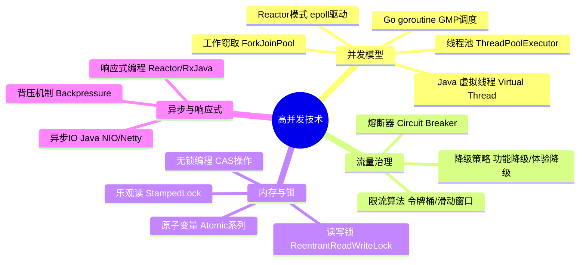
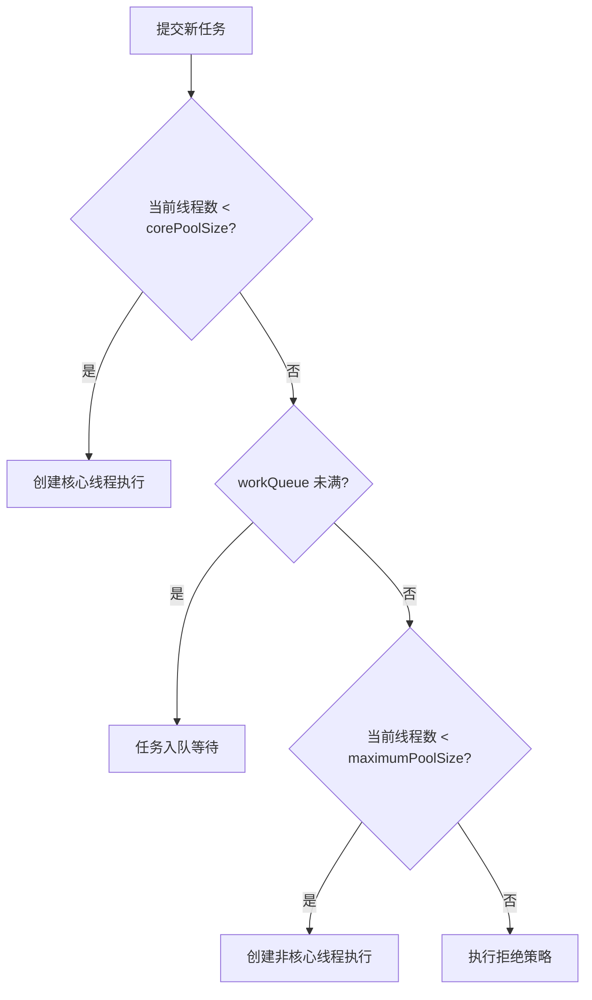
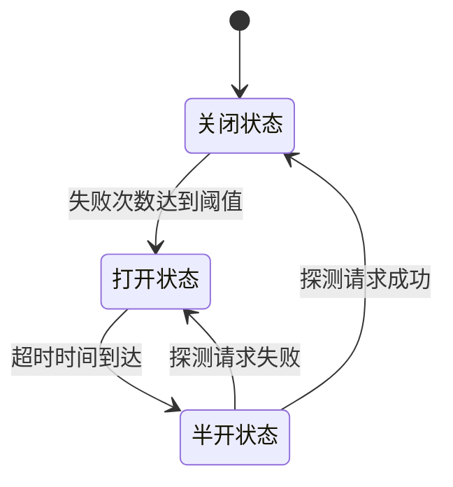
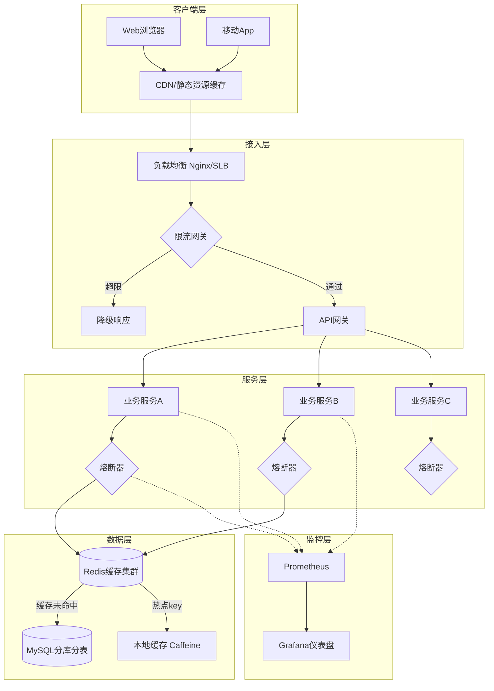

## 本章小结

本章从并发编程的基础理论出发，系统性地介绍了高并发技术的六大核心领域：并发模型、限流算法、熔断降级、无锁编程、热点数据处理以及异步编程。下面对全章知识体系进行结构化回顾，帮助读者建立完整的知识脉络，同时提供一份可随时查阅的实战决策指南。

> **阅读提示**：本小结不仅是对全章内容的回顾，更是一份独立可用的**高并发技术速查手册**。如果你已经通读全章，可以将本节作为快速索引；如果你时间有限，可以直接跳到第八节"技术选型决策指南"获取决策框架，或翻阅第十一节"一页纸速查卡"获取核心要点。

---

## 一、核心知识体系总览

本章内容围绕一个核心目标展开：**如何让系统在海量请求下依然保持高性能、高可用和可扩展性**。围绕这一目标，形成了从底层并发机制到上层流量治理的完整技术栈。



### 知识节点之间的关系

这六大领域并非孤立存在，而是层层递进、相互支撑：

| 层次 | 技术领域 | 解决的核心问题 | 与其他领域的关系 |
|------|----------|----------------|------------------|
| 底层机制 | 并发模型 | 任务如何并行执行 | 是所有上层技术的基础 |
| 内存安全 | 无锁编程 / 读写锁 | 多线程如何安全共享数据 | 并发模型必须配合的同步手段 |
| 流量控制 | 限流 / 熔断 | 系统如何抵御过载 | 保护底层并发资源不被耗尽 |
| 数据优化 | 热点数据处理 | 竞争集中时如何保持性能 | 依赖无锁编程和缓存策略 |
| 编程范式 | 异步 / 响应式 | 如何避免线程阻塞提升吞吐 | 与协程、Reactor模式紧密关联 |

**一句话总结它们的协作关系**：并发模型决定"谁来干活"，锁机制决定"怎么安全地共享资源"，限流熔断决定"什么时候该拒绝"，异步编程决定"怎么不浪费等待时间"，热点数据处理决定"竞争最激烈的地方怎么撑住"。

---

## 二、并发模型：从线程到协程的演进

### 2.1 线程池：并发编程的基石

线程池的核心思想是**资源复用**——预先创建一组线程，避免频繁创建销毁的开销。Java的 `ThreadPoolExecutor` 是最经典的实现，理解它的工作流程是掌握并发编程的第一步。

**任务提交的四级处理链**：



**关键参数调优公式**：

| 任务类型 | 推荐核心线程数 | 原理 |
|----------|----------------|------|
| CPU密集型 | N + 1（N为CPU核心数） | 充分利用CPU，+1处理偶发页缺失 |
| IO密集型 | N / (1 - 阻塞比例) | IO等待时不占CPU，可多开线程 |
| 混合型 | 根据IO等待比例动态计算 | 需通过压测确定最优值 |

**示例**：假设4核CPU，IO等待比例80%，则线程数 = 4 / (1 - 0.8) = 20 个线程。

> **工程实践提醒**：线程数公式只是起点。在实际系统中，还需考虑下游依赖的承载能力（如数据库连接池上限）、任务本身的内存消耗、以及JVM的GC压力。盲目增加线程数反而可能因为上下文切换和内存竞争导致性能下降。建议通过压测找到"拐点"——即吞吐量不再增长甚至开始下降的线程数。

**ForkJoinPool 的工作窃取算法**：每个线程维护独立的双端队列，空闲线程从其他线程队列的**尾部**窃取任务，与任务提交者从**头部**执行形成反向操作，减少竞争。这种设计特别适合递归分解型任务（如并行排序、大规模数据处理）。

### 2.2 协程：轻量级并发的未来

协程与线程的本质区别在于**调度层级**——线程由内核调度，协程由用户态调度器管理，省去了内核态/用户态切换的开销。

| 对比维度 | 操作系统线程 | Go goroutine | Java 虚拟线程 |
|----------|-------------|-------------|--------------|
| 初始栈大小 | 1-8MB | 2KB（可动态伸缩） | ~数百字节 |
| 创建成本 | 高（系统调用） | 极低（用户态） | 极低（JVM管理） |
| 上下文切换 | 内核态切换 ~1-10μs | 用户态切换 ~数十ns | JVM调度 ~数百ns |
| 典型并发量 | 数千~数万 | 数十万~数百万 | 数十万~数百万 |
| 阻塞行为 | 阻塞操作系统线程 | 释放M，P切换到其他M | 自动unmount底层线程 |
| 适用语言生态 | 所有语言 | Go | Java 21+ |
| 调试工具 | strace/perf 完善 | delve，但调度器较难追踪 | JFR/jcmd 支持虚拟线程dump |

**Go GMP调度模型**的三个核心组件：

- **G（Goroutine）**：轻量级协程，初始栈仅2KB，按需增长到最大1GB
- **M（Machine）**：操作系统线程，真正执行计算的载体
- **P（Processor）**：逻辑处理器，数量默认等于CPU核心数，维护本地goroutine队列

关键设计：当一个M因为系统调用阻塞时，P会**分离**并绑定到其他空闲M上继续执行队列中的goroutine，确保CPU不被浪费。当本地队列为空时，P会尝试从全局队列获取G，或从其他P的队列"偷取"一半——这就是GMP模型中的work stealing机制。

**Java虚拟线程（JDK 21+）**解决了传统线程模型中一个长期痛点：**阻塞操作浪费线程资源**。在虚拟线程中，`Thread.sleep()`、`socket.read()` 等阻塞操作不会阻塞底层平台线程，JVM会自动将虚拟线程卸载（unmount），释放平台线程给其他虚拟线程使用。

> **虚拟线程的陷阱**：虚拟线程不是万能药。它不适合CPU密集型任务——因为虚拟线程最终仍需平台线程来执行计算，如果任务一直占着CPU不放手，虚拟线程的优势就完全发挥不出来。此外，`synchronized` 块会导致虚拟线程被固定（pin）到平台线程上，应尽量用 `ReentrantLock` 替代。

### 2.3 Reactor模式：事件驱动的并发范式

Reactor模式是NIO框架（如Netty、Nginx）的核心架构。它用少量线程处理大量连接：

- **单Reactor单线程**：Reactor线程同时负责事件分发和业务处理（适合轻量级场景）
- **单Reactor多线程**：Reactor线程负责IO事件分发，业务处理交给线程池（主流方案）
- **主从Reactor多线程**：一个Reactor负责接受连接，另一个Reactor负责IO读写（Netty的默认模式）

```go
// Reactor模式的核心：事件循环
for {
    events := epoll_wait(epoll_fd, ...)  // 等待事件
    for _, event := range events {
        if event.is_readable {
            handleRead(event.fd)    // 处理读事件
        }
        if event.is_writable {
            handleWrite(event.fd)   // 处理写事件
        }
    }
}
```

**三种Reactor模式的选型**：

| 模式 | 线程模型 | 适用场景 | 典型框架 |
|------|---------|---------|---------|
| 单Reactor单线程 | 1个线程处理所有IO+业务 | 简单协议、低并发 | Redis 6.0前（单线程模型） |
| 单Reactor多线程 | 1个IO线程 + N个工作线程 | 中等并发、业务逻辑较重 | 早期Netty |
| 主从Reactor多线程 | Boss线程池 + Worker线程池 | 高并发、低延迟要求 | Netty默认、Nginx |

---

## 三、限流与熔断：流量治理双保险

### 3.1 限流算法对比

限流的核心问题是：**在系统资源有限的前提下，如何优雅地分配请求配额**。

| 算法 | 原理 | 优点 | 缺点 | 适用场景 |
|------|------|------|------|----------|
| 固定窗口计数器 | 每个固定时间窗口维护计数 | 实现最简单 | 窗口边界突发问题 | 低精度限流 |
| 滑动窗口计数器 | 滑动时间窗口内维护计数 | 平滑限流 | 内存开销较大 | API网关限流 |
| 令牌桶 | 恒定速率生成令牌，请求消耗令牌 | 允许合理突发 | 参数调优复杂 | 微服务间调用限流 |
| 漏桶 | 恒定速率处理请求，超出排入队列 | 输出速率完全平滑 | 无法应对合理突发 | 消息队列消费限流 |

**固定窗口的边界突发问题详解**：假设限流阈值为100次/秒，在第1秒的最后100ms内通过了100个请求，第2秒的前100ms内又通过了100个请求——在200ms的时间窗口内实际通过了200个请求，瞬间突破了限流阈值。这就是为什么生产环境更推荐滑动窗口或令牌桶。

**令牌桶的关键参数设计**：

- `rate`（令牌生成速率）：应设置为系统稳定承载的最大QPS
- `capacity`（桶容量）：控制突发流量的上限，通常设为 rate 的1-3倍
- 分布式场景下，Redis + Lua脚本实现原子操作，避免分布式锁的性能损耗

**滑动窗口的实现要点**：用时间戳队列记录每个请求的时间，每次请求时先移除窗口外的过期记录，再判断当前窗口内的请求数是否超限。时间精度越高（如毫秒级），限流越平滑，但内存消耗也越大。

**分布式限流的实现方案**：

| 方案 | 原理 | 一致性 | 性能 | 复杂度 |
|------|------|--------|------|--------|
| Redis Lua脚本 | 在Redis中原子执行令牌桶逻辑 | 强一致 | 高（单线程原子操作） | 中 |
| Redis + 滑动窗口 | 用sorted set存储请求时间戳 | 强一致 | 中（大窗口时内存开销大） | 中 |
| 本地限流 + 全局协调 | 每个节点本地限流，周期性同步配额 | 最终一致 | 极高（无网络开销） | 高 |
| 令牌桶 + Redis集群 | 每个节点维护局部桶，周期从Redis获取令牌 | 最终一致 | 高 | 高 |

### 3.2 熔断器模式

熔断器解决的核心问题是：**当下游服务故障时，如何避免级联雪崩**。

**三状态机模型**：



| 状态 | 行为 | 触发条件 |
|------|------|----------|
| **关闭（Closed）** | 正常放行所有请求 | 初始状态 / 半开状态探测成功 |
| **打开（Open）** | 直接拒绝所有请求，返回降级响应 | 连续失败次数达到阈值 |
| **半开（Half-Open）** | 允许少量探测请求通过 | 打开状态持续时间超过超时阈值 |

**关键参数设计**：

- **失败阈值**：连续失败N次后触发熔断（如N=5），太小容易误判，太大会造成更多损失
- **超时时间**：打开状态持续多久后进入半开状态（如30s），需要给下游服务足够的恢复时间
- **探测比例**：半开状态下允许通过的请求比例（如10%），用于探测下游是否恢复

**降级策略的三个层级**：

1. **功能降级**：关闭非核心功能（如推荐系统、评论系统），保核心交易链路
2. **体验降级**：返回缓存数据或默认值（如商品详情页用10分钟前的缓存）
3. **人工降级**：流量过大时切换到静态页面或维护页面

> **熔断器的常见误区**：很多人只关注"何时触发熔断"，却忽略了"如何从熔断中恢复"。一个好的熔断器应该具备**渐进式恢复**能力——半开状态不应只发一个探测请求，而应该逐步增加放行比例（如从10%→30%→50%→100%），避免恢复瞬间的流量冲击再次打垮下游服务。Resilience4j的 `SlowCallRate` 和 `SlowCallThreshold` 参数就是为了支持这种精细化控制。

---

## 四、无锁编程与锁机制

### 4.1 CAS操作：无锁编程的核心

CAS（Compare-And-Swap）是CPU级别的原子指令（x86的 `CMPXCHG` 指令），它在单条指令内完成"比较+交换"，无需加锁：

CAS(内存地址V, 期望值A, 新值B):
    if V == A:
        V = B      // 操作成功
        return true
    else:
        return false // 操作失败，需要重试

**ABA问题及解决方案**：

ABA问题是指：线程1读到值A，线程2将值从A改为B再改回A，线程1执行CAS时认为值没有变化，但中间状态已经改变。

| 方案 | 原理 | 代表实现 | 开销 |
|------|------|----------|------|
| 版本号 | 每次修改递增版本号，CAS时同时比较版本 | `AtomicStampedReference` | 每次操作多一次版本比较 |
| 标记引用 | 用boolean标记是否被修改过 | `AtomicMarkableReference` | 每次操作多一次标记比较 |
| 单调递增 | 值本身单调递增，不可能变回旧值 | `LongAdder`（通过分段降低冲突） | 分段+求和的额外开销 |

> **何时需要关注ABA问题**：在大多数业务场景中（计数器、累加器），ABA问题不会导致业务错误——值从5变回5，对计数操作来说没有影响。但在链表操作、栈操作（如无锁栈的pop）等场景中，ABA可能导致数据结构损坏，必须使用版本号方案。

**高竞争场景的性能对比**：

```java
// 方案一：AtomicLong - 高竞争下性能差（CAS自旋严重）
AtomicLong atomicCounter = new AtomicLong(0);
// 100线程 x 100万次：约800ms

// 方案二：LongAdder - 高竞争下性能优越（分段降低冲突）
LongAdder longAdderCounter = new LongAdder();
// 100线程 x 100万次：约120ms，性能提升6-7倍
```

LongAdder的核心思想是将一个计数器拆分为多个Cell，每个线程优先更新自己对应的Cell，最后求和。这样将热点变量分散为多个变量，大大降低了CAS冲突概率。

### 4.2 读写锁：读多写少场景的最优解

**ReentrantReadWriteLock** 的内部实现：同步状态是一个32位的int值，高16位存储读锁的持有次数（共享），低16位存储写锁的重入次数（独占）。这意味着：

- 最大支持 65535 个读锁同时持有
- 最大支持 65535 次写锁重入

**写线程饥饿问题**：在公平模式下，新来的读请求会被阻塞等待写锁释放，但频繁的读请求会导致写线程长时间获取不到锁。非公平模式下，写线程可能永远被新来的读线程插队。解决思路是使用**写优先**策略：当有写线程在等待时，后续的读请求排队，让写线程优先获取锁。

**StampedLock 的乐观读方案**（Java 8+）：

```java
StampedLock lock = new StampedLock();

// 乐观读：不加锁，获取一个stamp
long stamp = lock.tryOptimisticRead();
// 读取共享变量（可能读到脏数据）
int x = this.x;
int y = this.y;
// 验证stamp是否有效（期间是否有写操作）
if (!lock.validate(stamp)) {
    // 乐观读失败，降级为悲观读锁
    stamp = lock.readLock();
    x = this.x;
    y = this.y;
    lock.unlockRead(stamp);
}
// stamp有效，直接使用x、y
```

**StampedLock 与 ReentrantReadWriteLock 的选型指南**：

| 维度 | ReentrantReadWriteLock | StampedLock |
|------|------------------------|-------------|
| 读写比例 | 读:写 > 10:1 | 读:写 > 100:1（越多越有优势） |
| 可重入 | 支持 | 不支持（读锁和写锁都不可重入） |
| 公平性 | 支持公平/非公平模式 | 不支持公平模式 |
| Condition | 支持 | 不支持 |
| 乐观读 | 不支持 | 支持（核心优势） |
| 性能 | 中等 | 高（读多写少场景） |

### 4.3 锁的性能层级速查

在选择同步机制时，可以按以下优先级考虑：

性能从高到低：
  无竞争场景 → 无同步（线程封闭）
  → volatile读写
  → Atomic系列（CAS）
  → LongAdder（高竞争计数）
  → synchronized（JVM偏向锁/轻量级锁优化）
  → ReentrantLock（需要公平性或高级特性）
  → ReentrantReadWriteLock（读多写少）
  → StampedLock（极端读多写少）

---

## 五、异步编程与响应式范式

### 5.1 响应式编程的核心概念

响应式编程的本质是**数据流驱动的计算模型**——当数据源发生变化时，所有依赖该数据的计算会自动重新执行。

**四个核心角色**：

| 角色 | 职责 | 类比 |
|------|------|------|
| Publisher（发布者） | 产生数据流 | 水龙头 |
| Subscriber（订阅者） | 消费数据流 | 水杯 |
| Operator（操作符） | 转换和组合数据流 | 净水器/管道 |
| Subscription（订阅关系） | 管理发布者和订阅者之间的连接 | 水管开关 |

### 5.2 背压机制：解决生产消费速率失配

当Publisher产生数据的速度超过Subscriber消费的速度时，如果不做控制，会导致OOM或数据丢失。背压机制让Subscriber主动通知Publisher"我处理不过来了，请慢一点"。

**三种背压策略**：

| 策略 | 行为 | 适用场景 | 风险 |
|------|------|----------|------|
| BUFFER | 缓存未处理的数据，有上限 | 数据量可预测 | 缓冲区满时可能OOM |
| DROP | 丢弃新到的数据 | 丢弃旧数据不影响业务（如实时传感器） | 可能丢失关键数据 |
| LATEST | 只保留最新数据 | 只关心最新状态（如实时股价） | 中间状态全部丢失 |

### 5.3 Java NIO：非阻塞IO的实现

NIO的核心是**多路复用**——一个线程通过Selector同时监听多个Channel的IO事件：

```java
// NIO的核心组件关系
Selector（选择器）
    ├── ServerSocketChannel（监听新连接）→ OP_ACCEPT
    ├── SocketChannel（读事件）→ OP_READ
    └── SocketChannel（写事件）→ OP_WRITE

Buffer（缓冲区）
    ├── flip()    // 切换为读模式
    ├── clear()   // 清空，切换为写模式
    └── compact() // 保留未读数据，追加写入

Channel（通道）
    ├── 非阻塞（configureBlocking(false)）
    └── 双向读写
```

**NIO vs BIO 的选型决策**：

| 维度 | BIO（阻塞IO） | NIO（非阻塞IO） |
|------|--------------|----------------|
| 线程模型 | 一个连接一个线程 | 一个线程管理多个连接 |
| 连接数上限 | 数千（受线程数限制） | 数万~数十万（受FD限制） |
| 编程复杂度 | 低，同步读写 | 高，缓冲区管理+事件处理 |
| 适用场景 | 连接数少、每个连接数据量大 | 连接数多、每个连接数据量小 |
| 代表框架 | Tomcat BIO模式 | Netty、Mina |

---

## 六、关键公式与性能模型

### 6.1 核心公式

| 公式 | 含义 | 应用场景 |
|------|------|----------|
| **Little定律：L = λ × W** | 系统中平均请求数 = 到达速率 × 平均处理时间 | 容量规划：已知QPS和延迟，计算需要的并发连接数 |
| **吞吐量 = 并发数 / 平均延迟** | QPS与延迟的倒数关系 | 性能估算：提高并发或降低延迟都能提升吞吐 |
| **Amdahl定律：Speedup = 1 / (S + (1-S)/N)** | 并行加速比受串行部分比例S限制 | 评估并行化的收益上限 |
| **QPS × 单次请求资源 = 总资源需求** | 容量规划基础公式 | 服务器选型、数据库连接池配置 |

**Little定律的实战应用**：

假设一个API接口：
- 平均延迟：100ms（0.1s）
- 目标QPS：1000
- 需要的并发连接数 = QPS × 延迟 = 1000 × 0.1 = 100 个并发连接

如果数据库连接池只配了50个，那峰值时必然有请求排队等待连接，导致延迟飙升。

**Amdahl定律的深刻启示**：假设系统中95%的代码可以并行化（S=5%），即使有无穷多个CPU核心，最大加速比也只有 1/0.05 = 20倍。这告诉我们：**优化串行瓶颈比增加并行度更有效**。在实际系统中，锁竞争、序列化、单点数据库写入往往就是那个S。

### 6.2 性能指标体系

| 指标 | 定义 | 行业基准 | 监控方式 |
|------|------|----------|----------|
| **P50（中位数）** | 50%的请求在此延迟内完成 | < 50ms | Prometheus + Grafana |
| **P95** | 95%的请求在此延迟内完成 | < 200ms | APM工具（SkyWalking等） |
| **P99** | 99%的请求在此延迟内完成 | < 500ms | 自定义埋点 |
| **QPS/TPS** | 每秒处理的请求数/事务数 | 因业务而异 | 接入层统计 |
| **错误率** | 失败请求占总请求的比例 | < 0.1% | 日志聚合分析 |
| **SLA** | 服务可用性等级 | 99.9% = 年停机8.76h | 综合监控 |

> **P99 vs 平均延迟**：平均延迟是一个"欺骗性"指标。假设1000个请求中999个耗时10ms、1个耗时10秒，平均延迟只有20ms，看起来很好——但那个等了10秒的用户体验极差。P99延迟才能真正反映尾部用户的体验。对于金融、支付等场景，甚至需要关注P99.9。

---

## 七、最佳实践清单

### 7.1 设计阶段

- [ ] **明确性能目标**：确定目标QPS、P99延迟、错误率上限（如 P99 < 100ms，QPS > 10000）
- [ ] **选择并发模型**：根据任务类型选择线程池/协程/虚拟线程（CPU密集用线程池，IO密集用协程）
- [ ] **设计限流策略**：根据业务特性选择令牌桶/滑动窗口，设置合理的 rate 和 capacity
- [ ] **预设熔断规则**：为每个外部依赖配置失败阈值、超时时间、降级策略
- [ ] **评估数据热点**：识别可能出现热点的key（如秒杀商品ID），预设分片或缓存策略

### 7.2 实现阶段

- [ ] **线程池参数化**：核心线程数、最大线程数、队列容量、拒绝策略全部外部可配置
- [ ] **无锁优先**：高竞争计数器用 `LongAdder`，读多写少用 `StampedLock` 乐观读
- [ ] **异步化IO**：数据库查询、HTTP调用使用异步API，避免阻塞业务线程
- [ ] **资源池化**：数据库连接池、HTTP客户端连接池合理配置，监控池使用率
- [ ] **超时与重试**：所有外部调用设置超时时间，重试使用指数退避 + 随机抖动

### 7.3 部署与运维阶段

- [ ] **建立性能基线**：上线前通过压测记录 QPS、延迟、资源消耗的基线数据
- [ ] **全链路监控**：Prometheus + Grafana 监控四大黄金指标（延迟、流量、错误、饱和度）
- [ ] **配置灰度发布**：并发参数变更通过灰度环境验证后再全量推送
- [ ] **定期压测回归**：每季度至少一次全链路压测，对比性能基线是否有退化
- [ ] **容量评估**：根据业务增长趋势，提前规划服务器扩容时间点

---

## 八、技术选型决策指南

在实际项目中，面对多种技术方案时，以下决策树可以帮助你快速做出选择：

### 8.1 并发模型选型

你的任务是什么类型？
├── CPU密集型（计算、加密、压缩）
│   ├── 需要高吞吐 → 线程池（核心数+1）
│   └── 需要低延迟 → 考虑任务拆分粒度
├── IO密集型（数据库、HTTP、文件）
│   ├── Java项目 → 虚拟线程（JDK 21+）或响应式
│   ├── Go项目 → goroutine（天然优势）
│   └── Python项目 → asyncio
└── 混合型
    └── 根据IO等待比例动态调整线程数

### 8.2 限流策略选型

限流目标是什么？
├── 防止突发流量打垮下游
│   ├── 允许合理突发 → 令牌桶
│   └── 完全平滑输出 → 漏桶
├── API网关全局限流
│   └── 滑动窗口计数器（平衡精度和性能）
├── 分布式环境
│   └── Redis + Lua 令牌桶
└── 简单场景/快速实现
    └── 固定窗口计数器

### 8.3 锁机制选型

竞争程度如何？
├── 无竞争 / 竞争极低
│   └── volatile 或 Atomic（CAS）
├── 读多写少（读:写 > 10:1）
│   ├── 需要可重入 → ReentrantReadWriteLock
│   └── 极端读多写少（>100:1）→ StampedLock 乐观读
├── 高竞争写操作
│   └── LongAdder（分段计数）
└── 复杂同步逻辑
    └── synchronized（JVM优化已足够好）或 ReentrantLock

### 8.4 异步方案选型

异步化目标是什么？
├── 避免线程阻塞
│   ├── Java → CompletableFuture / 虚拟线程
│   ├── Go → goroutine + channel
│   └── Python → asyncio
├── 数据流处理
│   ├── Java → Reactor（Flux/Mono）
│   └── 多语言 → RxJava / Project Reactor
└── 长任务编排
    └── CompletableFuture.thenCompose() / async pipe

---

## 九、高频陷阱速查

以下是全章涉及的高频陷阱，按严重程度排序：

| 级别 | 陷阱 | 后果 | 规避方法 |
|------|------|------|----------|
| 🔴 致命 | 线程池使用无界队列 | 内存溢出（OOM） | 始终指定队列容量上限，配合拒绝策略 |
| 🔴 致命 | 忘记设置外部调用超时 | 线程被永久阻塞，线程池耗尽 | 所有HTTP/RPC/DB调用必须设置超时 |
| 🔴 致命 | 缓存和数据库双写不一致 | 数据不一致、脏读 | 先更新DB再删缓存（Cache Aside Pattern） |
| 🟠 严重 | synchronized块内做IO操作 | 虚拟线程被pin，平台线程浪费 | IO操作移到锁外，或用ReentrantLock替代 |
| 🟠 严重 | 限流阈值拍脑袋设定 | 过松无效，过紧误杀正常流量 | 根据压测数据+日常QPS的1.5-2倍设定 |
| 🟠 严重 | 熔断器只配不调 | 参数不适配业务变化 | 定期review熔断指标，动态调整阈值 |
| 🟡 中等 | AtomicLong用于高竞争计数 | CAS自旋导致性能骤降 | 换用LongAdder |
| 🟡 中等 | 忽略背压机制 | 下游被压垮，数据丢失 | 响应式链路必须配置背压策略 |
| 🟡 中等 | 连接池大小拍脑袋 | 连接不够用或浪费资源 | 用Little定律计算：池大小 = QPS × 平均延迟 |
| 🟢 警告 | 压测数据不持久化 | 无法对比性能退化 | 每次压测结果存入时序数据库 |

---

## 十、高并发架构全景图



**图注**：这张全景图展示了高并发系统从客户端到数据层的完整链路。每一层都有对应的技术本章已经覆盖——CDN减少源站压力（热点数据处理），限流网关控制入口流量（限流算法），熔断器防止级联故障（熔断降级），多级缓存减少数据库压力（热点数据+缓存策略），全链路监控保障可观测性（性能指标体系）。

---

## 十一、一页纸速查卡

> 打印出来贴在工位上——高并发开发的随时参考。

### 核心概念速查表

| 概念 | 一句话定义 | 关键代码/工具 |
|------|-----------|---------------|
| 线程池 | 预创建线程复用资源，避免频繁创建销毁 | `ThreadPoolExecutor` / `ForkJoinPool` |
| goroutine | Go轻量级协程，初始栈2KB，M:N调度 | `go func()` / `runtime.GOMAXPROCS` |
| 虚拟线程 | Java 21+ 轻量级线程，JVM自动调度 | `Thread.ofVirtual()` / `Executors.newVirtualThreadPerTaskExecutor()` |
| CAS | 原子比较交换，无锁同步的基础 | `AtomicLong.compareAndSet()` / `AtomicReference` |
| LongAdder | 分段计数器，高竞争场景性能优于AtomicLong | `LongAdder.increment()` / `.sum()` |
| 读写锁 | 读共享写独占，适合读多写少场景 | `ReentrantReadWriteLock` / `StampedLock` |
| 令牌桶 | 恒定速率生成令牌，允许突发流量 | Redis Lua脚本 / Go `golang.org/x/time/rate` |
| 熔断器 | 故障时快速失败，防止级联雪崩 | `resilience4j` / 自实现三状态机 |
| 响应式编程 | 数据流驱动，变化自动传播 | Reactor (`Flux`/`Mono`) / RxJava |
| Reactor模式 | 事件循环 + 多路复用，少量线程处理大量连接 | Netty `NioEventLoop` / Linux `epoll` |

### 速算公式卡

线程数（CPU密集）= CPU核心数 + 1
线程数（IO密集）= CPU核心数 / (1 - IO等待比例)
并发连接数 = QPS × 平均延迟（秒）
加速比上限 = 1 / (串行比例 + (1-串行比例)/核心数)
数据库连接池 = QPS × 平均查询延迟 + 缓冲余量

### 常用框架速查

| 领域 | Java | Go | Python |
|------|------|-----|--------|
| 线程池 | `ThreadPoolExecutor` | `goroutine`（语言原生） | `concurrent.futures` |
| 原子操作 | `java.util.concurrent.atomic` | `sync/atomic` | `threading.Lock` |
| 限流 | Sentinel / Guava RateLimiter | `golang.org/x/time/rate` | `aiolimiter` |
| 熔断 | Resilience4j | `sony/gobreaker` | `pybreaker` |
| 异步IO | Netty / Reactor | `net`标准库 | `asyncio` |
| 响应式 | Reactor / RxJava | — | RxPY |

---

## 十二、下一步学习建议

### 12.1 推荐阅读

| 方向 | 推荐资源 | 难度 | 说明 |
|------|----------|------|------|
| 并发编程原理 | 《Java并发编程的艺术》方腾飞 | ⭐⭐⭐ | 深入JVM内存模型和锁实现 |
| 分布式系统 | 《Designing Data-Intensive Applications》Martin Kleppmann | ⭐⭐⭐⭐ | 高并发系统设计的圣经级读物 |
| 高性能编程 | 《Systems Performance》Brendan Gregg | ⭐⭐⭐⭐ | 性能分析方法论和工具链 |
| Go并发 | 《Go语言设计与实现》左书祺 | ⭐⭐⭐ | 深入goroutine调度器和channel实现 |
| 架构设计 | 《凤凰架构》周志明 | ⭐⭐⭐ | 云原生时代的高可用架构全景 |

### 12.2 源码阅读路径

1. **Java线程池**：从 `ThreadPoolExecutor.execute()` 方法入手，理解四级处理链的实现
2. **Go调度器**：阅读 `runtime/proc.go`，理解 `schedule()` → `execute()` 的调度逻辑
3. **Netty**：从 `NioEventLoop.run()` 入手，理解Reactor模式的事件循环实现
4. **Redis限流**：研究 `redis-cell` 模块的漏桶算法实现

### 12.3 实践项目建议

| 项目 | 难度 | 涵盖的技术点 | 预计耗时 |
|------|------|-------------|---------|
| 实现一个简单的线程池 | ⭐⭐ | 线程管理、任务队列、拒绝策略 | 1-2天 |
| Go实现分布式限流器 | ⭐⭐⭐ | 令牌桶、Redis Lua脚本、分布式协调 | 3-5天 |
| 基于Netty的RPC框架 | ⭐⭐⭐⭐ | Reactor模式、序列化、连接池、心跳 | 1-2周 |
| 全链路压测平台 | ⭐⭐⭐⭐⭐ | 流量录制回放、影子库、实时监控 | 1-2月 |

---

## 十三、思考题

1. **线程池调优**：一个电商系统的订单查询接口，日常QPS 5000，大促期间峰值QPS 30000，P99延迟要求 < 100ms。如果平均查询耗时20ms（其中IO等待占70%），你会如何设计线程池参数？需要考虑哪些边界条件？

2. **限流策略选型**：一个支付系统同时有三种流量：实时扣款请求（低延迟、不可丢）、对账任务（允许延迟、大批量）、风控查询（中等优先级）。你会如何为这三种流量设计不同的限流策略？

3. **无锁 vs 有锁**：在一个社交平台的"点赞"功能中，一个热门帖子可能每秒收到数千个赞。分别用 `AtomicLong`、`LongAdder` 和 `synchronized` 实现计数器，在100线程x100万次并发下，三者的性能差异是多少？原因是什么？

4. **熔断器参数设计**：你负责一个微服务架构，服务A依赖服务B（P99延迟50ms），服务B依赖服务C（P99延迟200ms，偶尔超时）。如何为A→B和B→C这两条调用链分别配置熔断器参数？如果C出现持续30秒的故障，整个链路的行为是什么？

5. **架构演进**：一个日活100万的社交App，随着用户增长到日活1000万，系统从单机架构演进到分布式架构。请设计一个从单机到分布式的演进路线图，标注每个阶段引入的技术和解决的问题。

---

## 本章总结

高并发不是一个单一的技术问题，而是一个系统工程。它要求开发者从并发模型的选择、到同步机制的设计、到流量治理的策略、再到异步化的改造，形成完整的技术闭环。

本章的核心收获可以归纳为三条原则：

1. **资源复用优先**：线程池、连接池、缓存池——池化是高并发的基石
2. **失败快速降级**：限流、熔断、降级——不要让系统在过载时硬扛
3. **异步化一切可异步的**：阻塞是性能的天敌，异步是高并发的解药

掌握这三条原则，再结合本章的具体技术和公式，你就能在面对任何高并发场景时，做出有理有据的技术决策。
