# 第36章 高并发技术

高并发是现代互联网系统面临的核心挑战之一。当系统需要同时处理数万甚至数百万的请求时，传统的串行处理方式已经无法满足需求。本章将系统地介绍高并发场景下的核心技术——从并发编程基础、流量控制、异步化设计到热点数据处理，帮助读者构建高性能、高可用的并发系统。

> **为什么本章重要？** 在双11、秒杀、热点事件等场景下，系统可能在瞬间承受平时数十倍甚至数百倍的流量。如果缺乏系统的高并发设计，轻则响应变慢、用户体验下降，重则服务雪崩、资金损失。掌握高并发技术不仅是后端工程师的核心竞争力，更是保障业务连续性的基本功。

***

## 本章结构
本章从并发编程的基础理论出发，逐步深入到高级并发技术。首先介绍线程池的设计原理和参数调优策略，然后讨论协程这一轻量级并发模型。接着深入无锁编程领域，介绍CAS操作和原子变量的使用技巧。在流量控制部分，将系统介绍四种经典限流算法及其对比，以及Sentinel、Hystrix、Resilience4j等限流熔断框架。在降级策略部分，讲解静态降级与动态降级的实现，以及优雅停机和流量预热。最后在异步化设计部分，讨论异步IO模型、响应式编程和异步编排组合技术。此外还涵盖分布式锁、读写分离与CQRS等高级话题。

***

## 学习目标
完成本章学习后，读者应当能够：

- 理解线程池的核心参数及其调优策略
- 掌握协程的原理和使用场景（Go goroutine、Java虚拟线程、Python asyncio）
- 能够使用CAS和原子变量实现无锁数据结构
- 理解读写锁和StampedLock的实现原理与性能特点
- 掌握连接池设计原理，合理配置数据库和HTTP连接池
- 理解Java内存模型（JMM）、volatile关键字和happens-before规则
- 掌握四种经典限流算法的原理、适用场景和性能对比
- 能够使用Sentinel进行流量控制，理解Hystrix和Resilience4j的熔断机制
- 设计静态降级和动态降级策略，掌握优雅停机与流量预热方案
- 掌握异步化设计模式和响应式编程范式
- 设计热点数据的多级缓存解决方案
- 掌握分布式锁的实现与选型
- 理解读写分离与CQRS架构模式

***

## 前置知识
学习本章需要具备以下基础知识：操作系统中进程和线程的基本概念；CPU调度和上下文切换的基本原理；内存模型和缓存一致性的基本概念；网络编程中的IO模型。如果读者已经学习了本书前面关于进程线程和内存管理的章节，将能够更好地理解本章内容。

***

# 一、并发编程基础

并发编程是构建高并发系统的基石。在这一部分，我们从线程池、协程、无锁编程、锁优化到连接池和内存模型，系统地介绍并发编程的核心知识。理解这些基础概念是后续所有高并发技术的前提——例如，限流算法需要线程池来执行，异步IO需要理解内存可见性来避免并发bug，连接池更是数据库高并发访问的生命线。

## 1.1 线程池原理与设计
线程池是并发编程中最基础也是最重要的技术之一。它的核心思想是预先创建一组线程，将任务提交到线程池中执行，避免了频繁创建和销毁线程的开销。

> **为什么重要？** 每个线程默认占用1MB栈空间，创建一个线程需要分配内核资源，切换线程需要保存/恢复上下文。在线上环境频繁创建销毁线程会导致严重的性能退化甚至OOM。线程池通过复用线程从根本上解决了这一问题。

### 核心参数与工作流程
线程池的核心参数包括：

- **corePoolSize（核心线程数）**：线程池中保持存活的线程数量，即使处于空闲状态也不会被回收
- **maximumPoolSize（最大线程数）**：线程池中允许的最大线程数量
- **keepAliveTime（空闲线程存活时间）**：非核心线程空闲后的最大存活时间
- **workQueue（任务队列）**：用于存放等待执行的任务
- **threadFactory（线程工厂）**：用于创建线程，可以设置线程名称、优先级等
- **rejectedExecutionHandler（拒绝策略）**：线程池无法接受新任务时的处理方式

Java的ThreadPoolExecutor是线程池的经典实现，其工作流程如下：

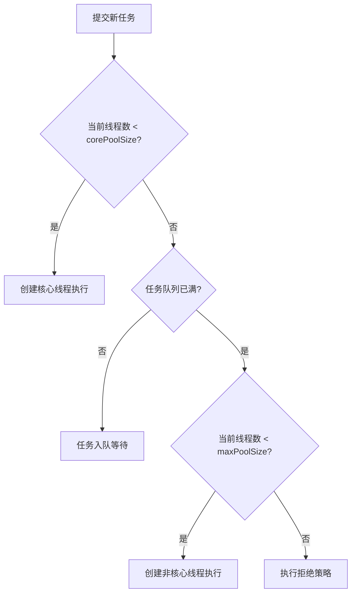

```java
// Java线程池配置示例
ThreadPoolExecutor executor = new ThreadPoolExecutor(
    10,                      // 核心线程数
    50,                      // 最大线程数
    60L,                     // 空闲线程存活时间（秒）
    TimeUnit.SECONDS,        // 时间单位
    new LinkedBlockingQueue<>(1000),  // 有界任务队列，容量1000
    new ThreadFactoryBuilder().setNameFormat("worker-%d").build(),  // 命名工厂
    new ThreadPoolExecutor.CallerRunsPolicy()  // 拒绝策略：由调用者线程执行
);
```

### 线程数量计算公式
线程数设置是调优的核心。不同任务类型需要不同的线程数配置：

```java
// 根据任务类型计算线程数
int cpuCores = Runtime.getRuntime().availableProcessors();

// CPU密集型任务：N + 1（N为CPU核心数，+1用于处理偶发页错误）
int cpuIntensiveThreads = cpuCores + 1;

// IO密集型任务：N × (1 + W/C)，其中W/C为IO等待时间与计算时间之比
// 例如IO等待占比0.8时，线程数 = cpuCores / (1 - 0.8) = cpuCores * 5
int ioIntensiveThreads = (int)(cpuCores / (1 - 0.8));
```

> **经验法则**：线上环境建议从较小值开始逐步调大，通过压测找到最优线程数。线程数不是越大越好——过多的线程会导致频繁的上下文切换，反而降低吞吐量。一般建议通过JMH压测 + 线上监控相结合的方式确定最终值。

### ForkJoinPool工作窃取
Java的ForkJoinPool采用工作窃取（Work-Stealing）算法。每个线程维护自己的双端队列，空闲线程会从其他线程队列的尾部窃取任务执行，有效平衡负载。

```java
// ForkJoinPool使用示例：递归分解并行计算
ForkJoinPool pool = new ForkJoinPool();

ForkJoinTask<Long> task = pool.submit(new RecursiveTask<Long>() {
    @Override
    protected Long compute() {
        if (end - start <= THRESHOLD) {
            return computeDirectly();  // 小任务直接计算
        }
        int mid = (start + end) / 2;
        RecursiveTask<Long> left = new MyTask(start, mid);
        RecursiveTask<Long> right = new MyTask(mid, end);
        left.fork();   // 异步执行左半部分
        right.fork();  // 异步执行右半部分
        return left.join() + right.join();  // 等待结果并合并
    }
});
```

### 线程池类型对比
| 线程池类型 | 核心线程 | 最大线程 | 队列类型 | 适用场景 |
|-----------|---------|---------|---------|---------|
| FixedThreadPool | 固定N | 固定N | LinkedBlockingQueue（无界） | 稳定负载的并行任务 |
| CachedThreadPool | 0 | MAX_VALUE | SynchronousQueue | 大量短命异步任务 |
| SingleThreadExecutor | 1 | 1 | LinkedBlockingQueue | 顺序执行的后台任务 |
| ScheduledThreadPool | 固定N | MAX_VALUE | DelayedWorkQueue | 定时/周期性任务 |
| ForkJoinPool | 固定N | 固定N | WorkStealingQueue | 递归分解的并行计算 |

> **生产建议**：永远不要使用Executors.newFixedThreadPool()或newCachedThreadPool()等工厂方法，因为它们使用无界队列或最大线程数为Integer.MAX_VALUE，极端情况下会导致OOM。应该手动创建ThreadPoolExecutor并指定有界队列和合理的拒绝策略。

***

## 1.2 协程：轻量级并发模型
协程（Coroutine）是一种比线程更轻量级的并发执行单元。与线程由操作系统内核调度不同，协程由用户态的调度器进行调度，不需要内核态与用户态之间的切换。

### 协程与线程对比
| 特性 | 线程 | 协程 |
|------|------|------|
| 调度方式 | 操作系统内核调度 | 用户态调度器 |
| 栈空间 | MB级别（默认1MB） | KB级别（Go默认2KB） |
| 切换开销 | 涉及内核态切换，约1-10μs | 纯用户态切换，约100ns |
| 创建开销 | 重（需分配栈、内核资源） | 轻（只需分配小栈） |
| 并发数量 | 数千到数万 | 数百万 |
| 同步原语 | mutex、semaphore | channel、select |

### Go goroutine（GMP模型）
Go语言的goroutine是协程的经典实现。Go运行时使用M:N调度模型（GMP），将M个goroutine映射到N个OS线程上。

- **G（Goroutine）**：用户级协程，初始栈2KB，可动态伸缩
- **M（Machine）**：操作系统线程，执行G的实际载体
- **P（Processor）**：逻辑处理器，维护本地goroutine队列，数量默认等于CPU核心数

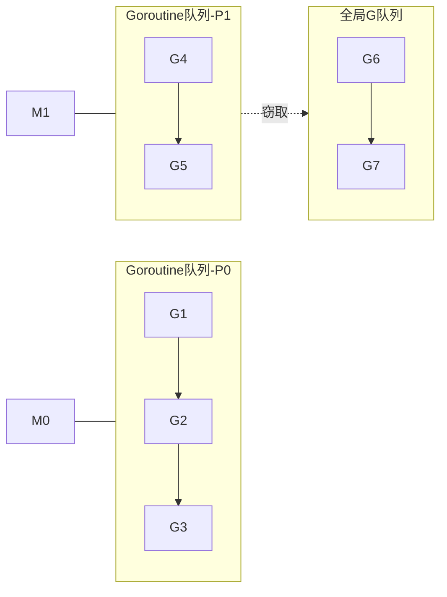

```go
// Go goroutine使用示例
func main() {
    var wg sync.WaitGroup

    for i := 0; i < 100000; i++ {
        wg.Add(1)
        go func(id int) {
            defer wg.Done()
            // 每个goroutine只占用约2KB内存
            processTask(id)
        }(i)
    }
    wg.Wait()
}
```

### Java虚拟线程（JDK 21）
Java在JDK 21中引入了虚拟线程（Virtual Thread），由JVM管理。虚拟线程在执行阻塞操作时会自动释放底层OS线程（称为载体线程），从而避免线程资源浪费。

```java
// Java虚拟线程使用示例
// 使用虚拟线程池，每个任务一个虚拟线程
try (var executor = Executors.newVirtualThreadPerTaskExecutor()) {
    for (int i = 0; i < 100000; i++) {
        executor.submit(() -> {
            // 可以安全地使用阻塞操作（如Thread.sleep、阻塞IO）
            // 虚拟线程会自动卸载载体线程，不会浪费OS线程资源
            return fetchDataFromRemote();
        });
    }
}
```

### Python asyncio事件循环
Python的asyncio基于单线程事件循环（Event Loop）实现异步编程。通过`async/await`语法定义协程，事件循环在协程阻塞时切换到其他就绪协程。

```python
import asyncio

async def fetch_data(url, delay):
    """模拟异步HTTP请求"""
    await asyncio.sleep(delay)  # 异步等待，不阻塞事件循环
    return f"Data from {url}"

async def main():
    # 并发执行多个协程
    tasks = [
        fetch_data("https://api1.example.com", 1),
        fetch_data("https://api2.example.com", 2),
        fetch_data("https://api3.example.com", 1.5),
    ]
    results = await asyncio.gather(*tasks)  # 并发执行并收集结果
    print(results)  # 总耗时约2秒，而非4.5秒

asyncio.run(main())
```

### 协程vs线程的选择指南
- **使用线程**：需要充分利用多核CPU进行并行计算、需要调用阻塞式原生库、任务数量有限（<1000）
- **使用协程**：IO密集型应用（Web服务器、网关）、需要创建大量并发任务（>10000）、对延迟敏感的微服务

***

## 1.3 无锁编程
无锁编程（Lock-Free Programming）通过CAS操作实现线程安全，避免了互斥锁带来的线程阻塞和上下文切换。

### CAS原理与ABA问题
CAS（Compare-And-Swap）包含三个操作数：内存位置V、期望值A、新值B。若V等于A则更新为B，否则不做任何操作。

ABA问题：值从A变到B再变回A，CAS误认为无变化。解决方式是引入版本号，Java提供`AtomicStampedReference`来解决。

```java
// CAS原理示意
// V = 内存中的值, A = 期望值, B = 新值
boolean cas(V, A, B) {
    if (V == A) {
        V = B;
        return true;  // CAS成功
    }
    return false;      // CAS失败，需重试
}

// 使用AtomicStampedReference解决ABA问题
AtomicStampedReference<Integer> ref =
    new AtomicStampedReference<>(1, 0);  // 初始值1，版本号0
int stamp = ref.getStamp();
Integer value = ref.getReference();
ref.compareAndSet(value, 2, stamp, stamp + 1);  // 比较值和版本号
```

### 原子变量与LongAdder

```java
// 无锁栈实现：使用CAS操作保证线程安全
public class LockFreeStack<T> {
    private final AtomicReference<Node<T>> top = new AtomicReference<>();

    public void push(T value) {
        Node<T> newNode = new Node<>(value);
        Node<T> oldTop;
        do {
            oldTop = top.get();
            newNode.next = oldTop;
        } while (!top.compareAndSet(oldTop, newNode));  // CAS自旋重试
    }

    public T pop() {
        Node<T> oldTop, newTop;
        do {
            oldTop = top.get();
            if (oldTop == null) return null;
            newTop = oldTop.next;
        } while (!top.compareAndSet(oldTop, newTop));
        return oldTop.value;
    }

    private static class Node<T> {
        final T value;
        Node<T> next;
        Node(T value) { this.value = value; }
    }
}
```

**LongAdder**（Java 8+）通过将一个变量拆分为多个Cell来减少竞争，适合高并发写入场景：

```java
// LongAdder：高并发写入性能优于AtomicLong
LongAdder counter = new LongAdder();
for (int i = 0; i < threadCount; i++) {
    executor.submit(() -> {
        for (int j = 0; j < 1_000_000; j++) {
            counter.increment();  // 分散到不同Cell，减少CAS竞争
        }
    });
}
long total = counter.sum();  // 注意：sum()不是原子操作
```

### CAS与互斥锁性能对比
| 特性 | CAS/原子变量 | 互斥锁（synchronized） |
|------|-------------|----------------------|
| 实现方式 | 自旋重试 | 线程阻塞与唤醒 |
| 低竞争性能 | 优（无上下文切换） | 较差（锁获取/释放开销） |
| 高竞争性能 | 差（大量自旋浪费CPU） | 优（线程挂起不占CPU） |
| 公平性 | 不保证 | 可使用公平锁 |
| 可重入 | 不支持 | 支持 |

***

## 1.4 锁机制与优化

### 读写锁
读写锁（ReentrantReadWriteLock）允许多个读线程并发执行，写锁独占。适用于读多写少的场景。

```java
// 读写锁使用示例
public class Cache<K, V> {
    private final Map<K, V> cache = new HashMap<>();
    private final ReadWriteLock lock = new ReentrantReadWriteLock();

    public V get(K key) {
        lock.readLock().lock();  // 共享读锁
        try {
            return cache.get(key);
        } finally {
            lock.readLock().unlock();
        }
    }

    public void put(K key, V value) {
        lock.writeLock().lock();  // 独占写锁
        try {
            cache.put(key, value);
        } finally {
            lock.writeLock().unlock();
        }
    }
}
```

### StampedLock乐观读
`StampedLock`（Java 8+）支持乐观读（Optimistic Read）——读取时获取一个戳（stamp），读完后验证数据是否被修改，若未修改则无需加锁，性能更优。

```java
// StampedLock乐观读示例
StampedLock sl = new StampedLock();
// 乐观读：不加锁，仅获取戳
long stamp = sl.tryOptimisticRead();
int x = this.x, y = this.y;
if (!sl.validate(stamp)) {  // 验证戳是否有效
    stamp = sl.readLock();   // 乐观读失败，降级为悲观读锁
    try {
        x = this.x;
        y = this.y;
    } finally {
        sl.unlockRead(stamp);
    }
}
```

### 锁粒度策略
| 策略 | 说明 | 适用场景 |
|------|------|---------|
| 粗粒度锁 | 对整个对象/方法加锁 | 逻辑简单、并发度低 |
| 细粒度锁 | 对字段/子对象分别加锁 | 高并发、独立字段访问 |
| 分段锁 | 将数据分段，每段独立加锁 | ConcurrentHashMap等 |
| 无锁方案 | CAS/原子变量 | 写操作频繁且竞争可控 |

***

## 1.5 连接池设计与调优

> **为什么重要？** 在高并发场景下，每次请求都创建新的数据库连接或HTTP连接会导致巨大的性能开销——建立TCP连接需要三次握手，数据库连接还需要认证和授权。连接池通过预创建和复用连接，将连接建立的开销从每次请求转移到启动阶段，是高并发系统不可或缺的基础设施。**连接池配置不当是线上最常见的性能瓶颈之一。**

连接池的核心思想是：预先创建一组连接对象放入池中，使用时从池中借出，用完后归还而非关闭。好的连接池还需要具备：连接验证（防止使用已失效的连接）、连接泄漏检测（防止使用后未归还）、连接预热（启动时预创建连接避免冷启动）等能力。

### 数据库连接池：HikariCP

HikariCP是目前Java生态中性能最高的数据库连接池，也是Spring Boot 2.x+的默认连接池。它的高性能来自几个关键设计：使用`ConcurrentHashMap`作为FastList代替`ArrayList`、字节码级别优化的代理对象、零锁竞争的连接获取路径。

```java
// HikariCP连接池配置示例
HikariConfig config = new HikariConfig();
config.setJdbcUrl("jdbc:mysql://localhost:3306/mydb?useSSL=false");
config.setUsername("root");
config.setPassword("password");

// === 核心参数配置 ===
config.setMaximumPoolSize(20);        // 池中最大连接数
config.setMinimumIdle(5);             // 池中最小空闲连接数（建议与maxPoolSize一致）
config.setConnectionTimeout(3000);    // 获取连接的最大等待时间（毫秒）
config.setIdleTimeout(600000);        // 空闲连接最大存活时间（毫秒）
config.setMaxLifetime(1800000);       // 连接最大生命周期（毫秒），应略小于数据库wait_timeout

// === 连接验证与泄漏检测 ===
config.setConnectionTestQuery("SELECT 1");  // 连接验证SQL
config.setValidationTimeout(5000);    // 连接验证超时
config.setLeakDetectionThreshold(60000);  // 连接泄漏检测阈值（毫秒），超过则打印警告日志

// === 连接池名称（便于监控和日志） ===
config.setPoolName("HikariPool-OrderDB");

HikariDataSource ds = new HikariDataSource(config);
```

### 数据库连接池：Druid

Druid是阿里巴巴开源的数据库连接池，内置了强大的监控功能和SQL审计能力，在国内使用非常广泛。

```java
// Druid连接池配置示例
DruidDataSource ds = new DruidDataSource();
ds.setUrl("jdbc:mysql://localhost:3306/mydb");
ds.setUsername("root");
ds.setPassword("password");

// 核心参数
ds.setInitialSize(5);          // 初始连接数
ds.setMinIdle(5);              // 最小空闲连接数
ds.setMaxActive(20);           // 最大活跃连接数
ds.setMaxWait(3000);           // 获取连接最大等待时间（毫秒）

// 连接检测
ds.setTestOnBorrow(true);      // 借出时检测连接有效性（性能开销略高但更安全）
ds.setTestWhileIdle(true);     // 空闲时检测连接有效性（推荐）
ds.setValidationQuery("SELECT 1");

// === Druid特色：监控和SQL审计 ===
ds.setStatFilterSqlMaxSqlLength(512);      // 最大记录SQL长度
ds.setStatFilterSqlSampleCount(10);        // SQL采样比例
ds.setStatFilterSlowSqlMillis(3000);       // 慢SQL阈值（毫秒）

// 开启Web监控
StatViewServlet statView = new StatViewServlet();
// 访问 http://localhost:8080/druid 即可查看监控面板
```

### 连接池核心参数调优指南

| 参数 | 说明 | 调优建议 | 常见错误 |
|------|------|---------|---------|
| maximumPoolSize | 池中最大连接数 | 按公式计算：N = (核心数 * 2) + 磁盘数 | 设得过大导致数据库连接数耗尽 |
| minimumIdle | 最小空闲连接数 | 建议等于maximumPoolSize | 设得太小导致高峰期频繁创建连接 |
| connectionTimeout | 获取连接超时时间 | 建议3-5秒，不宜过长 | 设得太大会导致线程长时间阻塞 |
| idleTimeout | 空闲连接存活时间 | 建议10分钟以上 | 设得太小导致连接频繁创建销毁 |
| maxLifetime | 连接最大生命周期 | 必须小于数据库wait_timeout | 忽略导致连接失效后被使用报错 |

### 连接数计算公式

**为什么需要精确计算连接数？** 连接数太少会导致请求排队等待，连接数太多会耗尽数据库资源。正确的连接数计算是高并发调优的关键。

连接数 = (CPU核心数 × 2) + 磁盘数

这是PostgreSQL提出的经典公式。对于MySQL这样的OLTP数据库，另一种实用的计算方法是：

连接数 = (单机QPS × 平均查询耗时秒数) × 安全系数(1.5~2.0)

例如：单机QPS=1000，平均查询耗时2ms，则连接数 = 1000 × 0.002 × 2 = 4个。这个数字看起来很小，但MySQL官方文档建议单实例连接数不超过CPU核心数×2+有效磁盘数。

```java
// 连接池大小计算器
public class ConnectionPoolCalculator {
    private final int cpuCores;
    private final int diskCount;

    public ConnectionPoolCalculator() {
        this.cpuCores = Runtime.getRuntime().availableProcessors();
        this.diskCount = estimateDiskCount();
    }

    /**
     * 基于硬件配置计算推荐连接池大小
     * 公式：(CPU核心数 × 2) + 磁盘数
     */
    public int calculateRecommendedSize() {
        return (cpuCores * 2) + diskCount;
    }

    /**
     * 基于负载特征计算推荐连接池大小
     * @param qps 每秒查询数
     * @param avgQueryTimeMs 平均查询耗时（毫秒）
     * @param safetyFactor 安全系数（1.5~2.0）
     */
    public int calculateByLoad(double qps, double avgQueryTimeMs, double safetyFactor) {
        double activeConnections = qps * (avgQueryTimeMs / 1000.0);
        return (int) Math.ceil(activeConnections * safetyFactor);
    }
}
```

### 连接泄漏检测

连接泄漏是指连接从池中借出后未及时归还，常见原因包括：事务未提交/回滚、异常路径未在finally中关闭、长时间未关闭的批处理等。

```java
// 连接泄漏检测示意：通过代理包装连接，记录借出和归还时间
public class LeakDetectingConnection implements Connection {
    private final Connection delegate;    // 真实连接
    private final long borrowTime;        // 借出时间
    private final long leakThresholdMs;   // 泄漏检测阈值

    public LeakDetectingConnection(Connection delegate, long thresholdMs) {
        this.delegate = delegate;
        this.borrowTime = System.currentTimeMillis();
        this.leakThresholdMs = thresholdMs;
    }

    @Override
    public void close() throws SQLException {
        long usageTime = System.currentTimeMillis() - borrowTime;
        if (usageTime > leakThresholdMs) {
            // 记录告警：连接使用时间超过阈值，可能存在泄漏
            log.warn("连接使用{}ms，超过阈值{}ms，可能存在泄漏。调用栈: {}",
                usageTime, leakThresholdMs, getCallStack());
        }
        delegate.close();  // 归还连接到池中
    }
}
```

### 连接池预热策略

冷启动时连接池为空，第一批请求会因需要创建连接而响应变慢。预热策略通过在应用启动阶段预先创建连接来避免这个问题。

```java
// 连接池预热：在应用启动时预先创建连接
@Component
public class ConnectionPoolWarmer implements ApplicationRunner {
    private final HikariDataSource dataSource;

    public ConnectionPoolWarmer(HikariDataSource dataSource) {
        this.dataSource = dataSource;
    }

    @Override
    public void run(ApplicationArguments args) {
        int targetSize = dataSource.getMinimumIdle();
        log.info("开始连接池预热，目标连接数: {}", targetSize);

        for (int i = 0; i < targetSize; i++) {
            try (Connection conn = dataSource.getConnection()) {
                // 验证连接有效性并触发连接创建
                conn.isValid(5);
            } catch (SQLException e) {
                log.warn("预热第{}个连接失败", i + 1, e);
            }
        }
        log.info("连接池预热完成，当前活跃连接数: {}", dataSource.getHikariPoolMXBean().getActiveConnections());
    }
}
```

### HTTP客户端连接池

不仅是数据库连接，HTTP客户端连接同样需要连接池。在微服务架构中，服务间RPC调用是高并发的主要来源之一。

```java
// OkHttp连接池配置
OkHttpClient client = new OkHttpClient.Builder()
    .connectionPool(new ConnectionPool(
        100,                      // 最大空闲连接数
        5, TimeUnit.MINUTES,      // 空闲连接存活时间
        true                      // 允许清理空闲连接
    ))
    .connectTimeout(3, TimeUnit.SECONDS)     // 连接超时
    .readTimeout(5, TimeUnit.SECONDS)        // 读超时
    .writeTimeout(5, TimeUnit.SECONDS)       // 写超时
    .retryOnConnectionFailure(true)          // 连接失败自动重试
    .build();

// Apache HttpClient连接池配置
PoolingHttpClientConnectionManager cm =
    new PoolingHttpClientConnectionManager();
cm.setMaxTotal(200);              // 连接池最大连接数
cm.setDefaultMaxPerRoute(50);     // 每个路由最大连接数
cm.setValidateAfterInactivity(5000);  // 空闲5秒后验证连接有效性

CloseableHttpClient httpClient = HttpClients.custom()
    .setConnectionManager(cm)
    .setDefaultRequestConfig(RequestConfig.custom()
        .setConnectTimeout(3000)
        .setSocketTimeout(5000)
        .setConnectionRequestTimeout(2000)  // 从连接池获取连接超时
        .build())
    .build();
```

### 连接池监控指标

| 指标 | 说明 | 告警阈值参考 |
|------|------|-------------|
| ActiveConnections | 当前活跃连接数 | 接近maxPoolSize时告警 |
| IdleConnections | 当前空闲连接数 | 为0时可能即将排队 |
| PendingThreads | 等待获取连接的线程数 | >0且持续增长需关注 |
| ConnectionTimeoutRate | 获取连接超时率 | >1%需扩容或优化 |
| AverageConnectionTime | 平均获取连接耗时 | >100ms需关注 |
| ConnectionLeakCount | 连接泄漏次数 | >0需排查代码 |

***

## 1.6 内存可见性与Java内存模型

> **为什么重要？** Java内存模型（JMM）是理解并发bug根源的关键。很多看似"随机"的并发问题——比如线程A写入了值但线程B读到的还是旧值——本质上都是内存可见性问题。理解JMM才能真正理解volatile、synchronized、happens-before等机制的工作原理。

### Java内存模型（JMM）

JMM定义了多线程环境下，线程之间如何通过内存进行交互的规则。它抽象了物理硬件的内存层次结构，将内存分为主内存（Main Memory）和工作内存（Working Memory）：

- **主内存**：所有线程共享的内存区域，存储共享变量的实际值
- **工作内存**：每个线程私有的内存区域，存储共享变量的副本

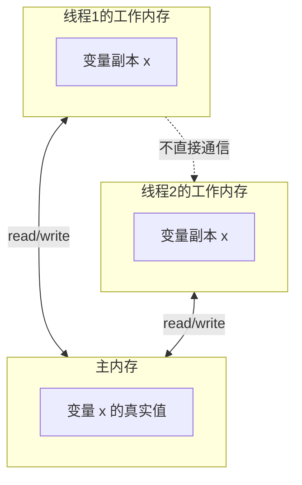

每个线程只能操作自己工作内存中的变量副本，不能直接读写主内存。线程间变量值的传递需要经过主内存中转。这就是为什么会出现"内存可见性"问题——线程1修改了工作内存中的变量副本，但还没刷新到主内存，线程2读取到的仍然是旧值。

### volatile关键字

`volatile`是最轻量级的同步机制，它保证两个特性：

1. **可见性**：对volatile变量的写操作会立即刷新到主内存，读操作会直接从主内存读取
2. **禁止指令重排序**：通过内存屏障（Memory Barrier）禁止编译器和CPU对指令进行重排序优化

```java
// volatile保证可见性的典型场景：状态标志
public class VolatileFlag {
    // 必须使用volatile修饰，否则线程2可能永远看不到线程1的修改
    private volatile boolean running = true;

    public void stop() {
        running = false;  // 写入后立即对其他线程可见
    }

    public void run() {
        while (running) {  // 每次循环都从主内存读取最新值
            processTask();
        }
        // 安全退出
    }
}

// volatile不保证原子性的反例
public class VolatileCounter {
    private volatile int count = 0;

    // 错误！volatile不保证i++的原子性（读-改-写三步操作非原子）
    public void unsafeIncrement() {
        count++;  // 可能导致丢失更新
    }

    // 正确：使用AtomicInteger或synchronized
    public void safeIncrement() {
        synchronized (this) {
            count++;
        }
    }
}
```

### happens-before关系

happens-before是JMM的核心概念，它定义了操作之间的可见性保证规则。如果操作A happens-before操作B，则A的结果对B可见。

Java内存模型规定了以下happens-before规则：

| 规则 | 说明 | 示例 |
|------|------|------|
| 程序顺序规则 | 同一线程中，前面的操作happens-before后面的操作 | int a = 1; int b = a; 保证b=1 |
| volatile变量规则 | 对volatile变量的写happens-before后续的读 | volatile int x; x=1; 后续线程读x能看到1 |
| 锁规则 | unlock操作happens-before后续的lock操作 | 线程1释放锁后，线程2获取同一锁能看到线程1的所有修改 |
| 传递性规则 | A hb B，B hb C，则A hb C | 可以组合传递可见性保证 |
| 线程启动规则 | Thread.start() hb 该线程的任何操作 | start()前的修改对新线程可见 |
| 线程终止规则 | 线程的所有操作hb Thread.join()返回 | join()返回后能看到线程的所有修改 |
| 中断规则 | 调用interrupt() hb 检测到中断的代码 | interrupt()对后续的Thread.isInterrupted()可见 |

### 内存屏障

内存屏障（Memory Barrier）是CPU指令级别的同步原语，是volatile和synchronized的底层实现基础。JVM定义了四种内存屏障：

| 屏障类型 | 说明 | 作用 |
|---------|------|------|
| LoadLoad Barrier | 确保Load1在Load2之前执行 | 禁止两个读操作重排序 |
| StoreStore Barrier | 确保Store1在Store2之前对其他CPU可见 | 禁止两个写操作重排序 |
| LoadStore Barrier | 确保Load1在Store2之前完成 | 禁止读写操作重排序 |
| StoreLoad Barrier | 确保Store1对所有CPU可见后才执行Load2 | 最强屏障，刷新写缓冲区 |

```java
// volatile写操作的内存屏障语义
// 1. StoreStore屏障：确保前面的普通写在volatile写之前对其他CPU可见
// 2. 执行volatile写操作
// 3. StoreLoad屏障：确保volatile写对所有CPU可见
private volatile int status;

public void setStatus(int value) {
    // JVM自动插入StoreStore屏障
    this.status = value;
    // JVM自动插入StoreLoad屏障
}

// volatile读操作的内存屏障语义
// 1. 执行volatile读操作
// 2. LoadLoad屏障：确保volatile读在后续普通读之前完成
// 3. LoadStore屏障：确保volatile读在后续写之前完成
public int getStatus() {
    return this.status;
    // JVM自动插入LoadLoad + LoadStore屏障
}
```

### DCL（双重检查锁定）模式

DCL是单例模式的经典实现，也是理解volatile内存屏障语义的最佳示例。

```java
// DCL双重检查锁定单例模式
public class Singleton {
    // 必须使用volatile！防止指令重排序导致获取到未完全初始化的对象
    private static volatile Singleton instance;

    private Singleton() {
        // 初始化操作
    }

    public static Singleton getInstance() {
        if (instance == null) {          // 第一次检查：避免不必要的同步
            synchronized (Singleton.class) {
                if (instance == null) {  // 第二次检查：防止并发重复创建
                    instance = new Singleton();
                    // 不使用volatile时，new Singleton()实际分三步：
                    // 1. 分配内存
                    // 2. 初始化对象
                    // 3. 将引用指向内存地址
                    // CPU/编译器可能重排序为1→3→2，导致其他线程
                    // 获取到一个未完全初始化的实例！
                }
            }
        }
        return instance;
    }
}
```

**为什么DCL必须用volatile？** `new Singleton()`不是原子操作，JVM可能将"分配内存"和"设置引用"重排序到"初始化对象"之前。如果不加volatile，其他线程可能在第一次检查时看到一个非null但尚未完全初始化的instance引用，从而使用一个"半初始化"的对象。

### JMM最佳实践总结

| 场景 | 推荐方案 | 原因 |
|------|---------|------|
| 简单状态标志 | volatile boolean | 轻量级，保证可见性即可 |
| 原子计数 | AtomicInteger / LongAdder | volatile无法保证复合操作的原子性 |
| 多变量一致性 | synchronized | 需要保证多个变量的操作原子性 |
| 高并发读低并发写 | StampedLock / ReadWriteLock | 读写锁优化并发读的性能 |
| 无锁数据结构 | CAS + 原子变量 | 避免锁竞争，适合低竞争高并发场景 |

***

# 二、流量控制

经过第一部分的并发编程基础学习，我们已经具备了编写高效并发程序的能力。但在实际的线上系统中，光有并发能力还不够——我们需要控制流量，防止系统被过载的请求压垮。流量控制是高可用系统的"安全阀"，包括限流、熔断、降级等机制。

## 2.1 限流算法
限流是保护系统免受过载的重要手段。本节介绍四种经典限流算法的原理、实现和对比。

> **为什么重要？** 没有限流的系统就像没有刹车的汽车。正常情况下或许不会出问题，但一旦遭遇突发流量（如促销活动、爬虫攻击、下游故障导致的重试风暴），系统会因为资源耗尽而全面崩溃。限流是保护系统的第一道防线。

### 固定窗口计数器
固定窗口计数器（Fixed Window Counter）是最简单的限流算法。将时间轴按固定窗口（如1秒）划分，每个窗口维护一个计数器，到达窗口边界时计数器归零。

**边界问题**：固定窗口在窗口边界处存在突发问题。例如限制1000请求/秒，在第0.9秒到1.1秒的200ms窗口内可能涌入2000个请求，远超预期。

```java
// 固定窗口计数器实现
public class FixedWindowLimiter {
    private final long windowSize;  // 窗口大小（毫秒）
    private final long maxRequests; // 窗口内最大请求数
    private long currentWindow;     // 当前窗口起始时间
    private long count;             // 当前窗口计数

    public synchronized boolean allow() {
        long now = System.currentTimeMillis();
        long window = now / windowSize;
        if (window != currentWindow) {
            currentWindow = window;
            count = 0;  // 窗口边界：计数器归零
        }
        if (count < maxRequests) {
            count++;
            return true;
        }
        return false;
    }
}
```

### 滑动窗口计数器
滑动窗口（Sliding Window）将窗口划分为多个子格（sub-window），每次计数时按时间加权计算，解决了固定窗口的边界突发问题。

```python
# Python实现滑动窗口限流器
import time, threading
from collections import deque

class SlidingWindowLimiter:
    def __init__(self, max_requests, window_seconds):
        self.max_requests = max_requests
        self.window_seconds = window_seconds
        self.requests = deque()  # 记录每个请求的时间戳
        self.lock = threading.Lock()

    def allow(self):
        with self.lock:
            now = time.time()
            window_start = now - self.window_seconds

            # 移除窗口外的请求记录
            while self.requests and self.requests[0] <= window_start:
                self.requests.popleft()

            # 检查是否超过限制
            if len(self.requests) < self.max_requests:
                self.requests.append(now)
                return True
            return False
```

### 漏桶算法
漏桶算法（Leaky Bucket）将请求比作水流注入一个固定容量的桶，桶以恒定速率漏出。当桶满时请求被丢弃。漏桶的核心特点是**输出速率恒定**，可以完全平滑流量波动。

```go
// Go实现漏桶限流器
type LeakyBucket struct {
    rate     float64   // 漏出速率（请求/秒）
    capacity int64     // 桶容量
    water    float64   // 当前水位
    lastTime time.Time // 上次漏水时间
    mu       sync.Mutex
}

func NewLeakyBucket(rate float64, capacity int64) *LeakyBucket {
    return &amp;LeakyBucket{
        rate:     rate,
        capacity: capacity,
        water:    0,
        lastTime: time.Now(),
    }
}

func (lb *LeakyBucket) Allow() bool {
    lb.mu.Lock()
    defer lb.mu.Unlock()

    now := time.Now()
    elapsed := now.Sub(lb.lastTime).Seconds()
    lb.water = math.Max(0, lb.water-elapsed*lb.rate)  // 先按时间漏出
    lb.lastTime = now

    if lb.water < float64(lb.capacity) {
        lb.water++
        return true  // 桶未满，允许请求
    }
    return false  // 桶已满，拒绝请求
}
```

### 令牌桶算法
令牌桶算法（Token Bucket）以恒定速率向桶中添加令牌，每个请求消耗一个令牌。桶满时丢弃新令牌。与漏桶不同，令牌桶允许突发流量——桶中积累的令牌可以一次性被消耗。

```go
// Go实现令牌桶限流器
type TokenBucket struct {
    rate       float64    // 令牌生成速率（每秒）
    capacity   int64      // 桶容量（最大令牌数）
    tokens     float64    // 当前令牌数
    lastRefill time.Time  // 上次补充令牌的时间
    mu         sync.Mutex
}

func NewTokenBucket(rate float64, capacity int64) *TokenBucket {
    return &amp;TokenBucket{
        rate:       rate,
        capacity:   capacity,
        tokens:     float64(capacity),
        lastRefill: time.Now(),
    }
}

func (tb *TokenBucket) Allow() bool {
    tb.mu.Lock()
    defer tb.mu.Unlock()

    now := time.Now()
    elapsed := now.Sub(tb.lastRefill).Seconds()
    tb.tokens += elapsed * tb.rate           // 按时间差补充令牌
    if tb.tokens > float64(tb.capacity) {
        tb.tokens = float64(tb.capacity)     // 不超过桶容量
    }
    tb.lastRefill = now

    if tb.tokens >= 1 {
        tb.tokens--
        return true  // 消耗一个令牌，允许请求
    }
    return false     // 无可用令牌，拒绝请求
}
```

### 四种限流算法对比
| 特性 | 固定窗口 | 滑动窗口 | 漏桶 | 令牌桶 |
|------|---------|---------|------|-------|
| 实现复杂度 | 低 | 中 | 中 | 中 |
| 边界突发 | 有（严重） | 无 | 无 | 允许突发 |
| 输出速率 | 不恒定 | 相对平滑 | 恒定 | 平均恒定，允许突发 |
| 内存占用 | 极低 | 中（需维护子格） | 低 | 低 |
| 分布式实现 | 简单（INCR） | 较复杂 | 中等 | 中等 |
| 适用场景 | 简单限流 | 高精度限流 | 平滑流量 | 突发流量保护 |

### 分布式限流（Redis Lua）
Redis的Lua脚本可以在单线程中原子执行，天然适合实现分布式限流：

```lua
-- Redis Lua脚本：分布式令牌桶限流
local key = KEYS[1]
local rate = tonumber(ARGV[1])        -- 令牌生成速率
local capacity = tonumber(ARGV[2])    -- 桶容量
local now = tonumber(ARGV[3])         -- 当前时间戳
local requested = tonumber(ARGV[4])   -- 请求的令牌数

local fill_time = capacity / rate
local ttl = math.floor(fill_time * 2)

-- 读取当前状态
local last_tokens = tonumber(redis.call("get", key) or capacity)
local last_refreshed = tonumber(redis.call("get", key .. ":ts") or now)

-- 根据时间差计算可用令牌
local delta = math.max(0, now - last_refreshed)
local filled_tokens = math.min(capacity, last_tokens + (delta * rate))
local allowed = filled_tokens >= requested

local new_tokens = filled_tokens
if allowed then
    new_tokens = filled_tokens - requested
end

-- 持久化状态
redis.call("setex", key, ttl, new_tokens)
redis.call("setex", key .. ":ts", ttl, now)

return allowed and 1 or 0
```

***

## 2.2 限流框架实战
### Sentinel框架
Sentinel是阿里巴巴开源的流量控制框架，专为分布式系统设计。核心概念包括：

- **资源（Resource）**：需要保护的对象，可以是方法、接口或代码块
- **规则（Rule）**：定义限流策略，包括QPS阈值、线程数阈值等
- **槽（Slot）**：Sentinel的核心处理链，包括NodeSelectorSlot、FlowSlot、DegradeSlot等


```java
// Sentinel使用示例
// 1. 定义资源
@SentinelResource(value = "getOrder",
    blockHandler = "handleBlock",
    fallback = "handleFallback")
public Order getOrder(long orderId) {
    return orderService.query(orderId);
}

// 2. 定义blockHandler：限流时的降级逻辑
public Order handleBlock(long orderId, BlockException ex) {
    log.warn("请求被限流: {}", ex.getRule().toString());
    return Order.empty();  // 返回空订单
}

// 3. 定义fallback：异常时的兜底逻辑
public Order handleFallback(long orderId, Throwable t) {
    log.error("请求异常", t);
    return Order.empty();
}

// 4. 通过Dashboard或API动态修改规则
FlowRule rule = new FlowRule("getOrder")
    .setCount(100)           // QPS限制为100
    .setGrade(RuleConstant.FLOW_GRADE_QPS)
    .setControlBehavior(RuleConstant.CONTROL_BEHAVIOR_WARM_UP)
    .setWarmUpPeriodSec(10); // 预热10秒
FlowRuleManager.loadRules(Collections.singletonList(rule));
```

### Guava RateLimiter
Guava的RateLimiter基于令牌桶算法实现，适用于单机限流场景：

```java
// Guava RateLimiter使用示例
RateLimiter limiter = RateLimiter.create(100.0);  // 100 QPS

// 方式1：阻塞等待获取令牌
limiter.acquire();  // 阻塞直到获取一个令牌

// 方式2：非阻塞尝试
if (limiter.tryAcquire(50, TimeUnit.MILLISECONDS)) {
    // 在50ms内获取到令牌，处理请求
    processRequest();
} else {
    // 超时未获取令牌，快速失败
    throw new RateLimitException("请求被限流");
}

// 方式3：预批量获取
if (limiter.tryAcquire(10)) {
    // 一次性获取10个令牌，适合批量操作
    batchProcess();
}
```

***

## 2.3 熔断器模式
### 三态模型
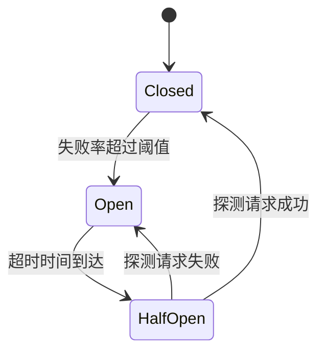

- **关闭（Closed）**：正常放行所有请求，同时统计失败率
- **打开（Open）**：直接拒绝所有请求，等待超时时间后进入半开状态
- **半开（Half-Open）**：放行少量探测请求，根据结果决定回到关闭或打开状态

### Hystrix熔断器
Hystrix是Netflix开源的熔断器实现（已进入维护模式，但其设计思想仍然重要）。核心特性：

- **命令模式（Command Pattern）**：将远程调用封装为HystrixCommand
- **线程池隔离（Thread Pool Isolation）**：每个依赖使用独立线程池，防止一个依赖的故障扩散到其他依赖
- **信号量隔离（Semaphore Isolation）**：使用信号量限制并发数，不创建新线程，开销更小
- **Fallback机制**：熔断触发时返回降级结果

```java
// Hystrix熔断器使用示例
public class OrderCommand extends HystrixCommand<Order> {
    private final long orderId;

    public OrderCommand(long orderId) {
        super(Setter.withGroupKey(HystrixCommandGroupKey.Factory.asKey("Order"))
            .andCommandKey(HystrixCommandKey.Factory.asKey("getOrder"))
            .andThreadPoolKey(HystrixThreadPoolKey.Factory.asKey("OrderPool"))
            .andCommandPropertiesDefault(
                HystrixCommandProperties.Setter()
                    .withCircuitBreakerRequestVolumeThreshold(20)  // 最少20个请求才启动熔断判断
                    .withCircuitBreakerErrorThresholdPercentage(50) // 错误率50%触发熔断
                    .withCircuitBreakerSleepWindowInMilliseconds(5000) // 熔断后5秒进入半开
                    .withExecutionTimeoutInMilliseconds(1000)       // 执行超时1秒
            )
        );
        this.orderId = orderId;
    }

    @Override
    protected Order run() throws Exception {
        return orderService.query(orderId);  // 正常业务调用
    }

    @Override
    protected Order getFallback() {
        return Order.empty();  // 降级：返回空订单
    }
}

// 调用方式
Order order = new OrderCommand(orderId).execute();
```

### Resilience4j熔断器
Resilience4j是Hystrix的现代替代品，轻量且支持函数式编程风格。核心组件：

| 组件 | 功能 | 配置参数 |
|------|------|---------|
| CircuitBreaker | 熔断 | failureRateThreshold、waitDurationInOpenState、slidingWindowSize |
| RateLimiter | 限流 | limitForPeriod、limitRefreshPeriod、timeoutDuration |
| Bulkhead | 隔离 | maxConcurrentCalls、maxWaitDuration |
| Retry | 重试 | maxAttempts、waitDuration、retryExceptions |
| TimeLimiter | 超时 | timeoutDuration |

```java
// Resilience4j使用示例：组合多个装饰器
CircuitBreakerConfig config = CircuitBreakerConfig.custom()
    .failureRateThreshold(50)               // 失败率50%触发熔断
    .waitDurationInOpenState(Duration.ofSeconds(10))  // 熔断持续10秒
    .slidingWindowSize(100)                 // 滑动窗口大小100
    .minimumNumberOfCalls(10)               // 最少10次调用后才计算失败率
    .build();

CircuitBreaker cb = CircuitBreaker.of("orderService", config);

// 函数式编程风格：组合装饰器
Supplier<Order> decoratedSupplier = Decorator.ofCallable(() -> orderService.query(orderId))
    .withCircuitBreaker(cb)         // 熔断装饰
    .withRetry(Retry.of("retry", retryConfig))  // 重试装饰
    .withTimeLimiter(TimeLimiter.of(Duration.ofSeconds(2)))  // 超时装饰
    .withBulkhead(Bulkhead.of("bulkhead", bulkheadConfig))   // 隔离装饰
    .decorate();

Try<Order> result = Try.ofSupplier(decoratedSupplier)
    .recover(CallNotPermittedException.class, e -> Order.empty())  // 熔断降级
    .recover(TimeoutException.class, e -> Order.empty())           // 超时降级
    .recover(OtherException.class, e -> Order.empty());            // 异常降级
```

### 熔断器框架对比
| 特性 | Hystrix | Resilience4j | Sentinel |
|------|---------|-------------|----------|
| 状态 | 维护模式 | 活跃开发 | 活跃开发 |
| 隔离方式 | 线程池/信号量 | Bulkhead/RateLimiter | 并发线程/QPS |
| 编程模型 | 命令模式 | 函数式装饰器 | 注解+SPI |
| 指标采集 | 滑动窗口 | 滑动窗口 | 滑动窗口 |
| Dashboard | Hystrix Dashboard | Micrometer | Sentinel Dashboard |
| 适用场景 | Spring Cloud | 轻量级微服务 | 阿里生态 |

***

## 2.4 降级策略
降级是在系统压力过大时主动降低服务质量，确保核心功能可用的策略。

> **为什么重要？** 当上游系统压力过大或下游服务不可用时，降级是防止"雪崩效应"的关键手段。一个设计良好的降级策略可以保证：核心业务始终可用，非核心功能优雅让步，用户体验可预期（而非随机报错）。

### 静态降级
静态降级是预先定义好的固定降级方案，在系统启动时配置：

```java
// 静态降级：预定义降级逻辑
@Service
public class OrderService {

    @SentinelResource(value = "queryOrder", fallback = "fallbackQuery")
    public Order queryOrder(long orderId) {
        return orderRepository.findById(orderId);  // 正常逻辑
    }

    // 静态降级：返回缓存中的旧数据
    public Order fallbackQuery(long orderId, Throwable t) {
        return cachedOrders.getOrDefault(orderId, Order.empty());
    }
}
```

### 动态降级
动态降级根据系统实时状态（如QPS、RT、错误率）自动调整降级策略，通常结合配置中心实现热更新：

```java
// 动态降级：基于配置中心的热更新
@Component
public class DynamicDegradation {
    private volatile DegradationConfig config;

    @PostConstruct
    public void init() {
        configCenter.addListener("degradation", newConfig -> {
            config = newConfig;  // 热更新降级策略，无需重启
        });
    }

    public boolean shouldDegrade(String resource) {
        // 强制降级开关
        if (config.isForceDegrade(resource)) return true;
        // 基于实时错误率动态判断
        double currentErrorRate = metrics.getErrorRate(resource);
        return currentErrorRate > config.getErrorThreshold(resource);
    }
}
```

### 降级策略分类

降级策略的选择直接影响用户体验。不同的业务场景应选用不同的降级方式，以下是四种常见的降级策略：

| 降级策略 | 说明 | 适用场景 | 用户体验 |
|---------|------|---------|---------|
| 返回缓存数据 | 使用Redis或本地缓存中的旧数据 | 查询类接口（商品详情、用户信息） | 数据略有延迟，但可接受 |
| 返回默认值 | 返回预设的兜底值 | 非关键字段（推荐商品、标签） | 该字段缺失，不影响核心功能 |
| 返回部分结果 | 只返回核心数据，省略非核心数据 | 聚合查询（首页推荐+广告） | 结果不完整但可用 |
| 请求排队等待 | 将请求放入队列等待处理 | 有限资源的操作（库存扣减） | 响应变慢，但保证不丢失 |

```java
// 降级策略框架：根据策略类型选择不同的降级方式
@Component
public class DegradationStrategy {

    /**
     * 根据资源名称和当前状态选择降级策略
     */
    public Object degrade(String resource, Object originalRequest, Throwable error) {
        DegradationConfig config = getConfig(resource);

        switch (config.getStrategy()) {
            case CACHE:
                // 返回缓存中的旧数据
                return getFromCache(resource, originalRequest);

            case DEFAULT_VALUE:
                // 返回预设的默认值
                return config.getDefaultValue();

            case PARTIAL:
                // 返回部分结果（仅核心字段）
                return getPartialResult(resource, originalRequest);

            case QUEUE_WAIT:
                // 排队等待（带超时）
                return queueAndWait(resource, originalRequest,
                    config.getWaitTimeoutMs());

            default:
                // 降级到最安全的方式：返回空结果
                return null;
        }
    }

    /**
     * 获取缓存中的旧数据
     */
    private Object getFromCache(String resource, Object request) {
        String cacheKey = buildCacheKey(resource, request);
        return redisTemplate.opsForValue().get(cacheKey);
    }

    /**
     * 返回部分结果（核心字段正常返回，非核心字段使用默认值）
     */
    private Object getPartialResult(String resource, Object request) {
        Object result = new Object();
        // 核心字段正常查询
        setResultCore(result, queryCoreField(request));
        // 非核心字段使用默认值
        setResultNonCore(result, config.getNonCoreDefaults());
        return result;
    }
}
```

### 降级触发与级联防护
降级的常见触发条件：

| 触发条件 | 阈值参考 | 降级动作 |
|---------|---------|---------|
| 错误率超阈值 | >50% | 熔断+返回降级数据 |
| 响应时间超阈值 | P99 > 3s | 降级为轻量接口 |
| 系统资源紧张 | CPU > 90% | 限流+降级非核心功能 |
| 下游服务不可用 | 健康检查失败 | 直接降级，不调用下游 |
| 内存使用过高 | >85% | 关闭非核心缓存、降级统计功能 |

合理的降级策略可以防止故障级联——一个服务的降级会减少对下游服务的调用，从而避免故障在微服务链路中扩散。

### 降级层级设计

在一个完整的微服务系统中，降级策略需要分层设计，从网关到服务到中间件，每一层都有自己的降级机制：

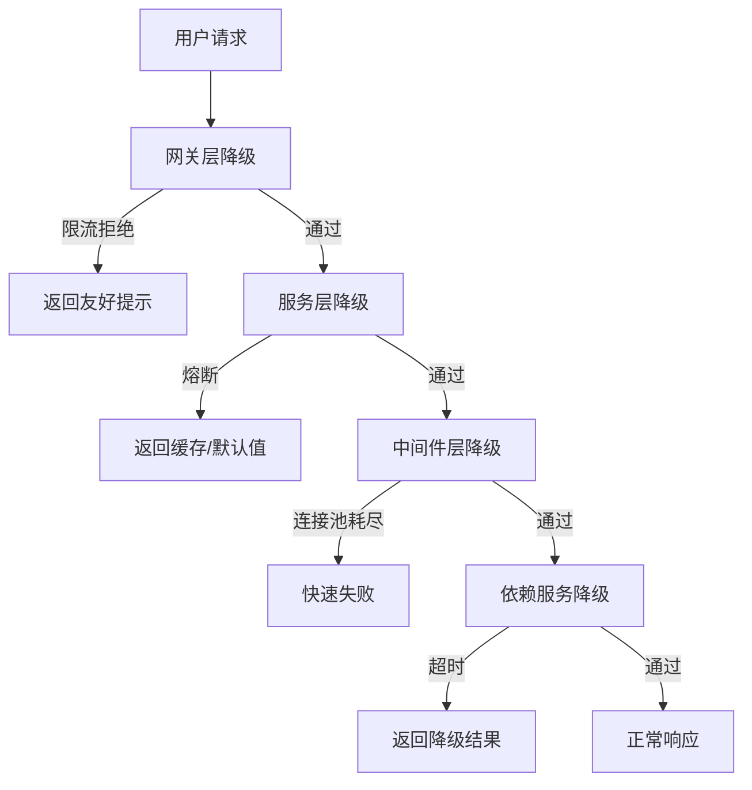

**降级原则**：
- **宁可降级，不要报错**：用户看到一个降级页面好过看到500错误
- **降级可预期**：降级后的结果应该是用户可以理解和接受的
- **降级可回退**：通过开关随时恢复服务
- **降级有监控**：每次降级都要记录日志和指标

***

## 2.5 优雅停机与流量预热

> **为什么重要？** 在容器化和微服务架构中，服务频繁地进行滚动更新和扩缩容。如果停机不优雅，正在处理中的请求会被强制中断（导致数据不一致或用户看到错误）；如果流量不预热，重启后的服务会因为冷缓存、冷连接、JIT未编译等原因导致启动初期性能急剧下降，甚至被监控系统误判为故障而反复重启。优雅停机和流量预热是生产系统稳定运行的保障。

### 优雅停机模式

优雅停机（Graceful Shutdown）的核心思想是：在应用收到停止信号后，不再接受新请求，但继续处理已接入的请求，等待处理完成或超时后再关闭。

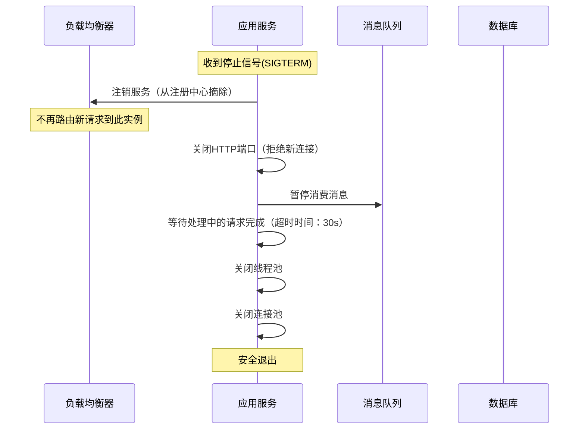

```java
// Java Spring Boot优雅停机配置
// application.yml
server:
  shutdown: graceful  # 启用优雅停机

spring:
  lifecycle:
    timeout-per-shutdown-phase: 30s  # 每个停机阶段的最大等待时间

// 自定义优雅停机组件
@Component
public class GracefulShutdownHandler implements DisposableBean {
    private final ThreadPoolTaskExecutor executor;
    private final ConnectionPool connectionPool;
    private static final int SHUTDOWN_TIMEOUT_SECONDS = 30;

    @Override
    public void destroy() throws Exception {
        log.info("开始优雅停机...");

        // 1. 从注册中心注销（如果使用了服务注册）
        // 注册中心注销应在最前面，让负载均衡器感知到

        // 2. 等待处理中的请求完成
        executor.initiateShutdown();
        boolean terminated = executor.getThreadPoolExecutor()
            .awaitTermination(SHUTDOWN_TIMEOUT_SECONDS, TimeUnit.SECONDS);
        if (!terminated) {
            log.warn("线程池未在{}秒内完成，强制关闭", SHUTDOWN_TIMEOUT_SECONDS);
            executor.shutdownNow();
        }

        // 3. 关闭连接池
        connectionPool.close();

        // 4. 刷新缓冲区（如日志、审计日志等）
        flushBuffers();

        log.info("优雅停机完成");
    }
}
```

```go
// Go优雅停机示例
func main() {
    srv := &amp;http.Server{Addr: ":8080", Handler: router}

    // 启动HTTP服务
    go func() {
        if err := srv.ListenAndServe(); err != nil &amp;&amp; err != http.ErrServerClosed {
            log.Fatalf("HTTP服务启动失败: %v", err)
        }
    }()

    // 监听系统停止信号
    quit := make(chan os.Signal, 1)
    signal.Notify(quit, syscall.SIGINT, syscall.SIGTERM)
    <-quit
    log.Println("收到停止信号，开始优雅停机...")

    // 创建超时上下文（30秒超时强制退出）
    ctx, cancel := context.WithTimeout(context.Background(), 30*time.Second)
    defer cancel()

    // 停止接受新请求，等待现有请求处理完成
    if err := srv.Shutdown(ctx); err != nil {
        log.Fatalf("服务强制关闭: %v", err)
    }
    log.Println("服务已安全退出")
}
```

### 流量预热（Warm-Up）

服务重启或扩容后，新实例需要一段"预热"时间来达到最佳性能。预热期间系统尚未准备好接收全部流量。

**为什么需要预热？** 主要原因包括：
- **JIT编译未完成**：Java的HotSpot VM采用解释执行+JIT编译的策略，热点代码需要一定时间才会被编译为本地代码
- **缓存为空**：本地缓存、Redis连接池、数据库连接池都需要预热
- **线程池冷启动**：核心线程还未全部创建

**Sentinel预热模式**：

Sentinel提供了Warm Up（预热）限流控制行为，允许系统在一段时间内逐步将流量从低水位提升到配置的阈值，给系统一个缓冲时间。

```java
// Sentinel预热配置示例
FlowRule rule = new FlowRule("seckill");
rule.setCount(100);                    // 最终QPS阈值：100
rule.setGrade(RuleConstant.FLOW_GRADE_QPS);
rule.setControlBehavior(RuleConstant.CONTROL_BEHAVIOR_WARM_UP);
rule.setWarmUpPeriodSec(10);           // 预热时长：10秒

// 预热效果：
// 第0秒：允许QPS ≈ 100 × (coldFactor/3) = 约100（取决于冷却因子）
// 第5秒：允许QPS ≈ 60（线性增长中）
// 第10秒：允许QPS = 100（达到目标阈值）
```

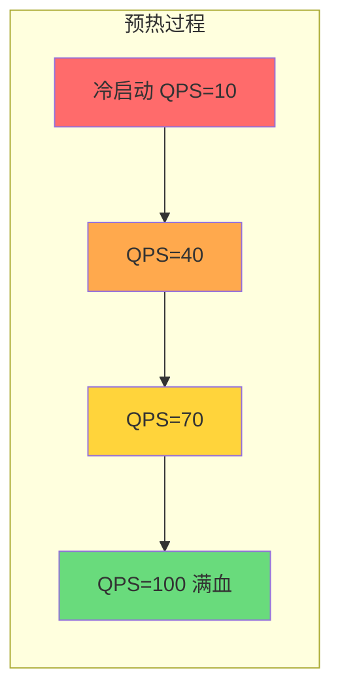

**负载均衡器层面的预热**：

在微服务架构中，负载均衡器也可以参与流量预热。例如Nginx支持慢启动（slow_start）功能：

```nginx
# Nginx upstream慢启动配置
upstream backend {
    server 10.0.0.1:8080 slow_start=30s;  # 新加入的节点在30秒内逐步接收流量
    server 10.0.0.2:8080;
    server 10.0.0.3:8080;
}
```

```go
// Go：自定义加权负载均衡器（支持预热）
type WarmUpBalancer struct {
    backends   []*Backend
    warmUpSec  time.Duration
}

type Backend struct {
    addr        string
    weight      float64          // 当前权重（会随时间增长）
    targetWeight float64         // 目标权重
    startTime   time.Time        // 启动时间
    mu          sync.RWMutex
}

func (b *Backend) EffectiveWeight() float64 {
    b.mu.RLock()
    defer b.mu.RUnlock()

    elapsed := time.Since(b.startTime).Seconds()
    warmUpDuration := 30.0 // 30秒预热期

    if elapsed >= warmUpDuration {
        return b.targetWeight  // 预热完成，返回目标权重
    }
    // 线性增长：从0到目标权重
    ratio := elapsed / warmUpDuration
    return b.targetWeight * ratio
}
```

### 启动自检与健康检查

与优雅停机配套的还有启动自检——确保服务真正准备好后才开始接收流量：

```java
// Spring Boot启动自检
@Component
public class StartupHealthIndicator implements HealthIndicator {
    private final ConnectionPool dbPool;
    private final CacheManager cacheManager;
    private volatile boolean ready = false;

    @EventListener(ApplicationReadyEvent.class)
    public void onReady() {
        // 1. 验证数据库连接
        boolean dbOk = verifyDatabaseConnection();
        // 2. 验证缓存连接
        boolean cacheOk = verifyCacheConnection();
        // 3. 预热本地缓存
        warmUpLocalCache();

        if (dbOk &amp;&amp; cacheOk) {
            ready = true;
            log.info("应用启动自检通过，开始接收流量");
        } else {
            log.error("启动自检失败，阻止接收流量");
        }
    }

    @Override
    public Health health() {
        if (ready) {
            return Health.up().withDetail("status", "ready").build();
        }
        return Health.down().withDetail("status", "warming_up").build();
    }
}
```

***

# 三、异步化设计

异步化是提升系统吞吐量的关键手段。通过将耗时操作（IO、网络调用）从同步等待转变为异步回调或响应式流，可以让线程资源得到更高效的利用。前面我们学习了线程池和协程这些并发执行的基础，在这一部分我们将探讨如何在IO层面和编程模型层面实现异步化。

## 3.1 异步IO模型
### 同步IO与异步IO
| IO模型 | 描述 | 线程行为 |
|--------|------|---------|
| 阻塞IO（BIO） | 调用read()后线程阻塞直到数据就绪 | 线程被挂起 |
| 非阻塞IO（NIO） | read()立即返回，轮询检查数据 | 线程忙等 |
| IO多路复用 | 一个线程监听多个fd（select/poll/epoll） | 高效单线程监听 |
| 异步IO | 内核完成IO后通知应用（AIO/io_uring） | 真正异步，零等待 |

### Reactor与Proactor模式
- **Reactor模式**：事件驱动，由线程监听IO就绪事件然后执行实际IO。Java NIO、Netty、Go netpoll均采用此模式
- **Proactor模式**：由内核完成IO，通知应用处理结果。Windows IOCP、Linux io_uring支持

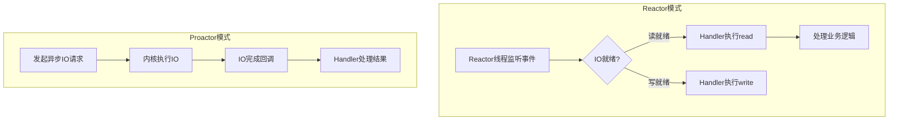

### epoll与io_uring
**epoll**是Linux下最高效的IO多路复用机制，采用事件通知模型，避免了select/poll的O(n)轮询开销。Netty、Nginx、Redis等高性能框架均基于epoll。epoll通过`epoll_ctl`注册fd，通过`epoll_wait`获取就绪事件，内核使用红黑树管理fd，就绪链表返回事件。

**io_uring**（Linux 5.1+）是新一代异步IO框架，通过共享内存的环形缓冲区（submission queue / completion queue）实现真正的异步IO，减少了系统调用次数和上下文切换，适用于超高吞吐场景。

### Java NIO示例

```java
// Java NIO Selector示例
Selector selector = Selector.open();
ServerSocketChannel serverChannel = ServerSocketChannel.open();
serverChannel.configureBlocking(false);
serverChannel.bind(new InetSocketAddress(8080));
serverChannel.register(selector, SelectionKey.OP_ACCEPT);

while (true) {
    selector.select();  // 阻塞等待就绪事件
    Set<SelectionKey> selectedKeys = selector.selectedKeys();
    for (SelectionKey key : selectedKeys) {
        if (key.isAcceptable()) {
            SocketChannel client = serverChannel.accept();
            client.configureBlocking(false);
            client.register(selector, SelectionKey.OP_READ);
        } else if (key.isReadable()) {
            SocketChannel client = (SocketChannel) key.channel();
            ByteBuffer buffer = ByteBuffer.allocate(1024);
            client.read(buffer);  // 处理读事件
        }
    }
    selectedKeys.clear();
}
```

***

## 3.2 响应式编程

响应式编程（Reactive Programming）是一种基于数据流和变化传播的编程范式。在高并发场景下，响应式编程通过非阻塞的背压机制、流式处理和声明式组合，能够高效地处理海量并发IO，是构建高性能系统的重要工具。

### Flow API与Reactor
Java 9引入Flow API定义了响应式编程的标准接口（Publisher/Subscriber/Subscription/Processor）。Reactor和RxJava是其主流实现。

```java
// Reactor响应式编程示例
Flux<String> flux = Flux.fromIterable(Arrays.asList("A", "B", "C", "D"))
    .filter(s -> s.length() > 0)
    .map(String::toLowerCase)
    .flatMap(s -> Mono.fromCallable(() -> {
        Thread.sleep(100);  // 模拟异步IO
        return s + "_processed";
    }))
    .onErrorResume(e -> Mono.just("default"));  // 异常降级

flux.subscribe(
    value -> System.out.println("收到: " + value),
    error -> System.err.println("错误: " + error),
    () -> System.out.println("流完成")
);
```

### 响应式流的生命周期

理解响应式流的生命周期对于正确使用响应式编程至关重要。一个响应式流从创建到终止经历以下阶段：

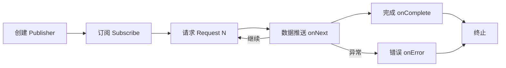

- **创建阶段**：通过`Flux.create()`、`Flux.fromIterable()`、`Mono.fromCallable()`等方式创建发布者
- **订阅阶段**：调用`subscribe()`触发数据流的流动。没有订阅就不会有任何数据产生（惰性求值）
- **请求阶段**：订阅者通过`Subscription.request(n)`声明能处理的数据量（背压的起点）
- **数据推送阶段**：发布者通过`onNext()`逐个推送数据给订阅者
- **终止阶段**：正常完成（`onComplete`）或异常终止（`onError`），之后不再有数据推送

```java
// 演示响应式流的生命周期
Flux.create(sink -> {
    System.out.println("流被订阅，开始产生数据");
    for (int i = 1; i <= 10; i++) {
        System.out.println("推送数据: " + i);
        sink.next(i);  // 推送数据
    }
    System.out.println("数据推送完成");
    sink.complete();   // 完成信号
})
.doOnSubscribe(sub -> System.out.println("收到订阅请求"))
.doOnNext(item -> System.out.println("处理元素: " + item))
.doOnComplete(() -> System.out.println("流正常结束"))
.doOnError(e -> System.out.println("流异常结束: " + e.getMessage()))
.subscribe();  // 触发整个流程
```

### 背压机制（Backpressure）
当生产者速度远大于消费者时，响应式系统通过背压（Backpressure）机制控制数据流速：

| 策略 | 说明 | 适用场景 |
|------|------|---------|
| BUFFER | 缓冲多余元素（可能OOM） | 消费者暂时跟不上但最终能处理完 |
| DROP | 丢弃未处理的元素 | 实时数据流（如日志、监控指标） |
| LATEST | 只保留最新元素 | 实时配置更新、状态同步 |
| ERROR | 报错（下游跟不上） | 需要严格不丢数据的场景 |

```java
// Reactor背压策略示例
Flux.create(sink -> {
    for (int i = 0; i < 100000; i++) {
        sink.next(i);  // 大量数据源
    }
    sink.complete();
})
.onBackpressureBuffer(1000)    // 缓冲最多1000个元素
.publishOn(Schedulers.boundedElastic())  // 使用弹性调度器
.subscribe(item -> {
    Thread.sleep(10);  // 模拟慢消费者
    System.out.println(item);
});
```

### 错误恢复操作符

响应式编程提供了丰富的错误恢复操作符，使得错误处理更加优雅：

```java
Flux.just("data1", "data2")
    .map(data -> processOrThrow(data))
    // 1. onErrorReturn：出错时返回默认值
    .onErrorReturn("fallback_data")
    // 或者 2. onErrorResume：出错时切换到备用流
    .onErrorResume(e -> {
        log.error("主流程出错，切换到备用流程", e);
        return Flux.just("backup_data1", "backup_data2");
    })
    // 3. retry：出错时重试指定次数
    .retry(3)
    // 4. retryWhen：更精细的重试控制（如指数退避）
    .retryWhen(Retry.backoff(3, Duration.ofSeconds(1))
        .filter(ex -> ex instanceof TimeoutException))
    // 5. onErrorMap：将异常转换为自定义异常
    .onErrorMap(IOException.class, e ->
        new ServiceUnavailableException("服务暂不可用", e))
    .subscribe(
        value -> System.out.println("结果: " + value),
        error -> System.err.println("最终失败: " + error)
    );
```

| 错误恢复操作符 | 功能 | 典型用法 |
|--------------|------|---------|
| onErrorReturn | 出错时返回默认值 | 返回缓存数据作为降级结果 |
| onErrorResume | 出错时切换到备用流 | 从主数据源切换到备用数据源 |
| retry | 自动重试指定次数 | 应对偶发的网络抖动 |
| retryWhen | 高级重试策略（指数退避等） | 重试N次，每次间隔翻倍 |
| onErrorMap | 异常类型转换 | 将底层异常转换为业务异常 |
| doOnError | 错误发生时执行副作用 | 记录日志、上报监控 |

### Schedulers调度器类型

调度器（Scheduler）决定了响应式操作在哪个线程上执行，正确选择调度器是响应式编程性能调优的关键：

```java
// Reactor调度器类型及使用
Flux.fromIterable(dataList)
    // publishOn：切换下游操作的执行线程
    .publishOn(Schedulers.boundedElastic())  // IO密集型操作使用弹性调度器
    .map(this::processData)                  // 在弹性线程池中执行
    // subscribeOn：切换整个流的订阅线程（只影响上游）
    .subscribeOn(Schedulers.parallel())      // 数据源在并行调度器中初始化
    .block();  // 阻塞等待结果
```

| 调度器 | 说明 | 适用场景 |
|--------|------|---------|
| Schedulers.parallel() | 固定大小的并行线程池 | CPU密集型计算 |
| Schedulers.boundedElastic() | 有界的弹性线程池，可按需创建 | IO密集型操作（网络、文件、数据库） |
| Schedulers.single() | 单线程调度器 | 需要严格顺序执行的操作 |
| Schedulers.immediate() | 在当前线程直接执行 | 轻量级、无需切换的操作 |
| Schedulers.fromExecutor() | 自定义线程池 | 需要精细控制线程池参数时 |

> **经验法则**：`subscribeOn`决定了"从哪里开始执行"（只对源头有效），`publishOn`决定了"在哪里执行后续操作"（可以多次切换）。IO操作用`boundedElastic`，计算操作用`parallel`，这是最常见的搭配。

### 响应式vs回调对比
| 特性 | 响应式编程 | 回调模式 |
|------|-----------|---------|
| 代码可读性 | 链式调用，接近同步风格 | 回调地狱，嵌套层级深 |
| 错误处理 | 统一的错误传播 | 每层回调需单独处理 |
| 背压支持 | 内置支持 | 需自行实现 |
| 调试难度 | 操作符链较难追踪 | 线性调用栈更直观 |
| 学习曲线 | 较陡 | 较平缓 |

***

## 3.3 异步编排与组合
### CompletableFuture链式组合
Java 8的CompletableFuture提供了强大的异步编排能力：

```java
// CompletableFuture异步编排示例
CompletableFuture<String> userFuture = CompletableFuture
    .supplyAsync(() -> userService.getUser(userId));   // 异步获取用户

CompletableFuture<Order> orderFuture = CompletableFuture
    .supplyAsync(() -> orderService.getOrders(userId)); // 异步获取订单

CompletableFuture<Coupon> couponFuture = CompletableFuture
    .supplyAsync(() -> couponService.getCoupons(userId)) // 异步获取优惠券
    .exceptionally(e -> Coupon.empty());  // 单个依赖异常不影响整体

// 组合多个异步结果
CompletableFuture<UserDetail> result = userFuture
    .thenCombine(orderFuture, (user, order) -> {
        user.setOrders(order);  // 组合用户和订单
        return user;
    })
    .thenCombine(couponFuture, (user, coupon) -> {
        user.setCoupons(coupon);  // 添加优惠券
        return user;
    })
    .thenApply(user -> enrichUserInfo(user))  // 后处理
    .exceptionally(e -> {
        log.error("异步编排失败", e);
        return UserDetail.empty();    // 兜底降级
    });

// 并行执行并设置超时
UserDetail detail = result.orTimeout(3, TimeUnit.SECONDS)  // 3秒超时
    .join();
```

### CompletableFuture常见组合方法速查

| 方法 | 说明 | 使用场景 |
|------|------|---------|
| thenApply | 对结果进行同步转换 | 数据格式转换 |
| thenApplyAsync | 对结果进行异步转换 | 转换需要调用外部服务 |
| thenCompose | 链接两个异步操作（flatMap） | 有依赖关系的异步调用 |
| thenCombine | 合并两个独立的异步结果 | 并行查询后聚合 |
| allOf | 等待所有Future完成 | 批量操作后统一处理 |
| anyOf | 等待任一Future完成 | 多源竞争（选最快的） |
| exceptionally | 异常时返回默认值 | 单个依赖降级 |
| handle | 统一处理正常和异常结果 | 最终的异常兜底 |

```java
// CompletableFuture常见模式：并行查询+聚合
CompletableFuture<List<Order>> ordersFuture =
    CompletableFuture.supplyAsync(() -> orderService.getOrders(userId));
CompletableFuture<List<Item>> itemsFuture =
    CompletableFuture.supplyAsync(() -> itemService.getItems(userId));
CompletableFuture<Balance> balanceFuture =
    CompletableFuture.supplyAsync(() -> accountService.getBalance(userId))
        .exceptionally(e -> Balance.empty());  // 余额查询失败用默认值

// allOf等待所有完成
CompletableFuture<Void> allDone = CompletableFuture.allOf(
    ordersFuture, itemsFuture, balanceFuture);

// 组合结果
UserDashboard dashboard = allDone.thenApply(v ->
    new UserDashboard(
        ordersFuture.join(),
        itemsFuture.join(),
        balanceFuture.join()
    )).join();
```

### Go goroutine并发模式

```go
// Go：使用errgroup进行并发任务管理
import "golang.org/x/sync/errgroup"

func fetchAllData(ctx context.Context) (*AggregatedResult, error) {
    g, ctx := errgroup.WithContext(ctx)
    var result AggregatedResult

    // 并发获取多个数据源
    g.Go(func() error {
        data, err := fetchFromServiceA(ctx)
        if err != nil { return err }
        result.DataA = data
        return nil
    })

    g.Go(func() error {
        data, err := fetchFromServiceB(ctx)
        if err != nil { return nil }  // B非关键，忽略错误
        result.DataB = data
        return nil
    })

    g.Go(func() error {
        data, err := fetchFromServiceC(ctx)
        if err != nil { return err }
        result.DataC = data
        return nil
    })

    if err := g.Wait(); err != nil {
        return nil, err  // 任一关键任务失败则返回错误
    }
    return &amp;result, nil
}
```

```go
// Go：使用select实现超时控制和多路复用
select {
case result := <-ch1:
    handleResult(result)
case result := <-ch2:
    handleResult(result)
case <-time.After(5 * time.Second):
    log.Error("操作超时")
case <-ctx.Done():
    log.Error("上下文取消:", ctx.Err())
}
```

***

# 四、热点数据与高并发场景

热点数据处理和分布式高并发方案是本章的实战重点。在前面的技术基础之上，这一部分聚焦于真实的高并发业务场景，包括热点数据的检测与处理、分布式锁、读写分离与CQRS等。

## 4.1 热点数据解决方案
### 热点检测
热点数据是指访问频率远高于平均水平的键（如明星微博、秒杀商品）。热点检测方式包括：

- **实时统计**：使用HyperLogLog或Count-Min Sketch统计Key访问频次
- **离线分析**：通过日志分析识别Top-K热点Key
- **采样检测**：对部分流量进行采样，发现突增的热点

### Key分片与加盐
对热点Key进行分片（Sharding）或加盐（Salting），将单点压力分散到多个实例：

```java
// 热点Key加盐分片示例
public String getShardedKey(String hotKey, int shardCount) {
    // 使用一致性哈希将热点Key分散到N个分片
    int shard = Math.abs(hotKey.hashCode()) % shardCount;
    return hotKey + ":shard:" + shard;
}

// 查询时合并所有分片的结果
public long aggregateCounter(String baseKey, int shardCount) {
    long total = 0;
    for (int i = 0; i < shardCount; i++) {
        String key = baseKey + ":shard:" + i;
        Long value = redis.opsForValue().get(key);
        if (value != null) total += value;
    }
    return total;
}
```

### 多级缓存架构

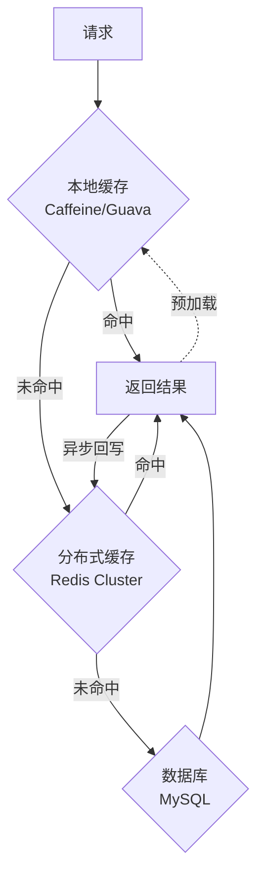

本地缓存（如Caffeine）负责拦截最热的数据，延迟约100ns；Redis分布式缓存负责共享数据，延迟约1ms；数据库为最终数据源。通过"本地+分布式"两级缓存，既保证了低延迟，又保证了数据一致性。

***

## 4.2 并发数据结构选择
| 数据结构 | 实现方式 | 适用场景 | 性能特点 |
|---------|---------|---------|---------|
| ConcurrentHashMap | CAS + synchronized（JDK8+） | 高并发读写Map | 分段锁，支持高并发 |
| synchronizedMap | 全局synchronized | 低并发场景 | 简单但并发度低 |
| CopyOnWriteArrayList | 写时复制数组 | 读多写少 | 读无锁，写开销大 |
| ConcurrentLinkedQueue | 无锁CAS链表 | 无界队列 | 无锁，高吞吐 |
| ArrayBlockingQueue | 有界数组+ReentrantLock | 生产者消费者 | 有界，支持公平 |
| LinkedBlockingQueue | 链表+分离锁 | 读写分离场景 | 读写锁分离，并发度更高 |

```java
// 并发数据结构选择示例
// 场景1：高并发读写缓存
ConcurrentHashMap<String, Object> cache = new ConcurrentHashMap<>();

// 场景2：监听器列表（写极少，读极多）
CopyOnWriteArrayList<EventListener> listeners = new CopyOnWriteArrayList<>();

// 场景3：生产者消费者
BlockingQueue<Task> queue = new LinkedBlockingQueue<>(1000);
queue.put(task);    // 生产者：队列满时阻塞
Task t = queue.take();  // 消费者：队列空时阻塞
```

***

## 4.3 实战案例
### 电商秒杀系统
秒杀系统是高并发技术的综合应用，采用多层防御体系：

```java
// 秒杀系统多层并发控制
@RestController
public class SeckillController {
    @Autowired private RateLimiter rateLimiter;
    @Autowired private RedisTemplate<String, String> redis;
    @Autowired private KafkaTemplate<String, String> kafka;
    @Autowired private Cache<String, Boolean> localCache;  // 本地缓存（Caffeine）

    @PostMapping("/seckill/{itemId}")
    public Result seckill(@PathVariable String itemId,
                          @RequestParam String userId) {
        // 第一层：网关限流（Sentinel/RateLimiter）
        if (!rateLimiter.tryAcquire(100, TimeUnit.MILLISECONDS)) {
            return Result.fail("系统繁忙，请稍后重试");
        }

        // 第二层：本地缓存去重（防止同一用户重复提交）
        String localKey = itemId + ":" + userId;
        if (localCache.getIfPresent(localKey) != null) {
            return Result.fail("请勿重复提交");
        }

        // 第三层：Redis预扣减库存（原子操作，扛住高并发）
        Long stock = redis.opsForValue().decrement("stock:" + itemId);
        if (stock == null || stock < 0) {
            redis.opsForValue().increment("stock:" + itemId);  // 回补
            return Result.fail("已售罄");
        }

        // 第四层：异步下单（Kafka削峰，下游慢慢处理）
        SeckillMessage msg = new SeckillMessage(itemId, userId);
        kafka.send("seckill-topic", itemId, JSON.toJSONString(msg));
        localCache.put(localKey, true);

        return Result.success("排队中");
    }
}
```

### 高并发日志收集系统

```go
// Go异步日志收集器：使用channel缓冲 + 批量发送
type AsyncLogger struct {
    buffer    chan *LogEntry
    batchSize int
    flusher   *LogFlusher
    wg        sync.WaitGroup
}

func NewAsyncLogger(bufferSize, batchSize int, endpoint string) *AsyncLogger {
    logger := &amp;AsyncLogger{
        buffer:    make(chan *LogEntry, bufferSize),  // 有界缓冲，防止OOM
        batchSize: batchSize,
        flusher:   NewLogFlusher(endpoint),
    }
    logger.wg.Add(1)
    go logger.processLoop()
    return logger
}

func (l *AsyncLogger) Log(entry *LogEntry) {
    select {
    case l.buffer <- entry:
        // 成功写入缓冲区
    default:
        droppedCounter.Inc()  // 缓冲区满，丢弃并记录指标
    }
}

func (l *AsyncLogger) processLoop() {
    defer l.wg.Done()
    batch := make([]*LogEntry, 0, l.batchSize)
    ticker := time.NewTicker(100 * time.Millisecond)
    defer ticker.Stop()

    for {
        select {
        case entry := <-l.buffer:
            batch = append(batch, entry)
            if len(batch) >= l.batchSize {
                l.flusher.Flush(batch)
                batch = batch[:0]  // 复用切片
            }
        case <-ticker.C:
            if len(batch) > 0 {
                l.flusher.Flush(batch)
                batch = batch[:0]
            }
        }
    }
}
```

### 实时计数系统

```java
// 多级缓存实时计数系统：本地LongAdder + Redis汇总
public class RealtimeCounter {
    private final ConcurrentHashMap<String, LongAdder> localCounters;
    private final RedisTemplate<String, String> redis;
    private final ScheduledExecutorService scheduler;

    public RealtimeCounter(RedisTemplate<String, String> redis) {
        this.localCounters = new ConcurrentHashMap<>();
        this.redis = redis;
        this.scheduler = Executors.newScheduledThreadPool(1);
        this.scheduler.scheduleAtFixedRate(this::flush, 5, 5, TimeUnit.SECONDS);
    }

    // 写入：本地计数（零网络开销）
    public void increment(String key) {
        localCounters.computeIfAbsent(key, k -> new LongAdder()).increment();
    }

    // 读取：本地 + Redis
    public long get(String key) {
        LongAdder local = localCounters.get(key);
        long localCount = local != null ? local.sum() : 0;
        String remote = redis.opsForValue().get("counter:" + key);
        long remoteCount = remote != null ? Long.parseLong(remote) : 0;
        return localCount + remoteCount;
    }

    // 定时批量刷新到Redis
    private void flush() {
        Map<String, Long> snapshot = new HashMap<>();
        localCounters.forEach((key, adder) -> {
            long value = adder.sumThenReset();  // 原子读取并重置
            if (value > 0) snapshot.put(key, value);
        });
        if (!snapshot.isEmpty()) {
            redis.executePipelined((RedisCallback<Void>) conn -> {
                snapshot.forEach((key, value) ->
                    conn.stringCommands().incrementBy(("counter:" + key).getBytes(), value));
                return null;
            });
        }
    }
}
```

***

## 4.4 分布式锁

> **为什么重要？** 在分布式系统中，多个服务实例可能同时操作共享资源。单机的synchronized和ReentrantLock无法跨进程生效，此时需要分布式锁来保证资源的互斥访问。分布式锁是解决分布式环境下并发问题的核心工具，广泛应用于库存扣减、订单幂等、定时任务去重等场景。

### 基于Redis的分布式锁

Redis分布式锁的核心原理是利用`SET key value NX EX`命令的原子性——只有当key不存在时才能设置成功，从而保证只有一个客户端能获取到锁。

```java
// 基于Redis的分布式锁实现（Redisson）
RLock lock = redissonClient.getLock("order:lock:" + orderId);
try {
    // 尝试加锁：等待10秒，持有锁最多30秒（看门狗自动续期）
    if (lock.tryLock(10, 30, TimeUnit.SECONDS)) {
        // 获取锁成功，执行业务逻辑
        processOrder(orderId);
    } else {
        // 获取锁失败，返回繁忙提示
        throw new LockAcquisitionException("订单正在处理中");
    }
} finally {
    if (lock.isHeldByCurrentThread()) {
        lock.unlock();  // 释放锁（仅释放自己持有的锁）
    }
}
```

**Redis单节点锁的局限性**：如果Redis主节点在写入锁信息后、同步到从节点前宕机，从节点提升为主节点后，锁信息丢失，可能导致两个客户端同时持有锁。为了解决这个问题，Antirez提出了RedLock算法。

### RedLock算法

RedLock通过向N个独立Redis实例（推荐5个）申请锁，要求在多数节点（>N/2）上成功获取才算加锁成功：

```java
// RedLock算法原理
// 1. 获取当前时间 T1
// 2. 依次向N个Redis实例请求锁（使用相同的key、value、超时时间）
// 3. 计算获取锁的耗时 time = T2 - T1
// 4. 如果在多数节点（>N/2）上成功获取锁，且 time < 锁的过期时间
//    则认为加锁成功
// 5. 加锁成功的时间 = 锁的过期时间 - time
// 6. 如果加锁失败，向所有节点发送释放锁请求

// Redisson RedLock使用
RedissonRedLock redLock = new RedissonRedLock(lock1, lock2, lock3, lock4, lock5);
try {
    // 尝试RedLock：向5个节点申请，需要3个以上成功
    if (redLock.tryLock(10, 30, TimeUnit.SECONDS)) {
        processOrder(orderId);
    }
} finally {
    redLock.unlock();
}
```

### 基于ZooKeeper的分布式锁

ZooKeeper利用临时有序节点（Ephemeral Sequential Node）实现分布式锁。客户端在锁路径下创建临时有序节点，序号最小的获得锁，其他客户端监听前一个节点的删除事件（避免惊群效应）：

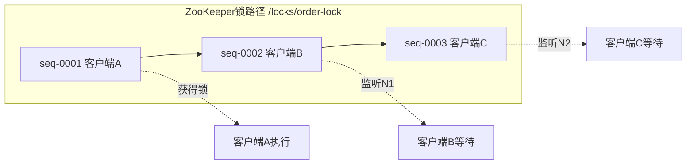

```java
// 基于ZooKeeper的分布式锁实现
InterProcessMutex lock = new InterProcessMutex(client, "/locks/order-lock");
try {
    // 阻塞式获取锁
    if (lock.acquire(10, TimeUnit.SECONDS)) {
        processOrder(orderId);
    }
} finally {
    lock.release();
}
```

### 基于etcd的分布式锁

etcd基于Lease（租约）和Revision（版本号）实现分布式锁。通过创建带租约的key实现互斥，通过版本号保证全局顺序：

```go
// 基于etcd的分布式锁实现
import (
    "go.etcd.io/etcd/client/v3"
    "go.etcd.io/etcd/client/v3/concurrency"
)

func acquireLock(cli *clientv3.Client) error {
    // 创建会话（带租约，用于自动释放锁）
    session, err := concurrency.NewSession(cli, concurrency.WithTTL(10))
    if err != nil {
        return err
    }
    defer session.Close()

    // 创建分布式锁
    mutex := concurrency.NewMutex(session, "/locks/order-lock")

    // 获取锁（阻塞式）
    if err := mutex.Lock(context.TODO()); err != nil {
        return err
    }

    // 执行业务逻辑
    processOrder()

    // 释放锁
    return mutex.Unlock(context.TODO())
}
```

### 分布式锁方案对比
| 特性 | Redis（单节点） | RedLock | ZooKeeper | etcd |
|------|----------------|---------|-----------|------|
| 实现复杂度 | 低 | 中 | 中 | 中 |
| 性能 | 极高（~100K ops/s） | 高 | 中（~10K ops/s） | 中高（~30K ops/s） |
| 可靠性 | 中（主从切换可能丢锁） | 高（多数派共识） | 高（ZAB协议） | 高（Raft协议） |
| 锁释放 | 手动或超时自动 | 手动或超时自动 | 临时节点自动释放 | 租约过期自动释放 |
| 适用场景 | 简单互斥、低延迟要求 | 高可靠性要求 | 强一致性场景 | 云原生Kubernetes生态 |
| 客户端 | Redisson/Jedis | Redisson | Curator | go.etcd |

> **选型建议**：大多数场景下Redisson提供的Redis锁已经足够。对可靠性要求极高的场景（如金融扣款）可以使用RedLock或ZooKeeper。在Kubernetes生态中优先考虑etcd。

***

## 4.5 读写分离与CQRS

> **为什么重要？** 在高并发读场景下，单个数据库实例的读吞吐量往往成为瓶颈。读写分离通过将读请求分散到多个从库来提升读吞吐；CQRS通过将读写模型彻底分离，实现读写各自独立扩展。这两种模式是应对高并发读压力的核心架构手段。

### 数据库读写分离

读写分离的基本原理是：主库负责写操作（INSERT/UPDATE/DELETE），从库负责读操作（SELECT），通过数据库主从复制实现数据同步。

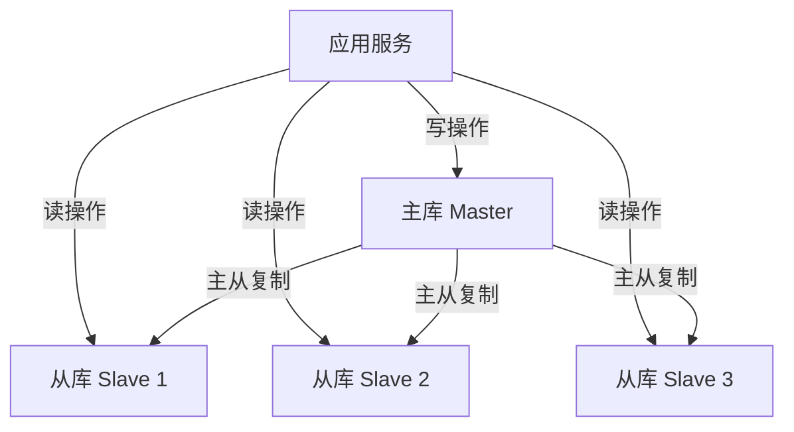

```java
// 基于AbstractRoutingDataSource的读写分离实现
public class DataSourceRouter extends AbstractRoutingDataSource {
    private final ThreadLocal<String> dataSourceKey = new ThreadLocal<>();

    public void setRead() { dataSourceKey.set("slave"); }
    public void setWrite() { dataSourceKey.set("master"); }

    @Override
    protected Object determineCurrentLookupKey() {
        return dataSourceKey.get();
    }

    public void clear() { dataSourceKey.remove(); }
}

// AOP切面自动路由
@Aspect
@Component
public class DataSourceAspect {
    @Autowired private DataSourceRouter router;

    @Before("@annotation(readOnly)")
    public void switchToRead(JoinPoint point) {
        router.setRead();  // 标记为只读，路由到从库
    }

    @Before("@annotation(readWrite)")
    public void switchToWrite(JoinPoint point) {
        router.setWrite();  // 标记为读写，路由到主库
    }

    @After("@annotation(readOnly) || @annotation(readWrite)")
    public void clearRoute(JoinPoint point) {
        router.clear();  // 清除线程本地变量，避免泄漏
    }
}

// 业务层使用
@Service
public class OrderService {
    @ReadOnly
    public List<Order> queryOrders(Long userId) {
        // 自动路由到从库
        return orderRepository.findByUserId(userId);
    }

    @ReadWrite
    public void createOrder(Order order) {
        // 自动路由到主库
        orderRepository.save(order);
    }
}
```

### 读写分离需要注意的问题

| 问题 | 说明 | 解决方案 |
|------|------|---------|
| 主从延迟 | 写入主库后立即读从库可能读不到最新数据 | 关键读路由到主库；使用半同步复制 |
| 数据一致性 | 从库数据滞后于主库 | 对一致性要求高的操作使用主库 |
| 写后读 | 创建订单后立即查询，从库可能还没有 | 写后强制读主库（使用注解标记） |
| 负载均衡 | 多从库之间的负载分配 | 加权轮询或根据从库负载动态调整 |
| 故障转移 | 从库宕机后流量需要切换 | 健康检查 + 自动故障转移 |

### CQRS模式

CQRS（Command Query Responsibility Segregation，命令查询职责分离）是一种更彻底的读写分离模式。它将数据的写入（Command）和查询（Query）使用完全不同的模型和存储：

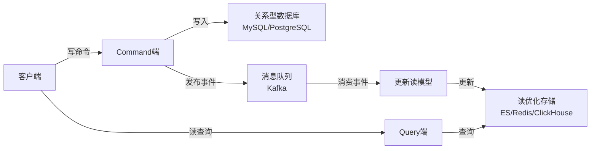

```java
// CQRS模式实现示例

// === Command端：处理写入 ===
@Service
public class OrderCommandHandler {
    @Autowired private OrderRepository writeRepo;
    @Autowired private EventPublisher eventPublisher;

    // 命令：创建订单（写入主库）
    @Transactional
    public void handle(CreateOrderCommand cmd) {
        Order order = new Order(cmd.getProductId(), cmd.getUserId(), cmd.getAmount());
        writeRepo.save(order);

        // 发布领域事件，用于更新读模型
        eventPublisher.publish(new OrderCreatedEvent(
            order.getId(), order.getProductId(),
            order.getUserId(), order.getAmount(), order.getCreatedAt()
        ));
    }
}

// === Query端：处理查询（使用读优化存储） ===
@Service
public class OrderQueryService {
    @Autowired private ElasticsearchRepository esRepo;
    @Autowired private RedisTemplate<String, Object> redis;

    // 查询：从ES/Redis等读优化存储中查询
    public OrderDTO getOrder(long orderId) {
        // 优先查Redis缓存
        OrderDTO cached = (OrderDTO) redis.opsForHash().get("order", String.valueOf(orderId));
        if (cached != null) return cached;

        // 缓存未命中，查ES（支持全文搜索、复杂聚合）
        OrderDocument doc = esRepo.findById(String.valueOf(orderId)).orElse(null);
        if (doc != null) {
            OrderDTO dto = convertToDTO(doc);
            redis.opsForHash().put("order", String.valueOf(orderId), dto);
            return dto;
        }
        return null;
    }

    // 搜索订单：利用ES的搜索能力，这是MySQL难以高效完成的
    public List<OrderDTO> searchOrders(OrderSearchRequest request) {
        return esRepo.search(buildQuery(request))
            .stream().map(this::convertToDTO).collect(Collectors.toList());
    }
}

// === 事件消费者：从主库同步到读模型 ===
@Component
public class OrderEventConsumer {
    @Autowired private ElasticsearchRepository esRepo;

    @KafkaListener(topics = "order-events")
    public void onOrderEvent(OrderCreatedEvent event) {
        // 将事件数据转换为ES文档并索引
        OrderDocument doc = new OrderDocument();
        doc.setId(String.valueOf(event.getOrderId()));
        doc.setProductId(event.getProductId());
        doc.setUserId(event.getUserId());
        doc.setAmount(event.getAmount());
        doc.setCreatedAt(event.getCreatedAt());
        esRepo.save(doc);  // 同步到ES，供查询端使用
    }
}
```

### CQRS的优缺点

| 优点 | 缺点 |
|------|------|
| 读写独立扩展，读性能极高 | 系统复杂度显著增加 |
| 查询端可以使用最适合的存储（ES、Redis等） | 最终一致性，存在数据延迟 |
| 写端和读端可以独立优化 | 需要维护事件同步机制 |
| 支持复杂的搜索和聚合查询 | 开发和运维成本较高 |

### 适用场景判断

| 场景 | 推荐方案 | 原因 |
|------|---------|------|
| 读写比 < 10:1 | 简单的读写分离 | CQRS过度设计 |
| 读写比 > 10:1 | CQRS | 查询端需要独立优化 |
| 需要全文搜索 | CQRS + Elasticsearch | MySQL全文搜索能力弱 |
| 需要实时聚合统计 | CQRS + ClickHouse | OLAP引擎更适合 |
| 一致性要求高 | 简单读写分离 + 主库读 | CQRS的最终一致性不满足 |

***

# 五、常见误区与最佳实践

高并发编程中有许多看似正确实则危险的实践。这些误区在日常开发中反复出现，轻则导致性能不佳，重则引发线上事故。了解并避开这些陷阱，是成为资深工程师的必经之路。

## 误区一：过度使用多线程
许多开发者认为多线程能解决所有性能问题。实际上，线程的创建、销毁和上下文切换都有显著开销。

```java
// 错误：对每个请求创建新线程（线程创建开销巨大）
new Thread(() -> processRequest(request)).start();

// 正确：使用线程池复用线程
executor.submit(() -> processRequest(request));

// 更好：IO密集场景使用虚拟线程（JDK 21+）
try (var executor = Executors.newVirtualThreadPerTaskExecutor()) {
    executor.submit(() -> processRequest(request));
}
```

## 误区二：忽视线程安全

```java
// 错误：非线程安全的计数器
public class UnsafeCounter {
    private int count = 0;
    public void increment() {
        count++;  // 非原子操作：读-改-写三步，存在竞态条件
    }
}

// 正确：线程安全的计数器
public class SafeCounter {
    private final AtomicInteger count = new AtomicInteger(0);
    public void increment() {
        count.incrementAndGet();  // 原子操作（CAS）
    }
}
```

## 误区三：锁粒度不当

```java
// 错误：方法级synchronized，锁范围过大
public synchronized void updateData() {
    prepareData();      // 不需要同步的部分
    criticalSection();  // 只有这部分需要同步
    postProcess();      // 不需要同步的部分
}

// 正确：缩小锁范围
public void updateData() {
    prepareData();       // 无锁区域
    lock.lock();
    try {
        criticalSection(); // 最小化同步范围
    } finally {
        lock.unlock();
    }
    postProcess();       // 无锁区域
}
```

## 误区四：滥用synchronized
现代Java提供了更灵活的同步机制。对于读多写少场景，优先使用`StampedLock`乐观读；对于高并发计数，优先使用`LongAdder`而非`synchronized`计数器。

## 误区五：忽略资源限制
限流和熔断不是可选的锦上添花，而是生产环境的必需品。没有限流的系统就像没有刹车的汽车——在正常情况下可能不会出问题，但一旦遇到突发流量就会崩溃。每个对外暴露的接口都应该配置合理的限流和超时策略。

## 误区六：线程池参数配置不当

线程池是高并发编程中最常用的工具，但参数配置不当会严重影响性能。

```java
// 错误1：使用Executors工厂方法创建线程池
ExecutorService pool = Executors.newFixedThreadPool(100);
// 问题：底层使用无界队列LinkedBlockingQueue，任务堆积会导致OOM
// 最大线程数也是100，无法应对突发流量

// 错误2：线程数设得过大
new ThreadPoolExecutor(1000, 1000, ...);
// 问题：1000个线程占用约1GB内存（1MB/线程栈），且频繁上下文切换

// 正确做法：根据任务类型合理配置
int cpuCores = Runtime.getRuntime().availableProcessors();
ThreadPoolExecutor executor = new ThreadPoolExecutor(
    cpuCores,                                   // 核心线程数 = CPU核心数
    cpuCores * 2,                               // 最大线程数 = 2倍核心数
    60L, TimeUnit.SECONDS,
    new LinkedBlockingQueue<>(200),              // 有界队列，容量适中
    new ThreadFactoryBuilder().setNameFormat("biz-pool-%d").build(),
    new ThreadPoolExecutor.CallerRunsPolicy()   // 拒绝策略
);
```

| 错误配置 | 后果 | 正确做法 |
|---------|------|---------|
| 无界队列 | 任务堆积导致OOM | 使用有界队列 |
| 线程数过大 | 内存不足、频繁上下文切换 | 根据CPU和任务类型计算 |
| 使用默认线程工厂 | 线程名无标识，排查困难 | 自定义ThreadFactory设置有意义的名称 |
| 忽略拒绝策略 | 默认AbortPolicy直接抛异常 | 根据场景选择CallerRuns或自定义策略 |

## 误区七：忽视连接池泄漏

连接池泄漏是线上最常见的资源泄漏问题之一。连接借出后未及时归还，最终导致连接池耗尽，所有请求排队等待。

```java
// 错误：异常路径未关闭连接
public void queryData() {
    Connection conn = dataSource.getConnection();
    PreparedStatement ps = conn.prepareStatement("SELECT ...");
    ResultSet rs = ps.executeQuery();
    // 如果这里抛出异常，连接将泄漏！
    while (rs.next()) {
        processData(rs);
    }
    conn.close();  // 只有正常路径才能执行到
}

// 正确：使用try-with-resources确保连接归还
public void queryData() {
    try (Connection conn = dataSource.getConnection();
         PreparedStatement ps = conn.prepareStatement("SELECT ...");
         ResultSet rs = ps.executeQuery()) {
        while (rs.next()) {
            processData(rs);
        }
    }  // 无论是否异常，连接都会自动关闭（归还到池中）
}
```

## 误区八：CompletableFuture使用不当

```java
// 错误1：未指定线程池，使用ForkJoinPool.commonPool()
CompletableFuture.supplyAsync(() -> service.query());
// 在高并发场景下，ForkJoinPool.commonPool()线程数有限（CPU核心数-1）
// 所有未指定线程池的异步任务共享这个池，容易互相影响

// 正确：指定业务线程池
CompletableFuture.supplyAsync(() -> service.query(), bizExecutor);

// 错误2：调用.get()阻塞
CompletableFuture<Result> future = someAsyncOperation();
Result result = future.get();  // 阻塞当前线程，违背异步初衷

// 正确：使用链式组合而非阻塞等待
CompletableFuture<Result> future = someAsyncOperation()
    .thenApply(result -> enrich(result))  // 异步链式处理
    .exceptionally(e -> fallback());      // 异常降级

// 错误3：忽略超时设置
future.get();  // 可能永远阻塞

// 正确：设置超时
future.orTimeout(5, TimeUnit.SECONDS)  // 5秒超时
    .exceptionally(e -> {
        if (e instanceof TimeoutException) {
            log.error("异步操作超时");
        }
        return fallback();
    });
```

## 误区九：分布式锁的常见陷阱

```java
// 错误1：锁超时导致业务未完成就释放
RLock lock = redissonClient.getLock("my-lock");
lock.lock(10, TimeUnit.SECONDS);  // 10秒后自动释放
// 如果业务执行超过10秒，锁被自动释放，其他客户端获取锁导致重复处理

// 正确：使用看门狗（Watchdog）自动续期
RLock lock = redissonClient.getLock("my-lock");
lock.lock();  // 不设置超时，Redisson默认30秒看门狗续期
// 看门狗每10秒自动续期，直到业务完成手动释放

// 错误2：释放别人的锁
lock.lock();
try {
    processOrder();  // 如果这一步超时了，锁可能已被自动释放
} finally {
    lock.unlock();  // 可能释放了别人的锁！
}

// 正确：使用isHeldByCurrentThread检查
try {
    lock.lock();
    processOrder();
} finally {
    if (lock.isHeldByCurrentThread()) {
        lock.unlock();
    }
}

// 错误3：在Redis集群模式下使用单节点锁
// 主节点宕机时锁信息丢失
// 解决：使用RedLock算法或使用Redission的MultiLock
```

***

# 练习方法

## 基础练习：实现线程池

手动实现一个简单的线程池，核心组件包括工作线程数组、任务队列（BlockingQueue）、拒绝策略（AbortPolicy/DiscardPolicy/CallerRunsPolicy）和生命周期管理（shutdown/shutdownNow）。通过此练习深入理解线程池的内部工作机制。

## 中级练习：实现分布式限流器

实现基于Redis的分布式令牌桶限流器，使用Lua脚本保证原子性。要求：支持突发流量（桶容量配置）、支持多节点协调、提供监控指标（限流次数、当前令牌数）。

```python
# 练习：实现Redis分布式限流器
import redis, time

class RedisRateLimiter:
    def __init__(self, redis_client, key, rate, capacity):
        self.redis = redis_client
        self.key = key
        self.rate = rate
        self.capacity = capacity
        self.script = """
            local key = KEYS[1]
            local rate = tonumber(ARGV[1])
            local capacity = tonumber(ARGV[2])
            local now = tonumber(ARGV[3])

            local info = redis.call('hmget', key, 'tokens', 'last_time')
            local tokens = tonumber(info[1]) or capacity
            local last_time = tonumber(info[2]) or now

            local delta = math.max(0, now - last_time)
            tokens = math.min(capacity, tokens + delta * rate)

            local allowed = tokens >= 1
            if allowed then tokens = tokens - 1 end

            redis.call('hmset', key, 'tokens', tokens, 'last_time', now)
            redis.call('expire', key, math.ceil(capacity / rate) * 2)
            return allowed and 1 or 0
        """

    def allow(self):
        result = self.redis.eval(self.script, 1, self.key,
                                 self.rate, self.capacity, time.time())
        return bool(result)
```

## 高级练习：构建完整降级框架

实现一个支持静态降级和动态降级的降级框架。要求：集成Sentinel注解式限流、支持熔断器三态切换、支持通过配置中心热更新降级规则、提供降级事件监控和报警能力。

***

# 本章小结
本章系统地介绍了高并发场景下的核心技术：

1. **并发编程基础**：线程池通过复用线程降低创建销毁开销；协程（goroutine/虚拟线程/asyncio）提供更轻量的并发模型；CAS无锁编程在低竞争场景下性能优于互斥锁；读写锁和StampedLock优化读多写少场景的并发性能。连接池通过复用连接避免频繁建立/销毁连接的开销，是高并发系统不可或缺的基础设施。Java内存模型（JMM）和happens-before规则是理解并发bug根源的关键。

2. **流量控制**：四种限流算法各有特点——固定窗口简单但有边界突发问题，滑动窗口解决突发问题但实现复杂，漏桶平滑输出但不支持突发，令牌桶兼顾平滑与突发。Sentinel提供开箱即用的分布式流量控制能力。

3. **熔断与降级**：Hystrix开创了熔断器模式在微服务中的应用，Resilience4j以更轻量的函数式风格成为现代替代方案。降级策略分为静态降级和动态降级，涵盖返回缓存、返回默认值、返回部分结果和请求排队等方式，是防止级联故障的关键防线。优雅停机和流量预热保障了服务更新期间的平稳过渡。

4. **异步化设计**：epoll/io_uring提供高效的IO多路复用；响应式编程通过背压机制处理流量不匹配问题，Schedulers调度器决定了操作的执行线程；CompletableFuture和goroutine提供了强大的异步编排能力。

5. **热点数据**：通过热点检测、Key分片加盐、多级缓存架构（本地+分布式）有效应对热点数据对系统的冲击。

6. **分布式一致性**：分布式锁（Redis/RedLock/ZooKeeper/etcd）解决分布式环境下的互斥访问问题；读写分离和CQRS模式通过分离读写模型来优化高并发读场景的性能。

高并发技术是构建高性能系统的基础，但它增加了系统的复杂性。在实践中需要在性能与可维护性之间找到平衡点。切记：**没有银弹，每种技术都有其适用场景和局限性**。

***

# 延伸阅读

- 《Java并发编程的艺术》——深入讲解Java并发编程的原理和实践
- 《Go并发编程实战》——详细介绍Go语言的并发模型和最佳实践
- 《响应式设计模式》——系统介绍响应式编程的设计模式
- 《高性能MySQL》——数据库层面的高并发优化技术
- 《微服务架构设计模式》——Chris Richardson讲解熔断、限流、降级等模式
- [Sentinel官方文档](https://sentinelguard.io/zh-cn/docs/introduction.html)——阿里巴巴流量控制框架
- [Resilience4j官方文档](https://resilience4j.readme.io/)——轻量级容错框架
- [io_uring文档](https://kernel.dk/io_uring.pdf)——Jens Axboe关于异步IO的论文
- 《Redis设计与实现》——深入理解Redis内部实现，有助于理解Redis分布式锁
- 《数据密集型应用系统设计》（DERTA）——Martin Kleppmann系统讲解分布式系统设计
