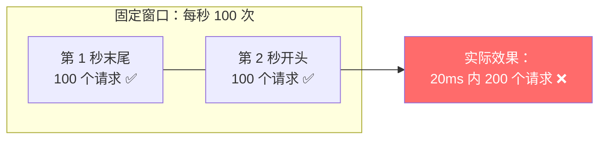
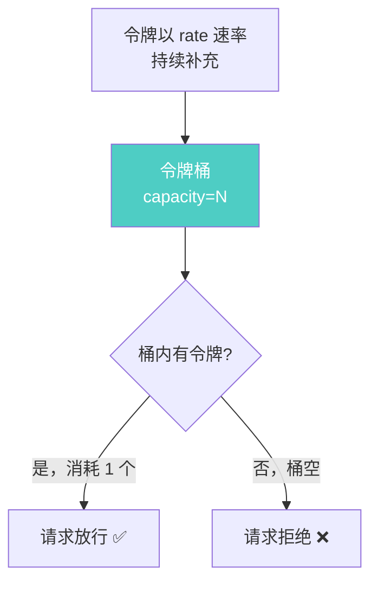
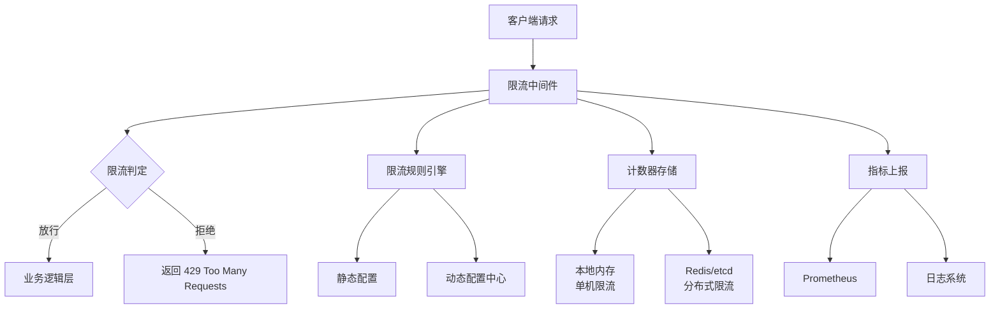
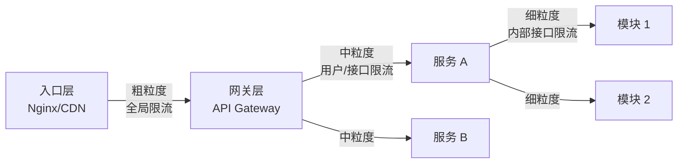
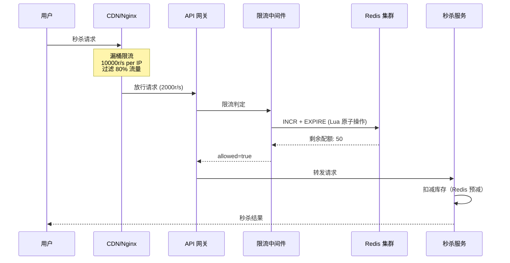

## 技巧三：限流中间件

### 3.1 为什么需要限流中间件

在微服务架构中，一个 API 网关背后可能挂着数十个下游服务。如果不限流，一个突发流量就可能打垮整个链路——数据库连接池耗尽、线程池打满、CPU 100%、级联故障蔓延到整个集群。限流中间件的本质是：**在请求到达业务逻辑之前，用统一的策略决定"放行"还是"拒绝"**，从而保护后端服务不被过载。

限流不是"拒绝用户"，而是"保护系统"。一个健康的限流系统应该做到：对正常用户无感知，对异常流量精准拦截，对系统过载及时兜底。

限流中间件与裸限流算法的核心区别在于"中间件"三个字：

| 维度 | 裸限流算法 | 限流中间件 |
|------|-----------|-----------|
| 关注点 | 算法正确性 | 请求全生命周期管理 |
| 作用位置 | 局部函数调用 | HTTP/gRPC 中间件链 |
| 多租户 | 不涉及 | 按用户/接口/IP 分组限流 |
| 可观测性 | 无 | 指标上报、日志、告警 |
| 容错能力 | 无 | 限流组件故障时自动降级放行 |
| 动态配置 | 不支持 | 运行时热更新规则 |
| 响应规范 | 自定义 | 标准化 429 + Retry-After 头 |

一个成熟的限流中间件需要解决五个核心问题：

1. **多算法支持**：不同场景用不同算法（固定窗口、滑动窗口、令牌桶、漏桶）
2. **多维度限流**：按 IP、用户、接口、租户等多维组合限流
3. **分布式一致性**：多实例部署时限流状态同步
4. **优雅降级**：限流组件故障时不能拖垮整个系统
5. **实时可观测**：限流命中率、QPS、拒绝率等指标实时可见

### 3.2 限流算法深度解析

在构建中间件之前，必须理解四种核心限流算法的原理、边界特性和适用场景。算法选择不是"哪个更好"，而是"哪个更匹配当前场景"。

#### 3.2.1 固定窗口（Fixed Window）

最简单的算法：将时间轴切分为等长的固定窗口（如每秒一个窗口），每个窗口内维护一个计数器，超过阈值即拒绝。

**优点**：实现简单、内存占用极低。

**致命缺陷——临界突发问题**：假设限流规则为"每秒 100 次"，在第 1 秒的最后 10ms 进入 100 个请求，第 2 秒的前 10ms 又进入 100 个请求，虽然每个窗口都没超限，但实际在 20ms 内涌入了 200 个请求，远超系统承受能力。



#### 3.2.2 滑动窗口（Sliding Window）

滑动窗口是固定窗口的改进版。它不是固定的时间分片，而是以"当前时间往前推 window_size 秒"为窗口范围，统计窗口内的请求总数。

**两种实现**：
- **滑动窗口日志**（Sliding Window Log）：记录每个请求的精确时间戳，窗口内计数精确，但内存占用高（每请求一个时间戳）。适合低 QPS 场景。
- **滑动窗口计数器**（Sliding Window Counter）：用两个固定窗口的加权平均估算，内存占用低，精度损失可控（误差约 1-3%）。适合生产环境。

滑动窗口计数器的核心公式：

请求数 = 上一窗口的请求数 × 重叠比例 + 当前窗口的请求数
重叠比例 = 已过时间 / 窗口大小

例如：60 秒窗口，上一窗口有 80 个请求，当前已过 20 秒且有 30 个请求，则估算值 = 80 × (1 - 20/60) + 30 = 80 × 0.667 + 30 = 83.3 ≈ 83。

**优点**：消除临界突发问题，精度可控。

**缺点**：单机实现需要两个计数器，分布式实现需要更复杂的 Lua 脚本。

#### 3.2.3 令牌桶（Token Bucket）

令牌桶以固定速率向桶中添加令牌，桶有最大容量。每个请求需要消耗一个令牌，桶空则拒绝。桶满时多余的令牌被丢弃。

**核心参数**：
- `rate`：令牌补充速率（个/秒），等于系统期望的稳态 QPS
- `capacity`：桶容量，等于允许的最大突发量

**关键特性**：令牌桶是唯一能同时控制"稳态速率"和"突发容忍度"的算法。capacity 越大，允许的瞬时突发越高。



#### 3.2.4 漏桶（Leaky Bucket）

漏桶以固定速率处理请求（像水从桶底漏出），超出桶容量的请求直接溢出（被拒绝）。漏桶的特点是**输出速率恒定**，不管输入多快。

**与令牌桶的核心区别**：

| 特性 | 令牌桶 | 漏桶 |
|------|--------|------|
| 输出速率 | 允许突发（桶内有令牌时） | 恒定（漏出速率固定） |
| 适用场景 | API 限流（允许合理突发） | 流量整形（削峰填谷） |
| 延迟特性 | 无延迟（有令牌就过） | 有延迟（排队等待漏出） |
| Nginx 对应 | limit_req（burst 参数） | limit_req（无 burst/nodelay） |

#### 3.2.5 算法选型速查表

| 场景 | 推荐算法 | 原因 |
|------|---------|------|
| 防 DDoS / CC 攻击 | 漏桶 | 恒定速率输出，彻底消除突发 |
| API 接口限流 | 令牌桶 | 允许合理突发，用户体验好 |
| 用户配额管理 | 滑动窗口计数器 | 精度高，消除固定窗口边界问题 |
| 内部服务保护 | 固定窗口 | 实现最简单，性能最高，误差可接受 |
| 消息队列消费速率控制 | 漏桶 | 保证下游处理速率恒定 |
| 全局限流（Nginx 层） | 漏桶（limit_req） | Nginx 原生支持，性能最优 |

### 3.3 限流中间件的架构设计



中间件的核心组件：

- **规则引擎**：解析和管理限流规则，支持运行时热更新。规则变更不应触发重启，而是通过配置中心（如 Nacos、Apollo）推送生效。
- **计数器存储**：本地内存（单机）或 Redis（分布式）存放计数状态。本地存储的延迟在微秒级，Redis 在毫秒级。
- **判定逻辑**：根据当前计数与阈值对比，决定放行/拒绝。判定逻辑本身必须极快（<1ms），否则中间件成为性能瓶颈。
- **响应处理器**：生成标准化的 429 响应，包含 `Retry-After`、`X-RateLimit-*` 等头信息，让客户端知道如何正确重试。
- **指标收集器**：上报限流命中率、当前 QPS、拒绝数等指标，为运维调优提供数据支撑。
- **降级开关**：当限流组件本身出现故障（如 Redis 不可用），自动切换到降级策略，保证系统可用性。

### 3.4 Python 实现：从零构建限流中间件

#### 3.4.1 基础版本：滑动窗口限流器

```python
import time
import threading
from functools import wraps
from collections import defaultdict
from flask import Flask, request, jsonify, g

app = Flask(__name__)


class SlidingWindowCounter:
    """滑动窗口计数器：兼顾精度与内存

    原理：用两个固定窗口的加权平均估算当前窗口的请求数。
    比固定窗口消除临界突发问题，比滑动窗口日志节省内存。

    精度分析：
    - 最大误差出现在窗口切换时刻，约 1-3%
    - 对于生产环境的限流场景，这个精度完全可接受
    """

    def __init__(self, window_size=60, max_requests=100):
        self.window_size = window_size  # 秒
        self.max_requests = max_requests
        self.windows = defaultdict(lambda: {"prev_count": 0, "curr_count": 0, "window_start": 0})
        self._lock = threading.Lock()

    def allow(self, key: str) -> bool:
        now = time.time()
        with self._lock:
            window = self.windows[key]
            window_start = now // self.window_size * self.window_size

            # 新窗口：把当前窗口的计数移到"上一窗口"，当前窗口归零
            if window["window_start"] < window_start:
                window["prev_count"] = window["curr_count"]
                window["curr_count"] = 0
                window["window_start"] = window_start

            # 加权估算当前窗口的请求总数
            elapsed = now - window_start
            overlap_ratio = 1 - elapsed / self.window_size
            estimated = window["prev_count"] * overlap_ratio + window["curr_count"]

            if estimated < self.max_requests:
                window["curr_count"] += 1
                return True
            return False

    def current_usage(self, key: str) -> dict:
        now = time.time()
        window_start = now // self.window_size * self.window_size
        window = self.windows[key]

        if window["window_start"] == window_start:
            elapsed = now - window_start
            overlap_ratio = 1 - elapsed / self.window_size
            estimated = window["prev_count"] * overlap_ratio + window["curr_count"]
        else:
            estimated = 0

        return {
            "count": int(estimated),
            "limit": self.max_requests,
            "window_seconds": self.window_size,
            "remaining": max(0, self.max_requests - int(estimated)),
        }


class MultiDimensionRateLimiter:
    """多维度限流器：支持按不同维度组合限流

    支持的维度示例：
    - ip: "192.168.1.1" → 防止单 IP 暴力请求
    - user: "u_abc123" → 保证用户级公平性
    - endpoint: "/api/orders" → 保护特定接口

    限流策略：任一维度超限即拒绝（AND 语义）。
    """

    def __init__(self):
        self.limiters = {}
        self._lock = threading.Lock()

    def register(self, dimension: str, window_size: int, max_requests: int):
        """注册一个限流维度

        Args:
            dimension: 维度名称（ip / user / endpoint 等）
            window_size: 窗口大小（秒）
            max_requests: 窗口内最大请求数
        """
        with self._lock:
            self.limiters[dimension] = SlidingWindowCounter(
                window_size=window_size, max_requests=max_requests
            )

    def check(self, dimensions: dict) -> tuple:
        """
        检查多个维度的限流状态。

        Args:
            dimensions: {"ip": "192.168.1.1", "user": "u123", "endpoint": "/api/orders"}

        Returns:
            (allowed: bool, details: list) — details 包含每个维度的检查结果
        """
        details = []
        for dim_key, dim_value in dimensions.items():
            if dim_key in self.limiters:
                limiter = self.limiters[dim_key]
                allowed = limiter.allow(dim_value)
                usage = limiter.current_usage(dim_value)
                details.append({
                    "dimension": dim_key,
                    "key": dim_value,
                    "allowed": allowed,
                    "usage": usage,
                })
                # 任一维度被限流，立即返回拒绝
                if not allowed:
                    return False, details
        return True, details


# 初始化多维度限流器
rate_limiter = MultiDimensionRateLimiter()
rate_limiter.register("ip", window_size=60, max_requests=200)       # 每 IP 每分钟 200 次
rate_limiter.register("user", window_size=60, max_requests=500)     # 每用户每分钟 500 次
rate_limiter.register("endpoint", window_size=1, max_requests=50)   # 每接口每秒 50 次


def _build_429_response(details: list) -> tuple:
    """构建标准化的 429 响应

    返回 (jsonify_response, 429, headers_dict) 三元组。
    """
    retry_after = max(
        d["usage"]["window_seconds"]
        - (time.time() % d["usage"]["window_seconds"])
        for d in details
        if not d["allowed"]
    )

    response_body = jsonify({
        "error": {
            "code": "RATE_LIMIT_EXCEEDED",
            "message": "请求频率超过限制，请稍后重试",
            "retry_after": int(retry_after) + 1,
            "details": [
                {
                    "dimension": d["dimension"],
                    "limit": d["usage"]["limit"],
                    "current": d["usage"]["count"],
                    "remaining": d["usage"]["remaining"],
                    "window": f"{d['usage']['window_seconds']}s",
                }
                for d in details
                if not d["allowed"]
            ],
        }
    })

    # 找到被限流的维度，取其 limit 作为 header 值
    rejected = [d for d in details if not d["allowed"]]
    last_usage = rejected[0]["usage"] if rejected else details[-1]["usage"]

    headers = {
        "Retry-After": str(int(retry_after) + 1),
        "X-RateLimit-Limit": str(last_usage["limit"]),
        "X-RateLimit-Remaining": "0",
        "X-RateLimit-Reset": str(int(last_usage["window_seconds"] - time.time() % last_usage["window_seconds"])),
    }

    return response_body, 429, headers


def rate_limit(f):
    """限流装饰器：用于具体路由"""

    @wraps(f)
    def decorated(*args, **kwargs):
        dimensions = {
            "ip": request.remote_addr,
            "endpoint": request.path,
        }
        # 如果有用户信息（如 JWT 中间件已解析），加上用户维度
        if hasattr(g, "user_id"):
            dimensions["user"] = g.user_id

        allowed, details = rate_limiter.check(dimensions)

        if not allowed:
            body, code, headers = _build_429_response(details)
            return body, code, headers

        # 正常响应前附加限流信息头
        response = f(*args, **kwargs)
        if isinstance(response, tuple):
            response_obj, status_code = response[0], response[1]
        else:
            response_obj = response
            status_code = 200

        # 附加限流信息头（让客户端知道剩余配额）
        if details:
            last_usage = details[-1]["usage"]
            if hasattr(response_obj, "headers"):
                response_obj.headers["X-RateLimit-Limit"] = str(last_usage["limit"])
                response_obj.headers["X-RateLimit-Remaining"] = str(last_usage["remaining"])
                response_obj.headers["X-RateLimit-Reset"] = str(
                    int(last_usage["window_seconds"] - time.time() % last_usage["window_seconds"])
                )

        return response_obj if isinstance(response_obj, tuple) else (response_obj, status_code)

    return decorated


# 路由示例
@app.route("/api/orders", methods=["GET"])
@rate_limit
def get_orders():
    return jsonify({"orders": [], "total": 0})


@app.route("/api/orders", methods=["POST"])
@rate_limit
def create_order():
    return jsonify({"message": "订单创建成功", "order_id": "ORD-20260626-001"}), 201


if __name__ == "__main__":
    app.run(host="0.0.0.0", port=5000, debug=False)
```

#### 3.4.2 中间件全局生效版本

```python
# 在 Flask 中作为 before_request 中间件全局生效
# 无需在每个路由上加 @rate_limit 装饰器

@app.before_request
def global_rate_limit():
    """全局限流中间件：所有请求都会经过

    设计要点：
    1. 健康检查接口不限流（Kubernetes liveness/readiness 探针不能被限流）
    2. 内部管理接口可以配置豁免
    3. 返回 None 表示放行，返回 Response 表示拦截
    """
    # 白名单路径：不限流
    if request.path in ("/health", "/ready", "/metrics"):
        return None

    dimensions = {
        "ip": request.remote_addr,
        "endpoint": request.path,
    }
    if hasattr(g, "user_id"):
        dimensions["user"] = g.user_id

    allowed, details = rate_limiter.check(dimensions)

    if not allowed:
        body, code, headers = _build_429_response(details)
        return body, code, headers

    return None  # 继续执行后续路由
```

### 3.5 Go 实现：高性能限流中间件

Go 在高并发场景下性能远优于 Python（Go 的 mutex 在无竞争时仅 CAS 操作，Python 的 GIL 导致线程切换开销大）。以下是基于 Gin 框架的生产级限流中间件。

#### 3.5.1 令牌桶限流器

```go
package middleware

import (
    "net/http"
    "sync"
    "time"

    "github.com/gin-gonic/gin"
)

// TokenBucketLimiter 令牌桶限流器
// 允许突发流量：桶满时可一次性放行 capacity 个请求
// 稳态速率由 rate 控制
type TokenBucketLimiter struct {
    mu       sync.Mutex
    rate     float64            // 每秒补充令牌数
    capacity int                // 桶容量（最大突发量）
    buckets  map[string]*bucket
}

type bucket struct {
    tokens   float64
    lastTime time.Time
}

func NewTokenBucketLimiter(rate float64, capacity int) *TokenBucketLimiter {
    return &amp;TokenBucketLimiter{
        rate:     rate,
        capacity: capacity,
        buckets:  make(map[string]*bucket),
    }
}

func (l *TokenBucketLimiter) Allow(key string) bool {
    l.mu.Lock()
    defer l.mu.Unlock()

    now := time.Now()
    b, exists := l.buckets[key]

    if !exists {
        // 首次访问：创建桶并消耗一个令牌
        l.buckets[key] = &amp;bucket{
            tokens:   float64(l.capacity) - 1,
            lastTime: now,
        }
        return true
    }

    // 根据时间差补充令牌
    elapsed := now.Sub(b.lastTime).Seconds()
    b.tokens += elapsed * l.rate
    if b.tokens > float64(l.capacity) {
        b.tokens = float64(l.capacity)
    }
    b.lastTime = now

    if b.tokens >= 1 {
        b.tokens--
        return true
    }
    return false
}

// GinTokenBucketMiddleware 返回基于令牌桶的 Gin 限流中间件
func GinTokenBucketMiddleware(limiter *TokenBucketLimiter, keyFunc func(*gin.Context) string) gin.HandlerFunc {
    return func(c *gin.Context) {
        key := keyFunc(c)
        if !limiter.Allow(key) {
            c.JSON(http.StatusTooManyRequests, gin.H{
                "error": gin.H{
                    "code":    "RATE_LIMIT_EXCEEDED",
                    "message": "请求频率超过限制，请稍后重试",
                },
            })
            c.Header("Retry-After", "1")
            c.Abort()
            return
        }
        c.Next()
    }
}

// SetupRouter 演示多层限流配置
func SetupRouter() *gin.Engine {
    r := gin.Default()

    // 第一层：全局令牌桶，每秒 1000 请求，允许突发 2000
    globalLimiter := NewTokenBucketLimiter(1000, 2000)
    r.Use(GinTokenBucketMiddleware(globalLimiter, func(c *gin.Context) string {
        return "global"
    }))

    // 第二层：按 IP 限流，每分钟 200 次
    ipLimiter := NewTokenBucketLimiter(float64(200)/60.0, 50)
    r.Use(GinTokenBucketMiddleware(ipLimiter, func(c *gin.Context) string {
        return "ip:" + c.ClientIP()
    }))

    // 第三层：按用户限流（需要 JWT 中间件先解析用户身份）
    // userLimiter := NewTokenBucketLimiter(float64(500)/60.0, 100)
    // r.Use(GinTokenBucketMiddleware(userLimiter, func(c *gin.Context) string {
    //     return "user:" + c.GetString("user_id")
    // }))

    r.GET("/api/orders", func(c *gin.Context) {
        c.JSON(200, gin.H{"orders": []string{}})
    })

    return r
}
```

#### 3.5.2 用 go-redis 实现分布式令牌桶

```go
package ratelimit

import (
    "context"
    "time"

    "github.com/redis/go-redis/v9"
)

const tokenBucketLua = `
local key = KEYS[1]
local rate = tonumber(ARGV[1])
local capacity = tonumber(ARGV[2])
local now = tonumber(ARGV[3])
local requested = tonumber(ARGV[4])

local data = redis.call('HMGET', key, 'tokens', 'last_time')
local tokens = tonumber(data[1]) or capacity
local last_time = tonumber(data[2]) or now

-- 补充令牌
local elapsed = math.max(0, (now - last_time) / 1000)
tokens = math.min(capacity, tokens + elapsed * rate)

if tokens >= requested then
    tokens = tokens - requested
    redis.call('HMSET', key, 'tokens', tostring(tokens), 'last_time', tostring(now))
    redis.call('EXPIRE', key, math.ceil(capacity / rate) * 2)
    return {1, math.floor(tokens)}
else
    redis.call('HMSET', key, 'tokens', tostring(tokens), 'last_time', tostring(now))
    return {0, 0}
end
`

type RedisTokenBucket struct {
    client   *redis.Client
    script   *redis.Script
    rate     float64
    capacity int
}

func NewRedisTokenBucket(client *redis.Client, rate float64, capacity int) *RedisTokenBucket {
    return &amp;RedisTokenBucket{
        client:   client,
        script:   redis.NewScript(tokenBucketLua),
        rate:     rate,
        capacity: capacity,
    }
}

func (r *RedisTokenBucket) Allow(ctx context.Context, key string, tokens int) (bool, int, error) {
    now := time.Now().UnixMilli()
    result, err := r.script.Run(ctx, r.client,
        []string{"ratelimit:" + key},
        r.rate, r.capacity, now, tokens,
    ).Int64Slice()

    if err != nil {
        // Redis 不可用时的降级策略：放行（宁可多放请求也不误杀）
        return true, r.capacity, err
    }

    return result[0] == 1, int(result[1]), nil
}
```

### 3.6 分布式限流：基于 Redis 的方案

单机限流无法应对多实例部署。假设服务有 10 个实例，每个实例限流 100r/s，实际全局限流上限变成 1000r/s，远超预期。分布式限流使用 Redis 的原子操作确保多节点共享计数。

#### 3.6.1 Redis 滑动窗口限流

```python
import time
import redis

# 注意：decode_responses=True 让 Redis 返回字符串而非字节
r = redis.Redis(host="localhost", port=6379, db=0, decode_responses=True)


class RedisSlidingWindowLimiter:
    """基于 Redis 的滑动窗口限流器（Lua 脚本保证原子性）

    工作原理：
    1. 用 Sorted Set 存储每个请求的时间戳作为 score
    2. 每次请求前，用 ZREMRANGEBYSCORE 移除窗口外的过期记录
    3. 用 ZCARD 统计窗口内的请求数
    4. 未超限则用 ZADD 添加当前请求

    为什么用 Lua 脚本：
    上述 4 步操作必须原子执行，否则并发请求可能同时通过判定。
    Redis 的 Lua 脚本在单线程中执行，天然保证原子性。
    """

    LUA_SCRIPT = """
    local key = KEYS[1]
    local window = tonumber(ARGV[1])      -- 窗口大小（毫秒）
    local limit = tonumber(ARGV[2])       -- 窗口内最大请求数
    local now = tonumber(ARGV[3])         -- 当前时间戳（毫秒）

    -- 第 1 步：移除窗口外的过期记录
    redis.call('ZREMRANGEBYSCORE', key, 0, now - window)

    -- 第 2 步：统计窗口内的请求数
    local count = redis.call('ZCARD', key)

    if count < limit then
        -- 第 3 步：未超限，添加当前请求
        redis.call('ZADD', key, now, now .. '-' .. math.random(100000))
        redis.call('EXPIRE', key, math.ceil(window / 1000))
        return {1, limit - count - 1, math.ceil(window / 1000)}
    else
        -- 第 4 步：已超限，拒绝
        return {0, 0, math.ceil(window / 1000)}
    end
    """

    def __init__(self, redis_client, window_seconds=60, max_requests=100):
        self.redis = redis_client
        self.window_seconds = window_seconds
        self.max_requests = max_requests
        self._script = self.redis.register_script(self.LUA_SCRIPT)

    def allow(self, key: str) -> dict:
        """检查 key 是否允许通过

        Args:
            key: 限流维度标识，如 "user:123"、"ip:10.0.0.1"

        Returns:
            {"allowed": bool, "remaining": int, "limit": int, "retry_after": int}
        """
        now_ms = int(time.time() * 1000)
        redis_key = f"rate_limit:{key}"
        window_ms = self.window_seconds * 1000

        result = self._script(
            keys=[redis_key],
            args=[window_ms, self.max_requests, now_ms],
        )

        allowed = bool(result[0])
        remaining = int(result[1])
        retry_after = 0 if allowed else self.window_seconds

        return {
            "allowed": allowed,
            "remaining": remaining,
            "limit": self.max_requests,
            "retry_after": retry_after,
        }


# 使用示例
limiter = RedisSlidingWindowLimiter(r, window_seconds=60, max_requests=100)


def check_rate_limit(user_id: str):
    """检查用户限流，返回 None 表示放行，否则返回 429 响应"""
    result = limiter.allow(f"user:{user_id}")
    if not result["allowed"]:
        return {
            "error": "Too Many Requests",
            "retry_after": result["retry_after"],
        }, 429, {
            "X-RateLimit-Limit": str(result["limit"]),
            "X-RateLimit-Remaining": "0",
            "X-RateLimit-Reset": str(result["retry_after"]),
        }
    return None
```

#### 3.6.2 Redis 令牌桶限流（Lua 脚本）

```lua
-- token_bucket.lua
-- 用 HMGET/HMSET 存储令牌数和上次补充时间
-- 每次请求时根据时间差计算应补充的令牌数

local key = KEYS[1]
local rate = tonumber(ARGV[1])       -- 令牌补充速率（个/秒）
local capacity = tonumber(ARGV[2])   -- 桶容量
local now = tonumber(ARGV[3])        -- 当前时间戳（毫秒）
local requested = tonumber(ARGV[4])  -- 请求的令牌数

local data = redis.call('HMGET', key, 'tokens', 'last_time')
local tokens = tonumber(data[1]) or capacity
local last_time = tonumber(data[2]) or now

-- 计算补充令牌数：按时间差线性补充
local elapsed = (now - last_time) / 1000
tokens = math.min(capacity, tokens + elapsed * rate)

if tokens >= requested then
    tokens = tokens - requested
    redis.call('HMSET', key, 'tokens', tostring(tokens), 'last_time', tostring(now))
    -- TTL 设为桶完全填满所需时间的 2 倍，避免过早过期
    redis.call('EXPIRE', key, math.ceil(capacity / rate) * 2)
    return {1, math.floor(tokens)}
else
    -- 令牌不足，更新 last_time 但不消耗令牌
    redis.call('HMSET', key, 'tokens', tostring(tokens), 'last_time', tostring(now))
    return {0, 0}
end
```

#### 3.6.3 Redis 方案的生产要点

| 要点 | 说明 | 应对方案 |
|------|------|---------|
| Redis 故障 | 限流服务不可用 | 降级为本地限流（Local + Redis 双写） |
| 网络延迟 | 每次请求多一次 Redis 调用（~1ms） | 本地预减 + 异步批量同步；或将限流判定改为"预扣减"模式 |
| Redis 单点 | 高并发下成为瓶颈 | Redis Cluster 分片，按 key hash 路由 |
| 时钟漂移 | 多实例时钟不一致 | 使用 Redis 服务器时间（`TIME` 命令）而非本地时间 |
| 内存膨胀 | Sorted Set 的 member 不断增长 | 设置 TTL + Lua 脚本中 `ZREMRANGEBYSCORE` 自动清理 |
| 热 Key | 某个 key 被极高频率访问 | 对热 key 做本地缓存预减，减少 Redis 调用次数 |

降级策略实现：

```python
class ResilientRateLimiter:
    """双层限流器：Redis 失败时自动降级到本地

    工作模式：
    1. 正常情况：Redis 分布式限流 + 本地计数同步
    2. Redis 故障：自动切换到本地限流
    3. Redis 恢复：自动切换回分布式限流

    注意：降级时各实例独立计数，全局限流上限 = 单实例限制 × 实例数。
    降级是权衡：宁可宽松一点放过部分请求，也不能因为 Redis 故障导致全挂。
    """

    def __init__(self):
        self.redis_limiter = RedisSlidingWindowLimiter(r, 60, 100)
        self.local_limiter = SlidingWindowCounter(60, 100)
        self._degraded = False

    @property
    def is_degraded(self) -> bool:
        return self._degraded

    def allow(self, key: str) -> dict:
        if not self._degraded:
            try:
                result = self.redis_limiter.allow(key)
                # 同步更新本地计数（降级时有数据基础）
                self.local_limiter.allow(key)
                return result
            except (redis.ConnectionError, redis.TimeoutError, redis.RedisError):
                self._degraded = True

        # 降级模式：使用本地限流
        allowed = self.local_limiter.allow(key)
        usage = self.local_limiter.current_usage(key)
        return {
            "allowed": allowed,
            "remaining": max(0, usage["remaining"]),
            "limit": usage["limit"],
            "retry_after": 0 if allowed else usage["window_seconds"],
            "degraded": True,
        }
```

### 3.7 主流限流中间件框架

在生产环境中，通常不从零构建限流中间件，而是使用成熟框架。

#### 3.7.1 Nginx 限流模块

Nginx 原生支持两种限流方式，基于漏桶算法，性能极高（在内核态完成判定，几乎零开销）：

```nginx
http {
    # 1. limit_req_zone：请求速率限制（漏桶算法）
    # $binary_remote_addr 使用二进制格式存储 IP，比 $remote_addr 节省内存
    # 10m 共享内存 ≈ 可存储 16 万个 IP 地址的状态
    limit_req_zone $binary_remote_addr zone=api_limit:10m rate=10r/s;

    # 2. limit_conn_zone：并发连接数限制
    limit_conn_zone $binary_remote_addr zone=conn_limit:10m;

    server {
        listen 80;

        location /api/ {
            # burst=20：允许突发 20 个请求排队
            # nodelay：突发请求不延迟处理（但超过 burst 的直接拒绝）
            limit_req zone=api_limit burst=20 nodelay;

            # 每 IP 最大并发连接数
            limit_conn conn_limit 50;

            # 自定义响应状态码（默认是 503，应该用 429）
            limit_req_status 429;
            limit_conn_status 429;

            # 限流日志级别（避免正常限流刷爆日志）
            limit_req_log_level warn;

            proxy_pass http://backend;
        }

        location /health {
            # 健康检查不限流
            limit_req off;
            return 200 "ok";
        }
    }
}
```

**Nginx 限流参数调优指南：**

| 参数 | 含义 | 调优建议 |
|------|------|---------|
| rate | 每秒请求数 | 根据业务 QPS 设定，一般为平均 QPS 的 1.5-2 倍 |
| burst | 突发容量 | 设为 rate 的 2-5 倍，覆盖正常流量波动 |
| nodelay | 突发不延迟 | 有状态的 API（如写操作）建议去掉 nodelay，让请求排队 |
| zone 内存 | 共享内存区 | 10m ≈ 16 万个 IP 地址，按实际 IP 量调整 |
| limit_conn | 并发连接数 | 根据后端 max_connections 设定，一般为后端连接池的 1/10 |

#### 3.7.2 Spring Cloud Gateway 限流

Spring Cloud Gateway 内置 `RequestRateLimiter` 过滤器，底层使用 Redis + Lua 实现令牌桶：

```yaml
# application.yml
spring:
  cloud:
    gateway:
      routes:
        - id: order-service
          uri: lb://order-service
          predicates:
            - Path=/api/orders/**
          filters:
            - name: RequestRateLimiter
              args:
                redis-rate-limiter.replenishRate: 10    # 每秒补充 10 个令牌
                redis-rate-limiter.burstCapacity: 20     # 桶容量 20
                redis-rate-limiter.requestedTokens: 1    # 每个请求消耗 1 个令牌
                key-resolver: "#{@userKeyResolver}"       # 限流维度 Key 解析器
```

```java
// 自定义限流维度
@Configuration
public class RateLimiterConfig {

    /**
     * 按用户 ID 限流
     * 优先从 X-User-Id 头获取，降级到客户端 IP
     */
    @Bean
    public KeyResolver userKeyResolver() {
        return exchange -> Mono.just(
            exchange.getRequest().getHeaders()
                .getFirst("X-User-Id") != null
                ? exchange.getRequest().getHeaders().getFirst("X-User-Id")
                : exchange.getRequest().getRemoteAddress().getAddress().getHostAddress()
        );
    }

    /**
     * 按 API 路径限流
     * 适用于不同接口有不同限流阈值的场景
     */
    @Bean
    public KeyResolver apiPathResolver() {
        return exchange -> Mono.just(
            exchange.getRequest().getPath().value()
        );
    }
}
```

#### 3.7.3 Envoy Proxy + Ratelimit Service

Envoy 通过外挂的 Ratelimit Service 实现分布式限流，适合 Service Mesh 架构：

```yaml
# envoy.yaml — HTTP filter 配置
static_resources:
  listeners:
    - name: listener_0
      address:
        socket_address: { address: 0.0.0.0, port_value: 8080 }
      filter_chains:
        - filters:
            - name: envoy.filters.network.http_connection_manager
              typed_config:
                "@type": type.googleapis.com/envoy.extensions.filters.network.http_connection_manager.v3.HttpConnectionManager
                http_filters:
                  - name: envoy.filters.http.ratelimit
                    typed_config:
                      "@type": type.googleapis.com/envoy.extensions.filters.http.ratelimit.v3.RateLimit
                      domain: production
                      failure_mode_deny: false       # 限流服务故障时放行（不要默认拒绝）
                      rate_limit_service:
                        grpc_service:
                          envoy_grpc:
                            cluster_name: rate_limit_cluster
                        transport_api_version: V3
```

#### 3.7.4 Kong Gateway 限流

Kong 作为 API 网关，插件化的限流配置非常直观：

```bash
# 为路由添加限流插件：每秒 10 个请求，突发 5 个
curl -X POST http://kong:8001/routes/my-route/plugins \
  --data "name=rate-limiting" \
  --data "config.second=10" \
  --data "config.policy=redis" \
  --data "config.redis_host=redis" \
  --data "config.redis_port=6379" \
  --data "config.fault_tolerant=true"    # Redis 故障时降级

# 按消费者（用户）限流：每分钟 100 次
curl -X POST http://kong:8001/consumers/my-consumer/plugins \
  --data "name=rate-limiting" \
  --data "config.minute=100" \
  --data "config.policy=local"
```

### 3.8 自适应限流：根据系统负载动态调整

固定阈值的限流有一个问题：阈值是"拍脑袋"定的，无法感知系统真实负载。自适应限流根据 CPU、内存、响应延迟等指标动态调整限流阈值。

#### 3.8.1 基于 BBR 拥塞控制的自适应限流

BBR（Bottleneck Bandwidth and Round-trip propagation time）是 Google 提出的拥塞控制算法，核心思想是：**根据实际吞吐量和延迟来判断是否过载，而不是看丢包率**。

```python
class AdaptiveRateLimiter:
    """基于 BBR 思想的自适应限流器

    核心逻辑：
    1. 维护一个滑动窗口，记录每次请求的响应时间
    2. 计算当前窗口的平均 RTT（Round-Trip Time）
    3. 如果 RTT 持续上升（超过基线的 1.5 倍），说明系统过载，降低限流阈值
    4. 如果 RTT 恢复正常，逐步提升限流阈值

    优势：
    - 不需要人工预设阈值，系统自动找到最佳平衡点
    - 能感知 CPU、内存、网络等综合负载，而非单一指标
    """

    def __init__(self, min_rate=10, max_rate=1000, window_size=60):
        self.min_rate = min_rate
        self.max_rate = max_rate
        self.current_rate = max_rate
        self.window_size = window_size

        # RTT 监控
        self.rtt_window = []           # 最近 N 个请求的 RTT
        self.base_rtt = None           # 基线 RTT（系统正常时的平均响应时间）
        self.consecutive_slow = 0      # 连续慢请求数
        self.slow_threshold = 5        # 连续 N 个慢请求触发降速

        # 当前限流计数器
        self._count = 0
        self._window_start = time.time()
        self._lock = threading.Lock()

    def record_rtt(self, rtt_ms: float):
        """记录请求的 RTT"""
        self.rtt_window.append(rtt_ms)
        if len(self.rtt_window) > 100:
            self.rtt_window = self.rtt_window[-100:]

        # 更新基线：取历史 RTT 的 P50
        if len(self.rtt_window) >= 20:
            sorted_rtt = sorted(self.rtt_window)
            self.base_rtt = sorted_rtt[len(sorted_rtt) // 2]

    def _adapt_rate(self):
        """根据 RTT 动态调整限流速率"""
        if self.base_rtt is None:
            return

        if self.rtt_window:
            current_avg = sum(self.rtt_window[-10:]) / min(10, len(self.rtt_window))
            rtt_ratio = current_avg / self.base_rtt

            if rtt_ratio > 1.5:
                # RTT 上升 50%，系统可能过载，降低限流速率
                self.consecutive_slow += 1
                if self.consecutive_slow >= self.slow_threshold:
                    # 指数退避：速率减半
                    self.current_rate = max(self.min_rate, self.current_rate * 0.5)
                    self.consecutive_slow = 0
            elif rtt_ratio < 1.0:
                # RTT 恢复正常，逐步提升速率
                self.consecutive_slow = 0
                self.current_rate = min(self.max_rate, self.current_rate * 1.1)

    def allow(self) -> bool:
        with self._lock:
            now = time.time()
            if now - self._window_start >= 1.0:
                self._count = 0
                self._window_start = now

            self._adapt_rate()

            if self._count < int(self.current_rate):
                self._count += 1
                return True
            return False
```

#### 3.8.2 基于滑动窗口的自适应变体

```python
class SlidingWindowAdaptiveLimiter:
    """基于 Prometheus 指标的自适应限流

    从外部监控系统获取系统负载指标，动态调整限流阈值。
    适用于已有完善监控体系的生产环境。
    """

    def __init__(self, base_rate=100, min_rate=10, max_rate=500):
        self.base_rate = base_rate
        self.min_rate = min_rate
        self.max_rate = max_rate
        self.current_rate = base_rate
        self.limiter = SlidingWindowCounter(window_size=60, max_requests=base_rate)

    def update_from_metrics(self, cpu_usage: float, error_rate: float, avg_latency_ms: float):
        """根据系统指标动态调整限流阈值

        调整策略：
        - CPU > 80%：速率降到 base 的 50%
        - 错误率 > 5%：速率降到 base 的 30%
        - 平均延迟 > 基线的 2 倍：速率降到 base 的 60%
        - 正常情况：逐步恢复到 base_rate
        """
        factor = 1.0

        if cpu_usage > 0.8:
            factor = min(factor, 0.5)
        if error_rate > 0.05:
            factor = min(factor, 0.3)
        if avg_latency_ms > 500:  # 假设基线延迟 250ms
            factor = min(factor, 0.6)

        target_rate = max(self.min_rate, int(self.base_rate * factor))
        # 渐进式调整，避免剧烈波动
        self.current_rate = int(self.current_rate * 0.7 + target_rate * 0.3)
        self.current_rate = max(self.min_rate, min(self.max_rate, self.current_rate))
        self.limiter.max_requests = self.current_rate
```

### 3.9 限流规则设计策略

限流不是一刀切，需要分层分维度设计。

#### 3.9.1 分层限流策略



各层限流策略对比：

| 层级 | 算法 | 维度 | 典型配置 | 作用 |
|------|------|------|---------|------|
| 入口层（CDN/Nginx） | 漏桶 | IP | 1000r/s per IP | 抗 DDoS，过滤异常流量 |
| 网关层 | 令牌桶 | 用户 + 接口 | 100r/s per user | 保证公平性，防止单用户占满资源 |
| 服务内部 | 滑动窗口 | 接口 | 500r/s per endpoint | 保护下游依赖（数据库、第三方 API） |
| 数据库层 | 漏桶 | 连接数 | 100 conn | 防止连接池耗尽 |

#### 3.9.2 限流规则配置模板

```yaml
# rate_limit_rules.yaml
rules:
  # 全局 QPS 限制：保护整体系统容量
  - name: "全局 QPS 限制"
    dimension: "global"
    algorithm: "token_bucket"
    rate: 10000          # 每秒 10000 个请求
    burst: 20000         # 允许突发 20000
    scope: "gateway"

  # 每用户 API 限流：保证多租户公平性
  - name: "每用户 API 限流"
    dimension: "user_id"
    algorithm: "sliding_window"
    window_seconds: 60
    max_requests: 200    # 每用户每分钟 200 次
    scope: "gateway"
    # VIP 用户配置更宽松的阈值
    overrides:
      - condition: "user.vip_level >= 3"
        max_requests: 1000
      - condition: "user.vip_level >= 5"
        max_requests: 5000

  # 敏感接口严格限流：防止暴力破解和滥用
  - name: "敏感接口严格限流"
    dimension: "endpoint"
    algorithm: "fixed_window"
    window_seconds: 1
    max_requests: 10
    scope: "gateway"
    paths:
      - "/api/payment/charge"
      - "/api/auth/login"
      - "/api/auth/register"
      - "/api/auth/reset-password"

  # 写操作限流：保护数据库写入能力
  - name: "写操作限流"
    dimension: "user_id+method"
    algorithm: "leaky_bucket"
    rate: 5              # 每秒 5 个写请求
    capacity: 10
    scope: "service"
    methods:
      - POST
      - PUT
      - DELETE
```

#### 3.9.3 限流规则的动态更新

```python
import json
import threading
from watchfiles import watch


class DynamicRuleEngine:
    """支持运行时热更新的限流规则引擎

    工作流程：
    1. 监听配置文件变化（文件系统或配置中心）
    2. 解析新规则，校验合法性
    3. 原子替换内存中的规则表
    4. 记录规则变更日志，支持审计和回滚
    """

    def __init__(self, config_path: str, rate_limiter: MultiDimensionRateLimiter):
        self.config_path = config_path
        self.rate_limiter = rate_limiter
        self._lock = threading.Lock()
        self._rules = {}
        self._version = 0

    def load_rules(self, config: dict):
        """加载并应用限流规则"""
        with self._lock:
            for rule in config.get("rules", []):
                name = rule["name"]
                dimension = rule["dimension"]

                if rule["algorithm"] == "sliding_window":
                    self.rate_limiter.register(
                        dimension,
                        window_size=rule["window_seconds"],
                        max_requests=rule["max_requests"],
                    )
                elif rule["algorithm"] == "token_bucket":
                    # 令牌桶在当前实现中使用 SlidingWindowCounter 替代
                    self.rate_limiter.register(
                        dimension,
                        window_size=1,  # 每秒窗口
                        max_requests=int(rule["rate"]),
                    )

                self._rules[name] = rule
                self._version += 1

    def start_watching(self):
        """启动配置文件监听（后台线程）"""
        def _watch():
            for changes in watch(self.config_path):
                try:
                    with open(self.config_path) as f:
                        config = json.load(f)
                    self.load_rules(config)
                    print(f"[RuleEngine] 规则已更新 (v{self._version})")
                except Exception as e:
                    print(f"[RuleEngine] 规则更新失败: {e}，保持旧规则不变")

        thread = threading.Thread(target=_watch, daemon=True)
        thread.start()
        return thread
```

### 3.10 限流响应标准与客户端处理

#### 3.10.1 服务端标准响应

规范化的限流响应有助于客户端优雅处理：

```json
{
    "error": {
        "code": "RATE_LIMIT_EXCEEDED",
        "message": "请求频率超过限制，请稍后重试",
        "details": [
            {
                "dimension": "user_id",
                "limit": 200,
                "window": "60s",
                "current": 201,
                "remaining": 0,
                "retry_after": 45
            }
        ]
    }
}
```

标准响应头：

| Header | 含义 | 示例 |
|--------|------|------|
| `X-RateLimit-Limit` | 当前窗口总配额 | `200` |
| `X-RateLimit-Remaining` | 剩余可用次数 | `0` |
| `X-RateLimit-Reset` | 窗口重置倒计时（秒） | `45` |
| `Retry-After` | 建议等待时间（秒） | `45` |
| `X-RateLimit-Policy` | 限流策略标识（可选） | `sliding-window;w=60;m=200` |

#### 3.10.2 客户端优雅处理

客户端处理限流不是简单地"重试"，需要考虑退避策略、幂等性和降级方案：

```python
import time
import random
import httpx


class RateLimitAwareClient:
    """感知限流的 HTTP 客户端

    重试策略：
    1. 优先使用服务端返回的 Retry-After 头
    2. 无 Retry-After 时使用指数退避 + 随机抖动（Jitter）
    3. 退避公式：min(base * 2^attempt + random(0, base), max_wait)
    4. 最多重试 max_retries 次，超过后抛出异常

    为什么加随机抖动（Jitter）：
    如果所有客户端在相同时间重试，会形成"重试风暴"，
    导致限流解除后瞬间涌入大量请求再次触发限流。
    加入随机抖动可以让重试请求分散在不同时间点。
    """

    def __init__(self, base_url: str, max_retries: int = 3, base_wait: float = 1.0):
        self.base_url = base_url
        self.max_retries = max_retries
        self.base_wait = base_wait
        self.client = httpx.Client(base_url=base_url, timeout=10.0)

    def request(self, method: str, path: str, **kwargs):
        for attempt in range(self.max_retries):
            response = self.client.request(method, path, **kwargs)

            if response.status_code == 429:
                # 优先使用服务端的 Retry-After
                retry_after = response.headers.get("Retry-After")
                if retry_after:
                    wait_time = int(retry_after)
                else:
                    # 指数退避 + 随机抖动
                    wait_time = min(
                        self.base_wait * (2 ** attempt) + random.uniform(0, self.base_wait),
                        30  # 最大等待 30 秒
                    )

                print(f"[RateLimit] 触发限流，等待 {wait_time:.1f}s 后重试 ({attempt+1}/{self.max_retries})")
                time.sleep(wait_time)
                continue

            # 请求成功，记录剩余配额（可选：本地缓存避免不必要的请求）
            remaining = response.headers.get("X-RateLimit-Remaining")
            if remaining is not None and int(remaining) < 10:
                print(f"[RateLimit] 配额即将耗尽，剩余: {remaining}")

            return response

        raise RateLimitExhausted(
            f"重试 {self.max_retries} 次后仍然被限流",
            last_response=response
        )


class RateLimitExhausted(Exception):
    """限流重试耗尽异常"""

    def __init__(self, message: str, last_response=None):
        super().__init__(message)
        self.last_response = last_response
```

#### 3.10.3 客户端主动配额管理

```python
class QuotaAwareClient:
    """主动管理配额的客户端

    在本地缓存配额状态，避免不必要的请求。
    适用于需要频繁调用 API 但不想每次都等 429 的场景。
    """

    def __init__(self, base_url: str):
        self.base_url = base_url
        self.client = httpx.Client(base_url=base_url, timeout=10.0)
        self._quota_cache = {}  # key -> {"remaining": N, "reset_at": timestamp}

    def _update_quota(self, path: str, response):
        """从响应头更新本地配额缓存"""
        remaining = response.headers.get("X-RateLimit-Remaining")
        reset = response.headers.get("X-RateLimit-Reset")
        if remaining is not None and reset is not None:
            self._quota_cache[path] = {
                "remaining": int(remaining),
                "reset_at": time.time() + int(reset),
            }

    def has_quota(self, path: str) -> bool:
        """检查本地缓存中是否还有配额"""
        cache = self._quota_cache.get(path)
        if cache is None:
            return True  # 未知状态，允许尝试
        if time.time() >= cache["reset_at"]:
            return True  # 窗口已重置
        return cache["remaining"] > 0

    def request(self, method: str, path: str, **kwargs):
        if not self.has_quota(path):
            cache = self._quota_cache[path]
            wait = cache["reset_at"] - time.time()
            if wait > 0:
                raise RateLimitExhausted(f"配额已耗尽，需等待 {wait:.0f}s")

        response = self.client.request(method, path, **kwargs)
        self._update_quota(path, response)
        return response
```

### 3.11 可观测性：监控限流状态

限流中间件必须可观测，否则就是黑盒。"限流了多少？""为什么限流？""阈值合不合理？"——这些问题必须用数据回答。

#### 3.11.1 指标采集（Prometheus 格式）

```python
from prometheus_client import Counter, Gauge, Histogram

# 限流相关指标定义
RATE_LIMIT_TOTAL = Counter(
    "rate_limit_requests_total",
    "限流判定总次数",
    ["dimension", "endpoint", "action"],  # action: allowed / rejected
)

RATE_LIMIT_CURRENT = Gauge(
    "rate_limit_current_usage",
    "当前窗口已用配额",
    ["dimension", "endpoint"],
)

RATE_LIMIT_REMAINING = Gauge(
    "rate_limit_remaining",
    "当前窗口剩余配额",
    ["dimension", "endpoint"],
)

RATE_LIMIT_LATENCY = Histogram(
    "rate_limit_latency_seconds",
    "限流判定耗时",
    ["backend"],  # backend: local / redis
    buckets=[0.0001, 0.0005, 0.001, 0.005, 0.01, 0.05],
)

RATE_LIMIT_DEGRADED = Counter(
    "rate_limit_degraded_total",
    "限流降级触发次数",
    ["reason"],  # reason: redis_error / config_error
)


def record_rate_limit_metrics(dimension, endpoint, allowed, remaining, latency, backend="local"):
    """在限流中间件中调用此函数记录指标"""
    action = "allowed" if allowed else "rejected"
    RATE_LIMIT_TOTAL.labels(dimension=dimension, endpoint=endpoint, action=action).inc()
    RATE_LIMIT_CURRENT.labels(dimension=dimension, endpoint=endpoint).set(remaining)
    RATE_LIMIT_LATENCY.labels(backend=backend).observe(latency)
```

#### 3.11.2 Grafana 仪表盘核心面板

关键监控指标和告警阈值：

| 指标 | 告警阈值 | 含义 | 响应动作 |
|------|---------|------|---------|
| 限流拒绝率 | > 5% 持续 5 分钟 | 流量异常或阈值设置过低 | 检查是否被攻击，或调整阈值 |
| Redis 调用延迟 P99 | > 10ms | Redis 性能瓶颈 | 检查 Redis 内存/CPU，考虑分片 |
| 本地限流触发次数 | > 0 | Redis 降级已发生 | 排查 Redis 故障，检查网络 |
| 限流判定延迟 P99 | > 1ms | 中间件本身成为性能瓶颈 | 优化判定逻辑，检查锁竞争 |
| 被限流的 Top IP | — | 可能是恶意流量 | 封禁 IP，加入黑名单 |
| 限流规则变更次数 | — | 规则频繁变更 | 审查变更原因，防止配置漂移 |

#### 3.11.3 告警规则示例

```yaml
# prometheus_alerts.yaml
groups:
  - name: rate_limiting
    rules:
      # 高拒绝率告警：可能流量异常或阈值过低
      - alert: HighRateLimitRejection
        expr: |
          sum(rate(rate_limit_requests_total{action="rejected"}[5m]))
          / sum(rate(rate_limit_requests_total[5m])) > 0.05
        for: 5m
        labels:
          severity: warning
        annotations:
          summary: "限流拒绝率超过 5%"
          description: "当前拒绝率 {{ $value | humanizePercentage }}，可能需要调整限流阈值"

      # Redis 降级告警：限流已降级到本地模式
      - alert: RedisRateLimitDegraded
        expr: |
          sum(rate(rate_limit_degraded_total{reason="redis_error"}[5m])) > 0
        for: 2m
        labels:
          severity: critical
        annotations:
          summary: "限流降级到本地模式"
          description: "Redis 不可用，限流已降级为本地模式，全局一致性受损"

      # 限流延迟过高
      - alert: RateLimitLatencyHigh
        expr: |
          histogram_quantile(0.99, rate(rate_limit_latency_seconds_bucket[5m])) > 0.001
        for: 5m
        labels:
          severity: warning
        annotations:
          summary: "限流判定延迟 P99 > 1ms"
          description: "限流中间件本身可能成为性能瓶颈"
```

### 3.12 常见误区与最佳实践

#### 误区一：全局限流值设得太紧

```text
错误做法：全局 QPS 限制为 1000，但实际业务峰值 1200
后果：高峰期大量正常请求被拒绝，用户体验极差，客服投诉暴增
正确做法：
  1. 全局限制设为平均 QPS 的 2-3 倍（留足 buffer）
  2. 用细粒度限流（按用户、按接口）处理单点过热
  3. 大促前根据历史数据预估峰值，临时放宽全局阈值
```

#### 误区二：Redis 挂了就全挂

```text
错误做法：限流完全依赖 Redis，Redis 故障 = 限流失效 = 后端被打挂
正确做法：
  1. 采用 Redis + 本地双写模式
  2. Redis 故障时自动降级到本地限流
  3. 降级后虽然失去全局一致性，但至少能保护单机实例不被压垮
  4. 降级事件必须有告警通知运维
```

#### 误区三：不限流维度太单一

```text
错误做法：只按 IP 限流
问题场景：
  - NAT 出口下大量用户共享同一 IP，正常用户被误伤
  - 攻击者使用代理池轮换 IP，单 IP 限流完全无效
正确做法：多维度组合限流
  - IP 维度：防 DDoS / CC 攻击（粗粒度）
  - 用户维度：保证公平性，防止单用户占满资源
  - 接口维度：保护特定接口（如登录、支付）
  - API Key 维度：区分不同接入方
```

#### 误区四：忽略限流的幂等性

```text
错误做法：限流后客户端直接报错，用户不知道该不该重试
正确做法：
  1. 返回标准 429 响应 + Retry-After 头
  2. 写操作提供幂等性 Token（Idempotency-Key 头）
  3. 客户端使用指数退避重试，而非立即重试
  4. 服务端对幂等请求做去重，防止重复处理
```

#### 误区五：限流阈值一成不变

```text
错误做法：上线时设了 100r/s，业务增长后一直不调
正确做法：
  1. 每周 review 限流命中率指标
  2. 大促/活动前临时放宽阈值（通过配置中心热更新）
  3. 基于历史数据自动调整（如根据过去 7 天 P99 QPS 动态设置）
  4. 保留规则变更日志，出问题时可快速回滚
```

#### 误区六：限流返回 503 而非 429

```text
错误做法：限流返回 HTTP 503 (Service Unavailable)
问题：503 表示服务不可用，客户端会认为服务宕了，可能触发告警
正确做法：返回 HTTP 429 (Too Many Requests)
原因：429 是专门的限流状态码，语义明确，且 Retry-After 头是 429 的标准配套
参考：RFC 6585 定义了 429 状态码
```

#### 误区七：忽略客户端重试风暴

```text
错误做法：客户端收到 429 后所有实例在同一毫秒重试
后果：限流解除后瞬间涌入大量请求，再次触发限流，形成"限流-重试-限流"循环
正确做法：
  1. 使用指数退避 + 随机抖动（Exponential Backoff + Jitter）
  2. 退避公式：wait = min(base * 2^attempt + random(0, base), max_wait)
  3. 限制最大重试次数，超过后返回业务层错误
```

### 3.13 限流器的测试策略

限流器是关键基础设施，必须有完善的测试覆盖。

#### 3.13.1 单元测试

```python
import time
import threading
import concurrent.futures


class TestSlidingWindowCounter:
    """滑动窗口限流器单元测试"""

    def test_basic_allow(self):
        """基础放行测试：未超限应放行"""
        limiter = SlidingWindowCounter(window_size=10, max_requests=5)
        for _ in range(5):
            assert limiter.allow("test") is True
        # 第 6 次应被拒绝
        assert limiter.allow("test") is False

    def test_window_reset(self):
        """窗口重置测试：窗口过期后计数器应归零"""
        limiter = SlidingWindowCounter(window_size=1, max_requests=3)
        for _ in range(3):
            assert limiter.allow("test") is True
        assert limiter.allow("test") is False

        # 等待窗口过期
        time.sleep(1.1)
        assert limiter.allow("test") is True

    def test_multi_key_isolation(self):
        """多 Key 隔离测试：不同 Key 的计数器互不影响"""
        limiter = SlidingWindowCounter(window_size=60, max_requests=3)
        for _ in range(3):
            assert limiter.allow("user_a") is True
        assert limiter.allow("user_a") is False
        # user_b 不受影响
        assert limiter.allow("user_b") is True

    def test_concurrent_safety(self):
        """并发安全测试：多线程同时调用不出现数据竞争"""
        limiter = SlidingWindowCounter(window_size=60, max_requests=1000)
        results = []

        def do_check():
            return limiter.allow("concurrent_test")

        with concurrent.futures.ThreadPoolExecutor(max_workers=20) as executor:
            futures = [executor.submit(do_check) for _ in range(2000)]
            results = [f.result() for f in concurrent.futures.as_completed(futures)]

        allowed = sum(1 for r in results if r is True)
        # 允许数不应超过限制
        assert allowed <= 1000
```

#### 3.13.2 压力测试

```python
import time
import statistics
from concurrent.futures import ThreadPoolExecutor


def stress_test_rate_limiter(limiter, key="stress_test", target_rps=1000, duration=10):
    """限流器压力测试

    测试目标：
    1. 验证在高并发下限流器的正确性（不超过阈值）
    2. 测量限流判定的延迟分布
    3. 确认线程安全性
    """
    total_requests = 0
    allowed_count = 0
    latencies = []

    start_time = time.time()
    end_time = start_time + duration

    def single_request():
        t0 = time.monotonic()
        result = limiter.allow(key)
        latency = (time.monotonic() - t0) * 1000  # 毫秒
        return result, latency

    with ThreadPoolExecutor(max_workers=50) as executor:
        while time.time() < end_time:
            futures = [executor.submit(single_request) for _ in range(target_rps // 10)]
            for f in futures:
                allowed, latency = f.result()
                total_requests += 1
                if allowed:
                    allowed_count += 1
                latencies.append(latency)
            time.sleep(0.1)

    # 输出测试结果
    print(f"总请求: {total_requests}")
    print(f"放行: {allowed_count} ({allowed_count/total_requests*100:.1f}%)")
    print(f"拒绝: {total_requests - allowed_count}")
    print(f"延迟 P50: {statistics.median(latencies):.3f}ms")
    print(f"延迟 P99: {sorted(latencies)[int(len(latencies)*0.99)]:.3f}ms")
    print(f"延迟 P999: {sorted(latencies)[int(len(latencies)*0.999)]:.3f}ms")
```

### 3.14 主流限流中间件框架对比

| 特性 | Nginx limit_req | Kong | Envoy + Ratelimit | Spring Cloud Gateway | 自研 |
|------|----------------|------|-------------------|---------------------|------|
| 算法 | 漏桶 | 多种 | 多种 | 令牌桶 | 自定义 |
| 配置方式 | nginx.conf | REST API / 声明式 | YAML + gRPC | application.yml | 代码 |
| 分布式 | 否 | Redis | gRPC 服务 | Redis | Redis/etcd |
| 热更新 | reload | API 调用 | 配置热加载 | 配置中心 | 文件监听 |
| 可观测性 | access_log | Prometheus 插件 | 内置指标 | Micrometer | 自定义 |
| 适用场景 | 入口层 | API 网关 | Service Mesh | Java 微服务 | 特殊需求 |
| 学习成本 | 低 | 中 | 高 | 中 | 高 |
| 性能 | 极高（内核态） | 高 | 高 | 中 | 取决于实现 |

**选型决策树：**

1. **单机部署** → Nginx limit_req 或本地内存限流
2. **多实例 + 低延迟要求** → Redis 单实例 + 本地降级
3. **多实例 + 高并发** → Redis Cluster + 本地预减
4. **已有 API 网关** → 网关原生限流模块（Nginx/Kong/Envoy）
5. **Java Spring 生态** → Spring Cloud Gateway RequestRateLimiter
6. **Service Mesh 架构** → Envoy + Ratelimit Service
7. **需要完全自定义逻辑** → 自研限流中间件

### 3.15 实战案例：电商秒杀场景的限流架构

以电商秒杀场景为例，展示完整限流中间件如何部署。秒杀的挑战在于：流量在短时间内暴涨 100-1000 倍，且绝大部分请求都会集中在同一个商品上。



**秒杀场景限流配置：**

| 阶段 | 层级 | 算法 | 阈值 | 作用 |
|------|------|------|------|------|
| 第一层 | CDN | 漏桶 | 10000r/s per IP | 过滤机器人和异常流量 |
| 第二层 | Nginx | 令牌桶 | 5000r/s 全局 | 突发流量削峰 |
| 第三层 | 网关 | 滑动窗口 | 100r/s per user | 保证每个用户公平参与 |
| 第四层 | 服务内部 | 固定窗口 | 50r/s per user（写操作） | 保护数据库写入能力 |

经过四层过滤后，原本 10 万 QPS 的流量被削减到 50 QPS 进入数据库，数据库完全可控。

**秒杀额外防护措施：**

```python
class FlashSaleRateLimiter:
    """秒杀专用限流器：组合多种防护策略"""

    def __init__(self):
        self.redis = redis.Redis(host="localhost", port=6379, decode_responses=True)

        # 秒杀开始前的 Lua 脚本：库存预检查 + 限流 + 扣减一体化
        self.FLASH_SALE_SCRIPT = """
        local stock_key = KEYS[1]          -- 库存 key
        local rate_key = KEYS[2]           -- 限流 key
        local user_key = KEYS[3]           -- 用户限购 key

        local stock = tonumber(redis.call('GET', stock_key) or 0)
        local limit = tonumber(ARGV[1])     -- 每用户限购数量
        local window = tonumber(ARGV[2])    -- 限流窗口（秒）

        -- 第 1 关：库存检查
        if stock <= 0 then
            return {-1, 0}  -- 库存为零
        end

        -- 第 2 关：用户限购检查
        local user_count = tonumber(redis.call('GET', user_key) or 0)
        if user_count >= limit then
            return {-2, 0}  -- 已达限购上限
        end

        -- 第 3 关：频率限制（每用户每秒最多 1 次请求）
        local rate_count = tonumber(redis.call('GET', rate_key) or 0)
        if rate_count >= 1 then
            return {-3, 0}  -- 操作过于频繁
        end

        -- 全部通过：扣减库存
        redis.call('DECR', stock_key)
        redis.call('INCR', user_key)
        redis.call('SETEX', rate_key, window, '1')

        return {1, stock - 1}  -- 成功，剩余库存
        """
        self._script = self.redis.register_script(self.FLASH_SALE_SCRIPT)

    def try_purchase(self, user_id: str, item_id: str, stock: int, limit: int = 1) -> dict:
        """尝试秒杀下单

        Returns:
            {"success": bool, "remaining_stock": int, "reason": str}
        """
        result = self._script(
            keys=[
                f"stock:{item_id}",
                f"rate:{user_id}:{item_id}",
                f"user_purchase:{user_id}:{item_id}",
            ],
            args=[limit, 60],  # 限购 1 个，60 秒窗口
        )

        code = result[0]
        if code == 1:
            return {"success": True, "remaining_stock": result[1], "reason": "秒杀成功"}
        elif code == -1:
            return {"success": False, "remaining_stock": 0, "reason": "商品已售罄"}
        elif code == -2:
            return {"success": False, "remaining_stock": result[1], "reason": "已达限购数量"}
        elif code == -3:
            return {"success": False, "remaining_stock": result[1], "reason": "操作过于频繁，请稍后重试"}
```

### 3.16 性能对比与选型建议

不同限流实现的性能数据（基于 8 核 16GB 服务器测试）：

| 实现方式 | 单机 QPS | 延迟 P99 | 内存占用 | 分布式支持 | 适用场景 |
|---------|---------|---------|---------|-----------|---------|
| Nginx limit_req | ~500K | < 0.1ms | 极低 | 不需要 | 入口层粗粒度限流 |
| 本地内存（Go） | ~200K | < 0.1ms | 低 | 需自行实现 | 单机保护 |
| 本地内存（Python） | ~50K | < 0.5ms | 低 | 需自行实现 | 低并发场景 |
| Redis 单实例 | ~100K | ~1ms | 中 | 天然支持 | 中小规模分布式限流 |
| Redis Cluster | ~500K | ~2ms | 高 | 天然支持 | 大规模分布式限流 |
| Envoy + Ratelimit | ~300K | ~2ms | 中 | gRPC 分布式 | 云原生微服务架构 |
| Spring Cloud Gateway | ~50K | ~3ms | 高 | Redis 集成 | Java Spring 生态 |

### 3.17 本节小结

限流中间件是高并发系统的"安全阀"，其设计要点归纳如下：

1. **分层部署**：入口层粗过滤 + 网关层精细限流 + 服务内部保底线，形成多道防线
2. **多维度限流**：IP + 用户 + 接口多维组合，避免单维度的局限性
3. **多算法适配**：不同场景选择不同算法 — 防 DDoS 用漏桶，保公平用滑动窗口，允许突发用令牌桶
4. **优雅降级**：Redis 不可用时自动降级到本地限流，宁可局部一致也不要全挂
5. **标准响应**：返回 429 + Retry-After + X-RateLimit-* 头，让客户端可以优雅重试
6. **全程可观测**：限流命中率、拒绝率、延迟、降级次数全部上监控，定期 review 调优
7. **自适应调整**：根据系统负载动态调整限流阈值，避免"拍脑袋"定值
8. **完善测试**：单元测试覆盖正确性 + 压力测试验证性能 + 并发测试确保线程安全

限流是保护系统的最后一道防线，但不是唯一手段。合理限流 + 弹性伸缩 + 熔断降级，三者协同才能构建真正高可用的系统。
