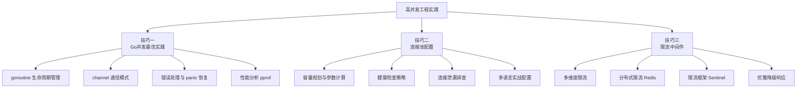
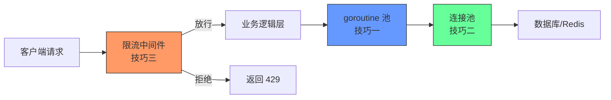

# 核心技巧：从理论到工程实践

经过前面理论基础部分的学习，我们已经掌握了并发模型、限流算法、熔断降级、无锁数据结构和热点数据处理等核心概念。但理解原理和在生产环境稳定运行之间，往往隔着巨大的鸿沟——这就是本节要填补的空白。

**核心技巧**是高并发系统中经过大规模生产验证的工程实践方法论。它们不是某个特定框架的使用手册，而是跨越语言和框架的通用最佳实践，直接回答了"知道原理之后，我该怎么写代码、怎么配参数、怎么上线"这三个问题。

---

## 为什么需要这一节

很多团队在搭建高并发系统时面临同样的困境：

| 阶段 | 典型问题 | 后果 |
|------|---------|------|
| 设计阶段 | 知道要用连接池，但不知道参数怎么算 | maxActive 设太小→排队；设太大→打爆数据库 |
| 开发阶段 | 知道要用 goroutine，但不知道怎么避免泄漏 | goroutine 堆积→内存溢出→OOM Kill |
| 上线阶段 | 知道要限流，但不知道选哪种算法、怎么配 | 限流粒度太粗→误伤正常流量；太细→防不住攻击 |
| 运行阶段 | 知道要监控，但不知道监控什么、告警什么 | 故障发生时毫无头绪，只能翻日志人肉排查 |

本节的三个技巧正好覆盖这四个阶段的核心痛点，形成从代码编写到运行保障的完整闭环。

---

## 三大核心技巧总览

---

## 技巧一：Go 并发最佳实践

Go 语言因其原生的 goroutine 和 channel 机制，成为高并发服务端开发的首选语言之一。但"能用"和"用好"之间差距巨大——goroutine 泄漏、channel 死锁、panic 蔓延等问题在生产环境中屡见不鲜。

**本节聚焦四个实战主题：**

**1. goroutine 生命周期管理**

goroutine 创建成本极低（初始仅 2KB 栈），这既是优势也是陷阱。一个请求泄漏一个 goroutine，10,000 QPS 在 10 分钟内就能堆积 600 万个 goroutine，吃掉数 GB 内存。本节给出 `errgroup`、`context.WithCancel`、`WaitGroup` 三种标准管理范式，以及 goroutine 泄漏的检测工具 `runtime.NumGoroutine()` 和 `goleak`。

**2. channel 通信模式选择**

Go 社区有句名言："不要通过共享内存来通信，而要通过通信来共享内存。"但 channel 用错了比 mutex 更危险——无缓冲 channel 死锁、关闭已关闭的 channel panic、向已关闭的 channel 发送数据 panic。本节系统梳理了 fan-in/fan-out、pipeline、worker pool、timeout 控制四种常用模式的正确写法。

**3. 错误处理与 panic 恢复**

Go 的错误处理与异常机制（recover）在并发场景下有独特挑战。一个 goroutine 中未处理的 panic 会导致整个进程崩溃，而不是仅影响当前请求。本节给出 HTTP server、background worker、pipeline 三种场景的标准 panic 恢复模板。

**4. 性能分析与调优**

高并发系统的性能瓶颈往往不在于算法复杂度，而在于锁竞争、内存分配和 GC 压力。`go tool pprof` 和 `go tool trace` 是定位这些问题的利器，但很多开发者不会用或用不对。本节给出 CPU profile、memory profile、mutex profile、goroutine profile 四种分析场景的完整操作步骤。

| 子主题 | 解决的问题 | 核心产出 |
|--------|-----------|---------|
| goroutine 管理 | goroutine 泄漏导致 OOM | 标准化生命周期管理模板 |
| channel 模式 | 死锁、panic、数据竞争 | 四种通信模式的正确写法 |
| 错误处理 | panic 蔓延导致进程崩溃 | 各场景的恢复模板 |
| 性能分析 | 瓶颈定位困难 | pprof 实操指南 |

> **适合谁读**：使用 Go 构建高并发服务的后端工程师，特别是从 Java/Python 转 Go 的开发者，以及需要优化线上 Go 服务性能的运维/SRE 团队。

---

## 技巧二：连接池配置

连接池是高并发系统中最高频使用的基础设施组件——每个数据库查询、每次 Redis 操作、每个 HTTP 下游调用都依赖连接池。但连接池的参数配置是一门精确的工程科学，拍脑袋设值几乎必然在生产中出问题。

**本节从五个层面系统覆盖连接池知识：**

**1. 为什么需要连接池——从 TCP 连接的代价说起**

用具体数据解释连接池的必要性：一次 TCP 三次握手在公网环境下需要 60-300ms，加上 TLS 握手需要 50-200ms，10,000 QPS 仅连接建立就要消耗 3-300 秒的累计延迟。更重要的是内核资源分配——每个 TCP 连接需要约 1KB socket 结构体、174KB 收发缓冲区、1 个文件描述符。这些硬约束使得"每次请求新建连接"在高并发场景下完全不可行。

**2. 连接池工作原理与状态机**

连接池有 6 个核心状态（初始化→空闲→借出→使用中→归还→销毁），每个状态转换都涉及特定的资源管理和错误处理逻辑。理解这个状态机是排查连接池问题的基础。

**3. 核心参数的精确计算**

连接池参数不是"经验值"，而是可以精确计算的：

maxActive = (目标QPS × 平均查询耗时秒数) × 安全系数(1.5-2.0)

示例：
  目标 QPS = 5000
  平均查询耗时 = 10ms = 0.01s
  安全系数 = 1.5
  maxActive = (5000 × 0.01) × 1.5 = 75，建议设为 80-100

本节对容量参数、超时参数、健康检查参数、连接回收参数四大类共 15+ 个参数逐一给出含义、典型值和调优指南，并给出参数间的约束关系（如 `idleTimeout < maxLifetime < 数据库 wait_timeout`）。

**4. 各语言生产级配置模板**

本节提供 Python（DBUtils + PyMySQL / aiomysql）、Go（database/sql）、Java（HikariCP）三种语言的完整配置示例，每个示例都带有逐行注释和生产环境验证。特别值得关注的是：

- **HikariCP 的性能秘密**：字节码优化的 FastList、无锁 ConcurrentBag、极简代码路径，解释了为什么它比 Apache DBCP2 快 3-5 倍
- **Go 连接池的惰性创建**：与 Java 不同，Go 的 `database/sql` 连接池是惰性创建的，启动时不会建立连接，第一个请求需要承受新建延迟
- **aiomysql 异步连接池**：在 asyncio 架构下的连接池管理方式与同步模式有本质区别

**5. 连接泄漏：隐形杀手的完整排查手册**

连接泄漏是生产环境中最常见的连接池故障，但也是最难排查的。本节列出 5 种典型泄漏原因（异常路径未归还、循环中重复借出、事务未提交、闭包捕获引用、线程池中忘记关闭），每种都给出错误示范和正确示范的代码对比，并提供 HikariCP 的 `leakDetectionThreshold` 和 pprof 堆分析两种检测手段。

> **适合谁读**：所有使用数据库/Redis/HTTP 连接池的后端工程师。特别是面对"连接池耗尽"、"获取连接超时"、"连接泄漏"等生产故障时，这一节提供从原理到排查的完整路径。

---

## 技巧三：限流中间件

限流算法（固定窗口、滑动窗口、漏桶、令牌桶）在理论基础部分已经讲透。但在生产系统中，裸算法远远不够——你需要的是一个完整的限流中间件：它能按 IP/用户/接口多维组合限流，能在多实例间共享计数，能在自身故障时优雅降级，还能实时上报限流命中率。

**本节从六个层面构建限流中间件知识体系：**

**1. 限流中间件 vs 裸限流算法**

本节首先澄清一个常见认知偏差：很多人以为会写 `LeakyBucket` 类就等于会限流。但生产环境的限流需要解决额外五个问题——多算法支持、多维度限流、分布式一致性、优雅降级、实时可观测。

**2. 中间件架构设计**

给出一个完整的限流中间件架构图：规则引擎→计数器存储→判定逻辑→响应处理器→指标收集器，解释每个组件的职责和选型依据。

**3. Python 从零构建**

以 Flask 为例，从装饰器版本到 `before_request` 全局中间件版本，逐步演进。核心亮点是 `MultiDimensionRateLimiter`——支持按 IP（200次/分钟）、用户（500次/分钟）、接口（50次/秒）三个维度同时限流，任一维度超限即拒绝。

**4. Go 高性能版本**

基于 Gin 框架的生产级实现，包含固定窗口和令牌桶两种算法。Go 版本相比 Python 版本在并发性能上有数量级优势，适合高 QPS 场景。

**5. 分布式限流（Redis + Lua）**

多实例部署时限流计数必须共享。本节给出基于 Redis Sorted Set + Lua 脚本的滑动窗口分布式限流实现，Lua 脚本保证原子性，避免竞态条件。关键设计点包括：用时间戳作为 score 实现窗口滑动、`EXPIRE` 防止 key 堆积、`ZREMRANGEBYSCORE` 清理过期记录。

**6. 生产级限流框架选型**

对比 Spring Cloud Gateway 内置限流、Sentinel（阿里开源）、Resilience4j、Kong Gateway Rate Limiting 四种方案的架构差异、适用场景和运维成本。

| 框架 | 核心算法 | 分布式支持 | 动态配置 | 适合场景 |
|------|---------|-----------|---------|---------|
| Gateway 内置 | 令牌桶 | Redis | 需重启 | Spring Cloud 微服务 |
| Sentinel | 滑动窗口 | Redis/Nacos | 热更新 | 大规模分布式系统 |
| Resilience4j | 令牌桶/滑动窗口 | 需自研 | 热更新 | 轻量级微服务 |
| Kong | 多种 | 集群共享 | Admin API | API 网关 |

> **适合谁读**：API 网关开发者、微服务架构师、需要实现接口限流的后端工程师。特别是正在选型限流方案或需要从零构建限流系统的团队。

---

## 三大技巧的协同关系

这三个技巧并非独立存在，而是在高并发系统中协同工作：

一个请求的典型生命周期：

1. **限流中间件**（技巧三）首先拦截：判断该请求是否在允许的频率内，超出则直接返回 429，不进入下游
2. **goroutine/线程池**（技巧一）负责并发调度：将通过限流的请求分配到合适的执行单元，确保资源隔离和背压控制
3. **连接池**（技巧二）负责资源复用：业务逻辑通过连接池访问数据库和缓存，避免反复建立/销毁连接的开销

三层防线缺一不可：没有限流，突发流量会打穿连接池；没有连接池，每个请求新建连接会导致数据库连接数爆炸；没有合理的并发管理，goroutine 堆积会耗尽内存。

---

## 阅读建议

**如果你是 Go 开发者**，建议先读技巧一，掌握 goroutine 管理的最佳实践，然后根据需要深入技巧二或技巧三。

**如果你正在排查连接池问题**，直接跳到技巧二的 2.5 节"连接泄漏排查手册"，那里有 5 种典型泄漏的诊断方法和修复模板。

**如果你正在设计限流方案**，从技巧三的 3.1 节开始，先理解限流中间件与裸算法的区别，再根据你的技术栈选择 Python/Go/Redis 实现方案。

**如果你是架构师**，建议通读三大技巧，重点关注它们的协同关系和参数之间的约束，确保系统的每一层保护机制都正确配置。
