## 一、并发模型总览

### 1.1 为什么需要并发模型

现代服务器面临的第一个根本矛盾是：**CPU速度远快于I/O速度**。一次SSD随机读取约10微秒，一次跨机房网络往返约50-200毫秒，而一次CPU L1缓存命中仅需约1纳秒。换句话说，一次网络请求的时间里，CPU可以执行约1亿条指令。如果程序在等待I/O时空转CPU，那是极大的资源浪费。

更深层的背景是：**摩尔定律的终结与多核时代的到来**。2005年之后，CPU主频几乎不再提升，性能增长转向多核并行。单核时代"写顺序代码就够了"的假设被彻底打破——想利用现代硬件的全部能力，必须写并发代码。

并发模型本质上回答一个问题：**当一个任务在等待时，如何让CPU去做别的事？**

不同并发模型给出了不同答案，它们在**编程复杂度、执行效率、资源消耗、可扩展性**四个维度上各有取舍：

| 维度 | 简单模型（线程） | 复杂模型（Actor/CSP） |
|------|----------------|---------------------|
| 编程复杂度 | 低（顺序思维） | 高（消息传递思维） |
| 执行效率 | 中等（上下文切换开销） | 高（轻量调度） |
| 资源消耗 | 高（线程栈内存） | 低（协程/进程轻量） |
| 可扩展性 | 千-万级瓶颈 | 百万级可扩展 |

理解这些模型的优劣，是设计高并发系统的起点。在后续章节中，我们会将这些模型具体应用到限流算法（第36-02章）、熔断降级（第36-03章）、无锁数据结构（第36-04章）等工程实践中。

### 1.2 五大经典并发模型

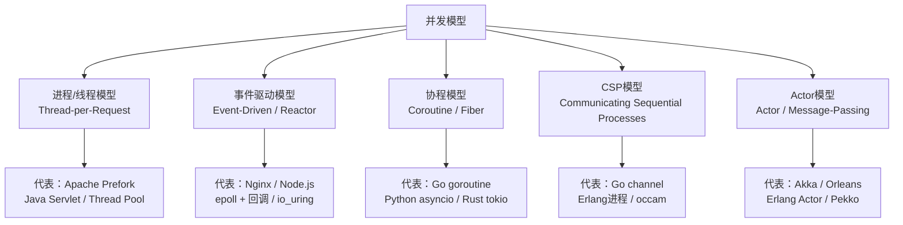

| 模型 | 核心思想 | 编程范式 | 代表语言/框架 | 并发上限 | 内存/连接 |
|------|---------|---------|-------------|---------|----------|
| 进程/线程模型 | OS调度，共享内存 | 命令式+锁 | Java/C++/Python | 千-万级 | 1-8MB/线程 |
| 事件驱动模型 | 单线程事件循环+回调 | 回调/异步 | Nginx/Node.js/Libevent | 百万级 | ~1KB/连接 |
| 协程模型 | 用户态调度，轻量级 | async/await | Go/Python/Rust/Kotlin | 十万-百万级 | 2KB+/协程 |
| CSP模型 | 通道通信，不共享内存 | 顺序进程+Channel | Go/Erlang/occam | 百万级 | ~2KB/进程 |
| Actor模型 | 消息传递，位置透明 | 消息驱动 | Akka/Erlang/Orleans | 分布式百万级 | ~2KB/Actor |

### 1.3 并发模型的历史脉络

理解并发模型的演进脉络，有助于把握每种模型解决的核心问题：

1960s  多进程（进程隔离，开销大）
  ↓
1970s  CSP论文发表（Tony Hoare, 1978）
  ↓
1980s  线程概念提出（轻量进程，共享地址空间）
  ↓
1990s  Actor模型（Carl Hewitt）、线程池模式
  ↓       事件驱动模型兴起（Tcl/Tk事件循环）
2000s  epoll/kqueue成熟，Reactor模式工业化
  ↓       Erlang/OTP在电信领域验证Actor模型
2010s  Go goroutine+channel（CSP的现代实现）
  ↓       Node.js推动事件驱动普及
  ↓       async/await成为语言标准（JS/Python/Kotlin/Rust）
2020s  io_uring（Linux异步I/O革命）
  ↓       结构化并发（Structured Concurrency）
  ↓       Rust tokio成为高性能异步标杆

---

## 二、进程/线程模型（Thread-per-Request）

### 2.1 基本原理

最直观的并发方式：为每个请求分配一个独立的执行流（进程或线程）。操作系统通过时间片轮转实现"伪并行"——多个线程轮流使用CPU，宏观上看起来是同时执行的。

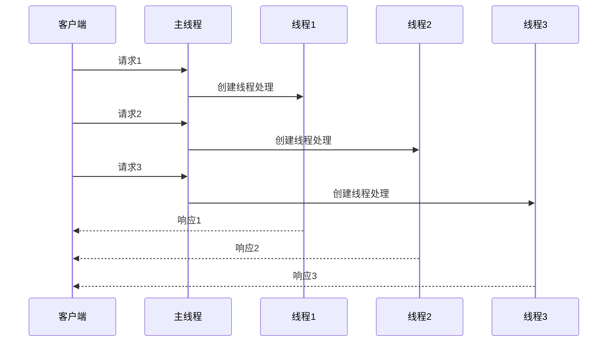

**进程 vs 线程的本质区别：**

| 特性 | 进程 | 线程 |
|------|------|------|
| 地址空间 | 独立（需IPC通信） | 共享（直接访问） |
| 创建开销 | 重（fork需复制页表） | 轻（仅分配栈） |
| 上下文切换 | 1-10ms（切换页表+TLB刷新） | 1-10μs（仅切换寄存器） |
| 故障隔离 | 好（一个崩溃不影响其他） | 差（一个崩溃全部终止） |
| 典型用途 | Nginx worker进程、数据库进程 | Tomcat请求线程、计算线程池 |

### 2.2 线程池：避免无限制创建

直接为每个请求创建线程的开销极大：创建/销毁线程约需0.5-1毫秒，每个线程栈默认占用1-8MB内存。1万个并发连接直接创建1万个线程，仅栈空间就需10-80GB内存，这显然不可接受。线程池通过**预创建固定数量的线程并复用**来解决这个问题。

```python
from concurrent.futures import ThreadPoolExecutor, as_completed
import time
import urllib.request

def fetch_url(url):
    """模拟HTTP请求"""
    with urllib.request.urlopen(url, timeout=5) as resp:
        return resp.read()

# 线程池配置：核心线程数=CPU核数*2，最大线程数=100
# 对于I/O密集型任务，线程数可以远大于CPU核数
with ThreadPoolExecutor(max_workers=100, thread_name_prefix="worker") as pool:
    url_list = [f"https://httpbin.org/delay/{i%3}" for i in range(200)]

    # 提交200个任务
    futures = {
        pool.submit(fetch_url, url): url
        for url in url_list
    }

    # 实时处理结果（不要用 f.result() 阻塞全部）
    for future in as_completed(futures):
        url = futures[future]
        try:
            result = future.result(timeout=5)  # 设置超时防止永久阻塞
            print(f"[OK] {url}: {len(result)} bytes")
        except TimeoutError:
            print(f"[TIMEOUT] {url}: 超过5秒")
        except Exception as e:
            print(f"[ERROR] {url}: {e}")
```

**线程池参数调优公式：**

```python
# 经验公式（仅供参考，需结合实际压测调整）

# CPU密集型任务
CPU_THREADS = CPU_CORES + 1    # +1 补偿偶尔的页缺失或GC暂停

# I/O密集型任务（网络请求、数据库查询等）
IO_THREADS = CPU_CORES * (1 + W/C)
# W = 平均等待时间（I/O操作）
# C = 平均计算时间（CPU操作）
# 例：每次请求CPU计算10ms，网络等待90ms → IO_THREADS = 核数 * (1 + 90/10) = 核数 * 10

# 混合型任务
MIXED_THREADS = int(CPU_CORES * (1 + W/C))
# 一般取 IO_THREADS 和 CPU_THREADS 之间的值，通过压测确定最优

# 实际案例（8核服务器，处理HTTP API请求）：
# 单次请求平均CPU时间 5ms，数据库等待 45ms
# IO_THREADS = 8 * (1 + 45/5) = 8 * 10 = 80
# 最终设置 max_workers=80，压测验证后可能调整为 64-100
```

**线程池拒绝策略：**

当线程池满且队列满时，新任务如何处理是关键设计决策：

| 策略 | 行为 | 适用场景 |
|------|------|---------|
| AbortPolicy | 抛出RejectedExecutionException | 快速失败，让调用方处理 |
| CallerRunsPolicy | 由提交任务的线程自己执行 | 降速但不丢任务 |
| DiscardPolicy | 静默丢弃 | 允许丢弃的非关键任务 |
| DiscardOldestPolicy | 丢弃队列最老的任务 | 实时性要求高的场景（如推送最新状态） |

```java
// Java ThreadPoolExecutor拒绝策略配置
ThreadPoolExecutor executor = new ThreadPoolExecutor(
    10,                          // corePoolSize
    50,                          // maximumPoolSize
    60, TimeUnit.SECONDS,        // keepAliveTime
    new ArrayBlockingQueue<>(200), // 有界队列（200个任务容量）
    new ThreadPoolExecutor.CallerRunsPolicy()  // 队列满时由调用线程执行
);
```

### 2.3 线程模型的变体

**1. 每请求一线程（Thread-per-Request）**

Apache httpd的prefork模式就是典型：主进程接收连接，fork子进程处理请求。每个进程独立，内存隔离好，但资源消耗大。

```java
// Java Servlet容器早期模型
ServerSocket server = new ServerSocket(8080);
while (true) {
    Socket socket = server.accept();  // 阻塞等待连接
    new Thread(() -> handle(socket)).start();  // 每连接一线程
}
```

**2. 工作线程池（Worker Pool）**

现代Java Servlet容器（Tomcat）采用的方式：固定数量的工作线程从共享队列中取任务执行。

```xml
<!-- Tomcat线程池配置（server.xml） -->
<Executor name="tomcatThreadPool"
    namePrefix="catalina-exec-"
    maxThreads="200"        <!-- 最大工作线程 -->
    minSpareThreads="25"    <!-- 最小空闲线程 -->
    maxQueueSize="100"      <!-- 等待队列容量 -->
    maxIdleTime="60000"     <!-- 空闲超时(ms) -->
/>
```

**3. 有界队列 vs 无界队列**

有界队列是背压机制的一种体现——当线程池满且队列满时，新的任务被拒绝，迫使调用方减速。无界队列则会无限堆积任务，最终耗尽内存。

```java
// 有界队列（推荐）：触发拒绝策略，保护系统
new ArrayBlockingQueue<>(1000);

// 无界队列（危险）：任务无限堆积，OOM风险
new LinkedBlockingQueue<>();  // 默认 Integer.MAX_VALUE
```

**4. 工作窃取（Work-Stealing）**

当多个线程池各自维护独立队列时，空闲线程可以从其他繁忙线程的队列中"窃取"任务，避免忙闲不均：

```java
// Java ForkJoinPool —— 工作窃取的工业实现
ForkJoinPool pool = new ForkJoinPool(
    Runtime.getRuntime().availableProcessors()  // 并行度=CPU核数
);

// 适合递归分治任务：排序、矩阵计算、树遍历
long result = pool.invoke(new RecursiveTask<Long>() {
    @Override
    protected Long compute() {
        if (size <= THRESHOLD) {
            return computeDirectly();  // 小任务直接算
        }
        // 分裂成子任务
        LeftTask left = new LeftTask(data, mid);
        RightTask right = new RightTask(data, mid);
        left.fork();  // 异步执行左半部分
        long r = right.compute();  // 右半部分当前线程执行
        long l = left.join();  // 等待左半部分
        return l + r;
    }
});
```

### 2.4 线程安全：绕不过的难题

使用线程模型就绕不开并发安全问题。三大经典问题：

**1. 竞态条件（Race Condition）**

```python
# 错误示例：非原子操作导致计数丢失
counter = 0

def increment():
    global counter
    # 读-改-写 三步操作不是原子的
    temp = counter    # 线程A读取 counter=10
    # ---- 此时线程B也读取 counter=10 ----
    counter = temp + 1  # 线程A写入11
    # ---- 线程B也写入11（丢失了A的修改）----
    counter = temp + 1  # 线程B写入11，应该写12

# 正确示例：使用锁保护临界区
import threading
lock = threading.Lock()
counter = 0

def safe_increment():
    global counter
    with lock:  # 互斥锁保证原子性
        counter += 1
```

**2. 死锁（Deadlock）**

四个必要条件：互斥、持有并等待、不可抢占、循环等待。最经典的场景是两个线程各持有一把锁，同时等待对方释放：

```java
// 死锁示例：两个线程以不同顺序获取锁
// 线程1: lock(A) → lock(B)
// 线程2: lock(B) → lock(A)  ← 如果线程2先拿到B，就死锁了

// 解决方案：统一加锁顺序
// 所有线程都按 A → B 的顺序获取锁，消除循环等待
```

**3. 线程饥饿（Starvation）**

高优先级线程持续占用CPU，低优先级线程永远得不到执行机会。解决方案：公平锁（按请求顺序分配锁）。

### 2.5 适用场景与局限

**优势：**
- 编程模型简单直观，符合人类的顺序思维
- 共享内存通信效率极高（无需序列化，直接指针操作）
- 调试工具成熟（jstack线程dump、gdb、IDE调试器）
- 适合CPU密集型计算（如科学计算、图像处理、加密解密）

**局限：**
- 线程切换开销：每次上下文切换约1-10微秒，万级线程时切换开销占CPU 30%+
- 内存开销：每个线程栈1-8MB，1000个线程就需1-8GB
- 锁竞争：多线程共享数据时需要锁，锁竞争是性能杀手
- 编程复杂度：死锁、竞态条件、内存可见性问题难以调试
- NUMA架构影响：跨NUMA节点访问内存延迟增加3-5倍，线程绑定CPU核心可缓解

线程数 vs 系统吞吐量的关系（示意）：

吞吐量
  ▲
  │         ┌─── 最优点
  │        ╱╲
  │       ╱  ╲
  │      ╱    ╲ ← 线程切换开销开始主导
  │     ╱      ╲
  │    ╱        ╲  ← 资源耗尽，吞吐骤降（上下文切换+锁竞争+内存不足）
  │   ╱          ╲
  │──╱            ╲───→ 线程数
  │

> **关键结论**：线程池模型在万级以下并发时是最佳选择——它简单、调试方便、生态成熟。超过万级后，事件驱动模型和协程模型的优势开始显现。后续的限流算法（第36-02章）和连接池配置（第36-核心技巧-02章）都是在这一模型基础上的工程优化。

---

## 三、事件驱动模型（Event-Driven / Reactor）

### 3.1 核心思想

事件驱动模型用**少量线程（甚至单线程）处理大量并发连接**。核心思想是：线程不阻塞在I/O上，而是注册回调函数，当I/O就绪时由事件循环（Event Loop）触发回调。

这就像餐厅的服务员不用在每个桌边等客人点菜，而是巡视所有桌子，哪桌举手就去哪桌服务。

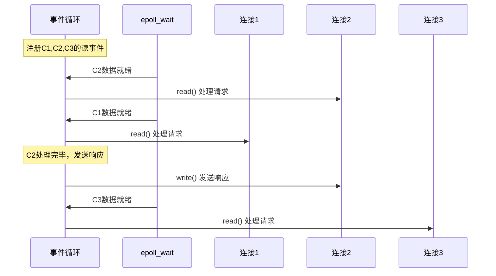

**I/O多路复用技术演进：**

| 技术 | 内核版本 | 机制 | 性能 | 适用系统 |
|------|---------|------|------|---------|
| select | 1983 | 遍历全部fd，O(n) | 低（最多1024fd） | 所有Unix |
| poll | 1997 | 链表遍历，O(n) | 中 | 所有Unix |
| epoll | 2.6+ (2002) | 红黑树+就绪链表，O(1) | 高 | Linux |
| kqueue | 4.4+ (2000) | 类似epoll | 高 | BSD/macOS |
| **io_uring** | 5.1+ (2019) | 共享内存环形缓冲区 | **极高** | Linux 5.1+ |

**io_uring：事件驱动的下一次革命**

Linux 5.1引入的io_uring彻底改变了异步I/O的性能格局。它通过**共享内存中的环形缓冲区（SQ/CQ）**实现用户态与内核态的零系统调用通信：

传统epoll流程：
  用户态 → epoll_wait() 系统调用 → 内核返回就绪事件
  用户态 → read() 系统调用 → 内核读取数据 → 返回用户态
  每次操作至少2次系统调用（上下文切换开销）

io_uring流程：
  用户态 → 写入SQE（提交队列项）到共享内存
  内核态 → 异步处理，结果写入CQE（完成队列项）
  用户态 → 轮询CQE获取结果
  可以完全零系统调用（通过IOPOLL模式）

```python
# io_uring在Python中使用（通过io_uring库）
# pip install io-uring
import io_uring

ring = io_uring.setup(entries=256)  # 创建256个槽位的环形缓冲区

# 提交异步读取请求（不阻塞当前线程）
sqe = ring.get_sqe()
io_uring.prep_read(sqe, fd, buffer, offset=0)

# 批量提交+批量收割
io_uring.submit(ring)
cqe = ring.wait_cqe()  # 等待至少一个完成事件
```

io_uring相比epoll的优势：
- **零系统调用开销**：批量提交/收割，减少用户态↔内核态切换
- **支持文件I/O**：epoll仅支持socket，io_uring统一了文件和网络I/O
- **IOPOLL模式**：内核主动轮询完成队列，延迟低至微秒级
- **链式操作**：一个提交可以触发一系列后续操作（如：读文件→处理→写结果）

### 3.2 Reactor模式详解

Reactor模式是事件驱动模型的工业级实现，广泛用于Nginx、Netty、Redis等高性能组件。

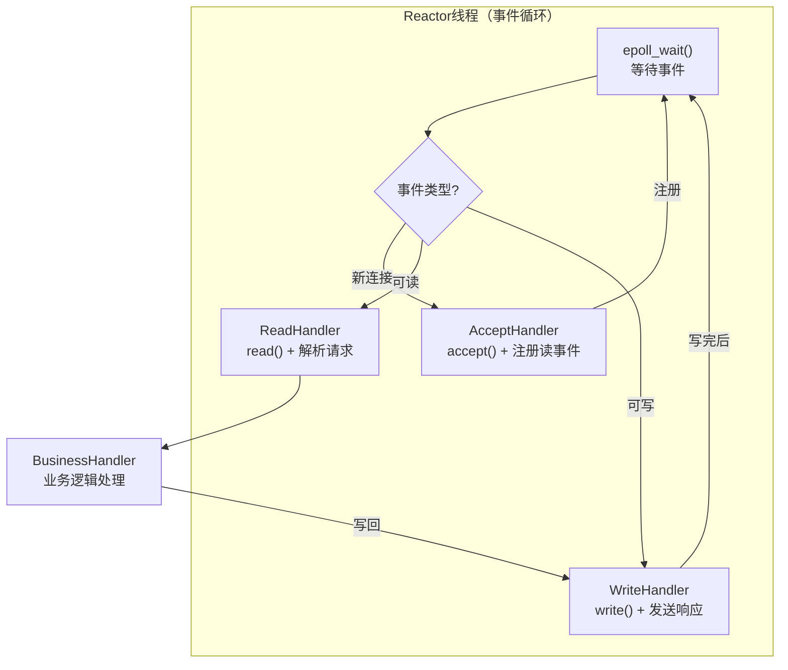

**Reactor模式的三种变体：**

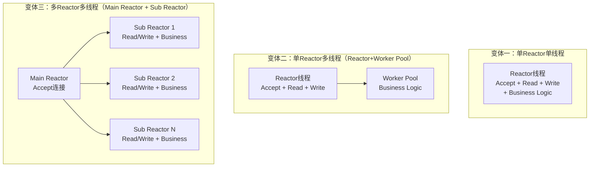

| 变体 | 线程模型 | 代表实现 | 适用场景 | 局限 |
|------|---------|---------|---------|------|
| 单Reactor单线程 | 1个线程处理所有事 | Redis 6.0之前 | 轻量级、CPU密集型低延迟操作 | 单个慢请求阻塞所有连接 |
| 单Reactor+Worker Pool | 1个Reactor+N个Worker | Nginx、Redis 6.0+ | 通用Web服务器、代理服务器 | Reactor线程可能成为瓶颈 |
| 多Reactor+线程池 | M个Reactor+N个Worker | Netty、Muduo、Nginx(多worker) | 高并发IM、游戏服务器、RPC框架 | 实现复杂度最高 |

### 3.3 Proactor模式：异步I/O的终极形态

除了Reactor（同步I/O就绪通知），还有**Proactor模式**（异步I/O完成通知）。两者的核心区别：

Reactor模式（同步）：
  1. 内核通知"数据就绪了"（就绪通知）
  2. 用户程序自己执行read()读取数据（可能阻塞）
  3. 读取完成后处理业务逻辑

Proactor模式（异步）：
  1. 用户程序提交异步读取请求（立即返回）
  2. 内核在数据读取完毕后通知用户（完成通知）
  3. 用户直接处理已就绪的数据

| 对比 | Reactor | Proactor |
|------|---------|----------|
| I/O方式 | 同步I/O（select/epoll） | 异步I/O（io_uring/AIO） |
| 通知时机 | I/O就绪时 | I/O完成时 |
| 编程复杂度 | 中等 | 较高 |
| 性能 | 好 | 更好（减少一次系统调用） |
| 代表实现 | Nginx、Redis | Windows IOCP、io_uring |

### 3.4 代码示例：Python单线程Reactor

```python
import selectors
import socket

sel = selectors.DefaultSelector()  # Linux自动选epoll，macOS选kqueue

def accept(sock, mask):
    """接受新连接，注册读事件"""
    conn, addr = sock.accept()
    print(f"accepted: {addr}")
    conn.setblocking(False)  # 关键：必须设置非阻塞
    sel.register(conn, selectors.EVENT_READ, read)

def read(conn, mask):
    """处理读事件：读取数据并回显"""
    data = conn.recv(1024)
    if data:
        print(f"received: {data}")
        conn.send(data)  # echo back
    else:
        print(f"closing: {conn.getpeername()}")
        sel.unregister(conn)
        conn.close()

# 创建监听socket
server = socket.socket(socket.AF_INET, socket.SOCK_STREAM)
server.setsockopt(socket.SOL_SOCKET, socket.SO_REUSEADDR, 1)
server.bind(('0.0.0.0', 8080))
server.listen(100)
server.setblocking(False)
sel.register(server, selectors.EVENT_READ, accept)

print("Server running on :8080")
while True:
    events = sel.select(timeout=1)  # 阻塞等待事件，最多等1秒
    for key, mask in events:
        callback = key.data  # 获取注册的回调函数
        callback(key.fileobj, mask)
```

### 3.5 回调地狱与解决方案

事件驱动模型的最大痛点是**回调嵌套**（Callback Hell），多层异步操作嵌套后代码可读性急剧下降：

```javascript
// 回调地狱示例
getUser(userId, function(user) {
    getOrders(user.id, function(orders) {
        getOrderDetail(orders[0].id, function(detail) {
            getProduct(detail.productId, function(product) {
                console.log(product.name);  // 四层嵌套，可读性极差
            });
        });
    });
});
```

```javascript
// Promise改造：线性可读
async function getProductForUser(userId) {
    const user = await getUser(userId);           // 第1步
    const orders = await getOrders(user.id);      // 第2步
    const detail = await getOrderDetail(orders[0].id);  // 第3步
    const product = await getProduct(detail.productId);  // 第4步
    return product.name;  // 一目了然的数据流
}

// 并行控制：Promise.all / Promise.race
const [users, posts, comments] = await Promise.all([
    fetchUsers(),      // 同时发起3个请求
    fetchPosts(),      // 总耗时 = max(三个请求的耗时)
    fetchComments(),
]);

// 超时控制：Promise.race
const result = await Promise.race([
    fetchData(),
    new Promise((_, reject) => setTimeout(() => reject(new Error('timeout')), 3000))
]);
```

### 3.6 事件驱动的适用场景

**最佳场景：**
- I/O密集型服务（Web服务器、API网关、代理）
- 需要维持大量长连接（IM、WebSocket、游戏）
- 请求处理时间短且均匀（不适合有慢查询的场景）

**不适用场景：**
- CPU密集型计算（单线程事件循环会被阻塞，如Nginx处理Lua脚本的CPU计算）
- 请求处理时间差异极大（一个慢请求拖累所有连接）
- 需要同步共享状态的业务（事件回调中共享状态很复杂）

> **Nginx如何处理慢请求？** Nginx采用"异步非阻塞"策略：如果后端响应慢，Nginx不会阻塞等待，而是将请求转发给上游服务器后立即释放连接，等上游响应到达时再回调处理。这就是为什么Nginx单实例可以处理数万并发连接。

---

## 四、协程模型（Coroutine）

### 4.1 核心思想

协程是**用户态的轻量级线程**，由运行时（而非操作系统）调度。协程之间的切换不需要内核参与，开销比线程切换低1-2个数量级。

**关键区别：线程由OS调度（抢占式），协程由用户代码调度（协作式）。**

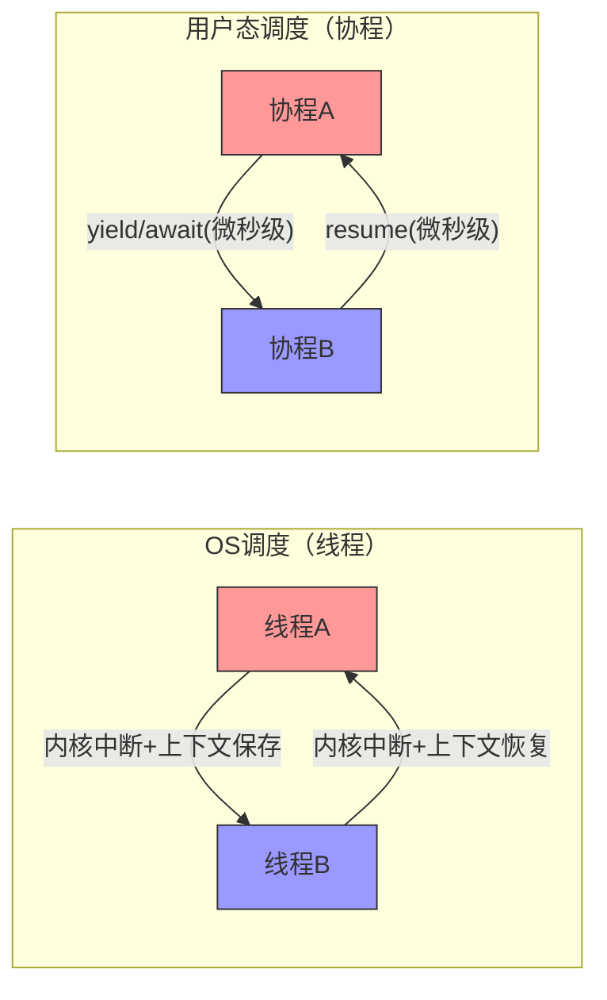

### 4.2 核心优势：数据说话

**1. 极低的切换开销**

| 切换类型 | 开销 | 原因 | 量化类比 |
|---------|------|------|---------|
| 进程切换 | 1-10ms | 需要切换页表、刷新TLB | 翻一本书 |
| 线程切换 | 1-10μs | 需要陷入内核，保存/恢复寄存器 | 翻一页 |
| 协程切换 | 0.1-1μs | 纯用户态操作，无内核参与 | 翻一行字 |

**2. 极低的内存占用**

| 类型 | 内存占用 | 原因 | 万级并发所需内存 |
|------|---------|------|----------------|
| OS线程 | 1-8MB（栈空间） | 内核预分配固定大小栈 | 10-80GB |
| Go goroutine | 2KB起（可动态增长） | 用户态分配，按需增长 | 20MB |
| Python协程 | ~1KB | 仅保存栈帧信息 | 10MB |
| Rust Future | 几十~几百字节 | 编译器零成本抽象 | <1MB |

**3. 编程模型友好**

async/await语法让异步代码看起来像同步代码，解决了回调地狱问题：

```python
import asyncio
import aiohttp

async def fetch_page(session, url):
    """单个页面请求"""
    async with session.get(url) as resp:
        return await resp.text()

async def main():
    """并发请求多个URL"""
    urls = [
        "https://api.example.com/users",
        "https://api.example.com/posts",
        "https://api.example.com/comments",
    ]

    async with aiohttp.ClientSession() as session:
        # 并发执行，总耗时约等于最慢的那个请求
        tasks = [fetch_page(session, url) for url in urls]
        results = await asyncio.gather(*tasks)

    for url, result in zip(urls, results):
        print(f"{url}: {len(result)} chars")

asyncio.run(main())
```

### 4.3 有栈协程 vs 无栈协程

这是协程模型中一个容易被忽略但至关重要的区别：

有栈协程（Stackful Coroutine）：
  - 每个协程有独立的调用栈（类似线程）
  - 可以在任意函数调用深处挂起/恢复
  - 内存开销较大（每个协程10KB-1MB）
  - 代表：Go goroutine、Kotlin协程、Lua协程

无栈协程（Stackless Coroutine）：
  - 编译器将async函数转换为状态机
  - 只能在await点挂起
  - 内存开销极小（每个Future仅几十~几百字节）
  - 代表：Python asyncio、Rust Future、JavaScript Promise

| 特性 | 有栈协程 | 无栈协程 |
|------|---------|---------|
| 挂起点 | 任意位置 | 仅在await/yield处 |
| 内存开销 | 10KB-1MB/协程 | 几十~几百字节/Future |
| 编译要求 | 无特殊要求 | 编译器需要转换为状态机 |
| 可移植性 | 需要汇编支持栈切换 | 纯语言层面实现 |
| 性能上限 | 中等 | 极高（零成本抽象） |

**Go为什么选择有栈协程？** Go的设计哲学是"简单性优先"。有栈协程可以自动在任意调用深度挂起（比如网络库内部的read调用），开发者完全不需要标记async函数。代价是每个goroutine至少2KB，但对Go的目标场景（百万级并发网络服务）来说完全可以接受。

**Rust为什么选择无栈协程？** Rust追求零成本抽象。Future编译后直接变成状态机，没有任何运行时开销。代价是async函数中的所有函数都需要标记为async，且需要手动选择运行时（tokio/async-std）。

### 4.4 Go goroutine：最成功的协程实现

Go的goroutine是协程模型的巅峰之作——开发者无需关心调度细节，只需用`go`关键字即可启动轻量级并发单元。

```go
package main

import (
    "fmt"
    "net/http"
    "sync"
    "time"
)

func main() {
    urls := []string{
        "https://api.example.com/users",
        "https://api.example.com/posts",
        "https://api.example.com/comments",
    }

    var wg sync.WaitGroup
    results := make(chan string, len(urls))

    for _, url := range urls {
        wg.Add(1)
        go func(u string) {  // 启动goroutine，开销约2KB
            defer wg.Done()
            start := time.Now()
            resp, err := http.Get(u)
            if err != nil {
                results <- fmt.Sprintf("[ERROR] %s: %v", u, err)
                return
            }
            defer resp.Body.Close()
            results <- fmt.Sprintf("[OK] %s: %d (%v)", u, resp.StatusCode, time.Since(start))
        }(url)
    }

    // 等待所有goroutine完成
    go func() {
        wg.Wait()
        close(results)
    }()

    for r := range results {
        fmt.Println(r)
    }
}
```

**Go调度器的GMP模型：**

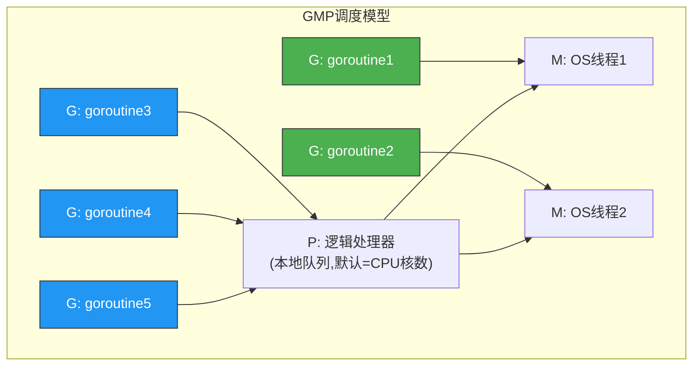

- **G（Goroutine）**：用户态协程，初始栈2KB，可动态增长到1GB
- **P（Processor）**：逻辑处理器，维护本地goroutine队列，默认数量等于CPU核数（GOMAXPROCS）
- **M（Machine）**：OS线程，实际执行goroutine的载体

GMP模型的精妙之处：
1. P的数量固定（等于核数），但P上挂载的G可以任意多
2. 当一个G阻塞在系统调用上时，M会与P解绑，P去找另一个M继续执行队列中的G——这就是Go能做到"阻塞但不卡死"的秘密
3. 工作窃取机制：当一个P的本地队列为空时，它会从其他P的队列或全局队列中窃取G
4. **handoff机制**：G执行系统调用阻塞时，M将P"交接"给空闲M，确保P上的其他G不被阻塞

### 4.5 Rust tokio：无栈协程的工业标杆

Rust的异步生态以tokio为代表，提供了零成本抽象的异步运行时：

```rust
use tokio::net::TcpListener;
use tokio::io::{AsyncReadExt, AsyncWriteExt};

#[tokio::main]  // 宏展开为：创建多线程运行时
async fn main() -> Result<(), Box<dyn std::error::Error>> {
    let listener = TcpListener::bind("0.0.0.0:8080").await?;

    loop {
        let (mut socket, addr) = listener.accept().await?;

        // 每个连接spawn一个独立的Future到运行时
        tokio::spawn(async move {
            let mut buf = [0; 1024];

            loop {
                let n = match socket.read(&amp;mut buf).await {
                    Ok(0) => return,  // 连接关闭
                    Ok(n) => n,
                    Err(_) => return,  // 读取错误
                };

                // 写回数据（echo server）
                if let Err(_) = socket.write_all(&amp;buf[0..n]).await {
                    return;
                }
            }
        });
    }
}
```

**Rust tokio的关键特性：**
- **工作窃取调度器**：多线程运行时自动在工作线程间窃取任务
- **零成本Future**：async代码编译为状态机，无堆分配
- **结构化生命周期**：Rust的所有权系统防止数据竞争（编译期保证）
- **背压控制**：channel有界缓冲区天然实现背压

### 4.6 结构化并发：并发模型的演进方向

传统async/await有一个问题：任务的生命周期不受约束。一个在函数内启动的Task可能在函数返回后继续运行，导致资源泄漏。

**结构化并发（Structured Concurrency）** 要求：**父作用域必须等待所有子任务完成后才能退出**，就像结构化编程中循环/函数的嵌套关系。

```python
# Python 3.11+ TaskGroup（结构化并发）
import asyncio

async def fetch_user(session, user_id):
    await asyncio.sleep(0.1)  # 模拟网络请求
    return {"id": user_id, "name": f"User_{user_id}"}

async def main():
    async with asyncio.TaskGroup() as tg:
        # 所有task在TaskGroup退出时保证完成
        task1 = tg.create_task(fetch_user(session, 1))
        task2 = tg.create_task(fetch_user(session, 2))
        task3 = tg.create_task(fetch_user(session, 3))

    # 到这里，所有task一定已完成
    print(task1.result(), task2.result(), task3.result())
    # 如果任何task抛出异常，TaskGroup会取消其他task并传播异常
```

```kotlin
// Kotlin 结构化并发
suspend fun fetchAllUsers(): List<User> = coroutineScope {
    val user1 = async { fetchUser(1) }
    val user2 = async { fetchUser(2) }
    val user3 = async { fetchUser(3) }
    // coroutineScope退出时，所有async必须完成
    listOf(user1.await(), user2.await(), user3.await())
}
```

### 4.7 Python asyncio的局限与演进

Python的协程受限于GIL（全局解释器锁），同一时刻只有一个线程执行Python字节码，所以asyncio在CPU密集型任务上无法利用多核。

```python
# 正确使用asyncio处理I/O密集型任务
import asyncio
import aiohttp

async def fetch_with_retry(session, url, retries=3):
    """带重试的请求"""
    for attempt in range(retries):
        try:
            async with session.get(url, timeout=aiohttp.ClientTimeout(total=5)) as resp:
                if resp.status == 429:  # 限流
                    await asyncio.sleep(2 ** attempt)  # 指数退避
                    continue
                resp.raise_for_status()
                return await resp.json()
        except (aiohttp.ClientError, asyncio.TimeoutError) as e:
            if attempt == retries - 1:
                raise
            await asyncio.sleep(2 ** attempt)

async def process_batch(urls):
    """批量并发处理，带并发限制"""
    semaphore = asyncio.Semaphore(50)  # 限制同时最多50个请求

    async def limited_fetch(session, url):
        async with semaphore:  # 信号量控制并发度
            return await fetch_with_retry(session, url)

    async with aiohttp.ClientSession() as session:
        tasks = [limited_fetch(session, url) for url in urls]
        return await asyncio.gather(*tasks, return_exceptions=True)

# 解决GIL问题：用多进程+协程
async def cpu_heavy_parallel(data_chunks):
    """CPU密集型任务用ProcessPoolExecutor"""
    loop = asyncio.get_event_loop()
    with ProcessPoolExecutor() as pool:
        tasks = [
            loop.run_in_executor(pool, cpu_intensive_function, chunk)
            for chunk in data_chunks
        ]
        return await asyncio.gather(*tasks)
```

**Python asyncio常见陷阱：**

| 陷阱 | 现象 | 解决方案 |
|------|------|---------|
| 阻塞调用混入async | 整个事件循环卡住 | 用loop.run_in_executor()包装 |
| 协程未await | 产生RuntimeWarning | 始终await或放入TaskGroup |
| 信号量使用不当 | 并发度超预期 | 确保Semaphore在正确的作用域 |
| 异常被吞掉 | gather默认静默异常 | 设置return_exceptions=False |
| 事件循环阻塞 | 所有协程停止响应 | 避免CPU密集操作在async函数中 |

### 4.8 协程模型的适用场景

**最佳场景：**
- I/O密集型的高并发网络服务（Web API、微服务网关）
- 需要大量并发连接但单连接处理逻辑简单（代理、爬虫）
- 异步消息处理（消息队列消费者）

**局限：**
- CPU密集型任务需要结合多进程（Python）或释放GIL（Go/Rust）
- 异步上下文中的错误处理和调试比同步代码困难（堆栈信息不完整）
- 生态库需要async支持（Python的aiohttp vs requests，生态碎片化）
- Python的asyncio没有"结构化并发"（直到3.11 TaskGroup），容易任务泄漏

---

## 五、CSP模型（Communicating Sequential Processes）

### 5.1 核心思想

CSP模型由Tony Hoare于1978年提出，核心原则是：**不要通过共享内存来通信，而要通过通信来共享内存。**

CSP模型中，独立的顺序进程（Process）通过**命名通道（Channel）**进行同步通信。进程之间不共享状态，通过消息传递来协调工作。

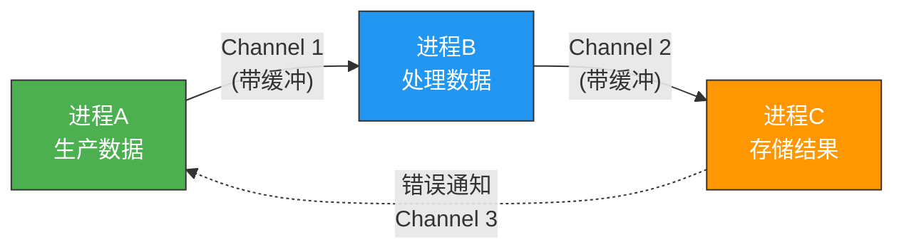

**CSP的核心设计原则：**

| 原则 | 说明 | 反例（共享内存的问题） |
|------|------|---------------------|
| 数据隔离 | 进程不共享任何状态 | 多线程访问共享变量需要锁 |
| 显式通信 | 数据流动通过Channel明确可见 | 共享内存的数据流向隐式 |
| 同步点 | Channel读写天然形成同步点 | 需要显式创建CountDownLatch |
| 背压控制 | 无缓冲Channel天然背压 | 共享队列需要额外机制 |

### 5.2 Go Channel：CSP的工业实现

```go
package main

import (
    "fmt"
    "math/rand"
    "sync"
    "time"
)

// Pipeline模式：数据在管道中流转处理
func generate(nums ...int) <-chan int {
    out := make(chan int)
    go func() {
        for _, n := range nums {
            out <- n
        }
        close(out)  // 生产者关闭channel，通知消费者
    }()
    return out
}

func square(in <-chan int) <-chan int {
    out := make(chan int)
    go func() {
        for n := range in {  // range自动检测channel关闭
            out <- n * n
        }
        close(out)
    }()
    return out
}

func filter(in <-chan int, predicate func(int) bool) <-chan int {
    out := make(chan int)
    go func() {
        for n := range in {
            if predicate(n) {
                out <- n
            }
        }
        close(out)
    }()
    return out
}

func main() {
    // 构建流水线：生成 → 过滤奇数 → 求平方
    pipeline := filter(
        square(generate(1, 2, 3, 4, 5, 6, 7, 8, 9, 10)),
        func(n int) bool { return n%2 == 0 },
    )

    for result := range pipeline {
        fmt.Println(result)
    }
}
```

**Go select语句：多路复用**

select是Go实现CSP的关键语法——同时监听多个Channel操作：

```go
// 超时控制：3秒内无数据则退出
func fetchWithTimeout(urls []string, timeout time.Duration) {
    results := make(chan string)

    for _, url := range urls {
        go func(u string) {
            data, _ := http.Get(u)
            results <- data.Body
        }(url)
    }

    timer := time.NewTimer(timeout)
    defer timer.Stop()

    collected := 0
    for collected < len(urls) {
        select {
        case result := <-results:
            fmt.Println("收到结果:", result)
            collected++
        case <-timer.C:
            fmt.Println("超时！已收集", collected, "/", len(urls), "个结果")
            return  // 超时退出，未完成的goroutine会泄漏
            // 更好的做法是传入context.Done()来取消
        }
    }
}
```

**Fan-out/Fan-in并发模式：**

```go
// Fan-out: 一个channel分发给多个worker
// Fan-in: 多个worker的输出合并到一个channel
func fanOut(input <-chan int, workerCount int) []<-chan int {
    workers := make([]<-chan int, workerCount)
    for i := 0; i < workerCount; i++ {
        workers[i] = process(input)  // 每个worker从同一个channel读取
    }
    return workers
}

func fanIn(channels ...<-chan int) <-chan int {
    var wg sync.WaitGroup
    merged := make(chan int)

    for _, ch := range channels {
        wg.Add(1)
        go func(c <-chan int) {
            defer wg.Done()
            for val := range c {
                merged <- val
            }
        }(ch)
    }

    go func() {
        wg.Wait()
        close(merged)
    }()

    return merged
}
```

### 5.3 Channel的内部实现

理解Channel的内部实现有助于正确使用它：

```go
// Go Channel的数据结构（简化）
type hchan struct {
    qcount   uint      // 队列中的数据个数
    dataqsiz uint      // 环形缓冲区大小（0=无缓冲）
    buf      unsafe.Pointer  // 环形缓冲区指针
    sendx    uint      // 发送位置
    recvx    uint      // 接收位置
    recvq    waitq     // 等待接收的goroutine队列
    sendq    waitq     // 等待发送的goroutine队列
    lock     mutex     // 互斥锁
}

// 发送操作 ch <- data 的内部流程：
// 1. 获取hchan锁
// 2. 如果有goroutine在recvq等待 → 直接将数据交给它（零拷贝）
// 3. 如果缓冲区未满 → 数据放入缓冲区
// 4. 如果缓冲区满且没有goroutine接收 → 当前goroutine阻塞，加入sendq
// 5. 释放hchan锁
```

| Channel类型 | 特性 | 适用场景 |
|-------------|------|---------|
| 无缓冲 `make(chan T)` | 同步通信，发送方阻塞直到接收方就绪 | 同步点、信号通知 |
| 有缓冲 `make(chan T, n)` | 异步通信，缓冲区满才阻塞 | 生产者-消费者、背压缓冲 |
| 只读 `<-chan T` | 只能接收，编译期保证 | 函数签名约束 |
| 只写 `chan<- T` | 只能发送，编译期保证 | 函数签名约束 |
| 单向channel | 类型安全，防止误用 | 管道组合 |

### 5.4 CSP vs 共享内存模型对比

| 维度 | CSP（Channel通信） | 共享内存（锁） |
|------|-------------------|--------------|
| 数据竞争 | 不可能（无共享状态） | 常见（需要正确使用锁） |
| 死锁 | channel未关闭导致goroutine泄漏 | 锁顺序不一致导致死锁 |
| 可测试性 | 容易（注入mock channel） | 困难（需要模拟并发环境） |
| 调试 | channel方向明确数据流 | 锁竞争分析复杂 |
| 性能 | 有序列化开销 | 共享内存零拷贝 |
| 分布式扩展 | 天然适合（channel可替换为网络连接） | 需要引入分布式锁 |
| 学习曲线 | 需要理解管道思维 | 直觉简单但易出错 |

### 5.5 Erlang进程模型：CSP的极致

Erlang进程比Go goroutine更轻量（约2KB内存），且每个进程有独立的堆和垃圾回收器，进程间零干扰。Erlang的"let it crash"哲学使得系统在部分进程崩溃时能自动恢复。

```erlang
%% Erlang进程通信示例
-module(counter).
-export([start/0, increment/1, get_value/1]).

start() ->
    spawn(fun() -> loop(0) end).

loop(Count) ->
    receive
        {increment, Pid} ->
            NewCount = Count + 1,
            Pid ! {ok, NewCount},
            loop(NewCount);  % 递归循环，尾调用优化无栈增长
        {get_value, Pid} ->
            Pid ! {value, Count},
            loop(Count)
    end.

increment(Pid) ->
    Pid ! {increment, self()},
    receive {ok, NewCount} -> NewCount end.

get_value(Pid) ->
    Pid ! {get_value, self()},
    receive {value, Count} -> Count end.
```

**Erlang/OTP的Supervisor树——容错的终极形态：**

```erlang
%% Supervisor配置：子进程崩溃时自动重启
-module(app_supervisor).
-behaviour(supervisor).
-export([init/1]).

init([]) ->
    Children = [
        #{
            id => worker1,
            start => {worker_module, start_link, []},
            restart => permanent,       % 永久重启
            shutdown => 5000,           % 5秒优雅关闭
            type => worker,
            modules => [worker_module]
        },
        #{
            id => worker2,
            start => {worker2_module, start_link, []},
            restart => transient,       % 非正常退出才重启
            shutdown => 5000,
            type => worker,
            modules => [worker2_module]
        }
    ],
    {ok, {#{strategy => one_for_one,   % 策略：一个崩重启一个
            intensity => 5,            % 最多5次重启
            period => 10},             % 在10秒内
          Children}}.
```

---

## 六、Actor模型

### 6.1 核心思想

Actor模型与CSP类似但有关键区别：CSP通过**命名通道**通信，Actor通过**Actor地址**直接通信。每个Actor有自己的邮箱（Mailbox），消息到达后排队处理。

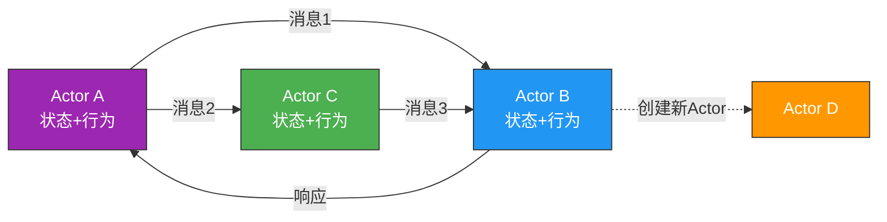

**Actor的四种能力：**
1. **创建新Actor**：动态创建子Actor来分解任务
2. **发送消息**：向已知地址的Actor发送消息
3. **接收消息**：从邮箱中取消息并处理
4. **改变行为**：根据接收到的消息改变对下一条消息的处理方式（有限状态机）

**Actor的生命周期：**
创建 → 运行 → 监督（Supervision） → 崩溃/停止
 ↑                                    |
 └──────── 重启（restart）←──────────┘

### 6.2 Akka实现示例（Java）

```java
// Akka Actor示例：订单处理器
public class OrderProcessor extends AbstractActor {
    private final Map<String, Order> orders = new HashMap<>();

    // 行为定义
    @Override
    public Receive createReceive() {
        return receiveBuilder()
            .match(CreateOrder.class, this::onCreateOrder)
            .match(CancelOrder.class, this::onCancelOrder)
            .match(GetOrderStatus.class, this::onGetStatus)
            .build();
    }

    private void onCreateOrder(CreateOrder msg) {
        Order order = new Order(msg.orderId, msg.items, OrderStatus.PENDING);
        orders.put(msg.orderId, order);
        // 异步通知库存系统
        getContext().actorSelection("/user/inventory")
            .tell(new ReserveStock(msg.orderId, msg.items), getSelf());
        getSender().tell(new OrderCreated(msg.orderId), getSelf());
    }

    private void onCancelOrder(CancelOrder msg) {
        Order order = orders.get(msg.orderId);
        if (order != null &amp;&amp; order.status == OrderStatus.PENDING) {
            order.status = OrderStatus.CANCELLED;
            getContext().actorSelection("/user/inventory")
                .tell(new ReleaseStock(msg.orderId), getSelf());
        }
    }

    private void onGetStatus(GetOrderStatus msg) {
        Order order = orders.get(msg.orderId);
        getSender().tell(
            order != null ? order.status : OrderStatus.NOT_FOUND,
            getSelf()
        );
    }
}
```

### 6.3 Orleans：虚拟Actor模型

Orleans（微软开源）引入了"虚拟Actor"（Virtual Actor/Grain）概念，极大简化了Actor模型的分布式使用：

传统Actor模型：
  - Actor有明确的生命周期（创建→运行→停止）
  - 需要手动管理Actor的创建和销毁
  - 需要显式处理Actor地址发现
  - 跨节点通信需要自行实现

Orleans虚拟Actor：
  - Actor是"虚拟的"——不使用时不消耗资源，被请求时自动激活
  - 通过逻辑标识（如 OrderGrain("order-123")）访问，无需管理地址
  - 自动位置透明——开发者不关心Actor在哪个节点
  - 内置持久化、定时器、流处理

```csharp
// Orleans虚拟Actor示例：订单Grain
public interface IOrderGrain : IGrainWithStringKey
{
    Task CreateOrder(string[] items);
    Task<OrderStatus> GetStatus();
    Task Cancel();
}

public class OrderGrain : Grain, IOrderGrain
{
    private OrderState _state;

    public override async Task OnActivateAsync()
    {
        // 自动从存储加载状态（如果有的话）
        _state = await StateManager.GetStateAsync<OrderState>("order");
    }

    public async Task CreateOrder(string[] items)
    {
        _state = new OrderState { Items = items, Status = OrderStatus.Pending };
        await StateManager.SetStateAsync("order", _state);
    }

    public Task<OrderStatus> GetStatus() => Task.FromResult(_state?.Status ?? OrderStatus.NotFound);

    public async Task Cancel()
    {
        if (_state?.Status == OrderStatus.Pending)
        {
            _state.Status = OrderStatus.Cancelled;
            await StateManager.SetStateAsync("order", _state);
        }
    }
}
```

### 6.4 CSP vs Actor的关键区别

| 维度 | CSP | Actor |
|------|-----|-------|
| 通信方式 | 通过命名Channel | 通过Actor地址直接发消息 |
| 消息路由 | 显式（谁写Channel谁读） | 隐式（Actor可动态创建和发现） |
| 状态管理 | Channel两端各自管理状态 | 每个Actor封装自己的状态 |
| 消息队列 | Channel内部缓冲 | 每个Actor有独立Mailbox |
| 容错 | 需要自行实现 | "Let it crash"+Supervisor机制 |
| 分布式 | 需要额外机制 | 天然支持（Actor可跨节点） |
| 代表 | Go, Ada, occam | Erlang/OTP, Akka, Orleans |
| 心智模型 | 数据流水线 | 独立智能体 |

---

## 七、模型选型决策

### 7.1 选型决策树

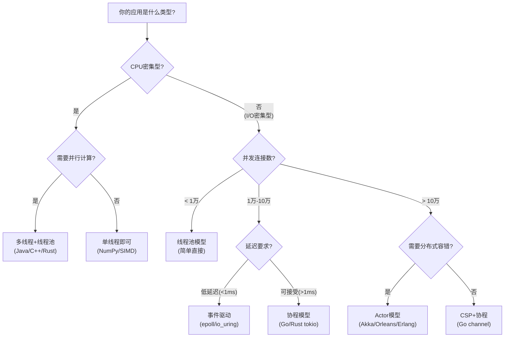

### 7.2 不同场景的最佳选择

| 场景 | 推荐模型 | 技术栈 | 原因 | 并发量级 |
|------|---------|--------|------|---------|
| Web API（CRUD） | 线程池/协程 | Java+Spring / Go+Gin | 请求处理快，线程复用即可 | 千-万级 |
| 实时IM/聊天 | Actor | Erlang/Phoenix / Akka | 天然支持每用户一个Actor | 百万级 |
| 游戏服务器 | Actor | Erlang / Go+自研 | 低延迟、状态隔离、容错 | 十万级 |
| 数据处理管道 | CSP | Go channel / Kafka | 数据流清晰，背压自然 | 百万级 |
| API网关/代理 | 事件驱动 | Nginx / Envoy | 高并发连接复用 | 百万级 |
| 消息队列 | 事件驱动+协程 | Kafka / RabbitMQ | 高吞吐I/O | 百万级 |
| 微服务框架 | 协程 | Go / Kotlin Coroutines | 轻量级、高并发 | 十万-百万级 |
| 物联网网关 | Actor | Erlang / Akka IoT | 大量设备连接、容错 | 百万级 |
| 金融交易系统 | 事件驱动 | LMAX Disruptor | 超低延迟、无锁 | 万级 |
| 搜索引擎 | 线程池+Fork/Join | Java/Elasticsearch | CPU密集型并行计算 | 千级 |

### 7.3 混合模型：工业实践中的常态

实际的高并发系统很少只用一种模型，通常是**混合使用**：

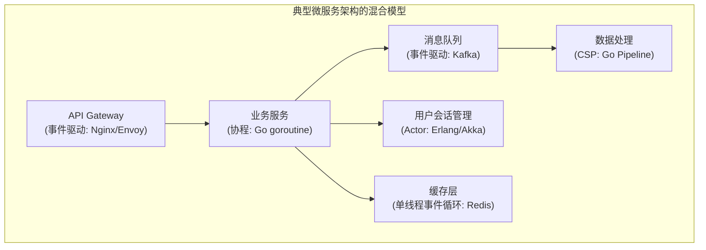

**案例：一个电商系统的并发模型组合**

| 层级 | 模型 | 实现 | 理由 | 并发指标 |
|------|------|------|------|---------|
| Nginx接入层 | 事件驱动 | Nginx worker | 高并发连接处理 | 50万连接/秒 |
| 商品服务 | 线程池 | Java Tomcat | Spring生态，数据库连接池 | 1万QPS |
| 订单服务 | 协程 | Kotlin Coroutines | 异步数据库+HTTP调用 | 5千QPS |
| IM消息推送 | Actor | Akka Cluster | 每用户Actor，状态管理 | 100万在线 |
| 搜索索引 | 线程池+Fork/Join | Java | CPU密集型并行计算 | 毫秒级响应 |
| 日志收集 | 事件驱动 | Go+epoll | 高并发TCP接收 | 10万条/秒 |
| 数据管道 | CSP | Go channel + Kafka | 数据流式处理，背压控制 | 100万条/秒 |

---

## 八、常见误区与最佳实践

### 8.1 七个常见误区

**误区一："协程能完全替代线程"**
- 事实：协程依赖线程运行。Go的GMP模型中G（协程）仍然运行在M（OS线程）上。Python的asyncio仍然运行在主线程上。CPU密集型任务协程无法解决并发计算问题。

**误区二："goroutine可以无限创建"**
- 事实：每个goroutine至少占2KB内存，100万个goroutine需要2GB以上。且GOMAXPROCS默认等于CPU核数，过多goroutine会竞争P资源。实际项目中建议监控goroutine数量，超过10万就需要审视设计。

**误区三："事件驱动模型性能一定比线程池好"**
- 事实：事件驱动在I/O密集型场景下性能更好，但如果回调中包含CPU密集计算（如JSON序列化大对象），会阻塞整个事件循环，反而比线程池更差。Nginx+Lua就是通过将CPU计算卸载到线程池来解决这个问题。

**误区四："CSP模型不需要考虑并发安全"**
- 事实：Channel通信确实避免了数据竞争，但goroutine间的执行顺序仍然不确定。如果业务逻辑依赖特定的执行顺序，仍然需要同步机制（WaitGroup、select等）。

**误区五："Actor模型没有共享状态所以不需要锁"**
- 事实：Actor之间确实不共享状态，但如果Actor内部访问了外部共享资源（如数据库、文件系统、全局缓存），仍然需要并发控制。

**误区六："select是万能的多路复用"**
- 事实：Go的select在多个case同时就绪时会**随机选择**一个执行，这不是bug而是设计。如果你需要优先级，应该用分层select或单独判断。

**误区七："异步=高性能"**
- 事实：异步编程引入了事件循环、回调、上下文切换等开销。对于简单的、连接数不多的CRUD应用，同步线程池模型可能性能更好且更易维护。

### 8.2 最佳实践清单

1. **选型先于实现**：先确定并发模型再写代码，不要在写完后试图切换模型
2. **监控先行**：上线前部署线程/goroutine/连接数监控，提前发现资源泄漏
3. **优雅关闭**：所有并发模型都需要graceful shutdown，确保请求处理完毕再退出
4. **超时无处不在**：所有异步操作必须设置超时，防止goroutine/线程泄漏
5. **避免过度并发**：并非越多并发越好，超过系统承载能力的并发只会增加延迟
6. **背压设计**：用有界队列/信号量限制并发度，让系统在压力下优雅降级
7. **日志追踪**：并发系统中请求在多个线程/goroutine间流转，必须用TraceID串联日志
8. **错误隔离**：使用隔离边界（独立goroutine、Actor、独立进程）防止错误扩散
9. **资源池化**：数据库连接、Redis连接、HTTP客户端都必须池化，避免频繁创建销毁
10. **压测验证**：理论分析只是起点，必须通过压测（wrk/locust/k6）验证并发模型的实际表现

---

## 九、本节总结

| 模型 | 核心优势 | 核心劣势 | 适用并发级别 | 关键词 |
|------|---------|---------|-------------|-------|
| 进程/线程 | 简单直观、内存共享高效 | 资源消耗大、锁竞争 | 千-万级 | 共享内存+锁 |
| 事件驱动 | 极低资源消耗、高并发 | 回调复杂、阻塞风险 | 百万级 | epoll+回调 |
| 协程 | 轻量级、编程友好 | 需要runtime支持、生态限制 | 十万-百万级 | async/await |
| CSP | 无数据竞争、天然流水线 | 有序列化开销 | 百万级 | channel通信 |
| Actor | 天然分布式、容错性好 | 消息路由复杂、调试困难 | 分布式百万级 | 消息传递 |

并发模型不是"谁比谁好"的关系，而是**不同场景下的最优解**。理解每种模型的本质差异和适用边界，才能在高并发系统设计中做出正确的架构决策。

在后续章节中，我们将深入限流算法（第36-02章）——它解决的是"允许多少并发"的问题；熔断与降级（第36-03章）——解决"并发超出承载时怎么办"的问题；无锁数据结构（第36-04章）——解决"如何在共享内存场景下避免锁竞争"的问题。这些都是并发模型在工程实践中的具体延伸。
