## 二、限流算法

高并发系统的第一个问题是：**当请求量超过系统的处理能力时怎么办？** 答案是限流（Rate Limiting）——在请求进入核心处理链路之前，按照预设规则拒绝或排队超量请求，将系统负载控制在可承受范围内。

限流不是一种"可选的优化"，而是高并发系统的**生存基础设施**。2011年亚马逊AWS发生大规模故障，事后复盘报告明确指出：限流策略缺失是导致级联崩溃的关键原因之一。2020年Fastly全球CDN中断事件中，缺乏有效的流量控制导致一个配置错误引发全球范围的服务不可用。在微服务架构中，一个没有限流保护的接口就像一扇没有保险丝的电路——短路电流（突发流量）会瞬间烧毁整条链路。

### 2.1 为什么需要限流

#### 2.1.1 限流要解决的三大问题

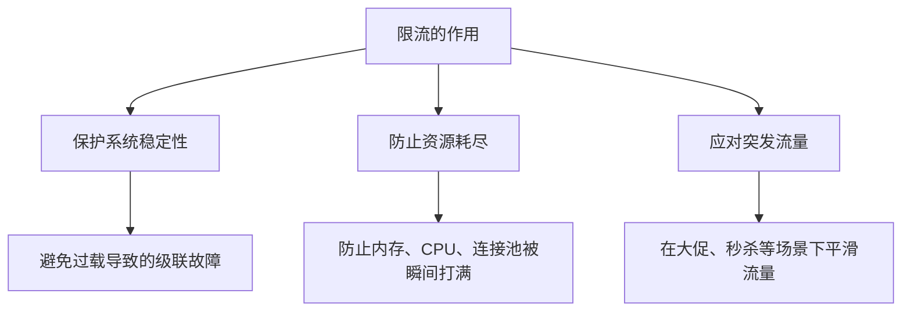

**保护系统稳定性**：任何系统都有设计容量上限。一个每秒能处理1,000 QPS的接口，面对10,000 QPS的流量时，不加限流的结果是响应时间从50ms飙升到数秒甚至超时，最终拖垮整个服务。限流确保进入系统的请求量始终在系统承载范围内，维持稳定的响应时间和错误率。从排队论的角度看，当系统利用率接近100%时，排队等待时间会趋向无穷大——限流的本质就是将系统利用率控制在安全水位（通常不超过70%~80%），从而保证可预期的响应延迟。

**防止资源耗尽**：每个请求都会消耗系统资源——内存缓冲区、数据库连接、下游RPC连接、线程池中的线程。如果不限流，突发流量会在极短时间内耗尽所有资源，导致所有请求（包括正常请求）都无法处理。这就是经典的**雪崩效应**：一个慢接口拖垮整个服务，一个服务拖垮整个集群。具体而言，资源耗尽会引发以下连锁反应：

- 线程池满 → 新请求排队 → 响应超时增加 → 客户端重试 → 请求量翻倍 → 情况恶化
- 数据库连接池满 → 所有依赖该数据库的服务阻塞 → 整个调用链雪崩
- 内存耗尽 → GC频繁 → CPU飙升 → 处理能力进一步下降 → 恶性循环

**应对突发流量**：线上系统的流量模型很少是平稳的。电商大促、营销活动推送、热点新闻事件都会导致流量在短时间内暴增10倍甚至100倍。限流是将"不可控的外部流量"转化为"可控的内部负载"的关键机制。典型场景包括：

| 突发场景 | 流量倍数 | 持续时间 | 限流策略 |
|---------|---------|---------|---------|
| 电商秒杀 | 100x~1000x | 秒级 | 漏桶严格限速 + 排队 |
| 微博热搜 | 10x~50x | 分钟级 | 令牌桶允许短暂突发 |
| 营销推送 | 5x~20x | 小时级 | 滑动窗口 + 动态调整 |
| 恶意攻击 | 100x+ | 不定 | IP级限流 + 自动封禁 |

#### 2.1.2 限流与过载保护的关系

过载保护是一个更大的概念，限流是其中的核心手段之一：

| 过载保护手段 | 作用 | 与限流的关系 |
|------------|------|------------|
| 限流（Rate Limiting） | 控制单位时间内通过的请求数量 | 核心手段 |
| 熔断（Circuit Breaker） | 故障时快速失败，保护调用方 | 互补——限流防过载，熔断防故障扩散 |
| 降级（Degradation） | 资源紧张时关闭非核心功能 | 限流触发后的后续动作 |
| 背压（Backpressure） | 下游反馈控制上游发送速率 | 分布式场景下的限流延伸 |
| 弹性伸缩（Auto Scaling） | 动态调整资源容量 | 扩容后可相应调高限流阈值 |

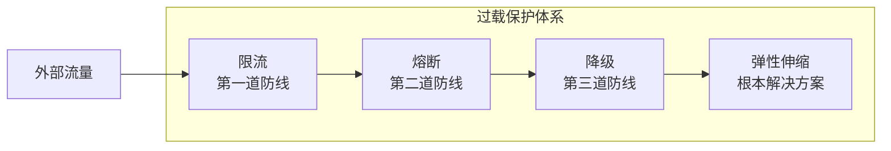

限流是第一道防线，拦截大部分超量流量；当限流防线被突破（如下游服务故障导致处理能力骤降），熔断机制快速切断故障调用；当资源进一步紧张，降级机制关闭非核心功能释放资源；最终通过弹性伸缩从根本上提升系统容量。四者协同工作，构成完整的过载保护体系。

### 2.2 限流的分类维度

从不同角度，限流可以分为多种类别：

**按限流粒度**：

| 粒度 | 说明 | 典型应用 |
|------|------|---------|
| 全局限流 | 对整个服务的所有请求限流 | API网关总入口限流 |
| 接口限流 | 按API路径分别限流 | 每个接口独立配置QPS上限 |
| 用户限流 | 按用户ID/租户ID限流 | 防止单个用户独占资源 |
| IP限流 | 按客户端IP地址限流 | 防止恶意爬虫、DDoS攻击 |
| 业务维度限流 | 按业务参数（如地域、渠道）限流 | 不同地区分配不同配额 |
| 协议限流 | 按消息类型/方法名限流 | gRPC按service.method分别限流 |

**按限流行为**：

| 行为 | 说明 | 适用场景 |
|------|------|---------|
| 拒绝（Hard Limit） | 超过阈值直接返回错误（HTTP 429） | 严格的QPS控制 |
| 排队（Soft Limit） | 超过阈值的请求排队等待 | 允许延迟但不允许丢失 |
| 降级（Graceful Limit） | 超过阈值返回兜底数据 | 用户体验优先的场景 |
| 限速（Throttle） | 降低处理速率而非完全拒绝 | 允许降速处理 |

**按实现位置**：

| 位置 | 说明 | 优势 | 劣势 |
|------|------|------|------|
| 客户端限流 | 在调用方控制发送速率 | 零延迟、无网络开销 | 无法强制约束、不可信 |
| 网关限流 | 在API网关统一拦截 | 集中管理、全局视角 | 网关成为瓶颈 |
| 服务端限流 | 在服务实例本地执行 | 精确感知自身负载 | 各实例独立、总量难控 |
| 中间件限流 | 在消息队列等中间件层限流 | 与业务解耦 | 仅适用于异步场景 |

### 2.3 四种经典限流算法

限流算法经历了从简单到精密的演进过程。理解每种算法的原理、优劣和适用场景，是设计限流策略的基础。

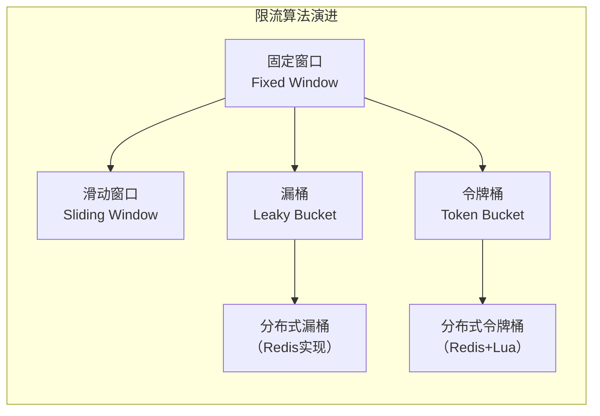

---

### 2.4 固定窗口算法（Fixed Window Counter）

#### 2.4.1 基本原理

固定窗口算法是最简单的限流实现。将时间轴划分为等长的固定窗口（如每秒一个窗口），每个窗口维护一个计数器。每当请求到达时：

1. 检查当前窗口是否已过期（`now - window_start >= window_size`）
2. 若过期，重置计数器，更新窗口起始时间
3. 若未过期，检查计数器是否已达上限
4. 未达上限则计数器加1并放行请求，否则拒绝

```python
import time
import threading

class FixedWindowLimiter:
    """固定窗口限流器
    
    最简单的限流实现，O(1)时间复杂度和空间复杂度。
    适用于资源受限场景或对精度要求不高的粗粒度限流。
    
    注意：存在窗口边界的临界突发问题，详见2.4.2节。
    
    Args:
        max_requests: 窗口内最大允许请求数
        window_size: 窗口大小（秒）
    """
    
    def __init__(self, max_requests: int, window_size: float = 1.0):
        self.max_requests = max_requests
        self.window_size = window_size
        self.window_start = time.monotonic()
        self.count = 0
        self.lock = threading.Lock()
    
    def allow(self) -> bool:
        with self.lock:
            now = time.monotonic()
            # 窗口过期则重置
            if now - self.window_start >= self.window_size:
                self.window_start = now
                self.count = 0
            
            if self.count < self.max_requests:
                self.count += 1
                return True
            return False
    
    def allow_n(self, n: int) -> bool:
        """扣减n个配额（适用于批量请求）"""
        with self.lock:
            now = time.monotonic()
            if now - self.window_start >= self.window_size:
                self.window_start = now
                self.count = 0
            
            if self.count + n <= self.max_requests:
                self.count += n
                return True
            return False
```

#### 2.4.2 优缺点分析

**优点**：
- 实现极简，O(1)时间复杂度和空间复杂度
- 无需记录每个请求的时间戳，内存开销最小（仅需一个计数器和一个时间戳）
- 适合嵌入式设备、资源受限环境
- 容易理解和调试，代码审查成本低

**缺点——临界突发问题**：

固定窗口算法的致命缺陷是**窗口边界的临界突发**。假设限制每秒100次请求：


在第1秒的最后100ms内来了100个请求（刚好不超过限制），然后在第2秒的前100ms内又来了100个请求（也刚好不超过限制）。**虽然每个窗口内都没有超限，但实际在200ms内通过了199个请求**——远超每秒100次的设计容量。

这个缺陷在实际生产中可能导致严重后果。假设下游服务的处理能力确实是100 QPS，临界突发产生的199 QPS瞬时流量可能导致：
- 线程池瞬间打满，后续请求排队超时
- 数据库连接池耗尽，触发连接超时
- 内存缓冲区溢出，触发OOM

#### 2.4.3 Go语言实现

```go
package ratelimit

import (
    "sync"
    "time"
)

// FixedWindow 固定窗口限流器
type FixedWindow struct {
    mu          sync.Mutex
    maxReqs     int
    windowSize  time.Duration
    windowStart time.Time
    count       int
}

func NewFixedWindow(maxReqs int, windowSize time.Duration) *FixedWindow {
    return &amp;FixedWindow{
        maxReqs:    maxReqs,
        windowSize: windowSize,
    }
}

func (fw *FixedWindow) Allow() bool {
    fw.mu.Lock()
    defer fw.mu.Unlock()

    now := time.Now()
    if now.Sub(fw.windowStart) >= fw.windowSize {
        fw.windowStart = now
        fw.count = 0
    }

    if fw.count < fw.maxReqs {
        fw.count++
        return true
    }
    return false
}

// AllowN: 扣减n个配额（适用于批量请求）
func (fw *FixedWindow) AllowN(n int) bool {
    fw.mu.Lock()
    defer fw.mu.Unlock()

    now := time.Now()
    if now.Sub(fw.windowStart) >= fw.windowSize {
        fw.windowStart = now
        fw.count = 0
    }

    if fw.count+n <= fw.maxReqs {
        fw.count += n
        return true
    }
    return false
}
```

#### 2.4.4 实际应用：Redis固定窗口

在分布式场景中，固定窗口可以用Redis的`INCR + EXPIRE`原子操作实现：

```lua
-- Redis Lua脚本：固定窗口限流
-- KEYS[1] = 限流key
-- ARGV[1] = 窗口大小（秒）
-- ARGV[2] = 窗口内最大请求数

local key = KEYS[1]
local window = tonumber(ARGV[1])
local limit = tonumber(ARGV[2])

local current = tonumber(redis.call('GET', key) or "0")

if current < limit then
    -- 未超限，计数器加1
    local new_count = redis.call('INCR', key)
    if new_count == 1 then
        -- 首次设置，设置过期时间
        redis.call('EXPIRE', key, window)
    end
    return 1  -- 放行
else
    return 0  -- 拒绝
end
```

---

### 2.5 滑动窗口算法（Sliding Window）

滑动窗口算法通过让时间窗口"滑动"而非"跳跃"来解决固定窗口的临界突发问题。根据实现精度的不同，滑动窗口分为三种变体：精确滑动窗口（基于时间戳）、滑动窗口计数器（近似算法）和滑动窗口日志。

#### 2.5.1 基本原理

滑动窗口维护一个时间跨度为`window_size`的窗口，窗口的起始点随时间连续滑动（而非固定跳转）。每当请求到达时，先剔除窗口外的过期请求，再检查窗口内的请求总数是否超限。

与固定窗口的核心区别在于：固定窗口的边界是固定的（如每秒的整秒时刻），而滑动窗口的边界随时间连续移动。这意味着在任何时刻，滑动窗口看到的都是"过去N秒内的真实请求量"，不存在固定窗口的边界突发问题。

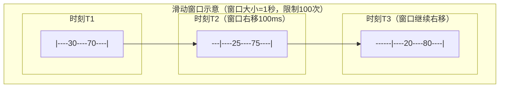

#### 2.5.2 精确滑动窗口（基于时间戳）

精确记录每个请求的时间戳，实现精确的滑动窗口。每次请求到达时，先清理窗口外的过期时间戳，再检查窗口内的请求数：

```python
import time
import threading
from collections import deque

class SlidingWindowExact:
    """精确滑动窗口限流器——记录每个请求的时间戳
    
    精确度最高，但空间开销也最大。每个请求存储一个时间戳（8字节），
    在QPS=10,000的场景下，1秒窗口需要约80KB内存。
    
    适用场景：低QPS的精细限流（如用户级限流、付费接口限流）。
    不适用场景：高吞吐量的全局限流（内存开销过大）。
    
    Args:
        max_requests: 窗口内最大请求数
        window_size: 窗口大小（秒）
    """
    
    def __init__(self, max_requests: int, window_size: float = 1.0):
        self.max_requests = max_requests
        self.window_size = window_size
        self.timestamps = deque()  # 有序时间戳队列
        self.lock = threading.Lock()
    
    def allow(self) -> bool:
        with self.lock:
            now = time.monotonic()
            cutoff = now - self.window_size
            
            # 移除窗口外的过期时间戳（从队头开始，因为时间戳有序）
            while self.timestamps and self.timestamps[0] <= cutoff:
                self.timestamps.popleft()
            
            # 检查窗口内请求数
            if len(self.timestamps) < self.max_requests:
                self.timestamps.append(now)
                return True
            return False
    
    def get_current_count(self) -> int:
        """获取当前窗口内的请求数"""
        with self.lock:
            now = time.monotonic()
            cutoff = now - self.window_size
            while self.timestamps and self.timestamps[0] <= cutoff:
                self.timestamps.popleft()
            return len(self.timestamps)
    
    def get_rejection_wait_time(self) -> float:
        """获取需要等待多少秒才有配额可用"""
        with self.lock:
            now = time.monotonic()
            cutoff = now - self.window_size
            while self.timestamps and self.timestamps[0] <= cutoff:
                self.timestamps.popleft()
            
            if len(self.timestamps) < self.max_requests:
                return 0.0
            
            # 最早的请求过期后，就有一个配额了
            return self.timestamps[0] + self.window_size - now
```

**精确度 vs 开销**：在QPS=10,000的场景下，1秒的窗口需要存储10,000个时间戳（每个8字节），内存开销约80KB。如果按用户维度限流（100万用户 × 每人100 QPS），内存开销会非常可观。因此精确滑动窗口通常用于低QPS的精细限流，而非高吞吐量的全局限流。

#### 2.5.3 滑动窗口计数器（近似算法）

为了在保持较好精度的同时降低空间开销，滑动窗口计数器将窗口分为N个等长的子窗口（格子），每个子窗口维护一个独立的计数器。通过加权计算近似滑动窗口内的请求数。

核心思想：当前子窗口内的请求按实际占比计权，上一个子窗口的请求按剩余时间占比计权，更早的子窗口请求按全量计权。

```python
import time
import threading

class SlidingWindowCounter:
    """滑动窗口计数器——通过子窗口加权近似滑动窗口
    
    将窗口分为N个子窗口，通过加权计算近似当前滑动窗口内的请求数。
    空间复杂度O(N)，远优于精确滑动窗口的O(n)。
    
    精度取决于子窗口数量：子窗口越多，精度越高，但空间开销也越大。
    推荐子窗口数：10~60（1秒窗口分为10个100ms子窗口或60个16ms子窗口）。
    
    Args:
        max_requests: 窗口内最大请求数
        window_size: 窗口大小（秒）
        sub_windows: 子窗口数量（越大精度越高）
    """
    
    def __init__(self, max_requests: int, window_size: float = 1.0,
                 sub_windows: int = 10):
        self.max_requests = max_requests
        self.window_size = window_size
        self.sub_window_size = window_size / sub_windows
        self.num_sub_windows = sub_windows
        self.counters = [0] * sub_windows
        self.current_index = 0
        self.lock = threading.Lock()
    
    def _update_window(self):
        """根据当前时间推进子窗口索引，清除过期子窗口"""
        now = time.monotonic()
        # 计算当前处于第几个子窗口
        # 使用整数除法确定当前子窗口的索引
        elapsed_in_window = now % self.window_size
        current = int(elapsed_in_window / self.sub_window_size) % self.num_sub_windows
        
        # 从上次索引推进到当前索引，清除经过的子窗口
        while self.current_index != current:
            self.current_index = (self.current_index + 1) % self.num_sub_windows
            self.counters[self.current_index] = 0
    
    def _calculate_weighted_count(self) -> float:
        """加权计算当前有效请求数
        
        权重计算逻辑：
        - 当前子窗口的请求：按已过去时间占比计权
        - 上一个子窗口的请求：按剩余时间占比计权
        - 更早子窗口的请求：按全量计权
        
        这样在窗口边界处也能平滑过渡，避免固定窗口的临界突发问题。
        """
        now = time.monotonic()
        elapsed_in_window = now % self.window_size
        # 当前子窗口内已过去的时间占比
        position_in_sub = (elapsed_in_window % self.sub_window_size) / self.sub_window_size
        
        total = 0.0
        for i in range(self.num_sub_windows):
            idx = (self.current_index - i) % self.num_sub_windows
            if i == 0:
                # 当前子窗口：按已过去时间占比计权
                total += self.counters[idx] * position_in_sub
            elif i == 1:
                # 上一个子窗口：按剩余时间占比计权
                total += self.counters[idx] * (1.0 - position_in_sub)
            else:
                # 更早的子窗口：全量计权
                total += self.counters[idx]
        
        return total
    
    def allow(self) -> bool:
        with self.lock:
            self._update_window()
            
            weighted_count = self._calculate_weighted_count()
            if weighted_count < self.max_requests:
                self.counters[self.current_index] += 1
                return True
            return False
```

**工作原理详解**：假设窗口大小1秒，分为10个100ms的子窗口，限制100次/秒。当前处于第3个子窗口的50%位置（已过去300ms + 50ms = 350ms），则权重计算为：

第3个子窗口（当前）的请求数 × 0.5    ← 已过去50%的时间
第2个子窗口（上一个）的请求数 × 0.5   ← 剩余50%的时间
第1个子窗口及更早的请求数 × 1.0      ← 全部在窗口内
────────────────────────────────────
= 近似的当前滑动窗口内请求数

这样即使在窗口边界，也能平滑过渡，避免固定窗口的临界突发问题。子窗口数量越多，加权计算越精确——当子窗口数等于窗口内的最大请求数时，退化为精确滑动窗口。

#### 2.5.4 Go语言实现：滑动窗口计数器

```go
package ratelimit

import (
    "sync"
    "time"
)

// SlidingWindowCounter 滑动窗口计数器
type SlidingWindowCounter struct {
    mu            sync.Mutex
    maxReqs       int
    windowSize    time.Duration
    subWindowSize time.Duration
    numSubWindows int
    counters      []int64
    currentIndex  int
}

func NewSlidingWindowCounter(maxReqs int, windowSize time.Duration, subWindows int) *SlidingWindowCounter {
    return &amp;SlidingWindowCounter{
        maxReqs:       maxReqs,
        windowSize:    windowSize,
        subWindowSize: windowSize / time.Duration(subWindows),
        numSubWindows: subWindows,
        counters:      make([]int64, subWindows),
    }
}

func (sw *SlidingWindowCounter) Allow() bool {
    sw.mu.Lock()
    defer sw.mu.Unlock()

    now := time.Now()
    elapsed := now.Sub(time.Time{}).Mod(sw.windowSize)
    current := int(elapsed / sw.subWindowSize) % sw.numSubWindows

    // 清除过期子窗口
    for sw.currentIndex != current {
        sw.currentIndex = (sw.currentIndex + 1) % sw.numSubWindows
        sw.counters[sw.currentIndex] = 0
    }

    // 加权计算当前有效请求数
    positionInSub := float64(elapsed%sw.subWindowSize) / float64(sw.subWindowSize)
    
    var total float64
    for i := 0; i < sw.numSubWindows; i++ {
        idx := (sw.currentIndex - i + sw.numSubWindows) % sw.numSubWindows
        if i == 0 {
            total += float64(sw.counters[idx]) * positionInSub
        } else if i == 1 {
            total += float64(sw.counters[idx]) * (1.0 - positionInSub)
        } else {
            total += float64(sw.counters[idx])
        }
    }

    if total < float64(sw.maxReqs) {
        sw.counters[sw.currentIndex]++
        return true
    }
    return false
}
```

---

### 2.6 漏桶算法（Leaky Bucket）

#### 2.6.1 核心思想

漏桶算法源于网络流量整形（Traffic Shaping）领域，其核心思想可以用一个物理模型来理解：

想象一个底部有小孔的水桶，水（请求）从顶部倒入桶中，水从底部以**恒定速率**流出（处理请求）。桶有固定容量（缓冲区大小），当桶满时新进入的水（请求）会溢出（被丢弃）。

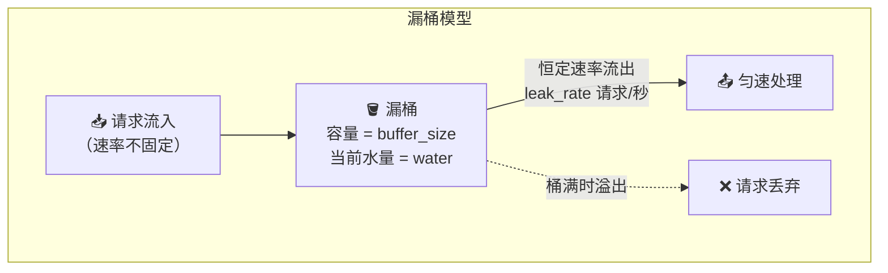

漏桶算法的核心特征是**输出速率恒定**——无论输入流量如何波动，经过漏桶整形后，流出的流量始终是均匀的。这使得下游系统获得稳定、可预测的负载。

#### 2.6.2 算法流程

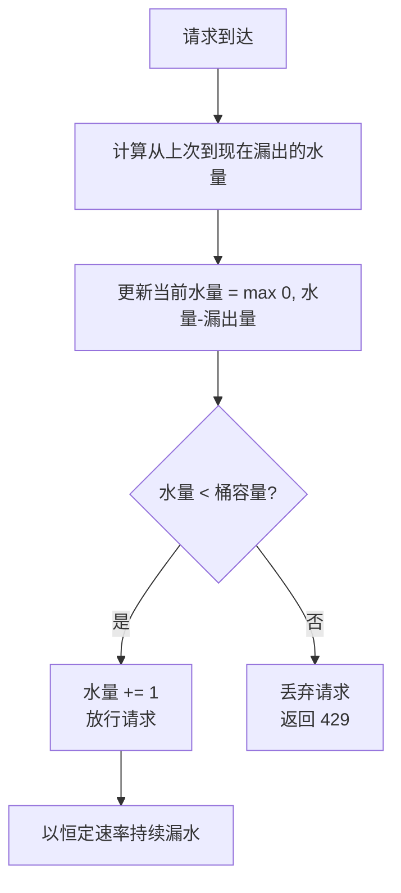

#### 2.6.3 Python实现

```python
import time
import threading

class LeakyBucket:
    """漏桶算法限流器
    
    核心特征：输出速率恒定，平滑突发流量。
    适用于：需要严格控制输出速率的场景（如消息队列消费端限速、
            下游服务保护、日志写入限速）。
    
    与令牌桶的关键区别：漏桶不允许突发，令牌桶允许突发。
    如果你的场景需要"严格匀速输出"，选择漏桶；
    如果需要"允许合理突发"，选择令牌桶。
    
    Args:
        capacity: 桶容量，即最大缓冲请求数
        leak_rate: 每秒漏出的请求数（即处理速率）
    """
    
    def __init__(self, capacity: int, leak_rate: float):
        self.capacity = capacity
        self.leak_rate = leak_rate      # 请求/秒
        self.water = 0.0                # 当前桶中水量
        self.last_leak_time = time.monotonic()
        self.lock = threading.Lock()
    
    def _leak(self, now: float):
        """执行漏水操作：根据时间差计算漏出量"""
        elapsed = now - self.last_leak_time
        leaked = elapsed * self.leak_rate  # 这段时间漏出的水量
        self.water = max(0.0, self.water - leaked)
        self.last_leak_time = now
    
    def allow(self) -> bool:
        """尝试通过一个请求（非阻塞）"""
        with self.lock:
            now = time.monotonic()
            self._leak(now)
            
            if self.water < self.capacity:
                self.water += 1
                return True
            return False  # 桶满，丢弃
    
    def allow_with_wait(self) -> tuple:
        """尝试通过请求，如果需要则等待（阻塞模式）
        
        Returns:
            (allowed: bool, wait_time: float)
            - allowed=True, wait_time=0：立即放行
            - allowed=True, wait_time>0：需要等待后放行
        """
        with self.lock:
            now = time.monotonic()
            self._leak(now)
            
            if self.water < self.capacity:
                self.water += 1
                return (True, 0.0)
            
            # 计算需要等待多久才能有空位
            overflow = self.water - self.capacity + 1
            wait_time = overflow / self.leak_rate
            return (True, wait_time)
    
    def get_water_level(self) -> float:
        """获取当前水位（用于监控）"""
        with self.lock:
            now = time.monotonic()
            self._leak(now)
            return self.water
```

#### 2.6.4 漏桶 vs 固定窗口的对比

假设桶容量=10，漏出速率=5次/秒，100ms内突然涌入20个请求：

固定窗口：第1个100ms窗口内通过10个，第2个100ms窗口内通过10个
         → 实际在200ms内通过了20个（如果恰好跨窗口边界）

漏  桶：100ms内漏出 5×0.1 = 0.5个（实际最多1个），桶满后剩余全部丢弃
         → 20个请求中只有约5-6个被处理，其余全部被拒绝
         → 下游系统始终只看到5次/秒的稳定流量

**漏桶的局限性**：输出速率完全恒定，无法处理合理的突发流量。比如一个API平时QPS=100，突发时QPS=300是可接受的（系统有余量），但漏桶会把200个请求全部拒绝。这在用户体验上是不够友好的。

#### 2.6.5 漏桶的变体：带排队的漏桶

在实际应用中，漏桶通常不是直接丢弃超量请求，而是让它们排队等待：

```python
import time
import threading
import collections

class LeakyBucketWithQueue:
    """带排队的漏桶——超量请求进入队列等待处理
    
    相比简单丢弃，排队模式更适合允许延迟但不允许丢失的场景。
    但需要注意：队列过长会导致请求超时，需要设置队列上限。
    
    Args:
        leak_rate: 每秒处理的请求数（处理速率）
        max_queue_size: 最大排队请求数（超过则丢弃）
        max_wait_time: 最大等待时间（秒），超过则丢弃
    """
    
    def __init__(self, leak_rate: float, max_queue_size: int = 1000,
                 max_wait_time: float = 30.0):
        self.leak_rate = leak_rate
        self.max_queue_size = max_queue_size
        self.max_wait_time = max_wait_time
        self.queue = collections.deque()  # (enqueue_time, callback)
        self.last_leak_time = time.monotonic()
        self.lock = threading.Lock()
    
    def _process_queue(self):
        """从队列中取出请求进行处理"""
        now = time.monotonic()
        elapsed = now - self.last_leak_time
        can_process = int(elapsed * self.leak_rate)
        
        processed = 0
        while processed < can_process and self.queue:
            enqueue_time, callback = self.queue.popleft()
            # 检查是否已超时
            if now - enqueue_time > self.max_wait_time:
                continue  # 跳过超时请求
            callback()  # 执行处理
            processed += 1
        
        if can_process > 0:
            self.last_leak_time = now
    
    def submit(self, callback) -> bool:
        """提交一个请求到队列
        
        Returns:
            True: 已入队（将被处理）
            False: 队列已满（请求被丢弃）
        """
        with self.lock:
            self._process_queue()
            
            if len(self.queue) < self.max_queue_size:
                self.queue.append((time.monotonic(), callback))
                return True
            return False  # 队列满
```

---

### 2.7 令牌桶算法（Token Bucket）

#### 2.7.1 核心思想

令牌桶算法是目前工业界**最广泛使用**的限流算法。它解决了漏桶无法处理突发流量的问题。

核心模型：一个以固定速率向桶中放入令牌的机制，桶有最大容量。请求到达时需要从桶中取出一个令牌才能被处理，桶空时请求被拒绝。

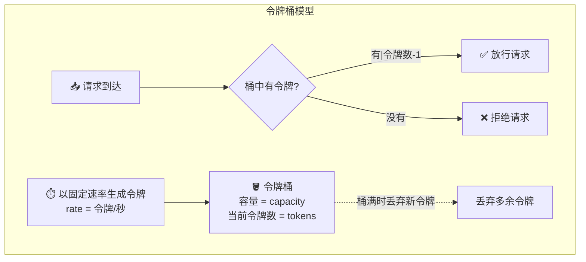

**与漏桶的关键区别**：

| 对比维度 | 漏桶 | 令牌桶 |
|---------|------|--------|
| 核心对象 | 水（请求）被整形 | 令牌（许可）被消耗 |
| 输出速率 | 恒定（由漏水速率决定） | 平均恒定，但允许突发 |
| 突发处理 | 不允许突发 | 桶中积攒的令牌可被一次性消耗 |
| 控制点 | 控制请求的流出速率 | 控制请求的准入许可 |
| 适用场景 | 流量整形（Traffic Shaping） | 流量限制（Traffic Limiting） |
| 实现复杂度 | 中等 | 中等 |
| 工业应用 | 早期网络设备、Nginx | Guava、Envoy、几乎所有API网关 |

#### 2.7.2 允许突发的原因

假设令牌桶容量为100，令牌生成速率为10个/秒：

- **空闲时**：系统10秒不处理请求，桶中积攒100个令牌（满桶）
- **突发时**：突然来了150个请求，前100个请求可以立即获取令牌被处理，后50个被拒绝
- **效果**：允许瞬时100 QPS的突发，但长期平均不能超过10 QPS

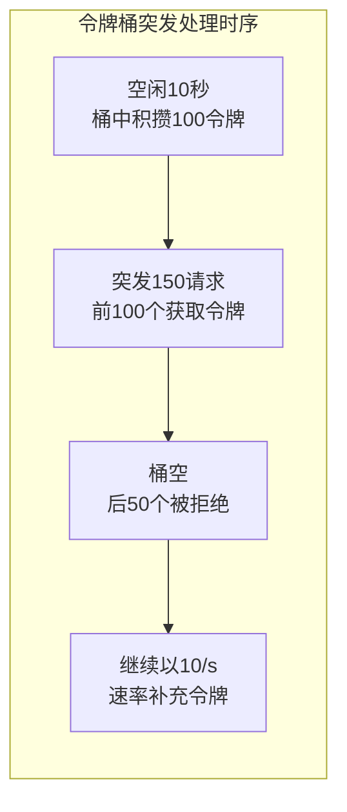

这种特性完美匹配了真实业务场景：系统通常有一定空闲余量，当突发来临时可以立即利用这些余量处理，而不是像漏桶那样死板地拒绝。

#### 2.7.3 Python实现

```python
import time
import threading

class TokenBucket:
    """令牌桶算法限流器
    
    核心特征：允许突发流量（桶中积攒的令牌可被一次性消耗）。
    适用于：微服务限流、API网关限流等需要兼顾平滑和突发的场景。
    
    参数设计指南：
    - refill_rate（令牌生成速率）= 系统设计的长期平均QPS上限
    - capacity（桶容量）= 允许的最大突发量
    - capacity/refill_rate = 允许的突发持续时间
    
    例如：refill_rate=100, capacity=500 → 长期平均100 QPS，允许5秒的500 QPS突发
    
    Args:
        capacity: 桶容量（最大令牌数，决定突发上限）
        refill_rate: 每秒补充的令牌数（决定长期平均速率）
    """
    
    def __init__(self, capacity: int, refill_rate: float):
        self.capacity = capacity
        self.refill_rate = refill_rate    # 令牌/秒
        self.tokens = float(capacity)     # 初始令牌数 = 桶容量
        self.last_refill_time = time.monotonic()
        self.lock = threading.Lock()
    
    def _refill(self, now: float):
        """补充令牌"""
        elapsed = now - self.last_refill_time
        new_tokens = elapsed * self.refill_rate
        self.tokens = min(self.capacity, self.tokens + new_tokens)
        self.last_refill_time = now
    
    def allow(self) -> bool:
        """尝试获取一个令牌"""
        with self.lock:
            now = time.monotonic()
            self._refill(now)
            
            if self.tokens >= 1.0:
                self.tokens -= 1.0
                return True
            return False
    
    def allow_n(self, n: int) -> bool:
        """尝试一次性获取n个令牌（适用于批量请求）"""
        with self.lock:
            now = time.monotonic()
            self._refill(now)
            
            if self.tokens >= float(n):
                self.tokens -= float(n)
                return True
            return False
    
    def get_tokens(self) -> float:
        """获取当前令牌数（用于监控）"""
        with self.lock:
            now = time.monotonic()
            self._refill(now)
            return self.tokens
```

#### 2.7.4 Go语言实现（生产级）

```go
package ratelimit

import (
    "sync"
    "time"
)

// TokenBucket 令牌桶限流器
type TokenBucket struct {
    mu         sync.Mutex
    capacity   int       // 桶容量
    tokens     float64   // 当前令牌数
    refillRate float64   // 每秒补充令牌数
    lastTime   time.Time // 上次补充时间
}

func NewTokenBucket(capacity int, refillRate float64) *TokenBucket {
    return &amp;TokenBucket{
        capacity:   capacity,
        tokens:     float64(capacity), // 初始满桶
        refillRate: refillRate,
        lastTime:   time.Now(),
    }
}

func (tb *TokenBucket) Allow() bool {
    tb.mu.Lock()
    defer tb.mu.Unlock()

    now := time.Now()
    // 计算时间差并补充令牌
    elapsed := now.Sub(tb.lastTime).Seconds()
    tb.tokens += elapsed * tb.refillRate
    if tb.tokens > float64(tb.capacity) {
        tb.tokens = float64(tb.capacity) // 不超过桶容量
    }
    tb.lastTime = now

    // 尝试获取令牌
    if tb.tokens >= 1.0 {
        tb.tokens--
        return true
    }
    return false
}

// AllowN: 批量获取n个令牌
func (tb *TokenBucket) AllowN(n int) bool {
    tb.mu.Lock()
    defer tb.mu.Unlock()

    now := time.Now()
    elapsed := now.Sub(tb.lastTime).Seconds()
    tb.tokens += elapsed * tb.refillRate
    if tb.tokens > float64(tb.capacity) {
        tb.tokens = float64(tb.capacity)
    }
    tb.lastTime = now

    if tb.tokens >= float64(n) {
        tb.tokens -= float64(n)
        return true
    }
    return false
}

// Tokens: 返回当前令牌数（用于监控）
func (tb *TokenBucket) Tokens() float64 {
    tb.mu.Lock()
    defer tb.mu.Unlock()
    return tb.tokens
}
```

---

### 2.8 四种算法对比总结

| 对比维度 | 固定窗口 | 滑动窗口（计数器） | 漏桶 | 令牌桶 |
|---------|---------|------------------|------|--------|
| **实现复杂度** | 极简 | 中等 | 中等 | 中等 |
| **空间复杂度** | O(1) | O(N)，N为子窗口数 | O(1) | O(1) |
| **时间复杂度** | O(1) | O(N) | O(1) | O(1) |
| **输出速率** | 不平滑 | 较平滑 | 完全恒定 | 平均恒定 |
| **允许突发** | 是（窗口边界） | 有限突发 | 否 | 是（桶容量内） |
| **临界突发问题** | 有 | 无 | 无 | 无 |
| **适用场景** | 简单粗粒度限流 | 接口级精细限流 | 流量整形 | 微服务/Gateway限流 |
| **工业应用** | 极少单独使用 | Redis滑动窗口 | 早期网络设备 | Guava RateLimiter、Nginx、Envoy |

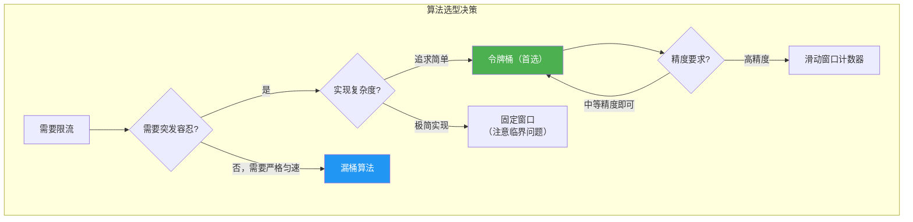

**经验法则**：大多数场景下，**令牌桶是最佳默认选择**。它实现简单、允许合理的突发、长期平均速率可控，且被所有主流限流框架支持。仅在以下场景考虑其他算法：

- **需要严格匀速输出**：消息队列消费限速、流量整形 → 漏桶
- **需要防止窗口边界突发但不想引入令牌机制**：接口级精细限流 → 滑动窗口计数器
- **资源极度受限的嵌入式环境**：固件级限流 → 固定窗口
- **需要精确到每个请求的限流记录**：审计合规、精细计费 → 精确滑动窗口

---

### 2.9 分布式限流：从单机到集群

单机限流只能保护单个节点。在微服务集群中，相同的服务部署了数十甚至数百个实例，**每个实例各自限流**意味着总放行量 = 单实例限制 × 实例数，可能远超设计容量。因此需要**分布式限流**——所有实例共享同一份限流配额。

#### 2.9.1 分布式限流的实现方案

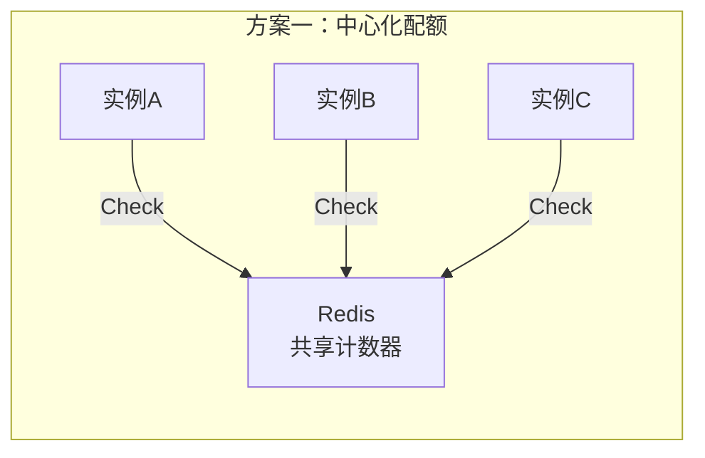

**方案一：基于Redis的中心化计数器**

使用Redis的原子操作（`INCR` + `EXPIRE` 或 Lua脚本）实现跨实例的全局计数：

```lua
-- Redis Lua脚本：令牌桶限流（原子操作）
-- KEYS[1] = 令牌桶的key
-- ARGV[1] = 桶容量
-- ARGV[2] = 令牌补充速率（个/秒）
-- ARGV[3] = 当前时间戳（秒）
-- ARGV[4] = 要获取的令牌数

local key = KEYS[1]
local capacity = tonumber(ARGV[1])
local refill_rate = tonumber(ARGV[2])
local now = tonumber(ARGV[3])
local requested = tonumber(ARGV[4])

-- 获取当前桶状态
local bucket = redis.call('HMGET', key, 'tokens', 'last_refill')
local tokens = tonumber(bucket[1]) or capacity
local last_refill = tonumber(bucket[2]) or now

-- 计算补充的令牌数
local elapsed = math.max(0, now - last_refill)
tokens = math.min(capacity, tokens + elapsed * refill_rate)

-- 尝试获取令牌
local allowed = 0
if tokens >= requested then
    tokens = tokens - requested
    allowed = 1
end

-- 更新桶状态
redis.call('HMSET', key, 'tokens', tokens, 'last_refill', now)
redis.call('EXPIRE', key, math.ceil(capacity / refill_rate) * 2)

return allowed
```

使用方式：

```python
import redis
import time

class RedisTokenBucket:
    """基于Redis的分布式令牌桶
    
    通过Redis Lua脚本保证原子性，适用于中小规模的分布式限流。
    每次限流判断需要一次网络往返（约0.5~2ms），不适合超低延迟场景。
    
    Args:
        redis_client: Redis连接客户端
        key: 限流key（不同限流维度使用不同key）
        capacity: 桶容量
        refill_rate: 每秒补充令牌数
    """
    
    LUA_SCRIPT = """
    local key = KEYS[1]
    local capacity = tonumber(ARGV[1])
    local refill_rate = tonumber(ARGV[2])
    local now = tonumber(ARGV[3])
    local requested = tonumber(ARGV[4])
    
    local bucket = redis.call('HMGET', key, 'tokens', 'last_refill')
    local tokens = tonumber(bucket[1]) or capacity
    local last_refill = tonumber(bucket[2]) or now
    
    local elapsed = math.max(0, now - last_refill)
    tokens = math.min(capacity, tokens + elapsed * refill_rate)
    
    local allowed = 0
    if tokens >= requested then
        tokens = tokens - requested
        allowed = 1
    end
    
    redis.call('HMSET', key, 'tokens', tokens, 'last_refill', now)
    redis.call('EXPIRE', key, math.ceil(capacity / refill_rate) * 2)
    
    return allowed
    """
    
    def __init__(self, redis_client, key, capacity, refill_rate):
        self.redis = redis_client
        self.key = key
        self.capacity = capacity
        self.refill_rate = refill_rate
        self.script = self.redis.script_load(self.LUA_SCRIPT)
    
    def allow(self, tokens: int = 1) -> bool:
        now = time.time()
        result = self.redis.evalsha(
            self.script, 1,
            self.key, self.capacity, self.refill_rate, now, tokens
        )
        return result == 1
```

**方案二：分布式滑动窗口**

使用Redis的Sorted Set实现精确的滑动窗口限流：

```python
class RedisSlidingWindow:
    """基于Redis Sorted Set的分布式滑动窗口限流
    
    利用ZSET的有序性和时间戳score，实现精确的滑动窗口。
    优点：精确度高，支持范围查询。
    缺点：每个请求存储一条ZSET记录，高QPS下内存开销较大。
    
    Args:
        redis_client: Redis连接客户端
        key: 限流key
        limit: 窗口内最大请求数
        window_ms: 窗口大小（毫秒）
    """
    
    LUA_SCRIPT = """
    local key = KEYS[1]
    local window = tonumber(ARGV[1])
    local limit = tonumber(ARGV[2])
    local now = tonumber(ARGV[3])
    
    -- 移除窗口外的请求
    redis.call('ZREMRANGEBYSCORE', key, 0, now - window)
    
    -- 获取当前窗口内的请求数
    local count = redis.call('ZCARD', key)
    
    if count < limit then
        -- 放行并记录（用时间戳+随机数作为member避免冲突）
        redis.call('ZADD', key, now, now .. '-' .. math.random(1000000))
        redis.call('EXPIRE', key, math.ceil(window / 1000))
        return 1
    end
    return 0
    """
    
    def __init__(self, redis_client, key, limit, window_ms=1000):
        self.redis = redis_client
        self.key = key
        self.limit = limit
        self.window_ms = window_ms
        self.script = self.redis.script_load(self.LUA_SCRIPT)
    
    def allow(self) -> bool:
        now_ms = time.time() * 1000
        result = self.redis.evalsha(
            self.script, 1,
            self.key, self.window_ms, self.limit, now_ms
        )
        return result == 1
```

**方案三：本地限流 + 全局配额分摊**

这是目前大规模系统中最主流的分布式限流架构。核心思路：将全局配额按权重分摊到每个实例，实例在本地进行限流，定期同步配额。

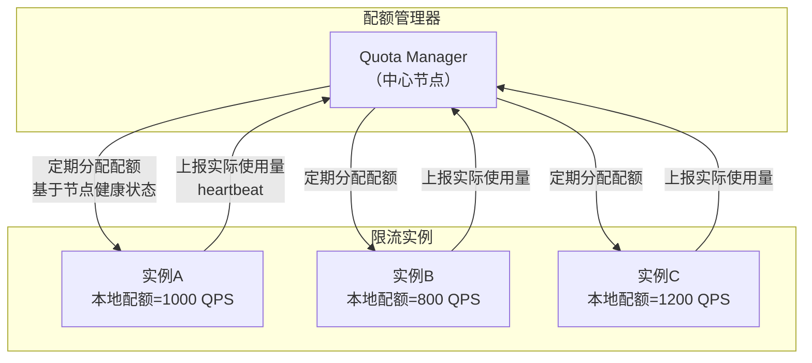

**优势**：
- 限流判断在本地完成，无网络开销，延迟极低（纳秒级）
- 无需Redis等外部依赖，系统可用性高
- 配额分摊可根据实例负载动态调整
- 即使配额管理器短暂不可用，本地限流仍能正常工作

**劣势**：
- 配额分摊和回收有延迟，短期内总放行量可能略超/略低于全局配额
- 需要解决实例宕机后的配额回收问题
- 实现复杂度较高，需要处理配额分配、回收、负载均衡等多个问题

#### 2.9.2 分布式限流方案对比

| 方案 | 一致性 | 延迟 | 依赖 | 实现复杂度 | 适用规模 |
|------|-------|------|------|-----------|---------|
| Redis原子操作 | 强一致 | 网络RTT（~1ms） | Redis集群 | 低 | 中小规模 |
| Redis + Lua脚本 | 强一致 | 网络RTT（~1ms） | Redis集群 | 中 | 中等规模 |
| 本地限流+配额分摊 | 最终一致 | 纳秒级 | 配额管理器 | 高 | 大规模 |
| 混合方案 | 最终一致 | 纳秒级 | Redis + 配额管理器 | 高 | 超大规模 |

---

### 2.10 限流的降级响应

限流不仅仅是在服务端丢弃请求，更重要的是如何向调用方返回有意义的信息。

#### 2.10.1 HTTP标准：429 Too Many Requests

根据RFC 6585，限流应该返回HTTP 429状态码，并携带以下信息：

HTTP/1.1 429 Too Many Requests
Content-Type: application/json
Retry-After: 5
X-RateLimit-Limit: 100
X-RateLimit-Remaining: 0
X-RateLimit-Reset: 1719400005

{
  "error": "rate_limit_exceeded",
  "message": "Request rate limit exceeded. Please retry after 5 seconds.",
  "retry_after": 5
}

#### 2.10.2 标准限流响应头

| Header | 说明 | 示例 |
|--------|------|------|
| `X-RateLimit-Limit` | 窗口内最大请求数 | 100 |
| `X-RateLimit-Remaining` | 窗口内剩余请求数 | 23 |
| `X-RateLimit-Reset` | 窗口重置的Unix时间戳 | 1719400005 |
| `Retry-After` | 建议重试等待秒数 | 5 |

这些头部信息对客户端至关重要——前端/移动端可以根据`Retry-After`自动展示倒计时，避免用户盲目重试加剧服务端压力。

#### 2.10.3 不同场景的降级策略

限流后的降级响应不应千篇一律，而应根据场景选择合适的策略：

| 场景 | 降级策略 | 用户体验 |
|------|---------|---------|
| 普通API请求 | 返回429 + Retry-After | 提示"请求过于频繁，请稍后重试" |
| 搜索/推荐接口 | 返回缓存数据/热门数据 | 用户看到结果，质量略降 |
| 支付/下单接口 | 返回排队提示 | 用户看到"排队中，预计等待X秒" |
| 消息发送 | 返回"发送中"状态 | 用户以为已发送，后台延迟处理 |
| 文件上传 | 返回"上传队列已满" | 明确告知，引导用户稍后重试 |

```python
class RateLimitResponseBuilder:
    """限流降级响应构建器"""
    
    @staticmethod
    def standard_429(retry_after: int, limit: int, remaining: int = 0,
                     reset_timestamp: int = 0) -> dict:
        """构建标准429响应"""
        return {
            "status": 429,
            "headers": {
                "Retry-After": str(retry_after),
                "X-RateLimit-Limit": str(limit),
                "X-RateLimit-Remaining": str(remaining),
                "X-RateLimit-Reset": str(reset_timestamp),
            },
            "body": {
                "error": "rate_limit_exceeded",
                "message": f"Rate limit exceeded. Retry after {retry_after} seconds.",
                "retry_after": retry_after,
            }
        }
    
    @staticmethod
    def graceful_degrade(cached_data: any) -> dict:
        """优雅降级：返回缓存数据"""
        return {
            "status": 200,
            "headers": {"X-Degraded": "true"},
            "body": cached_data,
        }
    
    @staticmethod
    def queue_mode(estimated_wait: int) -> dict:
        """排队模式：返回排队信息"""
        return {
            "status": 202,  # Accepted
            "headers": {"Retry-After": str(estimated_wait)},
            "body": {
                "status": "queued",
                "message": f"Request queued. Estimated wait: {estimated_wait}s",
                "estimated_wait_seconds": estimated_wait,
            }
        }
```

---

### 2.11 主流限流框架与中间件

#### 2.11.1 Java生态

| 框架 | 实现算法 | 分布式支持 | 适用场景 |
|------|---------|-----------|---------|
| Guava RateLimiter | 令牌桶 | 仅单机 | 单机接口限流 |
| Sentinel（阿里巴巴） | 滑动窗口+令牌桶 | 支持 | 微服务全场景 |
| Resilience4j | 令牌桶/计数器 | 不支持 | 轻量级限流 |
| Spring Cloud Gateway | 令牌桶 | Redis | API网关限流 |

**Guava RateLimiter**（最经典的单机令牌桶）：

```java
import com.google.common.util.concurrent.RateLimiter;
import java.util.concurrent.TimeUnit;

// 创建一个每秒产生10个令牌的限流器
RateLimiter limiter = RateLimiter.create(10.0);

// 方式1：阻塞等待获取令牌
limiter.acquire();  // 阻塞直到获取到令牌，精确控制输出速率

// 方式2：尝试在超时时间内获取令牌
boolean acquired = limiter.tryAcquire(100, TimeUnit.MILLISECONDS);

// 方式3：一次性获取多个令牌（预占）
if (limiter.tryAcquire(5)) {
    // 成功获取5个令牌，可以处理批量请求
    processBatch();
} else {
    // 令牌不足，执行降级
    degrade();
}
```

Guava RateLimiter的独特之处在于其**预消费模式**：`acquire()`方法会计算并阻塞恰好需要等待的时间，确保输出速率精确平滑。这种设计避免了"令牌突发消耗"导致的下游瞬时压力。Guava还提供了`warmup`模式（预热模式），在限流器启动时逐渐提升速率到目标值，避免冷启动时的流量冲击。

**Sentinel**（阿里巴巴开源，生产级推荐）：

Sentinel的核心特性：
- **滑动窗口统计**：精确统计QPS、RT、异常比例等指标
- **流量控制**：支持QPS限流和线程数限流
- **熔断降级**：支持慢调用比例、异常比例、异常数三种熔断策略
- **系统自适应保护**：基于CPU使用率、Load、RT的全局自适应限流
- **热点参数限流**：对热点参数（如热门商品ID）单独限流
- **集群限流**：支持基于Redis的集群流控

#### 2.11.2 Go生态

| 框架 | 实现算法 | 特点 |
|------|---------|------|
| golang.org/x/time/rate | 令牌桶 | Go标准库，简洁可靠 |
| Uber/ratelimit | 令牌桶 | 滑动窗口模式的令牌桶 |
| go-redis/redis_rate | 令牌桶 | 分布式限流 |
| Sentinel Go | 多种 | 阿里巴巴Sentinel的Go版本 |

**Go标准库rate.Limiter**（最推荐的起点）：

```go
import "golang.org/x/time/rate"

// 每秒10个令牌，桶容量20（允许突发20个请求）
limiter := rate.NewLimiter(10, 20)

// 方式1：等待获取令牌（阻塞模式）
ctx := context.Background()
if err := limiter.Wait(ctx); err != nil {
    // 被取消
    return
}

// 方式2：非阻塞检查
if limiter.Allow() {
    // 处理请求
    handleRequest()
} else {
    // 限流，返回429
    w.WriteHeader(http.StatusTooManyRequests)
}

// 方式3：带超时的等待
ctx, cancel := context.WithTimeout(context.Background(), 5*time.Second)
defer cancel()
if err := limiter.WaitN(ctx, 3); err != nil {
    // 等待超时或被取消
    handleRateLimit()
}
```

#### 2.11.3 Nginx限流

Nginx内置了两种限流模块：

```nginx
http {
    # 定义限流区域：按客户端IP限制，每秒10个请求
    limit_req_zone $binary_remote_addr zone=api_limit:10m rate=10r/s;
    
    # 定义并发连接限制
    limit_conn_zone $binary_remote_addr zone=conn_limit:10m;

    server {
        location /api/ {
            # 漏桶算法，burst=20表示允许突发20个请求排队
            # nodelay表示不排队等待，直接处理burst中的请求
            limit_req zone=api_limit burst=20 nodelay;
            
            # 并发连接限制
            limit_conn conn_limit 50;
            
            # 限流返回429
            limit_req_status 429;
            limit_conn_status 429;
            
            proxy_pass http://backend;
        }
    }
}
```

Nginx的`limit_req`使用**漏桶+延迟处理**的组合模式：
- `burst=20`：允许20个请求排队缓冲
- `nodelay`：burst内的请求立即处理（不排队等待），但仍然消耗配额
- 不加`nodelay`：burst内的请求按漏桶速率排队处理
- `rate=10r/s`：漏桶的泄漏速率，即长期平均处理速率

#### 2.11.4 Envoy/Istio限流

Envoy代理支持外置限流服务（External Rate Limiting Service），是服务网格中的标准限流方案：

```yaml
# Envoy配置：对/payment接口限流
routes:
  - match: { prefix: "/payment" }
    typed_per_filter_config:
      envoy.filters.http.ratelimit:
        "@type": type.googleapis.com/envoy.extensions.filters.http.ratelimit.v3.RateLimit
        domain: production
        rate_limit_service:
          grpc_service:
            envoy_grpc: { cluster_name: rate_limit_cluster }
          transport_api_version: V3
        actions:
          - generic_key:
              descriptor_key: "route"
              descriptor_value: "/payment"
```

---

### 2.12 限流参数配置指南

限流的"配多少"是工程实践中最困难的问题之一。配太松形同虚设，配太紧误伤正常流量。

#### 2.12.1 参数确定方法

**步骤一：确定基线QPS**

```bash
# 从监控系统获取过去7天的QPS数据
# 通常取 P99（99分位）作为基线
baseline_p99 = prometheus_query('rate(http_requests_total[5m])', quantile=0.99)
```

**步骤二：计算限流阈值**

限流阈值 = 基线P99 × 安全系数 + 缓冲余量

| 系数 | 典型值 | 说明 |
|------|--------|------|
| 安全系数 | 1.5 ~ 2.0 | 留出正常波动空间 |
| 缓冲余量 | 20% ~ 30% | 应对正常业务增长 |

例如：P99 QPS = 1,000，安全系数取1.5，缓冲余量20%：
限流阈值 = 1000 × 1.5 × 1.2 = 1800 QPS

**步骤三：考虑突发容忍度**

令牌桶参数设置：
  refill_rate = 限流阈值（1800 令牌/秒）
  capacity = refill_rate × 突发容忍秒数
            = 1800 × 3 = 5400（允许最多3秒的突发积压）

**步骤四：压测验证**

配置完限流参数后，必须通过压测验证：
1. 正常流量下：限流不应触发（Remaining > 0）
2. 突发流量下：限流应在阈值附近触发，降级响应正常
3. 极端流量下：系统保持稳定，不出现雪崩

#### 2.12.2 不同场景的配置建议

| 场景 | 算法 | 关键参数 | 说明 |
|------|------|---------|------|
| API网关全局限流 | 令牌桶 | capacity=10000, rate=5000 | 应对突发，长期控制 |
| 单接口限流 | 滑动窗口 | limit=100, window=1s | 精确控制单接口 |
| 用户级限流 | 令牌桶 | capacity=50, rate=10 | 防止单用户滥用 |
| 秒杀场景 | 漏桶 | capacity=1000, rate=500 | 严格控制下单速率 |
| 下游调用限流 | 令牌桶 | capacity=50, rate=30 | 保护下游服务 |
| 日志写入限流 | 漏桶 | capacity=10000, rate=5000 | 避免IO打满 |
| 搜索接口 | 滑动窗口 | limit=200, window=1s | 精确控制，防止缓存击穿 |

---

### 2.13 自适应限流：从静态阈值到智能控制

静态限流阈值无法应对流量模式的变化。自适应限流通过实时监控系统状态，动态调整限流参数。

#### 2.13.1 基于系统指标的自适应

```python
import time
import threading
import psutil

class AdaptiveTokenBucket:
    """自适应令牌桶——根据系统负载动态调整速率
    
    核心思想：当系统负载低时放宽限流，负载高时收紧限流。
    通过监控CPU、内存、响应时间等指标，实时调整令牌生成速率。
    
    调整策略：
    - CPU < 50%：速率提升到 baseline * 1.5
    - CPU 50%~80%：速率保持 baseline
    - CPU > 80%：速率降低到 baseline * 0.5
    - P99延迟 > 阈值：速率降低到 baseline * 0.3
    
    Args:
        baseline_rate: 基线令牌生成速率
        capacity: 桶容量
        check_interval: 系统指标检查间隔（秒）
    """
    
    def __init__(self, baseline_rate: float, capacity: int,
                 check_interval: float = 5.0):
        self.baseline_rate = baseline_rate
        self.capacity = capacity
        self.current_rate = baseline_rate
        self.tokens = float(capacity)
        self.last_refill = time.monotonic()
        self.lock = threading.Lock()
        
        # 自适应参数
        self.check_interval = check_interval
        self.last_check = time.monotonic()
        self.cpu_threshold_high = 80.0
        self.cpu_threshold_low = 50.0
        self.latency_threshold_ms = 500.0
        self.recent_latencies = []
        self.latency_lock = threading.Lock()
    
    def _maybe_adjust_rate(self):
        """根据系统指标调整速率"""
        now = time.monotonic()
        if now - self.last_check < self.check_interval:
            return
        self.last_check = now
        
        # 获取CPU使用率
        cpu_percent = psutil.cpu_percent(interval=0.1)
        
        # 获取近期延迟
        with self.latency_lock:
            if self.recent_latencies:
                avg_latency = sum(self.recent_latencies[-100:]) / len(self.recent_latencies[-100:])
                self.recent_latencies.clear()
            else:
                avg_latency = 0
        
        # 根据指标调整速率
        if cpu_percent > self.cpu_threshold_high or avg_latency > self.latency_threshold_ms:
            # 系统过载，降低速率
            self.current_rate = max(self.baseline_rate * 0.3, self.current_rate * 0.8)
        elif cpu_percent < self.cpu_threshold_low and avg_latency < self.latency_threshold_ms * 0.5:
            # 系统空闲，提升速率
            self.current_rate = min(self.baseline_rate * 1.5, self.current_rate * 1.2)
        else:
            # 正常范围，逐渐回归基线
            self.current_rate += (self.baseline_rate - self.current_rate) * 0.1
    
    def record_latency(self, latency_ms: float):
        """记录请求延迟（供外部调用）"""
        with self.latency_lock:
            self.recent_latencies.append(latency_ms)
    
    def allow(self) -> bool:
        with self.lock:
            self._maybe_adjust_rate()
            
            now = time.monotonic()
            elapsed = now - self.last_refill
            self.tokens = min(self.capacity, self.tokens + elapsed * self.current_rate)
            self.last_refill = now
            
            if self.tokens >= 1.0:
                self.tokens -= 1.0
                return True
            return False
```

#### 2.13.2 基于AIMD算法的自适应

AIMD（Additive Increase, Multiplicative Decrease）是TCP拥塞控制的核心算法，也可用于限流：

- **加性增加（AI）**：系统正常时，每个周期线性增加速率（如每秒+1 QPS）
- **乘性减少（MD）**：检测到过载时，速率减半

```python
class AIMDTokenBucket:
    """基于AIMD算法的自适应令牌桶
    
    借鉴TCP拥塞控制的AIMD策略：
    - 正常时线性增加速率（缓慢探索更高容量）
    - 过载时指数降低速率（快速避让）
    
    Args:
        initial_rate: 初始令牌生成速率
        min_rate: 最小速率下限
        max_rate: 最大速率上限
        increase_step: 每次线性增加的步长
    """
    
    def __init__(self, capacity: int, initial_rate: float = 100.0,
                 min_rate: float = 10.0, max_rate: float = 10000.0,
                 increase_step: float = 10.0):
        self.capacity = capacity
        self.current_rate = initial_rate
        self.min_rate = min_rate
        self.max_rate = max_rate
        self.increase_step = increase_step
        self.tokens = float(capacity)
        self.last_refill = time.monotonic()
        self.lock = threading.Lock()
    
    def on_success(self):
        """请求成功处理——加性增加"""
        with self.lock:
            self.current_rate = min(self.max_rate, self.current_rate + self.increase_step)
    
    def on_failure(self):
        """请求处理失败/超时——乘性减少"""
        with self.lock:
            self.current_rate = max(self.min_rate, self.current_rate * 0.5)
    
    def allow(self) -> bool:
        with self.lock:
            now = time.monotonic()
            elapsed = now - self.last_refill
            self.tokens = min(self.capacity, self.tokens + elapsed * self.current_rate)
            self.last_refill = now
            
            if self.tokens >= 1.0:
                self.tokens -= 1.0
                return True
            return False
```

---

### 2.14 限流的安全考量

限流不仅是性能问题，更是安全问题。攻击者可能利用限流机制本身的弱点发起攻击。

#### 2.14.1 常见限流绕过攻击

| 攻击方式 | 原理 | 防御手段 |
|---------|------|---------|
| IP轮换攻击 | 使用大量代理IP绕过IP级限流 | 结合用户身份认证限流 |
| Slowloris攻击 | 慢速建立连接耗尽资源 | 连接超时 + 并发连接限制 |
| 分布式CC攻击 | 多IP协同发起请求 | 全局限流 + 异常检测 |
| 重放攻击 | 重放合法请求消耗配额 | 请求签名 + 时间戳校验 |
| 参数篡改 | 修改限流key（如用户ID）绕过限流 | 服务端生成限流key |

#### 2.14.2 限流key的安全生成

限流key必须由服务端生成，不能信任客户端提供的任何参数：

```python
import hashlib
import hmac

class SecureRateLimitKeyGenerator:
    """安全的限流key生成器
    
    原则：限流key必须由服务端生成，不能使用客户端可篡改的参数。
    """
    
    @staticmethod
    def generate_key(request_context: dict) -> str:
        """生成安全的限流key
        
        Args:
            request_context: 包含认证信息的请求上下文
                - user_id: 已认证的用户ID（不可篡改）
                - ip: 客户端真实IP（从X-Forwarded-For解析）
                - api_path: API路径
        """
        user_id = request_context.get("user_id", "anonymous")
        ip = request_context.get("ip", "unknown")
        api_path = request_context.get("api_path", "/")
        
        # 使用HMAC确保key不可预测
        raw = f"{user_id}:{ip}:{api_path}"
        return hmac.new(b"rate-limit-secret", raw.encode(), hashlib.sha256).hexdigest()[:16]
```

---

### 2.15 常见误区与最佳实践

#### 2.15.1 常见误区

**误区一：限流阈值设死不调整**

线上流量模式会随业务发展、促销活动、季节性变化而变化。限流阈值应该：
- 通过监控系统持续观察实际QPS和错误率
- 支持动态配置变更（如通过配置中心Nacos/Apollo）
- 大促前主动提高阈值，大促后恢复
- 定期Review：每月或每季度根据最新数据调整

**误区二：所有接口使用统一限流策略**

不同接口的处理成本差异巨大：

查询接口：P99 = 5ms，QPS容量 = 10,000
下单接口：P99 = 500ms，QPS容量 = 100
推荐接口：P99 = 200ms，QPS容量 = 500

用统一的1,000 QPS限流对查询接口太松（无法保护），对下单接口太紧（正常流量都被限）。正确做法是按接口特性分别配置。

**误区三：只限不限——没有降级响应**

限流后的响应设计同样重要。常见问题：
- 返回500错误而非429 → 上游误以为服务异常，触发告警
- 不返回`Retry-After`头部 → 客户端盲目重试，加剧压力
- 不区分用户等级 → VIP用户和普通用户被同等限流
- 没有降级数据 → 用户看到空白页面而非缓存内容

**误区四：依赖单点限流器**

如果限流服务本身成为单点故障：
- 限流服务挂了 → 全部放行？还是全部拒绝？（需要有降级策略）
- Redis挂了 → 本地限流是否仍然生效？
- 最佳实践：**本地限流 + 分布式限流双层防护**

**误区五：忽略限流粒度**

仅做全局限流而忽略细粒度限流，可能导致：
- 一个异常用户的大量请求占满全局配额，正常用户被误限
- 一个热门接口的流量挤占其他接口的配额

正确做法：全局 → 接口 → 用户/IP 多层限流，每层独立配置。

#### 2.15.2 生产环境最佳实践

┌─────────────────────────────────────────────────────────────┐
│  限流最佳实践清单                                              │
├─────────────────────────────────────────────────────────────┤
│  ☑ 返回标准429状态码和Retry-After头部                         │
│  ☑ 本地限流 + 分布式限流双层防护                               │
│  ☑ 支持动态调整阈值，通过配置中心管理                            │
│  ☑ 按接口/用户/IP等多维度分别限流                               │
│  ☑ 限流事件记录到监控系统（被限流的比例/次数）                    │
│  ☑ 限流降级响应要友好（错误消息 + 建议等待时间）                  │
│  ☑ 定期Review限流配置，根据业务变化调整                          │
│  ☑ 大促前做好压测，确认限流阈值合理性                            │
│  ☑ 区分核心链路和非核心链路的限流策略                            │
│  ☑ 限流服务本身要有容错和降级能力                               │
│  ☑ 限流key由服务端生成，不信任客户端参数                        │
│  ☑ 监控限流命中率，异常波动及时告警                              │
└─────────────────────────────────────────────────────────────┘

---

### 2.16 限流算法的数学建模

对于希望深入理解限流理论的读者，以下从排队论角度对限流算法进行数学建模。

#### 2.16.1 令牌桶的数学性质

令牌桶算法可以用一个**有限容量的连续时间马尔可夫过程**来描述：

- 令牌到达过程：速率为λ的泊松过程（或确定性补充过程）
- 令牌消耗过程：由外部请求到达决定
- 系统状态：桶中令牌数 X(t) ∈ [0, capacity]

关键性质：

长期平均通过率 = min(请求到达率, 令牌生成速率)
突发容忍量 = 桶容量（capacity）
令牌清空时间 = capacity / refill_rate（秒）

对于一个 `capacity=100, refill_rate=10/s` 的令牌桶：
- 在空闲30秒后，桶中积攒 min(100, 30×10) = 100 个令牌
- 突发时可瞬时处理100个请求
- 之后以10 QPS的稳定速率继续处理

令牌桶的令牌数过程可以建模为一个**有限容量的出生-死亡过程（Birth-Death Process）**：

状态：X(t) = 桶中令牌数，X(t) ∈ {0, 1, 2, ..., capacity}
出生率（令牌补充）：λ = refill_rate
死亡率（令牌消耗）：μ = 请求到达率（在有请求时）

稳态分布下，令牌数为k的概率：

P(X = k) = (1 - ρ) × ρ^k / (1 - ρ^(capacity+1))
其中 ρ = λ / μ（当 λ < μ 时）

#### 2.16.2 与排队论的联系

限流算法本质上是在构建一个**有限队列系统**（M/D/1/K 或 M/M/1/K）：

| 模型 | 到达过程 | 服务过程 | 队列容量 | 对应限流算法 |
|------|---------|---------|---------|------------|
| M/D/1/K | 泊松到达 | 确定性服务 | 有限K | 漏桶 |
| M/M/1/K | 泊松到达 | 指数服务 | 有限K | 带排队的滑动窗口 |
| GI/G/1/K | 一般到达 | 一般服务 | 有限K | 令牌桶 |

其中M表示Markov（泊松），D表示Deterministic（确定性），GI表示一般独立到达，K为系统容量。理解这些模型可以帮助我们通过排队论公式计算平均等待时间、拒绝概率等关键指标，从而更科学地配置限流参数。

**拒绝概率计算**（以M/D/1/K漏桶为例）：

P_reject = ρ^K × (1 - ρ) / (1 - ρ^(K+1))
其中 ρ = λ/μ，K = 桶容量

例如：请求到达率λ=150/s，处理速率μ=100/s，桶容量K=50：
ρ = 150/100 = 1.5
P_reject = 1.5^50 × (1-1.5) / (1-1.5^51) ≈ 0.333
即约33.3%的请求会被拒绝。

---

### 2.17 实战：构建一个完整的限流中间件

以下是一个生产级限流中间件的完整实现，支持多维度限流、动态配置和监控集成：

```python
import time
import threading
from collections import defaultdict
from typing import Callable, Optional, Dict

class RateLimitMiddleware:
    """多维度限流中间件
    
    支持按不同维度（用户/IP/接口）独立限流，使用令牌桶算法。
    支持动态配置变更和限流统计。
    
    Usage:
        limiter = RateLimitMiddleware()
        limiter.configure("api:/search", capacity=100, rate=50)
        limiter.configure("user:default", capacity=30, rate=10)
        
        if limiter.is_allowed("api:/search", user_id="123"):
            return handle_request()
        else:
            return error_response(429, "Rate limit exceeded")
    """
    
    def __init__(self):
        self.buckets = {}          # key -> TokenBucket
        self.lock = threading.Lock()
        self.stats = defaultdict(lambda: {"allowed": 0, "denied": 0})
        self.stats_lock = threading.Lock()
    
    def configure(self, key: str, capacity: int, rate: float):
        """配置某个维度的限流参数"""
        with self.lock:
            self.buckets[key] = _TokenBucket(capacity, rate)
    
    def remove(self, key: str):
        """移除某个维度的限流配置"""
        with self.lock:
            self.buckets.pop(key, None)
    
    def is_allowed(self, *dimension_keys: str) -> bool:
        """检查请求是否被允许
        
        可传入多个维度，任一维度超限即拒绝（AND逻辑）。
        例如：is_allowed("api:/search", "user:123", "ip:10.0.0.1")
        """
        for key in dimension_keys:
            bucket = self.buckets.get(key)
            if bucket and not bucket.allow():
                with self.stats_lock:
                    self.stats[key]["denied"] += 1
                return False
        
        # 通过所有维度检查
        for key in dimension_keys:
            with self.stats_lock:
                self.stats[key]["allowed"] += 1
        return True
    
    def get_stats(self) -> Dict:
        """获取限流统计"""
        with self.stats_lock:
            return dict(self.stats)
    
    def get_rejection_rate(self, key: str) -> float:
        """获取某个维度的限流拒绝率"""
        with self.stats_lock:
            s = self.stats[key]
            total = s["allowed"] + s["denied"]
            return s["denied"] / total if total > 0 else 0.0


class _TokenBucket:
    """内部令牌桶实现"""
    
    def __init__(self, capacity: int, refill_rate: float):
        self.capacity = capacity
        self.refill_rate = refill_rate
        self.tokens = float(capacity)
        self.last_time = time.monotonic()
        self.lock = threading.Lock()
    
    def allow(self) -> bool:
        with self.lock:
            now = time.monotonic()
            elapsed = now - self.last_time
            self.tokens = min(self.capacity, self.tokens + elapsed * self.refill_rate)
            self.last_time = now
            
            if self.tokens >= 1.0:
                self.tokens -= 1.0
                return True
            return False


# ===== Flask中间件集成示例 =====
def create_rate_limit_decorator(limiter: RateLimitMiddleware):
    """创建Flask路由装饰器"""
    def decorator(f: Callable):
        def wrapper(*args, **kwargs):
            from flask import request, jsonify
            
            # 构建限流维度
            dimensions = [
                f"api:{request.path}",
                f"ip:{request.remote_addr}",
            ]
            # 可选：从请求中提取用户ID
            user_id = request.headers.get("X-User-ID")
            if user_id:
                dimensions.append(f"user:{user_id}")
            
            if limiter.is_allowed(*dimensions):
                return f(*args, **kwargs)
            else:
                return jsonify({
                    "error": "rate_limit_exceeded",
                    "message": "Too many requests. Please retry later.",
                    "retry_after": 5,
                }), 429
        
        wrapper.__name__ = f.__name__
        return wrapper
    return decorator
```

---

### 2.18 本节小结

| 算法 | 核心机制 | 突发处理 | 实现复杂度 | 推荐场景 |
|------|---------|---------|-----------|---------|
| 固定窗口 | 固定时间段计数 | 有临界突发 | 极简 | 资源受限场景的粗粒度限流 |
| 滑动窗口 | 时间窗口连续滑动 | 平滑过渡 | 中等 | 接口级精细限流 |
| 漏桶 | 固定速率流出 | 不允许突发 | 中等 | 流量整形、消息消费限速 |
| 令牌桶 | 固定速率补充令牌 | 允许突发 | 中等 | **首选方案**，微服务/API网关 |

**核心要点**：

1. **令牌桶是工业界的默认选择**——它在平滑性和突发容忍之间取得了最佳平衡
2. **分布式限流用"本地+中心"双层架构**——本地限流保证低延迟，中心协调保证全局一致性
3. **限流不是"设完不管"**——需要监控、动态调整、降级响应三者配合
4. **限流要分维度**——按接口、按用户、按IP分别配置，避免"一刀切"
5. **返回429 + Retry-After**是行业标准，让调用方能优雅重试
6. **自适应限流是进阶方向**——基于系统指标动态调整，比静态阈值更智能
7. **限流安全不可忽视**——限流key由服务端生成，防止绕过攻击

限流是高并发系统的第一道防线，与熔断、降级、弹性伸缩共同构成了完整的系统过载保护体系。下一节我们将深入探讨熔断与降级机制——当限流防线被突破后，系统如何优雅地降级而非崩溃。
