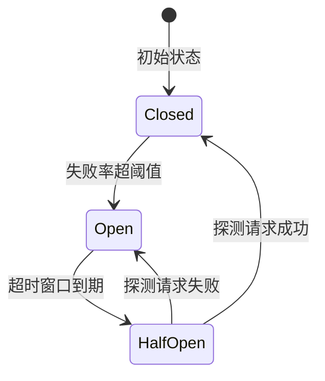
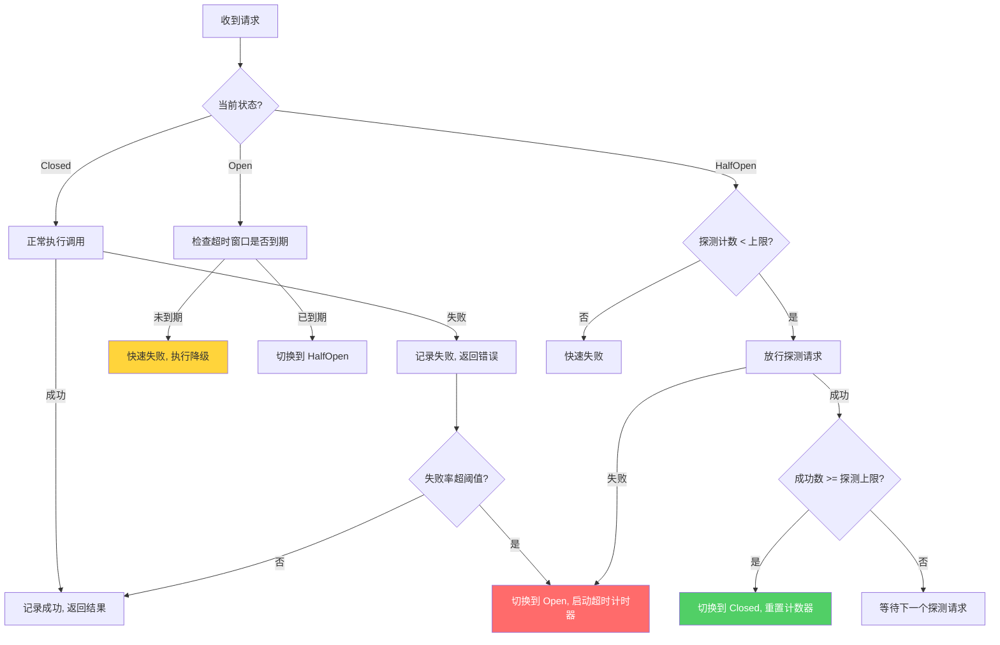
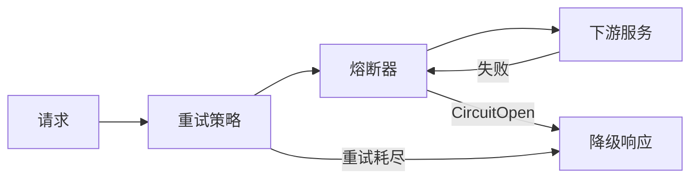
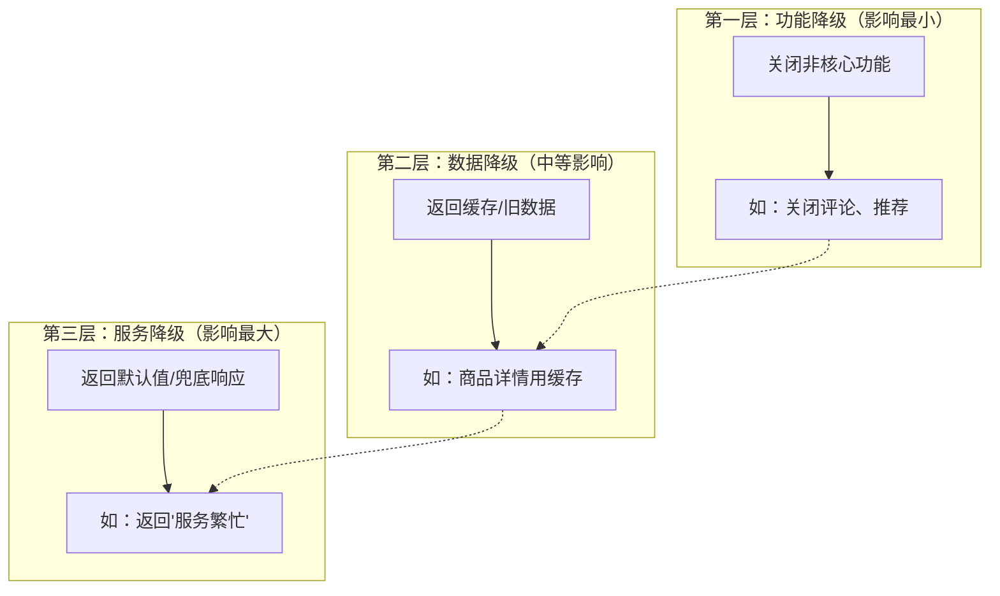
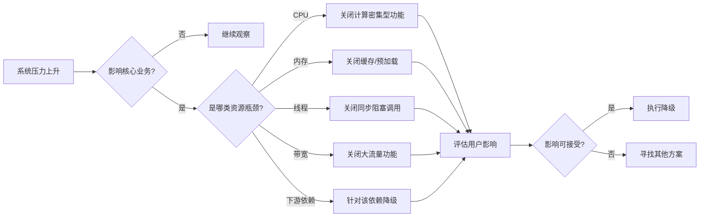
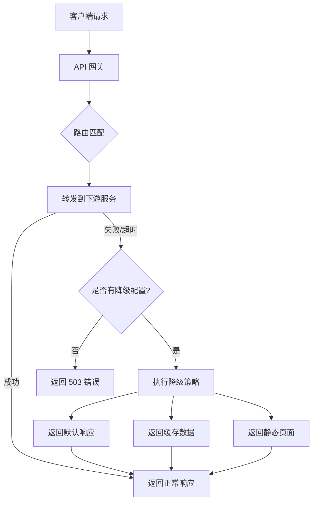
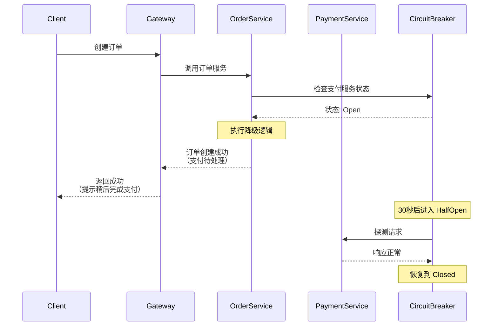
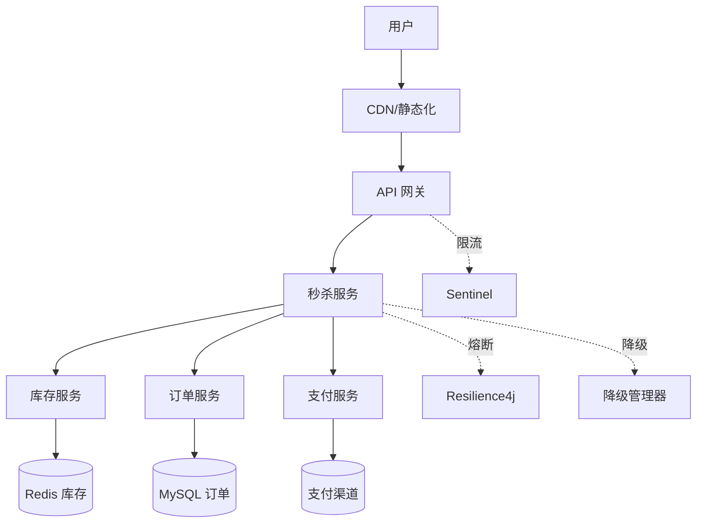

## 三、熔断与降级

在高并发分布式系统中，服务之间的调用链路错综复杂。一个下游服务的故障可能像多米诺骨牌一样引发整条链路的雪崩。**熔断（Circuit Breaker）** 和 **降级（Graceful Degradation）** 是两种互补的容错机制——前者在故障发生时"果断断路"保护系统，后者在资源紧张时"主动让步"保证核心体验。两者共同构成了高并发系统的"免疫系统"。

本节将从理论原理、模式设计、框架选型、架构模式、监控运维到实战案例，系统性地讲解熔断与降级的完整知识体系。

### 3.1 核心概念与背景

#### 3.1.1 为什么需要熔断与降级

在一个典型的微服务架构中，一次用户请求可能经过 5-20 个服务的串联调用。假设每个服务的可用性为 99.9%，链路上 10 个服务的综合可用性仅为：

0.999^10 = 99.0%（即每年有约 87.6 小时的不可用时间）

更极端地，如果链路上有 20 个服务：

0.999^20 = 98.0%（每年约 175 小时不可用）

当某个下游服务出现故障（响应变慢或直接超时），上游调用方的线程会被阻塞等待，导致线程池耗尽，进而影响该服务处理其他正常请求的能力——这就是**级联故障（Cascading Failure）**，也叫**雪崩效应**。

雪崩效应的典型传播路径：

下游服务变慢 → 上游线程阻塞 → 上游线程池耗尽 → 上游无法服务其他请求
→ 调用上游的其他服务也开始堆积 → 整条链路瘫痪

熔断与降级要解决的核心问题是：**在部分故障不可避免的前提下，如何将故障的影响范围控制在最小，保证系统的整体可用性**。

#### 3.1.2 熔断器的现实类比

熔断器（Circuit Breaker）的概念直接来源于电气工程中的保险丝/断路器：

- **正常状态**：电流（请求）正常通过，断路器闭合
- **过载保护**：电流超过阈值，断路器自动断开，切断电路防止设备烧毁
- **手动恢复**：排除故障后，手动合闸恢复供电

软件熔断器与此类似，但增加了"半开"状态实现自动探测恢复，无需人工干预。这个设计思路源于 Michael Nygard 在《Release It!》一书中的经典总结。

#### 3.1.3 熔断与限流的区别

很多人将熔断与限流混淆，二者本质不同：

| 维度 | 限流（Rate Limiting） | 熔断（Circuit Breaker） |
|------|----------------------|------------------------|
| 触发条件 | 请求量超过预设阈值 | 调用失败率/超时率超过阈值 |
| 作用对象 | 所有请求（含正常请求） | 仅针对故障下游的请求 |
| 目的 | 保护自身不被打垮 | 保护下游不被压垮，同时保护自身线程资源 |
| 恢复方式 | 自动（令牌补充/窗口滑动） | 自动探测 + 半开状态过渡 |
| 粒度 | 通常按 API/用户/IP | 通常按服务/接口/实例 |
| 是否感知下游状态 | 否，只关注自身吞吐 | 是，基于下游的健康状况决策 |

限流是"我处理不过来就拒绝"，熔断是"你已经出问题了，我先不调你了"。在实际系统中，二者通常配合使用。

#### 3.1.4 三大容错模式的关系

在微服务容错体系中，熔断、降级和隔离舱（Bulkhead）是三个互补的核心模式，它们共同服务于一个目标：**故障隔离与优雅退化**。

| 模式 | 核心思想 | 解决的问题 | 类比 |
|------|---------|-----------|------|
| 熔断（Circuit Breaker） | 检测到故障后快速失败 | 级联故障传播 | 电路保险丝 |
| 降级（Degradation） | 主动降低服务质量 | 资源不足时保核心 | 飞机紧急减重 |
| 隔离舱（Bulkhead） | 限制并发隔离资源 | 故障扩散到其他模块 | 船舶水密舱壁 |

三者的关系：隔离舱防扩散，熔断检测故障并切断调用，降级提供故障时的兜底方案。一个健壮的系统通常三者兼备。

### 3.2 熔断器模式详解

#### 3.2.1 三态模型

Michael Nygard 在《Release It!》一书中提出的经典熔断器模式包含三种状态：



**1. 关闭状态（Closed）—— 正常放行**

熔断器处于"闭合"状态，所有请求正常放行。同时，熔断器在后台统计请求的成功/失败情况：

- 滑动窗口内失败次数达到阈值 → 切换到 **Open**
- 滑动窗口内失败率（如 50%）达到阈值 → 切换到 **Open**
- 连续失败次数达到阈值 → 切换到 **Open**

```python
import time
from collections import deque

# 状态枚举
CLOSED = "CLOSED"
OPEN = "OPEN"
HALF_OPEN = "HALF_OPEN"

class CircuitBreakerClosed:
    """关闭状态：正常放行，后台统计失败率"""
    
    def __init__(self, failure_threshold=5, failure_rate=0.5, window_size=60):
        self.failure_threshold = failure_threshold  # 最低失败次数触发
        self.failure_rate = failure_rate            # 失败率阈值
        self.window_size = window_size              # 滑动窗口大小（秒）
        self.failures = deque()                     # (timestamp,) 失败记录
        self.successes = deque()                    # (timestamp,) 成功记录
        self.consecutive_failures = 0               # 连续失败计数
    
    def record_success(self):
        now = time.time()
        self.successes.append(now)
        self._cleanup(now)
        # 成功时重置连续失败计数
        self.consecutive_failures = 0
        return CLOSED
    
    def record_failure(self):
        now = time.time()
        self.failures.append(now)
        self.consecutive_failures += 1
        self._cleanup(now)
        
        # 检查是否触发熔断：需满足两个条件
        total = len(self.failures) + len(self.successes)
        if total >= self.failure_threshold:
            fail_rate = len(self.failures) / total
            if fail_rate >= self.failure_rate:
                return OPEN  # 触发熔断，切换到 Open 状态
        return CLOSED
    
    def _cleanup(self, now):
        """清理滑动窗口外的过期记录"""
        cutoff = now - self.window_size
        while self.failures and self.failures[0] < cutoff:
            self.failures.popleft()
        while self.successes and self.successes[0] < cutoff:
            self.successes.popleft()
```

**2. 开启状态（Open）—— 快速失败**

熔断器处于"断开"状态，所有请求直接拒绝（快速失败），不再向下游发送请求。这是保护下游服务和自身线程资源的关键机制。

在开启状态下，每个被拒绝的请求可以执行**降级逻辑**（返回缓存数据、默认值、错误提示等），而不是简单地返回错误。

经过设定的超时时间后，熔断器自动进入半开状态，开始探测下游是否恢复。

**3. 半开状态（Half-Open）—— 探测恢复**

熔断器允许少量探测请求通过，观察下游是否已恢复：

- 探测请求全部成功 → 切换到 **Closed**，恢复正常调用
- 探测请求中有失败 → 切换回 **Open**，继续等待下一轮探测

半开状态的关键参数：

| 参数 | 说明 | 典型值 |
|------|------|--------|
| 探测窗口 | 半开状态的持续时间 | 5-30 秒 |
| 探测请求数 | 半开期间允许通过的请求数 | 3-10 个 |
| 探测成功率 | 要求达到的成功率才恢复到 Closed | 100% 或 80% |

#### 3.2.2 完整的熔断器实现

以下是生产级别的熔断器实现，包含完整的状态管理、指标采集和事件回调：

```go
package breaker

import (
    "sync"
    "sync/atomic"
    "time"
)

type State int32

const (
    StateClosed   State = iota  // 0
    StateOpen                   // 1
    StateHalfOpen               // 2
)

type CircuitBreaker struct {
    state atomic.Int32
    
    // 配置
    failureThreshold int           // 触发熔断的最低失败次数
    failureRate      float64       // 触发熔断的失败率阈值
    openTimeout      time.Duration // Open 状态持续时间
    halfOpenMax      int           // 半开状态最大探测请求数
    
    // 滑动窗口统计
    mu           sync.Mutex
    windowSize   time.Duration
    requests     []requestRecord  // 请求记录（时间 + 是否成功）
    
    // 半开状态计数
    halfOpenCount    atomic.Int32
    halfOpenSuccess  atomic.Int32
    
    // 事件回调
    onStateChange func(from, to State)
}

type requestRecord struct {
    timestamp time.Time
    success   bool
}

func New(opts ...Option) *CircuitBreaker {
    cb := &amp;CircuitBreaker{
        failureThreshold: 5,
        failureRate:      0.5,
        openTimeout:      30 * time.Second,
        halfOpenMax:      3,
        windowSize:       60 * time.Second,
    }
    for _, opt := range opts {
        opt(cb)
    }
    cb.state.Store(int32(StateClosed))
    return cb
}

func (cb *CircuitBreaker) Execute(fn func() error) error {
    state := State(cb.state.Load())
    
    switch state {
    case StateClosed:
        return cb.executeClosed(fn)
    case StateOpen:
        return cb.executeOpen()
    case StateHalfOpen:
        return cb.executeHalfOpen(fn)
    }
    return nil
}

func (cb *CircuitBreaker) executeClosed(fn func() error) error {
    err := fn()
    
    cb.mu.Lock()
    now := time.Now()
    cb.cleanup(now)
    
    if err != nil {
        cb.requests = append(cb.requests, requestRecord{now, false})
    } else {
        cb.requests = append(cb.requests, requestRecord{now, true})
    }
    
    shouldTrip := cb.shouldTrip()
    cb.mu.Unlock()
    
    if shouldTrip {
        cb.trip()
    }
    return err
}

func (cb *CircuitBreaker) shouldTrip() bool {
    var successes, failures int
    for _, r := range cb.requests {
        if r.success {
            successes++
        } else {
            failures++
        }
    }
    total := successes + failures
    if total < cb.failureThreshold {
        return false
    }
    failRate := float64(failures) / float64(total)
    return failRate >= cb.failureRate
}

func (cb *CircuitBreaker) trip() {
    old := cb.state.Swap(int32(StateOpen))
    if cb.onStateChange != nil &amp;&amp; State(old) != StateOpen {
        cb.onStateChange(State(old), StateOpen)
    }
    // 设置定时器，超时后进入半开状态
    time.AfterFunc(cb.openTimeout, func() {
        cb.mu.Lock()
        if State(cb.state.Load()) == StateOpen {
            cb.state.Store(int32(StateHalfOpen))
            cb.halfOpenCount.Store(0)
            cb.halfOpenSuccess.Store(0)
            if cb.onStateChange != nil {
                cb.onStateChange(StateOpen, StateHalfOpen)
            }
        }
        cb.mu.Unlock()
    })
}

func (cb *CircuitBreaker) executeOpen() error {
    // 快速失败，返回错误（上层可执行降级逻辑）
    return ErrCircuitOpen
}

func (cb *CircuitBreaker) executeHalfOpen(fn func() error) error {
    // 限制并发探测请求数
    count := cb.halfOpenCount.Add(1)
    if int(count) > cb.halfOpenMax {
        cb.halfOpenCount.Add(-1)
        return ErrCircuitOpen
    }
    
    err := fn()
    
    if err != nil {
        // 探测失败，回到 Open
        cb.trip()
        return err
    }
    
    cb.halfOpenSuccess.Add(1)
    
    // 所有探测请求都成功，恢复到 Closed
    if int(cb.halfOpenSuccess.Load()) >= cb.halfOpenMax {
        old := cb.state.Swap(int32(StateClosed))
        cb.mu.Lock()
        cb.requests = nil  // 清空窗口
        cb.mu.Unlock()
        if cb.onStateChange != nil &amp;&amp; State(old) != StateClosed {
            cb.onStateChange(State(old), StateClosed)
        }
    }
    return nil
}

func (cb *CircuitBreaker) cleanup(now time.Time) {
    cutoff := now.Add(-cb.windowSize)
    idx := 0
    for i, r := range cb.requests {
        if r.timestamp.After(cutoff) {
            idx = i
            break
        }
        if i == len(cb.requests)-1 {
            idx = len(cb.requests)
        }
    }
    cb.requests = cb.requests[idx:]
}
```

#### 3.2.3 状态切换的完整流程图



#### 3.2.4 重试与熔断的协同

重试（Retry）和熔断（Circuit Breaker）是两个经常配合使用的机制，但它们的组合需要精心设计，否则可能适得其反。

**正确的组合顺序：重试在外，熔断在内**



**错误的组合（熔断在外，重试在内）**：每次重试都会被熔断器计数，导致正常的瞬态失败被放大，熔断器过早触发。

**重试策略与熔断器的参数协调原则**：

| 原则 | 说明 |
|------|------|
| 重试次数与失败率阈值协调 | 如果熔断阈值是 5 次失败触发，重试不应超过 3 次，否则单次请求的重试就可能触发熔断 |
| 重试间隔应小于熔断窗口 | 重试间隔过长会导致窗口内的请求样本不足，熔断器无法准确判断 |
| 仅对幂等操作重试 | 非幂等操作（如扣款）重试可能导致重复执行 |
| 使用指数退避 | 固定间隔重试可能加剧下游负载，指数退避+抖动更安全 |

```python
import time
import random

class RetryWithCircuitBreaker:
    """重试 + 熔断组合策略"""
    
    def __init__(self, circuit_breaker, max_retries=3, 
                 base_delay=0.1, max_delay=2.0, jitter=True):
        self.breaker = circuit_breaker
        self.max_retries = max_retries
        self.base_delay = base_delay
        self.max_delay = max_delay
        self.jitter = jitter
    
    def execute(self, func, *args, **kwargs):
        last_error = None
        
        for attempt in range(self.max_retries + 1):
            try:
                # 所有重试都在熔断器保护下执行
                return self.breaker.execute(lambda: func(*args, **kwargs))
            except CircuitBreakerOpen:
                # 熔断器已打开，不再重试，直接走降级
                raise
            except Exception as e:
                last_error = e
                if attempt < self.max_retries:
                    # 指数退避 + 随机抖动
                    delay = min(self.base_delay * (2 ** attempt), self.max_delay)
                    if self.jitter:
                        delay *= (0.5 + random.random())
                    time.sleep(delay)
        
        raise last_error
```

#### 3.2.5 隔离舱（Bulkhead）模式

隔离舱模式借鉴了船舶设计中的水密舱壁概念：将系统资源按服务或功能划分成独立的"舱室"，一个舱室的故障不会蔓延到其他舱室。

在微服务场景中，隔离舱通常有两种实现方式：

**线程池隔离（Thread Pool Bulkhead）**：为每个下游服务分配独立的线程池，一个服务的线程池耗尽不影响其他服务。

```python
from concurrent.futures import ThreadPoolExecutor

class BulkheadPool:
    """线程池隔离舱"""
    
    def __init__(self):
        # 每个下游服务独立线程池，互不影响
        self.pools = {
            "payment": ThreadPoolExecutor(max_workers=10, 
                                          thread_name_prefix="pay"),
            "recommendation": ThreadPoolExecutor(max_workers=5, 
                                                 thread_name_prefix="rec"),
            "user_profile": ThreadPoolExecutor(max_workers=8, 
                                               thread_name_prefix="user"),
        }
        # 每个池的队列上限
        self.max_queue = {
            "payment": 20,
            "recommendation": 10,
            "user_profile": 15,
        }
    
    def execute(self, service_name, func, *args, **kwargs):
        pool = self.pools.get(service_name)
        if pool is None:
            raise ValueError(f"未知服务: {service_name}")
        
        try:
            future = pool.submit(func, *args, **kwargs)
            return future.result(timeout=5)  # 5 秒超时
        except futures.TimeoutError:
            # 线程池满或执行超时 → 降级
            raise BulkheadFullError(f"{service_name} 隔离舱已满")
        except futures.BrokenExecutor:
            raise BulkheadFullError(f"{service_name} 线程池异常")
```

**信号量隔离（Semaphore Bulkhead）**：使用计数器限制对某个服务的最大并发调用数，比线程池更轻量。

```python
import threading

class SemaphoreBulkhead:
    """信号量隔离舱"""
    
    def __init__(self):
        self.semaphores = {
            "payment": threading.Semaphore(20),     # 最大 20 并发
            "recommendation": threading.Semaphore(10),
            "user_profile": threading.Semaphore(15),
        }
    
    def execute(self, service_name, func, *args, **kwargs):
        sem = self.semaphores[service_name]
        acquired = sem.acquire(blocking=False)
        if not acquired:
            raise BulkheadFullError(f"{service_name} 并发已达上限")
        try:
            return func(*args, **kwargs)
        finally:
            sem.release()
```

**隔离舱与熔断器的配合**：隔离舱是第一道防线——限制并发防过载；熔断器是第二道防线——检测故障后快速失败。两者通常串联使用：请求先经过隔离舱检查并发，再经过熔断器检查健康状态。

### 3.3 降级策略体系

降级（Graceful Degradation）是指在系统压力过大或部分功能不可用时，主动放弃非核心功能、降低服务质量，以保证核心功能的可用性。

#### 3.3.1 降级的三个层次

降级策略按照对用户的影响程度，从轻到重分为三个层次：



| 降级层次 | 触发条件 | 用户感知 | 实现复杂度 | 示例 |
|----------|---------|---------|-----------|------|
| 功能降级 | 流量激增、资源紧张 | 部分功能不可用 | 低 | 关闭商品推荐、评论区 |
| 数据降级 | 下游延迟增加 | 数据可能不是最新 | 中 | 展示缓存数据、简化数据 |
| 服务降级 | 服务完全不可用 | 使用兜底方案 | 高 | 返回默认值、静态化页面 |

设计降级策略时，应遵循"由轻到重"的原则：先尝试功能降级，不够再升级到数据降级，最后才是服务降级。每一层都应该是独立可切换的。

#### 3.3.2 常见降级模式

**1. 返回默认值**

最简单的降级方式。当下游服务不可用时，返回预设的默认数据：

```python
def get_user_vip_level(user_id):
    try:
        result = vip_service.query(user_id, timeout=2)
        return result.level
    except (Timeout, ServiceUnavailable):
        # 降级：返回默认等级（非 null，上游可安全使用）
        return "basic"
```

**2. 返回缓存数据**

对于不那么实时的数据，返回缓存中的旧数据。关键在于异步更新缓存，保证下次请求时数据尽可能新鲜：

```go
func GetProductPrice(productID string) (float64, error) {
    // 先尝试实时查询
    price, err := priceService.GetPrice(productID)
    if err != nil {
        // 降级：从缓存读取上次的价格
        cached, cacheErr := cache.Get("price:" + productID)
        if cacheErr != nil {
            return 0, fmt.Errorf("no fallback available")
        }
        metrics.Incr("price_fallback_cache")
        return cached.(float64), nil
    }
    
    // 实时查询成功，异步更新缓存（下次降级时数据更准）
    go cache.Set("price:"+productID, price, 10*time.Minute)
    return price, nil
}
```

**3. 静态化/页面降级**

对于读多写少的页面，在高并发时直接返回静态化内容。这种降级方式的效果最好，因为静态页面可以直接部署到 CDN，不消耗应用服务器资源：

```python
class PageDegradation:
    def __init__(self):
        self.static_pages = {}  # 预生成的静态页面
    
    def get_page(self, page_id, request):
        try:
            # 尝试动态渲染
            return self.dynamic_render(page_id, request)
        except ServiceDegraded:
            # 降级：返回静态页面
            if page_id in self.static_pages:
                return self.static_pages[page_id]
            # 最后兜底：生成最小化页面
            return self.build_minimal_page(page_id)
    
    def build_minimal_page(self, page_id):
        """构建最小可用页面，只保留核心信息"""
        return f"""
        <html><body>
        <h1>服务维护中</h1>
        <p>核心功能正常使用，部分功能暂时不可用。</p>
        <p>页面ID: {page_id}</p>
        </body></html>
        """
```

**4. 写降级——异步化**

高并发写入场景下，将同步写降级为异步写。这种模式特别适用于对数据一致性要求不高的场景（如日志、统计、通知）：

```python
class WriteDegradation:
    def __init__(self):
        self.message_queue = MQClient()
        self.write_mode = "sync"  # sync / async / blocked
    
    def save_order(self, order):
        if self.write_mode == "sync":
            return self.db.insert(order)
        elif self.write_mode == "async":
            # 异步降级：写入消息队列，稍后消费
            self.message_queue.publish("order_queue", order)
            return {"status": "pending", "message": "订单已接收，处理中"}
        else:
            # 完全阻塞：写入磁盘临时文件，等恢复后补偿
            self._save_to_local(order)
            return {"status": "blocked", "message": "系统繁忙，请稍后再试"}
    
    def _save_to_local(self, order):
        """写入本地临时文件，作为最终兜底"""
        import json
        with open(f"/tmp/orders/{order.id}.json", "w") as f:
            json.dump(order.to_dict(), f)
```

**5. 流量降级——主动限流**

在预知大流量到来前（如大促），主动对非核心链路进行限流：

```go
func handleRequest(w http.ResponseWriter, r *http.Request) {
    path := r.URL.Path
    
    // 核心链路：下单、支付 —— 不降级
    if isCorePath(path) {
        coreHandler(w, r)
        return
    }
    
    // 非核心链路：推荐、评论、积分 —— 主动限流
    if !rateLimiter.Allow(path) {
        w.WriteHeader(http.StatusServiceUnavailable)
        json.NewEncoder(w).Encode(map[string]string{
            "error": "service_degraded",
            "msg":   "当前流量较大，该服务暂时不可用",
        })
        return
    }
    
    normalHandler(w, r)
}
```

**6. 体验降级——渐进式简化**

不直接关闭功能，而是提供"简化版"体验，用户感知更低：

```python
class ExperienceDegradation:
    """渐进式体验降级"""
    
    def get_product_list(self, category_id):
        """商品列表：全量 → 简化 → 仅名称"""
        level = self._get_degradation_level()
        
        if level == 0:
            # 正常：完整数据（图片、价格、评价、推荐标签）
            return self.db.query_full(category_id)
        elif level == 1:
            # 轻度降级：去掉图片 CDN 回源，用缩略图
            items = self.db.query_basic(category_id)
            for item in items:
                item["image"] = item["thumbnail"]  # 缩略图替代
                item["reviews"] = None             # 隐藏评价数
            return items
        else:
            # 重度降级：仅返回名称和价格
            return self.db.query_minimal(category_id)
```

#### 3.3.3 降级决策矩阵

在实际系统中，决定"降什么、怎么降"需要一个清晰的决策框架：



### 3.4 熔断器的关键参数配置

配置熔断器参数是工程实践中最容易出错的环节。参数过松则保护不够，过紧则误杀正常请求。

#### 3.4.1 参数配置指南

| 参数 | 说明 | 配置建议 | 误配置后果 |
|------|------|---------|-----------|
| failureThreshold | 触发熔断的最低失败次数 | ≥5，避免小样本误判 | 过小→网络抖动即熔断；过大→故障扩散 |
| failureRate | 触发熔断的失败率 | 50%（默认），核心服务可降至 30% | 过高→保护不足；过低→频繁误熔断 |
| windowSize | 滑动窗口大小 | 10-60 秒，视业务 RT 而定 | 过短→数据不足；过长→反应迟钝 |
| openTimeout | Open 状态超时时间 | 5-30 秒 | 过短→频繁探测；过长→恢复慢 |
| halfOpenMax | 半开探测请求数 | 3-10 个 | 过少→数据不足；过多→冲击未恢复的下游 |

**参数调优的核心思路**：以业务的正常延迟分布为基线。例如，如果某服务 P99 延迟是 200ms，那么超时阈值设为 500ms 是合理的；如果窗口内每秒约有 100 个请求，60 秒窗口就有约 6000 个样本，足以做出准确判断。

#### 3.4.2 自适应参数调整

静态参数无法适应业务波动。基于统计学的自适应阈值算法能根据实时数据动态调整：

```python
class AdaptiveCircuitBreaker:
    """基于指数加权移动平均（EWMA）的自适应熔断器"""
    
    def __init__(self, alpha=0.3, threshold_multiplier=2.0):
        self.alpha = alpha  # EWMA 平滑系数，越大对新数据越敏感
        self.threshold_multiplier = threshold_multiplier
        self.ewma_latency = 0.0
        self.ewma_error_rate = 0.0
        self.sample_count = 0
    
    def record_request(self, latency_ms, is_error):
        self.sample_count += 1
        
        # EWMA 更新延迟：新值 = α × 当前值 + (1-α) × 上次值
        if self.sample_count == 1:
            self.ewma_latency = latency_ms
        else:
            self.ewma_latency = (self.alpha * latency_ms + 
                                (1 - self.alpha) * self.ewma_latency)
        
        # EWMA 更新错误率
        error_val = 1.0 if is_error else 0.0
        if self.sample_count == 1:
            self.ewma_error_rate = error_val
        else:
            self.ewma_error_rate = (self.alpha * error_val + 
                                   (1 - self.alpha) * self.ewma_error_rate)
    
    def should_trip(self, current_latency_ms, is_error):
        """基于 EWMA 动态计算是否触发熔断"""
        # 动态延迟阈值 = EWMA × 倍数（超过正常延迟的 N 倍才触发）
        latency_threshold = self.ewma_latency * self.threshold_multiplier
        
        # 动态错误率阈值 = 基线 × 安全余量
        error_threshold = self.ewma_error_rate * self.threshold_multiplier
        
        if current_latency_ms > latency_threshold:
            return True
        if is_error and self.ewma_error_rate > error_threshold:
            return True
        return False
```

**EWMA 的优势**：相比简单的滑动窗口，EWMA 对近期数据赋予更高权重，能更快地响应突发故障，同时对偶发抖动有天然的平滑效果。

#### 3.4.3 分级熔断策略

不同重要级别的服务应该配置不同的熔断策略：

| 服务级别 | 失败率阈值 | 恢复探测间隔 | 探测请求数 | 典型服务 |
|---------|-----------|-------------|-----------|---------|
| P0 核心 | 70%（宽松） | 5 秒 | 5 个 | 支付、下单、登录 |
| P1 重要 | 50%（标准） | 10 秒 | 3 个 | 商品详情、搜索 |
| P2 一般 | 30%（严格） | 30 秒 | 2 个 | 评论、推荐、积分 |
| P3 辅助 | 20%（最严） | 60 秒 | 2 个 | 数据分析、日志上报 |

核心服务阈值设得更宽松，是因为它们通常有更完善的容错机制（多副本、多机房），不需要过早熔断。如果核心服务也像非核心一样严格熔断，反而可能导致大量用户请求被误杀。

### 3.5 分布式熔断器

单机熔断器只能保护单个实例。在分布式系统中，需要将熔断状态在多个实例间同步，确保一个实例检测到的故障能快速传播到所有实例。

#### 3.5.1 集中式状态存储

最常见的方案是将熔断状态存储在 Redis 等共享存储中：

```python
import redis
import json

class DistributedCircuitBreaker:
    """基于 Redis 的分布式熔断器"""
    
    def __init__(self, service_name, redis_client, config):
        self.service_name = service_name
        self.redis = redis_client
        self.config = config
        self.state_key = f"cb:{service_name}:state"
        self.stats_key = f"cb:{service_name}:stats"
    
    def allow_request(self):
        """检查是否允许请求通过"""
        state = self.redis.get(self.state_key)
        
        if state == "OPEN":
            # 检查是否已过冷却期
            ttl = self.redis.ttl(self.state_key)
            if ttl <= 0:
                # 冷却期已过，切换到 HALF_OPEN
                self.redis.setex(self.state_key, 5, "HALF_OPEN")
                return True  # 放行探测请求
            return False  # 仍在冷却期，拒绝
        
        if state == "HALF_OPEN":
            # 半开状态：限制探测请求数
            probe_count = self.redis.incr(f"cb:{self.service_name}:probe")
            if probe_count > self.config.half_open_max:
                return False
            return True
        
        return True  # CLOSED 状态，正常放行
    
    def record_result(self, success):
        """记录调用结果"""
        pipe = self.redis.pipeline()
        
        # 更新统计
        key = f"cb:{self.service_name}:results"
        pipe.lpush(key, json.dumps({
            "success": success,
            "timestamp": time.time()
        }))
        pipe.ltrim(key, 0, self.config.window_size - 1)
        pipe.expire(key, self.config.window_size)
        pipe.execute()
        
        # 检查是否需要熔断
        if self._should_trip():
            pipe = self.redis.pipeline()
            pipe.setex(self.state_key, self.config.open_timeout, "OPEN")
            pipe.delete(f"cb:{self.service_name}:probe")
            pipe.execute()
    
    def _should_trip(self):
        results = self.redis.lrange(
            f"cb:{self.service_name}:results", 0, -1)
        if len(results) < self.config.failure_threshold:
            return False
        
        failures = sum(1 for r in results 
                      if not json.loads(r)["success"])
        return failures / len(results) >= self.config.failure_rate
```

#### 3.5.2 分布式熔断的权衡

| 方案 | 优点 | 缺点 | 适用场景 |
|------|------|------|---------|
| 集中式（Redis） | 状态全局一致 | Redis 是单点，网络开销 | 一般微服务架构 |
| 本地 + 异步同步 | 快速决策，无网络延迟 | 状态可能短暂不一致 | 高性能低延迟要求 |
| Gossip 协议 | 去中心化，无单点 | 最终一致性，收敛慢 | 大规模集群 |
| 基于注册中心 | 与服务发现集成 | 依赖注册中心可用性 | Kubernetes / Consul 环境 |

**实际建议**：大多数场景下，本地熔断器 + 异步事件广播已经足够。因为熔断的本质是"快速失败保护下游"，即使各实例的熔断状态有短暂差异（几秒内），整体保护效果也是可接受的。追求强一致性反而会引入不必要的复杂度和延迟。

### 3.6 主流框架与工具

#### 3.6.1 Hystrix（Netflix，已停止维护）

Hystrix 是熔断器模式的鼻祖级实现，虽然 Netflix 已宣布进入维护模式，但其设计思想影响了后续所有熔断器框架。

```java
// Hystrix 命令模式
public class GetOrderCommand extends HystrixCommand<Order> {
    private final String orderId;
    
    public GetOrderCommand(String orderId) {
        super(Setter.withGroupKey(HystrixCommandGroupKey.Factory.asKey("OrderGroup"))
            .andCommandPropertiesDefaults(HystrixCommandProperties.Setter()
                .withCircuitBreakerRequestVolumeThreshold(10)  // 最少请求数
                .withCircuitBreakerSleepWindowInMilliseconds(5000)  // 5s 窗口
                .withCircuitBreakerErrorThresholdPercentage(50)  // 50% 失败率
                .withExecutionTimeoutInMilliseconds(3000)));  // 3s 超时
        this.orderId = orderId;
    }
    
    @Override
    protected Order run() {
        return orderService.getOrder(orderId);
    }
    
    @Override
    protected Order getFallback() {
        // 降级：返回缓存或默认值
        return cachedOrderService.getOrder(orderId);
    }
}
```

#### 3.6.2 Resilience4j（Hystrix 替代者）

Resilience4j 是 Java 生态中 Hystrix 的现代替代品，采用函数式编程风格，轻量且模块化：

```java
// Resilience4j 熔断器
CircuitBreakerConfig config = CircuitBreakerConfig.custom()
    .failureRateThreshold(50)           // 失败率 50% 触发
    .slowCallRateThreshold(100)         // 慢调用率阈值
    .slowCallDurationThreshold(Duration.ofSeconds(2))  // 2秒以上算慢调用
    .waitDurationInOpenState(Duration.ofSeconds(10))   // Open 10秒
    .minimumNumberOfCalls(10)           // 最少 10 个调用才计算
    .slidingWindowSize(60)              // 60个调用的滑动窗口
    .build();

CircuitBreaker breaker = CircuitBreaker.of("orderService", config);

// 函数式装饰器
Supplier<Order> decoratedSupplier = Decorators.ofSupplier(() -> orderService.getOrder(orderId))
    .withCircuitBreaker(breaker)
    .withFallback(TimeoutException.class, e -> fallbackOrder)
    .decorate();

Order order = decoratedSupplier.get();
```

#### 3.6.3 Sentinel（阿里巴巴）

Sentinel 不仅是熔断器，更是面向分布式服务架构的流量控制组件，特别适合国内技术栈：

```java
// Sentinel 熔断降级规则
DegradeRule rule = new DegradeRule("orderService")
    .setGrade(CircuitBreakerStrategy.SLOW_REQUEST_RATIO.getType())
    .setCount(0.5)           // 慢调用比例阈值 50%
    .setSlowRatioThreshold(2000)  // 慢调用 RT 阈值 2000ms
    .setTimeWindow(10)       // 熔断时长 10 秒
    .setMinRequestAmount(5)  // 最小请求数
    .setStatIntervalMs(60000);  // 统计窗口 60 秒

List<DegradeRule> rules = new ArrayList<>();
rules.add(rule);
DegradeRuleManager.loadRules(rules);
```

#### 3.6.4 Polly（.NET 生态）

Polly 是 .NET 生态中最流行的弹性与瞬态故障处理库：

```csharp
// Polly 熔断策略
var circuitBreakerPolicy = Policy
    .Handle<HttpRequestException>()
    .Or<TimeoutException>()
    .CircuitBreaker(
        exceptionsAllowedBeforeBreaking: 5,  // 5次失败后熔断
        durationOfBreak: TimeSpan.FromSeconds(30),  // 熔断30秒
        onBreak: (exception, breakDelay) => {
            Console.WriteLine($"熔断开启，将持续 {breakDelay.TotalSeconds} 秒");
        },
        onReset: () => {
            Console.WriteLine("熔断恢复，重新放行请求");
        }
    );

// 组合策略：重试 + 超时 + 熔断
var policy = Policy
    .Wrap(retryPolicy, timeoutPolicy, circuitBreakerPolicy);

var result = policy.Execute(() => CallDownstreamService());
```

#### 3.6.5 gobreaker（Go 生态）

Go 社区中 Sony 开源的 `gobreaker` 是最广泛使用的熔断器库，设计简洁：

```go
import "github.com/sony/gobreaker/v2"

func createBreaker() *gobreaker.CircuitBreaker[any] {
    settings := gobreaker.Settings{
        Name:        "orderService",
        MaxRequests: 3,                      // 半开状态最大探测数
        Interval:    60 * time.Second,       // Closed 状态下的统计窗口
        Timeout:     30 * time.Second,       // Open 状态持续时间
        ReadyToTrip: func(counts gobreaker.Counts) bool {
            // 失败率达 50% 且至少 10 次请求时触发
            failureRatio := float64(counts.TotalFailures) / float64(counts.Requests)
            return counts.Requests >= 10 &amp;&amp; failureRatio >= 0.5
        },
        OnStateChange: func(name string, from, to gobreaker.State) {
            log.Printf("熔断器 %s: %s -> %s", name, from, to)
        },
    }
    return gobreaker.NewCircuitBreaker[any](settings)
}

// 使用
cb := createBreaker()
result, err := cb.Execute(func() (any, error) {
    return orderService.GetOrder(orderID)
})
if err == gobreaker.ErrOpenState {
    // 熔断器开启，执行降级
    return cachedOrder, nil
}
```

#### 3.6.6 框架对比

| 特性 | Hystrix | Resilience4j | Sentinel | Polly | gobreaker |
|------|---------|-------------|---------|-------|-----------|
| 语言 | Java | Java | Java | .NET | Go |
| 维护状态 | 停止维护 | 活跃 | 活跃 | 活跃 | 活跃 |
| 熔断 | ✅ | ✅ | ✅ | ✅ | ✅ |
| 限流 | ❌ | ✅ | ✅ | ❌ | ❌ |
| 流量控制 | ❌ | ❌ | ✅ | ❌ | ❌ |
| 控制台 | ❌ | ✅（Actuator） | ✅ | ❌ | ❌ |
| 编程模型 | 命令模式 | 函数式 | 注解+配置 | 策略链 | 泛型函数 |
| 隔离机制 | 线程池/信号量 | 信号量 | 信号量 | N/A | N/A |
| 适用场景 | 传统微服务 | 云原生微服务 | 阿里生态/国内 | .NET 项目 | Go 微服务 |

### 3.7 服务降级的架构模式

#### 3.7.1 基于 API 网关的统一降级

在 API 网关层实现统一的降级策略，对业务代码无侵入：



```yaml
# 网关降级配置示例
routes:
  - path: /api/products
    upstream: product-service
    degradation:
      type: fallback
      fallback_url: /static/products.json  # 静态文件降级
      timeout: 3000ms
      
  - path: /api/recommendations
    upstream: recommendation-service
    degradation:
      type: cache
      cache_ttl: 300s  # 缓存5分钟的数据作为降级
      timeout: 2000ms
      
  - path: /api/user/profile
    upstream: user-service
    degradation:
      type: default
      response:
        name: ""
        avatar: "/images/default-avatar.png"
      timeout: 1000ms
```

#### 3.7.2 基于 Feature Flag 的功能降级

通过 Feature Flag 控制功能的开关，实现精细化的功能降级：

```python
class FeatureFlagDegradation:
    """基于 Feature Flag 的功能降级控制器"""
    
    def __init__(self):
        self.flags = {
            "real_time_recommendation": True,
            "comment_system": True,
            "user_rating": True,
            "ai_chat_support": True,
            "live_streaming": True,
        }
    
    def is_enabled(self, feature):
        return self.flags.get(feature, False)
    
    def degrade(self, feature):
        """降级指定功能"""
        self.flags[feature] = False
        log.warning(f"功能降级: {feature} 已关闭")
        metrics.incr(f"degradation.{feature}.disabled")
    
    def restore(self, feature):
        """恢复指定功能"""
        self.flags[feature] = True
        log.info(f"功能恢复: {feature} 已开启")
        metrics.incr(f"degradation.{feature}.enabled")
    
    def auto_degrade(self, system_metrics):
        """根据系统指标自动降级"""
        cpu_usage = system_metrics.get("cpu_percent", 0)
        memory_usage = system_metrics.get("memory_percent", 0)
        qps = system_metrics.get("qps", 0)
        
        # CPU > 80%，关闭计算密集功能
        if cpu_usage > 80:
            self.degrade("ai_chat_support")
            self.degrade("real_time_recommendation")
        
        # 内存 > 85%，关闭缓存密集功能
        if memory_usage > 85:
            self.degrade("live_streaming")
        
        # QPS 超过阈值，关闭非核心功能
        if qps > 100000:
            self.degrade("comment_system")
            self.degrade("user_rating")
```

#### 3.7.3 降级预案——大促场景实战

电商大促（如双11）是降级策略的终极考验。以下是某电商平台的降级预案：

| 流量级别 | QPS 范围 | 降级动作 | 影响范围 |
|---------|---------|---------|---------|
| 正常 | < 50K | 不降级 | 无 |
| 压力 | 50K-200K | 关闭推荐、评论异步化 | 部分非核心体验 |
| 高压 | 200K-500K | + 搜索降级为类目页、用户积分异步 | 搜索体验下降 |
| 极端 | > 500K | + 关闭购物车、只保留下单链路 | 仅保留核心购买 |

```python
class PromotionDegradationManager:
    """大促降级管理器"""
    
    LEVELS = {
        "normal":  {"qps_threshold": 50000,  "actions": []},
        "stress":  {"qps_threshold": 200000, "actions": [
            "disable_recommendation",
            "async_comments",
        ]},
        "high":    {"qps_threshold": 500000, "actions": [
            "search_to_category",
            "async_points",
            "disable_coupon_detail",
        ]},
        "extreme": {"qps_threshold": float('inf'), "actions": [
            "disable_cart",
            "simplified_checkout",
            "static_product_page",
        ]},
    }
    
    def __init__(self):
        self.current_level = "normal"
        self.executed_actions = set()
    
    def evaluate(self, current_qps):
        new_level = "normal"
        for level, config in self.LEVELS.items():
            if current_qps < config["qps_threshold"]:
                new_level = level
                break
        
        if new_level != self.current_level:
            self._execute_degradation(self.current_level, new_level)
            self.current_level = new_level
    
    def _execute_degradation(self, old_level, new_level):
        """只执行新增的降级动作，不做回退（需手动确认恢复）"""
        old_actions = set(self.LEVELS[old_level]["actions"])
        new_actions = set(self.LEVELS[new_level]["actions"])
        to_execute = new_actions - old_actions
        
        for action in to_execute:
            log.critical(f"降级升级: {old_level} -> {new_level}, 执行: {action}")
            self._run_action(action)
            self.executed_actions.add(action)
```

### 3.8 熔断与降级的协同设计

熔断和降级不是孤立的机制，它们需要协同工作才能发挥最大效果。

#### 3.8.1 熔断触发后的降级执行链



#### 3.8.2 统一的容错治理框架

限流 → 熔断 → 降级，三层联动形成完整的容错治理管道：

```python
class ResiliencePipeline:
    """统一的容错治理管道：限流 → 隔离 → 熔断 → 降级"""
    
    def __init__(self, service_name):
        self.service_name = service_name
        self.rate_limiter = RateLimiter(service_name)
        self.bulkhead = Bulkhead(service_name)
        self.circuit_breaker = CircuitBreaker(service_name)
        self.degradation = DegradationHandler(service_name)
    
    def execute(self, func, fallback=None, **kwargs):
        # 第一层：限流检查
        if not self.rate_limiter.allow():
            log.info(f"[{self.service_name}] 被限流，返回429")
            raise RateLimitedError("请求过于频繁")
        
        # 第二层：隔离舱检查
        if not self.bulkhead.acquire():
            log.warning(f"[{self.service_name}] 隔离舱已满，执行降级")
            if fallback:
                return self.degradation.execute_fallback(fallback)
            raise BulkheadFullError("并发已达上限")
        
        try:
            # 第三层：熔断检查 + 执行
            try:
                result = self.circuit_breaker.execute(func, **kwargs)
                self.bulkhead.release()
                return result
            except CircuitBreakerOpen:
                # 第四层：降级执行
                log.warning(f"[{self.service_name}] 熔断器开启，执行降级")
                if fallback:
                    return self.degradation.execute_fallback(fallback)
                return self.degradation.default_response()
        finally:
            self.bulkhead.release()
```

### 3.9 监控与可观测性

熔断器不监控就等于没有熔断器。关键监控指标包括：

#### 3.9.1 核心监控指标

| 指标名称 | 类型 | 含义 | 告警阈值建议 |
|---------|------|------|------------|
| circuit_breaker_state | Gauge | 当前状态 (0=Closed, 1=Open, 2=HalfOpen) | 变为 Open |
| circuit_breaker_failure_rate | Gauge | 当前失败率 | > 30% Warning, > 50% Critical |
| circuit_breaker_trip_count | Counter | 累计熔断触发次数 | 突增告警 |
| circuit_breaker_reject_count | Counter | 被熔断拒绝的请求数 | 影响量评估 |
| degradation_fallback_count | Counter | 降级执行次数 | 突增告警 |
| degradation_fallback_success_rate | Gauge | 降级方案自身成功率 | < 90% 需关注 |
| bulkhead_rejected_count | Counter | 被隔离舱拒绝的请求数 | 说明并发模型需要调整 |

#### 3.9.2 Prometheus + Grafana 监控面板配置

```yaml
# Prometheus 告警规则
groups:
  - name: circuit_breaker_alerts
    rules:
      - alert: CircuitBreakerOpened
        expr: circuit_breaker_state == 1
        for: 0m
        labels:
          severity: critical
        annotations:
          summary: "熔断器开启: {{ $labels.service }}"
          description: "服务 {{ $labels.service }} 的熔断器已进入 Open 状态，所有请求被拒绝"
      
      - alert: HighDegradationRate
        expr: rate(degradation_fallback_count[5m]) > 100
        for: 2m
        labels:
          severity: warning
        annotations:
          summary: "降级请求激增: {{ $labels.service }}"
          description: "服务 {{ $labels.service }} 降级执行速率 {{ $value }}/s"
      
      - alert: CircuitBreakerFlapping
        expr: changes(circuit_breaker_state[10m]) > 3
        for: 0m
        labels:
          severity: warning
        annotations:
          summary: "熔断器抖动: {{ $labels.service }}"
          description: "10分钟内状态切换超过3次，可能存在配置不当或间歇性故障"
```

#### 3.9.3 日志规范

每次状态切换都必须有结构化日志，方便事后排查：

```json
{
  "timestamp": "2026-06-26T10:30:45.123Z",
  "level": "WARN",
  "service": "order-service",
  "component": "circuit_breaker",
  "event": "state_change",
  "from_state": "CLOSED",
  "to_state": "OPEN",
  "failure_rate": 0.67,
  "failure_count": 34,
  "success_count": 17,
  "window_size": "60s",
  "reason": "failure_rate(0.67) > threshold(0.50)"
}
```

### 3.10 常见误区与最佳实践

#### 3.10.1 六大常见误区

**误区一：熔断器参数一刀切**

所有服务使用相同的熔断配置，导致核心服务频繁误熔断或非核心服务保护不足。

**纠正**：按服务重要性分级配置参数，核心服务阈值宽松，非核心服务阈值严格。参见 3.4.3 节的分级策略。

**误区二：降级返回空数据**

降级时简单返回 null 或空列表，导致上游服务因空指针异常崩溃。

**纠正**：降级响应必须与正常响应的数据结构一致，填充合理的默认值：

```python
# 错误示范
def get_recommendations(user_id):
    try:
        return rec_service.get(user_id)
    except:
        return None  # ← 上游可能空指针！

# 正确示范
def get_recommendations(user_id):
    try:
        return rec_service.get(user_id)
    except:
        return {
            "recommendations": [],    # 空列表，非 null
            "source": "fallback",     # 标记为降级数据
            "degraded": True,         # 上游可据此调整展示
        }
```

**误区三：没有设置超时**

调用下游不设超时，熔断器永远等不到超时信号，形同虚设。

**纠正**：所有远程调用必须设置超时，超时时间应小于下游服务的 SLA：

```go
// 错误示范
resp, err := httpClient.Get("http://downstream/api")  // 无超时！

// 正确示范
client := &amp;http.Client{Timeout: 3 * time.Second}
resp, err := client.Get("http://downstream/api")
```

**误区四：熔断后不做监控告警**

熔断器默默开启了，没有告警通知，运维人员浑然不知。

**纠正**：每次状态切换必须触发日志记录和告警通知（至少 Open 状态需要告警）。参见 3.9 节的监控方案。

**误区五：降级方案不演练**

降级逻辑写好就放着，从没测试过，真正需要时才发现降级方案本身也有 bug。

**纠正**：定期进行"故障演练"（Chaos Engineering），主动注入故障验证降级方案的有效性。详见 3.11.3 节的故障演练方法。

**误区六：半开状态恢复太激进**

半开状态只允许一个探测请求通过，成功就立即恢复。但单次成功可能是偶然。

**纠正**：半开状态应允许足够的探测请求数（建议 ≥ 3），且全部成功才恢复。单次探测成功无法排除下游处于"半恢复"状态（如部分实例恢复、部分仍故障）。

#### 3.10.2 降级设计的八条原则

1. **降级方案必须是可执行的**：不是"考虑降级"，而是"明确降级到什么状态"
2. **降级是主动的，不是被动的**：提前设计好降级预案，而非临时抱佛脚
3. **降级要有明确的恢复机制**：降级后如何恢复、何时恢复、谁来恢复
4. **降级响应要标注来源**：返回数据中应包含降级标记，前端可据此调整展示
5. **降级方案自身不能有单点故障**：降级用的缓存、静态文件要有高可用保障
6. **降级的粒度要够细**：按功能、按用户群体、按地域独立控制
7. **降级要区分用户类型**：VIP 用户可以获得更好的降级体验
8. **所有降级操作必须可追溯**：记录降级触发时间、原因、影响范围、持续时长

### 3.11 实战案例：秒杀系统的熔断降级方案

#### 3.11.1 系统架构



#### 3.11.2 分层容错方案

**第一层：CDN + 前端降级**

- 静态页面预渲染，CDN 缓存，不回源
- 前端检测到接口超时，展示"排队中"动画
- 前端限制：按钮点击后 5 秒内不可重复提交

**第二层：网关限流**

- 全局限流：总 QPS 上限 50 万
- 用户级限流：每用户每秒 1 次
- 商品级限流：每商品每秒 10 万次

**第三层：服务熔断**

- 库存服务：RT > 500ms 或失败率 > 30% 触发熔断
- 订单服务：失败率 > 50% 触发熔断
- 支付服务：失败率 > 70% 触发熔断

**第四层：业务降级**

```python
class SeckillDegradationStrategy:
    """秒杀降级策略"""
    
    DEGRADATION_LEVELS = {
        1: {  # 轻度：库存查询慢
            "actions": [
                "use_cached_inventory",    # 使用缓存库存
                "simplify_product_detail", # 简化商品详情
            ],
        },
        2: {  # 中度：订单服务抖动
            "actions": [
                "async_order_creation",    # 异步创建订单
                "disable_favorites",       # 关闭收藏功能
            ],
        },
        3: {  # 重度：支付服务异常
            "actions": [
                "queue_payment",           # 支付排队
                "show_payment_pending",    # 展示"支付处理中"
            ],
        },
        4: {  # 极端：全面过载
            "actions": [
                "static_seckill_page",     # 纯静态页面
                "disable_all_non_core",    # 关闭所有非核心
            ],
        },
    }
```

#### 3.11.3 故障演练验证

```bash
# 使用 Chaos Mesh 模拟故障
# 1. 模拟库存服务超时
chaosctl create network-delay --namespace=seckill --pod=inventory-service --delay=3000ms

# 2. 模拟订单服务不可用
chaosctl create pod-kill --namespace=seckill --selector=app=order-service

# 3. 模拟网络分区
chaosctl create network-partition --namespace=seckill --target=payment-service --action=block

# 验证降级是否生效
watch -n 1 'curl -s http://monitor:9090/api/v1/query?query=circuit_breaker_state | jq'
```

故障演练的四个阶段（GameDay 方法论）：

1. **准备阶段**：定义爆炸半径（从单个实例开始）、设定回滚条件、通知相关方
2. **执行阶段**：按预定义场景注入故障，观察系统行为
3. **观察阶段**：记录熔断器状态切换时间、降级触发时间、用户体验影响
4. **复盘阶段**：总结发现的问题，更新降级预案和熔断参数

### 3.12 本节小结

| 维度 | 要点 |
|------|------|
| 熔断器核心 | 三态模型（Closed → Open → HalfOpen），核心是"快速失败 + 自动恢复" |
| 降级本质 | 主动放弃非核心功能，保证核心业务可用性；由轻到重三层递进 |
| 隔离舱 | 限制并发隔离资源，防故障扩散到其他模块；线程池/信号量两种实现 |
| 重试协同 | 重试在外、熔断在内；使用指数退避+抖动；仅幂等操作重试 |
| 参数设计 | 按服务级别分级配置，避免一刀切；考虑使用 EWMA 自适应阈值 |
| 分布式熔断 | 本地决策 + 异步广播通常够用，追求强一致性代价过高 |
| 框架选型 | Java 选 Resilience4j/Sentinel，.NET 选 Polly，Go 选 gobreaker |
| 监控告警 | 状态切换必须有日志 + 告警；监控降级次数和成功率 |
| 关键原则 | 降级方案必须可执行、可恢复、可追溯；定期故障演练验证 |
| 协同设计 | 限流 → 隔离 → 熔断 → 降级四层联动，形成完整的容错治理管道 |

熔断与降级是分布式系统从"能跑"到"能扛"的关键跨越。设计良好的容错机制让系统在部分故障时优雅退化，而非灾难性崩溃——这正是"高可用"的真正含义。
