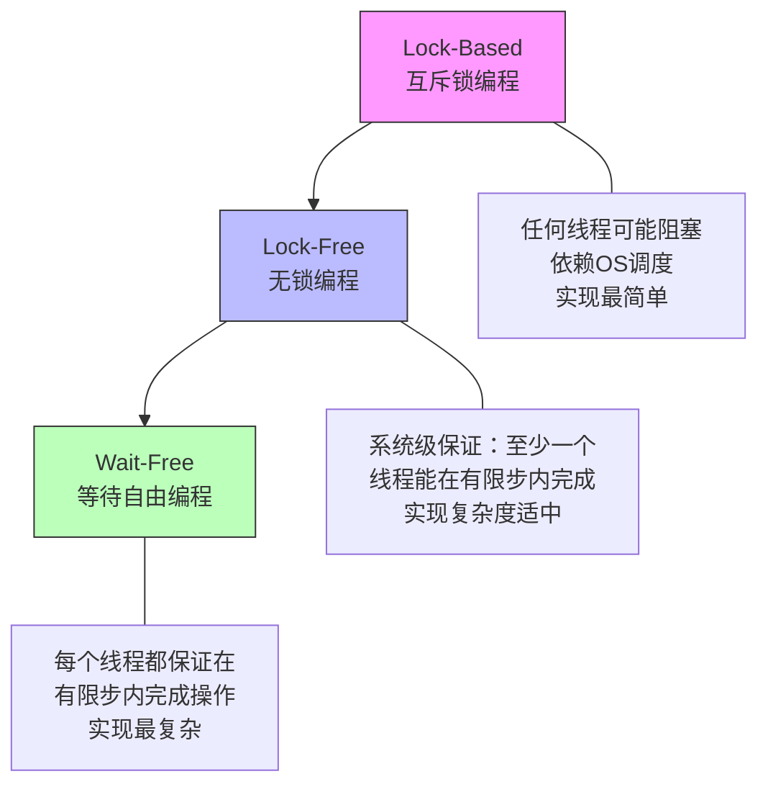
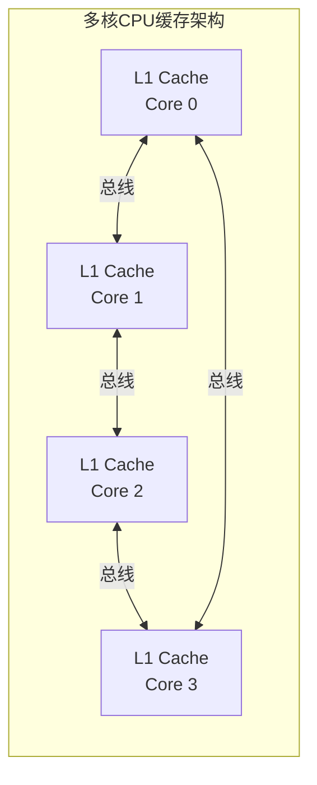
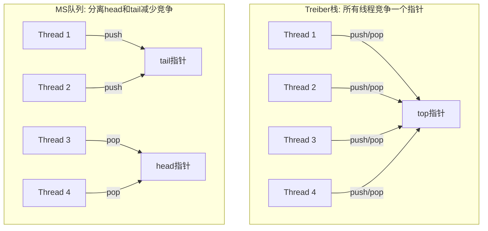
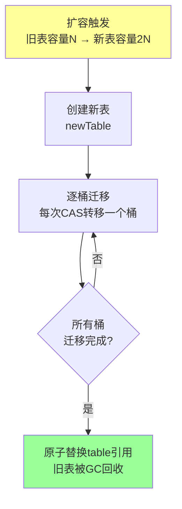
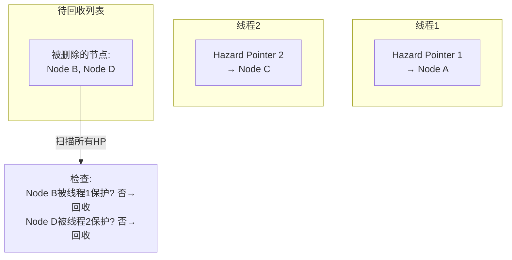
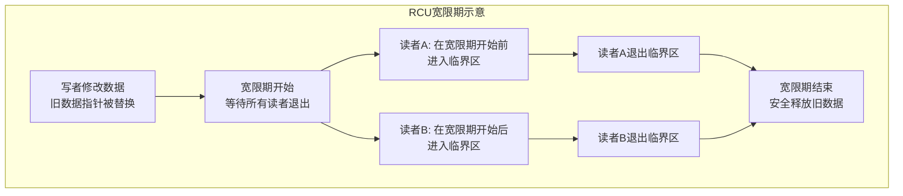
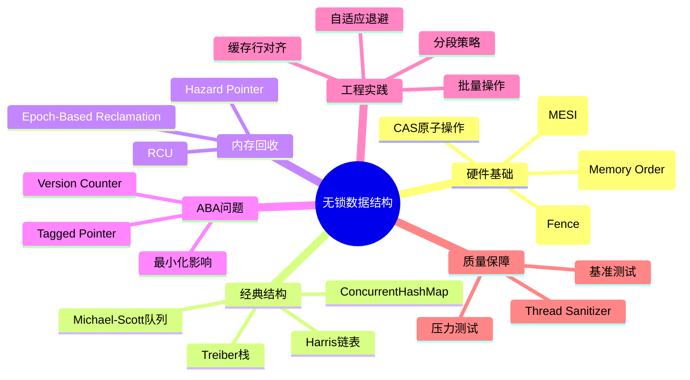

## 无锁数据结构

### 1. 概述与背景

#### 1.1 为什么需要无锁数据结构

在高并发系统中，多个线程/协程同时访问共享数据是常态。传统的并发控制依赖**互斥锁（Mutex）**来保证线程安全，但在极端高并发场景下，锁本身会成为严重的性能瓶颈：

- **锁竞争（Lock Contention）**：当大量线程争抢同一把锁时，大部分时间花在等待锁释放上，而非执行有效工作。在8核CPU上，严重的锁竞争可导致90%以上的CPU时间浪费在锁等待和上下文切换中。
- **优先级反转（Priority Inversion）**：低优先级线程持有锁时被中优先级线程抢占，导致高优先级线程无法获取锁，形成反向等待链。NASA的火星探路者（Mars Pathfinder）1997年就曾因优先级反转导致系统反复重启。
- **死锁（Deadlock）**：多个线程互相持有对方需要的锁，导致所有线程永久阻塞。虽然可以通过锁顺序规约来预防，但在大型系统中很难保证全局一致性。
- **锁的不可组合性**：在复杂数据结构中，需要对多个操作加锁才能保证一致性，但这又增加了死锁风险和性能开销。
- **锁的护航效应（Convoy Effect）**：一个慢线程持锁期间，所有等待线程堆积形成队列，即使锁很快释放，唤醒线程的调度开销也会级联放大。

**无锁数据结构（Lock-Free Data Structures）**的核心思想是：**使用原子操作（Atomic Operations）代替锁来保证线程安全**。线程不需要"获取"和"释放"任何锁，而是通过硬件支持的原子指令（如CAS、FAA）直接操作共享数据。当操作冲突时，通过重试机制保证最终完成。

#### 1.2 锁与无锁的本质区别

| 对比维度 | 互斥锁（Mutex） | 无锁（Lock-Free） |
|----------|----------------|-------------------|
| 同步机制 | 阻塞等待 | 基于原子操作重试 |
| 线程调度 | 操作系统介入 | 无系统调用 |
| 上下文切换 | 有（阻塞→唤醒） | 无 |
| 信号安全 | 不是信号安全的 | 可以是信号安全的 |
| 公平性 | 可能饿死线程 | 保证系统级进展（至少一个线程能完成操作） |
| 复杂度 | 低 | 高 |
| 适用场景 | 通用 | 高竞争、低延迟场景 |
| 公共子表达式 | 无法在锁内利用 | 天然支持（CAS无副作用） |

#### 1.3 无锁编程的三个层次



- **Lock-Free（无锁）**：保证**系统级进展**——在所有线程的操作中，至少有一个能在有限步骤内完成。具体是哪个线程不确定，但系统整体不会停滞。
- **Wait-Free（等待自由）**：保证**每线程级进展**——每个线程都能在已知的有限步数内完成操作。这是最强的非阻塞保证，但实现代价极高。

本书重点讨论 **Lock-Free** 编程，因为它是实践中最常用的非阻塞编程范式，在性能和实现复杂度之间取得了较好的平衡。

---

### 2. 硬件基础：原子操作与内存模型

无锁数据结构的基石是硬件提供的**原子操作**和**内存模型**。不理解底层硬件语义，写出的无锁代码几乎必然包含微妙的并发Bug。

#### 2.1 CAS（Compare-And-Swap）

CAS 是最核心的原子操作，几乎所有无锁数据结构都依赖它。CAS 的语义是：

CAS(内存地址, 期望旧值, 新值):
  if *地址 == 期望旧值:
    *地址 = 新值
    return true  // 成功
  else:
    return false // 失败，值已被其他线程修改

**硬件实现**：
- **x86/x64**：`CMPXCHG` 指令（单比较交换）或 `LOCK CMPXCHG`（带锁前缀的原子版本）
- **ARM**：`LDAXR` + `STXR` 指令对（Load-Acquire Exclusive + Store-Release Exclusive）
- **RISC-V**：`lr.w` + `sc.w` 指令对（Load Reserved + Store Conditional）

**CAS 的伪ABA问题**：

初始: A → B → C (栈顶为A)

线程1: 读取栈顶 A, 准备替换为 D
线程1: 被挂起...

线程2: pop A → 栈变成 B → C
线程2: pop B → 栈变成 C
线程2: push A → 栈变成 A → C

线程1: 恢复执行, CAS(栈顶, A, D)
       → 成功！因为栈顶确实是 A
       → 但 B 丢失了！数据结构被破坏

这个经典问题将在第5节详细讨论解决方案。

#### 2.2 其他原子操作

除了CAS，现代CPU还提供多种原子操作：

| 原子操作 | 语义 | 典型指令 | 用途 |
|----------|------|----------|------|
| **AtomicLoad** | 原子读取 | `MOV` (x86带LOCK前缀) / `LDAR` (ARM) | 保证读到完整值 |
| **AtomicStore** | 原子写入 | `XCHG` (x86) / `STLR` (ARM) | 保证写入完整值 |
| **AtomicExchange** | 交换新旧值 | `XCHG` | 无条件替换，无需重试 |
| **Fetch-And-Add** | 原子加法并返回旧值 | `LOCK XADD` (x86) | 计数器、限流器 |
| **Fetch-And-Or/And** | 原子位操作 | `LOCK BTS/BTR` (x86) | 位图、标志位 |
| **Compare-Exchange** | CAS | `LOCK CMPXCHG` | 无锁数据结构核心 |
| **Load-Linked/Store-Conditional** | LL/SC | `LDREX`/`STREX` (ARM) | CAS的替代实现 |

**Fetch-And-Add vs CAS 重试**：对于简单的计数器递增，FAA 比 CAS+重试更高效——FAA 在硬件层面保证成功，而 CAS 在竞争激烈时可能需要多次重试。这就是为什么 Java 的 `LongAdder` 和 Go 的 `atomic.Add` 使用 FAA 而非 CAS。

#### 2.3 内存序（Memory Order）

现代CPU为了提升性能，会对指令进行**乱序执行（Out-of-Order Execution）**和**写缓冲（Store Buffer）**优化。在单线程环境下这不会产生问题，但在多线程环境下可能导致一个线程看到另一个线程的"部分更新"。

C++11 定义了六种内存序，按保证强度从弱到强排列：

| 内存序 | 语义 | 性能影响 | 典型用途 |
|--------|------|----------|----------|
| `memory_order_relaxed` | 只保证原子性，不保证顺序 | 最低 | 计数器、统计 |
| `memory_order_consume` | 依赖关系保序（很少使用） | 低 | 数据依赖优化 |
| `memory_order_acquire` | 后续读写不会重排到此操作之前 | 中 | 加锁/无锁读 |
| `memory_order_release` | 此前读写不会重排到此操作之后 | 中 | 解锁/无锁写 |
| `memory_order_acq_rel` | 同时具备acquire和release语义 | 中高 | Read-Modify-Write |
| `memory_order_seq_cst` | 全局顺序一致性 | 最高 | 默认选项，最安全 |

**生产者-消费者模式下的内存序示例**：

```cpp
// 生产者线程
data.store(42, std::memory_order_relaxed);          // 先写数据
flag.store(true, std::memory_order_release);        // 再写标志(release保证之前的写不会重排到后面)

// 消费者线程
if (flag.load(std::memory_order_acquire)) {          // 读标志(acquire保证之后的读不会重排到前面)
    int val = data.load(std::memory_order_relaxed);  // 保证能看到生产者写入的42
    process(val);
}
```

如果不使用正确的内存序，消费者可能看到 `flag == true` 但 `data` 还是旧值——这就是**指令重排**导致的可见性问题。

#### 2.4 缓存一致性协议（Cache Coherency）

多核CPU通过缓存一致性协议保证各核心的缓存数据一致：



- **MESI协议**（Modified/Exclusive/Shared/Invalid）：最常用的缓存一致性协议。当一个核心修改数据时，其他核心的缓存副本会被标记为Invalid。
- **缓存行（Cache Line）**：通常为64字节。频繁修改同一缓存行会引发**缓存行弹跳（Cache Line Bouncing）**，严重影响多核性能。无锁数据结构需要考虑**缓存行对齐和填充（Padding）**来减少伪共享（False Sharing）。

**伪共享的代价**：在一台4核Intel Xeon服务器上，两个线程各自修改独立变量但恰好位于同一缓存行时，吞吐量可能降至单线程的1/10。使用缓存行填充后，性能可恢复到接近理论峰值。

---

### 3. 经典无锁数据结构实现

#### 3.1 Treiber 栈（无锁栈）

Treiber 栈是最早的无锁数据结构之一，由 R. Kent Treiber 于1986年提出。它实现了一个 LIFO（后进先出）的共享栈。

**核心思想**：使用一个原子指针指向栈顶节点。push 和 pop 操作通过 CAS 更新栈顶指针。

```java
import java.util.concurrent.atomic.AtomicReference;

public class TreiberStack<T> {
    // 栈顶指针，原子引用
    private final AtomicReference<Node<T>> top = new AtomicReference<>(null);
    
    private static class Node<T> {
        final T value;
        Node<T> next;
        
        Node(T value) {
            this.value = value;
        }
    }
    
    // Push：CAS方式将新节点设为栈顶
    public void push(T value) {
        Node<T> newNode = new Node<>(value);
        Node<T> currentTop;
        do {
            currentTop = top.get();            // 1. 读取当前栈顶
            newNode.next = currentTop;          // 2. 新节点指向旧栈顶
        } while (!top.compareAndSet(currentTop, newNode)); // 3. CAS：如果栈顶没变则替换
        // 如果CAS失败（其他线程同时push），自动重试
    }
    
    // Pop：CAS方式弹出栈顶
    public T pop() {
        Node<T> currentTop;
        Node<T> newTop;
        do {
            currentTop = top.get();            // 1. 读取当前栈顶
            if (currentTop == null) {
                return null;                    // 栈为空
            }
            newTop = currentTop.next;          // 2. 取下一个节点作为新栈顶
        } while (!top.compareAndSet(currentTop, newTop)); // 3. CAS替换
        return currentTop.value;
    }
    
    // 检查栈是否为空
    public boolean isEmpty() {
        return top.get() == null;
    }
}
```

**性能特征**：

| 场景 | 性能表现 | 原因 |
|------|----------|------|
| 低竞争（线程数<核心数） | 接近无同步开销 | CAS极少失败，几乎无重试 |
| 中等竞争 | 线性退化 | CAS重试次数随线程数增长 |
| 高竞争 | 严重退化 | 大量CAS失败和重试，形成"活锁"模式 |

**局限性**：Treiber栈在高竞争下性能急剧下降，因为所有线程都在竞争同一个栈顶指针。实际生产中很少直接使用Treiber栈，但它是理解无锁编程的最佳入门示例。

#### 3.2 Michael-Scott 队列（无锁队列）

由 Maged Michael 和 Michael Scott 于1996年提出，是工业界最广泛使用的无锁队列算法。相比Treiber栈，它通过**双指针（head + tail）**分散竞争，性能显著提升。

**核心思想**：
- `head` 指针指向第一个有效节点（出队位置）
- `tail` 指针指向最后一个节点（入队位置）
- 入队和出队操作分别竞争 head/tail，减少了冲突

```python
import threading
from dataclasses import dataclass
from typing import Optional, Generic, TypeVar

T = TypeVar('T')

@dataclass
class Node(Generic[T]):
    value: T
    next: 'Optional[Node[T]]'

class MichaelScottQueue(Generic[T]):
    """
    Michael-Scott Lock-Free Queue
    使用哨兵节点(sentinel node)简化边界条件
    
    注意：这是一个教学演示版本，CAS操作用threading.Lock模拟。
    真实实现需要在C/C++/Rust中使用硬件原子指令。
    """
    
    def __init__(self):
        # 创建哨兵节点，head和tail都指向它
        sentinel = Node(value=None, next=None)
        self._head = sentinel  # 出队端（原子引用）
        self._tail = sentinel  # 入队端（原子引用）
        self._size = 0
        self._lock = threading.Lock()  # 模拟CAS用，实际应替换为原子操作
    
    def enqueue(self, value: T) -> bool:
        """
        入队操作
        步骤：
        1. 创建新节点
        2. CAS更新tail.next
        3. CAS推进tail指针
        """
        new_node = Node(value=value, next=None)
        
        while True:
            current_tail = self._tail
            current_tail_next = current_tail.next
            
            # 如果tail落后了，先推进tail
            if current_tail is not self._tail:
                continue
            
            if current_tail_next is None:
                # tail指向最后一个节点，尝试CAS设置next
                with self._lock:
                    if current_tail.next is current_tail_next:
                        current_tail.next = new_node
                        # CAS成功，尝试推进tail（允许失败）
                        if self._tail is current_tail:
                            self._tail = new_node
                        self._size += 1
                        return True
                # CAS失败，重试
            else:
                # tail落后，帮助推进tail
                with self._lock:
                    if self._tail is current_tail:
                        self._tail = current_tail_next
    
    def dequeue(self) -> Optional[T]:
        """
        出队操作
        步骤：
        1. 读取head和head.next
        2. 读取head.next.value（在CAS之前需要读取）
        3. CAS更新head指向head.next
        """
        while True:
            current_head = self._head
            current_tail = self._tail
            current_head_next = current_head.next
            
            # 如果head落后了，先推进head
            if current_head is not self._head:
                continue
            
            # 如果head和tail相同，说明队列可能为空
            if current_head is current_tail:
                if current_head_next is None:
                    return None  # 队列确认为空
                # tail落后，帮助推进
                with self._lock:
                    if self._tail is current_tail:
                        self._tail = current_head_next
            else:
                # 队列非空，读取值（在CAS前读取，防止节点被回收后访问）
                value = current_head_next.value
                # CAS将head推进到下一个节点
                with self._lock:
                    if self._head is current_head:
                        self._head = current_head_next
                        self._size -= 1
                        return value
    
    def size(self) -> int:
        return self._size
```

**双指针设计的优势分析**：



#### 3.3 无锁哈希表

无锁哈希表的实现比栈和队列复杂得多，因为需要处理**动态扩容（Resize）**这一难题。

**Java ConcurrentHashMap 的演进**：

| 版本 | 实现方式 | 锁粒度 | 性能特点 |
|------|----------|--------|----------|
| JDK 1.5 | Segment分段锁 | 每段一把锁（默认16段） | 并发度受限于段数 |
| JDK 1.8 | CAS + synchronized | 单个桶节点级别 | 并发度大幅提升 |
| JDK 9+ | 基于1.8优化 | 同上 | 空间效率更高 |

**JDK 1.8 ConcurrentHashMap put 操作的核心逻辑**：

1. 计算key的hash → 定位桶位置
2. 如果桶为空：
   CAS插入新节点  → 成功则返回
3. 如果桶不为空：
   遍历链表/红黑树：
   a. key相同 → 更新value（CAS更新val字段）
   b. key不同 → 在尾部追加节点
   c. 遍历到链表尾部 → CAS追加
4. 如果链表长度>8 → 转红黑树
5. 如果节点总数超过阈值 → 触发扩容

**无锁扩容的挑战**：扩容是无锁哈希表最复杂的部分。核心困难在于：一个线程正在进行扩容时，其他线程的读写操作不能阻塞。解决方案是**渐进式迁移（Incremental Transfer）**：



#### 3.4 无锁链表（Harris 链表）

Maged Harris 于1996年提出的无锁链表算法，解决了在无锁环境下安全删除节点的难题。

**核心创新：标记指针（Marked Pointer）**

在64位系统中，指针低3位通常用于对齐（8字节对齐），因此至少有3位是空闲的。Harris利用最低位作为**删除标记（Mark Bit）**：

- 标记位 = 0：节点正常存在
- 标记位 = 1：节点已被逻辑删除，等待物理回收

┌──────────────────────────────────────┐
│  64-bit Pointer                      │
│  [61 bits: actual address] [1 bit: mark] [2 bits: unused]  │
└──────────────────────────────────────┘

**删除操作的两阶段**：
1. **标记阶段**：CAS设置标记位（逻辑删除），使后续线程跳过该节点
2. **回收阶段**：CAS修改前驱节点的next指针，跳过已标记节点（物理删除）

这解决了无锁链表删除中的**悬垂引用（Dangling Reference）**问题。

**Harris 无锁链表的完整实现思路**：

// Harris链表的核心操作
查找(key):
  prev → 沿链表找到key的前驱（跳过已标记节点）
  curr = prev.next
  while curr != null:
    if curr未被标记:
      if curr.key == key:
        return (prev, curr)  // 找到
      prev = curr
    curr = curr.next  // 即使curr被标记，也继续沿链表走
  return null  // 未找到

删除(key):
  1. 查找key → 得到 (prev, curr)
  2. CAS标记curr.next的标记位 → 逻辑删除
  3. CAS修改prev.next → 跳过curr → 物理删除
  // 步骤2和3可以由不同线程完成（协作删除）

插入(key, value):
  1. 查找插入位置 → prev
  2. 创建新节点, next = prev.next（未标记的）
  3. CAS(prev.next, 未标记的新节点原next, 新节点)

**协作删除**是Harris链表的关键特性：即使执行删除的线程在步骤2和步骤3之间被挂起，其他线程在遍历链表时也会看到标记并帮助完成物理删除。这保证了系统级进展（Lock-Free）。

---

### 4. 内存回收：无锁编程的"最后一公里"

无锁数据结构面临的最大挑战不是算法本身，而是**内存回收**。当一个线程从链表中删除一个节点后，如何安全地释放该节点的内存？

核心困境在于：**其他线程可能仍然持有指向该节点的指针**。如果立即释放内存，其他线程访问时会产生**Use-After-Free**错误。

#### 4.1 方案一：Hazard Pointer（危险指针）

Maged Michael 于2004年提出。每个线程维护一个**危险指针列表（Hazard Pointer List）**，在访问共享节点前先将其记录在列表中。



**工作流程**：
1. 线程在读取共享指针之前，先将目标地址写入自己的 Hazard Pointer
2. 重新验证指针是否仍然有效（防止TOCTOU问题）
3. 使用完毕后清除 Hazard Pointer
4. 被删除的节点放入退役列表（Retired List）
5. 当退役列表超过阈值时，扫描所有线程的 Hazard Pointer，释放未被保护的节点

**优缺点**：
- ✅ 确定性内存释放，不依赖GC
- ✅ 回收延迟可预测
- ❌ 每个线程需要预分配固定数量的 Hazard Pointer 槽位
- ❌ 回收时需要扫描所有线程的 HP，开销随线程数增长

#### 4.2 方案二：Epoch-Based Reclamation（EBR）

也叫 **Quiescent State Reclamation**。核心思想：

1. 维护一个全局 **epoch 计数器**（64位整数）
2. 每个线程在进入临界区时记录当前 epoch（`read_epoch`）
3. 线程执行无锁操作时处于 "活跃" 状态
4. 当线程处于**静默状态（Quiescent State）**时（即不持有任何共享数据引用），标记自己在该 epoch 已完成
5. 当所有线程都在当前 epoch 完成后，可以安全回收前一个 epoch 的退役对象

```cpp
// EBR 简化实现
thread_local int local_epoch;
int global_epoch;

struct EpochNode { void* ptr; int retire_epoch; };
std::vector<EpochNode> retired[3];  // 三个退役列表，按epoch分组
bool active_threads[32];

void enter_critical() {
    local_epoch = global_epoch.load(std::memory_order_acquire);
    active_threads[thread_id] = true;
    std::atomic_thread_fence(std::memory_order_acq_rel);
}

void exit_critical() {
    active_threads[thread_id] = false;
    std::atomic_thread_fence(std::memory_order_release);
}

void try_advance_epoch() {
    bool all_quiet = true;
    for (int i = 0; i < num_threads; i++) {
        if (active_threads[i] &amp;&amp; local_epoch != global_epoch) {
            all_quiet = false;
            break;
        }
    }
    if (all_quiet) {
        global_epoch++;           // 推进epoch
        // 可以安全回收 epoch - 2 之前的所有退役对象
        free_retired(global_epoch - 2);
    }
}
```

**优缺点**：
- ✅ 实现简单，开销低
- ✅ 适合读多写少的场景
- ❌ 线程长时间不经过静默状态时，所有退役对象都无法回收，导致**内存积压**
- ❌ 不适合有长事务的场景

#### 4.3 方案三：RCU（Read-Copy-Update）

Linux 内核中最广泛使用的无锁同步机制。RCU 将操作分为三类：

| 操作类型 | 锁要求 | 语义 |
|----------|--------|------|
| **读端（RCU Read-Side）** | 无需加锁 | 进入/退出读临界区（`rcu_read_lock`/`rcu_read_unlock`） |
| **写端（RCU Update）** | 需要同步 | 修改数据后等待宽限期结束 |
| **回收（Reclamation）** | 宽限期后 | 宽限期结束后释放旧数据 |

**宽限期（Grace Period）** 概念：



RCU 在 Linux 内核中被广泛使用：
- **路由表查找**：`struct fib_table` 的查找操作使用 RCU 保护
- **进程列表遍历**：`/proc` 文件系统中的进程信息读取
- **模块卸载**：`try_module_get` 和 `module_put` 基于 RCU
- **文件系统 dcache**：目录项缓存的查找

#### 4.4 三种方案对比

| 维度 | Hazard Pointer | EBR | RCU |
|------|---------------|-----|-----|
| 内存回收延迟 | 可预测（单次扫描） | 依赖epoch推进 | 依赖宽限期 |
| 读端开销 | 中（写HP + 验证） | 低（记录epoch） | 极低（禁用抢占即可） |
| 写端开销 | 低 | 低 | 中等（等待宽限期） |
| 内存积压 | 低 | 中（长事务时高） | 低（宽限期通常很短） |
| 适用场景 | 通用无锁结构 | 读多写少 | 内核/极高性能需求 |
| 实现复杂度 | 高 | 中 | 高（需OS支持） |
| 语言生态 | C++ (Folly) | C/C++ | Linux内核 (C) |

---

### 5. ABA 问题：无锁编程的"阿喀琉斯之踵"

ABA问题是CAS操作最著名的陷阱。在第2.1节已经描述了基本场景，这里深入讨论解决方案。

#### 5.1 Tagged Pointer（标记指针）

最直接的解决方案：在指针上附加一个单调递增的版本号。即使指针地址相同，版本号不同也会导致CAS失败。

```cpp
// 128位 Tagged Pointer（x86-64上）
struct TaggedPointer {
    uint64_t pointer : 48;  // 48位虚拟地址（x86-64实际只用48位）
    uint64_t tag     : 16;  // 16位版本号，最多65536次重用
    
    bool operator==(const TaggedPointer&amp; other) const {
        return pointer == other.pointer &amp;&amp; tag == other.tag;
    }
};
```

**使用场景**：Java 的 `AtomicStampedReference` 和 `AtomicMarkableReference` 都基于此思想。

```java
// Java AtomicStampedReference 示例
AtomicStampedReference<Node> ref = new AtomicStampedReference<>(initialNode, 0);

int[] stampHolder = new int[1];
Node current = ref.get(stampHolder);
int currentStamp = stampHolder[0];

// CAS同时比较引用和版本号
ref.compareAndSet(current, newNode, currentStamp, currentStamp + 1);
```

#### 5.2 序号计数器（Version Counter）

在节点外部维护一个全局版本号，每次修改共享结构时递增。CAS时同时检查数据指针和版本号。

**优点**：实现简单，适用于版本号更新不频繁的场景。
**缺点**：版本号本身成为新的竞争热点。

#### 5.3 最小化 ABA 影响

并非所有ABA场景都会导致问题。在以下情况中，ABA通常是安全的：

| 场景 | ABA是否安全 | 原因 |
|------|------------|------|
| 压入/弹出同一值到栈 | ✅ 安全 | 值相同，数据结构一致性不受影响 |
| 循环链表遍历 | ✅ 安全 | 追赶指针逻辑不受ABA影响 |
| 节点删除后立即重用 | ❌ 危险 | 可能导致删除操作影响新插入的节点 |
| 引用计数 | ❌ 危险 | 可能导致过早释放 |

**工程建议**：在设计无锁结构时，首先评估你的场景是否真的会触发ABA。如果节点生命周期足够长（如被其他引用持有），或者操作本身是幂等的，可以不处理ABA问题，从而大幅简化实现。

---

### 6. 实际应用与工程实践

#### 6.1 各语言生态中的无锁结构

**Go 语言**：
```go
import "sync/atomic"

// atomic.Value：无锁的原子值存储
var config atomic.Value  // 存储配置结构体

func UpdateConfig(newCfg Config) {
    config.Store(newCfg)  // 无锁写入
}

func GetConfig() Config {
    return config.Load().(Config)  // 无锁读取
}

// atomic.Int64：无锁计数器
var counter atomic.Int64

func Increment() int64 {
    return counter.Add(1)  // 原子加法，比CAS重试高效
}
```

**Java 语言**（JDK `java.util.concurrent.atomic` 包）：

| 类 | 底层实现 | 用途 |
|-----|----------|------|
| `AtomicInteger` | `Unsafe.compareAndSwapInt` | 无锁整数计数器 |
| `AtomicLong` | `Unsafe.compareAndSwapLong` | 无锁长整型计数器 |
| `AtomicReference` | `Unsafe.compareAndSwapObject` | 无锁对象引用 |
| `AtomicStampedReference` | CAS + stamp | 解决ABA问题 |
| `LongAdder` | Cell数组分段 | 高竞争计数器（推荐替代AtomicLong） |
| `LongAccumulator` | Cell数组分段 | 高竞争累加器 |

**Rust 语言**（`std::sync::atomic` + `crossbeam` 生态）：
```rust
use std::sync::atomic::{AtomicUsize, AtomicPtr, Ordering};
use std::ptr;

// 无锁栈
struct Node<T> {
    data: T,
    next: AtomicPtr<Node<T>>,
}

struct LockFreeStack<T> {
    head: AtomicPtr<Node<T>>,
}

impl<T> LockFreeStack<T> {
    fn push(&amp;self, data: T) {
        let mut node = Box::new(Node {
            data,
            next: AtomicPtr::new(ptr::null_mut()),
        });
        let node_ptr = &amp;mut *node as *mut Node<T>;
        
        loop {
            let current_head = self.head.load(Ordering::Relaxed);
            node.next.store(current_head, Ordering::Relaxed);
            
            match self.head.compare_exchange_weak(
                current_head,
                node_ptr,
                Ordering::Release,
                Ordering::Relaxed,
            ) {
                Ok(_) => {
                    Box::leak(node); // 防止Rust自动drop
                    break;
                }
                Err(_) => continue, // CAS失败，重试
            }
        }
    }
    
    fn pop(&amp;self) -> Option<T> {
        loop {
            let current_head = self.head.load(Ordering::Acquire);
            if current_head.is_null() {
                return None;
            }
            
            let next = unsafe { (*current_head).next.load(Ordering::Relaxed) };
            
            match self.head.compare_exchange_weak(
                current_head,
                next,
                Ordering::Acquire,
                Ordering::Relaxed,
            ) {
                Ok(_) => {
                    let node = unsafe { Box::from_raw(current_head) };
                    Some(node.data)
                }
                Err(_) => continue,
            }
        }
    }
}
```

Rust 的 `Ordering` 枚举与 C++ 的 `memory_order` 一一对应，且编译器会在违反内存序要求时给出编译警告。

**Rust crossbeam 生态**：`crossbeam` 库提供了生产级的无锁组件：
- `crossbeam::queue::SegQueue`：无锁有界/无界队列
- `crossbeam::queue::ArrayQueue`：基于环形缓冲区的无锁有界队列
- `crossbeam::epoch`：基于 EBR 的内存回收
- `crossbeam::utils::sharded`：分片锁，减少竞争

#### 6.2 生产环境中的无锁结构选择

| 需求场景 | 推荐方案 | 原因 |
|----------|----------|------|
| 高竞争计数器 | `LongAdder` (Java) / 分片计数器 | Cell数组分散竞争，性能远优于AtomicLong |
| 高性能队列 | Disruptor (Java) / `crossbeam-deque` (Rust) | 预分配环形缓冲区，零GC |
| 无锁Map | `ConcurrentHashMap` (Java) / `DashMap` (Rust) | 工业级优化，持续迭代 |
| 延迟敏感的读多写少 | `AtomicReference` + EBR | 读端几乎零开销 |
| 需要强一致性 | 互斥锁 | 无锁不等于无等待，CAS重试可能引入不确定性 |

#### 6.3 性能基准测试方法

无锁结构的性能不能仅看吞吐量，还需要关注：

1. **尾延迟（P99/P999 Latency）**：无锁结构的平均延迟通常优于锁，但CAS重试可能导致尾部延迟波动
2. **吞吐量随线程数变化曲线**：绘制吞吐量 vs. 线程数图表，观察性能拐点
3. **CPU缓存效率**：通过 `perf stat` 观察缓存命中率和缓存行弹跳次数

```bash
# Linux perf 工具分析无锁结构性能
perf stat -e cache-misses,cache-references,cas-misses \
    -- java -jar benchmark.jar

# 重点指标：
# - cache-miss-rate: 缓存未命中率（应<5%）
# - LLC-load-misses: 最后一级缓存未命中（影响原子操作延迟）
```

---

### 7. 常见误区与最佳实践

#### 7.1 误区一："无锁一定比有锁快"

这是最常见的误解。在以下场景中，互斥锁的性能反而更好：

- **低竞争场景**：CAS本身也有开销（内存屏障 + 缓存行同步），简单的Mutex在低竞争下可能更快
- **临界区很短**：如果临界区只有几条指令，spinlock（自旋锁）的开销可能比CAS重试更低
- **持有时间长**：如果线程需要长时间持有资源，无锁的重试循环反而浪费CPU

**正确做法**：通过基准测试（Benchmark）来选择，而非凭直觉。

#### 7.2 误区二："无锁代码不需要考虑顺序"

即使使用了正确的原子操作，如果不注意**操作顺序**，仍然会出现微妙的并发Bug。例如：

```cpp
// 错误示例：发布者-订阅者模式中的顺序问题
struct SharedData {
    std::atomic<int> value;
    std::atomic<bool> ready;
};

// 发布者（错误写法）
shared.value.store(42, std::memory_order_relaxed);
shared.ready.store(true, std::memory_order_relaxed);  // 可能被重排到value之前！

// 订阅者
if (shared.ready.load(std::memory_order_relaxed)) {
    int v = shared.value.load(std::memory_order_relaxed);  // 可能读到旧值！
}
```

**正确做法**：发布者使用 `memory_order_release`，订阅者使用 `memory_order_acquire`。

#### 7.3 误区三："无锁可以替代所有锁"

无锁数据结构不是万能药。以下场景不适合无锁方案：

- **复合操作**：需要原子执行多个步骤的业务逻辑（如"先检查后操作"）
- **资源管理**：数据库连接、文件句柄等有限资源的分配
- **死锁避免场景已经解决时**：简单的读写锁或信号量可能更合适

#### 7.4 最佳实践清单

1. **优先使用成熟的库**：不要自己实现无锁数据结构，除非你有非常特殊的需求。`ConcurrentHashMap`、`java.util.concurrent.atomic`、`crossbeam` 等经过了数千人年的工程检验。

2. **使用线程消毒器（Thread Sanitizer）**：启用 TSan 检测数据竞争：
   ```bash
   # C/C++ (Clang/GCC)
   fsanitize=thread -g
   
   # Go
   go test -race ./...
   
   # Rust
   cargo +nightly -Zsanitizer=thread test
   ```

3. **记录设计决策**：在代码注释中说明为什么选择无锁方案、使用了什么内存序、为什么这个内存序是正确的。

4. **监控 CAS 失败率**：CAS 重试次数过高意味着线程在浪费 CPU，应该考虑降低竞争（如分段、缓冲）。

5. **考虑缓存行对齐**：频繁修改的原子变量应该独占缓存行（64字节），避免伪共享：
   ```cpp
   // 避免伪共享：填充到缓存行边界
   struct alignas(64) PaddedCounter {
       std::atomic<int64_t> value;
       char padding[64 - sizeof(std::atomic<int64_t>)];
   };
   ```

6. **测试压力要足够**：使用高线程数（通常为CPU核心数的2-4倍）、长时间运行的并发测试，才能暴露无锁代码中的微妙Bug。

---

### 8. 性能优化进阶

#### 8.1 分段策略（Segmentation）

当单个原子变量成为竞争热点时，可以将其拆分为多个分段，每个线程随机选择一个分段操作，最后合并结果：

```java
// 分段计数器（LongAdder 的核心思想）
public class SegmentedCounter {
    // 每个线程/CPU核心一个cell，消除竞争
    private final Cell[] cells;
    private final AtomicLong base;
    
    private static class Cell {
        volatile long value;
        // 7个long的填充，确保每个Cell独占一个缓存行
        long p1, p2, p3, p4, p5, p6, p7;
        
        Cell(long value) { this.value = value; }
    }
    
    public void increment() {
        // 先尝试CAS base（无竞争时快速路径）
        if (cells == null || !casBase()) {
            // CAS失败 → 有竞争 → 分散到cells中
            getCell().value++;
        }
    }
    
    public long sum() {
        long sum = base.get();
        for (Cell cell : cells) {
            sum += cell.value;  // 最终一致性，不保证原子性
        }
        return sum;  // 近似值，但足够用于监控/统计
    }
}
```

**适用场景**：监控计数器、统计数据、限流器等不需要精确一致性的场景。

#### 8.2 批量操作（Batching）

将多次细粒度的原子操作合并为一次批量操作，减少CAS次数：

```java
// 批量更新：将多次CAS合并
public class BatchUpdater {
    private final AtomicLong value = new AtomicLong(0);
    private final ThreadLocal<List<Long>> pendingOps = ThreadLocal.withInitial(ArrayList::new);
    
    public void add(long delta) {
        pendingOps.get().add(delta);
        if (pendingOps.get().size() >= 32) {  // 每32次操作批量提交
            flush();
        }
    }
    
    public void flush() {
        List<Long> ops = pendingOps.get();
        if (ops.isEmpty()) return;
        long total = ops.stream().mapToLong(Long::longValue).sum();
        value.addAndGet(total);  // 一次CAS完成32次加法
        ops.clear();
    }
}
```

#### 8.3 自适应退避（Adaptive Backoff）

当CAS持续失败时，盲目重试会浪费CPU。自适应退避策略根据失败次数动态调整重试策略：

```python
import time
import random

def adaptive_cas(cas_fn, max_spins=10, max_yields=100):
    """
    自适应CAS重试策略
    阶段1：纯自旋（最短延迟，最低延迟）
    阶段2：让出CPU（yield，中等延迟）
    阶段3：指数退避（最长延迟，最高吞吐）
    """
    spins = 0
    
    # 阶段1：自旋等待
    while spins < max_spins:
        result = cas_fn()
        if result:
            return True
        spins += 1
    
    # 阶段2：yield
    yields = 0
    while yields < max_yields:
        result = cas_fn()
        if result:
            return True
        time.sleep(0)  # yield，让OS调度其他线程
        yields += 1
    
    # 阶段3：指数退避
    delay = 0.001  # 1ms
    while True:
        result = cas_fn()
        if result:
            return True
        time.sleep(delay)
        delay = min(delay * 2, 0.1)  # 最大100ms
        delay += random.uniform(0, delay * 0.1)  # 随机抖动，避免雷群效应
```

**退避策略的选择原则**：
- **自旋**：适合预计竞争很快结束的场景（如另一个线程正在做少量计算）
- **yield**：适合竞争可能持续一段时间但不希望浪费CPU的场景
- **指数退避**：适合高竞争或不确定竞争持续时间的场景
- **随机抖动**：必须添加，否则多个线程可能同时重试，形成"雷群效应（Thundering Herd）"

---

### 9. 总结与思维导图

无锁数据结构是高并发系统中的核心武器，但它不是银弹。正确的使用方式是：

1. **理解硬件基础**：CAS语义、内存序、缓存一致性是无锁编程的三大基石
2. **使用成熟的库**：除非有明确的性能需求和充分的测试，否则优先使用标准库实现
3. **关注内存回收**：无锁结构中"删除容易回收难"，HP/EBR/RCU各有适用场景
4. **测试为王**：使用Thread Sanitizer、压力测试、长时间并发测试验证正确性
5. **度量驱动选择**：通过基准测试比较锁方案和无锁方案在你的特定场景下的实际性能


