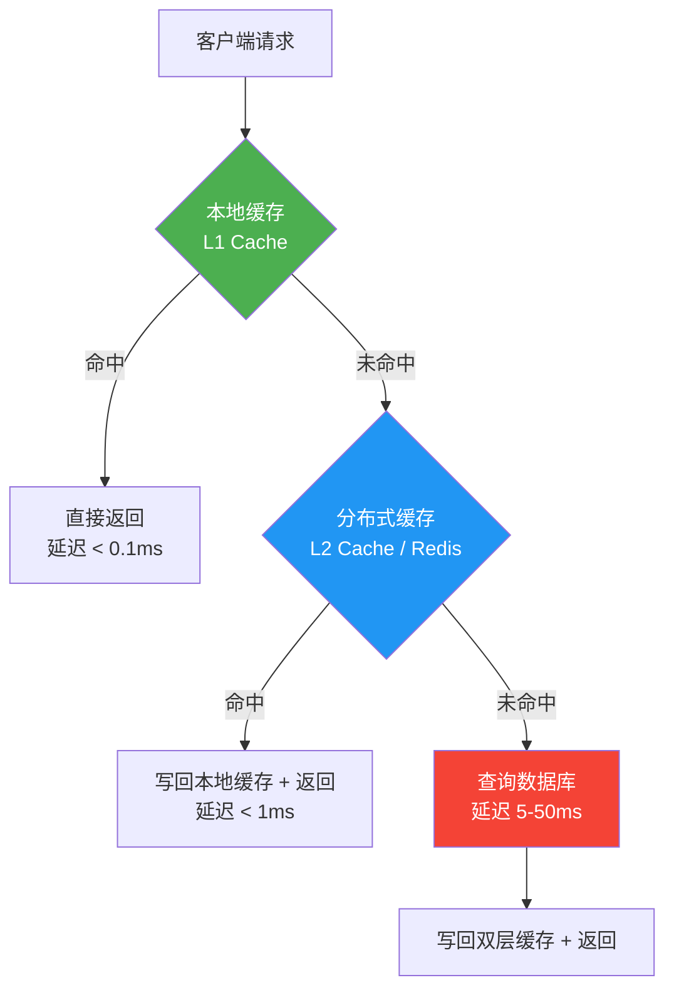
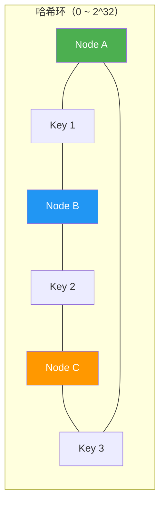
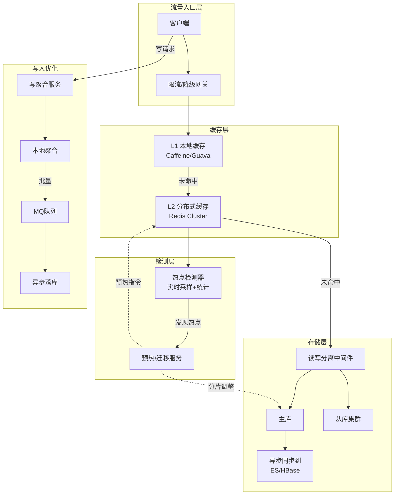
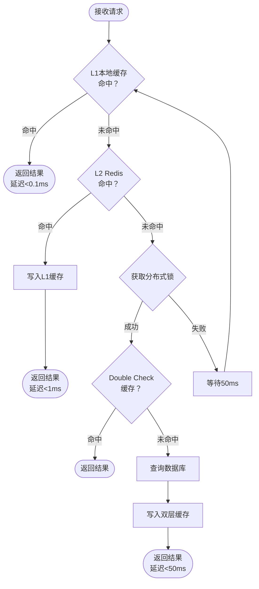
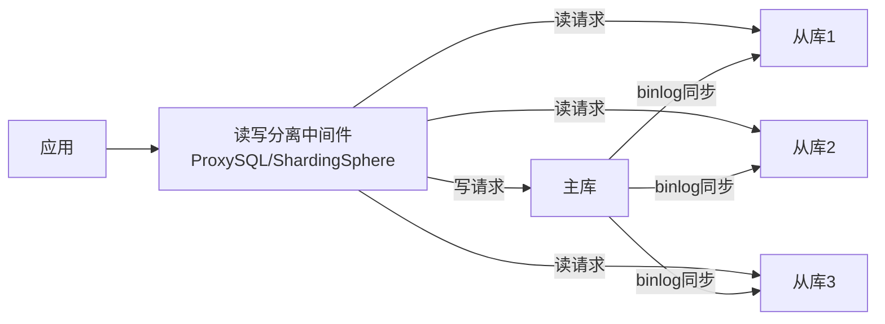
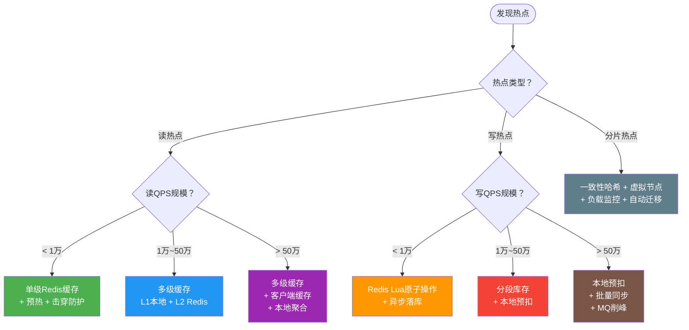

# 热点数据处理

## 一、什么是热点数据

### 1.1 定义与本质

热点数据（Hot Data / Hotspot Data）是指在特定时间段内被高频访问的数据。它不是数据本身的固有属性，而是**访问模式的产物**——同一份数据在某个时段可能是冷数据，在另一个时段可能瞬间变热。

从本质上讲，热点数据的产生源于流量的**非均匀分布**。在真实系统中，流量从来不是均匀分配到每条记录上的。经典的帕累托法则（80/20法则）在分布式系统中同样适用：

- **读热点**：20%的数据承受80%的读流量。例如电商首页商品、微博热搜帖子、短视频平台的爆款视频。
- **写热点**：少量key的写入QPS远超其他key。例如秒杀商品的库存扣减、社交平台上大V的点赞计数、直播间的弹幕发送。

热点数据之所以成为高并发系统的核心挑战，是因为它会打破分布式系统的"均匀分摊"假设。系统设计时通常假设流量均匀分布到各节点，一旦出现热点，所有基于均匀假设的限流、分片、负载均衡策略都会失效。

### 1.2 热点数据的危害

热点数据如果不加处理，会在多个层面引发连锁问题：

| 层级 | 危害 | 典型表现 | 严重程度 |
|------|------|----------|----------|
| 单节点过载 | 流量集中在单个分片/节点 | CPU 100%、内存耗尽、响应超时 | ⭐⭐⭐ |
| 缓存穿透 | 热点key缓存失效后大量请求直达DB | 数据库连接池耗尽、整体服务雪崩 | ⭐⭐⭐⭐⭐ |
| 数据不一致 | 高并发写入导致竞态条件 | 库存超卖、计数器不准确、余额错误 | ⭐⭐⭐⭐ |
| 级联故障 | 单点瓶颈扩散到上下游 | 队列积压、依赖服务超时、链路中断 | ⭐⭐⭐⭐⭐ |
| 缓存雪崩 | 大量热点key同时过期 | DB瞬间承受全量流量、服务不可用 | ⭐⭐⭐⭐⭐ |

一个真实的教训：2019年某电商平台大促期间，因未对明星同款商品做热点处理，单个Redis分片QPS飙升至50万，触发OOM被kill，导致该分片上的所有key不可用，影响范围扩大到该分片上的数千个普通商品，最终造成大面积服务降级。

### 1.3 热点数据的分类

按照不同的维度，热点数据可以分为以下几类：

**按时间特征分类：**

| 类型 | 特征 | 典型场景 | 检测难度 |
|------|------|----------|----------|
| 突发型热点 | 升温快、持续短、不可预测 | 明星官宣、突发事件、爆款短视频 | 高（需要实时检测） |
| 持续型热点 | 长期高访问量、稳定在高水位 | 平台核心页面、头部商品、首页推荐 | 低（历史数据即可识别） |
| 周期型热点 | 有固定周期、可预测 | 每天早高峰新闻APP、每周一OA系统、每月初账单 | 中（需要时间序列分析） |

**按数据维度分类：**

| 类型 | 特征 | 典型场景 | 处理难度 |
|------|------|----------|----------|
| Key级热点 | 单个key被高频访问 | 某商品ID、某用户主页、某帖子详情 | 中 |
| 分片级热点 | 某个数据分片整体负载偏高 | Hash分片不均匀、某个用户组集中访问 | 高（涉及数据迁移） |
| 字段级热点 | 同一条记录中的某个字段被高频读写 | 计数器字段、状态标记字段、余额字段 | 高（需要行级拆分） |
| 索引级热点 | 某个数据库索引被高频命中 | 自增ID索引、时间范围查询索引 | 高（需要索引优化） |

**按读写特征分类：**

- **读热点（Read Hotspot）**：高频读取，写入频率正常。处理核心是缓存，通过多层缓存吸收读流量。
- **写热点（Write Hotspot）**：高频写入，读取频率正常或偏低。处理核心是分散写入压力，通过分片、聚合、异步等方式降低单点写入QPS。
- **读写双热点**：同一数据同时承受高读高写。这是最棘手的场景，需要综合运用缓存、分片、异步等策略。

---

## 二、热点检测：如何发现热点

在处理热点之前，首先要能**检测到热点的存在**。没有检测就没有优化的依据。检测策略分为被动检测和主动预测两类。

### 2.1 被动检测

被动检测在请求发生后实时统计访问频率，适用于大多数场景。

**方案一：采样统计**

对每个请求进行采样（如1%采样率），统计key的访问频次。适用于QPS极高的场景，以可控的开销获得近似准确的结果。采样率的选择需要权衡准确性与开销——采样率过低会漏检短时间突发热点，采样率过高则本身成为性能瓶颈。

```python
import random
from collections import defaultdict
import time
import threading


class HotspotDetector:
    """基于滑动窗口的热点检测器
    
    原理：
    1. 对请求按采样率抽样，记录key的访问次数
    2. 在滑动窗口内统计每个key的估算QPS
    3. 超过阈值的key判定为热点
    
    采样率选择经验：
    - QPS < 1万：全量统计（采样率1.0）
    - QPS 1万~10万：5%采样率
    - QPS 10万~100万：1%采样率
    - QPS > 100万：0.1%采样率
    """
    
    def __init__(self, window_size=60, threshold=1000, sample_rate=0.01):
        self.window_size = window_size        # 滑动窗口大小（秒）
        self.threshold = threshold            # 热点阈值（QPS）
        self.sample_rate = sample_rate        # 采样率
        self.counters = defaultdict(int)      # key -> 采样命中次数
        self.total_samples = 0                # 总采样次数
        self.window_start = time.time()
        self._lock = threading.Lock()
    
    def record(self, key):
        """记录一次访问（先判断采样）
        
        注意：random.random()本身有微小开销（约50ns），
        在超高QPS场景下可以考虑用位运算或计数器取模替代。
        """
        if random.random() > self.sample_rate:
            return  # 跳过本次采样
        
        now = time.time()
        with self._lock:
            # 如果超出窗口，重置计数
            if now - self.window_start > self.window_size:
                self.counters.clear()
                self.total_samples = 0
                self.window_start = now
            
            self.counters[key] += 1
            self.total_samples += 1
    
    def is_hotspot(self, key):
        """判断指定key是否为热点"""
        with self._lock:
            if key not in self.counters:
                return False
            # 估算真实QPS = 采样命中数 / 采样率 / 窗口时长
            estimated_qps = self.counters[key] / self.sample_rate / self.window_size
            return estimated_qps >= self.threshold
    
    def get_hotspots(self):
        """返回当前所有热点key及其估算QPS，按QPS降序排列"""
        hotspots = {}
        with self._lock:
            for key, count in self.counters.items():
                estimated_qps = count / self.sample_rate / self.window_size
                if estimated_qps >= self.threshold:
                    hotspots[key] = estimated_qps
        # 按QPS降序排列
        return dict(sorted(hotspots.items(), key=lambda x: x[1], reverse=True))
    
    def get_stats(self):
        """获取检测器自身的统计信息，用于监控检测器健康状态"""
        with self._lock:
            return {
                "window_size": self.window_size,
                "threshold": self.threshold,
                "sample_rate": self.sample_rate,
                "total_samples": self.total_samples,
                "unique_keys": len(self.counters),
                "hotspot_count": sum(
                    1 for k, c in self.counters.items()
                    if c / self.sample_rate / self.window_size >= self.threshold
                ),
                "window_remaining": max(0, self.window_size - (time.time() - self.window_start))
            }
```

**方案二：Redis MONITOR + 流式计算**

通过Redis的`MONITOR`命令（或Redis慢查询日志）采集命令统计，再用Flink/Spark Streaming实时聚合。适用于需要跨节点统一检测的场景。

> ⚠️ **注意**：`MONITOR`命令会显著影响Redis性能（约降低20-30%吞吐量），仅建议在调试或低流量时段短暂开启。生产环境应使用`CLIENT TRACKING`或`SLOWLOG`替代。

```sql
-- Flink SQL 示例：检测 Redis 热点key
-- 使用滑动窗口，在60秒窗口内以10秒为滑动步长检测热点
SELECT 
    key,
    command_type,
    COUNT(*) as access_count,
    HOP_START(event_time, INTERVAL '10' SECOND, INTERVAL '60' SECOND) as window_start,
    HOP_END(event_time, INTERVAL '10' SECOND, INTERVAL '60' SECOND) as window_end
FROM redis_commands
GROUP BY key, command_type, HOP(event_time, INTERVAL '10' SECOND, INTERVAL '60' SECOND)
HAVING COUNT(*) > 10000
```

**方案三：Redis 内置热点key检测**

Redis 4.0+ 在集群模式下支持`--hotkeys`参数，基于LFU（Least Frequently Used）淘汰策略的访问计数器来识别热点key：

```bash
# 需要先开启LFU淘汰策略
# redis-cli config set maxmemory-policy allkeys-lfu

# 检测热点key
redis-cli --hotkeys

# 输出示例：
# [00.00%] Hot key 'product:10086' so far 1000000 accesses
# [00.00%] Hot key 'user:vip:888' so far 500000 accesses
```

这种方式的优点是零额外开销（复用LFU的访问计数器），缺点是只在集群模式下有效，且需要设置LFU淘汰策略。

### 2.2 主动预测

基于历史数据预测未来热点，在流量到来之前做好准备，实现"未雨绸缪"。

**基于时间序列预测：**

```python
import numpy as np
from collections import deque


class HotspotPredictor:
    """基于多维度特征的热点预测器
    
    预测策略：
    1. EWMA（指数加权移动平均）：捕捉近期趋势
    2. 周期性检测：识别周期型热点（每天/每周）
    3. 突变检测：识别流量突增（Z-Score方法）
    """
    
    def __init__(self, history_size=168, ewma_alpha=0.7, zscore_threshold=2.5):
        """
        history_size: 历史数据窗口大小（建议168=7天*24小时，覆盖完整周周期）
        ewma_alpha: 平滑系数，越大越关注近期（0.5~0.8）
        zscore_threshold: 突变检测阈值（一般2.0~3.0）
        """
        self.history = deque(maxlen=history_size)
        self.ewma_alpha = ewma_alpha
        self.zscore_threshold = zscore_threshold
    
    def add_observation(self, access_count):
        """添加一个时间窗口的访问量观测值"""
        self.history.append(access_count)
    
    def predict(self, forecast_horizon=5):
        """
        预测未来forecast_horizon个时间窗口的访问量
        
        返回: {
            "predictions": [...],
            "confidence": "high/medium/low",
            "is_trending_up": True/False,
            "estimated_hotspot_threshold": N
        }
        """
        if len(self.history) < 10:
            return {"predictions": [], "confidence": "low", "reason": "历史数据不足"}
        
        data = list(self.history)
        
        # 1. EWMA基础预测
        ewma = data[0]
        for val in data[1:]:
            ewma = self.ewma_alpha * val + (1 - self.ewma_alpha) * ewma
        
        # 2. 周期性检测（如果数据足够长）
        weekly_pattern = self._detect_weekly_pattern(data)
        
        # 3. 趋势检测（线性回归斜率）
        trend_slope = self._detect_trend(data)
        
        # 4. 综合预测
        predictions = []
        for i in range(forecast_horizon):
            forecast = ewma
            
            # 叠加周期性因素
            if weekly_pattern is not None:
                period = len(weekly_pattern)
                idx = (len(data) + i) % period
                forecast = forecast * 0.6 + weekly_pattern[idx] * 0.4
            
            # 叠加趋势因素
            forecast += trend_slope * (i + 1)
            
            predictions.append(max(0, int(forecast)))
        
        # 置信度评估
        if len(data) >= 168:  # 至少7天数据
            confidence = "high"
        elif len(data) >= 48:
            confidence = "medium"
        else:
            confidence = "low"
        
        return {
            "predictions": predictions,
            "current_ewma": int(ewma),
            "trend_slope": round(trend_slope, 2),
            "is_trending_up": trend_slope > 0,
            "confidence": confidence,
            "estimated_hotspot_threshold": int(ewma * 2)  # 超过EWMA两倍视为热点
        }
    
    def _detect_weekly_pattern(self, data):
        """检测周期性模式（周级别）"""
        if len(data) < 168:  # 不足7天数据
            return None
        
        # 按小时聚合7天的模式
        period = 24  # 按天周期
        if len(data) >= 168:
            period = 168  # 按周周期
        
        pattern = [0] * period
        counts = [0] * period
        
        for i, val in enumerate(data):
            idx = i % period
            pattern[idx] += val
            counts[idx] += 1
        
        # 取平均值
        for i in range(period):
            if counts[i] > 0:
                pattern[i] /= counts[i]
        
        return pattern
    
    def _detect_trend(self, data):
        """使用简单线性回归检测趋势"""
        n = len(data)
        if n < 10:
            return 0
        
        x = np.arange(n, dtype=float)
        y = np.array(data, dtype=float)
        
        # 最小二乘法求斜率
        x_mean = np.mean(x)
        y_mean = np.mean(y)
        slope = np.sum((x - x_mean) * (y - y_mean)) / np.sum((x - x_mean) ** 2)
        
        return slope
```

**基于活动日历预测：**

对于可预见的热点（如大促、明星直播、赛季决赛），直接从活动日历获取信息，提前做好预热和扩容。这是最可靠、准确率最高的预测方式。

活动日历预测流程：
1. 运营团队提前录入活动信息（时间、商品ID、预估流量）
2. 调度系统在活动前30分钟自动触发预热
3. 预热内容包括：缓存预加载、连接池扩容、限流阈值调整
4. 活动开始后实时监控，动态调整预热策略

### 2.3 检测方案对比

| 方案 | 准确性 | 开销 | 适用场景 | 检测延迟 | 实现复杂度 |
|------|--------|------|----------|----------|------------|
| 全量计数 | 高 | 高（内存+CPU） | 低QPS系统（<1万） | 实时 | 低 |
| 采样统计 | 中（有偏差） | 低 | 超高QPS系统（>10万） | 实时 | 低 |
| Redis --hotkeys | 中 | 极低（复用LFU） | Redis集群模式 | 实时 | 极低 |
| 流式聚合 | 高 | 中 | 分布式系统、跨节点检测 | 秒级 | 高 |
| 历史预测 | 中 | 低 | 周期性热点 | 提前分钟~小时 | 中 |
| 日历驱动 | 高（可预见型） | 极低 | 大促等可预见场景 | 提前天级 | 低 |

**实践建议**：生产环境中通常组合使用多种检测方案——Redis --hotkeys做基础检测，采样统计做实时补充，活动日历做提前预判。三种方案互为补充，覆盖不同类型的热点场景。

---

## 三、读热点处理策略

读热点是高并发系统中最常见的热点类型。核心思路是**用空间换时间、用缓存抗流量**。读热点处理的关键在于：在数据源之前建立多层缓冲，将绝大部分读请求在缓存层消化掉。

### 3.1 多级缓存架构

这是处理读热点最经典的方案。通过L1（本地缓存）+ L2（分布式缓存）的分层设计，实现逐层过滤：



**各级缓存的延迟对比：**

| 缓存层级 | 典型延迟 | 吞吐能力 | 数据一致性 | 适用场景 |
|----------|----------|----------|------------|----------|
| L1 本地缓存 | 0.01-0.1ms | 单机数十万QPS | 弱（节点级） | 真正的热点数据（Top 1%） |
| L2 Redis | 0.5-2ms | 集群数十万QPS | 中（集群级） | 热点+温点数据（Top 20%） |
| L3 数据库 | 5-50ms | 数千QPS | 强 | 全量数据兜底 |

**本地缓存的关键设计：**

```java
import java.util.concurrent.ConcurrentHashMap;
import java.util.concurrent.atomic.AtomicLong;
import java.util.concurrent.atomic.AtomicReference;

public class LocalCache<K, V> {
    
    private final ConcurrentHashMap<K, CacheEntry<V>> cache = new ConcurrentHashMap<>();
    private final long ttlMs;  // 缓存过期时间
    
    /**
     * 本地缓存的淘汰策略选择：
     * - LRU（最近最少使用）：适合热点相对稳定的场景
     * - LFU（最不经常使用）：适合热点变化较慢的场景
     * - W-TinyLFU（Caffeine默认）：兼顾两者，推荐使用
     * 
     * 生产建议：直接使用 Caffeine（Java）或 lru-cache（Node.js），
     * 不要手写LRU淘汰逻辑，容易出bug。
     */
    
    public LocalCache(long ttlMs) {
        this.ttlMs = ttlMs;
    }
    
    /**
     * 带加载函数的缓存读取（Cache-Aside模式）
     * 当缓存未命中时，调用loader从上游加载数据
     */
    public V get(K key, java.util.function.Supplier<V> loader) {
        CacheEntry<V> entry = cache.get(key);
        long now = System.currentTimeMillis();
        
        // 命中且未过期
        if (entry != null &amp;&amp; now < entry.expireAt) {
            entry.hitCount.incrementAndGet();
            return entry.value;
        }
        
        // 未命中或已过期，从上游加载
        V value = loader.get();
        if (value != null) {
            cache.put(key, new CacheEntry<>(value, now + ttlMs));
        }
        return value;
    }
    
    /**
     * 主动失效缓存（用于数据变更时通知本地缓存清除）
     */
    public void invalidate(K key) {
        cache.remove(key);
    }
    
    /**
     * 获取缓存统计信息（用于监控）
     */
    public CacheStats getStats() {
        long totalHits = 0;
        long totalEntries = cache.size();
        for (CacheEntry<V> entry : cache.values()) {
            totalHits += entry.hitCount.get();
        }
        return new CacheStats(totalEntries, totalHits);
    }
    
    static class CacheEntry<V> {
        final V value;
        final long expireAt;
        final AtomicLong hitCount = new AtomicLong(0);
        
        CacheEntry(V value, long expireAt) {
            this.value = value;
            this.expireAt = expireAt;
        }
    }
    
    static class CacheStats {
        final long entries;
        final long totalHits;
        
        CacheStats(long entries, long totalHits) {
            this.entries = entries;
            this.totalHits = totalHits;
        }
    }
}
```

> 💡 **生产建议**：手写本地缓存仅用于学习和理解原理。实际生产中应使用成熟框架：Java推荐Caffeine（W-TinyLFU算法，命中率比LRU高10-20%），Python推荐cachetools，Node.js推荐lru-cache。

### 3.2 客户端缓存（Client-Side Caching）

Redis 6.0+ 引入了Client-Side Caching功能，允许客户端在本地缓存Redis数据，并通过`CLIENT TRACKING`机制在数据变更时收到失效通知。这是介于本地缓存和Redis之间的"第三层缓存"。

# Redis客户端缓存的工作流程：
# 1. 客户端发送 CLIENT TRACKING ON
# 2. 客户端读取 key，Redis记录客户端对该key的订阅
# 3. 数据变更时，Redis通过Push消息通知客户端失效
# 4. 客户端清除本地对应缓存，下次读取重新从Redis获取

# 伪代码示例
class RedisClientSideCache:
    def __init__(self, redis_client):
        self.redis = redis_client
        self.local_cache = {}  # key -> value
        self.tracking = False
    
    def enable_tracking(self):
        """开启客户端追踪"""
        self.redis.execute("CLIENT", "TRACKING", "ON")
        self.tracking = True
    
    def get(self, key):
        """带客户端缓存的读取"""
        # 1. 先检查本地缓存
        if key in self.local_cache:
            return self.local_cache[key]
        
        # 2. 从Redis读取
        value = self.redis.get(key)
        if value is not None:
            self.local_cache[key] = value
        return value
    
    def on_invalidation(self, keys):
        """收到Redis的失效通知（通过Push消息）"""
        for key in keys:
            self.local_cache.pop(key, None)

**Client-Side Caching的优势**：
- 读取延迟降至本地内存级别（纳秒级）
- 数据一致性通过Redis Push消息保证
- 不需要额外的Redis连接开销

**适用场景**：读QPS极高（百万级）且数据变更频率较低的场景，如配置中心、商品详情页、用户画像数据。

### 3.3 缓存预热

缓存预热是在服务启动或大促前，提前将热点数据加载到缓存中，避免冷启动时大量请求击穿到数据库。

```python
import redis
import json
import time
from concurrent.futures import ThreadPoolExecutor
import logging

logger = logging.getLogger(__name__)


class CacheWarmer:
    """缓存预热器
    
    支持三种预热模式：
    1. 指定key列表预热
    2. 从历史访问日志提取热点预热
    3. 从热点检测器获取实时热点预热
    """
    
    def __init__(self, redis_client, db_conn, concurrency=10):
        self.redis = redis_client
        self.db = db_conn
        self.executor = ThreadPoolExecutor(max_workers=concurrency)
    
    def warm_hot_keys(self, key_list, ttl=3600):
        """批量预热指定的热点key
        
        关键设计：
        1. 并行预热，提高速度
        2. 随机TTL偏移，防止同时过期
        3. 限速控制，避免打爆数据库
        """
        import random
        
        def _load_one(key):
            try:
                # 从数据库加载
                data = self.db.query("SELECT * FROM products WHERE id = %s", key)
                if data:
                    # 写入Redis，带上随机过期时间防止同时过期（缓存雪崩防护）
                    actual_ttl = ttl + random.randint(-300, 300)  # ±5分钟随机偏移
                    self.redis.setex(f"product:{key}", actual_ttl, json.dumps(data))
                    return True
                return False
            except Exception as e:
                logger.error(f"预热key {key} 失败: {e}")
                return False
        
        # 并行预热，带进度日志
        total = len(key_list)
        futures = [self.executor.submit(_load_one, key) for key in key_list]
        success = sum(1 for f in futures if f.result())
        
        logger.info(f"预热完成: {success}/{total} 成功率 {success/total*100:.1f}%")
        return {"total": total, "success": success, "failed": total - success}
    
    def warm_from_hotspot_log(self, log_path, top_n=100):
        """从访问日志中提取热点key并预热"""
        from collections import Counter
        import re
        
        counter = Counter()
        with open(log_path) as f:
            for line in f:
                # 解析访问日志，提取key（根据实际日志格式调整正则）
                match = re.search(r'GET product:(\d+)', line)
                if match:
                    counter[match.group(1)] += 1
        
        # 取访问量最高的top_n个key
        hot_keys = [key for key, _ in counter.most_common(top_n)]
        logger.info(f"从日志提取 {len(hot_keys)} 个热点key")
        return self.warm_hot_keys(hot_keys)
    
    def warm_gradually(self, key_list, ttl=3600, qps_limit=100):
        """渐进式预热：限速加载，避免打爆数据库
        
        适用场景：大促前预热大量key，不能瞬间打爆DB
        """
        import random
        
        interval = 1.0 / qps_limit  # 每个请求的最小间隔
        results = {"success": 0, "failed": 0}
        
        for key in key_list:
            start = time.time()
            try:
                data = self.db.query("SELECT * FROM products WHERE id = %s", key)
                if data:
                    actual_ttl = ttl + random.randint(-300, 300)
                    self.redis.setex(f"product:{key}", actual_ttl, json.dumps(data))
                    results["success"] += 1
            except Exception as e:
                results["failed"] += 1
                logger.error(f"预热key {key} 失败: {e}")
            
            # 限速：确保不超过qps_limit
            elapsed = time.time() - start
            if elapsed < interval:
                time.sleep(interval - elapsed)
        
        return results
```

**预热的关键原则：**

- **渐进式加载**：不要瞬间全量加载，用限速器控制预热速率，避免打爆数据库。一般DB的连接池上限在100-500之间，预热QPS不应超过DB处理能力的50%。
- **随机过期时间**：为每个缓存key的TTL添加随机偏移量（如±5分钟），防止缓存同时失效（缓存雪崩）。
- **预热验证**：预热完成后验证缓存命中率，确保预热成功。验证方法：随机抽样100个key，检查Redis中是否存在。
- **增量预热**：对于持续型热点，定期（如每小时）增量预热新增的热点key，而非全量刷新。

### 3.4 缓存击穿防护

当某个热点key过期的瞬间，大量并发请求同时涌入数据库查询同一数据，这就是**缓存击穿**（Cache Stampede）。这是一种非常危险的场景，可能导致数据库瞬间过载。

**方案一：互斥锁（Mutex Lock）**

```python
import redis
import time
import logging

logger = logging.getLogger(__name__)


class CacheBreakdownGuard:
    """缓存击穿防护：基于Redis分布式锁
    
    原理：
    1. 第一个请求获取锁，负责从DB加载数据并写入缓存
    2. 其他请求等待锁释放后重试读取缓存
    3. Double Check防止重复加载
    """
    
    def __init__(self, redis_client):
        self.redis = redis_client
    
    def get_with_lock(self, key, loader, ttl=3600, lock_ttl=10, max_retries=3):
        """
        带互斥锁的缓存读取
        
        参数:
            key: 缓存key
            loader: 从数据库加载数据的函数（无参数）
            ttl: 缓存过期时间（秒）
            lock_ttl: 分布式锁超时时间（秒）
            max_retries: 最大重试次数（防止死锁）
        """
        import random
        
        # 第一步：尝试读取缓存
        value = self.redis.get(key)
        if value is not None:
            return value
        
        # 第二步：缓存未命中，尝试获取锁
        lock_key = f"lock:{key}"
        acquired = self.redis.set(lock_key, "1", nx=True, ex=lock_ttl)
        
        if acquired:
            try:
                # 获取锁成功，再次检查缓存（Double Check）
                # 可能在等待锁的过程中，其他请求已经加载了数据
                value = self.redis.get(key)
                if value is not None:
                    return value
                
                # 从数据库加载
                value = loader()
                if value is not None:
                    # 写入缓存，TTL添加随机偏移防止雪崩
                    actual_ttl = ttl + random.randint(-300, 300)
                    self.redis.setex(key, actual_ttl, value)
                    logger.info(f"缓存击穿防护：成功加载key={key}")
                else:
                    # 数据不存在，写入空值缓存（防止缓存穿透）
                    self.redis.setex(key, 60, "")  # 空值缓存60秒
                return value
            finally:
                # 释放锁
                self.redis.delete(lock_key)
        else:
            # 获取锁失败，等待后重试
            if max_retries <= 0:
                logger.warning(f"缓存击穿防护：key={key} 重试次数耗尽")
                return None
            
            time.sleep(0.05)  # 50ms后重试
            return self.get_with_lock(key, loader, ttl, lock_ttl, max_retries - 1)
```

**方案二：逻辑过期（Logical Expire）**

不依赖Redis的物理过期，而是在value中嵌入逻辑过期时间。读取时判断是否逻辑过期，如果过期则异步更新缓存，当前请求返回旧数据。这种方式永远不会出现缓存击穿，因为key永不过期。

```python
import time
import threading
import json
import logging

logger = logging.getLogger(__name__)


class LogicalExpireCache:
    """逻辑过期缓存：永不过期 + 后台异步刷新
    
    核心思想：
    - Redis中的key永不过期（不设置TTL）
    - 在value中嵌入逻辑过期时间
    - 读取时判断逻辑是否过期
    - 过期后异步刷新，当前请求返回旧数据
    
    优点：永不阻塞，性能极高
    缺点：数据有短暂的不一致窗口（异步刷新耗时）
    """
    
    def __init__(self, redis_client):
        self.redis = redis_client
        self.refresh_locks = set()  # 正在刷新的key集合
        self._lock = threading.Lock()
    
    def get(self, key, loader, logical_ttl=3600):
        data = self.redis.get(f"data:{key}")
        if data is None:
            # 缓存不存在，同步加载（首次加载）
            data = loader()
            self.redis.set(f"data:{key}", self._wrap(data, logical_ttl))
            return data
        
        wrapped = self._unwrap(data)
        
        if time.time() < wrapped["expire_at"]:
            # 未过期，直接返回
            return wrapped["value"]
        
        # 已逻辑过期，异步刷新，返回旧数据
        with self._lock:
            if key not in self.refresh_locks:
                self.refresh_locks.add(key)
                thread = threading.Thread(
                    target=self._refresh,
                    args=(key, loader, logical_ttl),
                    daemon=True
                )
                thread.start()
        
        return wrapped["value"]  # 返回旧数据，不阻塞
    
    def _refresh(self, key, loader, ttl):
        try:
            new_data = loader()
            self.redis.set(f"data:{key}", self._wrap(new_data, ttl))
            logger.info(f"逻辑过期缓存刷新完成: key={key}")
        except Exception as e:
            logger.error(f"逻辑过期缓存刷新失败: key={key}, error={e}")
        finally:
            with self._lock:
                self.refresh_locks.discard(key)
    
    def _wrap(self, value, ttl):
        return json.dumps({"value": value, "expire_at": time.time() + ttl})
    
    def _unwrap(self, data):
        return json.loads(data)
```

**方案三：随机延迟重试（Beta分布）**

这是Facebook在论文《Cache Stampede Prevention》中提出的方法。原理是：当缓存未命中时，各请求以不同的随机延迟重试读取缓存，避免所有请求同时打到数据库。

```python
import numpy as np
import time


class BetaDistributionRetry:
    """基于Beta分布的缓存击穿防护
    
    原理（来自Facebook论文）：
    - 使用Beta分布生成随机延迟，延迟分布偏向较小值
    - 第一个请求（延迟最小的）负责从DB加载数据
    - 其他请求在等待期间有较高概率发现缓存已被刷新
    - 相比固定延迟，Beta分布能更好地分散请求
    """
    
    def __init__(self, redis_client, x=3, m=1):
        """
        x: 缓存miss时预估的DB查询耗时（秒）
        m: Beta分布的参数，控制延迟分布形状
           m=1: 均匀分布
           m>1: 偏向较小延迟（推荐）
           m<1: 偏向较大延迟
        """
        self.redis = redis_client
        self.x = x
        self.m = m
    
    def get(self, key, loader, ttl=3600):
        """带随机延迟重试的缓存读取"""
        import random
        
        value = self.redis.get(key)
        if value is not None:
            return value
        
        # 缓存未命中，生成Beta分布随机延迟
        # 延迟范围: [0, x]，Beta分布参数(m, 1)
        delay = np.random.beta(self.m, 1) * self.x
        
        # 等待随机延迟
        time.sleep(delay)
        
        # 再次尝试读取缓存（可能已被其他请求刷新）
        value = self.redis.get(key)
        if value is not None:
            return value
        
        # 仍然没有，从DB加载
        value = loader()
        if value is not None:
            # 写入缓存
            actual_ttl = ttl + random.randint(-300, 300)
            self.redis.setex(key, actual_ttl, value)
        
        return value
```

**击穿防护方案对比：**

| 方案 | 一致性 | 实时性 | 复杂度 | 性能影响 | 适用场景 |
|------|--------|--------|--------|----------|----------|
| 互斥锁 | 强 | 低（等待时间） | 中 | 有（等待开销） | 数据一致性要求高 |
| 逻辑过期 | 弱（短暂旧数据） | 高（不阻塞） | 中 | 无 | 可容忍短暂不一致 |
| Beta分布重试 | 强 | 中（随机延迟） | 中 | 低 | 通用场景，推荐 |
| 热key永不过期 | 弱 | 取决于刷新策略 | 低 | 无 | 极端高QPS的热key |
| 多副本轮询 | 中 | 高 | 低 | 低 | 读多写极少的场景 |

---

## 四、写热点处理策略

写热点比读热点更难处理，因为写操作涉及数据一致性，不能简单地通过缓存来解决。写热点的核心矛盾是：**单个数据节点的写入吞吐有上限，但热点数据的写入QPS远超这个上限**。

### 4.1 库存扣减：热点写的经典场景

电商秒杀场景下，单个商品的库存扣减是典型的写热点。假设一个热门商品有100万用户抢购，库存只有1万件，所有写请求都打到同一个key上。

**方案一：Redis原子操作 + 异步落库**

```python
import redis
import time
import json
import logging

logger = logging.getLogger(__name__)


class InventoryService:
    """基于Redis的库存扣减服务
    
    流程：
    1. 用户请求到达 → Redis Lua脚本原子扣减库存
    2. 扣减成功 → 发送MQ消息异步创建订单
    3. 扣减失败 → 返回库存不足
    
    关键设计：
    - Lua脚本保证原子性（检查+扣减在一个原子操作内）
    - 异步落库避免同步写DB的性能瓶颈
    - 防超卖：Lua脚本中的 stock < quantity 检查
    """
    
    # Lua脚本保证原子性：检查库存 → 扣减库存 → 返回结果
    DEDUCT_SCRIPT = """
    local stock = tonumber(redis.call('GET', KEYS[1]))
    if stock == nil then
        return -1  -- 库存key不存在
    end
    if stock < tonumber(ARGV[1]) then
        return 0   -- 库存不足
    end
    redis.call('DECRBY', KEYS[1], ARGV[1])
    return 1       -- 扣减成功
    """
    
    def __init__(self, redis_client, mq_producer):
        self.redis = redis_client
        self.mq = mq_producer
        # 预加载Lua脚本（避免每次编译）
        self._deduct_sha = self.redis.script_load(self.DEDUCT_SCRIPT)
    
    def deduct(self, product_id, quantity=1):
        """同步扣减Redis库存"""
        key = f"stock:{product_id}"
        result = self.redis.evalsha(self._deduct_sha, 1, key, quantity)
        
        if result == 1:
            # 扣减成功，发送异步消息落库
            self._send_to_mq(product_id, quantity)
            return True
        elif result == 0:
            # 库存不足
            return False
        else:
            # 库存key不存在（可能未预热）
            logger.error(f"库存key不存在: {key}")
            return False
    
    def _send_to_mq(self, product_id, quantity):
        """发送MQ消息，异步更新数据库"""
        message = {
            "product_id": product_id,
            "quantity": quantity,
            "timestamp": time.time(),
            "type": "inventory_deduct"
        }
        # 发送到Kafka/RocketMQ，保证消息不丢失
        self.mq.produce("inventory_deduct", json.dumps(message))
    
    def get_remaining(self, product_id):
        """查询剩余库存"""
        key = f"stock:{product_id}"
        stock = self.redis.get(key)
        return int(stock) if stock else 0
```

**方案二：分段库存（Stock Bucket）**

将一个大库存拆分成多个小桶，请求分散到不同的桶上，降低单个key的竞争压力。这是京东、淘宝秒杀系统的核心优化手段。

```python
import random
import redis
import logging

logger = logging.getLogger(__name__)


class SegmentedInventory:
    """分段库存：将一个商品的库存拆分为N个桶
    
    原理：
    - 将10000件库存拆分为10个桶，每个桶1000件
    - 每个扣减请求随机选择一个桶
    - 单个桶的QPS = 总QPS / 桶数，竞争压力降低N倍
    
    桶数选择经验值：
    - QPS < 1万：4个桶
    - QPS 1万~10万：10个桶
    - QPS 10万~50万：16个桶
    - QPS > 50万：32个桶（或考虑本地预扣方案）
    
    注意：桶数不是越多越好，过多会增加聚合查询的开销
    """
    
    def __init__(self, redis_client, num_buckets=10):
        self.redis = redis_client
        self.num_buckets = num_buckets
    
    def init_stock(self, product_id, total_stock):
        """初始化分段库存"""
        base_stock = total_stock // self.num_buckets
        remainder = total_stock % self.num_buckets
        
        pipe = self.redis.pipeline()
        for i in range(self.num_buckets):
            bucket_stock = base_stock + (1 if i < remainder else 0)
            key = f"stock:{product_id}:bucket:{i}"
            pipe.set(key, bucket_stock)
        
        # 记录总库存（用于查询和统计）
        pipe.set(f"stock:{product_id}:total", total_stock)
        pipe.execute()
        
        logger.info(f"分段库存初始化: product={product_id}, total={total_stock}, buckets={self.num_buckets}")
    
    def deduct(self, product_id, quantity=1):
        """从随机桶中扣减库存
        
        策略：
        1. 随机选择一个桶尝试扣减
        2. 如果当前桶不够，顺序尝试其他桶
        3. 所有桶都不够才返回失败
        """
        # 随机选择起始桶（分散热点）
        bucket_id = random.randint(0, self.num_buckets - 1)
        
        for attempt in range(self.num_buckets):
            current_bucket = (bucket_id + attempt) % self.num_buckets
            key = f"stock:{product_id}:bucket:{current_bucket}"
            
            # 使用Lua脚本保证原子性（检查+扣减）
            LUA_DEDUCT = """
            local stock = tonumber(redis.call('GET', KEYS[1]))
            if stock == nil or stock < tonumber(ARGV[1]) then
                return -1
            end
            redis.call('DECRBY', KEYS[1], ARGV[1])
            return stock - ARGV[1]
            """
            
            result = self.redis.eval(LUA_DEDUCT, 1, key, quantity)
            if result >= 0:
                # 扣减成功，更新总库存
                self.redis.decrby(f"stock:{product_id}:total", quantity)
                return True
        
        return False  # 所有桶都不够
    
    def get_total_stock(self, product_id):
        """获取总剩余库存"""
        total = self.redis.get(f"stock:{product_id}:total")
        return int(total) if total else 0
```

**方案三：本地预扣 + 定期同步**

对于极高QPS的场景（如百万级），可以在应用本地进行库存扣减，定期批量同步到Redis/DB。这种方式将写入压力分散到多个应用节点上。

```java
import java.util.concurrent.atomic.AtomicInteger;
import java.util.concurrent.Executors;
import java.util.concurrent.ScheduledExecutorService;
import java.util.concurrent.TimeUnit;

/**
 * 本地预扣库存：极高QPS场景的终极方案
 * 
 * 原理：
 * 1. 每个应用节点从Redis预领一批库存到本地（如1000件）
 * 2. 本地扣减直接操作内存，延迟<1微秒
 * 3. 本地库存不足时，重新从Redis领一批
 * 4. 定期将扣减结果批量同步到Redis
 * 
 * 适用场景：QPS > 50万的超大规模秒杀
 * 风险：节点宕机时本地库存可能丢失（需要补偿机制）
 */
public class LocalInventory {
    private final AtomicInteger localStock;
    private final AtomicInteger syncPending = new AtomicInteger(0);  // 待同步的扣减数
    private final ScheduledExecutorService scheduler = Executors.newScheduledThreadPool(1);
    
    private final String redisKey;
    private final RedisClient redis;
    private final int batchSize;  // 每次从Redis预领的数量
    
    public LocalInventory(String redisKey, RedisClient redis, int batchSize) {
        this.redisKey = redisKey;
        this.redis = redis;
        this.batchSize = batchSize;
        this.localStock = new AtomicInteger(0);
        
        // 定期将本地扣减结果同步到Redis（每500ms）
        scheduler.scheduleAtFixedRate(this::flushToRedis, 500, 500, TimeUnit.MILLISECONDS);
        
        // 首次从Redis预领库存
        fetchFromRedis();
    }
    
    /**
     * 尝试扣减库存
     * @return true=扣减成功, false=库存不足
     */
    public boolean deduct() {
        // 如果本地库存不足，先尝试补充
        if (localStock.get() <= 0) {
            if (!fetchFromRedis()) {
                return false;  // Redis也没有库存了
            }
        }
        
        // 本地扣减（CAS操作，无锁）
        int before = localStock.decrementAndGet();
        if (before >= 0) {
            syncPending.incrementAndGet();
            return true;
        }
        
        // CAS失败（并发扣减导致负数），回滚并重新获取
        localStock.incrementAndGet();
        return false;
    }
    
    /**
     * 从Redis预领库存到本地
     */
    private boolean fetchFromRedis() {
        // Redis Lua脚本：原子性地从总库存中扣减一批到本地
        String script = """
            local stock = tonumber(redis.call('GET', KEYS[1]))
            if stock == nil or stock <= 0 then return 0 end
            local deduct = math.min(stock, tonumber(ARGV[1]))
            redis.call('DECRBY', KEYS[1], deduct)
            return deduct
        """;
        
        Object result = redis.eval(script, 1, redisKey, String.valueOf(batchSize));
        int fetched = Integer.parseInt(result.toString());
        
        if (fetched > 0) {
            localStock.addAndGet(fetched);
            return true;
        }
        return false;
    }
    
    /**
     * 将本地扣减结果批量同步到Redis
     */
    private void flushToRedis() {
        int count = syncPending.getAndSet(0);
        if (count > 0) {
            // 通过MQ异步同步，不在主链路等待
            // mq.produce("inventory_sync", {redisKey, count, timestamp})
            // 或直接Redis INCRBY
            redis.incrby(f"deducted:{redisKey}", count);
        }
    }
    
    public int getLocalStock() {
        return localStock.get();
    }
}
```

### 4.2 计数器热点

点赞数、浏览量、转发数等计数场景，单个key的写入QPS可能达到数万甚至数十万。

**方案一：分片计数器**

```python
import random
import redis


class ShardedCounter:
    """分片计数器：将单个计数器拆分为N个分片
    
    原理：将 counter:article:123 拆分为
    - counter:article:123:shard:0
    - counter:article:123:shard:1
    - ...
    - counter:article:123:shard:9
    
    写入时随机选择分片，读取时聚合所有分片。
    单分片QPS = 总QPS / 分片数
    """
    
    def __init__(self, redis_client, num_shards=10):
        self.redis = redis_client
        self.num_shards = num_shards
    
    def incr(self, counter_key):
        """增加计数（随机分片）"""
        shard = random.randint(0, self.num_shards - 1)
        key = f"counter:{counter_key}:shard:{shard}"
        self.redis.incr(key)
    
    def get_count(self, counter_key):
        """获取总计数（聚合所有分片）
        
        注意：对于热点key，读取计数也需要优化：
        - 可以对总计数做本地缓存
        - 或者维护一个总计数字段（异步更新）
        """
        pipe = self.redis.pipeline()
        for i in range(self.num_shards):
            key = f"counter:{counter_key}:shard:{i}"
            pipe.get(key)
        results = pipe.execute()
        
        total = sum(int(val or 0) for val in results)
        return total
    
    def incr_by(self, counter_key, amount):
        """批量增加（分散到多个分片，每个分片最多增加amount/分片数）"""
        per_shard = amount // self.num_shards
        remainder = amount % self.num_shards
        
        pipe = self.redis.pipeline()
        for i in range(self.num_shards):
            shard_amount = per_shard + (1 if i < remainder else 0)
            if shard_amount > 0:
                key = f"counter:{counter_key}:shard:{i}"
                pipe.incrby(key, shard_amount)
        pipe.execute()
```

**方案二：本地聚合 + 异步上报**

```python
import threading
import time
from collections import defaultdict
import redis


class AggregatingCounter:
    """本地聚合计数器：本地累积后批量上报Redis
    
    适用场景：点赞、浏览量等高频写入计数
    优势：将Redis写入QPS降低到原来的1/N（N=flush_interval秒内的请求数）
    代价：计数有短暂的延迟（最多flush_interval秒）
    """
    
    def __init__(self, redis_client, flush_interval=1.0):
        self.redis = redis_client
        self.local_counts = defaultdict(int)
        self.lock = threading.Lock()
        self.flush_interval = flush_interval
        
        # 启动后台刷新线程
        self.running = True
        self.flush_thread = threading.Thread(target=self._flush_loop, daemon=True)
        self.flush_thread.start()
    
    def incr(self, counter_key):
        """增加计数（仅更新本地内存，延迟<1微秒）"""
        with self.lock:
            self.local_counts[counter_key] += 1
    
    def _flush_loop(self):
        """定期将本地计数批量同步到Redis"""
        while self.running:
            time.sleep(self.flush_interval)
            self._flush()
    
    def _flush(self):
        with self.lock:
            if not self.local_counts:
                return
            # 取出并清空本地计数（快照，减少锁持有时间）
            snapshot = dict(self.local_counts)
            self.local_counts.clear()
        
        # 批量写入Redis（pipeline减少网络往返）
        pipe = self.redis.pipeline()
        for key, count in snapshot.items():
            pipe.incrby(f"counter:{key}", count)
        pipe.execute()
    
    def shutdown(self):
        """关闭时确保剩余计数被同步"""
        self.running = False
        self._flush()
```

### 4.3 写热点处理策略总结

| 策略 | 原理 | 一致性 | 性能 | 复杂度 | 适用场景 |
|------|------|--------|------|--------|----------|
| Redis原子操作 | Lua脚本保证原子扣减 | 强 | 中 | 低 | 通用写热点（QPS<10万） |
| 分段库存 | 拆分大key为多个小key | 强 | 高 | 中 | 秒杀库存（QPS 10万~50万） |
| 本地预扣+批量同步 | 本地内存聚合后批量写 | 最终一致 | 极高 | 高 | 超高QPS计数（QPS>50万） |
| 分布式锁 | 串行化写入 | 强 | 低 | 低 | 写冲突不频繁的场景 |
| 异步写入（MQ削峰） | 写请求先进队列异步处理 | 最终一致 | 高 | 中 | 可容忍延迟的写入 |

---

## 五、分片级热点：数据分布不均

即使没有单个key成为热点，如果Hash分片算法不均匀，某些分片的负载也会远高于其他分片。分片级热点是分布式存储系统中经常被忽视但影响巨大的问题。

### 5.1 为什么Hash分片会不均匀

传统的Hash取模分片（`hash(key) % N`）存在两个问题：

1. **扩缩容时数据迁移**：节点数量从N变为N+1时，几乎所有key都需要重新映射，导致大规模数据迁移。
2. **天然分布不均匀**：即使使用一致性哈希，如果物理节点数量少且没有虚拟节点，key的分布仍然可能出现明显偏差。

**一致性哈希的原理：**



- 每个物理节点和每个key都映射到环上的某个位置
- key由顺时针方向遇到的第一个节点负责
- 添加/移除节点只影响相邻节点的数据，迁移量最小

### 5.2 一致性哈希 + 虚拟节点

```python
import hashlib
from bisect import bisect_right


class ConsistentHashRing:
    """一致性哈希环：带虚拟节点的实现
    
    虚拟节点的作用：
    - 物理节点少时（如3-5个），直接哈希会导致严重的分布不均
    - 虚拟节点将每个物理节点映射到环上的多个位置
    - 虚拟节点越多，分布越均匀（但内存开销也越大）
    
    经验值：
    - 物理节点 < 10：虚拟节点数 150-200
    - 物理节点 10-50：虚拟节点数 100-150
    - 物理节点 > 50：虚拟节点数 50-100
    """
    
    def __init__(self, nodes, virtual_nodes=150):
        """
        nodes: 物理节点列表（如Redis实例地址）
        virtual_nodes: 每个物理节点对应的虚拟节点数
        """
        self.ring = {}
        self.sorted_keys = []
        self.virtual_nodes = virtual_nodes
        self物理_nodes = set(nodes)
        
        for node in nodes:
            self.add_node(node)
    
    def _hash(self, key):
        """使用MD5哈希，分布在32位整数空间"""
        return int(hashlib.md5(key.encode()).hexdigest(), 16)
    
    def add_node(self, node):
        """添加物理节点及其虚拟节点"""
        for i in range(self.virtual_nodes):
            virtual_key = f"{node}:v{i}"
            hash_val = self._hash(virtual_key)
            self.ring[hash_val] = node
            self.sorted_keys.append(hash_val)
        self.sorted_keys.sort()
    
    def remove_node(self, node):
        """移除物理节点"""
        for i in range(self.virtual_nodes):
            virtual_key = f"{node}:v{i}"
            hash_val = self._hash(virtual_key)
            if hash_val in self.ring:
                del self.ring[hash_val]
                self.sorted_keys.remove(hash_val)
    
    def get_node(self, key):
        """根据key确定对应的物理节点"""
        if not self.ring:
            return None
        hash_val = self._hash(key)
        idx = bisect_right(self.sorted_keys, hash_val)
        if idx == len(self.sorted_keys):
            idx = 0  # 环形，回到起点
        return self.ring[self.sorted_keys[idx]]
    
    def get_distribution(self, sample_keys):
        """分析key的分布均匀性（用于调优虚拟节点数）"""
        distribution = {}
        for key in sample_keys:
            node = self.get_node(key)
            distribution[node] = distribution.get(node, 0) + 1
        
        total = len(sample_keys)
        avg = total / len(self物理_nodes) if self物理_nodes else 0
        
        return {
            "distribution": {k: {"count": v, "ratio": f"{v/total*100:.1f}%"} 
                           for k, v in distribution.items()},
            "avg_per_node": int(avg),
            "max_deviation": max(abs(v - avg) / avg for v in distribution.values()) 
                           if distribution else 0
        }
```

### 5.3 热分片的检测与迁移

```python
class ShardMonitor:
    """分片负载监控与自动迁移
    
    检测逻辑：
    1. 定期采集每个分片的QPS、内存、CPU指标
    2. 计算平均负载，判断是否存在热分片
    3. 热分片的判定条件：负载 > 平均负载 × 阈值（默认1.5倍）
    4. 触发迁移：将热分片的部分数据迁移到冷分片
    """
    
    def __init__(self, hash_ring, threshold_ratio=1.5):
        self.hash_ring = hash_ring
        self.threshold_ratio = threshold_ratio  # 热分片判定阈值（负载/平均负载）
    
    def check_hot_shards(self, node_metrics):
        """
        检测热分片
        node_metrics: {node_id: {"qps": N, "memory": N, "cpu": N, "connections": N}}
        
        返回: 按热度过载排序的分片列表
        """
        if not node_metrics:
            return []
        
        avg_qps = sum(m["qps"] for m in node_metrics.values()) / len(node_metrics)
        avg_memory = sum(m["memory"] for m in node_metrics.values()) / len(node_metrics)
        
        hot_shards = []
        
        for node_id, metrics in node_metrics.items():
            qps_ratio = metrics["qps"] / avg_qps if avg_qps > 0 else 0
            memory_ratio = metrics["memory"] / avg_memory if avg_memory > 0 else 0
            
            # 综合考虑QPS和内存两个维度
            max_ratio = max(qps_ratio, memory_ratio)
            
            if max_ratio > self.threshold_ratio:
                hot_shards.append({
                    "node": node_id,
                    "qps": metrics["qps"],
                    "memory_mb": metrics["memory"],
                    "qps_ratio": round(qps_ratio, 2),
                    "memory_ratio": round(memory_ratio, 2),
                    "severity": "critical" if max_ratio > 3.0 else "warning"
                })
        
        # 按热度过载排序
        hot_shards.sort(key=lambda x: max(x["qps_ratio"], x["memory_ratio"]), reverse=True)
        return hot_shards
    
    def suggest_rebalance(self, hot_shards, cold_shards):
        """建议迁移方案
        
        返回: [(source_node, target_node, suggested_keys_count), ...]
        """
        suggestions = []
        for hot in hot_shards:
            if not cold_shards:
                break
            cold = cold_shards.pop(0)
            
            # 建议迁移量 = 热分片多出平均负载的部分
            excess = hot["qps"] - (hot["qps"] / hot["qps_ratio"])
            target_transfer = int(excess * 0.3)  # 迁移30%的多余负载
            
            suggestions.append({
                "from": hot["node"],
                "to": cold["node"],
                "transfer_qps": target_transfer,
                "reason": f"节点 {hot['node']} 负载是平均值的 {hot['qps_ratio']} 倍"
            })
        
        return suggestions
```

**Redis Cluster中的热点分片处理：**

Redis Cluster本身不支持自动的热分片迁移，但可以通过以下方式缓解：

1. **Key Tag**：将相关key放到同一个分片（如 `{user:10086}:name` 和 `{user:10086}:age` 会路由到同一个分片），避免跨分片操作。
2. **读写分离**：热点分片的读请求路由到从节点，降低主节点压力。
3. **手动迁移**：使用`CLUSTER SETSLOT`命令手动调整slot的分配。

---

## 六、热点数据处理的架构模式

### 6.1 总体架构

一个完整的热点数据处理架构通常包含以下层级：



**各层的职责：**

| 层级 | 核心技术 | 关键指标 | 容量规划 |
|------|----------|----------|----------|
| 流量入口层 | 限流、降级、负载均衡 | 限流命中率 | 按总QPS的2-3倍规划 |
| 缓存层 | 多级缓存、预热、击穿防护 | 缓存命中率 > 99% | 热点数据全量在缓存中 |
| 检测层 | 采样统计、流式计算、日历预测 | 检测延迟 < 1s | 能处理峰值QPS的1% |
| 存储层 | 读写分离、分库分表 | 查询延迟 < 50ms | 按缓存穿透量规划 |
| 写入优化层 | 本地聚合、MQ削峰、批量入库 | 写入延迟 < 100ms | 按峰值写QPS的10%规划 |

### 6.2 请求处理流程

一个典型的热点数据读请求处理流程：



### 6.3 数据库层面的热点处理

当请求穿透到数据库时，数据库层面也有针对性的优化手段：

**MySQL InnoDB Buffer Pool优化：**

```sql
-- 查看Buffer Pool命中率（应>99%）
SHOW STATUS LIKE 'Innodb_buffer_pool_read%';
-- 命中率 = 1 - (Innodb_buffer_pool_reads / Innodb_buffer_pool_read_requests)

-- 增大Buffer Pool（推荐设为物理内存的60-80%）
SET GLOBAL innodb_buffer_pool_size = 8589934592;  -- 8GB

-- 将热点表放入单独的Buffer Pool实例（MySQL 5.7+）
-- 在my.cnf中配置多个Buffer Pool实例
innodb_buffer_pool_instances = 4
```

**读写分离架构：**



**热点数据独立库（冷热分离）：**

对于特别热的数据，可以将其放入单独的数据库实例或使用Redis作为主存储：

```python
class HotColdStorage:
    """冷热分离存储
    
    热数据（最近30天）：存Redis + MySQL
    冷数据（30天前）：只存MySQL/归档库
    
    查询时自动路由到正确的存储层
    """
    
    def __init__(self, redis_client, db_conn):
        self.redis = redis_client
        self.db = db_conn
    
    def get(self, key):
        # 先查热存储（Redis）
        value = self.redis.get(f"hot:{key}")
        if value is not None:
            return value
        
        # 再查冷存储（MySQL）
        value = self.db.query("SELECT * FROM data WHERE id = %s", key)
        if value is not None:
            # 自动回填到热存储
            self.redis.setex(f"hot:{key}", 3600, value)
        return value
```

---

## 七、实战：秒杀系统热点数据处理

以下是一个完整的秒杀系统热点数据处理方案，整合了前面讨论的所有技术。

### 7.1 系统架构

```python
import redis
import time
import json
import random
import logging
from collections import defaultdict
from threading import Lock, Thread

logger = logging.getLogger(__name__)


class SeckillSystem:
    """秒杀系统：热点数据处理完整方案
    
    整合技术：
    1. 热点检测（采样统计）
    2. 本地聚合计数（减少Redis压力）
    3. Redis Lua原子扣减（防超卖）
    4. 分布式锁（幂等校验）
    5. MQ异步落库（削峰）
    """
    
    def __init__(self, redis_client, mq_producer):
        self.redis = redis_client
        self.mq = mq_producer
        
        # 热点检测器
        self.detector = HotspotDetector(
            window_size=10,
            threshold=10000,  # 1万QPS视为热点
            sample_rate=0.05  # 5%采样
        )
        
        # 本地计数器（减少Redis压力）
        self.local_counter = defaultdict(int)
        self.counter_lock = Lock()
        
        # 启动本地计数器的后台刷新
        self._start_flush_thread()
    
    def _start_flush_thread(self):
        def flush_loop():
            while True:
                time.sleep(0.5)  # 每500ms刷新一次
                with self.counter_lock:
                    snapshot = dict(self.local_counter)
                    self.local_counter.clear()
                
                if snapshot:
                    pipe = self.redis.pipeline()
                    for key, count in snapshot.items():
                        pipe.incrby(f"seckill:count:{key}", count)
                    pipe.execute()
        
        t = Thread(target=flush_loop, daemon=True)
        t.start()
    
    def seckill(self, user_id, product_id):
        """
        秒杀主流程（5层防护）
        
        1. 限流检查 → 拦截90%无效流量
        2. 幂等检查 → 防重复提交
        3. 本地计数 → 减少Redis读压力
        4. 库存扣减 → Lua原子操作防超卖
        5. 订单创建 → MQ异步削峰
        """
        # 1. 用户级限流（每人每商品只能秒杀1次）
        lock_key = f"seckill:lock:{product_id}:{user_id}"
        if not self.redis.setnx(lock_key, 1):
            return {"code": -1, "msg": "您已参与过本次秒杀"}
        
        # 设置过期时间（与秒杀活动同步）
        self.redis.expire(lock_key, 7200)
        
        # 2. 记录热点检测
        self.detector.record(f"product:{product_id}")
        
        # 3. 本地计数（减少Redis读压力）
        with self.counter_lock:
            self.local_counter[product_id] += 1
        
        # 4. 库存扣减（Lua脚本原子操作）
        DEDUCT_SCRIPT = """
        local stock = tonumber(redis.call('GET', KEYS[1]))
        if stock == nil or stock <= 0 then
            return -1
        end
        redis.call('DECR', KEYS[1])
        return stock - 1
        """
        
        remaining = self.redis.eval(
            DEDUCT_SCRIPT, 1, f"seckill:stock:{product_id}"
        )
        
        if remaining < 0:
            # 售罄，删除用户锁（允许用户看到售罄状态）
            self.redis.delete(lock_key)
            return {"code": -2, "msg": "商品已售罄"}
        
        # 5. 发送MQ消息创建订单（异步）
        order_message = {
            "user_id": user_id,
            "product_id": product_id,
            "timestamp": time.time(),
            "remaining_stock": remaining
        }
        self.mq.produce("seckill_orders", json.dumps(order_message))
        
        return {
            "code": 0,
            "msg": "秒杀成功",
            "remaining_stock": remaining
        }
    
    def get_seckill_count(self, product_id):
        """获取秒杀参与人数（从本地缓存读取，不查Redis）"""
        with self.counter_lock:
            local_count = self.local_counter.get(product_id, 0)
        
        # 加上Redis中的计数
        redis_count = self.redis.get(f"seckill:count:{product_id}")
        redis_count = int(redis_count) if redis_count else 0
        
        return local_count + redis_count
```

### 7.2 关键设计决策

在秒杀场景中，每层都有明确的职责和优化策略：

| 层级 | 技术方案 | 关键参数 | 目标 | 拦截效果 |
|------|----------|----------|------|----------|
| 网关层 | 令牌桶限流 + IP/User限频 | 每用户每秒1次 | 拦截90%无效流量 | 100万→10万 |
| 去重层 | Redis SETNX | TTL=活动时长 | 防重复提交 | 10万→5万 |
| 库存层 | Redis Lua原子操作 | 分段10桶 | 抗住10万+ QPS | 5万→1万（实际购买） |
| 计数层 | 本地聚合 + 异步刷新 | 刷新间隔500ms | 减少Redis 80%写压力 | 减少写QPS |
| 订单层 | MQ异步 + 批量入库 | 批量100条/次 | 削峰填谷 | 1万→100 QPS入库 |

### 7.3 典型数据流（以100万QPS秒杀为例）

100万 QPS（总流量）
    ↓ 网关限流（拦截90%机器人/重复请求）
10万 QPS（有效请求）
    ↓ 幂等校验（拦截重复提交）
5万 QPS（首次请求）
    ↓ Redis Lua扣减（分段库存，10个桶）
1万 QPS（扣减成功）
    ↓ MQ异步落库
100 QPS（批量入库，削峰100倍）
    ↓ MySQL写入
完成订单创建

---

## 八、数据库层面的热点数据处理

数据库是热点数据处理的最后一道防线。当缓存层无法完全吸收热点流量时，数据库层面的优化至关重要。

### 8.1 InnoDB Buffer Pool优化

MySQL InnoDB使用Buffer Pool缓存数据页和索引页，是数据库层面处理热点数据的核心机制。

```sql
-- 1. 查看Buffer Pool命中率（目标：> 99%）
SELECT 
    (1 - Innodb_buffer_pool_reads / Innodb_buffer_pool_read_requests) * 100 AS hit_rate
FROM (
    SELECT 
        VARIABLE_VALUE AS Innodb_buffer_pool_reads
    FROM performance_schema.global_status 
    WHERE VARIABLE_NAME = 'Innodb_buffer_pool_reads'
) a, (
    SELECT 
        VARIABLE_VALUE AS Innodb_buffer_pool_read_requests
    FROM performance_schema.global_status 
    WHERE VARIABLE_NAME = 'Innodb_buffer_pool_read_requests'
) b;

-- 2. 监控Buffer Pool使用情况
SHOW STATUS LIKE 'Innodb_buffer_pool%';

-- 关键指标：
-- Innodb_buffer_pool_pages_total: 总页数
-- Innodb_buffer_pool_pages_free: 空闲页数（应接近0）
-- Innodb_buffer_pool_pages_data: 数据页数
-- Innodb_buffer_pool_read_requests: 逻辑读次数
-- Innodb_buffer_pool_reads: 物理读次数（从磁盘读取）

-- 3. 推荐配置（8GB内存服务器）
innodb_buffer_pool_size = 5G          -- 物理内存的60-70%
innodb_buffer_pool_instances = 4       -- 多实例减少锁竞争
innodb_buffer_pool_chunk_size = 128M   -- chunk大小
```

### 8.2 查询优化：避免热点SQL

热点数据往往伴随热点SQL。以下是最常见的热点SQL优化手段：

```sql
-- 1. 避免全表扫描（确保热点查询命中索引）
-- 差：全表扫描
SELECT * FROM orders WHERE user_id = 10086;
-- 好：确保user_id有索引
CREATE INDEX idx_orders_user_id ON orders(user_id);

-- 2. 避免深分页（热点列表页常见问题）
-- 差：深分页（offset越大越慢）
SELECT * FROM products ORDER BY id LIMIT 1000000, 20;
-- 好：游标分页
SELECT * FROM products WHERE id > 1000000 ORDER BY id LIMIT 20;

-- 3. 热点查询结果缓存（MySQL Query Cache已废弃，使用应用层缓存）
-- 对于不常变化的热点数据，可以使用SELECT ... INTO OUTFILE定期导出
-- 或使用Redis缓存查询结果

-- 4. 热点数据预聚合（物化视图/汇总表）
-- 差：每次实时计算点赞数
SELECT COUNT(*) FROM likes WHERE article_id = 100;
-- 好：维护汇总表
UPDATE article_stats SET like_count = like_count + 1 WHERE article_id = 100;
```

### 8.3 分库分表应对热点

当单表数据量超过千万或单库QPS超过万级时，需要考虑分库分表：

```python
class ShardingStrategy:
    """分库分表策略：应对热点数据的水平拆分
    
    分片键选择原则：
    1. 选择查询频率最高的字段作为分片键
    2. 避免跨分片查询（JOIN、聚合）
    3. 热点数据需要特殊处理（如加盐分散）
    """
    
    @staticmethod
    def user_based_shard(user_id, num_shards=16):
        """按用户ID分片（用户维度的热点数据）"""
        return f"db_{user_id % num_shards}"
    
    @staticmethod
    def time_based_shard(order_time, num_shards=12):
        """按时间分片（时间维度的热点数据，如每天一个分片）"""
        month = order_time.month
        return f"db_orders_{month}"
    
    @staticmethod
    def hotspot_aware_shard(hot_key, num_shards=16):
        """热点感知分片：给热点key加盐，分散到多个分片
        
        原理：
        正常key: hash(user_id) % 16 → 可能集中在某个分片
        热点key: hash(user_id + salt) % 16 → 分散到多个分片
        
        适用于：大V的订单表、热点商品的评论表
        """
        import random
        salt = random.randint(0, num_shards - 1)
        return f"db_{hash(f'{hot_key}:{salt}') % num_shards}"
```

---

## 九、常见误区与最佳实践

### 9.1 常见误区

**误区一：所有数据都用本地缓存**

本地缓存虽然快（延迟<0.1ms），但存在内存占用大、多节点一致性差的问题。本地缓存应只用于真正的热点数据（如前1%的key），其余数据用分布式缓存即可。滥用本地缓存会导致：内存浪费、一致性维护复杂、节点重启时缓存预热压力大。

**误区二：热点key永不过期就安全了**

永不过期的缓存如果底层数据变更，会导致数据不一致。正确做法是：热key的TTL可以很长（如24小时），但必须配合变更通知机制（binlog监听、MQ消息）主动刷新缓存。没有失效机制的缓存不是"安全"，而是"定时炸弹"。

**误区三：分段数越多越好**

分段数（桶数）增加会带来两个问题：一是内存开销增大（每个段一个key），二是聚合查询变慢（需要遍历所有段求和）。一般10-16个段就足够了，除非单key QPS超过50万。分段数的选择应基于实际压测数据，而非理论推算。

**误区四：忽略缓存预热的时机**

很多团队只在服务重启时做预热，但大促前30分钟才是最应该预热的时机。因为重启时可能还有从库延迟，而大促前预热可以确保所有缓存命中。预热时机的经验公式：

最佳预热时间 = 活动开始时间 - 30分钟（预留验证时间）

**误区五：只关注读热点，忽视写热点**

写热点的危害比读热点更大。读热点可以通过缓存解决，但写热点涉及数据一致性，处理不当会导致超卖、数据错误等严重问题。写热点的处理成本远高于读热点，需要在系统设计阶段就充分考虑。

**误区六：采样率设置不当**

采样率过高（如100%）在超高QPS场景下本身成为性能瓶颈；采样率过低（如0.01%）会漏检短时间突发热点。采样率的选择应基于实际QPS和可接受的检测延迟，一般建议在0.1%-5%之间。

**误区七：忽视数据库层面的优化**

很多团队将所有精力放在缓存层，但数据库层面的优化同样重要。Buffer Pool大小、索引设计、慢SQL优化、读写分离等数据库层面的手段，是热点处理的最后一道防线。

### 9.2 最佳实践清单

| 编号 | 实践 | 说明 | 优先级 |
|------|------|------|--------|
| 1 | 热点检测先行 | 上线前先部署热点检测，了解真实访问分布 | ⭐⭐⭐⭐⭐ |
| 2 | 多级缓存梯次防御 | L1本地 + L2 Redis + L3 DB，逐层过滤 | ⭐⭐⭐⭐⭐ |
| 3 | 缓存预热覆盖大促 | 不仅重启预热，大促前30分钟也要预热 | ⭐⭐⭐⭐ |
| 4 | 随机TTL防雪崩 | 所有缓存key的TTL加上随机偏移量（±5-10%） | ⭐⭐⭐⭐⭐ |
| 5 | 分段库存降竞争 | 高并发写场景，将大key拆分为10-16个分片 | ⭐⭐⭐⭐ |
| 6 | 本地聚合减Redis压力 | 超高QPS计数场景，先本地聚合再批量同步 | ⭐⭐⭐⭐ |
| 7 | 异步写入削峰 | 写请求通过MQ异步处理，不在主链路等待 | ⭐⭐⭐⭐⭐ |
| 8 | 熔断降级兜底 | 热点key的缓存层设置熔断器，避免级联故障 | ⭐⭐⭐⭐ |
| 9 | 监控告警覆盖 | 对热点QPS、缓存命中率、分片负载设告警 | ⭐⭐⭐⭐⭐ |
| 10 | 压测验证 | 用全链路压测验证热点处理方案的实际效果 | ⭐⭐⭐⭐⭐ |

### 9.3 热点处理决策树

面对热点数据问题时，可以按照以下决策树选择合适的方案：



---

## 十、技术选型参考

### 10.1 本地缓存框架

| 框架 | 语言 | 淘汰算法 | 特点 | 适用场景 |
|------|------|----------|------|----------|
| Caffeine | Java | W-TinyLFU | 命中率极高，性能优异 | Java服务首选 |
| Guava Cache | Java | LRU | 简单易用，功能齐全 | 轻量级场景 |
| Ehcache | Java | LRU/LFU/FIFO | 支持磁盘缓存，分布式 | 需要持久化的场景 |
| lru-cache | Node.js | LRU | API简洁，生态丰富 | Node.js服务 |
| cachetools | Python | LRU/TTL | 线程安全，装饰器API | Python服务 |
| groupcache | Go | LRU | Google开源，分布式 | Go微服务 |

### 10.2 分布式缓存

| 方案 | 特点 | 部署复杂度 | 适用规模 | 语言 |
|------|------|------------|----------|------|
| Redis Cluster | 原生分片、高可用、成熟生态 | 中 | 万级~百万级QPS | C |
| Codis | 代理层分片，运维友好，Dashboard | 低 | 十万级QPS | Go |
| Twemproxy | Twitter开源，轻量代理，稳定 | 低 | 万级QPS | C |
| Dragonfly | Redis兼容，多线程，高性能 | 中 | 百万级QPS | C++ |
| KeyDB | Redis Fork，多线程，Flash支持 | 中 | 十万~百万级QPS | C++ |
| Valkyrie | Redis Cluster方案，自动故障转移 | 中 | 万~十万级QPS | C |

### 10.3 热点检测工具

| 工具 | 类型 | 特点 | 适用场景 |
|------|------|------|----------|
| Redis --hotkeys | Redis 4.0+ 内置 | 集群模式下直接输出热点key，零额外开销 | Redis集群热点检测 |
| redis-cli --hotkeys | Redis命令行 | 需开启LFU淘汰策略 | 快速诊断 |
| JProfiler/Arthas | JVM工具 | Java应用级热点方法分析 | 应用层热点分析 |
| Prometheus + Grafana | 监控 | 自定义指标监控热点分布 | 长期监控告警 |
| Py-Spy/line_profiler | Python工具 | Python应用级热点分析 | Python服务性能分析 |
| slowlog | Redis内置 | 慢查询日志，检测异常查询 | 异常SQL检测 |

### 10.4 消息队列（用于写热点削峰）

| 方案 | 吞吐量 | 延迟 | 持久化 | 适用场景 |
|------|--------|------|--------|----------|
| Kafka | 百万级/秒 | 毫秒级 | 支持 | 大规模日志、事件流 |
| RocketMQ | 十万级/秒 | 毫秒级 | 支持 | 电商交易、金融场景 |
| RabbitMQ | 万级/秒 | 微秒级 | 支持 | 企业应用、任务队列 |
| Pulsar | 百万级/秒 | 毫秒级 | 支持 | 云原生、多租户 |

---

## 十一、本章小结

热点数据处理是高并发系统的核心能力之一。关键要点：

1. **先检测后处理**：不盲目优化，先用采样统计和流式计算定位真正的热点。没有数据支撑的优化是盲目优化。

2. **读热点靠缓存**：多级缓存（本地 + Redis + 客户端缓存）是最有效的读热点防御手段，配合预热和击穿防护。缓存命中率>99%是目标。

3. **写热点靠分散**：分段库存、分片计数器、本地聚合等方案，核心思想是将热点分散到多个节点/分片。单节点写入QPS不超过其处理能力的70%。

4. **一致性与性能的权衡**：根据业务容忍度选择强一致（分布式锁、Lua原子操作）或最终一致（异步刷新、MQ削峰）方案。没有银弹，只有适合场景的方案。

5. **监控闭环**：热点是动态变化的，需要持续监控、自动检测、动态调整，形成闭环。监控指标包括：热点QPS、缓存命中率、分片负载、DB连接池使用率。

6. **数据库是最后防线**：Buffer Pool优化、索引设计、慢SQL优化、读写分离等数据库层面的手段，是热点处理的最后一道防线。不要只关注缓存层而忽视数据库层。

7. **全链路压测验证**：任何热点处理方案都需要通过全链路压测验证实际效果。理论分析只能提供方向，压测数据才是最终依据。
