# 高并发技术：理论基础

高并发是现代互联网系统面临的核心挑战。当系统需要同时处理数万甚至数百万请求时，传统的串行处理方式已经无法满足需求。一个设计良好的高并发系统，需要在**吞吐量、延迟、资源消耗和编程复杂度**四个维度之间找到最优平衡点。

本节将系统性地阐述高并发场景下的理论基础，涵盖并发模型、线程池设计、协程机制、无锁编程、锁策略、限流算法、熔断降级、响应式编程以及热点数据处理九大核心主题。这些知识从操作系统内核到应用框架层层递进，帮助读者建立完整的高并发知识体系——不仅知道"怎么做"，更理解"为什么这样做"。

```mermaid
graph TB
    A[高并发理论基础] --> B[并发模型]
    A --> C[线程池与调度]
    A --> D[协程与轻量级并发]
    A --> E[无锁编程]
    A --> F[锁机制]
    A --> G[限流算法]
    A --> H[熔断与降级]
    A --> I[响应式编程]
    A --> J[热点数据处理]
    
    B --> B1[进程模型]
    B --> B2[线程模型]
    B --> B3[事件驱动模型]
    
    C --> C1[核心参数设计]
    C --> C2[工作窃取]
    C --> C3[任务调度策略]
    
    D --> D1[Go Goroutine]
    D --> D2[Java虚拟线程]
    D --> D3[Coroutine调度]
    
    E --> E1[CAS操作]
    E --> E2[原子变量]
    E --> E3[无锁数据结构]
    
    F --> F1[读写锁]
    F --> F2[自旋锁]
    F --> F3[分段锁]
    
    G --> G1[令牌桶]
    G --> G2[滑动窗口]
    G --> G3[漏桶算法]
    
    H --> H1[熔断器模式]
    H --> H2[服务降级]
    H --> H3[限流降级联动]
    
    I --> I1[背压机制]
    I --> I2[异步IO]
    I --> I3[Reactor模式]
    
    J --> J1[热Key探测]
    J --> J2[本地缓存]
    J --> J3[数据分片]
```

> **阅读建议**：如果你是初学者，建议按章节顺序阅读；如果你已有并发编程经验，可以直接跳到感兴趣的专题。每个主题都独立成体系，但它们之间有紧密的逻辑关联——理解底层模型有助于选择上层方案。

---

## 一、并发模型：从操作系统到应用层的全景图

并发模型是理解高并发系统的基石。不同的并发模型在吞吐量、延迟、资源消耗和编程复杂度之间做出了不同的权衡。选择正确的并发模型是系统设计的第一步，也是影响最深远的决策。

### 1.1 进程与线程模型

操作系统提供两种基本的并发执行单元，理解它们的本质差异是掌握并发编程的前提：

**进程模型**：进程是资源分配的最小单位，拥有独立的地址空间、文件描述符和信号处理。进程间通信（IPC）需要通过管道、消息队列、共享内存或套接字等方式。进程的优势在于隔离性强——一个进程崩溃不会直接影响其他进程；劣势在于创建和切换开销大，上下文切换需要保存完整的寄存器状态、页表映射等，代价通常在微秒级别（Linux上约1-10μs）。

**线程模型**：线程是CPU调度的最小单位，同一进程内的多个线程共享地址空间、文件描述符等资源。线程间的上下文切换只需保存寄存器状态和栈指针，开销远小于进程切换（约0.1-1μs）。但线程共享内存带来了数据竞争问题，需要通过锁、原子操作等同步机制来保证数据一致性。

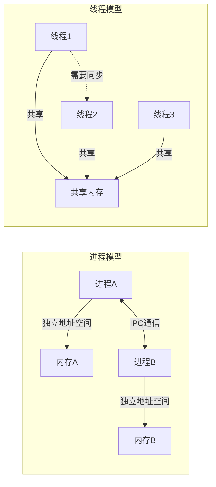

| 对比维度 | 进程 | 线程 |
|----------|------|------|
| 地址空间 | 独立 | 共享 |
| 创建开销 | 大（需分配资源） | 小（共享资源） |
| 切换开销 | 高（微秒级） | 低（亚微秒级） |
| 通信方式 | IPC（管道/共享内存/消息队列） | 直接读写共享变量 |
| 故障隔离 | 强（互不影响） | 弱（一个线程崩溃可能导致进程崩溃） |
| 典型应用 | Nginx worker、Redis进程 | Java线程池、Go goroutine |

### 1.2 三种经典并发模型

| 模型 | 核心思想 | 代表实现 | 适用场景 | 编程复杂度 | 吞吐量上限 |
|------|----------|----------|----------|------------|------------|
| 进程/线程模型 | 每个请求一个线程/进程 | Apache prefork, Java Thread | 请求量中等、每个请求处理时间长 | 低（阻塞式编程） | 数千QPS |
| 事件驱动模型 | 单线程轮询事件，非阻塞处理 | Node.js, Nginx, Redis | 大量短连接、IO密集型 | 高（回调地狱/状态机） | 数万QPS |
| Actor/CSP模型 | 通过消息传递实现并发 | Erlang/OTP, Go channel | 分布式系统、高并发消息处理 | 中等 | 数万QPS |

**事件驱动模型详解**：事件驱动模型（也称Reactor模式）是高性能网络服务器的核心架构。其核心思想是：少量线程（甚至单线程）通过IO多路复用（epoll/kqueue/IOCP）监听大量文件描述符的事件，当事件就绪时执行对应的回调函数。Nginx采用的就是这种模型，一个master进程加少量worker进程就能处理数万并发连接。

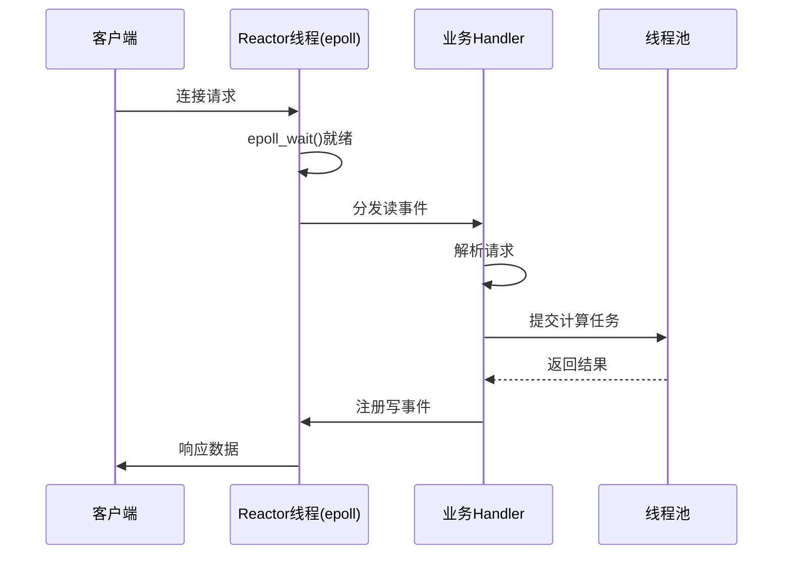

> **关键洞察**：事件驱动模型的性能优势来自于一个简单的事实——大多数网络连接在大部分时间里是空闲的。epoll让单个线程只需要关注"有事件发生的连接"，而不是为每个连接都分配一个线程。这就是为什么Nginx用4个worker进程就能处理10万并发连接，而Apache需要数万个线程。

### 1.3 M:N调度模型

现代并发运行时普遍采用M:N调度模型：将M个用户态并发单元（goroutine/虚拟线程/协程）映射到N个操作系统线程上（N通常等于CPU核心数）。这种模型结合了用户态调度的低开销和内核态调度的公平性。

Go的GMP调度模型是M:N调度的经典实现：
- **G（Goroutine）**：用户态协程，初始栈2KB，可动态增长
- **M（Machine）**：操作系统线程，执行G的实际载体
- **P（Processor）**：逻辑处理器，维护本地G队列，数量默认等于GOMAXPROCS

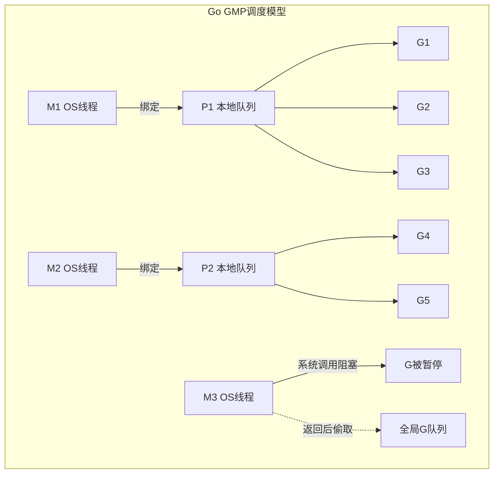

当一个goroutine执行系统调用阻塞时，其绑定的M会释放P，P立即绑定其他空闲M继续执行本地队列中的goroutine，保证CPU不被浪费。当阻塞的M返回后，它会尝试获取空闲P，若没有则将G放入全局队列。这种设计确保了在IO密集型场景下依然能保持高CPU利用率。

**GMP调度的工作窃取机制**：
1. P首先执行本地队列中的G
2. 本地队列为空时，从全局队列偷取一批G（每次偷取全局队列的1/4）
3. 全局队列也为空时，从其他P的本地队列偷取一半的G
4. 这种设计确保了负载均衡：忙碌的P不会被打扰，空闲的P主动寻找工作

### 1.4 常见误区

| 误区 | 正确理解 |
|------|----------|
| "进程比线程更安全，应该优先用进程" | 进程隔离确实更强，但IPC通信开销大。大多数场景下线程+同步机制更合适 |
| "事件驱动模型是万能的" | 事件驱动对CPU密集型任务无优势，且编程模型复杂（回调地狱） |
| "goroutine创建越多越好" | 过多goroutine会增加调度开销和内存消耗，应配合worker pool控制并发度 |
| "M:N模型中N越大越好" | N通常等于CPU核心数，增大N不会提升CPU并行度，反而增加上下文切换 |

---

## 二、线程池：并发执行的基础设施

线程池是并发编程中最基础也最重要的组件。它的核心思想是**资源复用**——预先创建一组线程，将任务提交到线程池中执行，避免频繁创建和销毁线程的开销。在高并发场景下，一个设计良好的线程池可以显著提升系统的吞吐量和稳定性。

### 2.1 线程池核心参数

以Java的`ThreadPoolExecutor`为例，线程池的设计涉及以下关键参数：

| 参数 | 含义 | 设计考量 |
|------|------|----------|
| corePoolSize | 核心线程数，即使空闲也不回收 | 决定了线程池的基本并发能力 |
| maximumPoolSize | 最大线程数，任务队列满时动态扩展 | 系统峰值处理能力的上限 |
| keepAliveTime | 非核心线程空闲存活时间 | 平衡资源占用与响应速度 |
| workQueue | 任务等待队列 | 缓冲突发流量，选择影响整体行为 |
| threadFactory | 线程创建工厂 | 自定义线程名、优先级、守护属性 |
| handler | 拒绝策略 | 任务过载时的降级方案 |

### 2.2 任务处理流程

线程池的任务处理流程遵循严格的优先级规则：

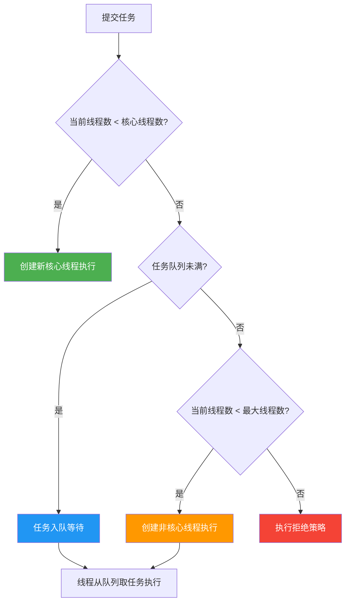

理解这个流程的关键在于：**任务队列在核心线程满之后、最大线程创建之前**。这意味着如果队列选择不当（如无界队列），maximumPoolSize永远不会生效——这是最常见的配置陷阱。

**真实案例**：某电商系统使用`Executors.newFixedThreadPool(200)`（内部使用无界LinkedBlockingQueue），在大促期间任务堆积导致OOM。原因正是无界队列导致maximumPoolSize形同虚设，任务无限堆积直到内存耗尽。修复方案：改用`new ThreadPoolExecutor(200, 400, 60, TimeUnit.SECONDS, new LinkedBlockingQueue<>(10000))`，限制队列长度。

### 2.3 四种拒绝策略对比

当线程池达到最大容量且队列已满时，拒绝策略决定了任务的最终命运：

| 策略 | 行为 | 适用场景 | 风险 |
|------|------|----------|------|
| AbortPolicy（默认） | 抛出RejectedExecutionException | 对数据完整性要求高的场景 | 调用方必须处理异常 |
| CallerRunsPolicy | 由提交任务的线程执行 | 不丢弃任务、可接受降速 | 阻塞调用方线程，可能级联超时 |
| DiscardPolicy | 静默丢弃任务 | 可容忍丢失的非关键任务 | 数据丢失无感知，排查困难 |
| DiscardOldestPolicy | 丢弃队列头部最老的任务 | 实时性要求高、旧数据无价值 | 可能丢弃重要任务 |

> **生产建议**：默认的AbortPolicy最安全——至少你能通过异常发现过载。DiscardPolicy是"沉默的杀手"，任务悄悄丢失而你可能毫无察觉。如果确实需要丢弃任务，至少要加上日志记录和监控告警。

### 2.4 线程数调优公式

线程数的设置是一门平衡艺术，需要根据任务特性来决定：

**CPU密集型任务**（如加密解密、图像处理、复杂计算）：

最佳线程数 = CPU核心数 + 1

+1的原因是：当某个线程因页面错误（Page Fault）或其他原因暂时挂起时，额外的线程可以利用空闲的CPU核心，避免浪费。

**IO密集型任务**（如数据库查询、HTTP请求、文件读写）：

最佳线程数 = CPU核心数 × (1 + IO等待时间 / CPU计算时间)

假设8核CPU，IO等待占比80%（即等待时间/总时间=0.8），则：

最佳线程数 = 8 × (1 + 0.8 / 0.2) = 8 × 5 = 40

**混合型任务**：将任务拆分为CPU密集部分和IO密集部分，分别使用不同的线程池。这是微服务架构中常见的最佳实践——HTTP客户端使用IO线程池，数据处理使用CPU线程池。

**阿姆达尔定律的启示**：如果一个程序中串行部分占比为P，那么即使增加无限多的线程，最大加速比也只能是1/P。例如，如果程序有20%是串行的，最多只能获得5倍加速。这意味着盲目增加线程数并不能无限提升性能，找到串行瓶颈才是关键。

### 2.5 ForkJoinPool与工作窃取

ForkJoinPool是Java中专门为分治任务设计的线程池，采用工作窃取（Work-Stealing）算法：

- 每个工作者线程维护一个双端队列（Deque）
- 新任务默认推入当前线程队列的栈顶（LIFO）
- 当线程队列为空时，从其他线程队列的栈底窃取任务（FIFO）
- 这种设计保证了负载均衡：忙碌的线程处理自己的新任务，空闲的线程帮忙处理旧任务

```java
// ForkJoinPool典型用法：并行排序
ForkJoinPool pool = new ForkJoinPool();
pool.invoke(new ParallelMergeSort(array, 0, array.length));

// RecursiveTask的分治模式
class ParallelMergeSort extends RecursiveAction {
    private int[] array;
    private int left, right;
    private static final int THRESHOLD = 1024; // 阈值：小于则串行排序

    @Override
    protected void compute() {
        if (right - left <= THRESHOLD) {
            Arrays.sort(array, left, right); // 串行排序
            return;
        }
        int mid = (left + right) / 2;
        ParallelMergeSort leftTask = new ParallelMergeSort(array, left, mid);
        ParallelMergeSort rightTask = new ParallelMergeSort(array, mid, right);
        invokeAll(leftTask, rightTask); // 并行执行后合并
        merge(array, left, mid, right);
    }
}
```

**工作窃取 vs 传统线程池的性能对比**：

| 场景 | 固定线程池 | ForkJoinPool |
|------|-----------|--------------|
| 均匀任务 | 相当 | 相当 |
| 任务时长不均 | 负载不均，部分线程空闲 | 自动平衡，空闲线程窃取任务 |
| 分治递归任务 | 需要手动管理任务粒度 | 天然支持fork/join |
| IO阻塞任务 | 不适合 | 不适合（会饿死其他任务） |

ForkJoinPool的并行流（parallel stream）默认使用共享的ForkJoinPool，其并行度等于CPU核心数。在生产环境中，应避免在ForkJoinPool中执行阻塞IO操作，否则会饿死其他任务。

---

## 三、协程：轻量级并发的未来

协程（Coroutine）是比线程更轻量级的并发执行单元。与线程由操作系统内核调度不同，协程由用户态的运行时调度器管理，不需要内核态和用户态之间的切换，因此上下文切换开销极低。在需要大量并发连接的场景（如微服务网关、实时通信），协程正在逐步取代传统线程模型。

### 3.1 线程 vs 协程

| 对比维度 | 操作系统线程 | 协程 |
|----------|-------------|------|
| 栈空间 | 通常1-8MB（可配置） | 初始2KB（可动态增长） |
| 上下文切换 | 内核态切换，微秒级 | 用户态切换，纳秒级 |
| 创建开销 | 需要系统调用 | 用户态内存分配 |
| 调度方式 | 操作系统抢占式调度 | 用户态协作式/运行时调度 |
| 创建数量 | 通常数千个 | 轻松创建数十万个 |
| 阻塞行为 | 阻塞底层OS线程 | 运行时自动挂起/恢复 |
| 内存占用 | 10万线程 ≈ 800MB-8GB | 10万协程 ≈ 200MB |

### 3.2 Go Goroutine调度机制

Go运行时的GMP调度器是协程调度的经典实现。其核心机制包括：

**工作窃取**：当一个P的本地队列为空时，它会依次尝试：1）从全局队列获取G；2）从其他P的本地队列窃取一半的G。

**系统调用处理**：当goroutine执行系统调用时，M会与P解绑。如果本地队列中还有其他G，M会获取一个新的P来继续执行。如果本地队列为空，M进入休眠状态。

**抢占式调度**：Go 1.14引入了基于信号的异步抢占，解决了长时间运行的goroutine无法被调度的问题。通过向线程发送`SIGURG`信号，运行时可以在任意指令边界抢占goroutine。

**goroutine泄漏防护**：
```go
// 错误：goroutine泄漏 - channel未关闭导致goroutine永远阻塞
func leakyFunc() {
    ch := make(chan int)
    go func() {
        val := <-ch // 永远阻塞
        fmt.Println(val)
    }()
    // ch没有被写入，goroutine永远不会退出
}

// 正确：使用context控制goroutine生命周期
func correctFunc(ctx context.Context) {
    ch := make(chan int)
    go func() {
        defer close(ch)
        select {
        case val := <-ch:
            fmt.Println(val)
        case <-ctx.Done():
            return // 收到取消信号，正常退出
        }
    }()
}
```

```go
// Goroutine的典型使用模式：fan-out/fan-in
func fanOutFanIn(input <-chan int) int {
    // fan-out: 启动多个worker
    workers := 8
    channels := make([]<-chan int, workers)
    for i := 0; i < workers; i++ {
        channels[i] = processWorker(input)
    }
    
    // fan-in: 合并所有worker的输出
    return mergeChannels(channels)
}

func processWorker(input <-chan int) <-chan int {
    out := make(chan int)
    go func() {
        defer close(out)
        for val := range input {
            // 处理每个任务
            result := expensiveComputation(val)
            out <- result
        }
    }()
    return out
}
```

### 3.3 Java虚拟线程（Project Loom）

Java在JDK 21中正式引入虚拟线程（Virtual Thread），这是Java平台对协程的官方实现。它的出现彻底改变了Java的并发编程范式——从"为每个请求分配一个线程"回归到"同步阻塞风格编写，异步非阻塞执行"。

**核心特性**：
- 每个虚拟线程由JVM调度，不与OS线程一一对应
- 执行阻塞操作时，JVM自动将虚拟线程从底层OS线程上卸载（unmount）
- 当阻塞完成时，JVM将虚拟线程重新挂载到可用的OS线程上
- 可以创建数十万个虚拟线程而不会耗尽系统资源

**最佳实践**：

```java
// 使用虚拟线程处理IO密集型任务
try (var executor = Executors.newVirtualThreadPerTaskExecutor()) {
    IntStream.range(0, 100_000).forEach(i -> {
        executor.submit(() -> {
            // 虚拟线程可以安全地执行阻塞操作
            // 底层OS线程不会被阻塞
            String result = httpClient.get("https://api.example.com/" + i);
            database.save(result);
            return result;
        });
    });
}

// 虚拟线程与Structured Concurrency结合（JDK 21预览）
try (var scope = new StructuredTaskScope.ShutdownOnFailure()) {
    Subtask<String> user = scope.fork(() -> fetchUser(userId));
    Subtask<Order> order = scope.fork(() -> fetchOrder(orderId));
    scope.join();
    return new UserProfile(user.get(), order.get());
}
```

**注意事项**：
- 虚拟线程不适合CPU密集型任务——它们不会增加CPU的并行度
- 避免在虚拟线程中使用`ThreadLocal`存储大量数据（每个虚拟线程都有独立副本）
- `synchronized`块会导致虚拟线程"钉住"（pin）底层OS线程，应使用`ReentrantLock`替代
- 虚拟线程池无法设置大小限制（每个任务一个虚拟线程），需要在应用层自行限流

### 3.4 协程选型对比

| 语言/运行时 | 协程实现 | 调度方式 | 初始栈大小 | 阻塞处理 | 适用场景 |
|-------------|----------|----------|------------|----------|----------|
| Go | goroutine | 抢占式(GMP) | 2KB | 自动挂起 | 高并发网络服务 |
| Java 21+ | Virtual Thread | 抢占式 | ~数百字节 | 自动卸载 | 替换传统线程池 |
| Kotlin | coroutine | 协作式(suspend) | ~数百字节 | 显式挂起 | Android/后端异步 |
| Python | asyncio coroutine | 协作式(event loop) | ~数KB | 显式await | IO密集型脚本 |
| Lua | coroutine | 协作式(显式yield) | ~1KB | 显式yield | 游戏脚本/嵌入式 |

---

## 四、无锁编程：突破互斥锁的性能天花板

互斥锁虽然简单可靠，但在高竞争场景下会成为严重的性能瓶颈。无锁编程通过原子操作（CAS）来实现线程安全，避免了锁带来的线程阻塞和上下文切换开销。理解无锁编程是写出高性能并发代码的关键。

### 4.1 CAS（Compare-And-Swap）操作

CAS是无锁编程的核心原语，它包含三个操作数：
- **内存位置（V）**：要更新的变量地址
- **期望值（A）**：变量当前的预期值
- **新值（B）**：要设置的新值

执行逻辑：如果V处的值等于A，则将其更新为B；否则不做任何操作。整个操作在CPU层面是原子的（x86的`CMPXCHG`指令、ARM的`LDXR/STXR`指令对）。

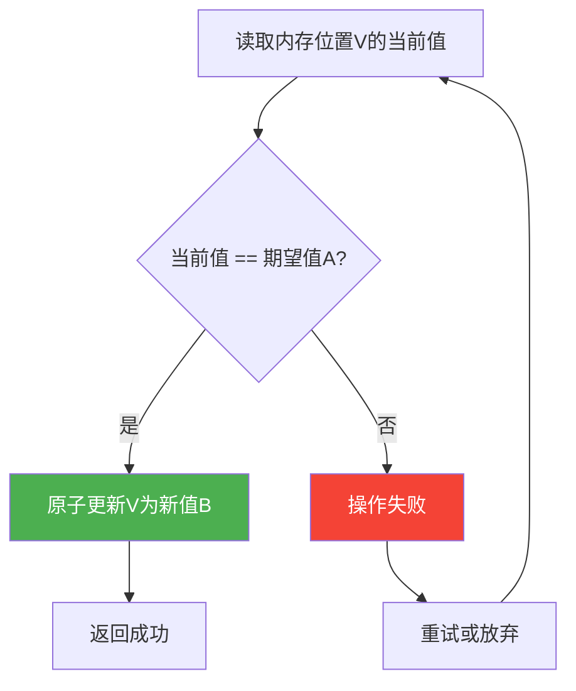

### 4.2 ABA问题与解决方案

CAS存在经典的ABA问题：线程1读取值为A，在CAS操作前，线程2将值从A改为B再改回A，线程1的CAS操作仍然会成功，但实际上数据已经发生了变化。

**典型场景**：在无锁栈的pop操作中，如果线程1读取到栈顶节点A，此时线程2弹出A、压入B、再弹出B压入A，线程1的CAS会成功地把栈顶从"A"设为"A的下一个"——但这个"下一个"可能已经不是原来的节点了，导致链表断裂。

**解决方案**：

1. **版本号方案（AtomicStampedReference）**：每次修改不仅更新值，还递增版本号。CAS同时比较值和版本号。

```java
// AtomicStampedReference解决ABA问题
AtomicStampedReference<String> ref = new AtomicStampedReference<>("A", 0);

int stamp = ref.getStamp(); // 获取当前版本号
String value = ref.getReference(); // 获取当前值

// CAS同时比较值和版本号
boolean success = ref.compareAndSet("A", "B", stamp, stamp + 1);
```

2. **双重检查方案（AtomicMarkableReference）**：使用布尔标记来区分"是否被修改过"，适用于只需要知道是否变化的场景。

### 4.3 无锁数据结构设计

**无锁栈（Lock-Free Stack）**：利用CAS原子更新栈顶指针。

```java
public class LockFreeStack<T> {
    private final AtomicReference<Node<T>> top = new AtomicReference<>();

    public void push(T value) {
        Node<T> newNode = new Node<>(value);
        Node<T> oldTop;
        do {
            oldTop = top.get();
            newNode.next = oldTop;
        } while (!top.compareAndSet(oldTop, newNode));
        // CAS失败时自旋重试
    }

    public T pop() {
        Node<T> oldTop;
        Node<T> newTop;
        do {
            oldTop = top.get();
            if (oldTop == null) return null;
            newTop = oldTop.next;
        } while (!top.compareAndSet(oldTop, newTop));
        return oldTop.value;
    }

    private static class Node<T> {
        final T value;
        Node<T> next;
        Node(T value) { this.value = value; }
    }
}
```

**无锁队列（Lock-Free Queue）**：Michael-Scott队列是最经典的无锁队列实现，使用两个CAS操作分别维护头指针和尾指针。其核心思想是：入队时CAS更新tail指针，出队时CAS更新head指针，通过"占位节点"（sentinel node）来避免head和tail竞争同一个节点。

**无锁哈希表（ConcurrentHashMap）**：Java的ConcurrentHashMap在JDK 8中放弃了分段锁（Segment），改用CAS + synchronized（锁单个桶节点）的混合方案，在低竞争时无锁、高竞争时细粒度加锁。

### 4.4 LongAdder：高并发计数的终极方案

在极高竞争场景下，即使CAS操作也会因大量自旋而性能下降。`LongAdder`通过**分散竞争**来解决这个问题：

```mermaid
graph TB
    subgraph "AtomicLong：所有线程竞争同一个值"
        T1a --> CL[核心变量 value]
        T2a --> CL
        T3a --> CL
        T4a --> CL
    end
    
    subgraph "LongAdder：每个线程操作自己的Cell"
        T1b --> C1[Cell[0] = 3]
        T2b --> C2[Cell[1] = 5]
        T3b --> C3[Cell[2] = 2]
        T4b --> C4[Cell[3] = 7]
        C1 -->|sum| RS[结果 = base + ΣCell]
        C2 -->|sum| RS
        C3 -->|sum| RS
        C4 -->|sum| RS
    end
```

```java
// LongAdder vs AtomicLong 性能对比（16线程，每线程递增100万次）
// AtomicLong:  ~1200ms (大量CAS自旋)
// LongAdder:   ~80ms   (几乎无竞争)

LongAdder counter = new LongAdder();
// 线程内
counter.increment(); // 操作本地Cell，几乎无竞争

// 读取最终结果（非原子快照）
long total = counter.sum();
```

**适用场景**：统计计数、指标采集、流量统计等对实时精确性要求不高、但对吞吐量要求极高的场景。不适用：需要精确原子更新的场景（如余额操作）。

### 4.5 无锁 vs 有锁：选择指南

| 场景 | 推荐方案 | 理由 |
|------|----------|------|
| 低竞争（< 10线程） | CAS / 无锁 | 无锁开销更小，无上下文切换 |
| 中等竞争（10-100线程） | 细粒度锁 / 读写锁 | CAS自旋开销开始显现 |
| 高竞争（> 100线程） | 分段锁 / LongAdder | 减少竞争热点 |
| 读多写少 | 读写锁 / StampedLock | 最大化并发读 |
| 写多读少 | 独占锁 | 读写锁的开销反而更大 |
| 纯计数场景 | LongAdder | 分散竞争，吞吐量最高 |

> **经验法则**：先用简单方案（synchronized/ReentrantLock），通过压测找到真正的竞争热点，再针对性地替换为无锁方案。过早的无锁优化是代码复杂性的主要来源。

---

## 五、锁机制：同步原语的演进

锁是并发编程中最基础的同步机制。从最简单的互斥锁到复杂的读写锁和分段锁，锁机制的演进反映了对并发性能的不断追求。理解每种锁的适用场景和性能特征，是写出高效并发代码的基础。

### 5.1 互斥锁（Mutex）与自旋锁（Spinlock）

**互斥锁**：当锁被持有时，其他线程会被挂起（阻塞），直到锁释放后由操作系统唤醒。优点是不浪费CPU周期，缺点是上下文切换开销大（约1-10μs）。

**自旋锁**：当锁被持有时，其他线程在一个忙等循环中不断尝试获取锁（CAS操作），不会让出CPU。优点是避免了上下文切换，缺点是浪费CPU周期。

**混合自旋锁**：现代JVM（如Java的`ReentrantLock`）采用混合策略——先自旋若干次（默认10次），如果仍然无法获取锁，则退化为阻塞锁。这种策略在锁持有时间短的场景下能显著减少上下文切换。

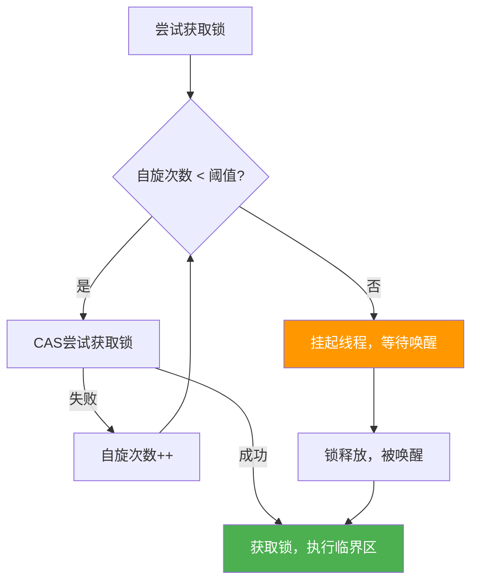

**性能特征对比**：

| 锁类型 | 适用场景 | 优点 | 缺点 |
|--------|----------|------|------|
| 互斥锁 | 锁持有时间长 | 不浪费CPU | 上下文切换开销大 |
| 自旋锁 | 锁持有时间极短（<1μs） | 无上下文切换 | 浪费CPU周期 |
| 混合锁 | 通用场景 | 自适应 | 实现复杂 |

### 5.2 读写锁

读写锁（Read-Write Lock）允许多个线程同时持有读锁，但写锁是独占的。这在读多写少的场景下能大幅提升并发度。

**ReentrantReadWriteLock**的实现原理：
- 内部使用一个32位的int变量`state`来同时表示读锁和写锁状态
- 高16位：读锁的持有次数（共享）
- 低16位：写锁的重入次数（独占）

```java
public class Cache<K, V> {
    private final Map<K, V> cache = new ConcurrentHashMap<>();
    private final ReadWriteLock lock = new ReentrantReadWriteLock();
    private volatile boolean dirty = false; // 标记数据是否过期

    public V get(K key) {
        lock.readLock().lock();
        try {
            return cache.get(key);
        } finally {
            lock.readLock().unlock();
        }
    }

    public void put(K key, V value) {
        lock.writeLock().lock();
        try {
            cache.put(key, value);
            dirty = true;
        } finally {
            lock.writeLock().unlock();
        }
    }

    // 定期刷新：需要写锁
    public void refresh() {
        if (!dirty) return;
        lock.writeLock().lock();
        try {
            if (!dirty) return; // double-check
            cache.putAll(loadFromDB());
            dirty = false;
        } finally {
            lock.writeLock().unlock();
        }
    }
}
```

**写线程饥饿问题**：在默认的非公平模式下，当读操作非常频繁时，写线程可能长时间无法获取写锁（因为读锁可以不断叠加）。解决方案：
1. 使用公平模式`ReentrantReadWriteLock(true)`——按FIFO顺序分配锁，但会降低吞吐量
2. 使用`StampedLock`的乐观读模式

### 5.3 StampedLock：Java 8的读写锁进化

`StampedLock`引入了三种锁模式，解决了传统读写锁的性能瓶颈：

| 模式 | 获取方法 | 特点 |
|------|----------|------|
| 写锁（独占） | `writeLock()` | 排他访问 |
| 悲观读锁（共享） | `readLock()` | 与写锁互斥 |
| 乐观读（无锁） | `tryOptimisticRead()` | 不加锁，通过版本号验证 |

```java
// StampedLock乐观读模式
public class Point {
    private double x, y;
    private final StampedLock sl = new StampedLock();

    public void move(double deltaX, double deltaY) {
        long stamp = sl.writeLock(); // 获取写锁
        try {
            x += deltaX;
            y += deltaY;
        } finally {
            sl.unlockWrite(stamp);
        }
    }

    public double distanceFromOrigin() {
        long stamp = sl.tryOptimisticRead(); // 乐观读（无锁）
        double currentX = x, currentY = y;
        if (!sl.validate(stamp)) { // 验证期间数据是否被修改
            stamp = sl.readLock(); // 降级为悲观读锁
            try {
                currentX = x;
                currentY = y;
            } finally {
                sl.unlockRead(stamp);
            }
        }
        return Math.sqrt(currentX * currentX + currentY * currentY);
    }
}
```

乐观读的优势在于：读操作完全无锁，只有在验证失败时才退化为悲观读锁。在读多写少且写操作间隔较长的场景下，性能比ReentrantReadWriteLock提升显著（基准测试中约提升2-5倍）。

> **注意事项**：StampedLock不支持重入，不支持Condition，使用不当容易出错。对于大多数场景，ReentrantReadWriteLock更安全。StampedLock适合对性能有极致要求且开发者对锁机制有深入理解的场景。

### 5.4 分段锁与锁粒度演进

锁的粒度从粗到细的演进路径：

全局锁 → 分段锁（Segment）→ 桶级别锁（Node锁）→ 无锁（CAS）

以ConcurrentHashMap的演进为例：
- **JDK 7**：Segment分段锁，16个Segment，每个Segment是独立的HashMap，锁粒度为Segment级别
- **JDK 8**：放弃Segment，改为CAS + synchronized（锁单个桶节点），锁粒度细化到Node级别
- **JDK 9+**：进一步优化，`computeIfAbsent`等操作使用CAS避免锁竞争

**性能影响**：在16核机器上，ConcurrentHashMap从JDK 7升级到JDK 8后，并发put操作的吞吐量提升约3-5倍，主要归功于锁粒度的细化和CAS的引入。

---

## 六、限流算法：流量控制的数学基础

限流是保护系统免受过载的核心手段。在高并发场景下，不限流的系统就像没有闸门的水坝——洪水来临时必然崩溃。限流的本质是在数学层面精确控制系统的处理速率。

### 6.1 四种经典限流算法

#### 固定窗口算法（Fixed Window）

将时间划分为固定大小的窗口（如每秒一个窗口），每个窗口维护一个计数器。窗口内请求数超过阈值则拒绝。

**优点**：实现最简单，内存开销最小。
**缺陷**：存在"临界突发"问题——如果窗口边界恰好有两个突发流量（如59秒末和01秒初），虽然每个窗口内未超限，但跨窗口的实际速率可达阈值的2倍。

窗口1 (0-1秒):  ████████░░  8/10  ✓
窗口2 (1-2秒):  ████████░░  8/10  ✓
━━━━━━━━━━━━━━━━━━━━━━━━━━━━━━━━━━━━
实际1秒内:       ██████████████████  16/10  ✗ 超限！
        ↑       ↑
     窗口1末   窗口2初

#### 滑动窗口算法（Sliding Window）

将时间轴划分为多个小的时间片（如1秒分为64个槽），窗口随时间滑动，统计窗口内所有槽的请求数之和。

```go
type SlidingWindowLimiter struct {
    windowSize    time.Duration // 窗口大小
    slotCount     int           // 槽位数量
    slotDuration  time.Duration // 每个槽的时间跨度
    slots         []int64       // 各槽的计数
    currentSlot   int           // 当前槽位
    lastSlotTime  time.Time     // 上次槽位更新时间
    maxRequests   int64         // 窗口内最大请求数
    mu            sync.Mutex
}

func (l *SlidingWindowLimiter) Allow() bool {
    l.mu.Lock()
    defer l.mu.Unlock()
    
    now := time.Now()
    // 计算应滑过的槽位数
    elapsed := now.Sub(l.lastSlotTime)
    slotsToSlide := int(elapsed / l.slotDuration)
    
    if slotsToSlide > 0 {
        // 重置滑过的槽位
        for i := 0; i < slotsToSlide &amp;&amp; i < l.slotCount; i++ {
            idx := (l.currentSlot + 1 + i) % l.slotCount
            l.slots[idx] = 0
        }
        l.currentSlot = (l.currentSlot + slotsToSlide) % l.slotCount
        l.lastSlotTime = now
    }
    
    // 计算当前窗口内的总请求数
    var total int64
    for _, count := range l.slots {
        total += count
    }
    
    if total >= l.maxRequests {
        return false // 超过限流阈值
    }
    l.slots[l.currentSlot]++
    return true
}
```

**优点**：解决了固定窗口的临界突发问题。
**缺点**：实现较复杂，需要维护多个时间槽。槽位越多精度越高，但内存开销也越大。

#### 令牌桶算法（Token Bucket）

系统以恒定速率向桶中添加令牌，每个请求消耗一个令牌。桶满时新令牌丢弃。桶空时请求被拒绝或等待。

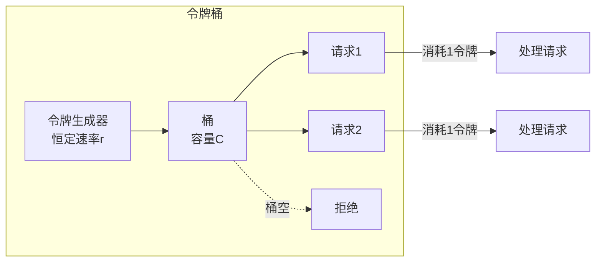

**关键参数**：
- **速率（r）**：令牌生成速率，即系统的平均处理能力
- **容量（C）**：桶的最大容量，决定了允许的突发流量大小

```go
// 令牌桶限流器实现
type TokenBucket struct {
    rate       float64   // 每秒生成的令牌数
    capacity   float64   // 桶的最大容量
    tokens     float64   // 当前令牌数
    lastRefill time.Time // 上次补充令牌的时间
    mu         sync.Mutex
}

func NewTokenBucket(rate, capacity float64) *TokenBucket {
    return &amp;TokenBucket{
        rate:       rate,
        capacity:   capacity,
        tokens:     capacity, // 初始令牌数等于容量
        lastRefill: time.Now(),
    }
}

func (tb *TokenBucket) Allow() bool {
    tb.mu.Lock()
    defer tb.mu.Unlock()
    
    now := time.Now()
    elapsed := now.Sub(tb.lastRefill).Seconds()
    tb.lastRefill = now
    
    // 补充令牌
    tb.tokens += elapsed * tb.rate
    if tb.tokens > tb.capacity {
        tb.tokens = tb.capacity
    }
    
    if tb.tokens >= 1 {
        tb.tokens--
        return true
    }
    return false
}
```

**令牌桶 vs 漏桶**：令牌桶允许突发流量（桶中积累的令牌可以一次性消耗），而漏桶以恒定速率处理请求，完全平滑。令牌桶在实际应用中更灵活，是大多数限流中间件的默认实现（Guava RateLimiter、Redis-Cell等）。

#### 漏桶算法（Leaky Bucket）

请求以任意速率进入桶中，但以固定速率流出处理。桶满时新请求被拒绝。漏桶的核心特点是**输出速率恒定**，即使输入速率剧烈波动。

输入（突发）:  ██████████████████████  不规则
漏桶处理:      ████░░████░░████░░████  恒定速率
输出（平滑）:  ████░░████░░████░░████  恒定速率

**适用场景对比**：

| 算法 | 突发处理 | 实现复杂度 | 精度 | 典型应用 |
|------|----------|------------|------|----------|
| 固定窗口 | 差（临界2倍突发） | 低 | 低 | 简单计数限流 |
| 滑动窗口 | 好 | 中 | 高 | Sentinel、Nginx限流 |
| 令牌桶 | 好（可配置突发） | 中 | 高 | Guava RateLimiter、API网关 |
| 漏桶 | 差（完全平滑） | 中 | 高 | 流量整形、网络QoS |

### 6.2 分布式限流

单机限流只能保护单个节点，在分布式系统中需要全局限流。常用的分布式限流方案：

| 方案 | 原理 | 一致性 | 性能 | 适用场景 |
|------|------|--------|------|----------|
| Redis计数器 | INCR + EXPIRE | 最终一致 | 中等（网络RTT） | 简单计数限流 |
| Redis Lua脚本 | 原子令牌桶操作 | 强一致 | 中等 | 精确令牌桶限流 |
| 本地限流 + 全局同步 | 本地令牌桶 + 定期同步 | 最终一致 | 高 | 高吞吐场景 |
| Sentinel/Dubbo | 中间件内置限流 | 取决于实现 | 高 | 微服务架构 |

```lua
-- Redis Lua脚本实现分布式令牌桶（原子操作）
local key = KEYS[1]
local rate = tonumber(ARGV[1])       -- 令牌速率（个/秒）
local capacity = tonumber(ARGV[2])   -- 桶容量
local now = tonumber(ARGV[3])        -- 当前时间戳
local requested = tonumber(ARGV[4])  -- 请求数量

local fill_time = capacity / rate
local ttl = math.floor(fill_time * 2)

local last_tokens = tonumber(redis.call("get", key) or capacity)
local last_refreshed = tonumber(redis.call("get", key .. ":ts") or now)

local delta = math.max(0, now - last_refreshed)
local filled_tokens = math.min(capacity, last_tokens + (delta * rate))
local allowed = filled_tokens >= requested

local new_tokens = filled_tokens
if allowed then
    new_tokens = filled_tokens - requested
end

redis.call("setex", key, ttl, new_tokens)
redis.call("setex", key .. ":ts", ttl, now)

return allowed and 1 or 0
```

> **分布式限流的陷阱**：Redis单点的QPS上限约为10万级（单机），对于超大规模系统可能成为瓶颈。解决方案：本地限流 + 全局配额分配——每个节点分配一个配额（如全局10万QPS，10个节点各分配1万），节点内用本地令牌桶限流，无需每次请求都访问Redis。

---

## 七、熔断与降级：系统弹性的守护者

熔断器模式（Circuit Breaker Pattern）灵感来源于电路中的保险丝——当电流过大时自动断开，保护电路不受损。在微服务架构中，当下游服务出现故障时，熔断器可以快速失败，避免故障雪崩。限流、熔断、降级是高并发系统的"三件套"，缺一不可。

### 7.1 熔断器的三态模型

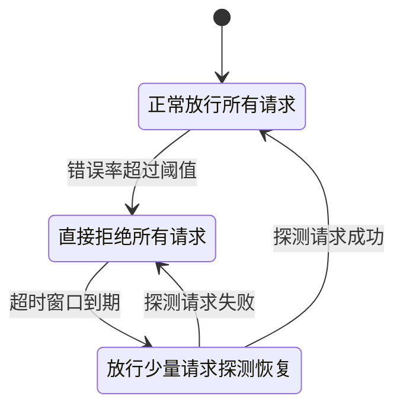

**关闭状态（Closed）**：正常工作状态，所有请求正常通过。同时统计失败率。当失败率（或失败次数）超过设定的阈值时，状态转换为"打开"。

**打开状态（Open）**：熔断状态，所有请求被直接拒绝（或返回降级结果）。经过预设的超时时间后，状态转换为"半开"。

**半开状态（Half-Open）**：允许少量请求通过以探测下游服务是否恢复。如果这些请求成功，则转换为"关闭"；如果仍然失败，则重新回到"打开"状态。

### 7.2 熔断器核心参数

| 参数 | 含义 | 典型值 | 调优建议 |
|------|------|--------|----------|
| failureThreshold | 触发熔断的失败次数/比率 | 5次 / 50% | 根据业务容忍度设置 |
| timeout | 熔断打开后的恢复等待时间 | 30s - 60s | 过短则频繁探测，过长则恢复慢 |
| successThreshold | 半开状态恢复所需的连续成功次数 | 3次 | 确保恢复是稳定的 |
| requestVolume | 统计窗口内的最小请求量 | 20次 | 防止少量请求误触发 |
| slowCallThreshold | 慢调用判定阈值 | 2s | 根据业务SLA设置 |

### 7.3 熔断器实现

```go
type CircuitBreaker struct {
    mu               sync.RWMutex
    state            string        // "closed" / "open" / "half-open"
    failures         int           // 当前连续失败次数
    successes        int           // 半开状态的连续成功次数
    failureThreshold int           // 触发熔断的失败次数
    successThreshold int           // 恢复所需的成功次数
    timeout          time.Duration // 熔断恢复等待时间
    lastFailureTime  time.Time     // 上次失败时间
}

func NewCircuitBreaker(failThreshold, successThreshold int, timeout time.Duration) *CircuitBreaker {
    return &amp;CircuitBreaker{
        state:            "closed",
        failureThreshold: failThreshold,
        successThreshold: successThreshold,
        timeout:          timeout,
    }
}

func (cb *CircuitBreaker) Execute(fn func() error) error {
    cb.mu.RLock()
    state := cb.state
    cb.mu.RUnlock()

    // 打开状态：检查是否可以进入半开
    if state == "open" {
        cb.mu.Lock()
        if time.Since(cb.lastFailureTime) > cb.timeout {
            cb.state = "half-open"
            cb.successes = 0
            cb.mu.Unlock()
        } else {
            cb.mu.Unlock()
            return errors.New("circuit breaker is open: request rejected")
        }
    }

    // 执行请求
    err := fn()

    cb.mu.Lock()
    defer cb.mu.Unlock()

    if err != nil {
        cb.failures++
        cb.successes = 0
        cb.lastFailureTime = time.Now()
        if cb.failures >= cb.failureThreshold {
            cb.state = "open"
        }
        return err
    }

    // 成功处理
    cb.failures = 0
    if cb.state == "half-open" {
        cb.successes++
        if cb.successes >= cb.successThreshold {
            cb.state = "closed"
        }
    }
    return nil
}
```

### 7.4 服务降级策略

当熔断器打开或系统负载过高时，需要执行降级策略来保证核心功能可用：

| 降级类型 | 策略 | 示例 |
|----------|------|------|
| 返回缓存数据 | 读取本地/Redis缓存的过期数据 | 商品详情页返回缓存价格 |
| 返回默认值 | 返回预设的兜底数据 | 推荐系统返回热门列表 |
| 简化流程 | 跳过非核心步骤 | 下单跳过积分计算 |
| 功能降级 | 关闭非核心功能 | 大促期间关闭评论功能 |
| 流量降级 | 限制非核心入口的流量 | 限制搜索频率 |

**限流 + 熔断 + 降级联动**：

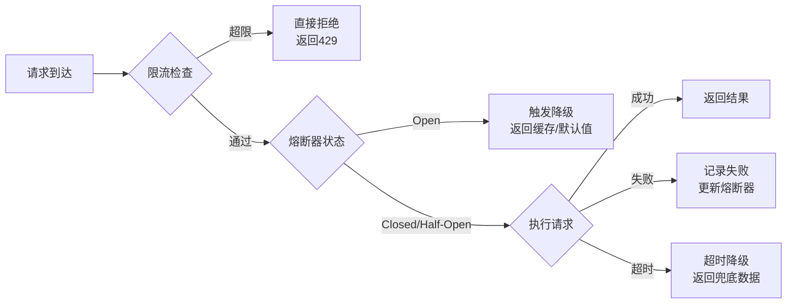

> **故障雪崩的典型场景**：A服务调用B服务，B服务调用C服务。当C服务出现故障响应变慢时，B的线程池被阻塞的请求占满，B开始拒绝新请求。A调用B也开始超时，A的线程池也被占满……最终整个调用链上的所有服务全部瘫痪。熔断器的作用就是在B检测到C故障时快速失败，防止故障向上传播。

---

## 八、响应式编程：异步数据流的优雅处理

响应式编程（Reactive Programming）是一种基于数据流和变化传播的编程范式。当数据源发生变化时，所有依赖该数据的计算会自动更新，无需手动通知。在高并发场景中，响应式编程提供了一种处理异步数据流的优雅方式，特别适合IO密集型的微服务编排。

### 8.1 核心概念

响应式编程的核心由四部分组成：

**发布者（Publisher）**：产生数据流的源头。可以是用户输入、网络消息、定时事件等。Reactor中的`Flux`（0-N个元素）和`Mono`（0-1个元素）是两种发布者类型。

**订阅者（Subscriber）**：消费数据流的终端。通过`onNext`、`onError`、`onComplete`三个回调来处理数据。

**操作符（Operator）**：对数据流进行转换和组合的中间环节。包括`map`（转换）、`filter`（过滤）、`flatMap`（异步映射）、`zip`（合并）、`reduce`（聚合）等。每个操作符返回一个新的发布者，形成一个处理链。

**背压（Backpressure）**：当发布者产生数据的速度超过订阅者消费的速度时，背压机制让订阅者告诉发布者"慢一点"。这是响应式编程区别于传统异步回调的关键特性。

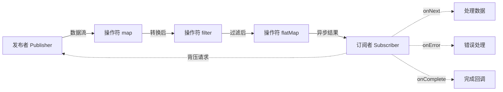

### 8.2 Reactor实战

```java
// 完整的响应式编程示例：用户注册流程
public Mono<UserResponse> registerUser(Mono<RegisterRequest> requestMono) {
    return requestMono
        .map(this::validate)                    // 1. 验证输入
        .flatMap(req ->                          // 2. 异步操作链
            Mono.zip(
                checkEmailExists(req.getEmail()),     // 并行：检查邮箱
                checkUsernameExists(req.getUsername())  // 并行：检查用户名
            )
        )
        .filter(tuple -> !tuple.getT1() &amp;&amp; !tuple.getT2()) // 3. 过滤冲突
        .flatMap(tuple ->Mono.fromCallable(() ->           // 4. 创建用户
            createUser(requestMono.block())
        ))
        .flatMap(user ->                         // 5. 发送欢迎邮件
            sendWelcomeEmail(user)
                .onErrorResume(e -> Mono.empty()) // 邮件失败不影响注册
        )
        .map(user -> toResponse(user))           // 6. 转换为响应
        .timeout(Duration.ofSeconds(5))          // 7. 超时控制
        .onErrorResume(e ->                      // 8. 错误降级
            Mono.error(new BusinessException("注册失败: " + e.getMessage()))
        );
}
```

**响应式 vs 传统异步的对比**：

| 维度 | 传统异步（回调/CompletableFuture） | 响应式（Reactor） |
|------|-------------------------------------|-------------------|
| 代码可读性 | 嵌套回调，难以阅读 | 链式调用，声明式 |
| 错误处理 | 分散在各层回调中 | 统一的onError操作符 |
| 背压支持 | 无 | 原生支持 |
| 组合能力 | 有限（CompletableFuture.thenCompose） | 丰富的操作符库 |
| 学习曲线 | 低 | 高（需要理解响应式思维） |
| 调试难度 | 中等 | 高（异步栈追踪复杂） |

### 8.3 背压策略

| 策略 | 行为 | 适用场景 |
|------|------|----------|
| BUFFER | 缓存所有未处理的数据（可能OOM） | 低速生产者，内存充足 |
| DROP | 丢弃未处理的数据 | 实时指标，旧数据无价值 |
| LATEST | 只保留最新的数据 | 配置更新，只需要最新值 |
| ERROR | 通知订阅者错误 | 需要严格保证数据完整性 |
| REQUEST | 请求式拉取（n个） | 消费者控制节奏 |

### 8.4 异步IO模型

传统的同步IO在等待数据时会阻塞线程，造成资源浪费。异步IO模型让线程在发起IO请求后立即返回，IO完成后通过回调或事件通知处理结果。

**IO模型对比**：

| 模型 | 阻塞方式 | 线程利用 | 适用场景 | 典型框架 |
|------|----------|----------|----------|----------|
| BIO（阻塞IO） | 线程阻塞等待 | 低 | 连接数少且固定 | Java Socket |
| NIO（非阻塞IO） | 轮询IO状态 | 中 | 连接数多但活跃少 | Java NIO |
| IO多路复用 | select/poll/epoll监听 | 高 | 大量连接的事件驱动 | Nginx、Redis |
| AIO（异步IO） | 回调通知完成 | 最高 | 大量并发IO操作 | Linux io_uring |

**Netty：异步IO的工业级实现**：

Netty是Java领域最流行的异步IO框架，基于Reactor模式，核心架构如下：

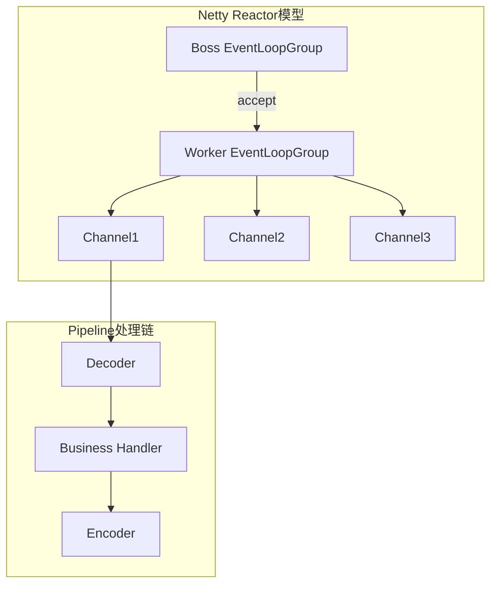

**io_uring：Linux异步IO的未来**：Linux 5.1引入的io_uring是新一代异步IO接口，通过共享内存的环形缓冲区（Ring Buffer）实现用户态和内核态之间的零拷贝通信，避免了传统epoll的系统调用开销。在高并发场景下，io_uring相比epoll可提升20-50%的吞吐量。目前Netty和libuv等框架已开始支持io_uring后端。

---

## 九、热点数据处理：高并发场景的特殊挑战

在高并发系统中，热点数据（Hot Key）是一个常见且棘手的问题。热点数据是指在短时间内被大量访问的数据，如热门商品、明星微博、秒杀商品等。如果处理不当，热点数据会导致单点过载，成为系统的性能瓶颈。据统计，互联网系统中约5%的Key承受了50%以上的访问量。

### 9.1 热点数据的分类

| 类型 | 特征 | 示例 | 风险 |
|------|------|------|------|
| 读热点 | 短时间内被大量读取 | 热门商品详情、排行榜 | 缓存/DB读压力 |
| 写热点 | 短时间内被大量写入 | 秒杀库存、投票计数 | 缓存/DB写压力 |
| 分布热点 | 数据分布不均导致的热点 | 分库分表的分片热点 | 单分片过载 |

### 9.2 热点数据探测

**实时统计**：通过滑动窗口统计每个Key的访问频率，超过阈值的标记为热点。

```java
// 热点Key检测器（基于滑动窗口）
public class HotKeyDetector {
    private final ConcurrentHashMap<String, LongAdder> counterMap = new ConcurrentHashMap<>();
    private final long windowMs = 1000; // 1秒窗口
    private final long threshold = 10000; // 每秒超过1万次视为热点

    public void record(String key) {
        counterMap.computeIfAbsent(key, k -> new LongAdder()).increment();
    }

    public boolean isHotKey(String key) {
        LongAdder counter = counterMap.get(key);
        return counter != null &amp;&amp; counter.sum() > threshold;
    }

    // 定期清理过期计数器
    @Scheduled(fixedRate = 1000)
    public void cleanup() {
        counterMap.clear();
    }
}
```

**被动探测**：通过监控系统的P99延迟和错误率，当某个Key的处理延迟异常升高时自动标记为热点。

**热点Key的发现工具**：
- **Redis CLI**：`redis-cli --hotkeys`（需开启LFU淘汰策略）
- **Redis Monitor**：`redis-cli monitor | awk '{print $3}' | sort | uniq -c | sort -rn`
- **业务埋点**：在应用层记录每个Key的访问频率，通过Flink/Spark Streaming实时分析

### 9.3 热点数据解决方案

#### 方案一：本地缓存（Local Cache）

在应用进程内缓存热点数据，避免每次都访问远程缓存或数据库。

```java
// Caffeine本地缓存 + Redis二级缓存
public class TwoLevelCache<K, V> {
    private final Cache<K, V> localCache;  // Caffeine本地缓存
    private final RedisTemplate<String, V> redis;  // Redis远程缓存

    public V get(K key) {
        // 一级：本地缓存
        V value = localCache.getIfPresent(key);
        if (value != null) return value;

        // 二级：Redis缓存
        value = redis.opsForValue().get(key.toString());
        if (value != null) {
            localCache.put(key, value); // 回填本地缓存
            return value;
        }

        // 三级：数据库（需加分布式锁防击穿）
        return loadFromDBWithLock(key);
    }
}
```

**数据一致性方案**：当数据更新时，需要通过Redis Pub/Sub或消息队列通知所有节点清除本地缓存。

数据更新流程：
1. 应用A更新数据库
2. 应用A删除Redis缓存
3. 应用A发送Pub/Sub消息："key_xxx已更新"
4. 所有应用节点收到消息，删除本地缓存
5. 下次访问时回填最新的Redis数据

#### 方案二：数据分片（Key Splitting）

将热点Key拆分为多个子Key，分散到不同的缓存/DB分片上：

原始热点Key: "hot_product_123"
拆分为: "hot_product_123_0", "hot_product_123_1", ..., "hot_product_123_9"

读取时: 随机选择一个分片读取
更新时: 同步更新所有分片

```go
// 热点Key分片
func getShardKey(key string, shardCount int) string {
    shard := rand.Intn(shardCount)
    return fmt.Sprintf("%s_%d", key, shard)
}

func GetHotValue(key string) string {
    shardKey := getShardKey(key, 16) // 分16个分片
    return redis.Get(shardKey)
}

func SetHotValue(key string, value string) {
    // 写入时更新所有分片
    for i := 0; i < 16; i++ {
        shardKey := fmt.Sprintf("%s_%d", key, i)
        redis.Set(shardKey, value)
    }
}
```

#### 方案三：限流 + 降级联合

对热点Key的访问进行专门限流，超限时返回降级数据：

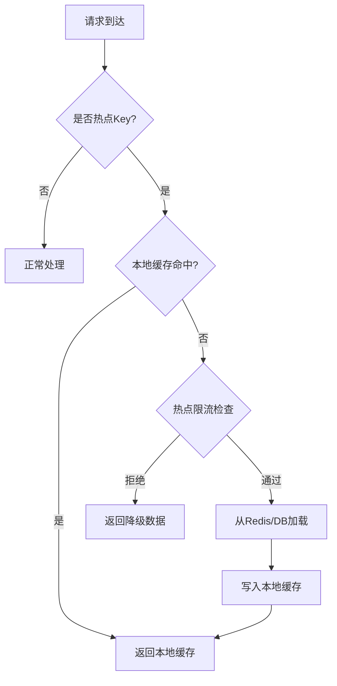

#### 方案四：异步化写入

对于写热点场景（如秒杀扣库存），将同步写操作转为异步写入：

1. 写请求先写入内存队列（如Disruptor或内存Ring Buffer）
2. 后台线程批量从队列中取出，合并写入数据库（减少数据库压力）
3. 使用本地内存计数器实时扣减，保证用户感知的低延迟

```java
// 秒杀库存扣减：内存预扣 + 异步落库
public class SeckillService {
    private final AtomicLong stock = new AtomicLong(1000);
    private final BlockingQueue<SeckillRequest> writeQueue = new LinkedBlockingQueue<>(10000);

    public boolean seckill(SeckillRequest request) {
        // 1. 内存预扣减（无锁操作）
        long current = stock.decrementAndGet();
        if (current < 0) {
            stock.incrementAndGet(); // 回滚
            return false; // 库存不足
        }
        
        // 2. 异步写入队列
        if (!writeQueue.offer(request)) {
            stock.incrementAndGet(); // 队列满，回滚
            return false;
        }
        
        // 3. 后台线程批量写库
        return true;
    }
}
```

### 9.4 热点数据处理方案选型

| 场景 | 推荐方案 | 原因 |
|------|----------|------|
| 读热点 + 数据不变 | 本地缓存（长TTL） | 最简单有效 |
| 读热点 + 数据偶尔变 | 二级缓存 + Pub/Sub通知 | 平衡性能与一致性 |
| 读热点 + 实时性要求高 | Key分片 + 本地缓存 | 分散压力 + 低延迟 |
| 写热点（计数类） | LongAdder + 异步批量落库 | 最大化吞吐 |
| 写热点（库存类） | 内存预扣 + 异步落库 + 限流 | 低延迟 + 数据安全 |

---

## 十、总结与技术选型指南

高并发技术体系可以分为三个层次：

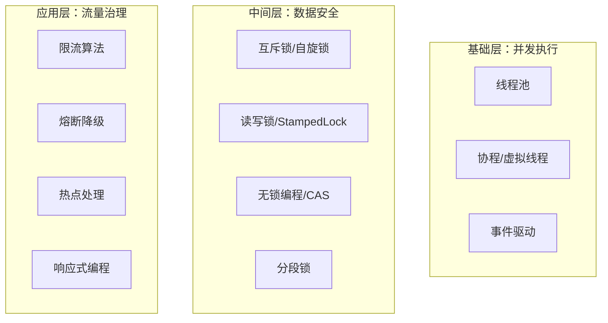

### 技术选型速查表

| 需求场景 | 推荐技术 | 关键配置 |
|----------|----------|----------|
| Web API服务 | 线程池 + 限流 + 熔断 | IO线程池，令牌桶限流 |
| 实时消息推送 | 事件驱动(Netty) + 本地缓存 | 高并发连接数 |
| 数据密集计算 | ForkJoinPool + 无锁编程 | 并行度=CPU核心数 |
| 微服务调用 | 虚拟线程 + 熔断 + 降级 | 每请求虚拟线程 |
| 高并发计数 | LongAdder + 异步批量写库 | 分散竞争 |
| 秒杀场景 | 本地缓存 + 内存预扣 + 限流 | 限流阈值=库存数 |

### 核心原则

1. **先度量后优化**：不要凭直觉优化，先用监控工具找到真正的瓶颈（CPU、内存、IO、网络）。没有度量就没有优化——你以为的瓶颈可能不是真正的瓶颈。

2. **渐进式方案**：从简单方案开始，遇到瓶颈再升级（单机限流 → 分布式限流，有锁 → 无锁）。过早优化是万恶之源，但没有规划的优化同样是灾难。

3. **容错优先**：高并发系统必须考虑故障场景，限流、熔断、降级三件套缺一不可。记住：在生产环境中，"一切能出错的事情终将出错"（Murphy's Law）。

4. **测试验证**：任何并发方案都需要通过压力测试验证，包括正常负载、峰值负载和异常场景。JMH（Java Microbenchmark Harness）、wrk、k6等工具是你的必备武器。

5. **防御性编程**：并发代码的Bug往往难以复现和调试。使用ThreadSanitizer、FindBugs、Immutables等工具辅助检查，养成良好的并发编程习惯。

---

## 本节结构

本节包含以下详细内容：

1. [并发模型](01-一并发模型.md) — 进程/线程模型、事件驱动、Reactor模式、M:N调度
2. [线程池与调度](02-二线程池与调度.md) — 核心参数、任务处理流程、拒绝策略、调优公式
3. [协程与虚拟线程](03-三协程与虚拟线程.md) — Goroutine、Java虚拟线程、协程选型
4. [无锁编程](04-四无锁编程.md) — CAS、ABA问题、无锁数据结构、LongAdder
5. [锁机制](05-五锁机制.md) — 互斥锁、读写锁、StampedLock、分段锁
6. [限流算法](06-六限流算法.md) — 令牌桶、滑动窗口、分布式限流
7. [熔断与降级](07-七熔断与降级.md) — 熔断器三态模型、降级策略、联动机制
8. [响应式编程](08-八响应式编程.md) — Reactor、背压、异步IO模型
9. [热点数据处理](09-九热点数据处理.md) — 热点探测、分片、本地缓存、异步化
