# 第37章 高可用架构

## 1. 为什么高可用是分布式系统的第一性原理

"故障不是异常，而是常态。"——这是 Google SRE 团队的第一原则，也是本章的认知起点。

在互联网时代，系统宕机的代价是以分钟计费的：

| 事件 | 故障时长 | 估计损失 | 每分钟代价 |
|------|---------|---------|-----------|
| Amazon 2021年 AWS US-EAST-1 宕机 | 6 小时 | >3400 万美元 | ~9.4 万美元 |
| GitHub 2018年数据库故障 | 4 小时 34 分钟 | 不详（影响数百万开发者） | 不详 |
| Cloudflare 2019年 全球性中断 | 27 分钟 | 估计数百万美元 | ~10 万美元 |
| WeChat 2023年 部分用户消息延迟 | 约30分钟 | 未公开 | 未公开 |

Cloudflare 统计显示，全球网站平均每年因故障损失约 **7500 万美元**。对于核心交易系统，每秒钟的停机都可能意味着真金白银的损失。

**高可用（High Availability, HA）** 不是"永不出故障"——这是不可能的。高可用的真正含义是：**当故障发生时，系统能够在最短时间内自动恢复，或者用户几乎感知不到服务中断**。

本章将系统性地回答三个核心问题：
1. **"几个九"到底值多少钱？** ——可用性的量化方法与商业成本权衡
2. **"故障来了怎么办？"** ——从冗余设计到自动恢复的完整技术栈
3. **"怎么证明系统真的高可用？"** ——混沌工程与 SLA 体系

---

## 2. 本章知识体系：道→法→术→器

本章按照"道→法→术→器"的层次组织，从理论根基到实战落地层层递进：

```mermaid
graph TD
    A["第37章 高可用架构"] --> B["道：理论基础"]
    A --> C["法：核心技巧"]
    A --> D["术：实战案例"]
    A --> E["器：误区与练习"]
    A --> F["合：本章小结"]

    B --> B1["可用性定义与量化<br/>N个9的含义与成本"]
    B --> B2["CAP/PACELC定理<br/>分布式系统的第一性约束"]
    B --> B3["故障模型与分类<br/>崩溃/拜占庭/级联故障"]
    B --> B4["高可用架构模式<br/>主备/主主/多活/单元化"]

    C --> C1["冗余设计<br/>消除单点故障"]
    C --> C2["负载均衡<br/>流量分发与故障摘除"]
    C --> C3["故障转移<br/>自动检测与主从切换"]
    C --> C4["熔断降级<br/>防止级联雪崩"]
    C --> C5["数据一致性<br/>同步/异步/半同步"]
    C --> C6["健康检查<br/>探针/心跳/Gossip"]
    C --> C7["容量规划<br/>弹性伸缩与资源管理"]
    C --> C8["混沌工程<br/>主动故障注入"]

    D --> D1["案例一：MySQL主从<br/>自动故障转移"]
    D --> D2["案例二：微服务<br/>级联故障熔断"]
    D --> D3["案例三：跨机房<br/>容灾切换演练"]

    E --> E1["九大维度误区纠偏"]
    E --> E2["六大渐进式练习"]
    E --> E3["核心要点提炼"]
```



**道（理论基础）**：理解高可用的数学本质——为什么从3个9到4个9，成本增长不是10倍而是50倍？为什么CAP定理在网络正常时不适用？为什么FLP不可能定理不影响工程实践？理论不是"知道了就行"，而是做出正确架构决策的根基。

**法（核心技巧）**：掌握从冗余设计到混沌工程的完整技术栈。高可用不是单一技术，而是纵深防御体系——冗余是第一道防线，负载均衡是第二道，故障转移是第三道，熔断降级是第四道……就像瑞士奶酪模型，每层都有漏洞，但多层叠加后故障无法贯穿。

**术（实战案例）**：三个真实场景案例，从数据库级故障到跨机房容灾，每个案例按"场景还原→排查定位→方案实施→效果验证→经验沉淀"完整闭环展开。

**器（误区与练习）**：纠偏认知陷阱，通过主动破坏和修复建立真正的高可用信心。

---

## 3. 内容结构与阅读指南

### 3.1 各节内容索引

| 节次 | 标题 | 核心内容 | 字数 | 建议阅读时间 | 适合读者 |
|------|------|---------|------|-------------|---------|
| 01 | 理论基础 | CAP定理、PACELC模型、FLP不可能定理、SLA等级与成本、故障模型分类、主从复制原理、故障转移机制、多活架构、微服务高可用、超时重试设计、健康检查、Gossip协议 | ~52KB | 60-90分钟 | 所有读者（必读） |
| 02 | 核心技巧 | 冗余设计（副本数量决策公式）、负载均衡策略、故障转移自动化、熔断降级模式、数据一致性保障、健康检查配置、容量规划方法、弹性伸缩策略、超时重试背压、混沌工程实践 | ~62KB | 120-150分钟 | 有分布式系统基础的工程师 |
| 03 | 实战案例 | 案例一：电商大促期间MySQL主从自动故障转移；案例二：微服务级联故障熔断（三阶段熔断策略）；案例三：跨机房容灾切换（单元化架构） | ~54KB | 90-120分钟 | 中高级工程师与架构师 |
| 04 | 常见误区 | 架构设计、数据一致性、容量规划、故障处理、监控运维、缓存策略、安全防护、组织流程、SLA认知 九大维度误区 | ~58KB | 60-90分钟 | 所有参与系统设计与运维的人 |
| 05 | 练习方法 | 六大渐进式练习：SLA指标计算、高可用环境搭建、故障模拟实验、性能调优实践、架构设计演练、混沌工程实验 | ~94KB | 180-360分钟（动手） | 学习者、面试准备者 |
| 06 | 本章小结 | 知识体系全景回顾、核心概念深度总结、学习路径建议、推荐资源 | ~44KB | 30-45分钟 | 所有读者（复习用） |

**本章总字数约 364KB**，是全书最长的章节之一。建议分 3-4 次阅读，每次聚焦一个核心主题。

### 3.2 推荐阅读路径

**快速路径（2小时）**：适合时间有限的工程师，掌握核心框架即可。
01-理论基础（CAP/PACELC/SLA部分） → 02-核心技巧（冗余设计/熔断降级） → 06-本章小结

**标准路径（半天）**：适合需要全面理解高可用架构的工程师。
01-理论基础 → 02-核心技巧 → 04-常见误区 → 06-本章小结

**深度路径（全天）**：适合架构师和技术负责人，追求完整知识体系。
全部六节按顺序阅读，配合05-练习方法中的实验动手实践

**问题驱动路径**：遇到具体问题时按需跳转：
- "主库挂了怎么办？" → 01-理论基础（故障转移） → 03-实战案例（案例一）
- "下游服务超时拖垮整个系统？" → 02-核心技巧（熔断降级） → 03-实战案例（案例二）
- "机房断电了怎么办？" → 01-理论基础（多活架构） → 03-实战案例（案例三）
- "总觉得自己设计没问题，但线上还是出事？" → 04-常见误区 → 05-练习方法

### 3.3 按角色推荐阅读

**初级工程师**：重点关注01-理论基础中CAP定理、可用性量化、故障模型部分。理解"为什么"比"怎么做"更重要——高可用的很多设计决策看起来反直觉（比如为什么不能同时保证一致性和可用性），理解理论才能避免在错误的方向上投入精力。

**中级工程师**：重点关注02-核心技巧中的熔断降级、超时重试、健康检查设计。这些是你在日常开发中最直接需要应用的高可用手段。03-实战案例中的MySQL故障转移和微服务级联故障是必看内容。

**高级工程师/架构师**：02-核心技巧的容量规划、弹性伸缩和混沌工程是高阶内容。03-实战案例的跨机房容灾切换涉及组织层面的协调，是架构师必须理解的复杂度。04-常见误区中的九大维度是架构评审时的检查清单。

**SRE/运维工程师**：02-核心技巧中的健康检查配置、故障转移自动化是核心内容。05-练习方法中的混沌工程实验需要SRE深度参与。04-常见误区中的监控运维和组织流程误区与日常运维直接相关。

---

## 4. 核心技术全景图

本章覆盖的高可用技术栈，从接入层到存储层形成完整纵深防御体系：

```mermaid
graph TB
    subgraph "接入层"
        DNS["智能DNS<br/>GSLB全局负载均衡"]
    end
    
    subgraph "网关层"
        LB["负载均衡<br/>Nginx/HAProxy"]
        RATE["限流熔断<br/>Sentinel/Hystrix"]
    end
    
    subgraph "服务层"
        APP1["服务实例A"]
        APP2["服务实例B"]
        APP3["服务实例C"]
        HC["健康检查<br/>Liveness/Readiness"]
    end
    
    subgraph "中间件层"
        CACHE["缓存集群<br/>Redis Sentinel/Cluster"]
        MQ["消息队列<br/>Kafka/RocketMQ"]
    end
    
    subgraph "存储层"
        DB_M[("主数据库")]
        DB_S1[("从数据库1")]
        DB_S2[("从数据库2")]
        FS["分布式存储<br/>Ceph/MinIO"]
    end
    
    subgraph "跨机房"
        DC_A["数据中心A"]
        DC_B["数据中心B"]
    end
    
    DNS --> LB
    LB --> RATE
    RATE --> APP1 &amp; APP2 &amp; APP3
    APP1 &amp; APP2 &amp; APP3 --> CACHE
    APP1 &amp; APP2 &amp; APP3 --> MQ
    APP1 &amp; APP2 &amp; APP3 --> DB_M
    DB_M --> DB_S1 &amp; DB_S2
    HC -.->|检测| APP1 &amp; APP2 &amp; APP3
    DC_A --> DC_B
```

### 关键技术选型对照

| 层级 | 核心问题 | 本章覆盖的技术 | 典型方案 |
|------|---------|--------------|---------|
| 接入层 | 流量分发与就近接入 | DNS多活、GSLB、Anycast | 阿里云GSLB、Cloudflare |
| 网关层 | 流量控制与故障隔离 | 限流、熔断、降级 | Sentinel、Envoy、Istio |
| 服务层 | 实例存活与自动恢复 | 健康检查、故障转移 | K8s Liveness Probe、Redis Sentinel |
| 中间件层 | 数据缓存与异步解耦 | 缓存集群、消息队列 | Redis Cluster、Kafka |
| 存储层 | 数据持久化与一致性 | 主从复制、多副本、共识协议 | MySQL InnoDB Cluster、etcd |
| 跨机房 | 容灾与就近服务 | 多活架构、单元化部署 | 阿里三地五中心、单元化路由 |

---

## 5. 前置知识

学习本章需要具备以下基础知识：

1. **分布式系统基础**：理解CAP定理的基本概念（一致性、可用性、分区容错性的含义），了解RPC调用的基本原理。本章会从零详细讲解CAP和PACELC，但有一个基本概念能帮助更快理解。

2. **数据库基础**：理解关系型数据库的读写操作，了解主从复制的基本概念。01-理论基础中会详细讲解MySQL/Redis/PostgreSQL的复制机制，但需要知道"复制"是什么。

3. **网络基础**：理解DNS解析过程、TCP/IP三次握手、HTTP请求/响应模型。负载均衡、VIP切换、DNS多活等内容需要这些基础。

4. **Linux基础**：能使用命令行，了解进程管理、网络配置。05-练习方法中的实验需要在Linux环境下操作。

5. **基本的编程能力**：本章代码示例主要使用Python和SQL，需要能读懂代码逻辑。不要求精通，但需要理解变量、函数、条件判断等基本概念。

**如果上述基础薄弱**，建议先阅读本书前面的相关章节。但即使基础不完全具备，01-理论基础也会提供足够的背景知识帮助理解——这是本章设计为"由浅入深"的核心原因。

---

## 6. 与其他章节的关系

高可用架构不是孤立的知识点，它是分布式系统设计的核心支柱之一，与本书其他章节有着紧密的关联：

第1-8章 硬件与操作系统基础
    └── 理解CPU/内存/IO/网络原理
            ↓
┌──────────────────────────────────────────────────┐
│  第37章 高可用架构（本章）                           │
│  理论基础 → 核心技巧 → 实战案例 → 误区 → 练习        │
└──────────────────────────────────────────────────┘
            ↓                    ↓                 ↓
第36章 分布式系统     第39章 微服务架构     第53章 多活架构
（CAP/一致性理论      （服务治理、            （异地多活的
 的深入讲解）         服务网格的详细展开）     工程实践）
            ↓                    ↓                 ↓
第54章 分布式锁      第55章 分布式事务     第58章 服务网格
（共识协议的           （事务一致性的         （Istio/Linkerd
 具体实现）            补偿机制）             的深度原理）

- **承上**：第1-8章建立了对硬件、操作系统和网络的理论理解。本章中讨论的磁盘IO瓶颈、网络延迟、CPU过载等问题，直接依赖这些基础知识。例如，理解TCP连接池的超时机制需要TCP三次握手的基础知识。

- **启下**：本章建立的高可用思维框架将贯穿后续所有涉及系统可靠性的章节。第36章深入讲解CAP/一致性理论；第39章微服务架构中的服务治理直接使用本章的熔断降级技巧；第53章多活架构是本章多活内容的深度展开；第55章分布式事务中的补偿机制是BASE理论的工程实践。

- **横向关联**：本章与全书多个主题形成交叉引用：
  - **CAP定理**：与第36章分布式系统理论相互补充
  - **负载均衡**：与第39章微服务中的服务网格协同设计
  - **健康检查**：与第40章容器编排的K8s Probe机制紧密相关
  - **故障转移**：与第54章分布式锁中的选举机制共享底层原理
  - **熔断降级**：与第38章缓存设计的雪崩防护策略配合使用
  - **混沌工程**：与第41章可观测性体系形成"度量→实验→改进"闭环

---

## 7. 高可用架构的全景认知

在深入各节之前，建立几个核心认知框架，能帮助你在后续阅读中做出正确的判断：

### 7.1 可用性的本质是权衡

可用性不是一个"越高越好"的指标。每提升一个9，成本呈指数级增长：

| SLA目标 | 年停机预算 | 架构复杂度 | 人力投入 | 适用场景 |
|---------|-----------|-----------|---------|---------|
| 99%（两个9） | 3.65天 | 单机+基础监控 | 1人运维 | 内部工具、开发测试 |
| 99.9%（三个9） | 8.76小时 | 主从+负载均衡 | 小团队 | 一般互联网应用 |
| 99.99%（四个9） | 52.6分钟 | 多副本+自动failover | 专职SRE团队 | 核心交易系统 |
| 99.999%（五个9） | 5.26分钟 | 多活+混沌工程 | 平台级工程投入 | 全球基础设施 |

**关键判断**：为一个日活1000的内部工具追求4个9，不仅浪费资源，还会因架构复杂度引入新的故障点。正确做法是根据**故障的业务影响**确定可用性目标。

### 7.2 提升可用性的两条路径

可用性 = MTBF / (MTBF + MTTR)

- **延长MTBF**（减少故障发生）：冗余部署、硬件升级、代码质量、压力测试 → 投入高，效果有上限
- **缩短MTTR**（加快故障恢复）：自动故障转移、监控告警、混沌工程、应急预案 → 投入中，效果显著

**核心洞察**：降低MTTR往往比提高MTBF更经济。Google SRE的实践表明，将MTTR从1小时降到5分钟，比将MTBF从100小时提高到1000小时容易得多。这也解释了为什么成熟的高可用体系都把重心放在**快速检测**和**自动恢复**上，而不是追求"永不出故障"。

### 7.3 高可用是纵深防御，不是单一技术

就像网络安全的"纵深防御"策略，高可用架构也依赖多层保护：

| 防御层 | 技术手段 | 防御目标 | 缺失后果 |
|--------|---------|---------|---------|
| 第一层：冗余 | 多实例、多副本、多AZ | 消除单点故障 | 一个节点挂掉整个服务中断 |
| 第二层：负载均衡 | 流量分发、健康检查、故障摘除 | 避免流量打到故障节点 | 故障节点持续接收请求 |
| 第三层：故障转移 | 自动检测、主从切换、VIP漂移 | 快速恢复主节点能力 | 故障持续时间不可控 |
| 第四层：熔断降级 | 熔断器、降级策略、限流 | 防止故障扩散和级联雪崩 | 局部故障引发全局崩溃 |
| 第五层：数据一致性 | 复制协议、对账机制、补偿事务 | 保障数据正确性 | 切换后数据丢失或不一致 |
| 第六层：监控告警 | 指标采集、日志分析、链路追踪 | 故障发生时第一时间感知 | 故障持续很长时间才被发现 |
| 第七层：混沌工程 | 故障注入、定期演练 | 持续验证防御体系的有效性 | 对防御能力的虚假信心 |

**每一层都不能替代其他层**：有冗余但没有负载均衡，流量不会自动分发；有负载均衡但没有熔断，一个慢服务会拖垮整个集群；有熔断但没有监控，你甚至不知道需要触发熔断。

### 7.4 高可用设计的三大原则

1. **假设故障随时发生**：不依赖任何单一组件的正常运行。设计时问自己："如果这个组件挂了，系统会怎样？"

2. **故障影响范围最小化**：一个服务的故障不应影响其他服务。通过舱壁隔离（Bulkhead）、超时控制、异步解耦等手段，将故障"关进笼子"。

3. **恢复比预防更重要**：绝对的预防是不可能的，快速恢复才是高可用的真正含义。自动化故障转移、预定义的应急预案、定期的容灾演练，这些才是"几个九"背后的真正支撑。

---

## 8. 常见认知误区预览

在深入各节之前，先了解几个常见的认知陷阱——这些误区在04-常见误区中会详细展开：

| 误区 | 错误认知 | 正确做法 |
|------|---------|---------|
| 冗余=高可用 | 部署了多个实例就是高可用 | 冗余必须覆盖整条调用链路，从接入层到存储层不能有SPOF |
| 同步复制最安全 | 强一致的数据复制最可靠 | 同步复制会降低可用性，需要根据业务场景在一致性和可用性间取舍 |
| 负载均衡=流量均匀分配 | 把请求平均分到所有实例 | 应根据实例负载动态调整，且必须配合健康检查摘除故障节点 |
| 熔断器越灵敏越好 | 快速检测故障并切断调用 | 过于灵敏会导致频繁误切，需要设置合理的阈值和恢复窗口 |
| 混沌工程=制造混乱 | 随机杀进程就是混沌工程 | 混沌工程是科学实验，需要假设→实验→观察→改进的完整闭环 |
| SLA越高越好 | 追求五个九就是好架构 | SLA必须与业务价值匹配，过度设计反而增加复杂度和故障点 |

---

## 9. 阅读建议

1. **理论与实践结合**：05-练习方法中的实验不是"可选的"——高可用架构的知识只有通过动手搭建和破坏才能真正内化。建议至少完成前三个练习（指标计算、环境搭建、故障模拟）。

2. **带着问题阅读**：如果你正在设计或维护一个系统，带着"我的系统有哪些单点？"、"如果主节点挂了会怎样？"、"我的熔断策略合理吗？"等问题去阅读，效果会远好于泛读。

3. **不要跳过误区章节**：04-常见误区是本章的精华之一。许多资深工程师在高可用设计上栽跟头，不是因为技术不够，而是因为认知偏差。

4. **关注"为什么"而非"怎么做"**：高可用方案因业务而异，没有放之四海而皆准的最佳实践。理解每个设计决策背后的"为什么"，才能在面对新场景时做出正确的判断。

5. **建立自己的检查清单**：阅读过程中，将核心要点整理成自己的架构评审检查清单。这比"读完了就记住了"可靠得多。

> **学习节奏建议**：本章内容量大（364KB+），建议每次阅读一个主题，读完后用自己的话总结核心要点。急于一次读完反而容易遗忘。重点不是读完，而是理解——能向别人解释清楚的概念，才是真正掌握的。
