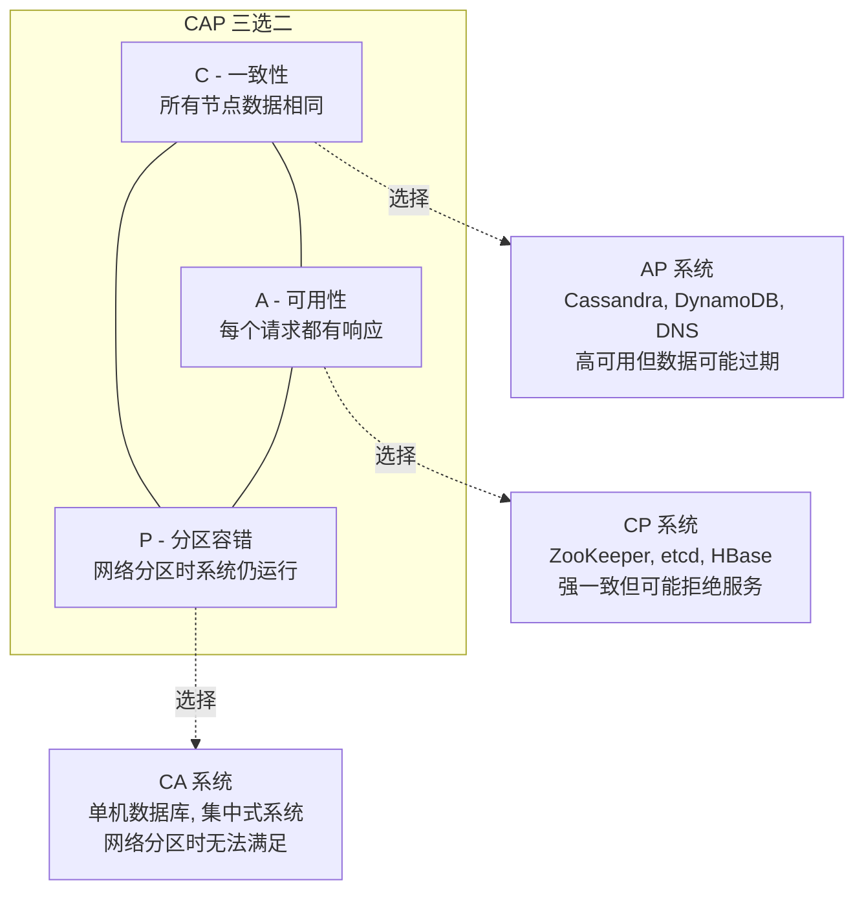
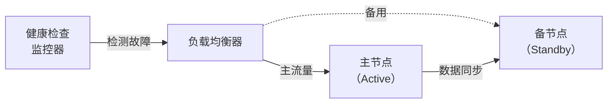
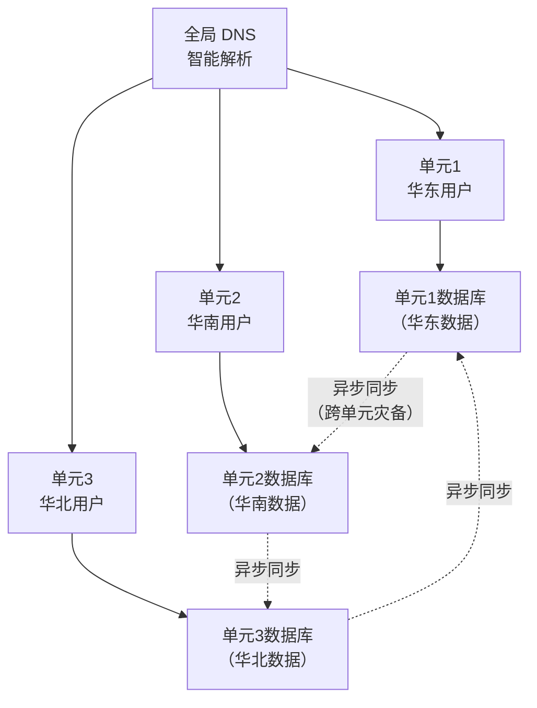
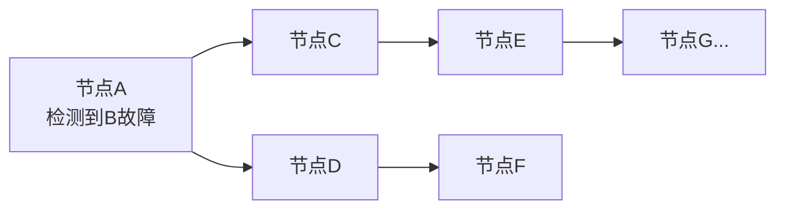
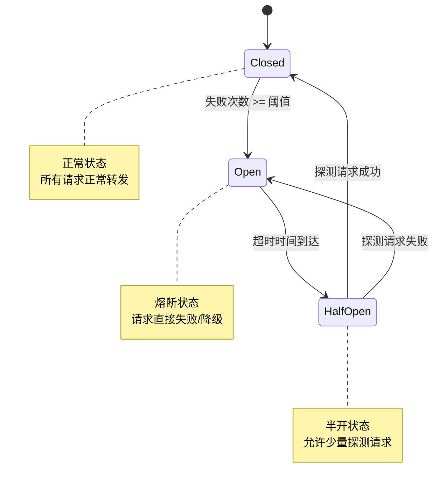
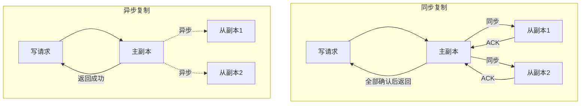
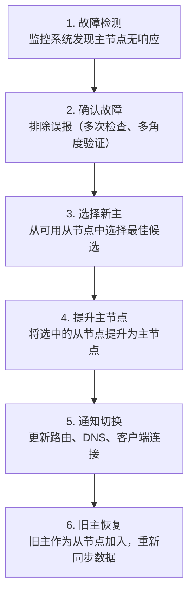
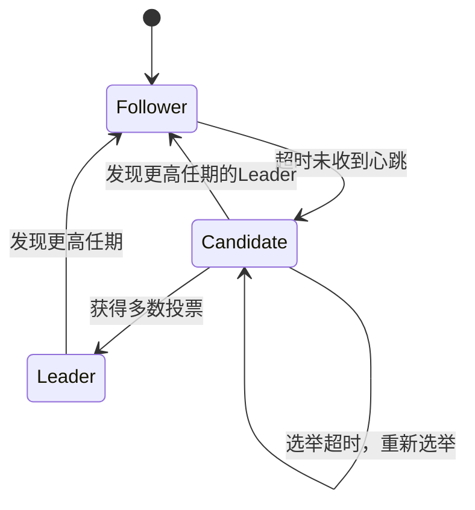

高可用架构是分布式系统工程的基石。本章从"故障是常态"这一核心认知出发，系统梳理高可用的理论根基——从 CAP/BASE/PACELC 等经典定理，到共识协议的工程实现，再到熔断降级、数据复制、混沌工程等实践方法论。掌握这些理论，才能在后续章节的技巧与实战中做出正确的架构决策。

---

## 高可用架构理论基础

### 1. 什么是高可用

#### 1.1 定义与核心目标

高可用（High Availability, HA）是指系统在指定时间内持续提供服务的能力。其核心目标是**最小化因故障导致的服务不可用时间**，确保用户在绝大多数时间里能够正常使用系统功能。

高可用并不等于"永不出故障"——这是不可能实现的。高可用的真正含义是：**当故障发生时，系统能够在最短时间内自动恢复，或者用户几乎感知不到服务中断**。这个"最短时间"就是衡量高可用能力的关键。

理解高可用需要区分三个层次：

- **技术高可用**：系统架构层面具备冗余、故障检测和自动恢复能力
- **服务高可用**：从用户视角看，服务始终可用或中断时间在可接受范围内
- **业务高可用**：在任何异常情况下，核心业务流程都能完成（即使体验降级）

三者层层递进——技术高可用是基础，服务高可用是目标，业务高可用是最终价值。

#### 1.2 可用性的量化：N个9

可用性通常用"几个9"来衡量，每个9代表不同的数量级：

| 等级 | 可用性 | 年停机时间 | 月停机时间 | 典型场景 | 实现难度 |
|------|--------|-----------|-----------|---------|----------|
| 2个9 | 99% | 3.65天 | 7.3小时 | 内部管理系统、开发测试环境 | 单机+基础监控 |
| 3个9 | 99.9% | 8.76小时 | 43.8分钟 | 一般互联网服务、企业应用 | 主从+负载均衡 |
| 4个9 | 99.99% | 52.6分钟 | 4.38分钟 | 金融交易系统、核心数据库 | 多副本+自动failover |
| 5个9 | 99.999% | 5.26分钟 | 26.3秒 | 电信核心网、航空管制系统 | 多活+混沌工程 |
| 6个9 | 99.9999% | 31.5秒 | 2.63秒 | 半导体制造、国家级基础设施 | 全冗余+硬件级容错 |

计算公式：

可用性 = MTBF / (MTBF + MTTR) × 100%

其中：
- **MTBF**（Mean Time Between Failures）：平均故障间隔时间
- **MTTR**（Mean Time To Repair）：平均修复时间

这意味着提高可用性有两条路径：**延长故障间隔**（预防故障）或**缩短修复时间**（快速恢复）。实践中，缩短 MTTR 往往比延长 MTBF 更有效，因为绝对避免故障是不可能的。

用一个具体例子说明：假设一个系统的 MTBF = 720 小时（30天），MTTR = 1 小时，那么可用性 = 720 / (720 + 1) ≈ 99.86%（不到3个9）。如果通过自动化将 MTTR 从 1 小时缩短到 5 分钟，可用性提升到 720 / (720 + 0.083) ≈ 99.99%（达到4个9）。同样的 MTBF，仅靠缩短恢复时间就实现了质的飞跃。

#### 1.3 可用性的商业成本

达到更高可用性所需的投入呈指数级增长。从 99.9% 提升到 99.99%，成本通常增加 5-10 倍；从 99.99% 提升到 99.999%，成本可能增加 10-50 倍。因此，选择合适的可用性目标需要在**业务价值**和**工程成本**之间找到平衡：

| 场景 | 日活规模 | 可用性目标 | 年停机预算 | 投入重点 |
|------|---------|-----------|-----------|---------|
| 内部工具 | ~1,000 | 99% (2个9) | 3.65天 | 基础备份+手动恢复 |
| 一般电商 | ~10万 | 99.9% (3个9) | 8.76小时 | 负载均衡+自动重启 |
| 核心支付 | ~100万 | 99.99% (4个9) | 52.6分钟 | 多活+自动failover+混沌工程 |
| 全球基础设施 | ~1亿 | 99.999% (5个9) | 5.26分钟 | 跨地域多活+全链路冗余 |

一个常见的误区是**过度设计**：为一个日活 1000 的内部工具追求 4 个9，不仅浪费资源，还会因架构复杂度增加引入新的故障点。正确的做法是根据**故障的业务影响**来确定可用性目标——问自己："如果系统停机 1 小时，公司会损失多少？"

---

### 2. 故障模型与分类

#### 2.1 故障类型

理解故障是设计高可用系统的前提。在分布式系统中，故障主要分为以下几类：

| 故障类型 | 描述 | 检测难度 | 恢复方式 | 真实案例 |
|---------|------|---------|---------|---------|
| 崩溃故障（Crash Fault） | 节点突然停止工作，不再响应 | 容易（超时检测） | 重启/替换 | OOM导致进程被kill |
| 拜占庭故障（Byzantine Fault） | 节点产生错误的、不可预测的输出 | 极难（需冗余验证） | 共识协议 | 软件bug返回错误数据 |
| 网络分区（Partition） | 节点间网络中断，形成孤立组 | 中等（需多角度探针） | 分区恢复策略 | 机房光缆被挖断 |
| 脑裂（Split Brain） | 网络分区后各分区独立选举主节点 | 困难（需仲裁机制） | Fencing/Quorum | 双机房同时认为自己是主 |
| 级联故障（Cascading Failure） | 一个组件故障引发连锁反应 | 中等 | 熔断/降级/限流 | 某服务超时导致上游全部阻塞 |
| 资源耗尽（Resource Exhaustion） | CPU/内存/磁盘/连接数等资源耗尽 | 容易（监控告警） | 扩容/回收 | 连接池耗尽导致所有请求失败 |
| 数据损坏（Data Corruption） | 数据存储或传输过程中损坏 | 难（需校验机制） | 从备份恢复 | 磁盘坏道导致数据库文件损坏 |

#### 2.2 故障的时间特征

从时间维度看，故障呈现不同的模式：

**瞬时故障（Transient Fault）**：持续时间极短（毫秒级），通常由网络抖动、GC 停顿等引起。这类故障最适合通过**重试机制**来应对。但重试需要配合指数退避（Exponential Backoff）和最大重试次数，否则可能加剧系统负载。

```python
import time
import random

def retry_with_backoff(func, max_retries=3, base_delay=0.1):
    """带指数退避的重试机制"""
    for attempt in range(max_retries + 1):
        try:
            return func()
        except TransientError:
            if attempt == max_retries:
                raise
            delay = base_delay * (2 ** attempt) + random.uniform(0, 0.1)
            time.sleep(delay)
```

**关键细节**：上面代码中 `random.uniform(0, 0.1)` 的作用是**抖动（Jitter）**——当多个客户端同时遇到瞬时故障并重试时，如果不加抖动，它们会在完全相同的时间点重试，形成"惊群效应"（Thundering Herd），反而加剧系统负载。抖动让重试时间分散开，降低并发冲击。

**持久故障（Persistent Fault）**：持续时间较长或永久性，如硬件损坏、软件 bug、配置错误。需要**人工介入**或**自动替换**来恢复。持久故障的恢复策略核心是**隔离**——将故障节点从服务链路中摘除，在独立环境中排查根因。

**间歇故障（Intermittent Fault）**：在一段时间内反复出现又消失，最难诊断。常见于硬件老化、内存泄漏、连接池耗尽等场景。需要**监控趋势**而非只看瞬时状态。例如，一个服务的内存使用量每隔 30 分钟从 60% 飙升到 95% 然后回落——这是典型的内存泄漏特征，但瞬时监控可能永远看不到"超标"。

#### 2.3 故障的不可避免性

Jeff Dean（Google Fellow）提出的"硬件故障是常态，不是异常"是高可用设计的基石认知。以一个万台服务器的集群为例：

| 硬件类型 | 年故障率 | 万节点集群每日故障数 |
|---------|---------|-------------------|
| 硬盘（HDD） | 2-5% | 0.5-1.4 块/天 |
| 硬盘（SSD） | 0.5-1% | 0.14-0.27 块/天 |
| 内存 ECC 不可纠正错误 | 1-2%/年/服务器 | 0.03-0.05 次/天 |
| 网络交换机端口 | 0.1%/年 | 0.003 个/天 |
| 电力中断（含 UPS 失败） | 0.01-0.1%/年 | 罕见 |

Google 在 2015 年的论文中披露：在其数据中心中，**每千台服务器每天约有 1 台出现需要干预的故障**。Facebook 在 2016 年报告中提到，其基础设施每年经历数十次网络分区事件。Netflix 每年在生产环境中通过 Chaos Monkey 主动注入数千次故障。

这意味着高可用系统的设计前提不是"假设一切正常"，而是**"假设随时可能出故障"**。

---

### 3. 分布式系统的基本定理

#### 3.1 CAP 定理

2000 年，Eric Brewer 提出 CAP 定理，2002 年 Gilbert 和 Lynch 给出了严格证明。该定理指出：在一个分布式系统中，以下三个属性**不可能同时完全满足**：

- **C（Consistency，一致性）**：所有节点在同一时刻看到相同的数据
- **A（Availability，可用性）**：每个请求都能收到非错误的响应（不保证最新数据）
- **P（Partition Tolerance，分区容错性）**：系统在网络分区时仍能继续运行



**关键认知**：在分布式系统中，网络分区是不可避免的（P 是必选项），因此实际选择是 **CP 还是 AP**。

- **CP 系统**：当网络分区发生时，牺牲部分可用性（拒绝或延迟某些请求）以保证一致性。典型代表：etcd、ZooKeeper、Google Spanner。适用场景：金融交易、分布式锁、配置管理。
- **AP 系统**：当网络分区发生时，牺牲一致性（允许读到旧数据）以保持可用性。典型代表：Cassandra、DynamoDB、DNS。适用场景：社交动态、用户画像、缓存系统。

**常见误解**：CAP 定理并不意味着系统在任何时候只能同时满足两个属性。在**网络正常**时，系统可以同时满足 C、A、P 三者。CAP 定理讨论的是**网络分区发生时的权衡**——这是一个容易被忽略的限定条件。

#### 3.2 BASE 理论

BASE 理论是 CAP 中 AP 选择的工程实践指南，由 Daniel Pritchard 在 eBay 期间总结：

- **BA（Basically Available，基本可用）**：允许系统在部分节点故障时仍提供核心功能，但响应时间可能变长或返回降级数据
- **S（Soft State，软状态）**：允许系统中的数据存在中间状态，且这个状态不影响整体可用性
- **E（Eventually Consistent，最终一致性）**：系统保证在没有新的更新操作后，数据最终会达到一致状态

BASE 与 ACID 的对比：

| 维度 | ACID | BASE |
|------|------|------|
| 设计理念 | 严格一致性 | 宽松一致性 |
| 数据状态 | 任何时刻一致 | 允许中间不一致 |
| 适用场景 | 金融、交易 | 互联网、大数据 |
| 性能特点 | 较低（需要锁和日志） | 较高（无锁或乐观锁） |
| 典型系统 | MySQL, PostgreSQL | Cassandra, Redis Cluster |
| 实现复杂度 | 低（数据库内建） | 高（需应用层补偿） |
| 数据恢复 | 事务回滚 | 补偿事务、幂等重试 |

**BASE 的工程含义**：选择 BASE 不意味着放弃数据正确性，而是将"正确性保证"从数据库层移到了应用层。你需要设计**补偿事务**（如订单创建失败后的库存回滚）、**幂等操作**（确保重复执行不产生副作用）和**对账机制**（定期校验数据一致性）。

#### 3.3 FLP 不可能定理

1985 年，Fischer、Lynch 和 Paterson 证明了：**在一个纯异步分布式系统中，即使只有一个节点可能崩溃，也不存在一个确定性的共识算法能保证在有限时间内终止**。

这个定理的现实含义是：
- 在网络延迟不确定的真实环境中，不可能设计出一个"既能容忍节点故障，又能在有限时间内达成共识"的完美算法
- 所有实际的共识算法（Paxos、Raft、ZAB）都依赖于**超时机制**和**重试**来绕过这个限制
- 系统设计必须接受"偶尔需要人工介入"的现实

**实践中的应对**：FLP 不可能定理证明的是"纯异步"系统。实际系统都使用了**部分同步模型**——通过超时机制引入时间假设。当超时触发时，系统可以发起新的选举或重试，从而在实际中达成共识。代价是：在极端网络环境下，系统可能频繁选举导致服务降级（可用性降低）。

#### 3.4 CAP 后续：PACELC 模型

CAP 定理只考虑了网络分区时的选择，没有覆盖正常情况下的权衡。Daniel Abadi 在 2012 年提出了 PACELC 模型来补充：

- **P（Partition）时**：选 A（可用）还是 C（一致）—— 这是 CAP 的内容
- **E（Else，正常时）**：选 L（低延迟）还是 C（强一致）—— 这是 CAP 没覆盖的

| 系统 | 分区时选择 | 正常时选择 | 分类 | 设计启示 |
|------|-----------|-----------|------|---------|
| Cassandra | A（可用） | L（低延迟） | PA/EL | 适合写多读少、可容忍最终一致 |
| PNUTS | C（一致） | C（强一致） | PC/EC | 适合金融级强一致需求 |
| MongoDB（默认） | C（一致） | L（低延迟） | PC/EL | 默认读主节点，读写分离时可选 |
| Amazon Dynamo | A（可用） | L（低延迟） | PA/EL | 购物车等场景，可用性优先 |
| Google Spanner | C（一致） | C（强一致） | PC/EC | TrueTime 实现全球强一致 |

PACELC 模型的价值在于：它告诉我们**即使在正常运行时，系统设计也存在权衡**。选择 Cassandra 不仅意味着在网络分区时牺牲一致性，还意味着在正常情况下也选择低延迟而非强一致。这个双重权衡是架构选型时必须考虑的。

---

### 4. 高可用架构模式

#### 4.1 冗余设计原则

冗余是高可用的物理基础。核心思想是：**任何一个组件都有可能故障，因此关键路径上的每个环节都需要备份**。

冗余可以发生在多个层次：

| 层次 | 冗余方式 | 典型技术 | 可用性提升 | 成本增加 |
|------|---------|---------|-----------|---------|
| 硬件层 | 磁盘 RAID、电源冗余、网卡绑定 | RAID 1/5/10, NIC bonding | 2-3个9 → 3-4个9 | 1.5-3倍 |
| 服务层 | 多实例部署、负载均衡 | Nginx, HAProxy, K8s | 3个9 → 4个9 | 2-5倍 |
| 数据层 | 主从复制、多副本 | MySQL主从, Redis Sentinel | 3个9 → 4个9 | 2-4倍 |
| 跨机房层 | 异地多活、灾备 | DNS多活, 单元化架构 | 4个9 → 5个9 | 5-10倍 |
| 跨地域层 | 全球多活、边缘计算 | CDN, Anycast | 5个9+ | 10-50倍 |

**冗余设计的关键原则**：

1. **独立性原则**：冗余组件必须独立于被保护组件——共享电源、共享网络、共享机架的两个节点不算真正的冗余。这被称为**共因故障（Common Cause Failure）**。
2. **有效性原则**：冗余必须能真正接管服务——热备节点如果长时间未同步数据，切换后可能丢失大量数据，这种"假冗余"比没有冗余更危险。
3. **成本效益原则**：冗余到什么程度取决于业务价值——不是所有组件都需要 5 个9 级别的冗余。

#### 4.2 主备模式（Active-Standby）

最基础的高可用模式。一个节点处理所有请求（Active），另一个节点热备或冷备（Standby），当 Active 故障时切换到 Standby。



**热备（Hot Standby）**：备节点实时同步数据，切换时间 < 30秒。适合对停机时间敏感的场景。常见实现：MySQL 半同步复制 + MHA/Orchestrator。

**温备（Warm Standby）**：备节点有数据但未完全启动服务，切换时间 1-5 分钟。适合可以接受短暂停机的场景。常见实现：数据库逻辑备份 + 定期恢复验证。

**冷备（Cold Standby）**：备节点仅有备份数据，切换时间数小时。适合非核心系统或灾难恢复。常见实现：每日全量备份 + 异地存储。

**主备模式的关键问题——脑裂**：

当网络分区导致备节点无法感知主节点状态时，备节点可能误判主节点已故障并提升为主节点，出现两个"主节点"同时服务的情况，称为脑裂。解决策略：

1. **Fencing（隔离）**：通过 STONITH（Shoot The Other Node In The Head）强制关闭旧主节点，如 IPMI 远程管理、电源控制器
2. **Quorum（法定人数）**：引入第三方仲裁节点或投票机制，确保只有获得多数票的节点才能成为主节点
3. **租约（Lease）**：主节点持有有时效的租约，租约到期前备节点不能提升为主
4. **Fencing Token**：每次选举产生一个递增的 epoch number，新主必须持有最新的 epoch 才能写入，旧主收到更高 epoch 时自动降级

#### 4.3 主主模式（Active-Active）

两个节点同时处理请求，通过数据同步保持一致性。比主备模式的资源利用率更高，但数据冲突处理更复杂。


适用场景：
- 无状态服务的多活部署
- 基于用户维度的数据分区（如不同地域的用户由不同节点服务）
- 写入频率低、冲突概率小的场景

不适用场景：
- 频繁的全局写入（冲突概率高）
- 需要强一致性的交易系统
- 数据库层的主主（除非严格分区）

**冲突解决策略**：当两个节点同时修改同一条数据时，需要预定义的冲突解决规则：
- **Last-Write-Wins（LWW）**：以最后写入的时间戳为准，简单但可能丢失更新
- **向量时钟（Vector Clock）**：记录每个节点的修改顺序，检测冲突而非自动解决
- **应用层合并**：将冲突数据返回给应用层，由业务逻辑决定如何合并

#### 4.4 多活架构

多活是主主模式在更大规模上的延伸，通常指**多个数据中心同时对外提供服务**。多活的核心挑战是**数据一致性**和**流量路由**。

**多活的三个层次**：

| 层次 | 描述 | 一致性要求 | 典型实现 |
|------|------|-----------|---------|
| 同城双活 | 两个机房在同一城市（延迟<2ms） | 可同步复制 | 半同步复制+VIP切换 |
| 异地双活 | 两个机房在不同城市（延迟10-30ms） | 异步+最终一致 | 单元化+异步复制 |
| 异地多活 | 三个以上机房跨地域部署 | 分区一致 | 单元化+DNS智能解析 |

**单元化架构**是实现多活的主流方案：将用户按某种维度（如用户 ID 哈希、地域）划分为若干单元（Unit），每个单元包含完整的业务链路和数据副本。不同单元之间数据隔离，单元内部自治。



**多活架构的核心挑战**：

1. **流量路由**：如何将用户请求精确路由到其所属单元？常用方案：DNS 智能解析（基于 IP 地理位置）、HTTP 重定向（根据用户 ID 路由）、客户端 SDK（内置路由逻辑）
2. **数据同步**：单元间数据如何保持最终一致？常见方案：异步消息队列同步、定时对账、CDC（Change Data Capture）
3. **单元故障转移**：某个单元整体故障时，其用户如何被其他单元接管？需要预定义的故障转移策略和数据恢复机制
4. **全局数据**：用户信息、商品目录等全局数据如何在多单元间保持一致？通常采用中心化写入+各单元只读副本的模式

**多活架构的演进路径**：单机房 → 同城灾备 → 同城双活 → 异地双活 → 异地多活。每一步的复杂度和成本都会显著增加，建议根据业务规模逐步演进，不要一步到位。

#### 4.5 微服务中的高可用

在微服务架构中，高可用的挑战从单个系统扩展到了**服务间的依赖链**。一个请求可能经过 5-20 个服务，任何一个服务故障都可能影响整体可用性。

假设每个服务的可用性为 99.9%，经过 10 个服务的调用链，整体可用性为：

0.999^10 = 0.990 ≈ 99.0%（从"3个9"降为"2个9"）

这说明在微服务架构中，每个服务必须追求远高于目标可用性的单体可用性，或者通过冗余、降级来补偿依赖链的可用性损耗。

**微服务高可用的核心策略**：

| 策略 | 实现方式 | 效果 |
|------|---------|------|
| 服务冗余 | 每个服务至少 2 个实例 | 消除单点 |
| 超时控制 | 设置合理的连接超时和读超时 | 防止阻塞 |
| 重试退避 | 指数退避+抖动+最大次数 | 应对瞬时故障 |
| 熔断降级 | 错误率超阈值时切断调用 | 防止级联 |
| 舱壁隔离 | 按服务/用户隔离资源池 | 防止故障扩散 |
| 异步解耦 | 非关键路径走消息队列 | 降低依赖 |

**舱壁隔离模式（Bulkhead Pattern）**：灵感来自轮船的水密隔舱设计——即使一个舱室进水，其他舱室不受影响。在微服务中，为每个下游服务分配独立的线程池/连接池/信号量，避免一个慢服务耗尽所有资源导致其他正常服务也无法响应。

```python
# 舱壁隔离示例：为不同下游服务分配独立线程池
from concurrent.futures import ThreadPoolExecutor

# 每个服务一个独立的线程池，互不影响
pools = {
    "user_service": ThreadPoolExecutor(max_workers=10),
    "order_service": ThreadPoolExecutor(max_workers=20),
    "payment_service": ThreadPoolExecutor(max_workers=5),
}

def call_service(service_name, func, *args):
    pool = pools[service_name]
    try:
        future = pool.submit(func, *args)
        return future.result(timeout=3)  # 3秒超时
    except TimeoutError:
        # 该服务超时，但不影响其他服务的线程池
        return fallback(service_name)
```

---

### 5. 超时与重试设计

#### 5.1 超时是高可用的第一道防线

在分布式系统中，**没有超时的调用等于没有保护**。一个没有超时的下游调用可能永远阻塞，耗尽线程池，最终导致整个系统不可用。

超时设计需要考虑三个维度：

| 超时类型 | 说明 | 设置原则 |
|---------|------|---------|
| 连接超时 | TCP 三次握手的最长时间 | 通常 1-3 秒，取决于网络距离 |
| 读超时 | 等待响应的最长时间 | 根据 P99 延迟的 2-3 倍设置 |
| 总超时 | 整个请求的最长时间 | 包含重试的总耗时上限 |

**超时设置的常见误区**：

- **误区一：超时设太短**。如果 P99 延迟是 200ms，超时设为 100ms，会导致大量正常请求被误杀。
- **误区二：超时设太长**。超时设为 30 秒，意味着一个故障请求会长时间占用线程资源，在高并发下迅速耗尽线程池。
- **误区三：只设连接超时不设读超时**。连接成功不代表响应正常，数据库慢查询可能连接后阻塞数十秒。

**推荐实践**：读超时 = P99 延迟 × 3，且不超过业务可接受的最大等待时间。

#### 5.2 幂等性与重试安全

重试是应对瞬时故障的有效手段，但**非幂等操作的重试可能导致数据错误**。例如，扣款接口被重试可能导致重复扣款。因此，重试的前提是操作必须是幂等的。

**幂等性设计方法**：

| 方法 | 原理 | 适用场景 |
|------|------|---------|
| 唯一请求ID | 客户端生成唯一ID，服务端去重 | 支付、下单等写操作 |
| 数据库唯一约束 | 利用唯一索引防止重复插入 | 创建类操作 |
| 状态机 | 操作前检查当前状态，已处理则跳过 | 订单状态变更 |
| Token机制 | 请求携带一次性Token，消费后作废 | 防重复提交 |

```python
import uuid

def idempotent_call(request_id, func, *args):
    """基于请求ID的幂等调用"""
    # 检查该请求是否已处理过
    if redis.get(f"processed:{request_id}"):
        return redis.get(f"result:{request_id}")
    
    # 执行业务逻辑
    result = func(*args)
    
    # 记录已处理（设置过期时间防止内存泄漏）
    redis.setex(f"processed:{request_id}", 3600, "1")
    redis.setex(f"result:{request_id}", 3600, json.dumps(result))
    
    return result
```

**重试的完整策略**：不是所有错误都值得重试。只有**可重试错误**（网络超时、503服务不可用）才应该重试，**不可重试错误**（400参数错误、401未授权）重试多少次也不会成功。

| 错误类型 | 示例 | 是否重试 |
|---------|------|---------|
| 网络超时 | ConnectionTimeout | 是（指数退避） |
| 服务暂时不可用 | HTTP 503 | 是（指数退避） |
| 资源不足 | HTTP 429 Too Many Requests | 是（等待Retry-After头） |
| 参数错误 | HTTP 400 Bad Request | 否 |
| 认证失败 | HTTP 401 Unauthorized | 否 |
| 业务异常 | 余额不足 | 否 |

#### 5.3 超时、重试、熔断的协同

超时、重试和熔断是三个相互配合的保护机制，它们各自解决不同的问题：

正常请求 → 熔断器（是否允许通过？） → 超时控制（多久算失败？） → 重试（失败后重试几次？）

- **超时**：防止单次调用无限阻塞
- **重试**：应对瞬时故障，提高成功率
- **熔断**：当故障持续时，快速失败而非反复重试

三者缺一不可：没有超时，重试和熔断无法触发；没有重试，瞬时故障会导致不必要的失败；没有熔断，重试风暴会压垮已经脆弱的下游服务。

---

### 6. 健康检查与故障检测

#### 6.1 健康检查方式

| 方式 | 实现 | 检测内容 | 延迟 | 适用场景 |
|------|------|---------|------|---------|
| 探针（Probe） | 负载均衡器定期请求 | 服务是否响应 | 秒级 | HTTP 服务、API |
| 心跳（Heartbeat） | 服务主动上报 | 服务存活状态 | 秒级 | 内部服务、数据库 |
| Ping | ICMP 探测 | 主机是否可达 | 毫秒级 | 网络设备、服务器 |
| 端口检查 | TCP 连接测试 | 端口是否监听 | 毫秒级 | 数据库、中间件 |

健康检查的关键设计原则：

1. **区分存活检查（Liveness）和就绪检查（Readiness）**：存活检查失败应重启实例（排除死锁、内存泄漏）；就绪检查失败应从负载均衡中摘除但不重启（正在加载数据、预热中）
2. **检查频率与粒度**：过于频繁的检查会增加系统负载，过于稀疏会导致故障检测延迟。一般健康检查间隔 5-10 秒，连续 3 次失败判定为故障
3. **检查深度**：浅检查（只看进程是否存活）和深检查（验证依赖是否可用）应分别实现。深检查通常作为就绪检查，避免级联重启
4. **幂等安全**：健康检查接口本身不能有副作用（如不能写日志到数据库、不能触发业务逻辑），否则高频检查会成为系统负担

#### 6.2 故障检测协议：Gossip

Gossip 协议（流言协议）是大规模集群中常用的去中心化故障检测机制。每个节点定期随机选择其他节点交换状态信息，经过 O(log N) 轮传播后，所有节点都能感知故障。



Gossip 的优势：
- **无需中心化组件**：不存在单点故障
- **天然支持规模扩展**：节点数增加时通信开销仅线性增长
- **最终一致性**：虽然不是瞬时感知，但在几十秒内全集群可达一致

典型应用：Redis Cluster 的节点间通信、Consul 的成员管理、Amazon S3 的故障检测。

**Gossip 的局限**：检测延迟与集群规模正相关。对于 1000 节点的集群，故障信息传播到全集群可能需要 10-30 秒。对于需要亚秒级故障感知的场景（如金融交易），需要额外的中心化检测机制。

#### 6.3 故障检测的陷阱

**误报（False Positive）**：健康检查判定节点故障，但节点实际正常。常见原因：
- 健康检查超时设置过短
- 检查请求本身被排队或延迟
- 网络抖动导致间歇性超时

**漏报（False Negative）**：节点已经故障，但健康检查仍判定正常。常见原因：
- 健康检查只检查进程存活，不检查业务逻辑
- 节点处于"活锁"状态：进程在运行但无法处理请求

解决策略：
- 采用**多种检查方式组合**：进程存活 + 端口监听 + 业务接口
- 引入**投票机制**：多个检查器同时判断，多数一致才判定
- 设置**合理的超时和重试**：避免瞬时抖动导致的误判
- **渐进式摘除**：发现异常后先降低权重，而非直接摘除，减少误报影响

---

### 7. 熔断、降级与限流

#### 7.1 熔断器模式（Circuit Breaker）

熔断器模式源自 Michael Nygard 的《Release It!》。其核心思想是：**当依赖服务的错误率超过阈值时，主动断开调用（熔断），直接返回降级结果，避免无意义的等待和级联故障**。



三个状态的详细行为：

- **Closed（关闭）**：正常转发所有请求。维护一个失败计数器，当失败次数在滑动窗口内达到阈值时，切换到 Open 状态。
- **Open（打开）**：拒绝所有请求，直接返回降级结果或错误。经过设定的超时时间后，切换到 Half-Open 状态。
- **Half-Open（半开）**：允许少量（通常 1-5 个）探测请求通过。如果探测成功，切回 Closed；如果失败，回到 Open。

**熔断器的关键参数**：

| 参数 | 说明 | 典型值 |
|------|------|--------|
| 失败率阈值 | 触发熔断的错误百分比 | 50% |
| 滑动窗口 | 统计失败率的时间窗口 | 10秒 |
| 最小请求数 | 窗口内最少请求数才计算失败率 | 20 |
| 熔断持续时间 | Open 状态持续时间 | 5秒 |
| 半开探测数 | Half-Open 状态允许的探测请求数 | 5 |

开源实现：Hystrix（Netflix，已停更）、Sentinel（Alibaba）、Resilience4j、Polly（.NET）。

#### 7.2 服务降级策略

降级是在系统压力过大时**主动放弃非核心功能，保证核心链路可用**的策略。降级不是被动的，而是预先设计好的应急方案。

降级层次：

| 层次 | 策略 | 示例 | 实现难度 |
|------|------|------|---------|
| 功能降级 | 关闭非核心功能 | 电商大促时关闭商品推荐、关闭评论功能 | 低 |
| 数据降级 | 返回缓存或简化数据 | 返回商品基本信息（不展示库存/销量） | 中 |
| 读降级 | 读缓存/静态数据 | 数据库过载时只读 Redis 缓存 | 中 |
| 写降级 | 异步化写入 | 写入先落消息队列，异步消费处理 | 高 |
| 体验降级 | 降低用户体验 | 视频从1080p降到480p，禁用动画效果 | 低 |

降级的关键是**预案管理**：在故障发生前就定义好降级策略和触发条件，而不是临时决策。一个完善的降级预案应该包含：

1. **触发条件**：什么指标达到什么阈值时触发？（如：错误率 > 30% 或 P99 延迟 > 5秒）
2. **降级范围**：哪些功能降级？降级到什么程度？
3. **降级后行为**：用户看到什么？返回什么数据？
4. **恢复条件**：什么时候解除降级？（如：错误率连续 5 分钟 < 5%）
5. **通知机制**：降级发生时通知谁？如何通知？

#### 7.3 限流（Rate Limiting）

限流是保护系统不被过量请求压垮的最后一道防线。常见算法：

**固定窗口计数器**：在固定时间窗口内统计请求数，超过阈值则拒绝。实现简单，但存在**窗口边界突发**问题——两个相邻窗口的末尾可能在短时间内产生 2 倍流量。

**滑动窗口计数器**：将时间窗口细分为多个小格子，滑动计算请求数。解决边界突发问题，但精度受限于格子大小。

**令牌桶（Token Bucket）**：以固定速率向桶中添加令牌，每个请求需要消耗一个令牌。桶有容量上限，满了则丢弃令牌。支持突发流量（桶中有存量令牌时可快速消耗），是目前最常用的限流算法。

**漏桶（Leaky Bucket）**：请求进入桶中，以固定速率流出处理。不管入流多快，出流速率恒定。适合需要**严格平滑流量**的场景，如 API 网关的对外限流。

| 算法 | 突发处理 | 实现复杂度 | 适用场景 | 典型实现 |
|------|---------|-----------|---------|---------|
| 固定窗口 | 差（边界突发） | 简单 | 简单限流、内部接口 | Redis INCR+EXPIRE |
| 滑动窗口 | 好 | 中等 | 通用 API 限流 | Redis Sorted Set |
| 令牌桶 | 好（支持突发） | 中等 | API 网关、微服务 | Guava RateLimiter |
| 漏桶 | 差（强制平滑） | 中等 | 需要恒定速率的场景 | Nginx limit_req |

**分布式限流的挑战**：单机限流只能保护单个实例，无法保护整个集群。分布式限流需要一个中心化的计数器（如 Redis），但这本身又引入了单点故障。常见的折中方案是**本地限流 + 全局限流**的二级架构：每个实例先做本地限流（快速、无网络开销），超出本地配额的请求再走全局限流（精确但有网络延迟）。

---

### 8. 冗余与数据复制

#### 8.1 复制策略

数据复制是数据层高可用的核心技术，不同策略在一致性、可用性和性能之间做不同的权衡。

**同步复制**：写入操作在所有副本确认后才返回成功。优点是数据零丢失，缺点是延迟高、可用性低（任一副本故障都会阻塞写入）。

**异步复制**：写入操作在主副本成功后立即返回，后台异步复制到从副本。优点是延迟低、可用性高，缺点是主副本故障时可能丢失未同步的数据。

**半同步复制**：写入操作在主副本和至少一个从副本确认后返回。是同步和异步之间的折中。MySQL 的半同步复制是典型实现。



**复制策略的选择原则**：
- 数据丢失的业务影响越大 → 越接近同步复制
- 写入延迟要求越高 → 越接近异步复制
- 实际中大多数系统选择**异步复制 + 定期备份**，因为"数据丢失少量"通常比"写入延迟增加"更容易被接受

#### 8.2 一致性级别

在多副本系统中，读写操作可以协商不同的一致性级别：

| 一致性级别 | 写入要求 | 读取要求 | 延迟 | 一致性保证 |
|-----------|---------|---------|------|-----------|
| ONE | 任意1个副本确认 | 任意1个副本响应 | 最低 | 可能读到旧数据 |
| QUORUM | 多数副本确认 | 多数副本响应 | 中等 | R+W>N 时保证强一致 |
| ALL | 所有副本确认 | 所有副本响应 | 最高 | 始终强一致 |

**Quorum 原理**：如果系统有 N 个副本，写入需要 W 个副本确认，读取需要 R 个副本响应，当 **W + R > N** 时，读写必然有重叠，可以保证强一致性。

例如，3 副本系统中 W=2, R=2，则 2+2>3，保证强一致。而 W=1, R=1 则只能保证最终一致性。

**Consistency Level 的灵活运用**：Cassandra 允许在每次读写时指定不同的一致性级别。例如，读取用户个人资料时用 ONE（快速、可容忍旧数据），读取账户余额时用 QUORUM（必须准确）。这种**按业务场景选择一致性**的设计，比"全系统统一一致性"更加灵活高效。

#### 8.3 分区与故障转移

当主节点故障时，系统需要自动或半自动地将流量切换到健康的从节点。这个过程称为**故障转移（Failover）**。

标准故障转移流程：



故障转移的风险：
- **数据丢失**：异步复制场景下，新主可能丢失部分未同步数据
- **脑裂**：旧主未完全下线时可能继续接受写入
- **级联故障**：从节点在负载增加时可能也出现故障

**减少数据丢失的策略**：在提升新主之前，检查所有从节点的复制位点（GTID/Log Position），选择数据最新的从节点。如果旧主仍然可访问，先尝试从旧主获取未同步的数据（即"追赶"过程），再提升新主。

---

### 9. 分布式共识协议

#### 9.1 Paxos

Paxos 由 Leslie Lamport 在 1990 年提出，是分布式共识问题的经典解决方案。核心思想是通过**两阶段提交**（Prepare/Promise + Accept/Accepted）在多个节点间达成一致。

Paxos 的两个角色：
- **Proposer（提议者）**：提出提案
- **Acceptor（接受者）**：投票接受或拒绝提案

Paxos 的两阶段：

1. **Prepare 阶段**：Proposer 选择一个提案编号 N，向所有 Acceptor 发送 Prepare(N)。Acceptor 如果未响应过编号 > N 的提案，则承诺不再接受编号 < N 的提案，并返回已接受的最高编号提案。
2. **Accept 阶段**：Proposer 收到多数 Acceptor 的 Promise 后，发送 Accept(N, V)。如果 Acceptor 未承诺更高编号，则接受该提案。

Paxos 被广泛使用但以**难以理解和实现**著称。Google Chubby（ZooKeeper 的前身）的团队曾在论文中描述了将 Paxos 工程化所遇到的巨大困难。

**Multi-Paxos**：基础 Paxos 每次共识都需要两轮通信，效率低下。Multi-Paxos 通过选举一个稳定的 Leader，让 Leader 跳过 Prepare 阶段直接进入 Accept 阶段，将每轮共识从 2 RTT 降低到 1 RTT。

#### 9.2 Raft

Raft 由 Diego Ongaro 和 John Ousterhout 在 2014 年提出，设计目标是**易于理解和实现**。Raft 将共识问题分解为三个子问题：

- **领导者选举（Leader Election）**：节点状态分为 Leader、Follower、Candidate，通过随机超时触发选举
- **日志复制（Log Replication）**：Leader 接收客户端请求，将操作追加到本地日志，然后复制到多数 Follower
- **安全性（Safety）**：保证已提交的日志不会被覆盖



Raft 的关键机制：

- **任期（Term）**：逻辑时钟，每次选举递增。节点通过任期识别过期信息
- **心跳（Heartbeat）**：Leader 周期性发送心跳维持权威。Follower 在心跳超时后发起选举
- **日志匹配（Log Matching）**：如果两个节点在某个索引处的日志条目相同，则该条目之前的所有索引也相同
- **多数原则**：任何决策（选举、日志提交）都需要获得多数节点同意

主流实现：etcd（Kubernetes 的核心存储）、TiKV（TiDB 的存储引擎）、CockroachDB。

#### 9.3 ZAB 协议

ZAB（ZooKeeper Atomic Broadcast）是 Apache ZooKeeper 使用的共识协议，与 Raft 非常相似但有一些设计差异：

- ZAB 在 Leader 选举后需要一个**数据同步阶段**（SYNC），确保新 Leader 拥有所有已提交数据
- ZAB 的 Leader 切换时，所有未提交的事务都会被丢弃
- ZAB 适用于 ZooKeeper 的**原子广播**场景（状态机复制）

#### 9.4 共识协议对比

| 特性 | Paxos | Raft | ZAB |
|------|-------|------|-----|
| 提出时间 | 1990 | 2014 | 2007 |
| 设计目标 | 理论完备性 | 易理解易实现 | ZooKeeper专用 |
| Leader选举 | 非必须（Multi-Paxos可选） | 必须 | 必须 |
| 日志连续性 | 不要求 | 要求 | 要求 |
| 工程实现难度 | 极高 | 中等 | 中等 |
| 主流实现 | Google Chubby, Spanner | etcd, TiKV, CockroachDB | ZooKeeper |
| 适用场景 | 大规模分布式存储 | 通用分布式共识 | 配置管理、分布式锁 |

**选型建议**：除非有特殊需求，新项目优先选择 Raft——它有最清晰的规范、最多的开源实现和最活跃的社区。Paxos 适合需要深度定制的场景（如 Google 的内部系统），ZAB 仅在使用 ZooKeeper 时相关。

---

### 10. 故障恢复与自愈

#### 10.1 故障恢复的原则

高可用系统的故障恢复遵循"**故障是常态**"的设计哲学。核心原则：

1. **快速检测**：缩短故障发现时间（Detection Time）
2. **自动恢复**：尽可能减少人工介入（MTTR 中的人工部分）
3. **优雅降级**：恢复过程中保持部分可用
4. **事后学习**：每次故障都是改进系统的机会

#### 10.2 自愈机制

现代高可用系统越来越强调**自愈（Self-Healing）**能力——系统不仅能检测故障，还能自动修复故障。

常见的自愈机制：

| 机制 | 实现方式 | 适用场景 | 恢复时间 |
|------|---------|---------|---------|
| 进程重启 | systemd/Supervisor 自动重启 | 进程崩溃、死锁 | 秒级 |
| 实例替换 | K8s 自动创建新 Pod 替换故障 Pod | 无状态服务 | 十秒级 |
| 数据恢复 | 从副本重新同步、WAL 重放 | 数据损坏 | 分钟级 |
| 磁盘替换 | RAID 重建、热插拔 | 磁盘故障 | 小时级 |
| 流量切换 | 负载均衡器自动摘除故障节点 | 网络/服务故障 | 秒级 |
| 级联重启 | 有序重启依赖服务解决死锁 | 分布式死锁 | 分钟级 |

Kubernetes 的自愈能力是微服务高可用的典型案例：
- **Liveness Probe 失败**：kubelet 自动重启容器
- **Node 故障**：kube-controller-manager 自动将 Pod 调度到健康节点
- **Pod 不足**：ReplicaSet 自动创建新 Pod 补足副本数

#### 10.3 优雅关闭

**优雅关闭（Graceful Shutdown）**是自愈中经常被忽略但极其重要的环节。当一个实例需要关闭时（如发布部署、OOM 重启），如果直接 kill 进程，会导致：

- 正在处理的请求被中断
- 长连接突然断开
- 本地缓存丢失
- 消息队列中的消息未消费完

优雅关闭的标准流程：

1. **接收关闭信号**（SIGTERM）
2. **停止接收新请求**（从负载均衡中摘除）
3. **等待现有请求完成**（设置合理的等待超时，如 30 秒）
4. **关闭长连接**（通知客户端迁移）
5. **释放资源**（关闭数据库连接、消息队列连接）
6. **退出进程**

```python
import signal
import sys

def graceful_shutdown(signum, frame):
    """优雅关闭处理"""
    print("收到关闭信号，开始优雅关闭...")
    
    # 1. 从负载均衡摘除（可通过回调通知）
    deregister_from_loadbalancer()
    
    # 2. 停止接受新请求
    server.stop_accepting_new_requests()
    
    # 3. 等待现有请求完成（最多30秒）
    server.drain(timeout=30)
    
    # 4. 关闭连接和资源
    database.close()
    cache.close()
    message_queue.close()
    
    # 5. 退出
    sys.exit(0)

signal.signal(signal.SIGTERM, graceful_shutdown)
```

#### 10.4 混沌工程（Chaos Engineering）

混沌工程是 Netflix 在 2011 年提出的实践方法论，核心思想是：**通过主动注入故障来验证系统的容错能力，而不是等待真实故障发生**。

混沌工程的实验流程：

1. **定义稳态行为**：确定系统在正常情况下的关键指标（延迟、错误率、吞吐量）
2. **提出假设**：假设在注入特定故障时，系统仍能维持稳态
3. **注入故障**：在受控环境中执行故障注入
4. **观察偏差**：对比实验前后的指标差异
5. **修复问题**：如果稳态被打破，修复系统的容错能力

混沌工程的常见注入项：

| 注入类型 | 工具 | 影响 | 风险等级 |
|---------|------|------|---------|
| 进程终止 | Chaos Monkey, Litmus | 模拟进程崩溃 | 中 |
| 网络延迟 | tc, ToxiProxy | 模拟网络抖动 | 低 |
| 网络丢包 | iptables, Chaos Mesh | 模拟网络分区 | 高 |
| CPU 压力 | stress, StressKiller | 模拟资源耗尽 | 中 |
| 磁盘填充 | dd, fallocate | 模拟磁盘满 | 低 |
| 时钟偏移 | ntpd | 模拟时间不同步 | 中 |

业界主要的混沌工程平台：Netflix Chaos Monkey/Chaos Platform、阿里 ChaosBlade、腾讯 Chaos Studio、开源的 LitmusChaos 和 Chaos Mesh。

**混沌工程的实施原则**：从影响范围最小的实验开始（如单个进程终止），逐步扩展到更大范围（如网络分区）。生产环境的混沌实验必须有**熔断开关**——一旦指标异常超过阈值，立即停止实验并恢复。

---

### 11. 高可用度量与运维

#### 11.1 SLA/SLO/SLI 体系

Google 在 SRE 实践中建立了一套完整的可用性度量体系：

- **SLI（Service Level Indicator，服务级别指标）**：可量化的服务指标。如"请求成功率"、"P99 延迟"、"每分钟错误数"
- **SLO（Service Level Objective，服务级别目标）**：SLI 的目标值。如"请求成功率 ≥ 99.95%"
- **SLA（Service Level Agreement，服务级别协议）**：对外承诺的可用性，通常包含未达标时的赔偿条款

三者的关系：SLI 是测量手段 → SLO 是内部目标 → SLA 是外部承诺。SLO 通常比 SLA 更严格（留有余量），SLI 是验证 SLO 是否达标的数据基础。

**SLI 的选择原则**：SLI 应该直接反映用户体验。对于 Web 服务，一个好的 SLI 组合是：
- 成功率：HTTP 2xx / 总请求数 ≥ 99.9%
- 延迟：P99 延迟 ≤ 500ms
- 吞吐量：每秒处理请求数 ≥ 预期峰值的 2 倍

#### 11.2 错误预算（Error Budget）

错误预算是 SRE 实践的核心概念。如果 SLO 是 99.95%，则一年的错误预算是：

错误预算 = 1 - 99.95% = 0.05%
年度不可用时间 = 365天 × 24小时 × 60分钟 × 0.0005 = 262.8 分钟 ≈ 4.38 小时

错误预算的管理规则：
- **预算充足**（消耗 < 50%）：可以进行大规模变更、新功能发布
- **预算紧张**（消耗 50%-80%）：限制变更频率，加强测试和灰度
- **预算耗尽**（消耗 > 80%）：**冻结所有非紧急变更**，全力修复稳定性问题

错误预算的核心价值在于**平衡创新与稳定性**——没有错误预算约束的团队会倾向于频繁发布新功能而忽视稳定性，而过于严格的稳定性要求会扼杀创新。错误预算提供了一个量化的决策框架。

#### 11.3 高可用检查清单

在系统上线前，应对照以下检查清单进行高可用评估：

| 检查项 | 要求 | 优先级 |
|--------|------|-------|
| 单点消除 | 关键路径无单点依赖 | P0 |
| 健康检查 | 存活+就绪双探针 | P0 |
| 故障转移 | 自动/半自动 failover | P0 |
| 数据冗余 | 至少 2 个数据副本 | P0 |
| 监控告警 | 覆盖核心指标（延迟/错误率/资源） | P0 |
| 超时设置 | 所有外部调用有合理超时 | P0 |
| 限流熔断 | 关键接口有流控和熔断 | P1 |
| 降级预案 | 核心业务有降级方案 | P1 |
| 幂等设计 | 写操作具备幂等性 | P1 |
| 灰度发布 | 支持金丝雀/蓝绿部署 | P1 |
| 优雅关闭 | 服务支持 SIGTERM 优雅退出 | P1 |
| 灾备演练 | 定期执行故障演练 | P1 |
| 全链路压测 | 定期验证系统容量上限 | P2 |
| 混沌工程 | 定期注入故障验证韧性 | P2 |

---

### 12. 常见误区与最佳实践

#### 12.1 常见误区

**误区一：堆硬件 = 高可用**
增加服务器数量只是提高可用性的一个维度。如果软件层面没有冗余、故障检测和自动恢复能力，再多的硬件也无法实现高可用。一个没有自动 failover 的 10 节点集群，可用性可能还不如一个精心设计的 2 节点集群。

**误区二：99.99% 就够了**
可用性目标应该根据业务特点决定，而不是盲目追求高数字。对于一个面向全球用户的支付系统，99.99% 意味着全年仍有 52 分钟不可用——如果这 52 分钟发生在双十一大促期间，损失可能是巨大的。可用性目标需要与**不可用的业务影响**一起评估。

**误区三：测试通过了就不会出故障**
测试验证的是"已知场景"的正确性，而真实故障往往来自"未知场景"。硬件老化、网络抖动、第三方服务故障、极端流量等都是测试难以覆盖的。这就是为什么需要混沌工程和定期故障演练。

**误区四：高可用只是运维的事**
高可用是架构设计、开发、测试、运维的共同责任。很多可用性问题源于代码层面的缺陷（连接池不释放、GC 停顿、重试风暴等），而非运维配置。

**误区五：冗余越多越好**
过度冗余不仅增加成本，还增加系统复杂度——而复杂度本身就是故障的来源。3 个副本提供足够的冗余，5 个副本带来的可用性提升极其有限，却大幅增加了写入延迟和运维复杂度。

**误区六：监控告警等于高可用**
监控只能发现问题，不能解决问题。一个有完善监控但没有自动恢复能力的系统，仍然需要人工介入才能恢复。高可用的目标是**减少人工介入**，而非只是"更快发现问题"。

#### 12.2 最佳实践

1. **为故障而设计（Design for Failure）**：在架构设计阶段就假设每个组件都可能故障，明确每个故障场景的恢复策略
2. **消除一切单点**：从负载均衡到数据库到缓存到消息队列，关键路径上的每个环节都要有冗余
3. **快速失败优于缓慢死亡**：系统遇到无法恢复的错误时，应该快速失败（fail fast）并释放资源，而不是卡在超时状态
4. **可观测性三支柱**：日志（Logging）记录事件、指标（Metrics）度量趋势、追踪（Tracing）还原调用链——三者缺一不可
5. **定期演练**：每年至少执行 2-4 次全链路故障演练，验证高可用架构在真实故障场景下是否有效
6. **持续改进**：每次故障后进行复盘（Postmortem），记录根因和改进措施，形成知识库并跟踪闭环
7. **防御性编程**：对外部输入做校验，对内部状态做断言，对异常情况做兜底——永远不信任任何外部依赖
8. **渐进式变更**：所有变更（代码发布、配置变更、扩缩容）都应该渐进式执行，配合灰度和监控，确保可以快速回滚
